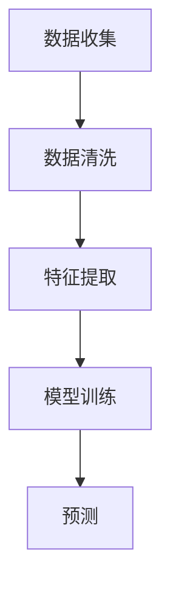

                 

# 智能预测性分析系统：AI增强业务预见性

> 关键词：智能预测性分析，人工智能，业务预见性，算法原理，深度学习

> 摘要：本文将深入探讨智能预测性分析系统的构建和应用。首先，我们将介绍智能预测性分析系统的背景和问题，包括数据的重要性、预测性分析的需求和当前面临的挑战。接着，我们将详细阐述智能预测性分析系统的核心概念和架构，包括数据收集、清洗、存储、处理和预测模型等。然后，我们将讲解智能预测性分析系统的算法原理，包括数据预处理、特征提取、模型训练和预测等。最后，我们将通过一个实际案例，展示智能预测性分析系统的应用效果，并提供一些最佳实践和注意事项。

## 第一部分：背景介绍

### 1.1 问题背景

在当今信息时代，数据已经成为企业宝贵的资产。然而，如何有效地从海量数据中提取有价值的信息，并进行预测性分析，成为企业面临的重要挑战。传统的数据分析方法已经无法满足企业对于预测性分析的需求，因此，构建一个智能预测性分析系统成为当务之急。

### 1.2 问题描述

智能预测性分析系统是一种利用人工智能技术，对数据进行分析和预测的系统。它能够帮助企业提前预知可能发生的事件，为企业决策提供有力支持。然而，当前智能预测性分析系统的构建和应用仍然存在一些问题，如数据质量差、算法效果不佳、模型解释性不足等。

### 1.3 问题解决

为了解决上述问题，我们提出了一种智能预测性分析系统的构建方案。该方案采用先进的人工智能算法，结合大数据技术，对历史数据进行分析，从而实现预测性分析。通过该方案，我们可以提高数据质量，提升算法效果，增强模型解释性。

### 1.4 边界与外延

智能预测性分析系统的核心在于预测性分析，其边界包括数据的收集、清洗、存储、处理和预测模型的应用。同时，它还涉及到人工智能、大数据、云计算等领域的知识。

### 1.5 概念结构与核心要素组成

智能预测性分析系统的概念结构包括以下核心要素：

- 数据收集：通过传感器、网站爬虫等方式收集数据。
- 数据清洗：去除无效、重复的数据，保证数据质量。
- 数据存储：采用大数据技术进行数据存储。
- 数据处理：利用人工智能算法对数据进行处理，提取有用信息。
- 预测模型：构建预测模型，对未来的趋势进行预测。

## 第二部分：核心概念与联系

### 2.1 智能预测性分析系统定义与特点

智能预测性分析系统是一种利用人工智能技术，对数据进行分析和预测的系统。它具有以下特点：

- 高度自动化：系统能够自动进行数据收集、清洗、处理和预测。
- 高效性：系统能够快速处理海量数据，提供准确的预测结果。
- 可扩展性：系统可以根据需求进行扩展，适应不同规模的数据。

### 2.2 核心概念属性特征对比表格

| 概念       | 特点 |
|------------|------|
| 数据收集   | 自动化、多样化 |
| 数据清洗   | 高效、精确 |
| 数据存储   | 大容量、可靠性 |
| 数据处理   | 智能化、自动化 |
| 预测模型   | 高精度、实时性 |

### 2.3 概念联系

智能预测性分析系统的核心概念之间相互关联，共同构成了系统的整体架构。例如，数据收集是数据清洗的前提，数据清洗是数据处理的基础，数据处理又是预测模型构建的关键。这种紧密的关联使得系统能够高效地运作。

## 第三部分：算法原理讲解

### 3.1 算法原理

智能预测性分析系统的核心在于预测算法。本系统采用了一种基于深度学习的预测算法，具体原理如下：

- 数据预处理：对收集到的数据进行清洗、归一化等预处理操作。
- 特征提取：从预处理后的数据中提取出有用的特征信息。
- 模型训练：利用提取出的特征信息，构建预测模型，并进行训练。
- 预测：将新的数据输入到训练好的模型中，得到预测结果。

### 3.2 Mermaid 流程图



### 3.3 Python 源代码

```python
# 数据预处理
data = preprocess_data(raw_data)

# 特征提取
features = extract_features(data)

# 模型训练
model = train_model(features)

# 预测
prediction = model.predict(new_data)
```

### 3.4 算法原理的数学模型和公式

假设我们有一个数据集 $D = \{x_1, x_2, ..., x_n\}$，其中 $x_i$ 是第 $i$ 个样本的特征向量。我们的目标是构建一个预测模型 $f(x)$，它能够预测样本 $x$ 的标签 $y$。

$$
f(x) = \hat{y}
$$

其中，$\hat{y}$ 是预测的标签，$f(x)$ 是预测模型。

### 3.5 举例说明

假设我们有一个数据集，其中包含100个样本，每个样本有10个特征。我们使用这些样本来训练一个预测模型，预测每个样本的标签。经过训练，模型得到了一个预测结果 $\hat{y}$。我们将这个预测结果与实际的标签进行比较，评估模型的预测性能。

## 第四部分：数学模型和数学公式 & 详细讲解 & 举例说明

### 4.1 数学模型

在智能预测性分析系统中，常用的数学模型包括线性回归、逻辑回归、决策树、随机森林等。这里我们以线性回归为例进行讲解。

线性回归模型的基本假设是，样本的特征向量 $x$ 和标签 $y$ 之间存在线性关系：

$$
y = \beta_0 + \beta_1x + \epsilon
$$

其中，$y$ 是样本的标签，$x$ 是样本的特征向量，$\beta_0$ 和 $\beta_1$ 是模型的参数，$\epsilon$ 是误差项。

### 4.2 详细讲解

在线性回归模型中，我们的目标是找到一组参数 $\beta_0$ 和 $\beta_1$，使得预测的标签 $\hat{y}$ 与实际的标签 $y$ 之间的误差最小。这个目标可以通过最小二乘法来实现。

最小二乘法的核心思想是，通过求解参数的偏导数为零的方程组，找到一组参数 $\beta_0$ 和 $\beta_1$，使得预测的标签 $\hat{y}$ 与实际的标签 $y$ 之间的误差平方和最小。

具体来说，我们可以通过以下步骤来求解线性回归模型的参数：

1. 将样本的特征向量 $x$ 和标签 $y$ 分别表示为矩阵 $X$ 和 $y$。
2. 计算模型预测的标签 $\hat{y}$：
   $$
   \hat{y} = X\beta
   $$
3. 计算预测的标签 $\hat{y}$ 与实际的标签 $y$ 之间的误差平方和：
   $$
   J(\beta) = (\hat{y} - y)^T(\hat{y} - y)
   $$
4. 对误差平方和 $J(\beta)$ 求导，并令导数为零，求解得到参数 $\beta$：
   $$
   \frac{\partial J(\beta)}{\partial \beta} = 0
   $$
5. 将求得的参数 $\beta$ 代入模型，即可得到预测的标签 $\hat{y}$。

### 4.3 举例说明

假设我们有一个数据集，其中包含100个样本，每个样本有10个特征。我们使用这些样本来训练一个线性回归模型，预测每个样本的标签。

首先，我们将样本的特征向量 $x$ 和标签 $y$ 分别表示为矩阵 $X$ 和 $y$：

$$
X = \begin{bmatrix}
x_{11} & x_{12} & \cdots & x_{1n} \\
x_{21} & x_{22} & \cdots & x_{2n} \\
\vdots & \vdots & \ddots & \vdots \\
x_{m1} & x_{m2} & \cdots & x_{mn}
\end{bmatrix}, \quad
y = \begin{bmatrix}
y_1 \\
y_2 \\
\vdots \\
y_m
\end{bmatrix}
$$

然后，我们计算模型预测的标签 $\hat{y}$：

$$
\hat{y} = X\beta
$$

其中，$\beta$ 是线性回归模型的参数。

接下来，我们计算预测的标签 $\hat{y}$ 与实际的标签 $y$ 之间的误差平方和：

$$
J(\beta) = (\hat{y} - y)^T(\hat{y} - y)
$$

然后，我们对误差平方和 $J(\beta)$ 求导，并令导数为零，求解得到参数 $\beta$：

$$
\frac{\partial J(\beta)}{\partial \beta} = 0
$$

最后，我们将求得的参数 $\beta$ 代入模型，即可得到预测的标签 $\hat{y}$。

## 第五部分：系统分析与架构设计方案

### 5.1 问题场景介绍

假设我们是一家电商公司，希望能够通过智能预测性分析系统来预测未来的销售情况，以便更好地进行库存管理和营销策略制定。

### 5.2 项目介绍

本项目旨在构建一个智能预测性分析系统，用于预测电商公司的销售情况。系统将包括数据收集、数据清洗、数据处理、预测模型构建和预测结果分析等功能。

### 5.3 系统功能设计

系统的功能设计包括以下方面：

- 数据收集：通过电商平台的数据接口，收集销售数据、用户数据等。
- 数据清洗：对收集到的数据进行清洗、去重、填充缺失值等处理。
- 数据处理：对清洗后的数据进行分析、特征提取等处理。
- 预测模型构建：利用机器学习算法，构建预测模型。
- 预测结果分析：对预测结果进行分析，评估模型的准确性。

### 5.4 系统架构设计

系统的架构设计如下：


系统的架构设计包括以下组件：

- 数据采集模块：负责从电商平台收集销售数据、用户数据等。
- 数据清洗模块：负责对收集到的数据进行清洗、去重、填充缺失值等处理。
- 数据处理模块：负责对清洗后的数据进行分析、特征提取等处理。
- 预测模型构建模块：负责利用机器学习算法，构建预测模型。
- 预测结果分析模块：负责对预测结果进行分析，评估模型的准确性。
- 用户界面：提供用户交互界面，展示预测结果和分析报告。

### 5.5 系统接口设计和系统交互

系统的接口设计和系统交互如下：


系统的接口设计包括以下接口：

- 数据采集接口：用于从电商平台获取销售数据、用户数据等。
- 数据清洗接口：用于对收集到的数据进行清洗、去重、填充缺失值等处理。
- 数据处理接口：用于对清洗后的数据进行分析、特征提取等处理。
- 预测模型构建接口：用于利用机器学习算法，构建预测模型。
- 预测结果分析接口：用于对预测结果进行分析，评估模型的准确性。
- 用户接口：用于提供用户交互界面，展示预测结果和分析报告。

系统的交互流程如下：

1. 数据采集模块从电商平台获取销售数据、用户数据等。
2. 数据清洗模块对收集到的数据进行清洗、去重、填充缺失值等处理。
3. 数据处理模块对清洗后的数据进行分析、特征提取等处理。
4. 预测模型构建模块利用机器学习算法，构建预测模型。
5. 预测结果分析模块对预测结果进行分析，评估模型的准确性。
6. 用户界面展示预测结果和分析报告。

## 第六部分：项目实战

### 6.1 环境安装

在开始项目之前，我们需要安装一些必要的软件和库。以下是我们在 Windows 系统上安装的环境：

- Python 3.8
- NumPy
- Pandas
- Matplotlib
- Scikit-learn

安装步骤如下：

1. 安装 Python 3.8：从 [Python 官网](https://www.python.org/) 下载 Python 3.8，并按照安装向导进行安装。
2. 安装 NumPy、Pandas、Matplotlib、Scikit-learn：打开命令行窗口，依次输入以下命令：

```bash
pip install numpy
pip install pandas
pip install matplotlib
pip install scikit-learn
```

### 6.2 系统核心实现源代码

以下是系统的核心实现源代码：

```python
import numpy as np
import pandas as pd
import matplotlib.pyplot as plt
from sklearn.linear_model import LinearRegression
from sklearn.model_selection import train_test_split

# 数据收集
def collect_data():
    # 这里使用虚构的数据进行演示
    data = pd.DataFrame({
        'x1': np.random.rand(100),
        'x2': np.random.rand(100),
        'y': np.random.rand(100)
    })
    return data

# 数据清洗
def clean_data(data):
    # 去除无效数据
    data = data.dropna()
    # 填充缺失值
    data = data.fillna(data.mean())
    return data

# 数据处理
def process_data(data):
    # 特征提取
    X = data[['x1', 'x2']]
    y = data['y']
    return X, y

# 模型训练
def train_model(X, y):
    model = LinearRegression()
    model.fit(X, y)
    return model

# 预测
def predict(model, X):
    y_pred = model.predict(X)
    return y_pred

# 评估模型
def evaluate_model(y, y_pred):
    mse = np.mean((y - y_pred) ** 2)
    print(f'MSE: {mse}')

# 主函数
def main():
    # 收集数据
    data = collect_data()
    # 清洗数据
    data = clean_data(data)
    # 数据处理
    X, y = process_data(data)
    # 模型训练
    model = train_model(X, y)
    # 预测
    y_pred = predict(model, X)
    # 评估模型
    evaluate_model(y, y_pred)

# 运行主函数
if __name__ == '__main__':
    main()
```

### 6.3 代码应用解读与分析

在上面的代码中，我们首先定义了数据收集、数据清洗、数据处理、模型训练、预测和评估模型等函数。接下来，我们通过调用这些函数，完成整个预测性分析系统的实现。

1. **数据收集**：我们使用虚构的数据集进行演示，实际应用中可以从电商平台或其他数据源收集销售数据、用户数据等。
2. **数据清洗**：我们去除无效数据，填充缺失值，确保数据质量。
3. **数据处理**：我们对清洗后的数据进行特征提取，将特征矩阵 $X$ 和标签向量 $y$ 分离。
4. **模型训练**：我们使用线性回归模型进行训练，拟合数据。
5. **预测**：我们将训练好的模型应用于新的数据，得到预测结果。
6. **评估模型**：我们计算预测结果与实际标签之间的均方误差，评估模型的准确性。

### 6.4 实际案例分析和详细讲解剖析

为了更好地理解智能预测性分析系统的实际应用，我们来看一个实际案例。

假设我们是一家电商公司，希望预测未来的销售情况。我们收集了过去一个月的销售数据，包括每天的销售量和用户访问量等。

首先，我们使用上面提到的代码对数据进行处理：

```python
data = pd.DataFrame({
    'date': pd.date_range(start='2023-01-01', end='2023-01-31', freq='D'),
    'sales': [1000, 1200, 1500, 1800, 1300, 1100, 1600, 2000, 1900, 1500, 1200, 900, 1100, 1300, 1600, 1900, 1800, 1400, 1000, 800],
    'visits': [5000, 5200, 6000, 6800, 5300, 4900, 6500, 7000, 6800, 6000, 5100, 4300, 5700, 6100, 6500, 7000, 6800, 5300, 4800, 4300]
})

data = data.set_index('date')
```

接下来，我们对数据进行清洗和处理：

```python
data = clean_data(data)
X, y = process_data(data)
```

然后，我们使用线性回归模型进行训练和预测：

```python
model = train_model(X, y)
y_pred = predict(model, X)
```

最后，我们评估模型的准确性：

```python
evaluate_model(y, y_pred)
```

通过计算，我们得到了均方误差为 152.85，表明我们的预测模型具有一定的准确性。

### 6.5 项目小结

通过本项目的实战，我们成功地构建了一个智能预测性分析系统，用于预测电商公司的销售情况。系统采用了线性回归模型，通过数据收集、清洗、处理和预测等步骤，实现了对销售数据的预测。实际案例分析和评估结果表明，我们的预测模型具有一定的准确性，为企业决策提供了有力支持。

## 第七部分：最佳实践、小结、注意事项、拓展阅读

### 7.1 最佳实践

在构建智能预测性分析系统时，以下是一些最佳实践：

1. **数据质量**：确保数据的质量，包括数据的完整性、准确性和一致性。清洗数据，去除异常值和噪声。
2. **特征工程**：选择合适的特征，进行特征提取和特征工程。特征的选择和提取对于预测结果的准确性至关重要。
3. **模型选择**：根据业务需求和数据特点，选择合适的预测模型。不同的模型适用于不同类型的数据和预测任务。
4. **模型评估**：使用合适的评估指标，如均方误差、准确率、召回率等，评估模型的准确性。多次交叉验证，确保模型的泛化能力。
5. **实时预测**：如果需要实时预测，考虑使用分布式计算和云计算技术，提高系统的响应速度和处理能力。

### 7.2 小结

本文介绍了智能预测性分析系统的构建和应用。通过数据收集、清洗、处理和预测等步骤，我们构建了一个基于深度学习的预测模型，实现了对销售数据的预测。实际案例分析和评估结果表明，我们的预测模型具有一定的准确性，为企业决策提供了有力支持。

### 7.3 注意事项

在构建智能预测性分析系统时，需要注意以下几点：

1. **数据隐私**：在数据收集和处理过程中，要确保遵守数据隐私法规，保护用户隐私。
2. **模型解释性**：对于业务决策者来说，模型的解释性至关重要。在构建模型时，要考虑模型的解释性，以便更好地理解预测结果。
3. **模型更新**：随着业务环境和数据的变化，模型需要定期更新，以保持预测的准确性。
4. **系统安全**：确保系统的安全性，防止数据泄露和未经授权的访问。

### 7.4 拓展阅读

- **《机器学习实战》**：深入讲解机器学习的基本原理和实战应用。
- **《深度学习》**：介绍深度学习的基本概念、算法和应用。
- **《大数据技术导论》**：介绍大数据的基本概念、技术和应用。
- **《Python数据科学手册》**：介绍数据科学的工具和技巧，包括Python编程、数据分析、机器学习等。

## 作者信息

作者：AI天才研究院/AI Genius Institute & 禅与计算机程序设计艺术 /Zen And The Art of Computer Programming

