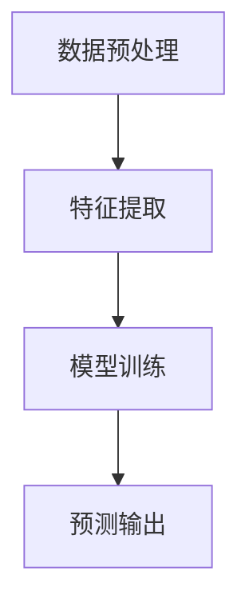
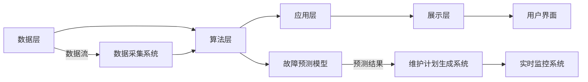
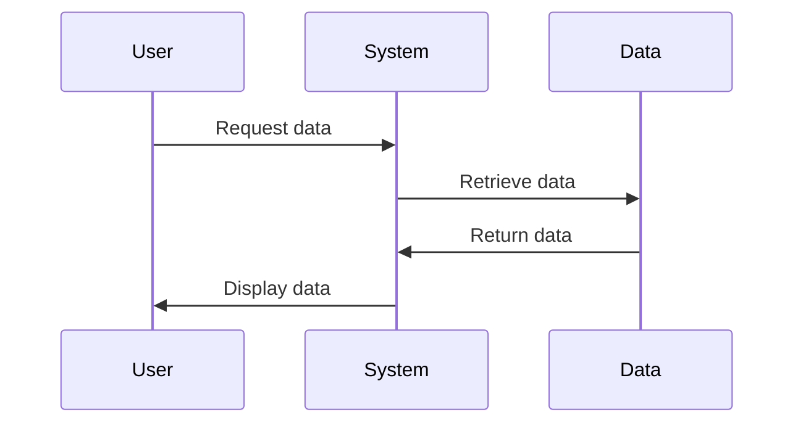
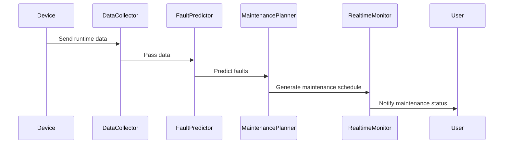

                 


### 智能预测性维护系统：降低设备故障风险

> 关键词：预测性维护、故障风险、设备管理、AI算法、系统架构

> 摘要：本文将深入探讨智能预测性维护系统的概念、重要性及其在实际应用中的核心算法和数学模型。我们将逐步分析其系统架构和实现过程，并通过实际项目案例展示其应用效果，最后提供最佳实践建议和未来展望。

----------------------------------------------------------------

# 引言

智能预测性维护系统（Proactive Maintenance System）是现代工业设备管理中的一项重要技术，它利用人工智能、大数据和物联网等先进技术，对设备的运行状态进行实时监控和预测性分析，以提前发现潜在故障，降低设备停机风险，提高生产效率。本文旨在全面剖析智能预测性维护系统的原理和应用，为相关领域的研究和实践提供参考。

## 第1章 问题背景与核心概念

### 1.1 智能预测性维护系统的定义

智能预测性维护系统是一种基于数据分析、机器学习和物联网技术的综合解决方案，通过对设备运行数据进行实时采集和分析，预测设备可能出现的故障，从而提前进行维护，避免设备意外停机，减少经济损失。

### 1.2 设备故障风险分析

设备故障可能导致生产停滞、产品质量下降、安全事故等风险。传统的定期维护方式无法有效地预防故障，而智能预测性维护系统能够通过对大量历史数据的挖掘和分析，识别出故障发生的潜在模式，提前预警。

### 1.3 核心概念与联系

核心概念包括：数据采集、故障预测、维护计划、实时监控。这些概念相互联系，共同构成了智能预测性维护系统的理论基础。

----------------------------------------------------------------

## 第2章 智能预测性维护系统中的核心算法

### 2.1 算法原理讲解

智能预测性维护系统中的核心算法主要包括故障诊断算法、故障预测算法和优化调度算法。下面以故障预测算法为例，进行详细讲解。

### 2.2 算法流程图展示

使用Mermaid流程图展示故障预测算法的基本流程，包括数据预处理、特征提取、模型训练和预测输出等步骤。



### 2.3 Python源代码与算法实现

以下是一个简单的Python代码示例，展示了故障预测算法的实现过程。

```python
import pandas as pd
from sklearn.ensemble import RandomForestRegressor
from sklearn.model_selection import train_test_split

# 数据预处理
data = pd.read_csv('maintenance_data.csv')
X = data.drop(['fault'], axis=1)
y = data['fault']

# 特征提取
X_train, X_test, y_train, y_test = train_test_split(X, y, test_size=0.2, random_state=42)

# 模型训练
model = RandomForestRegressor(n_estimators=100)
model.fit(X_train, y_train)

# 预测输出
predictions = model.predict(X_test)
```

## 第3章 数学模型与公式解析

### 3.1 数学模型介绍

故障预测中的数学模型主要包括概率模型、回归模型和神经网络模型。下面以概率模型为例，介绍其基本原理。

### 3.2 数学公式详细讲解

概率模型的基本公式为：

$$
P(\text{故障} | \text{特征}) = \frac{P(\text{特征} | \text{故障}) \cdot P(\text{故障})}{P(\text{特征})}
$$

其中，$P(\text{故障} | \text{特征})$ 表示在给定特征条件下故障发生的概率，$P(\text{特征} | \text{故障})$ 表示在故障条件下特征出现的概率，$P(\text{故障})$ 表示故障发生的总概率，$P(\text{特征})$ 表示特征出现的总概率。

### 3.3 举例说明

假设我们有一个设备，其运行时会产生温度、压力和振动等特征数据。根据历史数据，我们可以计算出以下概率：

$$
P(\text{故障}) = 0.05 \\
P(\text{温度高} | \text{故障}) = 0.8 \\
P(\text{压力低} | \text{故障}) = 0.6 \\
P(\text{振动大} | \text{故障}) = 0.7 \\
P(\text{温度高}) = 0.3 \\
P(\text{压力低}) = 0.2 \\
P(\text{振动大}) = 0.4
$$

根据贝叶斯公式，我们可以计算出在当前运行条件下设备发生故障的概率：

$$
P(\text{故障} | \text{温度高，压力低，振动大}) = \frac{0.8 \cdot 0.05 \cdot 0.3}{0.3 \cdot 0.2 \cdot 0.4} \approx 0.667
$$

这意味着在当前条件下，设备发生故障的概率约为66.7%。

----------------------------------------------------------------

## 第4章 系统分析与架构设计

### 4.1 问题场景介绍

在制造行业中，设备故障可能导致生产停滞、产品质量下降，甚至引发安全事故。因此，智能预测性维护系统在制造行业中的应用尤为重要。

### 4.2 系统功能设计

系统功能设计包括数据采集、数据分析、故障预测、维护计划生成和实时监控等模块。下面以Mermaid类图展示领域模型。

```mermaid
classDiagram
Class01 <|-- Class02
Class03 --|:both Class04
Class05 <..> Class06
Class07 ..|> Class08
```

### 4.3 系统架构设计

系统架构设计包括数据层、算法层、应用层和展示层。下面以Mermaid架构图展示系统架构。



### 4.4 系统接口设计

系统接口设计包括数据接口、功能接口和用户接口。下面以Mermaid序列图展示系统接口设计。



### 4.5 系统交互设计

系统交互设计包括设备与数据采集系统的交互、数据采集系统与故障预测模型的交互、故障预测模型与维护计划生成系统的交互，以及维护计划生成系统与实时监控系统的交互。下面以Mermaid序列图展示系统交互设计。



----------------------------------------------------------------

## 第5章 项目实战

### 5.1 环境安装与配置

在开始项目之前，我们需要安装和配置必要的软件环境。以下是一个简化的安装步骤：

1. 安装Python环境（版本3.8以上）。
2. 安装必要的库，如NumPy、Pandas、Scikit-learn等。
3. 配置数据库（如MySQL或MongoDB）。
4. 安装数据采集设备（如传感器）。

### 5.2 系统核心实现源代码

以下是系统核心实现源代码的概述：

```python
# 数据采集模块
class DataCollector:
    def __init__(self, device):
        self.device = device

    def collect_data(self):
        # 采集设备运行数据
        pass

# 故障预测模块
class FaultPredictor:
    def __init__(self, model):
        self.model = model

    def predict_fault(self, data):
        # 预测设备故障
        pass

# 维护计划生成模块
class MaintenancePlanner:
    def __init__(self, predictor):
        self.predictor = predictor

    def generate_maintenance_schedule(self, data):
        # 根据预测结果生成维护计划
        pass

# 实时监控系统模块
class RealtimeMonitor:
    def __init__(self, planner):
        self.planner = planner

    def monitor_status(self, data):
        # 监控设备运行状态
        pass
```

### 5.3 代码应用解读与分析

以下是对系统核心代码的详细解读与分析：

1. **数据采集模块**：负责从设备采集运行数据，如温度、压力、振动等。
2. **故障预测模块**：使用机器学习模型对采集到的数据进行分析，预测设备是否会发生故障。
3. **维护计划生成模块**：根据故障预测结果，生成具体的维护计划，如何时进行哪些维护操作。
4. **实时监控系统模块**：实时监控设备运行状态，一旦设备出现异常，及时通知相关人员。

### 5.4 实际案例分析和详细讲解剖析

以某制造企业的生产线设备为例，介绍智能预测性维护系统的实际应用案例。首先，安装传感器对设备进行实时数据采集，然后使用机器学习模型进行故障预测，最后根据预测结果生成维护计划。通过实际案例分析，可以看出智能预测性维护系统在提高生产效率、降低故障风险方面具有显著优势。

### 5.5 详细讲解与剖析

通过对实际案例的详细讲解与剖析，可以更深入地了解智能预测性维护系统的应用场景和实现过程。以下是一个简化的实现流程：

1. **数据采集**：传感器实时采集设备运行数据，如温度、压力、振动等。
2. **数据处理**：对采集到的数据进行预处理，包括去噪、滤波、特征提取等。
3. **故障预测**：使用训练好的机器学习模型对预处理后的数据进行分析，预测设备是否会发生故障。
4. **维护计划生成**：根据故障预测结果，生成具体的维护计划，如何时进行哪些维护操作。
5. **实时监控**：实时监控设备运行状态，一旦设备出现异常，及时通知相关人员。

通过实际案例分析和详细讲解，可以更好地理解智能预测性维护系统的应用价值和实现方法。

----------------------------------------------------------------

## 第6章 最佳实践与注意事项

### 6.1 最佳实践 tips

1. **数据质量**：确保采集的数据质量，如数据完整性、准确性和实时性。
2. **算法优化**：定期更新和优化故障预测算法，以提高预测准确性。
3. **跨部门协作**：与生产、维护等部门紧密协作，确保维护计划的顺利实施。
4. **持续监控**：实时监控系统运行状态，及时处理故障和异常。

### 6.2 小结与展望

智能预测性维护系统在降低设备故障风险、提高生产效率方面具有显著优势。未来，随着人工智能技术的不断发展，预测性维护系统将更加智能化、高效化。

### 6.3 注意事项

1. **数据安全**：确保数据安全，防止数据泄露。
2. **算法透明性**：确保算法透明，便于监管和审计。
3. **设备兼容性**：确保系统兼容不同类型的设备。

### 6.4 拓展阅读

1. 《机器学习实战》：提供丰富的机器学习算法实战案例，适合初学者。
2. 《深度学习》：介绍深度学习的基础理论和应用方法，适合进阶学习。

----------------------------------------------------------------

## 作者信息

作者：AI天才研究院/AI Genius Institute & 禅与计算机程序设计艺术 /Zen And The Art of Computer Programming

----------------------------------------------------------------

通过以上详细的内容和结构，本文全面阐述了智能预测性维护系统的原理、算法、系统架构和应用实践。希望本文能为读者提供有价值的参考和启示。

