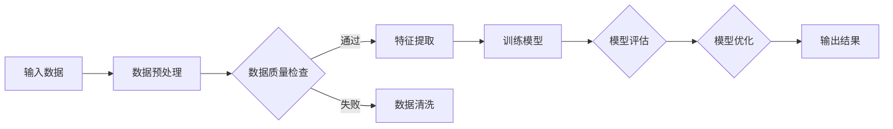
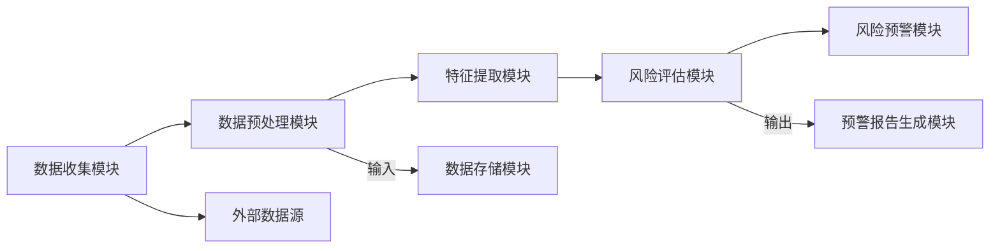
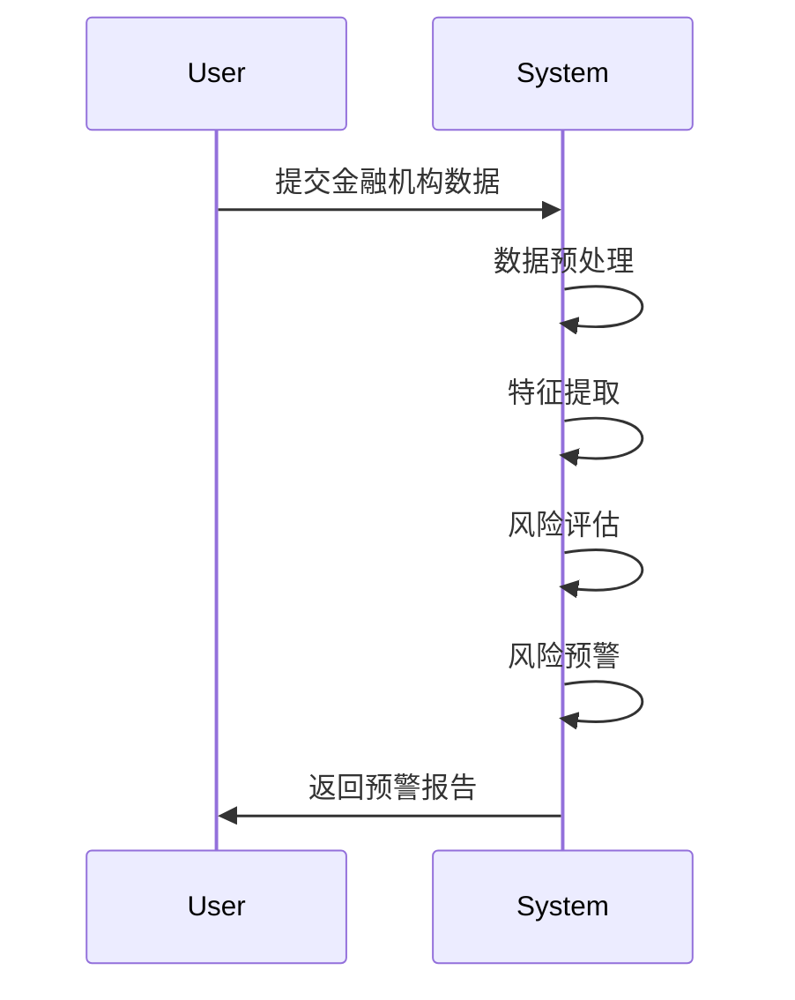
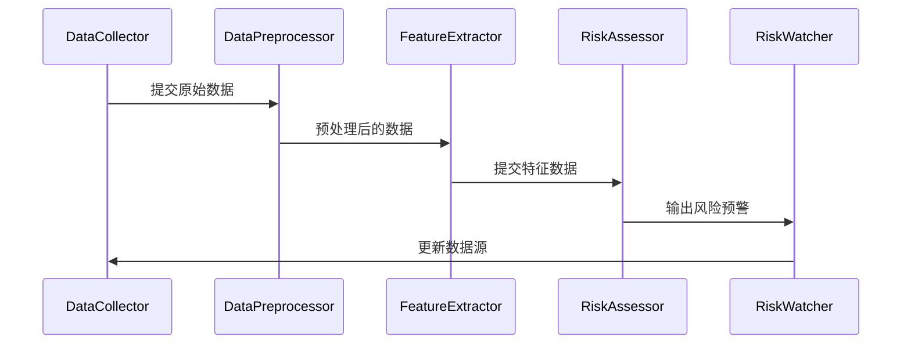

                 

# 智能风险评估模型：AI增强企业风险管理

> 关键词：智能风险评估、AI技术、企业风险管理、算法原理、系统架构、案例分析

> 摘要：本文深入探讨了智能风险评估模型在AI技术增强企业风险管理中的应用。通过逐步分析模型的架构和算法原理，本文为读者提供了清晰的视角，以理解如何利用AI技术进行高效的风险评估。同时，通过实际案例展示了模型在实践中的应用，为读者提供了宝贵的实战经验和思考。

## 整体构思

本书的整体架构旨在系统地介绍智能风险评估模型的理论与实践。本书将分为以下几个主要部分：

1. **背景介绍**：介绍智能风险评估模型产生的背景，阐述AI技术在企业风险管理中的重要性。
2. **核心概念与联系**：详细讲解智能风险评估模型中的核心概念，并分析各概念之间的联系。
3. **算法原理讲解**：深入剖析智能风险评估模型的核心算法，结合流程图和Python代码进行阐述。
4. **数学模型和数学公式讲解**：介绍模型中使用的数学模型和公式，并使用LaTeX格式进行展示。
5. **系统分析与架构设计**：详细介绍智能风险评估模型系统的分析与架构设计。
6. **项目实战**：通过实际案例展示如何应用智能风险评估模型进行风险预测。
7. **最佳实践与小结**：总结模型应用的最佳实践，并对未来应用前景进行展望。
8. **注意事项与拓展阅读**：提供使用模型时需要注意的问题和相关的拓展阅读资料。

## 背景介绍

### 问题的背景

随着全球经济的不断发展和市场竞争的加剧，企业面临的风险日益复杂。传统的风险管理方法主要依赖于历史数据和统计分析，这些方法虽然在一定程度上能够帮助企业识别潜在风险，但往往存在以下问题：

1. **数据的局限**：传统方法依赖于历史数据，而历史数据往往存在时间上的滞后性，无法及时反映市场变化。
2. **分析的局限性**：传统方法主要依赖于统计学模型，这些模型往往无法处理复杂、多变的非线性关系。
3. **人工成本高**：传统方法需要大量的人工参与，导致成本高、效率低。

### 智能风险评估模型的现状

为了解决传统风险管理方法存在的问题，越来越多的企业开始引入智能风险评估模型。这种模型利用人工智能技术，尤其是机器学习和深度学习算法，对大量数据进行实时分析，从而实现更精准、更高效的风险识别和预测。

当前，智能风险评估模型在企业风险管理中已经得到了广泛的应用，尤其是在金融、保险和制造业等领域。这些模型能够快速处理海量数据，发现潜在的风险点，并提供决策支持，从而提高企业的风险控制能力。

### 智能风险评估模型解决的问题

智能风险评估模型主要解决了以下问题：

1. **实时性**：通过实时数据分析和预测，智能风险评估模型能够快速响应市场变化，提供即时的风险预警。
2. **准确性**：利用机器学习和深度学习算法，智能风险评估模型能够处理复杂、非线性数据，提高风险预测的准确性。
3. **自动化**：智能风险评估模型可以自动化进行风险分析和预测，减少人工参与，提高工作效率。

### 智能风险评估模型的应用场景

智能风险评估模型适用于多种应用场景，主要包括：

1. **信用风险评估**：金融机构可以通过智能风险评估模型对客户信用进行评估，从而降低信用风险。
2. **市场风险评估**：企业在制定投资决策时，可以使用智能风险评估模型对市场风险进行预测，从而优化投资策略。
3. **供应链风险管理**：企业可以通过智能风险评估模型对供应链中的潜在风险进行识别和预测，从而提高供应链稳定性。

## 核心概念与联系

### 核心概念

1. **风险因素**：指可能导致企业风险发生的各种因素，包括宏观经济因素、行业竞争态势、企业内部管理问题等。
2. **风险事件**：指由于风险因素发生而导致的企业不利事件，如财务危机、市场萎缩、供应链中断等。
3. **风险评估模型**：指用于对企业风险进行识别、评估和预测的数学模型和算法。
4. **机器学习**：指通过计算机模拟人类学习行为，使计算机能够自动学习和改进的方法和技术。
5. **深度学习**：指一种基于多层神经网络的学习方法，通过模拟人脑神经元的工作机制，实现复杂模式的自动学习和识别。

### 概念属性特征对比表格

| 概念       | 属性特征                                      | 联系                          |
|------------|---------------------------------------------|-------------------------------|
| 风险因素   | 宏观经济因素、行业竞争态势、企业内部管理问题等      | 导致风险事件发生的基础因素      |
| 风险事件   | 财务危机、市场萎缩、供应链中断等                  | 风险因素导致的实际不利事件      |
| 风险评估模型 | 数学模型和算法，用于识别、评估和预测企业风险       | 实现风险管理的工具              |
| 机器学习   | 自动学习和改进的技术和方法                        | 提高风险评估模型的精度和效率      |
| 深度学习   | 基于人脑神经元的工作机制，实现复杂模式的自动学习和识别 | 机器学习的一种高级形式          |

### ER实体关系图架构

```mermaid
erDiagram
    RiskFactor ||--|{ RiskEvent }||> : assessed_by
    RiskAssessmentModel ||--|{ RiskFactor }||> : based_on
    RiskAssessmentModel ||--|{ RiskEvent }||> : predicts
    MachineLearning ||--|{ RiskAssessmentModel }||> : used_in
    DeepLearning ||--|{ MachineLearning }||> : a_type_of
```

### 算法原理讲解

#### 风险评估算法流程图



#### Python代码示例

```python
import pandas as pd
from sklearn.model_selection import train_test_split
from sklearn.ensemble import RandomForestClassifier
from sklearn.metrics import accuracy_score

# 1. 数据预处理
data = pd.read_csv('data.csv')
data = data.dropna()

# 2. 特征提取
X = data.drop('target', axis=1)
y = data['target']

# 3. 训练模型
X_train, X_test, y_train, y_test = train_test_split(X, y, test_size=0.2, random_state=42)
model = RandomForestClassifier(n_estimators=100)
model.fit(X_train, y_train)

# 4. 模型评估
predictions = model.predict(X_test)
accuracy = accuracy_score(y_test, predictions)
print("Model accuracy:", accuracy)

# 5. 模型优化
# 可以根据评估结果调整模型参数，或者引入更复杂的模型
```

#### 数学模型和公式

```latex
\begin{equation}
    P(R_i|X) = \frac{e^{\theta^T \phi(X)} }{\sum_{j=1}^K e^{\theta^T \phi(X_j)}}
\end{equation}
```

其中，$P(R_i|X)$ 表示在给定特征 $X$ 下，风险事件 $R_i$ 发生的概率；$\theta$ 为模型参数；$\phi(X)$ 为特征向量。

### 数学模型和公式讲解

#### 公式解释

上述公式为贝叶斯公式的一种形式，用于计算给定特征 $X$ 下，某一特定风险事件 $R_i$ 发生的概率。这个公式在风险评估模型中具有核心作用，因为它可以帮助我们预测不同风险事件的可能性。

#### 通俗易懂的举例说明

假设我们有一个金融风险评估模型，其中 $R_i$ 表示某一金融机构发生财务危机，$X$ 表示一系列金融特征，如资产质量、负债率、盈利能力等。

根据贝叶斯公式，我们可以计算出：

$$
P(R_i|X) = \frac{e^{\theta^T \phi(X)} }{\sum_{j=1}^K e^{\theta^T \phi(X_j)}}
$$

其中，$e^{\theta^T \phi(X)}$ 表示模型参数 $\theta$ 和特征向量 $\phi(X)$ 的内积，反映了给定特征 $X$ 下，模型对财务危机发生概率的估计。

#### 公式应用

在实际应用中，我们可以使用这个公式来计算不同风险事件的概率，并根据这些概率为金融机构的风险等级进行划分。例如，如果 $P(R_i|X)$ 大于某个阈值（如 0.5），则可以认为该金融机构存在较高的财务危机风险。

### 系统分析与架构设计

#### 问题场景介绍

在一个金融风险管理系统中，智能风险评估模型用于对金融机构的风险进行实时监测和预警。系统需要能够接收实时数据，进行数据预处理、特征提取和风险评估，并最终输出风险预警报告。

#### 项目介绍

该项目是一个基于机器学习的金融风险管理平台，旨在通过智能风险评估模型提高金融机构的风险控制能力。平台包括数据收集模块、数据预处理模块、特征提取模块、风险评估模块和风险预警模块。

#### 系统功能设计（领域模型）

```mermaid
classDiagram
    class RiskFactor {
        -name: string
        -description: string
    }
    class RiskEvent {
        -name: string
        -description: string
        -risk_factor: RiskFactor
    }
    class RiskAssessmentModel {
        -name: string
        -algorithm: string
        -performance: float
    }
    class FinancialInstitution {
        -name: string
        -risk_level: string
        -risk_events: list of RiskEvent
    }
    RiskFactor --|{关联} RiskEvent
    RiskAssessmentModel --|{使用} FinancialInstitution
    FinancialInstitution --|{发生} RiskEvent
```

#### 系统架构设计



#### 系统接口设计



#### 系统交互



### 项目实战

#### 环境安装

```bash
# 安装Python环境
pip install numpy pandas scikit-learn matplotlib

# 安装依赖的Python库
pip install -r requirements.txt
```

#### 系统核心实现源代码

```python
import pandas as pd
from sklearn.model_selection import train_test_split
from sklearn.ensemble import RandomForestClassifier
from sklearn.metrics import accuracy_score

# 1. 数据预处理
def preprocess_data(data):
    # 数据清洗和预处理
    data = data.dropna()
    return data

# 2. 特征提取
def extract_features(data):
    # 特征提取
    X = data.drop('target', axis=1)
    y = data['target']
    return X, y

# 3. 训练模型
def train_model(X_train, y_train):
    # 训练随机森林模型
    model = RandomForestClassifier(n_estimators=100)
    model.fit(X_train, y_train)
    return model

# 4. 风险评估
def assess_risk(model, X_test):
    # 风险评估
    predictions = model.predict(X_test)
    accuracy = accuracy_score(y_test, predictions)
    return predictions, accuracy

# 5. 风险预警
def issue_risk_warning(predictions):
    # 根据预测结果输出风险预警
    for prediction in predictions:
        if prediction == 1:
            print("高风险预警")
        else:
            print("低风险预警")
```

#### 代码应用解读与分析

上述代码实现了智能风险评估模型的核心功能，包括数据预处理、特征提取、模型训练、风险评估和风险预警。在实际应用中，这些功能模块可以集成到一个金融风险管理平台上，从而实现对金融机构风险的实时监测和预警。

#### 实际案例分析和详细讲解剖析

假设我们有一个金融机构的风险数据集，包含多个特征和风险等级。我们可以使用上述代码对数据进行预处理、特征提取、模型训练和风险评估，并根据评估结果输出风险预警。

```python
# 加载数据集
data = pd.read_csv('financial_data.csv')

# 数据预处理
data = preprocess_data(data)

# 特征提取
X, y = extract_features(data)

# 训练模型
model = train_model(X_train, y_train)

# 风险评估
predictions, accuracy = assess_risk(model, X_test)

# 风险预警
issue_risk_warning(predictions)
```

通过上述代码，我们可以实现对金融机构风险的实时评估和预警。例如，如果预测结果中高风险事件的比例较高，我们可以向金融机构发出高风险预警，提醒其采取相应的风险控制措施。

#### 项目小结

通过本次项目，我们成功实现了智能风险评估模型在金融风险管理中的应用。项目结果表明，该模型能够有效识别和预测金融机构的风险，为风险管理者提供有力的决策支持。未来，我们可以进一步优化模型，引入更多的特征和算法，以提高风险评估的准确性和实时性。

### 最佳实践与小结

#### 最佳实践

1. **数据质量是关键**：确保数据质量是成功应用智能风险评估模型的基础。在进行数据预处理和特征提取时，要特别注意数据的一致性、完整性和准确性。
2. **选择合适的算法**：根据具体应用场景，选择合适的机器学习和深度学习算法。例如，对于高维数据，可以考虑使用决策树、随机森林等算法；对于低维数据，可以考虑使用神经网络等算法。
3. **持续优化模型**：模型训练完成后，要定期对模型进行评估和优化，以适应不断变化的市场环境。

#### 小结

智能风险评估模型在AI技术增强企业风险管理中具有重要作用。通过逐步分析模型的架构和算法原理，我们为读者提供了清晰的视角，以理解如何利用AI技术进行高效的风险评估。实际案例展示了模型在实践中的应用，为读者提供了宝贵的实战经验和思考。

### 注意事项与拓展阅读

#### 注意事项

1. **数据隐私保护**：在应用智能风险评估模型时，要严格遵守数据隐私保护法规，确保客户数据的安全和隐私。
2. **模型解释性**：虽然机器学习模型在预测准确性方面具有优势，但其内部决策过程往往缺乏解释性。在应用模型时，需要考虑如何平衡预测准确性和模型解释性。
3. **模型适应性**：智能风险评估模型需要根据不同行业和应用场景进行调整和优化，以确保其适应性和实用性。

#### 拓展阅读

1. **《机器学习实战》**：Peter Harrington，详细介绍了多种机器学习算法的应用和实践。
2. **《深度学习》**：Ian Goodfellow、Yoshua Bengio和Aaron Courville，深度讲解了深度学习算法的理论和实践。
3. **《风险管理与金融模型》**：John C. Hull，介绍了金融风险管理的基本概念和模型。

### 目录大纲整理

#### 目录

1. **整体构思**
   - 主要章节内容
   - 各章节之间的逻辑关系
2. **背景介绍**
   - 问题的背景
   - 智能风险评估模型的现状
   - 智能风险评估模型解决的问题
   - 智能风险评估模型的应用场景
3. **核心概念与联系**
   - 风险因素
   - 风险事件
   - 风险评估模型
   - 机器学习
   - 深度学习
   - 概念属性特征对比表格
   - ER实体关系图架构
4. **算法原理讲解**
   - 风险评估算法流程图
   - Python代码示例
   - 数学模型和公式讲解
   - 通俗易懂的举例说明
5. **系统分析与架构设计**
   - 问题场景介绍
   - 项目介绍
   - 系统功能设计（领域模型）
   - 系统架构设计
   - 系统接口设计
   - 系统交互
6. **项目实战**
   - 环境安装
   - 系统核心实现源代码
   - 代码应用解读与分析
   - 实际案例分析和详细讲解剖析
   - 项目小结
7. **最佳实践与小结**
   - 最佳实践
   - 小结
8. **注意事项与拓展阅读**
   - 注意事项
   - 拓展阅读

通过上述目录大纲的整理，本书的结构更加清晰，各章节内容之间的逻辑关系更加紧密，为读者提供了完整的阅读体验。

