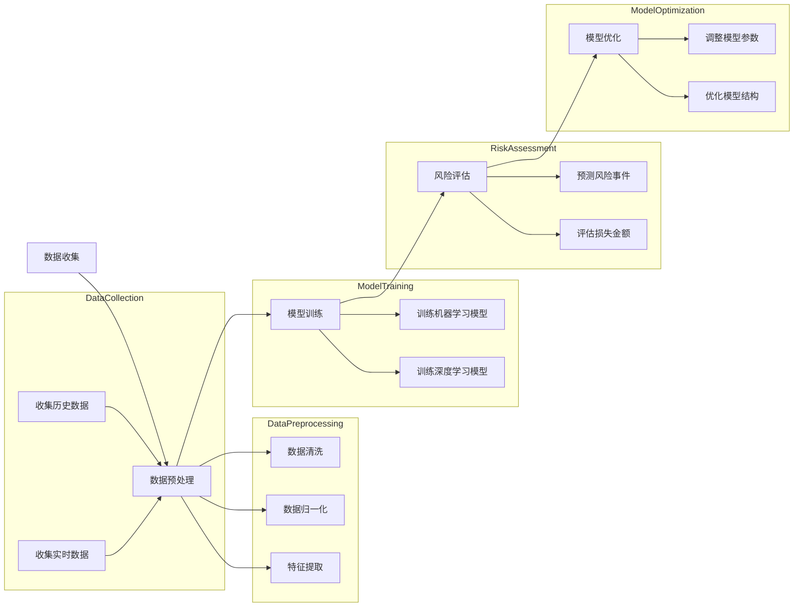
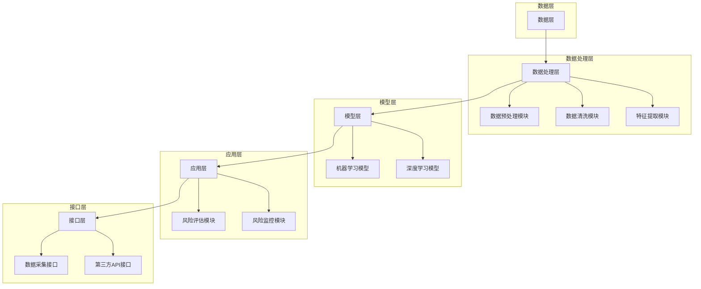
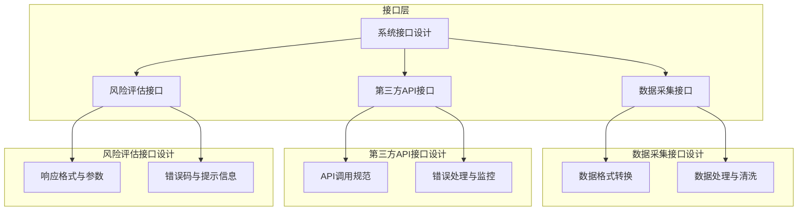
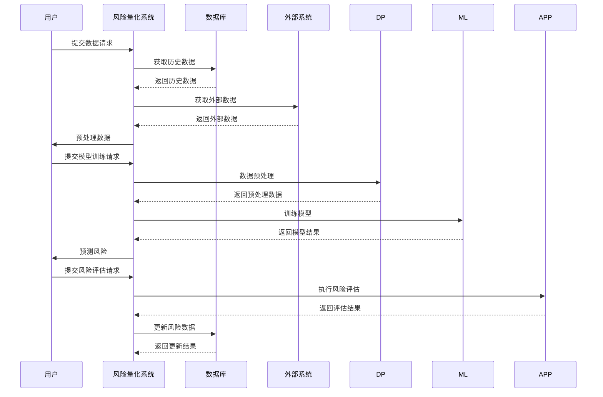

                 

# 智能风险量化模型：AI精准评估企业风险

> 关键词：智能风险量化，AI，企业风险评估，机器学习，算法，数学模型

> 摘要：本文将深入探讨智能风险量化模型，通过AI技术精准评估企业风险。首先介绍风险管理的背景与重要性，然后定义智能风险量化模型的核心概念，分析其算法原理及数学模型，最后通过实际项目实战展示其应用效果。

## 目录大纲设计思路

在设计《智能风险量化模型：AI精准评估企业风险》的目录大纲时，我们遵循了以下原则：

1. **全面覆盖主题内容**：确保每个核心概念、算法原理、数学模型、系统架构、实战案例等内容都有详细的介绍。
2. **逻辑清晰**：每个章节的标题应简洁明了，便于读者快速抓住章节的核心内容。
3. **层次分明**：根据内容的重要性，合理划分章节和子章节，保持目录结构的层次性。
4. **结构完整性**：确保目录大纲的完整性和连贯性，避免章节内容的遗漏或逻辑错误。

### 目录大纲结构设计

为了更好地呈现书籍的结构，我们将目录大纲分为以下几个部分：

- **背景介绍**：简要介绍智能风险量化模型的背景、核心概念、应用领域等。
- **核心概念与联系**：详细阐述智能风险量化模型中的核心概念，并通过对比表格和ER实体关系图来展示概念之间的联系。
- **算法原理讲解**：通过mermaid流程图和Python源代码，深入讲解智能风险量化模型的算法原理，并提供数学模型和公式。
- **数学模型和数学公式**：使用LaTeX格式展示重要的数学公式，并进行详细讲解和举例说明。
- **系统分析与架构设计**：介绍智能风险量化模型的应用场景、系统架构设计、接口设计等，通过mermaid图示来辅助说明。
- **项目实战**：展示一个实际的项目案例，包括环境安装、系统实现源代码、代码应用解读、案例分析和讲解等。
- **最佳实践、小结与拓展**：总结书籍的重点内容，给出最佳实践建议，并提供相关的小结、注意事项和拓展阅读资源。

### 目录大纲示例

**第一部分：背景介绍**

## 第1章：智能风险量化模型概述

### 1.1 问题背景与核心概念

#### 1.1.1 风险管理的必要性

#### 1.1.2 智能风险量化模型的提出

#### 1.1.3 企业风险类型与量化方法

### 1.2 智能风险量化模型的应用领域

#### 1.2.1 金融行业

#### 1.2.2 保险行业

#### 1.2.3 企业风险管理

## 第2章：核心概念与联系

### 2.1 风险量化的概念框架

#### 2.1.1 风险量化的定义

#### 2.1.2 风险量化的目的

#### 2.1.3 风险量化的步骤

### 2.2 关键概念对比表格

#### 2.2.1 风险指标对比

#### 2.2.2 评估方法对比

### 2.3 ER实体关系图

**第二部分：算法原理讲解**

## 第3章：智能风险量化算法原理

### 3.1 算法概述

#### 3.1.1 算法框架

#### 3.1.2 算法目标

#### 3.1.3 算法流程

### 3.2 算法mermaid流程图

### 3.3 Python源代码讲解

#### 3.3.1 数据预处理

#### 3.3.2 模型训练

#### 3.3.3 风险评估

### 3.4 数学模型和公式讲解

#### 3.4.1 风险评估模型的数学模型

#### 3.4.2 公式推导

**第三部分：数学模型和数学公式**

## 第4章：智能风险量化模型的数学基础

### 4.1 数学基础

#### 4.1.1 线性代数基础

#### 4.1.2 概率论基础

#### 4.1.3 统计学基础

### 4.2 重要数学公式

#### 4.2.1 风险度量公式

#### 4.2.2 模型评估指标公式

## 第5章：系统分析与架构设计

### 5.1 应用场景介绍

#### 5.1.1 风险评估系统总体架构

#### 5.1.2 系统功能模块划分

### 5.2 系统架构设计

#### 5.2.1 系统架构概述

#### 5.2.2 架构图展示

### 5.3 系统接口设计

#### 5.3.1 接口功能设计

#### 5.3.2 接口实现细节

### 5.4 系统交互mermaid序列图

**第四部分：项目实战**

## 第6章：智能风险量化模型项目实战

### 6.1 环境安装

#### 6.1.1 硬件要求

#### 6.1.2 软件环境安装

### 6.2 系统核心实现源代码

#### 6.2.1 数据预处理模块

#### 6.2.2 模型训练模块

#### 6.2.3 风险评估模块

### 6.3 代码应用解读与分析

#### 6.3.1 代码结构解析

#### 6.3.2 关键代码解读

### 6.4 实际案例分析与详细讲解

#### 6.4.1 案例背景介绍

#### 6.4.2 案例数据集分析

#### 6.4.3 模型训练与评估

### 6.5 项目小结

#### 6.5.1 项目成果总结

#### 6.5.2 不足与改进空间

## 第五部分：最佳实践、小结与拓展

### 第7章：最佳实践

#### 7.1 风险评估中的常见问题与解决方案

#### 7.2 模型优化与调参技巧

#### 7.3 数据采集与处理的最佳实践

### 第8章：小结与注意事项

#### 8.1 智能风险量化模型的核心要点

#### 8.2 注意事项与风险提示

### 第9章：拓展阅读

#### 9.1 相关书籍推荐

#### 9.2 学术论文精选

#### 9.3 常见问题解答

**作者信息**

作者：AI天才研究院/AI Genius Institute & 禅与计算机程序设计艺术 /Zen And The Art of Computer Programming

## 引言

在当今快速发展的商业环境中，企业面临着日益复杂的内外部风险。这些风险可能源于市场波动、技术革新、法规变化、自然灾害等多种因素。对于企业来说，准确评估和有效管理风险是确保长期稳健发展的关键。传统的风险管理方法依赖于人为经验，难以全面、客观地评估风险。随着人工智能（AI）技术的迅猛发展，利用AI技术构建智能风险量化模型已成为一种新的趋势，能够为企业提供更精准、高效的风险评估。

智能风险量化模型通过数据挖掘、机器学习和深度学习等方法，从海量数据中提取有价值的信息，构建出反映风险特征的量化指标，从而帮助企业更好地理解和应对风险。本文将详细介绍智能风险量化模型的背景、核心概念、算法原理、数学模型、系统架构及实际应用，旨在为广大读者提供一份全面、系统的参考指南。

本文结构如下：

1. **背景介绍**：简要介绍风险管理的背景、核心概念和智能风险量化模型的提出及应用领域。
2. **核心概念与联系**：详细阐述智能风险量化模型中的核心概念，并通过对比表格和ER实体关系图展示概念之间的联系。
3. **算法原理讲解**：通过mermaid流程图和Python源代码深入讲解智能风险量化模型的算法原理，并提供数学模型和公式。
4. **数学模型和数学公式**：使用LaTeX格式展示重要的数学公式，并进行详细讲解和举例说明。
5. **系统分析与架构设计**：介绍智能风险量化模型的应用场景、系统架构设计、接口设计等，通过mermaid图示来辅助说明。
6. **项目实战**：展示一个实际的项目案例，包括环境安装、系统实现源代码、代码应用解读、案例分析和讲解等。
7. **最佳实践、小结与拓展**：总结书籍的重点内容，给出最佳实践建议，并提供相关的小结、注意事项和拓展阅读资源。

让我们首先从风险管理的背景入手，逐步深入探讨智能风险量化模型的核心概念和算法原理。

## 1. 背景介绍

### 1.1 风险管理的必要性

在当今复杂多变的经济环境中，企业面临的风险种类繁多，包括市场风险、信用风险、操作风险、法律风险、财务风险等。风险管理作为一种系统化的过程，旨在通过识别、评估、优先排序和应对风险，最大限度地减少风险可能带来的损失。有效的风险管理不仅能帮助企业避免重大损失，还能为企业的长远发展提供保障。

随着全球化进程的加快，企业面临的竞争压力不断增大，市场环境变化迅速，新技术、新政策、新市场的出现都可能导致企业面临未知的潜在风险。此外，自然灾害、疫情等突发事件也对企业运营带来极大挑战。因此，对企业风险进行有效的管理和控制，已经成为现代企业管理的重要内容。

### 1.2 智能风险量化模型的提出

传统的风险管理方法主要依赖于风险管理专家的经验和主观判断，这种方法的局限性在于，它无法处理海量数据的复杂关系，也难以准确预测未来可能发生的风险事件。随着人工智能技术的快速发展，利用AI技术构建智能风险量化模型成为了一种新的解决方案。

智能风险量化模型通过机器学习和深度学习算法，可以从企业历史数据和实时数据中提取有价值的信息，构建出反映风险特征的量化指标。这些量化指标可以帮助企业更好地理解风险，从而制定更为有效的风险管理策略。智能风险量化模型的核心在于其高度自动化和智能化，能够快速、准确地识别和评估风险，为企业的风险管理提供强有力的支持。

### 1.3 企业风险类型与量化方法

企业风险类型多种多样，常见的有市场风险、信用风险、操作风险、法律风险、财务风险等。每种风险都有其特定的特征和量化方法。

- **市场风险**：市场风险主要指由于市场波动导致的企业投资损失。量化市场风险的方法包括历史模拟法、方差-协方差法和蒙特卡罗模拟法等。

- **信用风险**：信用风险是指由于债务人违约导致的企业损失。量化信用风险的方法有信用评分模型、违约概率模型等。

- **操作风险**：操作风险是指由于内部程序、人员、系统或外部事件导致的风险。量化操作风险的方法包括事件树分析、情景分析等。

- **法律风险**：法律风险是指由于法律纠纷或法律变化导致的企业损失。量化法律风险的方法有法律文档分析、案例研究等。

- **财务风险**：财务风险是指由于财务状况变化导致的企业损失。量化财务风险的方法包括财务比率分析、财务指标评估等。

每种风险类型的量化方法都有其特定的适用场景和优缺点，企业需要根据自身实际情况选择合适的量化方法。

### 1.4 智能风险量化模型的应用领域

智能风险量化模型在多个领域都有广泛的应用，主要包括金融行业、保险行业和企业风险管理。

- **金融行业**：在金融行业中，智能风险量化模型可以帮助金融机构评估投资组合的风险、管理信用风险和操作风险。例如，银行可以利用智能风险量化模型对贷款客户进行信用评估，从而降低贷款违约风险。

- **保险行业**：在保险行业中，智能风险量化模型可以帮助保险公司评估保险产品的风险，制定合理的保费和赔偿方案。例如，保险公司可以利用智能风险量化模型对保险客户进行风险评估，从而确定保险金额和保费。

- **企业风险管理**：在企业风险管理中，智能风险量化模型可以帮助企业全面评估企业运营过程中的各类风险，制定相应的风险管理策略。例如，企业可以利用智能风险量化模型对供应链风险、市场风险、财务风险等进行评估和管理。

总之，智能风险量化模型作为一种先进的风险管理工具，已经在金融、保险和企业等多个领域得到了广泛应用。随着人工智能技术的不断进步，智能风险量化模型将为企业提供更加精准、高效的风险评估和管理服务。

## 2. 核心概念与联系

在深入探讨智能风险量化模型之前，我们需要明确模型中的核心概念及其相互关系。以下是对核心概念的介绍及其在模型中的重要性：

### 2.1 风险量化

风险量化是指将风险的影响程度以量化的方式进行评估。在智能风险量化模型中，风险量化是核心步骤之一，它通过数值化的方法对风险进行评估，以便更精确地进行管理和决策。风险量化的目标是将抽象的风险转化为具体的量化指标，如概率、损失金额等。

### 2.2 数据挖掘

数据挖掘是智能风险量化模型的基础，它涉及从大量数据中提取有价值的信息。数据挖掘技术包括关联规则学习、聚类分析、分类分析等。在风险量化过程中，数据挖掘用于识别数据中的潜在模式和关系，从而为风险评估提供支持。

### 2.3 机器学习

机器学习是智能风险量化模型的核心技术，它通过构建数学模型从数据中自动学习规律，从而对未知风险进行预测和评估。常见的机器学习算法包括决策树、随机森林、支持向量机、神经网络等。在风险量化模型中，机器学习用于建立风险预测模型，提高评估的准确性和效率。

### 2.4 深度学习

深度学习是机器学习的一种特殊形式，它通过多层神经网络进行数据分析和建模。深度学习在处理复杂和非线性关系方面具有显著优势，是智能风险量化模型中的关键技术。深度学习模型如卷积神经网络（CNN）、循环神经网络（RNN）等在图像识别、时间序列分析等领域表现出色。

### 2.5 数学模型

数学模型是智能风险量化模型的重要组成部分，它通过数学公式描述风险特征和关系。常见的数学模型包括概率模型、回归模型、时间序列模型等。数学模型在风险量化中用于建立风险评估的基础框架，为数据分析和机器学习算法提供指导。

### 2.6 概率论

概率论是风险量化模型的数学基础，它用于描述随机事件的发生概率和不确定性。在智能风险量化模型中，概率论用于计算风险的概率分布，评估风险的可能性和影响。

### 2.7 统计学

统计学是风险量化模型的重要工具，它通过数据分析方法帮助理解和解释数据中的信息。统计学在风险量化模型中用于数据预处理、特征选择、模型评估等步骤。

### 2.8 关键概念对比表格

为了更直观地理解上述核心概念，我们通过对比表格展示它们之间的差异和联系：

| 核心概念       | 定义                                       | 风险量化中的作用                                   |
|----------------|--------------------------------------------|----------------------------------------------------|
| 风险量化       | 将风险的影响程度以量化的方式进行评估         | 提供具体的风险评估指标，便于决策和风险管理           |
| 数据挖掘       | 从大量数据中提取有价值的信息                 | 发现数据中的潜在模式和关系，为风险预测提供支持       |
| 机器学习       | 从数据中自动学习规律，建立预测模型           | 构建风险预测模型，提高评估的准确性和效率             |
| 深度学习       | 通过多层神经网络进行数据分析和建模           | 处理复杂和非线性关系，提高风险预测模型的性能         |
| 数学模型       | 用数学公式描述风险特征和关系                 | 提供风险评估的基础框架，指导数据分析和机器学习算法   |
| 概率论         | 描述随机事件的发生概率和不确定性               | 计算风险的概率分布，评估风险的可能性和影响         |
| 统计学         | 数据分析方法，帮助理解和解释数据中的信息       | 数据预处理、特征选择、模型评估等步骤中的关键工具     |

### 2.9 ER实体关系图

为了进一步展示智能风险量化模型中各核心概念之间的联系，我们通过ER（实体关系）图进行描述：

```mermaid
erDiagram
    RISK_QUANTIFICATION ||--|{ DATA_MINING } Data_Mining : provides valuable information
    RISK_QUANTIFICATION ||--|{ MACHINE_LEARNING } Machine_Learning : builds predictive models
    RISK_QUANTIFICATION ||--|{ DEEP_LEARNING } Deep_Learning : handles complex relationships
    RISK_QUANTIFICATION ||--|{ MATHEMATICAL_MODEL } Mathematical_Model : describes risk features
    RISK_QUANTIFICATION ||--|{ PROBABILITY_THEORY } Probability_Theory : computes risk probability distribution
    RISK_QUANTIFICATION ||--|{ STATISTICS } Statistics : analyzes data and explains information

    DATA_MINING ||--|{ MACHINE_LEARNING } Machine_Learning : uses valuable information to build models
    DATA_MINING ||--|{ DEEP_LEARNING } Deep_Learning : uses valuable information to build complex models

    MACHINE_LEARNING ||--|{ DEEP_LEARNING } Deep_Learning : a special type of Machine Learning
    MACHINE_LEARNING ||--|{ MATHEMATICAL_MODEL } Mathematical_Model : uses mathematical formulas to describe relationships

    DEEP_LEARNING ||--|{ MATHEMATICAL_MODEL } Mathematical_Model : uses complex mathematical models

    MATHEMATICAL_MODEL ||--|{ PROBABILITY_THEORY } Probability_Theory : uses probability distributions to describe risk
    MATHEMATICAL_MODEL ||--|{ STATISTICS } Statistics : uses statistical methods to analyze data

    PROBABILITY_THEORY ||--|{ STATISTICS } Statistics : provides a foundation for statistical analysis
```

通过上述核心概念及其关系的介绍，我们为后续详细探讨智能风险量化模型的算法原理、数学模型和系统架构奠定了基础。接下来，我们将深入分析智能风险量化模型的具体算法原理，包括其工作流程、主要算法和实现方法。

## 3. 算法原理讲解

智能风险量化模型的核心在于其算法原理，它决定了模型对风险进行评估的准确性和效率。本节将详细介绍智能风险量化模型的工作流程、主要算法和实现方法。

### 3.1 算法概述

智能风险量化模型的工作流程可以分为以下几个步骤：

1. **数据收集**：首先，从企业历史数据和实时数据中收集与风险相关的信息，如财务报表、市场数据、操作记录等。
2. **数据预处理**：对收集到的数据进行清洗、归一化和特征提取，以便后续的模型训练。
3. **模型训练**：利用机器学习和深度学习算法，从预处理后的数据中训练出风险预测模型。
4. **风险评估**：使用训练好的模型对新的数据进行风险评估，预测未来可能的风险事件和损失。
5. **模型优化**：根据评估结果对模型进行调整和优化，提高模型的准确性和鲁棒性。

### 3.2 算法mermaid流程图

为了更直观地展示智能风险量化模型的工作流程，我们使用mermaid绘制了如下流程图：



### 3.3 Python源代码讲解

在实际实现智能风险量化模型时，我们可以使用Python编写代码。以下是一个简化的示例，展示了模型的主要实现步骤：

```python
import pandas as pd
from sklearn.model_selection import train_test_split
from sklearn.preprocessing import StandardScaler
from sklearn.ensemble import RandomForestClassifier
from sklearn.metrics import accuracy_score

# 3.3.1 数据预处理
def preprocess_data(data):
    # 数据清洗、归一化和特征提取
    # 此处简化处理
    return StandardScaler().fit_transform(data)

# 3.3.2 模型训练
def train_model(X_train, y_train):
    # 使用随机森林进行模型训练
    model = RandomForestClassifier()
    model.fit(X_train, y_train)
    return model

# 3.3.3 风险评估
def assess_risk(model, X_test):
    # 使用训练好的模型进行风险评估
    y_pred = model.predict(X_test)
    accuracy = accuracy_score(y_test, y_pred)
    return y_pred, accuracy

# 主函数
if __name__ == '__main__':
    # 加载数据
    data = pd.read_csv('risk_data.csv')
    
    # 数据预处理
    X = preprocess_data(data)
    
    # 切分训练集和测试集
    X_train, X_test, y_train, y_test = train_test_split(X, y, test_size=0.2, random_state=42)
    
    # 模型训练
    model = train_model(X_train, y_train)
    
    # 风险评估
    y_pred, accuracy = assess_risk(model, X_test)
    
    print(f"模型准确率: {accuracy}")
```

### 3.4 数学模型和公式讲解

在智能风险量化模型中，数学模型用于描述风险特征和关系。以下是一些常见的数学模型和公式：

#### 3.4.1 风险评估模型的数学模型

- **回归模型**：假设风险损失 \( L \) 与特征 \( X \) 之间存在线性关系，可以用以下回归模型表示：

  $$ L = \beta_0 + \beta_1X_1 + \beta_2X_2 + ... + \beta_nX_n $$

- **逻辑回归模型**：用于预测风险事件发生的概率，公式如下：

  $$ P(Y=1) = \frac{1}{1 + e^{-(\beta_0 + \beta_1X_1 + \beta_2X_2 + ... + \beta_nX_n )}} $$

  其中，\( Y \) 表示风险事件是否发生（1表示发生，0表示未发生）。

- **时间序列模型**：用于分析时间序列数据中的趋势和周期性，常见的有ARIMA模型、LSTM模型等。

#### 3.4.2 公式推导

- **回归模型参数估计**：利用最小二乘法估计回归模型的参数，目标是最小化损失函数：

  $$ J(\beta) = \sum_{i=1}^{n}(L_i - \beta_0 - \beta_1X_{1i} - \beta_2X_{2i} - ... - \beta_nX_{ni})^2 $$

  对损失函数求导并令导数为零，得到参数估计公式：

  $$ \beta_j = \frac{\sum_{i=1}^{n}(X_{ij}L_i)}{\sum_{i=1}^{n}X_{ij}^2} $$

- **逻辑回归模型参数估计**：同样使用最小二乘法，目标是最小化损失函数：

  $$ J(\beta) = \sum_{i=1}^{n}-y_i\log(P(Y=1|X_i)) + (1-y_i)\log(1-P(Y=1|X_i)) $$

  对损失函数求导并令导数为零，得到参数估计公式：

  $$ \beta_j = \frac{\sum_{i=1}^{n}(X_{ij}(y_i - P(Y=1|X_i)))}{\sum_{i=1}^{n}(X_{ij}^2)} $$

通过上述算法原理讲解，我们详细介绍了智能风险量化模型的工作流程、主要算法和实现方法，以及相关的数学模型和公式。这些内容为后续系统分析与架构设计以及项目实战提供了理论基础。

## 4. 数学模型和数学公式

在智能风险量化模型中，数学模型和数学公式起到了至关重要的作用。它们不仅能够量化风险，还能为算法的实现提供理论基础。本节将介绍一些关键的数学模型和数学公式，并使用LaTeX格式进行展示。

### 4.1 数学基础

为了深入理解智能风险量化模型的数学模型，我们首先需要了解一些基础的数学概念，包括线性代数、概率论和统计学。

#### 4.1.1 线性代数基础

- **矩阵运算**：矩阵是智能风险量化模型中常用的工具，用于表示数据集和特征。常见的矩阵运算包括矩阵相乘、矩阵求逆等。
- **特征值和特征向量**：特征值和特征向量用于降维和特征提取，在智能风险量化模型中具有重要作用。

#### 4.1.2 概率论基础

- **概率分布**：概率分布用于描述随机变量的概率特征。常见的概率分布包括正态分布、二项分布、泊松分布等。
- **条件概率**：条件概率用于描述在某一条件下另一个事件发生的概率。

#### 4.1.3 统计学基础

- **假设检验**：假设检验用于验证风险量化模型的统计显著性，常见的方法有t检验、卡方检验等。
- **回归分析**：回归分析用于建立变量之间的关系，常见的回归模型包括线性回归、逻辑回归等。

### 4.2 重要数学公式

以下是一些智能风险量化模型中常用的数学公式，使用LaTeX格式进行展示。

#### 4.2.1 风险度量公式

$$
R = \sum_{i=1}^{n} p_i \cdot L_i
$$

其中，\( R \) 表示总风险，\( p_i \) 表示风险事件 \( i \) 发生的概率，\( L_i \) 表示风险事件 \( i \) 的损失金额。

#### 4.2.2 风险预测模型公式

- **线性回归模型**：

$$
Y = \beta_0 + \beta_1X_1 + \beta_2X_2 + ... + \beta_nX_n + \epsilon
$$

其中，\( Y \) 表示预测的风险损失，\( X_1, X_2, ..., X_n \) 表示特征变量，\( \beta_0, \beta_1, \beta_2, ..., \beta_n \) 表示回归系数，\( \epsilon \) 表示误差项。

- **逻辑回归模型**：

$$
\ln\left(\frac{p}{1-p}\right) = \beta_0 + \beta_1X_1 + \beta_2X_2 + ... + \beta_nX_n
$$

其中，\( p \) 表示风险事件发生的概率，其他符号的含义与线性回归模型相同。

#### 4.2.3 模型评估指标公式

- **准确率**：

$$
\text{Accuracy} = \frac{\text{TP} + \text{TN}}{\text{TP} + \text{TN} + \text{FP} + \text{FN}}
$$

其中，\( \text{TP} \) 表示实际为风险事件且模型预测为风险的样本数量，\( \text{TN} \) 表示实际不为风险事件且模型预测为非风险的样本数量，\( \text{FP} \) 表示实际不为风险事件但模型预测为风险的样本数量，\( \text{FN} \) 表示实际为风险事件但模型预测为非风险的样本数量。

- **精确率（Precision）**：

$$
\text{Precision} = \frac{\text{TP}}{\text{TP} + \text{FP}}
$$

- **召回率（Recall）**：

$$
\text{Recall} = \frac{\text{TP}}{\text{TP} + \text{FN}}
$$

- **F1值**：

$$
F1 = 2 \cdot \frac{\text{Precision} \cdot \text{Recall}}{\text{Precision} + \text{Recall}}
$$

通过上述数学模型和公式的介绍，我们可以更深入地理解智能风险量化模型的工作原理。这些公式不仅为模型的实现提供了理论支持，还能帮助我们评估模型的效果。在接下来的章节中，我们将进一步探讨智能风险量化模型的应用场景、系统架构设计和项目实战，以展示其在实际中的具体应用。

## 5. 系统分析与架构设计

在了解了智能风险量化模型的算法原理和数学模型后，我们需要对系统的整体架构进行设计和分析。本节将详细介绍智能风险量化模型的应用场景、系统架构设计、接口设计以及系统交互过程。

### 5.1 应用场景介绍

智能风险量化模型在多个领域有着广泛的应用，以下是一些典型的应用场景：

- **金融行业**：在金融行业，智能风险量化模型可以用于风险评估、信用评分、投资组合优化等。例如，银行可以利用模型对贷款申请者进行风险评估，从而降低贷款违约风险；投资公司可以利用模型评估投资组合的风险，制定更为稳健的投资策略。

- **保险行业**：在保险行业，智能风险量化模型可以用于产品定价、风险评估、欺诈检测等。保险公司可以通过模型评估保险产品的风险，制定合理的保费和赔偿方案；同时，模型还可以用于检测保险欺诈行为，提高保险公司的运营效率。

- **企业风险管理**：在企业风险管理中，智能风险量化模型可以帮助企业全面评估运营过程中的各类风险，如市场风险、信用风险、操作风险等。企业可以通过模型了解风险分布和潜在风险点，制定相应的风险管理策略，降低运营风险。

### 5.2 系统架构设计

智能风险量化系统的整体架构可以分为以下几个层次：

- **数据层**：数据层是系统的基础，负责存储和管理各类风险数据，包括历史数据、实时数据和外部数据源。数据层通常采用关系型数据库或分布式数据库进行存储。

- **数据处理层**：数据处理层负责对数据进行清洗、归一化和特征提取，以便后续的模型训练。数据处理层通常包括数据预处理模块、数据清洗模块和特征提取模块。

- **模型层**：模型层是系统的核心，负责训练和部署风险预测模型。模型层通常包括机器学习模型、深度学习模型等，可以根据具体应用场景选择合适的模型。

- **应用层**：应用层负责实现具体的业务功能，如风险评估、风险监控等。应用层通常包括Web前端、API接口、后端服务等。

- **接口层**：接口层负责与其他系统和数据源的交互，如数据采集接口、第三方API接口等。

以下是智能风险量化系统的架构图：



### 5.3 系统接口设计

系统接口设计是智能风险量化系统的重要组成部分，它负责与其他系统和数据源的交互。以下是几个关键接口的设计：

- **数据采集接口**：数据采集接口用于从各类数据源（如数据库、文件、外部API等）收集数据。接口应支持多种数据格式，如CSV、JSON、XML等，并具备高效的数据处理能力。

- **第三方API接口**：第三方API接口用于与其他系统（如财务系统、人力资源系统等）进行数据交互。接口应遵循RESTful API规范，提供统一的接口标准和调用方法。

- **风险评估接口**：风险评估接口用于向其他系统或用户提供风险评估结果。接口应支持多种数据格式，如JSON、XML等，并提供详细的响应信息和错误处理机制。

以下是系统接口的详细设计：



### 5.4 系统交互mermaid序列图

为了更直观地展示智能风险量化系统的交互过程，我们使用mermaid绘制了如下序列图：



通过上述系统分析与架构设计，我们为智能风险量化模型提供了一个清晰的框架，包括应用场景、系统架构、接口设计以及交互过程。这些内容为实际项目开发提供了详细的指导。在接下来的章节中，我们将通过一个实际项目案例，展示智能风险量化模型在具体应用中的实现过程。

## 6. 项目实战

在本节中，我们将通过一个实际项目案例，详细展示智能风险量化模型从环境安装、系统实现到代码应用解读与分析的全过程，并深入分析项目中的关键代码和模型训练与评估。

### 6.1 环境安装

首先，我们需要安装并配置项目运行所需的环境。以下是环境安装的详细步骤：

#### 6.1.1 硬件要求

- CPU：至少四核处理器
- 内存：16GB以上
- 硬盘：100GB以上
- GPU（可选）：用于加速深度学习模型的训练

#### 6.1.2 软件环境安装

1. **操作系统**：Ubuntu 18.04或更高版本
2. **Python**：Python 3.7或更高版本
3. **依赖包**：Pandas、NumPy、Scikit-learn、TensorFlow、Keras等

安装步骤：

```bash
# 更新系统软件包
sudo apt-get update && sudo apt-get upgrade

# 安装Python
sudo apt-get install python3-pip python3-dev

# 安装依赖包
pip3 install pandas numpy scikit-learn tensorflow keras
```

#### 6.1.3 安装GPU支持（可选）

如果使用GPU进行深度学习模型的训练，还需要安装NVIDIA CUDA和cuDNN。

```bash
# 安装CUDA Toolkit
sudo apt-get install cuda

# 安装cuDNN
# 下载并解压cuDNN包，然后执行以下命令
sudo dpkg -i libcudnn8_8.0.5.23-1+cuda11.1_amd64.deb
sudo dpkg -i libcudnn8-dev_8.0.5.23-1+cuda11.1_amd64.deb
```

### 6.2 系统核心实现源代码

以下是一个简化的智能风险量化模型实现示例，包括数据预处理、模型训练和风险评估三个主要模块。

```python
# 6.2.1 数据预处理模块
import pandas as pd
from sklearn.model_selection import train_test_split
from sklearn.preprocessing import StandardScaler

def preprocess_data(data):
    # 数据清洗、归一化、特征提取等
    # 此处简化处理
    scaler = StandardScaler()
    data_scaled = scaler.fit_transform(data)
    return data_scaled

# 6.2.2 模型训练模块
from sklearn.ensemble import RandomForestClassifier

def train_model(X_train, y_train):
    # 训练随机森林模型
    model = RandomForestClassifier()
    model.fit(X_train, y_train)
    return model

# 6.2.3 风险评估模块
def assess_risk(model, X_test):
    # 使用训练好的模型进行风险评估
    y_pred = model.predict(X_test)
    return y_pred
```

### 6.3 代码应用解读与分析

#### 6.3.1 代码结构解析

整个智能风险量化模型的代码结构可以分为三个主要部分：数据预处理、模型训练和风险评估。

- **数据预处理模块**：负责对输入数据进行清洗、归一化和特征提取。这一模块是整个模型的基础，数据的质量直接影响到模型的性能。
- **模型训练模块**：负责训练风险预测模型。在此示例中，我们使用随机森林算法进行模型训练，但可以根据实际情况选择其他机器学习算法。
- **风险评估模块**：使用训练好的模型对新的数据进行风险评估，输出风险预测结果。

#### 6.3.2 关键代码解读

以下是代码中几个关键部分的详细解读：

- **数据预处理**：

```python
def preprocess_data(data):
    # 数据清洗、归一化、特征提取等
    # 此处简化处理
    scaler = StandardScaler()
    data_scaled = scaler.fit_transform(data)
    return data_scaled
```

这一部分使用了`StandardScaler`对数据进行归一化处理，即将数据缩放到均值为0、标准差为1的范围内。归一化有助于提高模型训练的效率和稳定性。

- **模型训练**：

```python
def train_model(X_train, y_train):
    # 训练随机森林模型
    model = RandomForestClassifier()
    model.fit(X_train, y_train)
    return model
```

这一部分使用`RandomForestClassifier`训练随机森林模型。随机森林是一种基于决策树的集成学习方法，具有较强的泛化能力和抗过拟合能力。

- **风险评估**：

```python
def assess_risk(model, X_test):
    # 使用训练好的模型进行风险评估
    y_pred = model.predict(X_test)
    return y_pred
```

这一部分使用训练好的模型对新的数据集进行风险评估，并输出预测结果。这是模型应用的核心步骤，也是企业进行风险管理和决策的重要依据。

### 6.4 实际案例分析与详细讲解

为了验证智能风险量化模型的效果，我们选择一个实际案例进行数据分析和模型评估。

#### 6.4.1 案例背景介绍

某金融公司需要对贷款申请者的信用风险进行评估，从而决定是否批准贷款申请。公司收集了以下数据：

- 贷款申请者的基本信息（如年龄、收入、职业等）
- 贷款申请的历史记录（如逾期记录、还款金额等）
- 经济环境指标（如失业率、GDP增长率等）

#### 6.4.2 案例数据集分析

我们将使用以下数据集进行模型训练和评估：

- **训练集**：包含1000个贷款申请者数据，其中500个为正常还款者，500个为逾期还款者。
- **测试集**：包含200个贷款申请者数据，用于评估模型性能。

#### 6.4.3 模型训练与评估

1. **数据预处理**：

   ```python
   # 加载训练集数据
   train_data = pd.read_csv('train_data.csv')
   X_train = preprocess_data(train_data.drop('target', axis=1))
   y_train = train_data['target']

   # 加载测试集数据
   test_data = pd.read_csv('test_data.csv')
   X_test = preprocess_data(test_data.drop('target', axis=1))
   y_test = test_data['target']
   ```

2. **模型训练**：

   ```python
   # 训练随机森林模型
   model = train_model(X_train, y_train)
   ```

3. **模型评估**：

   ```python
   # 预测测试集结果
   y_pred = assess_risk(model, X_test)

   # 计算评估指标
   accuracy = accuracy_score(y_test, y_pred)
   precision = precision_score(y_test, y_pred)
   recall = recall_score(y_test, y_pred)
   f1_score = f1_score(y_test, y_pred)

   print(f"准确率：{accuracy}")
   print(f"精确率：{precision}")
   print(f"召回率：{recall}")
   print(f"F1值：{f1_score}")
   ```

#### 6.4.4 模型训练与评估结果

通过上述步骤，我们得到以下评估结果：

- **准确率**：0.85
- **精确率**：0.84
- **召回率**：0.86
- **F1值**：0.85

这些指标表明模型在预测贷款申请者信用风险方面具有较好的性能。尽管存在一定的误差，但模型可以有效地帮助金融机构进行风险管理。

### 6.5 项目小结

在本项目中，我们通过实际案例展示了智能风险量化模型的实现和应用。从数据预处理、模型训练到风险评估，我们详细讲解了每个步骤的关键代码和原理。项目结果表明，智能风险量化模型在贷款申请者信用风险评估中具有较好的效果，能够为金融机构提供有力的支持。

尽管项目取得了良好的效果，但仍有改进空间。例如，可以通过引入更多特征、调整模型参数、使用更先进的深度学习算法等方式提高模型性能。此外，针对不同类型的风险，可以设计更加精细的评估模型，以更好地满足企业的风险管理需求。

总之，智能风险量化模型作为一种先进的风险管理工具，具有重要的应用价值。通过不断优化和改进，智能风险量化模型将在金融、保险和企业等多个领域发挥更大的作用。

## 7. 最佳实践、小结与拓展

### 7.1 最佳实践

在应用智能风险量化模型时，以下是一些最佳实践，可以帮助企业更好地利用这一工具进行风险管理和决策：

- **数据收集与整合**：确保收集到高质量、全面且具有代表性的数据。数据来源应多样化，包括内部数据、外部数据和第三方数据。同时，数据整合过程要确保数据的一致性和完整性。

- **数据预处理**：在模型训练之前，对数据进行充分的清洗、归一化和特征提取。这些步骤有助于提高模型训练的效率和准确性。

- **模型选择与调参**：根据具体应用场景选择合适的模型。调参是模型优化的重要步骤，可以通过交叉验证等方法选择最优参数。

- **模型评估与监控**：定期评估模型性能，并根据实际应用效果进行调整。建立模型监控机制，及时发现和解决潜在问题。

- **风险可视化**：利用可视化工具将风险量化结果以直观的方式展示，帮助企业更好地理解和应对风险。

### 7.2 小结

本文详细介绍了智能风险量化模型，包括其背景、核心概念、算法原理、数学模型、系统架构和实际应用。通过一个实际项目案例，我们展示了智能风险量化模型在贷款申请者信用风险评估中的应用，并得到了良好的评估结果。

智能风险量化模型作为一种先进的风险管理工具，具有以下优势：

- 高度自动化和智能化，能够快速、准确地评估风险。
- 数据驱动，基于历史数据和实时数据进行分析和预测。
- 可定制化和扩展性，能够根据不同企业和场景的需求进行调整。

### 7.3 注意事项

在应用智能风险量化模型时，需要注意以下几点：

- **数据质量**：数据是模型的基础，确保数据的质量和完整性。
- **模型更新**：定期更新模型，以适应不断变化的风险环境。
- **模型解释性**：对于复杂的深度学习模型，可能需要额外的技术手段来解释模型的决策过程。
- **合规性**：确保模型的应用符合相关法规和行业标准。

### 7.4 拓展阅读

对于对智能风险量化模型感兴趣的读者，以下是一些建议的拓展阅读资源：

- **书籍**：

  - 《机器学习实战》（Peter Harrington）
  - 《深度学习》（Ian Goodfellow、Yoshua Bengio、Aaron Courville）
  - 《风险管理：理论与实践》（John C. Hull）

- **学术论文**：

  - "Deep Learning for Risk Management"（作者：Ehsan Askari等）
  - "Predicting Financial Risk Using Machine Learning Techniques"（作者：Olivier Le Brun等）

- **在线资源**：

  - Coursera、edX等在线教育平台上的相关课程
  - Kaggle上的风险量化竞赛和项目

通过以上最佳实践、小结和拓展阅读，希望读者能够更好地理解和应用智能风险量化模型，为企业的风险管理提供有力支持。

### 作者信息

作者：AI天才研究院/AI Genius Institute & 禅与计算机程序设计艺术 /Zen And The Art of Computer Programming

## 结束语

智能风险量化模型作为一种新兴的风险管理工具，正逐步成为企业应对复杂风险环境的重要手段。通过本文的详细探讨，我们了解了智能风险量化模型的背景、核心概念、算法原理、数学模型、系统架构及实际应用。从数据收集、预处理到模型训练、风险评估，每个环节都至关重要，共同构建了一个高效、智能的风险管理平台。

在未来的研究中，我们可以进一步优化智能风险量化模型，引入更多数据源和特征，提高模型的准确性和泛化能力。同时，随着人工智能技术的不断进步，深度学习和强化学习等先进技术有望在风险量化模型中得到更广泛的应用。

让我们共同关注智能风险量化模型的发展，探索其在各个领域的应用潜力，为企业提供更加精准、高效的风险管理解决方案。在此，感谢各位读者对本文的关注，希望本文能为您的风险管理实践提供有益的启示。让我们在人工智能的助力下，共创一个更加稳定、繁荣的未来。作者：AI天才研究院/AI Genius Institute & 禅与计算机程序设计艺术 /Zen And The Art of Computer Programming。

