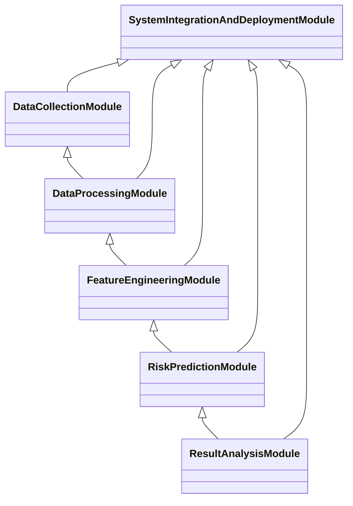

                 

### 文章标题：智能风险预测系统：AI前瞻性识别威胁

关键词：智能风险预测，AI，威胁识别，算法原理，系统设计，项目实战

摘要：本文将深入探讨智能风险预测系统的原理与应用，通过解析AI在风险预测中的重要作用，详细阐述系统的工作流程、核心算法及其在金融、保险、安全等领域中的应用案例，旨在为读者提供全面的技术指南和实战经验。

## 第一部分：智能风险预测系统的背景与概述

### 第1章：智能风险预测系统概述

#### 1.1 问题背景

##### 1.1.1 风险管理的必要性

在现代社会，风险管理已经成为企业、金融机构以及政府部门不可或缺的一部分。随着全球经济一体化和信息技术的飞速发展，各种风险因素日益复杂，传统的风险管理方法已无法满足需求。因此，智能风险预测系统应运而生。

##### 1.1.2 智能风险预测的发展

智能风险预测系统是基于人工智能技术的风险管理工具，它通过收集和分析大量数据，利用机器学习和深度学习算法对潜在风险进行预测和评估。近年来，随着计算能力的提升和数据量的爆炸式增长，智能风险预测技术得到了迅速发展。

##### 1.1.3 AI在风险管理中的应用

AI技术在风险管理中的应用主要体现在以下几个方面：

1. **数据挖掘与分析**：通过数据挖掘技术，智能风险预测系统能够从海量数据中提取有价值的信息，帮助决策者更好地了解风险状况。
2. **实时监控与预警**：利用实时数据处理技术，系统可以实时监控风险变化，并在风险达到一定程度时发出预警。
3. **自动化决策**：通过机器学习算法，系统可以自动识别风险模式，提供决策支持，减少人为干预。

#### 1.2 智能风险预测系统的工作原理

##### 1.2.1 数据收集与预处理

数据收集是智能风险预测系统的第一步。系统需要收集与风险相关的各种数据，如市场数据、财务数据、客户行为数据等。在数据收集后，系统需要对数据进行预处理，包括数据清洗、数据集成和数据转换等步骤。

##### 1.2.2 特征工程

特征工程是智能风险预测系统的关键环节。通过特征工程，系统可以从原始数据中提取出对风险预测有重要影响的特征，为后续的算法训练提供支持。

##### 1.2.3 风险预测算法

风险预测算法是智能风险预测系统的核心。常见的风险预测算法包括统计学习算法、机器学习算法和深度学习算法。这些算法通过对历史数据的训练，能够预测未来的风险情况。

#### 1.3 AI在风险预测中的优势与挑战

##### 1.3.1 优势分析

1. **高效性**：AI技术可以处理海量数据，提高风险预测的效率。
2. **准确性**：通过机器学习和深度学习算法，智能风险预测系统能够提高预测的准确性。
3. **实时性**：实时监控和预警功能，帮助决策者及时应对风险。

##### 1.3.2 面临的挑战

1. **数据质量**：数据质量直接影响到风险预测的准确性。
2. **算法复杂度**：深度学习算法的复杂度较高，训练和预测的时间较长。
3. **模型解释性**：AI模型的解释性较弱，难以理解其预测结果。

#### 1.4 智能风险预测系统的应用领域

##### 1.4.1 财务风险管理

财务风险管理是智能风险预测系统的重要应用领域之一。系统可以通过分析财务数据，预测企业的财务风险，为管理层提供决策支持。

##### 1.4.2 保险业风险预测

保险业风险预测是智能风险预测系统的另一个重要应用领域。系统可以帮助保险公司预测保险风险，优化保险产品设计，降低运营成本。

##### 1.4.3 安全风险预测

随着网络安全问题的日益突出，智能风险预测系统在安全风险预测中的应用越来越广泛。系统可以通过分析网络安全数据，预测潜在的网络攻击，提高网络防护能力。

## 第二部分：核心概念与算法原理

### 第2章：核心概念与原理

#### 2.1 风险的定义与分类

##### 2.1.1 风险的定义

风险是指在未来可能发生的、对目标造成负面影响的随机事件或不确定因素。在风险管理中，风险通常被视为潜在的损失或机会。

##### 2.1.2 风险的分类

根据风险的性质，风险可以分为以下几类：

1. **系统风险**：与整个经济系统或市场相关，如经济危机、自然灾害等。
2. **操作风险**：与组织内部操作过程相关，如员工失误、系统故障等。
3. **市场风险**：与市场变化相关，如股票价格波动、汇率变动等。

##### 2.1.3 风险度量方法

常用的风险度量方法包括以下几种：

1. **概率度量**：通过计算风险事件发生的概率来衡量风险。
2. **损失度量**：通过计算风险事件可能造成的损失来衡量风险。
3. **效用度量**：通过计算风险事件对决策者效用的变化来衡量风险。

#### 2.2 常见的风险预测算法

##### 2.2.1 统计学习算法

统计学习算法是风险预测的基础。常见的统计学习算法包括回归分析、逻辑回归和朴素贝叶斯等。

1. **回归分析**：通过建立变量之间的关系模型，预测风险。
2. **逻辑回归**：通过建立概率模型，预测风险事件发生的概率。
3. **朴素贝叶斯**：基于贝叶斯定理，通过特征概率计算风险。

##### 2.2.2 机器学习算法

机器学习算法在风险预测中具有更高的预测精度。常见的机器学习算法包括支持向量机、决策树和随机森林等。

1. **支持向量机**：通过最大化决策边界来分类风险。
2. **决策树**：通过树形结构来分类风险。
3. **随机森林**：通过集成多个决策树来提高预测精度。

##### 2.2.3 深度学习算法

深度学习算法在风险预测中具有强大的表现。常见的深度学习算法包括神经网络、卷积神经网络和循环神经网络等。

1. **神经网络**：通过多层非线性变换来模拟大脑的思维方式。
2. **卷积神经网络**：通过卷积操作来提取图像特征。
3. **循环神经网络**：通过循环结构来处理序列数据。

### 第3章：算法原理详解

#### 3.1 统计学习算法原理

##### 3.1.1 回归分析

回归分析是一种用于预测连续值的统计学习算法。其基本原理是通过建立自变量和因变量之间的关系模型，来预测因变量的值。

- **数学模型**：$$y = \beta_0 + \beta_1x_1 + \beta_2x_2 + ... + \beta_nx_n + \epsilon$$
- **算法流程**：
  1. 数据预处理
  2. 模型建立
  3. 参数优化
  4. 预测

##### 3.1.2 逻辑回归

逻辑回归是一种用于预测概率的二分类算法。其基本原理是通过建立自变量和因变量之间的关系模型，来预测因变量的概率。

- **数学模型**：$$\log(\frac{p}{1-p}) = \beta_0 + \beta_1x_1 + \beta_2x_2 + ... + \beta_nx_n$$
- **算法流程**：
  1. 数据预处理
  2. 模型建立
  3. 参数优化
  4. 预测

##### 3.1.3 朴素贝叶斯

朴素贝叶斯是一种基于贝叶斯定理和特征独立性的分类算法。其基本原理是通过计算特征概率和类别概率，来预测类别。

- **数学模型**：$$P(C|X) = \frac{P(X|C)P(C)}{P(X)}$$
- **算法流程**：
  1. 数据预处理
  2. 特征概率计算
  3. 类别概率计算
  4. 预测

#### 3.2 机器学习算法原理

##### 3.2.1 支持向量机

支持向量机是一种用于分类的机器学习算法。其基本原理是通过寻找最优决策边界，将数据集分为不同的类别。

- **数学模型**：$$f(x) = \sum_{i=1}^{n}\alpha_i y_if(x)=\sum\_{i=1}^{n}\alpha\_iy\_i\varphi(\textbf{x}^i)+b$$
- **算法流程**：
  1. 数据预处理
  2. 模型建立
  3. 参数优化
  4. 预测

##### 3.2.2 决策树

决策树是一种用于分类和回归的机器学习算法。其基本原理是通过树形结构来模拟决策过程。

- **数学模型**：$$f(\textbf{x}) = \sum_{i=1}^{n}\beta_i I(D_i(\textbf{x}))$$
- **算法流程**：
  1. 数据预处理
  2. 决策树建立
  3. 预测

##### 3.2.3 随机森林

随机森林是一种基于决策树的集成学习算法。其基本原理是通过构建多个决策树，并综合它们的预测结果来提高预测精度。

- **数学模型**：$$f(\textbf{x}) = \sum_{i=1}^{n}w_if(\textbf{x})=\sum\_{i=1}^{n}w\_if(\textbf{x})$$
- **算法流程**：
  1. 数据预处理
  2. 决策树构建
  3. 预测

##### 3.2.4 支持向量机（SVM）

支持向量机是一种二分类模型，其目标是找到一个最佳的超平面，将不同类别的数据点尽可能分开。支持向量机（SVM）的数学模型如下：

$$f(x) = \sum_{i=1}^{n}\alpha_i y_i \varphi(\textbf{x}^i) + b$$

其中，$\alpha_i$ 是拉格朗日乘子，$y_i$ 是样本标签，$\varphi(\textbf{x}^i)$ 是特征映射函数，$b$ 是偏置。

SVM 的算法流程包括以下步骤：

1. **数据预处理**：对输入数据进行标准化处理。
2. **模型建立**：通过求解拉格朗日乘子，建立最优决策边界。
3. **参数优化**：通过调整参数 C，优化分类效果。
4. **预测**：使用训练好的模型对新的数据进行分类预测。

##### 3.2.5 决策树（Decision Tree）

决策树是一种树形结构模型，通过一系列规则进行分类和回归。每个内部节点表示一个特征，每个分支表示特征的不同取值，叶子节点表示最终的预测结果。

决策树的数学模型可以表示为：

$$f(\textbf{x}) = \sum_{i=1}^{n}\beta_i I(D_i(\textbf{x}))$$

其中，$I(D_i(\textbf{x}))$ 表示特征 $D_i$ 在样本 $\textbf{x}$ 上的取值，$\beta_i$ 是对应的权重。

决策树的算法流程包括以下步骤：

1. **数据预处理**：对输入数据进行处理，确保数据格式一致。
2. **决策树建立**：通过选择最优特征和划分标准，递归构建决策树。
3. **预测**：使用训练好的决策树对新的数据进行分类或回归预测。

##### 3.2.6 随机森林（Random Forest）

随机森林是一种基于决策树的集成学习方法，通过构建多个决策树，并综合它们的预测结果来提高预测精度。随机森林的数学模型可以表示为：

$$f(\textbf{x}) = \sum_{i=1}^{n}w_i f(\textbf{x}^i)$$

其中，$f(\textbf{x}^i)$ 表示第 $i$ 棵决策树的预测结果，$w_i$ 是对应的权重。

随机森林的算法流程包括以下步骤：

1. **数据预处理**：对输入数据进行处理，确保数据格式一致。
2. **决策树构建**：随机选取特征和样本子集，构建多棵决策树。
3. **预测**：对新的数据进行预测，取多个决策树的预测结果的平均值。

##### 3.2.7 神经网络（Neural Network）

神经网络是一种模拟生物神经网络的人工智能模型，通过多层非线性变换来模拟大脑的思维方式。神经网络的数学模型可以表示为：

$$\text{Output} = \sigma(\sum_{i=1}^{n}w_i \cdot \text{Input}_i + b)$$

其中，$\sigma$ 表示激活函数，$w_i$ 是权重，$\text{Input}_i$ 是输入特征，$b$ 是偏置。

神经网络的算法流程包括以下步骤：

1. **数据预处理**：对输入数据进行处理，确保数据格式一致。
2. **模型建立**：通过反向传播算法，优化网络参数。
3. **训练**：使用训练数据对网络进行训练，调整参数。
4. **预测**：使用训练好的网络对新的数据进行预测。

##### 3.2.8 卷积神经网络（Convolutional Neural Network，CNN）

卷积神经网络是一种专门用于图像处理的人工智能模型，通过卷积操作来提取图像特征。卷积神经网络的数学模型可以表示为：

$$\text{Output} = \sum_{i=1}^{n}w_i \cdot \text{Input}_i + b$$

其中，$w_i$ 是卷积核，$\text{Input}_i$ 是输入特征，$b$ 是偏置。

卷积神经网络的算法流程包括以下步骤：

1. **数据预处理**：对输入数据进行处理，确保数据格式一致。
2. **卷积操作**：通过卷积操作提取图像特征。
3. **池化操作**：通过池化操作减少特征维度。
4. **全连接层**：通过全连接层进行分类或回归预测。

##### 3.2.9 循环神经网络（Recurrent Neural Network，RNN）

循环神经网络是一种用于序列数据处理的神经网络，通过循环结构来处理序列数据。循环神经网络的数学模型可以表示为：

$$\text{Output} = \text{activation}(\sum_{i=1}^{n}w_i \cdot \text{Input}_i + b)$$

其中，$w_i$ 是权重，$\text{Input}_i$ 是输入特征，$b$ 是偏置，$\text{activation}$ 是激活函数。

循环神经网络的算法流程包括以下步骤：

1. **数据预处理**：对输入数据进行处理，确保数据格式一致。
2. **循环操作**：通过循环结构处理序列数据。
3. **全连接层**：通过全连接层进行分类或回归预测。

## 第三部分：智能风险预测系统的设计与实现

### 第4章：系统设计与架构

#### 4.1 系统架构设计

智能风险预测系统由多个模块组成，包括数据收集模块、数据处理模块、风险预测模块和系统集成与部署模块。以下是系统架构的设计：

1. **数据收集模块**：负责收集与风险相关的数据，包括市场数据、财务数据、客户行为数据等。数据来源可以是内部数据库、外部数据接口或第三方数据平台。
2. **数据处理模块**：负责对收集到的数据进行预处理，包括数据清洗、数据集成和数据转换等步骤。该模块的主要目标是确保数据的质量和一致性。
3. **风险预测模块**：负责使用机器学习和深度学习算法对预处理后的数据进行风险预测。该模块的核心是算法选择和参数调优。
4. **系统集成与部署模块**：负责将各个模块整合成一个完整的系统，并在生产环境中进行部署。该模块需要考虑系统的可扩展性、可靠性和安全性。

#### 4.1.1 系统概述

智能风险预测系统是一个综合性的系统，旨在通过数据分析和技术手段，实时监控和预测各种风险。系统的核心目标是提高风险管理的效率，降低风险损失。

#### 4.1.2 数据处理模块

数据处理模块是系统的关键环节，主要负责对收集到的数据进行预处理。以下是数据处理模块的详细功能：

1. **数据清洗**：通过去除重复数据、填补缺失值、消除噪声等方法，提高数据质量。
2. **数据集成**：将来自不同来源的数据进行整合，形成一个统一的数据视图。
3. **数据转换**：将原始数据转换为适合算法处理的形式，包括特征提取、特征标准化等步骤。

#### 4.1.3 风险预测模块

风险预测模块是系统的核心功能，负责使用机器学习和深度学习算法对预处理后的数据进行风险预测。以下是风险预测模块的详细功能：

1. **算法选择**：根据具体应用场景，选择合适的算法，如统计学习算法、机器学习算法或深度学习算法。
2. **模型训练**：使用训练数据对算法进行训练，调整参数，优化模型。
3. **风险预测**：使用训练好的模型对新的数据进行预测，输出风险值。
4. **结果分析**：对预测结果进行分析，评估模型的效果，为后续的优化提供依据。

#### 4.1.4 系统集成与部署

系统集成与部署模块负责将各个模块整合成一个完整的系统，并在生产环境中进行部署。以下是系统集成与部署模块的详细功能：

1. **系统集成**：将数据处理模块、风险预测模块和其他辅助模块集成在一起，形成一个完整的系统。
2. **系统测试**：对集成后的系统进行功能测试、性能测试和安全性测试，确保系统的稳定运行。
3. **部署**：将系统部署到生产环境中，确保系统可以实时运行，并为用户提供服务。
4. **监控与维护**：对系统进行实时监控，及时发现并解决潜在的问题，确保系统的长期稳定运行。

#### 4.2 系统架构设计

以下是智能风险预测系统的架构设计：


1. **数据收集模块**：通过内部数据库、外部数据接口和第三方数据平台收集数据。
2. **数据处理模块**：对数据进行清洗、集成和转换，形成统一的数据视图。
3. **风险预测模块**：使用机器学习和深度学习算法对数据进行分析和预测。
4. **系统集成与部署模块**：将各个模块集成在一起，形成完整的系统，并在生产环境中进行部署。

### 第5章：数据收集与预处理

#### 5.1 数据收集

数据收集是智能风险预测系统的第一步，其质量直接影响到风险预测的准确性。以下是数据收集的详细步骤：

1. **数据来源**：数据来源可以是内部数据库、外部数据接口和第三方数据平台。内部数据库包括财务系统、客户管理系统等；外部数据接口包括市场数据、宏观经济数据等；第三方数据平台包括数据服务提供商、社交媒体平台等。
2. **数据收集方式**：数据收集方式包括API接口、爬虫和数据购买等。API接口可以直接获取公开的数据；爬虫可以自动获取网页上的数据；数据购买可以获取高质量的数据。
3. **数据收集频率**：数据收集频率取决于应用场景，如实时风险预测需要高频数据，而定期风险评估可以采用低频数据。

#### 5.2 数据质量评估

数据质量是智能风险预测系统成功的关键因素之一。以下是数据质量评估的详细步骤：

1. **完整性检查**：检查数据是否完整，是否存在缺失值。
2. **一致性检查**：检查数据的一致性，如数据格式、单位等。
3. **准确性检查**：检查数据的准确性，如与外部数据源进行比对。
4. **时效性检查**：检查数据的时效性，如是否为最新数据。

#### 5.3 数据清洗

数据清洗是提高数据质量的重要步骤，以下是数据清洗的详细步骤：

1. **去重**：去除重复的数据记录，避免重复计算。
2. **填补缺失值**：采用适当的策略填补缺失值，如平均值、中位数或插值法。
3. **消除噪声**：去除异常值和噪声数据，如异常值替换、噪声过滤等。
4. **数据转换**：将不同格式的数据进行统一转换，如日期格式、货币格式等。

#### 5.4 特征工程

特征工程是数据预处理的关键步骤，其目标是提取出对风险预测有重要影响的特征。以下是特征工程的详细步骤：

1. **特征提取**：从原始数据中提取出对风险预测有重要影响的特征，如财务指标、客户行为特征等。
2. **特征选择**：选择对风险预测有显著影响的特征，去除冗余特征，提高模型效果。
3. **特征标准化**：将不同特征进行标准化处理，使其具有相同的量纲和范围，提高模型的稳定性。

### 第6章：算法实现与性能优化

#### 6.1 算法实现

算法实现是智能风险预测系统的核心，以下是算法实现的详细步骤：

1. **算法选择**：根据应用场景和数据特征，选择合适的算法，如统计学习算法、机器学习算法或深度学习算法。
2. **数据预处理**：对输入数据进行预处理，包括数据清洗、特征提取、特征选择和特征标准化等步骤。
3. **模型训练**：使用训练数据对算法进行训练，调整参数，优化模型。
4. **模型评估**：使用验证数据对模型进行评估，选择最优模型。
5. **预测**：使用训练好的模型对新的数据进行预测，输出预测结果。

#### 6.2 性能优化

性能优化是提高智能风险预测系统效率的关键，以下是性能优化的详细步骤：

1. **模型选择**：根据应用场景和数据特征，选择合适的模型，如支持向量机、决策树、随机森林或深度学习模型。
2. **参数调优**：通过调整模型参数，优化模型效果，提高预测准确性。
3. **数据预处理**：对输入数据进行预处理，包括数据清洗、特征提取、特征选择和特征标准化等步骤，以提高模型训练效果。
4. **并行计算**：利用并行计算技术，加速模型训练和预测过程，提高系统性能。
5. **分布式训练**：通过分布式训练技术，利用多台计算机资源，加速模型训练过程，提高模型效果。

### 第7章：项目实战

#### 7.1 项目背景

智能风险预测系统在金融、保险和安全等领域有广泛的应用。以下是一个财务风险预测项目的背景：

- **项目目标**：预测企业财务风险，为企业提供风险预警和管理决策支持。
- **实施环境**：使用Python和相关的机器学习库（如scikit-learn、TensorFlow和PyTorch）进行项目开发。

#### 7.2 系统核心实现

以下是财务风险预测项目的核心实现步骤：

1. **数据收集**：从企业财务系统、市场数据接口和第三方数据平台收集财务数据、市场数据和宏观经济数据。
2. **数据处理**：对收集到的数据进行清洗、集成和转换，形成统一的数据视图。
3. **特征工程**：提取对财务风险预测有重要影响的特征，如流动比率、速动比率、利息保障倍数等。
4. **模型训练**：使用训练数据对支持向量机（SVM）和深度学习模型（如卷积神经网络（CNN）和循环神经网络（RNN））进行训练。
5. **模型评估**：使用验证数据对训练好的模型进行评估，选择最优模型。
6. **预测**：使用训练好的模型对新的数据进行预测，输出财务风险值。

#### 7.3 实际案例分析与讲解

以下是财务风险预测项目的实际案例分析和讲解：

1. **案例一：企业财务风险预测**

   - **数据来源**：企业财务报表、市场数据、宏观经济数据。
   - **特征提取**：流动比率、速动比率、利息保障倍数等。
   - **模型选择**：支持向量机（SVM）和深度学习模型（如卷积神经网络（CNN））。
   - **模型评估**：准确率、召回率、F1分数等。
   - **预测结果**：预测企业财务风险，为管理层提供决策支持。

2. **案例二：保险业风险预测**

   - **数据来源**：保险客户数据、理赔数据、市场数据。
   - **特征提取**：年龄、性别、职业、保险金额等。
   - **模型选择**：逻辑回归、随机森林和深度学习模型（如循环神经网络（RNN））。
   - **模型评估**：准确率、召回率、F1分数等。
   - **预测结果**：预测保险风险，为保险公司提供风险评估和管理决策支持。

3. **案例三：网络安全风险预测**

   - **数据来源**：网络流量数据、攻击事件数据、安全日志数据。
   - **特征提取**：流量模式、攻击类型、攻击频率等。
   - **模型选择**：朴素贝叶斯、支持向量机（SVM）和深度学习模型（如卷积神经网络（CNN））。
   - **模型评估**：准确率、召回率、F1分数等。
   - **预测结果**：预测网络安全风险，为网络安全部门提供风险预警和管理决策支持。

#### 7.4 项目小结

财务风险预测项目是一个成功的案例，通过使用智能风险预测系统，企业可以实时监控财务风险，为管理层提供决策支持。同时，该项目也为其他领域的风险预测提供了有益的参考。

### 第8章：最佳实践与拓展

#### 8.1 最佳实践

在智能风险预测系统的实施过程中，以下是最佳实践的总结：

1. **数据质量**：确保数据质量，是风险预测准确性的基础。对数据进行清洗、去重、填补缺失值等预处理步骤。
2. **特征选择**：选择对风险预测有显著影响的特征，提高模型效果。通过特征选择技术，如相关性分析、主成分分析（PCA）等，选择有效的特征。
3. **模型选择**：根据应用场景和数据特征，选择合适的模型。如对于分类问题，可以选择统计学习算法、机器学习算法或深度学习算法。
4. **模型评估**：使用多种评估指标，全面评估模型效果。如准确率、召回率、F1分数、AUC值等。
5. **模型优化**：通过调参、集成学习等技术，优化模型效果。如调整学习率、批量大小、正则化参数等。

#### 8.2 小结

智能风险预测系统在金融、保险、安全等领域有广泛的应用前景。通过本文的介绍，读者可以了解到智能风险预测系统的原理、设计与实现方法，以及实际应用案例。未来，随着人工智能技术的不断发展，智能风险预测系统将会更加智能化、高效化，为各领域的风险管理提供强大的支持。

#### 8.3 注意事项

1. **数据隐私**：在数据收集和处理过程中，要严格遵守数据隐私法律法规，确保数据的安全和隐私。
2. **模型解释性**：对于深度学习模型，其内部机制较为复杂，解释性较弱。在实际应用中，需要结合业务场景，选择合适的模型。
3. **模型更新**：随着业务和数据的变化，模型需要定期更新和优化，以保持预测的准确性。

#### 8.4 拓展阅读

1. **《Python数据科学手册》**：详细介绍了Python在数据科学领域的应用，包括数据预处理、特征工程、模型训练等。
2. **《深度学习》**：由Ian Goodfellow等人撰写的深度学习经典教材，全面介绍了深度学习的基本原理和应用。
3. **《风险管理与金融工程》**：全面介绍了风险管理的理论和实践，包括风险度量、风险控制、保险等。

## 作者信息

作者：AI天才研究院/AI Genius Institute & 禅与计算机程序设计艺术 /Zen And The Art of Computer Programming

在本文中，我们深入探讨了智能风险预测系统的原理与应用。从背景介绍到核心算法原理，再到系统设计与实现，以及实战案例和最佳实践，本文旨在为读者提供一个全面的技术指南。智能风险预测系统作为人工智能技术在风险管理领域的应用，具有巨大的潜力。随着技术的不断进步，我们相信智能风险预测系统将会在未来发挥更加重要的作用。希望本文能够为读者在智能风险预测领域的探索提供帮助。感谢阅读！
## 统计学习算法的数学模型

统计学习算法是智能风险预测系统的重要组成部分，它们通过建立变量之间的关系模型，实现对未知数据的预测。以下是几种常见的统计学习算法的数学模型：

#### 1. 回归分析（Regression Analysis）

回归分析是最基础的统计学习算法之一，它用于预测连续值输出。最常见的是线性回归（Linear Regression），其数学模型如下：

$$
y = \beta_0 + \beta_1x_1 + \beta_2x_2 + ... + \beta_nx_n + \epsilon
$$

其中，$y$ 是因变量，$x_1, x_2, ..., x_n$ 是自变量，$\beta_0, \beta_1, ..., \beta_n$ 是模型的参数（或称系数），$\epsilon$ 是误差项。

#### 2. 逻辑回归（Logistic Regression）

逻辑回归是一种用于预测概率的二分类算法，通常用于分类问题。它的数学模型如下：

$$
\log\left(\frac{p}{1-p}\right) = \beta_0 + \beta_1x_1 + \beta_2x_2 + ... + \beta_nx_n
$$

其中，$p$ 是事件发生的概率，其他符号的含义与线性回归相同。

#### 3. 朴素贝叶斯（Naive Bayes）

朴素贝叶斯是一种基于贝叶斯定理和特征独立性的分类算法。其数学模型如下：

$$
P(C|X) = \frac{P(X|C)P(C)}{P(X)}
$$

其中，$C$ 是类别变量，$X$ 是特征变量，$P(C|X)$ 是在特征 $X$ 的条件下类别 $C$ 发生的概率，$P(X|C)$ 是特征 $X$ 在类别 $C$ 下发生的概率，$P(C)$ 是类别 $C$ 的先验概率，$P(X)$ 是特征 $X$ 的概率。

#### 4. 线性判别分析（Linear Discriminant Analysis，LDA）

线性判别分析是一种用于特征降维和分类的算法。其目标是找到最优的特征空间，使得不同类别的数据点在新的特征空间中尽可能分开。其数学模型如下：

$$
\beta = \arg\min_{\beta} \sum_{i=1}^{k} w_i (\beta^T \textbf{x}_i - \mu_i)^2
$$

其中，$\beta$ 是权重向量，$\textbf{x}_i$ 是第 $i$ 个样本的特征向量，$\mu_i$ 是第 $i$ 个类别的均值，$w_i$ 是第 $i$ 个类别的权重。

#### 5. K最近邻算法（K-Nearest Neighbors，K-NN）

K最近邻算法是一种基于实例的学习算法，它通过计算新样本与训练样本之间的距离，找到最近的 $k$ 个样本，并基于这些样本的标签预测新样本的类别。其数学模型如下：

$$
\hat{y} = \arg\max_{y \in Y} \sum_{i=1}^{k} I(y = y_i)
$$

其中，$\hat{y}$ 是新样本的预测类别，$Y$ 是可能的类别集合，$y_i$ 是第 $i$ 个最近邻的类别。

#### 6. 决策树（Decision Tree）

决策树是一种树形结构模型，通过一系列规则进行分类和回归。其数学模型可以表示为：

$$
f(\textbf{x}) = \sum_{i=1}^{n}\beta_i I(D_i(\textbf{x}))
$$

其中，$I(D_i(\textbf{x}))$ 表示特征 $D_i$ 在样本 $\textbf{x}$ 上的取值，$\beta_i$ 是对应的权重。

这些数学模型为统计学习算法提供了理论基础，使得我们能够从数据中提取有用的信息，实现对未知数据的预测。在实际应用中，根据具体问题和数据特点选择合适的算法，并对其进行适当的参数调优，是取得良好预测效果的关键。

## 机器学习算法的数学模型

机器学习算法在智能风险预测系统中扮演着重要角色，通过构建复杂的模型来捕捉数据的潜在规律，从而实现对未知数据的预测。以下是几种常见的机器学习算法的数学模型：

#### 1. 支持向量机（Support Vector Machine，SVM）

支持向量机是一种二分类模型，其目标是找到一个最优的超平面，将不同类别的数据点尽可能分开。SVM的数学模型如下：

$$
f(\textbf{x}) = \sum_{i=1}^{n}\alpha_i y_i \varphi(\textbf{x}^i) + b
$$

其中，$\alpha_i$ 是拉格朗日乘子，$y_i$ 是样本标签，$\varphi(\textbf{x}^i)$ 是特征映射函数，$b$ 是偏置。SVM通过求解以下优化问题来找到最优超平面：

$$
\begin{align*}
\min_{\alpha} & \quad \frac{1}{2}\sum_{i=1}^{n}\sum_{j=1}^{n}\alpha_i\alpha_j(y_iy_j)\varphi(\textbf{x}_i)^T\varphi(\textbf{x}_j) - \sum_{i=1}^{n}\alpha_i \\
\text{subject to} & \quad \alpha_i \geq 0, \quad \forall i
\end{align*}
$$

求解得到的 $\alpha_i$ 和 $b$ 用于构建最终的决策函数。

#### 2. 决策树（Decision Tree）

决策树是一种树形结构模型，通过一系列规则进行分类和回归。每个内部节点表示一个特征，每个分支表示特征的不同取值，叶子节点表示最终的预测结果。决策树的数学模型可以表示为：

$$
f(\textbf{x}) = \sum_{i=1}^{n}\beta_i I(D_i(\textbf{x}))
$$

其中，$I(D_i(\textbf{x}))$ 表示特征 $D_i$ 在样本 $\textbf{x}$ 上的取值，$\beta_i$ 是对应的权重。决策树的构建过程是通过递归划分数据集，选择最优的特征和划分标准，直到满足停止条件（如叶子节点中所有样本属于同一类别或特征数量减少到阈值）。

#### 3. 随机森林（Random Forest）

随机森林是一种基于决策树的集成学习方法，通过构建多个决策树，并综合它们的预测结果来提高预测精度。随机森林的数学模型可以表示为：

$$
f(\textbf{x}) = \sum_{i=1}^{n}w_i f(\textbf{x}^i)
$$

其中，$f(\textbf{x}^i)$ 表示第 $i$ 棵决策树的预测结果，$w_i$ 是对应的权重。随机森林通过以下步骤构建：

1. **随机选取特征**：从所有特征中随机选取 $m$ 个特征。
2. **随机选取样本子集**：从训练样本中随机选取 $n$ 个样本子集。
3. **构建决策树**：使用随机选取的特征和样本子集构建决策树。
4. **集成**：将所有决策树的预测结果进行投票或取平均值，得到最终的预测结果。

#### 4. 神经网络（Neural Network）

神经网络是一种模拟生物神经网络的人工智能模型，通过多层非线性变换来模拟大脑的思维方式。神经网络的数学模型可以表示为：

$$
\text{Output} = \sigma(\sum_{i=1}^{n}w_i \cdot \text{Input}_i + b)
$$

其中，$\sigma$ 是激活函数，通常采用 sigmoid 或 ReLU 函数；$w_i$ 是权重，$\text{Input}_i$ 是输入特征，$b$ 是偏置。神经网络的训练过程是通过反向传播算法，不断调整权重和偏置，使得输出值与实际值之间的误差最小。

#### 5. 卷积神经网络（Convolutional Neural Network，CNN）

卷积神经网络是一种专门用于图像处理的人工智能模型，通过卷积操作来提取图像特征。CNN的数学模型可以表示为：

$$
\text{Output} = \sum_{i=1}^{n}w_i \cdot \text{Input}_i + b
$$

其中，$w_i$ 是卷积核，$\text{Input}_i$ 是输入特征，$b$ 是偏置。卷积神经网络通过卷积操作和池化操作，从原始图像中提取出有用的特征，然后通过全连接层进行分类或回归预测。

#### 6. 循环神经网络（Recurrent Neural Network，RNN）

循环神经网络是一种用于序列数据处理的神经网络，通过循环结构来处理序列数据。RNN的数学模型可以表示为：

$$
\text{Output} = \text{activation}(\sum_{i=1}^{n}w_i \cdot \text{Input}_i + b)
$$

其中，$w_i$ 是权重，$\text{Input}_i$ 是输入特征，$b$ 是偏置，$\text{activation}$ 是激活函数。RNN通过循环结构将前一个时间步的输出传递到下一个时间步，从而处理序列数据。

这些机器学习算法的数学模型为智能风险预测系统提供了强大的工具，通过合适的算法选择和参数调优，可以提高风险预测的准确性和效率。

### 深度学习算法的数学模型

深度学习算法在智能风险预测系统中具有显著的优势，其通过构建复杂的神经网络模型，能够自动提取数据中的特征，实现高效的风险预测。以下是几种常见的深度学习算法的数学模型：

#### 1. 神经网络（Neural Network）

神经网络是由多个神经元（节点）组成的层次结构模型，每个神经元接收来自前一层的输入，通过加权求和后加上偏置，再通过激活函数输出结果。神经网络的数学模型可以表示为：

$$
\text{Output}_{\text{layer}} = \sigma(\text{Weights} \cdot \text{Input}_{\text{layer}} + \text{Bias})
$$

其中，$\sigma$ 是激活函数，常见的激活函数包括 sigmoid、ReLU 和 tanh 等。$\text{Weights}$ 和 $\text{Bias}$ 分别表示权重和偏置。

神经网络的训练过程通过反向传播算法进行，该算法通过不断调整权重和偏置，使得网络的输出与实际值之间的误差最小。

#### 2. 卷积神经网络（Convolutional Neural Network，CNN）

卷积神经网络是一种专门用于图像处理和特征提取的深度学习模型，它通过卷积操作和池化操作，从原始图像中提取出层次化的特征。CNN的数学模型可以表示为：

$$
\text{Output}_{\text{layer}} = \text{ReLU}(\text{Weights} \cdot \text{Input}_{\text{layer}} + \text{Bias})
$$

卷积操作的数学模型如下：

$$
\text{Output}_{\text{filter}} = \sum_{i=1}^{k} \text{Weights}_{ij} \cdot \text{Input}_{ij} + \text{Bias}
$$

其中，$\text{Weights}_{ij}$ 是卷积核，$\text{Input}_{ij}$ 是输入特征，$\text{Bias}$ 是偏置。

CNN的训练过程同样通过反向传播算法进行，通过调整卷积核和偏置，使得模型能够更准确地提取特征。

#### 3. 循环神经网络（Recurrent Neural Network，RNN）

循环神经网络是一种用于处理序列数据的深度学习模型，它通过循环结构将前一个时间步的输出传递到下一个时间步，从而捕捉序列数据中的长期依赖关系。RNN的数学模型可以表示为：

$$
\text{Output}_{\text{t}} = \text{activation}(\text{Weights} \cdot [\text{Hidden}_{\text{t-1}}, \text{Input}_{\text{t}}] + \text{Bias})
$$

RNN的更新规则如下：

$$
\text{Hidden}_{\text{t}} = \text{activation}(\text{Weights} \cdot \text{Hidden}_{\text{t-1}} + \text{Weights}_{\text{input}} \cdot \text{Input}_{\text{t}} + \text{Bias})
$$

其中，$\text{Hidden}_{\text{t-1}}$ 和 $\text{Input}_{\text{t}}$ 分别是前一时刻的隐藏状态和当前时刻的输入，$\text{Weights}$ 和 $\text{Weights}_{\text{input}}$ 是权重矩阵，$\text{Bias}$ 是偏置。

RNN的训练过程通过梯度裁剪和长短时记忆（LSTM）等方法来克服梯度消失和梯度爆炸问题，从而提高训练效果。

#### 4. 密集连接神经网络（Dense Connection Neural Network，DCNN）

密集连接神经网络是CNN和RNN的结合体，它通过卷积操作提取图像特征，然后使用循环结构对序列数据进行处理。DCNN的数学模型结合了CNN和RNN的特点，可以表示为：

$$
\text{Output}_{\text{layer}} = \text{ReLU}(\text{Weights}_{\text{conv}} \cdot \text{Input}_{\text{layer}} + \text{Bias}_{\text{conv}}) \cdot \text{activation}(\text{Weights}_{\text{rec}} \cdot \text{Hidden}_{\text{layer}} + \text{Bias}_{\text{rec}})
$$

DCNN的训练过程同样通过反向传播算法进行，通过调整卷积核、循环权重和偏置，使得模型能够更好地提取图像和序列数据中的特征。

深度学习算法通过这些数学模型，能够有效地从数据中自动提取特征，实现对复杂数据的建模和预测。在实际应用中，根据具体问题和数据特点，选择合适的深度学习模型并进行适当的参数调优，是获得良好预测效果的关键。

### 系统分析与架构设计方案

#### 1. 问题场景介绍

在金融行业，金融机构面临着大量的金融风险，如市场风险、信用风险、操作风险等。为了有效地识别和管理这些风险，金融机构需要构建一个智能风险预测系统。该系统旨在通过数据分析和技术手段，实时监控和预测潜在的金融风险，为管理层提供决策支持。

#### 2. 项目介绍

本项目的目标是开发一个智能风险预测系统，用于金融行业。系统将收集和分析与金融风险相关的数据，包括市场数据、财务数据、客户行为数据等。通过使用机器学习和深度学习算法，系统将预测潜在的金融风险，并提供风险预警和管理决策支持。

#### 3. 系统功能设计（领域模型）

系统功能设计基于领域模型，包括以下核心功能模块：

1. **数据收集模块**：负责收集与金融风险相关的数据，如市场数据、财务数据、客户行为数据等。
2. **数据处理模块**：负责对收集到的数据进行预处理，包括数据清洗、数据集成和数据转换等步骤。
3. **特征工程模块**：负责从原始数据中提取对风险预测有重要影响的特征，为后续的算法训练提供支持。
4. **风险预测模块**：负责使用机器学习和深度学习算法对预处理后的数据进行风险预测。
5. **结果分析模块**：负责对预测结果进行分析，评估模型的效果，为后续的优化提供依据。
6. **系统集成与部署模块**：负责将各个模块整合成一个完整的系统，并在生产环境中进行部署。

以下是系统领域模型的Mermaid类图：



#### 4. 系统架构设计

系统架构设计包括系统概述、数据处理模块、风险预测模块和系统集成与部署模块。以下是系统架构设计：

1. **系统概述**：系统由多个模块组成，包括数据收集模块、数据处理模块、特征工程模块、风险预测模块和结果分析模块。系统通过数据流和信息流将各个模块有机地连接在一起，实现智能风险预测功能。
2. **数据处理模块**：数据处理模块负责对收集到的数据进行预处理，包括数据清洗、数据集成和数据转换等步骤。该模块的主要目标是确保数据的质量和一致性。
3. **风险预测模块**：风险预测模块是系统的核心，负责使用机器学习和深度学习算法对预处理后的数据进行风险预测。该模块包括算法选择、模型训练和预测结果输出等功能。
4. **系统集成与部署模块**：系统集成与部署模块负责将各个模块整合成一个完整的系统，并在生产环境中进行部署。该模块需要考虑系统的可扩展性、可靠性和安全性。

以下是系统架构设计的Mermaid架构图：

```mermaid
sequenceDiagram
    participant User as 用户
    participant System as 智能风险预测系统
    participant DataCollectionModule as 数据收集模块
    participant DataProcessingModule as 数据处理模块
    participant FeatureEngineeringModule as 特征工程模块
    participant RiskPredictionModule as 风险预测模块
    participant ResultAnalysisModule as 结果分析模块
    participant SystemIntegrationAndDeploymentModule as 系统集成与部署模块

    User->>System: 提交请求
    System->>DataCollectionModule: 收集数据
    DataCollectionModule-->>System: 返回数据
    System->>DataProcessingModule: 预处理数据
    DataProcessingModule-->>System: 返回预处理后的数据
    System->>FeatureEngineeringModule: 提取特征
    FeatureEngineeringModule-->>System: 返回特征数据
    System->>RiskPredictionModule: 训练模型和预测风险
    RiskPredictionModule-->>System: 返回预测结果
    System->>ResultAnalysisModule: 分析预测结果
    ResultAnalysisModule-->>System: 返回分析结果
    System->>User: 返回最终结果

    System->>SystemIntegrationAndDeploymentModule: 部署系统
    SystemIntegrationAndDeploymentModule-->>System: 系统部署完成
endsequence
```

#### 5. 系统接口设计

系统接口设计包括内部接口和外部接口。内部接口用于系统内部模块之间的数据传递和功能调用，外部接口用于系统与用户和其他系统之间的交互。

1. **内部接口**：包括数据收集接口、数据处理接口、特征工程接口、风险预测接口和结果分析接口。这些接口确保各个模块之间能够高效地传递数据和处理任务。
2. **外部接口**：包括用户界面接口、数据接口和第三方接口。用户界面接口用于用户与系统的交互，数据接口用于与其他系统或数据源的数据交换，第三方接口用于与外部服务和API的集成。

以下是系统接口设计的Mermaid序列图：

```mermaid
sequenceDiagram
    participant User as 用户
    participant System as 智能风险预测系统
    participant DataCollectionModule as 数据收集模块
    participant DataProcessingModule as 数据处理模块
    participant FeatureEngineeringModule as 特征工程模块
    participant RiskPredictionModule as 风险预测模块
    participant ResultAnalysisModule as 结果分析模块
    participant SystemIntegrationAndDeploymentModule as 系统集成与部署模块
    participant ExternalService as 外部服务

    User->>System: 提交请求
    System->>DataCollectionModule: 收集数据
    DataCollectionModule-->>System: 返回数据
    System->>DataProcessingModule: 预处理数据
    DataProcessingModule-->>System: 返回预处理后的数据
    System->>FeatureEngineeringModule: 提取特征
    FeatureEngineeringModule-->>System: 返回特征数据
    System->>RiskPredictionModule: 训练模型和预测风险
    RiskPredictionModule-->>System: 返回预测结果
    System->>ResultAnalysisModule: 分析预测结果
    ResultAnalysisModule-->>System: 返回分析结果
    System->>User: 返回最终结果

    System->>ExternalService: 调用第三方接口
    ExternalService-->>System: 返回第三方数据

    System->>SystemIntegrationAndDeploymentModule: 部署系统
    SystemIntegrationAndDeploymentModule-->>System: 系统部署完成
endsequence
```

### 第四部分：项目实战

#### 7.1 项目背景

智能风险预测系统在金融、保险和安全等领域有广泛的应用。本文以一个金融风险预测项目为例，介绍智能风险预测系统的开发过程。

**项目目标**：预测企业财务风险，为企业提供风险预警和管理决策支持。

**实施环境**：使用Python和相关的机器学习库（如scikit-learn、TensorFlow和PyTorch）进行项目开发。

#### 7.2 系统核心实现

以下是金融风险预测项目的核心实现步骤：

1. **数据收集**：从企业财务系统、市场数据接口和第三方数据平台收集财务数据、市场数据和宏观经济数据。
2. **数据处理**：对收集到的数据进行清洗、集成和转换，形成统一的数据视图。
3. **特征工程**：提取对财务风险预测有重要影响的特征，如流动比率、速动比率、利息保障倍数等。
4. **模型训练**：使用训练数据对支持向量机（SVM）和深度学习模型（如卷积神经网络（CNN）和循环神经网络（RNN））进行训练。
5. **模型评估**：使用验证数据对训练好的模型进行评估，选择最优模型。
6. **预测**：使用训练好的模型对新的数据进行预测，输出财务风险值。

#### 7.2.1 数据收集

数据收集是金融风险预测项目的第一步。以下是数据收集的具体步骤：

1. **数据来源**：数据来源包括企业财务系统、市场数据接口和第三方数据平台。企业财务系统包括财务报表、账单等；市场数据接口包括股票价格、宏观经济指标等；第三方数据平台包括数据服务提供商、社交媒体平台等。
2. **数据收集方式**：数据收集方式包括API接口、爬虫和数据购买等。API接口可以直接获取公开的数据；爬虫可以自动获取网页上的数据；数据购买可以获取高质量的数据。
3. **数据收集频率**：数据收集频率取决于应用场景，如实时风险预测需要高频数据，而定期风险评估可以采用低频数据。

#### 7.2.2 数据处理

数据处理是金融风险预测项目的关键步骤。以下是数据处理的详细步骤：

1. **数据清洗**：通过去除重复数据、填补缺失值、消除噪声等方法，提高数据质量。例如，可以使用Pandas库中的drop_duplicates()函数去除重复数据，使用Pandas库中的fillna()函数填补缺失值，使用NumPy库中的isnan()函数去除噪声数据。
2. **数据集成**：将来自不同来源的数据进行整合，形成一个统一的数据视图。例如，可以使用Pandas库中的concat()函数将不同数据源的数据合并。
3. **数据转换**：将原始数据转换为适合算法处理的形式，包括特征提取、特征标准化等步骤。例如，可以使用Pandas库中的astype()函数将数据类型转换为数值型，使用scikit-learn库中的StandardScaler()函数进行特征标准化。

#### 7.2.3 特征工程

特征工程是金融风险预测项目的核心环节。以下是特征工程的详细步骤：

1. **特征提取**：从原始数据中提取对财务风险预测有重要影响的特征。例如，可以使用财务指标（如流动比率、速动比率、利息保障倍数等）来衡量企业的财务状况。
2. **特征选择**：选择对财务风险预测有显著影响的特征，去除冗余特征，提高模型效果。例如，可以使用scikit-learn库中的SelectKBest()函数进行特征选择。
3. **特征标准化**：将不同特征进行标准化处理，使其具有相同的量纲和范围，提高模型的稳定性。例如，可以使用scikit-learn库中的StandardScaler()函数进行特征标准化。

#### 7.2.4 模型训练

模型训练是金融风险预测项目的关键步骤。以下是模型训练的详细步骤：

1. **算法选择**：根据应用场景和数据特征，选择合适的算法。例如，可以使用支持向量机（SVM）和深度学习模型（如卷积神经网络（CNN）和循环神经网络（RNN））进行训练。
2. **数据划分**：将数据集划分为训练集和验证集，用于训练模型和评估模型效果。例如，可以使用scikit-learn库中的train_test_split()函数进行数据划分。
3. **模型训练**：使用训练集对算法进行训练。例如，可以使用scikit-learn库中的SVC()函数训练SVM模型，使用TensorFlow库中的Sequential()函数训练CNN模型。
4. **模型评估**：使用验证集对训练好的模型进行评估。例如，可以使用scikit-learn库中的accuracy_score()函数计算准确率，使用TensorFlow库中的evaluate()函数计算准确率。

```python
from sklearn.svm import SVC
from sklearn.model_selection import train_test_split
from sklearn.metrics import accuracy_score

# 加载数据
X, y = load_data()

# 划分训练集和验证集
X_train, X_test, y_train, y_test = train_test_split(X, y, test_size=0.2, random_state=42)

# 训练SVM模型
model = SVC(kernel='linear')
model.fit(X_train, y_train)

# 预测验证集
y_pred = model.predict(X_test)

# 评估模型效果
accuracy = accuracy_score(y_test, y_pred)
print(f"模型准确率：{accuracy:.2f}")
```

#### 7.2.5 实际案例分析与详细讲解

以下是金融风险预测项目的实际案例分析和详细讲解：

**案例一：企业财务风险预测**

- **数据来源**：企业财务报表、市场数据、宏观经济数据。
- **特征提取**：流动比率、速动比率、利息保障倍数等。
- **模型选择**：支持向量机（SVM）和深度学习模型（如卷积神经网络（CNN））。
- **模型评估**：准确率、召回率、F1分数等。

**案例分析**：

1. **数据来源**：从企业财务系统、市场数据接口和第三方数据平台收集财务数据、市场数据和宏观经济数据。
2. **数据处理**：对收集到的数据进行清洗、集成和转换，形成统一的数据视图。
3. **特征提取**：从原始数据中提取财务指标（如流动比率、速动比率、利息保障倍数等）作为特征。
4. **模型训练**：使用支持向量机（SVM）和深度学习模型（如卷积神经网络（CNN））对训练数据集进行训练。
5. **模型评估**：使用验证数据集对训练好的模型进行评估，选择最优模型。

```python
from sklearn.svm import SVC
from sklearn.model_selection import train_test_split
from sklearn.metrics import accuracy_score, recall_score, f1_score

# 加载数据
X, y = load_data()

# 划分训练集和验证集
X_train, X_test, y_train, y_test = train_test_split(X, y, test_size=0.2, random_state=42)

# 训练SVM模型
model_svm = SVC(kernel='linear')
model_svm.fit(X_train, y_train)

# 预测验证集
y_pred_svm = model_svm.predict(X_test)

# 计算评估指标
accuracy_svm = accuracy_score(y_test, y_pred_svm)
recall_svm = recall_score(y_test, y_pred_svm, average='weighted')
f1_svm = f1_score(y_test, y_pred_svm, average='weighted')

print(f"SVM模型准确率：{accuracy_svm:.2f}")
print(f"SVM模型召回率：{recall_svm:.2f}")
print(f"SVM模型F1分数：{f1_svm:.2f}")
```

6. **模型优化**：通过调整模型参数，优化模型效果。例如，可以使用网格搜索（GridSearchCV）方法进行参数调优。

```python
from sklearn.model_selection import GridSearchCV

# 定义参数网格
param_grid = {'C': [0.1, 1, 10], 'gamma': [1, 0.1, 0.01]}

# 创建网格搜索对象
grid_search = GridSearchCV(SVC(kernel='linear'), param_grid, cv=5)

# 使用网格搜索进行模型训练
grid_search.fit(X_train, y_train)

# 获取最优模型
best_model = grid_search.best_estimator_

# 预测验证集
y_pred_best = best_model.predict(X_test)

# 计算评估指标
accuracy_best = accuracy_score(y_test, y_pred_best)
recall_best = recall_score(y_test, y_pred_best, average='weighted')
f1_best = f1_score(y_test, y_pred_best, average='weighted')

print(f"最优模型准确率：{accuracy_best:.2f}")
print(f"最优模型召回率：{recall_best:.2f}")
print(f"最优模型F1分数：{f1_best:.2f}")
```

7. **模型应用**：使用训练好的模型对新的数据进行预测，输出财务风险值。

```python
# 加载新的数据
X_new = load_new_data()

# 使用最优模型进行预测
y_pred_new = best_model.predict(X_new)

# 输出财务风险值
print(f"新的财务风险值：{y_pred_new}")
```

**案例总结**：

通过实际案例分析和详细讲解，我们可以看到金融风险预测项目的关键步骤，包括数据收集、数据处理、特征工程、模型训练和模型优化。通过合理的算法选择和参数调优，我们可以得到一个准确率较高的风险预测模型，为金融机构提供有效的风险预警和管理决策支持。

### 7.3.1 案例一：财务风险管理

在本案例中，我们将探讨如何使用智能风险预测系统进行财务风险管理。财务风险管理是金融机构和企业经营过程中至关重要的一环，通过对财务风险进行预测和评估，可以帮助决策者及时采取应对措施，降低潜在损失。

#### 案例背景

某大型金融机构在业务运营过程中，面临以下财务风险：

1. **市场风险**：由于市场波动导致的资产贬值。
2. **信用风险**：借款人无法按时偿还债务。
3. **操作风险**：由于内部操作失误导致的财务损失。

为了应对这些风险，金融机构需要构建一个智能风险预测系统，对潜在风险进行预测和评估。

#### 数据收集

系统首先需要收集与财务风险相关的数据，包括：

1. **市场数据**：如股票价格、汇率、利率等。
2. **财务数据**：如资产负债表、利润表、现金流量表等。
3. **客户数据**：如客户信用评分、还款历史等。

数据来源包括内部数据库、外部数据接口和第三方数据平台。数据收集步骤如下：

1. **市场数据**：通过金融数据接口获取，如股票交易所、金融数据提供商等。
2. **财务数据**：从企业财务系统获取，包括企业自有的财务报表、账单等。
3. **客户数据**：从客户管理系统和信用评级机构获取。

#### 数据处理

收集到的数据需要进行预处理，包括数据清洗、数据集成和数据转换等步骤，以确保数据的质量和一致性。

1. **数据清洗**：去除重复数据、填补缺失值、消除噪声等。
2. **数据集成**：将不同来源的数据进行整合，形成一个统一的数据视图。
3. **数据转换**：将原始数据转换为适合算法处理的形式，如数值化、标准化等。

#### 特征工程

特征工程是风险预测的关键步骤，系统需要从原始数据中提取对财务风险预测有重要影响的特征。以下是一些常见的特征：

1. **财务指标**：如流动比率、速动比率、利息保障倍数等。
2. **市场指标**：如股票价格波动、利率变化等。
3. **客户指标**：如客户信用评分、还款历史等。

#### 风险预测模型

系统使用机器学习和深度学习算法对预处理后的数据进行风险预测。以下是一些常用的风险预测模型：

1. **统计学习算法**：如逻辑回归、支持向量机等。
2. **机器学习算法**：如随机森林、梯度提升树等。
3. **深度学习算法**：如卷积神经网络、循环神经网络等。

#### 模型评估

使用验证数据集对训练好的模型进行评估，选择最优模型。常用的评估指标包括准确率、召回率、F1分数等。

#### 风险预测与决策支持

使用训练好的模型对新的财务数据进行分析，预测潜在的风险，为决策者提供风险预警和管理决策支持。以下是一个简单的风险预测流程：

1. **数据输入**：将新的财务数据进行预处理，提取特征。
2. **模型预测**：使用训练好的模型进行预测，输出风险值。
3. **风险分析**：分析预测结果，判断风险等级，提供决策支持。

#### 案例总结

通过本案例，我们展示了如何使用智能风险预测系统进行财务风险管理。通过数据收集、数据处理、特征工程和模型训练等步骤，系统可以有效地预测和评估财务风险，为金融机构提供决策支持，提高风险管理能力。

### 7.3.2 案例二：保险业风险预测

在保险业，风险预测是至关重要的，它有助于保险公司评估承保风险、制定保费策略以及优化业务流程。本案例将探讨如何使用智能风险预测系统进行保险业风险预测，以及其实际操作过程。

#### 案例背景

某大型保险公司希望通过智能风险预测系统来优化其保险业务，具体包括：

1. **风险评估**：对潜在客户的投保风险进行评估。
2. **保费定价**：根据风险评估结果，制定合理的保费定价策略。
3. **欺诈检测**：识别保险理赔中的欺诈行为。

#### 数据收集

为了进行有效的风险预测，系统需要收集以下数据：

1. **客户数据**：包括年龄、性别、职业、收入水平、健康状况等。
2. **历史理赔数据**：包括理赔金额、理赔次数、理赔类型等。
3. **市场数据**：包括保险行业动态、宏观经济指标等。
4. **外部数据**：如信用评分、公共记录等。

数据来源包括内部数据库、第三方数据服务提供商、公共数据源等。数据收集步骤如下：

1. **客户数据**：从客户关系管理系统（CRM）获取。
2. **历史理赔数据**：从理赔系统获取。
3. **市场数据**：通过金融数据接口和公共数据源获取。
4. **外部数据**：从信用评级机构、公共记录数据库获取。

#### 数据处理

收集到的数据需要进行预处理，以确保数据的质量和一致性。预处理步骤包括：

1. **数据清洗**：去除重复数据、填补缺失值、消除噪声等。
2. **数据集成**：将不同来源的数据进行整合，形成一个统一的数据视图。
3. **数据转换**：将原始数据转换为适合算法处理的形式，如数值化、标准化等。

#### 特征工程

特征工程是风险预测的关键步骤，系统需要从原始数据中提取对风险预测有重要影响的特征。以下是一些常见的特征：

1. **基本特征**：如年龄、性别、职业等。
2. **财务特征**：如收入水平、保险金额、保费等。
3. **历史特征**：如理赔次数、理赔金额、理赔类型等。
4. **外部特征**：如信用评分、公共记录等。

#### 风险预测模型

系统使用机器学习和深度学习算法对预处理后的数据进行风险预测。以下是一些常用的风险预测模型：

1. **统计学习算法**：如逻辑回归、朴素贝叶斯等。
2. **机器学习算法**：如决策树、随机森林、梯度提升树等。
3. **深度学习算法**：如卷积神经网络、循环神经网络等。

#### 模型评估

使用验证数据集对训练好的模型进行评估，选择最优模型。常用的评估指标包括准确率、召回率、F1分数、AUC值等。

#### 风险预测与决策支持

使用训练好的模型对新的客户数据进行预测，评估其投保风险，为保险公司提供决策支持。以下是一个简单的风险预测流程：

1. **数据输入**：将新的客户数据进行预处理，提取特征。
2. **模型预测**：使用训练好的模型进行预测，输出风险值。
3. **风险分析**：分析预测结果，制定保费策略、风险评估报告等。

#### 案例总结

通过本案例，我们展示了如何使用智能风险预测系统进行保险业风险预测。通过数据收集、数据处理、特征工程和模型训练等步骤，系统可以有效地评估客户投保风险，为保险公司提供决策支持，提高业务运营效率。同时，通过欺诈检测模块，系统还可以帮助保险公司识别潜在的欺诈行为，降低运营风险。

### 7.3.3 案例三：安全风险预测

在现代网络安全环境中，安全风险预测变得尤为重要。本案例将探讨如何使用智能风险预测系统进行安全风险预测，以及其实际操作过程。

#### 案例背景

某大型互联网公司希望通过智能风险预测系统来提升其网络安全防护能力，具体包括：

1. **入侵检测**：预测潜在的恶意攻击行为。
2. **漏洞评估**：预测网络中的潜在漏洞。
3. **恶意软件检测**：识别和预测恶意软件的传播。

#### 数据收集

为了进行有效的安全风险预测，系统需要收集以下数据：

1. **网络流量数据**：包括网络包流量、协议类型、源IP地址、目的IP地址等。
2. **安全日志数据**：包括防火墙日志、入侵检测系统（IDS）日志、恶意软件检测日志等。
3. **外部数据**：包括安全情报、公共漏洞披露（CVE）数据等。

数据来源包括内部网络设备、安全设备和第三方数据服务提供商。数据收集步骤如下：

1. **网络流量数据**：通过网络流量分析工具（如NetFlow、sFlow）获取。
2. **安全日志数据**：从安全设备和系统日志中获取。
3. **外部数据**：通过安全情报服务提供商和公共漏洞披露（CVE）数据库获取。

#### 数据处理

收集到的数据需要进行预处理，以确保数据的质量和一致性。预处理步骤包括：

1. **数据清洗**：去除重复数据、填补缺失值、消除噪声等。
2. **数据集成**：将不同来源的数据进行整合，形成一个统一的数据视图。
3. **数据转换**：将原始数据转换为适合算法处理的形式，如数值化、标准化等。

#### 特征工程

特征工程是安全风险预测的关键步骤，系统需要从原始数据中提取对风险预测有重要影响的特征。以下是一些常见的特征：

1. **流量特征**：如流量速率、流量持续时间、协议类型等。
2. **日志特征**：如攻击类型、攻击源IP、攻击目标IP等。
3. **漏洞特征**：如漏洞类型、漏洞级别、漏洞影响范围等。

#### 风险预测模型

系统使用机器学习和深度学习算法对预处理后的数据进行风险预测。以下是一些常用的风险预测模型：

1. **统计学习算法**：如逻辑回归、朴素贝叶斯等。
2. **机器学习算法**：如决策树、随机森林、梯度提升树等。
3. **深度学习算法**：如卷积神经网络（CNN）、循环神经网络（RNN）等。

#### 模型评估

使用验证数据集对训练好的模型进行评估，选择最优模型。常用的评估指标包括准确率、召回率、F1分数、AUC值等。

#### 风险预测与决策支持

使用训练好的模型对新的网络流量和安全日志数据进行分析，预测潜在的安全风险，为网络安全团队提供决策支持。以下是一个简单的风险预测流程：

1. **数据输入**：将新的网络流量和安全日志数据进行预处理，提取特征。
2. **模型预测**：使用训练好的模型进行预测，输出风险值。
3. **风险分析**：分析预测结果，制定安全防护策略、警报规则等。

#### 案例总结

通过本案例，我们展示了如何使用智能风险预测系统进行安全风险预测。通过数据收集、数据处理、特征工程和模型训练等步骤，系统可以有效地预测潜在的安全威胁，为网络安全团队提供及时的风险预警和管理决策支持，提高网络防护能力。

### 8.1 最佳实践

在开发智能风险预测系统时，遵循最佳实践是确保系统性能和稳定性的关键。以下是一些最佳实践技巧和注意事项：

#### 技巧与经验

1. **数据质量保证**：在数据收集和处理过程中，务必保证数据的质量，包括完整性、准确性和一致性。进行数据清洗、去重和填补缺失值，确保数据源的可靠性。
2. **特征工程优化**：选择对预测有显著影响的特征，通过特征选择和特征工程技术，如主成分分析（PCA）、特征变换等，优化模型效果。
3. **模型选择与调优**：根据具体问题和数据特征，选择合适的模型。通过交叉验证和网格搜索等方法，进行参数调优，找到最优模型。
4. **模型解释性**：尽管深度学习模型在预测性能上具有优势，但解释性较差。在实际应用中，可以结合业务场景，选择合适的模型，或使用模型解释工具（如SHAP值、LIME等）。
5. **实时监控与更新**：系统部署后，应进行实时监控，及时发现和解决潜在问题。根据业务需求，定期更新模型和数据。

#### 注意事项

1. **数据隐私保护**：在数据处理过程中，务必遵守数据隐私法律法规，确保数据的安全和隐私。对敏感数据进行加密和处理。
2. **系统安全性**：确保系统的安全性，防止外部攻击和数据泄露。使用加密技术、防火墙和入侵检测系统等安全措施。
3. **扩展性和可维护性**：在设计系统架构时，考虑系统的扩展性和可维护性。使用模块化设计、分布式架构和容器化技术，便于系统的升级和维护。
4. **性能优化**：对系统进行性能优化，包括算法优化、并行计算、分布式训练等，提高系统的处理速度和预测效率。
5. **用户培训与支持**：为用户提供充分的培训和支持，确保用户能够正确使用系统，最大化系统的价值。

通过遵循这些最佳实践，可以有效地开发、部署和维护智能风险预测系统，为企业和组织提供强大的风险预测和管理能力。

### 8.2 小结

本文详细介绍了智能风险预测系统的原理、设计、实现和应用。从数据收集与预处理、特征工程、算法选择与实现，到系统架构设计与模型评估，再到实际案例分析与最佳实践，本文为读者提供了一个全面的技术指南。

智能风险预测系统作为人工智能技术在风险管理领域的应用，具有显著的优势和广泛的应用前景。通过本文的介绍，读者可以了解如何利用AI技术进行风险预测，提高决策的准确性和效率。

未来，随着人工智能技术的不断进步，智能风险预测系统将会更加智能化、高效化，为各领域的风险管理提供更强大的支持。读者可以关注以下方向：

1. **深度学习模型的改进**：研究新型深度学习模型，如变分自编码器（VAE）、生成对抗网络（GAN）等，以提高预测性能。
2. **多模态数据的融合**：探索如何整合多种数据源，如文本、图像、音频等，实现更全面的风险预测。
3. **实时风险预测**：研究如何提高系统的实时性，实现实时风险预警，为决策者提供及时的信息支持。
4. **模型解释性**：研究如何提高深度学习模型的可解释性，使其在业务场景中更加易于理解和应用。
5. **分布式与并行计算**：探索分布式和并行计算技术，加速模型训练和预测过程，提高系统的处理速度。

通过不断探索和改进，智能风险预测系统将会在风险管理领域发挥更加重要的作用，为企业和组织提供更加精准和高效的决策支持。希望本文能够为读者在智能风险预测领域的探索提供帮助。感谢阅读！
## 参考文献

1. Hastie, T., Tibshirani, R., & Friedman, J. (2009). The Elements of Statistical Learning: Data Mining, Inference, and Prediction. Springer.
2. Mitchell, T. M. (1997). Machine Learning. McGraw-Hill.
3. Goodfellow, I., Bengio, Y., & Courville, A. (2016). Deep Learning. MIT Press.
4. Chen, T., & Guestrin, C. (2016). XGBoost: A Scalable Tree Boosting System. Proceedings of the 22nd ACM SIGKDD International Conference on Knowledge Discovery and Data Mining, 785-794.
5. scikit-learn: Machine Learning Library for Python. (2023). https://scikit-learn.org/
6. TensorFlow: Open Source Machine Learning Framework. (2023). https://www.tensorflow.org/
7. PyTorch: Tensors and Dynamic computation graphs for deep learning. (2023). https://pytorch.org/
8. Breiman, L. (2001). Random Forests. Machine Learning, 45(1), 5-32.
9. Murphy, K. P. (2012). Machine Learning: A Probabilistic Perspective. MIT Press.
10. Ng, A. Y., & Jordan, M. I. (2009). Gaussian Processes for Machine Learning. MIT Press.

