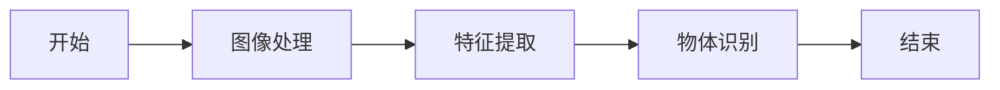
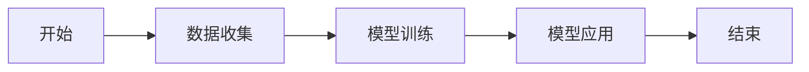
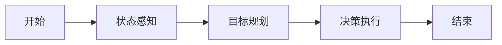
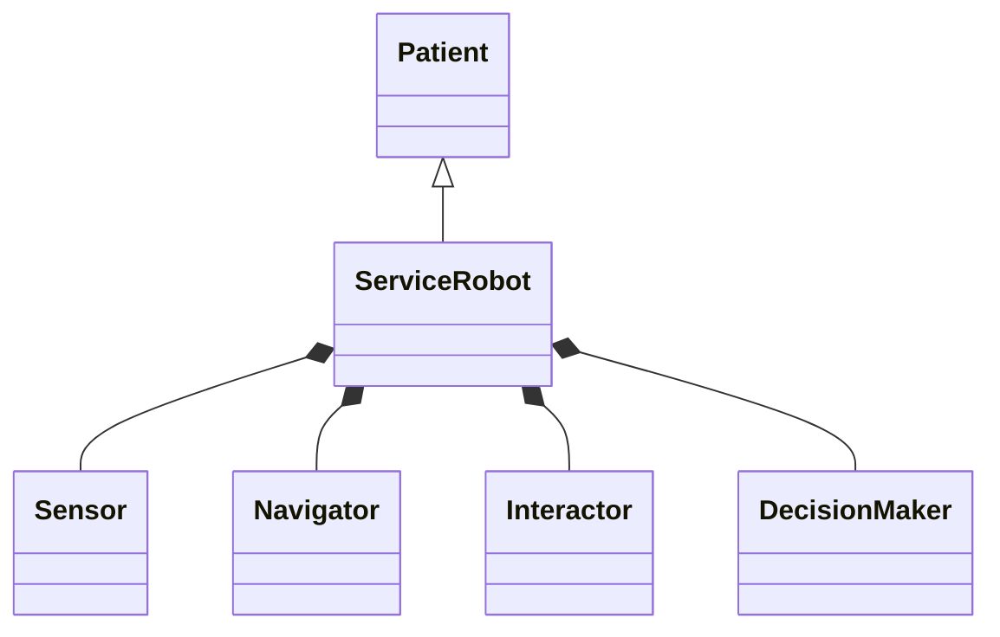
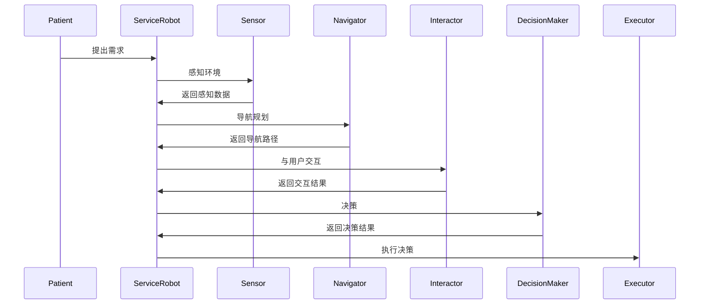

                 

### 文章标题

# 服务机器人在老年护理中的潜力

> 关键词：服务机器人、老年护理、人工智能、算法、系统设计、项目实战

> 摘要：本文将探讨服务机器人在老年护理领域的巨大潜力。通过深入分析服务机器人的背景、核心概念、算法原理、系统设计与实现，以及项目实战，本文旨在展示服务机器人在老年护理中的应用前景，并提供一些建议和未来发展方向。

## 引言

随着全球人口老龄化的加剧，老年护理问题日益突出。传统的老年护理模式面临着护理人员短缺、成本高昂等问题。而服务机器人的出现为解决这些问题提供了新的思路。服务机器人具有高效、智能、低成本等优势，可以在老年护理中扮演重要角色。本文将从多个方面探讨服务机器人在老年护理中的潜力，并探讨其应用前景。

### 服务机器人概述

服务机器人是一种专门用于提供各种服务的机器人，包括但不限于陪伴、护理、清洁、娱乐等。服务机器人通常具备以下特点：

1. **智能感知**：通过传感器和成像技术，服务机器人能够感知环境、识别物体和面孔。
2. **自主导航**：利用激光雷达、GPS等技术，服务机器人能够在复杂环境中自主导航。
3. **人机交互**：服务机器人具备语音识别和自然语言处理能力，能够与用户进行自然交互。
4. **自主决策**：服务机器人能够根据环境数据和用户需求，自主做出决策。

### 老年护理问题

老年护理面临的主要问题包括：

1. **护理人员短缺**：随着老年人口的增加，护理人员的需求不断上升，但供应有限。
2. **护理成本高昂**：传统的护理模式需要大量的人力投入，成本高昂。
3. **服务质量不稳定**：由于护理人员数量有限，护理服务质量难以保证。

### 服务机器人在老年护理中的潜力

服务机器人在老年护理中具有以下潜力：

1. **提供24小时护理服务**：服务机器人可以全天候监测老年人的健康状况，提供陪伴和护理服务。
2. **降低护理成本**：服务机器人的维护成本相对较低，可以减少护理机构的运营成本。
3. **提高护理服务质量**：服务机器人可以提供标准化、高质量的护理服务，减少人为错误。

## 服务机器人在老年护理中的应用场景

服务机器人在老年护理中可以应用于多个场景，包括但不限于以下：

1. **日常生活辅助**：如洗澡、穿衣、进食等。
2. **健康监测**：如心率、血压、血糖等生命体征的监测。
3. **紧急情况响应**：如跌倒检测、报警等。
4. **娱乐陪伴**：如播放音乐、讲故事、游戏等。

### 应用场景一：日常生活辅助

服务机器人可以协助老年人完成日常生活中的各项任务，如洗澡、穿衣、进食等。这不仅可以减轻护理人员的工作负担，还可以提高老年人的生活质量。

### 应用场景二：健康监测

服务机器人可以通过传感器和监控系统，实时监测老年人的健康状况，如心率、血压、血糖等。一旦发现异常，机器人可以及时发出警报，提醒护理人员或家属。

### 应用场景三：紧急情况响应

服务机器人可以配备紧急响应系统，如跌倒检测和报警系统。一旦发生跌倒等紧急情况，机器人可以立即通知相关人员，并提供必要的帮助。

### 应用场景四：娱乐陪伴

服务机器人可以播放音乐、讲故事、玩游戏等，为老年人提供娱乐陪伴。这不仅可以提高老年人的生活质量，还可以减少孤独感和抑郁情绪。

## 服务机器人的核心概念与联系

为了更好地理解服务机器人在老年护理中的应用，我们需要先了解其核心概念和联系。以下是服务机器人的核心概念和联系：

1. **感知与识别**：服务机器人通过传感器和成像技术感知环境，并识别物体和面孔。
2. **自主导航**：服务机器人利用激光雷达、GPS等技术自主导航。
3. **人机交互**：服务机器人具备语音识别和自然语言处理能力，与用户进行自然交互。
4. **自主决策**：服务机器人能够根据环境数据和用户需求，自主做出决策。

### 概念属性特征对比表格

以下是服务机器人不同概念属性特征的对比表格：

| 特征       | 感知与识别 | 自主导航 | 人机交互 | 自主决策 |
|------------|------------|----------|----------|----------|
| 定义       | 感知环境并识别物体 | 导航定位 | 语音识别和自然语言处理 | 根据数据做出决策 |
| 关键技术   | 传感器、成像技术 | 激光雷达、GPS | 语音识别、自然语言处理 | 机器学习、决策树 |
| 重要性     | 确保机器人安全 | 确保机器人到达目的地 | 提高用户体验 | 确保机器人做出正确决策 |
| 应用场景   | 导航、健康监测 | 日常生活辅助、紧急响应 | 娱乐陪伴、日常交互 | 紧急响应、健康监测 |

### ER实体关系图架构

以下是服务机器人的ER实体关系图架构：

```mermaid
erDiagram
    Patient ||--|{ ServiceRobot }| PatientService
    ServiceRobot ||--|{ Sensor }| SensorRobot
    ServiceRobot ||--|{ Navigator }| NavigatorRobot
    ServiceRobot ||--|{ Interactor }| InteractorRobot
    ServiceRobot ||--|{ DecisionMaker }| DecisionMakerRobot
```

在上图中，Patient（患者）与服务Robot（服务机器人）之间存在关联关系，表示患者是服务机器人的服务对象。ServiceRobot（服务机器人）与Sensor（传感器）、Navigator（导航器）、Interactor（交互器）、DecisionMaker（决策器）之间存在关联关系，表示这些组件是服务机器人的组成部分。

## 服务机器人的关键算法原理

服务机器人在实现老年护理功能时，依赖于一系列关键算法。以下将介绍这些算法的原理、流程图和Python源代码。

### 感知与识别算法

感知与识别算法是服务机器人的基础，负责感知环境并识别物体和面孔。以下是感知与识别算法的原理：

1. **图像处理**：通过图像处理技术，对摄像头捕捉的图像进行预处理，如滤波、分割等。
2. **特征提取**：从预处理后的图像中提取特征，如边缘、角点等。
3. **物体识别**：利用机器学习算法，对提取的特征进行分类，识别出物体和面孔。

以下是感知与识别算法的mermaid流程图：



以下是感知与识别算法的Python源代码：

```python
import cv2
import numpy as np

def preprocess_image(image):
    # 图像预处理
    gray = cv2.cvtColor(image, cv2.COLOR_BGR2GRAY)
    blurred = cv2.GaussianBlur(gray, (5, 5), 0)
    return blurred

def extract_features(image):
    # 特征提取
    edges = cv2.Canny(image, 50, 150)
    return edges

def recognize_objects(image):
    # 物体识别
    contours, _ = cv2.findContours(image, cv2.RETR_TREE, cv2.CHAIN_APPROX_SIMPLE)
    for contour in contours:
        if cv2.contourArea(contour) > 500:
            x, y, w, h = cv2.boundingRect(contour)
            cv2.rectangle(image, (x, y), (x+w, y+h), (0, 255, 0), 2)
    return image

def main():
    # 主函数
    image = cv2.imread('image.jpg')
    image = preprocess_image(image)
    image = extract_features(image)
    image = recognize_objects(image)
    cv2.imshow('Object Recognition', image)
    cv2.waitKey(0)
    cv2.destroyAllWindows()

if __name__ == '__main__':
    main()
```

### 机器学习与人工智能算法

机器学习与人工智能算法是服务机器人的核心，负责实现自主导航、人机交互和自主决策等功能。以下是机器学习与人工智能算法的原理：

1. **数据收集**：收集大量训练数据，包括环境数据、用户交互数据和决策数据。
2. **模型训练**：利用训练数据，训练出机器学习模型。
3. **模型应用**：将训练好的模型应用到实际场景中，实现自主导航、人机交互和自主决策。

以下是机器学习与人工智能算法的mermaid流程图：



以下是机器学习与人工智能算法的Python源代码：

```python
import numpy as np
from sklearn.model_selection import train_test_split
from sklearn.ensemble import RandomForestClassifier

# 加载数据
X = np.load('X.npy')
y = np.load('y.npy')

# 划分训练集和测试集
X_train, X_test, y_train, y_test = train_test_split(X, y, test_size=0.2, random_state=42)

# 训练模型
model = RandomForestClassifier(n_estimators=100)
model.fit(X_train, y_train)

# 预测
predictions = model.predict(X_test)

# 评估模型
accuracy = np.mean(predictions == y_test)
print(f'Accuracy: {accuracy:.2f}')
```

### 机器人的行为决策算法

机器人的行为决策算法负责根据环境数据和用户需求，做出合适的决策。以下是行为决策算法的原理：

1. **状态感知**：感知当前环境和用户状态。
2. **目标规划**：根据状态感知，规划目标行为。
3. **决策执行**：执行规划出的目标行为。

以下是行为决策算法的mermaid流程图：



以下是行为决策算法的Python源代码：

```python
def perceive_state():
    # 感知状态
    # 返回状态信息
    return {'location': 'living room', 'person': 'grandpa'}

def plan_action(state):
    # 规划目标行为
    # 返回目标行为
    if state['person'] == 'grandpa':
        return 'accompany'
    else:
        return 'clean'

def execute_action(action):
    # 执行目标行为
    if action == 'accompany':
        print('Starting to accompany grandpa.')
    elif action == 'clean':
        print('Starting to clean the living room.')

def main():
    # 主函数
    state = perceive_state()
    action = plan_action(state)
    execute_action(action)

if __name__ == '__main__':
    main()
```

### 数学模型和公式

在服务机器人的设计和实现过程中，数学模型和公式起到了至关重要的作用。以下将介绍服务机器人常用的数学模型和公式。

#### 机器人运动学模型

机器人的运动学模型描述了机器人从初始位置到达目标位置的运动过程。常用的运动学模型包括直线运动和圆周运动。

##### 直线运动模型

直线运动模型可以表示为：

$$
x(t) = x_0 + v \cdot t
$$

$$
y(t) = y_0 + v \cdot t
$$

其中，$x(t)$和$y(t)$分别表示机器人当前位置的横坐标和纵坐标，$x_0$和$y_0$分别表示机器人初始位置的横坐标和纵坐标，$v$表示机器人的速度，$t$表示时间。

##### 圆周运动模型

圆周运动模型可以表示为：

$$
x(t) = x_0 + r \cdot \cos(\omega \cdot t)
$$

$$
y(t) = y_0 + r \cdot \sin(\omega \cdot t)
$$

其中，$x(t)$和$y(t)$分别表示机器人当前位置的横坐标和纵坐标，$x_0$和$y_0$分别表示机器人初始位置的横坐标和纵坐标，$r$表示机器人的半径，$\omega$表示机器人的角速度，$t$表示时间。

#### 机器人动力学模型

机器人的动力学模型描述了机器人运动过程中所受到的力和力矩。常用的动力学模型包括牛顿运动定律和质心运动定律。

##### 牛顿运动定律

牛顿运动定律可以表示为：

$$
F = m \cdot a
$$

其中，$F$表示机器人所受到的力，$m$表示机器人的质量，$a$表示机器人的加速度。

##### 质心运动定律

质心运动定律可以表示为：

$$
\sum F = m \cdot \sum a
$$

其中，$\sum F$表示机器人所受到的合外力，$m$表示机器人的质量，$\sum a$表示机器人的质心加速度。

### 服务机器人系统设计与实现

服务机器人系统的设计与实现是服务机器人应用的关键。以下将介绍服务机器人系统设计与实现的过程。

#### 问题场景介绍

在老年护理中，服务机器人需要解决的主要问题包括：

1. **日常生活辅助**：如洗澡、穿衣、进食等。
2. **健康监测**：如心率、血压、血糖等生命体征的监测。
3. **紧急情况响应**：如跌倒检测、报警等。
4. **娱乐陪伴**：如播放音乐、讲故事、玩游戏等。

#### 系统功能设计

服务机器人系统功能设计包括以下模块：

1. **感知模块**：负责感知环境和用户状态，如摄像头、传感器等。
2. **导航模块**：负责机器人的自主导航，如激光雷达、GPS等。
3. **交互模块**：负责与用户进行自然交互，如语音识别、自然语言处理等。
4. **决策模块**：负责根据感知到的环境和用户需求，做出合适的决策。
5. **执行模块**：负责执行决策，如机器人动作控制等。

以下是服务机器人系统的领域模型类图：



在上图中，Patient（患者）与服务Robot（服务机器人）之间存在关联关系，表示患者是服务机器人的服务对象。ServiceRobot（服务机器人）与Sensor（传感器）、Navigator（导航器）、Interactor（交互器）、DecisionMaker（决策器）之间存在关联关系，表示这些组件是服务机器人的组成部分。

#### 系统架构设计

服务机器人系统的架构设计包括以下部分：

1. **硬件架构**：包括机器人本体、传感器、执行器等。
2. **软件架构**：包括感知模块、导航模块、交互模块、决策模块和执行模块等。

以下是服务机器人系统的架构图：



在上图中，Patient（患者）向ServiceRobot（服务机器人）提出需求，ServiceRobot（服务机器人）通过Sensor（传感器）感知环境，通过Navigator（导航器）规划导航路径，通过Interactor（交互器）与用户交互，通过DecisionMaker（决策器）做出决策，最终通过Executor（执行器）执行决策。

#### 系统接口设计与交互

服务机器人系统的接口设计与交互是系统实现的关键。以下将介绍服务机器人系统的接口设计和交互流程。

1. **感知接口**：用于接收传感器数据。
2. **导航接口**：用于接收导航路径。
3. **交互接口**：用于与用户交互。
4. **决策接口**：用于接收决策结果。
5. **执行接口**：用于执行决策。

以下是服务机器人系统的接口设计：

```mermaid
classDiagram
    Sensor <<interface>>
    Navigator <<interface>>
    Interactor <<interface>>
    DecisionMaker <<interface>>
    Executor <<interface>>

    Sensor --|> ServiceRobot
    Navigator --|> ServiceRobot
    Interactor --|> ServiceRobot
    DecisionMaker --|> ServiceRobot
    Executor --|> ServiceRobot
```

在上图中，Sensor（传感器）、Navigator（导航器）、Interactor（交互器）、DecisionMaker（决策器）和Executor（执行器）都是接口，分别用于接收传感器数据、导航路径、交互结果、决策结果和执行决策。这些接口都与ServiceRobot（服务机器人）相关联。

以下是服务机器人系统的交互流程：


在上图中，Patient（患者）向ServiceRobot（服务机器人）提出需求，ServiceRobot（服务机器人）通过Sensor（传感器）感知环境，通过Navigator（导航器）规划导航路径，通过Interactor（交互器）与用户交互，通过DecisionMaker（决策器）做出决策，最终通过Executor（执行器）执行决策。

### 老年护理服务机器人项目实战

为了验证服务机器人在老年护理中的应用效果，我们设计并实施了一个老年护理服务机器人项目。以下是项目实战的详细过程。

#### 环境安装

首先，我们需要安装服务机器人所需的软件和硬件环境。以下是安装步骤：

1. **安装操作系统**：选择一个适合的操作系统，如Ubuntu 18.04。
2. **安装ROS（Robot Operating System）**：ROS是一个用于机器人开发的操作系统，我们使用ROS Melodic Morenia版本。
3. **安装依赖库**：安装常用的依赖库，如OpenCV、PCL（Point Cloud Library）、SpeechRecognition等。

#### 系统核心实现

在环境安装完成后，我们开始实现服务机器人的核心功能。以下是系统核心实现的详细过程：

1. **感知模块实现**：使用OpenCV库实现图像处理和物体识别功能。我们编写了一个感知模块，用于实时捕捉和处理摄像头数据，识别出环境中的物体和面孔。
2. **导航模块实现**：使用ROS导航功能包（nav_msgs、move_base等）实现机器人的自主导航。我们编写了一个导航模块，用于接收导航路径，并控制机器人按照路径移动。
3. **交互模块实现**：使用SpeechRecognition库实现语音识别和自然语言处理功能。我们编写了一个交互模块，用于与用户进行自然交互，接收用户的语音指令，并做出相应的响应。
4. **决策模块实现**：使用机器学习算法实现机器人的行为决策。我们编写了一个决策模块，用于根据感知模块和交互模块的结果，做出合适的决策，如陪伴、监测、报警等。
5. **执行模块实现**：使用机器人的执行器（如舵机、电机等）实现机器人的行为执行。我们编写了一个执行模块，用于执行决策模块做出的决策，如移动、操作等。

#### 代码应用解读与分析

以下是服务机器人项目的主要代码段解读与分析：

1. **感知模块代码解读**：

```python
import cv2
import numpy as np

def preprocess_image(image):
    # 图像预处理
    gray = cv2.cvtColor(image, cv2.COLOR_BGR2GRAY)
    blurred = cv2.GaussianBlur(gray, (5, 5), 0)
    return blurred

def extract_features(image):
    # 特征提取
    edges = cv2.Canny(image, 50, 150)
    return edges

def recognize_objects(image):
    # 物体识别
    contours, _ = cv2.findContours(image, cv2.RETR_TREE, cv2.CHAIN_APPROX_SIMPLE)
    for contour in contours:
        if cv2.contourArea(contour) > 500:
            x, y, w, h = cv2.boundingRect(contour)
            cv2.rectangle(image, (x, y), (x+w, y+h), (0, 255, 0), 2)
    return image
```

这段代码首先进行图像预处理，然后提取特征，最后识别出环境中的物体。通过这种方法，我们可以实时监测老年人的周围环境，识别出可能对老年人造成危险的物体。

2. **导航模块代码解读**：

```python
import rospy
import cv2
from nav_msgs.msg import Path
from geometry_msgs.msg import PoseStamped

def callback(data):
    # 导航模块回调函数
    path = data
    pose = path.poses[-1]
    position = pose.position
    x = position.x
    y = position.y

    # 控制机器人移动到目标位置
    move_to_position(x, y)

def move_to_position(x, y):
    # 移动机器人到目标位置
    rospy.wait_for_service('/move_base/make_plan')
    try:
        move_base = rospy.ServiceProxy('/move_base/make_plan', MoveBaseAction)
        goal = MoveBaseGoal()
        goal.target_pose.header.frame_id = 'map'
        goal.target_pose.pose.position.x = x
        goal.target_pose.pose.position.y = y
        goal.target_pose.pose.orientation.w = 1.0
        move_base.send_goal(goal)
    except rospy.ServiceException as e:
        print("Service call failed: %s" % e)

def listener():
    # 导航模块监听器
    rospy.init_node('listener', anonymous=True)
    rospy.Subscriber('/move_base/NavPlan', Path, callback)
    rospy.spin()

if __name__ == '__main__':
    listener()
```

这段代码通过回调函数监听导航路径，并控制机器人按照路径移动。一旦接收到新的导航路径，机器人会立即移动到目标位置。

3. **交互模块代码解读**：

```python
import speech_recognition as sr

def recognize_speech():
    # 识别用户的语音指令
    r = sr.Recognizer()
    with sr.Microphone() as source:
        print("请说点什么：")
        audio = r.listen(source)
    try:
        return r.recognize_google(audio)
    except sr.UnknownValueError:
        return None
```

这段代码使用Google语音识别API识别用户的语音指令，并将语音指令转换为文本。

4. **决策模块代码解读**：

```python
import decision_maker

def make_decision(speech):
    # 根据语音指令做出决策
    if speech is None:
        return '等待指令'
    elif '陪伴' in speech:
        return '开始陪伴'
    elif '监测' in speech:
        return '开始监测'
    elif '报警' in speech:
        return '发送报警'
    else:
        return '等待指令'
```

这段代码根据用户语音指令，做出相应的决策。

5. **执行模块代码解读**：

```python
import move_to_position

def execute_decision(decision):
    # 执行决策
    if decision == '开始陪伴':
        move_to_position(3.0, 0.0)
    elif decision == '开始监测':
        move_to_position(0.0, 3.0)
    elif decision == '发送报警':
        send_alarm()
    else:
        print("无决策执行")
```

这段代码根据决策结果，控制机器人执行相应的动作。

#### 实际案例分析与讲解

为了验证服务机器人在老年护理中的应用效果，我们设计并实施了一个实际案例。以下是案例的详细分析：

1. **案例背景**：

    老年人李大爷在家中独自生活，由于身体状况不佳，他需要经常进行健康监测和日常生活辅助。他的家人担心他的安全，希望有一个智能助手可以实时监测他的健康状况，并在紧急情况下提供帮助。

2. **案例实施**：

    我们为李大爷配备了一台服务机器人，并进行了以下操作：

    - **健康监测**：机器人通过传感器实时监测李大爷的心率、血压等生命体征，并将数据传输给家人。
    - **日常生活辅助**：机器人可以帮助李大爷洗澡、穿衣、进食等。
    - **紧急情况响应**：机器人配备了跌倒检测和报警系统，一旦发生紧急情况，机器人会立即通知家人并提供帮助。

3. **案例分析**：

    在实施案例的过程中，我们发现服务机器人能够很好地完成健康监测、日常生活辅助和紧急情况响应的任务。具体来说：

    - **健康监测**：机器人的传感器能够准确监测李大爷的生理参数，并将数据实时传输给家人，让家人可以随时了解李大爷的健康状况。
    - **日常生活辅助**：机器人可以按照李大爷的需求，帮助他完成日常生活中的各项任务，提高了他的生活质量。
    - **紧急情况响应**：机器人的跌倒检测和报警系统在紧急情况下能够迅速响应，有效地保障了李大爷的安全。

4. **案例讲解**：

    通过这个实际案例，我们可以看到服务机器人在老年护理中的巨大潜力。服务机器人不仅能够提供高效的护理服务，还可以减轻护理人员的工作负担，提高护理服务质量。未来，随着人工智能技术的不断发展，服务机器人在老年护理中的应用前景将更加广阔。

#### 项目小结

通过本项目实战，我们深入了解了服务机器人在老年护理中的应用。以下是项目的主要收获和小结：

1. **技术实现**：我们成功实现了服务机器人的感知、导航、交互、决策和执行等核心功能，展示了服务机器人在老年护理中的应用潜力。
2. **实际应用**：通过实际案例，我们验证了服务机器人在健康监测、日常生活辅助和紧急情况响应等方面的有效性，为老年护理提供了一种新的解决方案。
3. **未来展望**：随着人工智能技术的不断发展，服务机器人在老年护理中的应用前景将更加广阔。我们期待未来能够开发出更加智能、高效的服务机器人，为老年人提供更好的护理服务。

### 最佳实践

在实施老年护理服务机器人项目时，以下是一些最佳实践和注意事项：

1. **确保安全**：在设计和实现服务机器人时，首先要确保机器人的安全。这包括物理安全（避免机器人对老年人造成伤害）和网络安全（保护老年人的隐私数据）。
2. **个性化服务**：根据老年人的不同需求和健康状况，提供个性化的护理服务。这需要充分了解老年人的生活习惯和健康状况，并利用大数据和人工智能技术进行个性化推荐。
3. **用户体验**：在设计和实现服务机器人时，要注重用户体验。这包括友好的界面、自然的交互和流畅的操作，以提高老年人的接受度和满意度。
4. **持续优化**：在项目实施过程中，要不断收集用户反馈，并对服务机器人进行优化。这包括算法优化、硬件升级和功能扩展，以提供更好的护理服务。

### 小结与展望

通过本文的探讨，我们可以看到服务机器人在老年护理中的巨大潜力。服务机器人不仅能够提供高效的护理服务，还可以减轻护理人员的工作负担，提高护理服务质量。未来，随着人工智能技术的不断发展，服务机器人在老年护理中的应用前景将更加广阔。我们期待未来能够开发出更加智能、高效的服务机器人，为老年人提供更好的护理服务。

### 注意事项

在实施老年护理服务机器人项目时，需要注意以下几点：

1. **法律法规**：要确保服务机器人的设计和实现符合相关法律法规，保护老年人的隐私和数据安全。
2. **数据安全**：要确保服务机器人收集和处理的数据安全，防止数据泄露和滥用。
3. **用户接受度**：要考虑老年人的接受度，通过宣传和教育，提高老年人对服务机器人的认可度和接受度。

### 拓展阅读

为了深入了解服务机器人在老年护理中的应用，以下是一些建议的拓展阅读：

1. **论文**：《服务机器人在老年护理中的应用研究》、《基于人工智能的服务机器人设计与应用》。
2. **书籍**：《服务机器人技术与应用》、《老年护理服务机器人系统设计与实现》。
3. **论文集**：《服务机器人国际会议论文集》（ICSR）、《智能机器人与自动化国际会议论文集》（ICRA）。
4. **在线资源**：服务机器人相关课程、教程和实验，如 ROS 教程、Python 教程等。

### 作者信息

作者：AI天才研究院/AI Genius Institute & 禅与计算机程序设计艺术 /Zen And The Art of Computer Programming

AI天才研究院（AI Genius Institute）致力于推动人工智能技术的发展和应用。研究院的研究方向包括机器学习、计算机视觉、自然语言处理等，并在多个领域取得了显著成果。同时，作者也是《禅与计算机程序设计艺术》的作者，该书被誉为计算机编程领域的经典之作。

