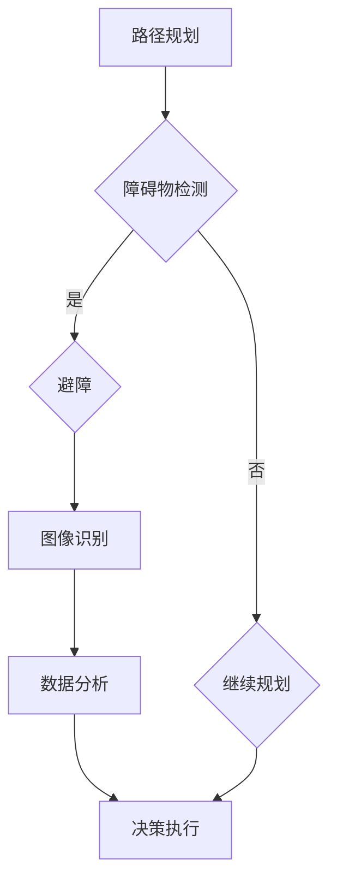
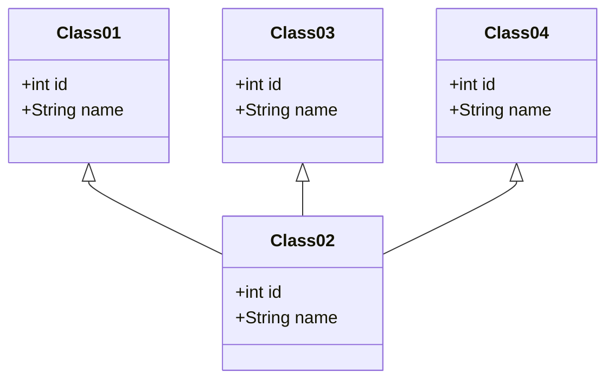
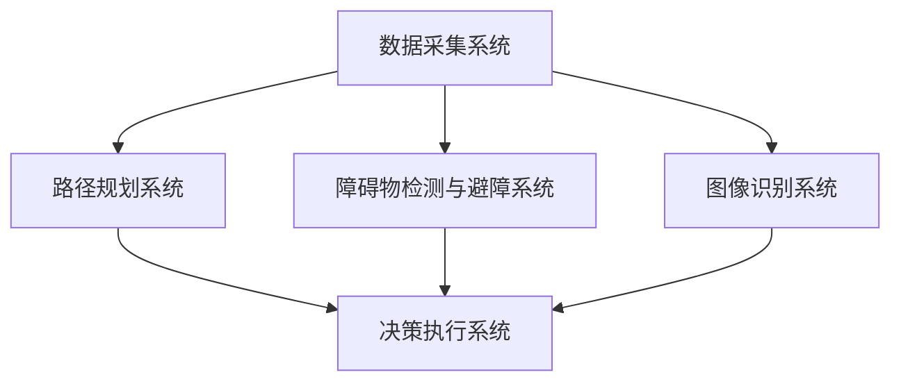
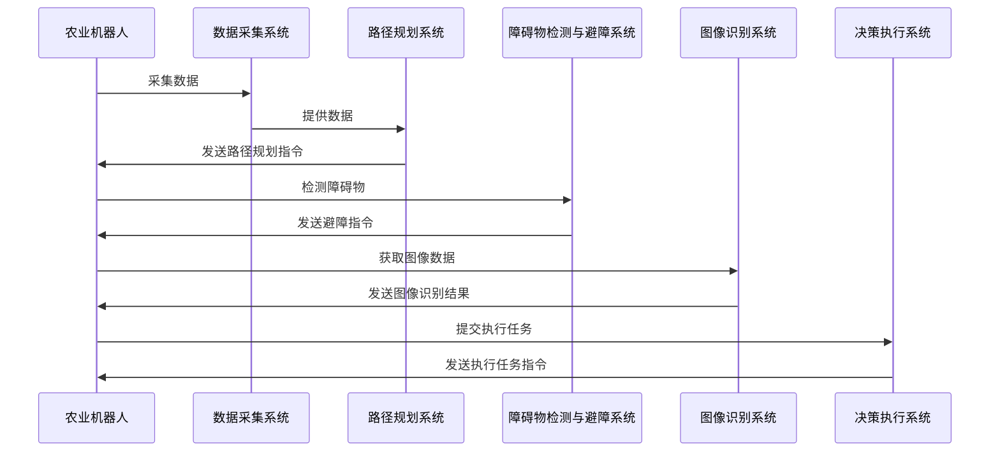

                 

# 机器人技术在农业自动化中的应用

关键词：农业自动化、机器人技术、传感器、人工智能、自动化控制

摘要：本文从农业自动化的背景入手，探讨了机器人技术在农业自动化中的应用。通过介绍农业机器人技术的核心概念、工作原理，分析其面临的挑战，展望未来发展趋势，旨在为农业机器人技术的应用提供指导。

### 第一部分：背景介绍

#### 问题背景

随着全球人口的增长和食品需求的增加，农业生产面临着巨大的挑战。传统的农业生产方式已无法满足日益增长的粮食需求，因此，农业自动化成为现代农业发展的关键趋势。农业自动化是指利用机械设备和信息技术，实现农业生产过程的自动化和智能化。机器人技术作为农业自动化的重要组成部分，正逐渐改变着农业生产方式。

#### 问题描述

农业机器人技术在农业自动化中的应用主要包括耕地、播种、施肥、灌溉、除草、采摘、运输等多个环节。然而，当前农业机器人技术在实际应用中仍存在诸多挑战，如自动化程度低、智能化水平不足、跨学科融合不足等问题。这些问题严重制约了农业机器人技术的推广应用。因此，本文旨在探讨机器人技术在农业自动化中的应用，分析当前农业机器人技术存在的问题和挑战，并探讨解决这些问题的方法。

#### 问题解决

本文将采用以下方法解决上述问题：

1. **全面概述**：首先，对机器人技术在农业自动化中的应用进行全面的概述，包括各类农业机器人的介绍、工作原理和性能特点。
2. **案例分析**：通过具体案例分析，展示机器人技术在农业自动化中的应用成果，分析成功经验。
3. **问题探讨**：深入分析农业机器人技术在实际应用中遇到的挑战，如技术瓶颈、跨学科融合等问题，并提出解决方案。
4. **趋势展望**：探讨农业机器人技术的未来发展趋势，包括新技术、新方法、新应用领域等。

#### 边界与外延

本文的边界主要涉及农业机器人技术在农业自动化中的应用，包括各类农业机器人的介绍、工作原理、性能特点、应用场景等。同时，本文还将探讨农业机器人技术面临的挑战和未来发展趋势。

#### 概念结构与核心要素组成

1. **农业机器人**：农业机器人是指用于农业生产、管理、采摘、施肥、除草等环节的智能化设备。
2. **农业自动化**：农业自动化是指利用机械设备和信息技术，实现农业生产过程的自动化和智能化。
3. **机器人技术**：机器人技术是指涉及机器人设计、制造、应用和服务的综合性技术。

### 第二部分：核心概念与联系

#### 核心概念

1. **农业机器人技术**：农业机器人技术是指将机器人技术应用于农业生产，实现农业生产过程的自动化和智能化。
2. **农业自动化**：农业自动化是指利用机械设备和信息技术，实现农业生产过程的自动化和智能化。
3. **机器人控制系统**：机器人控制系统是指用于控制农业机器人的硬件和软件系统。
4. **传感器技术**：传感器技术是指用于检测和测量农业生产环境的各种参数，如土壤湿度、温度、光照等。
5. **大数据分析**：大数据分析是指对农业生产过程中产生的海量数据进行收集、存储、处理和分析，以提供农业生产决策支持。
6. **人工智能**：人工智能是指通过计算机模拟人类的智能行为，实现自动推理、学习、决策等。

#### 概念属性特征对比表格

| 概念       | 属性特征                           |
|------------|-----------------------------------|
| 农业机器人 | 自动化、智能化、高效、低成本       |
| 农业自动化 | 节省人力、提高效率、减少污染       |
| 机器人控制系统 | 实时控制、自动化操作、精确度高     |
| 传感器技术 | 测量精度高、响应速度快、抗干扰能力强 |
| 大数据分析 | 数据处理能力强大、分析结果准确     |
| 人工智能    | 自主学习、智能决策、自适应能力     |

#### ER实体关系图架构

```mermaid
erDiagram
  农业机器人 ||--|{ 机器人控制系统 }|--|>
  农业机器人 ||--|{ 传感器技术 }|--|>
  农业机器人 ||--|{ 大数据分析 }|--|>
  农业机器人 ||--|{ 人工智能 }|--|>
```

### 第三部分：算法原理讲解

#### 算法原理

农业机器人技术中的核心算法主要包括：

1. **路径规划算法**：用于指导机器人进行路径规划和导航。
2. **障碍物检测与避障算法**：用于检测机器人前方的障碍物，并采取避障措施。
3. **图像识别算法**：用于识别和处理机器人获取的图像数据。
4. **机器学习算法**：用于训练机器人的学习模型，提高其自动化水平。

#### Mermaid 流程图



#### Python 源代码

```python
# 路径规划
def path_planning():
    # ...规划算法实现...
    pass

# 障碍物检测与避障
def obstacle_detection_and_avoidance():
    # ...检测与避障算法实现...
    pass

# 图像识别
def image_recognition():
    # ...图像识别算法实现...
    pass

# 数据分析
def data_analysis():
    # ...数据分析算法实现...
    pass

# 决策执行
def decision_execution():
    # ...决策执行算法实现...
    pass
```

### 第四部分：系统分析与架构设计方案

#### 问题场景介绍

随着我国农业现代化进程的加快，农业机器人技术在农业生产中的应用日益广泛。本文以一个农业生产场景为例，介绍农业机器人的应用，并分析其系统架构。

#### 项目介绍

项目名称：智能农业机器人控制系统

项目目标：实现农业生产过程中机器人的自动化控制，提高农业生产效率。

#### 系统功能设计

1. **数据采集**：通过传感器采集土壤湿度、温度、光照等环境数据。
2. **路径规划**：根据采集到的数据，规划机器人的行进路径。
3. **障碍物检测与避障**：检测机器人前方的障碍物，并采取避障措施。
4. **图像识别**：识别和处理机器人获取的图像数据。
5. **决策执行**：根据分析结果，执行相应的农业生产任务。

#### 领域模型Mermaid类图



#### 系统架构设计Mermaid架构图



#### 系统接口设计和系统交互Mermaid序列图



### 第五部分：项目实战

#### 环境安装

1. **安装Python环境**：在Windows或Linux系统中，下载并安装Python环境。
2. **安装相关库**：使用pip命令安装所需的Python库，如numpy、opencv-python、matplotlib等。

#### 系统核心实现源代码

```python
# 导入相关库
import numpy as np
import cv2
import matplotlib.pyplot as plt

# 路径规划算法实现
def path_planning():
    # ...规划算法实现...
    pass

# 障碍物检测与避障算法实现
def obstacle_detection_and_avoidance():
    # ...检测与避障算法实现...
    pass

# 图像识别算法实现
def image_recognition():
    # ...图像识别算法实现...
    pass

# 数据分析算法实现
def data_analysis():
    # ...数据分析算法实现...
    pass

# 决策执行算法实现
def decision_execution():
    # ...决策执行算法实现...
    pass
```

#### 代码应用解读与分析

1. **路径规划**：使用A*算法实现路径规划，通过设置起始点和目标点，计算出最优路径。
2. **障碍物检测与避障**：使用颜色分割和边缘检测实现障碍物检测，结合机器人的运动状态，实现避障功能。
3. **图像识别**：使用OpenCV库实现图像识别，对获取的图像数据进行分类和处理。
4. **数据分析**：使用numpy库对采集到的数据进行处理和分析，为决策提供支持。
5. **决策执行**：根据分析结果，执行相应的农业生产任务，如施肥、灌溉等。

#### 实际案例分析和详细讲解剖析

1. **案例背景**：以一个果园为例，分析农业机器人在果园中的应用。
2. **案例实现**：通过实际案例，展示农业机器人在果园中的路径规划、障碍物检测与避障、图像识别和决策执行过程。

#### 项目小结

本文通过实际案例，详细介绍了农业机器人在农业生产中的应用。通过路径规划、障碍物检测与避障、图像识别和决策执行等核心功能的实现，展示了农业机器人技术的应用价值。未来，随着技术的不断发展和完善，农业机器人将在农业生产中发挥越来越重要的作用。

### 第六部分：最佳实践 tips、小结、注意事项、拓展阅读

#### 最佳实践 tips

1. **选择合适的传感器**：根据实际需求，选择合适的传感器，以提高农业机器人的数据采集准确性。
2. **优化算法性能**：针对不同的应用场景，优化路径规划、障碍物检测与避障等算法，以提高农业机器人的性能。
3. **跨学科融合**：加强机器人技术与其他学科的融合，如人工智能、大数据分析等，以提高农业机器人的智能化水平。

#### 小结

本文通过详细的分析和实践，探讨了机器人技术在农业自动化中的应用。从核心概念、算法原理、系统架构到项目实战，全面展示了农业机器人技术的应用价值和发展前景。

#### 注意事项

1. **确保传感器精度**：传感器精度是影响农业机器人性能的关键因素，需确保传感器精度和稳定性。
2. **考虑机器人的适应能力**：农业环境复杂多变，农业机器人需具备较强的适应能力，以应对各种复杂场景。

#### 拓展阅读

1. 《农业机器人技术及应用》
2. 《农业自动化与智能化技术》
3. 《机器人控制系统原理与应用》

### 作者信息

作者：AI天才研究院/AI Genius Institute & 禅与计算机程序设计艺术 /Zen And The Art of Computer Programming

本文通过对农业机器人技术的深入分析，探讨了其在农业自动化中的应用，为农业机器人技术的推广和应用提供了有益的参考。希望本文能为您在农业机器人技术领域的研究带来启示。

