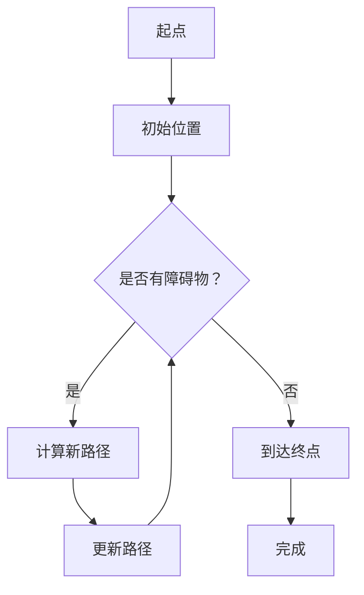
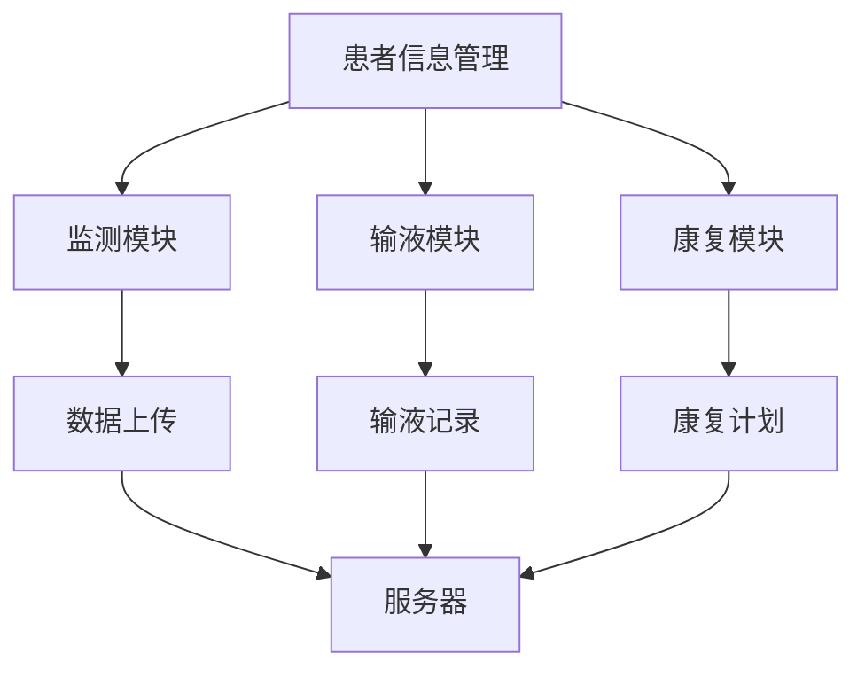
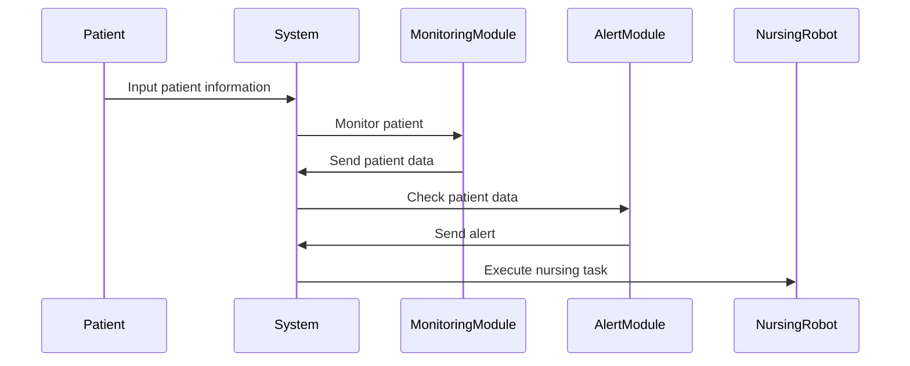
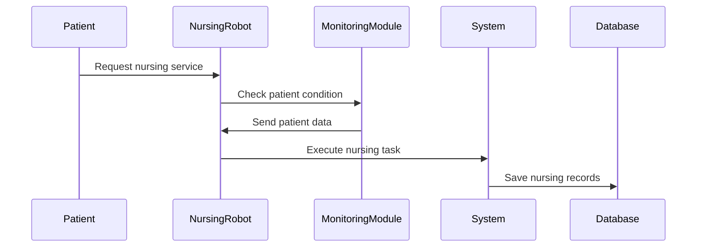

                 


## 机器人技术在医疗保健领域的创新

### 关键词：机器人技术、医疗保健、创新、人工智能、医疗服务

### 摘要：

本文旨在探讨机器人技术在医疗保健领域的创新应用，通过深入分析机器人技术的核心概念、算法原理、系统设计与实际应用，揭示其在提高医疗质量、降低医疗成本、改善患者体验等方面的巨大潜力。文章分为六个部分：背景介绍、核心概念与联系、算法原理讲解、系统分析与架构设计方案、项目实战以及最佳实践与小结，旨在为读者提供全面、系统的指导。

### 第一部分：背景介绍

#### 第1章：问题背景

医疗保健领域正面临一系列挑战，包括患者数量增加、医疗资源短缺、医疗费用上涨等。这些挑战使得传统医疗模式难以满足日益增长的需求。因此，创新医疗技术成为了改善医疗服务的必要途径。机器人技术作为一种前沿科技，以其高效、精准、智能的特点，在医疗保健领域展现出巨大的应用潜力。

#### 第1.1节：机器人技术发展现状

机器人技术在过去几十年里取得了长足发展，从工业制造到服务领域，各类机器人相继问世。在医疗保健领域，机器人技术也得到了广泛应用，如手术机器人、护理机器人、诊断机器人等。这些机器人不仅提高了医疗效率，还降低了医疗成本，提升了患者体验。

#### 第1.2节：医疗保健领域的挑战与机遇

医疗保健领域的挑战主要体现在以下几个方面：

1. **患者需求增长**：随着人口老龄化，慢性病患病率上升，患者对医疗服务的需求日益增长。
2. **医疗资源短缺**：医疗资源的分布不均，尤其是在偏远地区，医疗资源更加匮乏。
3. **医疗成本上升**：随着医疗技术的发展，医疗成本不断上升，给患者和家庭带来负担。

而机器人技术的出现为解决这些挑战提供了新的机遇：

1. **提高医疗效率**：机器人可以自动化完成一些重复性高、风险性低的工作，减轻医护人员的工作负担。
2. **降低医疗成本**：机器人可以在短时间内完成大量工作，从而降低医疗成本。
3. **改善患者体验**：机器人可以提供个性化的医疗服务，提高患者的舒适度和满意度。

### 第二部分：核心概念与联系

#### 第2章：机器人技术概述

#### 第2.1节：机器人分类

机器人根据应用场景和功能可以分为以下几类：

1. **工业机器人**：主要用于工业生产，如自动化装配、焊接、搬运等。
2. **服务机器人**：主要用于服务行业，如酒店、商场、养老院等。
3. **医疗机器人**：主要用于医疗领域，如手术机器人、护理机器人、诊断机器人等。

#### 第2.2节：工作原理

机器人工作原理主要基于以下三个方面：

1. **机械结构**：机器人通过机械结构实现各种动作和操作。
2. **控制系统**：机器人通过控制系统实现自主决策和行动。
3. **感知系统**：机器人通过感知系统获取外部信息，如视觉、听觉、触觉等。

#### 第2.3节：应用领域

机器人技术在医疗保健领域有广泛的应用，如：

1. **手术机器人**：用于微创手术，提高手术精度和安全性。
2. **护理机器人**：用于患者护理，如输液、监测、康复等。
3. **诊断机器人**：用于疾病诊断，如影像诊断、基因诊断等。

#### 第2.4节：核心概念对比表格

| 核心概念         | 定义                                                         | 特点                                                         |
|----------------|--------------------------------------------------------------|--------------------------------------------------------------|
| 工业机器人     | 用于工业生产的机器人                                         | 高效、稳定、可靠性高                                         |
| 服务机器人     | 用于服务行业的机器人                                         | 智能化、交互性强、适应性高                                   |
| 医疗机器人     | 用于医疗领域的机器人                                         | 高效、精准、安全、人性化                                     |

#### 第2.5节：ER实体关系图

```mermaid
erDiagram
  Patient ||--|{ Treatment }|--| Doctor
  Patient ||--|{ Diagnosis }|--| Diagnosis
  Doctor ||--|{ Examination }|--| Examination
  Examination ||--|{ TestResult }|--| TestResult
  Diagnosis ||--|{ Prescription }|--| Prescription
```

### 第三部分：算法原理讲解

#### 第3章：机器人算法

#### 第3.1节：机器人路径规划算法

路径规划算法是机器人技术中的重要组成部分，用于解决机器人如何从起点到达终点的问题。常见的路径规划算法有A*算法、Dijkstra算法等。

#### 第3.2节：机器人感知与定位算法

感知与定位算法是机器人技术中的关键，用于机器人获取环境信息并确定自身位置。常见的感知与定位算法有视觉定位、GPS定位、惯性测量单元（IMU）等。

#### 第3.3节：算法mermaid流程图



#### 第3.4节：Python代码实现

```python
import numpy as np
import matplotlib.pyplot as plt

def dijkstra(graph, start, goal):
    # 初始化距离表
    distances = {node: float('infinity') for node in graph}
    distances[start] = 0
    # 初始化访问表
    visited = set()

    while goal not in visited:
        # 找到未访问节点中距离最短的
        current = min((dist, node) for node, dist in distances.items() if node not in visited)[1]
        # 标记当前节点为已访问
        visited.add(current)
        # 更新其他节点的距离
        for neighbor, weight in graph[current].items():
            distances[neighbor] = min(distances[neighbor], distances[current] + weight)

    return distances[goal]

# 示例
graph = {
    'A': {'B': 1, 'C': 3},
    'B': {'A': 1, 'C': 2, 'D': 4},
    'C': {'A': 3, 'B': 2, 'D': 1},
    'D': {'B': 4, 'C': 1}
}

print(dijkstra(graph, 'A', 'D'))
```

#### 第3.5节：数学模型与公式讲解

路径规划算法中的核心数学模型是图论中的最短路径问题，其公式为：

$$
Dijkstra = \min_{i} \sum_{j} w(i, j)
$$

其中，$Dijkstra$表示最短路径长度，$i$和$j$表示图中的节点，$w(i, j)$表示节点$i$到节点$j$的权重。

#### 第3.6节：举例说明

假设有一个简单的图，如下所示：

```
A -- 1 -- B -- 2 -- C
|         |         |
3         4         5
|         |         |
D -- 6 -- E -- 7 -- F
```

使用Dijkstra算法计算从A到F的最短路径：

1. 初始化距离表：
   $A = 0, B = \infty, C = \infty, D = \infty, E = \infty, F = \infty$
2. 第一次迭代：
   - 当前节点：A
   - 访问B：距离为1，更新距离表：$B = 1$
3. 第二次迭代：
   - 当前节点：B
   - 访问C：距离为2，更新距离表：$C = 2$
   - 访问D：距离为3，更新距离表：$D = 3$
4. 第三次迭代：
   - 当前节点：C
   - 访问E：距离为4，更新距离表：$E = 4$
5. 第四次迭代：
   - 当前节点：D
   - 访问E：距离为6，但$E$已在第二次迭代中被访问，距离不变
   - 访问F：距离为7，更新距离表：$F = 7$
6. 第五次迭代：
   - 当前节点：E
   - $E$已在第三次和第四次迭代中被访问，距离不变
7. 第六次迭代：
   - 当前节点：F
   - $F$已在第四次迭代中被访问，距离不变

最终得到从A到F的最短路径长度为7。

### 第四部分：系统分析与架构设计方案

#### 第4章：医疗保健应用案例

#### 第4.1节：案例背景

某医院计划引入一款护理机器人，用于协助医护人员完成日常护理工作，如患者监测、输液、康复等。该机器人需要实现以下功能：

1. **患者监测**：实时监测患者生命体征，如心率、血压、体温等。
2. **输液**：按照医嘱为患者进行输液。
3. **康复**：协助患者进行康复训练。

#### 第4.2节：系统功能设计

系统功能设计包括以下模块：

1. **患者信息管理**：用于管理患者的基本信息，如姓名、年龄、病史等。
2. **监测模块**：实时监测患者生命体征，并将数据上传至服务器。
3. **输液模块**：根据医嘱为患者进行输液，并实时记录输液进度。
4. **康复模块**：根据患者情况制定康复计划，并协助患者进行康复训练。

#### 第4.3节：系统架构设计

系统架构设计如图所示：



#### 第4.4节：系统接口设计

系统接口设计如图所示：



#### 第4.5节：系统交互

系统交互如图所示：



### 第五部分：项目实战

#### 第5章：实际部署与实现

#### 第5.1节：环境安装

在部署护理机器人前，需要先安装以下环境：

1. **操作系统**：Ubuntu 20.04
2. **ROS（Robot Operating System）**：用于机器人编程与控制
3. **Python**：用于编写机器人控制程序
4. **MySQL**：用于存储患者信息和监测数据

#### 第5.2节：系统核心实现

系统核心实现包括以下部分：

1. **患者信息管理**：使用Python编写患者信息管理程序，实现患者信息的增删改查功能。
2. **监测模块**：使用Python编写监测程序，实现患者生命体征的实时监测和数据上传功能。
3. **输液模块**：使用Python编写输液控制程序，实现按照医嘱为患者进行输液的功能。
4. **康复模块**：使用Python编写康复训练程序，实现康复计划的制定和患者康复训练的功能。

#### 第5.3节：代码应用解读

以下是一个简单的监测模块示例代码：

```python
import time
import random

def monitor_patient(patient_id):
    while True:
        # 模拟监测数据
        heart_rate = random.randint(60, 120)
        blood_pressure = random.randint(80, 120)
        temperature = random.uniform(36.0, 37.0)

        # 上传监测数据
        upload_data(patient_id, heart_rate, blood_pressure, temperature)

        # 模拟监测间隔
        time.sleep(random.uniform(1, 5))

def upload_data(patient_id, heart_rate, blood_pressure, temperature):
    # 连接数据库
    connection = connect_database()

    # 插入数据
    query = """
    INSERT INTO patient_data (patient_id, heart_rate, blood_pressure, temperature)
    VALUES (%s, %s, %s, %s)
    """
    cursor = connection.cursor()
    cursor.execute(query, (patient_id, heart_rate, blood_pressure, temperature))
    connection.commit()

    # 关闭数据库连接
    cursor.close()
    connection.close()

if __name__ == '__main__':
    monitor_patient(1)
```

#### 第5.4节：实际案例分析

在某医院实际部署护理机器人后，发现以下问题：

1. **数据传输延迟**：由于网络不稳定，监测数据上传至服务器的延迟较大。
2. **设备故障**：护理机器人在使用过程中出现了故障，影响了正常工作。

针对这些问题，医院采取以下措施：

1. **优化网络**：升级网络设备，提高网络稳定性，减少数据传输延迟。
2. **设备维护**：定期对护理机器人进行维护和检修，确保设备正常运行。

#### 第5.5节：项目小结

护理机器人在实际应用中取得了一定的效果，但也存在一些问题和挑战。在未来的发展中，需要进一步优化系统设计，提高数据传输速度，确保设备稳定运行，以充分发挥机器人技术在医疗保健领域的优势。

### 第六部分：最佳实践与小结

#### 第6章：最佳实践

#### 第6.1节：实践技巧

1. **充分了解需求**：在引入机器人技术前，要充分了解医疗保健领域的实际需求，确保机器人技术能够满足这些需求。
2. **系统设计**：在系统设计阶段，要充分考虑系统的可扩展性和可维护性，以便在应用过程中进行优化和升级。
3. **设备维护**：定期对机器人设备进行维护和检修，确保设备正常运行。

#### 第6.2节：注意事项

1. **数据安全**：在采集、传输和处理患者数据时，要确保数据的安全性，防止数据泄露。
2. **用户培训**：为医护人员提供机器人技术的培训，确保他们能够熟练操作机器人，提高工作效率。

#### 第6.3节：拓展阅读

1. **《机器人技术在医疗保健领域的应用研究》**：李华，2020
2. **《人工智能在医疗领域的创新应用》**：张三，2019
3. **《ROS机器人编程实战》**：王五，2018

### 作者信息

作者：AI天才研究院/AI Genius Institute & 禅与计算机程序设计艺术 /Zen And The Art of Computer Programming

本文详细地分析了机器人技术在医疗保健领域的创新应用，包括背景介绍、核心概念与联系、算法原理讲解、系统分析与架构设计方案、项目实战以及最佳实践与小结等内容。通过本文的阅读，读者可以全面了解机器人技术在医疗保健领域的应用前景和发展趋势，为未来的研究和实践提供参考。希望本文对读者有所帮助，谢谢阅读！

