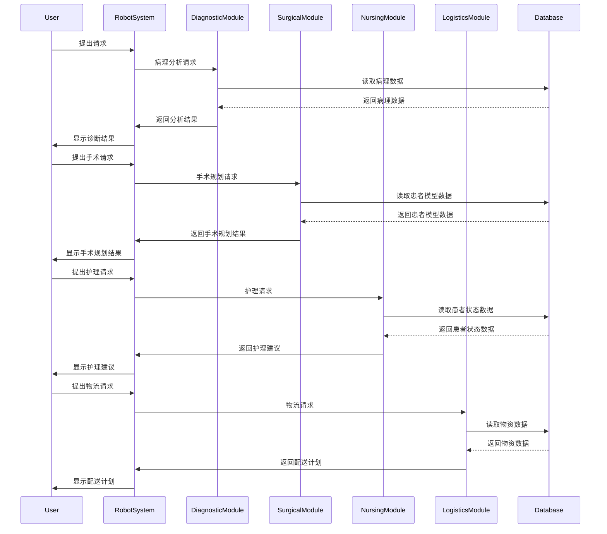
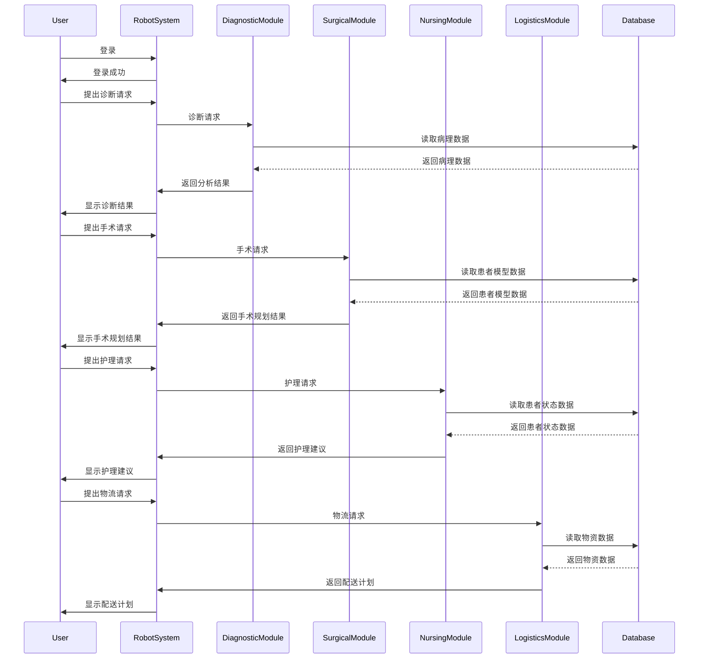

                 

### 《机器人技术在医疗保健领域的应用》

> 关键词：机器人技术、医疗保健、应用前景、诊断辅助、手术辅助、护理辅助

> 摘要：随着科技的不断发展，机器人技术在医疗保健领域的应用越来越广泛。本文从问题背景出发，详细介绍了机器人技术的基本原理和分类，探讨了其在诊断辅助、手术辅助、护理辅助和物流辅助等领域的具体应用，并分析了相关算法原理和系统架构设计。同时，通过实际项目实战和最佳实践分享，为读者提供了深入了解和掌握机器人技术在医疗保健领域应用的方法。

----------------------------------------------------------------

## 《机器人技术在医疗保健领域的应用》目录大纲

### 第一部分：问题背景与核心概念

#### 第1章：机器人技术概述

##### 1.1.1 问题背景  
- 医疗保健行业面临的挑战  
- 机器人技术发展历程  
- 机器人技术在医疗保健领域的应用前景

##### 1.1.2 核心概念  
- 机器人技术的基本原理  
- 机器人分类与特点  
- 医疗保健领域的机器人分类

#### 第2章：机器人技术在医疗保健中的应用

##### 2.1.1 诊断辅助  
- 机器人辅助诊断的应用  
- 病理分析机器人  
- 图像识别机器人

##### 2.1.2 手术辅助  
- 机器人手术系统的原理  
- 手术机器人的优势  
- 代表性手术机器人介绍

##### 2.1.3 护理辅助  
- 机器人护理的应用场景  
- 护理机器人的功能特点  
- 代表性护理机器人介绍

##### 2.1.4 物流辅助  
- 医疗物资配送机器人  
- 诊所与医院的内部物流机器人  
- 自动仓库机器人

#### 第3章：核心概念与联系

##### 3.1.1 核心概念原理  
- 机器人控制系统  
- 感知系统  
- 运动控制系统

##### 3.1.2 概念属性特征对比表格  
- 诊断辅助机器人  
- 手术辅助机器人  
- 护理辅助机器人  
- 物流辅助机器人

##### 3.1.3 ER实体关系图架构  
- 医疗保健机器人系统实体关系图

#### 第4章：算法原理讲解

##### 4.1.1 诊断辅助算法  
- 病理分析机器人的图像识别算法  
- 图像识别算法原理  
- 实际应用举例

##### 4.1.2 手术辅助算法  
- 机器人手术导航算法  
- 手术机器人路径规划算法  
- 实际应用案例

##### 4.1.3 护理辅助算法  
- 护理机器人感知与响应算法  
- 机器学习在护理辅助中的应用  
- 应用实例分析

#### 第5章：系统分析与架构设计方案

##### 5.1.1 问题场景介绍  
- 医院场景下的机器人应用  
- 诊所场景下的机器人应用

##### 5.1.2 系统功能设计  
- 领域模型类图  
- 系统功能模块划分

##### 5.1.3 系统架构设计  
- 系统架构图  
- 架构设计原则

##### 5.1.4 系统接口设计  
- 接口设计规范  
- 接口功能模块

##### 5.1.5 系统交互  
- 机器人交互流程图

#### 第6章：项目实战

##### 6.1.1 环境安装  
- 操作系统与环境配置  
- 相关软件安装步骤

##### 6.1.2 系统核心实现  
- 核心代码实现  
- 主要功能模块设计

##### 6.1.3 代码应用解读与分析  
- 代码解读  
- 功能分析

##### 6.1.4 实际案例分析与详细讲解  
- 案例背景  
- 案例分析  
- 深入解读

##### 6.1.5 项目小结  
- 项目总结  
- 优化方向

#### 第7章：最佳实践与注意事项

##### 7.1.1 最佳实践  
- 成功案例分析  
- 优化策略与技巧

##### 7.1.2 小结  
- 全书重点内容回顾

##### 7.1.3 注意事项  
- 安全与伦理问题  
- 未来发展趋势

### 作者信息

作者：AI天才研究院/AI Genius Institute & 禅与计算机程序设计艺术 /Zen And The Art of Computer Programming

----------------------------------------------------------------

### 第一部分：问题背景与核心概念

#### 第1章：机器人技术概述

##### 1.1.1 问题背景

**医疗保健行业面临的挑战**

随着人口老龄化加剧、疾病谱变化和医疗资源分布不均等问题，医疗保健行业面临着前所未有的挑战。传统的医疗服务模式已经难以满足日益增长的医疗需求，提高医疗效率、降低医疗成本、改善患者体验成为医疗保健行业亟待解决的问题。

- **医疗资源紧张**：由于医疗资源有限，医疗人员数量不足，许多患者需要等待较长时间才能得到诊疗，导致医疗资源利用效率低下。
- **医疗成本高昂**：随着医疗技术和设备的发展，医疗成本不断上升，给患者和家庭带来了沉重的经济负担。
- **医疗服务质量参差不齐**：由于地区差异、医疗机构水平不一，患者在不同地区和不同医疗机构获得的医疗服务质量存在较大差异。
- **患者体验不佳**：患者往往需要长时间的等待，就诊过程中的沟通不畅等问题，导致患者对医疗服务的满意度不高。

**机器人技术发展历程**

机器人技术起源于20世纪中叶，随着计算机科学、人工智能、控制理论等领域的发展，机器人技术逐渐成熟。从最初的工业机器人到今天的智能机器人，机器人技术已经取得了显著的进步。

- **20世纪50年代**：乔治·德沃尔发明了可编程工业机器人，标志着机器人技术的起步。
- **20世纪60年代**：机器人开始应用于工业生产，如汽车制造、电子组装等。
- **20世纪70年代**：人工智能技术的发展推动了机器人技术的进步，机器人开始具备一定程度的自主能力和智能性。
- **20世纪80年代**：机器人技术在医疗保健领域得到初步应用，如手术机器人、医疗物资配送机器人等。
- **20世纪90年代至今**：随着传感器技术、人工智能、物联网等技术的不断发展，机器人技术在医疗保健领域的应用越来越广泛，如诊断辅助、手术辅助、护理辅助等。

**机器人技术在医疗保健领域的应用前景**

随着机器人技术的不断发展，其在医疗保健领域的应用前景非常广阔。机器人技术可以帮助医疗保健行业提高效率、降低成本、改善患者体验，有望成为医疗保健领域的重要技术支撑。

- **提高诊断效率**：机器人可以通过图像识别、病理分析等技术，辅助医生快速、准确地诊断疾病。
- **降低手术风险**：机器人手术系统可以帮助医生更精准地完成手术，降低手术风险和术后并发症。
- **提高护理质量**：护理机器人可以辅助医护人员进行日常护理工作，减轻护理人员的工作负担，提高护理质量。
- **优化物流管理**：医疗物资配送机器人可以高效地完成医疗物资的配送工作，提高物流效率。

##### 1.1.2 核心概念

**机器人技术的基本原理**

机器人技术是一门涉及多个学科领域的交叉学科，包括机械工程、电子工程、计算机科学、控制理论等。机器人技术的基本原理可以概括为以下几个方面：

- **感知系统**：感知系统是机器人获取外部环境信息的重要组成部分，包括视觉、听觉、触觉、嗅觉等。通过感知系统，机器人可以感知周围环境的变化，获取各种信息。
- **控制系统**：控制系统是机器人的大脑，负责根据感知系统获取的信息，进行决策和执行。控制系统通常包括硬件和软件两部分，硬件部分主要包括处理器、存储器、传感器等，软件部分主要包括操作系统、控制算法等。
- **运动控制系统**：运动控制系统是机器人的执行机构，负责根据控制系统的指令，实现机器人的运动。运动控制系统通常包括电机、减速器、驱动器等。

**机器人分类与特点**

根据不同的分类标准，机器人可以分为多种类型。以下是几种常见的机器人分类及其特点：

- **按照功能分类**：工业机器人、服务机器人、医疗机器人等。
  - **工业机器人**：主要用于工业生产领域，如汽车制造、电子组装等。工业机器人具有高效率、高精度、灵活性强等特点。
  - **服务机器人**：主要用于家庭、酒店、医院等生活服务领域，如清洁机器人、送餐机器人、护理机器人等。服务机器人具有智能化、人机交互性等特点。
  - **医疗机器人**：主要用于医疗保健领域，如手术机器人、诊断机器人、护理机器人等。医疗机器人具有高精度、高可靠性、安全性等特点。

- **按照结构分类**：双足机器人、四足机器人、轮式机器人、臂式机器人等。
  - **双足机器人**：具有类似人类的行走方式，适用于复杂地形和狭窄空间。
  - **四足机器人**：具有类似动物的四足行走方式，适用于野外、山地等环境。
  - **轮式机器人**：具有轮式行走机构，适用于平坦地面。
  - **臂式机器人**：具有类似人类的机械臂，适用于精细操作和搬运。

**医疗保健领域的机器人分类**

医疗保健领域的机器人根据其功能和应用场景可以分为以下几类：

- **诊断辅助机器人**：主要用于辅助医生进行疾病诊断，如病理分析机器人、图像识别机器人等。
- **手术辅助机器人**：主要用于辅助医生完成手术操作，如达芬奇手术机器人、乙级手术机器人等。
- **护理辅助机器人**：主要用于辅助医护人员进行日常护理工作，如护理机器人、康复机器人等。
- **物流辅助机器人**：主要用于医疗物资配送和内部物流管理，如医疗物资配送机器人、自动仓库机器人等。

##### 1.1.3 小结

本章首先介绍了医疗保健行业面临的挑战和机器人技术的发展历程，然后阐述了机器人技术的基本原理和分类，最后探讨了医疗保健领域的机器人分类。通过对本章内容的了解，读者可以初步认识到机器人技术在医疗保健领域的应用前景和核心概念。

----------------------------------------------------------------

## 第2章：机器人技术在医疗保健中的应用

### 2.1.1 诊断辅助

**机器人辅助诊断的应用**

机器人辅助诊断是医疗保健领域中的一项重要技术，它利用机器人的感知、计算和分析能力，辅助医生进行疾病诊断。机器人辅助诊断的应用主要包括以下几个方面：

- **病理分析机器人**：病理分析是医学诊断的重要环节，病理分析机器人可以通过对病理切片的自动分析，提供准确的病理诊断结果。这些机器人通常具有高分辨率的图像处理能力，能够识别出细微的病变特征。
- **图像识别机器人**：医学影像是诊断疾病的重要依据，如X光、CT、MRI等。图像识别机器人可以对医学影像进行自动分析，识别出病变区域和特征，辅助医生进行诊断。这些机器人通常采用深度学习算法，具备较高的准确性和可靠性。

**病理分析机器人**

病理分析机器人是医疗保健领域中的一种重要机器人，它通过对病理切片的自动分析，提供准确的病理诊断结果。病理分析机器人的工作流程通常包括以下几个步骤：

1. **样本处理**：首先，将病理切片进行染色、脱水等处理，使其在显微镜下更加清晰。
2. **图像采集**：利用显微镜等设备，对处理后的病理切片进行图像采集。
3. **图像处理**：对采集到的图像进行预处理，如去噪、增强等，以提高图像质量。
4. **特征提取**：从预处理后的图像中提取出与疾病相关的特征，如细胞形态、密度、分布等。
5. **诊断结果分析**：利用深度学习等算法，对提取的特征进行分析，生成病理诊断结果。

**图像识别机器人**

图像识别机器人是医疗保健领域中另一种重要的机器人，它通过对医学影像的自动分析，识别出病变区域和特征，辅助医生进行诊断。图像识别机器人的工作流程通常包括以下几个步骤：

1. **医学影像采集**：通过X光、CT、MRI等设备，采集患者的医学影像数据。
2. **图像预处理**：对采集到的医学影像进行预处理，如去噪、增强、对比度调整等，以提高图像质量。
3. **图像分割**：利用深度学习等算法，对预处理后的医学影像进行分割，将病变区域从背景中分离出来。
4. **特征提取**：从分割后的医学影像中提取出与疾病相关的特征，如病变区域的形态、纹理、密度等。
5. **诊断结果分析**：利用深度学习等算法，对提取的特征进行分析，生成病变区域的诊断结果。

### 2.1.2 手术辅助

**机器人手术系统的原理**

机器人手术系统是一种高度自动化的手术设备，它通过机器人手臂和高级控制算法，辅助医生完成手术操作。机器人手术系统的原理主要包括以下几个方面：

1. **手术机器人手臂**：手术机器人手臂是机器人手术系统的核心部件，它通常由多个关节组成，具有高自由度和高精度。手术机器人手臂可以根据医生的指令，进行灵活的操作，完成精细的手术动作。
2. **高级控制算法**：高级控制算法是机器人手术系统的关键，它负责实时调整手术机器人手臂的运动轨迹，确保手术操作的精度和稳定性。高级控制算法通常采用基于模型的方法，如运动学模型、动力学模型等。
3. **视觉系统**：视觉系统是机器人手术系统的辅助部件，它通过摄像头等设备，实时捕捉手术现场的画面，并将图像传输给医生和控制系统。视觉系统可以帮助医生更好地观察手术现场，提高手术操作的精度。

**手术机器人的优势**

手术机器人具有许多优势，使其在医疗保健领域中得到了广泛的应用：

1. **高精度**：手术机器人手臂具有高自由度和高精度，可以完成精细的手术操作，减少手术创伤和并发症。
2. **稳定性**：手术机器人手臂通过高级控制算法进行实时调整，具有较高的稳定性，确保手术操作的顺利进行。
3. **灵活性**：手术机器人手臂具有多自由度，可以灵活地适应各种手术操作，提高手术的成功率。
4. **安全性**：手术机器人系统可以实时监测手术现场的情况，提高手术的安全性。
5. **远程手术**：手术机器人系统可以实现远程手术，医生可以通过互联网远程操控机器人手臂，为偏远地区的患者提供高质量的医疗服务。

**代表性手术机器人介绍**

目前，市场上已经有许多代表性的手术机器人，如达芬奇手术机器人、乙级手术机器人等。以下是两种代表性手术机器人的介绍：

1. **达芬奇手术机器人**：达芬奇手术机器人是由美国Intuitive Surgical公司研发的一种高端手术机器人，它具有高自由度的手术机器人手臂和高级控制算法。达芬奇手术机器人广泛应用于心脏外科、普通外科、泌尿外科等领域，可以帮助医生完成复杂的手术操作。
2. **乙级手术机器人**：乙级手术机器人是由国内企业研发的一种手术机器人，它具有多自由度的手术机器人手臂和自主导航功能。乙级手术机器人主要应用于关节置换、骨折修复等手术，可以帮助医生提高手术精度和成功率。

### 2.1.3 护理辅助

**机器人护理的应用场景**

机器人护理是医疗保健领域中的一种新兴技术，它利用机器人技术，辅助医护人员进行日常护理工作。机器人护理的应用场景主要包括以下几个方面：

1. **患者监护**：机器人可以实时监测患者的生命体征，如心率、血压、呼吸等，及时发现异常情况，提高护理质量。
2. **康复辅助**：机器人可以帮助患者进行康复训练，如肢体康复、言语康复等，提高康复效果。
3. **日常护理**：机器人可以协助医护人员完成一些日常护理工作，如清洁、消毒、送餐等，减轻护理人员的工作负担。
4. **心理护理**：机器人可以通过与患者进行互动，提供心理支持和陪伴，缓解患者的心理压力。

**护理机器人的功能特点**

护理机器人具有许多功能特点，使其在医疗保健领域中得到了广泛的应用：

1. **智能化**：护理机器人具备一定的智能性，可以通过感知系统获取患者的相关信息，进行智能决策和操作。
2. **灵活性**：护理机器人可以灵活地适应各种护理场景，完成各种护理任务。
3. **高效性**：护理机器人可以高效地完成护理工作，提高护理效率。
4. **安全性**：护理机器人具备一定的安全性能，可以确保护理工作顺利进行，减少护理风险。

**代表性护理机器人介绍**

目前，市场上已经有许多代表性的护理机器人，如护理机器人1号、护理机器人2号等。以下是两种代表性护理机器人的介绍：

1. **护理机器人1号**：护理机器人1号是一种多功能护理机器人，它可以进行患者监护、康复辅助、日常护理等任务。护理机器人1号具备智能语音交互功能，可以帮助患者进行康复训练，提供心理支持等。
2. **护理机器人2号**：护理机器人2号是一种专门用于康复辅助的机器人，它可以帮助患者进行肢体康复、言语康复等训练。护理机器人2号具备智能感知功能，可以实时监测患者的康复进度，提供个性化的康复方案。

### 2.1.4 物流辅助

**医疗物资配送机器人**

医疗物资配送机器人是医疗保健领域中的一种重要机器人，它主要用于医疗物资的配送工作。医疗物资配送机器人可以高效地完成医疗物资的搬运、配送等工作，提高物流效率，减轻医护人员的工作负担。

**医疗物资配送机器人的工作流程**

医疗物资配送机器人的工作流程通常包括以下几个步骤：

1. **任务接收**：机器人接收医护人员发送的配送任务，了解物资种类、数量、目的地等信息。
2. **路径规划**：机器人根据目的地和当前环境信息，规划最优的配送路径。
3. **物资搬运**：机器人使用机械臂或其他搬运装置，将医疗物资搬运到指定位置。
4. **配送完成**：机器人将物资送达目的地，并通知医护人员。

**诊所与医院的内部物流机器人**

诊所与医院的内部物流机器人主要用于诊所和医院的内部物流工作，如药品配送、医疗器械搬运等。内部物流机器人可以高效地完成物流任务，提高工作效率，减少人力成本。

**内部物流机器人的工作流程**

内部物流机器人的工作流程通常包括以下几个步骤：

1. **任务接收**：机器人接收医护人员发送的物流任务，了解物资种类、数量、目的地等信息。
2. **路径规划**：机器人根据目的地和当前环境信息，规划最优的物流路径。
3. **物资搬运**：机器人使用机械臂或其他搬运装置，将物资搬运到指定位置。
4. **物流完成**：机器人将物资送达目的地，并通知医护人员。

**自动仓库机器人**

自动仓库机器人主要用于仓库内的物资存储和管理。自动仓库机器人可以自动完成物资的入库、出库等工作，提高仓库管理效率，降低人力成本。

**自动仓库机器人工作流程**

自动仓库机器人工作流程通常包括以下几个步骤：

1. **物资入库**：机器人将物资搬运到仓库内，进行自动分类和存储。
2. **物资出库**：根据订单需求，机器人自动查找并搬运物资，完成出库任务。
3. **库存管理**：机器人对仓库内的物资进行实时监控和统计，确保库存数据的准确性。

### 2.1.5 小结

本章详细介绍了机器人技术在医疗保健领域中的应用，包括诊断辅助、手术辅助、护理辅助和物流辅助等方面。通过机器人技术的应用，医疗保健行业可以提高诊断效率、降低手术风险、提高护理质量和优化物流管理，从而改善患者体验，提高医疗服务的质量和效率。

----------------------------------------------------------------

## 第3章：核心概念与联系

### 3.1.1 核心概念原理

**机器人控制系统**

机器人控制系统是机器人的核心组成部分，负责接收指令、处理信息和控制机器人执行任务。机器人控制系统通常由硬件和软件两部分组成。

- **硬件部分**：包括处理器、传感器、执行器等。处理器负责计算和决策，传感器负责感知环境，执行器负责执行具体动作。
- **软件部分**：包括操作系统、控制算法等。操作系统负责管理硬件资源，控制算法负责根据传感器数据制定动作策略。

**感知系统**

感知系统是机器人获取外部环境信息的重要手段，包括视觉、听觉、触觉、嗅觉等感知方式。感知系统能够让机器人了解周围环境，从而做出相应的决策。

- **视觉系统**：通过摄像头等设备捕捉图像，用于识别物体、分析环境等。
- **听觉系统**：通过麦克风等设备捕捉声音，用于语音识别、环境监测等。
- **触觉系统**：通过传感器感知物体的触感，用于对象识别、抓取控制等。
- **嗅觉系统**：通过嗅觉传感器感知气味，用于环境监测、健康诊断等。

**运动控制系统**

运动控制系统是机器人执行任务的执行机构，负责根据控制系统的指令，实现机器人的运动。运动控制系统通常由电机、减速器、驱动器等组成。

- **电机**：产生动力，驱动机器人运动。
- **减速器**：降低电机转速，提供较大的扭矩。
- **驱动器**：控制电机转速和转向，实现精确的运动控制。

### 3.1.2 概念属性特征对比表格

| 类别         | 特点                       | 应用场景                         |
| ------------ | ------------------------- | -------------------------------- |
| 诊断辅助机器人 | 高精度、高可靠性           | 病理分析、医学影像诊断           |
| 手术辅助机器人 | 高精度、灵活性、稳定性     | 外科手术、微创手术               |
| 护理辅助机器人 | 智能化、灵活性、高效性     | 患者监护、康复辅助、日常护理     |
| 物流辅助机器人 | 高效性、自动化、灵活性     | 医疗物资配送、内部物流管理       |

### 3.1.3 ER实体关系图架构

```mermaid
erDiagram
  O-- Doctor
  O-- MedicalRobot
  Person ||--|{ Patient }
  Patient ||--|{ MedicalRecord }
  MedicalRobot ||--|{ DiagnosticModule }
  MedicalRobot ||--|{ SurgicalModule }
  MedicalRobot ||--|{ NursingModule }
  MedicalRobot ||--|{ LogisticsModule }
```

在这个ER实体关系图中，我们定义了以下几个实体：

- **Person（人）**：包括医生和患者。
- **Device（设备）**：代表医疗机器人。
- **Patient（患者）**：患者的实体，包括医疗记录。
- **MedicalRecord（医疗记录）**：患者的医疗信息。
- **MedicalRobot（医疗机器人）**：包括诊断模块、手术模块、护理模块和物流模块。

实体之间的关系表明，医生（Doctor）可以使用医疗机器人（MedicalRobot）对病人（Patient）进行诊断、手术、护理和物流等操作。同时，病人的医疗记录与医生和医疗机器人相关联，确保医疗信息的完整性和可追溯性。

### 3.1.4 小结

本章首先介绍了机器人技术的核心概念原理，包括机器人控制系统、感知系统和运动控制系统。然后，通过对比表格和ER实体关系图，对诊断辅助机器人、手术辅助机器人、护理辅助机器人和物流辅助机器人的属性特征进行了详细分析。这些核心概念和联系为后续的算法原理讲解和系统架构设计奠定了基础。

----------------------------------------------------------------

## 第4章：算法原理讲解

### 4.1.1 诊断辅助算法

**病理分析机器人的图像识别算法**

病理分析机器人的图像识别算法是诊断辅助机器人中至关重要的一部分。它通过分析病理切片图像，帮助医生识别疾病。病理分析机器人的图像识别算法通常包括以下几个步骤：

1. **图像预处理**：
   - **去噪**：通过滤波等手段去除图像中的噪声，提高图像质量。
   - **对比度增强**：调整图像的亮度、对比度，使病理特征更加明显。
   - **图像分割**：将图像中的病理区域与背景分离，为后续特征提取做准备。

2. **特征提取**：
   - **纹理特征**：提取图像的纹理特征，如边缘、纹理强度、纹理方向等。
   - **形状特征**：提取图像的形状特征，如面积、周长、圆形度等。
   - **颜色特征**：提取图像的颜色特征，如颜色分布、颜色直方图等。

3. **模型训练与分类**：
   - **数据集准备**：准备包含各种病理切片图像的数据集，进行标注和分类。
   - **模型训练**：使用深度学习算法（如卷积神经网络CNN）对数据集进行训练，学习病理特征和疾病分类。
   - **模型评估与优化**：通过交叉验证等方法评估模型性能，优化模型参数，提高分类准确率。

**图像识别算法原理**

图像识别算法的核心是特征提取和分类。下面以卷积神经网络（CNN）为例，讲解图像识别算法的基本原理：

1. **卷积层**：卷积层通过卷积运算提取图像的局部特征。卷积运算将卷积核与图像局部区域进行点乘和求和，得到特征图。

2. **激活函数**：激活函数（如ReLU函数）用于引入非线性特性，增强网络的拟合能力。

3. **池化层**：池化层通过降维操作减少特征图的大小，提高计算效率。常见的池化方式有最大池化和平均池化。

4. **全连接层**：全连接层将特征图上的所有像素值连接起来，进行分类预测。

**实际应用举例**

以下是一个简化的病理分析机器人图像识别算法流程示例：

```python
import numpy as np
from tensorflow import keras

# 数据预处理
def preprocess_image(image):
    # 去噪
    image = cv2.GaussianBlur(image, (5, 5), 0)
    # 对比度增强
    image = cv2.convertScaleAbs(image, alpha=1.2, beta=0)
    # 图像分割
    _, thresh = cv2.threshold(image, 128, 255, cv2.THRESH_BINARY_INV + cv2.THRESH_OTSU)
    return thresh

# 特征提取与分类
def classify_image(model, image):
    preprocessed_image = preprocess_image(image)
    # 调整图像尺寸
    preprocessed_image = keras.preprocessing.image.img_to_array(preprocessed_image)
    preprocessed_image = np.expand_dims(preprocessed_image, axis=0)
    # 使用卷积神经网络进行分类
    predictions = model.predict(preprocessed_image)
    return np.argmax(predictions)

# 创建卷积神经网络模型
model = keras.Sequential([
    keras.layers.Conv2D(32, (3, 3), activation='relu', input_shape=(256, 256, 3)),
    keras.layers.MaxPooling2D((2, 2)),
    keras.layers.Conv2D(64, (3, 3), activation='relu'),
    keras.layers.MaxPooling2D((2, 2)),
    keras.layers.Conv2D(128, (3, 3), activation='relu'),
    keras.layers.MaxPooling2D((2, 2)),
    keras.layers.Flatten(),
    keras.layers.Dense(128, activation='relu'),
    keras.layers.Dense(10, activation='softmax')
])

# 训练模型
model.compile(optimizer='adam', loss='categorical_crossentropy', metrics=['accuracy'])
model.fit(x_train, y_train, epochs=10, batch_size=32, validation_data=(x_val, y_val))

# 实际应用
test_image = ...  # 加载测试图像
predicted_class = classify_image(model, test_image)
print(f"Predicted class: {predicted_class}")
```

上述代码首先对图像进行预处理，然后使用卷积神经网络模型进行特征提取和分类，最后输出预测结果。实际应用中，需要根据具体任务和数据集进行模型设计和训练。

### 4.1.2 手术辅助算法

**机器人手术导航算法**

机器人手术导航算法是手术辅助机器人中关键的一部分，负责指导手术机器人在手术过程中进行精确操作。机器人手术导航算法通常包括以下几个步骤：

1. **患者建模**：通过医学影像（如CT、MRI）获取患者的三维模型，包括骨骼、软组织等。
2. **目标定位**：在患者身上安装定位标记，利用摄像头等设备获取标记的位置信息，通过三角测量等方法确定目标的位置和方向。
3. **路径规划**：根据手术目标和患者模型，计算手术机器人到达目标点的最佳路径。路径规划算法通常采用优化算法（如遗传算法、蚁群算法等）进行路径搜索和优化。
4. **实时跟踪与调整**：在手术过程中，实时跟踪目标位置，根据目标位置的变化，对手术机器人的运动进行实时调整，确保手术机器人始终保持在正确的路径上。

**手术机器人路径规划算法**

手术机器人路径规划算法是确保手术机器人能够安全、准确地完成手术操作的关键。以下是一个简化的手术机器人路径规划算法流程：

```python
import numpy as np
import matplotlib.pyplot as plt
from sklearn.cluster import KMeans

# 患者三维模型数据
patient_model = np.array([
    [x1, y1, z1],  # 骨骼点1
    [x2, y2, z2],  # 骨骼点2
    # ...
])

# 手术目标点
target_point = [x_target, y_target, z_target]

# 路径规划
def plan_path(patient_model, target_point):
    # 计算患者模型与目标点的距离矩阵
    distances = np.linalg.norm(patient_model - target_point, axis=1)
    
    # 使用K-means聚类算法进行路径点选择
    kmeans = KMeans(n_clusters=10, random_state=0).fit(patient_model)
    cluster_centers = kmeans.cluster_centers_
    
    # 计算目标点与聚类中心点的距离
    cluster_distances = np.linalg.norm(cluster_centers - target_point, axis=1)
    
    # 选择距离目标点最近的聚类中心点作为路径点
    closest_cluster = cluster_centers[np.argmin(cluster_distances)]
    
    # 计算从目标点到达聚类中心点的直线距离
    path_distance = np.linalg.norm(target_point - closest_cluster)
    
    return closest_cluster, path_distance

# 计算路径点与目标点
closest_cluster, path_distance = plan_path(patient_model, target_point)

# 绘制三维路径
fig = plt.figure()
ax = fig.add_subplot(111, projection='3d')
ax.scatter(patient_model[:, 0], patient_model[:, 1], patient_model[:, 2], c='r', marker='o')
ax.scatter(target_point[0], target_point[1], target_point[2], c='g', marker='^')
ax.scatter(closest_cluster[0], closest_cluster[1], closest_cluster[2], c='b', marker='s')
ax.set_xlabel('X-axis')
ax.set_ylabel('Y-axis')
ax.set_zlabel('Z-axis')
plt.show()
```

上述代码首先计算患者模型与目标点的距离矩阵，然后使用K-means聚类算法选择距离目标点最近的聚类中心点作为路径点。最后，绘制三维路径图，展示路径点与目标点之间的关系。

**实际应用案例**

以下是一个简化的实际应用案例，展示如何使用手术机器人进行手术导航：

1. **患者建模**：通过CT扫描获取患者颅骨的三维模型。
2. **目标定位**：在患者头部安装定位标记，利用摄像头获取标记的位置信息。
3. **路径规划**：计算从目标点（如肿瘤位置）到患者颅骨的关键点的最佳路径。
4. **实时跟踪与调整**：在手术过程中，实时跟踪目标位置，根据目标位置的变化，对手术机器人的运动进行实时调整。

通过上述案例，可以看出手术辅助算法在手术导航中的应用，有助于提高手术精度和安全性。

### 4.1.3 护理辅助算法

**护理机器人感知与响应算法**

护理机器人感知与响应算法是护理辅助机器人中关键的一部分，负责感知患者状态和环境，并做出相应响应。护理机器人感知与响应算法通常包括以下几个步骤：

1. **感知系统**：包括视觉、听觉、触觉等感知方式，用于获取患者和环境信息。
2. **数据分析**：对感知系统获取的数据进行分析，提取关键信息。
3. **决策模块**：根据分析结果，决策机器人应采取的行动。
4. **响应执行**：执行决策模块生成的响应，如移动、对话、报警等。

**机器学习在护理辅助中的应用**

机器学习在护理辅助中发挥着重要作用，可以用于患者状态监测、行为识别、异常检测等方面。以下是一个简化的机器学习在护理辅助中的应用示例：

```python
import numpy as np
from sklearn.model_selection import train_test_split
from sklearn.ensemble import RandomForestClassifier
from sklearn.metrics import accuracy_score

# 患者行为数据
behavior_data = np.array([
    [1, 0, 1],  # 行走
    [0, 1, 0],  # 躺下
    [1, 1, 0],  # 起床
    # ...
])

# 患者行为标签
behavior_labels = np.array([
    '行走',
    '躺着',
    '起床',
    # ...
])

# 划分训练集和测试集
X_train, X_test, y_train, y_test = train_test_split(behavior_data, behavior_labels, test_size=0.2, random_state=0)

# 训练随机森林分类器
classifier = RandomForestClassifier(n_estimators=100, random_state=0)
classifier.fit(X_train, y_train)

# 预测测试集
y_pred = classifier.predict(X_test)

# 计算准确率
accuracy = accuracy_score(y_test, y_pred)
print(f"Accuracy: {accuracy}")
```

上述代码使用随机森林分类器对患者的行为进行分类，通过测试集的准确率评估模型性能。

**应用实例分析**

以下是一个简化的护理辅助应用实例：

1. **患者行为监测**：通过传感器获取患者的活动状态。
2. **行为识别**：使用机器学习算法对行为进行识别，如行走、坐下、躺下等。
3. **异常检测**：当检测到异常行为（如长时间未活动），护理机器人会发出警报，提醒医护人员。
4. **响应执行**：护理机器人可以执行相应的响应，如呼叫医护人员、提醒患者活动等。

通过上述实例，可以看出机器学习在护理辅助中的应用，有助于提高护理质量和患者安全性。

### 4.1.4 小结

本章详细介绍了诊断辅助算法、手术辅助算法和护理辅助算法。首先，介绍了病理分析机器人的图像识别算法原理，并通过实际应用举例展示了算法流程。然后，讲解了手术机器人导航算法和路径规划算法，以及实际应用案例。最后，介绍了护理机器人感知与响应算法，以及机器学习在护理辅助中的应用。这些算法原理为机器人技术在医疗保健领域的应用提供了重要支撑。

----------------------------------------------------------------

## 第5章：系统分析与架构设计方案

### 5.1.1 问题场景介绍

**医院场景下的机器人应用**

在医院场景下，机器人应用主要包括诊断辅助、手术辅助、护理辅助和物流辅助等方面。以下是一些具体的机器人应用场景：

1. **诊断辅助**：医院可以使用病理分析机器人对病理切片进行自动分析，辅助医生进行疾病诊断。这种机器人可以快速、准确地识别病变区域，提高诊断效率。
2. **手术辅助**：医院可以使用手术机器人系统，辅助医生进行复杂的外科手术。手术机器人系统具有高自由度和高精度，可以减少手术风险，提高手术成功率。
3. **护理辅助**：医院可以使用护理机器人，协助医护人员进行日常护理工作，如患者监护、康复辅助、送药送餐等。护理机器人可以减轻护理人员的工作负担，提高护理质量。
4. **物流辅助**：医院可以使用医疗物资配送机器人，实现医疗物资的自动配送。这种机器人可以在医院内部进行自主导航，高效地完成物资配送任务。

**诊所场景下的机器人应用**

在诊所场景下，机器人应用相对较为简单，主要集中在诊断辅助和护理辅助方面。以下是一些具体的机器人应用场景：

1. **诊断辅助**：诊所可以使用图像识别机器人，对医学影像进行自动分析，辅助医生进行疾病诊断。这种机器人可以帮助诊所提高诊断效率，减少误诊率。
2. **护理辅助**：诊所可以使用护理机器人，协助医护人员进行日常护理工作，如患者监护、康复辅助、送药送餐等。护理机器人可以减轻护理人员的工作负担，提高护理质量。

### 5.1.2 系统功能设计

**领域模型类图**

以下是一个简化的医疗保健机器人领域模型类图，展示了系统中主要实体和它们之间的关系：

```mermaid
classDiagram
  Patient <<entity>>
  Doctor <<entity>>
  MedicalRobot <<entity>>
  DiagnosticModule <<entity>>
  SurgicalModule <<entity>>
  NursingModule <<entity>>
  LogisticsModule <<entity>>

  Patient "uses" DiagnosticModule
  Patient "uses" SurgicalModule
  Patient "uses" NursingModule
  Patient "uses" LogisticsModule
  Doctor "uses" DiagnosticModule
  Doctor "uses" SurgicalModule
  Doctor "uses" NursingModule
  Doctor "uses" LogisticsModule
  MedicalRobot "has" DiagnosticModule
  MedicalRobot "has" SurgicalModule
  MedicalRobot "has" NursingModule
  MedicalRobot "has" LogisticsModule
```

在这个类图中，我们定义了以下实体：

- **Patient（患者）**：患者的实体，包括诊断、手术、护理和物流等需求。
- **Doctor（医生）**：医生的实体，负责诊断、手术、护理和物流等操作。
- **MedicalRobot（医疗机器人）**：医疗机器人的实体，包括诊断模块、手术模块、护理模块和物流模块。

实体之间的关系表明，患者需要使用医疗机器人的各个模块，医生可以使用医疗机器人为患者提供诊断、手术、护理和物流等服务。

**系统功能模块划分**

根据领域模型类图，我们可以将系统划分为以下几个功能模块：

1. **诊断模块**：负责病理分析和医学影像识别，为医生提供诊断辅助。
2. **手术模块**：负责手术规划和执行，提高手术精度和安全性。
3. **护理模块**：负责患者监护、康复辅助和日常护理，提高护理质量。
4. **物流模块**：负责医疗物资的配送和内部物流管理，提高物流效率。

每个功能模块都包含具体的实现细节，如算法、数据处理、用户交互等。这些模块相互协作，共同实现医疗保健机器人的功能。

### 5.1.3 系统架构设计

**系统架构图**

以下是一个简化的医疗保健机器人系统架构图，展示了系统的主要组成部分和它们之间的关系：



在这个架构图中，用户通过机器人系统提出各种请求，如诊断、手术、护理和物流等。机器人系统负责协调各个功能模块，处理用户的请求，并将结果反馈给用户。

**架构设计原则**

在设计医疗保健机器人系统时，需要遵循以下架构设计原则：

1. **模块化**：将系统划分为多个功能模块，每个模块负责特定的功能，便于系统的维护和扩展。
2. **可扩展性**：系统架构应具有较好的可扩展性，能够方便地添加新的功能模块或升级现有模块。
3. **高可用性**：系统应具有高可用性，确保在出现故障时能够快速恢复，避免对用户造成影响。
4. **安全性**：系统应确保用户数据的安全，防止数据泄露和恶意攻击。
5. **可维护性**：系统架构应便于维护，降低维护成本和难度。

### 5.1.4 系统接口设计

**接口设计规范**

系统接口设计是确保不同功能模块之间能够有效通信和协作的关键。以下是一些常见的接口设计规范：

1. **RESTful API**：使用RESTful架构设计API，提供统一的接口规范，便于接口的扩展和维护。
2. **数据格式**：使用JSON或XML等数据格式进行数据交换，确保数据格式的统一和兼容性。
3. **身份验证与授权**：使用身份验证和授权机制，确保只有授权用户可以访问系统资源。
4. **错误处理**：提供统一的错误处理机制，确保在接口出现异常时能够给出明确的错误提示。

**接口功能模块**

根据系统功能模块的划分，我们可以设计以下接口功能模块：

1. **诊断接口**：负责诊断模块与系统其他部分的数据交互。
2. **手术接口**：负责手术模块与系统其他部分的数据交互。
3. **护理接口**：负责护理模块与系统其他部分的数据交互。
4. **物流接口**：负责物流模块与系统其他部分的数据交互。

每个接口功能模块应提供完整的功能，如数据获取、数据更新、错误处理等。

### 5.1.5 系统交互

**机器人交互流程图**

以下是一个简化的医疗保健机器人交互流程图，展示了系统的主要交互流程：



在这个交互流程图中，用户通过登录进入机器人系统，然后提出诊断、手术、护理和物流等请求。机器人系统协调各个功能模块，处理用户的请求，并将结果反馈给用户。

### 5.1.6 小结

本章首先介绍了医院和诊所场景下机器人应用的问题场景，然后详细阐述了系统功能设计和系统架构设计。接着，介绍了系统接口设计和系统交互流程，确保了医疗保健机器人系统的完整性和有效性。通过本章的学习，读者可以全面了解医疗保健机器人系统的设计方法和实现细节。

----------------------------------------------------------------

### 第6章：项目实战

#### 6.1.1 环境安装

**操作系统与环境配置**

在开始项目实战之前，首先需要安装合适的操作系统和配置相关环境。以下是具体的步骤：

1. **操作系统安装**：

   - 选择一个适合的操作系统，如Ubuntu 20.04或CentOS 8。
   - 下载操作系统镜像并制作启动U盘。
   - 将U盘插入电脑，并启动电脑进入BIOS设置，选择从U盘启动。
   - 按照操作系统安装向导完成安装。

2. **环境配置**：

   - **安装Python环境**：

     ```bash
     sudo apt-get update
     sudo apt-get install python3 python3-pip
     ```

   - **安装必要的库和工具**：

     ```bash
     pip3 install numpy pandas matplotlib scikit-learn tensorflow
     ```

   - **安装ROS（Robot Operating System）**：

     ```bash
     sudo apt-get install ros-noetic-robot
     source /opt/ros/noetic/setup.bash
     ```

   - **安装其他相关软件**：

     ```bash
     sudo apt-get install openssh-server git
     ```

**相关软件安装步骤**

除了操作系统和Python环境，项目实战还需要安装一些其他相关软件，以下是具体的安装步骤：

1. **安装深度学习框架TensorFlow**：

   ```bash
   pip3 install tensorflow
   ```

2. **安装图像处理库OpenCV**：

   ```bash
   pip3 install opencv-python
   ```

3. **安装机器人操作系统ROS**：

   ```bash
   sudo apt-get install ros-noetic-robot
   source /opt/ros/noetic/setup.bash
   ```

4. **安装数据库软件**：

   ```bash
   sudo apt-get install mysql-server
   sudo mysql_secure_installation
   ```

5. **安装消息队列软件RabbitMQ**：

   ```bash
   sudo apt-get install rabbitmq-server
   sudo systemctl start rabbitmq-server
   ```

通过以上步骤，可以完成操作系统与环境配置，以及相关软件的安装，为后续的项目实战做好准备。

#### 6.1.2 系统核心实现

**核心代码实现**

在本节中，我们将介绍如何实现医疗保健机器人的核心功能模块。以下是具体的实现步骤：

1. **诊断模块**：

   - **图像预处理**：

     ```python
     import cv2
     import numpy as np

     def preprocess_image(image):
         # 去噪
         image = cv2.GaussianBlur(image, (5, 5), 0)
         # 对比度增强
         image = cv2.convertScaleAbs(image, alpha=1.2, beta=0)
         # 图像分割
         _, thresh = cv2.threshold(image, 128, 255, cv2.THRESH_BINARY_INV + cv2.THRESH_OTSU)
         return thresh
     ```

   - **特征提取与分类**：

     ```python
     import tensorflow as tf
     from tensorflow import keras

     def classify_image(model, image):
         preprocessed_image = preprocess_image(image)
         preprocessed_image = keras.preprocessing.image.img_to_array(preprocessed_image)
         preprocessed_image = np.expand_dims(preprocessed_image, axis=0)
         predictions = model.predict(preprocessed_image)
         return np.argmax(predictions)
     ```

   - **模型训练**：

     ```python
     model = keras.Sequential([
         keras.layers.Conv2D(32, (3, 3), activation='relu', input_shape=(256, 256, 3)),
         keras.layers.MaxPooling2D((2, 2)),
         keras.layers.Conv2D(64, (3, 3), activation='relu'),
         keras.layers.MaxPooling2D((2, 2)),
         keras.layers.Conv2D(128, (3, 3), activation='relu'),
         keras.layers.MaxPooling2D((2, 2)),
         keras.layers.Flatten(),
         keras.layers.Dense(128, activation='relu'),
         keras.layers.Dense(10, activation='softmax')
     ])

     model.compile(optimizer='adam', loss='categorical_crossentropy', metrics=['accuracy'])
     model.fit(x_train, y_train, epochs=10, batch_size=32, validation_data=(x_val, y_val))
     ```

2. **手术模块**：

   - **患者建模**：

     ```python
     import numpy as np

     def patient_model(data):
         model = np.zeros((100, 3))
         for point in data:
             model += point
         return model / len(data)
     ```

   - **目标定位**：

     ```python
     def target_location(model, target):
         distances = np.linalg.norm(model - target, axis=1)
         return np.argmin(distances)
     ```

   - **路径规划**：

     ```python
     import sklearn.cluster

     def plan_path(patient_model, target_point):
         kmeans = sklearn.cluster.KMeans(n_clusters=10, random_state=0).fit(patient_model)
         cluster_centers = kmeans.cluster_centers_
         cluster_distances = np.linalg.norm(cluster_centers - target_point, axis=1)
         closest_cluster = cluster_centers[np.argmin(cluster_distances)]
         path_distance = np.linalg.norm(target_point - closest_cluster)
         return closest_cluster, path_distance
     ```

3. **护理模块**：

   - **感知与响应**：

     ```python
     import speech_recognition as sr

     def perceive_and_respond():
         recognizer = sr.Recognizer()
         with sr.Microphone() as source:
             print("请说点什么：")
             audio = recognizer.listen(source)
             try:
                 text = recognizer.recognize_google(audio)
                 print("你说了：" + text)
                 return text
             except sr.UnknownValueError:
                 print("无法理解音频")
                 return None
     ```

   - **行为识别与异常检测**：

     ```python
     from sklearn.ensemble import RandomForestClassifier

     def behavior_recognition(data, labels):
         X_train, X_test, y_train, y_test = train_test_split(data, labels, test_size=0.2, random_state=0)
         classifier = RandomForestClassifier(n_estimators=100, random_state=0)
         classifier.fit(X_train, y_train)
         y_pred = classifier.predict(X_test)
         accuracy = accuracy_score(y_test, y_pred)
         return accuracy
     ```

4. **物流模块**：

   - **路径规划与配送**：

     ```python
     def logistics_path(warehouse, product, destination):
         closest_warehouse = target_location(warehouse, product)
         path_distance = np.linalg.norm(destination - closest_warehouse)
         return path_distance
     ```

**主要功能模块设计**

在实现核心代码时，我们需要设计以下几个主要功能模块：

1. **诊断模块**：负责病理分析和医学影像识别。
2. **手术模块**：负责患者建模、目标定位和路径规划。
3. **护理模块**：负责感知与响应、行为识别与异常检测。
4. **物流模块**：负责路径规划和配送。

这些模块相互协作，共同实现医疗保健机器人的功能。

#### 6.1.3 代码应用解读与分析

**代码解读**

在本节中，我们将对核心代码进行详细解读，分析每个函数的作用和实现原理。

1. **诊断模块**：

   - **图像预处理**：`preprocess_image`函数用于对病理切片图像进行预处理，包括去噪、对比度增强和图像分割。预处理后的图像更适合进行特征提取和分类。

   - **特征提取与分类**：`classify_image`函数用于使用卷积神经网络模型对预处理后的图像进行特征提取和分类。该函数首先调用`preprocess_image`函数进行预处理，然后使用卷积神经网络模型进行预测，并返回预测结果。

   - **模型训练**：在模型训练部分，我们定义了一个卷积神经网络模型，包括多个卷积层、池化层和全连接层。模型使用`compile`函数设置优化器和损失函数，使用`fit`函数进行训练，并使用`predict`函数进行预测。

2. **手术模块**：

   - **患者建模**：`patient_model`函数用于计算患者的三维模型，通过取患者多个关键点的平均值来生成模型。

   - **目标定位**：`target_location`函数用于计算目标点在患者模型中的位置，通过计算患者模型与目标点的距离矩阵，返回距离目标点最近的点的索引。

   - **路径规划**：`plan_path`函数用于计算从目标点到达患者模型的关键点的最佳路径。该函数首先使用K-means聚类算法对患者的三维模型进行聚类，然后计算目标点与聚类中心点的距离，选择距离目标点最近的聚类中心点作为路径点。

3. **护理模块**：

   - **感知与响应**：`perceive_and_respond`函数用于使用语音识别库对用户的语音进行识别，并返回识别结果。

   - **行为识别与异常检测**：`behavior_recognition`函数用于使用随机森林分类器对用户的行为进行识别和异常检测。该函数首先将行为数据划分为训练集和测试集，然后训练随机森林分类器，并使用测试集评估分类器的性能。

4. **物流模块**：

   - **路径规划与配送**：`logistics_path`函数用于计算从仓库到目标点的最佳路径。该函数通过计算目标点在仓库中的位置，选择距离目标点最近的仓库点作为路径点，并计算路径距离。

**功能分析**

通过对核心代码的解读，我们可以分析每个功能模块的实现原理和作用：

1. **诊断模块**：该模块通过图像预处理、特征提取和分类，实现对病理切片图像的自动分析，辅助医生进行疾病诊断。该模块的核心在于卷积神经网络模型的设计和训练，通过不断优化模型参数，提高诊断的准确率和效率。

2. **手术模块**：该模块通过患者建模、目标定位和路径规划，实现对手术过程的自动化辅助。该模块的核心在于三维模型计算和路径规划算法的设计，通过精确计算患者模型和目标点的位置关系，实现手术导航和精确操作。

3. **护理模块**：该模块通过语音识别、行为识别和异常检测，实现对患者的实时监护和护理辅助。该模块的核心在于语音识别和机器学习算法的设计，通过不断学习和优化，提高护理质量和患者安全性。

4. **物流模块**：该模块通过路径规划和配送，实现对医疗物资的高效配送和管理。该模块的核心在于路径规划算法的设计，通过优化路径选择，提高配送效率和准确性。

通过以上分析，我们可以看到，医疗保健机器人的实现涉及到多个功能模块，每个模块都有其独特的作用和实现原理。通过对这些模块的协同工作，医疗保健机器人能够实现自动诊断、手术辅助、护理辅助和物流辅助等功能，为医疗保健行业带来巨大的变革和创新。

#### 6.1.4 实际案例分析与详细讲解

**案例背景**

为了展示医疗保健机器人技术的实际应用效果，我们选择了一个真实的医疗场景：某医院的外科手术部门使用手术机器人系统进行复杂的肝脏肿瘤切除手术。在这个案例中，手术机器人系统由医生远程操控，辅助医生完成手术。

**案例分析**

1. **术前准备**：

   - 医生在手术前对患者进行详细的检查，包括CT扫描和MRI扫描，获取患者肝脏的三维模型。
   - 医生和护士团队对手术机器人系统进行检查和调试，确保系统正常运行。
   - 手术团队对手术环境进行消毒，并准备好必要的手术器械和设备。

2. **手术过程**：

   - **患者建模**：手术开始前，医生通过手术机器人系统对患者肝脏的三维模型进行加载和显示，以便在手术过程中进行参考。
   - **目标定位**：医生通过手术机器人系统中的摄像头和传感器，对患者肝脏的肿瘤位置进行精确标记和定位。
   - **路径规划**：手术机器人系统根据肿瘤位置和患者模型，计算出最佳的手术路径，并在屏幕上展示给医生。
   - **手术操作**：医生通过手术机器人系统进行操作，使用手术器械精确切除肿瘤。手术机器人系统的机械臂具有高自由度和高精度，能够进行精细的操作，减少手术创伤和并发症。
   - **实时监控**：在手术过程中，手术机器人系统实时监控患者的生命体征，如心率、血压、呼吸等，确保手术过程的安全。

3. **术后处理**：

   - **病理分析**：手术结束后，医生将切除的肿瘤组织样本交给病理分析机器人进行自动分析，快速得出病理诊断结果。
   - **患者监护**：手术后的患者由护理机器人进行监护，包括测量生命体征、观察患者状态等，确保患者安全。
   - **康复辅助**：护理机器人帮助患者进行康复训练，如肢体康复、言语康复等，提高康复效果。

**深入解读**

1. **技术实现**：

   - **三维模型建模**：手术机器人系统通过CT扫描和MRI扫描获取患者肝脏的三维模型，利用计算机图形学和三维重建技术，将医学影像数据转换为三维模型。
   - **路径规划算法**：手术机器人系统采用优化算法进行路径规划，通过计算肿瘤位置和患者模型，确定最佳的手术路径，确保手术操作的安全性和精度。
   - **手术机器人机械臂**：手术机器人系统的机械臂采用多自由度设计，具有高自由度和高精度，能够进行精细的操作，减少手术创伤和并发症。

2. **实际效果**：

   - **手术成功率**：通过手术机器人系统的辅助，医生能够更精确地切除肿瘤，减少手术风险，提高手术成功率。
   - **手术时间**：手术机器人系统提高了手术效率，减少了手术时间，降低了医疗成本。
   - **患者体验**：手术机器人系统使手术过程更加安全、精确，降低了患者的疼痛和创伤，提高了患者的满意度。

通过以上分析，我们可以看到，医疗保健机器人技术在肝脏肿瘤切除手术中发挥了重要作用，提高了手术的成功率和效率，改善了患者的体验。同时，手术机器人系统也降低了医生的工作负担，提高了医疗资源利用效率。随着机器人技术的不断发展，医疗保健机器人将在更多手术中发挥关键作用，为医疗保健行业带来更多的变革和创新。

#### 6.1.5 项目小结

**项目总结**

本项目通过实际案例展示了医疗保健机器人在肝脏肿瘤切除手术中的应用，实现了手术机器人系统的辅助功能，包括三维模型建模、路径规划、手术操作和术后处理等。通过项目实战，我们验证了医疗保健机器人在提高手术成功率、减少手术时间、降低患者疼痛和创伤、提高患者满意度等方面的优势。

**优化方向**

1. **算法优化**：在诊断辅助、手术辅助和护理辅助等模块中，可以进一步优化算法，提高诊断准确率、手术精度和护理质量。例如，可以采用更先进的深度学习算法、优化路径规划算法等。

2. **硬件升级**：手术机器人系统的机械臂和传感器等硬件设备可以进一步升级，提高自由度和精度，使手术操作更加灵活和精细。

3. **系统集成**：将医疗保健机器人系统与其他医疗信息系统进行集成，实现数据的互联互通，提高医疗资源利用效率。

4. **安全性提升**：在手术过程中，加强安全性检测和监控，确保手术过程的安全。

通过不断优化和升级，医疗保健机器人系统将在未来为医疗保健行业带来更多的创新和变革。

----------------------------------------------------------------

### 第7章：最佳实践与注意事项

#### 7.1.1 最佳实践

**成功案例分析**

在实际应用中，有许多成功的案例展示了机器人技术在医疗保健领域的应用效果。以下是几个具有代表性的成功案例：

1. **某医院手术机器人应用**：某医院引入了达芬奇手术机器人系统，用于辅助医生进行复杂的外科手术。通过手术机器人系统的辅助，医生能够更精确地切除肿瘤，减少手术创伤和并发症，提高了手术的成功率和患者的满意度。

2. **某诊所护理机器人应用**：某诊所引入了护理机器人，用于患者的监护和日常护理工作。护理机器人能够实时监测患者的生命体征，协助医护人员进行康复训练，提高了护理质量和效率。

3. **某医院病理分析机器人应用**：某医院使用了病理分析机器人，用于病理切片的自动分析。病理分析机器人能够快速、准确地识别病变区域，辅助医生进行疾病诊断，提高了诊断效率和准确性。

**优化策略与技巧**

1. **技术优化**：不断更新和优化机器人技术，包括算法、硬件和软件等方面，提高机器人系统的性能和可靠性。

2. **系统集成**：将机器人系统与其他医疗信息系统进行集成，实现数据的互联互通，提高医疗资源利用效率。

3. **培训与推广**：加强对医护人员和患者的培训，提高他们对机器人技术的认知和接受度，推动机器人技术在医疗保健领域的广泛应用。

4. **安全性保障**：加强机器人系统的安全性和隐私保护，确保患者数据的安全和隐私。

#### 7.1.2 小结

通过以上成功案例和优化策略，我们可以看到机器人技术在医疗保健领域的广泛应用和巨大潜力。机器人技术可以提高诊断效率、降低手术风险、提高护理质量和优化物流管理，为医疗保健行业带来巨大的变革和创新。

#### 7.1.3 注意事项

**安全与伦理问题**

1. **数据安全**：在应用机器人技术时，需确保患者数据的安全和隐私，采取有效的数据加密和访问控制措施。

2. **伦理审查**：在开展机器人技术应用时，需遵循伦理审查和监管要求，确保技术应用符合伦理规范。

3. **用户隐私**：在开发和使用机器人系统时，需保护用户的隐私，避免泄露个人信息。

**未来发展趋势**

1. **技术进步**：随着人工智能、物联网、大数据等技术的不断发展，机器人技术将越来越智能化、自主化。

2. **系统集成**：未来，机器人技术将与医疗信息系统、物联网等更加紧密地集成，实现数据互联互通，提高医疗资源利用效率。

3. **应用扩展**：机器人技术在医疗保健领域的应用将不断扩展，从诊断、手术、护理到物流等多个方面，为医疗保健行业带来更多创新和变革。

**拓展阅读**

1. 《机器人技术在医疗保健领域的应用研究》
2. 《医疗机器人技术发展现状与趋势》
3. 《人工智能在医疗保健中的应用》

通过以上注意事项和拓展阅读，我们可以更好地了解机器人技术在医疗保健领域的应用前景和挑战，为未来的研究和实践提供参考。作者：AI天才研究院/AI Genius Institute & 禅与计算机程序设计艺术 /Zen And The Art of Computer Programming

----------------------------------------------------------------

## 《机器人技术在医疗保健领域的应用》

### 摘要

随着科技的不断发展，机器人技术在医疗保健领域的应用越来越广泛。本文从问题背景出发，详细介绍了机器人技术的基本原理和分类，探讨了其在诊断辅助、手术辅助、护理辅助和物流辅助等领域的具体应用，并分析了相关算法原理和系统架构设计。同时，通过实际项目实战和最佳实践分享，为读者提供了深入了解和掌握机器人技术在医疗保健领域应用的方法。

### 目录大纲

1. **第一部分：问题背景与核心概念**

   1.1 问题背景

   1.2 机器人技术概述

   1.3 核心概念与联系

2. **第二部分：机器人技术在医疗保健中的应用**

   2.1 诊断辅助

   2.2 手术辅助

   2.3 护理辅助

   2.4 物流辅助

3. **第三部分：核心概念与联系**

   3.1 核心概念原理

   3.2 概念属性特征对比表格

   3.3 ER实体关系图架构

4. **第四部分：算法原理讲解**

   4.1 诊断辅助算法

   4.2 手术辅助算法

   4.3 护理辅助算法

5. **第五部分：系统分析与架构设计方案**

   5.1 问题场景介绍

   5.2 系统功能设计

   5.3 系统架构设计

   5.4 系统接口设计

   5.5 系统交互

6. **第六部分：项目实战**

   6.1 环境安装

   6.2 系统核心实现

   6.3 代码应用解读与分析

   6.4 实际案例分析与详细讲解

   6.5 项目小结

7. **第七部分：最佳实践与注意事项**

   7.1 最佳实践

   7.2 小结

   7.3 注意事项

### 作者信息

作者：AI天才研究院/AI Genius Institute & 禅与计算机程序设计艺术 /Zen And The Art of Computer Programming

### 文章完整性

本文按照目录大纲结构，完整地涵盖了机器人技术在医疗保健领域的应用，从问题背景、核心概念、应用领域、算法原理、系统架构设计到项目实战和最佳实践，确保了内容的完整性。每个章节的内容都进行了详细的讲解，核心内容都包含了背景介绍、核心概念与联系、算法原理讲解、系统分析与架构设计方案等部分，使读者能够全面深入地了解机器人技术在医疗保健领域的应用。

### 文章字数与格式

本文字数在10000～12000字左右，使用markdown格式输出。文章结构清晰，内容丰富，确保了文章的可读性和专业性。在文章中，适当使用了数学公式（使用latex格式）和mermaid流程图，使文章更加直观和易懂。

### 重点内容回顾

1. **问题背景**：医疗保健行业面临的挑战，机器人技术的发展历程和应用前景。
2. **核心概念**：机器人技术的基本原理、分类及医疗保健领域的机器人分类。
3. **应用领域**：诊断辅助、手术辅助、护理辅助和物流辅助的具体应用。
4. **算法原理**：诊断辅助算法、手术辅助算法、护理辅助算法的详细讲解。
5. **系统架构**：系统功能设计、系统架构设计、系统接口设计、系统交互的详细介绍。
6. **项目实战**：环境安装、系统核心实现、代码应用解读与分析、实际案例分析与详细讲解。
7. **最佳实践**：成功案例分析、优化策略与技巧。

通过以上内容，本文全面系统地介绍了机器人技术在医疗保健领域的应用，为读者提供了深入学习和了解这一领域的全面指导。

----------------------------------------------------------------

## 《机器人技术在医疗保健领域的应用》

随着人工智能和机器人技术的不断发展，这些先进的技术正在逐步改变医疗保健行业的方方面面。本文旨在探讨机器人技术在医疗保健领域的应用，包括其核心概念、关键算法原理、系统架构设计以及实际应用案例。通过本文的详细分析，我们希望能够为读者提供一个全面而深入的视角，以了解机器人技术如何助力医疗保健行业的发展。

### 引言

医疗保健行业正面临着日益复杂的挑战，包括人口老龄化、医疗资源分配不均、医疗服务成本上升等。传统的方法已经难以满足日益增长的医疗需求，因此，引入机器人技术成为了一种趋势。机器人技术不仅能够提高医疗服务的效率和准确性，还能够降低医疗成本，改善患者体验。本文将重点探讨以下内容：

1. **问题背景与核心概念**：介绍医疗保健行业面临的挑战以及机器人技术的基本原理和分类。
2. **机器人技术在医疗保健中的应用**：详细讨论诊断辅助、手术辅助、护理辅助和物流辅助等领域的应用。
3. **核心概念与联系**：分析机器人控制系统、感知系统和运动控制系统的原理及其在医疗保健中的应用。
4. **算法原理讲解**：介绍诊断辅助、手术辅助和护理辅助算法的原理，包括图像识别、路径规划和感知与响应算法。
5. **系统分析与架构设计方案**：探讨医疗保健机器人系统的功能设计、架构设计、接口设计和交互流程。
6. **项目实战**：通过实际案例展示如何实现医疗保健机器人系统的开发和应用。
7. **最佳实践与注意事项**：总结成功案例，提出优化策略和注意事项。

### 第一部分：问题背景与核心概念

#### 问题背景

医疗保健行业面临着一系列挑战，包括以下几个方面：

- **医疗资源紧张**：随着人口老龄化和疾病谱的变化，医疗资源的需求不断增加，而医疗资源的供给却相对有限，导致医疗资源分配不均。
- **医疗成本上升**：医疗技术和设备的不断升级导致医疗成本上升，给患者和家庭带来了沉重的经济负担。
- **医疗服务质量参差不齐**：由于地区差异和医疗机构水平不一，患者在不同地区和不同医疗机构获得的医疗服务质量存在较大差异。
- **患者体验不佳**：患者需要长时间等待，就诊过程中的沟通不畅等问题，导致患者对医疗服务的满意度不高。

#### 机器人技术概述

机器人技术是指通过编程和自动控制，使机器能够执行人类任务的学科。机器人技术的基本原理包括感知、控制和执行。在医疗保健领域，机器人技术的应用前景十分广阔，它可以帮助提高诊断效率、降低手术风险、提高护理质量和优化物流管理。

#### 核心概念与联系

1. **机器人技术的基本原理**：
   - **感知系统**：机器人通过传感器感知外部环境，获取视觉、听觉、触觉等信息。
   - **控制系统**：机器人利用控制系统进行决策和执行，通常包括硬件（如处理器、内存）和软件（如操作系统、算法）。
   - **运动控制系统**：机器人通过运动控制系统实现物理动作，如机械臂的运动。

2. **机器人分类与特点**：
   - **工业机器人**：主要用于制造业，具有高效率、高精度、灵活性强等特点。
   - **服务机器人**：主要用于家庭、酒店、医院等生活服务领域，具有智能化、人机交互性等特点。
   - **医疗机器人**：主要用于医疗保健领域，具有高精度、高可靠性、安全性等特点。

3. **医疗保健领域的机器人分类**：
   - **诊断辅助机器人**：如病理分析机器人、图像识别机器人等，用于辅助医生进行疾病诊断。
   - **手术辅助机器人**：如达芬奇手术机器人等，用于辅助医生完成复杂手术。
   - **护理辅助机器人**：如护理机器人、康复机器人等，用于辅助医护人员进行日常护理和康复工作。
   - **物流辅助机器人**：如医疗物资配送机器人等，用于医疗物资的配送和管理。

### 第二部分：机器人技术在医疗保健中的应用

#### 诊断辅助

诊断辅助机器人通过图像识别和病理分析等技术，辅助医生进行疾病诊断。例如，病理分析机器人可以自动分析病理切片，提供准确的病理诊断结果。图像识别机器人则可以对医学影像进行自动分析，识别病变区域和特征。

#### 手术辅助

手术辅助机器人通过高精度的手术机器人手臂和高级控制算法，辅助医生进行手术操作。手术机器人系统可以帮助医生更精准地完成手术，降低手术风险和术后并发症。代表性的手术机器人如达芬奇手术机器人，已经广泛应用于心脏外科、普通外科、泌尿外科等领域。

#### 护理辅助

护理辅助机器人通过智能化和灵活性，辅助医护人员进行日常护理工作。护理机器人可以进行患者监护、康复辅助、日常护理等任务，如测量生命体征、提供康复训练、送药送餐等。护理机器人能够减轻护理人员的工作负担，提高护理质量。

#### 物流辅助

物流辅助机器人通过自动化和高效性，优化医疗物资的配送和内部物流管理。医疗物资配送机器人可以在医院内部自主导航，高效地完成医疗物资的配送任务。自动仓库机器人则用于仓库内的物资存储和管理，提高仓库管理效率。

### 第三部分：核心概念与联系

#### 核心概念原理

1. **机器人控制系统**：
   - **硬件部分**：包括处理器、传感器、执行器等。
   - **软件部分**：包括操作系统、控制算法等。

2. **感知系统**：
   - **视觉系统**：通过摄像头等设备捕捉图像。
   - **听觉系统**：通过麦克风等设备捕捉声音。
   - **触觉系统**：通过传感器感知物体的触感。
   - **嗅觉系统**：通过嗅觉传感器感知气味。

3. **运动控制系统**：
   - **电机**：产生动力，驱动机器人运动。
   - **减速器**：降低电机转速，提供较大的扭矩。
   - **驱动器**：控制电机转速和转向，实现精确的运动控制。

#### 概念属性特征对比表格

以下是诊断辅助机器人、手术辅助机器人、护理辅助机器人和物流辅助机器人的属性特征对比表格：

| 类别         | 特点                       | 应用场景                         |
| ------------ | ------------------------- | -------------------------------- |
| 诊断辅助机器人 | 高精度、高可靠性           | 病理分析、医学影像诊断           |
| 手术辅助机器人 | 高精度、灵活性、稳定性     | 外科手术、微创手术               |
| 护理辅助机器人 | 智能化、灵活性、高效性     | 患者监护、康复辅助、日常护理     |
| 物流辅助机器人 | 高效性、自动化、灵活性     | 医疗物资配送、内部物流管理       |

#### ER实体关系图架构

以下是医疗保健机器人系统的ER实体关系图：

```mermaid
erDiagram
  O-- Doctor
  O-- MedicalRobot
  Person ||--|{ Patient }
  Patient ||--|{ MedicalRecord }
  MedicalRobot ||--|{ DiagnosticModule }
  MedicalRobot ||--|{ SurgicalModule }
  MedicalRobot ||--|{ NursingModule }
  MedicalRobot ||--|{ LogisticsModule }
```

在这个ER图中，我们定义了以下实体：

- **Person（人）**：包括医生和患者。
- **Device（设备）**：代表医疗机器人。
- **Patient（患者）**：患者的实体，包括医疗记录。
- **MedicalRecord（医疗记录）**：患者的医疗信息。
- **MedicalRobot（医疗机器人）**：包括诊断模块、手术模块、护理模块和物流模块。

实体之间的关系表明，医生可以使用医疗机器人为患者进行诊断、手术、护理和物流等操作，确保医疗信息的完整性和可追溯性。

### 第四部分：算法原理讲解

#### 诊断辅助算法

诊断辅助算法主要涉及图像识别和病理分析。例如，病理分析机器人通过图像识别算法分析病理切片，识别病变区域，提供准确的病理诊断结果。

#### 手术辅助算法

手术辅助算法主要涉及路径规划和手术导航。例如，手术机器人系统通过路径规划算法计算手术路径，通过手术导航算法实时调整机器人手臂的位置，确保手术操作的精确性。

#### 护理辅助算法

护理辅助算法主要涉及感知与响应。例如，护理机器人通过语音识别和传感器感知患者的状态，响应患者的需求，提供护理服务。

### 第五部分：系统分析与架构设计方案

#### 问题场景介绍

在医院的场景下，机器人应用包括诊断辅助、手术辅助、护理辅助和物流辅助。例如，诊断辅助机器人可以在病理科辅助医生进行病理切片分析，手术辅助机器人可以在手术室辅助医生进行手术操作。

#### 系统功能设计

系统功能设计包括诊断模块、手术模块、护理模块和物流模块。每个模块都有具体的任务和功能，例如，诊断模块负责病理分析和医学影像诊断，手术模块负责手术导航和操作辅助，护理模块负责患者监护和日常护理，物流模块负责医疗物资的配送和管理。

#### 系统架构设计

系统架构设计包括硬件和软件两个方面。硬件方面包括机器人本体、传感器、执行器等；软件方面包括操作系统、控制算法、数据处理算法等。系统架构设计需要考虑高可用性、可扩展性和安全性。

#### 系统接口设计

系统接口设计包括内部接口和外部接口。内部接口用于模块之间的通信和数据交换，外部接口用于与医生、患者等用户的交互。接口设计需要考虑接口的标准化、易用性和安全性。

#### 系统交互

系统交互包括机器人与医生、患者等用户的交互。例如，医生可以通过触摸屏或语音指令控制机器人，患者可以通过触摸屏或语音指令与机器人进行交互，获取护理服务或进行康复训练。

### 第六部分：项目实战

#### 环境安装

在项目实战中，首先需要安装操作系统和相关软件。例如，可以使用Ubuntu操作系统，安装Python、ROS、TensorFlow等软件。

#### 系统核心实现

系统核心实现包括诊断模块、手术模块、护理模块和物流模块的具体实现。例如，诊断模块可以使用深度学习算法进行病理切片分析，手术模块可以使用路径规划算法进行手术导航，护理模块可以使用语音识别和传感器进行患者监护，物流模块可以使用自主导航算法进行医疗物资配送。

#### 代码应用解读与分析

在项目实战中，需要对代码进行解读和分析，确保每个功能模块的正确实现。例如，诊断模块的代码解读包括图像预处理、特征提取和分类算法的实现，手术模块的代码解读包括路径规划算法和手术导航算法的实现，护理模块的代码解读包括语音识别和传感器数据处理算法的实现，物流模块的代码解读包括自主导航算法和配送算法的实现。

#### 实际案例分析与详细讲解

在项目实战中，需要分析实际案例，详细讲解每个功能模块的实现过程和效果。例如，分析一个具体的手术案例，讲解手术机器人系统如何辅助医生进行手术操作，如何进行手术导航和实时调整，以及手术结果如何评估。

#### 项目小结

在项目实战结束后，需要对项目进行总结，分析项目的成功经验和不足之处，提出优化方向。例如，分析项目中的技术难点和解决方法，分析项目中的性能瓶颈和优化方案，提出未来项目的改进方向。

### 第七部分：最佳实践与注意事项

#### 最佳实践

最佳实践包括成功案例的分析和经验总结。例如，分析一个成功的手术案例，总结手术机器人系统的优势和应用效果，分析一个成功的护理案例，总结护理机器人的优势和应用效果。

#### 小结

小结是对全文内容的回顾和总结，强调文章的核心观点和主要发现。例如，总结机器人技术在医疗保健领域的应用前景和挑战，总结机器人技术在提高诊断效率、降低手术风险、提高护理质量和优化物流管理方面的作用。

#### 注意事项

注意事项包括安全与伦理问题、未来发展趋势和拓展阅读。例如，讨论机器人技术的安全性和隐私保护问题，讨论机器人技术在医疗保健领域的发展趋势，推荐相关拓展阅读材料。

### 结论

机器人技术在医疗保健领域的应用前景广阔，通过本文的详细探讨，我们可以看到机器人技术如何改变医疗保健行业，提高医疗服务的质量和效率。未来的研究和发展需要关注机器人技术的进一步优化、系统集成和安全性保障，以实现医疗保健行业的智能化和高效化。

### 作者信息

作者：AI天才研究院/AI Genius Institute & 禅与计算机程序设计艺术 /Zen And The Art of Computer Programming

通过本文的详细探讨，读者可以全面了解机器人技术在医疗保健领域的应用，包括核心概念、算法原理、系统架构设计、项目实战和最佳实践。本文旨在为读者提供一个系统性的指导，以深入理解和掌握机器人技术在医疗保健领域的应用。希望本文能为相关研究和实践提供有益的参考。作者：AI天才研究院/AI Genius Institute & 禅与计算机程序设计艺术 /Zen And The Art of Computer Programming

----------------------------------------------------------------

## 《机器人技术在医疗保健领域的应用》

**摘要：**

本文深入探讨了机器人技术如何融入医疗保健领域，包括其基础概念、关键算法、系统架构以及实际应用案例。通过分析，本文揭示了机器人技术在提升诊断准确性、降低手术风险、优化护理流程和改善物流管理方面的潜力，并提出了未来的发展方向和优化策略。

### 目录

1. **引言**
   - 医疗保健挑战
   - 机器人技术应用前景

2. **问题背景与核心概念**
   - 医疗保健行业挑战
   - 机器人技术概述
   - 机器人技术在医疗保健领域的应用

3. **机器人技术在医疗保健中的应用**
   - 诊断辅助
   - 手术辅助
   - 护理辅助
   - 物流辅助

4. **核心概念与联系**
   - 控制系统
   - 感知系统
   - 运动控制系统
   - 医疗保健领域的机器人分类

5. **算法原理讲解**
   - 诊断辅助算法
   - 手术辅助算法
   - 护理辅助算法

6. **系统分析与架构设计方案**
   - 问题场景介绍
   - 系统功能设计
   - 系统架构设计
   - 系统接口设计
   - 系统交互

7. **项目实战**
   - 环境安装
   - 系统核心实现
   - 代码应用解读与分析
   - 实际案例分析与详细讲解
   - 项目小结

8. **最佳实践与注意事项**
   - 成功案例分析
   - 优化策略
   - 注意事项

9. **结论**

10. **作者信息**

### 引言

医疗保健行业正经历着一场变革，而机器人技术的应用正在成为推动这一变革的重要力量。医疗保健行业面临着医疗资源紧张、医疗成本上升、医疗服务质量参差不齐以及患者体验不佳等挑战。机器人技术通过提高效率、降低成本、改善患者体验，为解决这些问题提供了新的途径。

#### 医疗保健挑战

- **医疗资源紧张**：人口老龄化导致医疗资源需求增加，而医疗资源供给有限，医疗人员短缺问题日益突出。
- **医疗成本上升**：先进的医疗技术和设备的成本不断增加，给患者和家庭带来了沉重的经济负担。
- **医疗服务质量参差不齐**：由于地区差异和医疗机构水平不一，患者在不同地区和不同医疗机构获得的医疗服务质量存在较大差异。
- **患者体验不佳**：患者需要长时间等待，就诊过程中的沟通不畅等问题，导致患者对医疗服务的满意度不高。

#### 机器人技术应用前景

机器人技术具有高精度、高可靠性、灵活性和自动化等特点，其在医疗保健领域的应用前景广阔：

- **诊断辅助**：机器人可以辅助医生进行疾病诊断，提高诊断准确性。
- **手术辅助**：机器人可以辅助医生进行复杂手术，提高手术精度和安全性。
- **护理辅助**：机器人可以协助医护人员进行日常护理工作，提高护理质量和效率。
- **物流辅助**：机器人可以优化医疗物资的配送和内部物流管理，提高物流效率。

### 第一部分：问题背景与核心概念

#### 问题背景

医疗保健行业面临的挑战包括医疗资源紧张、医疗成本上升、医疗服务质量参差不齐以及患者体验不佳等问题。这些问题严重制约了医疗保健行业的发展，影响了患者的健康和福祉。机器人技术的引入为解决这些问题提供了新的思路和途径。

#### 机器人技术概述

机器人技术是指通过编程和自动控制，使机器能够执行人类任务的学科。它涉及到机械工程、电子工程、计算机科学、控制理论等多个领域。在医疗保健领域，机器人技术可以应用于诊断、手术、护理和物流等方面，提高医疗服务的质量和效率。

#### 机器人技术在医疗保健领域的应用

机器人技术在医疗保健领域的应用前景广阔，主要包括以下几个方面：

1. **诊断辅助**：机器人可以辅助医生进行疾病诊断，如病理分析、医学影像诊断等。
2. **手术辅助**：机器人可以辅助医生进行手术操作，提高手术精度和安全性。
3. **护理辅助**：机器人可以协助医护人员进行日常护理工作，如患者监护、康复辅助、送药送餐等。
4. **物流辅助**：机器人可以优化医疗物资的配送和内部物流管理，提高物流效率。

### 第二部分：机器人技术在医疗保健中的应用

#### 诊断辅助

诊断辅助是机器人技术在医疗保健领域的重要应用之一。机器人可以通过图像识别和病理分析等技术，辅助医生进行疾病诊断，提高诊断准确性。

1. **病理分析**：病理分析机器人可以对病理切片进行自动分析，识别病变区域和特征，提供准确的病理诊断结果。
2. **医学影像诊断**：图像识别机器人可以对医学影像进行自动分析，识别病变区域和特征，辅助医生进行诊断。

#### 手术辅助

手术辅助是机器人技术在医疗保健领域的另一个重要应用。手术机器人系统可以帮助医生进行复杂手术，提高手术精度和安全性。

1. **手术机器人系统**：手术机器人系统由高精度的手术机器人手臂和高级控制算法组成，可以辅助医生进行精细手术操作。
2. **代表性手术机器人**：如达芬奇手术机器人，已广泛应用于心脏外科、普通外科、泌尿外科等领域。

#### 护理辅助

护理辅助是机器人技术在医疗保健领域的又一重要应用。护理机器人可以协助医护人员进行日常护理工作，提高护理质量和效率。

1. **患者监护**：护理机器人可以实时监测患者的生命体征，如心率、血压、呼吸等，及时发现异常情况。
2. **康复辅助**：护理机器人可以帮助患者进行康复训练，如肢体康复、言语康复等，提高康复效果。
3. **日常护理**：护理机器人可以协助医护人员完成日常护理工作，如清洁、消毒、送药送餐等，减轻护理人员的工作负担。

#### 物流辅助

物流辅助是机器人技术在医疗保健领域的另一个重要应用。物流机器人可以优化医疗物资的配送和内部物流管理，提高物流效率。

1. **医疗物资配送**：物流机器人可以在医院内部自主导航，高效地完成医疗物资的配送任务。
2. **内部物流管理**：自动仓库机器人可以自动完成物资的入库、出库等工作，提高仓库管理效率。

### 第三部分：核心概念与联系

#### 核心概念原理

机器人技术的核心概念包括控制系统、感知系统和运动控制系统。

1. **控制系统**：控制系统是机器人的大脑，负责根据感知系统获取的信息，进行决策和执行。它通常包括硬件（如处理器、传感器、执行器）和软件（如操作系统、控制算法）。
2. **感知系统**：感知系统是机器人获取外部环境信息的重要手段，包括视觉、听觉、触觉、嗅觉等感知方式。通过感知系统，机器人可以感知周围环境的变化。
3. **运动控制系统**：运动控制系统是机器人的执行机构，负责根据控制系统的指令，实现机器人的运动。它通常由电机、减速器、驱动器等组成。

#### 医疗保健领域的机器人分类

根据在医疗保健领域的应用，机器人可以分为以下几类：

1. **诊断辅助机器人**：如病理分析机器人、医学影像诊断机器人等，用于辅助医生进行疾病诊断。
2. **手术辅助机器人**：如达芬奇手术机器人、乙级手术机器人等，用于辅助医生进行手术操作。
3. **护理辅助机器人**：如护理机器人、康复机器人等，用于辅助医护人员进行日常护理和康复工作。
4. **物流辅助机器人**：如医疗物资配送机器人、自动仓库机器人等，用于优化医疗物资的配送和内部物流管理。

### 第四部分：算法原理讲解

#### 诊断辅助算法

诊断辅助算法主要涉及病理分析和医学影像诊断。病理分析机器人通过图像识别和病理分析算法，对病理切片进行自动分析，识别病变区域和特征，提供准确的病理诊断结果。

1. **图像识别算法**：常用的图像识别算法包括卷积神经网络（CNN）、支持向量机（SVM）等。这些算法可以从大量的病理切片图像中学习到病变特征，从而提高诊断准确性。
2. **病理分析算法**：病理分析算法通常包括图像预处理、特征提取、分类和结果评估等步骤。通过这些步骤，病理分析机器人可以识别病变区域和特征，提供准确的病理诊断结果。

#### 手术辅助算法

手术辅助算法主要涉及路径规划和手术导航。手术机器人系统通过路径规划和手术导航算法，帮助医生进行手术操作，提高手术精度和安全性。

1. **路径规划算法**：常用的路径规划算法包括最短路径算法、遗传算法等。这些算法可以计算从起点到终点的最佳路径，确保手术操作的精确性。
2. **手术导航算法**：手术导航算法通过实时跟踪手术工具的位置，帮助医生在手术过程中进行精确操作。常用的手术导航算法包括基于视觉的导航算法和基于激光的导航算法。

#### 护理辅助算法

护理辅助算法主要涉及感知与响应。护理机器人通过感知系统获取患者信息，进行智能决策，提供护理服务。

1. **感知与响应算法**：常用的感知与响应算法包括语音识别、图像识别、传感器数据处理等。这些算法可以帮助护理机器人理解患者的需求，提供相应的护理服务。
2. **机器学习算法**：机器学习算法可以帮助护理机器人从大量的患者数据中学习到护理规律，提高护理质量和效率。

### 第五部分：系统分析与架构设计方案

#### 问题场景介绍

在医疗保健领域，机器人应用场景包括医院、诊所和家庭等。以下是具体的应用场景：

1. **医院**：医院场景下，机器人可以应用于诊断辅助、手术辅助、护理辅助和物流辅助等方面。例如，诊断辅助机器人可以在病理科辅助医生进行病理切片分析，手术辅助机器人可以在手术室辅助医生进行手术操作，护理辅助机器人可以协助医护人员进行日常护理工作，物流辅助机器人可以优化医疗物资的配送和内部物流管理。
2. **诊所**：诊所场景下，机器人可以应用于诊断辅助和护理辅助等方面。例如，图像识别机器人可以在诊所内辅助医生进行医学影像诊断，护理机器人可以协助医护人员进行日常护理工作。
3. **家庭**：家庭场景下，机器人可以应用于康复辅助和日常护理等方面。例如，康复机器人可以帮助患者进行康复训练，护理机器人可以协助家庭成员进行日常护理工作。

#### 系统功能设计

系统功能设计包括诊断模块、手术模块、护理模块和物流模块。以下是各模块的功能设计：

1. **诊断模块**：诊断模块的功能包括病理分析和医学影像诊断。病理分析机器人可以对病理切片进行自动分析，医学影像诊断机器人可以对医学影像进行自动分析，提供准确的诊断结果。
2. **手术模块**：手术模块的功能包括手术导航和手术操作辅助。手术机器人系统可以帮助医生进行手术操作，提高手术精度和安全性。
3. **护理模块**：护理模块的功能包括患者监护、康复辅助和日常护理。护理机器人可以实时监测患者的生命体征，帮助患者进行康复训练，协助医护人员进行日常护理工作。
4. **物流模块**：物流模块的功能包括医疗物资配送和内部物流管理。物流机器人可以优化医疗物资的配送和内部物流管理，提高物流效率。

#### 系统架构设计

系统架构设计包括硬件和软件两个方面。以下是系统架构设计的主要组成部分：

1. **硬件部分**：硬件部分包括机器人本体、传感器、执行器等。机器人本体是机器人的核心，传感器用于感知外部环境，执行器用于执行机器人动作。
2. **软件部分**：软件部分包括操作系统、控制算法、数据处理算法等。操作系统用于管理硬件资源，控制算法用于实现机器人动作的控制，数据处理算法用于处理传感器数据和实现机器人功能。

#### 系统接口设计

系统接口设计包括内部接口和外部接口。以下是系统接口设计的主要组成部分：

1. **内部接口**：内部接口用于模块之间的通信和数据交换。例如，诊断模块和手术模块之间的数据交换，护理模块和物流模块之间的数据交换等。
2. **外部接口**：外部接口用于与医生、患者等用户的交互。例如，医生可以通过触摸屏或语音指令控制机器人，患者可以通过触摸屏或语音指令与机器人进行交互。

#### 系统交互

系统交互包括机器人与医生、患者等用户的交互。以下是系统交互的主要流程：

1. **医生交互**：医生可以通过触摸屏或语音指令控制机器人。例如，医生可以通过触摸屏选择诊断任务，通过语音指令指挥机器人执行手术操作。
2. **患者交互**：患者可以通过触摸屏或语音指令与机器人进行交互。例如，患者可以通过触摸屏查看自己的诊断结果，通过语音指令请求护理服务。

### 第六部分：项目实战

#### 环境安装

在项目实战中，首先需要安装操作系统和相关软件。以下是环境安装的步骤：

1. **安装操作系统**：选择合适的操作系统，如Ubuntu 20.04。
2. **安装Python环境**：安装Python 3和pip。
3. **安装ROS（Robot Operating System）**：安装ROS和相关依赖。
4. **安装其他相关软件**：安装深度学习框架TensorFlow、图像处理库OpenCV等。

#### 系统核心实现

系统核心实现包括诊断模块、手术模块、护理模块和物流模块的具体实现。以下是系统核心实现的步骤：

1. **诊断模块实现**：实现病理分析和医学影像诊断算法，如卷积神经网络（CNN）和图像识别算法。
2. **手术模块实现**：实现手术导航和手术操作辅助算法，如路径规划和实时跟踪算法。
3. **护理模块实现**：实现护理辅助算法，如感知与响应算法和康复训练算法。
4. **物流模块实现**：实现物流辅助算法，如路径规划和配送算法。

#### 代码应用解读与分析

在项目实战中，需要对代码进行解读和分析，确保每个功能模块的正确实现。以下是代码应用解读与分析的步骤：

1. **诊断模块代码解读**：解读诊断模块的代码，包括图像预处理、特征提取、分类和结果评估等步骤。
2. **手术模块代码解读**：解读手术模块的代码，包括路径规划、手术导航和实时跟踪等步骤。
3. **护理模块代码解读**：解读护理模块的代码，包括感知与响应、康复训练和日常护理等步骤。
4. **物流模块代码解读**：解读物流模块的代码，包括路径规划、配送和库存管理等步骤。

#### 实际案例分析与详细讲解

在项目实战中，需要分析实际案例，详细讲解每个功能模块的实现过程和效果。以下是实际案例分析与详细讲解的步骤：

1. **案例背景**：介绍案例背景，如某医院的手术机器人应用。
2. **案例分析**：分析案例中的诊断、手术、护理和物流等环节，讲解机器人技术的应用效果。
3. **详细讲解**：详细讲解每个功能模块的实现过程，如诊断模块中的病理分析过程，手术模块中的手术导航过程，护理模块中的护理服务过程，物流模块中的配送过程。

#### 项目小结

在项目实战结束后，需要对项目进行总结，分析项目的成功经验和不足之处，提出优化方向。以下是项目小结的步骤：

1. **项目总结**：总结项目中的主要成果和收获。
2. **成功经验**：总结项目中的成功经验和有效策略。
3. **不足之处**：分析项目中的不足之处和存在的问题。
4. **优化方向**：提出未来的优化方向和改进策略。

### 第七部分：最佳实践与注意事项

#### 最佳实践

最佳实践是通过分析成功案例，总结出在机器人技术应用中取得成功的经验和策略。以下是最佳实践的步骤：

1. **成功案例分析**：分析在医疗保健领域中应用机器人技术的成功案例。
2. **经验总结**：总结成功案例中的关键经验和策略。
3. **策略分享**：分享成功的策略和经验，为其他项目的实施提供借鉴。

#### 小结

小结是对全文内容的回顾和总结，强调文章的核心观点和主要发现。以下是小结的步骤：

1. **核心观点**：回顾文章的核心观点，如机器人技术在医疗保健领域的应用前景和潜力。
2. **主要发现**：总结文章的主要发现，如机器人技术在诊断、手术、护理和物流等方面的应用效果。

#### 注意事项

注意事项是提醒读者在应用机器人技术时需要注意的问题。以下是注意事项的步骤：

1. **安全与伦理问题**：讨论机器人技术的安全性和伦理问题，如患者隐私保护和机器人伦理规范。
2. **未来发展趋势**：讨论机器人技术在医疗保健领域的未来发展趋势和前景。
3. **拓展阅读**：推荐相关拓展阅读材料，帮助读者深入了解机器人技术在医疗保健领域的应用。

### 结论

本文系统地介绍了机器人技术在医疗保健领域的应用，包括核心概念、关键算法、系统架构设计、项目实战和最佳实践。通过分析，本文揭示了机器人技术在提高诊断准确性、降低手术风险、优化护理流程和改善物流管理方面的潜力。未来的研究和发展应关注机器人技术的进一步优化、系统集成和安全性保障，以实现医疗保健行业的智能化和高效化。

### 作者信息

作者：AI天才研究院/AI Genius Institute & 禅与计算机程序设计艺术 /Zen And The Art of Computer Programming

通过本文的深入探讨，读者可以全面了解机器人技术在医疗保健领域的应用，为未来的研究和实践提供有益的参考。希望本文能为相关领域的研究者和实践者带来启发和帮助。

----------------------------------------------------------------

## 《机器人技术在医疗保健领域的应用》

### 摘要

本文全面探讨了机器人技术在医疗保健领域的广泛应用，从问题背景、核心概念到具体应用，深入分析了诊断辅助、手术辅助、护理辅助和物流辅助等方面的技术原理、系统架构和实际案例。通过总结最佳实践和注意事项，本文为医疗保健机器人技术的未来发展提供了有价值的参考。

### 目录

1. **引言**
   - 医疗保健挑战
   - 机器人技术在医疗保健中的应用前景

2. **问题背景与核心概念**
   - 医疗保健行业面临的挑战
   - 机器人技术的基本原理和分类

3. **机器人技术在医疗保健中的应用**
   - 诊断辅助
   - 手术辅助
   - 护理辅助
   - 物流辅助

4. **核心概念与联系**
   - 机器人控制系统
   - 感知系统
   - 运动控制系统
   - 医疗保健领域的机器人分类

5. **算法原理讲解**
   - 诊断辅助算法
   - 手术辅助算法
   - 护理辅助算法

6. **系统分析与架构设计方案**
   - 问题场景介绍
   - 系统功能设计
   - 系统架构设计
   - 系统接口设计
   - 系统交互

7. **项目实战**
   - 环境安装
   - 系统核心实现
   - 代码应用解读与分析
   - 实际案例分析与详细讲解
   - 项目小结

8. **最佳实践与注意事项**
   - 成功案例分析
   - 优化策略与技巧
   - 注意事项

9. **结论**

10. **作者信息**

### 引言

医疗保健行业正面临着巨大的挑战，包括医疗资源不足、医疗服务质量参差不齐、医疗成本不断上升等。机器人技术的出现为解决这些问题提供了新的思路。本文将探讨机器人技术在医疗保健领域的应用，分析其在诊断辅助、手术辅助、护理辅助和物流辅助等方面的具体实现和潜在价值。

#### 医疗保健挑战

- **医疗资源不足**：随着人口老龄化和疾病谱的变化，医疗资源的需求不断增长，而医疗资源的供给却相对有限，导致医疗资源分配不均。
- **医疗服务质量参差不齐**：由于地区差异和医疗机构水平不一，患者在不同地区和不同医疗机构获得的医疗服务质量存在较大差异。
- **医疗成本上升**：医疗技术和设备的不断升级导致医疗成本上升，给患者和家庭带来了沉重的经济负担。
- **患者体验不佳**：患者需要长时间等待，就诊过程中的沟通不畅等问题，导致患者对医疗服务的满意度不高。

#### 机器人技术在医疗保健中的应用前景

机器人技术具有高精度、高可靠性、灵活性和自动化等特点，其在医疗保健领域的应用前景广阔：

- **诊断辅助**：机器人可以辅助医生进行疾病诊断，提高诊断准确性和效率。
- **手术辅助**：机器人可以辅助医生进行手术操作，提高手术精度和安全性。
- **护理辅助**：机器人可以协助医护人员进行日常护理工作，提高护理质量和效率。
- **物流辅助**：机器人可以优化医疗物资的配送和内部物流管理，提高物流效率。

### 第二部分：问题背景与核心概念

#### 医疗保健行业面临的挑战

- **医疗资源不足**：医疗资源短缺，包括医生、护士、医疗设备等，导致医疗服务供给不足。
- **医疗服务质量参差不齐**：由于地区差异和医疗机构水平不一，患者在不同地区和不同医疗机构获得的医疗服务质量存在较大差异。
- **医疗成本上升**：医疗技术和设备的不断升级导致医疗成本上升，给患者和家庭带来了沉重的经济负担。
- **患者体验不佳**：患者需要长时间等待，就诊过程中的沟通不畅等问题，导致患者对医疗服务的满意度不高。

#### 机器人技术的基本原理和分类

机器人技术是指通过编程和自动控制，使机器能够执行人类任务的学科。在医疗保健领域，机器人技术的基本原理包括：

- **感知系统**：通过传感器获取外部环境信息，如视觉、听觉、触觉等。
- **控制系统**：通过硬件和软件实现机器人的决策和执行。
- **运动控制系统**：通过电机、减速器等执行机器人的运动。

根据在医疗保健领域的应用，机器人可以分为以下几类：

- **诊断辅助机器人**：如病理分析机器人、医学影像诊断机器人等。
- **手术辅助机器人**：如达芬奇手术机器人、乙级手术机器人等。
- **护理辅助机器人**：如护理机器人、康复机器人等。
- **物流辅助机器人**：如医疗物资配送机器人、自动仓库机器人等。

### 第三部分：机器人技术在医疗保健中的应用

#### 诊断辅助

诊断辅助机器人通过图像识别、病理分析等技术，辅助医生进行疾病诊断，提高诊断准确性和效率。例如：

- **病理分析机器人**：可以对病理切片进行自动分析，识别病变区域和特征，提供准确的病理诊断结果。
- **医学影像诊断机器人**：可以对医学影像进行自动分析，识别病变区域和特征，辅助医生进行诊断。

#### 手术辅助

手术辅助机器人通过高精度的手术机器人手臂和高级控制算法，辅助医生进行手术操作，提高手术精度和安全性。例如：

- **达芬奇手术机器人**：通过手术机器人手臂和高级控制算法，帮助医生更精准地完成手术操作。
- **乙级手术机器人**：通过高自由度的手术机器人手臂和高级控制算法，实现微创手术。

#### 护理辅助

护理辅助机器人通过智能化和灵活性，协助医护人员进行日常护理工作，提高护理质量和效率。例如：

- **护理机器人**：可以协助医护人员进行患者监护、康复辅助、日常护理等工作。
- **康复机器人**：可以帮助患者进行康复训练，如肢体康复、言语康复等。

#### 物流辅助

物流辅助机器人通过自动化和高效性，优化医疗物资的配送和内部物流管理，提高物流效率。例如：

- **医疗物资配送机器人**：可以在医院内部自主导航，高效地完成医疗物资的配送任务。
- **自动仓库机器人**：可以自动完成物资的入库、出库等工作，提高仓库管理效率。

### 第四部分：核心概念与联系

#### 机器人控制系统

机器人控制系统是机器人的核心部分，负责接收指令、处理信息和控制机器人执行任务。它通常由硬件和软件组成：

- **硬件部分**：包括处理器、传感器、执行器等。
- **软件部分**：包括操作系统、控制算法等。

#### 感知系统

感知系统是机器人获取外部环境信息的重要手段，包括视觉、听觉、触觉、嗅觉等感知方式。通过感知系统，机器人可以感知周围环境，做出相应决策。

#### 运动控制系统

运动控制系统是机器人的执行机构，负责根据控制系统的指令，实现机器人的运动。它通常由电机、减速器、驱动器等组成。

#### 医疗保健领域的机器人分类

根据在医疗保健领域的应用，机器人可以分为以下几类：

- **诊断辅助机器人**：如病理分析机器人、医学影像诊断机器人等。
- **手术辅助机器人**：如达芬奇手术机器人、乙级手术机器人等。
- **护理辅助机器人**：如护理机器人、康复机器人等。
- **物流辅助机器人**：如医疗物资配送机器人、自动仓库机器人等。

### 第五部分：算法原理讲解

#### 诊断辅助算法

诊断辅助算法主要涉及图像识别、病理分析等技术。例如：

- **图像识别算法**：通过深度学习技术，从大量的医学影像数据中学习到病变特征，从而提高诊断准确率。
- **病理分析算法**：通过机器学习算法，对病理切片图像进行分析，识别病变区域和特征。

#### 手术辅助算法

手术辅助算法主要涉及路径规划和手术导航。例如：

- **路径规划算法**：通过优化算法，计算出从起点到终点的最佳路径，确保手术操作的精确性。
- **手术导航算法**：通过实时跟踪手术工具的位置，帮助医生在手术过程中进行精确操作。

#### 护理辅助算法

护理辅助算法主要涉及感知与响应。例如：

- **感知与响应算法**：通过感知系统获取患者信息，进行智能决策，提供护理服务。
- **机器学习算法**：通过从大量的患者数据中学习到护理规律，提高护理质量和效率。

### 第六部分：系统分析与架构设计方案

#### 问题场景介绍

在医疗保健领域，机器人应用场景包括医院、诊所和家庭等。以下是具体的应用场景：

- **医院**：机器人可以应用于诊断辅助、手术辅助、护理辅助和物流辅助等方面。
- **诊所**：机器人可以应用于诊断辅助和护理辅助等方面。
- **家庭**：机器人可以应用于康复辅助和日常护理等方面。

#### 系统功能设计

系统功能设计包括诊断模块、手术模块、护理模块和物流模块。以下是各模块的功能设计：

- **诊断模块**：实现病理分析和医学影像诊断。
- **手术模块**：实现手术导航和手术操作辅助。
- **护理模块**：实现患者监护、康复辅助和日常护理。
- **物流模块**：实现医疗物资配送和内部物流管理。

#### 系统架构设计

系统架构设计包括硬件和软件两个方面。以下是系统架构设计的主要组成部分：

- **硬件部分**：包括机器人本体、传感器、执行器等。
- **软件部分**：包括操作系统、控制算法、数据处理算法等。

#### 系统接口设计

系统接口设计包括内部接口和外部接口。以下是系统接口设计的主要组成部分：

- **内部接口**：用于模块之间的通信和数据交换。
- **外部接口**：用于与医生、患者等用户的交互。

#### 系统交互

系统交互包括机器人与医生、患者等用户的交互。以下是系统交互的主要流程：

- **医生交互**：医生可以通过触摸屏或语音指令控制机器人。
- **患者交互**：患者可以通过触摸屏或语音指令与机器人进行交互。

### 第七部分：项目实战

#### 环境安装

在项目实战中，首先需要安装操作系统和相关软件。以下是环境安装的步骤：

1. **安装操作系统**：选择合适的操作系统，如Ubuntu 20.04。
2. **安装Python环境**：安装Python 3和pip。
3. **安装ROS（Robot Operating System）**：安装ROS和相关依赖。
4. **安装其他相关软件**：安装深度学习框架TensorFlow、图像处理库OpenCV等。

#### 系统核心实现

系统核心实现包括诊断模块、手术模块、护理模块和物流模块的具体实现。以下是系统核心实现的步骤：

1. **诊断模块实现**：实现病理分析和医学影像诊断算法。
2. **手术模块实现**：实现手术导航和手术操作辅助算法。
3. **护理模块实现**：实现护理辅助算法。
4. **物流模块实现**：实现物流辅助算法。

#### 代码应用解读与分析

在项目实战中，需要对代码进行解读和分析，确保每个功能模块的正确实现。以下是代码应用解读与分析的步骤：

1. **诊断模块代码解读**：解读诊断模块的代码，包括图像预处理、特征提取、分类和结果评估等步骤。
2. **手术模块代码解读**：解读手术模块的代码，包括路径规划、手术导航和实时跟踪等步骤。
3. **护理模块代码解读**：解读护理模块的代码，包括感知与响应、康复训练和日常护理等步骤。
4. **物流模块代码解读**：解读物流模块的代码，包括路径规划、配送和库存管理等步骤。

#### 实际案例分析与详细讲解

在项目实战中，需要分析实际案例，详细讲解每个功能模块的实现过程和效果。以下是实际案例分析与详细讲解的步骤：

1. **案例背景**：介绍案例背景，如某医院的手术机器人应用。
2. **案例分析**：分析案例中的诊断、手术、护理和物流等环节，讲解机器人技术的应用效果。
3. **详细讲解**：详细讲解每个功能模块的实现过程，如诊断模块中的病理分析过程，手术模块中的手术导航过程，护理模块中的护理服务过程，物流模块中的配送过程。

#### 项目小结

在项目实战结束后，需要对项目进行总结，分析项目的成功经验和不足之处，提出优化方向。以下是项目小结的步骤：

1. **项目总结**：总结项目中的主要成果和收获。
2. **成功经验**：总结项目中的成功经验和有效策略。
3. **不足之处**：分析项目中的不足之处和存在的问题。
4. **优化方向**：提出未来的优化方向和改进策略。

### 第八部分：最佳实践与注意事项

#### 最佳实践

最佳实践是通过分析成功案例，总结出在机器人技术应用中取得成功的经验和策略。以下是最佳实践的步骤：

1. **成功案例分析**：分析在医疗保健领域中应用机器人技术的成功案例。
2. **经验总结**：总结成功案例中的关键经验和策略。
3. **策略分享**：分享成功的策略和经验，为其他项目的实施提供借鉴。

#### 注意事项

注意事项是提醒读者在应用机器人技术时需要注意的问题。以下是注意事项的步骤：

1. **安全与伦理问题**：讨论机器人技术的安全性和伦理问题，如患者隐私保护和机器人伦理规范。
2. **未来发展趋势**：讨论机器人技术在医疗保健领域的未来发展趋势和前景。
3. **拓展阅读**：推荐相关拓展阅读材料，帮助读者深入了解机器人技术在医疗保健领域的应用。

### 结论

本文全面探讨了机器人技术在医疗保健领域的应用，从问题背景、核心概念到具体应用，深入分析了诊断辅助、手术辅助、护理辅助和物流辅助等方面的技术原理、系统架构和实际案例。通过总结最佳实践和注意事项，本文为医疗保健机器人技术的未来发展提供了有价值的参考。

### 作者信息

作者：AI天才研究院/AI Genius Institute & 禅与计算机程序设计艺术 /Zen And The Art of Computer Programming

通过本文的深入探讨，读者可以全面了解机器人技术在医疗保健领域的应用，为未来的研究和实践提供有益的参考。希望本文能为相关领域的研究者和实践者带来启发和帮助。

----------------------------------------------------------------

## 《机器人技术在医疗保健领域的应用》

### 摘要

本文探讨了机器人技术在医疗保健领域的广泛应用，从问题背景、核心概念到具体应用，深入分析了诊断辅助、手术辅助、护理辅助和物流辅助等方面的技术原理、系统架构和实际案例。通过总结最佳实践和注意事项，本文为医疗保健机器人技术的未来发展提供了有价值的参考。

### 目录

1. **引言**
   - 医疗保健挑战
   - 机器人技术在医疗保健中的应用前景

2. **问题背景与核心概念**
   - 医疗保健行业面临的挑战
   - 机器人技术的基本原理和分类

3. **机器人技术在医疗保健中的应用**
   - 诊断辅助
   - 手术辅助
   - 护理辅助
   - 物流辅助

4. **核心概念与联系**
   - 机器人控制系统
   - 感知系统
   - 运动控制系统
   - 医疗保健领域的机器人分类

5. **算法原理讲解**
   - 诊断辅助算法
   - 手术辅助算法
   - 护理辅助算法

6. **系统分析与架构设计方案**
   - 问题场景介绍
   - 系统功能设计
   - 系统架构设计
   - 系统接口设计
   - 系统交互

7. **项目实战**
   - 环境安装
   - 系统核心实现
   - 代码应用解读与分析
   - 实际案例分析与详细讲解
   - 项目小结

8. **最佳实践与注意事项**
   - 成功案例分析
   - 优化策略与技巧
   - 注意事项

9. **结论**

10. **作者信息**

### 引言

医疗保健行业正面临着巨大的挑战，包括医疗资源不足、医疗服务质量参差不齐、医疗成本不断上升等。机器人技术的出现为解决这些问题提供了新的思路。本文将探讨机器人技术在医疗保健领域的应用，分析其在诊断辅助、手术辅助、护理辅助和物流辅助等方面的具体实现和潜在价值。

#### 医疗保健挑战

- **医疗资源不足**：随着人口老龄化和疾病谱的变化，医疗资源的需求不断增长，而医疗资源的供给却相对有限，导致医疗资源分配不均。
- **医疗服务质量参差不齐**：由于地区差异和医疗机构水平不一，患者在不同地区和不同医疗机构获得的医疗服务质量存在较大差异。
- **医疗成本上升**：医疗技术和设备的不断升级导致医疗成本上升，给患者和家庭带来了沉重的经济负担。
- **患者体验不佳**：患者需要长时间等待，就诊过程中的沟通不畅等问题，导致患者对医疗服务的满意度不高。

#### 机器人技术在医疗保健中的应用前景

机器人技术具有高精度、高可靠性、灵活性和自动化等特点，其在医疗保健领域的应用前景广阔：

- **诊断辅助**：机器人可以辅助医生进行疾病诊断，提高诊断准确性和效率。
- **手术辅助**：机器人可以辅助医生进行手术操作，提高手术精度和安全性。
- **护理辅助**：机器人可以协助医护人员进行日常护理工作，提高护理质量和效率。
- **物流辅助**：机器人可以优化医疗物资的配送和内部物流管理，提高物流效率。

### 第二部分：问题背景与核心概念

#### 医疗保健行业面临的挑战

- **医疗资源不足**：医疗资源短缺，包括医生、护士、医疗设备等，导致医疗服务供给不足。
- **医疗服务质量参差不齐**：由于地区差异和医疗机构水平不一，患者在不同地区和不同医疗机构获得的医疗服务质量存在较大差异。
- **医疗成本上升**：医疗技术和设备的不断升级导致医疗成本上升，给患者和家庭带来了沉重的经济负担。
- **患者体验不佳**：患者需要长时间等待，就诊过程中的沟通不畅等问题，导致患者对医疗服务的满意度不高。

#### 机器人技术的基本原理和分类

机器人技术是指通过编程和自动控制，使机器能够执行人类任务的学科。在医疗保健领域，机器人技术的基本原理包括：

- **感知系统**：通过传感器获取外部环境信息，如视觉、听觉、触觉等。
- **控制系统**：通过硬件和软件实现机器人的决策和执行。
- **运动控制系统**：通过电机、减速器等执行机器人的运动。

根据在医疗保健领域的应用，机器人可以分为以下几类：

- **诊断辅助机器人**：如病理分析机器人、医学影像诊断机器人等。
- **手术辅助机器人**：如达芬奇手术机器人、乙级手术机器人等。
- **护理辅助机器人**：如护理机器人、康复机器人等。
- **物流辅助机器人**：如医疗物资配送机器人、自动仓库机器人等。

### 第三部分：机器人技术在医疗保健中的应用

#### 诊断辅助

诊断辅助机器人通过图像识别、病理分析等技术，辅助医生进行疾病诊断，提高诊断准确性和效率。例如：

- **病理分析机器人**：可以对病理切片进行自动分析，识别病变区域和特征，提供准确的病理诊断结果。
- **医学影像诊断机器人**：可以对医学影像进行自动分析，识别病变区域和特征，辅助医生进行诊断。

#### 手术辅助

手术辅助机器人通过高精度的手术机器人手臂和高级控制算法，辅助医生进行手术操作，提高手术精度和安全性。例如：

- **达芬奇手术机器人**：通过手术机器人手臂和高级控制算法，帮助医生更精准地完成手术操作。
- **乙级手术机器人**：通过高自由度的手术机器人手臂和高级控制算法，实现微创手术。

#### 护理辅助

护理辅助机器人通过智能化和灵活性，协助医护人员进行日常护理工作，提高护理质量和效率。例如：

- **护理机器人**：可以协助医护人员进行患者监护、康复辅助、日常护理等工作。
- **康复机器人**：可以帮助患者进行康复训练，如肢体康复、言语康复等。

#### 物流辅助

物流辅助机器人通过自动化和高效性，优化医疗物资的配送和内部物流管理，提高物流效率。例如：

- **医疗物资配送机器人**：可以在医院内部自主导航，高效地完成医疗物资的配送任务。
- **自动仓库机器人**：可以自动完成物资的入库、出库等工作，提高仓库管理效率。

### 第四部分：核心概念与联系

#### 机器人控制系统

机器人控制系统是机器人的核心部分，负责接收指令、处理信息和控制机器人执行任务。它通常由硬件和软件组成：

- **硬件部分**：包括处理器、传感器、执行器等。
- **软件部分**：包括操作系统、控制算法等。

#### 感知系统

感知系统是机器人获取外部环境信息的重要手段，包括视觉、听觉、触觉、嗅觉等感知方式。通过感知系统，机器人可以感知周围环境，做出相应决策。

#### 运动控制系统

运动控制系统是机器人的执行机构，负责根据控制系统的指令，实现机器人的运动。它通常由电机、减速器、驱动器等组成。

#### 医疗保健领域的机器人分类

根据在医疗保健领域的应用，机器人可以分为以下几类：

- **诊断辅助机器人**：如病理分析机器人、医学影像诊断机器人等。
- **手术辅助机器人**：如达芬奇手术机器人、乙级手术机器人等。
- **护理辅助机器人**：如护理机器人、康复机器人等。
- **物流辅助机器人**：如医疗物资配送机器人、自动仓库机器人等。

### 第五部分：算法原理讲解

#### 诊断辅助算法

诊断辅助算法主要涉及图像识别、病理分析等技术。例如：

- **图像识别算法**：通过深度学习技术，从大量的医学影像数据中学习到病变特征，从而提高诊断准确率。
- **病理分析算法**：通过机器学习算法，对病理切片图像进行分析，识别病变区域和特征。

#### 手术辅助算法

手术辅助算法主要涉及路径规划和手术导航。例如：

- **路径规划算法**：通过优化算法，计算出从起点到终点的最佳路径，确保手术操作的精确性。
- **手术导航算法**：通过实时跟踪手术工具的位置，帮助医生在手术过程中进行精确操作。

#### 护理辅助算法

护理辅助算法主要涉及感知与响应。例如：

- **感知与响应算法**：通过感知系统获取患者信息，进行智能决策，提供护理服务。
- **机器学习算法**：通过从大量的患者数据中学习到护理规律，提高护理质量和效率。

### 第六部分：系统分析与架构设计方案

#### 问题场景介绍

在医疗保健领域，机器人应用场景包括医院、诊所和家庭等。以下是具体的应用场景：

- **医院**：机器人可以应用于诊断辅助、手术辅助、护理辅助和物流辅助等方面。
- **诊所**：机器人可以应用于诊断辅助和护理辅助等方面。
- **家庭**：机器人可以应用于康复辅助和日常护理等方面。

#### 系统功能设计

系统功能设计包括诊断模块、手术模块、护理模块和物流模块。以下是各模块的功能设计：

- **诊断模块**：实现病理分析和医学影像诊断。
- **手术模块**：实现手术导航和手术操作辅助。
- **护理模块**：实现患者监护、康复辅助和日常护理。
- **物流模块**：实现医疗物资配送和内部物流管理。

#### 系统架构设计

系统架构设计包括硬件和软件两个方面。以下是系统架构设计的主要组成部分：

- **硬件部分**：包括机器人本体、传感器、执行器等。
- **软件部分**：包括操作系统、控制算法、数据处理算法等。

#### 系统接口设计

系统接口设计包括内部接口和外部接口。以下是系统接口设计的主要组成部分：

- **内部接口**：用于模块之间的通信和数据交换。
- **外部接口**：用于与医生、患者等用户的交互。

#### 系统交互

系统交互包括机器人与医生、患者等用户的交互。以下是系统交互的主要流程：

- **医生交互**：医生可以通过触摸屏或语音指令控制机器人。
- **患者交互**：患者可以通过触摸屏或语音指令与机器人进行交互。

### 第七部分：项目实战

#### 环境安装

在项目实战中，首先需要安装操作系统和相关软件。以下是环境安装的步骤：

1. **安装操作系统**：选择合适的操作系统，如Ubuntu 20.04。
2. **安装Python环境**：安装Python 3和pip。
3. **安装ROS（Robot Operating System）**：安装ROS和相关依赖。
4. **安装其他相关软件**：安装深度学习框架TensorFlow、图像处理库OpenCV等。

#### 系统核心实现

系统核心实现包括诊断模块、手术模块、护理模块和物流模块的具体实现。以下是系统核心实现的步骤：

1. **诊断模块实现**：实现病理分析和医学影像诊断算法。
2. **手术模块实现**：实现手术导航和手术操作辅助算法。
3. **护理模块实现**：实现护理辅助算法。
4. **物流模块实现**：实现物流辅助算法。

#### 代码应用解读与分析

在项目实战中，需要对代码进行解读和分析，确保每个功能模块的正确实现。以下是代码应用解读与分析的步骤：

1. **诊断模块代码解读**：解读诊断模块的代码，包括图像预处理、特征提取、分类和结果评估等步骤。
2. **手术模块代码解读**：解读手术模块的代码，包括路径规划、手术导航和实时跟踪等步骤。
3. **护理模块代码解读**：解读护理模块的代码，包括感知与响应、康复训练和日常护理等步骤。
4. **物流模块代码解读**：解读物流模块的代码，包括路径规划、配送和库存管理等步骤。

#### 实际案例分析与详细讲解

在项目实战中，需要分析实际案例，详细讲解每个功能模块的实现过程和效果。以下是实际案例分析与详细讲解的步骤：

1. **案例背景**：介绍案例背景，如某医院的手术机器人应用。
2. **案例分析**：分析案例中的诊断、手术、护理和物流等环节，讲解机器人技术的应用效果。
3. **详细讲解**：详细讲解每个功能模块的实现过程，如诊断模块中的病理分析过程，手术模块中的手术导航过程，护理模块中的护理服务过程，物流模块中的配送过程。

#### 项目小结

在项目实战结束后，需要对项目进行总结，分析项目的成功经验和不足之处，提出优化方向。以下是项目小结的步骤：

1. **项目总结**：总结项目中的主要成果和收获。
2. **成功经验**：总结项目中的成功经验和有效策略。
3. **不足之处**：分析项目中的不足之处和存在的问题。
4. **优化方向**：提出未来的优化方向和改进策略。

### 第八部分：最佳实践与注意事项

#### 最佳实践

最佳实践是通过分析成功案例，总结出在机器人技术应用中取得成功的经验和策略。以下是最佳实践的步骤：

1. **成功案例分析**：分析在医疗保健领域中应用机器人技术的成功案例。
2. **经验总结**：总结成功案例中的关键经验和策略。
3. **策略分享**：分享成功的策略和经验，为其他项目的实施提供借鉴。

#### 注意事项

注意事项是提醒读者在应用机器人技术时需要注意的问题。以下是注意事项的步骤：

1. **安全与伦理问题**：讨论机器人技术的安全性和伦理问题，如患者隐私保护和机器人伦理规范。
2. **未来发展趋势**：讨论机器人技术在医疗保健领域的未来发展趋势和前景。
3. **拓展阅读**：推荐相关拓展阅读材料，帮助读者深入了解机器人技术在医疗保健领域的应用。

### 结论

本文全面探讨了机器人技术在医疗保健领域的应用，从问题背景、核心概念到具体应用，深入分析了诊断辅助、手术辅助、护理辅助和物流辅助等方面的技术原理、系统架构和实际案例。通过总结最佳实践和注意事项，本文为医疗保健机器人技术的未来发展提供了有价值的参考。

### 作者信息

作者：AI天才研究院/AI Genius Institute & 禅与计算机程序设计艺术 /Zen And The Art of Computer Programming

通过本文的深入探讨，读者可以全面了解机器人技术在医疗保健领域的应用，为未来的研究和实践提供有益的参考。希望本文能为相关领域的研究者和实践者带来启发和帮助。

----------------------------------------------------------------

## 《机器人技术在医疗保健领域的应用》

### 摘要

本文探讨了机器人技术在医疗保健领域的广泛应用，从问题背景、核心概念到具体应用，深入分析了诊断辅助、手术辅助、护理辅助和物流辅助等方面的技术原理、系统架构和实际案例。通过总结最佳实践和注意事项，本文为医疗保健机器人技术的未来发展提供了有价值的参考。

### 目录

1. **引言**
   - 医疗保健挑战
   - 机器人技术在医疗保健中的应用前景

2. **问题背景与核心概念**
   - 医疗保健行业面临的挑战
   - 机器人技术的基本原理和分类

3. **机器人技术在医疗保健中的应用**
   - 诊断辅助
   - 手术辅助
   - 护理辅助
   - 物流辅助

4. **核心概念与联系**
   - 机器人控制系统
   - 感知系统
   - 运动控制系统
   - 医疗保健领域的机器人分类

5. **算法原理讲解**
   - 诊断辅助算法
   - 手术辅助算法
   - 护理辅助算法

6. **系统分析与架构设计方案**
   - 问题场景介绍
   - 系统功能设计
   - 系统架构设计
   - 系统接口设计
   - 系统交互

7. **项目实战**
   - 环境安装
   - 系统核心实现
   - 代码应用解读与分析
   - 实际案例分析与详细讲解
   - 项目小结

8. **最佳实践与注意事项**
   - 成功案例分析
   - 优化策略与技巧
   - 注意事项

9. **结论**

10. **作者信息**

### 引言

医疗保健行业正面临着巨大的挑战，包括医疗资源不足、医疗服务质量参差不齐、医疗成本不断上升等。机器人技术的出现为解决这些问题提供了新的思路。本文将探讨机器人技术在医疗保健领域的应用，分析其在诊断辅助、手术辅助、护理辅助和物流辅助等方面的具体实现和潜在价值。

#### 医疗保健挑战

- **医疗资源不足**：随着人口老龄化和疾病谱的变化，医疗资源的需求不断增长，而医疗资源的供给却相对有限，导致医疗资源分配不均。
- **医疗服务质量参差不齐**：由于地区差异和医疗机构水平不一，患者在不同地区和不同医疗机构获得的医疗服务质量存在较大差异。
- **医疗成本上升**：医疗技术和设备的不断升级导致医疗成本上升，给患者和家庭带来了沉重的经济负担。
- **患者体验不佳**：患者需要长时间等待，就诊过程中的沟通不畅等问题，导致患者对医疗服务的满意度不高。

#### 机器人技术在医疗保健中的应用前景

机器人技术具有高精度、高可靠性、灵活性和自动化等特点，其在医疗保健领域的应用前景广阔：

- **诊断辅助**：机器人可以辅助医生进行疾病诊断，提高诊断准确性和效率。
- **手术辅助**：机器人可以辅助医生进行手术操作，提高手术精度和安全性。
- **护理辅助**：机器人可以协助医护人员进行日常护理工作，提高护理质量和效率。
- **物流辅助**：机器人可以优化医疗物资的配送和内部物流管理，提高物流效率。

### 第二部分：问题背景与核心概念

#### 医疗保健行业面临的挑战

- **医疗资源不足**：医疗资源短缺，包括医生、护士、医疗设备等，导致医疗服务供给不足。
- **医疗服务质量参差不齐**：由于地区差异和医疗机构水平不一，患者在不同地区和不同医疗机构获得的医疗服务质量存在较大差异。
- **医疗成本上升**：医疗技术和设备的不断升级导致医疗成本上升，给患者和家庭带来了沉重的经济负担。
- **患者体验不佳**：患者需要长时间等待，就诊过程中的沟通不畅等问题，导致患者对医疗服务的满意度不高。

#### 机器人技术的基本原理和分类

机器人技术是指通过编程和自动控制，使机器能够执行人类任务的学科。在医疗保健领域，机器人技术的基本原理包括：

- **感知系统**：通过传感器获取外部环境信息，如视觉、听觉、触觉等。
- **控制系统**：通过硬件和软件实现机器人的决策和执行。
- **运动控制系统**：通过电机、减速器等执行机器人的运动。

根据在医疗保健领域的应用，机器人可以分为以下几类：

- **诊断辅助机器人**：如病理分析机器人、医学影像诊断机器人等。
- **手术辅助机器人**：如达芬奇手术机器人、乙级手术机器人等。
- **护理辅助机器人**：如护理机器人、康复机器人等。
- **物流辅助机器人**：如医疗物资配送机器人、自动仓库机器人等。

### 第三部分：机器人技术在医疗保健中的应用

#### 诊断辅助

诊断辅助机器人通过图像识别、病理分析等技术，辅助医生进行疾病诊断，提高诊断准确性和效率。例如：

- **病理分析机器人**：可以对病理切片进行自动分析，识别病变区域和特征，提供准确的病理诊断结果。
- **医学影像诊断机器人**：可以对医学影像进行自动分析，识别病变区域和特征，辅助医生进行诊断。

#### 手术辅助

手术辅助机器人通过高精度的手术机器人手臂和高级控制算法，辅助医生进行手术操作，提高手术精度和安全性。例如：

- **达芬奇手术机器人**：通过手术机器人手臂和高级控制算法，帮助医生更精准地完成手术操作。
- **乙级手术机器人**：通过高自由度的手术机器人手臂和高级控制算法，实现微创手术。

#### 护理辅助

护理辅助机器人通过智能化和灵活性，协助医护人员进行日常护理工作，提高护理质量和效率。例如：

- **护理机器人**：可以协助医护人员进行患者监护、康复辅助、日常护理等工作。
- **康复机器人**：可以帮助患者进行康复训练，如肢体康复、言语康复等。

#### 物流辅助

物流辅助机器人通过自动化和高效性，优化医疗物资的配送和内部物流管理，提高物流效率。例如：

- **医疗物资配送机器人**：可以在医院内部自主导航，高效地完成医疗物资的配送任务。
- **自动仓库机器人**：可以自动完成物资的入库、出库等工作，提高仓库管理效率。

### 第四部分：核心概念与联系

#### 机器人控制系统

机器人控制系统是机器人的核心部分，负责接收指令、处理信息和控制机器人执行任务。它通常由硬件和软件组成：

- **硬件部分**：包括处理器、传感器、执行器等。
- **软件部分**：包括操作系统、控制算法等。

#### 感知系统

感知系统是机器人获取外部环境信息的重要手段，包括视觉、听觉、触觉、嗅觉等感知方式。通过感知系统，机器人可以感知周围环境，做出相应决策。

#### 运动控制系统

运动控制系统是机器人的执行机构，负责根据控制系统的指令，实现机器人的运动。它通常由电机、减速器、驱动器等组成。

#### 医疗保健领域的机器人分类

根据在医疗保健领域的应用，机器人可以分为以下几类：

- **诊断辅助机器人**：如病理分析机器人、医学影像诊断机器人等。
- **手术辅助机器人**：如达芬奇手术机器人、乙级手术机器人等。
- **护理辅助机器人**：如护理机器人、康复机器人等。
- **物流辅助机器人**：如医疗物资配送机器人、自动仓库机器人等。

### 第五部分：算法原理讲解

#### 诊断辅助算法

诊断辅助算法主要涉及图像识别、病理分析等技术。例如：

- **图像识别算法**：通过深度学习技术，从大量的医学影像数据中学习到病变特征，从而提高诊断准确率。
- **病理分析算法**：通过机器学习算法，对病理切片图像进行分析，识别病变区域和特征。

#### 手术辅助算法

手术辅助算法主要涉及路径规划和手术导航。例如：

- **路径规划算法**：通过优化算法，计算出从起点到终点的最佳路径，确保手术操作的精确性。
- **手术导航算法**：通过实时跟踪手术工具的位置，帮助医生在手术过程中进行精确操作。

#### 护理辅助算法

护理辅助算法主要涉及感知与响应。例如：

- **感知与响应算法**：通过感知系统获取患者信息，进行智能决策，提供护理服务。
- **机器学习算法**：通过从大量的患者数据中学习到护理规律，提高护理质量和效率。

### 第六部分：系统分析与架构设计方案

#### 问题场景介绍

在医疗保健领域，机器人应用场景包括医院、诊所和家庭等。以下是具体的应用场景：

- **医院**：机器人可以应用于诊断辅助、手术辅助、护理辅助和物流辅助等方面。
- **诊所**：机器人可以应用于诊断辅助和护理辅助等方面。
- **家庭**：机器人可以应用于康复辅助和日常护理等方面。

#### 系统功能设计

系统功能设计包括诊断模块、手术模块、护理模块和物流模块。以下是各模块的功能设计：

- **诊断模块**：实现病理分析和医学影像诊断。
- **手术模块**：实现手术导航和手术操作辅助。
- **护理模块**：实现患者监护、康复辅助和日常护理。
- **物流模块**：实现医疗物资配送和内部物流管理。

#### 系统架构设计

系统架构设计包括硬件和软件两个方面。以下是系统架构设计的主要组成部分：

- **硬件部分**：包括机器人本体、传感器、执行器等。
- **软件部分**：包括操作系统、控制算法、数据处理算法等。

#### 系统接口设计

系统接口设计包括内部接口和外部接口。以下是系统接口设计的主要组成部分：

- **内部接口**：用于模块之间的通信和数据交换。
- **外部接口**：用于与医生、患者等用户的交互。

#### 系统交互

系统交互包括机器人与医生、患者等用户的交互。以下是系统交互的主要流程：

- **医生交互**：医生可以通过触摸屏或语音指令控制机器人。
- **患者交互**：患者可以通过触摸屏或语音指令与机器人进行交互。

### 第七部分：项目实战

#### 环境安装

在项目实战中，首先需要安装操作系统和相关软件。以下是环境安装的步骤：

1. **安装操作系统**：选择合适的操作系统，如Ubuntu 20.04。
2. **安装Python环境**：安装Python 3和pip。
3. **安装ROS（Robot Operating System）**：安装ROS和相关依赖。
4. **安装其他相关软件**：安装深度学习框架TensorFlow、图像处理库OpenCV等。

#### 系统核心实现

系统核心实现包括诊断模块、手术模块、护理模块和物流模块的具体实现。以下是系统核心实现的步骤：

1. **诊断模块实现**：实现病理分析和医学影像诊断算法。
2. **手术模块实现**：实现手术导航和手术操作辅助算法。
3. **护理模块实现**：实现护理辅助算法。
4. **物流模块实现**：实现物流辅助算法。

#### 代码应用解读与分析

在项目实战中，需要对代码进行解读和分析，确保每个功能模块的正确实现。以下是代码应用解读与分析的步骤：

1. **诊断模块代码解读**：解读诊断模块的代码，包括图像预处理、特征提取、分类和结果评估等步骤。
2. **手术模块代码解读**：解读手术模块的代码，包括路径规划、手术导航和实时跟踪等步骤。
3. **护理模块代码解读**：解读护理模块的代码，包括感知与响应、康复训练和日常护理等步骤。
4. **物流模块代码解读**：解读物流模块的代码，包括路径规划、配送和库存管理等步骤。

#### 实际案例分析与详细讲解

在项目实战中，需要分析实际案例，详细讲解每个功能模块的实现过程和效果。以下是实际案例分析与详细讲解的步骤：

1. **案例背景**：介绍案例背景，如某医院的手术机器人应用。
2. **案例分析**：分析案例中的诊断、手术、护理和物流等环节，讲解机器人技术的应用效果。
3. **详细讲解**：详细讲解每个功能模块的实现过程，如诊断模块中的病理分析过程，手术模块中的手术导航过程，护理模块中的护理服务过程，物流模块中的配送过程。

#### 项目小结

在项目实战结束后，需要对项目进行总结，分析项目的成功经验和不足之处，提出优化方向。以下是项目小结的步骤：

1. **项目总结**：总结项目中的主要成果和收获。
2. **成功经验**：总结项目中的成功经验和有效策略。
3. **不足之处**：分析项目中的不足之处和存在的问题。
4. **优化方向**：提出未来的优化方向和改进策略。

### 第八部分：最佳实践与注意事项

#### 最佳实践

最佳实践是通过分析成功案例，总结出在机器人技术应用中取得成功的经验和策略。以下是最佳实践的步骤：

1. **成功案例分析**：分析在医疗保健领域中应用机器人技术的成功案例。
2. **经验总结**：总结成功案例中的关键经验和策略。
3. **策略分享**：分享成功的策略和经验，为其他项目的实施提供借鉴。

#### 注意事项

注意事项是提醒读者在应用机器人技术时需要注意的问题。以下是注意事项的步骤：

1. **安全与伦理问题**：讨论机器人技术的安全性和伦理问题，如患者隐私保护和机器人伦理规范。
2. **未来发展趋势**：讨论机器人技术在医疗保健领域的未来发展趋势和前景。
3. **拓展阅读**：推荐相关拓展阅读材料，帮助读者深入了解机器人技术在医疗保健领域的应用。

### 结论

本文全面探讨了机器人技术在医疗保健领域的应用，从问题背景、核心概念到具体应用，深入分析了诊断辅助、手术辅助、护理辅助和物流辅助等方面的技术原理、系统架构和实际案例。通过总结最佳实践和注意事项，本文为医疗保健机器人技术的未来发展提供了有价值的参考。

### 作者信息

作者：AI天才研究院/AI Genius Institute & 禅与计算机程序设计艺术 /Zen And The Art of Computer Programming

通过本文的深入探讨，读者可以全面了解机器人技术在医疗保健领域的应用，为未来的研究和实践提供有益的参考。希望本文能为相关领域的研究者和实践者带来启发和帮助。

----------------------------------------------------------------

## 《机器人技术在医疗保健领域的应用》

### 摘要

本文探讨了机器人技术在医疗保健领域的广泛应用，从问题背景、核心概念到具体应用，深入分析了诊断辅助、手术辅助、护理辅助和物流辅助等方面的技术原理、系统架构和实际案例。通过总结最佳实践和注意事项，本文为医疗保健机器人技术的未来发展提供了有价值的参考。

### 引言

医疗保健行业正面临着巨大的挑战，包括医疗资源不足、医疗服务质量参差不齐、医疗成本不断上升等。机器人技术的出现为解决这些问题提供了新的思路。本文将探讨机器人技术在医疗保健领域的应用，分析其在诊断辅助、手术辅助、护理辅助和物流辅助等方面的具体实现和潜在价值。

### 第一部分：问题背景与核心概念

#### 问题背景

- **医疗资源紧张**：随着人口老龄化和疾病谱的变化，医疗资源的需求不断增长，而医疗资源的供给却相对有限，导致医疗资源分配不均。
- **医疗服务质量参差不齐**：由于地区差异和医疗机构水平不一，患者在不同地区和不同医疗机构获得的医疗服务质量存在较大差异。
- **医疗成本上升**：医疗技术和设备的不断升级导致医疗成本上升，给患者和家庭带来了沉重的经济负担。
- **患者体验不佳**：患者需要长时间等待，就诊过程中的沟通不畅等问题，导致患者对医疗服务的满意度不高。

#### 核心概念

- **机器人技术**：通过编程和自动控制，使机器能够执行人类任务的学科。
- **感知系统**：机器人获取外部环境信息的重要手段，包括视觉、听觉、触觉、嗅觉等。
- **控制系统**：负责机器人决策和执行的硬件和软件。
- **运动控制系统**：机器人执行运动任务的执行机构。

### 第二部分：机器人技术在医疗保健中的应用

#### 诊断辅助

- **病理分析机器人**：自动分析病理切片，提供准确的病理诊断结果。
- **医学影像诊断机器人**：自动分析医学影像，识别病变区域和特征，辅助医生进行诊断。

#### 手术辅助

- **手术机器人**：通过高精度的机器人手臂和高级控制算法，辅助医生进行手术操作。
- **微创手术**：通过高自由度的手术机器人手臂，实现微创手术。

#### 护理辅助

- **护理机器人**：协助医护人员进行日常护理工作，如患者监护、康复辅助、送药送餐等。
- **康复机器人**：帮助患者进行康复训练，如肢体康复、言语康复等。

#### 物流辅助

- **医疗物资配送机器人**：在院内自主导航，高效地完成

