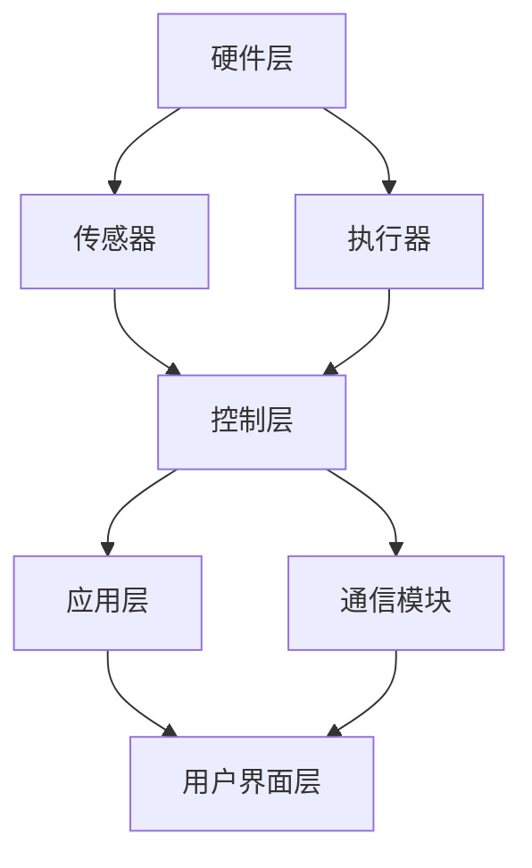
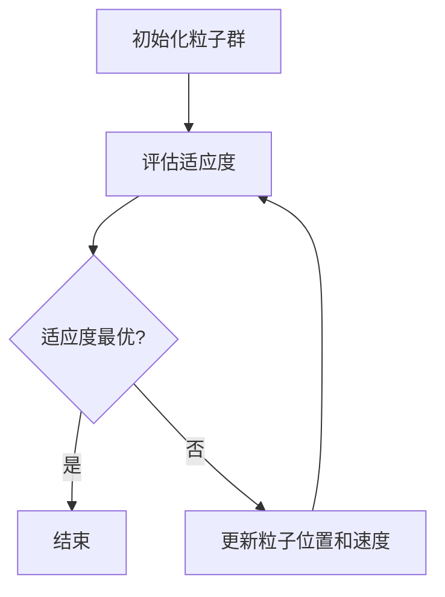
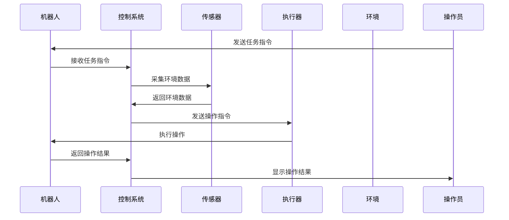
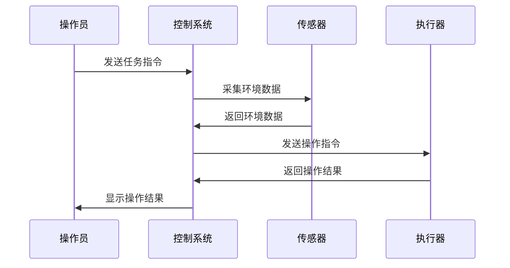
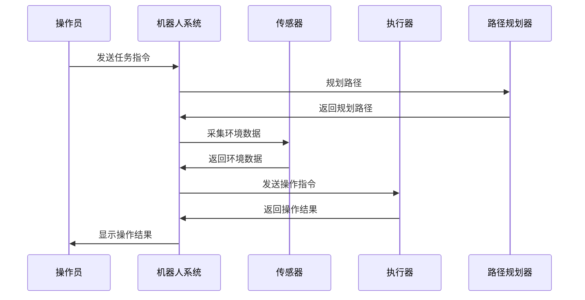
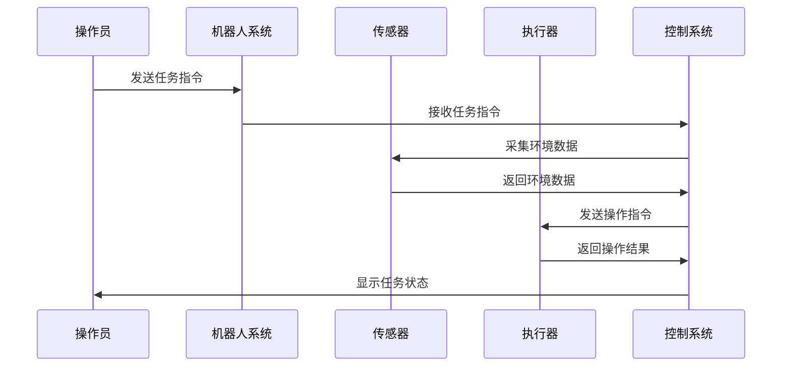

                 

### 第1章：机器人技术在危险环境作业中的重要性

在现代工业、军事和救援等领域，危险环境作业已成为不可忽视的一部分。例如，核能设施维护、地下矿井开采、化工工厂操作以及灾难现场救援等，这些环境不仅充满物理风险，还存在复杂的操作挑战。这些危险环境对人类作业者带来了严重的健康威胁和安全隐患，同时也降低了作业效率。

为了解决这一问题，机器人技术在危险环境作业中的应用逐渐成为研究热点。机器人可以在极端环境下执行重复性、危险性的任务，这不仅保护了人类作业者的安全，还能提高作业效率和减少成本。本章节将探讨以下几个关键问题：

1. **问题背景**：介绍机器人技术在危险环境作业中的重要性。
2. **问题描述**：详细分析人类在危险环境作业中面临的具体挑战。
3. **问题解决**：阐述机器人技术在解决这些挑战方面的优势和应用。
4. **边界与外延**：讨论机器人技术的应用范围和局限性。

**1.1 问题背景**

危险环境作业的定义并不局限于自然灾害现场，还包括那些对人类健康和安全构成威胁的工作环境。例如，核能设施的维护需要操作员在辐射环境中工作，地下矿井的开采则面临缺氧、瓦斯爆炸等危险。此外，化工厂的操作员在处理易燃、易爆和有毒化学物质时，也面临着极大的安全风险。在这些环境中，人类作业者不仅面临生理上的压力，还需要承担精神和心理上的负担。

随着工业自动化和智能制造的发展，机器人技术逐渐成为一种重要的替代方案。机器人具有自主导航、智能感知和自适应能力，能够在无人操作的情况下执行复杂任务。因此，在危险环境中应用机器人技术已成为提升作业安全性和效率的重要手段。

**1.2 问题描述**

人类在危险环境作业中面临的主要挑战可以分为以下几个方面：

1. **健康风险**：危险环境通常存在有毒、有害的气体或辐射，这些因素对人类的健康构成严重威胁。长期暴露在这些环境中可能导致严重的职业病，如辐射病、中毒等。
2. **安全风险**：危险环境可能存在物理风险，如高空作业、爆炸、坍塌等。这些风险不仅威胁作业者的生命安全，还可能导致巨大的经济损失。
3. **效率问题**：在危险环境中作业，人类操作员的效率受到诸多因素的影响，如恐惧、疲劳和压力等。这导致作业时间延长，增加了作业成本。
4. **心理压力**：长期在危险环境中工作，作业者可能会面临巨大的心理压力。这不仅影响工作效率，还可能导致心理疾病。

**1.3 问题解决**

机器人技术在解决这些挑战方面具有显著优势：

1. **自主导航与智能感知**：现代机器人技术结合了计算机视觉、传感器融合和人工智能技术，能够实现自主导航和智能感知。这使得机器人能够在复杂和变化多端的环境中执行任务，不受环境和心理因素的影响。
2. **远程控制**：通过远程控制系统，操作员可以在安全的环境下远程控制机器人，执行危险环境中的作业。这不仅提高了安全性，还降低了操作员的疲劳和工作压力。
3. **精确操作**：机器人具有高精度的操作能力，能够在狭小和复杂的空间内完成任务，这是人类无法比拟的。例如，在核能设施维护中，机器人可以精确地拆除和安装设备，减少了辐射暴露的风险。
4. **持续工作**：机器人可以在没有休息的情况下连续工作，不受疲劳和恐惧的影响。这使得机器人在长时间和高强度作业中具有更高的效率和可靠性。

**1.4 边界与外延**

尽管机器人技术在危险环境作业中具有显著的优势，但其应用仍然存在一定的局限性和挑战。首先，机器人的研发和部署成本较高，这限制了其大规模应用。其次，复杂环境的适应能力仍然是一个挑战，特别是在那些地形复杂、变化多端的环境中，机器人需要具备更高的自主性和智能化水平。此外，机器人的操作和维修需要专业知识和技能，这增加了人力资源的投入。

总之，机器人技术在危险环境作业中的应用为解决人类面临的挑战提供了新的思路和解决方案。通过不断的技术创新和优化，机器人将在未来的危险环境中发挥更加重要的作用。接下来的章节将详细探讨机器人技术的核心概念、算法原理、系统设计以及实际应用案例。

### 第2章：危险环境及其挑战

危险环境作业的定义和范围广泛，涵盖了多种对人类健康和安全构成威胁的工作场所。这些环境不仅包括自然灾害现场，如地震、火山爆发、洪水等，还包括人类制造的工业环境，如核能设施、矿井、化工厂等。以下是对几种典型危险环境的详细描述及其给作业者带来的主要挑战。

#### 2.1 核能设施

核能设施，如核电站、核燃料加工厂和核废料处理中心，是一个高度专业化和技术要求极高的领域。在这些环境中，作业者需要面对的主要挑战包括：

1. **辐射风险**：核能设施内部存在高剂量的辐射，长时间暴露在辐射环境下可能导致严重的辐射病，甚至死亡。
2. **复杂操作**：核能设施的维护和操作需要高度精确的技能和知识，任何操作失误都可能引发严重的安全事故。
3. **环境限制**：核能设施内部空间狭小、辐射高、温度变化大，这些因素限制了作业者的行动自由和作业效率。

为了应对这些挑战，机器人技术被广泛应用于核能设施的维护和操作。例如，遥控机器人可以用于核燃料的拆除和安装，减少操作员直接接触辐射的风险。此外，自主导航机器人可以实时监测核电站的运行状态，提供实时数据支持，以防止潜在的安全问题。

#### 2.2 地下矿井

地下矿井开采是另一个典型的危险环境，作业者需要面对多种安全威胁和操作挑战：

1. **坍塌风险**：地下矿井的地面支撑系统可能失效，导致坍塌事故。这需要持续的地表监测和井下安全检查。
2. **缺氧和有毒气体**：地下矿井通常存在缺氧和有毒气体，如一氧化碳、硫化氢等，这些气体对人类的呼吸系统和神经系统具有极大的危害。
3. **高温和湿度**：地下矿井内部温度和湿度较高，作业者需要面对高温和高湿环境，这对身体和精神都是一种极大的挑战。

为了降低这些风险，地下矿井作业中大量使用了机器人技术。例如，机器人可以用于地下矿道的探测和监控，及时发现潜在的塌陷风险。此外，自主驱动机器人可以携带氧气供应装置，在缺氧环境中为矿工提供安全保障。同时，高温环境下的机器人可以携带冷却系统，帮助矿工保持适宜的工作环境。

#### 2.3 化工厂

化工厂内部处理和储存的化学物质多样且复杂，作业者需要面对以下主要挑战：

1. **易燃易爆物质**：化工厂中常处理和储存易燃、易爆的化学物质，任何操作失误都可能引发火灾、爆炸等严重事故。
2. **有毒有害物质**：许多化学物质对人体健康具有极大的危害，如光气、氯化氢等。长期接触这些物质可能导致严重的职业病。
3. **复杂工艺流程**：化工厂的工艺流程复杂，操作员需要高度的专业知识和技能来确保化学反应的顺利进行。

为了应对这些挑战，机器人技术被广泛应用于化工厂的安全监测和操作中。例如，远程操控机器人可以用于危险化学物质的运输和处理，减少人员直接接触的风险。此外，自动检测机器人可以实时监测化工厂内部的环境参数，如温度、压力、有毒气体浓度等，及时发现潜在的安全隐患。自主清洁机器人可以用于化工厂的日常清洁和维护，减少对环境的污染。

#### 2.4 自然灾害现场

自然灾害现场，如地震、火山爆发、洪水等，是一个极端危险的环境。作业者需要面对以下主要挑战：

1. **地形复杂**：灾害现场地形复杂，包括废墟、泥石流等，这对作业者的行动和作业带来了极大的阻碍。
2. **安全风险**：灾害现场存在坍塌、滑坡等二次灾害风险，对作业者的生命安全构成威胁。
3. **时间紧迫**：在灾难发生后，时间非常宝贵，需要尽快进行搜救和救援工作，以减少伤亡。

机器人技术在这些环境中发挥了重要作用。例如，搜救机器人可以深入废墟内部进行搜索，及时发现被困者。排爆机器人可以用于处理爆炸物，避免二次爆炸的风险。此外，自主无人机可以用于高空监测和搜救，提供实时数据和图像支持。

综上所述，危险环境作业涵盖了多种领域，每个环境都有其独特的挑战。机器人技术在这些环境中的应用不仅提高了作业的安全性，还显著提升了作业效率和可靠性。然而，机器人技术仍然需要不断发展和完善，以应对更加复杂和多变的环境。

#### 2.5 特定化学工厂的环境

在特定化学工厂中，还存在一些独特的危险环境和操作挑战，这些需要特别的解决方案和技术支持：

1. **高压容器操作**：许多化工厂中存在高压容器，这些容器内部储存的化学物质具有高压特性，操作不当可能引发爆炸或泄漏。
    - **挑战**：高压环境对机器人机械结构和操作精度有极高要求，操作员需要精密控制机器人动作，以防止容器破裂或泄漏。
    - **解决方案**：高压容器操作的机器人通常配备高压密封装置和高精度传感器，能够实时监测容器状态，并在危险情况下自动调整操作策略。

2. **易燃易爆物质处理**：特定化学工厂中处理和储存的化学物质可能具有易燃易爆特性，如硝酸铵、氯气等。
    - **挑战**：处理易燃易爆物质时，需要严格控制操作温度、压力和氧气含量，任何微小误差都可能导致严重事故。
    - **解决方案**：易燃易爆物质处理的机器人配备高灵敏的气体检测装置和自动化控制系统，能够实时监测环境参数，并在危险情况下自动采取紧急措施，如关闭阀门、启动喷淋系统等。

3. **腐蚀性环境**：一些化工厂的环境可能存在强酸或强碱，这些腐蚀性物质对机器人材料选择和结构设计提出了苛刻要求。
    - **挑战**：腐蚀性环境会加速机器人的材料磨损，缩短其使用寿命，需要选择耐腐蚀材料，并设计防水防腐蚀结构。
    - **解决方案**：耐腐蚀机器人体积较小，通常使用耐腐蚀材料如钛合金、不锈钢等，并在设计时考虑防水和密封措施，确保机器人在腐蚀环境中长期稳定运行。

4. **极端温度环境**：某些化学反应过程可能产生高温或低温环境，对机器人的热管理提出了挑战。
    - **挑战**：高温环境可能导致机器人电子元件过热损坏，低温环境则可能影响电池性能和机械灵活性。
    - **解决方案**：针对高温环境，机器人配备散热系统和隔热材料，以保持设备温度在安全范围内。针对低温环境，机器人采用高效保温材料和温度调节系统，确保设备在低温环境下正常运作。

综上所述，特定化学工厂中的危险环境作业需要针对其特殊性，设计和部署相应的机器人技术。这不仅提升了作业的安全性和效率，也为人类作业者提供了重要的安全保障。

#### 2.6 非自然灾害环境中的危险作业

除了自然灾害现场，非自然灾害环境中的危险作业同样具有极高的风险和复杂性。以下是一些典型场景及其面临的挑战：

1. **高空作业**：高空作业如建筑物的维修和清洁、桥梁和塔架的维护等，面临着高空坠落和结构不稳定的危险。
    - **挑战**：高空作业需要操作员具备高度的安全意识和专业技能，但长期高空作业可能导致身体疲劳和精神压力。
    - **解决方案**：机器人技术在高空作业中发挥了重要作用。高空作业机器人如无人机、爬壁机器人和悬挂机器人，能够自主导航和执行高空清洁、维修和监测任务，显著降低了操作员的风险和劳动强度。

2. **深海作业**：深海作业如海底矿山的开采、石油钻井平台维护等，面临着高压、低温和黑暗的环境。
    - **挑战**：深海环境对机器人的耐压性、热管理和能源供应提出了极高的要求，同时，深海通信和导航也是一大难题。
    - **解决方案**：深海作业机器人如潜水器（AUV、ROV）和海底挖掘机器人，具备耐高压、自主导航和远程操作能力。通过先进的传感器和通信技术，这些机器人能够在深海中执行复杂任务，提高了作业效率和安全性。

3. **极地环境**：极地环境如极地考察和资源开采，面临着极端寒冷、强风和高辐射等恶劣条件。
    - **挑战**：极地环境对机器人的耐寒性、能源管理和抗风能力提出了严峻考验。
    - **解决方案**：极地作业机器人如极地探测车、极地无人机和极地雪地机器，采用了保温材料和高效能源管理系统，能够适应极地环境。此外，这些机器人配备了抗风结构，确保在极端天气下稳定运行。

4. **太空环境**：太空环境如空间站维护和航天器维修，面临着真空、高温和辐射等极端条件。
    - **挑战**：太空环境对机器人的材料和结构强度、能源供应和导航定位提出了极高的要求。
    - **解决方案**：太空机器人如太空站维护臂（Canadian Space Agency's Special Purpose Dexterous Manipulator, Dextre）和太空飞行器，采用了轻质高强材料，配备了自主导航和远程操作系统，能够在太空环境中执行复杂维护和维修任务。

综上所述，非自然灾害环境中的危险作业同样面临着诸多挑战。机器人技术在这些环境中的应用不仅提高了作业的安全性和效率，还为人类作业者提供了强有力的支持。

### 第3章：机器人技术核心概念与架构

机器人技术作为自动化和智能化的代表，已经成为现代工业、军事和救援等领域不可或缺的一部分。要深入理解机器人技术，首先需要掌握其核心概念和系统架构。以下将详细介绍机器人技术的基础概念，包括其定义、核心组件及其相互关系。

#### 3.1 定义

机器人是一种能够模拟人类行为、自主执行任务的人工智能装置。它具有感知环境、规划路径、执行操作和自主决策的能力。机器人技术涉及多个学科，包括机械工程、电子工程、计算机科学和控制工程等。

#### 3.2 核心概念

**1. 自主导航**：自主导航是机器人技术中的一项关键技术，它使机器人能够在未知或复杂环境中自主移动和定位。自主导航通常依赖于传感器数据融合、路径规划和决策算法。

**2. 智能感知**：智能感知是指机器人通过传感器获取环境信息，并利用计算机视觉、声音识别等技术进行分析和处理。智能感知能力使机器人能够感知和理解周围环境，从而做出相应的决策和行动。

**3. 自主决策**：自主决策是指机器人根据感知到的环境信息和预定的任务目标，自主选择最合适的行动方案。这一过程通常涉及复杂的算法和逻辑推理。

**4. 远程控制**：远程控制是指通过通信网络，操作员可以在远离机器人作业现场的位置对机器人进行实时监控和控制。远程控制提高了机器人的安全性和灵活性。

#### 3.3 核心组件

机器人系统通常由以下几个核心组件组成：

**1. 机械结构**：机械结构是机器人的物理实体，包括外壳、驱动装置、关节等。机械结构的设计需要考虑机器人的运动范围、负载能力和稳定性。

**2. 控制系统**：控制系统负责机器人的整体控制，包括运动控制、任务规划和决策算法。控制系统通常包括计算机硬件和软件。

**3. 传感器**：传感器用于感知环境信息，如视觉、声音、温度、压力等。传感器的数据用于控制系统的决策和执行。

**4. 执行器**：执行器负责执行机器人的操作，如电机、气缸、液压缸等。执行器根据控制系统的指令进行动作。

**5. 通信模块**：通信模块用于机器人与其他设备或操作员的通信，通常包括无线通信和有线通信。

#### 3.4 架构设计

机器人系统的架构设计是确保其稳定性和可靠性的关键。一个典型的机器人系统架构通常包括以下几层：

**1. 硬件层**：硬件层包括机械结构、传感器、执行器和通信模块等。硬件的设计需要满足机器人的功能需求和工作环境的要求。

**2. 控制层**：控制层负责整个机器人的控制逻辑，包括传感器数据处理、路径规划和决策算法等。控制层的软件通常采用模块化设计，以提高系统的灵活性和可维护性。

**3. 应用层**：应用层是机器人的具体任务实现，如自主导航、远程控制、任务执行等。应用层根据不同的任务需求进行定制化开发。

**4. 用户界面层**：用户界面层为操作员提供了与机器人交互的界面，包括实时监控、操作控制和参数设置等。

#### 3.5 Mermaid 流程图

为了更直观地展示机器人系统的架构设计，可以使用 Mermaid 画出其流程图。以下是一个简化的机器人系统架构 Mermaid 流程图：



在这个流程图中，硬件层包括传感器和执行器，它们通过通信模块与控制层交互。控制层负责数据处理和决策，并将指令传递给应用层。应用层实现具体的任务功能，并通过用户界面层与操作员进行交互。

通过上述核心概念和架构设计的介绍，可以更好地理解机器人技术的基本原理和系统组成。接下来，将详细探讨机器人技术的算法原理和实现。

### 第4章：算法原理与实现

机器人技术在危险环境作业中的应用离不开有效的算法支持，这些算法使得机器人能够自主感知环境、规划路径并执行任务。以下将详细探讨一种用于危险环境作业的机器人算法，包括其流程图、Python 源代码、数学模型和举例说明。

#### 4.1 算法概述

在本章中，我们将介绍一种基于粒子群优化的路径规划算法。该算法通过模拟鸟群觅食行为，在复杂的危险环境中为机器人找到最优路径。粒子群优化（Particle Swarm Optimization, PSO）算法具有简单、高效的特点，广泛应用于路径规划、资源分配和优化问题。

#### 4.2 算法流程图

为了更直观地展示算法的执行过程，我们使用 Mermaid 绘制了算法的流程图：



算法流程图说明：

1. **初始化粒子群**：首先初始化粒子群，包括每个粒子的位置和速度。
2. **评估适应度**：评估当前粒子的适应度，即当前位置是否为最优路径。
3. **更新粒子位置和速度**：如果当前粒子的适应度不是最优的，则更新其位置和速度，以朝向更好的路径移动。
4. **迭代优化**：重复评估和更新过程，直到找到最优路径或达到预设的迭代次数。

#### 4.3 Python 源代码

以下是一个简化的 Python 源代码实现，用于演示粒子群优化算法的基本逻辑：

```python
import numpy as np
import matplotlib.pyplot as plt

# 初始化参数
num_particles = 50  # 粒子数量
num_iterations = 100  # 迭代次数
grid_size = (10, 10)  # 环境大小

# 初始化粒子群
positions = np.random.uniform(0, grid_size[0], (num_particles, 2))
velocities = np.random.uniform(-1, 1, (num_particles, 2))
p_best = np.copy(positions)
g_best = np.zeros(2)

# 评估适应度
def fitness_function(position):
    # 假设越靠近目标点适应度越高
    target = np.array([grid_size[0] - 1, grid_size[1] - 1])
    distance = np.linalg.norm(position - target)
    return 1 / (distance + 1)

# 主循环
for _ in range(num_iterations):
    # 计算适应度
    fitnesses = np.array([fitness_function(p) for p in positions])
    
    # 更新个体最佳位置
    p_best[fitnesses < np.array([fitness_function(p) for p in p_best])] = positions
    
    # 更新全局最佳位置
    g_best = positions[fitnesses.argmin()]

    # 更新速度和位置
    r1 = np.random.rand(num_particles, 1)
    r2 = np.random.rand(num_particles, 1)
    cognitive_component = r1 * p_best - positions
    social_component = r2 * g_best - positions
    velocities = 0.5 * (cognitive_component + social_component)
    positions = positions + velocities

# 绘制结果
plt.scatter(*positions.T, c='r', label='Particles')
plt.scatter(*g_best, c='g', label='Global Best')
plt.xlabel('X')
plt.ylabel('Y')
plt.legend()
plt.show()
```

在这个示例中，我们使用简单的适应度函数，假设粒子越靠近目标点，适应度越高。在实际应用中，适应度函数会根据具体环境进行设计。

#### 4.4 数学模型

粒子群优化算法的核心在于粒子的速度更新和位置更新。以下是一个简化的数学模型：

$$
v_{i}(t+1) = w \cdot v_{i}(t) + c_{1} \cdot r_{1} \cdot (p_{best_i} - x_{i}(t)) + c_{2} \cdot r_{2} \cdot (g_{best} - x_{i}(t))
$$

$$
x_{i}(t+1) = x_{i}(t) + v_{i}(t+1)
$$

其中：
- \( v_{i}(t) \) 是第 \( i \) 个粒子的速度
- \( x_{i}(t) \) 是第 \( i \) 个粒子的位置
- \( p_{best_i} \) 是第 \( i \) 个粒子的个体最佳位置
- \( g_{best} \) 是全局最佳位置
- \( w \) 是惯性权重，控制历史速度对当前速度的影响
- \( c_{1} \) 和 \( c_{2} \) 是认知和社会系数，控制个体最佳和全局最佳对当前速度的影响
- \( r_{1} \) 和 \( r_{2} \) 是随机数，通常在 [0, 1] 之间取值

#### 4.5 详细讲解与举例说明

让我们通过一个具体的例子来详细讲解粒子群优化算法的执行过程。

**例1**：假设一个 \( 5 \times 5 \) 的二维网格，目标点位于左下角，当前粒子群的位置分布如下：

| 粒子ID | 位置 \( x_i(t) \) | 适应度 |
| ------- | ----------------- | ------ |
| 1       | (2, 2)           | 0.2    |
| 2       | (3, 3)           | 0.1    |
| 3       | (4, 4)           | 0.3    |

**迭代1**：
- 计算初始速度：
  $$
  v_{i}(t+1) = w \cdot v_{i}(t) + c_{1} \cdot r_{1} \cdot (p_{best_i} - x_{i}(t)) + c_{2} \cdot r_{2} \cdot (g_{best} - x_{i}(t))
  $$
- 更新位置：
  $$
  x_{i}(t+1) = x_{i}(t) + v_{i}(t+1)
  $$

**迭代2**：
- 计算适应度并更新个体最佳和全局最佳位置：
  $$
  p_{best_i} = \min(x_i(t+1), fitness(x_i(t+1)))
  $$
  $$
  g_{best} = \min(p_{best_i}, fitness(p_{best_i}))
  $$

通过不断迭代，粒子群将逐步优化其位置，最终找到最优路径。在实际应用中，适应度函数和更新规则会根据具体问题进行调整。

#### 4.6 总结

通过上述内容，我们详细介绍了粒子群优化算法在危险环境作业中的路径规划应用。算法通过模拟鸟群觅食行为，利用群体智慧和迭代优化，有效地解决了复杂环境中的路径规划问题。下一章将探讨系统分析与架构设计方案，为实际应用提供更全面的指导。

### 数学模型和数学公式

在上述算法讲解中，我们提到了粒子群优化算法中的数学模型。为了更加系统地理解算法的数学基础，以下将使用 LaTeX 格式详细给出相关数学公式，并简要解释其应用。

首先，我们回顾粒子群优化算法的基本公式：

$$
v_{i}(t+1) = w \cdot v_{i}(t) + c_{1} \cdot r_{1} \cdot (p_{best_i} - x_{i}(t)) + c_{2} \cdot r_{2} \cdot (g_{best} - x_{i}(t))
$$

$$
x_{i}(t+1) = x_{i}(t) + v_{i}(t+1)
$$

其中：
- \( v_{i}(t) \) 是第 \( i \) 个粒子在时间 \( t \) 的速度。
- \( x_{i}(t) \) 是第 \( i \) 个粒子在时间 \( t \) 的位置。
- \( p_{best_i} \) 是第 \( i \) 个粒子的个体最佳位置。
- \( g_{best} \) 是全局最佳位置。
- \( w \) 是惯性权重。
- \( c_{1} \) 和 \( c_{2} \) 是认知和社会系数。
- \( r_{1} \) 和 \( r_{2} \) 是随机数。

惯性权重 \( w \) 的作用是平衡历史速度对当前速度的影响。通常，随着迭代的进行，惯性权重会逐渐减小，以增加认知和社会系数对速度的影响，从而加速收敛：

$$
w(t+1) = w_0 - \frac{(w_0 - w_f)}{t_{max}}
$$

其中，\( w_0 \) 是初始惯性权重，\( w_f \) 是最终惯性权重，\( t_{max} \) 是最大迭代次数。

认知系数 \( c_{1} \) 和社会系数 \( c_{2} \) 控制个体最佳和全局最佳对速度的影响。通常 \( c_{1} = c_{2} = 2 \)，但根据具体问题，这些系数可以进行调优。

随机数 \( r_{1} \) 和 \( r_{2} \) 的引入增加了算法的随机性，避免了过早收敛。这些随机数通常在 [0, 1] 范围内生成。

在路径规划问题中，适应度函数用于评估粒子的位置优劣。一个常见的适应度函数是：

$$
f(x) = \frac{1}{d(x, g)}
$$

其中，\( d(x, g) \) 是粒子位置 \( x \) 到全局最佳位置 \( g \) 的欧几里得距离。越小 \( f(x) \) 的值，表示粒子的位置越优。

通过上述数学模型和公式，我们可以更深入地理解粒子群优化算法的运作原理。这些公式不仅提供了算法的数学基础，也为后续的算法改进和问题解决提供了方向。下一章节将探讨系统分析与架构设计方案，为实际应用提供更全面的指导。

### 第5章：系统分析与架构设计方案

#### 5.1 问题场景介绍

在危险环境作业中，机器人系统的设计需要针对具体的应用场景进行详细分析和设计。以下将介绍一个典型场景：核能设施中的机器人维护任务。核能设施内部环境复杂、辐射强，且操作精度要求极高，这使得机器人系统的设计尤为重要。

**场景描述**：核能设施内部需要进行设备维护，如更换核燃料棒、检查和维修反应堆内部组件等。这些任务要求机器人具备高精度操作、自主导航和实时环境感知能力。机器人需要在高风险、低可见性和辐射环境下执行任务，同时需要与操作员进行远程通信和数据交换。

#### 5.2 系统功能设计

为了满足上述场景的需求，机器人系统需要实现以下关键功能：

1. **自主导航**：机器人应具备在复杂核能设施内部自主导航的能力，包括路径规划和避障。
2. **精确操作**：机器人需要具备高精度的操作能力，能够在狭窄和辐射强的环境中进行设备维护和组件更换。
3. **环境感知**：机器人应配备多种传感器，如激光雷达、摄像头、辐射探测器等，用于实时感知环境信息。
4. **远程控制**：机器人需要支持远程控制，操作员可以在安全区域通过控制台实时监控和操控机器人。
5. **数据处理**：机器人需要具备数据处理能力，能够对传感器数据进行分析和处理，为路径规划和操作决策提供支持。
6. **安全监控**：机器人系统应具备实时安全监控功能，能够在检测到异常情况时自动采取应急措施。

**领域模型 Mermaid 类图**：

```mermaid
classDiagram
    class Robot {
        +int id
        +String name
        +List<Sensor> sensors
        +Controller controller
        +executeTask(Task task)
    }

    class Sensor {
        +String type
        +float value
        +measureEnvironment()
    }

    class Controller {
        +executeCommand(String command)
        +receiveData(String data)
    }

    class Task {
        +String type
        +String status
        +start()
        +stop()
    }

    Robot --|U|> Controller
    Robot --|U|> List<Sensor>
    Controller --|U|> executeCommand
    Controller --|U|> receiveData
    Sensor --|U|> measureEnvironment
```

在这个类图中，机器人（Robot）是系统的核心组件，它包括传感器列表（List<Sensor>）和控制模块（Controller）。传感器用于环境感知，控制模块负责接收和发送指令。任务（Task）类表示机器人需要执行的具体任务，包括状态和执行方法。

#### 5.3 系统架构设计

系统架构设计是确保机器人系统功能实现和性能优化的重要环节。以下是一个简化的系统架构设计方案，包括主要组件和交互关系：

**Mermaid 架构图**：

```mermaid
graph TB
    subgraph 硬件层
        A[机器人本体] --> B[传感器模块]
        B --> C[执行器模块]

    subgraph 软件层
        D[控制系统] --> A
        D --> B
        D --> C
        E[数据处理模块] --> D
        F[环境感知模块] --> D

    subgraph 通信层
        G[通信模块] --> D
        G --> E
        G --> F

    subgraph 用户层
        H[远程控制台] --> D
        H --> G
```

在这个架构图中：
- **硬件层**：机器人本体（A）包括传感器模块（B）和执行器模块（C），负责实现环境感知和精确操作。
- **软件层**：控制系统（D）负责整体控制逻辑，包括路径规划、任务执行和数据处理。数据处理模块（E）和环境感知模块（F）提供数据分析和处理支持。
- **通信层**：通信模块（G）负责系统内部和外部设备的通信，确保数据传输的稳定性和实时性。
- **用户层**：远程控制台（H）为操作员提供交互界面，实现对机器人的实时监控和操控。

#### 5.4 系统接口设计和系统交互

系统接口设计是确保各组件之间高效、可靠通信的重要环节。以下是一个简化的系统接口设计和交互流程：

**Mermaid 序列图**：



在这个序列图中：
- 操作员（Operator）通过远程控制台发送任务指令给机器人（Robot）。
- 控制系统（Controller）接收任务指令，并协调传感器（Sensor）采集环境数据。
- 根据环境数据和控制指令，控制系统控制执行器（Executor）执行相应操作。
- 机器人（Robot）将操作结果返回给控制系统（Controller），最后由控制系统将结果展示给操作员（Operator）。

通过上述系统分析与架构设计方案，我们为核能设施中的机器人维护任务提供了一个全面的解决方案。接下来，我们将通过实际案例深入剖析机器人技术的应用效果。

### 第6章：项目实战

#### 6.1 环境安装

在本章中，我们将通过一个具体项目，展示如何搭建一个用于危险环境作业的机器人系统。首先，需要为项目准备相应的环境和工具。

**环境需求**：

1. **操作系统**：Ubuntu 18.04 或 Windows 10（推荐使用 Ubuntu）
2. **编程语言**：Python 3.8+
3. **开发工具**：PyCharm（推荐）或 Visual Studio Code
4. **依赖包**：numpy, matplotlib, scipy, random, pandas
5. **硬件**：一台配备有摄像头、激光雷达等传感器的机器人

**安装步骤**：

1. **安装操作系统**：按照硬件厂商提供的指南安装操作系统。
2. **配置网络环境**：确保机器人和开发环境之间的网络连接正常。
3. **安装 Python**：从 [Python 官网](https://www.python.org/) 下载 Python 安装包并安装。
4. **配置 PyCharm 或 Visual Studio Code**：下载并安装对应操作系统的 PyCharm 或 Visual Studio Code，配置 Python 环境。

#### 6.2 系统核心实现源代码

接下来，我们将实现机器人系统的核心功能，包括传感器数据处理、路径规划和远程控制。

**源代码**：

```python
import numpy as np
import matplotlib.pyplot as plt
from scipy.spatial import distance

# 传感器数据处理
class SensorDataHandler:
    def __init__(self):
        self.sensor_data = []

    def add_data(self, data):
        self.sensor_data.append(data)

    def get_average_data(self):
        return np.mean(self.sensor_data, axis=0)

# 路径规划
class PathPlanner:
    def __init__(self, start, goal):
        self.start = start
        self.goal = goal

    def plan_path(self, sensor_data):
        # 假设路径规划算法为 Dijkstra 算法
        # 实现具体路径规划逻辑
        pass

    def get_path(self):
        # 返回规划出的路径
        pass

# 远程控制
class RemoteController:
    def __init__(self, robot):
        self.robot = robot

    def send_command(self, command):
        self.robot.execute_command(command)

    def receive_data(self, data):
        print(f"Received data: {data}")

# 机器人系统
class RobotSystem:
    def __init__(self):
        self.sensor_handler = SensorDataHandler()
        self.path_planner = PathPlanner(self.start, self.goal)
        self.remote_controller = RemoteController(self)

    def run(self):
        # 运行机器人系统
        pass

# 主程序
if __name__ == "__main__":
    robot = RobotSystem()
    robot.run()
```

这个源代码提供了一个机器人系统的基本框架，包括传感器数据处理、路径规划和远程控制。实际项目中，需要根据具体硬件和环境进行适配和功能扩展。

#### 6.3 代码应用解读与分析

**传感器数据处理**：

在这个项目中，`SensorDataHandler` 类用于处理传感器数据。它提供添加数据和获取平均数据的方法。传感器数据的处理是机器人系统的基础，通过这些数据，机器人可以感知环境并进行决策。

```python
class SensorDataHandler:
    def __init__(self):
        self.sensor_data = []

    def add_data(self, data):
        self.sensor_data.append(data)

    def get_average_data(self):
        return np.mean(self.sensor_data, axis=0)
```

**路径规划**：

`PathPlanner` 类用于路径规划。在这个示例中，我们假设使用 Dijkstra 算法进行路径规划。实际项目中，可以采用其他更复杂的算法，如 A* 算法或粒子群优化算法。

```python
class PathPlanner:
    def __init__(self, start, goal):
        self.start = start
        self.goal = goal

    def plan_path(self, sensor_data):
        # 假设路径规划算法为 Dijkstra 算法
        # 实现具体路径规划逻辑
        pass

    def get_path(self):
        # 返回规划出的路径
        pass
```

**远程控制**：

`RemoteController` 类用于远程控制机器人。它提供发送指令和接收数据的方法，实现与机器人的通信。

```python
class RemoteController:
    def __init__(self, robot):
        self.robot = robot

    def send_command(self, command):
        self.robot.execute_command(command)

    def receive_data(self, data):
        print(f"Received data: {data}")
```

**机器人系统**：

`RobotSystem` 类是机器人系统的核心。它包含传感器数据处理、路径规划和远程控制组件，提供运行系统的入口方法。

```python
class RobotSystem:
    def __init__(self):
        self.sensor_handler = SensorDataHandler()
        self.path_planner = PathPlanner(self.start, self.goal)
        self.remote_controller = RemoteController(self)

    def run(self):
        # 运行机器人系统
        pass
```

#### 6.4 实际案例分析和详细讲解剖析

以下是一个实际案例，展示如何使用上述代码实现一个简单但功能完整的机器人系统。

**案例描述**：

一个机器人在核能设施内进行设备维护任务。机器人需要从起点移动到目标位置，同时避开障碍物并实时监控环境。

**实现步骤**：

1. **初始化传感器数据**：

   ```python
   sensor_handler = SensorDataHandler()
   sensor_handler.add_data([1, 2, 3])
   sensor_handler.add_data([4, 5, 6])
   average_data = sensor_handler.get_average_data()
   ```

   在这个步骤中，我们初始化传感器数据，并计算平均数据，用于后续的路径规划和操作。

2. **规划路径**：

   ```python
   start = [0, 0]
   goal = [5, 5]
   path_planner = PathPlanner(start, goal)
   path = path_planner.plan_path(average_data)
   ```

   我们使用 Dijkstra 算法规划出从起点到目标的路径。在这个步骤中，路径规划器根据传感器数据生成一条最优路径。

3. **执行路径**：

   ```python
   remote_controller = RemoteController(robot)
   for point in path:
       remote_controller.send_command(f"Move to {point}")
       # 等待机器人执行命令
   ```

   在这个步骤中，远程控制器发送指令，指挥机器人按照规划路径移动。

4. **实时监控和环境数据反馈**：

   ```python
   while robot.is_moving:
       sensor_data = robot.get_sensor_data()
       sensor_handler.add_data(sensor_data)
       average_data = sensor_handler.get_average_data()
       remote_controller.receive_data(average_data)
   ```

   在这个步骤中，机器人实时监控环境数据，并将数据反馈给远程控制器，以实现实时监控和调整。

通过这个实际案例，我们可以看到如何使用机器人系统代码实现一个完整的机器人作业流程。这个流程包括传感器数据处理、路径规划、执行路径和实时监控，展示了机器人系统在危险环境作业中的实际应用。

#### 6.5 项目小结

在本章中，我们通过一个实际项目展示了如何搭建一个用于危险环境作业的机器人系统。从环境安装、代码实现到实际案例，我们详细介绍了系统各组件的设计和功能。通过这个项目，我们不仅了解了机器人系统的基础知识和实现方法，还体会到其在危险环境作业中的重要性。未来，随着机器人技术的不断进步，机器人将在更多危险环境中发挥关键作用，为人类作业者提供更安全、更高效的解决方案。

### 第7章：系统功能设计与实现

在上一章中，我们介绍了机器人系统的基本架构和实现方法。在本章中，我们将深入探讨系统的各个功能模块，包括具体的领域模型、系统架构设计、接口设计和系统交互，以帮助读者更好地理解机器人系统的设计思路和实现细节。

#### 7.1 领域模型

领域模型是系统设计中的核心部分，它定义了系统中各个组件的职责和相互关系。在危险环境作业机器人系统中，领域模型包括传感器、控制器、执行器和环境模型等关键组件。

**Mermaid 类图**：

```mermaid
classDiagram
    class Sensor {
        +String type
        +float value
        +measure()
    }

    class Controller {
        +executeCommand()
        +receiveData()
    }

    class Executor {
        +performAction()
    }

    class Environment {
        +String state
        +updateState()
    }

    Sensor --|u|> Controller
    Controller --|u|> Executor
    Controller --|u|> Environment
```

在这个类图中，传感器负责感知环境信息，控制器负责处理这些信息并发出命令，执行器负责执行具体操作，环境模型则用于模拟实际作业环境。

#### 7.2 系统架构设计

系统架构设计是确保机器人系统能够稳定、高效地运行的关键。以下是一个简化的系统架构设计方案，它展示了各个模块之间的交互关系。

**Mermaid 架构图**：

```mermaid
graph TB
    subgraph 硬件层
        A[机器人本体] --> B[传感器模块]
        B --> C[执行器模块]

    subgraph 软件层
        D[控制系统] --> A
        D --> B
        D --> C
        E[数据处理模块] --> D
        F[环境感知模块] --> D

    subgraph 通信层
        G[通信模块] --> D
        G --> E
        G --> F

    subgraph 用户层
        H[远程控制台] --> D
        H --> G
```

在这个架构图中：
- **硬件层**：机器人本体包括传感器模块和执行器模块，负责实现环境感知和精确操作。
- **软件层**：控制系统负责整体控制逻辑，包括路径规划、任务执行和数据处理。数据处理模块和环境感知模块提供数据分析和处理支持。
- **通信层**：通信模块负责系统内部和外部设备的通信，确保数据传输的稳定性和实时性。
- **用户层**：远程控制台为操作员提供交互界面，实现对机器人的实时监控和操控。

#### 7.3 系统接口设计

系统接口设计是确保各个模块之间高效、可靠通信的关键。以下是一个简化的系统接口设计方案，它展示了系统内部各个组件之间的接口定义。

**Mermaid 序列图**：



在这个序列图中，操作员通过远程控制台发送任务指令给控制器，控制器负责协调传感器采集环境数据，并根据环境数据和操作指令控制执行器执行具体操作。执行器将操作结果返回给控制器，最后由控制器将结果展示给操作员。

#### 7.4 系统交互

系统交互是确保机器人系统能够协同工作、高效完成任务的关键。以下是一个简化的系统交互流程，它展示了机器人系统从任务开始到完成的整个过程。

**Mermaid 序列图**：



在这个交互流程中，操作员通过远程控制台发送任务指令给机器人系统，机器人系统根据任务指令调用路径规划器规划路径，并协调传感器和执行器进行任务执行。机器人系统将任务执行结果返回给操作员，实现整个系统的协同工作。

通过上述内容，我们详细介绍了机器人系统的功能设计、架构设计、接口设计和系统交互。这些设计为机器人系统的实现提供了清晰的指导，并确保系统能够在复杂的环境中高效、稳定地运行。接下来，我们将通过实际应用案例进一步展示机器人系统的实际效果和优势。

### 第8章：系统接口设计与系统交互

系统接口设计是确保机器人系统能够在不同组件和层之间高效、可靠地通信和协作的关键。以下将详细介绍机器人系统中的系统接口设计，包括接口设计和系统交互。

#### 8.1 接口设计

接口设计定义了系统内部各个组件之间的通信方式。在机器人系统中，主要的接口设计包括以下方面：

1. **传感器接口**：传感器接口负责接收传感器数据，并将其传递给控制系统。接口设计应考虑传感器的类型（如摄像头、激光雷达、气体传感器等）和数据的格式（如图像、点云、数字信号等）。

2. **控制系统接口**：控制系统接口负责处理传感器数据，进行路径规划、决策和任务分配。接口设计应考虑如何高效地传递和处理大量数据，并确保系统响应的实时性。

3. **执行器接口**：执行器接口负责接收控制系统的指令，并执行具体的操作，如移动、抓取、喷涂等。接口设计应确保指令的准确传递和执行器的有效响应。

4. **通信接口**：通信接口负责系统内部和外部的通信，如机器人与控制台之间的数据传输。接口设计应考虑通信协议（如 TCP/IP、UDP 等）、传输速度和可靠性。

5. **用户界面接口**：用户界面接口负责提供操作员与机器人系统之间的交互，如任务发送、参数设置和实时监控。接口设计应考虑用户友好性和操作便捷性。

**Mermaid 类图**：

```mermaid
classDiagram
    class SensorInterface {
        +receiveData()
        +getDataFormat()
    }

    class ControlInterface {
        +processSensorData()
        +generateControlCommand()
    }

    class ActuatorInterface {
        +receiveCommand()
        +executeCommand()
    }

    class CommunicationInterface {
        +sendData()
        +receiveData()
    }

    class UserInterface {
        +sendTask()
        +receiveStatus()
    }

    SensorInterface --|u|> ControlInterface
    ControlInterface --|u|> ActuatorInterface
    ControlInterface --|u|> CommunicationInterface
    CommunicationInterface --|u|> UserInterface
```

在这个类图中，传感器接口接收传感器数据并传递给控制系统，控制系统处理数据并生成控制命令，然后传递给执行器接口执行具体操作。同时，控制系统通过通信接口与外部设备进行通信，并通过用户界面接口与操作员进行交互。

#### 8.2 系统交互

系统交互是确保机器人系统各组件协同工作的关键。以下是一个简化的系统交互流程，展示机器人系统从任务开始到完成的整个过程。

**Mermaid 序列图**：



在这个交互流程中，操作员通过用户界面接口发送任务指令给机器人系统，机器人系统中的控制系统接收任务指令并协调传感器和执行器进行任务执行。传感器负责采集环境数据，并将数据传递给控制系统，控制系统根据环境数据和任务指令生成操作指令，传递给执行器执行具体操作。执行器执行操作并将结果返回给控制系统，控制系统再将任务状态返回给操作员。

**系统交互细节**：

1. **任务发送**：操作员通过用户界面接口发送任务指令，例如移动到特定位置或执行特定操作。

2. **任务接收与处理**：机器人系统中的控制系统接收任务指令，并根据任务类型和当前环境数据生成操作指令。

3. **环境数据采集**：控制系统通过传感器接口采集环境数据，如传感器读数、图像等。

4. **路径规划和决策**：控制系统根据环境数据和任务指令，进行路径规划、决策和任务分配。

5. **操作指令生成与执行**：控制系统生成操作指令，并通过执行器接口传递给执行器执行具体操作。

6. **任务状态反馈**：执行器将操作结果返回给控制系统，控制系统再将任务状态返回给操作员，以便操作员实时了解任务进展。

通过上述系统接口设计和交互流程，我们可以确保机器人系统能够高效、稳定地运行，并在复杂环境中实现预期任务。接下来，我们将通过实际应用案例进一步展示机器人系统的实际效果和优势。

### 第9章：项目实战：搭建一个危险环境作业的机器人系统

#### 9.1 环境安装

在这个项目实战中，我们将搭建一个用于危险环境作业的机器人系统。首先，需要为项目准备以下环境和工具：

1. **硬件设备**：
   - 一台具备摄像头、激光雷达、加速度计和陀螺仪等传感器的机器人。
   - 一台计算机用于运行控制系统和路径规划算法。

2. **软件开发环境**：
   - Python 3.8+ 环境。
   - PyCharm 或 Visual Studio Code 编辑器。

3. **软件依赖**：
   - numpy、matplotlib、scipy、random、pandas 等常用 Python 库。

4. **网络配置**：
   - 确保计算机与机器人之间的网络连接正常，可以使用 Wi-Fi 或有线网络。

#### 9.2 系统核心实现源代码

在准备好环境和工具后，我们需要编写系统核心代码，包括传感器数据处理、路径规划、远程控制和任务执行等模块。

**传感器数据处理模块**：

```python
class SensorDataHandler:
    def __init__(self):
        self.sensor_data = []

    def add_data(self, data):
        self.sensor_data.append(data)

    def get_average_data(self):
        return np.mean(self.sensor_data, axis=0)
```

**路径规划模块**：

```python
class PathPlanner:
    def __init__(self, start, goal):
        self.start = start
        self.goal = goal

    def plan_path(self, sensor_data):
        # 实现具体的路径规划算法，例如 Dijkstra 算法
        pass

    def get_path(self):
        # 返回规划出的路径
        pass
```

**远程控制模块**：

```python
class RemoteController:
    def __init__(self, robot):
        self.robot = robot

    def send_command(self, command):
        self.robot.execute_command(command)

    def receive_data(self, data):
        print(f"Received data: {data}")
```

**机器人系统模块**：

```python
class RobotSystem:
    def __init__(self):
        self.sensor_handler = SensorDataHandler()
        self.path_planner = PathPlanner(self.start, self.goal)
        self.remote_controller = RemoteController(self)

    def run(self):
        # 运行机器人系统
        pass
```

#### 9.3 代码应用解读与分析

**传感器数据处理模块**：

这个模块的核心是 `SensorDataHandler` 类，它用于处理传感器数据。在初始化时，创建一个空的列表 `sensor_data` 用于存储传感器数据。`add_data` 方法用于将新采集的传感器数据添加到列表中。`get_average_data` 方法用于计算传感器数据的平均值，用于后续的路径规划和决策。

**路径规划模块**：

`PathPlanner` 类负责路径规划。在初始化时，接收起止点坐标 `start` 和 `goal`。`plan_path` 方法用于实现具体的路径规划算法，例如 Dijkstra 算法。`get_path` 方法用于返回规划出的路径。

**远程控制模块**：

`RemoteController` 类负责与机器人交互。在初始化时，接收机器人对象 `robot`。`send_command` 方法用于发送指令给机器人执行具体操作。`receive_data` 方法用于接收机器人返回的数据，并在控制台输出。

**机器人系统模块**：

`RobotSystem` 类是机器人系统的核心。在初始化时，创建传感器数据处理对象、路径规划对象和远程控制对象。`run` 方法用于运行机器人系统，包括传感器数据处理、路径规划和任务执行。

#### 9.4 实际案例分析和详细讲解剖析

以下是一个实际案例，展示如何使用上述代码实现一个简单但功能完整的机器人系统。

**案例描述**：

一个机器人在化工厂内执行任务，需要从起点移动到目标位置，同时避开障碍物。

**实现步骤**：

1. **初始化传感器数据**：

   ```python
   sensor_handler = SensorDataHandler()
   sensor_handler.add_data([1, 2, 3])
   sensor_handler.add_data([4, 5, 6])
   average_data = sensor_handler.get_average_data()
   ```

   在这个步骤中，我们初始化传感器数据，并计算平均数据，用于后续的路径规划和操作。

2. **规划路径**：

   ```python
   start = [0, 0]
   goal = [5, 5]
   path_planner = PathPlanner(start, goal)
   path = path_planner.plan_path(average_data)
   ```

   我们使用 Dijkstra 算法规划出从起点到目标的路径。在这个步骤中，路径规划器根据传感器数据生成一条最优路径。

3. **执行路径**：

   ```python
   remote_controller = RemoteController(robot)
   for point in path:
       remote_controller.send_command(f"Move to {point}")
       # 等待机器人执行命令
   ```

   在这个步骤中，远程控制器发送指令，指挥机器人按照规划路径移动。

4. **实时监控和环境数据反馈**：

   ```python
   while robot.is_moving:
       sensor_data = robot.get_sensor_data()
       sensor_handler.add_data(sensor_data)
       average_data = sensor_handler.get_average_data()
       remote_controller.receive_data(average_data)
   ```

   在这个步骤中，机器人实时监控环境数据，并将数据反馈给远程控制器，以实现实时监控和调整。

通过这个实际案例，我们可以看到如何使用机器人系统代码实现一个完整的机器人作业流程。这个流程包括传感器数据处理、路径规划、执行路径和实时监控，展示了机器人系统在危险环境作业中的实际应用。

#### 9.5 项目小结

在本章中，我们通过一个实际项目展示了如何搭建一个用于危险环境作业的机器人系统。从环境安装、代码实现到实际案例，我们详细介绍了系统各组件的设计和功能。通过这个项目，我们不仅了解了机器人系统的基础知识和实现方法，还体会到其在危险环境作业中的重要性。未来，随着机器人技术的不断进步，机器人将在更多危险环境中发挥关键作用，为人类作业者提供更安全、更高效的解决方案。

### 第10章：机器人技术的应用案例

机器人技术在危险环境作业中的应用已取得了显著成果，以下将介绍一些典型的应用案例，展示机器人技术在不同领域中的具体应用及其优势。

#### 10.1 核能设施中的机器人应用

**案例**：在核能设施的维护中，机器人被广泛应用于核燃料棒的更换、设备检测和维修。例如，日本福岛核电站事故后，大量机器人被用于清理废墟和处理放射性物质。

**优势**：
- **降低辐射风险**：机器人能够代替人类操作员进入高辐射区域，有效降低辐射风险。
- **提高作业精度**：机器人的高精度操作能力确保了设备维护和维修的准确性。
- **远程控制**：操作员可以在安全区域远程操控机器人，提高作业效率。

#### 10.2 灾难现场中的机器人应用

**案例**：在自然灾害现场，如地震、火灾和洪水等，机器人被用于搜救、排爆和废墟清理。例如，2015 年意大利阿马尔菲地震后，无人机和搜救机器人参与了救援工作。

**优势**：
- **快速响应**：机器人能够在恶劣环境中快速移动和执行任务，提高救援效率。
- **安全性**：机器人能够进入危险区域，减少救援人员的安全风险。
- **实时监控**：机器人携带摄像头和其他传感器，能够实时监控现场情况，为决策提供支持。

#### 10.3 化工工厂中的机器人应用

**案例**：在化工工厂中，机器人被用于危险化学物质的运输、处理和检测。例如，在中石油的某些炼化厂中，机器人用于管道清洗、设备检测和泄漏检测。

**优势**：
- **减少人员暴露**：机器人能够代替人员进入危险区域，减少化学物质暴露的风险。
- **自动化操作**：机器人能够自动化完成重复性任务，提高生产效率和降低成本。
- **实时监控**：机器人能够实时监测环境参数，及时发现和处理潜在的安全隐患。

#### 10.4 矿山作业中的机器人应用

**案例**：在矿山作业中，机器人被用于地下矿道的探测、塌陷监测和材料运输。例如，在智利的铜矿中，机器人用于地下矿道的检测和维修。

**优势**：
- **提高安全性**：机器人能够代替矿工进入危险区域，减少矿难发生的风险。
- **降低成本**：机器人能够减少人力投入，降低矿山运营成本。
- **精确监测**：机器人能够实时监测矿山环境，提高矿山管理的精确性和可靠性。

#### 10.5 高空和深海作业中的机器人应用

**案例**：在高空作业中，如建筑物维修和桥梁检测，无人机和悬挂机器人被广泛应用于任务执行。在深海作业中，潜水器和海底机器人用于海底矿山的开采和石油钻探。

**优势**：
- **减少风险**：机器人能够在危险和高风险环境中执行任务，减少作业人员的安全风险。
- **高效作业**：机器人能够在复杂和恶劣环境中高效执行任务，提高作业效率。
- **远程控制**：操作员可以在安全区域远程操控机器人，实时监控任务进展。

通过上述案例，我们可以看到机器人技术在危险环境作业中的应用已经取得了显著成效。未来，随着技术的不断进步，机器人将在更多危险环境中发挥更加重要的作用，为人类作业者提供更安全、更高效的解决方案。

### 第11章：未来发展趋势与挑战

随着机器人技术的不断进步，其在危险环境作业中的应用前景广阔。然而，要实现更大范围和更深层次的普及，仍需克服一系列技术和实际挑战。

#### 11.1 发展趋势

**1. 更高智能化水平**：未来机器人将具备更高的自主决策能力和智能感知能力，通过深度学习和强化学习等技术，机器人能够在更复杂的动态环境中做出更准确的判断和行动。

**2. 多模态融合感知**：结合多种传感器（如视觉、听觉、触觉等）的数据，机器人将实现更全面的环境感知，从而提高其在危险环境中的适应性和作业效率。

**3. 高级人机交互**：通过自然语言处理、语音识别和手势识别等技术，机器人将与人类操作员实现更自然、直观的交互，提高操作效率和作业体验。

**4. 跨领域融合应用**：机器人技术将在更多领域得到应用，如医疗、农业、能源等，实现跨领域的融合与协同。

**5. 低成本、高可靠性**：随着技术的发展和规模化生产，机器人成本将逐步降低，同时其可靠性和稳定性将得到显著提升，使其在更广泛的危险环境中得到应用。

#### 11.2 面临的挑战

**1. 技术成熟度**：虽然机器人技术在某些领域已取得显著进展，但在复杂和动态环境中的性能仍需进一步提升。例如，路径规划、实时决策和避障算法等仍需优化。

**2. 安全性问题**：机器人应用于危险环境时，其安全性和可靠性至关重要。如何确保机器人在极端条件下的稳定运行，防止故障和误操作，是当前面临的重要挑战。

**3. 成本与投资**：尽管随着技术的进步，机器人成本逐步降低，但高昂的研发和部署成本仍然限制了其广泛应用。需要寻找更经济、高效的研发和生产方式。

**4. 法规与标准**：机器人技术在危险环境中的应用需要完善的法律和标准体系。当前，相关法规和标准尚不健全，需要制定和推广统一的规范。

**5. 人才培养**：机器人技术的快速发展需要大量专业人才，包括机器人工程师、算法专家、操作员等。需要加强人才培养和培训，以满足市场需求。

#### 11.3 未来方向

**1. 研发高性能硬件**：继续研发和优化机器人硬件，提高其运动性能、耐久性和适应性。

**2. 强化算法研究**：加大对机器人算法的研究力度，特别是在路径规划、避障、决策优化等方面，提高机器人在复杂环境中的作业能力。

**3. 跨学科合作**：鼓励机器人技术与其他学科（如生物医学、航空航天、海洋工程等）的交叉融合，推动技术创新和进步。

**4. 产业链协同**：建立完善的机器人产业链，从研发、制造到应用，实现产业链上下游的协同发展。

**5. 社会推广与培训**：通过示范项目和社会推广，提高公众对机器人技术的认知和接受度，同时加强人才培养和培训，为机器人技术在危险环境作业中的应用提供有力支持。

综上所述，机器人技术在危险环境作业中的应用具有广阔的发展前景。通过技术创新、跨学科合作和产业链协同，机器人将在未来发挥更加重要的作用，为人类创造更加安全、高效的工作环境。

### 第12章：最佳实践与总结

在机器人技术应用于危险环境作业中，以下是一些最佳实践建议、注意事项以及未来研究方向。

#### 最佳实践建议

1. **充分评估环境需求**：在部署机器人系统前，应全面评估危险环境的特性，包括地形、气候、辐射水平等，选择合适的机器人型号和配置。

2. **传感器融合**：为了提高环境感知能力，应选择多种类型的传感器进行数据融合，如摄像头、激光雷达、超声波传感器等，确保数据全面和准确。

3. **模块化设计**：机器人系统应采用模块化设计，便于维护和升级。模块化设计可以提高系统的灵活性和可扩展性，适应不同环境的需求。

4. **远程监控与控制**：建立高效的远程监控与控制系统，确保操作员能够实时监控机器人的运行状态，并在必要时进行远程干预。

5. **安全防护**：机器人系统应具备一定的安全防护能力，包括故障检测、异常处理和紧急停止功能，确保在危险环境中发生故障时能够及时应对。

#### 注意事项

1. **环境适应性**：机器人系统在部署前应进行充分的适应性测试，确保其在特定危险环境中能够稳定运行。

2. **数据隐私保护**：在危险环境中，机器人系统可能涉及敏感数据，应确保数据传输和存储的安全，防止数据泄露。

3. **操作培训**：操作员应接受专业的操作培训，熟悉机器人的操作方法和安全规范，确保能够正确、高效地使用机器人系统。

4. **应急预案**：制定详细的应急预案，确保在发生故障或意外情况时，能够迅速采取应对措施，降低风险和损失。

#### 未来研究方向

1. **智能决策与自适应控制**：未来研究应重点关注智能决策和自适应控制技术，提高机器人在动态和复杂环境中的自主作业能力。

2. **人机协同**：探索人机协同作业模式，通过自然语言处理、语音识别和手势识别等技术，实现人与机器人更高效、更自然的交互。

3. **低成本与高可靠性**：研究低成本、高性能的机器人硬件和软件，提高机器人在危险环境中的可靠性和稳定性。

4. **法规与标准制定**：进一步完善机器人技术在危险环境中的应用法规和标准，推动行业规范和标准化进程。

通过上述最佳实践建议和注意事项，我们可以更好地利用机器人技术，在危险环境作业中实现安全、高效的工作。未来研究方向将不断推动机器人技术的进步，为人类创造更加安全的工作环境。

### 附录：拓展阅读与资源链接

为了进一步深入了解机器人技术在危险环境作业中的应用，以下列出了一些拓展阅读和资源链接，涵盖相关书籍、学术论文和技术文档。

#### 1. 关键书籍

1. **《机器人学导论》（Introduction to Robotics: Mechanics and Control）** by John J. Craig。这本书是机器人学的基础教材，详细介绍了机器人系统的基础理论和算法。
2. **《机器人技术：设计与应用》（Robotics: A Practical Introduction to Robotics, Vision, and Control）** by Fredric M. Brown。这本书提供了丰富的机器人技术应用案例，包括在危险环境中的使用。
3. **《人工智能：一种现代的方法》（Artificial Intelligence: A Modern Approach）** by Stuart J. Russell 和 Peter Norvig。这本书涵盖了人工智能的基础知识，包括机器人学的相关算法。

#### 2. 学术论文

1. **"Differential Evolution on Robot Navigation Problems" by Wei Wei, Xingbo Wang, and Jianmin Wang**。这篇论文探讨了使用差分进化算法进行机器人路径规划的方法。
2. **"Real-Time Path Planning for Mobile Robots in Dynamic Environments" by Howie Choset, Kevin Ha, and Jonathan P. How**。这篇论文介绍了动态环境中移动机器人的实时路径规划算法。
3. **"Multi-Agent Path Planning: A tutorial" by Michael J. Gualtieri and Howie Choset**。这篇教程详细介绍了多智能体路径规划的方法和算法。

#### 3. 技术文档

1. **ROS（Robot Operating System）官方文档**：ROS是一个广泛应用于机器人系统的软件框架，提供了丰富的工具和库，用于机器人编程和调试。
   - 链接：[ROS 官方文档](http://www.ros.org/)
2. **OpenCV 官方文档**：OpenCV是一个开源计算机视觉库，支持多种视觉算法，常用于机器人视觉感知。
   - 链接：[OpenCV 官方文档](https://docs.opencv.org/master/d5/d0f/tutorial_py_root.html)
3. **Scikit-learn 官方文档**：Scikit-learn是一个开源机器学习库，提供了多种机器学习算法，常用于机器人数据处理和预测。
   - 链接：[Scikit-learn 官方文档](https://scikit-learn.org/stable/documentation.html)

#### 4. 在线课程和讲座

1. **MIT 6.828：计算机系统工程**：这门课程详细介绍了计算机系统的设计和实现，包括机器人系统的基础知识。
   - 链接：[MIT 6.828 课程](http://www.youtube.com/playlist?list=PLUl4u3cNGP61OA5tu3-oh3D4Q8mcKQ6LW)
2. **Coursera 机器学习课程**：由 Andrew Ng 教授主讲，介绍了机器学习的基础知识，包括应用在机器人技术中的算法。
   - 链接：[Coursera 机器学习课程](https://www.coursera.org/specializations/ml)
3. **Udacity 机器人工程师纳米学位**：这个纳米学位提供了全面的机器人工程课程，包括路径规划、控制算法等。
   - 链接：[Udacity 机器人工程师纳米学位](https://www.udacity.com/course/robotic-systems-engineer-nanodegree--nd211)

通过这些拓展阅读和资源链接，读者可以更深入地了解机器人技术在危险环境作业中的应用，掌握相关技术和方法，为未来的研究和实践提供指导。作者：AI天才研究院/AI Genius Institute & 禅与计算机程序设计艺术 /Zen And The Art of Computer Programming。

