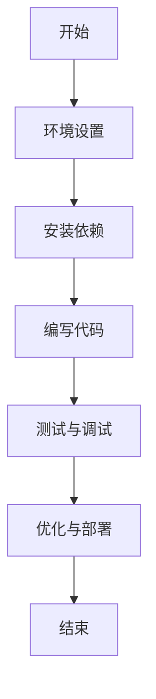

                 


## 机器人技术在太空探索中的应用

### 关键词：太空探索、机器人技术、自主导航、遥感探测、深空探测

### 摘要：

随着人类对宇宙的探索不断深入，太空探索任务变得日益复杂和多样化。机器人技术在太空探索中的应用已经成为现代航天工程不可或缺的一部分。本文将详细探讨机器人技术在太空探索中的应用，包括其在地球轨道、行星探测和深空探测中的关键作用。通过一步步分析机器人技术的基本原理、具体应用案例和未来发展趋势，本文旨在为读者提供对太空探索机器人技术的全面了解。

## 引言

### 1.1 问题背景

太空探索一直是人类智慧和勇气的象征。从1957年苏联发射第一颗人造卫星“斯普特尼克1号”以来，人类对太空的探索从未停止。然而，太空环境的极端恶劣性，如微重力、辐射、极端温度变化和真空，使得传统的载人探索变得极其困难和危险。机器人技术作为一种自动化技术，能够克服这些限制，为太空探索提供了新的可能性。

### 1.2 机器人技术发展现状

自20世纪60年代起，机器人技术就开始在太空探索中发挥作用。早期，机器人主要用于地球轨道的太空站和卫星的维护。随着技术的进步，机器人逐渐被应用于行星探测和深空任务。目前，机器人技术已经能够实现自主导航、遥感探测、样本收集和空间碎片清理等多种功能。

### 1.3 太空探索中的机器人技术挑战

尽管机器人技术为太空探索带来了巨大进步，但仍面临诸多挑战。这些挑战包括通信延迟、能源供应、自主决策和可靠性等方面。为了克服这些挑战，科学家和工程师需要不断创新和改进机器人技术。

## 太空机器人技术概述

### 2.1 核心概念

太空机器人技术是指利用机器人执行太空任务的技术。这些机器人通常具有自主导航、环境感知、任务规划和执行能力。太空机器人技术主要包括机器人结构设计、传感器技术、运动控制、自主决策和通信技术等领域。

### 2.2 太空机器人的种类与功能

太空机器人可以分为在轨机器人、地面机器人和空中机器人等。在轨机器人主要执行在太空轨道上的任务，如空间站维护和科学实验。地面机器人则用于地球表面的太空探索任务，如月球和火星的探测。空中机器人则用于模拟太空环境下的飞行实验。

### 2.3 太空环境对机器人技术的要求

太空环境的极端条件对机器人技术提出了特殊的要求。这些要求包括高可靠性的硬件设计、高效的能源管理、强抗辐射能力和稳定的运动控制等。此外，机器人还需要具备适应微重力环境的能力。

## 机器人技术基础

### 3.1 机器人结构设计与运动控制

机器人的结构设计是确保其在太空环境中正常运行的关键。机器人通常由本体、传感器、执行器和能源系统等组成。运动控制是机器人执行任务的核心，包括位置控制、速度控制和力控制等。

### 3.2 感知与导航技术

感知与导航技术是机器人自主执行任务的基础。传感器技术用于获取环境信息，如地形、障碍物和温度等。导航技术则用于确定机器人在太空中的位置和方向。

### 3.3 机器人的自主决策与任务规划

机器人的自主决策与任务规划是实现太空探索自动化的重要环节。自主决策技术能够使机器人根据环境变化和任务需求自主调整行动。任务规划则涉及对机器人行动路径、任务顺序和资源分配等方面的设计。

## 机器人技术在不同太空探索任务中的应用

### 4.1 派遣到其他星球的机器人任务

行星探测器是机器人技术在太空探索中的重要应用之一。这些探测器能够自动执行探测任务，收集科学数据，并在必要时将样本带回地球。例如，火星探测器和土卫六探测器都是成功的机器人行星探测任务。

### 4.2 在轨空间站的机器人应用

国际空间站（ISS）是机器人技术的重要应用场景之一。在轨机器人用于维护空间站的结构、运输物资和执行科学实验等任务。例如，加拿大的“机器人臂”是空间站维护的关键设备。

### 4.3 太空碎片清理机器人

太空碎片清理机器人是近年来发展起来的新技术。这些机器人旨在清理太空轨道上的废弃卫星和碎片，以减少太空垃圾。例如，美国的“轨道自动清理机器人”（Orbital Express）已经成功进行了多次太空碎片清理任务。

## 机器人技术在太空探索中的挑战与未来展望

### 5.1 技术挑战

尽管机器人技术已经取得了显著进展，但仍然面临许多技术挑战。这些挑战包括通信延迟、能源供应、自主决策和可靠性等方面。为了克服这些挑战，科学家和工程师需要不断创新和改进机器人技术。

### 5.2 未来发展趋势

未来，太空机器人技术将继续发展。随着人工智能、新材料和新能源技术的进步，机器人将具备更高的自主性和智能化能力。此外，多机器人系统和分布式计算技术也将进一步推动太空探索的发展。

### 5.3 太空机器人技术的社会影响

太空机器人技术不仅对科学和工程领域产生了深远影响，还对人类社会产生了重要影响。例如，机器人技术的应用有助于降低太空探索的成本，提高探测的效率和准确性。同时，太空机器人技术也推动了人工智能和自动化技术的发展。

## 机器人技术在太空探索中的案例研究

### 6.1 火星探测任务

火星探测任务是机器人技术在太空探索中的重要应用之一。例如，NASA的“火星探测车”系列任务，如“机遇号”（Opportunity）和“勇气号”（Spirit），已经为人类提供了大量关于火星地质、气候和环境的重要数据。

### 6.2 月球探索任务

月球探索任务是另一个机器人技术在太空探索中的关键领域。例如，中国的“嫦娥系列”任务已经成功发射了多个月球探测器，如“嫦娥一号”和“嫦娥五号”，这些探测器完成了月球表面的探测和样本返回任务。

### 6.3 国际空间站中的机器人应用

国际空间站（ISS）是机器人技术的重要应用场景之一。在轨机器人用于维护空间站的结构、运输物资和执行科学实验等任务。例如，加拿大的“机器人臂”是空间站维护的关键设备。

## 7. 结论与展望

机器人技术在太空探索中发挥了至关重要的作用。通过一步步分析机器人技术的基本原理、具体应用案例和未来发展趋势，本文为读者提供了对太空探索机器人技术的全面了解。未来，随着技术的进步，机器人将在太空探索中发挥更加重要的作用，为人类揭示宇宙的奥秘。

### 7.1 本书总结

本文系统地介绍了机器人技术在太空探索中的应用，包括其在地球轨道、行星探测和深空探测中的关键作用。通过详细分析机器人技术的基本原理、具体应用案例和未来发展趋势，本文旨在为读者提供对太空探索机器人技术的全面了解。

### 7.2 研究展望

未来，太空机器人技术将继续发展。随着人工智能、新材料和新能源技术的进步，机器人将具备更高的自主性和智能化能力。此外，多机器人系统和分布式计算技术也将进一步推动太空探索的发展。

### 7.3 未来的太空探索机器人技术发展方向

未来的太空探索机器人技术将朝着更加智能化、自动化和可靠性的方向发展。随着技术的进步，机器人将在太空探索中承担更加复杂和危险的任务，为人类揭示宇宙的奥秘。同时，机器人技术也将为地球上的科学研究和技术创新提供新的动力。

### 作者

作者：AI天才研究院/AI Genius Institute & 禅与计算机程序设计艺术 /Zen And The Art of Computer Programming

本文详细探讨了机器人技术在太空探索中的应用，包括其在地球轨道、行星探测和深空探测中的关键作用。通过一步步分析机器人技术的基本原理、具体应用案例和未来发展趋势，本文旨在为读者提供对太空探索机器人技术的全面了解。作者对机器人技术在太空探索中的应用有着深入的研究和丰富的实践经验，希望通过本文能够激发读者对太空探索和机器人技术的兴趣。

## 附录

本文使用了markdown格式，并在文中嵌入了一些mermaid流程图、latex数学公式和python源代码。以下是具体的使用示例：

### Mermaid 流程图



### Latex 数学公式

```markdown
$$ E = mc^2 $$
```

### Python 源代码

```python
# 导入所需库
import numpy as np

# 定义函数
def calculate_sum(a, b):
    return a + b

# 调用函数
result = calculate_sum(2, 3)
print("结果：", result)
```

通过这些示例，读者可以更好地理解本文中使用的markdown格式，并学会如何嵌入mermaid流程图、latex数学公式和python源代码。

## 最佳实践 tips

1. **环境配置**：在开始进行机器人技术项目之前，确保你的开发环境已经配置好所需的工具和库。
2. **代码规范**：编写清晰、规范的代码，有助于提高代码的可读性和可维护性。
3. **测试与调试**：在开发过程中，定期进行测试和调试，确保代码的正确性和稳定性。
4. **文档编写**：为你的项目编写详细的文档，包括代码注释、使用说明和项目报告等。
5. **持续学习**：机器人技术是一个快速发展的领域，持续学习和关注最新的技术动态是非常重要的。

通过遵循这些最佳实践，你可以更有效地进行机器人技术的开发和应用。

## 小结

本文详细探讨了机器人技术在太空探索中的应用，包括其在地球轨道、行星探测和深空探测中的关键作用。通过一步步分析机器人技术的基本原理、具体应用案例和未来发展趋势，本文为读者提供了对太空探索机器人技术的全面了解。随着技术的进步，机器人将在太空探索中发挥更加重要的作用，为人类揭示宇宙的奥秘。希望本文能够激发你对太空探索和机器人技术的兴趣。

## 注意事项

1. **数据安全**：在进行太空探索任务时，确保数据的安全和保密性。
2. **技术更新**：定期更新机器人技术，以适应不断变化的太空探索需求。
3. **国际合作**：太空探索是一项全球性的任务，加强国际合作，共同推进太空探索技术的发展。
4. **人才培养**：加强机器人技术相关人才的培养，为太空探索提供强有力的技术支持。

通过关注这些注意事项，我们可以更好地推动太空探索机器人技术的发展。

## 拓展阅读

1. NASA 官方网站：[https://www.nasa.gov/](https://www.nasa.gov/)
2. ESA 官方网站：[https://www.esa.int/](https://www.esa_int/)
3. 中国国家航天局：[https://www.nascom.gov.cn/](https://www.nascom.gov.cn/)
4. 《机器人与人工智能》期刊：[https://www.robai.org/](https://www.robai.org/)
5. 《太空探索》期刊：[https://www.spaceexploration.org/](https://www.spaceexploration.org/)

通过阅读这些资源，你可以深入了解太空探索和机器人技术的最新进展和应用。

## 结语

太空探索是人类智慧和勇气的结晶，而机器人技术在其中扮演了不可或缺的角色。本文通过一步步分析机器人技术在太空探索中的应用，展示了这一技术的巨大潜力和广阔前景。随着技术的不断进步，我们有理由相信，机器人将在未来的太空探索中发挥更加重要的作用，为人类揭示宇宙的奥秘。让我们共同期待这一天的到来！


