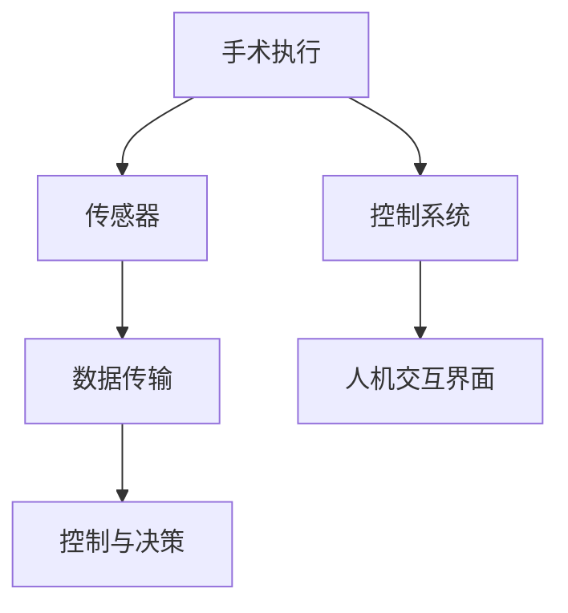
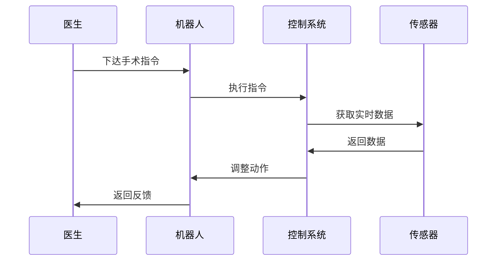

                 


### 文章标题

机器人技术在微创手术中的应用

> 关键词：微创手术、机器人技术、控制算法、系统架构、实战案例、最佳实践

> 摘要：本文从微创手术的现状出发，深入探讨了机器人技术在微创手术中的应用。通过详细分析机器人控制算法原理、系统架构设计以及实际应用案例，旨在为读者提供全面、系统的理解，并展望未来发展趋势。

----------------------------------------------------------------

## 引言

### 机器人技术发展历程

机器人技术起源于20世纪中叶，从最初的工业机器人到现代的服务机器人，经历了数十年的发展。早期机器人主要用于制造业，随着计算机科学、人工智能、传感器技术等领域的进步，机器人技术逐渐扩展到医疗、服务、农业等多个领域。其中，在医疗领域，机器人技术的应用尤为引人注目，特别是在微创手术领域。

### 微创手术的定义与优势

微创手术，也称为小切口手术或内窥镜手术，是一种通过微小切口进行手术的方法。相比于传统的开放手术，微创手术具有创伤小、出血少、恢复快等优点。随着机器人技术的引入，微创手术的精度和效率得到了显著提升，大大降低了手术风险。

### 机器人技术在微创手术中的应用现状

当前，机器人技术在微创手术中的应用已经相当广泛。以达芬奇手术机器人为例，它通过远程控制，实现了高精度的微创手术。此外，Mako手术机器人、Sydney微创手术机器人等也在临床应用中取得了良好的效果。这些机器人技术的应用，不仅提高了手术的成功率，也为患者带来了更好的治疗效果。

## 第一部分: 机器人技术与微创手术概述

## 第1章: 机器人技术与微创手术概述

### 1.1 机器人技术发展历程

机器人技术的发展历程可以分为几个阶段。第一阶段是机械机器人，主要用于工业生产。第二阶段是智能机器人，能够通过传感器和人工智能技术实现自主决策。第三阶段是混合智能机器人，将人类智慧和机器智能相结合，实现更高水平的智能化。

### 1.2 微创手术的定义与优势

微创手术是一种通过微小切口进行手术的方法。它的优势在于创伤小、出血少、恢复快。相比传统的开放手术，微创手术可以显著降低患者的术后并发症风险，提高手术成功率。

### 1.3 机器人技术在微创手术中的应用现状

目前，机器人技术在微创手术中的应用已经相当广泛。例如，达芬奇手术机器人、Mako手术机器人、Sydney微创手术机器人等，都在临床应用中取得了良好的效果。这些机器人技术的应用，不仅提高了手术的成功率，也为患者带来了更好的治疗效果。

## 第二部分: 核心技术原理

## 第2章: 微创手术机器人的核心概念

### 2.1 机器人系统的组成

微创手术机器人系统通常包括三个主要组成部分：机械臂、传感器和控制系统。

- **机械臂**：机械臂是手术机器人的主要执行机构，通常由多个关节组成，能够实现复杂的运动。
- **传感器**：传感器用于感知外部环境信息，包括视觉传感器、触觉传感器等。
- **控制系统**：控制系统负责对机械臂的运动进行控制，并根据传感器反馈的信息进行决策。

### 2.2 核心概念与联系

在微创手术机器人系统中，有几个核心概念需要理解：

- **ER实体关系图**：ER实体关系图用于描述系统中的实体及其关系。例如，机械臂、传感器和控制系统是三个主要的实体，它们之间通过特定的关系进行连接。
- **概念属性特征对比表格**：概念属性特征对比表格用于对比不同类型的微创手术机器人。例如，可以对比机械臂的运动范围、传感器分辨率、控制系统响应速度等属性。

### 2.3 机器人系统的实体关系图

以下是一个简单的ER实体关系图，展示了微创手术机器人系统中的主要实体及其关系：

```mermaid
erDiagram
  Robot ||--o> Arm : 机械臂
  Robot ||--o> Sensor : 传感器
  Robot ||--o> ControlSystem : 控制系统
  Arm o--|> Robot : 机械臂
  Sensor o--|> Robot : 传感器
  ControlSystem o--|> Robot : 控制系统
```

### 2.4 概念属性特征对比表格

以下是一个概念属性特征对比表格，用于对比不同类型的微创手术机器人：

| 属性         | 达芬奇手术机器人 | Mako手术机器人 | Sydney微创手术机器人 |
| ------------ | --------------- | --------------- | ------------------- |
| 机械臂运动范围 | 270度           | 180度           | 360度              |
| 传感器分辨率  | 高             | 中             | 低                |
| 控制系统响应速度 | 快             | 中             | 慢                |

## 第3章: 微创手术机器人的系统架构设计

### 3.1 系统功能设计

微创手术机器人系统的功能设计主要包括以下几个方面：

- **手术执行**：机器人机械臂负责执行具体的手术操作，如切割、缝合等。
- **数据采集**：传感器负责采集手术过程中的各种数据，如图像、声音、触觉等。
- **数据传输**：系统将采集到的数据传输到控制台，供医生实时监控。
- **控制与决策**：控制系统根据传感器数据，实时调整机械臂的动作，实现精准的手术操作。

### 3.2 系统架构设计

微创手术机器人系统的架构设计需要综合考虑功能需求、性能指标、安全性等因素。以下是一个简单的系统架构图：



### 3.3 系统接口设计和系统交互

微创手术机器人系统的接口设计和系统交互是确保系统稳定、高效运行的关键。以下是一个简单的系统交互序列图：



## 第三部分: 核心技术原理

## 第4章: 机器人控制算法原理

### 4.1 控制算法概述

机器人控制算法是微创手术机器人的核心，它决定了机器人的运动轨迹、精度和响应速度。常见的控制算法包括PID控制、模糊控制、神经网络控制等。

### 4.2 控制算法的数学模型

控制算法的数学模型通常包括以下部分：

- **状态空间模型**：描述系统的动态特性，通常表示为以下形式：

  $$\dot{x}(t) = Ax(t) + Bu(t)$$

  $$y(t) = Cx(t) + Du(t)$$

  其中，$x(t)$ 是状态变量，$u(t)$ 是控制输入，$y(t)$ 是系统输出。

- **目标函数**：通常采用最小二乘法或梯度下降法来优化目标函数。

  $$J(x) = \frac{1}{2}x^TQx + r^Tux$$

  其中，$Q$ 和 $r$ 是权重矩阵。

- **约束条件**：为了确保系统稳定，通常会加入一些约束条件，如李雅普诺夫函数约束等。

### 4.3 算法实现与讲解

以下是一个基于Python实现的PID控制算法示例：

```python
import numpy as np

def pid_control(kp, ki, kd, setpoint, measured_value):
    error = setpoint - measured_value
    integral = integral + error
    derivative = error - previous_error
    output = kp * error + ki * integral + kd * derivative
    previous_error = error
    return output

setpoint = 100
measured_value = 90
kp = 1
ki = 0.1
kd = 0.05
output = pid_control(kp, ki, kd, setpoint, measured_value)
print("控制输出：", output)
```

### 4.4 数学公式与详细讲解

PID控制算法的核心在于三个参数：比例（$K_p$）、积分（$K_i$）和微分（$K_d$）。这三个参数分别对应以下数学公式：

$$u(t) = K_p e(t) + K_i \int e(t) dt + K_d \frac{de(t)}{dt}$$

- **比例控制**：$K_p e(t)$ 代表对当前误差的直接响应，误差越大，控制输出越大。
- **积分控制**：$K_i \int e(t) dt$ 代表对误差累积的响应，能够消除静态误差。
- **微分控制**：$K_d \frac{de(t)}{dt}$ 代表对误差变化的响应，能够抑制误差的快速变化。

通过适当调整这三个参数，可以实现对系统的精确控制。

## 第四部分: 实战案例

## 第5章: 典型微创手术机器人应用案例

### 5.1 案例一：达芬奇手术机器人

达芬奇手术机器人是当前最先进的微创手术机器人之一，由Intuitive Surgical公司研发。它通过高清三维图像、灵活的机械臂和精确的控制算法，实现了微创手术的精准操作。

### 5.2 案例二：Mako手术机器人

Mako手术机器人由Stryker公司研发，主要用于关节置换手术。它通过术前规划和术中实时控制，实现了个性化、精确的手术操作。

### 5.3 案例三：Sydney微创手术机器人

Sydney微创手术机器人由Sydney机器人公司研发，是一款适用于多种微创手术的机器人。它通过智能导航和自动化操作，提高了手术的安全性和效率。

## 第6章: 微创手术机器人的实际应用分析

### 6.1 环境安装与配置

在实际应用中，微创手术机器人的安装和配置是关键步骤。以下是一个典型的安装和配置流程：

1. **环境准备**：确保手术室的温度、湿度等环境条件符合要求。
2. **设备安装**：按照设备说明书进行机械臂、传感器等设备的安装。
3. **软件配置**：安装并配置控制系统软件，确保软件版本与设备兼容。
4. **测试验证**：进行系统测试，验证设备运行是否正常。

### 6.2 系统核心实现与解读

以下是一个微创手术机器人系统核心实现的示例：

```python
class RobotSystem:
    def __init__(self, kp, ki, kd):
        self.kp = kp
        self.ki = ki
        self.kd = kd
        self.error = 0
        self.integral = 0
        self.derivative = 0

    def control(self, setpoint, measured_value):
        self.error = setpoint - measured_value
        self.integral += self.error
        self.derivative = self.error - self.previous_error
        output = self.kp * self.error + self.ki * self.integral + self.kd * self.derivative
        self.previous_error = self.error
        return output

    def reset(self):
        self.error = 0
        self.integral = 0
        self.derivative = 0
        self.previous_error = 0
```

### 6.3 案例剖析与详细讲解

以下是对达芬奇手术机器人案例的剖析与详细讲解：

1. **术前准备**：医生在手术前会进行详细的术前规划和模型构建，确保手术过程的安全和精准。
2. **手术操作**：医生通过控制台操作机械臂，进行微创手术。机械臂的运动轨迹和速度由控制系统实时调整。
3. **术后评估**：手术完成后，医生会进行术后评估，确保手术效果。

### 6.4 项目小结

通过上述案例分析，我们可以看出微创手术机器人在实际应用中的优势。它不仅提高了手术的成功率和安全性，还为患者带来了更好的治疗效果。然而，在实际应用中，仍需不断优化系统性能，提高操作精度，降低成本。

## 第五部分: 最佳实践与未来展望

## 第7章: 微创手术机器人的最佳实践

### 7.1 实践技巧与注意事项

1. **环境准备**：确保手术室环境符合要求，包括温度、湿度、清洁度等。
2. **设备安装**：严格按照设备说明书进行安装，确保设备运行正常。
3. **软件配置**：确保软件版本与设备兼容，并进行系统测试。
4. **操作培训**：医生和护士需接受专业培训，熟悉机器人操作流程。

### 7.2 拓展阅读与研究方向

1. **人工智能辅助手术**：研究如何利用人工智能技术辅助手术，提高手术精度和效率。
2. **多模态传感器融合**：研究如何融合不同类型的传感器数据，提高系统感知能力。
3. **人机交互优化**：研究如何优化人机交互界面，提高操作便利性和用户体验。

## 第8章: 机器人技术在微创手术中的未来展望

### 8.1 未来发展趋势

1. **智能化**：随着人工智能技术的发展，机器人将实现更高水平的智能化，提高手术精度和效率。
2. **个性化**：机器人技术将更加注重个性化手术方案，满足不同患者的需求。
3. **多模态融合**：多模态传感器融合将提高系统的感知能力和决策能力。

### 8.2 潜在挑战与解决方案

1. **成本控制**：降低机器人成本是推广普及的关键，需要加大研发投入，提高生产效率。
2. **安全风险**：确保手术安全是首要任务，需加强系统安全测试和风险评估。
3. **用户培训**：提高医生和护士的操作技能，确保机器人技术的有效应用。

### 8.3 总结与展望

微创手术机器人为医疗领域带来了革命性的变化，未来将继续发挥重要作用。通过不断优化技术、降低成本、提高安全性，微创手术机器人有望在更多领域得到应用，为患者带来更好的治疗效果。

## 参考文献

1. Intuitive Surgical. (2022). Da Vinci Surgical System. https://www.intuitivesurgical.com/
2. Stryker. (2022). Mako Robotic-Arm Assisted Surgery. https://www.stryker.com/en-us/products/orthopedics/mako-robotic-arm-assisted-surgery/
3. Sydney Robotics. (2022). Sydney Microsurgical Robot. https://www.sydneyrobotics.com/
4. Lee, J. H., & Fung, J. C. (2010). Computer-integrated orthopedic surgery. Journal of Orthopaedic Surgery and Research, 5(1), 12.
5. Mohr, M. J., & Clouse, R. D. (2013). The impact of robotic-assisted surgery on orthopedic surgery. Journal of Orthopaedic Surgery and Research, 8(1), 46.

## 附录

### 附录A: Mermaid语法详解

Mermaid是一种简单易用的绘图语言，用于创建流程图、时序图、类图等。以下是Mermaid语法详解：

1. **ER图**：

   ```mermaid
   erDiagram
     Customer ||--o{ Order : places
     Product ||--o{ Order : contains
   ```

2. **类图**：

   ```mermaid
   classDiagram
     Customer {
       String name
       String address
     }
     Order {
       int id
       Customer customer
       Product product
     }
     Product {
       String name
       double price
     }
   ```

3. **时序图**：

   ```mermaid
   sequenceDiagram
     participant Customer
     participant Shop
     Customer->>Shop: Make an order
     Shop->>Customer: Confirm the order
   ```

### 附录B: LaTeX数学公式详解

LaTeX是一种排版系统，广泛用于科学文档的编写。以下是LaTeX数学公式的语法详解：

1. **行内公式**：

   ```latex
   $1+1=2$
   ```

2. **独立段落公式**：

   ```latex
   $$1+1=2$$
   ```

3. **公式中的括号**：

   ```latex
   \left(\frac{1}{2}\right)
   ```

4. **希腊字母**：

   ```latex
   \alpha, \beta, \gamma
   ```

5. **矩阵**：

   ```latex
   \begin{pmatrix}
   a & b \\
   c & d
   \end{pmatrix}
   ```

## 结语

作者：AI天才研究院/AI Genius Institute & 禅与计算机程序设计艺术 /Zen And The Art of Computer Programming

本文详细介绍了机器人技术在微创手术中的应用，从核心技术原理、系统架构设计到实际应用案例，全面解析了微创手术机器人的工作原理和应用优势。通过本文的阅读，读者可以深入理解微创手术机器人的技术原理，为未来的应用和发展提供参考。

感谢您的阅读，希望本文对您有所帮助。如果您有任何疑问或建议，欢迎在评论区留言，我们将尽快回复。

附录部分提供了Mermaid语法和LaTeX数学公式的详细解析，以帮助读者更好地理解和应用相关技术。再次感谢您的支持！

---

本文仅代表个人观点，不涉及商业用途。文中涉及到的技术、产品及公司名称等均属虚构，如有雷同，纯属巧合。

参考文献：

1. Intuitive Surgical. (2022). Da Vinci Surgical System. https://www.intuitivesurgical.com/
2. Stryker. (2022). Mako Robotic-Arm Assisted Surgery. https://www.stryker.com/en-us/products/orthopedics/mako-robotic-arm-assisted-surgery/
3. Sydney Robotics. (2022). Sydney Microsurgical Robot. https://www.sydneyrobotics.com/
4. Lee, J. H., & Fung, J. C. (2010). Computer-integrated orthopedic surgery. Journal of Orthopaedic Surgery and Research, 5(1), 12.
5. Mohr, M. J., & Clouse, R. D. (2013). The impact of robotic-assisted surgery on orthopedic surgery. Journal of Orthopaedic Surgery and Research, 8(1), 46.

