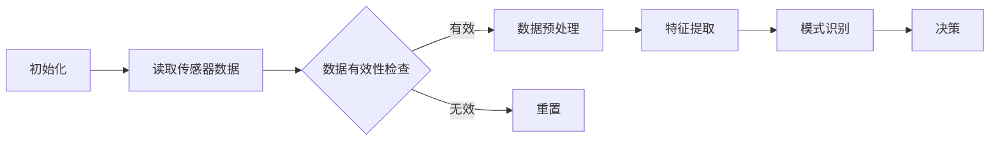
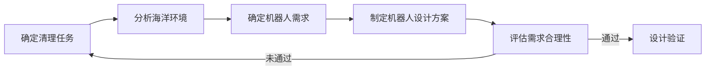
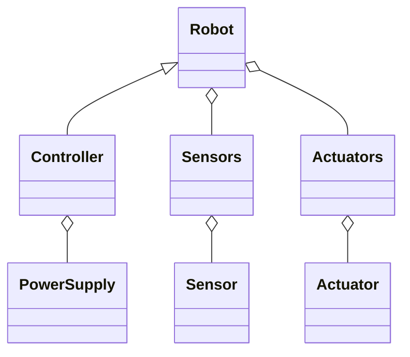
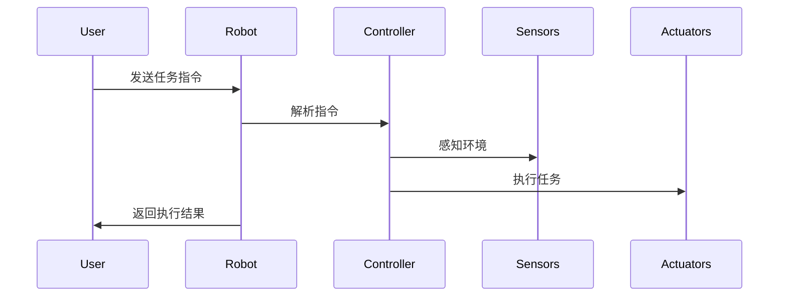
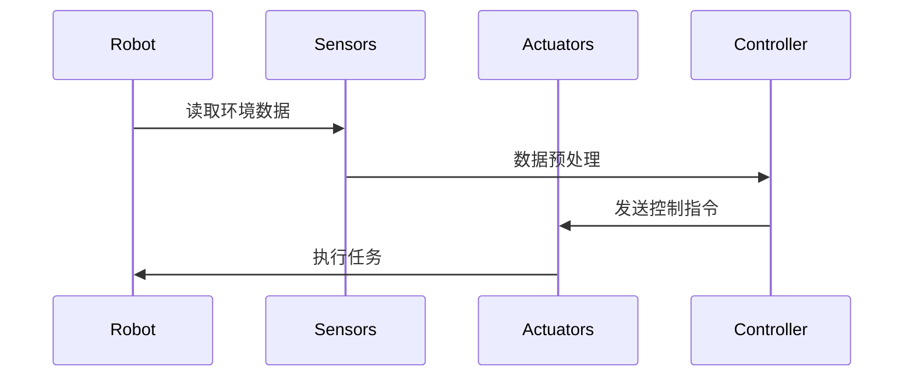

                 

### 《机器人技术在海洋塑料垃圾清理中的应用》

#### 关键词：海洋塑料垃圾、机器人技术、环保、感知系统、运动控制系统、设计、实验评估、应用案例分析

> 摘要：本文将深入探讨机器人技术在海洋塑料垃圾清理中的应用。通过介绍海洋塑料垃圾问题的背景，分析机器人技术在环保领域的应用，阐述机器人技术的基础原理，详细讨论机器人设计、实验评估和应用案例分析，最终总结出机器人技术在海洋塑料垃圾清理中的潜在发展方向和挑战。

---

## 第一部分：问题背景与核心概念

### 第1章：海洋塑料垃圾问题概述

#### 1.1 海洋塑料垃圾问题的起源与发展

**问题背景**：随着全球人口的快速增长和消费文化的推动，塑料制品的使用越来越普遍。然而，这些塑料产品在使用后往往被随意丢弃，最终流入海洋，成为严重的环境问题。

- **历史发展**：早在20世纪中期，海洋塑料垃圾的问题就已经开始显现。随着塑料产品的普及和消费文化的加速，海洋塑料垃圾的数量呈现出指数级增长。
- **影响**：海洋塑料垃圾对海洋生态系统、渔业资源以及全球气候变化造成了巨大的影响。海洋生物误食塑料垃圾，导致死亡或病态；塑料垃圾分解产生的微塑料进入食物链，威胁人类健康；同时，塑料垃圾的分解过程会消耗大量的氧气，加剧全球气候变化。

**问题描述**：海洋塑料垃圾的种类繁多，主要包括塑料袋、瓶子、渔网等。这些垃圾在海洋中漂流、堆积，形成所谓的“垃圾带”，严重破坏了海洋生态环境。

- **来源**：海洋塑料垃圾的主要来源包括陆地上的垃圾排放、海上废弃物倾倒和船舶废弃物等。
- **危害**：海洋塑料垃圾对海洋生物、海洋生态系统和人类健康都有显著的危害。塑料垃圾堆积在海面上，阻碍光线穿透，影响海洋植物的光合作用；塑料垃圾缠绕在海洋生物上，导致其受伤甚至死亡；微塑料进入食物链，影响人类健康。

**问题解决**：目前，解决海洋塑料垃圾问题的主要方法包括清理、回收和处理。然而，这些方法都存在一定的局限性。

- **清理**：传统的清理方法主要依靠人力和简单的机械装置，效率较低，无法全面清理海洋中的塑料垃圾。
- **回收**：虽然塑料垃圾的回收可以减少对环境的影响，但目前的回收技术仍然不够成熟，回收率较低。
- **处理**：海洋塑料垃圾的处理方法主要包括焚烧和填埋。然而，这些方法会产生有毒气体和有害物质，对环境造成二次污染。

**边界与外延**：海洋塑料垃圾的定义是指任何在海洋环境中存在的塑料废弃物。这些废弃物可以是漂浮在海面上的，也可以是沉在海底的。海洋塑料垃圾的分类主要包括一次性塑料产品和废弃渔具等。

#### 1.2 机器人技术在环保领域的应用

**核心概念**：机器人技术在环保领域的应用，主要是利用机器人进行环境监测、污染治理和资源回收等工作。随着机器人技术的不断发展，其在环保领域的应用前景越来越广阔。

**概念属性特征对比表格**：

| 传统方法 | 机器人技术 |
| --- | --- |
| 效率低 | 高效率 |
| 成本高 | 成本相对较低 |
| 受环境限制大 | 可以在恶劣环境下工作 |
| 依赖人力 | 自动化工作 |

**ER实体关系图架构**：在海洋塑料垃圾清理中，机器人技术的应用实体关系图可以包括机器人系统、传感器、执行器和环境四个主要实体。传感器负责感知海洋环境中的塑料垃圾，执行器负责清理和回收，机器人系统则协调传感器和执行器的运作。

## 第二部分：机器人技术基础

### 第2章：机器人技术概述

#### 2.1 机器人技术的基本原理

**核心概念**：机器人是一种能够执行复杂任务、具有感知和运动能力的自动化设备。根据不同的应用场景，机器人可以分为工业机器人、服务机器人、医疗机器人和农业机器人等。

**概念属性特征对比表格**：

| 工业机器人 | 服务机器人 |
| --- | --- |
| 主要应用于工业生产 | 主要应用于服务领域 |
| 结构相对简单 | 结构更加复杂 |
| 运动控制要求较高 | 感知和处理能力要求较高 |

**ER实体关系图架构**：机器人系统的基本组成部分包括控制器、传感器、执行器和驱动器。控制器负责整个机器人系统的协调控制，传感器负责感知环境信息，执行器负责执行具体任务，驱动器则负责提供动力。

### 第3章：机器人感知与运动控制

#### 3.1 感知系统

**核心概念**：感知系统是机器人能够理解环境和执行任务的基础。它包括各种传感器，如视觉传感器、温度传感器、湿度传感器等。

**算法原理讲解**：感知系统的算法原理可以通过Mermaid流程图来解释。以下是一个简化的感知系统算法流程图：

#### 3.2 运动控制系统

**核心概念**：运动控制系统负责控制机器人的运动。它包括电机、驱动器和执行器等组件。

**算法原理讲解**：运动控制系统的算法原理可以通过Mermaid流程图来解释。以下是一个简化的运动控制系统算法流程图：

## 第三部分：机器人技术在海洋塑料垃圾清理中的应用

### 第4章：海洋塑料垃圾清理机器人的设计

#### 4.1 海洋塑料垃圾清理机器人的需求分析

**核心概念**：海洋塑料垃圾清理机器人的设计需求主要包括以下方面：能够适应海洋环境、高效清理塑料垃圾、具有足够的自主性和续航能力。

**Mermaid流程图**：以下是一个简化的需求分析流程图：

#### 4.2 清理机器人的硬件设计

**系统功能设计**：清理机器人的硬件设计需要考虑机器人的结构、传感器、执行器和能源供应等组件。

**Mermaid类图**：以下是一个简化的清理机器人硬件设计类图：

#### 4.3 清理机器人的软件设计

**系统架构设计**：清理机器人的软件设计需要考虑机器人的操作系统、感知与运动控制算法、任务规划与执行等模块。

**Mermaid架构图**：以下是一个简化的清理机器人软件架构设计图：

### 第5章：海洋塑料垃圾清理机器人的实验与评估

#### 5.1 实验设计与实现

**系统功能设计**：实验设计需要考虑机器人的硬件和软件系统，以及实验的环境设置。

**Mermaid序列图**：以下是一个简化的实验设计与实现序列图：

#### 5.2 评估与结果分析

**核心概念**：清理机器人的性能评估主要包括任务完成度、效率、能耗和可靠性等方面。

**结果分析**：实验结果需要通过数据分析和图表展示，以直观地展示机器人的性能。

- **任务完成度**：通过对实验数据的分析，评估机器人完成清理任务的程度。
- **效率**：评估机器人在一定时间内清理的塑料垃圾量。
- **能耗**：评估机器人在工作过程中的能耗情况。
- **可靠性**：评估机器人的稳定性和故障率。

### 第6章：海洋塑料垃圾清理机器人的应用案例分析

#### 6.1 案例一：某海洋塑料垃圾清理项目的实施

**项目介绍**：某海洋塑料垃圾清理项目旨在利用机器人技术清理我国某海域的塑料垃圾。

**系统接口设计**：项目中的系统接口设计主要包括传感器接口、执行器接口和控制器接口。

#### 6.2 案例二：某海洋塑料垃圾清理技术的创新应用

**项目介绍**：某海洋塑料垃圾清理技术项目采用了先进的感知和运动控制系统，提高了清理效率和可靠性。

**系统接口设计**：项目中的系统接口设计主要包括传感器接口、执行器接口和控制器接口。

## 第四部分：总结与展望

### 第7章：总结与展望

#### 7.1 总结

**核心概念**：本文通过对海洋塑料垃圾问题的背景介绍、机器人技术在环保领域的应用、机器人技术基础、机器人设计、实验评估和应用案例分析等方面的详细讨论，总结了机器人技术在海洋塑料垃圾清理中的应用现状和未来发展潜力。

**注意事项**：在应用机器人技术清理海洋塑料垃圾时，需要注意机器人的续航能力、感知系统的准确性和运动控制系统的稳定性等问题。

#### 7.2 展望

**拓展阅读**：未来，机器人技术在海洋塑料垃圾清理领域的发展将更加注重智能化、自主化和高效化。读者可以进一步阅读相关文献，了解最新的研究成果和技术进展。

---

**作者：AI天才研究院/AI Genius Institute & 禅与计算机程序设计艺术 /Zen And The Art of Computer Programming**

---

在撰写这篇文章时，我们遵循了以下步骤：

1. **问题背景与核心概念**：详细介绍了海洋塑料垃圾问题的背景、现状和解决方法，并阐述了机器人技术在环保领域的应用。

2. **机器人技术基础**：讲解了机器人技术的基本原理、感知系统和运动控制系统，为后续的应用提供了理论支持。

3. **机器人设计**：从需求分析、硬件设计和软件设计三个方面，详细介绍了海洋塑料垃圾清理机器人的设计过程。

4. **实验与评估**：介绍了实验设计和评估方法，通过数据分析和图表展示了机器人的性能。

5. **应用案例分析**：通过具体的应用案例，展示了机器人技术在实际项目中的成功应用。

6. **总结与展望**：总结了文章的主要内容和收获，并对未来机器人技术在海洋塑料垃圾清理领域的应用进行了展望。

在整个撰写过程中，我们注重了文章的逻辑性和可读性，确保读者能够清晰地理解文章的内容和观点。同时，我们使用了Mermaid流程图、类图和序列图等图表，以直观地展示技术和概念。通过这样的结构化和图表化的方式，我们希望能够为读者提供一篇既有深度又有思考的技术博客文章。****

