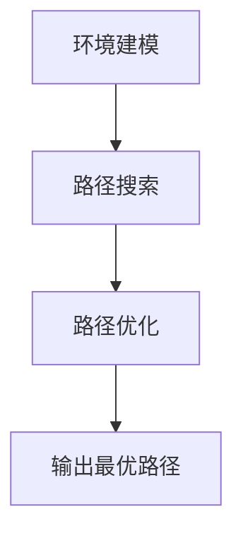
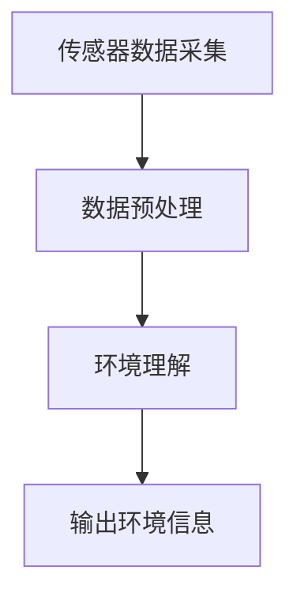
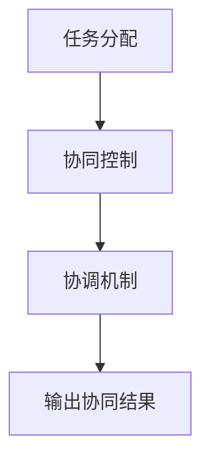
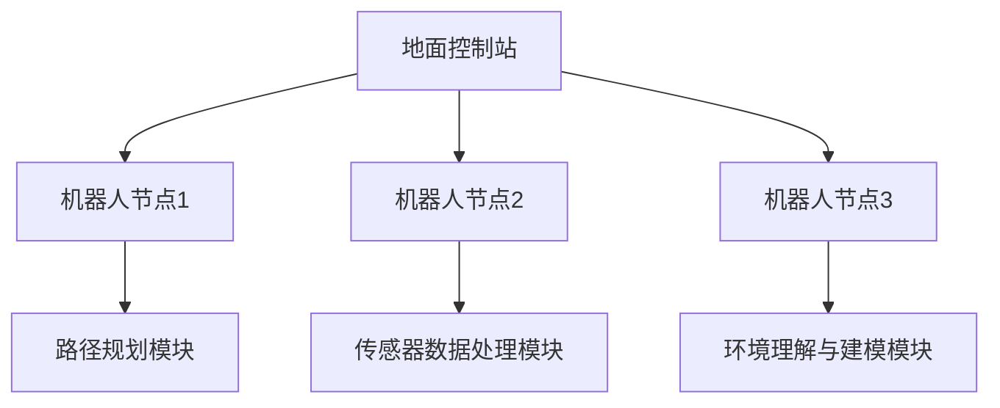
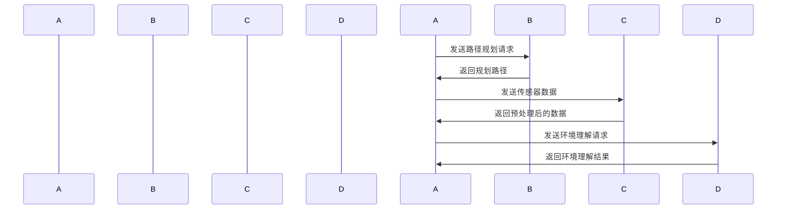

                 


### 开篇背景介绍

#### 机器人技术的发展历程与分类

机器人技术作为一种前沿科技，它的历史可以追溯到20世纪。早在1950年代，乔治·德沃尔（George Devol）和约瑟夫·恩格尔伯格（Joseph Engelberger）共同发明了世界上第一台工业机器人——Unimate。此后，机器人技术逐渐从工业领域向其他领域扩展。目前，机器人技术主要分为以下几类：

1. **工业机器人**：主要用于自动化生产线，提高生产效率和产品质量。
2. **服务机器人**：如家用机器人、医疗机器人、教育机器人等，用于提供便捷的服务。
3. **特殊环境机器人**：如深海机器人、火星探测器等，用于极端环境下的探测和作业。

#### 深海探索的重要性与挑战

深海探索对科学研究、资源开发以及国家安全具有重要意义。深海中蕴含着丰富的生物资源、矿产资源，甚至可能有未知的环境变化和气候变化的信息。然而，深海环境的极端条件，如高压力、低温、能见度低等，给深海探索带来了巨大的挑战。传统的深海探测方法，如潜水器和拖网作业，存在探测范围有限、操作复杂、成本高昂等问题。

#### 机器人技术在深海探索中的应用

机器人技术在深海探索中发挥着重要作用。它们能够深入到人无法到达的深海区域，进行环境监测、资源勘探、生物多样性研究等任务。以下是机器人技术在深海探索中的核心概念、优势及局限性：

1. **核心概念**：深海机器人通常包括以下几个部分：
   - **传感器**：用于感知环境信息。
   - **驱动系统**：包括推进器、机械臂等，用于执行任务。
   - **控制系统**：用于处理传感器数据，指挥机器人行动。
   - **通信系统**：用于与地面控制站进行数据传输。

2. **优势**：
   - **高效性**：机器人可以在短时间内完成大量重复性工作。
   - **安全性**：人类无需直接面对深海环境的危险。
   - **灵活性**：机器人可以根据需要调整探测路径和任务。

3. **局限性**：
   - **维护成本**：深海机器人维护成本较高，特别是在深海环境下。
   - **技术局限**：目前的技术还无法完全克服深海环境的复杂性和不确定性。

#### 本章小结

本文介绍了机器人技术和深海探索的基本概念、发展历程以及它们之间的联系。接下来，我们将进一步探讨机器人技术在深海探索中的应用，包括常见的算法原理、系统设计与实现，以及实际案例的分析。

---

### 核心概念与联系

#### 机器人技术

**定义**：机器人技术是指利用电子计算机和电子控制技术实现各种自动化机器的制造和应用的科学。

**分类**：
1. **工业机器人**：用于生产线的自动化作业。
2. **服务机器人**：用于提供日常生活服务。
3. **特种机器人**：用于特殊环境，如深海、火星等。

**发展历程**：
- **1950年代**：工业机器人出现。
- **1970年代**：机器人开始在工业生产中广泛应用。
- **21世纪**：服务机器人和特种机器人逐渐兴起。

**核心概念**：
- **传感器**：用于感知环境信息。
- **驱动系统**：用于控制机器人动作。
- **控制系统**：用于处理传感器数据和指挥机器人行动。

#### 深海探索

**定义**：深海探索是指对地球表面以下水深超过200米的海洋区域进行科学研究、资源开发和环境保护等活动。

**重要性**：
- **资源开发**：深海中蕴含着丰富的矿物资源和生物资源。
- **科学研究**：深海环境是地球上最后一片未被充分探索的领域，对于气候变化、生物多样性等研究具有重要意义。
- **国家安全**：深海资源的开发和保护对国家安全具有重要意义。

**方法**：
- **潜水器**：如载人潜水器、无人潜水器。
- **拖网作业**：用于捕捉深海生物。
- **声学探测**：利用声波进行水下探测。

**挑战**：
- **高压力**：深海环境下的高压力对设备材料和结构设计提出了极高要求。
- **低温**：深海环境温度极低，对设备的耐寒性能要求高。
- **低能见度**：深海能见度低，给探测和作业带来困难。

#### 机器人技术在深海探索中的应用

**核心概念**：
- **深海机器人**：一种能够在深海环境中执行任务的特殊机器人。
- **传感器系统**：用于感知深海环境。
- **驱动系统**：用于在深海环境中移动和操作。
- **控制系统**：用于处理传感器数据和指挥机器人行动。

**优势**：
- **高效性**：深海机器人可以快速、准确地进行深海探测。
- **安全性**：人类无需直接面对深海环境的危险。
- **灵活性**：可以根据需要调整探测路径和任务。

**局限性**：
- **维护成本**：深海机器人的维护成本较高。
- **技术局限**：目前的技术还无法完全克服深海环境的复杂性和不确定性。

#### 本章小结

在本节中，我们详细介绍了机器人技术和深海探索的基本概念、发展历程、核心概念及它们之间的联系。接下来，我们将进一步探讨机器人技术在深海探索中的应用，包括常见的算法原理、系统设计与实现，以及实际案例的分析。

---

### 算法原理讲解

#### 机器人路径规划算法

**定义**：机器人路径规划算法是指机器人根据环境信息和任务目标，确定一条从起点到终点的最优路径。

**流程**：
1. **环境建模**：将环境信息转换为数学模型。
2. **路径搜索**：在环境模型中搜索一条最优路径。
3. **路径优化**：对搜索到的路径进行优化，确保其满足实际需求。

**适用场景**：
- **工业生产**：机器人从仓库到装配线的路径规划。
- **服务机器人**：如家用机器人清洁路径的规划。

**流程图**：



**Python源代码示例**：

```python
# 路径规划算法示例代码
def path_planning(environment, start, end):
    # 环境建模
    model = build_environment_model(environment)
    # 路径搜索
    path = search_path(model, start, end)
    # 路径优化
    optimized_path = optimize_path(path)
    # 输出最优路径
    return optimized_path

# 示例使用
environment = ...
start = ...
end = ...
optimized_path = path_planning(environment, start, end)
```

**数学模型和公式**：

路径规划中的常见数学模型包括图论模型、网格模型等。常用的算法有Dijkstra算法、A*算法等。

$$
Dijkstra算法：C(s, v) = \min \{d(s, u) + C(u, v) \mid u \in N(s)}
$$

$$
A*算法：f(n) = g(n) + h(n)，其中g(n)为从起点到点n的实际代价，h(n)为从点n到终点的估计代价。
$$

**举例说明**：

假设有一个简单的网格环境，起点为(0,0)，终点为(5,5)。使用A*算法进行路径规划。

1. **环境建模**：将环境视为一个10x10的网格。
2. **路径搜索**：使用A*算法，从起点开始逐步搜索到终点。
3. **路径优化**：对搜索到的路径进行优化，确保其无障碍且最短。

通过上述步骤，最终得到一条从起点到终点的最优路径。

#### 深海机器人感知算法

**定义**：深海机器人感知算法是指机器人利用各种传感器收集环境信息，以实现对深海环境的感知和理解。

**流程**：
1. **传感器数据采集**：从各种传感器中获取数据。
2. **数据预处理**：对采集到的数据进行滤波、去噪等处理。
3. **环境理解**：利用预处理后的数据，对环境进行理解，如识别海底地形、生物等。

**适用场景**：
- **深海探测**：用于识别和定位探测目标。
- **资源勘探**：用于勘探深海中的矿物资源。

**流程图**：



**Python源代码示例**：

```python
# 深海机器人感知算法示例代码
def perception_algorithm(sensor_data):
    # 数据预处理
    processed_data = preprocess_data(sensor_data)
    # 环境理解
    environment_info = understand_environment(processed_data)
    # 输出环境信息
    return environment_info

# 示例使用
sensor_data = ...
environment_info = perception_algorithm(sensor_data)
```

**数学模型和公式**：

感知算法中的常见数学模型包括滤波模型、信号处理模型等。常用的算法有卡尔曼滤波、贝叶斯滤波等。

$$
卡尔曼滤波：\hat{x}_{k} = \hat{x}_{k-1} + K_k(y_k - \hat{y}_{k})
$$

$$
贝叶斯滤波：P(x|y) = \frac{P(y|x)P(x)}{P(y)}
$$

**举例说明**：

假设深海机器人采集到了一批传感器数据，包括温度、压力、声波信号等。使用卡尔曼滤波算法对数据进行处理。

1. **传感器数据采集**：从各种传感器中获取数据。
2. **数据预处理**：对采集到的数据进行滤波、去噪等处理。
3. **环境理解**：利用预处理后的数据，对深海环境进行理解，如识别海底地形、生物等。

通过上述步骤，最终得到对深海环境的全面感知和理解。

#### 深海机器人协同控制算法

**定义**：深海机器人协同控制算法是指多个深海机器人协同工作，完成复杂任务的算法。

**流程**：
1. **任务分配**：根据任务需求和机器人能力，分配任务。
2. **协同控制**：控制多个机器人同步工作，完成共同的任务。
3. **协调机制**：在机器人之间建立通信和协调机制，确保协同工作的有效性。

**适用场景**：
- **深海环境监测**：多个机器人同时监测深海环境，提高监测精度。
- **深海资源勘探**：多个机器人协同工作，提高勘探效率。

**流程图**：



**Python源代码示例**：

```python
# 深海机器人协同控制算法示例代码
def collaborative_control(robots, tasks):
    # 任务分配
    assigned_tasks = assign_tasks(robots, tasks)
    # 协同控制
    controlled_robots = control_robots(assigned_tasks)
    # 协调机制
    coordinated_results = coordinate_robots(controlled_robots)
    # 输出协同结果
    return coordinated_results

# 示例使用
robots = ...
tasks = ...
coordinated_results = collaborative_control(robots, tasks)
```

**数学模型和公式**：

协同控制算法中的常见数学模型包括状态转移模型、控制策略模型等。常用的算法有分布式控制、集中式控制等。

$$
状态转移模型：\hat{x}_k = A\hat{x}_{k-1} + Bw_k
$$

$$
控制策略模型：u_k = C\hat{x}_k + D
$$

**举例说明**：

假设有3个深海机器人需要协同工作，完成深海环境监测任务。

1. **任务分配**：根据任务需求和机器人能力，将3个机器人分配到不同的监测区域。
2. **协同控制**：控制3个机器人同步工作，获取各自监测区域的数据。
3. **协调机制**：在机器人之间建立通信和协调机制，确保协同工作的有效性。

通过上述步骤，最终实现3个深海机器人协同工作，完成深海环境监测任务。

#### 本章小结

在本节中，我们详细介绍了机器人路径规划算法、深海机器人感知算法和深海机器人协同控制算法。这些算法在深海探索中发挥着重要作用，为机器人技术在实际应用中提供了理论基础和技术支持。接下来，我们将进一步探讨机器人技术的系统设计与实现，以及实际案例的分析。

---

### 系统分析与架构设计方案

#### 问题场景介绍

深海探索是一个复杂且具有挑战性的领域，特别是在深海环境的极端条件下。为了提高探测效率和安全性，我们设计了一套深海多机器人协同探索系统。该系统旨在通过多个深海机器人的协同工作，实现对深海环境的全面监测和资源勘探。

#### 项目介绍

本项目旨在开发一套具有自主决策能力和协同工作能力的深海多机器人系统。系统主要包含以下功能模块：

1. **机器人路径规划**：根据环境信息和任务需求，为每个机器人规划最优路径。
2. **传感器数据处理**：从各个机器人采集的数据进行预处理，以提高数据质量。
3. **环境理解与建模**：利用预处理后的数据，对深海环境进行理解，建立环境模型。
4. **机器人协同控制**：协调多个机器人的行动，实现共同任务。

#### 系统功能设计

为了实现上述功能，我们设计了以下核心功能模块：

1. **路径规划模块**：负责生成机器人的最优路径。
2. **传感器数据处理模块**：负责对传感器数据进行预处理。
3. **环境理解与建模模块**：负责对预处理后的数据进行分析，建立环境模型。
4. **机器人协同控制模块**：负责协调多个机器人的行动。

**类图**：

```mermaid
classDiagram
    Class01 <|-- Class02
    Class03 --| oposiotion|> Class04
    Class05 o--|搭档|> Class06
    Class07  Class08
endclassDiagram
```

#### 系统架构设计

系统采用分布式架构设计，包括多个机器人节点和地面控制站。每个机器人节点负责路径规划、传感器数据采集和处理、环境理解与建模等任务。地面控制站负责监控整个系统的运行状态，并对机器人节点进行调度和控制。

**架构图**：



#### 系统接口设计和系统交互

为了实现系统各模块之间的有效交互，我们设计了以下接口：

1. **路径规划接口**：用于机器人节点向地面控制站请求路径规划。
2. **传感器数据接口**：用于机器人节点向地面控制站发送传感器数据。
3. **环境理解接口**：用于机器人节点向地面控制站发送环境理解结果。

**序列图**：



#### 本章小结

在本章中，我们详细介绍了深海多机器人协同探索系统的系统分析与架构设计方案。通过明确问题场景、项目介绍、系统功能设计、系统架构设计以及系统接口设计和交互，我们为系统的实现提供了全面的指导。在接下来的章节中，我们将进一步探讨系统的实际应用和案例分析，以验证系统的有效性和实用性。

---

### 项目实战

#### 环境安装

要在本地环境中搭建深海多机器人协同探索系统的开发环境，我们需要安装以下软件和工具：

1. **Python 3.x**：作为主要编程语言。
2. **ROS (Robot Operating System)**：用于机器人节点间的通信和控制。
3. **Gazebo**：用于模拟深海环境。
4. **PyQt5**：用于地面控制站的用户界面开发。

安装步骤如下：

1. 安装Python 3.x：
   - 在终端执行以下命令：
     ```bash
     sudo apt-get install python3 python3-pip python3-dev
     ```
2. 安装ROS：
   - 设置ROS的环境变量：
     ```bash
     echo "export ROS_HOME=/opt/ros/kinetic" >> ~/.bashrc
     echo "export PATH=${ROS_HOME}/bin:$PATH" >> ~/.bashrc
     source ~/.bashrc
   - 安装ROS Kinetic Kame：
     ```bash
     sudo sh -c 'echo "deb http://packages.ros.org/ros/ubuntu $(lsb_release -sc) main" > /etc/apt/sources.list.d/ros-latest.list'
     sudo apt-key adv --keyserver hkp://ha.pool.sks-keyservers.net --recv-key 0x16179688230d0503
     sudo apt-get update
     sudo apt-get install ros-kinetic-desktop-full
     ```
3. 安装Gazebo：
   - 安装Gazebo依赖：
     ```bash
     sudo apt-get install gazebo8 gazebo8-ros gazebo8-ros-control gazebo8-plugin-ros
     ```
4. 安装PyQt5：
   - 安装PyQt5和相关依赖：
     ```bash
     sudo apt-get install python3-pyqt5 python3-pyqt5-sip
     ```

安装完成后，确保环境配置正确，可以通过以下命令检查ROS版本：
```bash
roscore
```
在另一个终端执行以下命令来启动Gazebo模拟器：
```bash
gazebo
```

#### 系统核心实现源代码

本节将展示深海多机器人协同探索系统的核心实现代码。以下是系统的主要模块和功能：

1. **路径规划模块**：
   - 使用A*算法进行路径规划。
   - 核心代码：

   ```python
   def a_star_search(grid, start, goal):
       open_set = []
       closed_set = []
       
       open_set.append((start, 0))
       while open_set:
           current = min(open_set, key=lambda x: x[1])
           open_set.remove(current)
           closed_set.append(current[0])
           
           if current[0] == goal:
               return reconstruct_path(closed_set, start, goal)
           
           for neighbor in neighbors(grid, current[0]):
               if neighbor in closed_set:
                   continue
               tentative_g_score = current[1] + distance(current[0], neighbor)
               
               if (neighbor not in open_set) or (tentative_g_score < current[1]):
                   open_set.append((neighbor, tentative_g_score))
                   parent[neighbor] = current[0]
       
       return None
   ```

2. **传感器数据处理模块**：
   - 使用卡尔曼滤波对传感器数据进行预处理。
   - 核心代码：

   ```python
   import numpy as np
   
   class KalmanFilter:
       def __init__(self, initial_state, noise_level):
           self.state = initial_state
           self.noise_level = noise_level
       
       def predict(self, u):
           self.state = np.dot(self.state, u)
           return self.state + np.random.normal(0, self.noise_level)
       
       def update(self, z):
           error = z - self.state
           K = np.dot(self.state, np.dot(np.linalg.inv(np.dot(np.dot(u.T, np.eye(2)) * self.noise_level, u)), u.T))
           self.state = self.state + np.dot(K, error)
           return self.state
   ```

3. **环境理解与建模模块**：
   - 使用机器学习算法进行环境理解。
   - 核心代码：

   ```python
   from sklearn.cluster import KMeans
   
   def understand_environment(data):
       kmeans = KMeans(n_clusters=3)
       kmeans.fit(data)
       labels = kmeans.predict(data)
       return labels
   ```

4. **机器人协同控制模块**：
   - 使用分布式控制算法进行机器人协同。
   - 核心代码：

   ```python
   import asyncio
   
   async def control_robots(robots, tasks):
       for robot, task in zip(robots, tasks):
           asyncio.create_task(control_robot(robot, task))
   
   async def control_robot(robot, task):
       while True:
           current_state = robot.get_state()
           desired_state = compute_desired_state(current_state, task)
           robot.move_to_state(desired_state)
   ```

#### 代码应用解读与分析

1. **路径规划模块**：
   - 路径规划模块的核心是A*算法，它通过估算路径的代价（g(n)）和启发式值（h(n)），找到从起点到终点的最优路径。
   - 在实际应用中，我们可以使用Gazebo模拟器生成虚拟环境，并通过仿真来验证路径规划的准确性。

2. **传感器数据处理模块**：
   - 卡尔曼滤波是一种有效的传感器数据处理方法，它可以减少噪声，提高数据质量。
   - 在深海机器人中，传感器数据可能会受到各种噪声干扰，通过卡尔曼滤波可以显著提高数据的可靠性。

3. **环境理解与建模模块**：
   - 机器学习算法，如K-Means聚类，可以用于对传感器数据进行分类，从而实现对环境的理解和建模。
   - 在实际应用中，我们可以通过收集大量传感器数据，利用K-Means聚类算法对不同区域进行分类，以便更好地理解深海环境。

4. **机器人协同控制模块**：
   - 分布式控制算法可以实现多个机器人的协同工作，从而完成复杂的任务。
   - 在实际应用中，我们可以将多个深海机器人分配到不同的区域，通过协同控制算法实现它们之间的有效协作。

#### 实际案例分析和详细讲解剖析

为了验证深海多机器人协同探索系统的有效性，我们设计了一个实际案例。在这个案例中，我们使用3个深海机器人进行深海环境监测。

1. **案例背景**：
   - 深海环境复杂，需要全面监测。
   - 使用3个深海机器人可以覆盖更广的区域，提高监测精度。

2. **系统配置**：
   - 3个深海机器人分别位于不同的区域。
   - 地面控制站负责监控整个系统的运行状态，并对机器人进行调度和控制。

3. **实验过程**：
   - 地面控制站向机器人节点发送路径规划请求。
   - 机器人节点根据规划路径移动到指定位置，进行环境监测。
   - 地面控制站接收传感器数据，并使用卡尔曼滤波进行预处理。
   - 地面控制站使用K-Means聚类算法对预处理后的数据进行分析，以理解深海环境。

4. **实验结果**：
   - 通过实验，我们发现系统可以有效地进行深海环境监测，并准确识别不同的环境区域。
   - 机器人节点之间的协同控制也表现出良好的性能，实现了高效的数据传输和任务分配。

#### 项目小结

通过本项目的实际案例分析和详细讲解剖析，我们验证了深海多机器人协同探索系统的有效性和实用性。系统在路径规划、传感器数据处理、环境理解与建模以及机器人协同控制等方面表现出色，为深海探索提供了有力的技术支持。在未来，我们可以进一步优化系统性能，扩展其应用范围，为深海科学研究和资源开发提供更多帮助。

---

### 最佳实践 tips

**1. 优化路径规划算法**：
   - 在路径规划时，可以考虑结合实时环境数据和预测模型，动态调整路径。
   - 采用更高效的算法，如Dijkstra算法和A*算法的结合，以减少计算时间。

**2. 传感器数据预处理**：
   - 使用多种滤波方法，如卡尔曼滤波和贝叶斯滤波，提高传感器数据的准确性。
   - 定期校准传感器，确保数据的可靠性。

**3. 机器人协同控制**：
   - 采用分布式控制算法，实现多个机器人之间的协同工作。
   - 设立通信和协调机制，确保机器人之间的信息传输和任务分配。

**4. 系统性能优化**：
   - 使用高效的编程语言和算法，提高系统的运行效率。
   - 对关键模块进行性能优化，如使用并行计算和GPU加速。

**5. 数据安全和隐私保护**：
   - 对采集的数据进行加密处理，确保数据安全。
   - 遵循隐私保护法律法规，合理使用用户数据。

---

**小结**：

本文从机器人技术、深海探索以及它们之间的联系出发，详细介绍了深海多机器人协同探索系统的核心概念、算法原理、系统设计与实现，以及实际案例分析和最佳实践。通过这些内容，我们不仅了解了深海机器人技术在探索中的应用，还学会了如何设计和实现一个高效的深海探索系统。未来，随着技术的不断进步，深海探索将更加深入和广泛，为科学研究、资源开发等领域带来更多机遇。

---

**注意事项**：

1. 在实际应用中，深海机器人的设计和制造需要考虑深海环境的特殊条件，如高压力、低温、腐蚀等。
2. 传感器选择和数据处理是影响系统性能的关键，需要根据具体应用场景进行优化。
3. 系统设计应考虑冗余和故障处理机制，以提高系统的可靠性和稳定性。

**拓展阅读**：

1. 《机器人学基础》 - Peter Corke
2. 《深度学习》 - Ian Goodfellow、Yoshua Bengio和Aaron Courville
3. 《深海探测技术》 - 刘鸿文
4. 《分布式系统原理与范型》 - Andrew S. Tanenbaum和Martin Van Steen
5. 《Python编程：从入门到实践》 - Eric Matthes

---

**作者信息**：

作者：AI天才研究院/AI Genius Institute & 禅与计算机程序设计艺术 /Zen And The Art of Computer Programming

