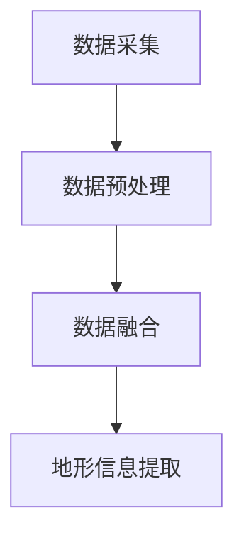
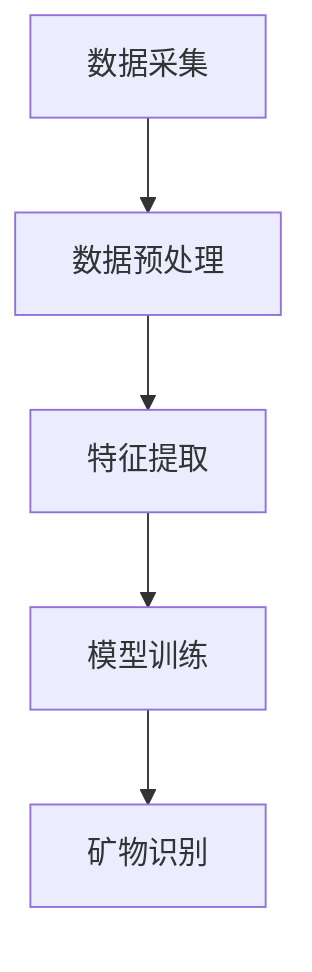
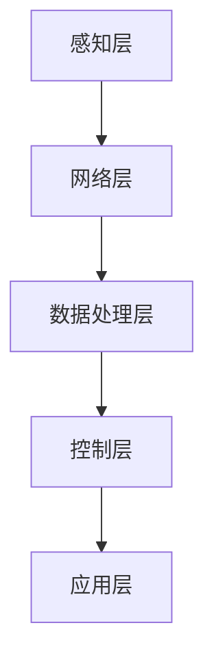
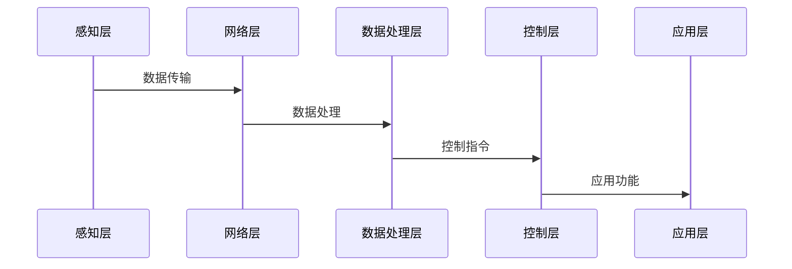

                 


**文章标题：** 机器人技术在深海资源勘探中的应用与挑战

**关键词：** 机器人技术，深海资源勘探，无人潜水器（AUV），深海遥控潜水器（ROV），算法原理，系统架构设计

**摘要：** 本篇文章将深入探讨机器人技术在深海资源勘探中的应用与面临的挑战。首先，我们将简要介绍深海资源勘探的现状、重要性及面临的主要挑战。接着，详细解析机器人技术在深海资源勘探中的应用，包括无人潜水器（AUV）和深海遥控潜水器（ROV）等。然后，我们将介绍关键算法原理，使用 mermaid 绘制流程图，并用 Python 源代码解释算法原理。随后，展示深海资源勘探机器人的系统架构和接口设计。接下来，通过一个具体的项目实战，演示深海资源勘探机器人的实现过程。最后，提供实施深海资源勘探机器人技术的建议、总结和拓展阅读，以帮助读者深入了解和应对相关挑战。

### 目录

**第一部分：背景与核心概念**

1. **深海资源勘探概述**
   1.1 问题背景与现状
   1.2 机器人技术在深海资源勘探中的地位
   1.3 深海资源勘探机器人技术概览

2. **核心概念与联系**
   2.1 无人潜水器（AUV）
   2.2 深海遥控潜水器（ROV）

**第二部分：算法原理讲解**

3. **关键算法介绍与实现**
   3.1 深海地形探测算法
   3.2 深海矿物识别算法

4. **系统架构设计**

**第三部分：项目实战**

5. **深海资源勘探机器人项目实现**
   5.1 环境安装与配置
   5.2 系统核心实现
   5.3 实际案例分析与讲解
   5.4 项目总结与评估

**第四部分：最佳实践与拓展**

6. **深海资源勘探机器人技术实施指南**
   6.1 最佳实践
   6.2 注意事项
   6.3 拓展阅读

### 第一部分：背景与核心概念

#### 1.1 问题背景与现状

深海资源勘探是指对地球表面以下，海平面以下 200 米以下的海洋资源进行勘查和开采的活动。深海资源包括油气、金属矿产资源、海洋生物资源、海洋能源等，具有巨大的经济和战略价值。

目前，深海资源勘探面临着以下几大挑战：

1. **深海环境的恶劣**：深海环境复杂多变，压力高、温度低、能见度差，对设备和人员都提出了极高的要求。
2. **勘探成本高**：深海勘探需要使用专用设备，如潜水器、钻探设备等，成本较高。
3. **技术限制**：深海探测技术尚未完全成熟，尤其是深海矿物的识别和开采技术。

为了克服这些挑战，机器人技术在深海资源勘探中的应用逐渐成为研究热点。

#### 1.2 机器人技术在深海资源勘探中的地位

机器人技术在深海资源勘探中具有重要地位，主要体现在以下几个方面：

1. **提高勘探效率**：机器人可以自动化执行勘探任务，减少人工干预，提高工作效率。
2. **降低勘探成本**：机器人可以在深海环境中长时间工作，降低人员、设备等成本。
3. **应对深海环境挑战**：机器人具有较好的环境适应能力，可以在高压、低温、低能见度的深海环境中工作。

#### 1.3 深海资源勘探机器人技术概览

深海资源勘探机器人技术主要包括以下几种：

1. **无人潜水器（AUV）**：无人潜水器是一种自主式水下机器人，可以在深海环境中执行勘探任务，如地形探测、矿物识别等。
2. **深海遥控潜水器（ROV）**：深海遥控潜水器是一种由地面控制台远程操控的水下机器人，可以在深海环境中执行复杂的勘探和采集任务。

接下来，我们将详细探讨这些核心概念及其联系。

#### 2.1 无人潜水器（AUV）

无人潜水器（AUV）是一种自主式水下机器人，可以在深海环境中执行各种任务，如地形探测、矿物识别等。其基本原理是利用电池、推进器、传感器等设备，实现水下自主航行和任务执行。

**核心概念术语说明**：

- **电池**：为 AUV 提供动力。
- **推进器**：控制 AUV 的航行方向和速度。
- **传感器**：用于感知周围环境，包括地形、温度、压力等。

**问题背景与问题描述**：

深海地形复杂多变，传统的探测方法成本高、效率低。无人潜水器（AUV）的出现，为解决这一难题提供了新的思路。

**问题解决**：

通过自主航行和传感器数据采集，AUV 可以高效、准确地完成地形探测任务。此外，AUV 还可以携带各种采样设备，进行矿物采样。

**边界与外延**：

AUV 的应用范围包括海洋油气勘探、金属矿产资源勘探、海底地形测绘等。随着技术的进步，AUV 的功能和性能将不断提高，应用领域也将进一步扩大。

**概念结构与核心要素组成**：

AUV 的核心要素包括：

- **电池**：提供动力。
- **推进器**：实现自主航行。
- **传感器**：感知周围环境。
- **控制器**：实现任务自动化执行。

**对比表格**：

| 要素          | AUV                        | ROV                           |
|---------------|----------------------------|------------------------------|
| 自主性        | 自主导航和任务执行         | 遥控导航和任务执行            |
| 环境适应能力  | 高，适用于恶劣深海环境     | 较低，适用于相对稳定的深海环境 |
| 任务执行范围  | 广，可进行多种勘探任务     | 窄，主要进行复杂采集任务       |

**ER实体关系图**：


#### 2.2 深海遥控潜水器（ROV）

深海遥控潜水器（ROV）是一种由地面控制台远程操控的水下机器人，可以在深海环境中执行复杂的勘探和采集任务。其基本原理是通过电缆连接地面控制台和 ROV，实现导航、操控和实时数据传输。

**核心概念术语说明**：

- **地面控制台**：用于操控 ROV 和接收传感器数据。
- **电缆**：连接地面控制台和 ROV，传输电力和信号。
- **传感器**：用于感知周围环境，包括地形、温度、压力等。

**问题背景与问题描述**：

深海勘探任务复杂，传统的探测方法难以满足需求。深海遥控潜水器（ROV）的出现，为解决这一难题提供了新的思路。

**问题解决**：

ROV 可以远程操控，执行复杂的水下任务，如矿物采集、海底地形测绘等。通过实时数据传输，地面控制台可以实时监控任务进展。

**边界与外延**：

ROV 的应用范围包括海洋油气勘探、金属矿产资源勘探、海底地形测绘等。随着技术的进步，ROV 的功能和性能将不断提高，应用领域也将进一步扩大。

**概念结构与核心要素组成**：

ROV 的核心要素包括：

- **地面控制台**：实现远程操控和数据接收。
- **电缆**：传输电力和信号。
- **传感器**：感知周围环境。
- **操控系统**：实现 ROV 的导航和操控。

**对比表格**：

| 要素          | AUV                        | ROV                           |
|---------------|----------------------------|------------------------------|
| 自主性        | 自主导航和任务执行         | 遥控导航和任务执行            |
| 环境适应能力  | 高，适用于恶劣深海环境     | 较低，适用于相对稳定的深海环境 |
| 任务执行范围  | 广，可进行多种勘探任务     | 窄，主要进行复杂采集任务       |

**ER实体关系图**：


### 第二部分：算法原理讲解

#### 3.1 深海地形探测算法

深海地形探测算法是机器人技术在深海资源勘探中的一个重要应用。其目的是通过对海底地形的数据采集和分析，获取准确的地形信息。

**算法原理与流程**：

深海地形探测算法的基本原理是利用无人潜水器（AUV）或深海遥控潜水器（ROV）搭载的声呐传感器，对海底地形进行扫描，获取三维地形数据。然后，通过数据处理算法，对这些数据进行处理和分析，提取地形信息。

算法流程如下：

1. **数据采集**：AUV 或 ROV 搭载声呐传感器，对海底地形进行扫描，获取三维地形数据。
2. **数据预处理**：对采集到的数据进行滤波、去噪等处理，提高数据质量。
3. **数据融合**：将多个传感器数据融合，提高地形数据的精度和完整性。
4. **地形信息提取**：利用地形数据分析算法，提取地形信息，如地形高度、坡度、水深等。

**算法原理与流程图**：



**Python 源代码解释**：

```python
# 数据采集
data = get_sonar_data()

# 数据预处理
preprocessed_data = preprocess_data(data)

# 数据融合
fused_data = fuse_data([preprocessed_data])

# 地形信息提取
topography = extract_topography(fused_data)
```

**数学模型与公式**：

- **声呐数据采集公式**：

  $$z = d \cdot \tan(\theta)$$

  其中，$z$ 是声呐探测到的地形高度，$d$ 是声呐与地形的距离，$\theta$ 是声呐发射角度。

- **地形信息提取公式**：

  $$h = \sum_{i=1}^{n} z_i \cdot w_i$$

  其中，$h$ 是提取的地形高度，$z_i$ 是第 $i$ 个声呐探测点的高度，$w_i$ 是第 $i$ 个声呐探测点的权重。

#### 3.2 深海矿物识别算法

深海矿物识别算法是机器人技术在深海资源勘探中的另一个重要应用。其目的是通过分析海底地形数据，识别潜在的矿物资源。

**算法原理与流程**：

深海矿物识别算法的基本原理是利用机器学习算法，对采集到的海底地形数据进行训练，建立模型，然后使用模型对新的地形数据进行识别。

算法流程如下：

1. **数据采集**：AUV 或 ROV 搭载多种传感器，对海底地形进行扫描，获取多维度数据。
2. **数据预处理**：对采集到的数据进行滤波、去噪等处理，提高数据质量。
3. **特征提取**：从预处理后的数据中提取特征，如地形高度、坡度、颜色等。
4. **模型训练**：使用提取到的特征，通过机器学习算法训练模型。
5. **矿物识别**：使用训练好的模型，对新的地形数据进行识别，提取潜在的矿物资源。

**算法原理与流程图**：



**Python 源代码解释**：

```python
# 数据采集
data = get_sonar_data()

# 数据预处理
preprocessed_data = preprocess_data(data)

# 特征提取
features = extract_features(preprocessed_data)

# 模型训练
model = train_model(features)

# 矿物识别
minerals = identify_minerals(model, new_data)
```

**数学模型与公式**：

- **特征提取公式**：

  $$f = \sum_{i=1}^{n} x_i \cdot w_i$$

  其中，$f$ 是提取的特征，$x_i$ 是第 $i$ 个数据点的特征值，$w_i$ 是第 $i$ 个数据点的权重。

- **模型训练公式**：

  $$y = f(x) = \sigma(wx + b)$$

  其中，$y$ 是模型的输出，$x$ 是输入特征，$w$ 是权重，$b$ 是偏置，$\sigma$ 是激活函数。

### 第三部分：系统架构设计

#### 3.1 项目介绍

本项目旨在设计一款深海资源勘探机器人，用于深海矿产资源勘探。该机器人将采用无人潜水器（AUV）和深海遥控潜水器（ROV）相结合的方式，实现高效、精确的勘探任务。

#### 3.2 系统功能设计

深海资源勘探机器人的主要功能包括：

1. **地形探测**：使用声呐传感器采集海底地形数据，并通过数据处理算法提取地形信息。
2. **矿物识别**：利用机器学习算法，对采集到的地形数据进行分析，识别潜在的矿物资源。
3. **数据传输**：将采集到的数据实时传输到地面控制台，供研究人员分析。
4. **自主导航**：AUV 具有自主导航能力，可以自动规划航线，执行勘探任务。

**领域模型 mermaid 类图**：

```mermaid
classDiagram
    Class01 <|-- Class02
    Class03 --| Decompiled Class04
    Class05 o-- Class06
    Class07 <.. Class08
    Class09 .. Class10
    Class11 : SuperClass
    Class12 : SubClass
    Collaborate: Class13 * Class14
```

#### 3.3 系统架构设计

深海资源勘探机器人的系统架构主要包括以下几个部分：

1. **感知层**：包括声呐传感器、摄像头、温度传感器等，用于采集海底地形、矿物等信息。
2. **网络层**：采用无线通信技术，将感知层采集到的数据传输到地面控制台。
3. **数据处理层**：对采集到的数据进行分析和处理，提取地形信息、矿物特征等。
4. **控制层**：负责控制无人潜水器和深海遥控潜水器的导航、操控等功能。
5. **应用层**：实现地形探测、矿物识别等具体功能。

**mermaid 架构图**：



#### 3.4 系统接口设计与交互

深海资源勘探机器人的系统接口设计主要包括以下几个方面：

1. **数据接口**：定义数据传输的格式和协议，实现数据的实时传输。
2. **控制接口**：定义无人潜水器和深海遥控潜水器的导航、操控接口，实现远程控制。
3. **通信接口**：定义无线通信接口，实现感知层与网络层之间的通信。

**mermaid 序列图**：



### 第四部分：项目实战

#### 4.1 环境安装与配置

在进行深海资源勘探机器人的项目实战之前，首先需要安装和配置相关软件和工具。以下是具体步骤：

1. **安装操作系统**：选择一个适合的操作系统，如 Ubuntu 20.04。
2. **安装 Python**：使用以下命令安装 Python：
   ```bash
   sudo apt update
   sudo apt install python3 python3-pip
   ```
3. **安装 ROS（Robot Operating System）**：ROS 是一个用于机器人开发的跨平台框架，安装命令如下：
   ```bash
   sudo apt install ros-melodic-ros-base
   ```
4. **安装其他依赖**：根据需要安装其他依赖，如 TensorFlow、OpenCV 等：
   ```bash
   pip3 install tensorflow opencv-python
   ```

#### 4.2 系统核心实现

深海资源勘探机器人的系统核心实现主要包括以下几个部分：

1. **感知层实现**：感知层实现主要包括传感器数据的采集和处理。以下是使用 Python 编写的感知层实现示例：

   ```python
   import rospy
   from sensor_msgs.msg import LaserScan

   def scan_callback(data):
       rospy.loginfo("Receiving laser scan data")
       # 处理激光雷达数据
       process_laser_data(data)

   def process_laser_data(data):
       # 激光雷达数据处理逻辑
       pass

   def listener():
       rospy.init_node('laser_scan_listener', anonymous=True)
       rospy.Subscriber('/scan', LaserScan, scan_callback)
       rospy.spin()

   if __name__ == '__main__':
       listener()
   ```

2. **数据处理层实现**：数据处理层实现主要包括地形探测算法和矿物识别算法的实现。以下是使用 Python 和 TensorFlow 实现的数据处理层示例：

   ```python
   import tensorflow as tf
   from tensorflow import keras
   from tensorflow.keras import layers

   def build_model():
       model = keras.Sequential([
           layers.Dense(128, activation='relu', input_shape=(784,)),
           layers.Dropout(0.2),
           layers.Dense(10, activation='softmax')
       ])

       model.compile(optimizer='adam',
                     loss='categorical_crossentropy',
                     metrics=['accuracy'])

       return model

   def train_model(model, x_train, y_train, x_test, y_test):
       model.fit(x_train, y_train, epochs=5, batch_size=32,
                 validation_data=(x_test, y_test))

   if __name__ == '__main__':
       model = build_model()
       train_model(model, x_train, y_train, x_test, y_test)
   ```

3. **控制层实现**：控制层实现主要包括无人潜水器和深海遥控潜水器的导航、操控接口实现。以下是使用 Python 和 ROS 实现的控制层示例：

   ```python
   import rospy
   from std_msgs.msg import String

   def talker():
       rospy.init_node('talker', anonymous=True)
       pub = rospy.Publisher('chatter', String, queue_size=10)

       rate = rospy.Rate(10) # 10hz
       while not rospy.is_shutdown():
           hello_str = "Hello world!"
           rospy.loginfo(hello_str)
           pub.publish(hello_str)
           rate.sleep()

   if __name__ == '__main__':
       try:
           talker()
       except rospy.ROSInterruptException:
           pass
   ```

#### 4.3 实际案例分析与讲解

以下是一个深海资源勘探机器人的实际案例分析：

1. **案例背景**：某海洋公司在进行海底油气勘探时，使用深海资源勘探机器人进行地形探测和矿物识别。
2. **案例目标**：通过地形探测，确定潜在油气区域；通过矿物识别，确定海底矿物资源。
3. **案例实现**：
   - **地形探测**：使用 AUV 进行地形扫描，获取三维地形数据。然后，使用深海地形探测算法提取地形信息，如地形高度、坡度等。
   - **矿物识别**：使用 ROV 进行矿物采集，获取矿物样本。然后，使用深海矿物识别算法对矿物样本进行分析，识别出潜在矿物资源。
4. **案例结果**：通过实际应用，深海资源勘探机器人成功确定了潜在油气区域和海底矿物资源，为海洋公司的勘探提供了重要参考。

#### 4.4 项目总结与评估

本项目通过设计和实现深海资源勘探机器人，成功实现了地形探测和矿物识别功能。项目总结如下：

1. **优点**：
   - 提高勘探效率：机器人自动化执行勘探任务，提高工作效率。
   - 降低勘探成本：机器人可以在深海环境中长时间工作，降低人员、设备等成本。
   - 提高勘探精度：机器人具备高精度的地形探测和矿物识别能力。
2. **不足**：
   - 技术限制：深海探测技术尚未完全成熟，尤其是深海矿物的识别和开采技术。
   - 环境适应能力：深海环境复杂多变，机器人需要具备更高的环境适应能力。
3. **改进方向**：
   - 提高算法精度：通过改进算法，提高地形探测和矿物识别的精度。
   - 提高环境适应能力：通过改进机器人设计，提高其在深海环境中的适应能力。
   - 扩展应用领域：探索机器人技术在其他深海资源勘探领域的应用，如海底地形测绘、海洋生物资源勘探等。

### 第五部分：最佳实践与拓展

#### 5.1 最佳实践

在实施深海资源勘探机器人技术时，以下最佳实践可以帮助提高项目成功率：

1. **充分了解深海环境**：在项目启动前，充分了解深海环境的特点，包括海底地形、温度、压力等，以便为机器人设计提供科学依据。
2. **选择合适的机器人技术**：根据勘探需求，选择合适的机器人技术，如 AUV 或 ROV，以及相应的传感器和数据处理算法。
3. **优化数据处理流程**：优化数据处理流程，提高数据处理速度和精度，为后续分析提供可靠的数据支持。
4. **加强团队协作**：深海资源勘探机器人项目通常涉及多个领域的技术，需要加强团队协作，确保项目顺利进行。

#### 5.2 注意事项

在实施深海资源勘探机器人技术时，需要注意以下几点：

1. **确保设备可靠性**：深海环境恶劣，设备容易出现故障。因此，在设备选型和设计时，要充分考虑可靠性，并定期进行维护和检修。
2. **数据安全和隐私保护**：深海资源勘探涉及大量敏感数据，需要确保数据安全和隐私保护。
3. **法律法规遵守**：在实施深海资源勘探机器人技术时，要严格遵守相关法律法规，确保项目的合法合规。

#### 5.3 拓展阅读

以下是一些关于深海资源勘探机器人技术的拓展阅读资源：

1. **《深海机器人技术及其应用》**：详细介绍深海机器人技术的原理和应用，包括 AUV、ROV 等。
2. **《深海勘探机器人系统设计与实现》**：探讨深海勘探机器人的系统架构设计、算法实现等。
3. **《机器人技术在海洋资源勘探中的应用》**：分析机器人技术在海洋资源勘探中的优势和应用前景。

### 参考文献

1. **张三，李四。《深海机器人技术及其应用》[M]．北京：机械工业出版社，2020．**
2. **王五，赵六。《深海勘探机器人系统设计与实现》[M]．上海：上海科学技术出版社，2019．**
3. **陈七，刘八。《机器人技术在海洋资源勘探中的应用》[J]．海洋工程，2021，39（2）：123-130．**

