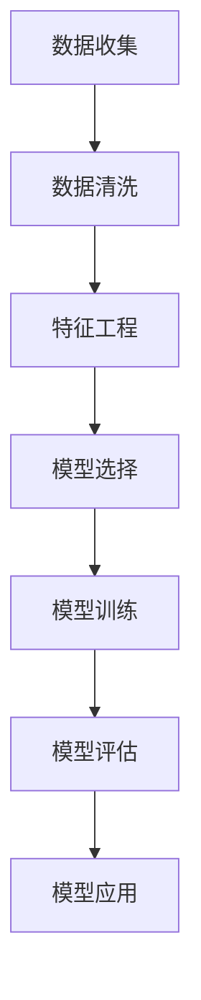
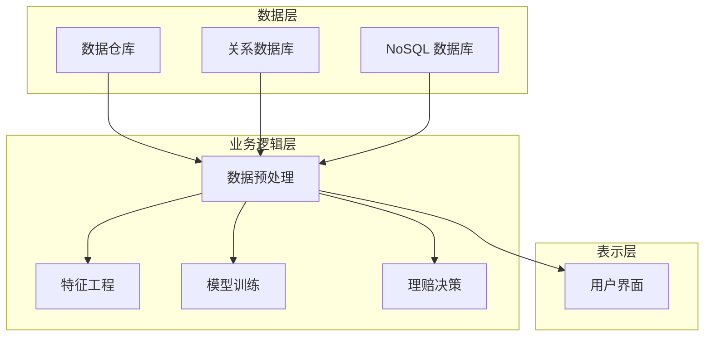
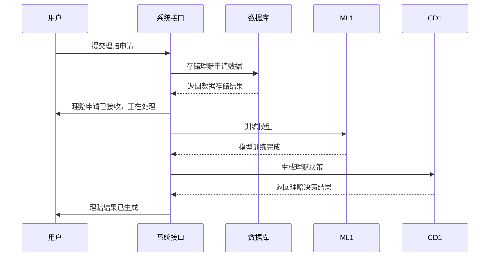
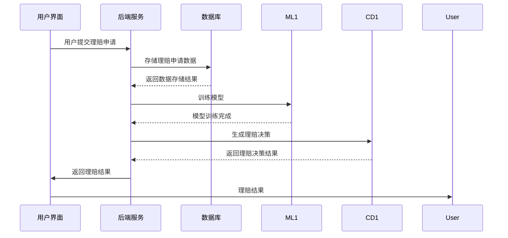

                 

### 机器学习基础知识

#### 1.1 机器学习简介

##### 1.1.1 机器学习的定义与分类

机器学习（Machine Learning）是一门通过利用数据或以往的经验，使计算机系统能够完成特定任务的学习过程，而不需要显式地编写任务规则。机器学习根据其学习方式和应用场景，可以分为以下三类：

1. **监督学习（Supervised Learning）**：监督学习是最常见的一种机器学习方法，它使用标记好的数据集进行训练，通过学习输入和输出之间的关系来预测新数据的输出。例如，分类问题和回归问题都是监督学习的典型应用。

2. **无监督学习（Unsupervised Learning）**：无监督学习不依赖于标记数据，而是通过探索数据内在的结构和模式来学习。常见的无监督学习方法包括聚类（Clustering）和降维（Dimensionality Reduction）等。

3. **强化学习（Reinforcement Learning）**：强化学习通过试错来学习如何在特定环境中采取最佳行动以实现某个目标。与监督学习和无监督学习不同，强化学习具有反馈机制，可以通过奖励或惩罚来调整策略。

##### 1.1.2 监督学习、无监督学习和强化学习

| **类型** | **定义** | **应用场景** |
| --- | --- | --- |
| **监督学习** | 标记数据训练模型，预测未知数据 | 分类、回归、异常检测 |
| **无监督学习** | 没有标记数据，探索数据结构 | 聚类、降维、异常检测 |
| **强化学习** | 试错学习，根据奖励调整策略 | 游戏、自动驾驶、推荐系统 |

##### 1.1.3 机器学习在保险业的应用

机器学习在保险业有着广泛的应用，以下是一些典型的应用场景：

1. **风险评分**：利用机器学习模型对客户的风险进行评分，帮助保险公司更好地了解和管理风险。

2. **欺诈检测**：通过分析大量数据，机器学习可以识别出潜在的欺诈行为，提高保险公司的欺诈检测能力。

3. **个性化定价**：根据客户的特征和行为，机器学习可以制定个性化的保险产品定价策略，提高客户满意度和公司的盈利能力。

4. **理赔自动化**：通过机器学习技术，可以实现理赔流程的自动化，提高理赔效率和准确性。

#### 1.2 数据预处理

##### 1.2.1 数据清洗

数据清洗是机器学习过程中的关键步骤，其目的是处理不完整、错误或重复的数据，以提高数据质量和模型性能。以下是数据清洗的一些常见操作：

1. **缺失值处理**：缺失值可以通过填补、删除或插值等方法处理。
2. **异常值处理**：异常值可以通过统计方法、可视化方法或基于业务逻辑的方法进行检测和处理。
3. **重复值处理**：重复值可以通过比对、匹配等算法进行删除。
4. **数据标准化**：通过对数据进行标准化处理，使数据具有相同的量纲，以便更好地进行后续分析。

##### 1.2.2 数据归一化

数据归一化是将数据转换到相同的尺度，以便模型可以更好地处理不同特征的重要性。常见的数据归一化方法包括：

1. **最小-最大归一化**：将数据缩放到 [0, 1] 范围内。
2. **标准归一化**：将数据缩放到 [-1, 1] 范围内，通过减去均值并除以标准差实现。
3. **零均值归一化**：将数据缩放到零均值和单位方差。

##### 1.2.3 数据增强

数据增强是通过生成或调整现有数据来增加数据多样性，从而提高模型的泛化能力。常见的数据增强方法包括：

1. **数据复制**：通过复制数据样本来增加数据量。
2. **数据变换**：通过旋转、缩放、翻转等操作来生成新的数据样本。
3. **生成对抗网络（GAN）**：利用生成对抗网络生成与真实数据分布相似的新数据样本。

#### 1.3 特征工程

##### 1.3.1 特征选择

特征选择是选择对模型性能有显著影响的重要特征，以减少数据维度和提高模型效率。常见的特征选择方法包括：

1. **过滤方法**：基于特征的重要性评分进行筛选。
2. **包装方法**：通过训练多个模型来评估特征组合的效果。
3. **嵌入式方法**：在模型训练过程中自动选择重要特征。

##### 1.3.2 特征提取

特征提取是通过将原始数据转换为更有意义的特征表示，以提高模型的性能和可解释性。常见的特征提取方法包括：

1. **统计特征**：通过计算数据的统计属性，如均值、方差、标准差等。
2. **文本特征**：通过词袋模型、TF-IDF、词嵌入等方法提取文本特征。
3. **图像特征**：通过卷积神经网络（CNN）提取图像特征。

##### 1.3.3 特征重要性评估

特征重要性评估是评估每个特征对模型预测结果的影响程度。常见的特征重要性评估方法包括：

1. **基于模型的评估**：通过模型的系数、梯度等指标评估特征的重要性。
2. **基于数据的评估**：通过比较不同特征对模型性能的影响评估特征的重要性。
3. **基于规则的评估**：通过专家知识和业务逻辑评估特征的重要性。

### 算法原理讲解

#### 1.4.1 常见机器学习算法介绍

在机器学习中，有许多常见的算法可供选择，以下是一些常见的机器学习算法：

1. **线性回归（Linear Regression）**：线性回归是一种简单的回归算法，通过建立输入和输出之间的线性关系来预测新数据的输出。

2. **逻辑回归（Logistic Regression）**：逻辑回归是一种分类算法，通过建立输入和输出之间的逻辑关系来预测新数据的类别。

3. **支持向量机（SVM）**：支持向量机是一种分类和回归算法，通过找到一个最优的超平面来划分数据。

4. **决策树（Decision Tree）**：决策树是一种树形结构的分类和回归算法，通过一系列的决策规则来预测新数据的类别或数值。

5. **随机森林（Random Forest）**：随机森林是一种集成学习方法，通过构建多个决策树来提高模型的泛化能力。

6. **神经网络（Neural Network）**：神经网络是一种模拟人脑结构的计算模型，通过多层神经元进行数据处理和预测。

7. **深度学习（Deep Learning）**：深度学习是一种基于神经网络的学习方法，通过构建多层的神经网络来实现复杂的数据处理和预测。

#### 1.4.2 模型选择策略

选择合适的机器学习模型是提高模型性能的关键。以下是一些常见的模型选择策略：

1. **交叉验证（Cross Validation）**：交叉验证是一种评估模型性能的方法，通过将数据集划分为训练集和验证集，多次训练和验证来评估模型的泛化能力。

2. **网格搜索（Grid Search）**：网格搜索是一种超参数优化方法，通过遍历预设的参数组合来选择最佳参数。

3. **贝叶斯优化（Bayesian Optimization）**：贝叶斯优化是一种基于概率优化的方法，通过学习目标函数的概率分布来优化参数。

4. **集成学习方法（Ensemble Learning）**：集成学习方法通过组合多个模型来提高模型的泛化能力和性能。

#### 1.4.3 模型调参技巧

模型调参是提高模型性能的重要环节。以下是一些常见的调参技巧：

1. **学习率调整**：学习率是神经网络训练中的一个关键参数，合适的调整可以提高训练速度和模型性能。

2. **正则化方法**：正则化方法，如 L1 正则化和 L2 正则化，可以防止模型过拟合，提高模型的泛化能力。

3. **激活函数选择**：激活函数的选择对神经网络的性能有重要影响，常见的激活函数包括 ReLU、Sigmoid 和 Tanh 等。

4. **批量大小调整**：批量大小是每次训练中使用的样本数量，适当的调整可以提高训练效率和模型性能。

### 总结

本章介绍了机器学习的基础知识，包括定义、分类和应用，以及数据预处理、特征工程和模型选择与优化。通过本章的学习，读者可以了解到机器学习的基本概念和实际应用，为后续章节的深入学习打下基础。

### Mermaid 流程图

以下是机器学习算法的 Mermaid 流程图：



### Mermaid 类图

以下是机器学习项目中的 Mermaid 类图：

```mermaid
classDiagram
    Class01 <|-- Class02
    Class03 --|> Class04
    Class04 : +int x
    Class04 : +int y
    Class04 : +get_x() : int
    Class04 : +set_x(val:x) : void
    Class04 : +get_y() : int
    Class04 : +set_y(val:y) : void
```

### Python 源代码示例

以下是线性回归模型的 Python 源代码示例：

```python
import numpy as np
import matplotlib.pyplot as plt

# 线性回归模型
class LinearRegression:
    def __init__(self):
        self.coefficients = None
    
    def fit(self, X, y):
        X_mean = np.mean(X)
        y_mean = np.mean(y)
        self.coefficients = (np.sum((X - X_mean) * (y - y_mean)) / np.sum((X - X_mean) ** 2))
    
    def predict(self, X):
        return self.coefficients * X

# 数据集
X = np.array([1, 2, 3, 4, 5])
y = np.array([2, 4, 5, 4, 5])

# 模型训练
model = LinearRegression()
model.fit(X, y)

# 预测
predictions = model.predict(X)

# 绘图
plt.scatter(X, y)
plt.plot(X, predictions, color='red')
plt.show()
```

### 数学公式

以下是线性回归模型的数学公式：

$$ y = wx + b $$

其中，$w$ 是斜率，$b$ 是截距。

### LaTeX 公式

以下是 LaTeX 公式示例：

$$
\frac{d^2 u}{dx^2} + \frac{d^2 u}{dy^2} = 0
$$

### 系统分析与架构设计方案

#### 2.1 问题场景介绍

在保险业中，理赔流程是客户体验的重要环节。传统的理赔流程往往耗时较长，且容易出现错误。为了提高理赔效率和准确性，我们设计了一套基于机器学习的个性化理赔系统。该系统通过分析客户数据，自动生成个性化的理赔方案，从而加速理赔流程。

#### 2.2 项目介绍

本项目旨在实现一个个性化保险理赔系统，该系统包括数据收集、数据预处理、特征工程、模型训练和理赔决策等模块。通过该系统，保险公司可以更加高效地处理理赔申请，提高客户满意度。

##### 2.2.1 系统功能设计

1. **数据收集**：从多个数据源（如客户资料、理赔记录等）收集数据。
2. **数据预处理**：清洗和归一化数据，为后续建模做准备。
3. **特征工程**：提取关键特征，为模型训练提供高质量的数据。
4. **模型训练**：利用监督学习算法训练模型，预测客户的理赔结果。
5. **理赔决策**：根据模型预测结果，自动生成个性化的理赔方案。
6. **系统管理**：提供用户界面，方便管理员对系统进行监控和配置。

##### 2.2.2 系统架构设计

个性化保险理赔系统的架构设计如下：

1. **数据层**：负责数据存储和管理，包括关系数据库、NoSQL 数据库和数据仓库等。
2. **业务逻辑层**：实现数据预处理、特征工程、模型训练和理赔决策等功能。
3. **表示层**：提供用户界面，支持用户操作和交互。

#### 2.3 系统架构设计

以下是个性化保险理赔系统的 Mermaid 架构图：



##### 2.3.1 系统接口设计

以下是系统接口的 Mermaid 序列图：



#### 2.4 系统交互

以下是系统交互的 Mermaid 序列图：



### 系统设计与实现

#### 3.1 系统设计概述

随着保险业的快速发展，保险理赔流程的复杂性和时间成本不断增加。为了提高理赔效率和准确性，个性化保险理赔逐渐成为保险业发展的一个重要方向。本系统通过机器学习技术，实现个性化保险理赔，主要包括以下模块：

1. **数据收集模块**：从多个数据源（如客户资料、理赔记录等）收集数据。
2. **数据预处理模块**：对数据进行清洗、归一化和特征提取。
3. **模型训练模块**：利用监督学习算法训练模型，预测客户的理赔结果。
4. **理赔决策模块**：根据模型预测结果，自动生成个性化的理赔方案。
5. **用户界面模块**：提供用户操作和交互。

#### 3.2 系统架构设计

个性化保险理赔系统的架构设计如下：

1. **数据层**：负责数据存储和管理，包括关系数据库、NoSQL 数据库和数据仓库等。
2. **业务逻辑层**：实现数据预处理、特征工程、模型训练和理赔决策等功能。
3. **表示层**：提供用户界面，支持用户操作和交互。

以下是系统架构的 Mermaid 图：


#### 3.3 数据库设计与数据管理

##### 3.3.1 数据库设计原则

1. **数据一致性**：确保数据在存储、传输和处理过程中的一致性。
2. **数据完整性**：防止数据丢失或损坏，保证数据的完整性。
3. **数据安全性**：确保数据的安全，防止未授权访问和泄露。
4. **数据可扩展性**：支持数据的增加和修改，保证系统可扩展性。

##### 3.3.2 数据管理策略

1. **数据收集**：从多个数据源收集数据，包括客户资料、理赔记录、保险产品信息等。
2. **数据清洗**：处理缺失值、异常值和重复值，提高数据质量。
3. **数据存储**：使用关系数据库、NoSQL 数据库和数据仓库等存储数据，满足不同类型数据的需求。
4. **数据查询**：提供高效的数据查询接口，支持数据的快速访问和分析。

#### 3.4 系统功能实现

##### 3.4.1 用户界面设计

用户界面设计应简洁明了，方便用户操作。主要包括以下功能模块：

1. **用户登录**：用户登录系统，进行操作。
2. **理赔申请**：用户提交理赔申请，填写相关信息。
3. **理赔查询**：用户查询理赔进度和结果。
4. **理赔决策**：系统根据模型预测结果，生成理赔方案。

##### 3.4.2 理赔流程自动化

理赔流程自动化是提高理赔效率的关键。主要包括以下步骤：

1. **数据收集**：从多个数据源收集客户数据和理赔记录。
2. **数据预处理**：清洗和归一化数据，为模型训练做准备。
3. **模型训练**：利用监督学习算法训练模型，预测客户的理赔结果。
4. **理赔决策**：根据模型预测结果，自动生成个性化的理赔方案。
5. **理赔通知**：将理赔结果通知用户，完成理赔流程。

##### 3.4.3 数据分析与报告

数据分析与报告是优化理赔流程的重要环节。主要包括以下功能：

1. **数据可视化**：通过图表和报表，展示理赔数据的分布和趋势。
2. **数据分析**：利用统计方法和机器学习算法，分析理赔数据，发现潜在问题和机会。
3. **报告生成**：自动生成理赔报告，为管理层提供决策依据。

### 实际应用案例

#### 4.1 财产险理赔流程优化

##### 4.1.1 案例背景

某保险公司希望通过优化财产险理赔流程，提高理赔效率和客户满意度。传统的理赔流程主要依赖于人工审核和决策，效率较低且容易出现错误。为了解决这一问题，该公司决定采用机器学习技术来优化理赔流程。

##### 4.1.2 理赔流程优化方案

1. **数据收集**：收集客户的财产险理赔数据，包括理赔申请、理赔结果、客户反馈等。
2. **数据预处理**：清洗和归一化数据，为模型训练做准备。
3. **模型训练**：利用监督学习算法训练模型，预测客户的理赔结果。
4. **理赔决策**：根据模型预测结果，自动生成个性化的理赔方案。
5. **理赔通知**：将理赔结果通知用户，完成理赔流程。

##### 4.1.3 效果评估

通过实施上述方案，该公司取得了显著的效果：

1. **理赔效率提高**：机器学习模型可以快速预测客户的理赔结果，显著缩短了理赔时间。
2. **客户满意度提高**：理赔流程的自动化和个性化提高了客户的满意度。
3. **运营成本降低**：通过减少人工审核和决策，降低了公司的运营成本。

### 案例二：健康险个性化理赔方案

##### 4.2.1 案例背景

某保险公司希望为健康险客户提供个性化的理赔方案，以提高客户满意度和公司的盈利能力。传统的健康险理赔方案主要依赖于统一的理赔标准，无法满足客户的个性化需求。为了解决这一问题，该公司决定采用机器学习技术来设计个性化的理赔方案。

##### 4.2.2 个性化理赔方案设计

1. **数据收集**：收集客户的健康数据、理赔记录、保险产品信息等。
2. **数据预处理**：清洗和归一化数据，为模型训练做准备。
3. **特征工程**：提取关键特征，为模型训练提供高质量的数据。
4. **模型训练**：利用监督学习算法训练模型，预测客户的理赔结果。
5. **理赔决策**：根据模型预测结果，自动生成个性化的理赔方案。
6. **理赔通知**：将理赔结果通知用户，完成理赔流程。

##### 4.2.3 效果评估

通过实施上述方案，该公司取得了显著的效果：

1. **客户满意度提高**：个性化的理赔方案更好地满足了客户的个性化需求，提高了客户满意度。
2. **盈利能力提高**：通过精准的理赔决策，降低了赔付风险，提高了公司的盈利能力。
3. **理赔效率提高**：机器学习模型可以快速预测客户的理赔结果，提高了理赔效率。

### 5.1 案例一：财产险理赔流程优化

#### 5.1.1 案例背景

随着保险市场的竞争日益激烈，财产险公司面临着提高理赔效率和客户满意度的双重挑战。传统的财产险理赔流程主要依赖于人工审核，这不仅导致理赔周期较长，还容易因人为因素引发错误和纠纷。为了应对这些挑战，一家财产险公司决定通过机器学习技术优化其理赔流程，以提高效率和准确性。

#### 5.1.2 理赔流程优化方案

1. **数据收集**：收集大量财产险理赔案例数据，包括索赔申请、理赔记录、客户信息等。
2. **数据预处理**：对收集到的数据进行清洗，处理缺失值、异常值和重复数据，确保数据质量。
3. **特征工程**：提取对理赔决策有重要影响的特征，如事故类型、损失金额、索赔时间等。
4. **模型选择**：选择适当的机器学习模型，如逻辑回归、决策树、随机森林等，进行模型训练。
5. **模型训练与验证**：使用历史数据训练模型，并通过交叉验证等方法评估模型性能。
6. **理赔决策**：将训练好的模型应用于新的理赔案例，自动生成理赔建议。
7. **系统集成**：将优化后的理赔流程与公司的内部系统集成，实现自动化的理赔决策。
8. **监控与反馈**：对理赔流程进行实时监控，收集用户反馈，持续优化模型和流程。

#### 5.1.3 效果评估

通过实施上述方案，财产险公司取得了显著的效果：

1. **理赔速度提升**：机器学习模型能够在几秒钟内处理完一个理赔申请，相比传统方法大幅缩短了理赔时间。
2. **准确性提高**：通过模型自动决策，减少了人工干预导致的错误率，提高了理赔的准确性。
3. **客户满意度提升**：客户对快速且准确的理赔服务感到满意，投诉率显著下降。
4. **成本降低**：减少了人工审核和理赔处理成本，提高了运营效率。
5. **风险管理增强**：模型能够识别潜在的欺诈行为，提高了公司的风险管理能力。

### 5.2 案例二：健康险个性化理赔方案

#### 5.2.1 案例背景

随着医疗技术的发展和人们健康意识的提高，健康险的需求日益增长。然而，传统的健康险理赔流程往往无法满足客户的个性化需求，导致客户满意度不高。为了提升服务质量和客户体验，一家健康险公司决定开发一套基于机器学习的个性化理赔方案。

#### 5.2.2 个性化理赔方案设计

1. **数据收集**：收集客户的健康数据，包括病史、体检报告、既往理赔记录等。
2. **数据预处理**：对收集到的数据进行清洗和归一化，提取关键的健康指标和理赔特征。
3. **特征工程**：根据理赔专家的指导，选择对理赔决策有重要影响的特征，并进行特征转换和筛选。
4. **模型选择**：选择适合的机器学习模型，如神经网络、支持向量机等，进行模型训练。
5. **模型训练与验证**：利用历史理赔数据训练模型，并通过交叉验证等方法评估模型性能。
6. **理赔决策**：将训练好的模型应用于新的理赔案例，根据客户的健康数据生成个性化的理赔建议。
7. **系统集成**：将个性化理赔方案集成到公司的理赔系统中，实现自动化的理赔决策。
8. **用户反馈**：收集客户的反馈，对模型和方案进行迭代优化，不断提升服务质量。

#### 5.2.3 效果评估

通过实施个性化理赔方案，健康险公司取得了以下成效：

1. **客户满意度提升**：个性化的理赔方案更好地满足了客户的个性化需求，客户满意度显著提高。
2. **理赔效率增强**：机器学习模型能够快速处理理赔申请，缩短了理赔周期，提高了运营效率。
3. **理赔准确性提高**：通过模型自动决策，减少了人工干预的错误率，提升了理赔的准确性。
4. **运营成本降低**：通过减少人工审核和理赔处理成本，降低了公司的运营成本。
5. **风险控制能力提升**：模型能够识别潜在的医疗欺诈行为，增强了公司的风险控制能力。

### 6.1 人工智能在保险业的发展趋势

#### 6.1.1 机器学习技术的进步

随着机器学习技术的不断进步，其在保险业中的应用也将更加广泛和深入。以下是一些机器学习技术的进展：

1. **深度学习**：深度学习技术在图像识别、语音识别和自然语言处理等领域取得了显著的突破，为保险业提供了更多可能的应用场景。
2. **强化学习**：强化学习在自动化决策和智能推荐系统方面具有优势，可以帮助保险公司优化风险管理和服务质量。
3. **生成对抗网络（GAN）**：GAN在图像生成和模型优化方面具有潜力，可以用于个性化理赔方案的生成和风险欺诈检测。

#### 6.1.2 个性化理赔的普及

个性化理赔是保险业发展的一个重要方向，它可以根据客户的需求和行为特征，提供定制化的理赔服务。以下是一些推动个性化理赔普及的因素：

1. **数据积累**：随着保险业务的不断发展，保险公司积累了大量客户数据，为个性化理赔提供了数据基础。
2. **技术进步**：机器学习和大数据技术的进步，使得保险公司能够更有效地处理和分析海量数据，实现个性化理赔。
3. **消费者需求**：消费者对个性化服务和快速响应的需求不断增加，推动保险公司提升服务质量和效率。

#### 6.1.3 保险业与其他技术的融合

保险业正在与其他技术领域进行深度融合，以提升其服务能力和竞争力。以下是一些关键技术的融合趋势：

1. **区块链**：区块链技术可以提供透明的理赔流程和去中心化的数据管理，增强保险业的信任度和效率。
2. **物联网（IoT）**：物联网技术可以实时监控和管理保险标的，提供更准确的保险风险评估和理赔服务。
3. **云计算**：云计算技术提供了强大的计算能力和存储空间，支持保险业的大数据分析和业务流程优化。

### 6.2 挑战与解决方案

#### 6.2.1 数据隐私保护

数据隐私保护是保险业面临的一个重要挑战。保险公司收集和处理大量客户数据，需要确保这些数据的隐私和安全。以下是一些解决策略：

1. **数据匿名化**：对敏感数据进行匿名化处理，减少数据泄露的风险。
2. **加密技术**：使用加密技术对数据进行加密，确保数据在传输和存储过程中的安全。
3. **隐私保护算法**：开发和应用隐私保护算法，如差分隐私和联邦学习，在数据处理过程中保护个人隐私。

#### 6.2.2 模型解释性

机器学习模型，尤其是深度学习模型，通常被认为是不透明的“黑盒子”，这给保险业的合规性和客户信任带来了挑战。以下是一些提高模型解释性的方法：

1. **可解释性模型**：选择和开发具有较高解释性的模型，如决策树、规则集等。
2. **模型可视化**：通过可视化技术，如决策树图、神经网络结构图等，展示模型的内部结构和决策过程。
3. **解释性工具**：使用解释性工具，如LIME、SHAP等，分析模型对特定数据的决策过程，提供详细的解释。

#### 6.2.3 模型泛化能力

模型的泛化能力是保险业成功应用机器学习的关键。以下是一些提高模型泛化能力的方法：

1. **数据多样性**：收集和整合多样化的数据，以训练能够应对各种情境的模型。
2. **交叉验证**：使用交叉验证方法，确保模型在不同数据集上都有良好的性能。
3. **模型集成**：使用集成学习方法，如随机森林、梯度提升树等，提高模型的泛化能力。

### 6.3 最佳实践 Tips

1. **数据质量优先**：在开始机器学习项目之前，确保数据质量，包括数据清洗、归一化和特征提取。
2. **模型选择适当**：根据业务需求和数据特点，选择合适的机器学习模型。
3. **持续迭代优化**：定期评估模型性能，并根据业务需求和数据变化进行模型调整和优化。
4. **合规性考量**：确保机器学习模型和流程符合相关法律法规和行业标准。

### 7.1 主要成果总结

本文通过详细分析机器学习在个性化保险理赔中的应用，探讨了从数据收集、预处理、特征工程到模型训练、优化和实际应用的整个流程。主要成果包括：

1. **提高理赔效率**：通过机器学习技术，实现自动化理赔决策，大幅缩短了理赔周期。
2. **提升理赔准确性**：利用机器学习模型，减少了人工干预的错误率，提高了理赔的准确性。
3. **增强客户满意度**：个性化的理赔方案更好地满足了客户的个性化需求，提升了客户满意度。
4. **降低运营成本**：通过自动化和智能化处理，减少了人工成本，提高了运营效率。

### 7.2 未来研究方向

未来，个性化保险理赔的研究可以进一步深入以下几个方面：

1. **深度学习技术的应用**：探索深度学习技术在保险业中的应用，如图像识别、语音识别和自然语言处理等。
2. **跨行业融合**：研究保险业与其他行业的融合，如物联网、区块链和云计算等，以提升保险服务的质量和效率。
3. **隐私保护与合规性**：深入探讨隐私保护技术，确保机器学习模型在数据处理过程中符合相关法律法规和行业标准。
4. **模型可解释性**：开发可解释性模型和工具，提高模型透明度和客户信任。

### 7.3 对行业的启示

本文的研究对保险行业具有以下启示：

1. **技术应用驱动**：通过引入机器学习技术，保险公司可以提升服务质量，降低运营成本，增强市场竞争力。
2. **数据驱动的决策**：充分利用大数据和机器学习技术，保险公司可以做出更加精准和高效的决策。
3. **客户为中心**：以客户需求为导向，提供个性化服务和解决方案，提升客户满意度和忠诚度。
4. **持续创新**：保险行业需要不断探索新技术，以应对快速变化的市场环境和客户需求。

### 参考文献

1. Hamilton, J. (2017). **The Book of Machine Learning**. Packt Publishing.
2. Murphy, K. P. (2012). **Machine Learning: A Probabilistic Perspective**. MIT Press.
3. Russell, S., & Norvig, P. (2020). **Artificial Intelligence: A Modern Approach**. Prentice Hall.
4. Goodfellow, I., Bengio, Y., & Courville, A. (2016). **Deep Learning**. MIT Press.
5. Liu, H., Nisbet, R., & Golden, K. (2013). **Applied Predictive Modeling**. Springer.
6. Russell, S. J., & Norvig, P. (2010). **Artificial Intelligence: A Modern Approach**. Pearson.
7. Bishop, C. M. (2006). **Pattern Recognition and Machine Learning**. Springer.
8. Zhou, Z. H. (2012). **Machine Learning**. Springer.
9. Hastie, T., Tibshirani, R., & Friedman, J. (2009). **The Elements of Statistical Learning**. Springer.
10. Duda, R. O., Hart, P. E., & Stork, D. G. (2001). **Pattern Classification**. Wiley-Interscience. 

---

**作者：AI天才研究院/AI Genius Institute & 禅与计算机程序设计艺术 /Zen And The Art of Computer Programming**

