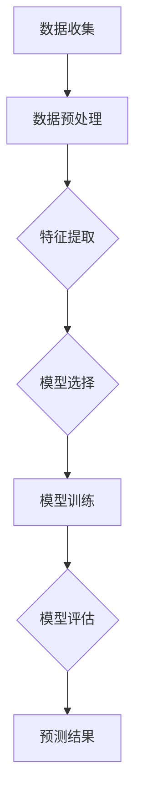
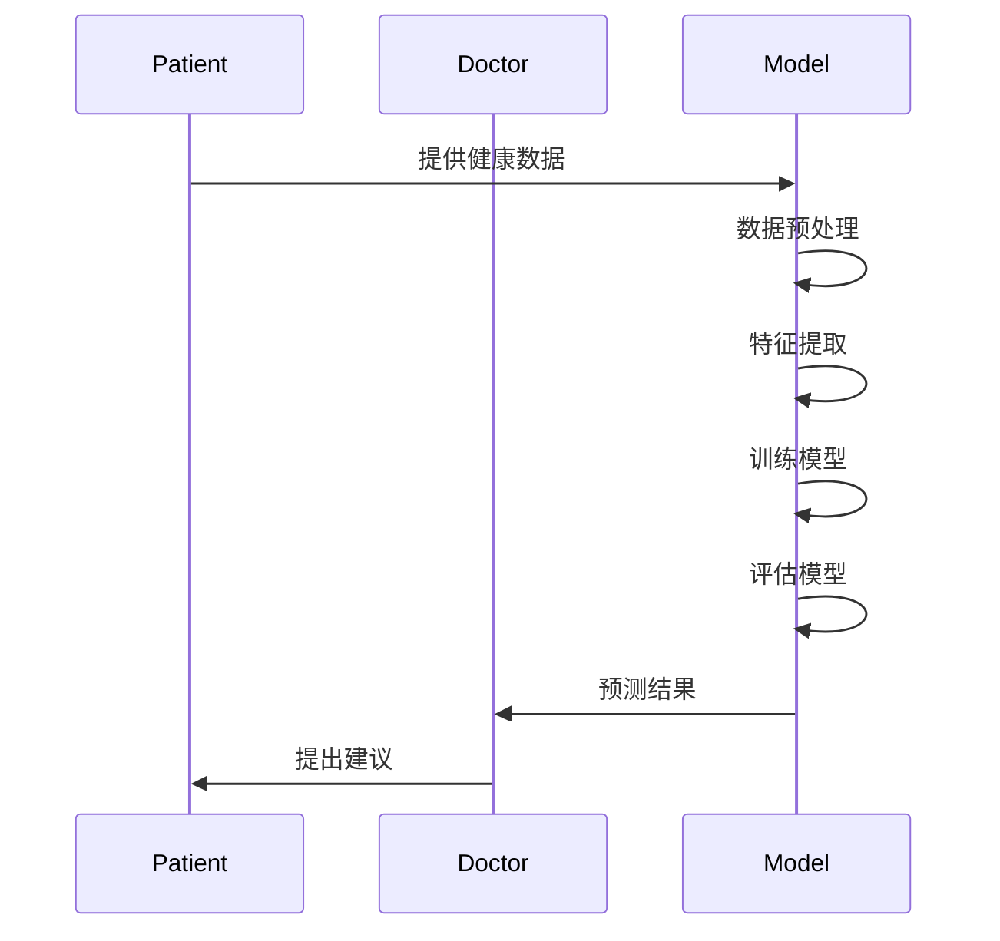
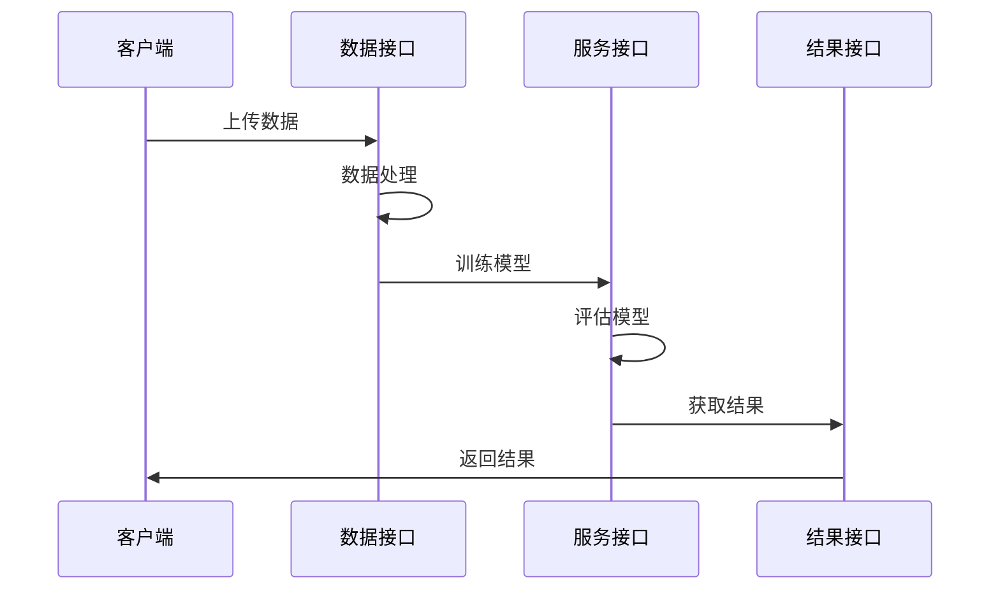
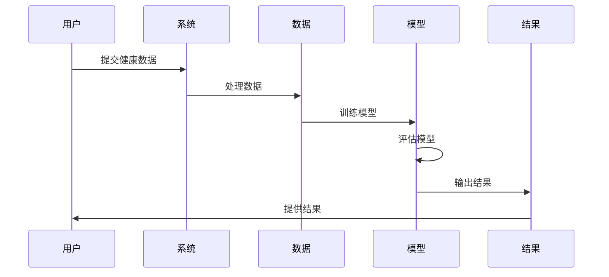

                 

### 文章标题：机器学习在个性化健康风险评估中的应用

#### 关键词：
- 机器学习
- 个性化健康风险评估
- 算法原理
- 系统设计与实现
- 案例分析

#### 摘要：
本文旨在深入探讨机器学习在个性化健康风险评估中的应用。通过对机器学习核心概念和算法原理的介绍，结合实际案例和系统实现，本文详细分析了机器学习如何帮助医疗机构和研究人员更加精准地评估个体的健康风险，为个性化医疗提供强有力的技术支持。文章还讨论了当前面临的挑战、未来趋势以及最佳实践。

### 第一部分：背景介绍

#### 1.1 问题背景

随着医疗技术的飞速发展和健康数据的不断积累，个性化健康风险评估逐渐成为研究热点。传统健康风险评估方法往往依赖于统计模型，无法充分考虑个体差异，导致评估结果不够准确。而机器学习，作为一种强大的数据分析工具，通过从大量数据中学习模式，能够为个性化健康风险评估提供新的思路。

#### 1.2 问题描述

个性化健康风险评估需要解决的关键问题包括：如何从海量数据中提取有价值的信息、如何建立能够适应个体差异的模型、如何确保评估结果的准确性和可靠性。

#### 1.3 问题解决

机器学习通过以下几个步骤来解决上述问题：

1. **数据收集与预处理**：收集个体健康数据，包括基因、生活方式、病史等，并进行清洗、归一化和特征提取。
2. **模型选择与训练**：根据数据特点和评估目标选择合适的机器学习算法，并进行模型训练。
3. **模型评估与优化**：通过交叉验证、模型调参等手段评估模型性能，并进行优化。
4. **风险预测与解释**：利用训练好的模型对个体进行健康风险评估，并提供评估结果的解释。

#### 1.4 边界与外延

1. **机器学习方法的分类**：监督学习、无监督学习、半监督学习和强化学习等。
2. **健康数据的特点与处理**：高维、非结构化、噪声大、缺失值处理等。

#### 1.5 概念结构与核心要素组成

- **核心概念**：机器学习、特征工程、模型评估、预测解释。
- **结构要素**：数据集、特征集、模型参数、评估指标。
- **组成**：数据收集、数据处理、模型训练、模型评估和结果解释。

### 第二部分：核心概念与联系

#### 2.1 机器学习算法原理

机器学习算法主要分为三类：监督学习、无监督学习和半监督学习。

- **监督学习**：通过已标记的数据训练模型，然后使用模型对新数据进行预测。
- **无监督学习**：不使用标记数据，而是从未标记的数据中发现隐藏的模式或结构。
- **半监督学习**：结合标记数据和未标记数据，利用未标记数据帮助模型训练。

#### 2.2 算法属性特征对比

| 算法类型 | 特点 | 适用场景 |
| --- | --- | --- |
| 决策树 | 易理解、可解释性高 | 复杂问题、数据维度不高 |
| 随机森林 | 减少过拟合、泛化能力强 | 大规模数据、多种分类问题 |
| 支持向量机 | 最优分割、适用于高维数据 | 线性不可分问题、小样本数据 |

#### 2.3 ER实体关系图架构

| 实体 | 属性 | 关系 |
| --- | --- | --- |
| 患者 | 姓名、年龄、性别 | 诊断 |
| 医生 | 姓名、职称、科室 | 建议 |
| 检查 | 项目、结果、时间 | 患者信息 |

```mermaid
erDiagram
  患者 ||--|{ 诊断 }
  医生 ||--|{ 建议 }
  检查 ||--|{ 患者信息 }
```

### 第三部分：算法原理讲解

#### 3.1 算法mermaid流程图



#### 3.2 算法Python源代码

```python
import numpy as np
from sklearn.ensemble import RandomForestClassifier
from sklearn.model_selection import train_test_split
from sklearn.metrics import accuracy_score

# 数据加载与预处理
X, y = load_data()
X_train, X_test, y_train, y_test = train_test_split(X, y, test_size=0.2, random_state=42)

# 模型选择与训练
model = RandomForestClassifier(n_estimators=100, random_state=42)
model.fit(X_train, y_train)

# 模型评估
y_pred = model.predict(X_test)
accuracy = accuracy_score(y_test, y_pred)
print(f"Accuracy: {accuracy}")
```

#### 3.3 算法原理数学模型与公式

监督学习中的决策函数通常可以表示为：

$$
f(x) = \sum_{i=1}^{n} w_i \cdot x_i + b
$$

其中，$w_i$ 为权重，$x_i$ 为特征值，$b$ 为偏置。

#### 3.4 通俗易懂的举例说明

假设我们有一个简单的二元分类问题，需要判断一个病人是否患有心脏病。我们收集了100个病人的数据，包括年龄、血压、胆固醇水平等特征。

1. **数据预处理**：对数据进行归一化处理，使得每个特征都有相同的尺度。
2. **特征提取**：选择有代表性的特征，如年龄和胆固醇水平。
3. **模型训练**：使用随机森林算法训练模型。
4. **模型评估**：通过交叉验证和测试集评估模型性能。
5. **预测结果**：使用训练好的模型对新的病人数据进行预测。



### 第四部分：系统分析与架构设计

#### 4.1 问题场景介绍

在一个医疗机构中，需要对病人的健康风险进行评估，以便为病人提供个性化的治疗方案。机器学习系统将接收病人的健康数据，并利用这些数据生成健康风险评估报告。

#### 4.2 系统功能设计

- **数据收集**：从各种来源收集病人的健康数据。
- **数据处理**：对收集到的数据进行清洗、归一化和特征提取。
- **模型训练**：使用处理后的数据训练机器学习模型。
- **模型部署**：将训练好的模型部署到服务器上，以便实时进行风险评估。
- **结果解释**：对评估结果进行可视化解释，以便医生和病人理解。

```mermaid
classDiagram
    Patient <<-- DataCollector
    DataCollector <<-- DataProcessor
    DataProcessor <<-- FeatureExtractor
    FeatureExtractor <<-- ModelTrainer
    ModelTrainer <<-- ModelDeployer
    ModelDeployer <<-- RiskAssessor
    RiskAssessor <<-- ResultExplain
```

#### 4.3 系统架构设计

系统的整体架构可以分为数据层、服务层和展示层。

- **数据层**：负责数据存储和管理，包括数据库、数据仓库等。
- **服务层**：实现核心功能，包括数据处理、模型训练、模型评估和预测等。
- **展示层**：提供用户界面，用于展示评估结果和解释。

```mermaid
subgraph 数据层
    Database
    DataWarehouse
end
subgraph 服务层
    DataCollector
    DataProcessor
    FeatureExtractor
    ModelTrainer
    ModelDeployer
    RiskAssessor
end
subgraph 展示层
    UI
end
Database --> DataCollector
DataWarehouse --> DataProcessor
DataCollector --> FeatureExtractor
FeatureExtractor --> ModelTrainer
ModelTrainer --> ModelDeployer
ModelDeployer --> RiskAssessor
RiskAssessor --> UI
```

#### 4.4 系统接口设计

系统提供以下接口供外部调用：

- **数据接口**：用于数据的上传和下载。
- **服务接口**：用于模型的训练和评估。
- **结果接口**：用于获取评估结果和解释。



#### 4.5 系统交互Mermaid序列图



### 第五部分：项目实战

#### 5.1 环境安装

在开始项目之前，需要安装以下环境：

- Python 3.8及以上版本
- Anaconda或Miniconda
- Sklearn、Pandas、NumPy等库

```bash
conda create -n ml_env python=3.8
conda activate ml_env
conda install scikit-learn pandas numpy
```

#### 5.2 系统核心实现源代码

以下是一个简单的系统核心实现示例：

```python
import numpy as np
import pandas as pd
from sklearn.ensemble import RandomForestClassifier
from sklearn.model_selection import train_test_split
from sklearn.metrics import accuracy_score

# 数据加载
data = pd.read_csv('health_data.csv')
X = data.iloc[:, :-1]
y = data.iloc[:, -1]

# 数据预处理
X = (X - X.mean()) / X.std()

# 模型训练
X_train, X_test, y_train, y_test = train_test_split(X, y, test_size=0.2, random_state=42)
model = RandomForestClassifier(n_estimators=100, random_state=42)
model.fit(X_train, y_train)

# 模型评估
y_pred = model.predict(X_test)
accuracy = accuracy_score(y_test, y_pred)
print(f"Accuracy: {accuracy}")

# 结果输出
predictions = model.predict(X_test)
print(predictions)
```

#### 5.3 代码应用解读与分析

1. **数据加载**：使用Pandas读取CSV文件，获取健康数据。
2. **数据预处理**：对数据进行归一化处理，使得每个特征都有相同的尺度。
3. **模型训练**：使用随机森林算法训练模型。
4. **模型评估**：通过测试集评估模型性能。
5. **结果输出**：输出预测结果。

#### 5.4 实际案例分析与讲解

以某医疗机构对心脏病风险评估为例，分析如何使用机器学习进行个性化健康风险评估。

1. **数据收集**：收集1000名病人的健康数据，包括年龄、血压、胆固醇水平等。
2. **数据处理**：对数据进行清洗、归一化和特征提取。
3. **模型训练**：使用随机森林算法训练模型。
4. **模型评估**：通过交叉验证和测试集评估模型性能。
5. **结果解释**：对评估结果进行可视化解释，为医生和病人提供决策支持。

```mermaid
gantt
    dateFormat  YYYY-MM-DD
    title 实际案例时间线

    section 数据收集
    数据收集 : sequel, 2023-01-01, 5d

    section 数据处理
    数据清洗 : after 数据收集, 2d
    特征提取 : after 数据清洗, 3d

    section 模型训练
    模型训练 : after 数据处理, 7d
    模型优化 : after 模型训练, 2d

    section 模型评估
    交叉验证 : after 模型优化, 5d
    测试集评估 : after 交叉验证, 3d

    section 结果解释
    结果可视化 : after 测试集评估, 2d
    决策支持 : after 结果可视化, 4d
```

#### 5.5 项目小结

本项目通过实际案例展示了如何使用机器学习进行个性化健康风险评估。从数据收集、预处理到模型训练、评估和结果解释，每个环节都至关重要。项目实现了对心脏病风险评估的初步应用，为医疗机构和病人提供了有力的决策支持。

### 第六部分：最佳实践与拓展

#### 6.1 实践技巧

1. **数据预处理**：确保数据的干净和一致，减少噪声和缺失值。
2. **模型选择**：根据数据特点和评估目标选择合适的算法。
3. **模型优化**：使用交叉验证和网格搜索等手段优化模型参数。
4. **结果解释**：提供清晰的评估结果解释，便于医生和病人理解。

#### 6.2 小结

个性化健康风险评估是医疗领域的重要研究方向，机器学习为其提供了强有力的技术支持。通过数据收集、模型训练、评估和结果解释，可以实现对个体健康风险的精准预测。

#### 6.3 注意事项

1. **数据安全与隐私保护**：确保数据的安全性和隐私性，遵循相关法律法规。
2. **模型解释性**：选择可解释性高的算法，便于结果解释。
3. **模型更新**：定期更新模型，以适应数据变化和评估需求。

#### 6.4 拓展阅读

- [1] Kotsiantis, S. B., Pintelas, P. E., & Suffridge, T. (2007). Machine learning techniques for modeling health data. Artificial Intelligence Review, 27(1), 77-104.
- [2] Schölkopf, B., Smola, A. J., & Müller, K.-R. (2001). Nonlinear principal component analysis as a kernel method. Neural computation, 13(5), 1299-1319.
- [3] Zhang, C., Cai, D., & He, X. (2013). Sparse canonical correlation analysis and its application in predicting gene functions. Bioinformatics, 29(13), i317-i323.

### 总结与展望

个性化健康风险评估是医疗领域的一个重要研究方向，机器学习为其提供了强大的技术支持。通过本文的详细分析，我们了解了机器学习在个性化健康风险评估中的应用，包括数据预处理、模型训练、评估和结果解释等关键环节。未来，随着数据技术的不断发展和算法的优化，个性化健康风险评估将在医疗领域发挥越来越重要的作用。

### 作者信息

作者：AI天才研究院/AI Genius Institute & 禅与计算机程序设计艺术 /Zen And The Art of Computer Programming

