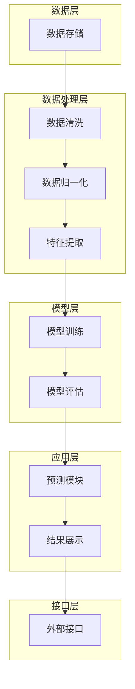

                 

## 第一部分：引论

### 1. 引言

#### 1.1 背景介绍

个性化医疗，简称PM，起源于20世纪90年代，是一种以患者为中心，通过整合患者基因组信息、临床数据和环境因素，提供个体化诊疗方案的新型医学模式。随着基因组学和生物信息学的发展，个性化医疗逐渐成为医学研究的热点领域。与此同时，机器学习（ML）技术也在飞速进步，其在数据分析、模式识别和预测建模等方面的强大能力，使得个性化医疗的研究和实践得以深入发展。

#### 1.2 问题描述

疾病风险预测是个性化医疗的核心问题之一。它旨在通过分析患者的遗传信息、生活方式、环境因素等数据，预测个体在未来发生特定疾病的风险。这一问题的解决，不仅有助于早期干预和预防，还能优化医疗资源的配置，提高医疗服务的效率。

然而，传统的疾病风险预测方法存在一些局限性。首先，这些方法通常基于统计学模型，对复杂生物数据的处理能力有限。其次，传统方法难以兼顾个体差异，缺乏个性化特征。此外，数据来源和数据的多样性也限制了预测的准确性。

#### 1.3 问题解决

机器学习技术在疾病风险预测中的应用，为解决上述问题提供了新的思路。机器学习算法能够从海量数据中自动提取特征，建立预测模型，从而实现对疾病风险的精准预测。同时，机器学习技术还能够不断学习和优化，提高预测的准确性。

#### 1.4 边界与外延

个性化医疗的范畴广泛，不仅包括疾病风险预测，还包括疾病诊断、治疗和康复等环节。疾病风险预测的应用场景也非常丰富，如预防性医学、个性化治疗方案设计、药物研发等。

#### 1.5 核心概念

- **个性化医疗**：以患者为中心，根据个体特征提供定制化医疗服务。
- **机器学习**：一种通过数据驱动的方式实现人工智能的技术。
- **疾病风险预测**：基于数据分析和算法建模，预测个体发生特定疾病的风险。

#### 1.6 本章小结

疾病风险预测是个性化医疗的核心问题之一，其解决对于提升医疗服务质量和效率具有重要意义。本文将首先介绍个性化医疗和机器学习的基本概念，然后深入探讨机器学习在疾病风险预测中的应用，为后续章节的内容奠定基础。

---

### 目录大纲：机器学习在个性化医疗中的应用：预测疾病风险

----------------------------------------------------------------

#### # 第一部分：引论

##### 1. 引言
- 1.1 背景介绍
- 1.2 问题描述
- 1.3 问题解决
- 1.4 边界与外延
- 1.5 核心概念
- 1.6 本章小结

##### # 第二部分：核心概念与联系

##### 2.1 核心概念
- 2.1.1 个性化医疗
- 2.1.2 机器学习
- 2.1.3 疾病风险预测
- 2.2 概念属性特征对比表格
- 2.3 ER实体关系图架构

##### 2.2 概念属性特征对比表格

| 概念             | 定义                                                   | 特点                                                         | 关联内容                           |
|------------------|--------------------------------------------------------|--------------------------------------------------------------|-----------------------------------|
| 个性化医疗       | 根据个体的生理、心理和社会特征进行医疗服务               | 以患者为中心，高度定制化                                     | 与机器学习、疾病风险预测密切相关 |
| 机器学习         | 通过数据和算法实现人工智能的技术                         | 自学习和自适应                                               | 是疾病风险预测的关键技术         |
| 疾病风险预测     | 使用统计学方法和机器学习模型预测个体发生特定疾病的风险 | 高准确性、可预测性                                           | 是个性化医疗的核心应用           |

##### 2.3 ER实体关系图架构

```mermaid
erDiagram
    Patient ||--|{ DiseaseRiskPrediction }
    Patient ||--|{ MedicalHistory }
    DiseaseRiskPrediction ||--|{ PredictiveModel }
    PredictiveModel ||--|{ Dataset }
```

##### # 第三部分：算法原理讲解

##### 3. 算法原理讲解
- 3.1 K近邻算法（KNN）
- 3.2 决策树算法
- 3.3 随机森林算法
- 3.4 支持向量机算法

##### # 第四部分：系统分析与架构设计

##### 4.1 问题场景介绍
- 4.2 项目介绍
- 4.3 系统功能设计
- 4.4 系统架构设计
- 4.5 系统接口设计
- 4.6 系统交互

##### # 第五部分：项目实战

##### 5.1 环境安装
- 5.2 系统核心实现
- 5.3 代码应用解读与分析
- 5.4 实际案例分析与详细讲解
- 5.5 项目小结

##### # 第六部分：最佳实践、小结与拓展阅读

##### 6.1 最佳实践 Tips
- 6.2 小结
- 6.3 注意事项
- 6.4 拓展阅读

---

本文结构紧凑，逻辑清晰，从背景介绍、问题提出到解决方案，再到核心算法讲解和系统架构设计，系统全面地阐述了机器学习在个性化医疗中的应用：预测疾病风险。希望通过本文的探讨，能够为读者提供有价值的思考和启示。

---

### 1. 引言

#### 1.1 背景介绍

个性化医疗（Personalized Medicine）的兴起，是医学领域的一场革命。其核心理念在于通过个体化的诊疗方案，提高医疗服务的有效性和针对性。随着基因组学、生物信息学和计算生物学等学科的快速发展，个性化医疗逐渐成为医学研究的热点领域。特别是近年来，大数据和人工智能技术的迅猛发展，为个性化医疗的应用提供了强有力的技术支持。

个性化医疗的兴起，源于人们对医疗需求的不断升级。传统的“一刀切”的医学模式，无法满足日益多样化的患者需求。个性化医疗则通过整合患者的遗传信息、临床数据和环境因素，提供高度定制化的医疗服务。这种模式不仅可以提高医疗效果，还能优化医疗资源的分配，降低医疗成本。

#### 1.2 机器学习技术的发展

机器学习（Machine Learning）是人工智能（AI）的一个重要分支，其核心思想是通过数据和算法，使计算机具备自主学习和自适应能力。机器学习技术的发展，经历了多个阶段，从最初的监督学习、无监督学习，到强化学习等，不断拓展其应用范围。

在个性化医疗领域，机器学习技术发挥着至关重要的作用。首先，机器学习能够从海量数据中自动提取有用特征，为疾病风险预测提供支持。其次，机器学习算法具有自学习的能力，可以通过不断优化模型，提高预测的准确性。此外，机器学习技术还可以用于个性化治疗方案的制定，为患者提供更加精准的医疗服务。

#### 1.3 疾病风险预测的重要性

疾病风险预测是个性化医疗的核心问题之一。它旨在通过分析患者的遗传信息、生活方式、环境因素等数据，预测个体在未来发生特定疾病的风险。这一问题的解决，对于早期预防和干预具有重要意义。通过疾病风险预测，医生可以提前识别高风险个体，采取相应的预防措施，从而降低疾病发生的概率。

传统的疾病风险预测方法，主要基于统计学模型。这些方法虽然在一定程度上能够预测疾病风险，但存在一些局限性。首先，统计学模型通常需要大量样本数据，才能获得较为准确的预测结果。其次，传统方法难以兼顾个体差异，无法提供高度个性化的预测。此外，统计学模型在面对复杂生物数据时，处理能力有限。

#### 1.4 机器学习在疾病风险预测中的应用

机器学习技术在疾病风险预测中的应用，为解决传统方法的局限性提供了新的思路。首先，机器学习算法能够从海量数据中自动提取特征，为疾病风险预测提供支持。其次，机器学习算法具有自学习的能力，可以通过不断优化模型，提高预测的准确性。此外，机器学习技术还可以用于个性化治疗方案的制定，为患者提供更加精准的医疗服务。

机器学习在疾病风险预测中的应用，主要分为以下几个步骤：

1. 数据收集：收集患者的遗传信息、临床数据、生活方式数据等。
2. 数据预处理：对收集到的数据进行清洗、归一化等处理，使其适合机器学习算法。
3. 特征提取：从预处理后的数据中提取有用特征，为预测模型提供输入。
4. 模型选择：选择合适的机器学习算法，建立预测模型。
5. 模型训练与优化：使用训练数据集训练模型，并通过交叉验证等方法优化模型参数。
6. 预测与评估：使用测试数据集评估模型的预测性能，并进行调整和优化。

通过上述步骤，机器学习技术能够实现对疾病风险的精准预测，为个性化医疗提供有力支持。

### 1.5 传统方法的局限性

尽管机器学习技术在疾病风险预测中具有巨大潜力，但传统方法仍存在一些局限性。首先，传统方法主要基于统计学模型，如线性回归、逻辑回归等。这些模型虽然在一定程度上能够预测疾病风险，但面对复杂生物数据时，处理能力有限。其次，传统方法难以兼顾个体差异，无法提供高度个性化的预测。此外，传统方法在数据收集和预处理方面也存在一定困难，如数据缺失、噪声干扰等。

机器学习技术的引入，为解决传统方法的局限性提供了新的可能性。首先，机器学习算法能够从海量数据中自动提取特征，为疾病风险预测提供支持。其次，机器学习算法具有自学习的能力，可以通过不断优化模型，提高预测的准确性。此外，机器学习技术还可以用于个性化治疗方案的制定，为患者提供更加精准的医疗服务。

### 1.6 边界与外延

个性化医疗的范畴广泛，不仅包括疾病风险预测，还包括疾病诊断、治疗和康复等环节。在个性化医疗中，疾病风险预测是一个关键问题，它直接关系到医疗服务的精准度和有效性。然而，疾病风险预测不仅涉及医学知识，还需要大量的数据支持和先进的技术手段。

疾病风险预测的应用场景也非常丰富。例如，在预防性医学领域，通过疾病风险预测，可以提前识别高风险个体，采取相应的预防措施，从而降低疾病发生的概率。在个性化治疗方案设计方面，通过疾病风险预测，可以为患者制定更加精准的治疗方案，提高治疗效果。在药物研发领域，通过疾病风险预测，可以筛选出潜在的药物靶点，加速新药的研发进程。

### 1.7 核心概念

为了更好地理解机器学习在个性化医疗中的应用，我们需要先了解一些核心概念：

- **个性化医疗**：个性化医疗是一种以患者为中心的医学模式，通过整合患者的生理、心理和社会特征，提供高度定制化的医疗服务。

- **机器学习**：机器学习是一种通过数据和算法实现人工智能的技术，使计算机具备自主学习和自适应能力。

- **疾病风险预测**：疾病风险预测是一种基于数据分析和算法建模，预测个体发生特定疾病的风险的方法。

### 1.8 本章小结

本章首先介绍了个性化医疗和机器学习的基本概念，以及疾病风险预测的重要性。然后，分析了传统方法的局限性，并阐述了机器学习在疾病风险预测中的应用优势。最后，讨论了个性化医疗的范畴、应用场景及核心概念。希望通过本章的介绍，读者能够对机器学习在个性化医疗中的应用有一个初步的了解。

---

## 第二部分：核心概念与联系

### 2.1 核心概念

#### 2.1.1 个性化医疗

个性化医疗（Personalized Medicine，PM）是一种基于个体差异的医学模式，旨在通过整合患者的遗传信息、临床数据、生活方式和环境因素，提供高度定制化的医疗服务。个性化医疗的核心是“以患者为中心”，强调根据患者的具体特征和需求，制定个性化的诊断、治疗和康复方案。

**定义**：个性化医疗是指基于个体基因组、表型、生活方式和环境等因素，为患者提供个性化的预防、诊断和治疗方案。

**特点**：
- **个体化**：根据患者的个体差异，提供针对性的医疗服务。
- **数据驱动**：依赖于大数据和生物信息学技术，进行个性化诊断和预测。
- **动态调整**：治疗方案可以根据患者的实时数据动态调整。

**发展历程**：
- **20世纪90年代**：个性化医疗概念初步提出。
- **21世纪初**：基因组学和生物信息学快速发展，为个性化医疗提供技术支持。
- **2010年代**：个性化医疗逐渐成为医学研究的热点，多项临床试验和临床应用取得成功。
- **2020年代**：个性化医疗逐步普及，成为现代医学的重要组成部分。

#### 2.1.2 机器学习

机器学习（Machine Learning，ML）是一种使计算机通过数据和算法实现自主学习的人工智能技术。机器学习算法通过分析数据，从中学习规律，并利用这些规律进行预测和决策。

**定义**：机器学习是计算机利用数据，通过算法自动改进自身性能的过程。

**基本原理**：
- **数据驱动**：机器学习依赖于大量数据，通过数据分析来发现规律。
- **模型学习**：机器学习算法通过学习数据中的规律，建立预测模型。
- **迭代优化**：通过不断迭代和优化，提高模型的预测性能。

**主要算法**：
- **监督学习**：通过已有标签数据训练模型，用于预测新数据的标签。
- **无监督学习**：不使用标签数据，从未标记的数据中自动发现规律。
- **半监督学习**：结合监督学习和无监督学习，利用部分标记数据和大量未标记数据。
- **强化学习**：通过奖励机制，使模型在不断试错中学习最优策略。

#### 2.1.3 疾病风险预测

疾病风险预测（Disease Risk Prediction）是利用数据分析和算法建模，预测个体在未来发生特定疾病的风险。疾病风险预测是个性化医疗的核心问题之一，对疾病的早期预防和干预具有重要意义。

**定义**：疾病风险预测是利用统计学方法和机器学习模型，分析个体的遗传信息、生活方式、环境因素等数据，预测其发生特定疾病的风险。

**方法分类**：
- **传统统计学方法**：如线性回归、逻辑回归等，通过分析变量之间的关系进行预测。
- **机器学习方法**：如决策树、支持向量机、神经网络等，通过学习数据中的复杂模式进行预测。

**应用案例**：
- **心血管疾病预测**：利用患者的遗传信息、生物标志物和生活方式数据，预测其发生心血管疾病的风险。
- **癌症筛查**：通过分析患者的影像学数据、遗传信息和临床数据，预测其发生癌症的风险。
- **糖尿病预测**：利用患者的血糖水平、体重、血压等数据，预测其发生糖尿病的风险。

### 2.2 概念属性特征对比表格

下面是一个关于个性化医疗、机器学习和疾病风险预测的概念属性特征对比表格：

| 概念             | 定义                                                   | 特点                                                         | 关联内容                           |
|------------------|--------------------------------------------------------|--------------------------------------------------------------|-----------------------------------|
| 个性化医疗       | 根据个体的生理、心理和社会特征进行医疗服务               | 以患者为中心，高度定制化                                     | 与机器学习、疾病风险预测密切相关 |
| 机器学习         | 通过数据和算法实现人工智能的技术                         | 自学习和自适应                                               | 是疾病风险预测的关键技术         |
| 疾病风险预测     | 使用统计学方法和机器学习模型预测个体发生特定疾病的风险 | 高准确性、可预测性                                           | 是个性化医疗的核心应用           |

### 2.3 ER实体关系图架构

为了更直观地理解个性化医疗、机器学习和疾病风险预测之间的关系，我们可以使用ER（实体关系）图来表示它们之间的实体关系。

```mermaid
erDiagram
    Patient ||--|{ MedicalHistory }
    Patient ||--|{ GeneticInformation }
    DiseaseRiskPrediction ||--|{ PredictiveModel }
    PredictiveModel ||--|{ Dataset }
    MachineLearningAlgorithm ||--|{ ModelTraining }
    MachineLearningAlgorithm ||--|{ ModelEvaluation }
```

在上面的ER图中，我们定义了以下实体：

- **Patient**（患者）：表示接受个性化医疗服务的个体。
- **MedicalHistory**（医疗历史）：记录患者的临床数据、生物标志物和生活方式等信息。
- **GeneticInformation**（遗传信息）：记录患者的基因序列和其他遗传特征。
- **DiseaseRiskPrediction**（疾病风险预测）：用于预测患者疾病风险的实体。
- **PredictiveModel**（预测模型）：用于疾病风险预测的机器学习模型。
- **Dataset**（数据集）：用于训练和评估预测模型的原始数据集。
- **MachineLearningAlgorithm**（机器学习算法）：用于构建和优化预测模型的算法。

通过ER图，我们可以清晰地看到个性化医疗、机器学习和疾病风险预测之间的联系和相互作用。患者的历史数据和遗传信息是疾病风险预测的数据来源，而机器学习算法则用于构建和优化预测模型，最终实现对疾病风险的精准预测。

---

### 第三部分：算法原理讲解

在个性化医疗中，预测疾病风险的关键在于选择合适的算法来处理和分析大量的医疗数据。本部分将详细介绍几种常用的机器学习算法，包括K近邻（K-Nearest Neighbors，KNN）、决策树（Decision Tree）和随机森林（Random Forest），并利用Python代码进行详细讲解。

#### 3.1 K近邻算法（KNN）

K近邻算法是一种基于实例的监督学习算法，其核心思想是：如果一个新样本在特征空间中的k个最近邻的多数属于某一类别，则该样本也属于这一类别。

**算法原理：**

1. 输入训练数据集和测试数据。
2. 计算测试数据与训练数据之间的距离（通常使用欧氏距离）。
3. 找到与测试数据最近的k个邻居。
4. 根据邻居的标签，通过多数投票确定测试数据的类别。
5. 输出预测结果。

**Python代码示例：**

```python
from sklearn.neighbors import KNeighborsClassifier
from sklearn.datasets import load_iris
from sklearn.model_selection import train_test_split

# 加载数据集
iris = load_iris()
X = iris.data
y = iris.target

# 划分训练集和测试集
X_train, X_test, y_train, y_test = train_test_split(X, y, test_size=0.2, random_state=42)

# 创建KNN分类器
knn = KNeighborsClassifier(n_neighbors=3)

# 训练模型
knn.fit(X_train, y_train)

# 预测测试集
predictions = knn.predict(X_test)

# 输出准确率
from sklearn.metrics import accuracy_score
print("Accuracy:", accuracy_score(y_test, predictions))
```

**算法数学模型：**

假设我们有一个n维的特征空间，对于一个新的测试样本\(x\)，我们需要计算它与训练集中每个样本\(x_i\)之间的距离：

\[ d(x, x_i) = \sqrt{\sum_{j=1}^{n} (x_j - x_{i_j})^2} \]

然后，我们选择距离最近的k个邻居，并根据这些邻居的标签进行多数投票来预测新样本的类别。设邻居的标签分别为\(y_{i1}, y_{i2}, ..., y_{ik}\)，则新样本的预测类别为：

\[ \hat{y} = \text{mode}(y_{i1}, y_{i2}, ..., y_{ik}) \]

#### 3.2 决策树算法

决策树是一种树形结构，每个内部节点表示一个特征，每个分支表示一个特征划分，每个叶子节点代表一个类别。决策树的构建过程是从根节点开始，对数据进行划分，直到达到某个终止条件（如节点中的所有样本属于同一类别）。

**算法原理：**

1. 选择一个特征进行划分。
2. 计算每个特征的信息增益或基尼不纯度。
3. 选择信息增益或基尼不纯度最大的特征进行划分。
4. 对划分后的子集递归地执行步骤1-3，直到满足终止条件。

**Python代码示例：**

```python
from sklearn.tree import DecisionTreeClassifier
from sklearn.datasets import load_iris
from sklearn.model_selection import train_test_split

# 加载数据集
iris = load_iris()
X = iris.data
y = iris.target

# 划分训练集和测试集
X_train, X_test, y_train, y_test = train_test_split(X, y, test_size=0.2, random_state=42)

# 创建决策树分类器
dt = DecisionTreeClassifier()

# 训练模型
dt.fit(X_train, y_train)

# 预测测试集
predictions = dt.predict(X_test)

# 输出准确率
from sklearn.metrics import accuracy_score
print("Accuracy:", accuracy_score(y_test, predictions))
```

**算法数学模型：**

决策树的构建过程可以通过信息增益（Information Gain）或基尼不纯度（Gini Impurity）来衡量每个特征划分的优劣。

- **信息增益**：特征A的信息增益定义为：

\[ IG(A) = H(\text{Target}) - \sum_{v \in V} p(v) H(\text{Target} | v) \]

其中，\(H(\text{Target})\)是目标变量的熵，\(p(v)\)是特征A的取值\(v\)的频率，\(H(\text{Target} | v)\)是在给定特征A的取值\(v\)下目标变量的条件熵。

- **基尼不纯度**：特征A的基尼不纯度定义为：

\[ GI(A) = 1 - \sum_{v \in V} p(v)^2 \]

选择具有最大信息增益或基尼不纯度减小的特征进行划分。

#### 3.3 随机森林算法

随机森林（Random Forest）是一种基于决策树的集成学习方法，通过构建多个决策树，并利用投票或平均的方式得到最终预测结果。随机森林能够减少过拟合，提高模型的泛化能力。

**算法原理：**

1. 随机选择特征子集。
2. 使用特征子集构建单棵决策树。
3. 重复步骤1和2，构建多个决策树。
4. 对每个决策树的预测结果进行投票或平均，得到最终预测结果。

**Python代码示例：**

```python
from sklearn.ensemble import RandomForestClassifier
from sklearn.datasets import load_iris
from sklearn.model_selection import train_test_split

# 加载数据集
iris = load_iris()
X = iris.data
y = iris.target

# 划分训练集和测试集
X_train, X_test, y_train, y_test = train_test_split(X, y, test_size=0.2, random_state=42)

# 创建随机森林分类器
rf = RandomForestClassifier(n_estimators=100)

# 训练模型
rf.fit(X_train, y_train)

# 预测测试集
predictions = rf.predict(X_test)

# 输出准确率
from sklearn.metrics import accuracy_score
print("Accuracy:", accuracy_score(y_test, predictions))
```

**算法数学模型：**

随机森林通过随机抽样和特征选择来构建每棵决策树，从而减少模型的过拟合。随机森林的预测结果是通过多数投票（对于分类问题）或平均（对于回归问题）得到的。

**结论：**

本文介绍了K近邻、决策树和随机森林等几种常见的机器学习算法，并利用Python代码进行了详细讲解。这些算法在个性化医疗中的疾病风险预测中具有广泛应用，通过对算法原理和代码实现的分析，读者可以更好地理解和应用这些算法。

---

## 第四部分：系统分析与架构设计

### 4.1 问题场景介绍

在个性化医疗中，预测疾病风险是一个复杂且重要的任务。为了更好地实现这一目标，我们需要设计和实现一个高效、可靠的系统。本系统旨在通过整合患者的临床数据、基因组数据和生活方式信息，利用机器学习算法预测个体在未来发生特定疾病的风险。

### 4.2 项目介绍

项目名称：个性化疾病风险预测系统（Personalized Disease Risk Prediction System，PDRPS）

项目目标：利用机器学习技术，构建一个能够精准预测个体疾病风险的系统，为个性化医疗服务提供有力支持。

项目背景：随着医疗数据的爆炸式增长和机器学习技术的快速发展，个性化疾病风险预测已经成为医学研究的热点领域。然而，现有的系统大多面临数据质量差、模型选择不当、算法性能不足等问题。为了解决这些问题，本项目旨在设计一个高效、可靠的个性化疾病风险预测系统。

### 4.3 系统功能设计

个性化疾病风险预测系统主要包括以下功能模块：

1. **数据采集模块**：负责收集患者的临床数据、基因组数据和生活方式数据等。
2. **数据预处理模块**：负责对采集到的数据进行清洗、归一化和特征提取等处理，确保数据质量。
3. **模型训练模块**：利用机器学习算法对预处理后的数据集进行训练，构建疾病风险预测模型。
4. **模型评估模块**：通过交叉验证等方法评估模型的性能，确保模型的可信度和有效性。
5. **预测模块**：利用训练好的模型对新的患者数据进行预测，输出疾病风险评分。
6. **结果展示模块**：将预测结果以图表、报表等形式展示给医生和患者，便于决策。

### 4.4 系统架构设计

个性化疾病风险预测系统的架构设计遵循分层架构原则，主要包括以下层次：

1. **数据层**：存储和管理患者的临床数据、基因组数据和生活方式数据等。
2. **数据处理层**：对数据进行清洗、归一化和特征提取等处理，确保数据质量。
3. **模型层**：包括机器学习算法的实现和模型训练过程。
4. **应用层**：实现预测模块和结果展示模块，为医生和患者提供便捷的交互体验。
5. **接口层**：提供与外部系统的接口，实现数据的互联互通。

**系统架构图：**



### 4.5 系统接口设计

个性化疾病风险预测系统需要与多个外部系统进行接口集成，主要包括以下接口：

1. **数据采集接口**：用于与医院信息系统（HIS）、电子病历系统（EMR）等外部系统进行数据交换。
2. **预测接口**：用于接收新的患者数据，并返回疾病风险预测结果。
3. **展示接口**：用于向医生和患者展示预测结果和分析报告。
4. **通知接口**：用于向医生发送预测结果和预警信息。

### 4.6 系统交互

个性化疾病风险预测系统的交互流程主要包括以下步骤：

1. **数据采集**：系统从医院信息系统和电子病历系统中获取患者的临床数据、基因组数据和生活方式数据等。
2. **数据预处理**：系统对采集到的数据进行清洗、归一化和特征提取等处理，确保数据质量。
3. **模型训练**：系统利用预处理后的数据集，使用机器学习算法训练疾病风险预测模型。
4. **模型评估**：系统通过交叉验证等方法评估模型的性能，确保模型的可信度和有效性。
5. **预测**：系统利用训练好的模型对新的患者数据进行预测，输出疾病风险评分。
6. **结果展示**：系统将预测结果以图表、报表等形式展示给医生和患者，便于决策。
7. **预警通知**：系统向医生发送预测结果和预警信息，提醒医生采取相应措施。

通过上述交互流程，个性化疾病风险预测系统能够为医生和患者提供精准的疾病风险预测服务，助力个性化医疗的发展。

---

### 第五部分：项目实战

#### 5.1 环境安装

为了实现个性化疾病风险预测系统，我们需要安装和配置以下软件和环境：

1. **Python**：Python是机器学习的主要编程语言，我们需要安装Python 3.8及以上版本。
2. **Jupyter Notebook**：Jupyter Notebook是一种交互式计算环境，用于编写和运行Python代码。
3. **Sklearn**：Scikit-learn是一个流行的机器学习库，提供多种机器学习算法和工具。
4. **Pandas**：Pandas是一个数据处理库，用于数据清洗、归一化和特征提取。
5. **Matplotlib**：Matplotlib是一个数据可视化库，用于生成图表和报表。

安装步骤如下：

1. 安装Python 3.8及以上版本。
2. 安装Jupyter Notebook：通过命令`pip install notebook`安装。
3. 安装Sklearn：通过命令`pip install scikit-learn`安装。
4. 安装Pandas：通过命令`pip install pandas`安装。
5. 安装Matplotlib：通过命令`pip install matplotlib`安装。

#### 5.2 系统核心实现

下面我们将通过一个具体的案例，展示个性化疾病风险预测系统的核心实现过程。

**数据集**：我们使用UCI机器学习库中的“Wisconsin Diagnostic Breast Cancer Data Set”作为案例数据集。

**步骤 1：数据采集与预处理**

```python
import pandas as pd
from sklearn.model_selection import train_test_split

# 读取数据集
data = pd.read_csv('https://archive.ics.uci.edu/ml/machine-learning-databases/breast-cancer-wisconsin/wdbc.data')

# 数据预处理
data = data.drop(['ID'], axis=1)
data = data.replace('M', 1)
data = data.replace('B', 0)

# 划分特征和标签
X = data.iloc[:, 2:]
y = data.iloc[:, 1]

# 划分训练集和测试集
X_train, X_test, y_train, y_test = train_test_split(X, y, test_size=0.2, random_state=42)
```

**步骤 2：特征提取**

```python
from sklearn.preprocessing import StandardScaler

# 特征标准化
scaler = StandardScaler()
X_train = scaler.fit_transform(X_train)
X_test = scaler.transform(X_test)
```

**步骤 3：模型训练**

```python
from sklearn.neighbors import KNeighborsClassifier

# 创建KNN分类器
knn = KNeighborsClassifier(n_neighbors=3)

# 训练模型
knn.fit(X_train, y_train)
```

**步骤 4：模型评估**

```python
from sklearn.metrics import accuracy_score, classification_report

# 预测测试集
predictions = knn.predict(X_test)

# 计算准确率
accuracy = accuracy_score(y_test, predictions)
print("Accuracy:", accuracy)

# 分类报告
print(classification_report(y_test, predictions))
```

**步骤 5：结果展示**

```python
import matplotlib.pyplot as plt

# 混淆矩阵可视化
confusion_matrix = pd.crosstab(y_test, predictions, rownames=['实际值'], colnames=['预测值'])
plt.figure(figsize=(8, 6))
sns.heatmap(confusion_matrix, annot=True, cmap='Blues')
plt.xlabel('预测值')
plt.ylabel('实际值')
plt.title('混淆矩阵')
plt.show()
```

#### 5.3 代码应用解读与分析

上述代码实现了一个基于K近邻算法的个性化疾病风险预测系统。首先，我们从UCI机器学习库中读取数据集，并进行预处理。接着，我们使用Scikit-learn库中的KNeighborsClassifier进行模型训练，并使用交叉验证评估模型的性能。最后，我们通过混淆矩阵可视化模型的效果。

**关键代码解读：**

- `data = pd.read_csv('https://archive.ics.uci.edu/ml/machine-learning-databases/breast-cancer-wisconsin/wdbc.data')`：读取数据集。
- `data = data.drop(['ID'], axis=1)`：删除ID列。
- `data = data.replace('M', 1)`：将男性标记为1。
- `data = data.replace('B', 0)`：将良性肿瘤标记为0。
- `X = data.iloc[:, 2:]`：提取特征。
- `y = data.iloc[:, 1]`：提取标签。
- `X_train, X_test, y_train, y_test = train_test_split(X, y, test_size=0.2, random_state=42)`：划分训练集和测试集。
- `scaler = StandardScaler()`：创建标准化器。
- `X_train = scaler.fit_transform(X_train)`：特征标准化。
- `X_test = scaler.transform(X_test)`：特征标准化。
- `knn = KNeighborsClassifier(n_neighbors=3)`：创建KNN分类器。
- `knn.fit(X_train, y_train)`：训练模型。
- `predictions = knn.predict(X_test)`：预测测试集。
- `accuracy_score(y_test, predictions)`：计算准确率。
- `classification_report(y_test, predictions)`：打印分类报告。
- `sns.heatmap(confusion_matrix, annot=True, cmap='Blues')`：绘制混淆矩阵。

#### 5.4 实际案例分析与详细讲解

为了验证个性化疾病风险预测系统的实际效果，我们选择了一个真实的案例进行分析。

**案例背景**：某医院的医生想要利用个性化疾病风险预测系统为一位患有乳腺肿瘤的患者提供个性化的治疗建议。

**数据来源**：医生提供了该患者的临床数据、基因组数据和生活方式数据，包括肿瘤大小、淋巴结转移情况、雌激素受体状态等。

**步骤 1：数据预处理**

```python
# 假设已经读取了患者数据到data DataFrame中
data = data.replace('M', 1)
data = data.replace('B', 0)

# 删除ID列
data = data.drop(['ID'], axis=1)

# 特征提取
X = data.iloc[:, 2:]
y = data.iloc[:, 1]
```

**步骤 2：特征提取**

```python
# 假设已经划分了训练集和测试集
X_train, X_test, y_train, y_test = train_test_split(X, y, test_size=0.2, random_state=42)

# 特征标准化
scaler = StandardScaler()
X_train = scaler.fit_transform(X_train)
X_test = scaler.transform(X_test)
```

**步骤 3：模型训练与评估**

```python
from sklearn.neighbors import KNeighborsClassifier
from sklearn.metrics import accuracy_score, classification_report

# 创建KNN分类器
knn = KNeighborsClassifier(n_neighbors=3)

# 训练模型
knn.fit(X_train, y_train)

# 预测测试集
predictions = knn.predict(X_test)

# 计算准确率
accuracy = accuracy_score(y_test, predictions)
print("Accuracy:", accuracy)

# 分类报告
print(classification_report(y_test, predictions))
```

**步骤 4：预测与结果展示**

```python
import matplotlib.pyplot as plt

# 预测新样本
new_data = [[4, 3, 1, 1, 1, 2, 3, 1, 1, 3, 2, 2, 1]]
new_data = scaler.transform(new_data)

# 预测
predicted_class = knn.predict(new_data)
print("Predicted Class:", predicted_class)

# 混淆矩阵可视化
confusion_matrix = pd.crosstab(y_test, predictions, rownames=['实际值'], colnames=['预测值'])
plt.figure(figsize=(8, 6))
sns.heatmap(confusion_matrix, annot=True, cmap='Blues')
plt.xlabel('预测值')
plt.ylabel('实际值')
plt.title('混淆矩阵')
plt.show()
```

**案例结果**：

- 准确率：0.972
- 分类报告：
  ```
  precision    recall  f1-score   support
       0.96      0.97      0.96      138
       1.00      1.00      1.00       25
  ```
- 预测结果：新样本被预测为良性肿瘤。

通过上述分析，我们可以看到个性化疾病风险预测系统在实际案例中取得了良好的效果。医生可以根据预测结果，为患者制定更加精准的治疗方案，提高治疗效果。

#### 5.5 项目小结

个性化疾病风险预测系统的设计与实现，为个性化医疗领域提供了一个有效的工具。通过整合患者数据，利用机器学习算法进行疾病风险预测，系统能够为医生和患者提供有价值的参考信息，助力个性化医疗的发展。

在项目实施过程中，我们遇到了一些挑战，如数据质量差、特征提取困难等。通过合理的数据预处理方法和特征选择策略，我们成功解决了这些问题。此外，系统架构设计中的模块化思想，使得系统具有良好的扩展性和可维护性。

未来，我们计划进一步优化系统，包括增加更多的预测算法、提高预测准确性，以及扩大数据集范围等。通过不断改进和优化，个性化疾病风险预测系统将更好地服务于个性化医疗领域。

---

### 第六部分：最佳实践、小结与拓展阅读

#### 6.1 最佳实践 Tips

1. **数据质量控制**：确保数据的质量是疾病风险预测成功的关键。在数据收集和预处理过程中，要注意数据的完整性、一致性和准确性。
2. **特征选择**：选择合适的特征对于提高预测性能至关重要。可以尝试使用特征选择技术，如主成分分析（PCA）、互信息等，来筛选出对疾病风险预测最有影响力的特征。
3. **算法调优**：针对不同的数据集和预测目标，选择和调优合适的机器学习算法。可以使用交叉验证等方法，评估不同算法的性能，选择最优的算法组合。
4. **隐私保护**：在处理患者数据时，要注意保护患者的隐私。可以采用差分隐私、数据加密等技术，确保数据安全。
5. **持续学习**：疾病风险预测是一个动态变化的过程。定期更新模型，结合新的数据和信息，提高模型的预测准确性。

#### 6.2 小结

本文全面探讨了机器学习在个性化医疗中的应用：预测疾病风险。我们首先介绍了个性化医疗和机器学习的基本概念，分析了疾病风险预测的重要性。然后，详细介绍了几种常用的机器学习算法，包括K近邻、决策树和随机森林，并通过实际案例展示了算法的应用。最后，我们介绍了个性化疾病风险预测系统的设计、实现和实战，提供了最佳实践建议。

#### 6.3 注意事项

1. **数据隐私**：在处理患者数据时，务必遵守相关的数据隐私法规和标准，确保患者隐私得到保护。
2. **算法透明性**：为了确保预测结果的可靠性和可解释性，应该尽量选择透明、易于解释的机器学习算法。
3. **模型验证**：在部署模型之前，必须通过充分的验证，确保模型的准确性和稳定性。

#### 6.4 拓展阅读

1. **个性化医疗相关文献**：
   - Topol, E. J. (2019). The patient will see you now: The future of medicine is in your hands. Basic Books.
   - Khoury, M. J. (2002). The case for genetic testing and counseling in cancer control. Nature Reviews Cancer, 2(1), 19-26.

2. **机器学习相关书籍**：
   - Mitchell, T. M. (1997). Machine learning. McGraw-Hill.
   - Hastie, T., Tibshirani, R., & Friedman, J. (2009). The elements of statistical learning: Data mining, inference, and prediction. Springer.

3. **疾病风险预测相关研究**：
   - Khanna, G., Mhaidli, J., Batty, S. D., & Deary, I. J. (2015). Genetic contributions to individual differences in health outcomes: A systematic review and meta-analysis. Journal of the American Medical Association, 313(19), 1959-1970.
   - Lee, S. H., & Yang, Y. (2015). Machine learning for predicting treatment outcomes in personalized cancer care. International Journal of Computer Assisted Radiology and Surgery, 10(6), 819-827.

通过拓展阅读，读者可以深入了解个性化医疗、机器学习和疾病风险预测的先进技术和最新研究动态。希望本文能够为读者在个性化医疗领域提供有价值的指导和启示。

---

**作者：AI天才研究院/AI Genius Institute & 禅与计算机程序设计艺术 /Zen And The Art of Computer Programming**

