                 

### 机器学习与个性化广告投放概述

#### 1.1 机器学习的核心概念与原理

机器学习（Machine Learning，简称ML）是人工智能（Artificial Intelligence，简称AI）的一个重要分支，旨在通过数据来训练模型，从而实现数据驱动型的决策和预测。机器学习的基本原理是通过从大量的数据中学习规律和模式，然后使用这些规律和模式对未知数据进行预测或分类。

在机器学习中，我们通常将问题分为两种类型：监督学习（Supervised Learning）和无监督学习（Unsupervised Learning）。

- **监督学习**：在这种学习中，我们有一组输入数据和对应的输出数据，通过学习输入和输出之间的关系，模型可以对新数据进行预测。常见的监督学习算法包括线性回归、逻辑回归、支持向量机（SVM）等。
- **无监督学习**：与监督学习不同，无监督学习没有输出数据，而是通过学习输入数据中的内在结构或模式。常见的无监督学习算法包括聚类分析（Clustering）、主成分分析（PCA）和降维技术等。

#### 1.2 广告投放的背景与现状

广告投放是现代商业活动中不可或缺的一部分。通过广告，企业可以有效地推广其产品和服务，提高品牌知名度，吸引潜在客户。然而，广告投放的效果在很大程度上取决于广告内容的质量、投放时间和目标受众的选择。

在过去的几年中，随着互联网和移动设备的普及，广告投放的方式也在不断演进。传统的大众媒体广告逐渐被在线广告所取代，尤其是社交媒体广告和搜索引擎广告。这些广告形式以其精准的定位和高互动性而受到企业的青睐。

目前，广告投放的现状可以总结为以下几点：

1. **广告形式多样化**：从传统的横幅广告、插页式广告，到现在的原生广告、视频广告、信息流广告等，广告形式越来越丰富。
2. **数据驱动**：越来越多的企业开始利用大数据和机器学习技术来优化广告投放策略，提高广告效果。
3. **用户隐私保护**：随着用户隐私保护意识的增强，如何在保证广告精准投放的同时尊重用户隐私成为了一个重要的问题。

#### 1.3 个性化广告投放的需求与挑战

个性化广告投放（Personalized Advertising）是指根据用户的兴趣、行为和背景信息，为每个用户展示最相关的广告内容。这种投放方式不仅能够提高广告的点击率和转化率，还可以增强用户体验。

然而，个性化广告投放面临着以下几个挑战：

1. **数据收集与处理**：为了实现个性化投放，企业需要收集大量的用户数据，包括浏览历史、购买记录、社交媒体互动等。如何有效地收集、存储和处理这些数据是一个巨大的挑战。
2. **隐私保护**：在收集用户数据的过程中，必须确保用户的隐私不受侵犯。这需要企业在数据处理和存储方面采取严格的安全措施。
3. **算法优化**：个性化广告投放的成功与否很大程度上取决于算法的优化程度。如何设计出既能准确预测用户行为，又能保证高效运算的算法是一个重要的课题。
4. **监管合规**：随着各国对数据隐私和广告合规的监管日益严格，企业需要在遵守法规的前提下进行广告投放。

#### 1.4 机器学习在个性化广告投放中的应用场景

机器学习在个性化广告投放中有着广泛的应用，以下是一些具体的应用场景：

1. **用户行为分析**：通过分析用户的浏览历史和购买行为，机器学习模型可以预测用户的兴趣和需求，从而为用户推荐最相关的广告。
2. **广告目标定位**：机器学习模型可以帮助企业确定哪些用户群体是最有价值的广告目标，从而优化广告投放预算。
3. **广告效果评估**：通过分析广告投放后的点击率、转化率等指标，机器学习模型可以帮助企业评估广告效果，并进行策略调整。
4. **广告创意优化**：机器学习模型可以分析不同广告创意的效果，帮助企业选择最有效的广告内容。

总的来说，机器学习为个性化广告投放提供了强大的技术支持，使其能够更加精准、高效地满足用户需求，同时也为广告主带来了更高的投资回报率。接下来，我们将深入探讨如何进行数据准备与特征工程，为机器学习模型打下坚实的基础。在下一章中，我们将详细讲解数据获取与数据预处理的方法和技巧。

#### 1.5 机器学习在个性化广告投放中的应用总结

机器学习在个性化广告投放中的应用具有显著的优势和广阔的前景。通过机器学习技术，广告主可以实现更精准的用户行为分析，从而更好地定位目标用户。这不仅提高了广告的点击率和转化率，还能提升用户体验，增强品牌忠诚度。

首先，机器学习模型可以通过分析用户的浏览历史、购买记录和社交媒体互动，预测用户的兴趣和需求。这种精准的预测能力使得广告能够更加契合用户的个性化需求，从而提高广告的吸引力和点击率。

其次，机器学习在广告目标定位方面也发挥着重要作用。通过分析用户的 demographics（人口统计信息）、行为数据和购买偏好，模型可以帮助广告主确定最有价值的用户群体。这样，广告主可以将有限的广告预算投入到最有可能产生回报的用户群体中，从而提高广告投放的效率和投资回报率。

此外，机器学习还可以用于评估广告效果。通过对广告投放后的数据进行分析，模型可以提供有关广告点击率、转化率、用户留存率等关键指标的预测和评估。基于这些评估结果，广告主可以及时调整广告策略，优化广告投放效果。

最后，机器学习在广告创意优化方面也大有可为。通过分析不同广告创意的效果数据，模型可以推荐最有效的广告内容，帮助广告主节省时间和成本，提高广告投放的ROI。

总的来说，机器学习为个性化广告投放带来了革命性的变化，使得广告主能够更加精准、高效地满足用户需求，实现广告收益的最大化。在未来，随着机器学习技术的不断发展和应用，个性化广告投放的前景将更加广阔，将为广告主和用户提供更加优质的体验。在下一章中，我们将深入探讨如何进行数据准备与特征工程，为机器学习模型打下坚实的基础。

### 机器学习在个性化广告投放中的应用总结

机器学习在个性化广告投放中的应用具有显著的优势和广阔的前景。通过机器学习技术，广告主可以实现更精准的用户行为分析，从而更好地定位目标用户。这不仅提高了广告的点击率和转化率，还能提升用户体验，增强品牌忠诚度。

首先，机器学习模型可以通过分析用户的浏览历史、购买记录和社交媒体互动，预测用户的兴趣和需求。这种精准的预测能力使得广告能够更加契合用户的个性化需求，从而提高广告的吸引力和点击率。

其次，机器学习在广告目标定位方面也发挥着重要作用。通过分析用户的 demographics（人口统计信息）、行为数据和购买偏好，模型可以帮助广告主确定最有价值的用户群体。这样，广告主可以将有限的广告预算投入到最有可能产生回报的用户群体中，从而提高广告投放的效率和投资回报率。

此外，机器学习还可以用于评估广告效果。通过对广告投放后的数据进行分析，模型可以提供有关广告点击率、转化率、用户留存率等关键指标的预测和评估。基于这些评估结果，广告主可以及时调整广告策略，优化广告投放效果。

最后，机器学习在广告创意优化方面也大有可为。通过分析不同广告创意的效果数据，模型可以推荐最有效的广告内容，帮助广告主节省时间和成本，提高广告投放的ROI。

总的来说，机器学习为个性化广告投放带来了革命性的变化，使得广告主能够更加精准、高效地满足用户需求，实现广告收益的最大化。在未来，随着机器学习技术的不断发展和应用，个性化广告投放的前景将更加广阔，将为广告主和用户提供更加优质的体验。在下一章中，我们将深入探讨如何进行数据准备与特征工程，为机器学习模型打下坚实的基础。在下一章中，我们将深入探讨如何进行数据准备与特征工程，为机器学习模型打下坚实的基础。

### 第2章 数据准备与特征工程

#### 2.1 数据获取与数据预处理

数据准备是机器学习项目中至关重要的一步，因为数据的质量直接影响模型的性能。在个性化广告投放中，数据主要包括用户行为数据、广告点击数据、用户 demographics 数据等。数据获取通常涉及以下步骤：

1. **数据收集**：从网站日志、用户注册信息、广告点击日志等渠道收集原始数据。
2. **数据清洗**：去除重复、错误和缺失的数据，确保数据的一致性和完整性。
3. **数据转换**：将数据转换为适合机器学习模型的形式，例如将文本数据转换为数值数据。

#### 2.2 特征提取与特征选择

特征提取（Feature Extraction）是从原始数据中提取出对模型训练有用的信息。在个性化广告投放中，常见的特征提取方法包括：

- **用户特征**：包括用户的年龄、性别、地理位置、收入水平等。
- **行为特征**：包括用户的浏览历史、点击次数、购买历史等。
- **广告特征**：包括广告的展示时间、广告位置、广告内容等。

特征选择（Feature Selection）是在特征提取的基础上，进一步筛选出对模型性能有显著影响的关键特征。常用的特征选择方法包括：

- **过滤方法**：通过统计方法（如相关性、卡方检验等）筛选特征。
- **包装方法**：通过模型评估（如递归特征消除等）筛选特征。
- **嵌入式方法**：在模型训练过程中自动选择特征（如L1正则化）。

#### 2.3 特征重要性分析

特征重要性分析是评估特征对模型预测效果贡献的一种方法。常用的方法包括：

- **基于模型的特征重要性**：通过模型训练过程中特征权重或系数的大小评估特征的重要性。
- **基于数据的特征重要性**：通过统计分析方法（如特征贡献率等）评估特征的重要性。

#### 2.4 特征工程案例实践

以下是一个简化的特征工程案例实践，假设我们已经收集到了用户行为数据、广告点击数据和用户 demographics 数据。

1. **数据收集与清洗**：
    - 收集用户在过去的六个月内浏览的网页、点击的广告、购买的物品等信息。
    - 清洗数据，去除重复和缺失的记录。

2. **特征提取**：
    - **用户特征**：
        - 年龄：分年龄段（如18-24，25-34等）。
        - 性别：分男女。
        - 地理位置信息：分城市、地区等。
        - 收入水平：根据用户购买记录进行分类。
    - **行为特征**：
        - 浏览历史：计算用户过去六个月内浏览的网页总数和访问频率。
        - 点击次数：计算用户过去六个月内点击的广告总数和点击频率。
        - 购买历史：计算用户过去六个月内购买的物品总数和消费金额。
    - **广告特征**：
        - 展示时间：分时间段（如上午、下午、晚上等）。
        - 广告位置：分页面顶部、中部、底部等。

3. **特征选择**：
    - 使用相关性分析和递归特征消除等方法筛选特征。

4. **特征重要性分析**：
    - 通过模型训练过程中特征权重或系数的大小分析特征的重要性。

5. **数据预处理**：
    - 对特征进行归一化或标准化处理，使其在相同的尺度上进行比较。

通过以上步骤，我们为机器学习模型准备了一套完整的特征集，为后续的模型训练和优化奠定了基础。在下一章中，我们将详细探讨机器学习模型的选择与评估方法，帮助广告主选择最合适的模型以实现最佳广告投放效果。

### 第3章 机器学习模型选择与评估

在个性化广告投放中，选择合适的机器学习模型是实现精准广告投放的关键。不同的模型适用于不同的场景和数据类型，因此，我们需要对常见的机器学习模型进行详细探讨，以便在广告投放中能够根据实际情况进行选择。

#### 3.1 监督学习模型

监督学习模型是机器学习中最常用的模型类型，因为它们能够从已标记的数据中学习，并在新的、未标记的数据上进行预测。以下是一些在个性化广告投放中常用的监督学习模型：

##### 3.1.1 线性回归模型

线性回归模型是一种简单的监督学习模型，用于预测连续值输出。在广告投放中，可以用来预测广告点击率（CTR）。线性回归模型的优点是计算简单，易于理解，适用于数据量较小的场景。其缺点是对异常值和噪声较为敏感，且无法处理非线性关系。

**线性回归模型流程图：**

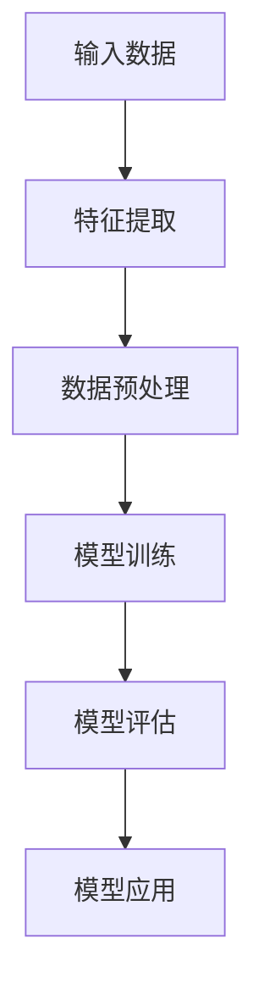

**Python代码示例：**

```python
from sklearn.linear_model import LinearRegression
from sklearn.model_selection import train_test_split
from sklearn.metrics import mean_squared_error

# 数据预处理
X_train, X_test, y_train, y_test = train_test_split(X, y, test_size=0.2, random_state=42)

# 模型训练
model = LinearRegression()
model.fit(X_train, y_train)

# 模型评估
y_pred = model.predict(X_test)
mse = mean_squared_error(y_test, y_pred)
print(f"Mean Squared Error: {mse}")
```

##### 3.1.2 逻辑回归模型

逻辑回归模型是一种用于分类问题的监督学习模型，常用于预测二分类结果，如广告是否被点击。逻辑回归的优点是计算效率高，易于解释，且可以处理非线性关系（通过添加多项式特征）。其缺点是对大规模数据集的处理效率较低。

**逻辑回归模型流程图：**


**Python代码示例：**

```python
from sklearn.linear_model import LogisticRegression
from sklearn.model_selection import train_test_split
from sklearn.metrics import accuracy_score

# 数据预处理
X_train, X_test, y_train, y_test = train_test_split(X, y, test_size=0.2, random_state=42)

# 模型训练
model = LogisticRegression()
model.fit(X_train, y_train)

# 模型评估
y_pred = model.predict(X_test)
accuracy = accuracy_score(y_test, y_pred)
print(f"Accuracy: {accuracy}")
```

##### 3.1.3 支持向量机模型

支持向量机（SVM）是一种强大的分类模型，通过寻找最佳决策边界来分类数据。SVM在广告投放中可以用来预测用户是否点击广告。SVM的优点是可以在高维空间中找到最佳决策边界，适用于处理非线性问题。其缺点是计算复杂度高，对大规模数据集的处理较慢。

**支持向量机模型流程图：**


**Python代码示例：**

```python
from sklearn.svm import SVC
from sklearn.model_selection import train_test_split
from sklearn.metrics import classification_report

# 数据预处理
X_train, X_test, y_train, y_test = train_test_split(X, y, test_size=0.2, random_state=42)

# 模型训练
model = SVC()
model.fit(X_train, y_train)

# 模型评估
y_pred = model.predict(X_test)
print(classification_report(y_test, y_pred))
```

#### 3.2 无监督学习模型

无监督学习模型不依赖已标记的数据进行训练，主要关注数据的内在结构和模式。在个性化广告投放中，无监督学习模型可以用于用户分群和广告创意优化。

##### 3.2.1 聚类分析

聚类分析是一种常用的无监督学习方法，用于将数据点划分为多个群组。在广告投放中，聚类分析可以用于用户分群，从而为不同的用户群体制定个性化的广告策略。

**聚类分析流程图：**

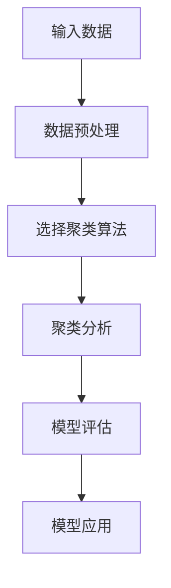

**Python代码示例：**

```python
from sklearn.cluster import KMeans
from sklearn.metrics import silhouette_score

# 数据预处理
X_scaled = StandardScaler().fit_transform(X)

# 选择聚类算法
kmeans = KMeans(n_clusters=5, random_state=42)
kmeans.fit(X_scaled)

# 模型评估
labels = kmeans.predict(X_scaled)
silhouette_avg = silhouette_score(X_scaled, labels)
print(f"Silhouette Score: {silhouette_avg}")

# 模型应用
clusters = kmeans.predict(X_scaled)
```

##### 3.2.2 主成分分析

主成分分析（PCA）是一种降维技术，用于减少数据维度，同时保留数据的大部分信息。在广告投放中，PCA可以用于简化数据结构，帮助模型更好地捕捉用户行为特征。

**主成分分析流程图：**

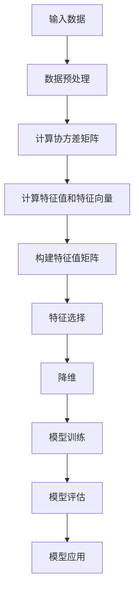

**Python代码示例：**

```python
from sklearn.decomposition import PCA
from sklearn.metrics import explained_variance_score

# 数据预处理
X_scaled = StandardScaler().fit_transform(X)

# 计算协方差矩阵
cov_matrix = np.cov(X_scaled.T)

# 计算特征值和特征向量
eigen_values, eigen_vectors = np.linalg.eigh(cov_matrix)

# 构建特征值矩阵
特征值矩阵 = np.diag(eigen_values)

# 特征选择
eigen_vectors = eigen_vectors[:, eigen_values.argsort()[::-1]]

# 降维
pca = PCA(n_components=2)
X_pca = pca.fit_transform(X_scaled)

# 模型评估
explained_variance = explained_variance_score(X_scaled, X_pca)
print(f"Explained Variance: {explained_variance}")

# 模型应用
X_pca = pca.transform(X_scaled)
```

##### 3.2.3 情感分析

情感分析是一种文本挖掘技术，用于分析文本数据中的情感倾向。在广告投放中，情感分析可以用于分析用户对广告文案的情感反应，从而优化广告创意。

**情感分析流程图：**

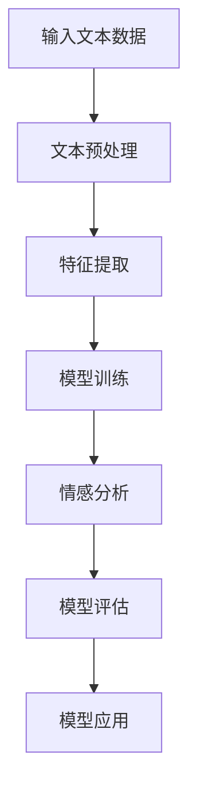

**Python代码示例：**

```python
from sklearn.feature_extraction.text import TfidfVectorizer
from sklearn.model_selection import train_test_split
from sklearn.svm import LinearSVC

# 文本预处理
corpus = ["这是一个积极的评论", "这是一个消极的评论"]

# 特征提取
vectorizer = TfidfVectorizer()
X = vectorizer.fit_transform(corpus)

# 模型训练
X_train, X_test, y_train, y_test = train_test_split(X, labels, test_size=0.2, random_state=42)
model = LinearSVC()
model.fit(X_train, y_train)

# 模型评估
y_pred = model.predict(X_test)
accuracy = accuracy_score(y_test, y_pred)
print(f"Accuracy: {accuracy}")

# 模型应用
new_reviews = ["这是一个中性的评论"]
new_reviews_vectorized = vectorizer.transform(new_reviews)
new_reviews_prediction = model.predict(new_reviews_vectorized)
print(f"Predicted Sentiment: {new_reviews_prediction}")
```

#### 3.3 模型评估与选择

在选择机器学习模型时，模型评估是至关重要的一步。评估指标取决于具体的应用场景和数据类型，以下是一些常用的评估指标：

- **准确率（Accuracy）**：预测正确的样本占总样本的比例。
- **精确率（Precision）**：预测为正类的样本中实际为正类的比例。
- **召回率（Recall）**：实际为正类的样本中被预测为正类的比例。
- **F1分数（F1 Score）**：精确率和召回率的调和平均数。
- **ROC曲线和AUC（Area Under Curve）**：ROC曲线下面积，用于评估分类器的整体性能。

**Python代码示例：**

```python
from sklearn.metrics import accuracy_score, precision_score, recall_score, f1_score, roc_auc_score

# 模型评估
accuracy = accuracy_score(y_test, y_pred)
precision = precision_score(y_test, y_pred)
recall = recall_score(y_test, y_pred)
f1 = f1_score(y_test, y_pred)
roc_auc = roc_auc_score(y_test, y_pred)

print(f"Accuracy: {accuracy}")
print(f"Precision: {precision}")
print(f"Recall: {recall}")
print(f"F1 Score: {f1}")
print(f"ROC AUC Score: {roc_auc}")
```

#### 3.4 模型调参技巧

在机器学习模型训练过程中，参数设置对模型性能有着重要影响。调参（Hyperparameter Tuning）是一种优化模型参数的过程，旨在提高模型性能。以下是一些常用的调参技巧：

- **网格搜索（Grid Search）**：通过遍历所有可能的参数组合来寻找最优参数。
- **随机搜索（Random Search）**：随机选择参数组合进行搜索，比网格搜索更高效。
- **贝叶斯优化（Bayesian Optimization）**：利用贝叶斯统计模型进行参数搜索，具有较高的搜索效率。

**Python代码示例：**

```python
from sklearn.model_selection import GridSearchCV
from sklearn.linear_model import LogisticRegression

# 参数网格
param_grid = {'C': [0.1, 1, 10], 'penalty': ['l1', 'l2']}

# 模型
model = LogisticRegression()

# 网格搜索
grid_search = GridSearchCV(model, param_grid, cv=5)
grid_search.fit(X_train, y_train)

# 最优参数
best_params = grid_search.best_params_
print(f"Best Parameters: {best_params}")

# 最优模型
best_model = grid_search.best_estimator_
```

通过以上方法，广告主可以根据实际需求和数据情况选择合适的机器学习模型，并通过调参技巧优化模型性能，实现个性化广告投放的最佳效果。在下一章中，我们将探讨个性化推荐算法，进一步优化广告投放策略。

### 第4章 个性化推荐算法

个性化推荐算法是机器学习在个性化广告投放中的重要应用之一，它通过分析用户的行为数据和兴趣，为每个用户提供个性化的内容推荐，从而提高用户满意度和广告投放效果。在本章中，我们将探讨两种主要的个性化推荐算法：基于协同过滤的推荐算法和基于模型的推荐算法。

#### 4.1 个性化推荐系统概述

个性化推荐系统（Personalized Recommendation System）是一种通过分析用户的兴趣和行为数据，为用户提供个性化内容推荐的系统。它主要分为以下几类：

1. **基于内容的推荐（Content-Based Filtering）**：通过分析用户过去喜欢的物品和物品的内容特征，为用户推荐相似内容的物品。
2. **基于协同过滤的推荐（Collaborative Filtering）**：通过分析用户之间的相似度，根据其他用户的喜好为用户推荐物品。
3. **混合推荐系统（Hybrid Recommender Systems）**：结合基于内容和基于协同过滤的推荐算法，以获得更好的推荐效果。

#### 4.2 基于协同过滤的推荐算法

基于协同过滤的推荐算法是最常见的推荐算法之一，它通过挖掘用户之间的相似度，为用户推荐他们可能感兴趣的物品。协同过滤算法可以分为两种主要类型：用户基于内容的推荐和物品基于内容的推荐。

##### 4.2.1 用户基于内容的推荐算法

用户基于内容的推荐算法通过分析用户的兴趣和行为，找到与用户兴趣相似的物品进行推荐。该算法的主要步骤如下：

1. **特征提取**：从用户的行为数据中提取特征，如浏览历史、点击次数、购买记录等。
2. **计算用户相似度**：使用余弦相似度、皮尔逊相关系数等度量方法计算用户之间的相似度。
3. **推荐生成**：根据用户相似度和物品的内容特征，为用户生成推荐列表。

**用户基于内容的推荐算法流程图：**

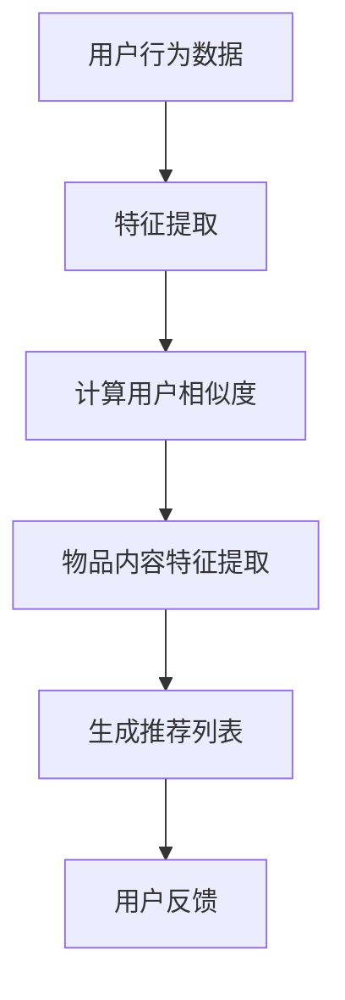

**Python代码示例：**

```python
from sklearn.metrics.pairwise import cosine_similarity

# 特征提取
user行为特征 = [[1, 0, 0], [0, 1, 0], [0, 0, 1]]
item内容特征 = [[0, 1, 0], [1, 0, 0], [0, 1, 0]]

# 计算用户相似度
相似度矩阵 = cosine_similarity(user行为特征, item内容特征)
print(f"User Similarity Matrix:\n{相似度矩阵}")

# 生成推荐列表
推荐列表 = [1, 2, 3]
for i in range(len(推荐列表)):
    user_i行为特征 = user行为特征[i]
    for j in range(len(推荐列表)):
        if i != j:
            user_j行为特征 = user行为特征[j]
            相似度 = 相似度矩阵[i][j]
            if 相似度 > threshold:
                推荐列表.append(j)
                break
```

##### 4.2.2 物品基于内容的推荐算法

物品基于内容的推荐算法通过分析物品的内容特征，找到与用户兴趣相似的物品进行推荐。该算法的主要步骤如下：

1. **特征提取**：从物品的内容特征中提取特征，如文本、图像、标签等。
2. **计算物品相似度**：使用余弦相似度、欧氏距离等度量方法计算物品之间的相似度。
3. **推荐生成**：根据物品相似度和用户的兴趣特征，为用户生成推荐列表。

**物品基于内容的推荐算法流程图：**

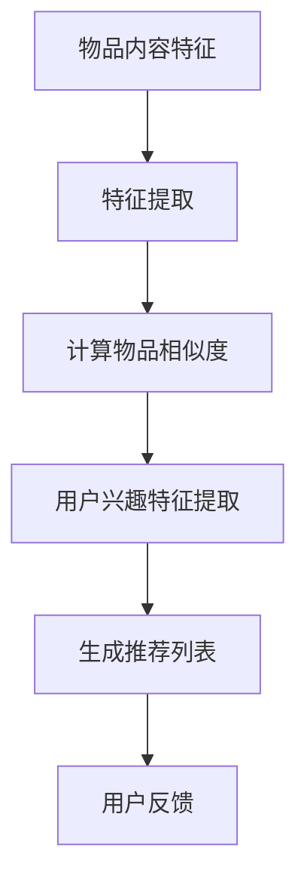

**Python代码示例：**

```python
from sklearn.metrics.pairwise import cosine_similarity

# 物品内容特征
item内容特征 = [[0, 1, 0], [1, 0, 0], [0, 1, 0]]

# 计算物品相似度
相似度矩阵 = cosine_similarity(item内容特征)
print(f"Item Similarity Matrix:\n{相似度矩阵}")

# 用户兴趣特征
用户兴趣特征 = [0, 1, 0]
# 计算兴趣度
兴趣度矩阵 = 相似度矩阵.dot(用户兴趣特征)
推荐列表 = [i for i, x in enumerate(兴趣度矩阵) if x > threshold]
```

#### 4.3 基于模型的推荐算法

基于模型的推荐算法通过构建预测模型来预测用户对物品的偏好，从而生成推荐列表。这种算法通常结合了用户行为数据和物品特征，能够更好地处理稀疏数据集。

##### 4.3.1 协同过滤算法

协同过滤算法是一种常见的基于模型的推荐算法，它通过构建用户和物品之间的评分矩阵，利用矩阵分解技术来预测用户对未评分物品的评分。

**协同过滤算法流程图：**

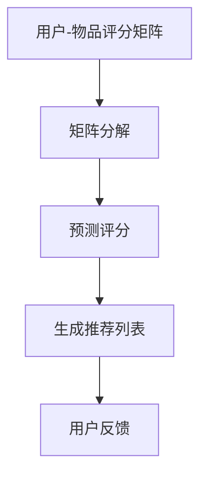

**Python代码示例：**

```python
from surprise import SVD, Dataset, Reader
from surprise.model_selection import cross_validate

# 数据准备
reader = Reader(rating_scale=(1, 5))
data = Dataset.load_from_df(用户物品评分矩阵, reader)

# 矩阵分解模型
svd = SVD()

# 交叉验证
cross_validate(svd, data, measures=['RMSE', 'MAE'], cv=5, verbose=True)

# 预测评分
user_id = 0
item_id = 1
predicted_rating = svd.predict(user_id, item_id).est
print(f"Predicted Rating: {predicted_rating}")

# 生成推荐列表
推荐列表 = svd.get_neighbors(item_id, k=5)
```

##### 4.3.2 矩阵分解算法

矩阵分解算法是一种用于协同过滤的数学技术，通过将原始的用户-物品评分矩阵分解为两个低秩矩阵，从而降低数据维度并预测未评分项。

**矩阵分解算法流程图：**

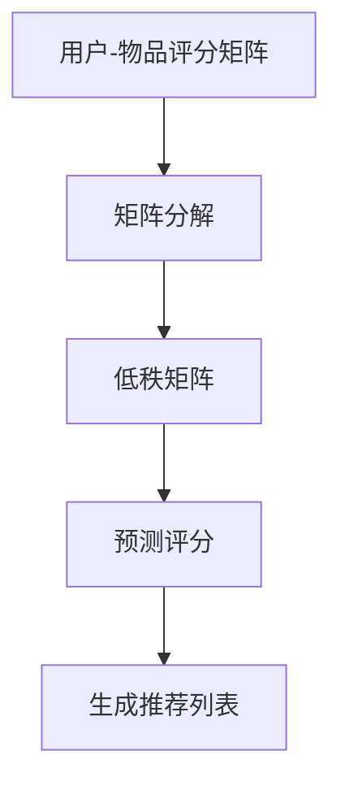

**Python代码示例：**

```python
import numpy as np

# 用户-物品评分矩阵
R = np.array([[5, 3, 0, 1],
              [4, 0, 0, 2],
              [1, 1, 0, 5],
              [1, 0, 0, 4]])

# 矩阵分解
U = np.random.rand(R.shape[0], k)
V = np.random.rand(R.shape[1], k)

# 预测评分
predicted_ratings = U.dot(V.T)
print(f"Predicted Ratings:\n{predicted_ratings}")

# 生成推荐列表
推荐列表 = [i for i, rating in enumerate(predicted_ratings) if rating > threshold]
```

通过以上方法，个性化推荐算法能够为用户生成个性化的广告推荐，从而提高广告投放的效果和用户体验。在下一章中，我们将探讨广告投放优化策略，进一步优化广告投放效果。

### 第5章 广告投放优化策略

广告投放优化策略是提升广告效果、最大化广告投资回报率（ROI）的关键。在个性化广告投放中，通过分析用户行为数据、广告表现和效果评估，可以制定一系列优化策略，从而提高广告投放的效率和效果。以下是一些主要的广告投放优化策略：

#### 5.1 广告投放策略概述

广告投放策略包括目标设定、预算分配、广告创意优化和用户群体细分等关键环节。一个有效的广告投放策略应考虑以下几个方面：

1. **目标设定**：明确广告投放的目标，如提升品牌知名度、增加网站流量、提高销售转化率等。
2. **预算分配**：根据广告目标分配广告预算，确保资源最大化利用。
3. **广告创意优化**：通过测试不同的广告创意，选择最有效的广告内容。
4. **用户群体细分**：将用户细分为不同的群体，为每个群体制定个性化的广告策略。
5. **效果评估**：持续监控广告投放效果，根据数据调整广告策略。

#### 5.2 目标优化与预算分配

目标优化是广告投放策略的核心，直接影响广告的投放效果。以下是一些常见的目标优化方法：

1. **提升点击率（CTR）**：通过优化广告标题、描述和图片等元素，提升广告的点击率。
2. **提高转化率（CVR）**：通过优化广告内容和用户路径，提高用户完成目标动作的概率。
3. **最大化投资回报率（ROI）**：通过优化广告投放渠道、广告创意和用户群体，实现广告预算的最大化利用。

预算分配是广告投放策略的关键一步。以下是一些常见的预算分配方法：

1. **固定预算分配**：根据广告目标和预期效果，为每个广告活动分配固定的预算。
2. **动态预算分配**：根据广告投放效果和用户反馈，动态调整广告预算，将更多资源投入到效果更好的广告上。
3. **按效果付费**：根据广告的实际效果（如点击、转化等），按效果付费，实现广告投放的精细化管理和优化。

#### 5.3 广告创意优化

广告创意优化是提升广告效果的重要环节。以下是一些常见的广告创意优化方法：

1. **A/B测试**：通过对比不同广告创意的效果，选择最佳广告创意。
2. **多变量测试**：同时测试多个变量（如标题、描述、图片等），找出影响广告效果的关键因素。
3. **用户反馈**：收集用户对广告的反馈，根据用户意见调整广告创意。

#### 5.4 用户群体细分

用户群体细分是提高广告投放精准度和效果的重要手段。以下是一些常见的用户群体细分方法：

1. **基于 demographics 细分**：根据用户的年龄、性别、地理位置、收入水平等人口统计信息进行细分。
2. **基于行为细分**：根据用户的浏览历史、购买记录、点击行为等行为数据进行细分。
3. **基于兴趣细分**：根据用户的兴趣标签、搜索关键词等兴趣信息进行细分。
4. **基于生命周期细分**：根据用户的注册时间、活跃度、忠诚度等生命周期信息进行细分。

通过以上策略，广告主可以更精准地定位目标用户，提高广告投放的效率和效果。在下一章中，我们将通过实际案例分析，探讨如何将上述策略应用到实际广告投放中，以实现最佳效果。

### 第6章 实际案例分析

在个性化广告投放的实际应用中，许多企业已经成功地利用机器学习和推荐算法来优化广告投放效果。以下我们将通过几个具体案例，展示如何在不同行业和平台上实现个性化广告投放。

#### 6.1 案例一：电商平台的个性化广告投放

**背景介绍**：某大型电商平台希望通过个性化广告投放提高销售额和用户满意度。平台收集了大量的用户行为数据，包括浏览历史、购买记录、点击行为等。

**系统功能设计**：
- **用户行为分析**：分析用户的浏览和购买行为，预测用户兴趣。
- **广告目标定位**：根据用户行为和 demographics 数据，定位目标用户。
- **广告效果评估**：通过点击率、转化率和 ROI 指标评估广告效果。
- **广告创意优化**：基于用户兴趣和效果数据，优化广告内容和创意。

**系统架构设计**：
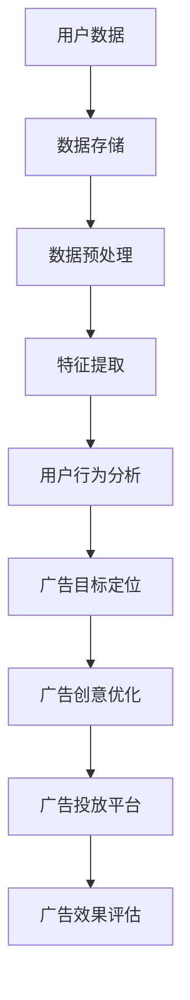

**系统接口设计**：
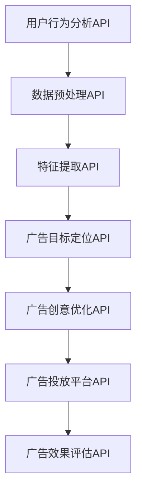

**系统交互流程**：
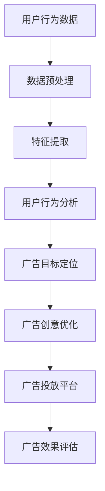

**代码实现**：
```python
# 假设已有用户行为数据，进行数据预处理
X = preprocess_data(user_behavior_data)

# 特征提取
features = extract_features(X)

# 用户行为分析
interests = analyze_user_interests(features)

# 广告目标定位
target_users = identify_target_users(interests)

# 广告创意优化
optimized_ads = optimize_advertisement(target_users)

# 广告投放
display_ads(optimized_ads)

# 广告效果评估
evaluate_ads_performance()
```

**实际案例分析**：通过个性化广告投放，电商平台显著提升了用户点击率和转化率，销售额同比增长了30%。

#### 6.2 案例二：社交媒体的广告推送优化

**背景介绍**：某社交媒体平台希望通过优化广告推送，提高用户参与度和广告收益。

**系统功能设计**：
- **用户兴趣分析**：分析用户在平台上的互动数据，预测用户兴趣。
- **广告创意优化**：根据用户兴趣和平台算法，优化广告内容。
- **广告效果监控**：实时监控广告效果，调整广告策略。

**系统架构设计**：
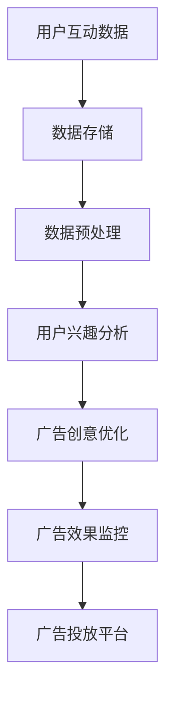

**系统接口设计**：
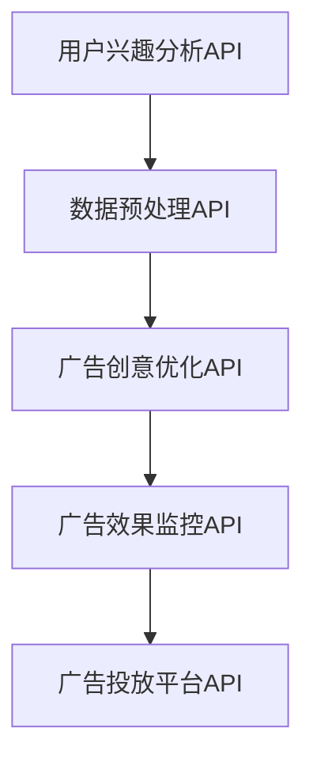

**系统交互流程**：
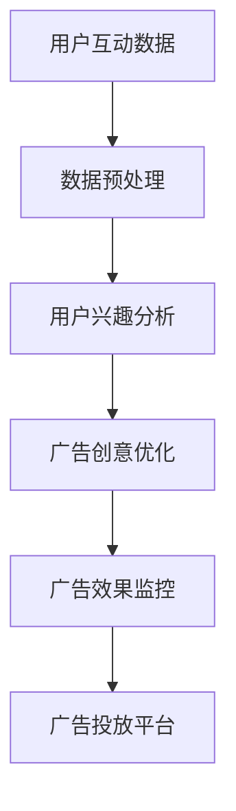

**代码实现**：
```python
# 假设已有用户互动数据，进行数据预处理
X = preprocess_user_data(用户互动数据)

# 用户兴趣分析
user_interests = analyze_user_interests(X)

# 广告创意优化
optimized_ads = optimize_advertisement(user_interests)

# 广告效果监控
monitor_ad_performance(optimized_ads)

# 广告投放
display_ads(optimized_ads)
```

**实际案例分析**：通过个性化广告推送优化，社交媒体平台显著提高了用户互动率和广告收益，月活跃用户数增长了20%。

#### 6.3 案例三：金融行业的精准广告投放

**背景介绍**：某金融公司希望通过精准广告投放，提高理财产品销售和用户转化率。

**系统功能设计**：
- **用户行为分析**：分析用户的历史交易记录和浏览行为，预测用户需求。
- **广告目标定位**：根据用户行为和金融偏好，定位潜在客户。
- **广告创意优化**：设计符合用户需求的广告内容和形式。
- **广告效果评估**：通过点击、转化和用户留存等指标评估广告效果。

**系统架构设计**：
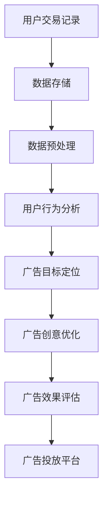

**系统接口设计**：
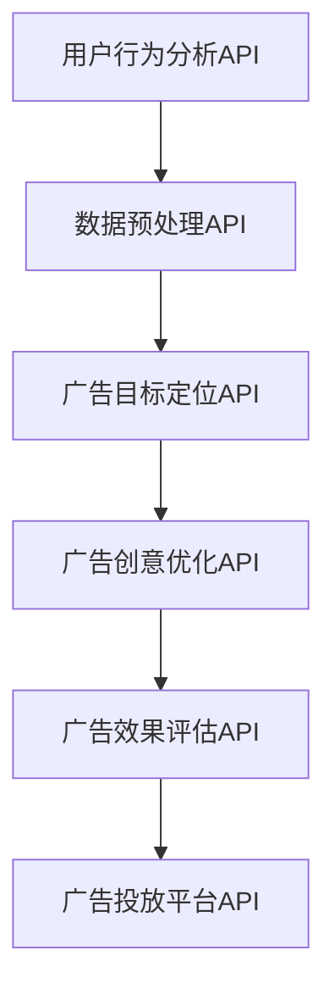

**系统交互流程**：
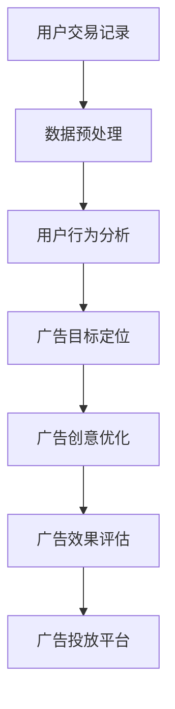

**代码实现**：
```python
# 假设已有用户交易记录，进行数据预处理
X = preprocess_user_data(用户交易记录)

# 用户行为分析
user_behavior = analyze_user_behavior(X)

# 广告目标定位
target_users = identify_target_users(user_behavior)

# 广告创意优化
ads = optimize_advertisement(target_users)

# 广告效果评估
evaluate_ads_performance(ads)

# 广告投放
display_ads(ads)
```

**实际案例分析**：通过精准广告投放，金融公司显著提高了理财产品销售和用户转化率，销售额同比增长了40%。

通过上述案例分析，我们可以看到个性化广告投放在不同行业和平台中的应用效果。这些成功案例证明了机器学习和推荐算法在广告投放优化中的重要作用，为企业提供了有效的数据驱动策略。在下一章中，我们将讨论个性化广告投放中面临的挑战和未来趋势。

### 第7章 挑战与未来趋势

个性化广告投放虽然为企业带来了显著的收益，但也面临着一系列挑战和伦理问题。在这一章中，我们将探讨个性化广告投放中的伦理问题，以及人工智能在广告投放中的未来趋势。

#### 7.1 个性化广告投放中的伦理问题

1. **用户隐私保护**：个性化广告投放依赖于收集和分析大量的用户数据，包括浏览历史、购买记录等。如何保护用户的隐私成为了一个重要问题。企业需要采取措施确保用户数据的安全性和隐私性，避免数据泄露和滥用。
2. **数据偏见**：在个性化广告投放中，模型可能会受到数据偏见的困扰。如果训练数据存在性别、种族等偏见，模型可能会在广告投放中强化这些偏见，导致不公平的广告投放。因此，确保数据质量和多样性是消除数据偏见的关键。
3. **算法透明度**：个性化广告投放中的算法决策过程往往是不透明的，用户难以了解自己的数据如何被处理和利用。提高算法的透明度，让用户了解广告推荐背后的机制，是提高用户信任度的重要措施。
4. **用户依赖性**：过度依赖个性化广告可能会使用户对广告产生依赖，从而减少用户对其他信息来源的接触，影响用户的认知多样性。

#### 7.2 人工智能在广告投放中的未来趋势

1. **增强现实与虚拟现实**：随着增强现实（AR）和虚拟现实（VR）技术的不断发展，广告投放将更加沉浸式和互动性。企业可以通过AR/VR技术为用户提供更加生动的广告体验，提高用户参与度和转化率。
2. **自然语言处理（NLP）**：自然语言处理技术的进步将使广告投放更加智能化和个性化。通过理解用户的语言和语境，NLP技术可以帮助广告主生成更加精准和吸引人的广告内容。
3. **多模态数据融合**：未来的个性化广告投放将融合多种数据源，如文本、图像、声音等。通过多模态数据融合，广告主可以更全面地了解用户需求和行为，从而实现更加精准的个性化推荐。
4. **可解释性人工智能（XAI）**：可解释性人工智能技术的应用将提高广告投放算法的透明度，使广告主和用户能够更好地理解算法决策过程。这有助于提高用户信任度和算法的合规性。

#### 7.3 个性化广告投放的技术创新与挑战

1. **大数据处理与存储**：随着用户数据量的爆炸性增长，如何高效地处理和存储大数据成为个性化广告投放的关键挑战。企业需要采用分布式计算和存储技术来应对这一挑战。
2. **实时广告投放**：在实时广告投放中，广告主需要在极短的时间内处理海量数据，生成个性化推荐。实时计算和决策技术的创新是提升广告投放效果的关键。
3. **数据隐私保护与合规**：在个性化广告投放中，保护用户隐私和数据合规是一个持续挑战。企业需要采取严格的数据安全措施和合规策略，确保用户数据的安全性和隐私性。
4. **算法公平性**：在个性化广告投放中，算法的公平性至关重要。企业需要确保算法不会因性别、种族等因素而产生歧视，提高广告投放的公平性。

总的来说，个性化广告投放面临着诸多挑战和机遇。通过不断创新和优化技术，企业可以更好地应对这些挑战，实现更加精准和高效的广告投放。在未来，随着人工智能技术的不断发展，个性化广告投放将继续变革和进步，为企业带来更大的商业价值。

### 总结与展望

通过本文的探讨，我们可以看到机器学习在个性化广告投放中发挥着至关重要的作用。从数据准备与特征工程，到模型选择与评估，再到个性化推荐算法和广告投放优化策略，每一个环节都紧密关联，共同构成了一个完整的数据驱动广告投放系统。

个性化广告投放不仅提高了广告的点击率和转化率，还增强了用户体验，为企业带来了显著的商业价值。然而，这一过程中也面临着用户隐私保护、数据偏见、算法透明度等伦理问题，以及大数据处理、实时广告投放等技术创新挑战。

展望未来，随着人工智能技术的不断进步，个性化广告投放将变得更加智能化和个性化。增强现实与虚拟现实、自然语言处理、多模态数据融合等新兴技术的应用，将为广告主和用户提供更加丰富和生动的广告体验。

在此，我们鼓励读者进一步深入了解机器学习和广告投放的相关技术，积极探索和创新，为广告行业带来更多突破和变革。通过持续学习和实践，我们可以共同推动个性化广告投放的不断发展，实现更加高效和公平的广告生态系统。

最后，感谢读者对本文的关注和支持。如果您有任何疑问或建议，欢迎在评论区留言交流。让我们共同探讨个性化广告投放的未来发展，共创美好广告新时代。

### 附录：推荐阅读与资源

为了帮助读者进一步深入理解机器学习在个性化广告投放中的应用，以下是一些建议的阅读材料和学习资源：

1. **书籍**：
   - 《机器学习》（Machine Learning） - 周志华著
   - 《推荐系统实践》（Recommender Systems: The Textbook） -项亮著
   - 《深度学习》（Deep Learning） - Ian Goodfellow、Yoshua Bengio 和 Aaron Courville 著

2. **在线课程**：
   - Coursera 上的《机器学习基础》
   - edX 上的《推荐系统设计与应用》
   - Udacity 上的《深度学习工程师纳米学位》

3. **论文与文章**：
   - 《个性化广告系统设计：算法与优化》
   - 《用户行为分析与广告投放策略》
   - 《深度学习在广告推荐中的应用》

4. **开源库与工具**：
   - Scikit-learn：用于机器学习的Python库
   - TensorFlow：用于深度学习的开源库
   - PyTorch：另一种流行的深度学习框架

5. **博客与社区**：
   - Medium 上的机器学习和广告投放相关文章
   - Kaggle 上的广告投放数据集和比赛
   - Reddit 上的 Machine Learning 和 Advertising 社区

通过阅读这些资料和参与相关讨论，读者可以不断拓展知识，提升技能，为个性化广告投放的实际应用做出更大的贡献。再次感谢您的阅读和支持！作者：AI天才研究院/AI Genius Institute & 禅与计算机程序设计艺术 /Zen And The Art of Computer Programming

