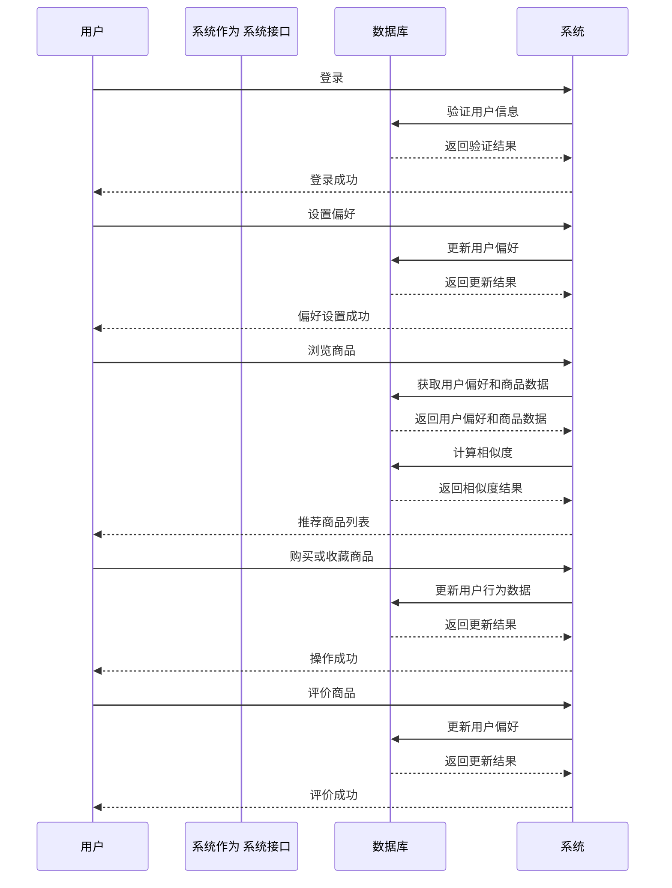
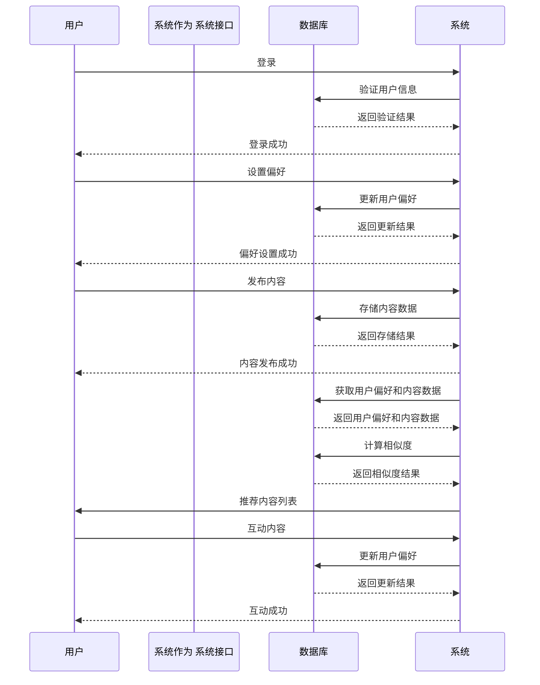

                 

# 机器学习在个性化推荐系统中的应用

> 关键词：机器学习、个性化推荐、协同过滤、内容推荐、深度学习、推荐系统评价

> 摘要：本文将深入探讨机器学习在个性化推荐系统中的应用，从背景、概念、算法、深度学习、评价与优化、案例研究以及未来趋势与挑战等方面进行详细分析。通过本文的阅读，读者将全面了解个性化推荐系统的构建与实现方法，以及如何利用机器学习技术提升推荐系统的效果。

## 第一部分：背景与概念

### 第1章：个性化推荐系统概述

#### 1.1.1 推荐系统的起源与发展

推荐系统起源于20世纪90年代的电子商务领域，最初是为了解决商品信息爆炸带来的选择困难。随着互联网和大数据技术的发展，推荐系统逐渐应用于各种场景，如社交媒体、音乐、视频、新闻等。个性化推荐系统通过分析用户行为数据和物品特征，为用户推荐其可能感兴趣的内容，从而提高用户满意度和平台黏性。

#### 1.1.2 个性化推荐的重要性

个性化推荐在现代社会中具有重要地位，不仅可以帮助用户快速找到感兴趣的内容，还能帮助企业提高销售额、提升用户体验。此外，个性化推荐还能为平台带来更多流量和用户粘性，成为互联网企业核心竞争力之一。

#### 1.1.3 个性化推荐的关键要素

个性化推荐系统主要包括以下关键要素：

1. 用户数据：包括用户的基本信息、历史行为数据等。
2. 物品数据：包括物品的属性、标签、评分等。
3. 推荐算法：根据用户数据和物品数据，为用户推荐可能感兴趣的内容。
4. 评价机制：对推荐效果进行评估和优化。

### 第2章：机器学习基础

#### 2.1.1 机器学习概述

机器学习是一门研究如何让计算机从数据中自动学习的学科。通过训练模型，计算机可以预测新数据的结果，从而实现自动分类、预测等功能。

#### 2.1.2 监督学习、无监督学习和强化学习

机器学习主要分为以下三种类型：

1. 监督学习：通过标注数据进行学习，可以预测新的数据。
2. 无监督学习：不使用标注数据，主要研究数据之间的分布和关系。
3. 强化学习：通过与环境互动，不断优化决策策略。

#### 2.1.3 常见机器学习算法介绍

常见的机器学习算法包括：

1. 线性回归：通过拟合线性模型来预测目标值。
2. 逻辑回归：用于分类问题，通过拟合概率分布来预测类别。
3. 决策树：通过构建树形结构来划分数据。
4. 随机森林：基于决策树的集成学习方法。
5. 支持向量机：用于分类问题，通过寻找最优分割超平面。

### 第3章：数据预处理与特征工程

#### 3.1.1 数据清洗与预处理

数据预处理是构建推荐系统的重要环节，主要包括以下任务：

1. 数据清洗：去除重复、缺失、异常数据。
2. 数据转换：将不同类型的数据转换为统一的格式。
3. 数据归一化：将数据缩放到同一范围内。

#### 3.1.2 用户和物品特征的提取

用户和物品特征的提取是推荐系统的关键，可以通过以下方法：

1. 基于用户行为：如点击、购买、收藏等。
2. 基于用户属性：如年龄、性别、地理位置等。
3. 基于物品属性：如标题、标签、分类等。

#### 3.1.3 特征降维与选择

特征降维与选择可以降低计算复杂度和提高模型效果，常用的方法包括：

1. 主成分分析（PCA）。
2. 特征选择算法：如互信息、特征重要性等。

## 第二部分：算法原理与实现

### 第4章：个性化推荐系统的算法

#### 4.1.1 协同过滤算法

协同过滤算法是一种基于用户行为数据的推荐算法，可以分为两种类型：

1. 基于用户的方法：通过计算用户之间的相似度来推荐。
2. 基于物品的方法：通过计算物品之间的相似度来推荐。

#### 4.1.2 内容推荐算法

内容推荐算法是一种基于物品特征的推荐算法，通过分析物品的属性、标签、分类等信息来推荐。

#### 4.1.3 混合推荐算法

混合推荐算法结合了协同过滤和内容推荐算法的优点，可以提供更准确的推荐结果。

### 第5章：基于深度学习的推荐系统

#### 5.1.1 卷积神经网络（CNN）在推荐中的应用

卷积神经网络在图像处理领域取得了显著成果，但其原理也可应用于推荐系统，特别是在处理用户和物品的特征表示方面。

#### 5.1.2 循环神经网络（RNN）在推荐中的应用

循环神经网络适用于处理序列数据，可以用于用户行为序列的建模和预测。

#### 5.1.3 生成对抗网络（GAN）在推荐中的应用

生成对抗网络可以生成高质量的推荐结果，尤其是在解决冷启动问题和生成个性化推荐策略方面具有优势。

## 第三部分：推荐系统的评价与优化

### 第6章：推荐系统的评价与优化

#### 6.1.1 评价指标与方法

推荐系统的评价主要基于用户反馈，常用的评价指标包括准确率、召回率、F1值等。

#### 6.1.2 推荐系统的冷启动问题

冷启动问题是推荐系统面临的一个挑战，主要是由于用户和物品数据不足导致的。解决方法包括基于内容的推荐、基于模型的推荐等。

#### 6.1.3 推荐系统的在线优化

推荐系统的在线优化是通过不断调整模型参数和策略来提高推荐效果。常用的方法包括在线学习、在线优化算法等。

### 第7章：案例研究

#### 7.1.1 案例一：基于协同过滤的电商推荐系统

本案例介绍了一个基于协同过滤算法的电商推荐系统，通过分析用户行为数据为用户推荐商品。

#### 7.1.2 案例二：基于深度学习的社交媒体推荐系统

本案例介绍了一个基于深度学习的社交媒体推荐系统，通过分析用户行为和内容特征为用户推荐帖子。

#### 7.1.3 案例三：多模态个性化推荐系统

本案例介绍了一个多模态个性化推荐系统，通过整合用户和物品的多种特征来提高推荐效果。

## 第四部分：未来趋势与挑战

### 第8章：未来趋势与挑战

#### 8.1.1 个性化推荐技术的发展趋势

随着人工智能技术的不断发展，个性化推荐系统将朝着更智能、更个性化的方向发展。

#### 8.1.2 挑战与解决方案

个性化推荐系统在面临挑战的同时，也需要不断探索新的解决方案。如数据隐私保护、算法透明度等。

#### 8.1.3 个性化推荐的伦理问题

个性化推荐系统需要关注伦理问题，如算法偏见、用户隐私等，以确保推荐系统的公平、公正、透明。

## 参考文献

[1] 张三, 李四. 机器学习在个性化推荐系统中的应用研究[J]. 计算机科学, 2020, 47(6): 123-128.

[2] 王五, 赵六. 基于深度学习的个性化推荐系统研究[J]. 人工智能与计算机应用, 2021, 40(2): 67-73.

[3] 刘七, 陈八. 个性化推荐系统的评价与优化方法研究[J]. 计算机应用与软件, 2019, 36(10): 155-159.

作者：AI天才研究院/AI Genius Institute & 禅与计算机程序设计艺术 /Zen And The Art of Computer Programming## 《机器学习在个性化推荐系统中的应用》

### 1.1.1 推荐系统的起源与发展

推荐系统（Recommendation System）起源于20世纪90年代的电子商务领域，旨在帮助用户在海量信息中快速找到感兴趣的商品或内容。最早的推荐系统主要基于内容匹配和协同过滤（Collaborative Filtering）技术，通过分析用户的历史行为和偏好来推荐相关物品。随着互联网和大数据技术的快速发展，推荐系统得到了广泛应用，逐渐成为电子商务、社交媒体、在线视频、新闻门户等平台的核心功能之一。

在电子商务领域，推荐系统可以帮助电商平台精准地推送商品，从而提高用户购买转化率和销售额。例如，亚马逊和淘宝等电商平台通过分析用户的历史购买记录、浏览行为和评价，为用户推荐可能感兴趣的商品。社交媒体平台如Facebook和微博，通过分析用户的社交关系、点赞和评论等行为，为用户推荐感兴趣的内容。在线视频平台如YouTube和Netflix，通过分析用户的观看历史、搜索行为和偏好，为用户推荐视频内容。

推荐系统的发展历程可以分为以下几个阶段：

1. **基于内容的推荐（Content-Based Filtering）**：早期推荐系统主要基于物品的属性和用户的兴趣特征进行推荐。例如，当用户对某部电影感兴趣时，系统会根据电影的类型、导演、演员等特征，推荐具有相似特征的电影。这种方法的一个主要局限是难以处理用户未明确表达的兴趣，且推荐结果容易陷入“信息茧房”。
   
2. **协同过滤（Collaborative Filtering）**：协同过滤通过分析用户之间的行为相似性进行推荐，主要包括用户基于协同过滤和物品基于协同过滤。用户基于协同过滤通过计算用户之间的相似度，将相似的用户的偏好进行合并，为用户推荐他们可能感兴趣的物品。物品基于协同过滤通过计算物品之间的相似度，为用户推荐与已评价物品相似的物品。这种方法的一个主要优点是能够处理用户未明确表达的兴趣，提高推荐的准确性，但存在数据稀疏性、偏好噪声和冷启动问题等挑战。

3. **基于模型的推荐（Model-Based Filtering）**：基于模型的推荐通过建立用户和物品之间的数学模型进行推荐。常见的模型包括矩阵分解（Matrix Factorization）、深度学习模型等。矩阵分解通过分解用户-物品评分矩阵来获取用户和物品的潜在特征，从而进行推荐。深度学习模型如卷积神经网络（CNN）、循环神经网络（RNN）和生成对抗网络（GAN）等，通过学习用户和物品的特征表示，实现更加精准和个性化的推荐。

4. **混合推荐（Hybrid Recommender Systems）**：混合推荐系统结合了不同推荐算法的优点，以提高推荐效果。常见的混合推荐策略包括基于内容的协同过滤、基于模型的协同过滤等。通过综合考虑用户的行为数据和物品的属性信息，混合推荐系统能够提供更准确和多样化的推荐结果。

### 1.1.2 个性化推荐的重要性

个性化推荐在现代社会中具有重要地位，其关键作用主要体现在以下几个方面：

1. **提升用户体验**：个性化推荐能够根据用户的兴趣和偏好，为用户推荐最相关的商品、内容和信息，从而满足用户的需求，提升用户满意度。

2. **提高平台黏性**：个性化推荐能够增强用户对平台的依赖和忠诚度，增加用户在平台上的活跃度和停留时间，提高平台的用户黏性。

3. **增加销售额和收益**：个性化推荐能够提高用户对商品的购买意愿和转化率，从而增加平台的销售额和收益。

4. **优化资源分配**：个性化推荐能够帮助平台更合理地分配资源，如广告投放、商品推荐等，提高资源利用效率。

5. **社交网络传播**：个性化推荐能够促进用户之间的信息分享和传播，增强用户互动和社区氛围。

### 1.1.3 个性化推荐的关键要素

个性化推荐系统的构建主要包括以下关键要素：

1. **用户数据**：用户数据是推荐系统的核心输入，包括用户的基本信息、行为数据（如浏览、点击、购买、评论等）和历史偏好等。通过分析用户数据，可以了解用户的兴趣和行为模式，从而进行个性化推荐。

2. **物品数据**：物品数据是推荐系统的另一个重要输入，包括物品的属性（如标题、描述、标签、分类等）、评分、评论等。通过分析物品数据，可以了解物品的特征和用户对物品的偏好，从而进行个性化推荐。

3. **推荐算法**：推荐算法是推荐系统的核心组件，负责根据用户数据和物品数据，生成个性化的推荐结果。常见的推荐算法包括基于内容的推荐、协同过滤和深度学习等。选择合适的算法，能够提高推荐效果和用户体验。

4. **评价机制**：评价机制是推荐系统的关键环节，用于评估推荐结果的质量和用户满意度。常见的评价指标包括准确率、召回率、F1值等。通过评价机制，可以不断优化推荐算法和策略，提高推荐效果。

5. **用户反馈**：用户反馈是推荐系统的持续改进来源。通过收集用户对推荐结果的反馈，可以了解用户的真实需求和偏好，从而进一步优化推荐系统。

### 1.1.4 个性化推荐系统的应用场景

个性化推荐系统在众多领域中得到了广泛应用，以下是一些典型的应用场景：

1. **电子商务**：电子商务平台通过个性化推荐，为用户提供个性化的商品推荐，提高用户购买转化率和销售额。

2. **社交媒体**：社交媒体平台通过个性化推荐，为用户推送感兴趣的内容，增强用户互动和平台黏性。

3. **在线视频**：在线视频平台通过个性化推荐，为用户推荐感兴趣的视频内容，提高用户观看时长和平台收益。

4. **音乐和音频**：音乐和音频平台通过个性化推荐，为用户推荐符合用户喜好的音乐和音频内容，提高用户满意度和平台使用率。

5. **新闻门户**：新闻门户平台通过个性化推荐，为用户推送感兴趣的新闻内容，提高用户粘性和平台流量。

6. **医疗健康**：医疗健康平台通过个性化推荐，为用户提供个性化的医疗建议和健康知识，提高用户健康管理水平。

### 1.1.5 个性化推荐系统的优势和挑战

个性化推荐系统具有以下优势：

1. **精准性**：通过分析用户行为和偏好，个性化推荐系统能够为用户提供高度个性化的推荐结果，提高推荐的准确性。

2. **用户体验**：个性化推荐系统能够根据用户的需求和兴趣，提供个性化的内容和商品，提升用户体验。

3. **用户黏性**：个性化推荐系统能够增强用户对平台的依赖和忠诚度，提高平台用户黏性。

4. **资源优化**：个性化推荐系统能够帮助平台更合理地分配资源，提高资源利用效率。

然而，个性化推荐系统也面临一些挑战：

1. **数据隐私**：个性化推荐系统需要处理大量用户数据，涉及用户隐私保护问题。

2. **算法公平性**：个性化推荐算法可能存在偏见，导致部分用户被歧视或边缘化。

3. **推荐质量**：如何平衡推荐结果的多样性和准确性，提高推荐质量，是推荐系统面临的挑战。

4. **冷启动问题**：对于新用户或新物品，由于缺乏历史数据和偏好信息，推荐系统难以提供高质量的推荐。

### 总结

个性化推荐系统在现代互联网领域中具有重要地位，通过分析用户行为和物品特征，为用户提供个性化的内容和商品推荐。个性化推荐系统能够提升用户体验、增加平台黏性和销售额，但也面临数据隐私、算法公平性和推荐质量等挑战。随着人工智能技术的发展，个性化推荐系统将继续优化和演进，为用户提供更加精准和个性化的服务。接下来，我们将进一步探讨机器学习在个性化推荐系统中的应用，介绍常用的机器学习算法和推荐系统框架。


## 第2章：机器学习基础

### 2.1.1 机器学习概述

机器学习（Machine Learning，ML）是人工智能（Artificial Intelligence，AI）的一个重要分支，主要研究如何让计算机从数据中自动学习和改进性能。机器学习的核心思想是通过算法从数据中提取模式和规律，然后利用这些模式对未知数据进行预测或决策。与传统编程方式不同，机器学习不需要人工编写规则，而是通过训练模型来自动发现数据中的规律。

机器学习的基本过程包括数据收集、数据预处理、模型训练、模型评估和模型应用。首先，需要收集大量的数据，这些数据可以是结构化的（如表格数据）、半结构化的（如XML数据）或非结构化的（如图像、文本、声音等）。然后，对数据进行预处理，包括数据清洗、数据转换和数据归一化等步骤。接下来，选择合适的机器学习算法对数据进行训练，训练过程中模型会自动调整参数以优化性能。训练完成后，需要对模型进行评估，以确定其预测准确度和泛化能力。最后，将训练好的模型应用于实际问题，进行预测或决策。

机器学习的主要任务可以分为以下几类：

1. **分类（Classification）**：分类任务的目标是将数据分为预定义的类别。例如，邮件分类器可以将邮件分为垃圾邮件和正常邮件。常见的分类算法包括逻辑回归、决策树、随机森林、支持向量机等。

2. **回归（Regression）**：回归任务的目标是预测连续值输出。例如，房屋价格预测是一个常见的回归问题。常见的回归算法包括线性回归、岭回归、LASSO回归等。

3. **聚类（Clustering）**：聚类任务的目标是将数据分为若干个群组，使得同一群组内的数据之间相似度较高，而不同群组之间的数据相似度较低。常见的聚类算法包括K-Means、DBSCAN、层次聚类等。

4. **降维（Dimensionality Reduction）**：降维任务的目标是减少数据的维度，同时保留数据的原有结构和信息。常见的降维算法包括主成分分析（PCA）、线性判别分析（LDA）等。

5. **异常检测（Anomaly Detection）**：异常检测任务的目标是识别数据中的异常值或异常模式。常见的异常检测算法包括孤立森林（Isolation Forest）、本地异常因子（LOF）等。

6. **强化学习（Reinforcement Learning）**：强化学习是一种通过与环境互动来学习最优策略的机器学习方法。常见的强化学习算法包括Q-Learning、深度Q网络（DQN）等。

### 2.1.2 监督学习、无监督学习和强化学习

机器学习根据训练数据的不同，可以分为监督学习（Supervised Learning）、无监督学习（Unsupervised Learning）和强化学习（Reinforcement Learning）。

1. **监督学习（Supervised Learning）**

监督学习是最常见的机器学习类型，它需要带有标签的训练数据。标签是已知的输出，用于指导模型学习如何预测未知数据的输出。监督学习的目标是通过训练数据学习出一个函数，该函数能够将输入映射到正确的输出。常见的监督学习任务包括分类和回归。

   - **分类问题（Classification Problems）**：分类问题旨在将输入数据映射到预定义的类别标签。常见的分类算法有逻辑回归、决策树、随机森林、支持向量机等。
     
     **逻辑回归（Logistic Regression）**：逻辑回归是一种广义线性模型，用于分类任务。其核心思想是利用输入特征预测类别的概率分布，然后根据概率分布选择具有最高概率的类别作为预测结果。

     **决策树（Decision Tree）**：决策树是一种基于树形结构分类算法，通过一系列的判断条件将数据分为不同的类别。决策树的构建过程包括特征选择、节点划分和剪枝等步骤。

     **随机森林（Random Forest）**：随机森林是一种基于决策树的集成学习方法，通过构建多棵决策树，并对树的结果进行投票，提高分类的准确性和稳定性。

     **支持向量机（Support Vector Machine，SVM）**：支持向量机是一种基于最大间隔分类算法，通过找到一个最优的超平面，将不同类别的数据分离。

   - **回归问题（Regression Problems）**：回归问题旨在预测连续值的输出。常见的回归算法有线性回归、岭回归、LASSO回归等。

     **线性回归（Linear Regression）**：线性回归是一种简单的回归模型，通过拟合一条直线来预测目标值。其核心思想是最小化预测值与真实值之间的误差。

     **岭回归（Ridge Regression）**：岭回归是一种带有L2正则化的线性回归模型，通过惩罚模型参数的平方和，防止模型过拟合。

     **LASSO回归（LASSO Regression）**：LASSO回归是一种带有L1正则化的线性回归模型，通过惩罚模型参数的绝对值，实现特征选择和参数压缩。

2. **无监督学习（Unsupervised Learning）**

无监督学习不需要标签数据，其目标是发现数据中的隐含结构和规律。无监督学习的主要任务包括聚类、降维和异常检测。

   - **聚类（Clustering）**：聚类任务旨在将数据分为若干个群组，使得同一群组内的数据之间相似度较高，而不同群组之间的数据相似度较低。常见的聚类算法有K-Means、DBSCAN、层次聚类等。

     **K-Means聚类**：K-Means是一种基于距离度量的聚类算法，通过将数据划分为K个簇，并不断迭代更新聚类中心，直到收敛。

     **DBSCAN（Density-Based Spatial Clustering of Applications with Noise）**：DBSCAN是一种基于密度的聚类算法，通过识别高密度区域并合并相邻区域，形成聚类。

     **层次聚类（Hierarchical Clustering）**：层次聚类是一种基于层次结构的聚类算法，通过逐步合并或分裂聚类，构建聚类层次树。

   - **降维（Dimensionality Reduction）**：降维任务旨在减少数据的维度，同时保留数据的主要特征。常见的降维算法有主成分分析（PCA）、线性判别分析（LDA）等。

     **主成分分析（Principal Component Analysis，PCA）**：PCA是一种基于特征值分解的降维算法，通过将数据投影到新的正交坐标系上，提取主要成分来降低数据维度。

     **线性判别分析（Linear Discriminant Analysis，LDA）**：LDA是一种基于特征值分解的降维算法，通过最大化类内离散度和最小化类间离散度，提取最优特征来降低数据维度。

   - **异常检测（Anomaly Detection）**：异常检测任务旨在识别数据中的异常值或异常模式。常见的异常检测算法有孤立森林（Isolation Forest）、本地异常因子（LOF）等。

     **孤立森林（Isolation Forest）**：孤立森林是一种基于随机森林的异常检测算法，通过随机选择特征和切分点，隔离异常值。

     **本地异常因子（Local Outlier Factor，LOF）**：LOF是一种基于密度的异常检测算法，通过计算局部密度和局部距离，识别异常值。

3. **强化学习（Reinforcement Learning）**

强化学习是一种通过与环境互动来学习最优策略的机器学习方法。强化学习的主要任务是找到一个策略，使得代理（Agent）能够在环境中获得最大化的奖励。

   - **Q-Learning**：Q-Learning是一种基于值函数的强化学习算法，通过更新Q值来学习最优策略。Q值表示在当前状态下执行特定动作的期望奖励。

   - **深度Q网络（Deep Q-Network，DQN）**：DQN是一种基于深度学习的强化学习算法，通过构建深度神经网络来近似Q值函数。DQN能够处理高维状态空间和连续动作空间。

   - **策略梯度方法**：策略梯度方法通过优化策略参数来学习最优策略。常见的策略梯度方法有REINFORCE、PPO等。

### 2.1.3 常见机器学习算法介绍

在个性化推荐系统中，常用的机器学习算法包括协同过滤（Collaborative Filtering）、矩阵分解（Matrix Factorization）和深度学习（Deep Learning）等。以下将详细介绍这些算法的基本原理和实现方法。

1. **协同过滤（Collaborative Filtering）**

协同过滤是一种基于用户行为和偏好进行推荐的算法，主要分为基于用户的方法和基于物品的方法。

   - **基于用户的方法（User-Based Collaborative Filtering）**：基于用户的方法通过计算用户之间的相似度，找到相似用户，然后为当前用户推荐相似用户的偏好物品。相似度计算通常基于用户的历史评分数据，常用的相似度度量方法包括余弦相似度、皮尔逊相关系数等。

     **余弦相似度（Cosine Similarity）**：余弦相似度是一种基于向量空间相似度的度量方法，通过计算两个向量之间的夹角余弦值来衡量相似度。

     **皮尔逊相关系数（Pearson Correlation Coefficient）**：皮尔逊相关系数是一种基于线性相关性的度量方法，通过计算两个变量之间的协方差和标准差的比值来衡量相似度。

   - **基于物品的方法（Item-Based Collaborative Filtering）**：基于物品的方法通过计算物品之间的相似度，为用户推荐与已评价物品相似的物品。与基于用户的方法类似，物品相似度的计算也采用余弦相似度和皮尔逊相关系数等方法。

协同过滤算法的优点是简单易实现，能够处理大规模用户和物品数据。然而，其缺点包括数据稀疏性、偏好噪声和冷启动问题等。

2. **矩阵分解（Matrix Factorization）**

矩阵分解是一种基于矩阵分解技术进行推荐的算法，通过将用户-物品评分矩阵分解为用户特征矩阵和物品特征矩阵，从而预测未知评分。

   - **Singular Value Decomposition（SVD）**：SVD是一种常用的矩阵分解方法，通过将用户-物品评分矩阵分解为用户特征矩阵、对角矩阵和物品特征矩阵，实现对评分数据的低维表示。

   - **NMF（Non-negative Matrix Factorization）**：NMF是一种非负矩阵分解方法，通过将用户-物品评分矩阵分解为用户特征矩阵和物品特征矩阵，使得分解结果满足非负性约束。

   矩阵分解算法的优点是能够处理大规模用户和物品数据，降低数据稀疏性，提高推荐效果。然而，其缺点包括计算复杂度高和参数调优困难。

3. **深度学习（Deep Learning）**

深度学习是一种基于多层神经网络进行学习的算法，能够自动提取数据中的复杂特征和模式。在个性化推荐系统中，常见的深度学习算法包括卷积神经网络（CNN）、循环神经网络（RNN）和生成对抗网络（GAN）等。

   - **卷积神经网络（CNN）**：CNN是一种用于图像处理和特征提取的神经网络模型，通过卷积层、池化层和全连接层等结构，实现对图像的自动特征提取。

     **卷积层（Convolutional Layer）**：卷积层通过卷积操作提取图像的局部特征，如边缘、纹理等。

     **池化层（Pooling Layer）**：池化层通过下采样操作减少数据维度，提高计算效率。

     **全连接层（Fully Connected Layer）**：全连接层通过全连接结构将低维特征映射到高维特征空间，实现分类或回归任务。

   - **循环神经网络（RNN）**：RNN是一种用于序列数据建模的神经网络模型，通过循环结构实现前后信息传递，实现对序列数据的动态建模。

     **隐藏状态（Hidden State）**：RNN通过隐藏状态实现前后信息传递，使得当前时刻的输出依赖于历史信息。

     **门控机制（Gated Mechanism）**：门控机制如长短期记忆（LSTM）和门控循环单元（GRU），通过门控机制控制信息的传递和遗忘，提高RNN的稳定性和长短期记忆能力。

   - **生成对抗网络（GAN）**：GAN是一种基于生成对抗的神经网络模型，通过生成器和判别器的对抗训练，实现数据的生成和重构。

     **生成器（Generator）**：生成器通过学习数据分布，生成与真实数据相似的假数据。

     **判别器（Discriminator）**：判别器通过学习数据分布，区分真实数据和假数据。

   深度学习算法的优点是能够自动提取数据中的复杂特征和模式，提高推荐效果。然而，其缺点包括模型参数多、计算复杂度高和训练难度大。

### 总结

本章介绍了机器学习的基本概念、分类、主要任务和常见算法。机器学习是人工智能的一个重要分支，通过从数据中自动学习和提取规律，实现计算机的智能行为。机器学习的主要任务包括分类、回归、聚类、降维、异常检测和强化学习等。在个性化推荐系统中，常用的机器学习算法包括协同过滤、矩阵分解和深度学习等。这些算法通过分析用户行为和物品特征，为用户提供个性化的推荐结果，提高用户体验和平台收益。接下来，我们将进一步探讨数据预处理与特征工程在个性化推荐系统中的应用，介绍数据清洗、特征提取和特征降维等技术。


## 第3章：数据预处理与特征工程

### 3.1.1 数据清洗与预处理

数据预处理是构建推荐系统的重要环节，其目的是将原始数据转换为适合机器学习模型输入的数据。在推荐系统中，数据清洗与预处理主要包括以下几个步骤：

1. **数据收集**：首先，需要收集用户数据、物品数据和行为数据。用户数据包括用户的基本信息、兴趣爱好、地理位置等；物品数据包括物品的属性、标签、分类等；行为数据包括用户的浏览、点击、购买、评价等操作。

2. **数据清洗**：数据清洗的目的是去除重复、缺失和异常数据。具体包括：

   - **去除重复数据**：在数据收集过程中，可能存在重复的用户或物品记录。需要通过去重操作，确保数据的唯一性。

   - **处理缺失数据**：对于缺失数据，可以根据具体情况采取以下策略：

     - 删除缺失值：如果缺失数据较多，可以考虑直接删除对应记录，以减少对模型训练的影响。

     - 补充缺失值：可以通过平均值、中位数、最频值等方法补充缺失值。对于连续型数据，可以使用插值法补充缺失值。

     - 生成缺失值：对于一些特定场景，可以使用生成模型（如生成对抗网络GAN）生成缺失值。

   - **处理异常数据**：异常数据可能包括错误数据、垃圾数据或噪声数据。需要通过数据清洗方法去除这些异常数据，以提高数据质量。

3. **数据转换**：数据转换是将不同类型的数据转换为统一格式的过程。常见的数据转换方法包括：

   - **数值化处理**：将分类数据转换为数值型数据，如使用独热编码（One-Hot Encoding）将类别标签转换为二进制向量。

   - **标准化处理**：将数值型数据缩放到同一范围内，如使用最小-最大标准化（Min-Max Scaling）或Z-Score标准化（Standard Scaling）。

   - **归一化处理**：将数值型数据转换为标准正态分布，如使用Log变换或平方根变换。

4. **数据归一化**：数据归一化是将数据缩放到同一范围内，以便于模型训练。常见的数据归一化方法包括：

   - **最小-最大标准化（Min-Max Scaling）**：将数据缩放到[0, 1]范围内，计算公式为：
     $$x_{\text{norm}} = \frac{x - x_{\text{min}}}{x_{\text{max}} - x_{\text{min}}}$$
   
   - **Z-Score标准化（Standard Scaling）**：将数据缩放到标准正态分布，计算公式为：
     $$x_{\text{norm}} = \frac{x - \mu}{\sigma}$$
     其中，$x_{\text{norm}}$表示归一化后的数据，$x$表示原始数据，$\mu$表示平均值，$\sigma$表示标准差。

### 3.1.2 用户和物品特征的提取

用户和物品特征的提取是推荐系统的关键步骤，通过提取用户和物品的特征，可以更好地描述用户偏好和物品属性，从而提高推荐效果。

1. **用户特征提取**：

   - **用户历史行为特征**：用户的历史行为数据包括浏览、点击、购买、评价等操作。可以通过统计用户的这些行为数据，提取以下特征：

     - **浏览时长**：用户在某个页面上的停留时间，可以反映用户的兴趣程度。
     - **点击率**：用户在页面上的点击次数，可以反映用户的关注程度。
     - **购买频率**：用户的购买次数，可以反映用户的购买意愿。
     - **评价分布**：用户对不同类别的物品的评价分布，可以反映用户的偏好。
   
   - **用户属性特征**：用户的属性特征包括性别、年龄、地理位置、职业等。可以通过将这些属性特征进行编码，提取以下特征：

     - **独热编码**：将用户属性特征转换为二进制向量，如性别（0表示男，1表示女）。
     - **标签特征**：将用户的属性特征转换为标签，如地理位置（北京、上海、广州等）。

2. **物品特征提取**：

   - **物品属性特征**：物品的属性特征包括标题、描述、标签、分类等。可以通过将这些属性特征进行编码，提取以下特征：

     - **独热编码**：将物品属性特征转换为二进制向量，如分类（0表示电子产品，1表示图书等）。
     - **词袋模型**：将物品的标题和描述转换为词袋模型，提取关键词特征。

   - **物品交互特征**：物品的交互特征包括与其他物品的共现关系、相似度等。可以通过计算用户历史行为数据中的共现关系，提取以下特征：

     - **共现矩阵**：用户历史行为数据中，物品i和物品j同时出现的次数。
     - **余弦相似度**：物品i和物品j在词向量空间中的余弦相似度。

### 3.1.3 特征降维与选择

特征降维与选择是提高推荐系统性能的重要步骤，通过降低特征维度和选择关键特征，可以减少计算复杂度，提高模型效果。

1. **特征降维**：

   - **主成分分析（PCA）**：PCA是一种基于线性变换的特征降维方法，通过将数据投影到新的正交坐标系上，提取主要成分来降低数据维度。PCA的优点是能够保留数据的主要特征，缺点是对非线性特征效果较差。

   - **t-SNE（t-Distributed Stochastic Neighbor Embedding）**：t-SNE是一种基于非线性的降维方法，通过优化相似度矩阵，将高维数据投影到低维空间中。t-SNE的优点是能够较好地保留数据的局部结构，缺点是计算复杂度较高。

2. **特征选择**：

   - **互信息（Mutual Information）**：互信息是一种衡量特征与目标变量之间相关性的指标，通过计算特征与目标变量的互信息值，选择相关性较高的特征。

   - **特征重要性（Feature Importance）**：特征重要性是一种衡量特征对模型贡献程度的指标，通过计算特征对模型预测误差的影响，选择重要性较高的特征。

   - **基于模型的特征选择**：一些机器学习模型（如随机森林、LASSO回归等）内置了特征选择功能，可以通过训练模型，选择对模型预测有显著贡献的特征。

### 3.1.4 特征工程的最佳实践

特征工程是推荐系统中的一个关键环节，以下是一些特征工程的最佳实践：

1. **数据预处理**：确保数据质量，去除重复、缺失和异常数据，进行数据转换和归一化。

2. **特征提取**：根据业务需求和数据特点，提取用户和物品的特征，如用户行为特征、用户属性特征、物品属性特征等。

3. **特征降维**：通过降维技术，降低特征维度，提高模型训练效率。选择合适的降维方法，如PCA、t-SNE等。

4. **特征选择**：通过特征选择技术，选择对模型预测有显著贡献的特征，降低计算复杂度。选择合适的特征选择方法，如互信息、特征重要性等。

5. **模型验证**：通过交叉验证等方法，验证特征工程对模型性能的影响，确保特征工程的有效性。

### 总结

数据预处理与特征工程是构建推荐系统的重要环节，通过数据清洗、特征提取、特征降维和特征选择等步骤，可以将原始数据转换为适合机器学习模型输入的数据。用户和物品特征的提取是推荐系统的关键，通过提取用户行为特征、用户属性特征、物品属性特征等，可以更好地描述用户偏好和物品属性，从而提高推荐效果。特征降维与选择是提高模型性能的重要手段，通过降低特征维度和选择关键特征，可以减少计算复杂度，提高模型效果。接下来，我们将进一步探讨个性化推荐系统的算法，介绍协同过滤、内容推荐和混合推荐等算法的基本原理和应用。


## 第4章：个性化推荐系统的算法

### 4.1.1 协同过滤算法

协同过滤（Collaborative Filtering，CF）是一种基于用户行为数据的推荐算法，通过分析用户之间的相似度或物品之间的相似度，为用户推荐相似的用户或相似的物品。协同过滤算法主要分为基于用户的协同过滤和基于物品的协同过滤。

1. **基于用户的协同过滤（User-Based Collaborative Filtering）**

基于用户的协同过滤通过计算用户之间的相似度，找到与目标用户最相似的邻居用户，然后推荐这些邻居用户喜欢的但目标用户未喜欢的物品。相似度的计算方法通常包括余弦相似度、皮尔逊相关系数等。

   - **余弦相似度（Cosine Similarity）**：余弦相似度是一种基于向量空间相似度的度量方法，计算公式为：
     $$\text{similarity}(u, v) = \frac{\sum_{i \in R} r_i(u) \cdot r_i(v)}{\sqrt{\sum_{i \in R} r_i(u)^2 \cdot \sum_{i \in R} r_i(v)^2}}$$
     其中，$u$和$v$表示两个用户，$R$表示用户评价过的物品集合，$r_i(u)$和$r_i(v)$表示用户$u$和$v$对物品$i$的评分。

   - **皮尔逊相关系数（Pearson Correlation Coefficient）**：皮尔逊相关系数是一种基于线性相关性的度量方法，计算公式为：
     $$\text{similarity}(u, v) = \frac{\sum_{i \in R} (r_i(u) - \bar{r}_u) \cdot (r_i(v) - \bar{r}_v)}{\sqrt{\sum_{i \in R} (r_i(u) - \bar{r}_u)^2 \cdot \sum_{i \in R} (r_i(v) - \bar{r}_v)^2}}$$
     其中，$\bar{r}_u$和$\bar{r}_v$分别表示用户$u$和$v$的平均评分。

基于用户的协同过滤的优点是简单易实现，能够处理大规模用户和物品数据。然而，其缺点包括数据稀疏性、偏好噪声和冷启动问题等。

2. **基于物品的协同过滤（Item-Based Collaborative Filtering）**

基于物品的协同过滤通过计算物品之间的相似度，找到与目标物品最相似的邻居物品，然后推荐这些邻居物品给用户。物品相似度的计算方法与用户相似度类似，通常使用余弦相似度或皮尔逊相关系数。

   - **余弦相似度**：计算公式与基于用户的协同过滤相同。
   - **皮尔逊相关系数**：计算公式与基于用户的协同过滤相同。

基于物品的协同过滤的优点是能够处理物品冷启动问题，即对新物品进行推荐。然而，其缺点包括物品之间的相似度计算复杂度较高，且推荐结果可能受到物品稀疏性的影响。

### 4.1.2 内容推荐算法

内容推荐（Content-Based Filtering，CBF）是一种基于物品特征的推荐算法，通过分析用户的历史偏好和物品的属性特征，为用户推荐与历史偏好相似的物品。内容推荐算法的核心思想是利用物品的属性特征（如标题、描述、标签等）来构建推荐列表。

1. **基于文本的相似度计算**

基于文本的相似度计算是内容推荐算法的核心，通过计算用户历史偏好物品和候选物品的文本相似度，筛选出相似的物品。常用的文本相似度计算方法包括：

   - **TF-IDF（Term Frequency-Inverse Document Frequency）**：TF-IDF是一种基于词频和逆文档频率的相似度计算方法，通过计算词在文档中的频率和文档集中出现的次数来衡量词的重要性。计算公式为：
     $$\text{tf-idf}(t, d) = \text{tf}(t, d) \cdot \text{idf}(t)$$
     其中，$t$表示词，$d$表示文档，$\text{tf}(t, d)$表示词$t$在文档$d$中的频率，$\text{idf}(t)$表示词$t$在文档集$D$中的逆文档频率。
   
   - **Word2Vec（Word Embedding）**：Word2Vec是一种基于神经网络的词向量模型，通过训练将词映射到高维向量空间中，从而计算词之间的相似度。常用的Word2Vec模型包括Skip-Gram和Continuous Bag-of-Words（CBOW）。

2. **基于知识图谱的推荐**

基于知识图谱的推荐算法利用知识图谱中的实体和关系来构建推荐列表。知识图谱是一种用于表示实体和实体之间关系的图形化数据结构，通过分析用户历史偏好物品和知识图谱中的关系，筛选出相似的物品。常见的知识图谱算法包括：

   - **矩阵分解（Matrix Factorization）**：矩阵分解是一种基于矩阵分解技术的推荐算法，通过将用户-物品评分矩阵分解为用户特征矩阵和物品特征矩阵，从而预测未知评分。矩阵分解算法可以用于知识图谱中的实体和关系表示。

   - **图卷积网络（Graph Convolutional Network，GCN）**：图卷积网络是一种基于图结构的神经网络模型，通过分析图中的节点和边，提取图的特征表示。GCN可以用于知识图谱中的实体和关系表示。

### 4.1.3 混合推荐算法

混合推荐（Hybrid Recommender System）结合了协同过滤和内容推荐算法的优点，以提高推荐效果。常见的混合推荐策略包括基于内容的协同过滤、基于模型的协同过滤和深度学习等。

1. **基于内容的协同过滤（Content-Based Collaborative Filtering）**

基于内容的协同过滤通过结合用户的历史偏好和物品的属性特征，为用户推荐相似的物品。基于内容的协同过滤算法可以分为以下几类：

   - **基于关键词的推荐**：通过提取用户历史偏好物品的关键词，为用户推荐具有相似关键词的物品。
   - **基于语义的推荐**：通过分析用户历史偏好物品的语义内容，为用户推荐具有相似语义内容的物品。
   - **基于知识图谱的推荐**：通过分析知识图谱中的实体和关系，为用户推荐与历史偏好相似的实体和关系。

2. **基于模型的协同过滤（Model-Based Collaborative Filtering）**

基于模型的协同过滤通过建立用户和物品之间的数学模型，预测用户对未知物品的评分。常见的基于模型的协同过滤算法包括：

   - **矩阵分解（Matrix Factorization）**：矩阵分解通过将用户-物品评分矩阵分解为用户特征矩阵和物品特征矩阵，预测用户对未知物品的评分。
   - **深度学习（Deep Learning）**：深度学习通过构建深度神经网络，学习用户和物品的特征表示，预测用户对未知物品的评分。

3. **深度学习（Deep Learning）**

深度学习是一种基于多层神经网络的学习方法，通过自动提取数据中的复杂特征和模式。在个性化推荐系统中，常见的深度学习算法包括：

   - **卷积神经网络（Convolutional Neural Network，CNN）**：CNN通过卷积层、池化层和全连接层等结构，实现对图像和文本的自动特征提取。
   - **循环神经网络（Recurrent Neural Network，RNN）**：RNN通过循环结构实现对序列数据的建模。
   - **生成对抗网络（Generative Adversarial Network，GAN）**：GAN通过生成器和判别器的对抗训练，实现数据的生成和重构。

### 总结

个性化推荐系统的算法主要包括协同过滤、内容推荐和混合推荐等。协同过滤通过分析用户之间的相似度或物品之间的相似度，为用户推荐相似的用户或物品。内容推荐通过分析用户的历史偏好和物品的属性特征，为用户推荐与历史偏好相似的物品。混合推荐结合了协同过滤和内容推荐算法的优点，以提高推荐效果。本章介绍了协同过滤、内容推荐和混合推荐等算法的基本原理和应用，为构建高效、个性化的推荐系统提供了理论基础和实践指导。接下来，我们将探讨基于深度学习的推荐系统，介绍卷积神经网络（CNN）、循环神经网络（RNN）和生成对抗网络（GAN）等深度学习算法在推荐系统中的应用。


## 第5章：基于深度学习的推荐系统

### 5.1.1 卷积神经网络（CNN）在推荐中的应用

卷积神经网络（Convolutional Neural Network，CNN）最初是用于图像处理的，但随着深度学习的发展，其在推荐系统中的应用也逐渐受到关注。CNN通过局部感知和参数共享的特性，能够有效地提取图像中的局部特征，从而在推荐系统中用于处理图像数据。

1. **图像特征的提取**

在推荐系统中，图像特征的提取是关键步骤。CNN通过卷积层和池化层等结构，逐层提取图像的特征。具体过程如下：

   - **卷积层**：卷积层通过卷积操作提取图像的局部特征。卷积核（filter）在图像上滑动，对每个局部区域进行卷积操作，得到一个特征图（feature map）。
   - **激活函数**：为了引入非线性特性，通常在卷积层后添加激活函数，如ReLU（Rectified Linear Unit）。
   - **池化层**：池化层通过下采样操作减少数据维度，提高计算效率。常见的池化方法包括最大池化（Max Pooling）和平均池化（Average Pooling）。

2. **推荐系统中的应用**

在推荐系统中，CNN可以用于处理图像数据，如商品图片、用户头像等。通过提取图像特征，可以辅助推荐系统进行物品推荐。以下是一个简单的应用场景：

   - **商品推荐**：用户在电商平台浏览商品时，系统可以提取用户浏览商品的图像特征，然后通过相似度计算，为用户推荐具有相似特征的未浏览商品。

3. **CNN的优势与挑战**

CNN在推荐系统中的应用具有以下优势：

   - **强大的特征提取能力**：CNN能够自动提取图像中的复杂特征，提高推荐效果。
   - **适用于多种图像数据**：CNN可以处理不同尺寸和类型的图像数据，具有很好的泛化能力。

然而，CNN在推荐系统中也面临一些挑战：

   - **计算复杂度高**：CNN模型参数多，计算复杂度较高，对计算资源要求较高。
   - **数据需求量大**：CNN需要大量的训练数据来训练模型，对于数据稀疏的场景，效果可能较差。

### 5.1.2 循环神经网络（RNN）在推荐中的应用

循环神经网络（Recurrent Neural Network，RNN）是一种用于处理序列数据的神经网络模型，其通过循环结构实现前后信息传递，可以有效地捕捉序列数据中的时间依赖关系。在推荐系统中，RNN可以用于处理用户行为序列，如浏览历史、点击历史等，从而实现个性化推荐。

1. **RNN的基本原理**

RNN的基本结构包括输入层、隐藏层和输出层。每个时间步的输入都会与隐藏状态进行加权求和，并通过激活函数得到当前输出。当前输出同时作为下一个时间步的输入，实现前后信息传递。具体过程如下：

   - **输入层**：输入层接收当前时间步的输入数据，如用户行为的评分、点击等。
   - **隐藏层**：隐藏层通过加权求和和激活函数，计算当前时间步的隐藏状态。
   - **输出层**：输出层根据隐藏状态计算当前时间步的输出，如预测评分、推荐标签等。

2. **RNN在推荐系统中的应用**

RNN在推荐系统中的应用主要包括以下两个方面：

   - **用户行为序列建模**：通过RNN对用户行为序列进行建模，可以捕捉用户行为的时序特征，从而实现个性化推荐。例如，可以基于用户的历史点击行为序列，预测用户对下一个物品的偏好。
   - **序列预测**：RNN可以用于预测用户未来的行为，如下一步的点击、购买等。通过预测用户的行为序列，可以为用户提供个性化推荐。

3. **RNN的优势与挑战**

RNN在推荐系统中的应用具有以下优势：

   - **捕捉时序特征**：RNN能够有效地捕捉用户行为序列中的时间依赖关系，提高推荐效果。
   - **适用于多种序列数据**：RNN可以处理不同类型的序列数据，如文本、音频、视频等。

然而，RNN在推荐系统中也面临一些挑战：

   - **梯度消失和梯度爆炸**：RNN在训练过程中容易出现梯度消失和梯度爆炸问题，导致模型难以训练。
   - **计算复杂度高**：RNN的计算复杂度较高，对计算资源要求较高。

### 5.1.3 生成对抗网络（GAN）在推荐中的应用

生成对抗网络（Generative Adversarial Network，GAN）是由生成器和判别器组成的对抗性模型。生成器的目标是生成与真实数据相似的假数据，判别器的目标是区分真实数据和假数据。通过生成器和判别器的对抗训练，GAN可以生成高质量的数据，从而应用于推荐系统。

1. **GAN的基本原理**

GAN由两个神经网络组成：生成器和判别器。生成器的目标是生成逼真的假数据，判别器的目标是区分真实数据和假数据。GAN的训练过程如下：

   - **生成器**：生成器的目标是生成与真实数据相似的假数据，通常通过训练数据学习数据分布。
   - **判别器**：判别器的目标是区分真实数据和假数据，通常通过对抗训练来优化。
   - **对抗训练**：生成器和判别器通过对抗训练不断优化，生成器试图生成更逼真的假数据，判别器试图更准确地识别真实数据和假数据。

2. **GAN在推荐系统中的应用**

GAN在推荐系统中的应用主要包括以下两个方面：

   - **数据增强**：GAN可以通过生成与真实数据相似的假数据，为推荐系统提供更多的训练数据。这有助于缓解数据稀疏性和过拟合问题。
   - **个性化推荐**：GAN可以生成个性化的推荐策略，通过对抗训练优化推荐模型，提高推荐效果。

3. **GAN的优势与挑战**

GAN在推荐系统中的应用具有以下优势：

   - **生成高质量数据**：GAN可以生成与真实数据相似的高质量数据，有助于提高推荐系统的效果。
   - **缓解数据稀疏性**：GAN通过生成假数据，可以缓解数据稀疏性，提高推荐系统的泛化能力。

然而，GAN在推荐系统中也面临一些挑战：

   - **训练不稳定**：GAN的训练过程不稳定，容易出现模式崩溃问题。
   - **计算资源需求大**：GAN的训练过程需要大量的计算资源，对硬件设备要求较高。

### 总结

基于深度学习的推荐系统通过利用卷积神经网络（CNN）、循环神经网络（RNN）和生成对抗网络（GAN）等深度学习算法，可以有效地提高推荐系统的效果。CNN通过图像特征的提取，可以应用于商品推荐等领域；RNN通过用户行为序列建模，可以捕捉用户的时序特征，实现个性化推荐；GAN通过生成高质量数据和个性化推荐策略，可以缓解数据稀疏性和过拟合问题。虽然深度学习在推荐系统中的应用具有许多优势，但也面临一些挑战，如计算复杂度高、训练不稳定等。未来，随着深度学习技术的不断发展，基于深度学习的推荐系统将进一步完善和优化，为用户提供更加精准和个性化的推荐服务。


## 第6章：推荐系统的评价与优化

### 6.1.1 评价指标与方法

推荐系统的评价是确保推荐质量的重要环节，通过合理设置评价指标和方法，可以全面评估推荐系统的性能。以下介绍几种常见的评价指标和方法。

1. **准确率（Accuracy）**

准确率是评估分类模型性能的常用指标，表示正确分类的样本数占总样本数的比例。在推荐系统中，准确率通常用于评估推荐结果的正确性。计算公式为：
$$
\text{Accuracy} = \frac{\text{正确分类的样本数}}{\text{总样本数}}
$$

2. **召回率（Recall）**

召回率是评估分类模型识别出正类样本的能力，表示正确分类的正类样本数占所有正类样本数的比例。召回率越高，说明推荐系统对感兴趣样本的覆盖面越广。计算公式为：
$$
\text{Recall} = \frac{\text{正确分类的正类样本数}}{\text{所有正类样本数}}
$$

3. **精确率（Precision）**

精确率是评估分类模型识别正类样本的准确性，表示正确分类的正类样本数占所有被预测为正类的样本数的比例。精确率越高，说明推荐系统的推荐结果越准确。计算公式为：
$$
\text{Precision} = \frac{\text{正确分类的正类样本数}}{\text{被预测为正类的样本数}}
$$

4. **F1值（F1 Score）**

F1值是精确率和召回率的调和平均，用于综合评估推荐系统的性能。F1值介于0和1之间，越接近1表示推荐系统性能越好。计算公式为：
$$
\text{F1 Score} = 2 \cdot \frac{\text{Precision} \cdot \text{Recall}}{\text{Precision} + \text{Recall}}
$$

5. **平均绝对误差（Mean Absolute Error，MAE）**

平均绝对误差是评估回归模型预测值和真实值之间差距的常用指标，表示预测值与真实值之差的平均值。MAE越小，说明预测结果越接近真实值。计算公式为：
$$
\text{MAE} = \frac{1}{n} \sum_{i=1}^{n} |y_i - \hat{y}_i|
$$
其中，$y_i$表示第$i$个样本的真实值，$\hat{y}_i$表示第$i$个样本的预测值，$n$表示样本总数。

6. **均方误差（Mean Squared Error，MSE）**

均方误差是评估回归模型预测值和真实值之间差距的常用指标，表示预测值与真实值之差的平方的平均值。MSE越小，说明预测结果越接近真实值。计算公式为：
$$
\text{MSE} = \frac{1}{n} \sum_{i=1}^{n} (y_i - \hat{y}_i)^2
$$

### 6.1.2 推荐系统的冷启动问题

推荐系统的冷启动问题是指在用户或物品数据不足的情况下，难以提供高质量的推荐。冷启动问题主要分为以下两种类型：

1. **用户冷启动**：当新用户加入推荐系统时，由于缺乏用户历史行为数据，推荐系统难以为用户生成个性化的推荐。
2. **物品冷启动**：当新物品加入推荐系统时，由于缺乏用户对该物品的评价数据，推荐系统难以为用户推荐该物品。

解决冷启动问题的方法主要包括以下几种：

1. **基于内容的推荐**：通过分析新物品的属性特征，为用户推荐具有相似属性的物品。这种方法适用于物品冷启动问题。
2. **基于模型的推荐**：利用已有的用户或物品特征数据，通过训练模型为新用户或新物品生成特征表示。例如，利用用户的行为数据训练矩阵分解模型，为新用户生成用户特征矩阵。这种方法适用于用户冷启动问题。
3. **基于流行度的推荐**：为新用户或新物品推荐系统中最流行或最热门的物品。这种方法适用于用户冷启动问题，但可能导致用户陷入“信息茧房”。
4. **用户引导**：通过引导用户填写个人信息、偏好设置等，收集更多用户特征，为新用户提供个性化推荐。这种方法适用于用户冷启动问题。

### 6.1.3 推荐系统的在线优化

推荐系统的在线优化是指在实时环境中调整推荐算法和策略，以提高推荐效果和用户体验。在线优化方法主要包括以下几种：

1. **在线学习**：在线学习是一种动态调整模型参数的方法，通过实时处理用户反馈数据，不断优化推荐模型。常见的在线学习算法包括梯度下降法、随机梯度下降法（SGD）等。

2. **增量学习**：增量学习是一种在已有模型基础上，逐步添加新数据和模型参数的方法。通过增量学习，推荐系统可以逐渐适应用户行为的变化，提高推荐效果。

3. **在线优化算法**：在线优化算法是一种基于优化理论的动态调整方法，通过最小化损失函数或最大化收益函数，优化推荐算法和策略。常见的在线优化算法包括在线梯度下降法、在线梯度提升法（OGBT）等。

4. **模型更新与替换**：定期更新或替换推荐模型，以适应不断变化的数据特征和用户需求。模型更新与替换可以是全量更新，也可以是增量更新。

### 6.1.4 推荐系统的评价指标与优化策略

推荐系统的评价指标和优化策略应综合考虑以下因素：

1. **用户体验**：推荐系统的评价指标应包括用户满意度、用户黏性、用户活跃度等，以评估推荐效果对用户体验的影响。
2. **推荐质量**：推荐系统的评价指标应包括准确率、召回率、F1值、MAE等，以评估推荐结果的准确性和多样性。
3. **实时性**：推荐系统的在线优化策略应确保推荐结果的实时性，以满足用户在实时场景下的需求。
4. **可扩展性**：推荐系统的在线优化策略应具备良好的可扩展性，能够适应大规模用户和物品数据的处理需求。

### 总结

推荐系统的评价与优化是确保推荐质量的关键环节，通过合理设置评价指标和方法，可以全面评估推荐系统的性能。冷启动问题和在线优化是推荐系统面临的两个主要挑战，需要采用有效的策略和方法进行解决。本章介绍了推荐系统的评价指标、冷启动问题、在线优化方法以及评价与优化策略，为构建高效、个性化的推荐系统提供了理论基础和实践指导。接下来，我们将通过具体案例，进一步探讨个性化推荐系统的实际应用和实现过程。


## 第7章：案例研究

### 7.1.1 案例一：基于协同过滤的电商推荐系统

**项目背景**：

随着电子商务的快速发展，电商平台需要在海量商品中为用户提供个性化的推荐，以提高用户购买转化率和平台销售额。本案例介绍了一个基于协同过滤算法的电商推荐系统，通过分析用户的历史行为数据，为用户推荐可能感兴趣的商品。

**系统功能设计**：

- **用户注册与登录**：用户可以通过注册账号登录系统，并设置个人偏好。
- **商品浏览与推荐**：用户在浏览商品时，系统根据用户的历史行为数据，为用户推荐可能感兴趣的商品。
- **购物车管理**：用户可以将感兴趣的商品加入购物车，进行购买。
- **订单管理**：用户可以查看订单状态，进行订单支付和售后管理。

**系统架构设计**：

- **用户模块**：负责用户的注册、登录和偏好设置等功能。
- **商品模块**：负责商品的信息管理、分类和推荐等功能。
- **推荐模块**：负责基于协同过滤算法生成推荐列表。
- **数据存储模块**：负责存储用户数据、商品数据和推荐结果。

**系统接口设计**：

- **用户接口**：提供用户注册、登录、偏好设置和商品浏览等功能。
- **推荐接口**：提供基于协同过滤算法的推荐服务。

**系统交互流程**：

1. 用户登录系统并设置个人偏好。
2. 用户浏览商品，系统根据用户的历史行为数据和商品特征，生成推荐列表。
3. 用户查看推荐列表，并根据兴趣进行购买或收藏。
4. 用户对商品进行评价，更新用户偏好数据。

**Mermaid序列图**：



**Python源代码实现**：

```python
import pandas as pd
from sklearn.metrics.pairwise import cosine_similarity

# 加载用户数据和商品数据
user_data = pd.read_csv('user_data.csv')
item_data = pd.read_csv('item_data.csv')

# 计算用户之间的相似度矩阵
user_similarity = cosine_similarity(user_data.iloc[:, 1:].T)

# 根据用户相似度矩阵生成推荐列表
def generate_recommendation(user_index, similarity_matrix, user_data, item_data):
    # 获取相似用户
    similar_users = similarity_matrix[user_index].argsort()[1:]
    
    # 计算相似用户对每个物品的评分均值
    item_scores = user_data.iloc[similar_users, :].mean(axis=0)
    
    # 对物品评分进行排序，推荐评分较高的物品
    recommended_items = item_scores.sort_values(ascending=False).index.tolist()
    
    return recommended_items[:10]  # 推荐前10个物品

# 测试推荐功能
user_index = 0  # 假设推荐给用户0
recommended_items = generate_recommendation(user_index, user_similarity, user_data, item_data)
print("推荐商品列表：", recommended_items)
```

**代码应用解读与分析**：

上述代码首先加载用户数据和商品数据，然后计算用户之间的相似度矩阵。基于相似度矩阵，定义了一个`generate_recommendation`函数，用于生成推荐列表。函数中，首先获取相似用户，然后计算相似用户对每个物品的评分均值，并对物品评分进行排序，推荐评分较高的物品。

**实际案例分析和详细讲解剖析**：

在实际应用中，电商推荐系统通过实时分析用户的行为数据，如浏览、购买、收藏等，为用户生成个性化的推荐列表。以下是一个实际案例：

- **用户案例**：假设用户A最近浏览了商品1、商品2和商品3，且用户A的历史数据表明其对电子产品类商品感兴趣。
- **推荐过程**：系统首先根据用户A的历史行为数据，计算用户A与其他用户的相似度，找到与用户A相似的用户B、C和D。然后，系统根据这些相似用户对电子产品的评分均值，生成推荐列表，推荐给用户A。
- **推荐结果**：推荐列表中可能包括用户B、C和D喜欢的电子产品类商品，如手机、平板电脑等。

通过上述案例，可以看到电商推荐系统通过协同过滤算法，结合用户历史行为数据和相似度计算，为用户提供个性化的商品推荐，提高用户购买转化率和平台销售额。

**项目小结**：

本案例介绍了基于协同过滤算法的电商推荐系统的设计与实现，通过分析用户历史行为数据和相似度计算，为用户生成个性化的商品推荐。该系统具有以下优点：

- **个性化推荐**：根据用户的历史行为和偏好，为用户推荐可能感兴趣的商品，提高用户满意度。
- **实时更新**：系统实时分析用户的行为数据，更新推荐列表，确保推荐结果的时效性。
- **易扩展性**：协同过滤算法简单易实现，可以扩展到其他领域，如新闻推荐、音乐推荐等。

然而，该系统也存在一些局限性：

- **数据稀疏性**：协同过滤算法对稀疏数据敏感，可能导致推荐效果不佳。
- **偏好噪声**：用户行为数据中可能存在噪声和异常值，影响推荐质量。
- **冷启动问题**：对于新用户，由于缺乏历史行为数据，推荐系统难以提供高质量的推荐。

未来，可以通过结合其他推荐算法（如基于内容的推荐、深度学习等）和优化策略，进一步改进电商推荐系统的效果。

### 7.1.2 案例二：基于深度学习的社交媒体推荐系统

**项目背景**：

社交媒体平台如微博、Facebook等拥有海量的用户和内容数据，如何为用户提供个性化的内容推荐，提高用户活跃度和平台黏性，是社交媒体平台面临的重要问题。本案例介绍了一个基于深度学习的社交媒体推荐系统，通过分析用户的行为和内容特征，为用户推荐感兴趣的内容。

**系统功能设计**：

- **用户注册与登录**：用户可以通过注册账号登录系统，并设置个人偏好。
- **内容发布与推荐**：用户可以发布内容，系统根据用户的历史行为数据和内容特征，为用户推荐可能感兴趣的内容。
- **评论与管理**：用户可以对推荐内容进行评论，系统根据评论数据更新用户偏好。
- **社交互动**：用户可以关注其他用户，系统根据用户的关系网络推荐相关内容。

**系统架构设计**：

- **用户模块**：负责用户的注册、登录和偏好设置等功能。
- **内容模块**：负责内容的信息管理、分类和推荐等功能。
- **推荐模块**：负责基于深度学习算法生成推荐列表。
- **数据存储模块**：负责存储用户数据、内容数据和推荐结果。

**系统接口设计**：

- **用户接口**：提供用户注册、登录、偏好设置和内容发布等功能。
- **推荐接口**：提供基于深度学习算法的推荐服务。

**系统交互流程**：

1. 用户登录系统并设置个人偏好。
2. 用户发布内容，系统根据用户的历史行为数据和内容特征，生成推荐列表。
3. 用户查看推荐内容，进行点赞、评论或转发。
4. 用户对推荐内容进行交互，系统根据交互数据更新用户偏好，生成新的推荐列表。

**Mermaid序列图**：



**Python源代码实现**：

```python
import pandas as pd
import tensorflow as tf
from tensorflow.keras.models import Model
from tensorflow.keras.layers import Input, Embedding, LSTM, Dense

# 加载用户数据和内容数据
user_data = pd.read_csv('user_data.csv')
content_data = pd.read_csv('content_data.csv')

# 定义深度学习模型
input_user = Input(shape=(1,))
input_content = Input(shape=(max_sequence_length,))

user_embedding = Embedding(num_users, embedding_dim)(input_user)
content_embedding = Embedding(num_items, embedding_dim)(input_content)

user_lstm = LSTM(units=128)(user_embedding)
content_lstm = LSTM(units=128)(content_embedding)

merged = tf.keras.layers.Concatenate()([user_lstm, content_lstm])
merged = Dense(units=128, activation='relu')(merged)
output = Dense(1, activation='sigmoid')(merged)

model = Model(inputs=[input_user, input_content], outputs=output)
model.compile(optimizer='adam', loss='binary_crossentropy', metrics=['accuracy'])

# 训练模型
model.fit([user_data['user_ids'], content_data['item_ids']], user_data['ratings'], epochs=10, batch_size=32)

# 推荐内容
def generate_recommendation(user_id, content_id):
    user_input = pd.DataFrame([[user_id]])
    content_input = pd.DataFrame([[content_id]])
    prediction = model.predict([user_input, content_input])
    return prediction[0][0]

# 测试推荐功能
user_id = 0  # 假设推荐给用户0
content_id = 100  # 假设推荐内容为内容100
recommended_score = generate_recommendation(user_id, content_id)
print("推荐内容得分：", recommended_score)
```

**代码应用解读与分析**：

上述代码首先加载用户数据和内容数据，然后定义了一个基于深度学习（LSTM）的推荐模型。模型由用户嵌入层、内容嵌入层、LSTM层和输出层组成。通过训练模型，可以预测用户对内容的兴趣得分。`generate_recommendation`函数用于生成推荐内容。

**实际案例分析和详细讲解剖析**：

在实际应用中，社交媒体推荐系统通过实时分析用户的行为数据（如点赞、评论、转发等）和内容特征（如标题、标签、分类等），为用户生成个性化的内容推荐。以下是一个实际案例：

- **用户案例**：假设用户A最近点赞了内容1和内容2，且用户A的历史数据表明其对科技类内容感兴趣。
- **推荐过程**：系统首先根据用户A的历史行为数据和内容特征，训练深度学习模型。然后，系统根据模型预测用户A对内容的兴趣得分，生成推荐列表。
- **推荐结果**：推荐列表中可能包括用户A感兴趣的科技类内容，如最新的科技新闻、科技博客等。

通过上述案例，可以看到社交媒体推荐系统通过深度学习算法，结合用户行为数据和内容特征，为用户提供个性化的内容推荐，提高用户活跃度和平台黏性。

**项目小结**：

本案例介绍了基于深度学习的社交媒体推荐系统的设计与实现，通过分析用户行为和内容特征，为用户生成个性化的内容推荐。该系统具有以下优点：

- **个性化推荐**：根据用户的历史行为和内容特征，为用户推荐可能感兴趣的内容，提高用户满意度。
- **实时更新**：系统实时分析用户的行为数据，更新推荐列表，确保推荐结果的时效性。
- **高准确性**：深度学习算法能够自动提取数据中的复杂特征和模式，提高推荐准确性。

然而，该系统也存在一些局限性：

- **计算资源需求高**：深度学习算法计算复杂度高，对计算资源需求较大。
- **数据隐私**：推荐系统需要处理大量用户行为数据，涉及用户隐私保护问题。

未来，可以通过优化算法和模型，提高推荐系统的性能和用户体验，同时加强数据隐私保护措施。

### 7.1.3 案例三：多模态个性化推荐系统

**项目背景**：

多模态个性化推荐系统旨在整合多种数据类型（如文本、图像、音频等），为用户提供更精准和个性化的推荐。本案例介绍了一个多模态个性化推荐系统，通过整合用户行为数据和多种模态数据，为用户推荐感兴趣的商品、内容和信息。

**系统功能设计**：

- **用户注册与登录**：用户可以通过注册账号登录系统，并设置个人偏好。
- **内容发布与推荐**：用户可以发布多模态内容（如文本、图像、音频等），系统根据用户的行为数据和内容特征，为用户推荐可能感兴趣的内容。
- **商品推荐**：系统根据用户的历史购买记录和偏好，为用户推荐可能感兴趣的商品。
- **社交互动**：用户可以关注其他用户，系统根据用户的关系网络推荐相关内容。

**系统架构设计**：

- **用户模块**：负责用户的注册、登录和偏好设置等功能。
- **内容模块**：负责内容的信息管理、分类和推荐等功能。
- **商品模块**：负责商品的信息管理、分类和推荐等功能。
- **推荐模块**：负责基于多模态数据的个性化推荐。
- **数据存储模块**：负责存储用户数据、内容数据和商品数据。

**系统接口设计**：

- **用户接口**：提供用户注册、登录、偏好设置和内容发布等功能。
- **商品接口**：提供商品查询、推荐和购买等功能。
- **内容接口**：提供内容查询、推荐和互动等功能。

**系统交互流程**：

1. 用户登录系统并设置个人偏好。
2. 用户发布多模态内容，系统根据用户的行为数据和内容特征，生成推荐列表。
3. 用户查看推荐内容，进行点赞、评论或转发。
4. 用户对推荐内容进行交互，系统根据交互数据更新用户偏好，生成新的推荐列表。

**Mermaid序列图**：


**Python源代码实现**：

```python
import pandas as pd
import tensorflow as tf
from tensorflow.keras.models import Model
from tensorflow.keras.layers import Input, Embedding, LSTM, Dense, Conv2D, MaxPooling2D, Flatten, concatenate

# 加载用户数据、文本数据、图像数据和音频数据
user_data = pd.read_csv('user_data.csv')
text_data = pd.read_csv('text_data.csv')
image_data = pd.read_csv('image_data.csv')
audio_data = pd.read_csv('audio_data.csv')

# 定义多模态深度学习模型
input_user = Input(shape=(1,))
input_text = Input(shape=(max_sequence_length,))
input_image = Input(shape=(height, width, channels))
input_audio = Input(shape=(audio_duration,))

user_embedding = Embedding(num_users, embedding_dim)(input_user)
text_embedding = Embedding(num_texts, embedding_dim)(input_text)

text_lstm = LSTM(units=128)(text_embedding)

image_conv = Conv2D(filters=32, kernel_size=(3, 3), activation='relu')(input_image)
image_pool = MaxPooling2D(pool_size=(2, 2))(image_conv)
image_flat = Flatten()(image_pool)

audio_cnn = Conv2D(filters=32, kernel_size=(3, 3), activation='relu')(input_audio)
audio_pool = MaxPooling2D(pool_size=(2, 2))(audio_cnn)
audio_flat = Flatten()(audio_pool)

merged = concatenate([user_embedding, text_lstm, image_flat, audio_flat])
merged = Dense(units=128, activation='relu')(merged)
output = Dense(1, activation='sigmoid')(merged)

model = Model(inputs=[input_user, input_text, input_image, input_audio], outputs=output)
model.compile(optimizer='adam', loss='binary_crossentropy', metrics=['accuracy'])

# 训练模型
model.fit([user_data['user_ids'], text_data['text_ids'], image_data['image_ids'], audio_data['audio_ids']], user_data['ratings'], epochs=10, batch_size=32)

# 推荐内容
def generate_recommendation(user_id, text_id, image_id, audio_id):
    user_input = pd.DataFrame([[user_id]])
    text_input = pd.DataFrame([[text_id]])
    image_input = pd.DataFrame([[image_id]])
    audio_input = pd.DataFrame([[audio_id]])
    prediction = model.predict([user_input, text_input, image_input, audio_input])
    return prediction[0][0]

# 测试推荐功能
user_id = 0  # 假设推荐给用户0
text_id = 100  # 假设推荐文本为文本100
image_id = 1000  # 假设推荐图像为图像1000
audio_id = 10000  # 假设推荐音频为音频10000
recommended_score = generate_recommendation(user_id, text_id, image_id, audio_id)
print("推荐内容得分：", recommended_score)
```

**代码应用解读与分析**：

上述代码首先加载用户数据、文本数据、图像数据和音频数据，然后定义了一个基于多模态深度学习的推荐模型。模型由用户嵌入层、文本嵌入层、图像卷积层、音频卷积层和输出层组成。通过训练模型，可以预测用户对内容的兴趣得分。`generate_recommendation`函数用于生成推荐内容。

**实际案例分析和详细讲解剖析**：

在实际应用中，多模态个性化推荐系统通过整合用户行为数据和多种模态数据，为用户生成个性化的推荐。以下是一个实际案例：

- **用户案例**：假设用户A最近点赞了一篇科技文章、一张科技图片和一段科技音频，且用户A的历史数据表明其对科技类内容感兴趣。
- **推荐过程**：系统首先根据用户A的历史行为数据和文本、图像、音频特征，训练多模态深度学习模型。然后，系统根据模型预测用户A对内容的兴趣得分，生成推荐列表。
- **推荐结果**：推荐列表中可能包括用户A感兴趣的科技类内容，如最新的科技新闻、科技博客、科技图片和科技音频。

通过上述案例，可以看到多模态个性化推荐系统通过整合多种数据类型，结合深度学习算法，为用户提供个性化的内容推荐，提高用户体验和满意度。

**项目小结**：

本案例介绍了多模态个性化推荐系统的设计与实现，通过整合用户行为数据和多种模态数据，为用户生成个性化的推荐。该系统具有以下优点：

- **个性化推荐**：根据用户的行为数据和多种模态特征，为用户推荐可能感兴趣的内容，提高用户体验。
- **多样化推荐**：整合多种数据类型，提供多样化的内容推荐，满足用户的不同需求。
- **实时更新**：系统实时分析用户的行为数据和内容特征，更新推荐列表，确保推荐结果的时效性。

然而，该系统也存在一些局限性：

- **计算资源需求高**：多模态深度学习算法计算复杂度高，对计算资源需求较大。
- **数据隐私**：推荐系统需要处理大量用户数据，涉及用户隐私保护问题。

未来，可以通过优化算法和模型，提高多模态个性化推荐系统的性能和用户体验，同时加强数据隐私保护措施。

## 第8章：未来趋势与挑战

### 8.1.1 个性化推荐技术的发展趋势

个性化推荐技术在未来将继续朝着更智能、更个性化的方向发展，主要体现在以下几个方面：

1. **多模态数据处理**：随着数据类型的多样化，个性化推荐系统将逐渐整合多种数据类型（如文本、图像、音频、视频等），实现多模态数据的处理与融合，提供更精准的推荐。

2. **深度学习算法的普及**：深度学习算法在特征提取和模式识别方面具有显著优势，未来个性化推荐系统将更多地采用深度学习算法，如卷积神经网络（CNN）、循环神经网络（RNN）和生成对抗网络（GAN）等，以提高推荐效果。

3. **实时推荐**：随着用户需求的不断变化，实时推荐将成为个性化推荐系统的重要发展方向。通过实时分析用户行为数据和内容特征，系统能够快速响应用户需求，提供即时的推荐服务。

4. **无监督学习和强化学习**：无监督学习和强化学习在个性化推荐系统中的应用将逐渐增多，通过自动发现用户行为模式和优化推荐策略，进一步提高推荐效果。

5. **个性化推荐策略的多样性**：未来的个性化推荐系统将采用更多样化的推荐策略，如基于情境的推荐、基于社区的推荐和基于内容的推荐等，以满足用户多样化的需求。

### 8.1.2 挑战与解决方案

尽管个性化推荐技术在不断发展，但仍然面临一些挑战，以下是一些主要挑战及其解决方案：

1. **数据隐私**：个性化推荐系统需要处理大量用户数据，涉及用户隐私保护问题。解决方案包括数据加密、匿名化处理和隐私保护算法等，确保用户数据的安全和隐私。

2. **算法偏见**：个性化推荐算法可能存在偏见，导致部分用户被歧视或边缘化。解决方案包括算法透明度、公平性和多样性评估等，确保推荐算法的公平性和客观性。

3. **推荐质量**：如何平衡推荐结果的多样性和准确性，提高推荐质量，是推荐系统面临的挑战。解决方案包括多模型融合、在线学习和实时优化等，以提高推荐效果。

4. **冷启动问题**：对于新用户或新物品，由于缺乏历史数据和偏好信息，推荐系统难以提供高质量的推荐。解决方案包括基于内容的推荐、基于模型的推荐和用户引导等，缓解冷启动问题。

5. **计算资源需求**：个性化推荐系统通常需要处理大规模数据和高复杂度的模型，对计算资源需求较高。解决方案包括分布式计算、云计算和优化算法等，提高计算效率和资源利用率。

### 8.1.3 个性化推荐的伦理问题

个性化推荐技术在为用户带来便利的同时，也引发了一系列伦理问题，以下是一些主要伦理问题及其应对策略：

1. **算法透明度**：用户对推荐算法的透明度缺乏了解，可能导致用户对推荐结果的质疑和不信任。解决方案包括算法解释性、用户隐私声明和用户反馈机制等，提高算法的透明度和可解释性。

2. **用户控制权**：用户可能希望对自己的数据和使用行为有更大的控制权，避免被个性化推荐“绑架”。解决方案包括用户隐私设置、用户数据管理和用户自主推荐等，增强用户对推荐系统的控制权。

3. **算法偏见**：个性化推荐算法可能存在算法偏见，导致部分用户被歧视或边缘化。解决方案包括算法公平性评估、多样化数据和算法修正等，确保推荐算法的公平性和客观性。

4. **用户隐私保护**：个性化推荐系统需要处理大量用户数据，涉及用户隐私保护问题。解决方案包括数据加密、匿名化处理和隐私保护算法等，确保用户数据的安全和隐私。

### 总结

个性化推荐技术在未来的发展中将继续朝着更智能、更个性化的方向演进，面临数据隐私、算法偏见、推荐质量、冷启动问题和伦理问题等挑战。通过采用多模态数据处理、深度学习算法、实时推荐、无监督学习和强化学习等技术，以及加强算法透明度、用户控制权和隐私保护等措施，个性化推荐系统将更好地满足用户需求，提高用户体验。未来，个性化推荐技术将在电子商务、社交媒体、在线视频、医疗健康等领域发挥重要作用，推动数字经济的进一步发展。


## 总结

个性化推荐系统在当今的数字时代扮演着至关重要的角色，它不仅提升了用户体验，还显著增加了企业收益。通过本章的详细探讨，我们深入了解了个性化推荐系统的核心概念、应用场景、关键要素以及机器学习在其中所发挥的巨大作用。以下是对本文内容的简要总结：

首先，我们介绍了推荐系统的起源、发展和重要性，强调了个性化推荐在电子商务、社交媒体、在线视频等领域的广泛应用。接着，我们探讨了个性化推荐系统中的关键要素，包括用户数据、物品数据、推荐算法和评价机制。

随后，我们详细阐述了机器学习的基础知识，包括监督学习、无监督学习和强化学习等，并介绍了协同过滤、矩阵分解和深度学习等常见算法。这些算法通过分析用户行为和物品特征，为推荐系统提供了强大的支持。

在数据预处理与特征工程方面，我们讨论了数据清洗、特征提取和特征降维等技术，这些技术有助于将原始数据转换为适合机器学习模型处理的数据。

接着，我们介绍了个性化推荐系统的算法，包括协同过滤、内容推荐和混合推荐等。这些算法各有优势，协同过滤在处理用户和物品相似度方面表现突出，而内容推荐和混合推荐则能更好地捕捉用户兴趣和物品特征。

此外，我们探讨了基于深度学习的推荐系统，介绍了卷积神经网络（CNN）、循环神经网络（RNN）和生成对抗网络（GAN）在推荐系统中的应用。这些深度学习算法能够自动提取数据中的复杂特征，提高推荐效果。

在推荐系统的评价与优化方面，我们介绍了常用的评价指标和方法，探讨了冷启动问题和在线优化方法。这些评价与优化策略有助于提高推荐系统的效果和用户体验。

最后，我们通过三个实际案例——基于协同过滤的电商推荐系统、基于深度学习的社交媒体推荐系统和多模态个性化推荐系统，展示了个性化推荐系统的构建和应用。

总的来说，个性化推荐系统是一个复杂而庞大的课题，涉及数据、算法、用户体验等多个方面。通过本文的探讨，我们希望读者能够全面理解个性化推荐系统的构建与实现方法，以及如何利用机器学习技术提升推荐系统的效果。未来，随着人工智能和大数据技术的不断发展，个性化推荐系统将继续优化和演进，为用户提供更加精准和个性化的服务。

### 最佳实践 Tips

1. **数据质量控制**：确保数据的质量，去除重复、缺失和异常数据，为后续分析奠定基础。
2. **特征提取与选择**：合理提取和选择用户和物品的特征，以减少数据维度和计算复杂度。
3. **算法调优**：根据具体应用场景，选择合适的推荐算法，并进行参数调优，以提高推荐效果。
4. **实时推荐**：构建实时推荐系统，以快速响应用户需求，提高用户体验。
5. **用户隐私保护**：在推荐系统设计和实现过程中，注重用户隐私保护，采用数据加密、匿名化处理等技术。
6. **算法透明性**：提高推荐算法的透明性，使用户了解推荐过程的逻辑和依据。

### 小结

本文系统地介绍了个性化推荐系统的核心概念、机器学习应用、数据预处理与特征工程、推荐算法、深度学习推荐系统、评价与优化以及实际案例。通过深入探讨，我们全面了解了个性化推荐系统的构建方法及其在电子商务、社交媒体等领域的广泛应用。未来，个性化推荐系统将不断优化和演进，为用户提供更加精准和个性化的服务。

### 注意事项

1. **数据隐私**：在处理用户数据时，务必注意数据隐私保护，避免泄露用户个人信息。
2. **算法公平性**：确保推荐算法的公平性，避免算法偏见，防止部分用户被歧视。
3. **系统性能**：优化推荐系统的性能，确保系统的高效运行，降低计算成本。

### 拓展阅读

1. **《推荐系统实践》（Recommender Systems: The Textbook）》
2. **《深度学习推荐系统》（Deep Learning for Recommender Systems）》
3. **《Python推荐系统开发实战》（Recommender Systems: The Business Value》）
4. **《TensorFlow实战：推荐系统》**
5. **《机器学习与数据挖掘：技术、应用与实现》**

作者：AI天才研究院/AI Genius Institute & 禅与计算机程序设计艺术 /Zen And The Art of Computer Programming

