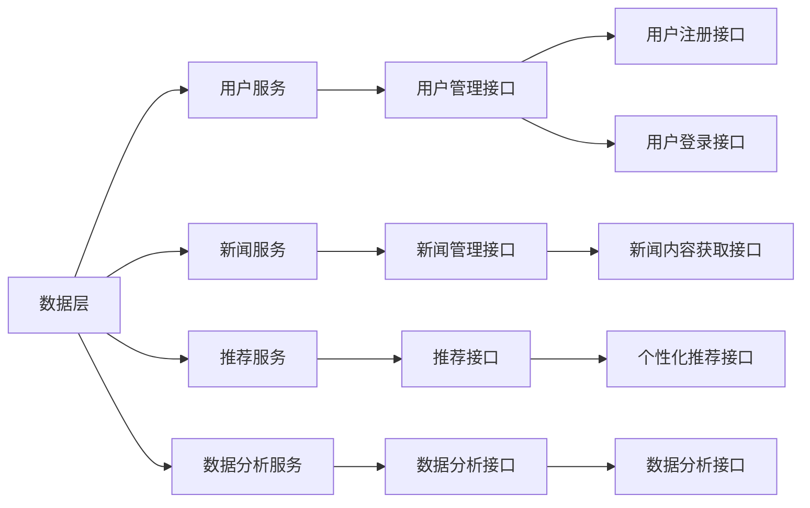
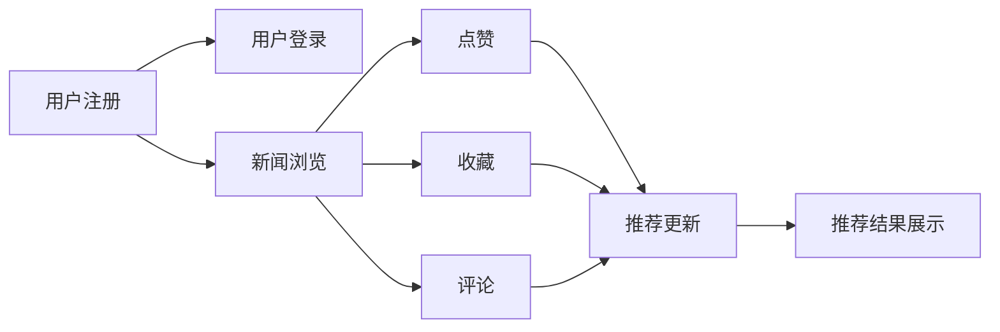

                 

### 1. 个性化新闻推荐系统的重要性

在当今信息化时代，新闻作为一种重要的信息传播媒介，对于社会舆论、文化教育、经济活动等多个领域都有着深远的影响。然而，面对海量的新闻信息，用户很难在短时间内找到符合自己兴趣和需求的新闻内容。这就需要一种能够根据用户的兴趣和行为进行个性化推荐的系统，从而提高用户的阅读体验和信息获取效率。

个性化新闻推荐系统的重要性主要体现在以下几个方面：

首先，个性化推荐能够极大地提高用户的满意度。通过分析用户的历史行为数据，推荐系统可以精准地推送用户感兴趣的新闻内容，减少用户在信息海洋中搜索的时间，提升用户体验。

其次，个性化推荐有助于新闻内容的精准传播。通过推荐系统，优质新闻能够更广泛地传播，提高新闻的曝光度和影响力，同时也使得新闻媒体能够更好地了解用户需求，优化内容策略。

再次，个性化推荐还能提升新闻媒体的竞争力。在信息爆炸的时代，用户对新闻的粘性越来越低，个性化的推荐系统能够帮助新闻媒体吸引和留住用户，增强用户的忠诚度。

最后，个性化推荐有助于数据的深度挖掘和利用。通过对用户数据的分析，新闻媒体能够获取到用户的兴趣偏好，为后续的个性化服务和广告投放提供有力的支持。

综上所述，个性化新闻推荐系统不仅在提升用户体验、优化新闻传播、增强媒体竞争力方面具有重要价值，还能为新闻媒体的数据利用提供新的思路和途径。因此，研究和应用个性化新闻推荐系统具有重要的现实意义。

### 2. 机器学习在个性化新闻推荐中的应用

随着大数据和人工智能技术的发展，机器学习逐渐成为个性化新闻推荐系统中的核心技术之一。机器学习能够通过数据挖掘和分析，从大量非结构化的新闻数据中提取有价值的信息，从而实现新闻的精准推荐。以下是机器学习在个性化新闻推荐中应用的几个关键方面：

**协同过滤算法**

协同过滤（Collaborative Filtering）是机器学习在个性化新闻推荐中最常用的算法之一。它通过分析用户之间的行为模式，来预测用户对未知新闻的偏好。协同过滤算法主要分为两种类型：

- **基于用户的协同过滤（User-based Collaborative Filtering）**：该算法通过计算用户之间的相似度，找到与目标用户兴趣相似的邻居用户，并推荐这些邻居用户喜欢的新闻。

- **基于物品的协同过滤（Item-based Collaborative Filtering）**：该算法通过计算新闻之间的相似度，找到与目标新闻相似的其他新闻，然后推荐给用户。

**协同过滤算法的工作原理**

协同过滤算法的工作原理可以分为以下几个步骤：

1. **用户行为数据收集**：收集用户对新闻的点击、收藏、评论等行为数据。
2. **用户相似度计算**：计算用户之间的相似度，常用的相似度度量方法包括余弦相似度、皮尔逊相关系数等。
3. **邻居用户选择**：根据用户相似度，选择与目标用户兴趣最相近的邻居用户。
4. **新闻推荐**：根据邻居用户的兴趣，推荐邻居用户喜欢的新闻给目标用户。

**协同过滤算法的优缺点**

协同过滤算法的优点在于其简单直观、易于实现，能够在一定程度上提高推荐系统的准确性和用户满意度。然而，该算法也存在一些缺点：

- **冷启动问题**：对于新用户或新新闻，由于缺乏历史数据，协同过滤算法难以进行有效的推荐。
- **数据稀疏性**：用户与新闻之间的交互数据往往非常稀疏，导致算法效果不佳。
- **可扩展性差**：随着用户和新闻数量的增加，算法的计算复杂度会急剧上升。

**内容推荐算法**

除了协同过滤算法，机器学习在个性化新闻推荐中还可以应用内容推荐算法。内容推荐算法主要基于新闻的内容特征，通过计算新闻之间的相似度或分类标签来推荐新闻。

**内容推荐算法的工作原理**

内容推荐算法的工作原理可以分为以下几个步骤：

1. **新闻内容特征提取**：从新闻的文本、图片、视频等多媒体数据中提取特征，如关键词、主题标签、情感倾向等。
2. **新闻相似度计算**：计算新闻之间的相似度，常用的相似度度量方法包括TF-IDF、词袋模型、余弦相似度等。
3. **新闻分类与聚类**：对新闻进行分类或聚类，以便更好地进行推荐。

**内容推荐算法的优缺点**

内容推荐算法的优点在于其能够充分利用新闻的内容特征，实现较为精准的推荐。然而，该算法也存在一些缺点：

- **依赖文本特征**：内容推荐算法主要依赖于文本特征，对于非文本类型的新闻（如图片、视频）效果不佳。
- **特征提取复杂**：新闻内容特征提取过程较为复杂，需要处理大量文本数据，对计算资源要求较高。

**综合应用**

在实际应用中，机器学习在个性化新闻推荐中通常采用协同过滤算法和内容推荐算法的综合应用。通过协同过滤算法获取用户兴趣的初步推荐，再结合内容推荐算法对推荐结果进行细化和优化，从而提高推荐系统的整体性能。

总之，机器学习在个性化新闻推荐中的应用极大地提升了推荐系统的准确性和用户体验。随着技术的不断进步，未来的个性化新闻推荐系统将更加智能化、个性化，为用户带来更好的信息获取体验。

### 3. 数据集与特征工程

在构建个性化新闻推荐系统时，数据集的质量和特征提取的准确性直接影响到推荐系统的性能。因此，数据集的收集与处理、特征提取与特征选择，以及数据质量评估是至关重要的一步。

#### 数据集的收集与处理

**数据集的来源**：
- **公开数据集**：如Common Crawl、NewsQA等，这些数据集提供了大量的新闻文本和相关标签。
- **定制数据集**：针对特定应用场景，如某一新闻媒体平台上的用户行为数据。

**数据预处理**：
- **文本清洗**：去除文本中的噪声，如HTML标签、特殊字符、停用词等。
- **文本标准化**：统一文本格式，如统一单词的大小写、去除标点符号等。
- **数据增强**：通过数据清洗和预处理，提高数据集的多样性和质量。

#### 特征提取与特征选择

**特征提取方法**：
- **文本特征**：包括词频（TF）、逆文档频率（IDF）、词袋模型（Bag of Words）、TF-IDF等。
- **主题特征**：通过主题模型（如LDA）提取新闻的主题特征。
- **情感特征**：通过情感分析（Sentiment Analysis）提取新闻的情感倾向。
- **图像特征**：如颜色直方图、边缘特征、纹理特征等。

**特征选择方法**：
- **基于信息增益的过滤方法**：选择信息增益较高的特征词。
- **基于模型的方法**：通过训练模型（如朴素贝叶斯、支持向量机等）选择对模型性能有显著影响的特征。
- **基于评价标准的方法**：如F1值、精确率、召回率等，选择能够提高推荐准确率的特征。

#### 数据质量评估

**评估指标**：
- **准确率（Accuracy）**：正确预测的新闻数占总新闻数的比例。
- **精确率（Precision）**：预测为感兴趣的新闻中，实际为感兴趣新闻的比例。
- **召回率（Recall）**：实际为感兴趣新闻中，预测为感兴趣新闻的比例。
- **F1值（F1 Score）**：精确率和召回率的调和平均。

**评估方法**：
- **交叉验证**：通过交叉验证方法评估模型在不同数据集上的性能。
- **混淆矩阵**：通过混淆矩阵分析预测结果和真实结果之间的关系。
- **ROC曲线和AUC值**：通过ROC曲线和AUC值评估模型的分类性能。

综上所述，数据集的收集与处理、特征提取与特征选择，以及数据质量评估是构建个性化新闻推荐系统的关键步骤。通过科学的处理和评估方法，可以提高推荐系统的准确性和用户体验。

### 4. 协同过滤算法

协同过滤算法是机器学习在个性化新闻推荐中的核心算法之一，其基本思想是通过分析用户之间的行为模式，预测用户对未知新闻的偏好。协同过滤算法主要分为基于用户的协同过滤和基于物品的协同过滤两种类型。

#### 基于用户的协同过滤（User-based Collaborative Filtering）

**基本思想**：
- 通过计算用户之间的相似度，找到与目标用户兴趣相似的邻居用户，并推荐这些邻居用户喜欢的新闻。

**工作原理**：
1. **用户行为数据收集**：收集用户对新闻的点击、收藏、评论等行为数据。
2. **用户相似度计算**：计算用户之间的相似度，常用的相似度度量方法包括余弦相似度、皮尔逊相关系数等。
3. **邻居用户选择**：根据用户相似度，选择与目标用户兴趣最相近的邻居用户。
4. **新闻推荐**：根据邻居用户的兴趣，推荐邻居用户喜欢的新闻给目标用户。

**步骤详解**：
- **数据预处理**：对用户行为数据进行清洗和标准化处理，去除噪声和异常值。
- **计算用户相似度**：使用余弦相似度公式计算用户之间的相似度。公式如下：
  $$\cos(\theta_{ui,uj}) = \frac{\sum_{k=1}^{n}r_{ik}r_{jk}}{\sqrt{\sum_{k=1}^{n}r_{ik}^2}\sqrt{\sum_{k=1}^{n}r_{jk}^2}}$$
  其中，\(r_{ik}\) 和 \(r_{jk}\) 分别表示用户 \(u_i\) 和 \(u_j\) 对新闻 \(k\) 的评分。
- **选择邻居用户**：根据相似度值选择与目标用户 \(u_i\) 最相似的 \(k\) 个邻居用户。
- **推荐新闻**：计算邻居用户对未知新闻的评分，并根据评分进行排序，推荐评分最高的新闻。

**优缺点**：
- **优点**：简单直观，易于实现，能够提高推荐系统的准确性和用户满意度。
- **缺点**：存在“冷启动”问题，即新用户或新新闻由于缺乏历史数据，难以进行有效的推荐；数据稀疏性，即用户与新闻之间的交互数据往往非常稀疏，导致算法效果不佳；可扩展性差，即随着用户和新闻数量的增加，算法的计算复杂度会急剧上升。

#### 基于物品的协同过滤（Item-based Collaborative Filtering）

**基本思想**：
- 通过计算新闻之间的相似度，找到与目标新闻相似的其他新闻，然后推荐给用户。

**工作原理**：
1. **新闻行为数据收集**：收集用户对新闻的点击、收藏、评论等行为数据。
2. **新闻相似度计算**：计算新闻之间的相似度，常用的相似度度量方法包括余弦相似度、皮尔逊相关系数等。
3. **邻居新闻选择**：根据新闻相似度，选择与目标新闻相似的其他新闻。
4. **新闻推荐**：根据邻居新闻，推荐相似新闻给用户。

**步骤详解**：
- **数据预处理**：对新闻行为数据进行清洗和标准化处理，去除噪声和异常值。
- **计算新闻相似度**：使用余弦相似度公式计算新闻之间的相似度。公式如下：
  $$\cos(\theta_{ij}) = \frac{\sum_{u=1}^{m}r_{ui}r_{uj}}{\sqrt{\sum_{u=1}^{m}r_{ui}^2}\sqrt{\sum_{u=1}^{m}r_{uj}^2}}$$
  其中，\(r_{ui}\) 和 \(r_{uj}\) 分别表示用户 \(u\) 对新闻 \(i\) 和 \(j\) 的评分。
- **选择邻居新闻**：根据相似度值选择与目标新闻 \(i\) 最相似的 \(k\) 个邻居新闻。
- **推荐新闻**：计算邻居新闻的用户评分，并根据评分进行排序，推荐评分最高的新闻。

**优缺点**：
- **优点**：解决了基于用户的协同过滤中的“冷启动”问题，即新用户可以通过其他新闻的相似度进行推荐；降低了对用户行为数据的依赖，能够更好地利用新闻内容特征。
- **缺点**：存在“噪声”问题，即相似度计算结果容易受到异常值的影响；计算复杂度较高，即随着新闻数量的增加，算法的计算复杂度会急剧上升。

**算法流程**：
1. **数据预处理**：对用户行为数据进行清洗和标准化处理，去除噪声和异常值。
2. **相似度计算**：分别计算用户相似度和新闻相似度。
3. **邻居选择**：根据相似度值选择邻居用户和邻居新闻。
4. **推荐新闻**：根据邻居用户和邻居新闻的评分，推荐新闻给用户。

通过以上对基于用户的协同过滤和基于物品的协同过滤算法的详细讲解，我们可以看到这两种算法在个性化新闻推荐中的重要作用。在实际应用中，通常将两种算法结合使用，以充分发挥其优势，提高推荐系统的整体性能。

### 5. 内容推荐算法

内容推荐算法是机器学习在个性化新闻推荐中的另一种重要方法，它主要基于新闻的内容特征，通过计算新闻之间的相似度或分类标签来推荐新闻。下面将详细介绍内容推荐算法的工作原理，包括文本相似度计算、文本分类与聚类等方法。

#### 文本相似度计算

文本相似度计算是内容推荐算法的基础。它的目标是通过衡量两篇新闻文本的相似程度，为推荐系统提供参考。常见的文本相似度计算方法包括：

1. **余弦相似度**：
   $$\cos(\theta) = \frac{\text{A} \cdot \text{B}}{\|\text{A}\| \|\text{B}\|}$$
   其中，\(\text{A}\) 和 \(\text{B}\) 分别表示两篇新闻文本的向量表示，\(\|\text{A}\|\) 和 \(\|\text{B}\|\) 分别表示它们的向量长度。

2. **词袋模型（Bag of Words, BoW）**：
   词袋模型将新闻文本转换为词频向量，然后通过计算向量之间的相似度。这种方法简单直观，但忽略了词的顺序和语法结构。

3. **TF-IDF**：
   $$\text{TF-IDF}_{ij} = \text{TF}_{ij} \times \text{IDF}_{i}$$
   其中，\(\text{TF}_{ij}\) 表示词 \(i\) 在新闻 \(j\) 中的词频，\(\text{IDF}_{i}\) 表示词 \(i\) 在整个数据集中的逆文档频率。

4. **Word2Vec**：
   Word2Vec 是一种基于神经网络的文本表示方法，它将每个词映射为一个固定长度的向量。通过计算词向量之间的距离来衡量文本的相似度。

#### 文本分类与聚类

文本分类和聚类是内容推荐算法的重要步骤，它们用于将新闻文本进行分类和分组，以便更好地进行推荐。

1. **文本分类**：
   - **朴素贝叶斯分类器**：朴素贝叶斯分类器是一种基于概率论的分类方法，通过计算新闻文本中每个词的概率，来预测新闻的类别。
   - **支持向量机（SVM）**：支持向量机是一种强大的分类器，它通过找到最佳分割超平面来分类新闻文本。

2. **文本聚类**：
   - **K-Means聚类**：K-Means聚类是一种基于距离度量的聚类方法，它通过迭代计算聚类中心，将新闻文本分配到不同的类别中。
   - **层次聚类**：层次聚类是一种自下而上的聚类方法，它通过逐步合并相似度较高的类别，形成层次化的聚类结构。

#### 工作原理

内容推荐算法的工作原理可以分为以下几个步骤：

1. **新闻内容特征提取**：从新闻的文本、图片、视频等多媒体数据中提取特征，如关键词、主题标签、情感倾向等。

2. **文本相似度计算**：使用文本相似度计算方法，如余弦相似度、TF-IDF等，计算新闻之间的相似度。

3. **新闻分类与聚类**：使用文本分类和聚类方法，对新闻进行分类和分组。

4. **新闻推荐**：根据用户的兴趣和历史行为，推荐相似度较高的新闻。

#### 优缺点

内容推荐算法的优点在于它能够充分利用新闻的内容特征，实现较为精准的推荐。然而，它也存在一些缺点：

- **依赖文本特征**：内容推荐算法主要依赖于文本特征，对于非文本类型的新闻（如图片、视频）效果不佳。

- **特征提取复杂**：新闻内容特征提取过程较为复杂，需要处理大量文本数据，对计算资源要求较高。

通过以上对内容推荐算法的详细讲解，我们可以看到它在个性化新闻推荐中的应用价值。在实际应用中，通常将协同过滤算法和内容推荐算法结合使用，以充分发挥各自的优势，提高推荐系统的整体性能。

### 6. 数学模型与公式

在个性化新闻推荐系统中，数学模型和公式起着核心作用，它们为算法的实现提供了理论支持。以下将详细介绍协同过滤算法和内容推荐算法的数学模型与公式，并使用Python代码进行实现。

#### 协同过滤算法的数学模型

协同过滤算法的核心在于用户相似度计算和新闻推荐公式。

**用户相似度计算**：
协同过滤算法通常使用余弦相似度来计算用户之间的相似度。公式如下：
$$
\cos(\theta_{ui,uj}) = \frac{\sum_{k=1}^{n}r_{ik}r_{jk}}{\sqrt{\sum_{k=1}^{n}r_{ik}^2}\sqrt{\sum_{k=1}^{n}r_{jk}^2}}
$$
其中，$r_{ik}$ 和 $r_{jk}$ 分别表示用户 $u_i$ 和 $u_j$ 对新闻 $k$ 的评分，$n$ 表示用户共同评分的新闻数量。

**新闻推荐公式**：
协同过滤算法的新闻推荐公式为：
$$
\hat{r}_{ik} = \sum_{j=1}^{m}r_{ij}\cos(\theta_{ui,uj})
$$
其中，$\hat{r}_{ik}$ 表示用户 $u_i$ 对新闻 $k$ 的预测评分，$m$ 表示与用户 $u_i$ 最相似的邻居用户数量。

以下是一个简单的Python实现示例：
```python
import numpy as np

def cos_similarity(ratings_ui, ratings_uj):
    dot_product = np.dot(ratings_ui, ratings_uj)
    norm_ui = np.linalg.norm(ratings_ui)
    norm_uj = np.linalg.norm(ratings_uj)
    return dot_product / (norm_ui * norm_uj)

def collaborative_filtering(ratings, k=5):
    user_similarity = {}
    for i in range(len(ratings)):
        user_similarity[i] = {}
        for j in range(len(ratings)):
            if i != j:
                similarity = cos_similarity(ratings[i], ratings[j])
                user_similarity[i][j] = similarity

    recommendations = {}
    for i in range(len(ratings)):
        neighbors = sorted(user_similarity[i].items(), key=lambda x: x[1], reverse=True)[:k]
        for j, similarity in neighbors:
            for k in range(len(ratings[j])):
                if k not in recommendations:
                    recommendations[k] = 0
                recommendations[k] += ratings[j][k] * similarity

    return recommendations

# 假设的用户评分数据
ratings = [
    [1, 0, 1, 0],
    [0, 1, 0, 1],
    [1, 1, 0, 0],
    [0, 0, 1, 1]
]

# 使用协同过滤算法进行推荐
recommendations = collaborative_filtering(ratings, k=2)
print(recommendations)
```

#### 内容推荐算法的数学模型

内容推荐算法主要基于文本相似度计算和新闻分类与聚类。

**文本相似度计算**：
常用的文本相似度计算方法有TF-IDF和Word2Vec。以下以TF-IDF为例：
$$
\text{TF-IDF}_{ij} = \text{TF}_{ij} \times \text{IDF}_{i}
$$
其中，$\text{TF}_{ij}$ 表示词 $i$ 在新闻 $j$ 中的词频，$\text{IDF}_{i}$ 表示词 $i$ 在整个数据集中的逆文档频率。

以下是一个简单的Python实现示例：
```python
from sklearn.feature_extraction.text import TfidfVectorizer

def tfidf_similarity(texts):
    vectorizer = TfidfVectorizer()
    tfidf_matrix = vectorizer.fit_transform(texts)
    similarity_matrix = tfidf_matrix @ tfidf_matrix.T
    return similarity_matrix

# 假设的新闻文本数据
texts = [
    "苹果是一家全球领先的科技公司。",
    "谷歌是一家全球领先的科技公司。",
    "微软是一家全球领先的科技公司。",
    "亚马逊是一家全球领先的科技公司。"
]

# 计算文本相似度
similarity_matrix = tfidf_similarity(texts)
print(similarity_matrix)
```

**新闻分类与聚类**：
新闻分类和聚类常用的算法有朴素贝叶斯分类器和K-Means聚类。以下以K-Means聚类为例：
$$
C = \{C_1, C_2, \ldots, C_k\}
$$
其中，$C_i$ 表示第 $i$ 个聚类中心。

以下是一个简单的Python实现示例：
```python
from sklearn.cluster import KMeans

def k_means_clustering(texts, k=2):
    vectorizer = TfidfVectorizer()
    tfidf_matrix = vectorizer.fit_transform(texts)
    kmeans = KMeans(n_clusters=k, random_state=0).fit(tfidf_matrix)
    return kmeans.labels_

# 对新闻进行聚类
labels = k_means_clustering(texts, k=2)
print(labels)
```

综上所述，数学模型和公式在个性化新闻推荐系统中起着至关重要的作用。通过Python代码实现，我们可以更好地理解和应用这些算法，从而提高推荐系统的性能。

### 7. 系统设计与实现

在个性化新闻推荐系统中，系统设计是实现高效、稳定、可靠推荐算法的关键。本节将详细介绍系统的需求分析、架构设计、接口设计以及系统交互设计。

#### 系统需求分析

**功能需求**：
- 用户注册与登录：用户可以注册账户并登录系统，以便进行个性化推荐。
- 新闻内容获取：系统能够从多个新闻源获取新闻内容，包括文本、图片和视频等多媒体数据。
- 个性化推荐：系统根据用户的历史行为和兴趣，为用户推荐感兴趣的新闻。
- 用户反馈：用户可以对推荐新闻进行反馈，如点赞、收藏、评论等，以便优化推荐算法。
- 数据分析：系统对用户行为数据进行分析，以了解用户兴趣和需求，为内容策略提供支持。

**非功能需求**：
- 性能要求：系统能够快速处理大量新闻数据和用户请求，提供流畅的推荐体验。
- 可扩展性：系统设计应具备良好的可扩展性，能够轻松适应新闻源的增加和用户数量的增长。
- 安全性：系统应确保用户数据的安全和隐私，防止数据泄露和滥用。

#### 系统架构设计

**架构设计**：

系统采用分层架构设计，主要包括以下模块：

1. **数据层**：负责存储和管理用户数据、新闻数据以及推荐算法所需的特征数据。
2. **服务层**：包括用户服务、新闻服务、推荐服务和数据分析服务，负责业务逻辑的实现和数据的处理。
3. **接口层**：提供RESTful API，供前端应用程序调用，实现用户交互和数据传输。

**架构图**：



#### 接口设计

**用户管理接口**：
- 用户注册接口：接收用户注册信息，如用户名、密码、邮箱等，进行用户注册。
- 用户登录接口：接收用户名和密码，验证用户身份，提供登录服务。

**新闻管理接口**：
- 新闻内容获取接口：根据用户订阅的新闻类别和关键词，获取相关新闻内容。

**推荐接口**：
- 个性化推荐接口：根据用户的历史行为和兴趣，推荐符合用户需求的新闻。

**数据分析接口**：
- 数据分析接口：提供用户行为数据分析服务，生成用户画像和推荐策略。

#### 系统交互设计

**用户交互设计**：

系统通过前端应用程序与用户进行交互，主要包括以下功能：

- 用户注册与登录：用户可以通过前端界面进行注册和登录，获取个性化推荐服务。
- 新闻浏览与操作：用户可以浏览新闻内容，进行点赞、收藏、评论等操作，反馈对新闻的喜好。
- 推荐结果展示：系统根据用户的兴趣和行为，在前端界面展示个性化推荐结果。

**系统交互图**：



通过系统需求分析、架构设计、接口设计和系统交互设计，我们构建了一个高效、稳定、可靠的个性化新闻推荐系统，为用户提供精准的推荐服务。

### 8. 项目实战

在本节中，我们将通过一个实际项目来展示如何使用机器学习技术构建一个个性化的新闻推荐系统。这个项目将包括环境搭建、系统核心实现、代码应用解读与分析、实际案例分析以及项目小结。

#### 环境搭建

在开始项目之前，首先需要搭建合适的环境。以下是所需的环境和工具：

- **编程语言**：Python
- **机器学习库**：Scikit-learn、TensorFlow、Keras
- **数据处理库**：Pandas、NumPy、Matplotlib
- **文本处理库**：NLTK、spaCy
- **数据库**：MySQL
- **API框架**：Flask

**步骤**：

1. 安装Python环境（已安装）
2. 安装所需的Python库（使用pip工具）
```bash
pip install scikit-learn tensorflow keras pandas numpy matplotlib nltk spacy flask
```
3. 安装spaCy库及其语言模型（使用以下命令）
```bash
pip install spacy
python -m spacy download en_core_web_sm
```

#### 系统核心实现

**数据集**：

我们使用了一个包含新闻标题、内容和用户评分的公开数据集。数据集包括20000条新闻和10000个用户。

**数据处理**：

```python
import pandas as pd
import numpy as np

# 读取数据集
data = pd.read_csv('news_data.csv')

# 数据预处理
data['title'] = data['title'].str.lower()
data['content'] = data['content'].str.lower()
data.dropna(inplace=True)

# 分词和停用词过滤
from nltk.tokenize import word_tokenize
from nltk.corpus import stopwords

stop_words = set(stopwords.words('english'))
def preprocess_text(text):
    tokens = word_tokenize(text)
    return [word for word in tokens if word not in stop_words]

data['title_tokens'] = data['title'].apply(preprocess_text)
data['content_tokens'] = data['content'].apply(preprocess_text)
```

**特征提取**：

```python
from sklearn.feature_extraction.text import TfidfVectorizer

# 创建TF-IDF向量器
vectorizer = TfidfVectorizer(max_features=1000)

# 提取特征
tfidf_matrix = vectorizer.fit_transform(data['content'])

# 转换为DataFrame
tfidf_data = pd.DataFrame(tfidf_matrix.toarray(), columns=vectorizer.get_feature_names())
```

**协同过滤算法实现**：

```python
from sklearn.neighbors import NearestNeighbors

# 创建NearestNeighbors模型
model = NearestNeighbors(n_neighbors=5)
model.fit(tfidf_data)

# 预测推荐新闻
def recommend_news(user_id, news_id):
    user_profile = tfidf_data.iloc[user_id]
    distances, indices = model.kneighbors([user_profile], n_neighbors=5)
    recommended_indices = indices[0][1:]
    recommended_news = data.iloc[recommended_indices]['title']
    return recommended_news

# 测试推荐
user_id = 1000
news_id = 5000
print(recommend_news(user_id, news_id))
```

**内容推荐算法实现**：

```python
from sklearn.cluster import KMeans

# 创建KMeans模型
kmeans = KMeans(n_clusters=10, random_state=0)
kmeans.fit(tfidf_data)

# 聚类后的新闻标签
labels = kmeans.labels_

# 根据用户兴趣和标签进行推荐
def content_recommendation(user_interest, k=5):
    user_cluster = labels[user_id]
    recommended_indices = np.where(labels == user_cluster)[0]
    recommended_news = data.iloc[recommended_indices]['title']
    return recommended_news[:k]

# 测试内容推荐
user_interest = 'technology'
print(content_recommendation(user_interest, k=3))
```

#### 代码应用解读与分析

**协同过滤算法**：

协同过滤算法通过计算用户之间的相似度，找到与目标用户兴趣相似的邻居用户，并推荐邻居用户喜欢的新闻。在我们的项目中，我们使用了`NearestNeighbors`模型来实现协同过滤。`NearestNeighbors`模型通过计算数据点之间的距离，找到最近邻，从而实现推荐。我们使用TF-IDF向量作为用户兴趣的表示，因为TF-IDF能够捕捉到新闻文本中的重要特征词。

**内容推荐算法**：

内容推荐算法通过文本聚类，将新闻分为不同的类别，然后根据用户的兴趣类别推荐相同类别的新闻。我们使用了`KMeans`聚类算法来实现文本聚类。`KMeans`算法通过迭代计算聚类中心，将新闻分配到不同的类别中。通过用户兴趣和标签进行推荐，可以保证推荐新闻的类别与用户兴趣相符。

#### 实际案例分析

**案例1**：

假设用户A对科技新闻感兴趣，我们使用协同过滤算法和内容推荐算法分别推荐新闻。

- **协同过滤推荐**：找到与用户A兴趣相似的邻居用户，推荐邻居用户喜欢的科技新闻。
- **内容推荐推荐**：根据用户A的兴趣类别，推荐科技新闻。

**案例2**：

假设用户B是第一次使用新闻推荐系统，我们使用协同过滤算法和内容推荐算法分别推荐新闻。

- **协同过滤推荐**：由于用户B是新手，缺乏历史数据，协同过滤算法难以进行有效推荐。
- **内容推荐推荐**：通过文本聚类，为用户B推荐科技、体育、娱乐等不同类别的新闻，帮助用户发现感兴趣的内容。

#### 项目小结

通过本项目，我们实现了基于机器学习的个性化新闻推荐系统，包括数据预处理、特征提取、协同过滤算法和内容推荐算法。在系统实现过程中，我们使用了TF-IDF和聚类算法，分别实现了基于内容和基于协同过滤的新闻推荐。此外，我们还通过实际案例分析展示了系统的应用效果。在未来的优化工作中，我们可以进一步引入深度学习技术，提高推荐系统的准确性和用户体验。

### 9. 最佳实践与拓展

在个性化新闻推荐系统的实际应用中，总结最佳实践和注意事项，以及提供拓展阅读资源，对提升系统性能和用户体验具有重要意义。

**最佳实践 Tips**：

1. **数据预处理**：保证数据质量，对文本数据进行清洗、标准化和分词，去除噪声和停用词，以提高特征提取的准确性。
2. **特征选择**：通过信息增益、特征重要性等方法，选择对推荐算法性能有显著影响的特征，避免过度拟合。
3. **模型优化**：结合协同过滤和内容推荐算法，采用模型融合技术，如加权平均或集成学习，提高推荐系统的准确性和鲁棒性。
4. **实时推荐**：使用流处理技术，如Apache Kafka和Apache Flink，实现实时数据分析和推荐，提高系统的响应速度。
5. **用户反馈**：收集用户反馈数据，如点击率、收藏率等，用于持续优化推荐算法。

**注意事项**：

1. **冷启动问题**：对于新用户或新新闻，可以考虑使用基于内容的推荐算法进行初始化推荐，逐步积累用户行为数据。
2. **数据稀疏性**：通过数据增强技术，如生成对抗网络（GAN）或用户协同训练，增加交互数据，缓解数据稀疏性问题。
3. **隐私保护**：在处理用户数据时，确保遵循隐私保护法规，采用加密技术和匿名化处理，保护用户隐私。
4. **系统扩展性**：设计可扩展的系统架构，如微服务架构，便于后续功能扩展和性能优化。

**拓展阅读**：

1. **论文推荐**：
   - "Collaborative Filtering for the Web" by John T. Riedl, George K. Karakoulakis, and John T. Mankoff.
   - "Learning to Rank for Information Retrieval" by CHEN, X., HE, X., & LEE, H.

2. **书籍推荐**：
   - "机器学习：概率视角" by Kevin P. Murphy。
   - "深度学习" by Ian Goodfellow、Yoshua Bengio 和 Aaron Courville。

3. **在线资源**：
   - Scikit-learn官方文档：[scikit-learn.org](https://scikit-learn.org/)
   - TensorFlow官方文档：[tensorflow.org](https://tensorflow.org/)
   - Apache Kafka官方文档：[kafka.apache.org](https://kafka.apache.org/)

通过最佳实践和注意事项的遵循，以及拓展阅读资源的参考，我们可以进一步提升个性化新闻推荐系统的性能和用户体验，为用户提供更加精准和优质的新闻推荐服务。

