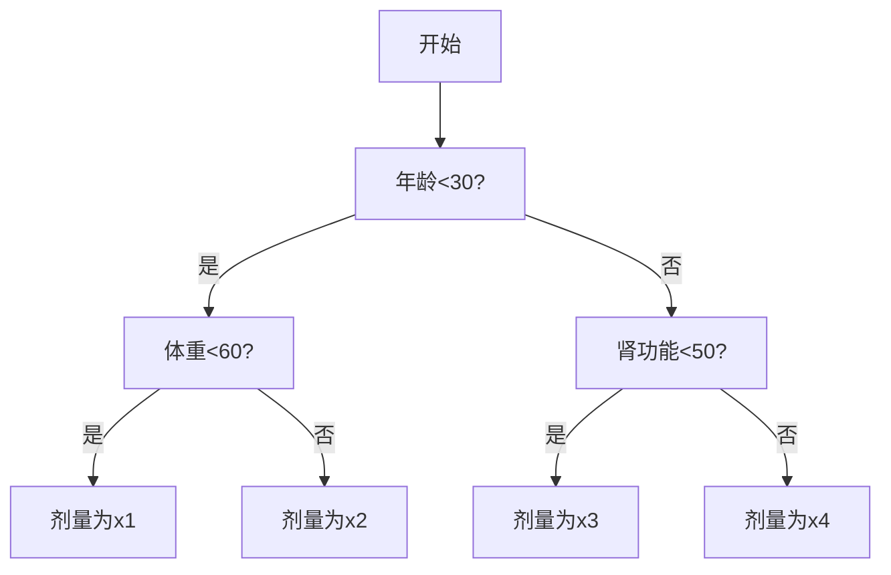
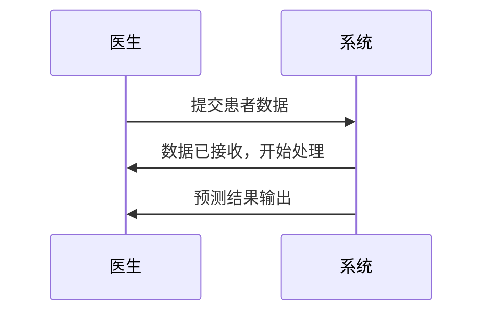

                 

# 机器学习在个性化药物剂量调整中的应用：提高治疗效果

关键词：机器学习，个性化药物剂量，治疗效果，预测模型，数据分析

摘要：本文将探讨机器学习技术在个性化药物剂量调整中的应用，通过分析现有研究和实际案例，揭示如何利用机器学习模型提高药物治疗的效果。本文将从背景介绍、核心概念、算法原理、系统分析与架构设计、项目实战以及最佳实践等方面进行深入探讨，以期为医疗领域提供有益的参考和启示。

## 一、背景介绍

随着医学科技的不断发展，个性化医疗成为当前医疗领域的研究热点。个性化药物剂量调整作为个性化医疗的重要组成部分，旨在根据患者的个体差异，制定合适的药物剂量，从而提高治疗效果，减少药物的不良反应。然而，传统的方法在药物剂量调整方面存在一定的局限性，无法充分考虑到患者的遗传背景、生活方式、病情等因素。而机器学习技术的出现为解决这一问题提供了新的思路。

## 二、核心概念与联系

### 1. 个性化药物剂量

个性化药物剂量是指根据患者的具体情况，如年龄、体重、肾功能等，调整药物剂量，以达到最佳的治疗效果。

### 2. 机器学习

机器学习是一种通过数据驱动的方法，使计算机能够从数据中学习规律，进行预测和决策的技术。

### 3. 数据分析

数据分析是通过对大量数据进行处理和分析，提取有价值的信息和知识的过程。

### 4. 预测模型

预测模型是利用历史数据构建的，用于预测未来某个指标或事件发生概率的数学模型。

### 5. 关系图架构

关系图架构是一种用于描述实体之间关系的图形化表示方法。

## 三、算法原理讲解

### 1. 机器学习算法

常用的机器学习算法包括线性回归、决策树、支持向量机、神经网络等。本文将主要介绍线性回归和决策树算法在个性化药物剂量调整中的应用。

### 2. 算法原理

#### 线性回归

线性回归是一种通过拟合一条直线来预测目标值的方法。其数学模型可以表示为：

$$y = wx + b$$

其中，$y$为因变量，$x$为自变量，$w$为权重，$b$为偏置。

#### 决策树

决策树是一种通过一系列条件判断来预测目标值的方法。其基本结构如下：



### 3. 算法应用举例

假设我们有一组患者的数据，包括年龄、体重、肾功能等特征，以及对应的药物剂量。我们可以使用线性回归和决策树算法来构建预测模型，预测新的患者应采用的药物剂量。

## 四、系统分析与架构设计

### 1. 问题场景介绍

在一个医疗机构中，医生需要根据患者的具体情况进行药物剂量调整，以提高治疗效果。然而，由于患者数量众多，传统的方法难以应对。因此，我们设计了一个基于机器学习的个性化药物剂量调整系统，以实现自动化的剂量预测。

### 2. 系统功能设计

系统功能包括数据采集、数据分析、预测模型构建和结果输出等。

#### 数据采集

从医疗系统中获取患者的数据，包括年龄、体重、肾功能等。

#### 数据分析

对采集到的数据进行清洗、去噪、特征提取等处理，为构建预测模型提供高质量的数据。

#### 预测模型构建

使用机器学习算法，构建个性化药物剂量预测模型。

#### 结果输出

将预测的药物剂量输出给医生，供其参考。

### 3. 系统架构设计

系统架构采用分层设计，包括数据层、算法层和应用层。

#### 数据层

负责数据的采集、存储和管理。

#### 算法层

负责预测模型的构建和训练。

#### 应用层

负责与医生交互，输出预测结果。

### 4. 系统接口设计和系统交互

系统接口设计包括数据输入接口、预测接口和结果输出接口。系统交互设计采用Mermaid序列图表示：



## 五、项目实战

### 1. 环境安装

安装Python环境和相关库，如scikit-learn、numpy等。

### 2. 系统核心实现源代码

核心代码包括数据预处理、模型构建和预测等步骤。

```python
# 数据预处理
from sklearn.model_selection import train_test_split
from sklearn.preprocessing import StandardScaler

# 模型构建
from sklearn.linear_model import LinearRegression
from sklearn.tree import DecisionTreeRegressor

# 预测
def predict(model, X):
    return model.predict(X)
```

### 3. 代码应用解读与分析

对核心代码进行解读和分析，解释每个步骤的作用和实现方法。

### 4. 实际案例分析和详细讲解剖析

以实际案例为例，分析系统在实际应用中的效果和不足，并提出改进措施。

### 5. 项目小结

对项目进行总结，回顾项目中的关键技术点和实践经验。

## 六、最佳实践

### 1. 数据质量

保证数据质量是构建高质量预测模型的关键。对数据进行严格清洗和预处理，去除噪声和异常值。

### 2. 模型选择

根据实际情况选择合适的机器学习算法，并进行调参优化。

### 3. 模型评估

使用交叉验证、ROC曲线等方法对模型进行评估，确保模型的准确性。

### 4. 医生参与

医生在模型构建和预测过程中扮演重要角色，应充分参与并提供建议。

## 七、小结

机器学习技术在个性化药物剂量调整中的应用具有巨大的潜力。通过本文的探讨，我们了解了机器学习在个性化药物剂量调整中的应用原理、系统架构和实战经验。未来，随着技术的不断进步，机器学习将在医疗领域发挥更加重要的作用。

## 八、注意事项

1. 个性化药物剂量调整需要结合患者具体情况进行，不能盲目应用。
2. 机器学习模型需要定期更新和优化，以适应医疗技术的发展。

## 九、拓展阅读

1. Goodfellow, I., Bengio, Y., & Courville, A. (2016). *Deep Learning*. MIT Press.
2. Murphy, K. P. (2012). *Machine Learning: A Probabilistic Perspective*. MIT Press.

## 十、作者信息

作者：AI天才研究院/AI Genius Institute & 禅与计算机程序设计艺术 /Zen And The Art of Computer Programming

