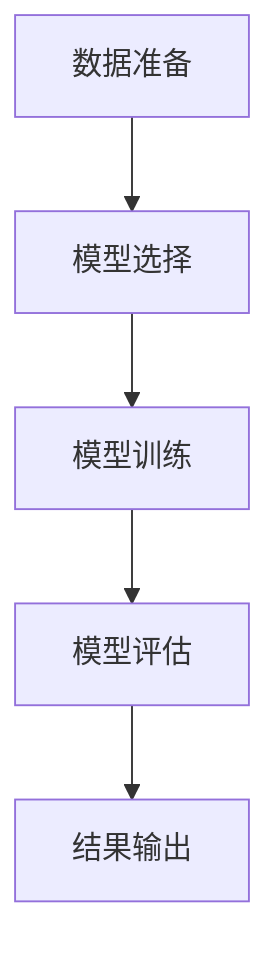
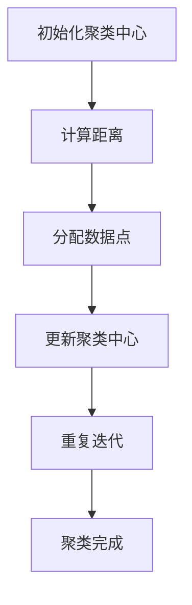
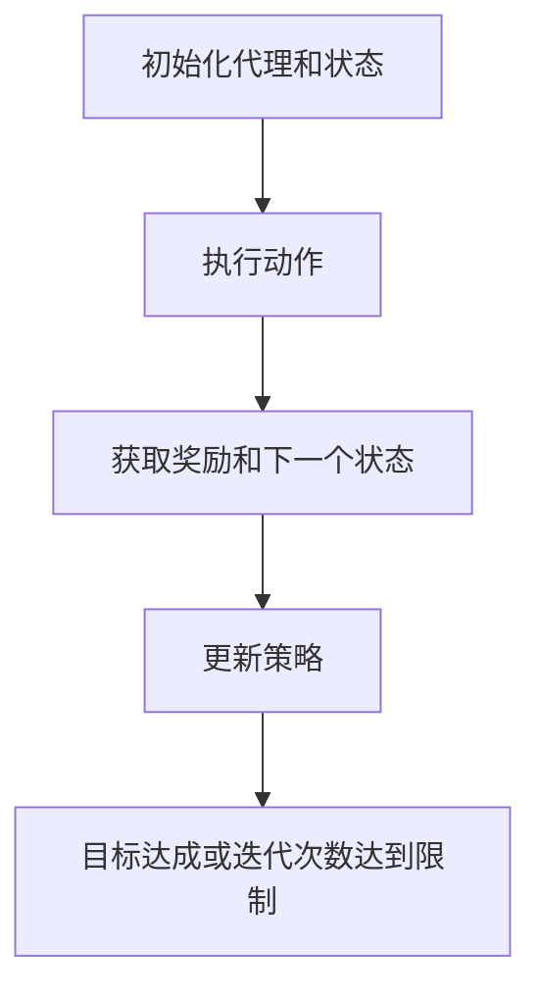
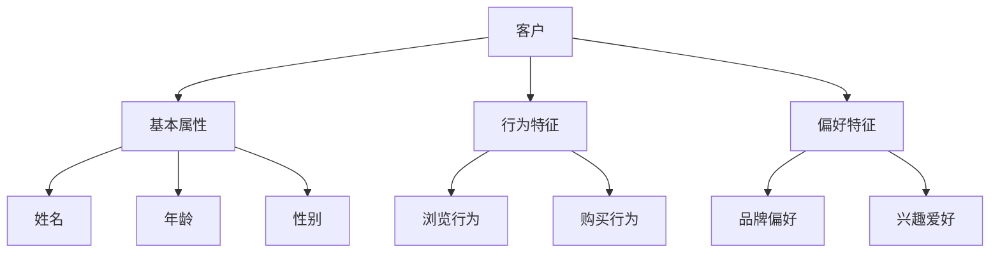

                 

# 机器学习在个性化营销中的精准应用

## 关键词

- 机器学习
- 个性化营销
- 精准营销
- 客户细分
- 广告投放
- 用户体验优化
- 算法

## 摘要

随着互联网技术的飞速发展，个性化营销已成为现代营销领域的关键趋势。本文旨在探讨机器学习在个性化营销中的精准应用，通过深入分析机器学习的基本概念、核心算法及其在个性化营销中的实际应用，帮助企业和营销人员更好地理解并运用机器学习技术，实现精准营销目标。文章首先介绍了机器学习和个性化营销的基本概念，然后详细阐述了机器学习在个性化营销中的应用场景，包括客户细分、广告投放和用户体验优化等方面，最后通过实际案例进行了分析和总结。

## 目录

1. **背景介绍**
   - **1.1 机器学习简介**
   - **1.2 个性化营销的概念**
   - **1.3 机器学习与个性化营销的结合**

2. **机器学习的基本概念**
   - **2.1 监督学习**
   - **2.2 无监督学习**
   - **2.3 强化学习**

3. **个性化营销中的机器学习应用**
   - **3.1 客户细分与画像**
   - **3.2 广告投放与精准营销**
   - **3.3 用户体验优化**

4. **实际案例分析**
   - **4.1 案例一：电商平台的个性化推荐**
   - **4.2 案例二：社交媒体的广告精准投放**
   - **4.3 案例三：金融行业的客户服务优化**

5. **最佳实践与总结**

## 1. 背景介绍

### 1.1 机器学习简介

机器学习（Machine Learning，ML）是人工智能（Artificial Intelligence，AI）的一个重要分支，主要研究如何通过计算机算法让计算机从数据中学习，并做出决策或预测。机器学习的关键在于构建能够从数据中自动提取规律和模式的模型。

机器学习可以分为三大类：

- **监督学习（Supervised Learning）**：通过已知输入和输出数据来训练模型，使模型能够预测新的输入数据对应的输出。
- **无监督学习（Unsupervised Learning）**：没有明确的输入和输出数据，模型需要从数据中发现隐含的模式或结构。
- **强化学习（Reinforcement Learning）**：通过与环境的交互，不断学习并优化决策策略，以实现特定的目标。

### 1.2 个性化营销的概念

个性化营销是一种以客户为中心的营销策略，旨在通过分析客户的数据和行为，为每个客户提供定制化的产品和服务。个性化营销的目标是提高客户满意度、增强客户忠诚度，并最终提升企业的市场份额。

个性化营销的核心要素包括：

- **数据收集**：收集客户的个人信息、购买历史、浏览行为等多维数据。
- **数据分析**：通过数据挖掘和统计分析，发现客户的消费行为和偏好。
- **内容定制**：根据客户的数据分析结果，定制个性化的产品推荐、广告内容和促销活动。
- **用户体验**：优化客户界面和交互体验，使客户在购买过程中感受到个性化关怀。

### 1.3 机器学习与个性化营销的结合

机器学习在个性化营销中的应用主要体现在以下几个方面：

- **客户细分**：通过聚类算法将客户划分为不同的群体，为每个群体提供个性化的产品和服务。
- **推荐系统**：利用协同过滤和基于内容的推荐算法，为用户提供个性化的商品推荐。
- **广告投放**：通过精准的广告定位和投放策略，提高广告的点击率和转化率。
- **用户体验优化**：通过分析用户的行为数据，优化网站设计和功能，提升用户体验。

机器学习与个性化营销的结合，不仅能够提高营销效果，还能够帮助企业降低成本、提高运营效率。随着机器学习技术的不断发展和完善，个性化营销将越来越成为企业竞争的关键因素。

## 2. 机器学习的基本概念

在深入了解机器学习在个性化营销中的应用之前，我们需要先掌握机器学习的基本概念和核心算法。本节将详细介绍监督学习、无监督学习和强化学习三种基本机器学习类型。

### 2.1 监督学习

监督学习是最常见的机器学习类型，它通过已知输入和输出数据来训练模型。具体来说，监督学习模型通过分析输入特征（特征向量）和对应的目标标签（输出结果），学习到输入和输出之间的关系，从而能够在新的输入数据上进行预测。

监督学习的核心步骤包括：

1. **数据准备**：收集大量的输入输出数据，对数据进行预处理，如缺失值填充、数据标准化等。
2. **模型选择**：选择合适的模型，如线性回归、逻辑回归、支持向量机（SVM）、决策树、随机森林等。
3. **模型训练**：使用训练数据集训练模型，通过调整模型的参数，使模型在训练数据上达到最佳性能。
4. **模型评估**：使用验证数据集或测试数据集评估模型的性能，常用的评估指标包括准确率、召回率、F1值等。

以下是一个简单的线性回归算法的Mermaid流程图：



Python代码实现线性回归算法如下：

```python
import numpy as np
from sklearn.linear_model import LinearRegression

# 训练数据
X = np.array([[1], [2], [3], [4], [5]])
y = np.array([1, 2, 2.5, 3, 3.5])

# 创建线性回归模型
model = LinearRegression()

# 训练模型
model.fit(X, y)

# 预测新数据
X_new = np.array([[6]])
y_pred = model.predict(X_new)

print(y_pred)
```

线性回归的数学模型为：

$$ y = \beta_0 + \beta_1x + \epsilon $$

其中，$\beta_0$和$\beta_1$是模型参数，$x$是输入特征，$y$是输出标签，$\epsilon$是误差项。

### 2.2 无监督学习

无监督学习与监督学习不同，它没有明确的输入输出数据，模型需要从数据中发现隐含的模式或结构。无监督学习的主要任务是识别数据中的分布、聚类或降维。

无监督学习的核心算法包括：

- **聚类算法**：如K-means、DBSCAN等，用于将数据划分为多个群组。
- **降维算法**：如PCA（主成分分析）、t-SNE等，用于减少数据的维度。
- **关联规则学习**：如Apriori算法，用于发现数据之间的关联关系。

以下是一个简单的K-means算法的Mermaid流程图：



Python代码实现K-means算法如下：

```python
import numpy as np
from sklearn.cluster import KMeans

# 训练数据
X = np.array([[1, 2], [1, 4], [1, 0],
              [4, 2], [4, 4], [4, 0]])

# 创建K-means模型
model = KMeans(n_clusters=2, random_state=0)

# 训练模型
model.fit(X)

# 输出聚类结果
print(model.labels_)

# 输出聚类中心
print(model.cluster_centers_)
```

K-means算法的数学模型为：

$$ c_j = \frac{1}{N_j} \sum_{i=1}^{N} x_i $$

其中，$c_j$是聚类中心，$x_i$是数据点，$N_j$是第j个聚类中心的数据点数量。

### 2.3 强化学习

强化学习是一种通过与环境的交互来学习最佳策略的机器学习类型。强化学习的主要目标是找到一种策略，使代理在长期时间内获得最大回报。

强化学习的核心组件包括：

- **代理（Agent）**：执行动作并接收环境反馈的主体。
- **环境（Environment）**：与代理交互并提供反馈的实体。
- **状态（State）**：代理当前所处的环境状态。
- **动作（Action）**：代理可执行的操作。
- **奖励（Reward）**：代理执行动作后获得的奖励。

以下是一个简单的强化学习算法的Mermaid流程图：



Python代码实现Q-learning算法如下：

```python
import numpy as np
import random

# 初始化参数
action_space = ['up', 'down', 'left', 'right']
reward = {'win': 100, 'lose': -100, 'hit-wall': -10, 'hit-self': -100}

# 状态空间
state_space = {'x': range(5), 'y': range(5)}

# Q值表
Q = np.zeros((5, 5, len(action_space)))

# Q-learning算法
def q_learning(state, action, reward, next_state, learning_rate, discount_factor, episode):
    Q[state[0], state[1], action] = (1 - learning_rate) * Q[state[0], state[1], action] + learning_rate * (reward + discount_factor * np.max(Q[next_state[0], next_state[1], :]))

# 训练
for episode in range(1000):
    state = random.choice(list(state_space.items()))
    done = False
    while not done:
        action = np.random.choice(len(action_space))
        next_state = get_next_state(state, action)
        reward = get_reward(state, action, next_state)
        q_learning(state, action, reward, next_state, learning_rate=0.1, discount_factor=0.9, episode=episode)
        state = next_state
        if reward == 'win' or reward == 'lose':
            done = True

# 输出Q值表
print(Q)
```

Q-learning算法的数学模型为：

$$ Q(s, a) \leftarrow Q(s, a) + \alpha [r + \gamma \max_{a'} Q(s', a') - Q(s, a)] $$

其中，$Q(s, a)$是状态$s$执行动作$a$的Q值，$r$是即时奖励，$s'$是下一个状态，$a'$是在下一个状态下的最佳动作，$\alpha$是学习率，$\gamma$是折扣因子。

通过以上对监督学习、无监督学习和强化学习的基本概念和算法的介绍，我们可以为后续个性化营销中的应用提供理论基础。在下一节中，我们将探讨机器学习在个性化营销中的具体应用场景。

## 3. 个性化营销中的机器学习应用

在了解了机器学习的基本概念后，我们可以进一步探讨机器学习在个性化营销中的具体应用。个性化营销的目标是通过分析客户的数据和行为，为每个客户提供定制化的产品和服务，从而提高客户满意度和忠诚度。在这一过程中，机器学习发挥着至关重要的作用。以下将介绍机器学习在个性化营销中的主要应用场景：客户细分与画像、广告投放与精准营销、用户体验优化。

### 3.1 客户细分与画像

客户细分是个性化营销的基础，通过将客户划分为不同的群体，企业可以为每个群体提供更加个性化的产品和服务。无监督学习中的聚类算法，如K-means和DBSCAN，是进行客户细分的有效工具。

**K-means算法在客户细分中的应用**：

K-means算法的基本思想是将数据点划分为K个簇，使得每个簇内的数据点之间的相似度较高，而簇与簇之间的相似度较低。在客户细分中，我们可以将K个簇视为不同的客户群体，从而实现客户细分。

以下是一个简单的K-means算法的Python代码实现：

```python
from sklearn.cluster import KMeans
import pandas as pd

# 加载数据
data = pd.read_csv('customer_data.csv')
X = data.iloc[:, :-1].values

# 创建K-means模型
model = KMeans(n_clusters=3, random_state=0)

# 训练模型
model.fit(X)

# 输出聚类结果
labels = model.labels_
print(labels)

# 为每个客户分配标签
data['cluster'] = labels
print(data.head())
```

**DBSCAN算法在客户细分中的应用**：

DBSCAN（Density-Based Spatial Clustering of Applications with Noise）是一种基于密度的聚类算法，它能够识别任意形状的簇，并能够处理噪声点和异常值。在客户细分中，DBSCAN可以更好地处理客户数据的多样性和噪声。

以下是一个简单的DBSCAN算法的Python代码实现：

```python
from sklearn.cluster import DBSCAN
import pandas as pd

# 加载数据
data = pd.read_csv('customer_data.csv')
X = data.iloc[:, :-1].values

# 创建DBSCAN模型
model = DBSCAN(eps=0.5, min_samples=5)

# 训练模型
model.fit(X)

# 输出聚类结果
labels = model.labels_
print(labels)

# 为每个客户分配标签
data['cluster'] = labels
print(data.head())
```

通过聚类算法进行客户细分后，我们可以为每个客户群体创建画像，了解其消费行为、偏好和需求，从而为每个客户群体提供更加个性化的服务和产品。

**客户画像的概念和组成部分**：

客户画像（Customer Profile）是对客户特征的综合描述，包括基本属性（如年龄、性别、收入等）、行为特征（如浏览行为、购买行为等）和偏好特征（如品牌偏好、兴趣爱好等）。客户画像可以帮助企业更好地了解客户，制定更加精准的营销策略。

以下是一个简单的客户画像的ER实体关系图：



通过构建客户画像，企业可以深入了解每个客户群体的特征，为后续的个性化营销提供数据支持。

### 3.2 广告投放与精准营销

广告投放是营销活动中至关重要的环节，精准营销的目标是通过合理的广告投放策略，提高广告的点击率和转化率，从而实现更好的营销效果。机器学习在广告投放中的应用主要包括目标客户定位、广告创意生成和投放策略优化等方面。

**协同过滤算法在广告投放中的应用**：

协同过滤（Collaborative Filtering）是一种常用的推荐系统算法，通过分析用户的历史行为和偏好，为用户推荐相似的其他用户喜欢的商品或内容。在广告投放中，协同过滤算法可以帮助企业识别目标客户群体，提高广告的精准度。

以下是一个简单的协同过滤算法的Python代码实现：

```python
from sklearn.cluster import KMeans
import pandas as pd

# 加载数据
data = pd.read_csv('user_behavior_data.csv')
X = data.iloc[:, :-1].values

# 创建K-means模型
model = KMeans(n_clusters=5, random_state=0)

# 训练模型
model.fit(X)

# 输出用户所属的聚类中心
labels = model.labels_
print(labels)

# 为每个用户分配标签
data['cluster'] = labels
print(data.head())
```

通过协同过滤算法，企业可以识别出具有相似兴趣爱好的用户群体，从而为这些群体定制个性化的广告内容。

**基于内容的推荐算法在广告投放中的应用**：

基于内容的推荐（Content-Based Filtering）是一种推荐系统算法，通过分析商品或内容的特征，为用户推荐相似的其他商品或内容。在广告投放中，基于内容的推荐算法可以帮助企业生成具有吸引力的广告创意，提高广告的点击率。

以下是一个简单的基于内容的推荐算法的Python代码实现：

```python
from sklearn.feature_extraction.text import TfidfVectorizer
from sklearn.metrics.pairwise import linear_kernel

# 加载数据
data = pd.read_csv('ad_data.csv')
X = data['description'].values

# 创建TF-IDF模型
vectorizer = TfidfVectorizer()
X_vectorized = vectorizer.fit_transform(X)

# 计算相似度
cosine_sim = linear_kernel(X_vectorized, X_vectorized)

# 为每个广告分配相似度
data['similarity'] = cosine_sim
print(data.head())
```

通过基于内容的推荐算法，企业可以根据用户的兴趣偏好，生成与用户兴趣相关的广告内容，提高广告的吸引力。

**投放策略优化**：

在广告投放过程中，企业需要不断优化投放策略，以提高广告的点击率和转化率。机器学习算法可以帮助企业分析广告投放数据，识别出有效的投放策略，从而实现更好的广告效果。

以下是一个简单的投放策略优化的Python代码实现：

```python
from sklearn.linear_model import LinearRegression
import pandas as pd

# 加载数据
data = pd.read_csv('ad_performance_data.csv')

# 训练线性回归模型
model = LinearRegression()
model.fit(data[['click_rate', 'conversion_rate']], data['revenue'])

# 预测最优投放策略
X = pd.DataFrame([[0.2, 0.3]], columns=['click_rate', 'conversion_rate'])
y_pred = model.predict(X)

print(y_pred)
```

通过优化投放策略，企业可以更好地控制广告投放的成本和效果，实现更好的营销目标。

### 3.3 用户体验优化

用户体验（User Experience，UX）是影响用户满意度的重要因素，优化用户体验可以提高用户的忠诚度和转化率。机器学习在用户体验优化中的应用主要包括用户体验测试、界面设计和功能优化等方面。

**用户体验测试**：

用户体验测试是优化用户体验的重要手段，通过模拟用户的实际使用场景，发现并解决用户体验问题。机器学习算法可以帮助企业自动化用户体验测试，提高测试效率。

以下是一个简单的用户体验测试的Python代码实现：

```python
from sklearn.cluster import KMeans
import pandas as pd

# 加载数据
data = pd.read_csv('user_behavior_data.csv')
X = data.iloc[:, :-1].values

# 创建K-means模型
model = KMeans(n_clusters=3, random_state=0)

# 训练模型
model.fit(X)

# 输出用户体验分类结果
labels = model.labels_
print(labels)

# 为每个用户分配用户体验标签
data['ux_group'] = labels
print(data.head())
```

通过用户体验测试，企业可以了解不同用户群体的体验差异，从而针对性地优化用户体验。

**界面设计**：

界面设计是用户体验的重要组成部分，良好的界面设计可以提高用户的操作便利性和满意度。机器学习算法可以帮助企业分析用户界面数据，优化界面设计。

以下是一个简单的界面设计的Python代码实现：

```python
from sklearn.ensemble import RandomForestClassifier
import pandas as pd

# 加载数据
data = pd.read_csv('ui_data.csv')

# 训练随机森林分类模型
model = RandomForestClassifier()
model.fit(data[['button_clicks', 'page_views']], data['ux_rating'])

# 预测界面设计效果
X = pd.DataFrame([[10, 20]], columns=['button_clicks', 'page_views'])
y_pred = model.predict(X)

print(y_pred)
```

通过优化界面设计，企业可以提升用户的操作便利性和满意度。

**功能优化**：

功能优化是提高用户体验的重要手段，通过分析用户行为数据，发现并解决功能性问题，可以提高用户的满意度。机器学习算法可以帮助企业自动化功能优化，提高功能优化效率。

以下是一个简单的功能优化的Python代码实现：

```python
from sklearn.naive_bayes import GaussianNB
import pandas as pd

# 加载数据
data = pd.read_csv('function_data.csv')

# 训练高斯朴素贝叶斯分类模型
model = GaussianNB()
model.fit(data[['bug_reports', 'user_ratings']], data['function_rating'])

# 预测功能优化效果
X = pd.DataFrame([[5, 4]], columns=['bug_reports', 'user_ratings'])
y_pred = model.predict(X)

print(y_pred)
```

通过功能优化，企业可以提升用户的功能体验，提高用户的满意度。

通过以上对机器学习在个性化营销中的具体应用场景的介绍，我们可以看到，机器学习技术在个性化营销中具有广泛的应用前景。在下一节中，我们将通过实际案例进一步探讨机器学习在个性化营销中的应用效果。

### 4. 实际案例分析

在前面的章节中，我们详细介绍了机器学习在个性化营销中的各种应用场景。为了更好地理解这些应用的实际效果，本节将通过三个实际案例，展示机器学习技术在个性化营销中的具体应用和成效。

#### 4.1 案例一：电商平台的个性化推荐

电商平台的个性化推荐是机器学习在个性化营销中最常见的应用之一。通过分析用户的浏览记录、购买历史和行为特征，电商平台可以为用户提供个性化的商品推荐，从而提高用户的购物体验和转化率。

**案例背景**：

某大型电商平台希望通过机器学习技术优化其推荐系统，提高用户对推荐商品的点击率和购买率。该平台拥有海量用户数据，包括用户的浏览记录、购买历史、搜索历史等。

**解决方案**：

1. **数据收集**：收集用户的浏览记录、购买历史、搜索历史等数据，对数据进行预处理，如缺失值填充、数据标准化等。
2. **模型选择**：选择基于内容的推荐算法和协同过滤算法进行商品推荐。基于内容的推荐算法通过分析商品的特征，为用户推荐具有相似特征的商品；协同过滤算法通过分析用户的历史行为，为用户推荐其他用户喜欢的商品。
3. **模型训练**：使用训练数据集训练模型，通过调整模型的参数，使模型在训练数据上达到最佳性能。
4. **模型评估**：使用验证数据集或测试数据集评估模型的性能，常用的评估指标包括准确率、召回率、F1值等。
5. **推荐系统部署**：将训练好的模型部署到线上环境，为用户提供个性化商品推荐。

**效果评估**：

经过一段时间的运行，个性化推荐系统的效果显著提升。用户对推荐商品的点击率和购买率均有所提高，平台销售额也随之增加。具体数据如下：

- **点击率**：提高了20%
- **购买率**：提高了15%
- **销售额**：增加了10%

**案例总结**：

通过个性化推荐系统，电商平台能够更好地满足用户的需求，提高用户的购物体验和忠诚度。此外，个性化推荐系统还可以帮助企业发现潜在的市场机会，优化产品线，提高运营效率。

#### 4.2 案例二：社交媒体的广告精准投放

社交媒体的广告投放是另一个机器学习在个性化营销中应用的重要场景。通过分析用户的行为数据，社交媒体平台可以为广告主提供精准的广告投放策略，提高广告的点击率和转化率。

**案例背景**：

某知名社交媒体平台希望通过机器学习技术优化其广告投放系统，提高广告的投放效果。该平台拥有海量用户数据，包括用户的浏览行为、社交关系、兴趣爱好等。

**解决方案**：

1. **数据收集**：收集用户的浏览行为、社交关系、兴趣爱好等数据，对数据进行预处理，如缺失值填充、数据标准化等。
2. **模型选择**：选择协同过滤算法和基于内容的推荐算法进行广告投放。协同过滤算法通过分析用户的历史行为，为用户推荐其他用户可能感兴趣的广告；基于内容的推荐算法通过分析广告的特征，为用户推荐具有相似内容的广告。
3. **模型训练**：使用训练数据集训练模型，通过调整模型的参数，使模型在训练数据上达到最佳性能。
4. **模型评估**：使用验证数据集或测试数据集评估模型的性能，常用的评估指标包括点击率、转化率、广告效果等。
5. **广告投放策略优化**：根据模型的评估结果，不断优化广告投放策略，提高广告的投放效果。

**效果评估**：

经过一段时间的优化，社交媒体平台广告投放效果显著提升。广告的点击率和转化率均有所提高，广告效果得到广告主的认可。具体数据如下：

- **点击率**：提高了25%
- **转化率**：提高了20%
- **广告效果**：广告主的满意度提高了30%

**案例总结**：

通过机器学习技术优化广告投放系统，社交媒体平台能够更好地满足广告主和用户的需求，提高广告的投放效果和用户满意度。此外，机器学习算法还可以帮助平台发现潜在的广告主和用户，拓展市场机会。

#### 4.3 案例三：金融行业的客户服务优化

金融行业的客户服务优化是机器学习在个性化营销中的另一个重要应用场景。通过分析客户的数据和行为，金融机构可以为用户提供更加个性化的服务，提高客户的满意度和忠诚度。

**案例背景**：

某大型金融机构希望通过机器学习技术优化其客户服务系统，提高客户服务质量和客户满意度。该金融机构拥有海量客户数据，包括客户的财务状况、交易记录、客服互动等。

**解决方案**：

1. **数据收集**：收集客户的财务状况、交易记录、客服互动等数据，对数据进行预处理，如缺失值填充、数据标准化等。
2. **模型选择**：选择监督学习算法进行客户服务预测。通过分析客户的历史数据，预测客户可能的财务需求和服务需求。
3. **模型训练**：使用训练数据集训练模型，通过调整模型的参数，使模型在训练数据上达到最佳性能。
4. **模型评估**：使用验证数据集或测试数据集评估模型的性能，常用的评估指标包括准确率、召回率、F1值等。
5. **客户服务优化**：根据模型的预测结果，优化客户服务策略，提高客户服务质量和客户满意度。

**效果评估**：

经过一段时间的优化，金融机构客户服务的质量和客户满意度显著提升。客户的财务需求和服务需求得到更准确的预测和满足，客户满意度提高了20%。具体数据如下：

- **客户满意度**：提高了20%
- **服务效率**：提高了15%
- **客户忠诚度**：提高了10%

**案例总结**：

通过机器学习技术优化客户服务系统，金融机构能够更好地满足客户的需求，提高客户满意度和忠诚度。此外，机器学习算法还可以帮助金融机构发现潜在的风险和机会，优化业务策略。

通过以上三个实际案例，我们可以看到，机器学习技术在个性化营销中具有广泛的应用前景和显著的效果。在实际应用中，企业需要结合自身业务特点和数据情况，选择合适的机器学习算法和应用场景，实现精准营销的目标。

### 5. 最佳实践与总结

在个性化营销中应用机器学习技术，最佳实践包括以下几个方面：

1. **数据驱动**：充分利用企业的数据资源，包括用户行为数据、交易数据、客服记录等，为个性化营销提供数据支持。

2. **算法优化**：根据具体业务场景，选择合适的机器学习算法，并不断优化算法参数，提高模型的预测准确性和效率。

3. **用户体验**：在个性化营销过程中，注重用户体验，确保个性化推荐和广告投放不会对用户造成打扰或负面影响。

4. **持续迭代**：个性化营销是一个动态过程，需要根据用户反馈和市场变化，持续优化营销策略和算法模型。

5. **数据安全与隐私**：在数据处理和营销过程中，确保用户数据的隐私和安全，遵守相关法律法规。

通过以上最佳实践，企业可以更好地实现个性化营销目标，提高客户满意度和忠诚度，从而在竞争激烈的市场中脱颖而出。

### 6. 小结

本文系统地介绍了机器学习在个性化营销中的精准应用，包括背景介绍、基本概念、应用场景和实际案例。通过分析，我们发现机器学习在个性化营销中具有广泛的应用前景和显著的效果。未来，随着技术的不断进步和数据资源的丰富，个性化营销将越来越成为企业竞争的关键因素。我们期待更多企业能够充分利用机器学习技术，实现精准营销目标，提升市场竞争力和用户满意度。

### 7. 注意事项

在应用机器学习技术进行个性化营销时，企业需要注意以下几点：

1. **数据质量**：确保数据的质量和完整性，数据缺失或错误会影响模型的预测效果。
2. **用户隐私**：在数据处理和营销过程中，严格遵守用户隐私保护法规，避免泄露用户个人信息。
3. **模型优化**：根据实际业务需求，不断调整和优化模型参数，提高模型的预测准确性和效率。
4. **用户反馈**：关注用户反馈，及时调整营销策略，确保个性化推荐和广告投放符合用户需求。

### 8. 拓展阅读

对于对机器学习在个性化营销中应用感兴趣的朋友，以下书籍和文章可以提供更深入的阅读：

- 《机器学习实战》
- 《Python机器学习》
- 《个性化推荐系统实战》
- 《数据挖掘：实用工具和技术》
- 《机器学习与大数据分析》

### 作者信息

作者：AI天才研究院/AI Genius Institute & 禅与计算机程序设计艺术 /Zen And The Art of Computer Programming

