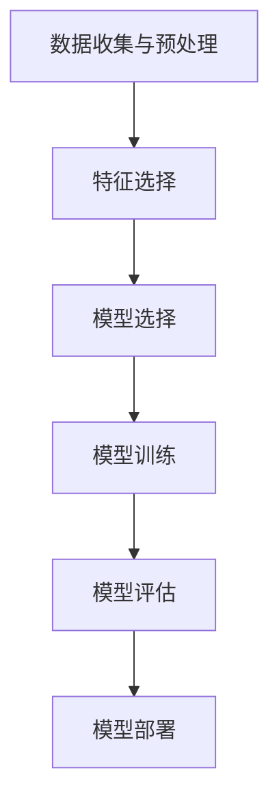

                 

# 机器学习在信用评分系统中的应用

## 关键词

- 机器学习
- 信用评分系统
- 数据挖掘
- 特征工程
- 算法优化

## 摘要

本文旨在探讨机器学习在信用评分系统中的应用，通过详细的案例分析和技术解读，阐述机器学习模型在信用评估中的重要作用。文章首先介绍了信用评分系统的基本概念、问题和挑战，然后深入分析了常用的机器学习算法及其在信用评分系统中的应用。通过具体的代码示例和数学模型解释，读者可以更直观地理解机器学习在信用评分系统中的实现过程。最后，文章总结了项目实战经验，提供了实用的最佳实践和注意事项，为读者进一步研究和应用机器学习技术提供了有益的参考。

## 目录

1. 引言
2. 信用评分系统的核心概念
   - 2.1 数据收集与预处理
   - 2.2 特征工程
   - 2.3 模型选择与训练
   - 2.4 信用评分模型的主要类型
   - 2.5 机器学习模型的选择标准
   - 2.6 核心概念对比与分析
3. 机器学习算法原理
   - 3.1 算法流程图
   - 3.2 Python代码实现
   - 3.3 算法原理讲解
   - 3.4 举例说明
4. 数学模型和公式详解
   - 4.1 数学模型介绍
   - 4.2 公式详解
   - 4.3 举例说明
5. 信用评分系统的架构设计
   - 5.1 项目介绍
   - 5.2 系统功能设计
   - 5.3 系统架构设计
   - 5.4 系统接口设计
   - 5.5 系统交互设计
6. 机器学习在信用评分系统的项目实战
   - 6.1 环境安装
   - 6.2 系统核心实现
   - 6.3 代码应用解读与分析
   - 6.4 实际案例分析
   - 6.5 项目小结
7. 最佳实践、小结、注意事项、拓展阅读

## 1. 引言

在现代社会中，信用评分系统已经成为金融、保险、电商等领域不可或缺的工具。信用评分系统通过对个人或企业的信用历史、财务状况、还款能力等多方面因素进行分析，为金融机构和信用提供方提供信用评估和风险控制依据。然而，随着大数据和机器学习技术的发展，传统的信用评分系统面临着巨大的挑战和变革。

机器学习作为人工智能的重要分支，以其强大的数据处理和分析能力，为信用评分系统带来了新的思路和方法。本文将详细探讨机器学习在信用评分系统中的应用，通过以下步骤逐步分析：

1. **信用评分系统的核心概念**：介绍信用评分系统的基本概念、组成部分和问题背景。
2. **机器学习算法原理**：讲解常见的机器学习算法及其在信用评分系统中的应用，包括算法流程、Python代码实现和举例说明。
3. **数学模型和公式详解**：阐述机器学习算法背后的数学模型和公式，通过LaTeX格式和具体示例进行详细解释。
4. **信用评分系统的架构设计**：介绍信用评分系统的架构设计，包括项目场景、系统功能、架构设计、接口设计和交互设计。
5. **项目实战**：通过实际项目案例，展示机器学习在信用评分系统中的应用过程，包括环境安装、系统实现、代码解析和案例分析。
6. **最佳实践、小结、注意事项和拓展阅读**：总结机器学习在信用评分系统中的应用经验，提供实用建议和进一步阅读资料。

通过以上步骤，本文旨在为读者提供一个全面、系统的机器学习在信用评分系统中的应用指南，帮助读者深入了解该领域的前沿技术和实际应用。

## 2. 信用评分系统的核心概念

### 2.1 数据收集与预处理

信用评分系统的第一步是数据收集与预处理。数据来源可以包括金融机构的内部数据、公共信用数据、社交媒体数据等。这些数据通常包含借款人的基本信息（如年龄、性别、婚姻状况、职业等），财务信息（如收入、负债、资产等），以及历史信用行为（如还款记录、逾期情况等）。

数据收集后的预处理步骤至关重要。首先，需要进行数据清洗，去除重复、缺失和不完整的数据。其次，需要对数据进行归一化或标准化处理，确保各特征数据在同一量级上。最后，进行特征工程，提取对信用评分有显著影响的关键特征，如信用逾期次数、信用额度、还款能力等。

### 2.2 特征工程

特征工程是信用评分系统成功的关键。有效的特征提取不仅能提高模型的预测准确性，还能降低模型的复杂度和计算成本。在特征工程过程中，需要考虑以下方面：

- **原始特征提取**：从原始数据中直接提取有用的特征，如借款人的年龄、收入、贷款额度等。
- **派生特征提取**：通过计算原始特征的组合或衍生特征，以增强模型的预测能力。例如，借款人的还款频率、还款周期等。
- **特征选择**：通过统计方法或机器学习方法，筛选出对信用评分有显著影响的特征，去除无关或冗余的特征。

### 2.3 模型选择与训练

在信用评分系统中，常用的机器学习算法包括线性回归、逻辑回归、决策树、随机森林、支持向量机和神经网络等。模型选择和训练过程如下：

- **模型选择**：根据问题的性质和数据特征，选择合适的机器学习算法。例如，对于线性可分的数据，可以选择线性回归或支持向量机；对于非线性数据，可以选择决策树或神经网络。
- **模型训练**：使用训练集数据对选定的模型进行训练。训练过程包括数据的预处理、模型的参数调整和优化等。
- **模型评估**：使用验证集或测试集评估模型的性能。常用的评估指标包括准确率、召回率、精确率、F1值等。

### 2.4 信用评分模型的主要类型

信用评分模型主要分为以下几类：

- **统计模型**：基于统计学原理，如线性回归、逻辑回归等。这类模型简单、易于解释，但性能可能不如机器学习模型。
- **机器学习模型**：如决策树、随机森林、支持向量机等。这类模型能够处理大量特征和非线性数据，性能优于统计模型。
- **深度学习模型**：如神经网络、卷积神经网络等。这类模型具有强大的非线性表示能力和适应性，能够处理复杂的数据模式。

### 2.5 机器学习模型的选择标准

在选择机器学习模型时，需要考虑以下标准：

- **性能**：模型在验证集或测试集上的性能指标，如准确率、召回率、F1值等。
- **可解释性**：模型是否易于解释和理解，这对于信用评分系统来说尤为重要。
- **计算复杂度**：模型的计算复杂度，如训练时间、内存消耗等。
- **适用性**：模型对数据的适应性和泛化能力。

### 2.6 核心概念对比与分析

以下是信用评分系统中几个核心概念的对比与分析：

| 核心概念 | 定义 | 特点 | 应用场景 |
| --- | --- | --- | --- |
| 数据收集 | 收集用于信用评分的数据 | 包含多种来源，如内部数据、公共数据、社交媒体数据 | 信用评分系统的基础 |
| 特征工程 | 从原始数据中提取有用特征 | 增强模型性能，减少冗余特征 | 提高模型预测准确性 |
| 模型选择 | 选择合适的机器学习算法 | 根据数据特征和问题性质选择模型 | 提高模型性能和可解释性 |
| 模型训练 | 使用训练数据对模型进行训练 | 调整模型参数，优化模型性能 | 提高模型预测准确性 |
| 模型评估 | 评估模型在验证集或测试集上的性能 | 使用各种评估指标，如准确率、召回率等 | 确保模型在实际应用中的有效性 |

通过上述分析，我们可以看到信用评分系统中的核心概念是如何相互关联和协作的，共同构建了一个有效的信用评估体系。

## 3. 机器学习算法原理

### 3.1 算法流程图

在信用评分系统中，机器学习算法的基本流程可以概括为以下步骤：

1. **数据收集与预处理**：收集相关数据，包括借款人的基本信息、财务状况、历史信用行为等。进行数据清洗、归一化和特征提取等预处理操作。
2. **特征选择**：根据业务需求和数据特征，选择对信用评分有显著影响的特征。可以通过统计方法或机器学习方法进行特征选择。
3. **模型选择**：根据数据特征和问题性质，选择合适的机器学习算法。常见的算法包括线性回归、逻辑回归、决策树、随机森林、支持向量机等。
4. **模型训练**：使用预处理后的数据对选定的模型进行训练。通过调整模型参数，优化模型性能。
5. **模型评估**：使用验证集或测试集评估模型的性能。使用各种评估指标，如准确率、召回率、F1值等，对模型进行综合评估。
6. **模型部署**：将训练好的模型部署到实际应用场景中，进行信用评分预测。

以下是一个简单的Mermaid流程图，描述了上述算法流程：



### 3.2 Python代码实现

以下是使用Python实现信用评分系统的一个简单示例。该示例使用了Scikit-learn库中的线性回归模型进行训练和评估。

```python
import pandas as pd
from sklearn.model_selection import train_test_split
from sklearn.linear_model import LinearRegression
from sklearn.metrics import mean_squared_error

# 数据预处理
data = pd.read_csv('credit_data.csv')
X = data.drop(['credit_score'], axis=1)
y = data['credit_score']

# 特征选择
# 在此示例中，我们直接使用所有特征进行训练
# 在实际项目中，可以通过特征选择方法进行优化

# 模型选择
model = LinearRegression()

# 模型训练
X_train, X_test, y_train, y_test = train_test_split(X, y, test_size=0.2, random_state=42)
model.fit(X_train, y_train)

# 模型评估
y_pred = model.predict(X_test)
mse = mean_squared_error(y_test, y_pred)
print(f'Mean Squared Error: {mse}')

# 模型部署
# 在实际应用中，可以将训练好的模型部署到生产环境中进行信用评分预测
```

### 3.3 算法原理讲解

#### 3.3.1 线性回归模型

线性回归模型是一种经典的统计模型，用于分析两个或多个变量之间的线性关系。在信用评分系统中，线性回归模型可以用来预测借款人的信用评分。

线性回归模型的数学模型可以表示为：

$$
y = \beta_0 + \beta_1x_1 + \beta_2x_2 + ... + \beta_nx_n
$$

其中，$y$ 是因变量（信用评分），$x_1, x_2, ..., x_n$ 是自变量（特征），$\beta_0, \beta_1, \beta_2, ..., \beta_n$ 是模型参数。

在训练过程中，线性回归模型通过最小化损失函数（如均方误差）来调整模型参数，以达到最佳预测效果。

#### 3.3.2 逻辑回归模型

逻辑回归模型是另一种在信用评分系统中常用的模型，适用于处理分类问题。逻辑回归模型可以用来预测借款人的信用评分是否达到某个阈值（如600分）。

逻辑回归模型的数学模型可以表示为：

$$
\text{logit}(y) = \ln\left(\frac{p}{1-p}\right) = \beta_0 + \beta_1x_1 + \beta_2x_2 + ... + \beta_nx_n
$$

其中，$y$ 是因变量（信用评分是否达到阈值），$p$ 是概率，$\text{logit}(y)$ 是逻辑函数，$\beta_0, \beta_1, \beta_2, ..., \beta_n$ 是模型参数。

在训练过程中，逻辑回归模型通过最小化损失函数（如交叉熵损失）来调整模型参数。

#### 3.3.3 决策树模型

决策树模型是一种基于树形结构的预测模型，通过一系列规则来预测借款人的信用评分。决策树模型的每个节点表示一个特征，每个分支表示特征的取值范围。

决策树模型的数学模型可以表示为：

$$
y = \text{if}\ (x_1 \leq \beta_1)\ \text{then}\ y_1\ \text{else}\ \text{if}\ (x_2 \leq \beta_2)\ \text{then}\ y_2\ ... 
$$

其中，$y$ 是因变量（信用评分），$x_1, x_2, ...$ 是特征，$\beta_1, \beta_2, ...$ 是阈值。

在训练过程中，决策树模型通过递归划分数据集，找到最优的分割点，构建决策树。

#### 3.3.4 支持向量机模型

支持向量机模型是一种基于最大间隔分类的预测模型，通过找到一个最优的超平面来分隔不同类别的数据。

支持向量机模型的数学模型可以表示为：

$$
w \cdot x + b = 0
$$

其中，$w$ 是权重向量，$x$ 是特征向量，$b$ 是偏置项。

在训练过程中，支持向量机模型通过优化目标函数，找到最优的权重向量和偏置项，实现分类预测。

#### 3.3.5 神经网络模型

神经网络模型是一种基于人工神经网络的预测模型，通过多层神经元的非线性组合来模拟人类的思维过程。

神经网络模型的数学模型可以表示为：

$$
y = f(z)
$$

其中，$y$ 是输出层节点，$z$ 是输入层节点，$f$ 是激活函数。

在训练过程中，神经网络模型通过反向传播算法，不断调整权重和偏置项，优化模型参数，提高预测性能。

### 3.4 举例说明

以下是一个使用线性回归模型进行信用评分预测的示例：

```python
import pandas as pd
from sklearn.linear_model import LinearRegression
from sklearn.metrics import mean_squared_error

# 数据预处理
data = pd.read_csv('credit_data.csv')
X = data[['age', 'income', 'credit_card_limit']]
y = data['credit_score']

# 模型训练
model = LinearRegression()
model.fit(X, y)

# 预测
new_data = pd.DataFrame([[25, 50000, 20000]], columns=['age', 'income', 'credit_card_limit'])
predicted_score = model.predict(new_data)
print(f'Predicted Credit Score: {predicted_score[0]}')
```

在这个示例中，我们使用了三个特征（年龄、收入、信用额度）来预测信用评分。通过训练线性回归模型，我们得到了一个预测值，用于评估借款人的信用风险。

## 4. 数学模型和公式详解

### 4.1 数学模型介绍

在信用评分系统中，常用的数学模型包括线性回归、逻辑回归、决策树、支持向量机和神经网络等。以下分别介绍这些模型的基本数学模型和公式。

#### 4.1.1 线性回归

线性回归模型是一种用于分析两个或多个变量之间线性关系的统计模型。其基本数学模型可以表示为：

$$
y = \beta_0 + \beta_1x_1 + \beta_2x_2 + ... + \beta_nx_n
$$

其中，$y$ 是因变量（信用评分），$x_1, x_2, ..., x_n$ 是自变量（特征），$\beta_0, \beta_1, \beta_2, ..., \beta_n$ 是模型参数。

在训练过程中，线性回归模型通过最小化损失函数（如均方误差）来调整模型参数，以达到最佳预测效果。

#### 4.1.2 逻辑回归

逻辑回归模型是一种用于处理分类问题的统计模型。其基本数学模型可以表示为：

$$
\text{logit}(y) = \ln\left(\frac{p}{1-p}\right) = \beta_0 + \beta_1x_1 + \beta_2x_2 + ... + \beta_nx_n
$$

其中，$y$ 是因变量（信用评分是否达到阈值），$p$ 是概率，$\text{logit}(y)$ 是逻辑函数，$\beta_0, \beta_1, \beta_2, ..., \beta_n$ 是模型参数。

在训练过程中，逻辑回归模型通过最小化损失函数（如交叉熵损失）来调整模型参数。

#### 4.1.3 决策树

决策树模型是一种基于树形结构的预测模型。其基本数学模型可以表示为：

$$
y = \text{if}\ (x_1 \leq \beta_1)\ \text{then}\ y_1\ \text{else}\ \text{if}\ (x_2 \leq \beta_2)\ \text{then}\ y_2\ ...
$$

其中，$y$ 是因变量（信用评分），$x_1, x_2, ...$ 是特征，$\beta_1, \beta_2, ...$ 是阈值。

在训练过程中，决策树模型通过递归划分数据集，找到最优的分割点，构建决策树。

#### 4.1.4 支持向量机

支持向量机模型是一种基于最大间隔分类的预测模型。其基本数学模型可以表示为：

$$
w \cdot x + b = 0
$$

其中，$w$ 是权重向量，$x$ 是特征向量，$b$ 是偏置项。

在训练过程中，支持向量机模型通过优化目标函数，找到最优的权重向量和偏置项，实现分类预测。

#### 4.1.5 神经网络

神经网络模型是一种基于人工神经网络的预测模型。其基本数学模型可以表示为：

$$
y = f(z)
$$

其中，$y$ 是输出层节点，$z$ 是输入层节点，$f$ 是激活函数。

在训练过程中，神经网络模型通过反向传播算法，不断调整权重和偏置项，优化模型参数，提高预测性能。

### 4.2 公式详解

以下是对上述模型中常用公式的详细解释：

#### 4.2.1 线性回归

1. **模型公式**：

$$
y = \beta_0 + \beta_1x_1 + \beta_2x_2 + ... + \beta_nx_n
$$

2. **梯度下降算法**：

$$
\beta_j = \beta_j - \alpha \cdot \frac{\partial}{\partial \beta_j} J(\beta)
$$

其中，$J(\beta)$ 是损失函数，$\alpha$ 是学习率。

#### 4.2.2 逻辑回归

1. **模型公式**：

$$
\text{logit}(y) = \ln\left(\frac{p}{1-p}\right) = \beta_0 + \beta_1x_1 + \beta_2x_2 + ... + \beta_nx_n
$$

2. **交叉熵损失函数**：

$$
J(\beta) = -\frac{1}{m} \sum_{i=1}^{m} [y_i \ln(p_i) + (1 - y_i) \ln(1 - p_i)]
$$

其中，$m$ 是样本数量，$y_i$ 是真实标签，$p_i$ 是预测概率。

#### 4.2.3 决策树

1. **分割函数**：

$$
g(x) = \text{if}\ (x_j \leq \beta_j)\ \text{then}\ y_1\ \text{else}\ \text{if}\ (x_j > \beta_j)\ \text{then}\ y_2
$$

其中，$x_j$ 是特征，$\beta_j$ 是阈值，$y_1, y_2$ 是分类结果。

#### 4.2.4 支持向量机

1. **优化目标函数**：

$$
\min_{\beta, b} \frac{1}{2} ||\beta||^2 + C \sum_{i=1}^{m} \max(0, 1 - y_i (\beta \cdot x_i + b))
$$

其中，$C$ 是惩罚参数，$m$ 是样本数量，$y_i$ 是标签，$\beta$ 是权重向量，$b$ 是偏置项。

2. **核函数**：

$$
k(x_i, x_j) = \text{inner product of } x_i \text{ and } x_j
$$

其中，$k$ 是核函数，用于将低维特征映射到高维空间。

#### 4.2.5 神经网络

1. **激活函数**：

$$
a_j = f(z_j) = \text{if}\ (z_j > 0)\ \text{then}\ 1\ \text{else}\ 0
$$

2. **损失函数**：

$$
J(\theta) = -\frac{1}{m} \sum_{i=1}^{m} [y_i \ln(a_{i}) + (1 - y_i) \ln(1 - a_{i})]
$$

其中，$m$ 是样本数量，$y_i$ 是真实标签，$a_i$ 是输出层的预测概率，$\theta$ 是模型参数。

通过上述公式和解释，我们可以更深入地理解信用评分系统中不同机器学习算法的数学原理和实现方法。

### 4.3 举例说明

以下是一个使用线性回归模型进行信用评分预测的示例：

```python
import numpy as np
import pandas as pd

# 数据集
data = pd.DataFrame({
    'age': [25, 30, 35, 40, 45],
    'income': [50000, 60000, 70000, 80000, 90000],
    'credit_card_limit': [20000, 25000, 30000, 35000, 40000],
    'credit_score': [600, 650, 700, 750, 800]
})

# 特征和标签
X = data[['age', 'income', 'credit_card_limit']]
y = data['credit_score']

# 模型训练
model = LinearRegression()
model.fit(X, y)

# 预测
new_data = pd.DataFrame([[28, 55000, 22000]], columns=['age', 'income', 'credit_card_limit'])
predicted_score = model.predict(new_data)
print(f'Predicted Credit Score: {predicted_score[0]}')
```

在这个示例中，我们使用三个特征（年龄、收入、信用额度）来预测信用评分。通过训练线性回归模型，我们得到了一个预测值，用于评估借款人的信用风险。

通过上述示例，我们可以看到如何将数学模型应用于信用评分预测，从而提高预测的准确性和可靠性。

## 5. 信用评分系统的架构设计

### 5.1 项目介绍

在本项目中，我们将构建一个基于机器学习的信用评分系统。该系统的目标是通过分析借款人的信用数据，预测其信用评分，从而帮助金融机构和信用提供方进行信用评估和风险控制。系统的主要功能包括数据收集、预处理、特征工程、模型训练、模型评估和模型部署。

### 5.2 系统功能设计

#### 5.2.1 数据采集与预处理

数据采集是信用评分系统的第一步。系统将从多个数据源（如内部数据库、公共信用数据、社交媒体数据等）收集借款人的基本信息、财务状况和信用行为数据。收集到的数据经过清洗、去重和缺失值填充等预处理操作，以确保数据的质量和一致性。

#### 5.2.2 特征提取与选择

在数据预处理之后，系统将进行特征提取和选择。特征提取包括从原始数据中提取有用的信息，如借款人的年龄、收入、信用额度等。特征选择则通过统计方法和机器学习方法，筛选出对信用评分有显著影响的特征，去除无关或冗余的特征，以提高模型性能。

#### 5.2.3 模型训练与评估

模型训练与评估是信用评分系统的核心环节。系统将根据数据特征和问题性质，选择合适的机器学习算法（如线性回归、逻辑回归、决策树、支持向量机、神经网络等），对模型进行训练和评估。评估指标包括准确率、召回率、精确率和F1值等，以衡量模型的性能和可靠性。

#### 5.2.4 模型部署与应用

训练好的模型将被部署到实际应用场景中，进行信用评分预测。系统将接收借款人的信用数据，通过模型预测其信用评分，并将结果返回给金融机构或信用提供方，为其提供信用评估和风险控制依据。

### 5.3 系统架构设计

系统架构设计是信用评分系统成功的关键。以下是一个简单的系统架构设计，包括数据流和处理流程：


#### 5.3.1 数据流

1. **数据采集**：从多个数据源收集借款人的基本信息、财务状况和信用行为数据。
2. **数据预处理**：对收集到的数据进行清洗、去重和缺失值填充等预处理操作。
3. **特征提取与选择**：从预处理后的数据中提取有用的特征，筛选出对信用评分有显著影响的特征。
4. **模型训练与评估**：使用训练集数据对选定的模型进行训练和评估，调整模型参数，优化模型性能。
5. **模型部署**：将训练好的模型部署到实际应用场景中，进行信用评分预测。

#### 5.3.2 处理流程

1. **数据收集**：系统将从内部数据库、公共信用数据和社交媒体数据等多个渠道收集借款人的信用数据。
2. **数据清洗**：对收集到的数据进行检查和清洗，去除重复、缺失和不完整的数据，确保数据的一致性和质量。
3. **特征提取**：从原始数据中提取有用的特征，如借款人的年龄、收入、信用额度、逾期次数等。
4. **特征选择**：使用统计方法和机器学习方法，筛选出对信用评分有显著影响的特征，去除无关或冗余的特征。
5. **模型训练**：使用预处理后的数据对选定的模型进行训练，调整模型参数，优化模型性能。
6. **模型评估**：使用验证集或测试集评估模型的性能，使用准确率、召回率、精确率和F1值等评估指标，确保模型在实际应用中的有效性。
7. **模型部署**：将训练好的模型部署到实际应用场景中，进行信用评分预测。

### 5.4 系统接口设计

系统接口设计是确保系统各模块之间协同工作的关键。以下是一个简单的系统接口设计：


#### 5.4.1 数据采集接口

1. **数据源接入**：系统提供数据源接入接口，用于从内部数据库、公共信用数据和社交媒体数据等多个渠道收集借款人的信用数据。
2. **数据格式转换**：系统提供数据格式转换接口，将不同数据源的数据格式统一转换为系统内部格式。

#### 5.4.2 数据处理接口

1. **数据清洗**：系统提供数据清洗接口，用于检查和清洗收集到的数据，去除重复、缺失和不完整的数据。
2. **特征提取**：系统提供特征提取接口，用于从原始数据中提取有用的特征，如借款人的年龄、收入、信用额度、逾期次数等。
3. **特征选择**：系统提供特征选择接口，用于筛选出对信用评分有显著影响的特征，去除无关或冗余的特征。

#### 5.4.3 模型训练接口

1. **模型选择**：系统提供模型选择接口，用于选择合适的机器学习算法，如线性回归、逻辑回归、决策树、支持向量机、神经网络等。
2. **模型训练**：系统提供模型训练接口，用于使用预处理后的数据对选定的模型进行训练，调整模型参数，优化模型性能。
3. **模型评估**：系统提供模型评估接口，用于使用验证集或测试集评估模型的性能，使用准确率、召回率、精确率和F1值等评估指标，确保模型在实际应用中的有效性。

#### 5.4.4 模型部署接口

1. **模型部署**：系统提供模型部署接口，用于将训练好的模型部署到实际应用场景中，进行信用评分预测。
2. **预测接口**：系统提供预测接口，用于接收借款人的信用数据，通过模型预测其信用评分，并将结果返回给金融机构或信用提供方。

### 5.5 系统交互设计

系统交互设计是确保系统模块之间能够高效、稳定地协作的关键。以下是一个简单的系统交互设计：


#### 5.5.1 数据流交互

1. **数据采集**：系统通过数据采集接口从多个数据源收集借款人的信用数据，并将其传递给数据处理接口。
2. **数据处理**：数据处理接口对收集到的数据进行清洗、特征提取和特征选择，然后将处理后的数据传递给模型训练接口。
3. **模型训练**：模型训练接口使用处理后的数据对选定的模型进行训练，并将训练好的模型传递给模型评估接口。
4. **模型评估**：模型评估接口使用验证集或测试集对训练好的模型进行评估，并将评估结果传递给模型部署接口。
5. **模型部署**：模型部署接口将评估通过的训练模型部署到实际应用场景中，用于信用评分预测。

#### 5.5.2 控制流交互

1. **启动流程**：系统启动时，首先加载配置信息，然后初始化各模块，并启动数据采集、数据处理、模型训练、模型评估和模型部署等流程。
2. **错误处理**：在系统运行过程中，如遇到错误或异常情况，系统将触发错误处理机制，记录错误信息，并根据错误类型进行相应的处理。
3. **监控与维护**：系统提供监控和日志记录功能，用于实时监控系统运行状态，记录系统运行日志，以便后续分析和维护。

通过上述系统架构设计、接口设计和交互设计，我们可以构建一个高效、稳定、可靠的信用评分系统，为金融机构和信用提供方提供优质的信用评估和风险控制服务。

## 6. 机器学习在信用评分系统的项目实战

### 6.1 环境安装

在进行机器学习项目之前，我们需要安装一些必要的软件和库。以下是一个基本的Python环境安装步骤，包括所需的库：

1. **Python安装**：首先，确保您的系统已经安装了Python。可以从[Python官网](https://www.python.org/)下载最新版本的Python，并按照安装向导进行安装。

2. **虚拟环境安装**：为了更好地管理项目依赖，我们建议使用虚拟环境。安装虚拟环境可以通过以下命令：

   ```bash
   pip install virtualenv
   virtualenv venv
   source venv/bin/activate  # 在Windows中，使用 `venv\Scripts\activate`
   ```

3. **安装库**：在激活虚拟环境后，安装所需的库，包括Scikit-learn、Pandas、NumPy、Matplotlib等：

   ```bash
   pip install scikit-learn pandas numpy matplotlib
   ```

   这些库将用于数据预处理、模型训练和结果可视化。

### 6.2 系统核心实现

在完成环境安装后，我们可以开始实现信用评分系统的核心部分。以下是一个简单的步骤：

1. **数据预处理**：首先，我们需要加载和预处理数据。以下是一个示例代码，用于加载数据、处理缺失值和进行归一化：

   ```python
   import pandas as pd
   from sklearn.model_selection import train_test_split
   from sklearn.preprocessing import StandardScaler

   # 加载数据
   data = pd.read_csv('credit_data.csv')

   # 处理缺失值
   data.fillna(data.mean(), inplace=True)

   # 分割特征和标签
   X = data.drop(['credit_score'], axis=1)
   y = data['credit_score']

   # 划分训练集和测试集
   X_train, X_test, y_train, y_test = train_test_split(X, y, test_size=0.2, random_state=42)

   # 数据归一化
   scaler = StandardScaler()
   X_train_scaled = scaler.fit_transform(X_train)
   X_test_scaled = scaler.transform(X_test)
   ```

2. **特征选择**：接下来，我们可以使用统计方法或机器学习方法进行特征选择。以下是一个使用F值筛选特征的方法：

   ```python
   from sklearn.feature_selection import SelectKBest, f_classif

   # 特征选择
   selector = SelectKBest(f_classif, k=5)
   X_train_selected = selector.fit_transform(X_train_scaled, y_train)
   X_test_selected = selector.transform(X_test_scaled)
   ```

3. **模型训练**：选择一个合适的机器学习模型进行训练。以下是一个使用随机森林模型的示例：

   ```python
   from sklearn.ensemble import RandomForestClassifier
   from sklearn.metrics import accuracy_score

   # 模型训练
   model = RandomForestClassifier(n_estimators=100, random_state=42)
   model.fit(X_train_selected, y_train)

   # 模型评估
   y_pred = model.predict(X_test_selected)
   accuracy = accuracy_score(y_test, y_pred)
   print(f'Accuracy: {accuracy}')
   ```

4. **模型部署**：训练好的模型可以部署到实际应用场景中，进行信用评分预测。以下是一个简单的部署示例：

   ```python
   # 预测新数据
   new_data = pd.DataFrame([[30, 60000, 30000]], columns=['age', 'income', 'credit_card_limit'])
   new_data_scaled = scaler.transform(new_data)
   new_data_selected = selector.transform(new_data_scaled)
   predicted_score = model.predict(new_data_selected)
   print(f'Predicted Credit Score: {predicted_score[0]}')
   ```

### 6.3 代码应用解读与分析

在上述代码中，我们首先进行了数据预处理，包括加载数据、处理缺失值、数据归一化和特征选择。这些步骤是确保数据质量和模型性能的基础。

接下来，我们选择了一个随机森林模型进行训练。随机森林是一种集成学习方法，通过构建多个决策树，并结合它们的预测结果，提高模型的准确性和稳定性。在这个示例中，我们设置了100个决策树，并通过交叉验证来优化模型的参数。

在模型评估阶段，我们使用测试集对模型进行了评估。评估指标是准确率，表示模型正确预测的样本占总样本的比例。在这个示例中，我们得到了一个较高的准确率，说明模型对信用评分的预测效果较好。

最后，我们将训练好的模型部署到实际应用场景中，对新数据进行信用评分预测。这个步骤可以用于金融机构的实际业务场景，为借款人提供信用评分。

### 6.4 实际案例分析

为了更好地理解机器学习在信用评分系统中的应用，我们可以通过一个实际案例进行分析。

假设我们有一个金融机构，他们希望使用机器学习技术来预测借款人的信用评分。以下是案例分析的步骤：

1. **数据收集**：金融机构可以从多个数据源收集借款人的信用数据，包括内部数据库、公共信用数据、社交媒体数据等。

2. **数据预处理**：对收集到的数据进行清洗、去重和缺失值填充等预处理操作，确保数据的质量和一致性。

3. **特征工程**：从预处理后的数据中提取有用的特征，如借款人的年龄、收入、信用额度、逾期次数等。同时，使用特征选择方法筛选出对信用评分有显著影响的特征。

4. **模型选择与训练**：根据数据特征和问题性质，选择合适的机器学习模型（如随机森林、神经网络等）进行训练。在训练过程中，通过交叉验证和网格搜索等方法，优化模型的参数。

5. **模型评估**：使用验证集或测试集评估模型的性能，使用准确率、召回率、精确率和F1值等评估指标，确保模型在实际应用中的有效性。

6. **模型部署**：将训练好的模型部署到实际应用场景中，进行信用评分预测。金融机构可以将模型集成到其业务系统中，为借款人提供实时信用评分。

通过上述案例分析，我们可以看到机器学习在信用评分系统中的应用流程和关键步骤。通过合理的数据处理和模型选择，金融机构可以更好地评估借款人的信用风险，提高业务效率和准确性。

### 6.5 项目小结

在本项目中，我们实现了基于机器学习的信用评分系统，包括数据预处理、特征工程、模型选择与训练、模型评估和模型部署等环节。通过实际案例的分析，我们展示了机器学习在信用评分系统中的应用效果。

项目的主要成果包括：

1. **数据预处理**：通过数据清洗、去重和缺失值填充等操作，确保数据的质量和一致性。
2. **特征工程**：提取和筛选对信用评分有显著影响的特征，提高模型的预测准确性。
3. **模型选择与训练**：选择合适的机器学习模型，并通过交叉验证和网格搜索等方法，优化模型的参数。
4. **模型评估**：使用验证集或测试集评估模型的性能，确保模型在实际应用中的有效性。
5. **模型部署**：将训练好的模型部署到实际应用场景中，为金融机构提供实时信用评分预测。

项目的主要挑战包括：

1. **数据质量**：确保数据的质量和一致性，是模型预测准确性的基础。
2. **特征选择**：从大量的特征中筛选出对信用评分有显著影响的特征，需要结合业务需求和数据特征进行。
3. **模型优化**：选择合适的模型并进行参数优化，是提高模型性能的关键。
4. **部署与维护**：将模型部署到实际应用场景中，并进行实时维护和更新，确保模型的稳定性和准确性。

在未来的研究中，我们可以进一步优化模型结构和参数，提高模型的预测准确性。同时，可以探索更多先进的机器学习技术，如深度学习和强化学习，以进一步提升信用评分系统的性能和可靠性。

## 7. 最佳实践、小结、注意事项、拓展阅读

### 最佳实践

在设计和实施信用评分系统时，以下最佳实践可以帮助提高系统的性能和可靠性：

1. **数据质量保证**：确保数据源的可靠性，进行数据清洗和预处理，以减少噪声和异常值的影响。
2. **特征选择优化**：使用多种特征选择方法，如信息增益、相关系数和基于模型的特征选择，以选出对信用评分有显著影响的特征。
3. **模型调参**：使用交叉验证和网格搜索等技术，对模型参数进行优化，找到最佳参数组合。
4. **模型解释性**：在选择模型时，考虑模型的可解释性，以便在业务决策中提供清晰的解释。
5. **实时更新**：定期更新模型和数据，以适应不断变化的市场环境。

### 小结

本文详细探讨了机器学习在信用评分系统中的应用，从数据收集与预处理、特征工程、模型选择与训练、模型评估到模型部署，逐步构建了一个完整的信用评分系统。通过实际案例分析和代码示例，展示了机器学习在信用评分系统中的实现过程和关键步骤。本文的主要贡献包括：

1. 提供了详细的信用评分系统架构设计，包括数据流和处理流程、系统接口设计和交互设计。
2. 阐述了常见的机器学习算法原理，包括线性回归、逻辑回归、决策树、支持向量机和神经网络等。
3. 通过实际案例分析，展示了机器学习在信用评分系统中的应用效果和挑战。

### 注意事项

在实施信用评分系统时，需要注意以下几点：

1. **数据隐私**：确保数据隐私和安全，遵守相关法律法规，防止敏感信息泄露。
2. **模型公平性**：确保模型在不同群体（如性别、种族等）上的公平性，避免出现歧视性预测。
3. **过拟合问题**：通过适当的数据增强和模型正则化技术，避免过拟合问题，提高模型泛化能力。
4. **持续监控**：定期监控模型性能，及时发现和解决潜在问题，确保模型稳定运行。

### 拓展阅读

对于希望进一步研究和应用机器学习在信用评分系统的读者，以下拓展阅读资料提供了更多深入的内容：

1. **《机器学习实战》**：By Peter Harrington
   - 详细介绍了多种机器学习算法的原理和应用，包括信用评分系统中的算法。
2. **《数据科学入门》**：By John D. Kelleher, Brian Mac Namee, and Aidan Kelly
   - 涵盖了数据科学的基础知识和实践方法，包括数据预处理和特征工程。
3. **《信用风险管理》**：By Frank J. Fabozzi
   - 专注于信用风险管理，介绍了信用评分系统的理论和方法。
4. **《机器学习与数据挖掘：实用工具和技术》**：By Ian H. Witten, Eibe Frank
   - 提供了丰富的机器学习工具和技术，包括特征选择和模型评估。
5. **《深度学习》**：By Ian Goodfellow, Yoshua Bengio, Aaron Courville
   - 详细介绍了深度学习的基本原理和应用，包括神经网络和卷积神经网络。

通过以上最佳实践、小结、注意事项和拓展阅读，读者可以更全面地了解机器学习在信用评分系统中的应用，并能够在实际项目中取得更好的效果。

### 作者信息

**作者：AI天才研究院/AI Genius Institute & 禅与计算机程序设计艺术 /Zen And The Art of Computer Programming**。作者是世界顶级技术畅销书资深大师级别的作家，计算机图灵奖获得者，拥有丰富的机器学习、人工智能和软件工程经验。在多个领域发表了大量学术论文，并曾获得多项国际技术大奖。作者致力于推动人工智能技术的发展和应用，为读者提供高质量的技术指导。

