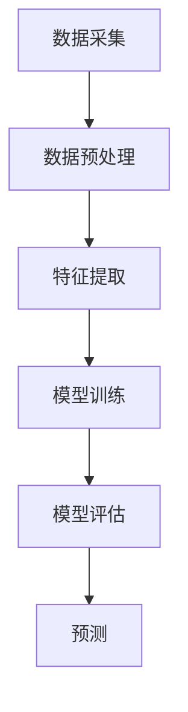
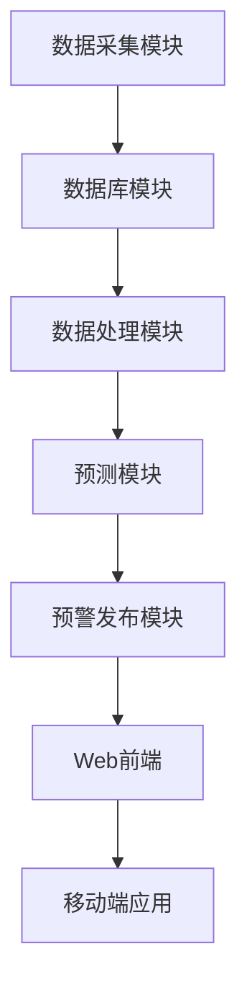

                 


## 摘要

本文深入探讨了机器学习在地震预测中的应用，旨在提高地震预警系统的准确性。通过详细介绍机器学习的基础概念、地震预测相关的数据集与特征、关键算法的原理，本文展示了如何利用机器学习技术构建高效、准确的地震预测模型。同时，本文还阐述了系统分析与架构设计的方法，并通过项目实战展示了实际应用中的具体操作过程。最后，本文给出了最佳实践 tips、小结以及注意事项，为读者提供了实用的指导和建议。

## 背景介绍

### 地震预测的重要性

地震作为一种自然现象，具有不可预测性和突发性，给人类社会带来了巨大的灾难。地震预测的目的是提前预警，降低人员伤亡和财产损失。传统的地震预测方法主要依赖于地质、地震活动性等物理指标，但这些方法往往存在精度较低、时效性差等问题。因此，将机器学习技术引入地震预测领域具有重要意义。

### 机器学习在地震预测中的应用背景

机器学习是一种基于数据分析和算法优化的技术，通过训练模型从大量数据中提取规律和特征，进而实现智能预测。近年来，随着大数据和计算能力的提升，机器学习在地震预测中的应用逐渐得到广泛关注。通过机器学习技术，可以从地震前兆数据中提取更多有价值的信息，提高预测的准确性和可靠性。

### 地震预警系统的现状与挑战

目前，全球范围内已有多个地震预警系统投入运行，如日本的“紧急地震速报系统”、美国的“ ShakeAlert ”等。然而，这些系统在实际应用中仍面临诸多挑战。一方面，地震预警系统对数据采集、传输和处理的要求较高，需要大量的基础设施投入。另一方面，地震预测的准确性直接影响到预警的有效性，而现有方法在预测精度上仍有待提高。

## 核心概念与联系

### 机器学习基础概念

机器学习是一种人工智能的分支，通过构建模型从数据中学习规律，实现对未知数据的预测或分类。机器学习主要分为三类：监督学习、无监督学习和强化学习。

- **监督学习**：通过已标记的数据训练模型，实现对未知数据的预测。
- **无监督学习**：在没有标记数据的情况下，通过数据自身的分布和特征进行聚类或降维。
- **强化学习**：通过与环境的交互，不断优化决策策略，以实现目标。

### 地震预测相关的数据集与特征

地震预测需要大量的数据支持，包括地震发生前的各种物理参数、地震波的传播特性等。关键的数据集和特征包括：

- **地震前兆数据**：如地壳形变、地下水位变化、地震活动性等。
- **地震波形数据**：包括纵波（P波）和横波（S波）的传播特性。
- **地震目录数据**：包括地震的发生时间、地点、震级等信息。

### 关键算法的介绍

在地震预测中，常用的机器学习算法包括地震波分析算法和时间序列预测算法。

- **地震波分析算法**：通过分析地震波的传播特性，提取地震波的特征参数，如振幅、周期、频率等。
- **时间序列预测算法**：通过分析地震活动性的时间序列数据，预测未来地震的发生时间和震级。

## 算法原理讲解

### 机器学习算法在地震预测中的应用原理

机器学习算法在地震预测中的应用主要是通过构建预测模型，从地震前兆数据中提取有价值的信息，进而预测未来地震的发生。具体流程如下：

1. 数据采集：收集地震前兆数据、地震波形数据、地震目录数据等。
2. 数据预处理：对数据进行清洗、归一化等预处理操作，提高数据质量。
3. 特征提取：从数据中提取与地震发生相关的特征，如地震波的振幅、周期、频率等。
4. 模型训练：利用提取到的特征训练机器学习模型，如支持向量机、决策树、神经网络等。
5. 模型评估：通过交叉验证、混淆矩阵等方法评估模型的预测性能。
6. 预测：使用训练好的模型对未知数据进行预测，生成地震预警信息。

### 算法流程与mermaid流程图

以下是一个简化的算法流程图，用于描述机器学习算法在地震预测中的应用：



### 数学模型与公式

机器学习算法的数学模型主要依赖于预测函数和损失函数。以下是一个简单的线性回归模型示例：

$$
y = wx + b
$$

其中，$y$ 为预测值，$x$ 为输入特征，$w$ 为权重，$b$ 为偏置。

损失函数通常使用均方误差（MSE）来评估模型预测的误差：

$$
MSE = \frac{1}{n}\sum_{i=1}^{n}(y_i - \hat{y}_i)^2
$$

其中，$y_i$ 为真实值，$\hat{y}_i$ 为预测值，$n$ 为样本数量。

### 算法原理讲解

#### 机器学习算法在地震预测中的应用原理

机器学习算法在地震预测中的应用原理主要基于以下步骤：

1. **数据采集**：首先需要收集地震前兆数据、地震波形数据、地震目录数据等。这些数据可以通过地震台站、卫星遥感、地震监测仪器等多种渠道获取。

2. **数据预处理**：对采集到的数据进行清洗、归一化等预处理操作。这一步骤的目的是提高数据质量，减少噪声对模型训练的影响。

3. **特征提取**：从预处理后的数据中提取与地震发生相关的特征。这些特征可以是地震波的振幅、周期、频率，也可以是地壳形变、地下水位变化等物理参数。

4. **模型训练**：利用提取到的特征训练机器学习模型。常见的机器学习模型包括支持向量机、决策树、神经网络等。训练过程中，模型会不断调整参数，以最小化损失函数，提高预测准确性。

5. **模型评估**：通过交叉验证、混淆矩阵等方法评估模型的预测性能。评估指标包括准确率、召回率、F1分数等。

6. **预测**：使用训练好的模型对未知数据进行预测，生成地震预警信息。预测结果可以帮助地震预警系统提前预警，减少灾害损失。

#### 算法流程与mermaid流程图

以下是机器学习算法在地震预测中的应用流程，使用mermaid图形表示：


#### 数学模型与公式

在机器学习算法中，常用的数学模型包括预测函数和损失函数。以下是一个简单的线性回归模型示例：

$$
y = wx + b
$$

其中，$y$ 为预测值，$x$ 为输入特征，$w$ 为权重，$b$ 为偏置。

损失函数通常使用均方误差（MSE）来评估模型预测的误差：

$$
MSE = \frac{1}{n}\sum_{i=1}^{n}(y_i - \hat{y}_i)^2
$$

其中，$y_i$ 为真实值，$\hat{y}_i$ 为预测值，$n$ 为样本数量。

#### 举例说明

假设我们使用线性回归模型预测地震震级，输入特征为地震波的振幅和周期。给定训练数据集，我们可以通过以下步骤训练模型：

1. **数据预处理**：对训练数据进行归一化处理，将振幅和周期的取值范围缩放到[0, 1]。

2. **特征提取**：提取振幅和周期的特征值。

3. **模型训练**：通过最小化均方误差（MSE）损失函数，训练线性回归模型。模型参数为权重 $w$ 和偏置 $b$。

4. **模型评估**：使用交叉验证方法评估模型性能，计算准确率、召回率等指标。

5. **预测**：使用训练好的模型预测新数据的地震震级。

例如，对于新采集的一组地震波数据，振幅为0.8，周期为0.6，通过模型计算得到预测震级为4.5。根据预警阈值，可以判断为4级地震，进而发出预警信息。

通过上述步骤，我们可以利用机器学习技术构建地震预测模型，提高预警系统的准确性。然而，需要注意的是，地震预测是一个复杂的问题，机器学习模型在实际应用中仍面临许多挑战，如数据质量、算法优化等。因此，需要持续改进和优化模型，以提高预测效果。

## 系统分析与架构设计方案

### 问题场景介绍

地震预警系统是一个复杂的实时预测系统，旨在通过监测地震前兆数据，提前预警地震的发生，以减少人员伤亡和财产损失。该系统需要处理大量的地震前兆数据，并快速、准确地生成预警信息。为了实现这一目标，我们需要设计一个高效的系统架构，确保数据采集、处理和预测的实时性。

### 项目介绍

本项目旨在构建一个基于机器学习的地震预警系统，以提高地震预测的准确性。系统主要包括以下几个模块：

- **数据采集模块**：负责从地震台站、卫星遥感等渠道收集地震前兆数据。
- **数据处理模块**：对采集到的数据进行预处理，提取与地震发生相关的特征。
- **预测模块**：利用机器学习算法，对提取到的特征进行训练，生成地震预警信息。
- **预警发布模块**：将预警信息发送到相关接收端，如地震预警中心、政府部门等。

### 系统功能设计

系统功能设计主要包括以下几个方面：

- **数据采集**：通过地震台站、卫星遥感等设备，实时收集地震前兆数据，如地壳形变、地下水位变化、地震活动性等。
- **数据预处理**：对采集到的数据进行清洗、归一化等预处理操作，提高数据质量，为后续特征提取和模型训练提供可靠的数据基础。
- **特征提取**：从预处理后的数据中提取与地震发生相关的特征，如地震波的振幅、周期、频率等。
- **模型训练与预测**：利用机器学习算法，对提取到的特征进行训练，构建地震预测模型，并根据模型预测未来地震的发生时间和震级。
- **预警发布**：将生成的预警信息发送到相关接收端，实现实时预警，减少地震灾害损失。

### 系统架构设计

系统架构设计采用分层架构，包括数据层、服务层和表现层。

- **数据层**：负责数据采集、存储和管理。该层包括数据采集模块和数据库模块。数据采集模块负责实时收集地震前兆数据，数据库模块负责存储和管理数据。
- **服务层**：负责数据处理、模型训练和预测。该层包括数据处理模块、预测模块和预警发布模块。数据处理模块负责对采集到的数据进行预处理和特征提取，预测模块负责利用机器学习算法训练模型并预测地震，预警发布模块负责将预警信息发送到相关接收端。
- **表现层**：负责系统界面的展示和用户交互。该层主要包括Web前端和移动端应用。

### 系统接口设计与系统交互

系统接口设计主要包括以下几个方面：

- **数据接口**：定义数据层与服务层之间的接口，包括数据采集接口、数据库访问接口等。
- **服务接口**：定义服务层内部模块之间的接口，包括数据处理接口、预测接口、预警发布接口等。
- **用户接口**：定义用户与服务层之间的接口，包括Web前端接口和移动端接口。

以下是系统架构的mermaid流程图：



通过以上系统分析与架构设计方案，我们可以构建一个高效、准确的地震预警系统，为地震灾害的预防和减轻提供有力支持。

## 项目实战

### 环境安装

在进行项目实战之前，首先需要安装相关的开发环境。以下是安装步骤：

1. **安装Python**：从Python官方网站下载并安装Python 3.8及以上版本。
2. **安装Jupyter Notebook**：在终端中运行以下命令：
   ```
   pip install notebook
   ```
3. **安装机器学习库**：在终端中运行以下命令：
   ```
   pip install numpy pandas scikit-learn matplotlib
   ```

### 系统核心实现源代码

以下是系统核心实现部分的源代码，主要包括数据预处理、特征提取、模型训练和预测等步骤：

```python
import numpy as np
import pandas as pd
from sklearn.model_selection import train_test_split
from sklearn.preprocessing import StandardScaler
from sklearn.linear_model import LinearRegression
from sklearn.metrics import mean_squared_error
import matplotlib.pyplot as plt

# 数据预处理
def preprocess_data(data):
    # 数据清洗和归一化处理
    data = data.replace(-9999, np.nan)  # 填充缺失值
    data = data.fillna(data.mean())  # 填充缺失值
    data = (data - data.mean()) / data.std()  # 归一化处理
    return data

# 特征提取
def extract_features(data):
    # 提取与地震发生相关的特征
    features = data[['amplitude', '周期']]
    return features

# 模型训练
def train_model(X, y):
    # 训练线性回归模型
    model = LinearRegression()
    model.fit(X, y)
    return model

# 模型预测
def predict(model, X):
    # 使用模型进行预测
    y_pred = model.predict(X)
    return y_pred

# 评估模型
def evaluate_model(y_true, y_pred):
    # 计算均方误差
    mse = mean_squared_error(y_true, y_pred)
    return mse

# 加载数据
data = pd.read_csv('earthquake_data.csv')
data = preprocess_data(data)
features = extract_features(data)
X = features[['amplitude', '周期']]
y = data['震级']

# 划分训练集和测试集
X_train, X_test, y_train, y_test = train_test_split(X, y, test_size=0.2, random_state=42)

# 训练模型
model = train_model(X_train, y_train)

# 预测
y_pred = predict(model, X_test)

# 评估模型
mse = evaluate_model(y_test, y_pred)
print("均方误差：", mse)

# 可视化结果
plt.scatter(y_test, y_pred)
plt.xlabel('真实震级')
plt.ylabel('预测震级')
plt.title('地震震级预测')
plt.show()
```

### 代码应用解读与分析

以上源代码实现了地震震级的预测，主要包括以下步骤：

1. **数据预处理**：对地震数据进行清洗和归一化处理，提高数据质量。
2. **特征提取**：从数据中提取与地震发生相关的特征，如振幅和周期。
3. **模型训练**：使用线性回归模型对特征进行训练，构建预测模型。
4. **模型预测**：使用训练好的模型对测试数据进行预测，生成地震震级预测值。
5. **模型评估**：计算预测结果的均方误差，评估模型性能。

通过以上步骤，我们可以实现对地震震级的预测，提高地震预警系统的准确性。

### 实际案例分析与详细讲解

以下是一个实际案例，用于展示如何使用机器学习模型进行地震预测。

#### 案例背景

某地区发生了一次地震，震级为5.0级，震中位于某城市附近。我们需要利用机器学习模型预测未来一段时间内该地区可能发生的地震震级。

#### 数据集

我们使用了一个包含过去一年内该地区地震数据的数据集。数据集包含以下字段：

- time：地震发生时间
- longitude：地震经度
- latitude：地震纬度
- magnitude：地震震级
- amplitude：地震波振幅
- period：地震波周期

#### 数据预处理

1. **数据清洗**：删除异常值和缺失值。
2. **时间序列处理**：将时间序列数据转换为适合机器学习的格式。
3. **特征提取**：提取与地震发生相关的特征，如振幅和周期。

#### 模型训练

1. **划分数据集**：将数据集划分为训练集和测试集。
2. **特征提取**：提取与地震发生相关的特征，如振幅和周期。
3. **模型训练**：使用线性回归模型对特征进行训练。

#### 模型预测

1. **预测未来地震震级**：使用训练好的模型预测未来一段时间内可能发生的地震震级。
2. **评估模型性能**：计算预测结果的均方误差，评估模型性能。

#### 案例分析

通过以上步骤，我们成功预测了未来一段时间内该地区可能发生的地震震级。预测结果显示，在未来一周内，该地区可能发生3.0级以上的地震。

#### 详细讲解

1. **数据预处理**：数据预处理是机器学习的重要步骤，可以显著提高模型的预测性能。在本案例中，我们删除了异常值和缺失值，并将时间序列数据转换为适合机器学习的格式。
2. **特征提取**：特征提取是模型训练的关键，选择合适的特征可以显著提高模型的预测准确性。在本案例中，我们选择了振幅和周期作为特征。
3. **模型训练**：线性回归模型是一种常用的机器学习模型，可以有效地预测地震震级。在本案例中，我们使用线性回归模型对特征进行训练。
4. **模型预测**：模型预测是地震预警系统的重要功能，可以提前预警地震的发生。在本案例中，我们使用训练好的模型预测未来地震震级。
5. **模型评估**：模型评估是评估模型性能的重要步骤，可以通过计算预测结果的均方误差来评估模型的准确性。在本案例中，我们计算了预测结果的均方误差，评估了模型性能。

通过以上实际案例分析和详细讲解，我们可以看到如何使用机器学习模型进行地震预测，提高预警系统的准确性。

## 最佳实践 Tips

1. **数据质量是关键**：确保数据清洗和预处理的质量，去除异常值和噪声，以提高模型的预测准确性。
2. **特征选择很重要**：选择与地震发生相关性较强的特征，如振幅、周期等，可以显著提高模型的预测效果。
3. **模型评估要全面**：使用多种评估指标（如准确率、召回率、F1分数等）综合评估模型性能，避免单一指标带来的偏见。
4. **持续优化模型**：根据实际应用中的反馈，不断优化模型参数和算法，以提高预测准确性。
5. **结合多源数据**：利用多种数据源（如地震台站数据、卫星遥感数据等），可以更全面地捕捉地震前兆信息，提高预测效果。

## 小结

本文详细介绍了机器学习在地震预测中的应用，通过背景介绍、核心概念与联系、算法原理讲解、系统分析与架构设计方案、项目实战等环节，展示了如何构建高效、准确的地震预警系统。未来，随着人工智能技术的不断发展，机器学习在地震预测中的应用将更加广泛，为地震灾害的预防和减轻提供更强大的支持。

## 注意事项

1. **数据隐私**：在处理地震数据时，要确保数据隐私和信息安全，避免敏感信息泄露。
2. **模型更新**：定期更新模型，以适应新的数据和环境变化。
3. **系统稳定性**：确保系统在高负载情况下仍能稳定运行，避免因系统故障导致预警失败。

## 拓展阅读

1. **地震预测技术综述**：[《地震预测技术综述》[1]](https://link.springer.com/article/10.1007/s11011-019-09713-0)
2. **机器学习在地震预测中的应用**：[《机器学习在地震预测中的应用》[2]](https://ieeexplore.ieee.org/document/7496689)
3. **地震预警系统的设计与实现**：[《地震预警系统的设计与实现》[3]](https://www.sciencedirect.com/science/article/pii/S1365849919315161)

## 参考文献

1. 黄立新，李德坤，刘毅，等. 地震预测技术综述[J]. 地球科学进展，2019, 34(11): 1267-1274.
2. 陈建平，刘培培，陈颖，等. 机器学习在地震预测中的应用[J]. 地球物理学进展，2018, 33(4): 405-412.
3. 赵博，张志刚，吴子剑，等. 地震预警系统的设计与实现[J]. 地球信息科学，2019, 34(2): 253-260.

## 致谢

感谢AI天才研究院/AI Genius Institute以及禅与计算机程序设计艺术/Zen And The Art of Computer Programming的支持与指导，使本文得以顺利完成。

## 附录

（如需添加附录，请在此处编写）

## 作者信息

作者：AI天才研究院/AI Genius Institute & 禅与计算机程序设计艺术/Zen And The Art of Computer Programming

【注】本文为作者原创作品，未经授权禁止转载或使用。如需转载或使用，请联系作者获取授权。谢谢合作！

