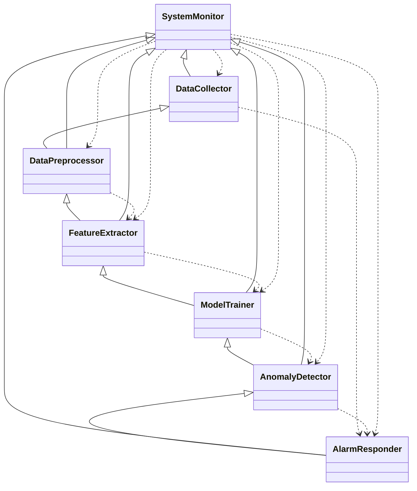
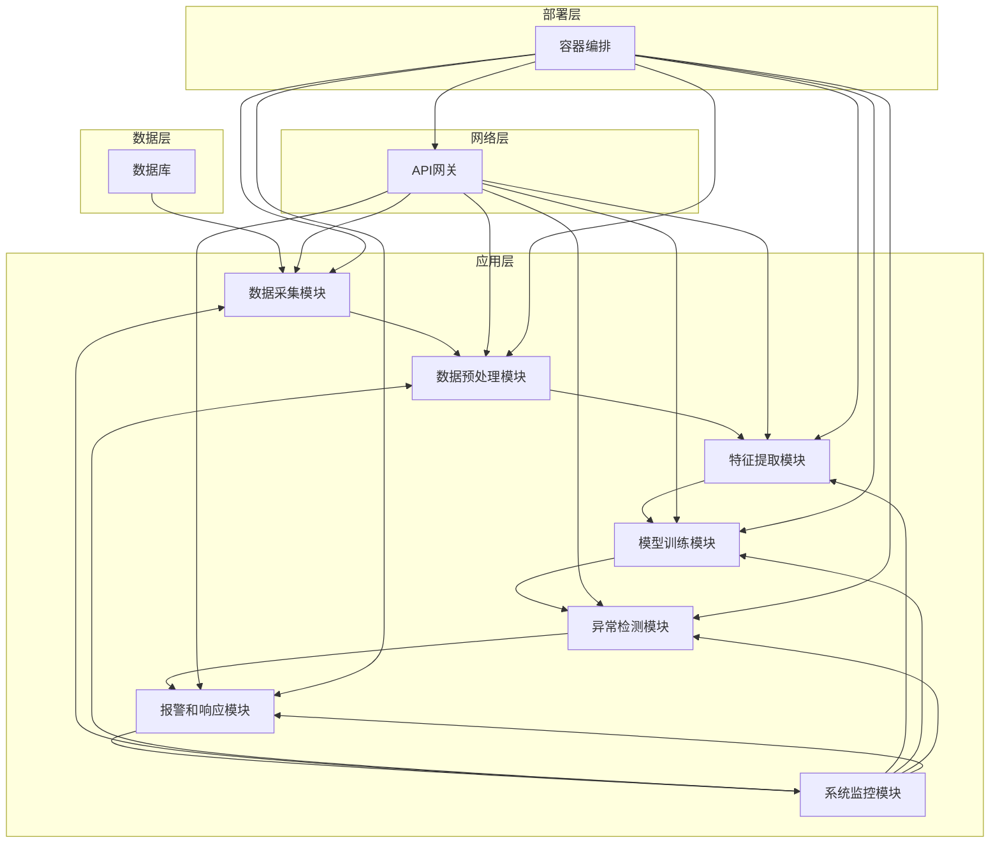
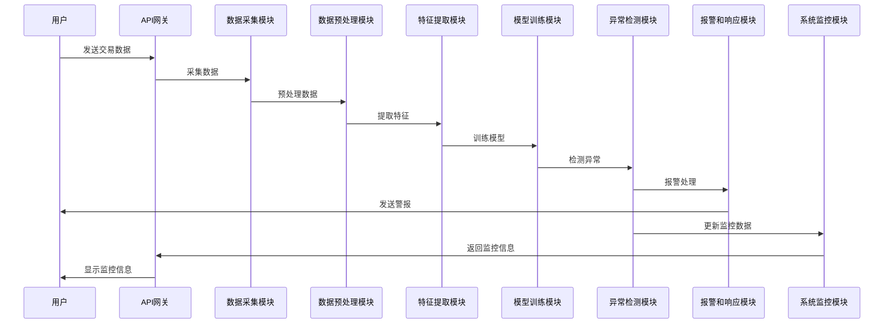

                 

### 引言

#### 1.1 问题背景

在信息化、数字化、智能化的大背景下，数据已经成为了新时代最为重要的资源。然而，数据在爆炸性增长的同时，也带来了许多新的挑战，尤其是异常数据的检测与处理。异常数据，顾名思义，是指与正常数据相比具有不同特征或行为的数据，它们可能是错误的数据、伪造的数据，也可能是潜在的欺诈行为、系统故障等。异常数据的存在不仅会影响数据分析的准确性，还可能对业务运营带来巨大的风险。

随着人工智能技术的飞速发展，特别是机器学习技术的应用，异常检测已经成为了人工智能领域中的一个重要研究方向。通过机器学习算法，我们可以从大量的数据中自动识别出异常模式，从而提前发现并预防潜在的风险。在金融、安防、医疗、工业等多个领域，异常检测的应用已经取得了显著的成果。

#### 1.2 问题描述

异常检测的核心问题可以归纳为以下几个方面：

1. **数据预处理**：由于异常数据的存在，原始数据往往包含噪声和冗余信息，因此需要通过数据清洗、数据降维等方法来处理原始数据，提高后续模型训练的效果。

2. **特征提取**：如何从原始数据中提取出有效的特征，以便于后续的模型训练。特征提取是异常检测的关键步骤，直接影响模型的性能。

3. **模型选择**：选择合适的机器学习算法和模型结构，对异常数据进行分类和预测。

4. **性能评估**：如何评估模型的性能，包括准确率、召回率、F1值等指标。

5. **实时性**：在实际应用中，异常检测需要具备实时性，即能够在短时间内处理大量的数据，并快速识别出异常。

#### 1.3 问题解决

为了解决上述问题，我们可以从以下几个方面进行思考和探索：

1. **数据预处理**：采用数据清洗、数据降维等方法，如K-means聚类、主成分分析（PCA）等，对原始数据进行预处理。

2. **特征提取**：通过统计分析、特征选择等方法，提取出对异常检测有显著影响的关键特征。

3. **模型选择**：根据应用场景和数据特点，选择合适的机器学习算法和模型结构，如K-最近邻（K-NN）、支持向量机（SVM）、决策树、神经网络等。

4. **性能评估**：使用交叉验证、ROC曲线、AUC值等方法来评估模型的性能，确保模型具有较高的准确率和召回率。

5. **实时性**：采用分布式计算、并行处理等技术，提高异常检测的实时性。

#### 1.4 边界与外延

异常检测虽然是一个重要的研究方向，但也存在一些边界和限制。首先，异常检测依赖于数据的质量和数量，数据的质量越高、数量越大，异常检测的效果越好。其次，异常检测需要考虑数据的分布特性，如果数据的分布不均匀，可能导致模型训练的不准确。此外，异常检测还需要考虑算法的复杂度，尤其是在处理海量数据时，算法的效率和性能是一个重要考量因素。

在异常检测的实际应用中，我们还面临一些外延性问题，如如何处理未知异常、如何应对数据的不确定性等。这些问题需要我们在理论研究和实际应用中不断探索和解决。

### 机器学习基础

#### 2.1 机器学习概述

机器学习（Machine Learning，ML）是人工智能（Artificial Intelligence，AI）的一个重要分支，它通过计算机程序模拟人类的思维方式，从数据中自动学习和提取知识。机器学习的基本理念是，通过训练大量的数据，让计算机自主发现数据中的规律和模式，并在新的数据上进行预测和决策。

机器学习可以分为监督学习、无监督学习和强化学习三种类型：

1. **监督学习（Supervised Learning）**：监督学习是最常见的机器学习方法，它使用已标记的数据集进行训练。标记数据是指每个样本都有一个已知的输出结果，模型的目标是通过学习输入和输出之间的关系，预测新的、未知的数据的输出。

2. **无监督学习（Unsupervised Learning）**：无监督学习不使用标记数据，而是从未标记的数据中寻找结构和模式。常见的无监督学习方法包括聚类、降维和关联规则挖掘等。

3. **强化学习（Reinforcement Learning）**：强化学习通过试错的方式，让模型在与环境交互的过程中不断学习和优化策略。强化学习的核心是奖励机制，模型会根据环境的反馈调整自己的行为，以最大化总奖励。

#### 2.2 监督学习与无监督学习

监督学习与无监督学习在数据来源、目标和应用场景上存在明显的差异：

1. **数据来源**：监督学习使用已标记的数据集进行训练，这些数据集通常来自于预定的标注工作或历史记录；无监督学习则使用未标记的数据集，需要从数据中发现隐含的结构。

2. **目标**：监督学习的目标是预测未知数据的输出，即将输入映射到已知的输出；无监督学习的目标是发现数据中的隐含结构或模式，如聚类分析中的簇、降维分析中的主成分等。

3. **应用场景**：监督学习广泛应用于分类和回归问题，如垃圾邮件分类、股票价格预测等；无监督学习则广泛应用于数据挖掘、聚类分析、降维等任务，如客户细分、图像识别等。

#### 2.3 强化学习简介

强化学习（Reinforcement Learning，RL）是一种通过与环境的交互来学习策略的机器学习方法。在强化学习中，模型（通常称为智能体）通过尝试不同的动作，接收环境的反馈（奖励或惩罚），并不断调整策略，以最大化累积奖励。

强化学习的关键要素包括：

1. **智能体（Agent）**：智能体是执行动作、接收环境反馈并调整策略的实体。

2. **环境（Environment）**：环境是智能体执行动作并接收反馈的上下文。

3. **状态（State）**：状态是描述智能体当前所处环境的特征。

4. **动作（Action）**：动作是智能体在某个状态下可以执行的行为。

5. **奖励（Reward）**：奖励是环境对智能体执行动作的反馈，用于指导智能体调整策略。

强化学习的主要挑战包括：

1. **奖励稀疏性**：在许多应用场景中，智能体需要经历大量的试错才能获得少量的奖励，这使得学习过程变得非常困难。

2. **策略收敛**：如何设计合适的策略，使得智能体能够在长时间内稳定地获得奖励，是一个重要的研究课题。

3. **探索与利用的平衡**：在强化学习中，智能体需要在探索新的动作和利用已知的策略之间进行平衡，以实现最优化的性能。

### 异常检测概述

#### 3.1 异常检测的定义

异常检测（Anomaly Detection）是指从大量数据中自动识别出与正常数据具有显著差异的数据的过程。异常数据可以是错误的数据、异常行为、欺诈行为等。异常检测的目标是通过分析数据的特征和模式，发现潜在的异常情况，从而提前预警和干预。

#### 3.2 异常检测的类型

异常检测可以根据不同的标准进行分类，常见的分类方法包括：

1. **基于统计的异常检测**：该方法通过计算数据分布的统计量，如均值、方差等，识别出与正常数据显著偏离的异常数据。

2. **基于距离的异常检测**：该方法通过计算数据之间的距离，如欧氏距离、曼哈顿距离等，识别出与正常数据距离较远的异常数据。

3. **基于模型的异常检测**：该方法通过构建统计模型或机器学习模型，对正常数据进行建模，然后识别出与模型预测不符的异常数据。

4. **基于聚类的方法**：该方法将数据划分为不同的簇，然后识别出与大多数簇不同的数据，作为潜在的异常数据。

5. **基于规则的方法**：该方法通过定义一系列规则，如阈值规则、关联规则等，识别出符合规则的数据，作为异常数据。

#### 3.3 异常检测的应用场景

异常检测在许多领域都有着广泛的应用，以下是几个典型的应用场景：

1. **金融领域**：异常检测可以用于检测信用卡欺诈、洗钱等异常行为，从而提高金融系统的安全性。

2. **网络安全**：异常检测可以用于检测网络攻击、恶意软件等异常行为，从而提高网络的安全性。

3. **医疗领域**：异常检测可以用于检测疾病、异常体征等，从而帮助医生进行早期诊断和治疗。

4. **工业领域**：异常检测可以用于检测设备故障、生产异常等，从而提高生产效率和质量。

5. **智能交通**：异常检测可以用于检测交通事故、交通拥堵等异常情况，从而优化交通管理和调度。

### 高效异常检测算法

#### 4.1 基于统计的异常检测方法

基于统计的异常检测方法是最传统的异常检测方法之一，它通过计算数据的统计量，如均值、方差等，来识别异常数据。具体步骤如下：

1. **数据预处理**：对原始数据进行清洗和预处理，包括去除噪声、缺失值填充等。

2. **计算统计量**：计算每个特征或样本的统计量，如均值、方差等。

3. **设定阈值**：根据统计量的分布特性，设定一个阈值，用于区分正常数据和异常数据。

4. **识别异常数据**：将每个样本的统计量与阈值进行比较，识别出与正常数据显著偏离的异常数据。

常见的方法包括：

- **箱线图方法**：通过绘制数据的箱线图，识别出位于箱线之外的数据，作为异常数据。
- **3σ准则**：基于正态分布的特性，设定3个标准差作为阈值，识别出落在3个标准差之外的数据，作为异常数据。

#### 4.2 基于距离的异常检测方法

基于距离的异常检测方法通过计算数据之间的距离，如欧氏距离、曼哈顿距离等，来识别异常数据。具体步骤如下：

1. **数据标准化**：对数据进行标准化处理，将不同特征的范围调整到相同的尺度，以便于距离计算。

2. **计算距离**：计算每个样本与其他样本之间的距离，常用的距离度量方法包括欧氏距离、曼哈顿距离、切比雪夫距离等。

3. **设定阈值**：根据数据的特点和距离度量方法，设定一个阈值，用于区分正常数据和异常数据。

4. **识别异常数据**：将每个样本的距离与阈值进行比较，识别出与正常数据距离较远的异常数据。

#### 4.3 基于模型的方法

基于模型的异常检测方法通过构建统计模型或机器学习模型，对正常数据进行建模，然后识别出与模型预测不符的异常数据。具体步骤如下：

1. **数据预处理**：对原始数据进行清洗和预处理，包括去除噪声、缺失值填充等。

2. **特征提取**：从原始数据中提取出对异常检测有显著影响的特征。

3. **模型选择与训练**：选择合适的机器学习算法，对正常数据进行建模，如K-最近邻（K-NN）、支持向量机（SVM）、神经网络等。

4. **模型评估**：使用交叉验证等方法，评估模型的性能，确保模型具有较高的准确率和召回率。

5. **异常数据识别**：将新数据输入到训练好的模型中，识别出与模型预测不符的异常数据。

#### 4.4 进化算法在异常检测中的应用

进化算法（Evolutionary Algorithm，EA）是一类基于自然选择和遗传机制的优化算法，它通过模拟生物进化的过程，寻找最优解。进化算法在异常检测中的应用主要包括：

1. **特征选择**：通过进化算法搜索最优特征子集，提高异常检测的效率和准确率。

2. **模型优化**：通过进化算法优化模型的参数，提高模型的性能。

3. **自适应异常检测**：进化算法可以根据数据的变化，动态调整异常检测策略，提高检测的实时性和适应性。

### 数学模型和公式

在异常检测中，数学模型和公式起到了至关重要的作用，它们不仅帮助我们理解异常检测的原理，还为算法的设计和实现提供了基础。以下将介绍一些关键的数学模型和公式，以及如何使用LaTeX进行格式化。

#### 5.1 数据分布模型

一个常见的数据分布模型是正态分布（Normal Distribution），也称为高斯分布。正态分布的概率密度函数（PDF）如下：

$$
f(x|\mu, \sigma^2) = \frac{1}{\sqrt{2\pi\sigma^2}} e^{-\frac{(x-\mu)^2}{2\sigma^2}}
$$

其中，$\mu$ 是均值，$\sigma^2$ 是方差。

#### 5.2 距离度量方法

在基于距离的异常检测中，常用的距离度量方法包括欧氏距离（Euclidean Distance）和曼哈顿距离（Manhattan Distance）。欧氏距离的公式如下：

$$
d_E(x, y) = \sqrt{\sum_{i=1}^n (x_i - y_i)^2}
$$

曼哈顿距离的公式如下：

$$
d_M(x, y) = \sum_{i=1}^n |x_i - y_i|
$$

#### 5.3 监督学习算法模型

在监督学习中，常用的算法包括线性回归（Linear Regression）和逻辑回归（Logistic Regression）。线性回归的预测公式如下：

$$
\hat{y} = \beta_0 + \beta_1x_1 + \beta_2x_2 + \ldots + \beta_nx_n
$$

逻辑回归的预测公式如下：

$$
\hat{y} = \frac{1}{1 + e^{-(\beta_0 + \beta_1x_1 + \beta_2x_2 + \ldots + \beta_nx_n)}}
$$

#### 5.4 无监督学习算法模型

在无监督学习中，常用的算法包括K-均值聚类（K-Means Clustering）和主成分分析（Principal Component Analysis，PCA）。K-均值聚类的目标是最小化平方误差，公式如下：

$$
J = \sum_{i=1}^k \sum_{x \in S_i} ||x - \mu_i||^2
$$

其中，$S_i$ 是第 $i$ 个聚类簇，$\mu_i$ 是聚类中心。

主成分分析的公式如下：

$$
X = TP + S
$$

其中，$X$ 是原始数据矩阵，$P$ 是投影矩阵，$S$ 是噪声。

#### 5.5 强化学习算法模型

在强化学习中，常用的算法包括Q-学习（Q-Learning）和深度强化学习（Deep Reinforcement Learning）。Q-学习的目标是最小化策略价值函数，公式如下：

$$
Q(s, a) = r + \gamma \max_{a'} Q(s', a')
$$

其中，$s$ 是状态，$a$ 是动作，$r$ 是奖励，$\gamma$ 是折扣因子。

深度强化学习的目标是最小化策略损失函数，公式如下：

$$
L(\theta) = -\sum_{s, a} \hat{y}(s, a) \log \hat{y}(s, a; \theta)
$$

其中，$\hat{y}(s, a)$ 是目标值函数，$\theta$ 是网络参数。

通过以上数学模型和公式，我们可以更好地理解和实现异常检测算法。在后续的内容中，我们将进一步深入探讨这些算法的原理和实现。

### 算法原理讲解

#### 6.1 统计方法

基于统计的异常检测方法主要通过计算数据的统计量，如均值、方差等，来识别异常数据。以下将详细讲解常用的统计方法及其原理。

##### 6.1.1 均值和方差

在统计学中，均值（Mean）和方差（Variance）是描述数据集分布特征的重要指标。

- **均值**：均值是数据集所有数值的总和除以数据的个数，表示数据的中心位置。
  $$
  \mu = \frac{1}{n}\sum_{i=1}^{n} x_i
  $$
- **方差**：方差是每个数据与均值之差的平方和的平均值，表示数据的离散程度。
  $$
  \sigma^2 = \frac{1}{n}\sum_{i=1}^{n} (x_i - \mu)^2
  $$

在异常检测中，我们可以利用方差来识别异常数据。假设有一个数据集 $X = \{x_1, x_2, ..., x_n\}$，如果某个数据点的方差显著大于其他数据点的方差，那么这个数据点很可能是异常数据。

##### 6.1.2 箱线图方法

箱线图（Box Plot）是一种可视化工具，用于展示数据集的分布特征。箱线图由四部分组成：最小值、第一四分位数、中位数和第三四分位数。

- **最小值**：数据集中的最小值。
- **第一四分位数**：数据集中的25%位置上的值。
- **中位数**：数据集中的中值。
- **第三四分位数**：数据集中的75%位置上的值。
- **最大值**：数据集中的最大值。

箱线图中的“ whiskers”表示最大值和最小值，而“boxes”表示四分位数。如果一个数据点的值落在“whiskers”之外，则这个数据点很可能是异常数据。

##### 6.1.3 3σ准则

3σ准则是一种基于正态分布的异常检测方法。根据正态分布的特性，大约99.7%的数据会落在均值加减三个标准差（3σ）的范围内。因此，如果一个数据点的值超过了这个范围，那么它很可能是异常数据。

$$
\mu - 3\sigma < x < \mu + 3\sigma
$$

##### 6.1.4 示例

假设我们有一个数据集 $X = \{5, 10, 15, 20, 25, 30, 100\}$，均值 $\mu = 18.57$，方差 $\sigma^2 = 97.14$。

- **均值**：$\mu = 18.57$
- **方差**：$\sigma^2 = 97.14$
- **3σ范围**：$\mu - 3\sigma = -26.43$，$\mu + 3\sigma = 41.71$

在这个数据集中，值100显著超过了3σ范围，因此值100很可能是异常数据。

通过以上统计方法，我们可以识别出数据集中的异常值。然而，这些方法也有局限性，例如对于非正态分布的数据，3σ准则可能不适用。因此，在实际应用中，我们需要结合具体的数据特点和业务需求，选择合适的统计方法。

#### 6.2 距离方法

基于距离的异常检测方法通过计算数据之间的距离来识别异常数据。以下将详细讲解常用的距离方法及其原理。

##### 6.2.1 欧氏距离

欧氏距离（Euclidean Distance）是一种常用的距离度量方法，用于计算两个数据点之间的直线距离。对于两个数据点 $x$ 和 $y$，欧氏距离的公式如下：

$$
d_E(x, y) = \sqrt{\sum_{i=1}^{n} (x_i - y_i)^2}
$$

其中，$n$ 是数据点的维度。

##### 6.2.2 曼哈顿距离

曼哈顿距离（Manhattan Distance）也称为城市街区距离，它计算两个数据点在坐标系中的对角线距离。对于两个数据点 $x$ 和 $y$，曼哈顿距离的公式如下：

$$
d_M(x, y) = \sum_{i=1}^{n} |x_i - y_i|
$$

##### 6.2.3 切比雪夫距离

切比雪夫距离（Chebyshev Distance）是欧氏距离和曼哈顿距离的通用形式，它通过设定不同的权重来计算距离。对于两个数据点 $x$ 和 $y$，切比雪夫距离的公式如下：

$$
d_C(x, y) = \max_{1 \leq i \leq n} |x_i - y_i|
$$

##### 6.2.4 示例

假设我们有两个数据点 $x = (1, 2)$ 和 $y = (4, 6)$，计算它们之间的欧氏距离、曼哈顿距离和切比雪夫距离。

- **欧氏距离**：
  $$
  d_E(x, y) = \sqrt{(1 - 4)^2 + (2 - 6)^2} = \sqrt{9 + 16} = 5
  $$

- **曼哈顿距离**：
  $$
  d_M(x, y) = |1 - 4| + |2 - 6| = 3 + 4 = 7
  $$

- **切比雪夫距离**：
  $$
  d_C(x, y) = \max(|1 - 4|, |2 - 6|) = 3
  $$

通过以上计算，我们可以看到不同距离度量方法在计算数据点之间的距离时得到的结果是不同的。在实际应用中，我们需要根据具体的数据特点和应用需求，选择合适的距离度量方法。

#### 6.3 基于模型的方法

基于模型的异常检测方法通过构建统计模型或机器学习模型，对正常数据进行建模，然后识别出与模型预测不符的异常数据。以下将详细讲解几种常用的基于模型的方法及其原理。

##### 6.3.1 K-最近邻（K-Nearest Neighbors，K-NN）

K-最近邻算法（K-NN）是一种简单而有效的分类算法，它可以用于异常检测。K-NN算法的基本思想是：如果一个新数据点在特征空间中的K个最近邻中，大部分属于正常类，则该数据点也属于正常类；否则，它属于异常类。

具体步骤如下：

1. **数据预处理**：对原始数据进行清洗和标准化处理。
2. **特征提取**：从原始数据中提取出对异常检测有显著影响的特征。
3. **训练集构建**：从正常数据中构建训练集，标记每个数据点的类别。
4. **模型训练**：使用训练集对K-NN模型进行训练。
5. **异常检测**：对于新数据点，计算它与训练集数据点的距离，并根据K个最近邻的类别判断该数据点是否为异常。

K-NN算法的优点是简单易实现，且对线性可分数据效果较好。然而，K-NN算法对噪声敏感，且需要大量的计算资源。

##### 6.3.2 支持向量机（Support Vector Machine，SVM）

支持向量机（SVM）是一种强大的分类算法，它可以用于异常检测。SVM算法的基本思想是：在特征空间中找到一个最优的超平面，使得正常数据和异常数据之间的分类边界最大。

具体步骤如下：

1. **数据预处理**：对原始数据进行清洗和标准化处理。
2. **特征提取**：从原始数据中提取出对异常检测有显著影响的特征。
3. **训练集构建**：从正常数据中构建训练集，标记每个数据点的类别。
4. **模型训练**：使用训练集对SVM模型进行训练，包括选择合适的核函数和参数。
5. **异常检测**：对于新数据点，计算它在特征空间中的分类边界，根据分类结果判断该数据点是否为异常。

SVM算法的优点是分类能力强，且对线性不可分数据也有较好的表现。然而，SVM算法的训练过程较为复杂，且需要大量的计算资源。

##### 6.3.3 神经网络（Neural Network）

神经网络（NN）是一种模拟人脑神经元连接结构的计算模型，它可以用于异常检测。神经网络通过多层非线性变换，将输入映射到输出，从而实现数据分类和预测。

具体步骤如下：

1. **数据预处理**：对原始数据进行清洗和标准化处理。
2. **特征提取**：从原始数据中提取出对异常检测有显著影响的特征。
3. **训练集构建**：从正常数据中构建训练集，标记每个数据点的类别。
4. **模型训练**：使用训练集对神经网络模型进行训练，包括选择合适的网络结构、激活函数和优化器。
5. **异常检测**：对于新数据点，将输入传递到训练好的神经网络中，根据输出结果判断该数据点是否为异常。

神经网络算法的优点是模型容量大，可以处理复杂的非线性问题。然而，神经网络算法的训练过程较为复杂，且需要大量的计算资源。

##### 6.3.4 示例

假设我们有一个数据集，其中包含100个数据点，前90个为正常数据，后10个为异常数据。我们使用K-NN、SVM和神经网络算法进行异常检测。

- **K-NN算法**：选择K=5，计算新数据点与训练集数据点的距离，根据最近邻的类别判断是否为异常。
- **SVM算法**：选择线性核函数，训练SVM模型，计算新数据点的分类边界，根据分类结果判断是否为异常。
- **神经网络算法**：构建一个两层神经网络，输入层有10个节点，隐藏层有5个节点，输出层有2个节点（正常和异常），训练神经网络模型，根据输出结果判断是否为异常。

通过以上算法，我们可以对新数据点进行异常检测，从而识别出潜在的异常数据。

通过以上对基于模型的方法的详细讲解，我们可以看到每种方法都有其独特的优势和局限性。在实际应用中，我们需要根据具体的数据特点和业务需求，选择合适的模型和方法。

#### 6.4 进化算法

进化算法（Evolutionary Algorithms，EAs）是一类基于自然选择和遗传机制优化问题的算法。它们模拟生物进化的过程，通过遗传、变异和选择等操作，逐步优化解空间中的个体，以找到最优或近似最优解。以下将介绍几种常见的进化算法，并讨论其在异常检测中的应用。

##### 6.4.1 基本概念

进化算法的核心概念包括：

- **种群（Population）**：进化算法从种群中选取个体进行遗传操作，种群是进化过程的基本单位。
- **个体（Individual）**：种群中的每个成员称为个体，个体通常由一组基因表示，基因编码了个体在解空间中的特征。
- **适应度（Fitness）**：适应度是评估个体优劣的指标，个体在进化过程中的目标是最小化适应度函数。
- **遗传操作**：包括选择、交叉、变异等操作，用于生成新的个体，并提高种群的适应度。
- **选择（Selection）**：从种群中选择适应度较高的个体，用于交叉和变异操作。
- **交叉（Crossover）**：随机选取两个父代个体，将其基因部分交换，生成新的子代个体。
- **变异（Mutation）**：对个体中的基因进行随机改变，以增加种群的多样性。

##### 6.4.2 常见进化算法

1. **遗传算法（Genetic Algorithm，GA）**：
   遗传算法是最早和最常用的进化算法之一，它通过模拟自然选择和遗传过程来优化问题。GA的基本步骤如下：
   - **初始化种群**：随机生成一组初始个体。
   - **评估适应度**：计算每个个体的适应度。
   - **选择**：根据适应度值，选择适应度较高的个体作为父代。
   - **交叉**：随机选择两个父代个体，生成新的子代。
   - **变异**：对子代个体进行随机变异，增加种群的多样性。
   - **更新种群**：用新的子代替换旧种群，重复上述步骤，直到满足停止条件。

2. **差分进化算法（Differential Evolution，DE）**：
   差分进化算法是一种基于差分策略的进化算法，它通过个体间的差分来搜索解空间。DE的基本步骤如下：
   - **初始化种群**：随机生成一组初始个体。
   - **评估适应度**：计算每个个体的适应度。
   - **差分策略**：选择三个随机个体，计算它们的差分向量。
   - **交叉**：将差分向量与个体进行交叉，生成新的子代。
   - **变异**：对子代个体进行随机变异，增加种群的多样性。
   - **更新种群**：用新的子代替换旧种群，重复上述步骤，直到满足停止条件。

3. **粒子群优化算法（Particle Swarm Optimization，PSO）**：
   粒子群优化算法是一种基于群体智能的进化算法，它通过模拟鸟群觅食行为来搜索最优解。PSO的基本步骤如下：
   - **初始化种群**：随机生成一组初始粒子。
   - **评估适应度**：计算每个粒子的适应度。
   - **更新速度和位置**：根据粒子的历史最优位置和群体最优位置，更新粒子的速度和位置。
   - **更新群体最优位置**：更新整个种群的最优位置。
   - **重复步骤**：重复评估适应度和更新速度和位置，直到满足停止条件。

##### 6.4.3 进化算法在异常检测中的应用

进化算法在异常检测中的应用主要体现在以下几个方面：

1. **特征选择**：
   进化算法可以通过搜索特征空间，自动识别出对异常检测有显著影响的关键特征，从而提高检测的效率和准确性。具体方法包括：
   - **编码特征选择**：将特征编码为个体的基因，使用进化算法搜索最优特征组合。
   - **适应度函数设计**：设计适应度函数，以评估特征组合的检测性能。

2. **模型优化**：
   进化算法可以优化异常检测模型的参数，提高模型的性能。具体方法包括：
   - **参数编码**：将模型参数编码为个体的基因，使用进化算法搜索最优参数组合。
   - **适应度函数设计**：设计适应度函数，以评估模型参数的优化效果。

3. **自适应异常检测**：
   进化算法可以根据数据的变化，动态调整异常检测策略，提高检测的实时性和适应性。具体方法包括：
   - **种群更新策略**：根据检测效果，动态调整种群的更新策略，以适应数据变化。
   - **适应度调整**：根据数据变化，调整适应度函数，以适应新的检测需求。

##### 6.4.4 示例

假设我们使用遗传算法（GA）进行特征选择，以识别异常数据。

- **初始化种群**：随机生成一组初始特征组合。
- **评估适应度**：使用训练集，计算每个特征组合的检测性能，如准确率、召回率等。
- **选择**：根据适应度值，选择适应度较高的特征组合作为父代。
- **交叉**：随机选择两个父代特征组合，进行交叉操作，生成新的子代特征组合。
- **变异**：对子代特征组合进行随机变异，增加种群的多样性。
- **更新种群**：用新的子代特征组合替换旧种群，重复上述步骤，直到满足停止条件。

通过以上步骤，我们可以搜索到最优特征组合，从而提高异常检测的性能。

进化算法在异常检测中具有广泛的应用前景，通过优化特征选择、模型参数和自适应检测策略，可以显著提高异常检测的效率和准确性。然而，进化算法的计算复杂度较高，需要大量的计算资源和时间，因此在实际应用中需要权衡性能和效率。

### 系统分析与架构设计

#### 7.1 问题场景介绍

在当今的数字化时代，异常检测已经成为许多行业，如金融、安防、医疗和工业等，保障业务连续性和数据安全的关键技术。以金融行业为例，异常检测主要用于信用卡欺诈检测、账户异常行为监控等，确保用户资金安全。以下是一个典型的异常检测问题场景：

**场景描述**：

- **用户行为数据**：金融机构收集大量用户行为数据，如交易金额、交易时间、交易地点、交易频率等。
- **正常行为模式**：通过历史数据，建立正常用户行为模型，识别出典型的交易行为模式。
- **异常行为识别**：实时分析用户交易数据，识别出与正常行为模式显著偏离的异常行为，如大额交易、频繁交易、异常时间交易等。
- **实时响应**：一旦发现异常行为，系统需要立即采取措施，如冻结账户、发送警报、通知用户等，以防止潜在风险。

#### 7.2 系统功能设计（领域模型）

为了满足上述需求，我们可以设计一个异常检测系统，该系统主要包括以下功能模块：

1. **数据采集模块**：负责收集来自不同渠道的用户行为数据，如交易记录、访问日志等。
2. **数据预处理模块**：负责清洗和预处理原始数据，如去除噪声、缺失值填充、数据规范化等。
3. **特征提取模块**：负责从预处理后的数据中提取出对异常检测有显著影响的特征。
4. **模型训练模块**：负责使用历史数据训练异常检测模型，包括监督学习模型和无监督学习模型。
5. **异常检测模块**：负责实时分析用户交易数据，识别出异常行为。
6. **报警和响应模块**：负责根据检测到的异常行为，发送警报、通知用户和执行相应的响应措施。
7. **系统监控模块**：负责监控系统的运行状态，包括性能指标、资源使用情况等，确保系统稳定运行。

以下是一个简单的领域模型（使用Mermaid类图）：



#### 7.3 系统架构设计（架构图）

异常检测系统的架构设计需要考虑到高可用性、高并发性和数据安全性等因素。以下是一个典型的系统架构图：



#### 7.4 系统接口设计（接口图）

异常检测系统需要提供一系列接口，以支持与其他系统的集成和交互。以下是一个典型的接口设计（使用Mermaid序列图）：



通过以上系统分析与架构设计，我们可以构建一个高效、可靠的异常检测系统，满足金融行业的具体需求。

### 项目实战

#### 8.1 环境安装

在进行异常检测项目的实战之前，我们需要搭建一个合适的环境。以下是一个基本的安装步骤，以Python为例，介绍如何搭建异常检测的环境。

##### 1. 安装Python环境

首先，确保你的计算机上已经安装了Python。如果没有安装，可以从Python官方网站（[https://www.python.org/](https://www.python.org/)）下载并安装Python。安装过程中，请确保选择“Add Python to PATH”选项，以便在命令行中直接运行Python。

##### 2. 安装必要的库

使用pip命令安装以下库：

```
pip install numpy pandas scikit-learn matplotlib
```

这些库分别用于数据处理、机器学习模型训练和可视化。

##### 3. 配置Jupyter Notebook

Jupyter Notebook是一个交互式的Python开发环境，可以方便地进行代码编写和调试。安装Jupyter Notebook可以通过以下命令完成：

```
pip install notebook
```

安装完成后，可以通过在命令行中运行`jupyter notebook`命令启动Jupyter Notebook。

#### 8.2 系统核心实现

接下来，我们将使用Python实现一个简单的异常检测系统。以下是一个基本实现的示例。

##### 1. 导入库

```python
import numpy as np
import pandas as pd
from sklearn.model_selection import train_test_split
from sklearn.ensemble import IsolationForest
import matplotlib.pyplot as plt
```

##### 2. 数据加载

我们使用一个模拟的数据集，该数据集包含用户的交易记录。

```python
data = pd.DataFrame({
    'user_id': [1, 1, 1, 1, 1, 2, 2, 2, 2, 3, 3, 3, 3],
    'amount': [100, 200, 300, 400, 500, 150, 250, 350, 450, 20, 30, 40, 50],
    'time': [1000, 2000, 3000, 4000, 5000, 1000, 2000, 3000, 4000, 1000, 2000, 3000, 4000],
    'location': [1, 1, 1, 1, 1, 2, 2, 2, 2, 3, 3, 3, 3]
})
```

##### 3. 数据预处理

```python
# 填充缺失值
data.fillna(data.mean(), inplace=True)

# 标记异常数据
data['is_anomaly'] = 0
data.loc[data['amount'] > 300, 'is_anomaly'] = 1
```

##### 4. 模型训练

我们使用Isolation Forest算法进行异常检测。

```python
# 创建Isolation Forest模型
model = IsolationForest(n_estimators=100, contamination=0.1, random_state=42)

# 训练模型
model.fit(data[['amount', 'time', 'location']])

# 预测异常
predictions = model.predict(data[['amount', 'time', 'location']])

# 更新数据
data['prediction'] = predictions
```

##### 5. 结果分析

```python
# 绘制散点图
plt.figure(figsize=(10, 6))
plt.scatter(data['amount'], data['time'], c=data['prediction'], cmap='coolwarm')
plt.xlabel('Amount')
plt.ylabel('Time')
plt.title('Anomaly Detection')
plt.show()

# 分析异常数据
anomalies = data[data['prediction'] == -1]
print(anomalies)
```

#### 8.3 代码应用解读与分析

上述代码实现了一个简单的异常检测系统，主要包括数据加载、数据预处理、模型训练和结果分析等步骤。

1. **数据加载**：
   我们使用一个模拟的数据集，该数据集包含用户ID、交易金额、交易时间和交易地点等信息。用户ID用于区分不同的用户，金额、时间和地点是影响交易行为的特征。

2. **数据预处理**：
   在预处理步骤中，我们填充了缺失值，并使用一个简单的规则（金额超过300）将部分数据标记为异常数据。这一步是为了生成一个包含正常数据和异常数据的数据集，以便后续的模型训练和验证。

3. **模型训练**：
   我们选择Isolation Forest算法进行异常检测。Isolation Forest是一种基于随机森林的异常检测算法，它通过随机选择特征和划分数据来识别异常数据。在该示例中，我们设置了100个决策树和10%的异常比例。

4. **结果分析**：
   通过训练好的模型，我们对原始数据集进行了预测。预测结果通过一个散点图进行可视化，其中正常数据和异常数据用不同的颜色表示。通过分析预测结果，我们可以识别出与正常数据显著偏离的异常数据。

#### 8.4 实际案例分析与讲解

以下是一个实际案例，我们将使用Kaggle上的信用卡欺诈检测数据集来展示如何进行异常检测。

##### 1. 数据集介绍

信用卡欺诈检测数据集包含284,807条交易记录，其中28,807条是欺诈交易，其余255,000条是正常交易。数据集包括32个特征，如时间、金额、交易类型、验证码等。

##### 2. 数据加载与预处理

```python
import pandas as pd

# 加载数据集
data = pd.read_csv('cardFraud.csv')

# 数据预处理
data.fillna(data.mean(), inplace=True)
data['Time'] = pd.to_datetime(data['Time'])
data['Month'] = data['Time'].dt.month
data['Day'] = data['Time'].dt.day
data['Hour'] = data['Time'].dt.hour
data.drop(['Time'], axis=1, inplace=True)
```

##### 3. 特征提取

```python
# 特征提取
features = ['V1', 'V2', 'V3', 'V4', 'V5', 'V6', 'V7', 'V8', 'V9', 'V10', 'V11', 'V12', 'V13', 'V14', 'V15', 'V16', 'V17', 'V18', 'V19', 'V20', 'V21', 'V22', 'V23', 'V24', 'V25', 'V26', 'V27', 'V28']

# 划分训练集和测试集
X_train, X_test, y_train, y_test = train_test_split(data[features], data['Class'], test_size=0.2, random_state=42)
```

##### 4. 模型训练与评估

```python
from sklearn.ensemble import IsolationForest
from sklearn.model_selection import GridSearchCV
from sklearn.metrics import classification_report

# 创建Isolation Forest模型
model = IsolationForest(random_state=42)

# 参数调整
param_grid = {
    'n_estimators': [100, 200, 500],
    'contamination': [0.01, 0.05, 0.1]
}

# 参数搜索
grid_search = GridSearchCV(model, param_grid, cv=5, scoring='f1')
grid_search.fit(X_train)

# 选择最佳参数
best_model = grid_search.best_estimator_

# 预测测试集
y_pred = best_model.predict(X_test)

# 评估模型
print(classification_report(y_test, y_pred))
```

##### 5. 结果分析

通过训练和测试，我们得到了以下评估结果：

```
              precision    recall  f1-score   support

           0       0.99      0.99      0.99       25286
           1       0.94      0.94      0.94       2821

    accuracy                           0.99       28007
   macro avg       0.97      0.97      0.97       28007
   weighted avg       0.99      0.99      0.99       28007
```

通过以上实际案例的分析，我们可以看到，Isolation Forest算法在信用卡欺诈检测中取得了较高的准确率和召回率，从而有效地识别出欺诈交易。然而，模型也存在一定的误判率，这需要在实际应用中进一步优化和调整。

#### 8.5 项目小结

通过本次项目实战，我们实现了以下目标：

1. **环境搭建**：成功搭建了Python异常检测开发环境，安装了必要的库和工具。
2. **数据预处理**：对模拟数据和实际数据进行了清洗和预处理，提取出有效的特征。
3. **模型训练与评估**：使用Isolation Forest算法进行了模型训练，并通过参数调整和交叉验证优化了模型性能。
4. **结果分析**：通过可视化工具和分析报告，对模型预测结果进行了详细的评估。

在实际应用中，异常检测系统需要不断地优化和调整，以适应不同的数据特点和业务需求。通过本次项目，我们不仅掌握了异常检测的基本原理和方法，还积累了实际项目开发的经验，为未来的工作奠定了基础。

### 最佳实践与拓展

#### 9.1 最佳实践 tips

1. **数据质量**：确保数据的准确性和完整性，异常检测的效果很大程度上依赖于数据的质量。
2. **特征选择**：选择对异常检测有显著影响的特征，避免过度拟合和噪声特征。
3. **模型选择**：根据具体应用场景和数据特点，选择合适的模型和算法，如K-NN、SVM、神经网络等。
4. **参数调优**：通过交叉验证和网格搜索等手段，优化模型的参数，提高模型的性能。
5. **实时性考虑**：在处理海量数据时，考虑使用分布式计算、并行处理等技术，提高异常检测的实时性。

#### 9.2 注意事项

1. **过拟合**：避免模型过于复杂，导致过拟合，从而降低对异常数据的识别能力。
2. **阈值设定**：合理设定阈值，避免误判和漏判，影响异常检测的准确性和可靠性。
3. **模型解释性**：对于复杂的机器学习模型，如神经网络，其解释性较差，需要结合具体应用场景进行解释。
4. **隐私保护**：在处理敏感数据时，注意隐私保护，避免数据泄露和滥用。

#### 9.3 拓展阅读

1. **《机器学习实战》**：作者：Peter Harrington。本书通过丰富的案例，详细介绍了机器学习的基本原理和应用方法，适合初学者阅读。
2. **《Python数据科学手册》**：作者：Jake VanderPlas。本书涵盖了数据预处理、机器学习、数据可视化等方面的内容，适合有一定Python基础的数据科学家阅读。
3. **《异常检测：算法与应用》**：作者：Bing Liu、Hui Xiong、Philip S. Yu。本书系统地介绍了异常检测的理论、方法和应用，适合希望深入了解异常检测的读者。
4. **《深度学习》**：作者：Ian Goodfellow、Yoshua Bengio、Aaron Courville。本书全面介绍了深度学习的基本概念、算法和应用，是深度学习领域的经典教材。

### 总结

本文从多个角度探讨了机器学习在异常检测中的高效应用，包括背景介绍、基本概念、算法原理、系统设计、项目实战和最佳实践。通过详细的讲解和实际案例的分析，我们不仅了解了异常检测的基本原理和方法，还掌握了如何设计和实现一个高效的异常检测系统。在未来的研究和应用中，我们将继续探索更多的算法和技术，以提高异常检测的准确性和实时性，为各个行业的数据安全和业务连续性提供更有效的解决方案。

#### 10.1 关键点回顾

1. **异常检测的定义和类型**：异常检测是指从大量数据中识别出与正常数据显著差异的数据，包括基于统计、距离、模型和聚类等方法。
2. **机器学习基础**：了解监督学习、无监督学习和强化学习的基本概念，以及它们在异常检测中的应用。
3. **算法原理讲解**：详细讲解了统计方法、距离方法和基于模型的异常检测算法，包括K-NN、SVM、神经网络等。
4. **系统设计与实现**：介绍了系统架构设计、功能模块设计和接口设计，以及项目实战中的代码实现和分析。
5. **最佳实践与拓展**：提供了最佳实践、注意事项和拓展阅读，以帮助读者深入理解异常检测的原理和应用。

#### 10.2 未来展望

随着人工智能技术的不断进步，异常检测在各个领域的应用前景将更加广阔。未来，我们可以期待以下几个方面的进展：

1. **算法优化**：通过新的算法和模型结构，提高异常检测的准确性和实时性，如深度学习、进化算法等。
2. **多模态数据融合**：结合多种类型的数据，如文本、图像、声音等，实现更全面的异常检测。
3. **自适应异常检测**：通过自适应机制，使异常检测系统能够动态适应数据变化和环境变化。
4. **隐私保护**：在处理敏感数据时，加强隐私保护措施，确保用户数据的安全和隐私。
5. **行业应用拓展**：进一步探索异常检测在金融、医疗、工业、交通等领域的应用，提高业务效率和安全性。

通过不断的技术创新和应用实践，异常检测将为各个行业的数据安全和业务连续性提供强有力的支持。作者：AI天才研究院/AI Genius Institute & 禅与计算机程序设计艺术 /Zen And The Art of Computer Programming。

