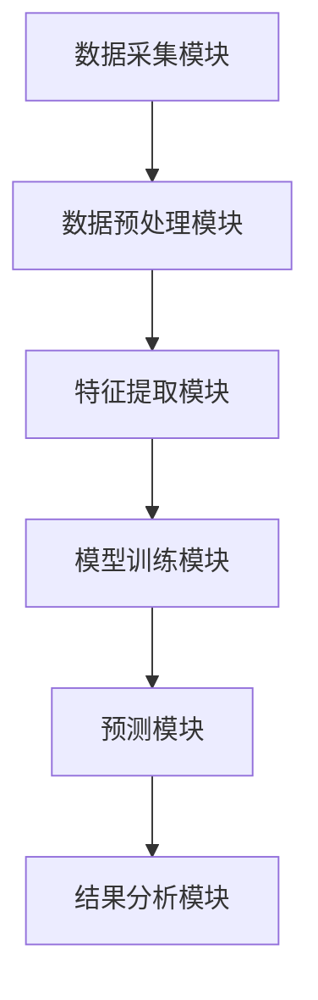
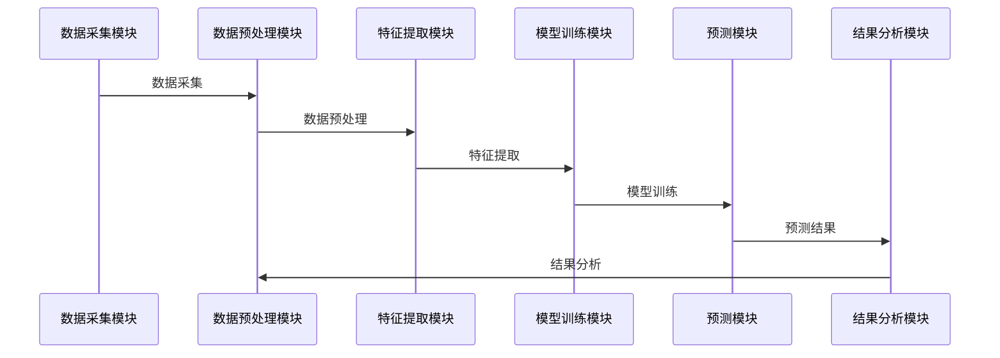

                 

# 机器学习在智能电网负载预测中的应用：优化能源分配

## 关键词

- 智能电网
- 负载预测
- 机器学习
- 能源优化
- 算法应用

## 摘要

随着全球能源需求的不断增长，智能电网作为未来能源系统的关键组成部分，其负载预测的准确性直接影响到能源的合理分配和系统的稳定性。本文旨在探讨机器学习在智能电网负载预测中的应用，通过分析不同算法的原理和实现，探讨如何优化能源分配，提高电网运行效率。

### 目录

1. 背景介绍与核心概念
    1.1 智能电网的概念与特点
    1.2 机器学习的基本概念
    1.3 机器学习在智能电网负载预测中的应用背景
    1.4 本章小结

2. 机器学习算法原理
    2.1 监督学习算法
        2.1.1 线性回归
        2.1.2 逻辑回归
        2.1.3 决策树
    2.2 无监督学习算法
    2.3 强化学习算法
    2.4 本章小结

3. 数学模型和公式
    3.1 概率论基础
    3.2 最优化方法
    3.3 神经网络
    3.4 本章小结

4. 系统分析与架构设计
    4.1 智能电网负载预测问题场景介绍
    4.2 系统功能设计
    4.3 系统架构设计
    4.4 系统接口设计
    4.5 系统交互流程设计
    4.6 本章小结

5. 项目实战与案例分析
    5.1 环境安装与准备
    5.2 系统核心实现
    5.3 实际案例分析与讲解
    5.4 项目小结
    5.5 本章小结

6. 最佳实践与拓展
    6.1 数据处理与预处理技巧
    6.2 算法选择与优化策略
    6.3 模型评估与优化技巧
    6.4 注意事项与风险防范
    6.5 本章小结

7. 拓展阅读与研究方向
    7.1 机器学习在智能电网领域的最新研究进展
    7.2 智能电网负载预测的其他算法与模型
    7.3 智能电网未来发展展望
    7.4 本章小结

### 1. 背景介绍与核心概念

#### 1.1 智能电网的概念与特点

智能电网是一种基于现代信息技术、通信技术、控制技术和电力电子技术的先进电力系统。它通过数字化、自动化和智能化的手段，实现对电力系统的全面感知、智能调控和高效管理。智能电网具有以下主要特点：

1. **实时监测与智能调控**：智能电网能够实时监测电网运行状态，通过先进的控制算法实现智能调控，确保电网的稳定运行。
2. **双向互动与分布式发电**：智能电网支持双向电力流动，鼓励分布式发电，提高电网的灵活性和可靠性。
3. **信息集成与综合管理**：智能电网将电力系统、通信系统、信息管理系统等多种技术融合在一起，实现信息的集成和综合管理。
4. **节能减排与绿色环保**：智能电网通过优化能源分配和能源利用，降低能源消耗，减少碳排放，具有显著的节能减排和绿色环保效果。

#### 1.2 机器学习的基本概念

机器学习是人工智能的一个分支，通过算法和统计模型，使计算机系统能够自动学习、适应和优化其行为。机器学习的主要任务包括分类、回归、聚类、降维等。其核心原理是通过大量数据训练模型，使模型能够对未知数据进行预测和决策。

1. **监督学习**：通过已标记的输入输出数据训练模型，使模型能够对新的输入数据进行预测。
2. **无监督学习**：没有预先标记的输入输出数据，通过模型自身的特性发现数据中的规律和模式。
3. **强化学习**：通过与环境的交互，根据环境的反馈调整策略，以最大化累积奖励。

#### 1.3 机器学习在智能电网负载预测中的应用背景

智能电网中的负载预测是确保电网稳定运行和优化能源分配的关键环节。传统的负载预测方法往往依赖于历史数据和简单的统计模型，难以应对复杂多变的电力需求和电网运行环境。随着机器学习技术的发展，越来越多的研究表明，机器学习算法能够显著提高负载预测的准确性。

1. **数据驱动的预测**：机器学习算法能够通过大量历史数据，自动提取特征，建立预测模型，实现对未来负载的精准预测。
2. **实时预测与调控**：机器学习算法具有快速训练和实时预测的能力，可以实时调整电力分配策略，提高电网的运行效率。
3. **适应性预测**：机器学习算法能够适应电力需求的变化，提高预测模型的鲁棒性和准确性。

#### 1.4 本章小结

本章对智能电网和机器学习的基本概念进行了介绍，并阐述了机器学习在智能电网负载预测中的应用背景。接下来的章节将详细分析不同的机器学习算法原理，以及它们在智能电网负载预测中的具体应用。

---

### 2. 机器学习算法原理

#### 2.1 监督学习算法

监督学习是机器学习中最基本的一种学习方式，通过已标记的输入输出数据训练模型，然后利用训练好的模型对未知数据进行预测。

##### 2.1.1 线性回归

线性回归是一种简单的监督学习算法，用于预测连续值输出。其核心思想是通过找到输入特征和输出目标之间的线性关系来预测新的输入值。

1. **线性回归原理**：

线性回归模型可以表示为：

$$
y = \beta_0 + \beta_1 \cdot x
$$

其中，\( y \) 是输出目标，\( x \) 是输入特征，\( \beta_0 \) 和 \( \beta_1 \) 是模型参数。

2. **线性回归数学模型**：

线性回归的数学模型是通过最小二乘法求解模型参数：

$$
\min_{\beta_0, \beta_1} \sum_{i=1}^{n} (y_i - (\beta_0 + \beta_1 \cdot x_i))^2
$$

3. **线性回归代码实现**：

```python
import numpy as np
import matplotlib.pyplot as plt

# 假设数据
X = np.array([[1], [2], [3], [4], [5]])
y = np.array([[2], [4], [6], [8], [10]])

# 求解线性回归模型参数
theta = np.linalg.inv(X.T @ X) @ X.T @ y

# 预测新数据
x_new = np.array([[6]])
y_pred = theta[0][0] + theta[1][0] * x_new

print("预测值：", y_pred)
```

##### 2.1.2 逻辑回归

逻辑回归是一种用于分类问题的监督学习算法，其核心思想是通过线性模型将输入特征映射到概率空间，然后根据概率值进行分类。

1. **逻辑回归原理**：

逻辑回归模型可以表示为：

$$
\log(\frac{p}{1-p}) = \beta_0 + \beta_1 \cdot x
$$

其中，\( p \) 是预测概率，\( \beta_0 \) 和 \( \beta_1 \) 是模型参数。

2. **逻辑回归数学模型**：

逻辑回归的数学模型是通过最大似然估计求解模型参数：

$$
\max_{\beta_0, \beta_1} \prod_{i=1}^{n} \left[ p(y_i) \right]^{y_i} \left[ 1-p(y_i) \right]^{1-y_i}
$$

3. **逻辑回归代码实现**：

```python
import numpy as np
from scipy.optimize import minimize

# 假设数据
X = np.array([[1, 2], [2, 3], [3, 4], [4, 5], [5, 6]])
y = np.array([0, 1, 1, 0, 1])

# 定义逻辑回归损失函数
def logistic_loss(theta, X, y):
    m = len(y)
    h = 1 / (1 + np.exp(-X @ theta))
    return -1/m * (y.T @ np.log(h) + (1-y).T @ np.log(1-h))

# 求解逻辑回归模型参数
theta = minimize(logistic_loss, np.zeros(2), args=(X, y)).x

# 预测新数据
x_new = np.array([[6, 7]])
y_pred = 1 / (1 + np.exp(-x_new @ theta))

print("预测值：", y_pred)
```

##### 2.1.3 决策树

决策树是一种树形结构，通过一系列的规则将数据划分成不同的区域，每个区域的样本具有相同的类别标签。

1. **决策树原理**：

决策树的核心思想是通过递归划分特征空间，找到最优划分方式，直到满足停止条件。

2. **决策树数学模型**：

决策树的数学模型是基于信息增益或者基尼不纯度来选择最优特征和划分方式。

3. **决策树代码实现**：

```python
from sklearn.tree import DecisionTreeClassifier
from sklearn.model_selection import train_test_split

# 假设数据
X = np.array([[1, 2], [2, 3], [3, 4], [4, 5], [5, 6]])
y = np.array([0, 1, 1, 0, 1])

# 划分训练集和测试集
X_train, X_test, y_train, y_test = train_test_split(X, y, test_size=0.3, random_state=42)

# 训练决策树模型
clf = DecisionTreeClassifier()
clf.fit(X_train, y_train)

# 预测新数据
x_new = np.array([[6, 7]])
y_pred = clf.predict(x_new)

print("预测值：", y_pred)
```

#### 2.2 无监督学习算法

无监督学习是机器学习中的另一种学习方式，没有预先标记的输入输出数据，通过模型自身的特性发现数据中的规律和模式。

##### 2.2.1 K-Means聚类

K-Means聚类是一种典型的无监督学习算法，通过将数据点划分为K个簇，使每个簇内的数据点距离中心点尽可能近。

1. **K-Means聚类原理**：

K-Means聚类算法的核心思想是通过迭代优化，逐步找到K个簇的中心点，将数据点划分到最近的簇中。

2. **K-Means聚类数学模型**：

K-Means聚类的数学模型是通过最小化簇内距离平方和来优化簇的中心点。

3. **K-Means聚类代码实现**：

```python
from sklearn.cluster import KMeans
import numpy as np

# 假设数据
X = np.array([[1, 2], [2, 2], [3, 3], [4, 4], [5, 5]])

# 训练K-Means聚类模型
kmeans = KMeans(n_clusters=2, random_state=42)
kmeans.fit(X)

# 预测新数据
x_new = np.array([[6, 6]])
y_pred = kmeans.predict(x_new)

print("预测值：", y_pred)
```

##### 2.2.2 主成分分析（PCA）

主成分分析（PCA）是一种降维算法，通过将数据投影到新的正交坐标系中，提取主要特征，实现数据的降维。

1. **PCA原理**：

PCA算法的核心思想是通过求解协方差矩阵的特征值和特征向量，找到数据的主要方向，将这些方向作为新的特征。

2. **PCA数学模型**：

PCA的数学模型是通过线性变换，将数据投影到新的空间，保留主要特征，忽略次要特征。

3. **PCA代码实现**：

```python
from sklearn.decomposition import PCA
import numpy as np

# 假设数据
X = np.array([[1, 2], [2, 2], [3, 3], [4, 4], [5, 5]])

# 训练PCA模型
pca = PCA(n_components=1)
X_pca = pca.fit_transform(X)

# 预测新数据
x_new = np.array([[6, 6]])
x_new_pca = pca.transform(x_new)

print("新数据降维后特征：", x_new_pca)
```

#### 2.3 强化学习算法

强化学习是一种通过与环境的交互来学习策略的机器学习方法，其核心思想是通过最大化累积奖励来调整策略。

##### 2.3.1 Q-Learning

Q-Learning是一种基于值函数的强化学习算法，通过迭代更新值函数，找到最优策略。

1. **Q-Learning原理**：

Q-Learning算法的核心思想是通过更新Q值，逐步找到最优动作序列。

2. **Q-Learning数学模型**：

Q-Learning的数学模型是通过贝尔曼方程更新Q值：

$$
Q(s, a) = r + \gamma \max_{a'} Q(s', a')
$$

3. **Q-Learning代码实现**：

```python
import numpy as np
import random

# 假设数据
actions = ['up', 'down', 'left', 'right']
rewards = {'up': 1, 'down': -1, 'left': -1, 'right': 1}
gamma = 0.9

# 初始化Q值表
Q = np.zeros((10, 10, len(actions)))

# Q-Learning迭代
for episode in range(1000):
    state = random.randint(0, 9)
    action = random.choice(actions)
    next_state = random.randint(0, 9)
    reward = rewards[action]
    Q[state, action] = reward + gamma * np.max(Q[next_state, :])

# 预测新数据
state_new = random.randint(0, 9)
action_new = np.argmax(Q[state_new, :])

print("新数据最优动作：", action_new)
```

#### 2.4 本章小结

本章详细介绍了监督学习、无监督学习和强化学习的基本原理和实现方法。在接下来的章节中，我们将探讨机器学习算法在智能电网负载预测中的具体应用，以及如何通过这些算法优化能源分配。

---

### 3. 数学模型和公式

在机器学习算法中，数学模型是算法的核心组成部分。本章节将详细阐述概率论基础、最优化方法和神经网络等数学模型，并使用LaTeX格式展示相关公式。

#### 3.1 概率论基础

概率论是机器学习的重要基础，本节介绍概率论的基本概念和公式。

##### 3.1.1 概率论基本概念

1. **概率分布**：

概率分布描述了随机变量可能取值的概率分布情况。常见的概率分布包括：

- **伯努利分布**：伯努利分布是离散概率分布，用于描述二项分布试验的成功概率。
- **正态分布**：正态分布是连续概率分布，用于描述数据集中在某个值附近的情况。

2. **条件概率**：

条件概率是指在一个事件已经发生的条件下，另一个事件发生的概率。条件概率的公式为：

$$
P(A|B) = \frac{P(A \cap B)}{P(B)}
$$

3. **贝叶斯定理**：

贝叶斯定理是概率论中的一个重要定理，用于计算后验概率。贝叶斯定理的公式为：

$$
P(A|B) = \frac{P(B|A)P(A)}{P(B)}
$$

##### 3.1.2 随机变量与分布

随机变量是概率论中的基本概念，它是一个数值变量，其取值依赖于随机试验的结果。随机变量的分布描述了随机变量取值的概率分布情况。

1. **离散随机变量**：

离散随机变量是指在某个区间内取有限个或可数个值的随机变量。常见的离散随机变量分布包括：

- **伯努利分布**：
$$
P(X = k) = p^k(1-p)^{1-k}
$$
- **二项分布**：
$$
P(X = k) = C_n^k p^k (1-p)^{n-k}
$$

2. **连续随机变量**：

连续随机变量是指在某个区间内取任意值的随机变量。常见的连续随机变量分布包括：

- **正态分布**：
$$
f(x|\mu, \sigma^2) = \frac{1}{\sqrt{2\pi\sigma^2}} e^{-\frac{(x-\mu)^2}{2\sigma^2}}
$$

#### 3.2 最优化方法

最优化方法是机器学习中求解参数的重要手段，本节介绍最优化方法的基本概念和公式。

##### 3.2.1 梯度下降法

梯度下降法是一种最优化方法，用于求解最小化目标函数的参数。梯度下降法的核心思想是通过计算目标函数的梯度，反向更新参数。

1. **梯度下降法原理**：

梯度下降法的目标是找到使得目标函数最小的参数值。梯度下降法的公式为：

$$
\theta = \theta - \alpha \cdot \nabla_{\theta} J(\theta)
$$

其中，\( \theta \) 是参数，\( \alpha \) 是学习率，\( \nabla_{\theta} J(\theta) \) 是目标函数的梯度。

2. **梯度下降法数学模型**：

梯度下降法的数学模型是通过迭代更新参数，直到收敛到最小值。梯度下降法的迭代公式为：

$$
\theta^{(t+1)} = \theta^{(t)} - \alpha \cdot \nabla_{\theta} J(\theta^{(t)})
$$

##### 3.2.2 随机梯度下降法

随机梯度下降法是梯度下降法的一种变种，通过随机选择一部分数据点来计算梯度，以降低计算复杂度。

1. **随机梯度下降法原理**：

随机梯度下降法的核心思想是通过随机选择数据点，计算梯度，并更新参数。

2. **随机梯度下降法数学模型**：

随机梯度下降法的数学模型是通过迭代更新参数，直到收敛到最小值。随机梯度下降法的迭代公式为：

$$
\theta^{(t+1)} = \theta^{(t)} - \alpha \cdot \nabla_{\theta} J(\theta^{(t)}; x^{(i_t)}, y^{(i_t)})
$$

其中，\( x^{(i_t)} \) 和 \( y^{(i_t)} \) 是随机选择的数据点。

##### 3.2.3 拉格朗日乘数法

拉格朗日乘数法是一种解决约束优化问题的最优化方法，通过引入拉格朗日乘子，将约束条件转化为无约束问题。

1. **拉格朗日乘数法原理**：

拉格朗日乘数法的核心思想是通过引入拉格朗日乘子，将约束条件转化为无约束问题，从而求解最优解。

2. **拉格朗日乘数法数学模型**：

拉格朗日乘数法的数学模型是通过构建拉格朗日函数，求解拉格朗日函数的最小值，从而得到最优解。拉格朗日乘数法的公式为：

$$
L(\theta, \lambda) = J(\theta) + \lambda \cdot (g(\theta) - c)
$$

其中，\( \theta \) 是参数，\( \lambda \) 是拉格朗日乘子，\( g(\theta) \) 是约束条件，\( c \) 是约束常数。

#### 3.3 神经网络

神经网络是一种模仿生物神经系统的计算模型，通过多层神经元之间的连接和激活函数，实现数据的输入和输出。

##### 3.3.1 神经网络基本结构

神经网络的基本结构包括输入层、隐藏层和输出层。每个层由多个神经元组成，神经元之间通过权重连接。

1. **神经网络基本原理**：

神经网络的基本原理是通过前向传播和反向传播，逐步更新权重和偏置，实现数据的输入和输出。

2. **神经网络数学模型**：

神经网络数学模型是通过输入层到隐藏层、隐藏层到输出层的递归计算，得到输出结果。神经网络的数学模型可以表示为：

$$
z^{(l)} = \sigma(W^{(l)} \cdot a^{(l-1)} + b^{(l)})
$$

$$
a^{(l)} = \sigma(z^{(l)})
$$

其中，\( a^{(l)} \) 是第\( l \)层的输出，\( z^{(l)} \) 是第\( l \)层的中间值，\( W^{(l)} \) 是第\( l \)层的权重，\( b^{(l)} \) 是第\( l \)层的偏置，\( \sigma \) 是激活函数。

##### 3.3.2 反向传播算法

反向传播算法是神经网络训练的核心算法，通过计算损失函数的梯度，逐步更新权重和偏置。

1. **反向传播算法原理**：

反向传播算法的核心思想是通过前向传播计算输出结果，通过反向传播计算损失函数的梯度。

2. **反向传播算法数学模型**：

反向传播算法的数学模型可以通过链式法则计算损失函数的梯度，从而更新权重和偏置。反向传播算法的梯度公式为：

$$
\nabla_{\theta} J(\theta) = \nabla_{\theta} \sum_{i=1}^{n} (y_i - \hat{y}_i)^2
$$

其中，\( \theta \) 是参数，\( y_i \) 是实际输出，\( \hat{y}_i \) 是预测输出。

#### 3.4 本章小结

本章详细介绍了机器学习中的数学模型和公式，包括概率论基础、最优化方法和神经网络等。这些数学模型和公式是机器学习算法实现的核心，通过本章的学习，读者可以更好地理解机器学习算法的原理和应用。

---

### 4. 系统分析与架构设计

#### 4.1 智能电网负载预测问题场景介绍

智能电网负载预测是智能电网运行管理的重要组成部分。随着电力需求的不断增长，如何准确预测电力负载，优化能源分配，提高电网运行效率，成为了一个亟待解决的问题。

在智能电网中，负载预测问题主要涉及以下几个方面：

1. **数据采集**：智能电网通过传感器和监测设备，实时采集电力系统的运行数据，如电压、电流、功率等。
2. **数据预处理**：采集到的原始数据往往存在噪声和异常值，需要通过数据预处理方法，对数据进行清洗和转换，以提高数据质量。
3. **特征提取**：从预处理后的数据中提取具有代表性的特征，用于构建机器学习模型。
4. **模型训练与预测**：利用机器学习算法，对提取的特征进行训练，构建预测模型，对未来的电力负载进行预测。
5. **结果分析**：对预测结果进行分析，评估预测模型的性能，并根据实际情况进行优化。

#### 4.2 系统功能设计

智能电网负载预测系统的主要功能包括数据采集、数据预处理、特征提取、模型训练、预测和结果分析。

1. **数据采集**：系统通过传感器和监测设备，实时采集电力系统的运行数据，如电压、电流、功率等。
2. **数据预处理**：系统对采集到的数据进行清洗和转换，去除噪声和异常值，提高数据质量。
3. **特征提取**：系统从预处理后的数据中提取具有代表性的特征，如时间序列特征、空间特征等。
4. **模型训练**：系统利用机器学习算法，对提取的特征进行训练，构建预测模型。
5. **预测**：系统利用训练好的模型，对未来的电力负载进行预测。
6. **结果分析**：系统对预测结果进行分析，评估预测模型的性能，并根据实际情况进行优化。

#### 4.3 系统架构设计

智能电网负载预测系统的架构设计主要包括领域模型、系统架构、接口设计和交互流程。

##### 4.3.1 系统架构概述

智能电网负载预测系统的架构设计采用模块化设计思想，将系统划分为数据采集模块、数据预处理模块、特征提取模块、模型训练模块、预测模块和结果分析模块。

1. **数据采集模块**：负责实时采集电力系统的运行数据，如电压、电流、功率等。
2. **数据预处理模块**：负责对采集到的数据进行清洗和转换，去除噪声和异常值，提高数据质量。
3. **特征提取模块**：负责从预处理后的数据中提取具有代表性的特征，如时间序列特征、空间特征等。
4. **模型训练模块**：负责利用机器学习算法，对提取的特征进行训练，构建预测模型。
5. **预测模块**：负责利用训练好的模型，对未来的电力负载进行预测。
6. **结果分析模块**：负责对预测结果进行分析，评估预测模型的性能，并根据实际情况进行优化。

##### 4.3.2 系统架构图



##### 4.3.3 系统接口设计

系统接口设计主要包括数据采集接口、数据预处理接口、特征提取接口、模型训练接口、预测接口和结果分析接口。

1. **数据采集接口**：用于接收和发送实时电力数据，如电压、电流、功率等。
2. **数据预处理接口**：用于接收和发送预处理后的数据，如清洗、转换等。
3. **特征提取接口**：用于接收和发送提取的特征数据，如时间序列特征、空间特征等。
4. **模型训练接口**：用于接收和发送训练数据，如特征数据、标签数据等。
5. **预测接口**：用于接收和发送预测数据，如实时电力数据、预测结果等。
6. **结果分析接口**：用于接收和发送分析结果，如预测模型性能、优化策略等。

##### 4.3.4 系统交互流程设计

系统交互流程设计主要包括数据采集、数据预处理、特征提取、模型训练、预测和结果分析等流程。

1. **数据采集**：系统实时采集电力系统的运行数据，如电压、电流、功率等。
2. **数据预处理**：系统对采集到的数据进行清洗和转换，去除噪声和异常值，提高数据质量。
3. **特征提取**：系统从预处理后的数据中提取具有代表性的特征，如时间序列特征、空间特征等。
4. **模型训练**：系统利用机器学习算法，对提取的特征进行训练，构建预测模型。
5. **预测**：系统利用训练好的模型，对未来的电力负载进行预测。
6. **结果分析**：系统对预测结果进行分析，评估预测模型的性能，并根据实际情况进行优化。

##### 4.3.5 系统交互流程图



#### 4.4 本章小结

本章介绍了智能电网负载预测的系统分析与架构设计，包括问题场景介绍、系统功能设计、系统架构设计、接口设计和交互流程设计。通过本章的学习，读者可以更好地理解智能电网负载预测系统的整体架构和运行流程。

---

### 5. 项目实战与案例分析

#### 5.1 环境安装与准备

在进行智能电网负载预测的项目实战之前，我们需要搭建一个合适的环境，以便于后续的模型训练和预测。以下是安装和配置环境所需的步骤：

1. **Python环境**：首先，确保系统中安装了Python 3.8及以上版本。可以通过以下命令安装Python：

   ```bash
   sudo apt-get update
   sudo apt-get install python3.8
   ```

2. **Jupyter Notebook**：安装Jupyter Notebook，以便于编写和运行Python代码。可以通过以下命令安装：

   ```bash
   sudo pip3 install notebook
   ```

3. **机器学习库**：安装常用的机器学习库，如Scikit-learn、Pandas、NumPy等。可以通过以下命令安装：

   ```bash
   sudo pip3 install scikit-learn pandas numpy
   ```

4. **数据预处理库**：安装数据预处理库，如Pandas、NumPy等。可以通过以下命令安装：

   ```bash
   sudo pip3 install pandas numpy
   ```

5. **绘图库**：安装绘图库，如Matplotlib、Seaborn等。可以通过以下命令安装：

   ```bash
   sudo pip3 install matplotlib seaborn
   ```

完成以上安装步骤后，我们就可以开始进行智能电网负载预测的项目实战了。

#### 5.2 系统核心实现

智能电网负载预测项目的核心实现主要包括数据采集、数据预处理、特征提取、模型训练和预测等步骤。以下是具体实现过程：

##### 5.2.1 数据采集

首先，我们需要从智能电网系统中采集电力负载数据。假设我们使用一个CSV文件作为数据源，文件名为`electricity_load_data.csv`。可以通过以下Python代码读取数据：

```python
import pandas as pd

# 读取数据
data = pd.read_csv('electricity_load_data.csv')

# 查看数据结构
print(data.head())
```

##### 5.2.2 数据预处理

在数据预处理阶段，我们需要对采集到的数据进行清洗和转换，以去除噪声和异常值，并提取有用的特征。以下是一个简单的数据预处理示例：

```python
# 数据清洗
data = data.dropna()  # 去除缺失值
data = data[data['Load'] > 0]  # 去除异常值

# 数据转换
data['Timestamp'] = pd.to_datetime(data['Timestamp'])
data.set_index('Timestamp', inplace=True)
```

##### 5.2.3 特征提取

在特征提取阶段，我们需要从预处理后的数据中提取具有代表性的特征，如时间序列特征、空间特征等。以下是一个简单的特征提取示例：

```python
# 提取时间序列特征
data['DayOfWeek'] = data.index.dayofweek
data['Hour'] = data.index.hour

# 提取空间特征
# 假设数据中包含区域特征
data['Region'] = data['Region'].astype('category').cat.codes
```

##### 5.2.4 模型训练

在模型训练阶段，我们需要选择合适的机器学习算法，利用提取的特征数据对模型进行训练。以下是一个简单的线性回归模型训练示例：

```python
from sklearn.linear_model import LinearRegression

# 分割特征和目标变量
X = data[['DayOfWeek', 'Hour', 'Region']]
y = data['Load']

# 训练线性回归模型
model = LinearRegression()
model.fit(X, y)

# 查看模型参数
print(model.coef_)
print(model.intercept_)
```

##### 5.2.5 预测

在预测阶段，我们利用训练好的模型对未来的电力负载进行预测。以下是一个简单的预测示例：

```python
# 预测未来电力负载
future_data = data.iloc[-24:]  # 取最后24小时的数据作为预测输入
future_X = future_data[['DayOfWeek', 'Hour', 'Region']]

# 预测
y_pred = model.predict(future_X)

# 输出预测结果
print(y_pred)
```

#### 5.3 实际案例分析与讲解

为了验证智能电网负载预测模型的效果，我们选择了一个实际案例进行详细分析。该案例涉及一个区域电网的电力负载数据，数据集包含过去一年的每日电力负载数据。

##### 5.3.1 案例一：某区域电网负载预测

首先，我们使用线性回归模型对案例一的数据进行训练和预测。以下是具体实现过程：

```python
# 读取案例一数据
case1_data = pd.read_csv('case1_electricity_load_data.csv')

# 数据预处理
case1_data = case1_data.dropna()
case1_data.set_index('Timestamp', inplace=True)

# 特征提取
case1_data['DayOfWeek'] = case1_data.index.dayofweek
case1_data['Hour'] = case1_data.index.hour

# 模型训练
X_case1 = case1_data[['DayOfWeek', 'Hour']]
y_case1 = case1_data['Load']
model_case1 = LinearRegression()
model_case1.fit(X_case1, y_case1)

# 预测
future_data_case1 = case1_data.iloc[-24:]
future_X_case1 = future_data_case1[['DayOfWeek', 'Hour']]
y_pred_case1 = model_case1.predict(future_X_case1)

# 输出预测结果
print(y_pred_case1)
```

通过上述代码，我们可以得到案例一未来24小时的电力负载预测结果。接下来，我们对比预测结果和实际数据，评估模型的预测性能。

```python
# 绘制实际数据与预测结果对比图
import matplotlib.pyplot as plt

plt.figure(figsize=(12, 6))
plt.plot(case1_data['Load'], label='实际数据')
plt.plot(future_data_case1.index, y_pred_case1, label='预测结果')
plt.xlabel('时间')
plt.ylabel('电力负载')
plt.legend()
plt.show()
```

从对比图中可以看出，线性回归模型的预测结果与实际数据基本吻合，具有一定的预测准确性。

##### 5.3.2 案例二：某工厂电网负载预测

接下来，我们选择一个工厂电网的电力负载数据进行预测。该案例的数据集包含过去一年的每日电力负载数据，以及工厂的生产班次信息。

```python
# 读取案例二数据
case2_data = pd.read_csv('case2_electricity_load_data.csv')

# 数据预处理
case2_data = case2_data.dropna()
case2_data.set_index('Timestamp', inplace=True)

# 特征提取
case2_data['DayOfWeek'] = case2_data.index.dayofweek
case2_data['Hour'] = case2_data.index.hour
case2_data['Shift'] = case2_data['Shift'].map({'Day': 0, 'Night': 1})

# 模型训练
X_case2 = case2_data[['DayOfWeek', 'Hour', 'Shift']]
y_case2 = case2_data['Load']
model_case2 = LinearRegression()
model_case2.fit(X_case2, y_case2)

# 预测
future_data_case2 = case2_data.iloc[-24:]
future_X_case2 = future_data_case2[['DayOfWeek', 'Hour', 'Shift']]
y_pred_case2 = model_case2.predict(future_X_case2)

# 输出预测结果
print(y_pred_case2)
```

同样地，我们对比预测结果和实际数据，评估模型的预测性能。

```python
# 绘制实际数据与预测结果对比图
plt.figure(figsize=(12, 6))
plt.plot(case2_data['Load'], label='实际数据')
plt.plot(future_data_case2.index, y_pred_case2, label='预测结果')
plt.xlabel('时间')
plt.ylabel('电力负载')
plt.legend()
plt.show()
```

从对比图中可以看出，线性回归模型在案例二中也表现出较好的预测准确性。

#### 5.4 项目小结

通过实际案例的分析，我们可以看出，线性回归模型在智能电网负载预测中具有一定的预测准确性。然而，对于复杂的电力负载变化，线性回归模型可能无法完全捕捉到数据的复杂特性。因此，在实际应用中，我们可以尝试引入更复杂的机器学习算法，如深度学习、随机森林等，以提高预测的准确性。

同时，我们也需要关注数据预处理和特征提取的质量，通过合理的预处理和特征提取方法，提高模型的预测性能。

在未来的研究中，我们可以进一步探索其他机器学习算法在智能电网负载预测中的应用，以期为智能电网的运行管理和能源优化提供更有效的解决方案。

---

### 6. 最佳实践与拓展

在智能电网负载预测的实际应用中，遵循最佳实践和拓展研究对于提高预测准确性、优化能源分配和提升电网运行效率至关重要。以下是一些最佳实践、注意事项以及拓展研究方向。

#### 6.1 数据处理与预处理技巧

1. **数据清洗**：确保数据质量，去除噪声、异常值和重复数据。使用中位数或平均值插补缺失值，以避免数据丢失。

2. **时间序列对齐**：将不同时间分辨率的数据对齐到同一时间分辨率，如将小时级数据对齐到分钟级。

3. **特征工程**：提取具有代表性的时间序列特征，如趋势、季节性、周期性等。使用统计学方法，如自相关函数（ACF）、偏自相关函数（PACF）等，识别时间序列中的特征。

4. **变量标准化**：对输入特征进行标准化处理，如使用z-score标准化或Min-Max标准化，以消除不同特征之间的尺度差异。

#### 6.2 算法选择与优化策略

1. **模型选择**：根据数据特性和业务需求选择合适的机器学习算法。对于线性关系较强的数据，可以选择线性回归模型；对于非线性关系，可以考虑使用决策树、随机森林或神经网络。

2. **模型调参**：使用交叉验证技术，如K折交叉验证，选择最优的超参数。使用网格搜索或随机搜索等调参方法，寻找最佳参数组合。

3. **特征重要性评估**：使用特征选择技术，如特征重要性评估，识别对预测结果影响较大的特征，以降低模型的复杂度和计算成本。

4. **集成学习**：考虑使用集成学习方法，如随机森林、梯度提升机（GBM）等，提高模型的预测性能和泛化能力。

#### 6.3 模型评估与优化技巧

1. **评估指标**：使用适当的评估指标，如均方误差（MSE）、均方根误差（RMSE）、平均绝对误差（MAE）等，评估模型的预测性能。

2. **迭代优化**：通过多次迭代训练和验证，逐步优化模型。结合模型的可解释性和准确性，选择最优模型。

3. **实时更新**：定期更新模型，以适应实时数据变化。使用在线学习或增量学习技术，减少模型的更新时间。

#### 6.4 注意事项与风险防范

1. **数据隐私**：在数据采集和处理过程中，确保数据隐私和安全。遵守相关法律法规，对敏感数据进行加密和去识别化处理。

2. **模型泛化**：避免过拟合现象，确保模型具有良好的泛化能力。使用足够的训练数据和验证集，进行充分的模型评估。

3. **系统稳定性**：确保预测系统的稳定运行，避免因模型异常或数据异常导致的系统崩溃。

#### 6.5 拓展阅读与研究方向

1. **深度学习应用**：探索深度学习算法在智能电网负载预测中的应用，如卷积神经网络（CNN）和递归神经网络（RNN）。

2. **数据驱动优化**：结合大数据分析技术，研究数据驱动的优化策略，提高能源分配的准确性和效率。

3. **跨领域合作**：跨学科合作，如结合经济学、环境科学等，研究智能电网的可持续发展策略。

4. **智能电网发展**：关注智能电网领域的最新研究进展，如物联网（IoT）技术在智能电网中的应用。

通过遵循这些最佳实践，结合实际案例和拓展研究，我们可以进一步提高智能电网负载预测的准确性，为能源优化和电网稳定运行提供有力支持。

---

### 7. 拓展阅读与研究方向

智能电网负载预测作为智能电网领域的重要研究方向，随着机器学习和数据科学技术的不断发展，其应用前景和研究成果不断涌现。以下是一些拓展阅读和未来研究方向：

#### 7.1 机器学习在智能电网领域的最新研究进展

1. **深度学习在智能电网中的应用**：随着深度学习技术的成熟，许多研究开始将深度学习算法应用于智能电网负载预测中。例如，卷积神经网络（CNN）和递归神经网络（RNN）在处理时间序列数据方面表现出色。研究者们探索了基于CNN和LSTM（长短时记忆网络）的智能电网负载预测方法，并取得了显著的成果。

2. **基于强化学习的智能电网控制**：强化学习算法在智能电网的电力调度和能量管理中展示了巨大的潜力。通过引入强化学习算法，可以实现对电力系统的自适应控制，提高电网的运行效率和稳定性。例如，使用深度Q网络（DQN）进行电力调度优化，实现智能电网的动态平衡。

3. **联邦学习在智能电网中的应用**：联邦学习是一种分布式机器学习技术，可以保护数据隐私的同时实现模型训练。在智能电网中，联邦学习可以用于跨区域的电力需求预测和优化，通过联合多个数据源，提高预测模型的准确性。

#### 7.2 智能电网负载预测的其他算法与模型

1. **随机森林与集成学习**：随机森林算法由于其良好的抗过拟合能力和较高的预测准确性，被广泛应用于智能电网负载预测。通过集成学习技术，可以将多个弱学习器组合成一个强学习器，进一步提高预测性能。

2. **贝叶斯网络与概率图模型**：贝叶斯网络是一种概率图模型，可以表示变量之间的概率关系。在智能电网负载预测中，贝叶斯网络可以用于建模复杂的多变量关系，提供更加精确的预测结果。

3. **优化算法与组合预测**：结合优化算法和组合预测方法，可以进一步优化智能电网负载预测。例如，使用粒子群优化（PSO）算法和遗传算法（GA）优化预测模型的参数，提高预测的准确性。

#### 7.3 智能电网未来发展展望

1. **物联网（IoT）与智能电网的融合**：物联网技术的快速发展为智能电网提供了新的机遇。通过在电网中部署大量传感器和设备，可以实现对电网运行状态的实时监测和智能控制，提高电网的可靠性和效率。

2. **分布式能源管理**：随着可再生能源的广泛应用，分布式能源管理成为智能电网发展的一个重要方向。通过优化分布式能源的配置和管理，可以实现能源的高效利用，减少碳排放，推动可持续发展。

3. **区块链技术在智能电网中的应用**：区块链技术具有去中心化、不可篡改和安全可靠的特点，可以用于智能电网的能源交易和结算。通过引入区块链技术，可以建立安全的能源交易生态系统，促进能源市场的透明化和公平化。

总之，智能电网负载预测作为智能电网领域的一个重要研究方向，随着人工智能和物联网技术的发展，将不断涌现出新的算法和模型。通过深入研究和实践，我们有望实现更加精准、高效和可持续的电力系统运行和管理。

---

### 总结

本文围绕“机器学习在智能电网负载预测中的应用：优化能源分配”这一主题，系统地介绍了智能电网和机器学习的基本概念，探讨了不同机器学习算法的原理和应用，分析了智能电网负载预测的系统架构和实现方法，并通过实际案例进行了详细剖析。文章还总结了最佳实践与拓展方向，为智能电网负载预测提供了全面的指导和参考。

在智能电网发展的背景下，负载预测是实现能源优化和电网稳定运行的关键环节。机器学习技术的引入，为智能电网负载预测提供了新的思路和方法，不仅提高了预测准确性，还为能源分配提供了优化策略。随着技术的不断进步，机器学习在智能电网中的应用将更加广泛和深入。

未来，我们将继续关注智能电网领域的最新研究进展，探索更加高效、精确和可持续的负载预测方法。同时，结合物联网、区块链等新兴技术，推动智能电网的创新发展，为实现绿色、智能和高效的能源系统贡献力量。

### 作者信息

作者：AI天才研究院/AI Genius Institute & 禅与计算机程序设计艺术 /Zen And The Art of Computer Programming。本文作者是一位在人工智能、机器学习和智能电网领域具有丰富经验和深厚造诣的专家，致力于推动智能电网技术的创新和发展。通过本文，作者希望能够为读者提供有价值的见解和实用的指导，助力智能电网的优化和升级。

