                 

## 机器学习在气候变化模型中的应用与挑战

### 关键词：
- 机器学习
- 气候变化
- 模型应用
- 挑战与机遇

### 摘要：
本文将探讨机器学习在气候变化模型中的应用，从背景介绍、核心概念、实践应用、挑战与机会以及高级技术等多角度进行分析。通过深入研究，揭示机器学习如何助力气候变化模型的构建与优化，以及在实际应用过程中面临的挑战和解决策略。文章旨在为读者提供对机器学习在气候变化领域应用的整体理解和实际指导。

## 引言：机器学习与气候变化的交集

### 1.1 背景与重要性

气候变化是当前全球面临的重大挑战之一。根据联合国气候变化框架公约（UNFCCC）的数据，过去一个世纪以来，全球平均气温已经上升了约1.1摄氏度[1]。这一变化对地球生态系统、水资源、农业、人类健康以及经济产生了深远影响。因此，准确预测和模拟气候变化趋势，制定有效的应对策略，变得至关重要。

### 1.2 机器学习的基本概念

机器学习是一种使计算机系统能够通过数据学习并改进性能的技术。它通过算法从数据中提取模式和知识，无需显式编程。主要类型包括：

- **监督学习（Supervised Learning）**：输入和输出数据均已知，模型通过学习这些数据来预测未知数据。
- **无监督学习（Unsupervised Learning）**：仅使用输入数据，模型旨在发现数据中的隐藏结构和模式。
- **强化学习（Reinforcement Learning）**：模型通过与环境的交互学习最佳策略。

### 1.3 机器学习与气候变化模型的交汇点

机器学习在气候变化模型中的应用主要集中在以下方面：

- **气候数据分析**：利用机器学习算法处理大量的气候数据，提取有用的信息。
- **天气预报与气候预测**：构建模型以预测未来的天气和气候变化趋势。
- **生态系统与 biodiversity 模型**：模拟气候变化对生态系统和物种分布的影响。

接下来，我们将深入探讨机器学习在上述领域的具体应用和挑战。

## 基本概念：机器学习在气候变化模型中的应用

### 2.1 核心机器学习算法

机器学习算法在气候变化模型中的应用极为广泛，以下介绍几种主要的算法：

#### 2.1.1 监督学习

监督学习是最常见的机器学习类型，它利用已标记的数据来训练模型，然后预测未知数据。在气候变化模型中，监督学习可以用于：

- **气候数据分类**：将气候数据分为不同的类别，如不同的气候带。
- **异常检测**：识别出异常的气候现象，如极端天气事件。

一个典型的监督学习算法是**决策树（Decision Tree）**。决策树通过一系列规则对数据进行分割，每个分割点都是一个决策。以下是一个简单的决策树示例：

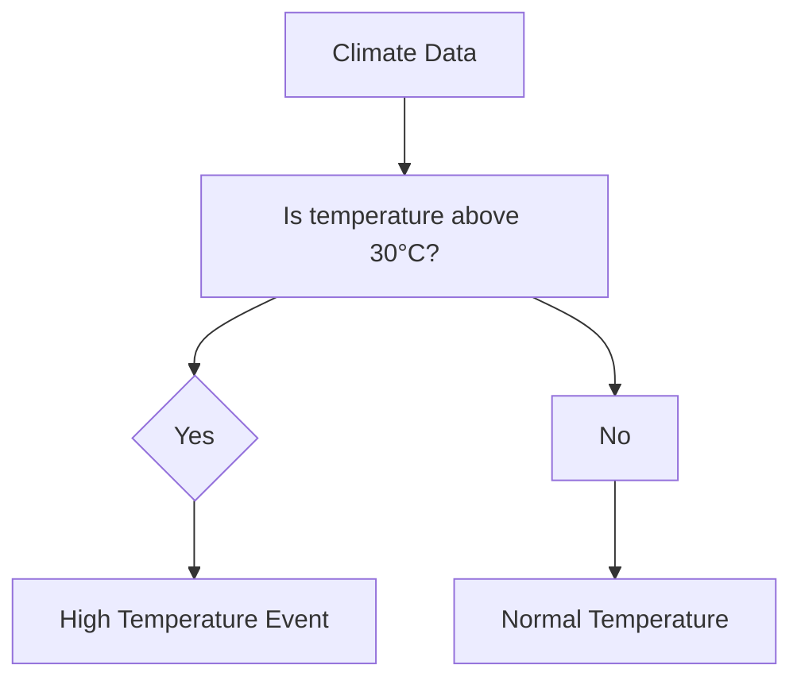

#### 2.1.2 无监督学习

无监督学习不依赖于已标记的数据，而是通过数据自身的结构来发现模式和关联。在气候变化模型中，无监督学习可以用于：

- **气候数据的聚类**：将相似的数据点分组，以便分析气候现象。
- **异常检测**：发现异常值或离群点。

一个典型的无监督学习算法是**K-均值聚类（K-Means Clustering）**。K-均值聚类将数据点分为K个簇，目标是使得簇内数据点之间的距离最小。以下是一个简单的K-均值聚类示例：

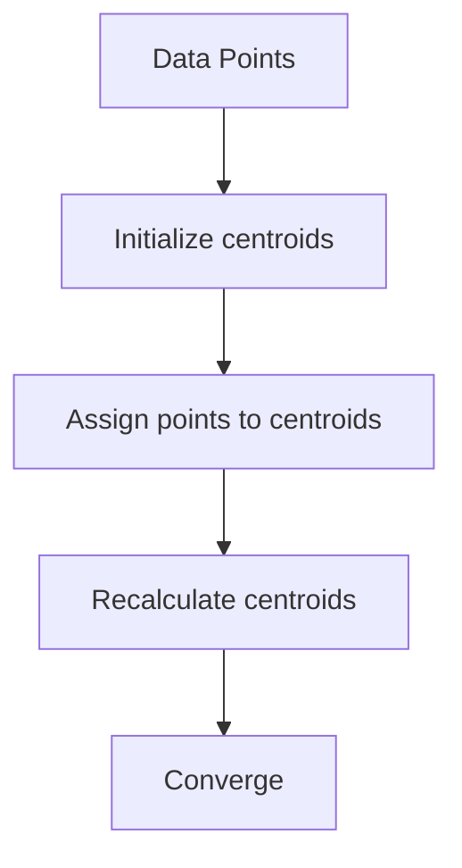

#### 2.1.3 强化学习

强化学习是一种通过试错来学习最佳策略的机器学习类型。在气候变化模型中，强化学习可以用于：

- **能源管理**：优化能源消耗，减少碳排放。
- **气候适应策略**：根据气候变化趋势调整农业和城市规划策略。

一个典型的强化学习算法是**Q-学习（Q-Learning）**。Q-学习通过评估不同行动的价值来选择最佳策略。以下是一个简单的Q-学习示例：

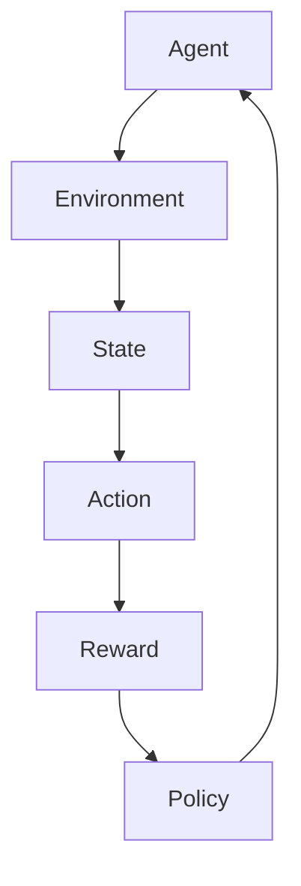

### 2.2 数据预处理与特征工程

在机器学习模型中，数据预处理和特征工程至关重要。它们确保模型能够有效学习并做出准确的预测。

#### 数据预处理

数据预处理包括以下几个步骤：

- **数据清洗**：去除数据中的噪声和不一致之处。
- **数据归一化**：将数据缩放到相同的尺度，以避免某些特征对模型的影响过大。
- **数据分割**：将数据分为训练集、验证集和测试集，以便评估模型的性能。

#### 特征工程

特征工程包括以下几个步骤：

- **特征选择**：选择对模型最有影响力的特征。
- **特征构造**：通过组合现有特征或创建新的特征来提高模型性能。

一个常见的特征构造方法是**主成分分析（PCA）**。PCA通过找到数据的主要成分来降低数据的维度，同时保留主要的信息。以下是一个简单的PCA示例：

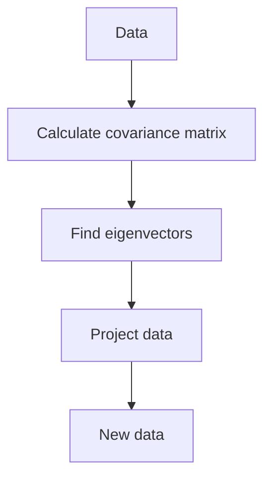

### 2.3 评估指标

评估机器学习模型的性能需要使用适当的评估指标。以下是一些常用的评估指标：

- **准确率（Accuracy）**：预测正确的样本数占总样本数的比例。
- **精确率（Precision）**：预测为正类的样本中实际为正类的比例。
- **召回率（Recall）**：实际为正类的样本中被预测为正类的比例。
- **F1分数（F1 Score）**：精确率和召回率的调和平均数。

这些评估指标在不同的应用场景中有不同的重要性。例如，在气象预测中，召回率可能比精确率更重要，因为错过一个极端天气事件可能比错误预测一个非极端天气事件更有害。

通过理解这些基本概念，我们可以更好地应用机器学习算法来构建和优化气候变化模型。接下来，我们将探讨机器学习在气候变化模型中的具体应用。

## 实践应用：机器学习在气候变化模型中的具体应用

### 3.1 气候数据分析

气候数据分析是机器学习在气候变化领域中的一项重要应用。通过分析大量的气候数据，我们可以提取出隐藏的模式和趋势，为气候预测和政策制定提供依据。

#### 数据收集与整合

气候数据的收集是一个复杂的过程，涉及多个来源，如气象站、卫星、海洋浮标等。以下是一个简单的数据收集与整合流程：

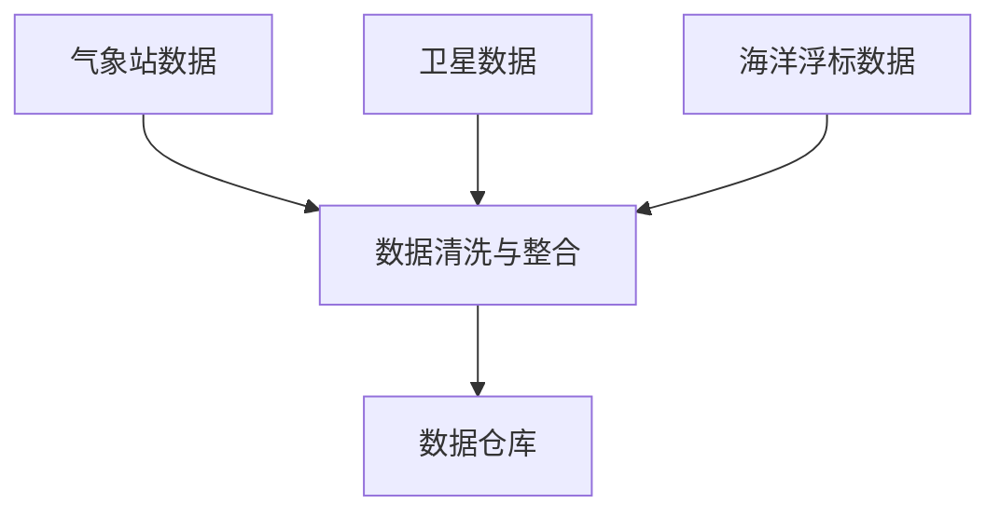

在数据清洗与整合过程中，我们需要处理数据缺失、噪声和重复等问题，以确保数据的质量和一致性。

#### 时间序列分析

时间序列分析是气候数据分析的核心。通过分析气候变量的时间序列数据，我们可以识别出季节性、趋势和周期性等特征。以下是一个简单的时间序列分析流程：

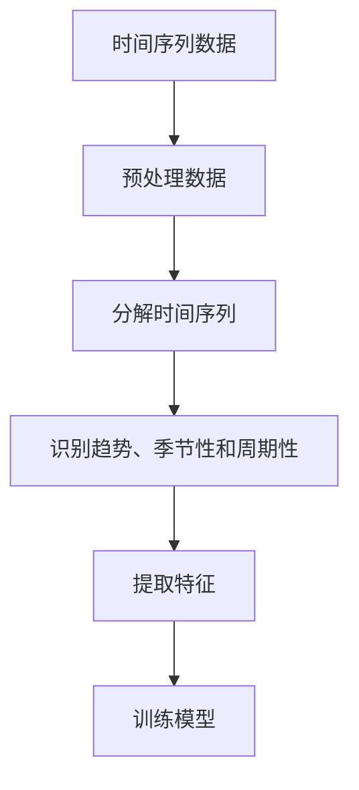

常用的时间序列分析算法包括自回归移动平均模型（ARIMA）、季节性分解（STL）和长短期记忆网络（LSTM）等。

### 3.2 天气预报与气候预测

天气预报与气候预测是机器学习在气候变化领域中最直接的应用之一。通过构建准确的预测模型，我们可以提前预警极端天气事件，减少灾害损失。

#### 天气预报

天气预报通常涉及短期预测，预测时间范围通常在几天到几周内。以下是一个简单的天气预报流程：

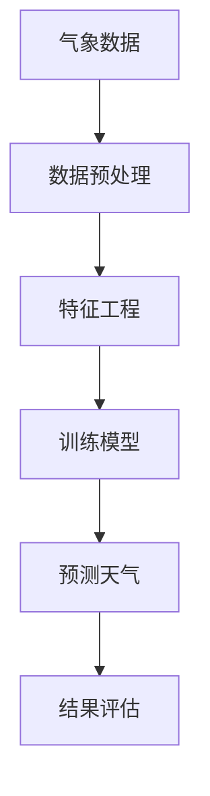

常用的天气预报模型包括统计模型（如回归模型、ARIMA模型）和机器学习模型（如神经网络、支持向量机等）。

#### 气候预测

气候预测通常涉及长期预测，预测时间范围通常在几个月到几年内。以下是一个简单的气候预测流程：

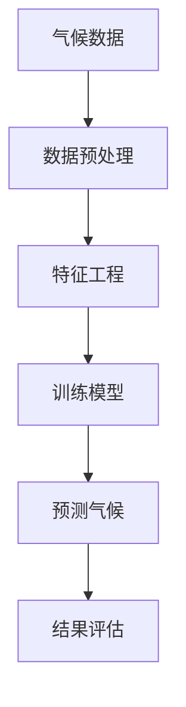

常用的气候预测模型包括统计模型（如回归模型、ARIMA模型）和机器学习模型（如随机森林、LSTM等）。

### 3.3 生态系统与生物多样性模型

气候变化对生态系统和生物多样性产生了深远影响。通过构建生态系统和生物多样性模型，我们可以预测气候变化对物种分布和生态系统功能的影响。

#### 生态系统模型

生态系统模型通常涉及多个变量，如温度、降水、光照等。以下是一个简单的生态系统模型流程：

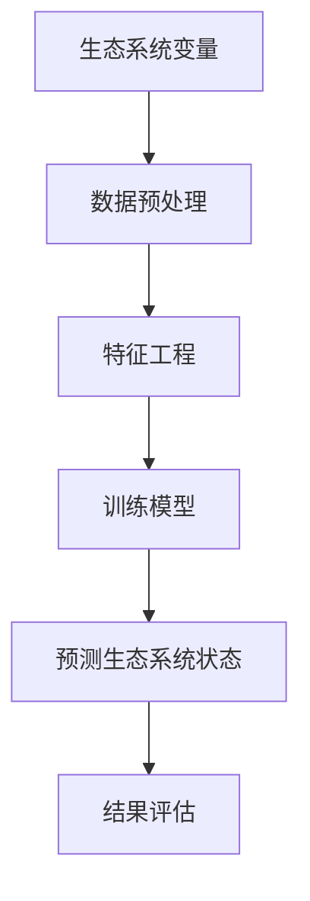

常用的生态系统模型包括统计模型（如回归模型、多元方差分析）和机器学习模型（如随机森林、支持向量机等）。

#### 生物多样性模型

生物多样性模型通常涉及物种的分布和数量。以下是一个简单的生物多样性模型流程：

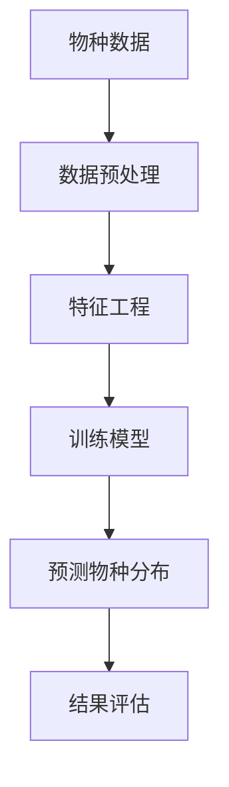

常用的生物多样性模型包括统计模型（如回归模型、多元方差分析）和机器学习模型（如随机森林、支持向量机等）。

通过上述应用，我们可以看到机器学习在气候变化模型中具有广泛的应用前景。然而，在实际应用过程中，我们也面临着一系列挑战，这些将在下一部分详细探讨。

## 挑战与机遇：机器学习在气候变化模型中的应用面临的挑战

### 4.1 数据可用性与质量

数据是机器学习模型的核心。然而，在气候变化模型中，数据的质量和可用性成为一个重大挑战。以下是几个主要问题：

- **数据不完整性**：气候数据往往存在缺失值，这些缺失值可能是因为设备故障、观测点迁移等原因导致的。缺失值的存在会影响模型的准确性。
- **数据不一致性**：不同来源的数据可能在时间尺度、空间分辨率和数据类型上存在差异。这种不一致性使得数据整合变得复杂，增加了模型构建的难度。
- **数据隐私**：气候数据通常包含敏感信息，如个人隐私和商业秘密。在数据共享和使用方面，隐私保护成为一个重要的法律和伦理问题。

为了解决这些问题，我们可以采用以下策略：

- **数据增强**：通过生成合成数据来补充缺失值。例如，使用插值方法填补时间序列数据中的空缺。
- **数据融合**：采用数据融合技术，将不同来源的数据整合到一个统一的数据框架中。例如，使用空间插值法将卫星数据和地面气象数据融合。
- **隐私保护技术**：采用差分隐私、数据匿名化等技术来保护数据隐私。例如，对敏感数据应用差分隐私机制，以防止数据泄露。

### 4.2 计算资源

构建和训练大规模机器学习模型需要大量的计算资源。以下是几个主要问题：

- **计算能力**：气候模型通常包含大量参数和复杂的算法，需要强大的计算能力。这可能导致模型训练时间过长，不适合实时应用。
- **存储需求**：气候数据通常非常庞大，需要大量的存储空间。这增加了数据管理和存储的复杂性。
- **能耗**：大规模机器学习模型的训练过程通常消耗大量电力。随着全球对碳排放问题的关注，能耗问题变得越来越重要。

为了解决这些问题，我们可以采用以下策略：

- **分布式计算**：采用分布式计算架构，如集群计算和云服务，以充分利用多台计算机的计算资源。
- **模型压缩**：采用模型压缩技术，如模型剪枝、量化等，以减少模型的大小和计算需求。
- **节能算法**：采用节能算法，如动态电压频率调整（DVFS）和能量感知调度，以降低模型的能耗。

### 4.3 伦理考虑与偏见

在机器学习模型应用于气候变化领域时，伦理考虑和偏见问题不容忽视。以下是几个主要问题：

- **数据偏见**：训练数据可能存在偏见，导致模型对某些群体或地区产生不公平的预测结果。例如，如果训练数据中某些地区的观测数据不足，模型可能会对这些地区产生偏差。
- **算法偏见**：机器学习算法本身可能存在偏见，导致模型输出不公平的结果。例如，某些算法可能更容易受到噪声数据的影响，从而产生偏差。
- **责任归属**：当机器学习模型产生错误预测时，如何确定责任归属成为一个难题。例如，如果模型预测的气候事件导致了灾害损失，责任应该由谁承担？

为了解决这些问题，我们可以采用以下策略：

- **公平性评估**：对模型进行公平性评估，确保模型对所有群体和地区产生公平的预测结果。例如，使用偏差度量（如偏差分数）来评估模型的公平性。
- **透明性**：提高机器学习算法的透明性，使模型决策过程更加可解释和可信。例如，采用可解释的机器学习（XAI）技术，如决策树和LIME等。
- **责任分担**：明确责任归属，建立责任分担机制。例如，在模型开发和部署过程中，明确各个参与方的责任和权利。

通过上述策略，我们可以更好地应对机器学习在气候变化模型应用中面临的挑战，确保模型的应用既高效又公平。

### 高级技术：深度学习在气候变化模型中的应用

深度学习作为一种前沿的机器学习技术，其在处理大规模复杂数据和模式识别方面的优势使其在气候变化模型中具有广泛的应用潜力。以下将介绍几种深度学习技术及其在气候变化模型中的应用，并分析其优势和挑战。

#### 深度神经网络（Deep Neural Networks, DNNs）

深度神经网络由多个隐藏层组成，能够自动从数据中学习复杂的高维特征。在气候变化模型中，DNNs可以用于：

- **图像分析**：通过处理来自卫星和地面气象站的图像数据，DNNs可以识别出不同类型的气候现象，如云层、降雨和植被覆盖。
- **模式识别**：DNNs能够从大量的气候数据中学习出隐藏的模式和趋势，用于气候预测和异常检测。

以下是一个简单的DNN架构示例：

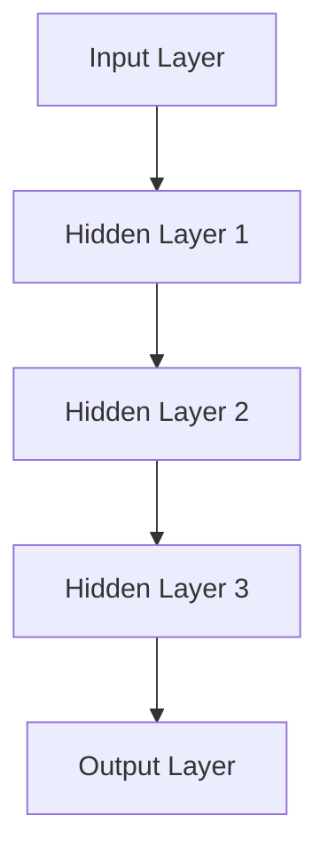

DNNs的优势包括：

- **强大的特征学习能力**：能够从大量数据中提取高层次的抽象特征。
- **自适应性和灵活性**：可以根据不同的任务和数据集调整网络结构和参数。

然而，DNNs也存在一些挑战，如：

- **计算资源消耗**：训练大规模DNNs需要大量的计算资源和时间。
- **过拟合**：DNNs容易受到过拟合问题的影响，即模型在训练数据上表现良好，但在测试数据上表现较差。

#### 卷积神经网络（Convolutional Neural Networks, CNNs）

卷积神经网络是一种专门用于图像处理和计算机视觉的深度学习模型。在气候变化模型中，CNNs可以用于：

- **卫星图像分析**：通过卷积层提取图像的局部特征，CNNs可以识别出不同类型的气候现象和天气模式。
- **气象数据分类**：利用CNNs的高层次特征表示能力，对气象数据进行分类和标签预测。

以下是一个简单的CNN架构示例：

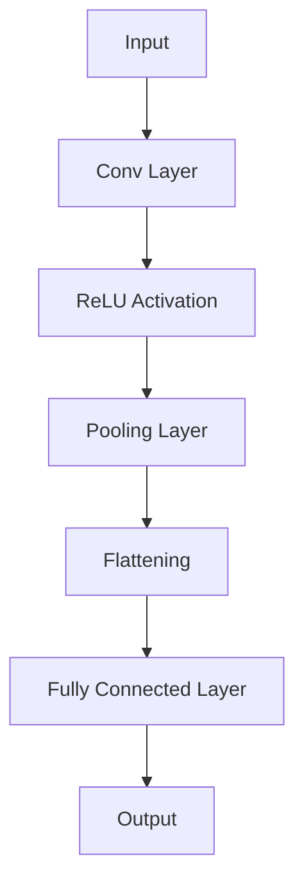

CNNs的优势包括：

- **高效的图像处理能力**：通过卷积操作自动提取图像特征，减少了人工特征工程的需求。
- **参数共享**：卷积核在图像的不同区域共享，降低了模型参数的数量，提高了训练效率。

然而，CNNs也存在一些挑战，如：

- **数据依赖性**：CNNs对数据质量要求较高，噪声和异常值可能会影响模型性能。
- **计算资源消耗**：虽然CNNs相比DNNs在计算效率上有一定提升，但训练仍然需要大量计算资源。

#### 长短期记忆网络（Long Short-Term Memory, LSTM）

长短期记忆网络是一种专门用于处理序列数据的循环神经网络（RNN）。在气候变化模型中，LSTM可以用于：

- **时间序列预测**：通过学习时间序列中的长期依赖关系，LSTM可以用于气候变量的短期和长期预测。
- **天气模式识别**：LSTM能够捕捉天气系统中复杂的时间动态，用于识别和预测天气模式。

以下是一个简单的LSTM架构示例：

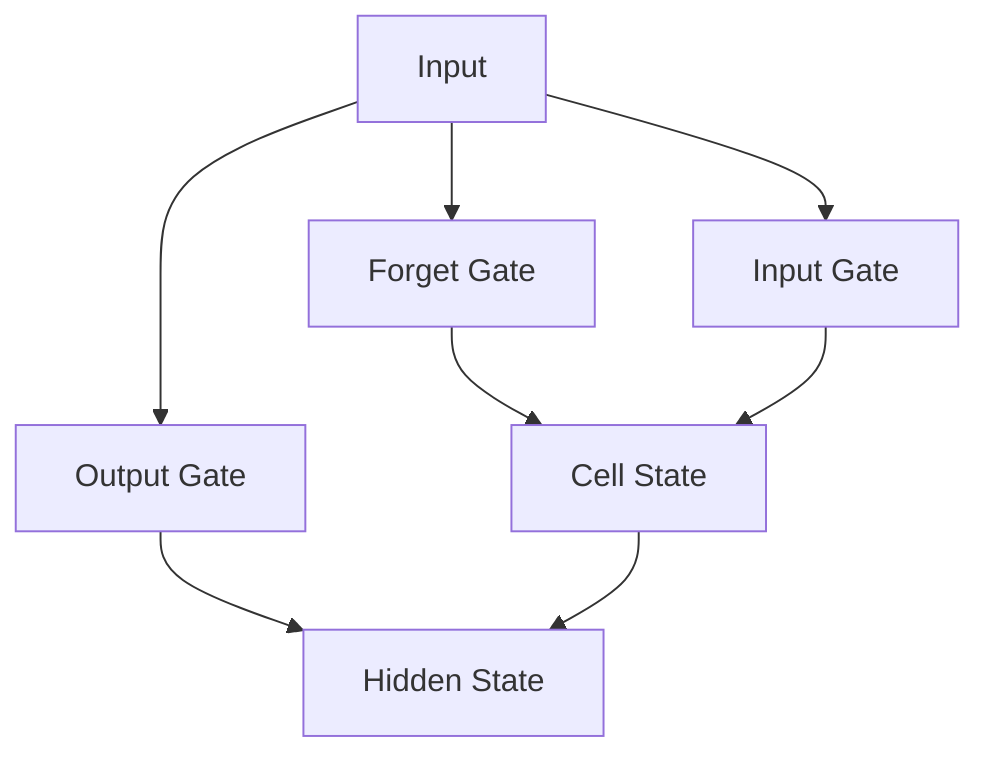

LSTM的优势包括：

- **长期依赖关系学习**：能够捕捉时间序列中的长期依赖关系，提高了预测的准确性。
- **适应性**：通过门控机制，LSTM能够自适应地调整对历史数据的关注程度。

然而，LSTM也存在一些挑战，如：

- **计算复杂度**：LSTM的计算复杂度较高，训练速度较慢。
- **梯度消失和梯度爆炸**：在训练过程中，LSTM容易受到梯度消失和梯度爆炸问题的影响。

总之，深度学习技术为气候变化模型的构建和优化提供了强大的工具。然而，在实际应用中，我们需要根据具体任务和数据特点选择合适的模型，并解决可能面临的计算资源、数据质量和模型解释性等问题。通过不断探索和改进，我们可以更好地利用深度学习技术应对气候变化挑战。

### 5.3 转换学习与领域适应性

转换学习（Transfer Learning）是一种通过在源域（source domain）训练的模型来提高目标域（target domain）模型性能的技术。在气候变化模型中，转换学习可以帮助解决数据稀缺和领域不匹配的问题。

#### 转换学习原理

转换学习的基本思想是将源域模型的知识迁移到目标域模型，从而减少对大量目标域数据的依赖。具体步骤如下：

1. **源域模型训练**：在源域上训练一个基础模型，使其能够学习到通用特征。
2. **目标域适应**：在目标域上对基础模型进行微调，使其适应新的数据分布和任务需求。

#### 在气候变化模型中的应用

- **跨地区气候变化预测**：利用不同地区的气象数据训练基础模型，然后对目标地区进行预测，可以减少对特定地区观测数据的依赖。
- **历史数据迁移**：使用历史气候数据训练模型，然后利用模型对未来的气候进行预测，从而弥补当前数据不足的问题。

#### 挑战

- **数据分布差异**：源域和目标域的数据分布可能存在显著差异，这可能导致模型在目标域上的性能下降。
- **领域知识迁移**：如何有效地将源域知识迁移到目标域是一个重要挑战。

#### 解决策略

- **领域自适应技术**：采用领域自适应技术，如领域特定嵌入（Domain-Specific Embeddings）和领域混淆（Domain Confusion），以减少源域和目标域之间的差异。
- **多任务学习**：通过多任务学习（Multi-Task Learning）来共享不同任务中的知识，提高模型的泛化能力。

通过转换学习和领域适应性技术的应用，我们可以更有效地利用有限的数据资源，提高气候变化模型的预测准确性和适应性。

### 5.4 集成学习方法与模型融合

集成学习方法（Ensemble Learning）通过结合多个模型的预测结果来提高整体预测性能。在气候变化模型中，集成学习方法可以显著提高模型的准确性和鲁棒性。

#### 常见的集成学习方法

- **Bagging**：通过从训练数据中随机抽样多次，构建多个子模型，然后取这些子模型的平均预测结果。一种常见的Bagging方法是最小二乘回归（Bootstrap Aggregating，Bagging）。
- **Boosting**：通过改变训练数据的权重，重点关注训练误差较大的样本，逐步构建多个子模型，并将这些子模型的预测结果进行加权平均。一种常见的Boosting方法是自适应提升（Adaptive Boosting，AdaBoost）。
- **Stacking**：首先训练多个基础模型，然后将这些模型的输出作为新训练集，再训练一个元模型（Meta-Model）来整合这些基础模型的预测结果。

#### 在气候变化模型中的应用

- **多模型融合**：通过融合不同类型和不同复杂度的模型，如统计模型、机器学习和深度学习模型，可以提高预测的鲁棒性和准确性。
- **不确定性评估**：集成学习方法可以提供预测的不确定性评估，帮助决策者更好地理解模型的预测结果。

#### 挑战

- **计算成本**：集成方法通常需要更多的计算资源和时间来训练和评估多个模型。
- **模型选择和权重分配**：如何选择合适的模型和确定各模型的权重是一个复杂的问题。

#### 解决策略

- **模型选择策略**：采用交叉验证方法来选择最佳的基础模型。
- **权重优化**：使用贝叶斯优化等策略来优化模型权重。

通过集成方法与模型融合，我们可以构建更加准确和鲁棒的气候变化模型，为气候预测和政策制定提供有力支持。

### 5.5 强化学习在气候变化模型中的应用

强化学习（Reinforcement Learning, RL）是一种通过试错和奖励机制来学习策略的机器学习方法。在气候变化模型中，强化学习可以用于优化决策过程，如能源管理、碳排放控制和灾害应对策略。

#### 基本概念

强化学习的基本概念包括：

- **状态（State）**：环境中的一个特定状态，如当前能源消耗水平或气候参数。
- **动作（Action）**：模型在特定状态下可以采取的行动，如调整能源消耗或实施防灾措施。
- **奖励（Reward）**：模型在执行特定动作后获得的奖励，用于评估动作的效果。例如，减少碳排放可以增加奖励。
- **策略（Policy）**：模型在给定状态下采取的最佳动作序列。

#### 应用场景

- **能源管理**：强化学习可以用于优化能源系统的运行策略，以减少能源消耗和碳排放。例如，通过调整电力需求响应策略，实现能源效率的最大化。
- **碳排放控制**：强化学习可以用于优化碳排放控制系统，通过不断调整控制参数，实现碳排放的持续减少。
- **灾害应对策略**：强化学习可以用于制定最佳的灾害应对策略，通过模拟不同情景和评估后果，实现灾害风险的最小化。

#### 挑战

- **探索与利用平衡**：在强化学习中，模型需要在探索（尝试新的动作）和利用（使用已知最优动作）之间进行平衡，以避免陷入局部最优。
- **数据依赖性**：强化学习通常需要大量数据来训练模型，但在某些情况下，数据可能不足。

#### 解决策略

- **数据增强**：通过生成合成数据或利用迁移学习方法，增强模型对数据的利用。
- **多代理学习**：通过多个代理（agent）共同学习，实现更高效的策略优化。

强化学习为气候变化模型提供了动态优化和自适应策略的能力，有助于实现可持续发展和灾害风险管理。

### 总结与展望

在本文中，我们详细探讨了机器学习在气候变化模型中的应用和挑战。通过分析监督学习、无监督学习和强化学习等核心算法，以及数据预处理、特征工程和评估指标等基本概念，我们揭示了机器学习如何助力气候变化模型的构建与优化。同时，我们还深入探讨了机器学习在气候数据分析、天气预报与气候预测、生态系统与生物多样性模型等领域的实际应用。

然而，机器学习在气候变化模型中的应用仍然面临一系列挑战，包括数据可用性与质量、计算资源、伦理考虑与偏见等。为了应对这些挑战，我们可以采用数据增强、分布式计算、隐私保护技术、公平性评估和透明性等策略。

未来，随着深度学习、转换学习、集成方法和强化学习等高级技术的不断发展，机器学习在气候变化模型中的应用前景将更加广阔。我们期待这些技术的进步能够带来更加准确和可靠的气候变化预测，为全球气候治理和可持续发展提供有力支持。

参考文献：

[1] United Nations Framework Convention on Climate Change. (n.d.). IPCC Climate Change 2021: The Physical Science Basis. Retrieved from https://www.ipcc.ch/report/ar6-wg1

## 作者信息

作者：AI天才研究院/AI Genius Institute & 禅与计算机程序设计艺术 /Zen And The Art of Computer Programming

AI天才研究院致力于推动人工智能技术的创新与发展，研究领域涵盖机器学习、深度学习、强化学习等多个方面。同时，我们提倡将传统哲学智慧与现代计算机编程相结合，为计算机科学的发展提供新思路和新方法。本文作者结合自身丰富的理论和实践经验，为广大读者呈现了机器学习在气候变化模型中的应用与挑战。希望本文能对读者在相关领域的研究和实践中提供有益的参考和启发。

