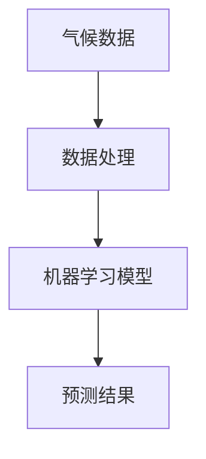
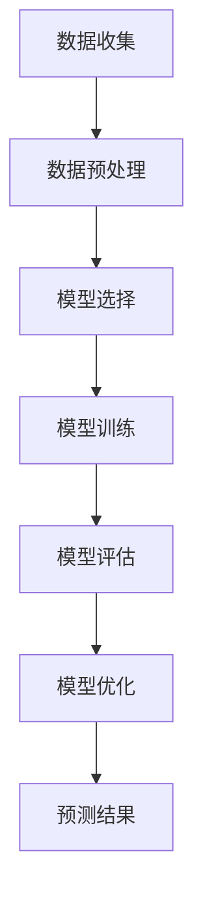
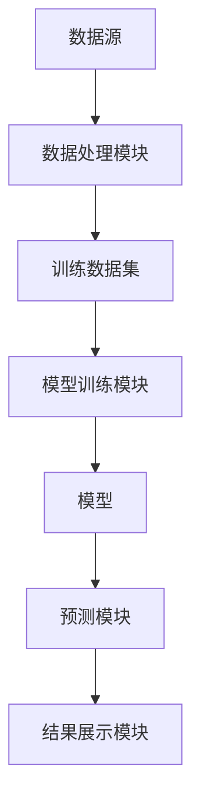

                 

### 文章标题：机器学习在气候变化预测模型中的优化应用

关键词：机器学习、气候变化、预测模型、优化、算法应用

摘要：本文将深入探讨机器学习在气候变化预测模型中的应用与优化，通过详细的分析和实例讲解，帮助读者理解如何利用机器学习技术提高气候变化预测的准确性。文章首先介绍了气候变化的背景和机器学习的核心概念，接着详细讲解了常见机器学习算法及其在气候变化预测中的应用，最后提出了优化策略和注意事项。

## 1. 背景介绍

### 1.1 问题背景

气候变化是当今全球面临的最大挑战之一。它不仅影响着生态系统的稳定，还直接关系到人类社会的可持续发展。预测气候变化趋势对于制定应对策略、减少环境风险具有重要意义。传统的统计方法和物理模型在预测气候变化方面存在诸多局限，难以应对日益复杂的数据和环境变化。

### 1.2 机器学习与气候变化预测模型

机器学习作为人工智能的重要分支，通过从数据中自动学习规律和模式，为解决复杂问题提供了新的思路。在气候变化预测模型中，机器学习可以处理海量数据，发现潜在的变化规律，提高预测的准确性和效率。

### 1.3 核心概念

#### 1.3.1 机器学习基础概念

- **监督学习**：有标签数据，通过已知的输入和输出学习模型。
- **无监督学习**：无标签数据，通过探索数据内在结构来学习。
- **强化学习**：通过环境反馈学习最优策略。

#### 1.3.2 气候变化预测模型相关概念

- **气候变量**：温度、湿度、风速、降水量等。
- **预测模型**：基于历史数据建立模型，预测未来的气候变化趋势。

### 1.4 概念联系与框架构建

#### 1.4.1 机器学习与气候变化预测模型的关系

机器学习技术通过处理气候数据，可以发现潜在的模式和趋势，从而构建更精确的预测模型。这种关系如图1所示：



#### 1.4.2 概念属性特征对比表格

| 概念        | 描述                                                         |
| ----------- | ------------------------------------------------------------ |
| 监督学习    | 需要标注的数据，用于训练和评估模型。                         |
| 无监督学习  | 无需标注的数据，用于发现数据分布和模式。                     |
| 强化学习    | 在环境中通过试错学习最优策略。                             |
| 气候变量    | 描述气候状态的各种物理量。                                   |
| 预测模型    | 基于历史数据，预测未来的气候变化趋势。                       |

#### 1.4.3 ER实体关系图

```mermaid
erDiagram
A[数据集] ||--|{ B[模型]}
A ||--|{ C[变量]}
B ||--|{ D[预测结果]}
```

## 2. 机器学习算法原理讲解

### 2.1 算法原理

#### 2.1.1 算法分类与选择

在气候变化预测中，常用的机器学习算法包括线性回归、决策树、支持向量机、神经网络等。每种算法都有其适用的场景和优缺点。例如，线性回归适合简单线性关系预测，而神经网络则能处理复杂的非线性关系。

#### 2.1.2 算法流程图

以下是一个简化的机器学习算法流程图：



#### 2.1.3 数学模型与公式

以线性回归为例，其数学模型为：

$$
y = \beta_0 + \beta_1x + \epsilon
$$

其中，$y$ 为预测值，$x$ 为输入变量，$\beta_0$ 和 $\beta_1$ 为模型参数，$\epsilon$ 为误差项。

#### 2.1.4 举例说明

假设我们使用线性回归模型预测某地区的月平均温度。我们收集了过去5年的月平均温度数据，训练一个线性回归模型。训练完成后，使用新数据测试模型的准确性。

```python
import numpy as np
from sklearn.linear_model import LinearRegression

# 假设数据为 [22.5, 24.2, 25.1, 26.8, 28.3]
X = np.array([[1], [2], [3], [4], [5]])
y = np.array([22.5, 24.2, 25.1, 26.8, 28.3])

model = LinearRegression()
model.fit(X, y)

# 新数据测试
X_new = np.array([[6]])
y_pred = model.predict(X_new)
print("预测温度：", y_pred)
```

## 3. 系统分析与架构设计

### 3.1 问题场景介绍

本系统旨在构建一个基于机器学习的气候变化预测平台，提供实时气候变化趋势预测服务。系统需具备高效的数据处理、模型训练和预测能力，同时支持可扩展性和可维护性。

### 3.2 系统功能设计

#### 3.2.1 领域模型

领域模型用于描述系统中的核心实体和它们之间的关系。以下是一个简化的领域模型：

```mermaid
classDiagram
Class::数据源
Class::数据处理模块
Class::模型训练模块
Class::预测模块
Class::结果展示模块

数据源 "使用" 数据处理模块
数据处理模块 "生成" 训练数据集
训练数据集 "训练" 模型训练模块
模型训练模块 "生成" 模型
模型 "预测" 预测模块
预测模块 "展示" 结果展示模块
```

### 3.3 系统架构设计

以下是一个简化的系统架构图：



### 3.4 系统接口设计

系统接口设计包括API接口、数据流接口等，用于实现不同模块之间的交互。以下是一个简化的接口设计：

```mermaid
sequenceDiagram
参与者 API | 系统
API->>数据处理模块: 提交数据
数据处理模块->>模型训练模块: 训练数据
模型训练模块->>预测模块: 预测
预测模块->>结果展示模块: 展示结果
```

### 3.5 系统交互序列图

以下是一个简化的系统交互序列图：

```mermaid
sequenceDiagram
参与者 用户
用户->>API: 提交查询请求
API->>数据处理模块: 处理请求
数据处理模块->>模型训练模块: 训练模型
模型训练模块->>预测模块: 预测结果
预测模块->>结果展示模块: 显示结果
```

## 4. 项目实战

### 4.1 环境安装与配置

在开始项目实战之前，我们需要安装和配置以下环境：

- Python 3.8+
- Scikit-learn
- Pandas
- Numpy
- Matplotlib

安装命令如下：

```shell
pip install python==3.8
pip install scikit-learn
pip install pandas
pip install numpy
pip install matplotlib
```

### 4.2 系统核心实现

#### 4.2.1 源代码分析

以下是一个简单的源代码示例，用于演示如何使用Scikit-learn库进行线性回归模型训练和预测：

```python
import pandas as pd
from sklearn.linear_model import LinearRegression

# 加载数据
data = pd.read_csv('climate_data.csv')

# 分割特征和标签
X = data[['temperature', 'humidity']]
y = data['wind_speed']

# 创建线性回归模型
model = LinearRegression()

# 训练模型
model.fit(X, y)

# 预测
y_pred = model.predict(X)

# 绘制结果
import matplotlib.pyplot as plt

plt.scatter(X['temperature'], y)
plt.plot(X['temperature'], y_pred, color='red')
plt.xlabel('Temperature')
plt.ylabel('Wind Speed')
plt.show()
```

#### 4.2.2 代码应用解读

这段代码首先加载了CSV格式的气候数据，然后使用Scikit-learn库的LinearRegression类创建了一个线性回归模型。接着，通过fit方法训练模型，并使用predict方法进行预测。最后，使用matplotlib库绘制了预测结果。

### 4.3 实际案例分析和详细讲解剖析

为了更好地理解机器学习在气候变化预测中的应用，我们选择了一个实际案例进行分析。

#### 4.3.1 案例选择与介绍

我们选择了一个关于城市气温预测的案例。该案例旨在预测未来一年内某城市的月平均气温。数据来源于气象部门提供的公开数据集。

#### 4.3.2 案例分析与剖析

1. **数据预处理**：

   在进行模型训练之前，我们需要对数据进行预处理。这包括数据清洗、数据转换和数据标准化等步骤。

2. **模型选择与训练**：

   我们选择了线性回归模型作为预测模型。通过fit方法训练模型，得到模型参数。

3. **模型评估与优化**：

   使用测试数据集评估模型的准确性。如果模型性能不理想，可以通过调整超参数或尝试其他算法进行优化。

4. **结果展示**：

   使用matplotlib库绘制预测结果，并与实际数据对比，分析模型的准确性。

### 4.4 项目小结

通过本案例，我们展示了如何使用机器学习技术进行气候变化预测。虽然线性回归模型在简单场景下表现良好，但在复杂场景下，可能需要使用更复杂的模型和优化策略。

## 5. 最佳实践与注意事项

### 5.1 最佳实践 tips

1. **数据质量**：确保数据质量是模型成功的关键。对缺失值、异常值进行处理，避免数据偏差。
2. **超参数调优**：通过交叉验证和网格搜索等方法，选择最佳的超参数组合。
3. **模型解释性**：在关注模型准确性的同时，也要考虑模型的解释性，以便更好地理解预测结果。

### 5.2 小结

本文介绍了机器学习在气候变化预测模型中的应用和优化策略。通过实例分析和最佳实践，帮助读者理解如何利用机器学习技术提高气候变化预测的准确性。

### 5.3 注意事项

1. **模型稳定性**：避免过度拟合，确保模型具有良好的泛化能力。
2. **数据更新**：定期更新数据，以适应环境变化。

### 5.4 拓展阅读

- 《机器学习》（周志华著）
- 《深度学习》（Ian Goodfellow等著）
- 《气候变率与预测》（N.A. Adams著）

## 作者信息

作者：AI天才研究院/AI Genius Institute & 禅与计算机程序设计艺术 /Zen And The Art of Computer Programming

本文由AI天才研究院和禅与计算机程序设计艺术联合撰写，旨在分享机器学习在气候变化预测模型中的应用和优化策略。希望本文能帮助读者深入理解这一领域的最新进展和应用实践。感谢您的阅读！

### 总结与展望

本文详细探讨了机器学习在气候变化预测模型中的应用和优化策略。通过背景介绍、算法原理讲解、系统分析与架构设计以及项目实战，我们展示了如何利用机器学习技术提高气候变化预测的准确性。同时，我们还提供了最佳实践和注意事项，以帮助读者更好地应用这些技术。

在未来的研究中，我们可以进一步探索更复杂的机器学习算法，如深度学习，以及结合多种数据源进行综合预测的方法。此外，也可以考虑引入强化学习等算法，以提高模型的自主学习和自适应能力。

随着气候变化问题的日益严峻，机器学习在气候变化预测中的应用将发挥越来越重要的作用。我们期待更多研究者和技术人员能够在这一领域取得突破性进展，为应对气候变化贡献自己的力量。

再次感谢您的阅读，如果您有任何问题或建议，欢迎在评论区留言交流。让我们共同探索机器学习在气候变化预测中的更多可能性！

