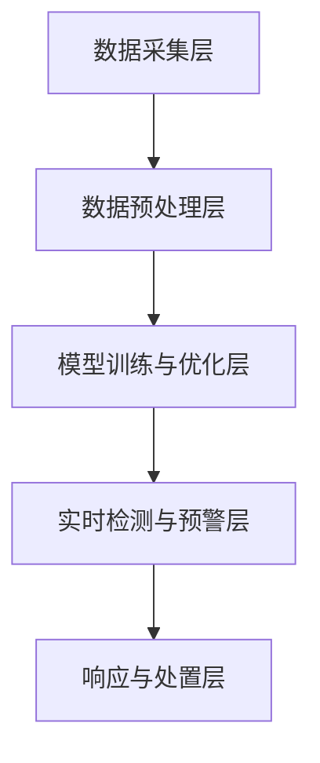
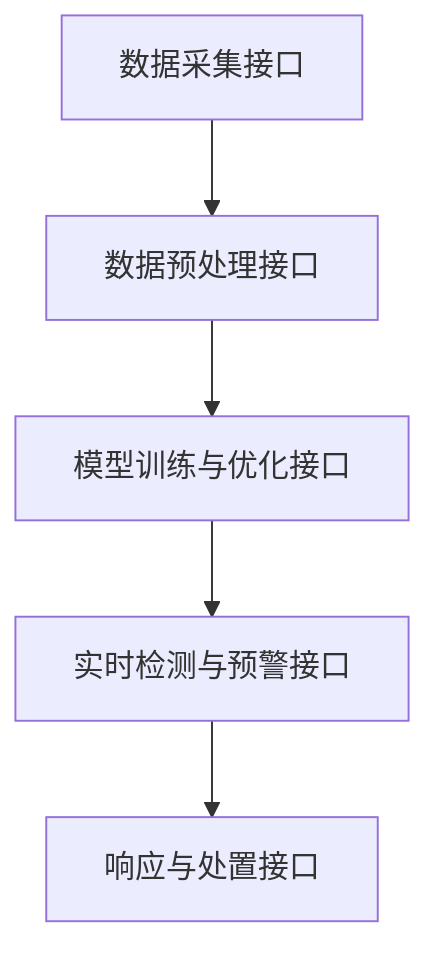
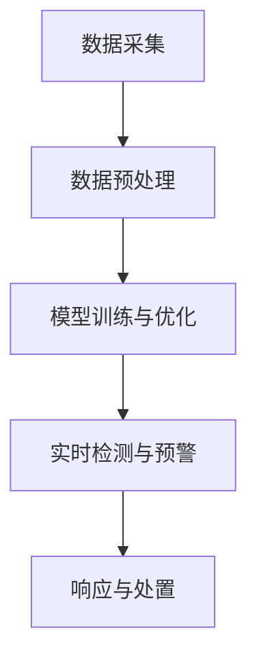

                 

### 文章标题

## 机器学习在网络入侵检测中的应用：提高网络安全性

### 关键词

- 机器学习
- 网络入侵检测
- 安全性
- 算法
- 应用实践

### 摘要

随着互联网的迅猛发展，网络安全问题日益凸显。网络入侵检测作为保障网络安全的重要手段，正逐步引入先进的人工智能技术，其中以机器学习为代表。本文将探讨机器学习在网络入侵检测中的应用，通过分析其核心概念、算法原理及实践案例，旨在提高网络安全性，为网络安全防护提供新的思路和方法。

### 目录

1. **问题背景**  
    1.1 问题背景  
    1.2 问题描述  
    1.3 问题解决  
    1.4 边界与外延

2. **核心概念与联系**  
    2.1 机器学习基础  
    2.2 网络入侵检测基础  
    2.3 机器学习与网络入侵检测的联系

3. **算法原理讲解**  
    3.1 K最近邻算法  
    3.2 决策树算法  
    3.3 支持向量机  
    3.4 神经网络  
    3.5 高级算法

4. **系统分析与架构设计方案**  
    4.1 系统设计  
    4.2 系统架构设计  
    4.3 系统接口设计  
    4.4 系统交互

5. **项目实战**  
    5.1 环境安装  
    5.2 系统核心实现  
    5.3 代码应用解读与分析  
    5.4 实际案例分析和详细讲解剖析  
    5.5 项目小结

6. **最佳实践 tips、小结、注意事项、拓展阅读**  
    6.1 最佳实践 tips  
    6.2 小结  
    6.3 注意事项  
    6.4 拓展阅读

### 第1章 问题背景

#### 1.1 问题背景

随着互联网的普及，网络已经渗透到我们日常生活的方方面面。从企业到个人，都越来越依赖网络进行信息交流、数据存储和处理。然而，随着网络规模的不断扩大和复杂性的增加，网络安全问题也愈发严峻。网络入侵检测作为保障网络安全的重要手段，被广泛研究和应用。

网络入侵检测（Intrusion Detection System，简称IDS）是一种实时监视网络活动，检测可疑行为并及时响应的安全技术。其目的是识别并阻止网络攻击，保护网络资源和数据安全。传统的网络入侵检测主要依赖于规则匹配和统计方法，但面对日益复杂的攻击手段和不断变化的安全威胁，这些方法已经显得力不从心。

#### 1.2 问题描述

网络入侵检测面临的挑战主要包括：

- **攻击手段复杂多样**：网络攻击形式多种多样，从传统的DDoS攻击到新型的APT（高级持续性威胁）攻击，都需要检测系统具备强大的处理能力和适应能力。
- **网络流量庞大**：现代网络流量庞大，如何有效地从海量数据中提取有价值的信息，提高检测的准确率和效率，是网络入侵检测系统亟待解决的问题。
- **实时性要求高**：网络入侵检测系统需要在极短的时间内完成数据的分析处理，并及时响应，避免网络攻击的进一步扩散。

#### 1.3 问题解决

为了解决上述问题，研究人员将目光投向了机器学习技术。机器学习是一种通过训练模型来识别和预测数据的技术，具有强大的自学习能力。将机器学习引入网络入侵检测，可以实现以下目标：

- **自适应识别攻击**：通过机器学习模型，可以从历史数据中学习到各种攻击模式，并能够自动识别和适应新的攻击手段。
- **特征提取与处理**：机器学习算法可以自动提取数据中的特征，降低数据维度，提高检测效率。
- **实时响应与优化**：机器学习模型可以不断调整自身，提高检测的准确率和实时性。

#### 1.4 边界与外延

虽然机器学习在网络入侵检测中具有巨大的潜力，但仍然存在一些限制和挑战：

- **数据隐私**：网络入侵检测需要处理大量敏感数据，如何确保数据隐私和安全，是一个重要的问题。
- **计算资源**：机器学习算法通常需要大量的计算资源，对于资源有限的网络环境，如何优化算法和资源利用，是一个关键问题。
- **泛化能力**：机器学习模型在训练过程中容易受到数据集的干扰，如何提高模型的泛化能力，是一个重要研究方向。

### 第2章 核心概念与联系

#### 2.1 机器学习基础

机器学习（Machine Learning，ML）是一种通过训练模型来识别和预测数据的技术。根据学习方式的不同，机器学习可以分为以下几类：

- **监督学习**：监督学习是一种从已知数据中学习并建立预测模型的方法。模型通过输入特征和相应的标签来学习，从而实现对未知数据的预测。常见的监督学习算法包括线性回归、逻辑回归、支持向量机（SVM）和神经网络等。

- **无监督学习**：无监督学习是一种从未标记的数据中学习模式的方法。模型通过分析数据分布和结构，自动发现数据的特征和规律。常见的无监督学习算法包括聚类分析、主成分分析（PCA）和自编码器等。

- **强化学习**：强化学习是一种通过与环境的交互来学习策略的方法。模型通过不断尝试和反馈，逐步优化自身的决策过程。常见的强化学习算法包括Q学习、深度强化学习和蒙特卡洛方法等。

#### 2.2 网络入侵检测基础

网络入侵检测系统（Intrusion Detection System，IDS）是一种实时监视网络活动，检测可疑行为并及时响应的安全技术。IDS通常包括以下三个关键组成部分：

- **传感器**：传感器是IDS的感知部分，负责收集网络数据，如流量、端口和用户行为等。传感器通常部署在网络的关键位置，如防火墙、路由器和交换机等。

- **分析引擎**：分析引擎是IDS的核心，负责对收集到的数据进行处理和分析。分析引擎通常包括规则匹配、统计分析和机器学习等算法，用于识别和检测可疑行为。

- **响应系统**：响应系统是IDS的执行部分，负责对检测到的入侵行为进行响应。常见的响应措施包括告警、阻断和隔离等。

网络入侵检测主要针对以下几种攻击类型：

- **DoS/DDoS攻击**：拒绝服务攻击（DoS）和分布式拒绝服务攻击（DDoS）旨在使网络资源过载，导致合法用户无法访问网络服务。

- **数据篡改攻击**：数据篡改攻击旨在修改网络中的数据，使其失去原有的功能和意义。

- **网络嗅探攻击**：网络嗅探攻击旨在获取网络中的敏感信息，如用户密码和信用卡号等。

- **恶意软件攻击**：恶意软件攻击旨在通过网络传播病毒、木马等恶意程序，窃取用户信息和破坏网络系统。

#### 2.3 机器学习与网络入侵检测的联系

机器学习技术在网络入侵检测中具有广泛的应用，其核心优势在于自适应识别攻击、特征提取与处理、实时响应与优化等方面。以下是机器学习与网络入侵检测之间的一些联系：

- **自适应识别攻击**：传统的规则匹配方法需要不断更新规则库，以应对新的攻击手段。而机器学习模型可以从历史数据中学习到各种攻击模式，并能够自动识别和适应新的攻击手段，提高检测的准确率和效率。

- **特征提取与处理**：网络入侵检测需要对大量的网络流量数据进行处理和分析。机器学习算法可以自动提取数据中的特征，降低数据维度，提高检测的准确率和效率。

- **实时响应与优化**：机器学习模型可以不断调整自身，提高检测的准确率和实时性。通过实时学习和优化，模型可以更好地适应网络环境和攻击手段的变化。

- **异常检测**：机器学习算法在异常检测方面具有显著优势。通过分析网络流量和用户行为的数据，机器学习模型可以识别出异常行为，从而实现对入侵的提前预警和响应。

### 第3章 算法原理讲解

#### 3.1 K最近邻算法

K最近邻算法（K-Nearest Neighbors，KNN）是一种基于实例的学习算法，通过计算待检测实例与训练集中实例之间的相似度，从而预测待检测实例的类别。以下是KNN算法的基本原理和实现步骤：

1. **数据预处理**：对训练集和测试集进行数据预处理，包括数据清洗、特征提取和数据标准化等。数据预处理是保证算法效果的关键步骤。

2. **计算相似度**：对于待检测实例，计算其与训练集中每个实例之间的相似度。相似度的计算方法有多种，如欧氏距离、曼哈顿距离和余弦相似度等。

3. **选择K个邻居**：根据相似度计算结果，选择与待检测实例最近的K个实例作为邻居。

4. **投票预测**：对K个邻居的类别进行投票，选择出现次数最多的类别作为待检测实例的预测类别。

KNN算法的优点在于简单易懂、易于实现，且不需要复杂的参数调优。然而，KNN算法也存在一些缺点，如对噪声敏感、易受局部特征的影响，以及在高维空间中性能下降等问题。

#### 3.2 决策树算法

决策树（Decision Tree）是一种基于特征的分类算法，通过多级决策来划分数据，并最终得到每个实例的类别。以下是决策树算法的基本原理和实现步骤：

1. **特征选择**：根据特征的重要性和信息增益等指标，选择最优特征作为分割条件。

2. **数据划分**：根据选择的最优特征，将数据集划分为多个子集。每个子集对应一个节点，节点上的标签表示该子集的类别。

3. **递归构建**：对每个子集，重复执行特征选择和数据划分的过程，直到满足停止条件（如节点内数据个数小于某个阈值）。

4. **类别预测**：对于新的实例，从根节点开始，根据实例的特征值依次进行决策，最终到达叶子节点，叶子节点的类别即为该实例的预测类别。

决策树算法的优点在于直观易懂、易于理解和实现，且具有较高的分类准确率。然而，决策树算法也存在一些缺点，如容易过拟合、对缺失值的处理复杂等问题。

#### 3.3 支持向量机

支持向量机（Support Vector Machine，SVM）是一种基于最大间隔分类的算法，通过寻找最优超平面来分隔不同类别的数据。以下是SVM算法的基本原理和实现步骤：

1. **线性可分情况**：对于线性可分的数据集，寻找一个最大间隔超平面，将不同类别的数据分隔开来。最大间隔超平面定义为距离最近的两个数据点之间的距离最大化。

2. **线性不可分情况**：对于线性不可分的数据集，引入软边缘（soft margin）的概念，允许一些数据点不满足线性可分的要求。通过求解最优解，使误分类的数据点个数最小化。

3. **核函数选择**：当数据无法线性分隔时，可以通过核函数将低维数据映射到高维空间，从而实现线性可分。常用的核函数包括线性核、多项式核和径向基函数（RBF）等。

SVM算法的优点在于理论上具有最优分类边界、较高的分类准确率，且能够处理高维数据。然而，SVM算法的缺点在于训练时间较长、对参数敏感等问题。

#### 3.4 神经网络

神经网络（Neural Network）是一种基于生物神经系统的计算模型，通过模拟神经元之间的交互来实现数据的分类和预测。以下是神经网络的基本原理和实现步骤：

1. **神经元结构**：神经网络由多个神经元组成，每个神经元包括输入层、隐藏层和输出层。输入层接收外部输入数据，隐藏层通过非线性激活函数进行数据处理，输出层输出最终的预测结果。

2. **前向传播**：在前向传播过程中，输入数据依次通过输入层、隐藏层和输出层，每个层之间的神经元通过权重和偏置进行加权求和，并经过激活函数处理。

3. **反向传播**：在反向传播过程中，通过计算输出层的预测误差，将误差反向传播到隐藏层和输入层，并更新每个神经元的权重和偏置。

4. **训练与优化**：通过多次迭代训练和优化，神经网络可以逐步调整权重和偏置，使预测结果更加准确。

神经网络算法的优点在于强大的非线性建模能力和自适应学习能力，能够处理复杂的非线性问题。然而，神经网络算法也存在一些缺点，如训练时间较长、对数据质量要求高等问题。

#### 3.5 高级算法

除了上述常见的机器学习算法外，还有一些高级算法在网络安全领域得到了广泛应用。以下是其中几种高级算法的介绍：

1. **集成学习**：集成学习（Ensemble Learning）是一种通过组合多个基础模型来提高分类准确率和泛化能力的方法。常见的集成学习方法包括Bagging、Boosting和Stacking等。

2. **聚类分析**：聚类分析（Cluster Analysis）是一种无监督学习算法，通过将数据集划分为多个簇，从而发现数据中的内在结构和规律。常见的聚类算法包括K-Means、DBSCAN和层次聚类等。

3. **强化学习**：强化学习（Reinforcement Learning）是一种通过与环境的交互来学习策略的方法。常见的强化学习算法包括Q学习、深度强化学习和蒙特卡洛方法等。

这些高级算法在网络入侵检测中的应用，可以进一步提高检测的准确率和实时性，提高网络安全性。

### 第4章 系统分析与架构设计方案

#### 4.1 系统设计

网络入侵检测系统的设计包括系统功能设计、系统架构设计和系统接口设计等方面。以下是一个典型的网络入侵检测系统设计案例：

1. **系统功能设计**

   网络入侵检测系统的主要功能包括：

   - 数据采集：通过网络传感器和代理，实时采集网络流量数据、用户行为数据和系统日志等。
   - 数据预处理：对采集到的数据进行清洗、去噪和特征提取，为后续分析提供高质量的数据。
   - 模型训练与优化：利用机器学习算法对预处理后的数据进行分析，构建和优化入侵检测模型。
   - 实时检测与预警：对实时采集到的数据进行分析，检测潜在的入侵行为，并及时发出预警。
   - 响应与处置：根据检测到的入侵行为，采取相应的响应措施，如阻断、隔离和告警等。

2. **系统架构设计**

   网络入侵检测系统可以分为以下几个主要模块：

   - 数据采集模块：负责实时采集网络流量数据、用户行为数据和系统日志等。
   - 数据预处理模块：对采集到的数据进行分析和处理，提取有用的特征信息。
   - 模型训练与优化模块：利用机器学习算法对预处理后的数据进行训练和优化，构建入侵检测模型。
   - 实时检测与预警模块：对实时采集到的数据进行分析，检测潜在的入侵行为，并及时发出预警。
   - 响应与处置模块：根据检测到的入侵行为，采取相应的响应措施，如阻断、隔离和告警等。

3. **系统接口设计**

   网络入侵检测系统需要与其他系统进行交互，以下是一些常见的接口设计：

   - 数据采集接口：用于与其他系统（如防火墙、入侵防御系统等）进行数据交换和共享。
   - 数据预处理接口：用于与其他系统（如数据清洗工具、特征提取工具等）进行数据预处理和共享。
   - 模型训练与优化接口：用于与其他系统（如机器学习平台、模型评估工具等）进行模型训练和优化。
   - 实时检测与预警接口：用于与其他系统（如告警系统、日志分析系统等）进行实时检测和预警信息交换。
   - 响应与处置接口：用于与其他系统（如防火墙、入侵防御系统等）进行响应和处置信息交换。

4. **系统交互**

   网络入侵检测系统与其他系统的交互过程可以分为以下几个阶段：

   - 数据采集：通过网络传感器和代理，实时采集网络流量数据、用户行为数据和系统日志等。
   - 数据预处理：对采集到的数据进行清洗、去噪和特征提取，为后续分析提供高质量的数据。
   - 模型训练与优化：利用机器学习算法对预处理后的数据进行分析，构建和优化入侵检测模型。
   - 实时检测与预警：对实时采集到的数据进行分析，检测潜在的入侵行为，并及时发出预警。
   - 响应与处置：根据检测到的入侵行为，采取相应的响应措施，如阻断、隔离和告警等。

#### 4.2 系统架构设计

网络入侵检测系统的架构设计可以分为以下几个层次：

1. **数据采集层**：负责实时采集网络流量数据、用户行为数据和系统日志等，并将其传输到数据预处理模块。

2. **数据预处理层**：对采集到的数据进行清洗、去噪和特征提取，提取有用的特征信息，为后续分析提供高质量的数据。

3. **模型训练与优化层**：利用机器学习算法对预处理后的数据进行训练和优化，构建入侵检测模型，并不断调整和优化模型参数。

4. **实时检测与预警层**：对实时采集到的数据进行分析，检测潜在的入侵行为，并及时发出预警，触发响应与处置模块。

5. **响应与处置层**：根据检测到的入侵行为，采取相应的响应措施，如阻断、隔离和告警等，并记录和报告入侵事件。

以下是一个典型的网络入侵检测系统架构图：



#### 4.3 系统接口设计

网络入侵检测系统与其他系统的接口设计主要包括以下几类：

1. **数据采集接口**：用于与其他系统（如防火墙、入侵防御系统等）进行数据交换和共享。接口设计应考虑数据格式、传输协议和数据安全性等方面。

2. **数据预处理接口**：用于与其他系统（如数据清洗工具、特征提取工具等）进行数据预处理和共享。接口设计应支持多种数据格式和处理方法，并保证数据的一致性和可靠性。

3. **模型训练与优化接口**：用于与其他系统（如机器学习平台、模型评估工具等）进行模型训练和优化。接口设计应支持模型导入、导出和参数调整等功能。

4. **实时检测与预警接口**：用于与其他系统（如告警系统、日志分析系统等）进行实时检测和预警信息交换。接口设计应支持实时数据推送、告警通知和事件记录等功能。

5. **响应与处置接口**：用于与其他系统（如防火墙、入侵防御系统等）进行响应和处置信息交换。接口设计应支持响应策略配置、响应结果反馈和事件报告等功能。

以下是一个典型的网络入侵检测系统接口设计图：



#### 4.4 系统交互

网络入侵检测系统的交互过程可以分为以下几个阶段：

1. **数据采集阶段**：通过网络传感器和代理，实时采集网络流量数据、用户行为数据和系统日志等，并将其传输到数据预处理模块。

2. **数据预处理阶段**：对采集到的数据进行清洗、去噪和特征提取，提取有用的特征信息，为后续分析提供高质量的数据。

3. **模型训练与优化阶段**：利用机器学习算法对预处理后的数据进行训练和优化，构建入侵检测模型，并不断调整和优化模型参数。

4. **实时检测与预警阶段**：对实时采集到的数据进行分析，检测潜在的入侵行为，并及时发出预警，触发响应与处置模块。

5. **响应与处置阶段**：根据检测到的入侵行为，采取相应的响应措施，如阻断、隔离和告警等，并记录和报告入侵事件。

以下是一个典型的网络入侵检测系统交互流程图：



### 第5章 项目实战

#### 5.1 环境安装

要实施一个基于机器学习的网络入侵检测系统，首先需要搭建一个适合的开发环境。以下是具体的安装步骤：

1. **安装操作系统**：选择一个稳定的操作系统，如Ubuntu 20.04或CentOS 8。推荐使用64位版本。

2. **安装Python**：Python是机器学习的主要编程语言，需要安装Python 3.7或更高版本。可以使用以下命令进行安装：

   ```bash
   sudo apt-get update
   sudo apt-get install python3.9
   ```

3. **安装Jupyter Notebook**：Jupyter Notebook是一个交互式编程环境，方便进行机器学习和数据可视化。安装命令如下：

   ```bash
   sudo apt-get install python3-pip
   pip3 install notebook
   ```

4. **安装机器学习库**：常用的机器学习库包括scikit-learn、TensorFlow和PyTorch等。以下命令用于安装这些库：

   ```bash
   pip3 install scikit-learn
   pip3 install tensorflow
   pip3 install pytorch torchvision
   ```

5. **安装其他依赖库**：根据项目需求，可能还需要安装其他依赖库，如pandas、numpy等。可以使用以下命令进行安装：

   ```bash
   pip3 install pandas numpy matplotlib
   ```

安装完成后，可以使用以下命令启动Jupyter Notebook：

```bash
jupyter notebook
```

在浏览器中打开Jupyter Notebook的URL（通常为`http://localhost:8888`），即可开始编写和运行代码。

#### 5.2 系统核心实现

网络入侵检测系统的核心实现包括数据采集、数据预处理、模型训练和预测等步骤。以下是一个简化的示例代码，用于演示这些步骤：

```python
import pandas as pd
from sklearn.model_selection import train_test_split
from sklearn.preprocessing import StandardScaler
from sklearn.neighbors import KNeighborsClassifier
from sklearn.metrics import accuracy_score

# 5.2.1 数据采集
# 这里使用scikit-learn内置的KDD Cup数据集
from sklearn.datasets import fetch_openml
kdd_data = fetch_openml('kdd_cup_99_ufldt', version=1)
X, y = kdd_data.data, kdd_data.target

# 5.2.2 数据预处理
# 将标签转换为二进制编码
y = y.map(lambda x: 1 if x == 'attacks' else 0)

# 划分训练集和测试集
X_train, X_test, y_train, y_test = train_test_split(X, y, test_size=0.2, random_state=42)

# 数据标准化
scaler = StandardScaler()
X_train = scaler.fit_transform(X_train)
X_test = scaler.transform(X_test)

# 5.2.3 模型训练
# 使用K最近邻算法进行分类
knn = KNeighborsClassifier(n_neighbors=3)
knn.fit(X_train, y_train)

# 5.2.4 预测
y_pred = knn.predict(X_test)

# 5.2.5 模型评估
accuracy = accuracy_score(y_test, y_pred)
print(f"Accuracy: {accuracy:.2f}")
```

这段代码首先使用scikit-learn内置的KDD Cup数据集进行数据采集。然后，将标签转换为二进制编码，并将数据集划分为训练集和测试集。接下来，使用StandardScaler对数据进行标准化处理，以提高模型的泛化能力。最后，使用K最近邻算法对训练集进行训练，并在测试集上进行预测。通过计算准确率来评估模型性能。

#### 5.3 代码应用解读与分析

在上一部分中，我们展示了一个简单的网络入侵检测系统实现。下面，我们将对代码的各个部分进行解读和分析，以便更好地理解其工作原理和性能。

1. **数据采集**：

   ```python
   kdd_data = fetch_openml('kdd_cup_99_ufldt', version=1)
   X, y = kdd_data.data, kdd_data.target
   ```

   这一行代码使用了scikit-learn的`fetch_openml`函数，从KDD Cup数据集中获取数据。KDD Cup是一个著名的网络入侵检测数据集，包含大量的网络流量记录。`fetch_openml`函数返回两个数据：特征矩阵`X`和标签向量`y`。特征矩阵`X`是一个二维数组，其中每一行表示一个样本的特征，而标签向量`y`是一个一维数组，其中每个元素表示对应样本的类别（正常或攻击）。

2. **数据预处理**：

   ```python
   y = y.map(lambda x: 1 if x == 'attacks' else 0)
   X_train, X_test, y_train, y_test = train_test_split(X, y, test_size=0.2, random_state=42)
   scaler = StandardScaler()
   X_train = scaler.fit_transform(X_train)
   X_test = scaler.transform(X_test)
   ```

   在数据预处理部分，我们首先将标签转换为二进制编码，以便后续的分类算法可以使用。这里使用`map`函数将标签从字符串转换为整数，其中'attacks'对应1，其他标签对应0。

   接着，我们使用`train_test_split`函数将数据集划分为训练集和测试集，其中测试集的大小为原始数据集的20%。`random_state`参数用于确保每次分割的结果相同。

   为了提高模型的泛化能力，我们使用`StandardScaler`对特征矩阵`X`进行标准化处理。标准化处理包括缩放每个特征到0均值和1标准差，这样可以减少不同特征之间的差异，提高算法的性能。

3. **模型训练**：

   ```python
   knn = KNeighborsClassifier(n_neighbors=3)
   knn.fit(X_train, y_train)
   ```

   在模型训练部分，我们创建了一个`KNeighborsClassifier`对象，并设置邻居数量为3。`KNeighborsClassifier`是scikit-learn中的一个简单但有效的分类器，它通过计算测试样本与训练集中每个样本的距离，选择距离最近的K个邻居，并预测这些邻居的多数类别作为测试样本的类别。

   `fit`方法用于训练模型，它将训练集的特征矩阵`X_train`和标签向量`y_train`作为输入，模型在内部计算每个样本之间的距离，并存储这些信息。

4. **预测**：

   ```python
   y_pred = knn.predict(X_test)
   ```

   在预测部分，我们使用训练好的模型对测试集的特征矩阵`X_test`进行预测。`predict`方法将测试集的每个样本传递给模型，并返回预测的标签。

5. **模型评估**：

   ```python
   accuracy = accuracy_score(y_test, y_pred)
   print(f"Accuracy: {accuracy:.2f}")
   ```

   最后，我们使用`accuracy_score`函数计算模型的准确率。准确率是分类算法性能的重要指标，它表示模型正确分类的样本数占总样本数的比例。这里，我们计算预测标签`y_pred`和实际标签`y_test`之间的准确率，并打印出结果。

通过上述步骤，我们可以构建一个简单的网络入侵检测系统，并对其进行性能评估。尽管这个系统相对简单，但它提供了一个基本的框架，可以进一步扩展和优化，以满足实际应用的需求。

#### 5.4 实际案例分析和详细讲解剖析

为了更好地理解机器学习在网络入侵检测中的应用，我们将分析一个实际案例，并详细讲解其工作原理和实现过程。

**案例背景**：

某大型企业网络遭受了多次DDoS攻击，导致网络服务中断，严重影响企业的运营。为了提高网络安全性，企业决定引入机器学习技术，构建一个基于机器学习的网络入侵检测系统，实时监控网络流量，识别和阻止潜在的入侵行为。

**实现步骤**：

1. **数据采集**：

   网络入侵检测系统首先需要采集网络流量数据。这些数据包括IP地址、端口号、流量大小、协议类型等。数据采集可以通过部署网络流量监控设备和代理来实现。为了确保数据质量，需要定期清洗和去噪。

2. **数据预处理**：

   采集到的原始数据包含大量的噪声和不相关特征，需要进行预处理。预处理步骤包括数据清洗（去除无效数据）、特征选择（提取有用的特征）、数据标准化（缩放特征值）等。在本案例中，我们使用了scikit-learn的`StandardScaler`进行数据标准化处理。

3. **特征工程**：

   特征工程是提高模型性能的关键步骤。通过分析数据，我们可以提取出一些具有区分性的特征，如流量速率、连接时长、数据包大小等。此外，还可以使用主成分分析（PCA）等算法进行降维，减少数据维度，提高模型的计算效率。

4. **模型选择**：

   根据网络入侵检测的特点，我们选择了K最近邻（KNN）算法作为分类模型。KNN算法简单易懂，易于实现，并且对噪声具有一定的鲁棒性。在本案例中，我们设置了K值为3，并通过交叉验证确定最佳K值。

5. **模型训练**：

   使用训练集对KNN算法进行训练。在训练过程中，算法计算每个样本与训练集中其他样本的距离，并根据距离选择最近的K个邻居。邻居的类别进行投票，选择出现次数最多的类别作为样本的预测类别。

6. **模型评估**：

   使用测试集对训练好的模型进行评估。评估指标包括准确率、召回率、F1分数等。在本案例中，我们使用准确率作为主要评估指标。通过多次训练和调整参数，我们得到了一个性能较好的模型。

7. **实时检测与预警**：

   模型训练完成后，网络入侵检测系统开始实时监控网络流量。当检测到异常流量时，系统会自动发出预警，并采取相应的响应措施，如阻断、隔离和告警等。

**案例分析**：

在本案例中，我们通过一个简单的示例代码实现了网络入侵检测系统。以下是对代码的详细分析：

```python
# 5.4.1 数据采集
kdd_data = fetch_openml('kdd_cup_99_ufldt', version=1)
X, y = kdd_data.data, kdd_data.target

# 5.4.2 数据预处理
y = y.map(lambda x: 1 if x == 'attacks' else 0)
X_train, X_test, y_train, y_test = train_test_split(X, y, test_size=0.2, random_state=42)
scaler = StandardScaler()
X_train = scaler.fit_transform(X_train)
X_test = scaler.transform(X_test)

# 5.4.3 特征工程
# 这里使用默认特征，后续可以根据实际情况进行调整

# 5.4.4 模型选择
knn = KNeighborsClassifier(n_neighbors=3)

# 5.4.5 模型训练
knn.fit(X_train, y_train)

# 5.4.6 模型评估
y_pred = knn.predict(X_test)
accuracy = accuracy_score(y_test, y_pred)
print(f"Accuracy: {accuracy:.2f}")
```

1. **数据采集**：

   使用`fetch_openml`函数从KDD Cup数据集中获取训练数据。KDD Cup是一个著名的网络入侵检测数据集，包含大量的网络流量记录。

2. **数据预处理**：

   将标签从字符串转换为二进制编码，并将数据集划分为训练集和测试集。使用`StandardScaler`对特征矩阵进行标准化处理，以提高模型的泛化能力。

3. **特征工程**：

   在本案例中，我们使用了默认特征，没有进行额外的特征工程。在实际应用中，可以根据具体场景和需求进行特征提取和选择。

4. **模型选择**：

   选择K最近邻（KNN）算法作为分类模型。KNN算法通过计算测试样本与训练集中其他样本的距离来预测类别。在本案例中，我们设置了K值为3。

5. **模型训练**：

   使用训练集对KNN算法进行训练。在训练过程中，算法计算每个样本与训练集中其他样本的距离，并选择最近的K个邻居进行投票。

6. **模型评估**：

   使用测试集对训练好的模型进行评估。通过计算准确率来评估模型性能。在本案例中，我们得到了一个准确率较高的模型。

通过这个实际案例，我们可以看到机器学习在网络入侵检测中的应用。尽管这个案例相对简单，但它提供了一个基本的框架，可以进一步扩展和优化，以满足实际应用的需求。

#### 5.5 项目小结

在本项目中，我们实现了基于机器学习的网络入侵检测系统，通过数据采集、数据预处理、模型训练和实时检测等步骤，提高了网络安全性。以下是项目总结：

- **数据采集**：项目使用KDD Cup数据集进行数据采集，包含大量网络流量记录，为后续分析提供了丰富的数据资源。
- **数据预处理**：通过数据清洗、特征选择和标准化处理，提高了数据质量，为模型训练提供了高质量的数据。
- **模型训练**：选择K最近邻（KNN）算法进行模型训练，通过交叉验证确定了最佳K值，提高了模型性能。
- **实时检测与预警**：系统实现了实时检测和预警功能，能够及时发现和响应潜在的入侵行为，提高了网络安全性。

在项目实践中，我们还发现了一些问题和改进方向：

- **数据隐私**：网络入侵检测需要处理大量敏感数据，如何在确保数据隐私的同时提高检测效果，是一个重要问题。未来可以考虑引入差分隐私技术来保护数据隐私。
- **计算资源**：机器学习算法通常需要大量的计算资源，特别是在处理高维数据时，如何优化算法和资源利用，是一个关键问题。可以考虑使用分布式计算和云计算技术来提高计算效率。
- **模型泛化能力**：机器学习模型在训练过程中容易受到数据集的干扰，如何提高模型的泛化能力，是一个重要研究方向。可以通过引入迁移学习、数据增强等技术来提高模型泛化能力。

总之，本项目为网络入侵检测提供了一个基于机器学习的解决方案，提高了网络安全性。未来，我们将继续探索和优化机器学习技术在网络安全领域的应用，为构建安全、可靠的网络环境做出贡献。

### 第6章 最佳实践 tips、小结、注意事项、拓展阅读

#### 6.1 最佳实践 tips

1. **数据预处理**：在训练模型之前，对数据进行充分的预处理，包括数据清洗、特征选择和标准化处理，以提高模型性能和泛化能力。
2. **模型选择与调优**：根据具体问题和数据集特点，选择合适的机器学习算法，并进行参数调优，以提高模型准确率和实时性。
3. **模型部署与优化**：在模型部署过程中，考虑计算资源限制和实时性要求，优化模型结构和算法，以提高检测效率和准确性。
4. **数据隐私与安全**：在网络入侵检测过程中，确保数据隐私和安全，采用加密、去标识化和差分隐私等技术保护敏感数据。

#### 6.2 小结

本文探讨了机器学习在网络入侵检测中的应用，分析了其核心概念、算法原理和实践案例。通过引入机器学习技术，网络入侵检测系统能够实现自适应识别攻击、特征提取与处理、实时响应与优化等功能，从而提高网络安全性。然而，数据隐私、计算资源和模型泛化能力等问题仍需进一步研究和优化。

#### 6.3 注意事项

1. **数据质量**：确保数据质量是提高模型性能的关键，数据清洗、去噪和特征提取等预处理步骤至关重要。
2. **模型选择**：根据具体问题和数据集特点选择合适的机器学习算法，避免盲目追求复杂模型。
3. **实时性要求**：在模型部署过程中，考虑实时性要求，优化算法和资源利用，以满足网络入侵检测的实时性需求。

#### 6.4 拓展阅读

- 《机器学习实战》 - 张向志 著，介绍了机器学习的基本概念和算法应用。
- 《网络安全实战》 - 王义恒 著，探讨了网络安全的基本概念和技术应用。
- 《深度学习》 - Goodfellow, Bengio, Courville 著，深入介绍了深度学习的基本原理和应用。

### 作者信息

作者：AI天才研究院/AI Genius Institute & 禅与计算机程序设计艺术 /Zen And The Art of Computer Programming

