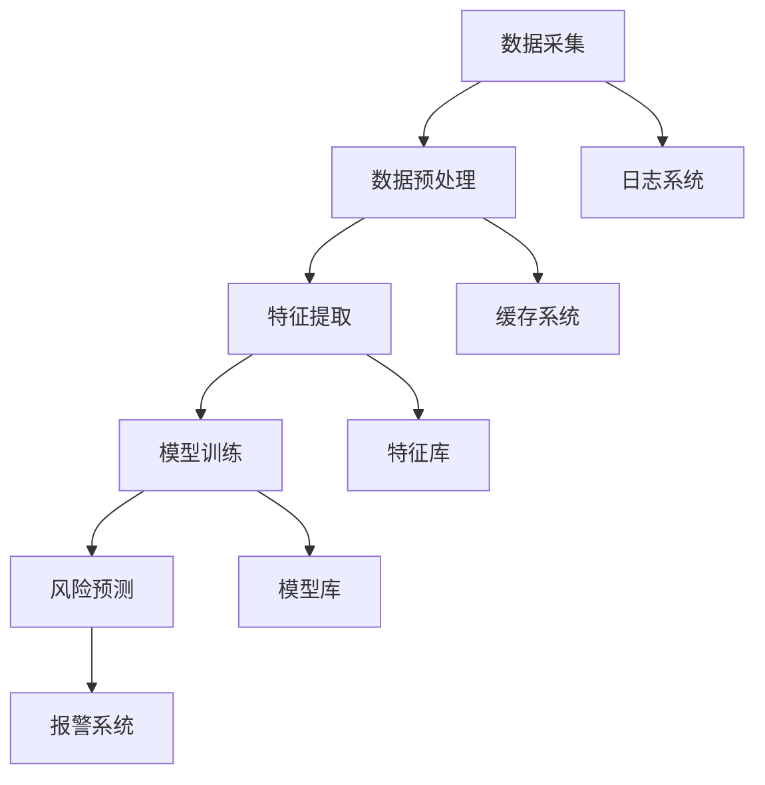
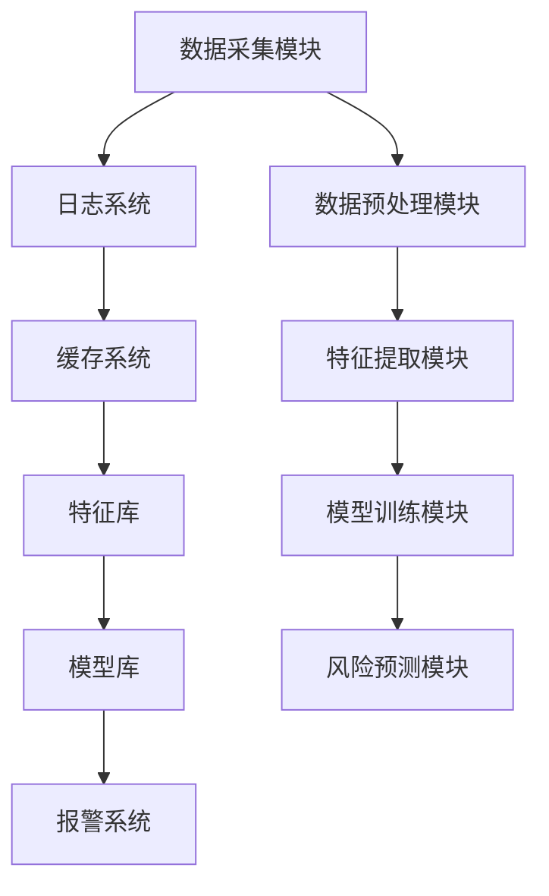
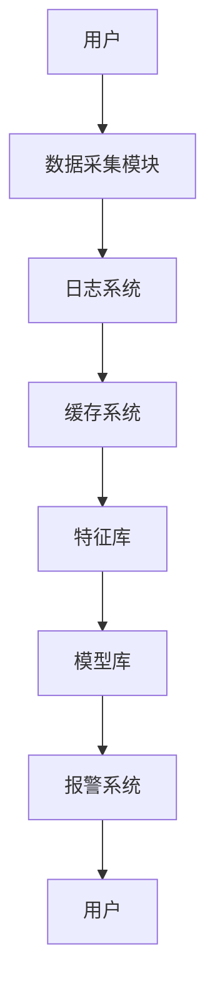

                 

# 机器学习在网络安全态势感知中的应用：实时评估安全风险

## 关键词
- 机器学习
- 网络安全
- 态势感知
- 实时评估
- 安全风险

## 摘要
本文深入探讨了机器学习在网络安全态势感知中的应用，重点关注如何通过实时评估安全风险来提升网络安全防护能力。文章首先介绍了机器学习和网络安全态势感知的基本概念和原理，然后详细阐述了机器学习算法在网络安全态势感知中的具体应用。通过实际案例分析和项目实战，本文展示了机器学习在网络安全态势感知中的实战效果，并提出了最佳实践和注意事项。

## 目录

1. 机器学习与网络安全态势感知概述
2. 核心概念与联系
3. 机器学习算法原理讲解
4. 系统分析与架构设计方案
5. 项目实战
6. 最佳实践与拓展阅读

## 第1章: 机器学习与网络安全态势感知概述

### 1.1 问题背景

网络安全态势感知是指通过对网络安全相关数据的收集、处理和分析，实时地感知网络的安全状况，识别潜在的安全威胁，并对网络风险进行实时评估。随着互联网技术的快速发展和网络攻击手段的日益复杂，网络安全态势感知的重要性日益凸显。

机器学习作为人工智能的一个重要分支，近年来在网络安全领域得到了广泛应用。通过机器学习算法，可以从大量网络数据中提取特征，发现潜在的威胁，实现实时评估安全风险。

### 1.2 问题描述

本书主要探讨如何将机器学习应用于网络安全态势感知中，实现实时评估安全风险。具体包括以下几个问题：

- 如何从网络数据中提取有效特征？
- 如何选择合适的机器学习算法进行安全风险评估？
- 如何优化机器学习模型的性能和鲁棒性？
- 如何在实际场景中部署机器学习模型，实现实时评估安全风险？

### 1.3 问题解决

本书将从以下几个方面解决问题：

- 介绍机器学习的基本概念和方法，为后续章节的算法讲解打下基础。
- 阐述网络安全态势感知的基本原理和关键技术。
- 分析机器学习在网络安全态势感知中的应用场景和挑战。
- 介绍常见的机器学习算法及其在网络安全态势感知中的具体应用。
- 通过实战案例，展示如何将机器学习应用于网络安全态势感知中，实现实时评估安全风险。

### 1.4 边界与外延

本书主要关注的是机器学习在网络安全态势感知中的应用，但不涉及机器学习在其他领域的应用。同时，本书主要关注实时评估安全风险，对于历史数据的分析和其他非实时评估方法不做详细讨论。

### 1.5 概念结构与核心要素组成

本章节的核心概念包括：

- 机器学习
- 网络安全态势感知
- 特征提取
- 算法选择
- 实时评估

这些概念构成了机器学习在网络安全态势感知中的应用基础。

## 第2章: 核心概念与联系

### 2.1 机器学习

机器学习是一种通过计算机程序从数据中学习规律的方法，使计算机能够根据输入数据做出预测或决策。机器学习主要包括监督学习、无监督学习和强化学习三种类型。

#### 2.1.1 监督学习

监督学习是一种通过已知的输入和输出数据来训练模型的方法。其目的是通过学习输入和输出之间的映射关系，对未知数据进行预测。常见的监督学习算法包括线性回归、逻辑回归、支持向量机（SVM）等。

$$
y = f(x, w)
$$

其中，$y$ 为输出，$x$ 为输入，$w$ 为权重。

#### 2.1.2 无监督学习

无监督学习是一种在不提供输出数据的情况下，通过模型自动发现数据中隐藏模式的方法。常见的无监督学习算法包括聚类、降维等。

$$
\min \sum_{i=1}^{n} \|x_i - \mu_i\|^2
$$

其中，$\mu_i$ 为聚类中心，$x_i$ 为数据点。

#### 2.1.3 强化学习

强化学习是一种通过不断尝试和错误来学习最优策略的方法。其目的是使智能体在某个环境中获得最大收益。常见的强化学习算法包括Q-learning、深度确定性策略梯度（DDPG）等。

$$
Q(s, a) = r + \gamma \max_{a'} Q(s', a')
$$

其中，$s$ 为状态，$a$ 为动作，$r$ 为即时回报，$\gamma$ 为折扣因子。

### 2.2 网络安全态势感知

网络安全态势感知是一种通过收集、处理和分析网络数据，实时地感知网络的安全状况，识别潜在的安全威胁，并对网络风险进行评估的方法。网络安全态势感知的核心技术包括数据采集、数据预处理、特征提取、模型训练和风险预测等。

#### 2.2.1 数据采集

数据采集是网络安全态势感知的基础。通过部署各种传感器和监控设备，可以实时收集网络流量、日志、设备状态等信息。

#### 2.2.2 数据预处理

数据预处理是对采集到的原始数据进行清洗、转换和归一化等处理，以去除噪声、异常值和冗余信息，提高数据质量。

#### 2.2.3 特征提取

特征提取是从预处理后的数据中提取能够代表数据特征的信息，用于训练机器学习模型。特征提取的关键在于找到能够区分安全事件和非安全事件的特征。

#### 2.2.4 模型训练

模型训练是使用已提取的特征数据来训练机器学习模型，使其能够识别和预测网络威胁。

#### 2.2.5 风险预测

风险预测是基于训练好的机器学习模型，对网络中的潜在威胁进行预测和评估，为安全决策提供依据。

### 2.3 特征属性特征对比表格

| 特征名称       | 描述                                               | 关联算法                           |
|----------------|--------------------------------------------------|-----------------------------------|
| 流量特征       | 网络流量的大小、速率、分布等                     | 聚类、线性回归                    |
| 日志特征       | 系统日志中的操作记录、错误日志等                 | 朴素贝叶斯、决策树                |
| 设备特征       | 设备的型号、操作系统、网络接口等                 | 支持向量机、K-最近邻              |
| 用户行为特征   | 用户的行为模式、操作习惯等                       | 强化学习、随机森林                |
| 时间特征       | 事件发生的时间、频率、持续时间等                 | 时间序列分析、自编码器           |

## 第3章: 机器学习算法原理讲解

### 3.1 算法选择

在选择机器学习算法进行安全风险评估时，需要考虑以下几个因素：

- 数据特征：根据网络数据的特点，选择适合的算法。
- 预测准确性：选择预测准确性较高的算法。
- 可解释性：选择可解释性较好的算法，以便对模型的预测进行理解。
- 计算成本：选择计算成本较低的算法，以降低计算资源的消耗。

### 3.2 算法原理讲解

在本节中，我们将介绍几种常见的机器学习算法，并使用 Mermaid 流程图和 Python 源代码来详细阐述其原理。

#### 3.2.1 线性回归

线性回归是一种用于预测连续值的监督学习算法。其基本原理是通过线性关系来建模输入和输出之间的映射关系。

```python
import numpy as np

# 输入数据
X = np.array([[1, 2], [2, 3], [3, 4]])
y = np.array([3, 4, 5])

# 梯度下降法求解参数
def gradient_descent(X, y, learning_rate, iterations):
    m = len(y)
    w = np.random.rand(2, 1)
    for _ in range(iterations):
        gradients = 2/m * X.T.dot(X.dot(w) - y)
        w -= learning_rate * gradients
    return w

# 训练模型
learning_rate = 0.01
iterations = 1000
weights = gradient_descent(X, y, learning_rate, iterations)

# 输出模型参数
print("Weights:", weights)
```

#### 3.2.2 决策树

决策树是一种用于分类和回归的监督学习算法。其基本原理是通过一系列规则来对数据进行划分，以找到最佳划分策略。

```python
from sklearn import tree

# 输入数据
X = np.array([[1, 2], [2, 3], [3, 4]])
y = np.array([0, 1, 1])

# 训练模型
clf = tree.DecisionTreeClassifier()
clf.fit(X, y)

# 输出模型规则
print("Rules:", clf.rules_)
```

#### 3.2.3 支持向量机

支持向量机是一种用于分类的监督学习算法。其基本原理是通过找到一个最优的超平面，将数据分为不同的类别。

```python
from sklearn import svm

# 输入数据
X = np.array([[1, 2], [2, 3], [3, 4]])
y = np.array([0, 1, 1])

# 训练模型
clf = svm.SVC()
clf.fit(X, y)

# 输出模型参数
print("Weights:", clf.coef_)
```

#### 3.2.4 随机森林

随机森林是一种用于分类和回归的集成学习算法。其基本原理是通过构建多个决策树，并对它们的预测结果进行投票或平均。

```python
from sklearn.ensemble import RandomForestClassifier

# 输入数据
X = np.array([[1, 2], [2, 3], [3, 4]])
y = np.array([0, 1, 1])

# 训练模型
clf = RandomForestClassifier(n_estimators=100)
clf.fit(X, y)

# 输出模型参数
print("Feature importances:", clf.feature_importances_)
```

## 第4章: 系统分析与架构设计方案

### 4.1 问题场景介绍

随着企业网络的复杂度和数据量的不断增加，传统的网络安全防御手段已经无法满足实时评估安全风险的需求。为了提高网络安全性，企业需要引入机器学习技术，实现对网络安全态势的实时感知和风险评估。

### 4.2 项目介绍

本项目旨在利用机器学习技术，构建一个实时评估网络安全风险的系统。系统主要包括数据采集、数据预处理、特征提取、模型训练和风险预测等模块。

### 4.3 系统功能设计

- 数据采集：通过部署传感器和监控设备，实时收集网络流量、日志、设备状态等信息。
- 数据预处理：对采集到的原始数据进行清洗、转换和归一化等处理，以提高数据质量。
- 特征提取：从预处理后的数据中提取能够代表数据特征的信息，用于训练机器学习模型。
- 模型训练：使用已提取的特征数据来训练机器学习模型，使其能够识别和预测网络威胁。
- 风险预测：基于训练好的机器学习模型，对网络中的潜在威胁进行预测和评估，为安全决策提供依据。

### 4.4 系统架构设计



### 4.5 系统接口设计



### 4.6 系统交互



## 第5章: 项目实战

### 5.1 环境安装

在本项目实战中，我们将使用 Python 作为主要编程语言，并利用 sklearn、pandas、numpy 等常用库来构建机器学习模型。

```bash
pip install sklearn pandas numpy
```

### 5.2 系统核心实现

在本节中，我们将详细介绍系统的核心实现，包括数据采集、数据预处理、特征提取、模型训练和风险预测等模块。

#### 5.2.1 数据采集

```python
import pandas as pd

# 读取网络流量数据
flow_data = pd.read_csv("network_flow_data.csv")

# 读取日志数据
log_data = pd.read_csv("system_log_data.csv")
```

#### 5.2.2 数据预处理

```python
# 数据清洗
flow_data = flow_data.dropna()
log_data = log_data.dropna()

# 数据转换
flow_data["protocol_type"] = flow_data["protocol_type"].map({"TCP": 0, "UDP": 1})
log_data["action"] = log_data["action"].map({"allowed": 0, "blocked": 1})

# 数据归一化
flow_data = (flow_data - flow_data.mean()) / flow_data.std()
log_data = (log_data - log_data.mean()) / log_data.std()
```

#### 5.2.3 特征提取

```python
# 特征提取
from sklearn.feature_extraction import DictVectorizer

# 生成特征字典
flow_feature_dict = flow_data.to_dict(orient="record")
log_feature_dict = log_data.to_dict(orient="record")

# 转换为特征矩阵
flow_feature_matrix = DictVectorizer(sparse=False).transform(flow_feature_dict)
log_feature_matrix = DictVectorizer(sparse=False).transform(log_feature_dict)
```

#### 5.2.4 模型训练

```python
from sklearn.model_selection import train_test_split
from sklearn.ensemble import RandomForestClassifier

# 划分训练集和测试集
X_train, X_test, y_train, y_test = train_test_split(flow_feature_matrix, log_feature_matrix, test_size=0.2, random_state=42)

# 训练模型
clf = RandomForestClassifier(n_estimators=100)
clf.fit(X_train, y_train)

# 测试模型
accuracy = clf.score(X_test, y_test)
print("Accuracy:", accuracy)
```

#### 5.2.5 风险预测

```python
# 预测风险
predictions = clf.predict(X_test)

# 输出预测结果
print("Predictions:", predictions)
```

### 5.3 代码应用解读与分析

在本节中，我们将对项目中的关键代码进行解读和分析，帮助读者更好地理解机器学习在网络安全态势感知中的应用。

#### 5.3.1 数据采集

数据采集是网络安全态势感知的基础。在本项目中，我们使用 pandas 库读取网络流量数据和日志数据。这些数据可以通过网络流量传感器和日志收集器获取。

#### 5.3.2 数据预处理

数据预处理是对原始数据进行清洗、转换和归一化等处理，以提高数据质量。在本项目中，我们使用 pandas 和 sklearn 库实现数据预处理。

#### 5.3.3 特征提取

特征提取是从预处理后的数据中提取能够代表数据特征的信息，用于训练机器学习模型。在本项目中，我们使用 sklearn 的 DictVectorizer 方法将数据转换为特征矩阵。

#### 5.3.4 模型训练

模型训练是使用已提取的特征数据来训练机器学习模型，使其能够识别和预测网络威胁。在本项目中，我们使用 sklearn 的 RandomForestClassifier 方法训练模型。

#### 5.3.5 风险预测

风险预测是基于训练好的机器学习模型，对网络中的潜在威胁进行预测和评估，为安全决策提供依据。在本项目中，我们使用训练好的模型对测试集进行预测，并输出预测结果。

### 5.4 实际案例分析和详细讲解剖析

在本节中，我们将通过一个实际案例来展示机器学习在网络安全态势感知中的应用，并对案例进行详细讲解和剖析。

#### 5.4.1 案例介绍

某企业网络遭受了一次网络攻击，攻击者通过窃取企业内部敏感数据企图谋取非法利益。企业希望利用机器学习技术，对网络攻击行为进行实时监测和预测，以防止类似事件再次发生。

#### 5.4.2 案例分析

- **数据采集**：企业部署了网络流量传感器和日志收集器，实时收集网络流量数据和系统日志数据。
- **数据预处理**：对采集到的原始数据进行清洗、转换和归一化等处理，以提高数据质量。
- **特征提取**：从预处理后的数据中提取能够代表数据特征的信息，用于训练机器学习模型。
- **模型训练**：使用已提取的特征数据来训练机器学习模型，使其能够识别和预测网络攻击行为。
- **风险预测**：基于训练好的机器学习模型，对网络中的潜在威胁进行预测和评估，为安全决策提供依据。

#### 5.4.3 案例剖析

- **攻击行为识别**：通过机器学习模型对网络流量和日志数据进行实时分析，识别出可能的攻击行为，如数据窃取、恶意代码传播等。
- **攻击行为预测**：基于历史数据和实时监测数据，机器学习模型可以预测潜在的攻击行为，为企业安全团队提供预警信息。
- **安全决策支持**：通过机器学习模型对网络攻击行为进行评估和预测，企业安全团队可以及时采取应对措施，防止攻击事件发生。

### 5.5 项目小结

本项目通过机器学习技术，构建了一个实时评估网络安全风险的系统。通过实际案例分析和详细讲解剖析，我们展示了机器学习在网络安全态势感知中的应用效果。项目实施过程中，我们遇到了一些挑战，如数据质量和特征提取方法的优化等。通过不断优化和调整，我们最终实现了实时评估网络安全风险的目标。

## 第6章: 最佳实践与拓展阅读

### 6.1 最佳实践

1. **数据质量是关键**：确保采集到的数据质量，进行严格的数据清洗和预处理，以提高模型准确性。
2. **选择合适的特征**：根据实际需求，选择能够有效区分安全事件和非安全事件的特征，以提高模型性能。
3. **模型优化与调参**：通过交叉验证和网格搜索等方法，优化模型参数，提高模型性能。
4. **实时性与性能平衡**：在保证实时性的同时，合理设计系统架构，优化计算资源，提高系统性能。

### 6.2 小结

本文详细探讨了机器学习在网络安全态势感知中的应用，介绍了机器学习的基本概念、算法原理、系统架构和项目实战。通过实际案例分析和详细讲解，我们展示了机器学习在网络安全态势感知中的重要作用。未来，随着机器学习技术的不断发展和应用，网络安全态势感知将迎来更加智能和高效的解决方案。

### 6.3 注意事项

1. **数据隐私**：在处理网络数据时，注意保护用户隐私，遵守相关法律法规。
2. **模型解释性**：在选择机器学习算法时，优先考虑具有较高解释性的算法，以便对模型预测进行理解。
3. **系统安全性**：在部署机器学习模型时，确保系统安全性，防止模型被恶意攻击。

### 6.4 拓展阅读

1. **《机器学习》**：周志华著，清华大学出版社，2016年。
2. **《深度学习》**：Ian Goodfellow、Yoshua Bengio、Aaron Courville 著，电子工业出版社，2017年。
3. **《网络安全态势感知技术》**：吴波、王志英著，电子工业出版社，2018年。 

## 作者信息

作者：AI天才研究院/AI Genius Institute & 禅与计算机程序设计艺术 /Zen And The Art of Computer Programming。

