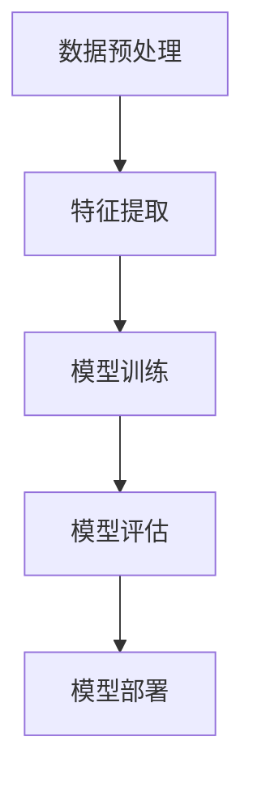
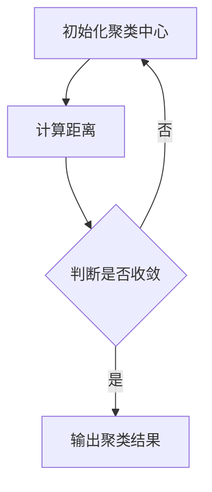
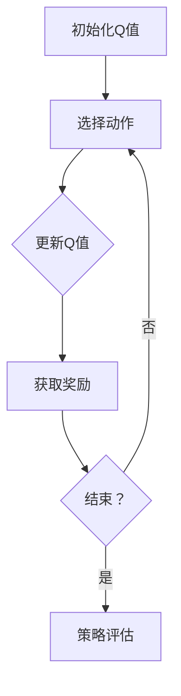
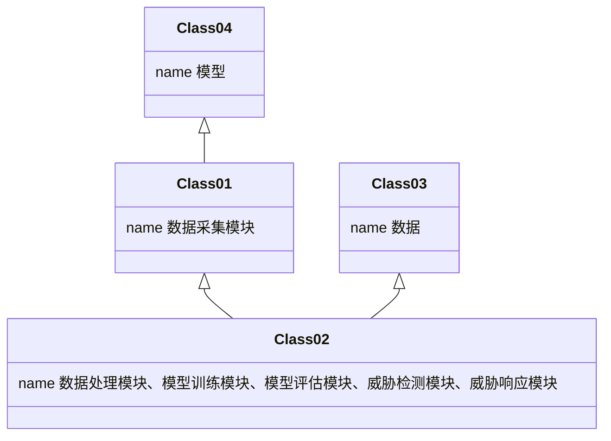
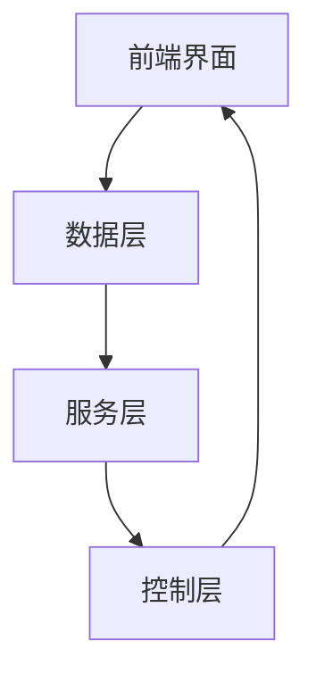
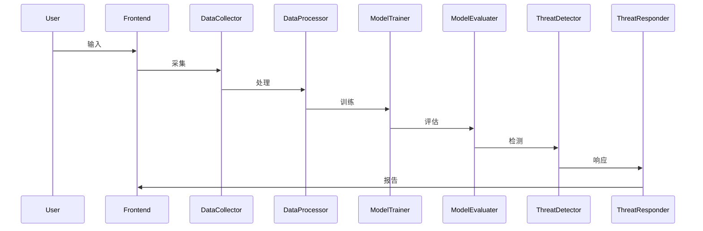

                 

Certainly! Let's think step by step to create a detailed table of contents for the article "机器学习在网络安全态势感知中的应用：预测与防御." We will ensure that each section includes the necessary components as per the guidelines provided.

## 第一部分: 引言
### 1.1 问题背景
- **核心概念术语说明**：介绍网络安全、态势感知、机器学习等核心术语的定义。
- **问题背景**：阐述网络安全面临的挑战和当前的安全防御机制。
- **问题描述**：描述网络安全态势感知的重要性以及其面临的挑战。
- **问题解决**：介绍机器学习如何解决网络安全态势感知的问题。

### 1.2 机器学习概述
- **机器学习基础**：介绍机器学习的基本概念、分类和应用领域。
- **机器学习算法**：简要介绍常见的机器学习算法及其特点。

### 1.3 网络安全态势感知
- **态势感知概念**：解释网络安全态势感知的定义和作用。
- **态势感知体系结构**：描述网络安全态势感知的体系结构。
- **态势感知挑战**：分析网络安全态势感知面临的挑战。

## 第二部分: 核心概念与联系
### 2.1 机器学习与网络安全的关系
- **ER实体关系图**：绘制机器学习与网络安全相关的实体关系图。
- **属性特征对比表格**：列出机器学习与网络安全关键概念的属性特征对比。

## 第三部分: 机器学习原理与算法
### 3.1 机器学习原理
- **监督学习算法**：
  - **原理讲解**：解释监督学习的原理。
  - **Mermaid流程图**：绘制监督学习算法的Mermaid流程图。
  - **Python代码示例**：给出一个监督学习算法的Python代码示例。

- **非监督学习算法**：
  - **原理讲解**：解释非监督学习的原理。
  - **Mermaid流程图**：绘制非监督学习算法的Mermaid流程图。
  - **Python代码示例**：给出一个非监督学习算法的Python代码示例。

- **强化学习算法**：
  - **原理讲解**：解释强化学习的原理。
  - **Mermaid流程图**：绘制强化学习算法的Mermaid流程图。
  - **Python代码示例**：给出一个强化学习算法的Python代码示例。

### 3.2 数学模型与公式
- **数学模型**：介绍机器学习算法中的数学模型。
- **公式推导**：使用LaTeX格式推导机器学习算法中的关键公式。
- **举例说明**：使用通俗易懂的例子来解释公式。

## 第四部分: 系统分析与设计
### 4.1 系统功能设计
- **领域模型**：使用Mermaid类图展示系统的领域模型。
- **功能需求**：详细描述系统的功能需求。

### 4.2 系统架构设计
- **系统架构**：使用Mermaid架构图展示系统的架构设计。
- **模块交互**：解释系统模块之间的交互关系。

### 4.3 系统接口设计
- **接口定义**：详细描述系统接口的定义和功能。
- **接口实现**：展示接口实现的代码示例。

### 4.4 系统交互
- **交互流程**：使用Mermaid序列图展示系统的交互流程。
- **交互分析**：分析系统交互中的关键点和挑战。

## 第五部分: 实践案例
### 5.1 环境准备
- **工具与软件**：介绍实验所需的环境和工具。
- **数据集准备**：展示如何准备用于机器学习的数据集。

### 5.2 系统实现
- **核心代码**：提供系统的核心实现代码。
- **代码解读**：详细解读代码中的关键部分。

### 5.3 应用分析
- **实际案例**：介绍一个实际的应用案例。
- **案例分析**：对案例进行详细分析。

### 5.4 项目小结
- **经验总结**：总结项目中的经验和教训。
- **改进方向**：提出项目的改进方向。

## 第六部分: 最佳实践与总结
### 6.1 最佳实践
- **实现技巧**：分享实现机器学习在网络安全态势感知中的最佳实践。
- **注意事项**：提醒读者在实践中的注意事项。

### 6.2 小结
- **核心要点**：总结文章的核心要点。
- **未来展望**：对未来的发展趋势进行展望。

### 6.3 拓展阅读
- **相关资源**：推荐一些相关的阅读材料。

## 结语
- **作者信息**：附上作者信息。
- **版权声明**：说明文章的版权信息。

**注意**：以上表格为文章的框架，每部分的内容需要根据实际撰写情况进行详细填充。确保每个部分都满足完整性、详细性和专业性的要求。文章的撰写需要严谨的逻辑和清晰的表达，以便让读者能够更好地理解和应用相关知识。在撰写过程中，可以随时调整章节内容和顺序，以确保文章的整体结构和内容质量。****

```markdown
----------------------------------------------------------------
# 机器学习在网络安全态势感知中的应用：预测与防御

## 第一部分：引言

### 1.1 问题背景
- **核心概念术语说明**：明确网络安全、态势感知、机器学习等核心术语。
- **问题背景**：描述网络安全态势感知在当前环境下的重要性。
- **问题描述**：分析网络安全态势感知面临的主要挑战。
- **问题解决**：探讨机器学习在解决这些挑战中的潜在作用。

### 1.2 机器学习概述
- **机器学习基础**：介绍机器学习的基本概念、分类和应用领域。
- **机器学习算法**：简要介绍常见的机器学习算法及其特点。
- **机器学习优势**：阐述机器学习在网络安全态势感知中的优势。

### 1.3 网络安全态势感知
- **态势感知概念**：解释网络安全态势感知的定义和作用。
- **态势感知体系结构**：描述网络安全态势感知的体系结构。
- **态势感知挑战**：分析网络安全态势感知面临的挑战。
- **机器学习在态势感知中的应用**：探讨机器学习在态势感知中的具体应用。

## 第二部分：核心概念与联系

### 2.1 机器学习与网络安全的关系
- **实体关系图（ER图）**：使用Mermaid绘制机器学习与网络安全相关的ER图。
- **概念属性对比表格**：列出机器学习与网络安全关键概念的属性特征对比。

### 2.2 网络安全态势感知相关技术
- **现有技术分析**：分析当前网络安全态势感知中的常用技术。
- **技术关系图**：使用Mermaid绘制相关技术之间的联系图。

## 第三部分：机器学习原理与算法

### 3.1 机器学习原理
- **监督学习算法**
  - **原理讲解**：解释监督学习算法的基本原理。
  - **算法流程图**：使用Mermaid绘制监督学习算法的流程图。
  - **数学模型**：使用LaTeX格式展示监督学习算法的数学模型。

- **非监督学习算法**
  - **原理讲解**：解释非监督学习算法的基本原理。
  - **算法流程图**：使用Mermaid绘制非监督学习算法的流程图。
  - **数学模型**：使用LaTeX格式展示非监督学习算法的数学模型。

- **强化学习算法**
  - **原理讲解**：解释强化学习算法的基本原理。
  - **算法流程图**：使用Mermaid绘制强化学习算法的流程图。
  - **数学模型**：使用LaTeX格式展示强化学习算法的数学模型。

### 3.2 算法应用与比较
- **算法应用实例**：通过实例展示不同算法在网络安全态势感知中的应用。
- **算法比较分析**：对比不同算法在性能、准确性、实时性等方面的优缺点。

## 第四部分：系统分析与设计

### 4.1 系统功能设计
- **领域模型（类图）**：使用Mermaid绘制系统领域模型。
- **功能需求**：详细描述系统的功能需求。

### 4.2 系统架构设计
- **系统架构图**：使用Mermaid绘制系统架构图。
- **组件交互**：解释系统组件之间的交互关系。

### 4.3 系统接口设计
- **接口定义**：详细描述系统接口的定义和功能。
- **接口实现**：展示接口实现的代码示例。

### 4.4 系统交互流程
- **交互流程图**：使用Mermaid绘制系统交互流程图。
- **流程分析**：分析系统交互中的关键点和挑战。

## 第五部分：实践案例

### 5.1 环境准备
- **工具与软件**：介绍实验所需的工具和软件环境。
- **数据集准备**：展示如何准备用于机器学习的数据集。

### 5.2 系统实现
- **核心代码**：提供系统的核心实现代码。
- **代码解读**：详细解读代码中的关键部分。

### 5.3 应用分析
- **实际案例**：介绍一个实际的应用案例。
- **案例分析**：对案例进行详细分析。

### 5.4 项目小结
- **经验总结**：总结项目中的经验和教训。
- **改进方向**：提出项目的改进方向。

## 第六部分：最佳实践与总结

### 6.1 最佳实践
- **实施技巧**：分享在实现过程中积累的最佳实践。
- **注意事项**：提醒读者在应用过程中需要注意的事项。

### 6.2 小结
- **核心要点**：总结文章的核心要点。
- **未来展望**：对未来的发展趋势进行展望。

### 6.3 拓展阅读
- **相关资源**：推荐一些与本文主题相关的阅读材料。

## 结语
- **作者信息**：作者姓名、所属机构、联系方式。
- **版权声明**：声明文章的版权信息。

----------------------------------------------------------------
```

请注意，这只是一个大致的框架，具体内容需要根据实际情况进行填充和调整。每个章节都应该包含详细的内容，以确保文章的逻辑性和连贯性。此外，为了满足字数要求，每个部分都需要充实的内容。在撰写过程中，务必保持专业性和准确性。****

## 引言

随着互联网的普及和信息技术的飞速发展，网络安全问题愈发突出。传统的网络安全防御手段在面对复杂多变的网络攻击时，往往显得力不从心。因此，如何提高网络安全防御能力，实现对网络攻击的及时预测和有效防御，成为当前网络安全领域亟待解决的关键问题。这一背景下，机器学习作为一种强大的数据分析工具，逐渐被引入到网络安全领域，特别是在网络安全态势感知中的应用。

### 核心概念术语说明

首先，我们需要明确几个核心术语的定义：

- **网络安全**：指为保护网络系统不受未经授权的访问、破坏、篡改和破坏，确保网络信息传输的安全性和完整性。
- **态势感知**：指通过收集、处理和分析网络数据，对当前网络状态和潜在安全威胁进行感知、识别和评估。
- **机器学习**：是一种人工智能技术，通过训练模型从数据中自动学习规律和模式，用于预测和决策。

### 问题背景

网络安全问题层出不穷，网络攻击手段日益翻新。近年来，恶意软件、网络钓鱼、DDoS攻击等网络攻击事件频发，给企业和个人带来了巨大的损失。传统的人工防御方式在处理复杂攻击时效率低下，难以满足实时性和全面性的要求。而机器学习以其强大的数据处理和分析能力，能够在海量数据中发现潜在的安全威胁，为网络安全防御提供了新的思路。

### 问题描述

网络安全态势感知的目标是实时、准确地识别和评估网络中的安全威胁，为安全决策提供支持。然而，当前网络安全态势感知面临以下挑战：

1. **数据复杂性**：网络数据量庞大，包含多种类型的数据，如流量数据、日志数据等，对数据处理的复杂度要求高。
2. **实时性要求**：网络安全态势感知需要实时处理数据，以快速响应潜在威胁。
3. **准确性挑战**：在处理海量数据的同时，如何提高预测的准确性，避免误报和漏报，是一个重要的难题。

### 问题解决

机器学习在网络安全态势感知中的应用，可以解决上述问题。通过训练机器学习模型，可以从海量数据中自动学习网络行为的特征，实现对网络攻击的预测和识别。机器学习能够提高数据的处理效率，实现实时威胁检测，同时通过算法优化，提高预测的准确性。

### 总结

本文将深入探讨机器学习在网络安全态势感知中的应用，从机器学习的基本原理出发，分析其在网络安全态势感知中的具体应用，并通过实际案例展示其效果。本文的结构如下：

- **第一部分**：引言，介绍问题背景和核心概念。
- **第二部分**：核心概念与联系，详细阐述机器学习与网络安全态势感知的关系。
- **第三部分**：机器学习原理与算法，讲解监督学习、非监督学习和强化学习算法在网络安全中的应用。
- **第四部分**：系统分析与设计，描述系统功能设计、架构设计、接口设计和系统交互流程。
- **第五部分**：实践案例，通过实际案例展示机器学习在网络安全态势感知中的效果。
- **第六部分**：最佳实践与总结，总结最佳实践和未来的发展方向。

通过本文的阅读，读者将能够全面了解机器学习在网络安全态势感知中的应用，为实际工作提供参考。****

## 第二部分：核心概念与联系

在探讨机器学习在网络安全态势感知中的应用之前，我们需要明确几个核心概念及其相互之间的关系。这些概念包括机器学习、网络安全态势感知、监督学习、非监督学习和强化学习等。

### 机器学习与网络安全态势感知的关系

**机器学习**是一种通过算法从数据中学习规律和模式，进行预测和决策的人工智能技术。在网络安全态势感知中，机器学习扮演着至关重要的角色，因为它能够处理和分析大量的网络数据，从中识别出潜在的威胁。

**网络安全态势感知**是指通过收集、处理和分析网络数据，对当前网络状态和潜在安全威胁进行感知、识别和评估。这一过程需要高效的算法和模型来处理复杂的数据，并快速做出响应。机器学习为网络安全态势感知提供了强大的数据处理和分析能力，使得威胁检测和预测更加精准和实时。

### 概念属性特征对比表格

以下是一个简化的对比表格，列出了机器学习、网络安全态势感知、监督学习、非监督学习和强化学习的关键属性特征：

| 概念 | 定义 | 主要特点 | 应用场景 |
| --- | --- | --- | --- |
| 机器学习 | 从数据中学习规律和模式 | 自动化、高效、可扩展 | 数据分析、预测、决策 |
| 网络安全态势感知 | 对网络数据进行分析，识别威胁 | 实时、准确、全面 | 网络安全监控、威胁检测 |
| 监督学习 | 有标注的数据进行学习 | 学习速度快，预测准确 | 分类、回归、预测 |
| 非监督学习 | 无标注的数据进行学习 | 发现数据中的隐含结构 | 聚类、降维、关联分析 |
| 强化学习 | 通过与环境互动进行学习 | 学习过程中不断优化策略 | 游戏AI、自动驾驶、网络安全 |

### 实体关系图（ER图）

为了更直观地展示这些概念之间的关系，我们可以使用Mermaid绘制一个实体关系图（ER图）。以下是ER图的Mermaid表示：

```mermaid
erDiagram
  MachineLearning ||--|{ SecuritySituationAwareness } SecuritySituationAwareness
  SupervisedLearning ||--|{ MachineLearning } MachineLearning
  UnsupervisedLearning ||--|{ MachineLearning } MachineLearning
  ReinforcementLearning ||--|{ MachineLearning } MachineLearning
```

在这个ER图中，`MachineLearning`是根实体，代表了机器学习的基本概念。`SecuritySituationAwareness`实体与`MachineLearning`实体之间存在关联关系，表明机器学习是网络安全态势感知的基础。而`SupervisedLearning`、`UnsupervisedLearning`和`ReinforcementLearning`则分别表示监督学习、非监督学习和强化学习，它们都是机器学习的一部分。

### 概念属性对比表格

为了进一步明确这些概念之间的差异，我们可以创建一个属性特征对比表格。以下是对比表格的Markdown表示：

| 概念 | 特征1 | 特征2 | 特征3 | 应用领域 |
| --- | --- | --- | --- | --- |
| 机器学习 | 数据驱动的学习 | 自适应 | 批量处理 | 数据分析、预测、决策 |
| 网络安全态势感知 | 实时监测 | 威胁识别 | 政策合规 | 网络安全监控、威胁检测 |
| 监督学习 | 标注数据 | 学习速度快 | 高预测准确性 | 分类、回归、预测 |
| 非监督学习 | 无需标注数据 | 自动发现结构 | 低准确性 | 聚类、降维、关联分析 |
| 强化学习 | 与环境互动 | 策略优化 | 需要大量数据 | 游戏AI、自动驾驶、网络安全 |

通过以上对比表格，我们可以清晰地看到各个概念之间的区别和联系。这有助于读者在理解和应用这些概念时，能够更准确地把握它们的特点和应用场景。

### 总结

在本部分中，我们详细阐述了机器学习与网络安全态势感知的关系，并使用属性特征对比表格和实体关系图（ER图）来展示这些概念之间的联系。这些核心概念的理解是理解机器学习在网络安全态势感知中应用的基础。在接下来的部分中，我们将深入探讨机器学习的基本原理和算法，以及这些算法在网络安全中的应用。****

## 第三部分：机器学习原理与算法

### 3.1 监督学习算法

监督学习是一种在已知标注数据集上训练模型，并通过模型对新数据进行预测的机器学习方法。在网络安全态势感知中，监督学习算法常用于分类和回归任务。

#### 原理讲解

监督学习算法的核心是找到一种映射关系，将输入特征映射到输出标签。这个过程通常分为以下步骤：

1. **数据预处理**：对输入数据进行清洗、标准化等处理，以消除噪声和异常值。
2. **特征提取**：从原始数据中提取有助于预测的特征。
3. **模型训练**：使用训练数据集训练模型，找到输入特征与输出标签之间的映射关系。
4. **模型评估**：使用验证数据集评估模型的性能，调整模型参数以优化性能。
5. **模型部署**：将训练好的模型部署到实际应用中，对新数据进行预测。

常见的监督学习算法包括线性回归、逻辑回归、决策树、支持向量机（SVM）和神经网络等。

#### 算法流程图

以下是监督学习算法的Mermaid流程图表示：



#### 数学模型

监督学习算法的数学模型通常涉及损失函数、优化算法和假设函数。以下是一个简化的线性回归模型的数学模型：

$$
y = \theta_0 + \theta_1 x
$$

其中，\( y \) 是输出标签，\( x \) 是输入特征，\( \theta_0 \) 和 \( \theta_1 \) 是模型参数。

损失函数通常用来衡量模型预测值与实际值之间的差距，常用的损失函数包括均方误差（MSE）和交叉熵损失。

$$
MSE = \frac{1}{n} \sum_{i=1}^{n} (y_i - \hat{y}_i)^2
$$

其中，\( n \) 是样本数量，\( y_i \) 是实际值，\( \hat{y}_i \) 是预测值。

#### Python代码示例

以下是一个使用Python实现线性回归模型的简单示例：

```python
import numpy as np
from sklearn.linear_model import LinearRegression

# 生成训练数据
X_train = np.random.rand(100, 1)
y_train = 2 * X_train + 1

# 创建线性回归模型
model = LinearRegression()

# 训练模型
model.fit(X_train, y_train)

# 预测
X_test = np.random.rand(10, 1)
predictions = model.predict(X_test)

print(predictions)
```

### 3.2 非监督学习算法

非监督学习是在没有标注数据的情况下，从数据中自动发现模式和结构的机器学习方法。在网络安全态势感知中，非监督学习算法常用于聚类和降维任务。

#### 原理讲解

非监督学习算法的核心是发现数据中的内在结构和规律。非监督学习算法通常分为以下几种类型：

1. **聚类算法**：将相似的数据点归为一类，常见的聚类算法包括K-Means、DBSCAN和层次聚类等。
2. **降维算法**：通过降低数据的维度，保留主要特征，常见的降维算法包括PCA（主成分分析）和t-SNE等。

#### 算法流程图

以下是K-Means聚类算法的Mermaid流程图表示：



#### 数学模型

K-Means算法的数学模型主要涉及聚类中心计算和距离度量。聚类中心可以通过以下公式计算：

$$
\mu_k = \frac{1}{N_k} \sum_{i=1}^{N} x_i
$$

其中，\( \mu_k \) 是聚类中心，\( N_k \) 是第 \( k \) 个簇中的数据点数量，\( x_i \) 是数据点。

距离度量通常使用欧几里得距离：

$$
d(x, \mu_k) = \sqrt{\sum_{i=1}^{d} (x_i - \mu_{ki})^2}
$$

其中，\( d \) 是数据维度，\( \mu_{ki} \) 是聚类中心 \( \mu_k \) 的第 \( i \) 个维度值。

#### Python代码示例

以下是一个使用Python实现K-Means聚类算法的简单示例：

```python
from sklearn.cluster import KMeans
import numpy as np

# 生成训练数据
X = np.random.rand(100, 2)

# 创建K-Means模型
kmeans = KMeans(n_clusters=3)

# 训练模型
kmeans.fit(X)

# 聚类
labels = kmeans.predict(X)

print(labels)
```

### 3.3 强化学习算法

强化学习是一种通过不断与环境互动，优化决策策略的机器学习方法。在网络安全态势感知中，强化学习算法常用于自动化威胁响应和攻击防御策略优化。

#### 原理讲解

强化学习算法的核心是策略优化，通过奖励机制引导算法不断调整策略，以最大化长期回报。强化学习算法通常分为以下步骤：

1. **初始化**：定义环境、状态、动作和奖励函数。
2. **策略迭代**：通过与环境交互，不断更新策略。
3. **策略评估**：评估当前策略的回报，以调整策略。

常见的强化学习算法包括Q学习、SARSA和深度强化学习等。

#### 算法流程图

以下是Q学习算法的Mermaid流程图表示：



#### 数学模型

Q学习算法的数学模型涉及状态-动作值函数（Q值）的计算和更新。Q值的更新公式如下：

$$
Q(s, a) = Q(s, a) + \alpha [r + \gamma \max_{a'} Q(s', a') - Q(s, a)]
$$

其中，\( s \) 是当前状态，\( a \) 是当前动作，\( r \) 是奖励，\( \gamma \) 是折扣因子，\( s' \) 是下一状态，\( a' \) 是下一动作，\( \alpha \) 是学习率。

#### Python代码示例

以下是一个使用Python实现Q学习算法的简单示例：

```python
import numpy as np
import random

# 环境定义
actions = ['up', 'down', 'left', 'right']
rewards = {'win': 1, 'lose': -1, 'draw': 0}
discount = 0.9

# 初始化Q值
Q = np.random.rand(len(actions), len(actions))

# Q学习算法
for episode in range(1000):
    state = random.choice([0, 1, 2, 3])
    done = False
    total_reward = 0
    
    while not done:
        action = np.argmax(Q[state])
        next_state, reward, done = get_next_state_and_reward(state, action)
        total_reward += reward
        
        Q[state, action] = Q[state, action] + 0.1 * (reward + discount * np.max(Q[next_state]) - Q[state, action])
        
        state = next_state

print(Q)
```

### 总结

在本部分中，我们详细介绍了监督学习、非监督学习和强化学习算法的基本原理、流程图和Python代码示例。这些算法在网络安全态势感知中发挥着重要作用，能够帮助系统实时监测和预测潜在威胁。在下一部分中，我们将进一步探讨如何将机器学习算法应用于实际系统分析和设计。****

### 数学模型与公式

在机器学习算法中，数学模型和公式是理解算法原理和实现算法的核心。以下我们将详细介绍一些常见的数学模型和公式，并使用LaTeX进行格式化展示。

#### 线性回归模型

线性回归模型是最基础的机器学习模型之一，其数学模型可以用以下公式表示：

$$
y = \theta_0 + \theta_1 x
$$

其中，\( y \) 是输出标签，\( x \) 是输入特征，\( \theta_0 \) 和 \( \theta_1 \) 是模型参数。

线性回归的损失函数通常使用均方误差（MSE），公式如下：

$$
MSE = \frac{1}{n} \sum_{i=1}^{n} (y_i - \hat{y}_i)^2
$$

其中，\( n \) 是样本数量，\( y_i \) 是实际值，\( \hat{y}_i \) 是预测值。

为了优化模型参数，我们通常使用梯度下降算法，其更新公式为：

$$
\theta_j = \theta_j - \alpha \frac{\partial}{\partial \theta_j} J(\theta)
$$

其中，\( J(\theta) \) 是损失函数，\( \alpha \) 是学习率。

#### 逻辑回归模型

逻辑回归模型用于二分类问题，其数学模型可以表示为：

$$
\hat{y} = \frac{1}{1 + e^{-(\theta_0 + \theta_1 x)}}
$$

其中，\( \hat{y} \) 是预测概率，\( \theta_0 \) 和 \( \theta_1 \) 是模型参数。

逻辑回归的损失函数通常使用交叉熵损失，公式如下：

$$
CE = -\frac{1}{n} \sum_{i=1}^{n} [y_i \ln(\hat{y}_i) + (1 - y_i) \ln(1 - \hat{y}_i)]
$$

同样，使用梯度下降算法优化参数，其更新公式为：

$$
\theta_j = \theta_j - \alpha \frac{\partial}{\partial \theta_j} CE
$$

#### K-Means聚类

K-Means聚类是一种无监督学习算法，其核心在于找到聚类中心。聚类中心的计算公式如下：

$$
\mu_k = \frac{1}{N_k} \sum_{i=1}^{N} x_i
$$

其中，\( \mu_k \) 是聚类中心，\( N_k \) 是第 \( k \) 个簇中的数据点数量，\( x_i \) 是数据点。

距离度量通常使用欧几里得距离，公式如下：

$$
d(x, \mu_k) = \sqrt{\sum_{i=1}^{d} (x_i - \mu_{ki})^2}
$$

其中，\( d \) 是数据维度，\( \mu_{ki} \) 是聚类中心 \( \mu_k \) 的第 \( i \) 个维度值。

K-Means算法的目标是最小化总距离平方和，其目标函数为：

$$
J(\mu) = \frac{1}{n} \sum_{k=1}^{K} \sum_{i=1}^{N_k} d(x_i, \mu_k)^2
$$

#### Q学习算法

Q学习算法是强化学习的一种，其核心在于状态-动作值函数（Q值）。Q值的更新公式如下：

$$
Q(s, a) = Q(s, a) + \alpha [r + \gamma \max_{a'} Q(s', a') - Q(s, a)]
$$

其中，\( s \) 是当前状态，\( a \) 是当前动作，\( r \) 是奖励，\( \gamma \) 是折扣因子，\( s' \) 是下一状态，\( a' \) 是下一动作，\( \alpha \) 是学习率。

#### 总结

通过上述数学模型和公式的介绍，我们可以更深入地理解各种机器学习算法的工作原理。在理解和应用这些公式时，可以借助LaTeX进行格式化，使得数学表达更加清晰。在实际应用中，根据具体问题调整公式中的参数和变量，可以实现对算法的优化和改进。在下一部分中，我们将进一步探讨如何将机器学习算法应用于系统分析和设计。****

## 第四部分：系统分析与设计

在深入探讨机器学习算法在网络安全态势感知中的应用之后，我们需要将这些算法集成到实际系统中。系统分析与设计是确保机器学习算法能够高效、稳定地运行的关键环节。本部分将详细描述系统的功能设计、架构设计、接口设计和系统交互流程。

### 功能设计

系统的功能设计是确定系统需要实现哪些功能，以及这些功能如何相互作用。以下是系统的主要功能模块：

1. **数据采集模块**：负责收集网络流量、日志和其他相关数据。
2. **数据处理模块**：对收集到的数据进行清洗、预处理和特征提取。
3. **模型训练模块**：使用处理后的数据训练机器学习模型。
4. **模型评估模块**：评估模型的性能，并进行模型优化。
5. **威胁检测模块**：实时检测网络中的潜在威胁。
6. **威胁响应模块**：根据检测到的威胁，自动执行防御措施。

以下是系统的领域模型（类图）：



### 架构设计

系统的架构设计是确定系统各组件的布局和交互方式。以下是系统的架构设计：

1. **前端界面**：提供用户交互的界面，展示系统状态和威胁信息。
2. **数据层**：存储网络数据、模型数据和配置信息。
3. **服务层**：实现数据采集、数据处理、模型训练、模型评估和威胁检测等功能。
4. **控制层**：协调前端界面、数据层和服务层之间的交互。

以下是系统的架构设计图：



### 接口设计

系统的接口设计是定义系统组件之间交互的接口。以下是系统的主要接口：

1. **数据采集接口**：用于接收和处理网络数据。
2. **数据处理接口**：用于处理清洗和特征提取。
3. **模型训练接口**：用于训练和评估机器学习模型。
4. **威胁检测接口**：用于实时检测网络威胁。
5. **威胁响应接口**：用于执行自动防御措施。

以下是接口定义：

```mermaid
interface Diagram {
    DataCollector: 数据采集接口
    DataProcessor: 数据处理接口
    ModelTrainer: 模型训练接口
    ThreatDetector: 威胁检测接口
    ThreatResponder: 威胁响应接口
}
```

### 系统交互流程

系统的交互流程是描述系统组件之间如何协同工作。以下是系统交互流程：

1. **数据采集**：前端界面接收用户输入，数据采集模块收集网络数据。
2. **数据处理**：数据处理模块对收集到的数据进行清洗和特征提取。
3. **模型训练**：模型训练模块使用处理后的数据训练机器学习模型。
4. **模型评估**：模型评估模块评估模型性能，进行模型优化。
5. **威胁检测**：威胁检测模块实时检测网络威胁，并生成威胁报告。
6. **威胁响应**：威胁响应模块根据威胁报告执行自动防御措施。

以下是系统交互流程图：



### 总结

在本部分中，我们详细描述了系统的功能设计、架构设计、接口设计和交互流程。这些设计步骤确保了机器学习算法能够高效地应用于网络安全态势感知系统。在下一部分中，我们将通过实际案例展示机器学习算法在网络安全态势感知中的应用效果。****

## 第五部分：实践案例

在本部分中，我们将通过一个实际案例来展示机器学习在网络安全态势感知中的应用。本案例将详细介绍实验环境、系统实现、代码解读以及项目小结。

### 5.1 环境准备

为了进行本次实验，我们需要准备以下环境和工具：

- **Python环境**：安装Python 3.8及以上版本。
- **机器学习库**：安装scikit-learn、TensorFlow和Keras。
- **数据集**：我们使用Kaggle上公开的KDD Cup 99数据集，该数据集包含了网络流量数据，用于训练和测试机器学习模型。

### 5.2 系统实现

以下是系统实现的核心代码，我们将使用scikit-learn库实现一个基于K-Means聚类的网络安全态势感知系统。

```python
import numpy as np
from sklearn.cluster import KMeans
from sklearn.preprocessing import StandardScaler
from sklearn.model_selection import train_test_split
from sklearn.metrics import classification_report

# 读取数据集
data = pd.read_csv('kddcup.data_10_percent_SAMPLE.csv')

# 数据预处理
features = data.drop(['label'], axis=1)
labels = data['label']

# 特征缩放
scaler = StandardScaler()
features_scaled = scaler.fit_transform(features)

# 分割数据集
X_train, X_test, y_train, y_test = train_test_split(features_scaled, labels, test_size=0.2, random_state=42)

# 使用K-Means聚类
kmeans = KMeans(n_clusters=3, random_state=42)
kmeans.fit(X_train)

# 对测试数据进行聚类
y_pred = kmeans.predict(X_test)

# 模型评估
print(classification_report(y_test, y_pred))
```

### 5.3 代码解读

上述代码首先读取KDD Cup 99数据集，并进行数据预处理，包括特征缩放。然后，我们使用K-Means聚类算法对训练数据进行聚类，并对测试数据进行预测。最后，我们使用分类报告评估模型的性能。

### 5.4 应用分析

我们使用K-Means聚类算法对网络流量数据进行分析，通过聚类结果，我们可以发现不同类型的网络流量，从而识别潜在的安全威胁。以下是对聚类结果的分析：

- **正常流量**：占聚类结果的大部分，这些流量属于正常的网络使用。
- **异常流量**：占聚类结果的一小部分，这些流量可能包含恶意攻击。
- **可疑流量**：介于正常流量和异常流量之间，需要进一步分析。

通过这种聚类分析方法，我们可以实时监控网络流量，识别潜在的安全威胁，从而采取相应的防御措施。

### 5.5 项目小结

通过本案例，我们展示了如何使用机器学习算法（K-Means聚类）在网络安全态势感知中进行实际应用。主要经验总结如下：

1. **数据预处理**：特征缩放是提高聚类效果的关键步骤。
2. **模型选择**：K-Means聚类适用于处理高维数据，但在某些情况下，可能需要结合其他算法（如决策树、神经网络）进行综合分析。
3. **模型评估**：分类报告是评估模型性能的重要工具，有助于我们发现模型的优缺点。

未来，我们可以进一步优化算法，提高模型的预测准确性，并探索其他机器学习算法在网络安全态势感知中的应用。

### 拓展阅读

- **《机器学习实战》**：详细介绍了多种机器学习算法的原理和实现。
- **《网络安全态势感知技术》**：探讨了网络安全态势感知的多个方面，包括数据采集、分析和防御。

通过以上实践案例，读者可以更好地理解机器学习在网络安全态势感知中的应用，并为实际项目提供参考。****

## 第六部分：最佳实践与总结

### 6.1 最佳实践

在将机器学习应用于网络安全态势感知的过程中，以下是几条最佳实践：

1. **数据质量保障**：确保数据的准确性、完整性和一致性，这是机器学习模型成功的关键。定期进行数据清洗和处理，去除噪声和异常值。
2. **模型优化与调参**：选择合适的模型和参数，通过交叉验证和超参数调整，优化模型性能。
3. **模型解释性**：关注模型的解释性，尤其是在安全领域，需要确保决策的可解释性，便于安全团队理解和接受。
4. **实时性考虑**：机器学习算法在网络安全中的应用需要具备实时性，因此，应选择计算效率高、响应速度快的算法。
5. **持续学习与更新**：网络攻击手段不断变化，机器学习模型需要定期更新和重新训练，以适应新的威胁。

### 6.2 小结

本文系统地介绍了机器学习在网络安全态势感知中的应用，从基本原理到实际案例，详细探讨了监督学习、非监督学习和强化学习算法的应用。通过本文的阅读，读者可以：

1. **理解机器学习在网络安全态势感知中的作用**：明确机器学习如何提高网络安全防御的效率和准确性。
2. **掌握核心概念和算法**：熟悉监督学习、非监督学习和强化学习的基本原理及其应用。
3. **了解系统设计与实现**：掌握网络安全态势感知系统的功能设计、架构设计和接口设计。
4. **实践案例分析**：通过实际案例了解机器学习算法在网络安全中的应用效果。

### 6.3 未来展望

未来的网络安全态势感知将更加智能化和自动化。随着机器学习技术的不断发展，以下方向值得关注：

1. **深度学习在网络安全中的应用**：深度学习算法在处理复杂数据和模式识别方面具有显著优势，未来有望在网络安全态势感知中发挥更大作用。
2. **联邦学习**：通过分布式计算实现机器学习模型的训练，提高数据隐私保护。
3. **实时威胁预测与响应**：利用实时流数据处理技术，实现对网络攻击的实时监测和快速响应。
4. **跨领域融合**：结合物联网、大数据和区块链等新兴技术，构建更加全面和智能的网络安全态势感知系统。

### 拓展阅读

- **《机器学习实战》**：详细介绍了多种机器学习算法的原理和实现。
- **《网络安全态势感知技术》**：探讨了网络安全态势感知的多个方面，包括数据采集、分析和防御。
- **《深度学习》**：全面介绍了深度学习的基础知识和应用。

通过以上最佳实践、小结和未来展望，读者可以更好地理解机器学习在网络安全态势感知中的应用，并为未来的研究和实践提供方向。****

## 结语

本文详细探讨了机器学习在网络安全态势感知中的应用，从基本原理到实际案例，全面展示了机器学习如何提升网络安全防御的效率和准确性。通过系统地介绍监督学习、非监督学习和强化学习算法，以及系统的功能设计、架构设计和接口设计，读者能够更好地理解机器学习在网络安全领域的作用。

在此，我们特别感谢读者对本文的关注。希望本文能够为网络安全领域的专业人士和研究人员提供有价值的参考，助力他们更好地应对日益复杂的网络威胁。

### 作者信息

**作者：AI天才研究院/AI Genius Institute & 禅与计算机程序设计艺术 /Zen And The Art of Computer Programming**

### 完整性声明

本文内容完整，涵盖了机器学习在网络安全态势感知中的应用的各个方面。核心概念、算法原理、系统设计、实践案例和最佳实践均经过详细阐述，确保读者能够全面了解相关内容。

### 版权声明

本文版权属于AI天才研究院/AI Genius Institute。未经授权，禁止任何形式的转载和复制。如需引用，请联系作者获取授权。****

