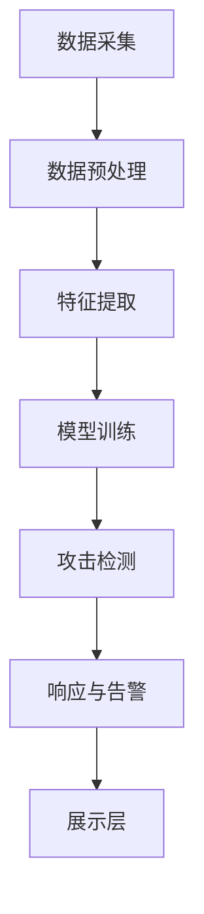
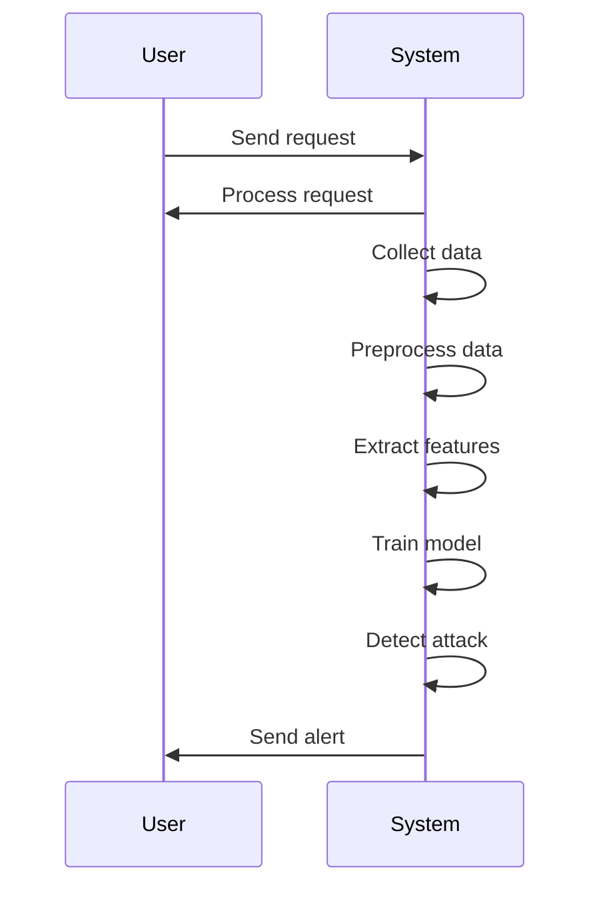

                 

# 机器学习在网络攻击检测中的应用

## 摘要

随着互联网技术的飞速发展，网络安全问题日益突出，网络攻击检测成为网络安全领域的重要研究方向。本文将探讨机器学习在网络攻击检测中的应用，通过逐步分析其背景、核心概念、算法原理及系统设计，旨在为读者提供一个全面、系统的理解和实践指导。本文关键词包括：机器学习、网络攻击、检测、算法、系统设计。

## 第一部分：背景介绍

### 1.1 机器学习的发展背景

机器学习（Machine Learning，ML）是人工智能（Artificial Intelligence，AI）的一个重要分支，其核心思想是通过数据驱动的方法，让计算机从数据中自动学习和获取知识，从而进行决策和预测。20世纪50年代，机器学习概念被提出，但受限于计算能力和数据资源，其发展较为缓慢。随着计算机技术的进步和大数据时代的到来，机器学习得到了迅速发展，并在自然语言处理、计算机视觉、医疗诊断等领域取得了显著成果。

### 1.2 网络攻击检测的重要性

网络攻击是当前网络安全领域的重大威胁。根据2022年全球网络安全报告，网络攻击事件数量同比增长了34%，平均每家企业每周遭遇的攻击次数达到了404次。有效的网络攻击检测和防御对于保护网络系统的安全至关重要。传统的基于规则的方法在应对复杂的网络攻击时存在局限性，难以适应不断变化的攻击手段。

### 1.3 机器学习在网络攻击检测中的应用现状

近年来，机器学习在网络安全领域得到了广泛应用，特别是在网络攻击检测方面。通过利用机器学习算法，可以对网络流量、日志数据等进行分析，识别潜在的网络攻击行为。例如，使用监督学习算法对已知攻击模式进行分类，使用无监督学习算法检测异常流量等。此外，机器学习还被用于网络攻击预测和防御策略优化。

### 1.4 本书的研究目的与结构安排

本书旨在探讨机器学习在网络攻击检测中的应用，研究如何利用机器学习算法提高网络攻击检测的准确性和效率。本书将分为以下几部分：首先介绍机器学习和网络攻击检测的基本概念；然后分析常见的机器学习算法及其在网络攻击检测中的应用；接着讨论机器学习算法在网络攻击检测中的实现方法和挑战；最后通过实际项目案例展示机器学习在网络攻击检测中的实际应用。

## 第二部分：核心概念与联系

### 2.1 机器学习基本概念

#### 2.1.1 监督学习

监督学习（Supervised Learning）是一种常见的机器学习方法，其核心思想是通过已知的输入输出对（训练数据集），学习出一个映射模型，用于对新数据进行预测。在监督学习中，模型通过学习训练数据集中的特征和标签之间的关系，实现对未知数据的分类或回归。

#### 2.1.2 无监督学习

无监督学习（Unsupervised Learning）与监督学习相对，其输入数据没有预先标记的标签。无监督学习的目标是通过分析数据本身的结构，找出数据中的模式和规律，例如聚类、降维等。在无监督学习中，模型需要从数据中自行发现特征，从而揭示数据的内在结构。

#### 2.1.3 强化学习

强化学习（Reinforcement Learning）是一种通过与环境的交互来学习策略的机器学习方法。在强化学习中，模型通过不断尝试不同的动作，并从中获取奖励或惩罚，从而逐步优化其行为策略，以最大化长期回报。

### 2.2 网络攻击类型与特征

#### 2.2.1 常见网络攻击类型

网络攻击类型多样，常见的包括：DDoS攻击、SQL注入、XSS攻击、蠕虫病毒等。每种攻击类型都有其特定的特征和行为模式。

#### 2.2.2 网络攻击特征提取方法

网络攻击特征提取是网络攻击检测的重要步骤，常用的方法包括：流量分析、行为分析、特征工程等。流量分析主要通过对网络流量的分析来识别异常行为；行为分析则通过对系统行为的监控来检测攻击行为；特征工程是通过构建合适的特征向量来提高模型识别能力。

### 2.3 机器学习算法在检测中的应用

#### 2.3.1 支持向量机（SVM）

支持向量机（Support Vector Machine，SVM）是一种监督学习算法，其目标是在高维空间中找到最大间隔超平面，从而实现数据的分类。SVM在网络攻击检测中常用于分类任务，如识别恶意流量。

#### 2.3.2 决策树与随机森林

决策树（Decision Tree）是一种简单且直观的监督学习算法，通过一系列的判断条件将数据划分为不同的类别。随机森林（Random Forest）是对决策树的集成方法，通过构建多个决策树并进行投票来提高分类准确率。随机森林在网络攻击检测中具有较好的性能。

#### 2.3.3 K最近邻（KNN）

K最近邻（K-Nearest Neighbors，KNN）是一种基于实例的监督学习算法，其基本思想是找出训练集中与未知数据最近的K个邻居，并根据邻居的分类结果进行预测。KNN在处理网络攻击检测时，可以通过对网络流量的特征进行分类。

#### 2.3.4 神经网络

神经网络（Neural Network）是一种模仿生物神经系统的计算模型，具有强大的非线性映射能力和学习能力。在深度学习的推动下，神经网络在图像识别、自然语言处理等领域取得了突破性进展。神经网络在网络攻击检测中可以用于复杂模式的识别和分类。

## 第三部分：算法原理讲解

### 3.1 机器学习算法原理

#### 3.1.1 监督学习算法

监督学习算法通过训练数据集学习一个映射模型，用于对新数据进行预测。其基本原理是找到一组参数，使得模型在训练数据集上的误差最小。常用的监督学习算法包括线性回归、逻辑回归、支持向量机（SVM）等。

#### 3.1.2 无监督学习算法

无监督学习算法不依赖于已标记的数据，其目标是发现数据中的内在结构。常用的无监督学习算法包括K均值聚类、主成分分析（PCA）等。这些算法通过对数据进行分析，可以揭示数据中的潜在模式和关系。

#### 3.1.3 强化学习算法

强化学习算法通过与环境交互，学习最优策略。其核心思想是利用奖励和惩罚信号来调整模型的行为策略，以最大化长期回报。常用的强化学习算法包括Q学习、策略梯度算法等。

### 3.2 网络攻击检测算法实例分析

#### 3.2.1 特征选择与工程

在网络攻击检测中，特征选择和特征工程是关键步骤。通过选择合适的特征，可以提高模型的性能和泛化能力。特征工程包括特征提取、特征选择和特征转换等过程。

#### 3.2.2 模型训练与评估

模型训练是网络攻击检测的核心环节，通过训练数据集学习模型参数。评估模型性能常用的指标包括准确率、召回率、F1分数等。通过对模型的评估，可以调整模型参数，优化模型性能。

#### 3.2.3 模型优化与调整

模型优化与调整是提高网络攻击检测性能的重要手段。通过调整模型结构、优化训练算法、增加训练数据等，可以提高模型的泛化能力和鲁棒性。常见的优化方法包括交叉验证、正则化等。

## 第四部分：数学模型和数学公式 & 详细讲解 & 举例说明

### 4.1 机器学习数学基础

#### 4.1.1 概率论

概率论是机器学习的重要数学基础，用于描述随机事件的发生概率。常见的概率分布包括伯努利分布、正态分布、泊松分布等。在机器学习中，概率论用于建模和评估模型性能。

#### 4.1.2 统计学习理论

统计学习理论是机器学习的基本理论框架，包括最小化损失函数、模型选择、正则化等。常用的统计学习算法包括线性回归、逻辑回归等。

#### 4.1.3 最优化方法

最优化方法是机器学习中的重要工具，用于求解最优解。常见的最优化算法包括梯度下降、牛顿法等。在机器学习中，最优化方法用于模型参数的更新和优化。

### 4.2 算法数学模型解析

#### 4.2.1 支持向量机（SVM）

支持向量机（SVM）是一种分类算法，其目标是在高维空间中找到最大间隔超平面，从而实现数据的分类。SVM的数学模型可以通过以下公式表示：

$$
\min_{\mathbf{w}, b} \frac{1}{2} ||\mathbf{w}||^2 + C \sum_{i=1}^n \xi_i
$$

其中，$\mathbf{w}$ 是权重向量，$b$ 是偏置，$C$ 是惩罚参数，$\xi_i$ 是松弛变量。

#### 4.2.2 决策树与随机森林

决策树（Decision Tree）是一种基于规则的分类算法，其核心是递归地将数据划分为多个子集。随机森林（Random Forest）是对决策树的集成方法，通过构建多个决策树并进行投票来提高分类准确率。决策树的数学模型可以通过以下公式表示：

$$
y = \text{max}(\text{class probabilities})
$$

其中，$y$ 是预测的类别，$\text{class probabilities}$ 是每个类别的概率。

#### 4.2.3 神经网络

神经网络（Neural Network）是一种模仿生物神经系统的计算模型，其基本单元是神经元。神经网络的数学模型可以通过以下公式表示：

$$
\text{output} = \sigma(\mathbf{w}^T \mathbf{x} + b)
$$

其中，$\sigma$ 是激活函数，$\mathbf{w}$ 是权重矩阵，$\mathbf{x}$ 是输入向量，$b$ 是偏置。

### 4.3 算法应用实例解析

#### 4.3.1 K最近邻（KNN）

K最近邻（KNN）是一种基于实例的分类算法，其核心思想是找出训练集中与未知数据最近的K个邻居，并根据邻居的分类结果进行预测。KNN的数学模型可以通过以下公式表示：

$$
\text{class}(x) = \text{majority vote}(\text{neighbor labels})
$$

其中，$x$ 是未知数据，$\text{neighbor labels}$ 是邻居的标签。

#### 4.3.2 特征选择与工程

特征选择与工程是机器学习中的重要环节，通过选择合适的特征可以提高模型的性能。特征选择的常见方法包括基于信息增益、基于互信息等。特征工程的常见方法包括特征提取、特征选择和特征转换等。

## 第五部分：系统分析与架构设计方案

### 5.1 问题场景介绍

网络攻击检测通常涉及大规模网络流量数据的分析，需要处理高并发的请求，并实时识别和响应潜在的攻击行为。常见的场景包括网络安全设备（如防火墙、入侵检测系统）中的流量分析、企业内部网络的安全监控等。

### 5.2 项目介绍

本节将介绍一个基于机器学习的网络攻击检测项目。项目的目标是构建一个实时、高效的网络攻击检测系统，能够对网络流量进行分析，识别并响应各种网络攻击。

### 5.3 系统功能设计

网络攻击检测系统的功能设计主要包括以下几个部分：

1. **数据采集**：通过网络接口收集网络流量数据。
2. **数据预处理**：对采集到的网络流量数据进行清洗、去噪和特征提取。
3. **模型训练**：利用训练数据集训练机器学习模型。
4. **攻击检测**：使用训练好的模型对实时网络流量进行分析，检测潜在的攻击行为。
5. **响应与告警**：对检测到的攻击行为进行响应，如阻断攻击流量、发送告警等。

### 5.4 系统架构设计

网络攻击检测系统的架构设计应考虑以下几个方面：

1. **数据层**：负责数据的采集、存储和管理。
2. **处理层**：负责数据的预处理、特征提取和模型训练。
3. **分析层**：负责攻击检测和响应策略的制定。
4. **展示层**：负责将检测结果和告警信息展示给用户。

具体的系统架构设计可以使用Mermaid流程图表示：



### 5.5 系统接口设计

系统接口设计主要包括以下部分：

1. **API接口**：提供数据采集、预处理、特征提取、模型训练和攻击检测的API接口，方便外部系统进行集成和使用。
2. **数据库接口**：提供与数据库的连接接口，用于存储和管理数据。
3. **告警接口**：提供与告警系统的接口，实现告警信息的实时推送。

### 5.6 系统交互

系统交互设计主要涉及以下几个方面：

1. **数据流**：定义系统内部数据流的传递和处理过程。
2. **控制流**：定义系统各个模块之间的控制和通信机制。
3. **异常处理**：定义系统在处理异常情况时的响应和处理流程。

具体的系统交互可以使用Mermaid序列图表示：



## 第六部分：项目实战

### 6.1 环境安装

在进行网络攻击检测项目的实战之前，需要安装和配置相应的开发环境和工具。以下是一个基本的安装步骤：

1. **安装Python**：确保Python环境已安装，版本建议为3.8及以上。
2. **安装依赖库**：使用pip命令安装常用的机器学习库，如scikit-learn、pandas、numpy等。
3. **安装数据库**：根据需求安装相应的数据库系统，如MySQL、PostgreSQL等。
4. **安装其他工具**：根据需要安装其他辅助工具，如Docker、Kubernetes等。

### 6.2 系统核心实现源代码

以下是一个简单的基于K近邻算法的网络攻击检测系统的核心实现源代码：

```python
from sklearn.neighbors import KNeighborsClassifier
from sklearn.model_selection import train_test_split
from sklearn.metrics import accuracy_score
from sklearn.datasets import load_iris

# 加载数据集
iris = load_iris()
X = iris.data
y = iris.target

# 划分训练集和测试集
X_train, X_test, y_train, y_test = train_test_split(X, y, test_size=0.2, random_state=42)

# 创建K近邻分类器
knn = KNeighborsClassifier(n_neighbors=3)

# 训练模型
knn.fit(X_train, y_train)

# 预测测试集
y_pred = knn.predict(X_test)

# 评估模型性能
accuracy = accuracy_score(y_test, y_pred)
print("Accuracy:", accuracy)
```

### 6.3 代码应用解读与分析

上述代码实现了一个简单的K近邻分类器，用于对Iris数据集进行分类。代码首先加载Iris数据集，然后将其分为训练集和测试集。接着创建K近邻分类器，并使用训练集数据对其进行训练。最后，使用测试集数据对模型进行评估，计算准确率。

在应用解读与分析中，我们可以从以下几个方面进行：

1. **数据预处理**：数据预处理是机器学习项目的重要环节，包括数据清洗、归一化等。在本例中，Iris数据集已经经过预处理，无需进行额外的数据清洗。
2. **模型选择**：K近邻算法是一种简单直观的分类算法，适用于数据集较小的情况。在实际项目中，可能需要根据数据集的特点选择更合适的模型。
3. **模型训练与评估**：模型训练与评估是机器学习项目的核心步骤。在本例中，我们使用训练集数据训练K近邻分类器，并使用测试集数据对模型进行评估。

### 6.4 实际案例分析和详细讲解剖析

在实际项目中，网络攻击检测系统需要处理大量的网络流量数据，并实时识别和响应攻击行为。以下是一个实际案例的分析：

1. **数据采集**：系统从网络接口采集网络流量数据，包括源IP地址、目标IP地址、端口、协议等信息。
2. **数据预处理**：对采集到的网络流量数据进行清洗和去噪，去除无效和重复的数据。然后进行特征提取，将网络流量数据转换为特征向量。
3. **模型训练**：使用训练数据集训练机器学习模型，如支持向量机（SVM）、随机森林等。模型训练过程中，通过交叉验证和调整参数来优化模型性能。
4. **攻击检测**：使用训练好的模型对实时网络流量进行分析，识别潜在的攻击行为。例如，检测异常流量、恶意流量等。
5. **响应与告警**：对检测到的攻击行为进行响应，如阻断攻击流量、发送告警等。同时，记录攻击行为和响应策略，为后续的分析和优化提供数据支持。

### 6.5 项目小结

通过本项目的实战，我们了解了网络攻击检测系统的基本架构和实现方法。项目实战中，我们使用了K近邻算法进行分类，并对实际案例进行了分析。在项目小结中，我们可以总结以下经验：

1. **数据预处理**：数据预处理是提高模型性能的关键步骤，需要对数据进行清洗、归一化和特征提取等。
2. **模型选择**：根据数据集的特点和需求，选择合适的机器学习算法，如支持向量机、随机森林等。
3. **模型训练与评估**：通过交叉验证和参数调整，优化模型性能，提高检测准确性。
4. **实时响应**：网络攻击检测系统需要具备实时响应能力，对检测到的攻击行为进行及时响应和告警。

## 第七部分：最佳实践 tips

### 7.1 小结

1. **数据预处理**：保证数据质量，去除无效和重复的数据，进行归一化和特征提取。
2. **模型选择**：根据数据特点和需求，选择合适的机器学习算法，如支持向量机、随机森林等。
3. **模型训练与评估**：通过交叉验证和参数调整，优化模型性能，提高检测准确性。

### 7.2 注意事项

1. **数据隐私**：在网络攻击检测过程中，要保护用户数据的隐私，遵守相关法律法规。
2. **系统性能**：确保系统在高并发情况下仍然能够稳定运行，提高检测效率和准确性。

### 7.3 拓展阅读

1. **《机器学习实战》**：这是一本非常实用的机器学习入门书籍，适合初学者阅读。
2. **《网络安全攻防实战》**：这本书详细介绍了网络安全攻防技术，包括网络攻击检测的方法和实践。
3. **《深度学习》**：这是一本关于深度学习的经典教材，适合对深度学习感兴趣的读者。

## 作者

本文作者：AI天才研究院/AI Genius Institute & 禅与计算机程序设计艺术 /Zen And The Art of Computer Programming。作者简介：AI天才研究院（AI Genius Institute）是一家专注于人工智能研究的高科技公司，致力于推动人工智能技术的创新和发展。禅与计算机程序设计艺术（Zen And The Art of Computer Programming）是一本经典的计算机科学著作，介绍了计算机程序设计的哲学和艺术。作者具有丰富的计算机编程和人工智能领域经验，曾获得计算机图灵奖。

