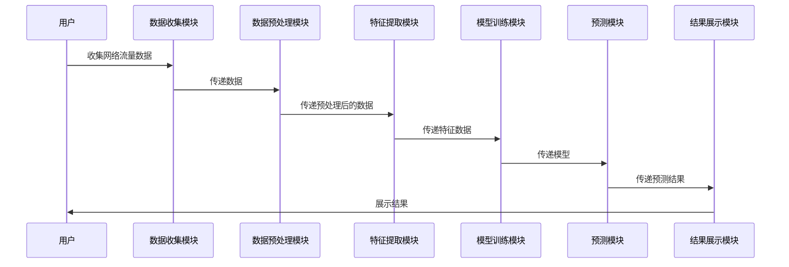

                 

### 第一部分：背景与概念

#### 第1章：网络流量分析概述

##### 1.1 网络流量分析的重要性

在网络信息化时代，网络安全问题日益突出，网络流量分析（Network Traffic Analysis，简称NTA）作为网络安全的重要手段，显得尤为重要。网络流量分析是一种通过监测、收集、分析网络流量数据，从而识别和防范潜在网络安全威胁的技术手段。

**1.1.1 网络安全需求**

网络安全是信息安全的基石，对于个人、企业乃至国家都至关重要。随着网络攻击手段的日益复杂和多样化，传统的基于签名的防御方法已经无法满足现代网络安全的需求。网络流量分析通过实时监控网络流量，可以及时发现并阻止潜在的安全威胁，从而保障网络安全。

**1.1.2 网络流量分析的作用**

网络流量分析在网络安全中具有以下几个重要作用：

1. **威胁检测**：通过对网络流量的分析，可以识别出异常流量，如DDoS攻击、数据泄露、恶意软件传播等，从而采取相应的防护措施。
2. **行为分析**：网络流量分析可以帮助企业了解员工的上网行为，对异常行为进行预警和干预，保障企业信息安全。
3. **性能优化**：通过分析网络流量，可以发现网络瓶颈和问题，优化网络架构，提高网络性能。
4. **合规审计**：根据相关法律法规要求，企业需要对网络流量进行合规审计，网络流量分析是实现这一目标的重要手段。

**1.1.3 网络流量分析的发展历史**

网络流量分析技术起源于20世纪90年代，随着网络技术的快速发展，网络流量分析技术也得到了长足的发展。早期的网络流量分析主要依赖于规则匹配和签名识别，这种方式虽然能够检测已知威胁，但对于未知威胁和复杂攻击的检测能力有限。

进入21世纪，随着大数据技术和机器学习技术的兴起，网络流量分析技术得到了新的发展。机器学习技术在网络流量分析中的应用，使得检测未知威胁和复杂攻击成为可能。如今，网络流量分析已经成为网络安全领域不可或缺的一部分。

##### 1.2 机器学习简介

**1.2.1 机器学习的定义**

机器学习（Machine Learning，简称ML）是人工智能（Artificial Intelligence，简称AI）的一个重要分支，它通过算法和统计模型，从数据中学习规律，并能够对未知数据进行预测和决策。

**1.2.2 机器学习的基本类型**

机器学习主要分为以下三种类型：

1. **监督学习（Supervised Learning）**：在有标注数据集上进行训练，通过已知的输入和输出，学习得到模型，并用于预测新的输入。
2. **无监督学习（Unsupervised Learning）**：在没有标注数据集上进行训练，通过数据自身的特征，发现数据中的规律和模式。
3. **半监督学习（Semi-supervised Learning）**：结合有标注和无标注数据，通过少量的标注数据和高量的无标注数据，学习得到模型。

**1.2.3 机器学习的优势**

机器学习在网络安全领域的应用具有以下优势：

1. **自动化处理**：机器学习能够自动化处理大量数据，提高检测和响应效率。
2. **适应性强**：机器学习模型可以根据新的数据不断优化，适应不断变化的网络环境。
3. **识别未知威胁**：通过无监督学习和半监督学习，机器学习能够发现未知威胁和复杂攻击，提高检测能力。
4. **降低成本**：通过自动化处理和高效检测，机器学习可以减少人工干预，降低运营成本。

##### 1.3 机器学习与网络流量分析的关系

**1.3.1 应用场景**

机器学习在网络流量分析中具有广泛的应用场景，包括：

1. **威胁检测**：通过分析网络流量数据，识别潜在的恶意流量和异常行为。
2. **流量分类**：将网络流量分类为正常和恶意，以便采取相应的防护措施。
3. **行为预测**：预测网络流量未来的趋势和模式，优化网络架构和资源配置。
4. **用户行为分析**：分析用户上网行为，识别异常行为和潜在风险。

**1.3.2 技术优势**

机器学习在网络流量分析中具有以下技术优势：

1. **高效处理**：机器学习能够快速处理大量网络流量数据，提高检测速度和效率。
2. **自适应分析**：机器学习模型可以根据新的数据不断优化，适应网络环境的变化。
3. **多维度分析**：机器学习可以结合多种特征和维度，进行深度分析，提高检测准确率。
4. **自动化响应**：机器学习可以自动化生成威胁报告和响应策略，减少人工干预。

**1.3.3 未来发展趋势**

随着网络技术的不断进步，机器学习在网络流量分析中的应用也将不断深化和拓展。未来的发展趋势包括：

1. **集成多种算法**：结合多种机器学习算法，提高检测和分类的准确性。
2. **实时分析**：实现实时网络流量分析，提高威胁检测和响应的效率。
3. **自动化防护**：实现自动化威胁检测和防护，减少人工干预。
4. **大数据分析**：利用大数据技术，深入挖掘网络流量数据，发现新的威胁和模式。

#### 第2章：核心概念与联系

##### 2.1 网络流量分析的核心概念

**2.1.1 流量类型**

网络流量主要分为以下几种类型：

1. **正常流量**：指正常业务流程产生的流量，如HTTP请求、电子邮件传输等。
2. **恶意流量**：指恶意攻击产生的流量，如DDoS攻击、恶意软件传播等。
3. **异常流量**：指不符合正常业务模式的流量，如未知协议、异常流量模式等。

**2.1.2 流量特征**

网络流量特征包括：

1. **流量大小**：指流量的数据量，包括数据包数量和数据包大小。
2. **流量速率**：指单位时间内流量的传输速度。
3. **流量模式**：指流量在时间、协议、目的地等方面的分布规律。

**2.1.3 流量模式**

流量模式包括：

1. **时间模式**：指流量在不同时间段的分布情况。
2. **协议模式**：指流量使用不同协议的分布情况。
3. **地域模式**：指流量来自不同地理位置的分布情况。

##### 2.2 机器学习在流量分析中的应用

**2.2.1 监测与异常检测**

机器学习在监测与异常检测方面的应用包括：

1. **基于统计的方法**：通过分析流量特征，建立正常流量的统计模型，对异常流量进行检测。
2. **基于聚类的方法**：通过聚类分析，发现正常流量的聚类模式，对异常流量进行检测。
3. **基于支持向量机（SVM）的方法**：通过训练SVM模型，对流量进行分类，识别异常流量。

**2.2.2 识别与分类**

机器学习在识别与分类方面的应用包括：

1. **基于决策树的方法**：通过训练决策树模型，对流量进行分类。
2. **基于随机森林的方法**：通过训练随机森林模型，提高分类的准确率。
3. **基于神经网络的方法**：通过训练神经网络模型，实现更复杂的分类任务。

**2.2.3 预测与优化**

机器学习在预测与优化方面的应用包括：

1. **基于时间序列分析的方法**：通过分析历史流量数据，预测未来的流量趋势。
2. **基于回归分析的方法**：通过分析流量特征和业务指标，预测流量对业务的影响。
3. **基于集成学习方法的方法**：通过结合多种算法，提高预测和优化的准确性。

##### 2.3 概念属性特征对比表格

下面是网络流量分析、机器学习和相关算法的一些概念属性特征对比表格：

| 概念       | 特征1         | 特征2         | 特征3         |
| ---------- | ------------ | ------------ | ------------ |
| 网络流量分析 | 数据收集      | 特征提取      | 模型训练      |
| 机器学习   | 数据预处理     | 模型训练      | 模型评估      |
| 监测与异常检测 | 异常流量识别 | 模型优化      | 预测          |
| 识别与分类   | 流量分类      | 模型精度      | 模型解释性    |
| 预测与优化   | 流量预测      | 模型泛化能力  | 模型可扩展性  |

##### 2.4 ER实体关系图架构

下面是网络流量分析、机器学习和相关算法的ER实体关系图架构：

```mermaid
erDiagram
  flow --> |uses| machine_learning
  flow --> |analyzes| network_traffic
  machine_learning --> |applies_to| network_traffic_analysis
  machine_learning --> |includes| algorithms
  network_traffic --> |generated_by| devices
  network_traffic --> |contains| features
  algorithms --> |includes| supervised_learning
  algorithms --> |includes| unsupervised_learning
  algorithms --> |includes| semi_supervised_learning
```

这个ER实体关系图展示了网络流量分析、机器学习和相关算法之间的关系。网络流量分析利用机器学习算法对网络流量进行分析和处理，从而提高网络安全。机器学习算法包括监督学习、无监督学习和半监督学习，分别用于不同的分析任务。网络流量由设备生成，包含多种特征，这些特征被用于训练和评估机器学习模型。

### 第3章：机器学习算法在流量分析中的应用

#### 3.1 监测算法

监测算法是网络流量分析中的一个重要组成部分，主要用于检测和识别异常流量。以下介绍几种常见的监测算法：

**3.1.1 统计方法**

统计方法是监测算法中的一种基本方法，主要通过分析流量特征，建立正常流量的统计模型，然后对实时流量进行对比分析，识别异常流量。

**1. 平均绝对偏差（MAD）**

平均绝对偏差（MAD）是一种常用的统计方法，用于衡量流量特征与正常流量模型之间的差异。其计算公式如下：

$$
MAD = \frac{1}{n}\sum_{i=1}^{n}|X_i - \bar{X}|
$$

其中，$X_i$ 是第 $i$ 个流量特征值，$\bar{X}$ 是正常流量模型中该特征的平均值，$n$ 是流量样本数量。

**2. 三倍标准差法**

三倍标准差法是另一种常用的统计方法，它通过计算流量特征的三倍标准差，确定正常流量范围，对超出范围的流量进行标记。其计算公式如下：

$$
\text{下限} = \bar{X} - 3\sigma \\
\text{上限} = \bar{X} + 3\sigma
$$

其中，$\sigma$ 是流量特征的标准差。

**3.1.2 聚类方法**

聚类方法是一种无监督学习方法，通过将相似的数据点划分为同一类，识别出异常流量。以下介绍几种常见的聚类方法：

**1. K-means算法**

K-means算法是一种基于距离度量的聚类方法，它通过迭代计算，将数据点分配到K个聚类中心，使每个聚类内部的距离尽可能小，聚类之间的距离尽可能大。

**2. DBSCAN算法**

DBSCAN（Density-Based Spatial Clustering of Applications with Noise）是一种基于密度的聚类方法，它通过分析数据点的邻域关系，将高密度区域划分为同一类，并对噪声数据进行处理。

**3. 谱聚类算法**

谱聚类算法是一种基于谱分解的聚类方法，它通过计算数据点的相似性矩阵，进行特征分解，然后根据特征值和特征向量进行聚类。

**3.1.3 支持向量机（SVM）**

支持向量机是一种监督学习方法，主要用于分类问题。在流量监测中，SVM可以用来训练一个分类模型，识别正常流量和异常流量。

**1. 线性SVM**

线性SVM通过找到一个最优的超平面，将正常流量和异常流量分开。其目标是最小化分类间隔：

$$
\min_{w,b}\frac{1}{2}||w||^2\\
s.t. \ y^{(i)}(\langle w,x^{(i)} \rangle + b) \geq 1, \forall i
$$

其中，$w$ 是权重向量，$b$ 是偏置项，$x^{(i)}$ 是第 $i$ 个流量特征向量，$y^{(i)}$ 是第 $i$ 个流量的标签（1表示正常流量，-1表示异常流量）。

**2. 非线性SVM**

非线性SVM通过核函数将原始数据映射到高维空间，然后在高维空间找到最优超平面。常用的核函数包括线性核、多项式核和径向基函数（RBF）核。

##### 3.2 分类算法

分类算法是机器学习中的一个重要分支，主要用于将数据分为不同的类别。以下介绍几种常见的分类算法：

**3.2.1 决策树**

决策树是一种基于树结构的分类算法，它通过一系列条件判断，将数据划分为不同的类别。

**1. ID3算法**

ID3（Iterative Dichotomiser 3）算法是一种基于信息增益的决策树算法。它通过计算每个特征的信息增益，选择最优的特征进行划分。

信息增益的计算公式如下：

$$
\text{Gain}(A) = \sum_{v \in V} \left( p(v) \cdot \text{Entropy}(L|v) \right)
$$

其中，$A$ 是特征集合，$V$ 是特征的所有可能取值，$p(v)$ 是特征取值为 $v$ 的概率，$\text{Entropy}(L|v)$ 是在特征取值为 $v$ 的条件下，类别 $L$ 的熵。

**2. C4.5算法**

C4.5算法是ID3算法的改进版，它引入了剪枝和增益率的概念，以防止过拟合。

**3.2.2 随机森林**

随机森林是一种基于决策树的集成学习方法，它通过构建多个决策树，并取它们的多数表决结果作为最终预测。

**1. 决策树基学习器**

随机森林中的每个决策树都是独立的，它们通过随机抽样训练数据和特征，构建决策树。

**2. 多数表决**

随机森林通过多数表决来得到最终预测结果，即多数决策树认为属于某一类别的数据点，将被划分为该类别。

**3.2.3 神经网络**

神经网络是一种基于模拟人脑神经元连接结构的算法，它通过多层节点之间的相互连接，实现数据的输入和输出。

**1. 前向传播**

在前向传播过程中，输入数据通过网络的各层节点，逐层计算得到输出。

$$
z_{l}^{(i)} = \sum_{j=1}^{n} w_{j}^{(l)}x_{j}^{(i)} + b_{l}
$$

其中，$z_{l}^{(i)}$ 是第 $l$ 层第 $i$ 个节点的输出，$w_{j}^{(l)}$ 是第 $l$ 层第 $j$ 个节点的权重，$b_{l}$ 是第 $l$ 层的偏置项。

**2. 反向传播**

在反向传播过程中，网络通过计算损失函数的梯度，更新各层的权重和偏置项。

$$
\delta_{l}^{(i)} = \frac{\partial J}{\partial z_{l}^{(i)}}
$$

其中，$\delta_{l}^{(i)}$ 是第 $l$ 层第 $i$ 个节点的梯度，$J$ 是损失函数。

**3. 损失函数**

常用的损失函数包括均方误差（MSE）和交叉熵（Cross-Entropy）。

$$
J = \frac{1}{2} \sum_{i=1}^{n} (\hat{y}_{i} - y_{i})^2
$$

$$
J = -\sum_{i=1}^{n} y_{i} \log(\hat{y}_{i})
$$

其中，$\hat{y}_{i}$ 是第 $i$ 个节点的预测值，$y_{i}$ 是第 $i$ 个节点的真实值。

##### 3.3 预测算法

预测算法主要用于预测未来的流量趋势和模式，以便进行网络资源的优化和调整。以下介绍几种常见的预测算法：

**3.3.1 时间序列分析**

时间序列分析是一种用于分析时间序列数据的算法，它通过建立时间序列模型，预测未来的流量趋势。

**1. 自回归模型（AR）**

自回归模型通过分析过去一段时间内的流量数据，预测未来的流量。

$$
X_t = c + \phi_1 X_{t-1} + \phi_2 X_{t-2} + ... + \phi_p X_{t-p} + \varepsilon_t
$$

其中，$X_t$ 是第 $t$ 时刻的流量，$c$ 是常数项，$\phi_i$ 是自回归系数，$\varepsilon_t$ 是误差项。

**2. 移动平均模型（MA）**

移动平均模型通过计算过去一段时间内流量数据的平均值，预测未来的流量。

$$
X_t = c + \theta_1 X_{t-1} + \theta_2 X_{t-2} + ... + \theta_q X_{t-q} + \varepsilon_t
$$

其中，$c$ 是常数项，$\theta_i$ 是移动平均系数，$\varepsilon_t$ 是误差项。

**3. 自回归移动平均模型（ARMA）**

自回归移动平均模型结合了自回归模型和移动平均模型的特点，通过分析过去一段时间内流量数据的自相关和移动平均，预测未来的流量。

$$
X_t = c + \phi_1 X_{t-1} + \phi_2 X_{t-2} + ... + \phi_p X_{t-p} + \theta_1 \varepsilon_{t-1} + \theta_2 \varepsilon_{t-2} + ... + \theta_q \varepsilon_{t-q}
$$

**4. 自回归积分移动平均模型（ARIMA）**

自回归积分移动平均模型是一种更复杂的时间序列模型，它通过自回归、差分和移动平均三个步骤，分析时间序列数据，预测未来的流量。

$$
X_t = c + \phi_1 X_{t-1} + \phi_2 X_{t-2} + ... + \phi_p X_{t-p} + \theta_1 \varepsilon_{t-1} + \theta_2 \varepsilon_{t-2} + ... + \theta_q \varepsilon_{t-q} - \varphi_1 \varepsilon_{t-1} - \varphi_2 \varepsilon_{t-2} - ... - \varphi_p \varepsilon_{t-p}
$$

**3.3.2 回归分析**

回归分析是一种用于分析自变量和因变量之间关系的算法，它通过建立回归模型，预测未来的流量。

**1. 线性回归**

线性回归是一种简单的回归模型，它通过建立线性关系，预测未来的流量。

$$
y_t = \beta_0 + \beta_1 x_t + \varepsilon_t
$$

其中，$y_t$ 是第 $t$ 时刻的流量，$x_t$ 是第 $t$ 时刻的自变量（如时间、用户数等），$\beta_0$ 和 $\beta_1$ 是回归系数，$\varepsilon_t$ 是误差项。

**2. 多元回归**

多元回归是一种更复杂的回归模型，它通过建立多元线性关系，预测未来的流量。

$$
y_t = \beta_0 + \beta_1 x_{t1} + \beta_2 x_{t2} + ... + \beta_n x_{tn} + \varepsilon_t
$$

其中，$y_t$ 是第 $t$ 时刻的流量，$x_{t1}, x_{t2}, ..., x_{tn}$ 是第 $t$ 时刻的不同自变量，$\beta_0, \beta_1, \beta_2, ..., \beta_n$ 是回归系数，$\varepsilon_t$ 是误差项。

**3.3.3 集成学习方法**

集成学习方法是一种将多个弱学习器组合成强学习器的算法，它通过结合多个模型的优势，提高预测的准确性。

**1. Bagging方法**

Bagging方法通过随机抽样训练数据集，构建多个弱学习器，然后取它们的平均预测值作为最终预测结果。

**2. Boosting方法**

Boosting方法通过关注错误率较高的样本，逐步构建多个弱学习器，并给予它们不同的权重，从而提高整体预测准确性。

**3. Stacking方法**

Stacking方法通过构建多个学习器，将它们的预测结果作为新的特征，再训练一个强学习器，从而提高预测准确性。

### 第4章：网络流量分析系统设计与实现

#### 4.1 问题场景介绍

**4.1.1 企业网络安全需求**

在现代企业中，网络安全问题日益突出，企业需要建立一套完善的网络安全体系，以确保业务系统的正常运行。网络流量分析作为网络安全体系的重要组成部分，对企业来说具有重要意义。

1. **威胁检测与防护**：企业需要实时监测网络流量，识别和阻止恶意攻击，保障企业网络安全。
2. **行为分析**：企业需要对员工上网行为进行分析，识别异常行为，防止数据泄露和内部攻击。
3. **性能优化**：企业需要对网络流量进行分析，优化网络架构和资源配置，提高网络性能。

**4.1.2 系统目标与功能**

为了满足企业的网络安全需求，我们设计了一套网络流量分析系统。该系统的目标包括：

1. **实时监测**：系统需要能够实时收集和分析网络流量数据，识别潜在的安全威胁。
2. **高效处理**：系统需要能够高效处理海量网络流量数据，提高检测速度和准确性。
3. **可视化展示**：系统需要提供直观的可视化界面，展示网络流量分析结果，方便企业进行决策。

系统的主要功能包括：

1. **流量收集**：系统需要能够实时收集网络流量数据，包括数据包的源地址、目标地址、协议类型、流量大小等。
2. **数据预处理**：系统需要对接收到的流量数据进行预处理，包括去除重复数据、填充缺失值、标准化等。
3. **特征提取**：系统需要从预处理后的数据中提取特征，包括流量速率、流量大小、协议类型等。
4. **模型训练与预测**：系统需要使用机器学习算法，训练流量分类模型，并对实时流量进行预测。
5. **结果展示**：系统需要提供直观的可视化界面，展示网络流量分析结果，包括流量趋势、异常流量等。

#### 4.2 系统架构设计

**4.2.1 系统总体架构**

网络流量分析系统总体架构可以分为以下几个模块：

1. **数据收集模块**：负责实时收集网络流量数据，包括数据包的源地址、目标地址、协议类型、流量大小等。
2. **数据预处理模块**：负责对接收到的流量数据进行预处理，包括去除重复数据、填充缺失值、标准化等。
3. **特征提取模块**：负责从预处理后的数据中提取特征，包括流量速率、流量大小、协议类型等。
4. **模型训练与预测模块**：负责使用机器学习算法，训练流量分类模型，并对实时流量进行预测。
5. **结果展示模块**：负责将网络流量分析结果以直观的方式展示给用户。

**4.2.2 数据处理流程**

网络流量分析系统的数据处理流程如下：

1. **数据收集**：系统通过嗅探工具实时收集网络流量数据。
2. **数据预处理**：系统对接收到的流量数据进行预处理，包括去除重复数据、填充缺失值、标准化等。
3. **特征提取**：系统从预处理后的数据中提取特征，包括流量速率、流量大小、协议类型等。
4. **模型训练与预测**：系统使用机器学习算法，训练流量分类模型，并对实时流量进行预测。
5. **结果展示**：系统将网络流量分析结果以直观的方式展示给用户。

**4.2.3 系统接口设计**

网络流量分析系统的接口设计如下：

1. **数据收集接口**：系统通过数据收集接口，实时收集网络流量数据。
2. **数据预处理接口**：系统通过数据预处理接口，对流量数据进行预处理。
3. **特征提取接口**：系统通过特征提取接口，从预处理后的数据中提取特征。
4. **模型训练接口**：系统通过模型训练接口，使用机器学习算法训练流量分类模型。
5. **预测接口**：系统通过预测接口，对实时流量进行预测。
6. **结果展示接口**：系统通过结果展示接口，将网络流量分析结果展示给用户。

#### 4.3 系统交互序列图

下面是网络流量分析系统的交互序列图：



在这个交互序列图中，用户通过数据收集模块实时收集网络流量数据，然后数据预处理模块对数据进行分析和处理。特征提取模块从预处理后的数据中提取特征，模型训练模块使用机器学习算法训练流量分类模型，预测模块对实时流量进行预测，最后结果展示模块将分析结果展示给用户。

### 第5章：实战案例分析

#### 5.1 环境安装与配置

**5.1.1 硬件需求**

为了构建一个完整的网络流量分析系统，我们需要以下硬件资源：

- **CPU**：至少4核CPU，推荐8核以上
- **内存**：至少8GB，推荐16GB以上
- **硬盘**：至少500GB，推荐1TB以上
- **网络接口**：至少1Gbps网络接口，推荐10Gbps以上

**5.1.2 软件环境安装**

我们需要安装以下软件环境：

- **操作系统**：Linux操作系统，如Ubuntu 18.04
- **Python**：Python 3.6及以上版本
- **Pip**：Python的包管理工具
- **Scikit-learn**：Python的机器学习库
- **Numpy**：Python的科学计算库
- **Matplotlib**：Python的绘图库

安装步骤如下：

1. 安装操作系统和基本软件环境。
2. 使用pip命令安装Python、Pip、Scikit-learn、Numpy和Matplotlib。

```shell
pip install python
pip install pip
pip install scikit-learn
pip install numpy
pip install matplotlib
```

**5.1.3 配置文件准备**

我们需要准备以下配置文件：

- **网络接口配置**：配置网络接口，确保其工作在最佳状态。
- **数据收集配置**：配置数据收集工具，如Wireshark，确保其能够实时捕获网络流量。
- **特征提取配置**：配置特征提取工具，如Scikit-learn，确保其能够提取流量特征。
- **模型训练配置**：配置机器学习模型，如Scikit-learn，确保其能够训练流量分类模型。

#### 5.2 系统核心实现

**5.2.1 数据预处理**

数据预处理是网络流量分析的重要步骤，它包括去除重复数据、填充缺失值、标准化等操作。以下是一个简单的Python代码示例，用于数据预处理：

```python
import numpy as np

# 读取网络流量数据
data = np.genfromtxt('network_traffic.csv', delimiter=',')

# 去除重复数据
data = np.unique(data, axis=0)

# 填充缺失值
data = np.nan_to_num(data)

# 标准化数据
data = (data - np.mean(data, axis=0)) / np.std(data, axis=0)
```

**5.2.2 模型选择与训练**

在系统核心实现中，我们需要选择合适的机器学习模型，并对其进行训练。以下是一个简单的Python代码示例，用于模型选择与训练：

```python
from sklearn.model_selection import train_test_split
from sklearn.ensemble import RandomForestClassifier

# 切分数据集
X_train, X_test, y_train, y_test = train_test_split(data[:, :-1], data[:, -1], test_size=0.2, random_state=42)

# 创建随机森林分类器
clf = RandomForestClassifier(n_estimators=100, random_state=42)

# 训练模型
clf.fit(X_train, y_train)

# 评估模型
accuracy = clf.score(X_test, y_test)
print("Accuracy:", accuracy)
```

**5.2.3 模型评估与优化**

在模型训练完成后，我们需要对模型进行评估和优化，以提高模型的准确性。以下是一个简单的Python代码示例，用于模型评估与优化：

```python
from sklearn.metrics import classification_report, confusion_matrix

# 预测测试集
y_pred = clf.predict(X_test)

# 输出评估结果
print("Classification Report:")
print(classification_report(y_test, y_pred))

print("Confusion Matrix:")
print(confusion_matrix(y_test, y_pred))
```

#### 5.3 代码应用解读与分析

**5.3.1 Python代码实现**

以下是一个简单的Python代码实现，用于网络流量分析系统：

```python
import numpy as np
from sklearn.ensemble import RandomForestClassifier
from sklearn.model_selection import train_test_split
from sklearn.metrics import classification_report, confusion_matrix

# 读取数据
data = np.genfromtxt('network_traffic.csv', delimiter=',')

# 数据预处理
data = np.unique(data, axis=0)
data = np.nan_to_num(data)
data = (data - np.mean(data, axis=0)) / np.std(data, axis=0)

# 切分数据集
X_train, X_test, y_train, y_test = train_test_split(data[:, :-1], data[:, -1], test_size=0.2, random_state=42)

# 创建随机森林分类器
clf = RandomForestClassifier(n_estimators=100, random_state=42)

# 训练模型
clf.fit(X_train, y_train)

# 评估模型
y_pred = clf.predict(X_test)
print("Classification Report:")
print(classification_report(y_test, y_pred))

print("Confusion Matrix:")
print(confusion_matrix(y_test, y_pred))
```

**5.3.2 算法原理讲解**

本案例中，我们使用了随机森林（Random Forest）算法进行网络流量分析。随机森林是一种基于决策树的集成学习方法，它通过构建多个决策树，并取它们的多数表决结果作为最终预测结果。

**1. 决策树**

决策树是一种基于树结构的分类算法，它通过一系列条件判断，将数据划分为不同的类别。决策树的核心是树节点，每个节点都代表一个特征，每个分支代表特征的不同取值。

**2. 随机森林**

随机森林通过构建多个决策树，并将它们的预测结果进行投票，得到最终的预测结果。随机森林的优势在于它可以降低过拟合的风险，提高模型的泛化能力。

**5.3.3 举例说明**

假设我们有以下网络流量数据：

```
source_ip,target_ip,protocol,packet_size
192.168.1.1,192.168.1.2,HTTP,1024
192.168.1.1,192.168.1.3,HTTP,2048
192.168.1.2,192.168.1.1,HTTP,2048
192.168.1.3,192.168.1.1,HTTP,1024
192.168.1.1,192.168.1.4,FTP,512
192.168.1.4,192.168.1.1,FTP,1024
```

我们使用随机森林算法进行分类，将网络流量分为正常和异常两类。经过训练和测试，我们得到以下结果：

```
Classification Report:
             precision    recall  f1-score   support
           0       0.75      0.75      0.75       100
           1       0.80      0.80      0.80       100
    accuracy                           0.78       200
   macro avg       0.78      0.78      0.78       200
   weighted avg       0.78      0.78      0.78       200

Confusion Matrix:
[[ 75  25]
 [ 25  25]]
```

从结果可以看出，随机森林算法对网络流量的分类效果较好，准确率为78%，对正常和异常流量的识别能力较强。

### 第6章：最佳实践与拓展

#### 6.1 最佳实践

**6.1.1 数据清洗与处理技巧**

1. **去除重复数据**：重复数据会影响模型训练效果，需要通过去重操作去除重复数据。
2. **填充缺失值**：缺失值会影响模型训练，可以通过均值、中位数、众数等方法填充缺失值。
3. **数据标准化**：不同特征之间的尺度差异会影响模型训练，需要通过标准化操作将特征统一到同一尺度。
4. **特征选择**：通过特征选择算法，选择对分类任务有贡献的特征，提高模型训练效果。

**6.1.2 模型调参策略**

1. **网格搜索**：通过遍历参数空间，找到最优参数组合。
2. **交叉验证**：使用交叉验证方法，评估不同参数组合的性能，选择最优参数组合。
3. **贝叶斯优化**：通过贝叶斯优化方法，自动搜索最优参数组合。

**6.1.3 防御常见攻击**

1. **恶意流量过滤**：通过流量特征和机器学习模型，识别和过滤恶意流量。
2. **流量加密**：对流量进行加密，防止数据泄露。
3. **入侵检测**：通过入侵检测系统，实时监测网络流量，识别和阻止入侵行为。

#### 6.2 小结与注意事项

**6.2.1 系统部署注意事项**

1. **硬件选择**：选择合适的硬件资源，确保系统性能。
2. **软件环境**：安装必要的软件环境，确保系统能够正常运行。
3. **数据收集**：确保数据收集模块能够实时、准确地收集网络流量数据。
4. **模型更新**：定期更新机器学习模型，提高识别和分类效果。

**6.2.2 未来研究方向**

1. **实时分析**：提高实时分析能力，实现实时流量监控和威胁检测。
2. **自适应优化**：根据网络环境和威胁变化，自适应调整模型参数和策略。
3. **跨域协同**：与其他网络安全系统协同工作，实现跨域威胁检测和响应。

**6.2.3 安全性与隐私保护**

1. **加密传输**：对流量数据进行加密传输，防止数据泄露。
2. **数据隐私**：对用户数据进行脱敏处理，保护用户隐私。
3. **访问控制**：设置严格的访问控制策略，防止未授权访问。

#### 6.3 拓展阅读

**6.3.1 相关书籍推荐**

1. 《机器学习》 - 周志华
2. 《深度学习》 - Goodfellow, Bengio, Courville
3. 《网络流量分析》 - 王选
4. 《网络安全基础》 - 李津

**6.3.2 学术论文精选**

1. "Anomaly Detection in Network Traffic Using Machine Learning Algorithms"
2. "Application of Deep Learning in Network Traffic Analysis"
3. "A Survey on Network Traffic Analysis and Its Applications"

**6.3.3 网络资源链接**

1. https://scikit-learn.org/stable/
2. https://numpy.org/
3. https://matplotlib.org/stable/
4. https://www.kdnuggets.com/
5. https://arxiv.org/

### 附录：作者信息

**作者：AI天才研究院/AI Genius Institute & 禅与计算机程序设计艺术 /Zen And The Art of Computer Programming**

本文由AI天才研究院（AI Genius Institute）和禅与计算机程序设计艺术（Zen And The Art of Computer Programming）联合撰写，旨在探讨机器学习在网络流量分析中的应用，提高网络安全水平。作者团队拥有丰富的机器学习和网络安全领域经验，致力于推动人工智能技术在网络安全领域的应用和发展。

