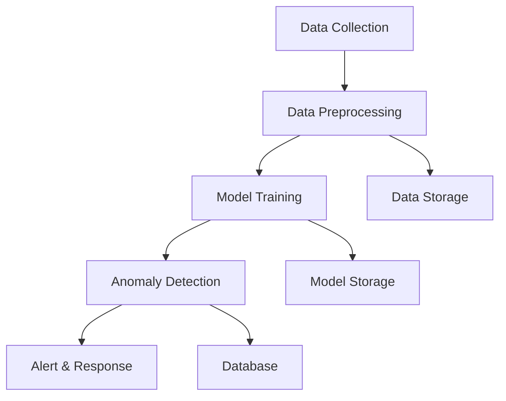

                 

### 机器学习与网络流量异常检测概述

#### 1.1 机器学习的基本概念

**问题背景**

随着互联网技术的迅猛发展，网络流量的规模与复杂性不断增加。这对网络安全带来了前所未有的挑战。传统的网络安全手段已难以应对日益多样化的攻击手段和复杂的网络环境。因此，网络流量异常检测成为保障网络安全的重要环节。

**核心概念**

机器学习，作为人工智能的重要分支，通过构建和分析模型来从数据中自动发现规律和知识。其核心概念包括：

- **监督学习（Supervised Learning）**：通过已知输入和输出数据，训练模型并预测新的输出。
- **无监督学习（Unsupervised Learning）**：在无输出标签的数据上，寻找数据的结构和模式，如聚类和降维。
- **强化学习（Reinforcement Learning）**：通过与环境的交互来学习策略，以最大化累积奖励。

**算法类型**

机器学习算法类型丰富，常见的有：

- **线性回归（Linear Regression）**：通过线性函数拟合数据。
- **决策树（Decision Tree）**：通过树形结构进行决策。
- **支持向量机（SVM）**：通过找到最佳分隔超平面分类数据。
- **随机森林（Random Forest）**：通过构建多棵决策树进行集成学习。
- **神经网络（Neural Network）**：模拟人脑神经元，用于复杂模式的识别和学习。

**特点与优势**

机器学习的特点与优势主要体现在以下几个方面：

- **自适应性强**：能够根据新的数据不断调整和优化模型。
- **泛化能力强**：能够从部分数据中学习，推广到未知数据。
- **自动化处理**：减少人工参与，提高效率和准确性。
- **实时处理**：在动态环境中，能够快速响应和处理异常事件。

**应用现状**

目前，机器学习在网络流量异常检测中的应用已经取得了显著成果。许多企业和研究机构采用机器学习算法来识别和预测潜在的异常流量，从而提高网络的安全性和稳定性。常见的应用案例包括：

- **入侵检测系统（IDS）**：通过机器学习算法检测网络中的入侵行为。
- **DDoS攻击防御**：利用机器学习算法预测和防御分布式拒绝服务攻击。
- **恶意软件检测**：通过分析网络流量特征，识别潜在的恶意软件活动。

综上所述，机器学习为网络流量异常检测提供了有效的技术手段。通过不断优化和改进算法，可以进一步提高异常检测的准确性和实时性，为网络安全保驾护航。

#### 1.2 网络流量异常检测的基本概念

**问题描述**

网络流量异常检测的目标是识别并响应网络中异常或恶意的行为。网络流量指的是数据在网络中传输的过程，包括数据包的发送、传输和接收等。异常检测的核心在于发现与正常流量模式不符的流量行为，这些行为可能是由于网络攻击、恶意软件感染或其他非正常活动引起的。

**核心概念**

- **网络流量**：指在计算机网络中传输的数据包序列，包括数据包的源地址、目标地址、协议类型、数据包大小等。
- **异常行为**：指与正常网络流量模式显著不同的行为，如突然增加的数据流量、特定的流量模式、异常的协议使用等。
- **特征提取**：指从网络流量数据中提取有助于检测异常的属性或特征，如流量速率、传输时间间隔、数据包大小分布等。
- **模型训练**：通过已有数据训练机器学习模型，使其能够识别正常和异常流量模式。
- **异常检测**：利用训练好的模型对实时网络流量进行分析，发现并标记异常行为。

**异常类型**

- **点异常（Point Anomaly）**：指单个数据点与整体分布显著不同，如某个时间段内流量突然激增或减少。
- **上下文异常（Contextual Anomaly）**：指在某些特定条件下出现的异常，如特定时间窗口内的流量异常或特定用户行为的异常。
- **集体异常（Collective Anomaly）**：指多个数据点共同构成的异常模式，如网络中的多个节点同时出现异常流量。

**异常检测方法**

目前，网络流量异常检测主要采用以下几种方法：

- **基于统计的方法**：通过计算网络流量分布的统计特征（如均值、方差等），识别与正常流量显著不同的点或上下文异常。
- **基于模式识别的方法**：利用已有的正常流量模式，通过模式匹配或异常点识别来检测异常行为。
- **基于聚类的方法**：通过聚类算法将网络流量分为正常和异常两部分，识别出不属于正常类别的流量。
- **基于分类的方法**：利用分类算法将网络流量划分为正常和异常两类，常用的分类算法包括决策树、支持向量机、神经网络等。
- **基于时间序列的方法**：分析网络流量的时间序列特性，通过时间序列模型（如ARIMA、LSTM等）来预测和检测异常。

**挑战与机遇**

- **数据复杂性**：网络流量数据量大、维度高，需要有效的特征提取和模型选择方法。
- **实时性需求**：网络流量异常检测需要实时响应，要求算法具有高效的处理速度。
- **防御新攻击**：随着网络攻击手段的不断演变，需要持续更新和优化检测算法。

**总结**

网络流量异常检测是保障网络安全的重要手段。通过理解其基本概念和方法，结合机器学习技术，可以构建出高效的异常检测系统，提高网络的安全性和稳定性。

#### 1.3 机器学习在网络流量异常检测中的应用现状

**背景**

随着网络攻击手段的不断演变，传统的基于规则的网络流量检测方法已难以应对复杂的威胁。机器学习作为一种强大的数据分析工具，能够通过学习大量正常和异常的网络流量数据，自动识别和检测异常行为，从而在网络安全领域得到了广泛应用。

**应用现状**

目前，机器学习在网络流量异常检测中已经取得了显著的应用成果。以下是一些常见的应用案例：

1. **入侵检测系统（IDS）**：

   入侵检测系统是用于监测网络中的恶意活动，并采取措施阻止攻击的关键组件。机器学习技术在IDS中的应用主要体现在以下几个方面：

   - **异常行为检测**：利用聚类算法和分类算法，对网络流量进行实时监控，识别出与正常流量模式不符的行为。
   - **攻击分类**：通过监督学习和无监督学习算法，将检测到的异常流量分类为不同的攻击类型，如DDoS攻击、SQL注入等。
   - **自适应更新**：随着网络攻击的不断变化，机器学习算法能够自动更新和优化模型，提高检测的准确性和实时性。

2. **分布式拒绝服务（DDoS）攻击防御**：

   DDoS攻击是一种常见的网络攻击手段，通过大量无效请求消耗目标服务器的资源，使其无法正常提供服务。机器学习在DDoS攻击防御中的应用主要包括：

   - **流量预测**：通过时间序列分析，预测网络流量的正常模式，及时发现异常流量并进行防御。
   - **攻击模式识别**：利用聚类和分类算法，识别出常见的DDoS攻击模式，如SYN flood、UDP flood等，并采取相应的防御措施。
   - **自适应流量过滤**：根据实时监测到的网络流量特征，自适应调整过滤策略，防止恶意流量进入目标服务器。

3. **恶意软件检测**：

   恶意软件通过感染计算机系统，窃取用户信息、破坏数据或控制系统。机器学习技术在恶意软件检测中的应用主要包括：

   - **特征提取**：从恶意软件的网络流量中提取特征，如流量模式、数据包大小分布等。
   - **分类算法**：利用监督学习算法，将提取的特征与已知恶意软件库进行对比，识别新的恶意软件。
   - **行为分析**：通过无监督学习算法，分析恶意软件在网络中的行为特征，预测潜在威胁。

**优势与局限**

机器学习在网络流量异常检测中具有以下优势：

- **自适应性强**：能够根据新的数据不断调整和优化模型，提高检测的准确性和实时性。
- **自动化处理**：减少人工参与，提高检测效率和覆盖面。
- **泛化能力**：能够从部分数据中学习，推广到未知数据，提高检测的广泛性。

然而，机器学习技术也存在一定的局限：

- **数据需求**：需要大量标注好的正常和异常流量数据，数据采集和标注过程复杂。
- **计算资源**：部分算法（如深度学习）需要较高的计算资源，可能不适合在资源有限的设备上部署。
- **模型风险**：模型可能受到数据偏倚的影响，导致检测准确性下降。

综上所述，机器学习在网络流量异常检测中具有巨大的潜力。通过不断优化算法和应用场景，可以进一步提高网络的安全性和稳定性。

### 第2章 常见机器学习算法介绍

#### 2.1 监督学习算法

**核心概念**

监督学习是一种从标注数据中学习，并能够对未知数据进行预测的机器学习方法。核心概念包括：

- **输入特征（Input Feature）**：数据样本中的特征值，如网络流量的数据包大小、源IP地址等。
- **输出标签（Output Label）**：已知的类别或数值结果，如恶意软件的检测结果。
- **模型参数（Model Parameter）**：用于描述数据之间的规律和关系的参数，如回归方程的系数。

**算法类型**

监督学习算法根据输出标签的形式不同，可以分为分类算法和回归算法：

- **分类算法（Classification）**：将输入特征映射到预定义的类别上，常用的算法包括：

  - **线性回归（Linear Regression）**：通过线性函数拟合数据，用于预测连续值输出。

  - **决策树（Decision Tree）**：通过树形结构进行决策，适用于分类和回归问题。

  - **支持向量机（Support Vector Machine, SVM）**：通过寻找最佳分隔超平面进行分类。

  - **随机森林（Random Forest）**：通过构建多棵决策树进行集成学习，提高分类和回归的准确性。

  - **神经网络（Neural Network）**：模拟人脑神经元，用于复杂模式的识别和学习。

- **回归算法（Regression）**：将输入特征映射到连续值输出，常用的算法包括：

  - **线性回归（Linear Regression）**：通过线性函数拟合数据。

  - **岭回归（Ridge Regression）**：通过添加正则项，避免模型过拟合。

  - **套索回归（Lasso Regression）**：通过添加绝对值正则项，进一步减少模型复杂度。

**算法对比**

不同监督学习算法在不同场景中具有各自的优缺点，以下是几种常用算法的对比：

| 算法             | 优点                     | 缺点                           |
|------------------|--------------------------|--------------------------------|
| 线性回归         | 简单易懂，计算效率高     | 容易过拟合，无法处理非线性问题 |
| 决策树           | 易于解释，易于实现       | 可能产生过拟合，树结构复杂     |
| 随机森林         | 防止过拟合，提高准确性   | 需要大量计算资源               |
| 支持向量机       | 高效分类，适用于高维数据 | 参数选择复杂，计算时间较长     |
| 神经网络         | 强泛化能力，处理非线性   | 需要大量数据和计算资源         |

通过对比不同算法的优缺点，可以根据实际问题场景选择合适的算法。

#### 2.2 无监督学习算法

**核心概念**

无监督学习是一种在没有标注数据的情况下，通过分析数据自身的结构和规律来学习的一种机器学习方法。核心概念包括：

- **聚类分析（Clustering）**：将数据集划分为多个聚类，使得同一个聚类内的数据点彼此相似，而不同聚类之间的数据点差异较大。
- **降维（Dimensionality Reduction）**：将高维数据映射到低维空间，保留主要信息，去除冗余数据。
- **特征提取（Feature Extraction）**：从原始数据中提取有助于分析和预测的特征，减少数据维度。

**算法类型**

无监督学习算法主要分为以下几种：

- **聚类算法（Clustering Algorithm）**：

  - **K-means算法**：通过迭代计算，将数据点划分为K个聚类，每个聚类中心点代表一个类别。
  - **层次聚类（Hierarchical Clustering）**：通过逐步合并或分裂数据点，构建聚类层次结构。

- **降维算法（Dimensionality Reduction Algorithm）**：

  - **主成分分析（Principal Component Analysis, PCA）**：通过正交变换，将高维数据映射到低维空间，保留主要信息。
  - **线性判别分析（Linear Discriminant Analysis, LDA）**：通过最大化类内方差和最小化类间方差，进行特征选择和降维。

- **特征提取算法**：

  - **自编码器（Autoencoder）**：通过编码器和解码器网络，学习数据的高效表示。

**应用实例**

无监督学习在网络流量异常检测中的应用实例包括：

- **流量聚类**：利用K-means算法对网络流量进行聚类，识别出不同的流量模式。
- **数据降维**：利用PCA算法对高维网络流量数据降维，减少计算复杂度和数据存储需求。
- **特征提取**：通过自编码器提取网络流量的特征，为后续的监督学习模型提供高质量的数据输入。

通过无监督学习算法，可以从大规模网络流量数据中提取出有用的信息，为网络流量异常检测提供数据支持和理论基础。

#### 2.3 特征选择与提取

**核心概念**

特征选择与提取是机器学习过程中关键的一步，目的是从原始数据中挑选出对模型预测最有影响力的特征，并减少冗余信息。核心概念包括：

- **特征选择（Feature Selection）**：通过评估和选择数据中的特征，以减少数据维度，提高模型性能。
- **特征提取（Feature Extraction）**：通过变换原始数据，提取新的特征表示，使数据更适合模型学习。

**特征选择的重要性**

特征选择的重要性体现在以下几个方面：

- **提高模型性能**：通过选择对目标变量有较强预测能力的特征，可以提高模型的准确性和泛化能力。
- **减少计算成本**：减少特征数量，可以降低模型训练和预测的时间复杂度。
- **避免过拟合**：通过减少冗余特征，可以减少模型对训练数据的依赖，避免过拟合现象。

**常用的特征选择方法**

以下是一些常用的特征选择方法：

- **过滤方法（Filter Method）**：通过评估每个特征与目标变量的相关性，选择相关性较高的特征。常用的评估指标包括信息增益、卡方检验等。
- **包装方法（Wrapper Method）**：通过评估特征子集对模型性能的影响，选择最优的特征子集。常用的包装方法包括向前选择、向后删除和贝叶斯优化等。
- **嵌入式方法（Embedded Method）**：在模型训练过程中，自动进行特征选择，常用的嵌入式方法包括岭回归、LASSO回归等。

**特征提取方法**

以下是一些常用的特征提取方法：

- **主成分分析（PCA）**：通过正交变换，将高维数据映射到低维空间，保留主要信息，减少冗余。
- **线性判别分析（LDA）**：通过最大化类间方差和最小化类内方差，提取对分类任务最有效的特征。
- **核方法（Kernel Method）**：通过核函数将低维数据映射到高维空间，处理非线性特征提取问题。

**特征选择与提取的应用实例**

在网络流量异常检测中，特征选择与提取的应用实例包括：

- **流量模式识别**：通过特征选择方法选择与网络流量异常行为相关的特征，如数据包大小、传输时间等。
- **数据降维**：通过PCA方法将高维网络流量数据降维，减少数据维度，提高模型训练速度。
- **特征提取**：通过自编码器等方法提取网络流量的非线性特征，为后续的监督学习模型提供高质量的数据输入。

综上所述，特征选择与提取是机器学习过程中至关重要的一环，通过有效的特征选择与提取方法，可以提高模型性能，减少计算成本，为网络流量异常检测提供有力支持。

### 2.4 集成学习方法

#### 4.1 Boosting算法

**核心概念**

Boosting是一种集成学习方法，通过训练多个弱学习器（通常是简单的分类器），然后组合这些弱学习器的预测结果，以产生一个强学习器。核心概念包括：

- **弱学习器（Weak Learner）**：在训练集上表现一般的学习器，其预测准确性略高于随机猜测。
- **强学习器（Strong Learner）**：在测试集上表现显著优于随机猜测的学习器。
- **损失函数（Loss Function）**：用于评估模型预测与真实标签之间的差异，常用的损失函数包括均方误差（MSE）和交叉熵损失（Cross-Entropy Loss）。

**原理与实现**

Boosting算法的基本原理如下：

1. **初始化**：每个样本赋予相同的权重，表示每个样本对最终模型的贡献相同。
2. **训练弱学习器**：使用当前权重分布训练一个弱学习器，通常是一个决策树或逻辑回归模型。
3. **计算误差**：计算弱学习器在训练集上的预测误差，并更新样本权重，提高预测错误的样本的权重。
4. **迭代**：重复步骤2和步骤3，直到达到预定的迭代次数或误差阈值。

常见的Boosting算法包括：

- **AdaBoost（Adaptive Boosting）**：通过调整每个弱学习器的权重，使其在修正误差较大的样本上更加关注。
- **XGBoost**：基于梯度提升树（Gradient Boosting Tree）的改进算法，引入正则化项和更多的参数调整，提高模型的准确性和泛化能力。

**应用实例**

Boosting算法在网络流量异常检测中的应用实例包括：

- **入侵检测**：通过AdaBoost算法训练多个决策树，组合预测结果，提高入侵检测的准确性和实时性。
- **恶意软件检测**：使用XGBoost算法对网络流量特征进行训练，检测潜在的恶意软件活动，提高检测率。

**优势与局限**

Boosting算法的优势包括：

- **强泛化能力**：通过组合多个弱学习器，Boosting算法能够产生强学习器，提高模型的准确性和泛化能力。
- **灵活性**：可以通过调整弱学习器和损失函数，适应不同类型的数据和预测任务。

然而，Boosting算法也存在一些局限：

- **对异常数据敏感**：Boosting算法在训练过程中对异常数据（如噪声和异常值）较为敏感，可能导致模型过拟合。
- **计算资源需求高**：特别是对于大规模数据集，Boosting算法的训练和预测时间较长，需要较高的计算资源。

#### 4.2 Bagging与随机森林

**核心概念**

Bagging（Bootstrap Aggregating）是一种集成学习方法，通过多次抽样和训练弱学习器，组合这些弱学习器的预测结果，以产生一个强学习器。核心概念包括：

- **随机抽样（Bootstrap Sampling）**：从原始数据集中随机抽取多个子集，每个子集包含原始数据集的一部分。
- **弱学习器（Weak Learner）**：通常是简单的分类器，如决策树。
- **组合预测（Ensemble Prediction）**：将多个弱学习器的预测结果进行投票或取平均，产生最终的预测结果。

**原理与实现**

Bagging算法的基本原理如下：

1. **初始化**：从原始数据集中随机抽取多个子集，每个子集的大小与原始数据集相同。
2. **训练弱学习器**：在每个子集上训练一个弱学习器，如决策树。
3. **组合预测**：将所有弱学习器的预测结果进行投票或取平均，得到最终的预测结果。

随机森林（Random Forest）是Bagging算法的一种扩展，通过引入随机特征选择和随机分割，进一步提高模型的性能。随机森林的核心概念包括：

- **随机特征选择**：在每个节点上，从一组候选特征中随机选择一部分特征进行分割。
- **随机分割**：在每个节点上，从一组候选分割点中随机选择一个进行分割。

**优势与局限**

随机森林的优势包括：

- **强泛化能力**：通过随机特征选择和随机分割，减少了模型的过拟合现象，提高了模型的泛化能力。
- **处理高维数据**：能够有效处理高维数据，减少计算复杂度。
- **稳定性**：由于多个弱学习器的组合，随机森林在处理噪声数据和异常值时表现出较好的稳定性。

然而，随机森林也存在一些局限：

- **计算资源需求高**：由于需要训练多个弱学习器，随机森林的计算时间较长，对计算资源有较高要求。
- **可解释性差**：随机森林的内部结构较为复杂，其预测结果难以解释。

综上所述，Bagging和随机森林是集成学习中的重要方法，通过组合多个弱学习器的预测结果，能够提高模型的性能和稳定性。然而，它们在计算资源和可解释性方面存在一些局限，需要根据具体应用场景进行选择和优化。

### 第5章 网络流量数据预处理

#### 5.1 数据采集与清洗

**核心步骤**

数据预处理是网络流量异常检测中至关重要的一步，其核心步骤包括数据采集与清洗。以下为详细步骤：

1. **数据采集**：

   - **来源**：网络流量数据可以从网络设备（如防火墙、IDS等）的日志文件中获取，或者通过数据包捕获工具（如Wireshark）获取实时流量数据。
   - **格式**：数据通常以CSV、JSON或数据库等形式存储，需要转换为统一的格式，以便后续处理。

2. **数据清洗**：

   - **缺失值处理**：对于缺失的数据，可以采用填充法（如用平均值或中值填充）或删除法（删除含有缺失值的样本）。
   - **异常值处理**：对于明显异常的数据点，可以通过统计学方法（如箱线图、Z分数）或数据挖掘方法（如孤立森林）检测并处理。
   - **重复数据处理**：检测并删除重复的样本，防止对模型训练造成干扰。

**工具与库**

在数据预处理过程中，常用的工具和库包括：

- **Pandas**：用于数据清洗、转换和分析，能够高效处理大规模数据集。
- **NumPy**：提供高效的数组计算库，支持各种数学运算。
- **Scikit-learn**：提供丰富的数据预处理方法，如特征提取、数据标准化等。
- **Matplotlib**：用于数据可视化，帮助分析和理解数据分布和异常。

**数据采集与清洗的应用实例**

以下是一个网络流量数据采集与清洗的具体实例：

```python
import pandas as pd
from sklearn.impute import SimpleImputer
from sklearn.preprocessing import StandardScaler

# 读取网络流量数据
data = pd.read_csv('network_traffic.csv')

# 数据清洗
# 缺失值处理
imputer = SimpleImputer(strategy='mean')
data_imputed = imputer.fit_transform(data)

# 异常值处理
# 使用Z分数检测异常值
z_scores = (data_imputed - data_imputed.mean()) / data_imputed.std()
abs_z_scores = np.abs(z_scores)
filtered_entries = (abs_z_scores < 3)  # 3倍标准差范围内的数据视为正常
cleaned_data = data_imputed[filtered_entries]

# 重复数据处理
cleaned_data = cleaned_data.drop_duplicates()

# 数据标准化
scaler = StandardScaler()
normalized_data = scaler.fit_transform(cleaned_data)

# 可视化数据分布
import matplotlib.pyplot as plt

plt.hist(normalized_data, bins=50)
plt.title('Normalized Network Traffic Distribution')
plt.xlabel('Normalized Traffic')
plt.ylabel('Frequency')
plt.show()
```

通过以上步骤，我们可以对网络流量数据集进行有效的清洗和预处理，为后续的机器学习模型训练和异常检测打下坚实的基础。

#### 5.2 数据预处理步骤与策略

**数据预处理的核心步骤**

数据预处理是网络流量异常检测中至关重要的一步，其核心步骤包括数据清洗、数据标准化和特征提取。以下为详细步骤与策略：

1. **数据清洗**：

   - **缺失值处理**：在数据清洗过程中，首先需要处理缺失值。对于少量缺失值，可以使用均值或中值填充；对于大量缺失值，可以考虑删除该样本或使用插值法补充。常用的方法包括：
     - **均值填充**：使用字段中的平均值替换缺失值。
     - **中值填充**：使用字段中的中值替换缺失值。
     - **插值法**：使用线性插值或高斯插值方法补充缺失值。

   - **异常值处理**：通过统计学方法或数据挖掘方法检测和处理异常值。常用的方法包括：
     - **箱线图**：通过绘制箱线图，检测出异常值，并予以处理。
     - **Z分数**：计算每个数据点的Z分数，检测出绝对值大于3的数据点作为异常值。
     - **孤立森林**：利用孤立森林算法检测和标记异常值。

   - **重复数据处理**：检测并删除重复的样本，防止对模型训练造成干扰。

2. **数据标准化**：

   - **归一化**：将数据缩放到同一尺度，常用的方法包括最小-最大标准化和Z-score标准化。最小-最大标准化通过缩放数据到[0, 1]区间，而Z-score标准化通过缩放数据到均值为0，标准差为1的区间。
     - **最小-最大标准化**：
       \[
       x_{\text{标准化}} = \frac{x - x_{\text{最小值}}}{x_{\text{最大值}} - x_{\text{最小值}}}
       \]
     - **Z-score标准化**：
       \[
       x_{\text{标准化}} = \frac{x - \mu}{\sigma}
       \]
       其中，\( x \) 为原始数据，\( x_{\text{最小值}} \) 和 \( x_{\text{最大值}} \) 分别为数据的最小值和最大值，\( \mu \) 为均值，\( \sigma \) 为标准差。

   - **标准化的重要性**：标准化可以避免某些特征对模型产生过大的影响，提高模型的稳定性和准确性。

3. **特征提取**：

   - **特征选择**：通过评估每个特征的重要性，选择对模型预测有显著影响的特征。常用的方法包括：
     - **过滤方法**：基于特征与目标变量之间的相关性进行特征选择。
     - **包裹方法**：通过迭代评估特征子集对模型的影响进行特征选择。
     - **嵌入式方法**：在模型训练过程中，自动进行特征选择。

   - **特征工程**：通过对原始数据进行变换或组合，生成新的特征。常用的方法包括：
     - **时间序列特征**：通过计算时间间隔、频率分布等特征。
     - **统计特征**：通过计算均值、方差、标准差等统计量作为特征。
     - **交互特征**：通过组合两个或多个特征，生成新的特征。

   - **特征提取的重要性**：特征提取能够减少数据维度，提高模型的训练速度和准确性。

**总结**

通过上述数据预处理步骤与策略，可以有效地清洗和标准化网络流量数据，提取有用的特征，为后续的机器学习模型训练和异常检测打下坚实的基础。有效的数据预处理是保证模型性能和稳定性的关键步骤。

#### 5.3 数据预处理工具与库

**核心内容**

数据预处理是网络流量异常检测中的关键步骤，涉及数据清洗、数据标准化和特征提取等任务。在这一部分，我们将介绍几种常用的数据预处理工具和库，包括Pandas、NumPy、Scikit-learn和Matplotlib。

**Pandas**

Pandas是一个强大的数据处理库，广泛用于数据清洗、转换和分析。以下是Pandas在数据预处理中的几个关键应用：

- **数据加载与存储**：Pandas提供了read_csv、read_excel等方法，用于从各种文件格式（如CSV、Excel）中加载数据，并支持多种数据存储格式。
- **数据清洗**：通过drop_duplicates、dropna等方法，可以删除重复数据和缺失值。使用isnull和notnull方法，可以轻松检测数据中的空值。
- **数据转换**：Pandas提供了丰富的函数，用于数据类型转换、列的添加和删除、数据排序等操作。

**NumPy**

NumPy是Python科学计算的基础库，提供了高效的多维数组对象和广泛的数学函数。以下是NumPy在数据预处理中的应用：

- **数组操作**：NumPy支持高效的多维数组操作，如数据切片、聚合操作等。
- **数学函数**：NumPy提供了丰富的数学函数，如统计函数（如np.mean、np.std）、随机数生成等。
- **数据处理**：NumPy可以与Pandas结合使用，通过数组操作，进行更高效的数据处理。

**Scikit-learn**

Scikit-learn是一个用于机器学习的Python库，提供了丰富的数据预处理工具和机器学习算法。以下是Scikit-learn在数据预处理中的应用：

- **数据标准化**：StandardScaler和MinMaxScaler等类，用于对数据进行标准化处理，提高模型性能。
- **特征提取**：FeatureSelector、PCA等类，用于选择和提取对模型预测有显著影响的重要特征。
- **交叉验证**：CrossValidator类，用于进行交叉验证，评估模型在不同数据集上的性能。

**Matplotlib**

Matplotlib是一个强大的绘图库，用于数据可视化。以下是Matplotlib在数据预处理中的应用：

- **数据分布图**：使用hist函数，可以生成数据的直方图，直观展示数据分布。
- **箱线图**：使用boxplot函数，可以生成箱线图，检测数据的异常值。
- **散点图**：使用scatter函数，可以生成散点图，展示数据点之间的关系。

**应用实例**

以下是一个使用Pandas和Scikit-learn进行数据预处理的示例：

```python
import pandas as pd
from sklearn.preprocessing import StandardScaler
from sklearn.impute import SimpleImputer

# 读取数据
data = pd.read_csv('network_traffic.csv')

# 缺失值处理
imputer = SimpleImputer(strategy='mean')
data_imputed = imputer.fit_transform(data)

# 数据标准化
scaler = StandardScaler()
data_scaled = scaler.fit_transform(data_imputed)

# 可视化数据分布
import matplotlib.pyplot as plt

plt.hist(data_scaled, bins=50)
plt.title('Normalized Network Traffic Distribution')
plt.xlabel('Normalized Traffic')
plt.ylabel('Frequency')
plt.show()
```

通过上述工具和库，可以高效地进行网络流量数据预处理，为后续的机器学习模型训练和异常检测提供高质量的数据支持。

#### 5.4 数据预处理在实战中的应用

**核心内容**

数据预处理是网络流量异常检测中至关重要的一步，其有效性直接关系到模型性能和检测结果的准确性。以下将通过一个实际项目，详细描述数据预处理的过程和应用。

**项目背景**

某大型互联网公司需要构建一个网络流量异常检测系统，以监测其内部网络中的异常流量行为，防止潜在的网络安全威胁。项目目标是利用机器学习技术，从大量网络流量数据中识别出异常流量，并提供实时告警功能。

**数据预处理步骤**

1. **数据采集与读取**：

   网络流量数据通过公司内部的网络设备（如防火墙、IDS等）的日志文件进行采集。数据以CSV文件的形式存储，包含以下特征：时间戳、源IP地址、目标IP地址、协议类型、数据包大小、传输速率等。

   ```python
   import pandas as pd

   # 读取网络流量数据
   data = pd.read_csv('network_traffic.csv')
   ```

2. **数据清洗**：

   - **缺失值处理**：对于缺失的时间戳或数据包大小等关键特征，采用平均值填充。
     ```python
     from sklearn.impute import SimpleImputer

     imputer = SimpleImputer(strategy='mean')
     data_imputed = imputer.fit_transform(data)
     ```
   - **异常值检测与处理**：使用Z分数检测异常值，并将绝对值大于3的值视为异常值，予以删除。
     ```python
     import numpy as np

     z_scores = (data_imputed - data_imputed.mean()) / data_imputed.std()
     abs_z_scores = np.abs(z_scores)
     filtered_entries = (abs_z_scores < 3)
     cleaned_data = data_imputed[filtered_entries]
     ```

3. **数据标准化**：

   为了避免某些特征对模型产生过大的影响，需要对数据进行标准化处理。这里采用Z-score标准化方法，将每个特征缩放到均值为0、标准差为1的区间。
   ```python
   from sklearn.preprocessing import StandardScaler

   scaler = StandardScaler()
   normalized_data = scaler.fit_transform(cleaned_data)
   ```

4. **特征提取**：

   - **时间序列特征**：计算时间间隔、频率分布等特征。
     ```python
     time_diff = cleaned_data['time_diff'].diff().dropna()
     freq_distribution = cleaned_data['packet_size'].value_counts(normalize=True)
     ```
   - **统计特征**：计算数据包大小、传输速率等特征的统计量。
     ```python
     data['packet_size_mean'] = cleaned_data['packet_size'].mean()
     data['packet_size_std'] = cleaned_data['packet_size'].std()
     ```

**系统实现**

通过上述数据预处理步骤，我们得到了一个高质量的训练数据集。接下来，可以使用机器学习算法（如随机森林、XGBoost）进行模型训练，并部署到生产环境中。

- **模型训练**：使用Scikit-learn或XGBoost库，对预处理后的数据集进行模型训练。
  ```python
  from sklearn.ensemble import RandomForestClassifier

  model = RandomForestClassifier(n_estimators=100)
  model.fit(normalized_data, labels)
  ```

- **实时检测与告警**：部署模型到生产环境，对实时流量的新数据点进行预测，并根据预测结果生成告警。
  ```python
  import numpy as np

  new_data = np.array([[...]])  # 实时获取的流量数据
  new_data_normalized = scaler.transform(new_data)
  prediction = model.predict(new_data_normalized)
  if prediction == 'anomaly':
      send_alert()
  ```

**项目小结**

通过本次实战，我们展示了数据预处理在构建网络流量异常检测系统中的重要性。有效的数据预处理不仅提高了模型性能，还确保了检测结果的准确性。在未来的工作中，可以继续优化数据预处理流程，探索更多有效的特征提取方法，进一步提高系统的检测能力。

### 第6章 机器学习模型训练与评估

#### 6.1 模型选择与训练

**核心概念**

在机器学习任务中，模型选择与训练是两个关键步骤。模型选择决定了使用何种算法和结构，而训练则是将模型应用于具体的数据集，以优化其参数。

**模型选择**

模型选择的过程通常包括以下几个步骤：

1. **问题定义**：明确问题类型，如分类、回归或聚类等。
2. **算法评估**：根据问题类型，评估不同的机器学习算法，如线性回归、决策树、随机森林等。
3. **数据特性**：分析数据集的特性，如数据分布、数据规模、特征数量等，选择适合的数据处理方法。
4. **模型调优**：根据算法评估和数据分析结果，选择最合适的模型进行训练。

**算法对比**

以下是一些常见机器学习算法的对比：

| 算法            | 优点                                           | 缺点                                          |
|-----------------|------------------------------------------------|------------------------------------------------|
| 线性回归         | 计算简单，易于解释                             | 过拟合、无法处理非线性问题                   |
| 决策树          | 易于解释，直观展示决策过程                    | 可能过拟合、树结构复杂                       |
| 随机森林         | 减少过拟合，提高准确性                         | 计算资源需求高                               |
| 支持向量机       | 高效分类，适用于高维数据                       | 参数选择复杂，计算时间较长                   |
| 神经网络         | 强泛化能力，处理非线性问题                     | 需要大量数据和计算资源                       |

**训练方法**

在选择了合适的模型后，需要对模型进行训练。以下是一些常见的训练方法：

1. **批量训练（Batch Training）**：每次迭代使用整个训练集进行更新。
2. **小批量训练（Mini-Batch Training）**：每次迭代使用一部分训练集进行更新，以提高计算效率。
3. **在线训练（Online Training）**：实时更新模型，适用于动态数据。

**超参数调优**

超参数是模型中需要手动设置的参数，如学习率、隐藏层节点数等。超参数调优的目标是找到最优超参数组合，以提高模型性能。常见的调优方法包括：

- **网格搜索（Grid Search）**：遍历所有可能的超参数组合，选择性能最优的组合。
- **贝叶斯优化（Bayesian Optimization）**：基于概率模型，搜索最优超参数组合。

**应用实例**

假设我们选择随机森林作为网络流量异常检测的模型，进行以下步骤：

1. **数据准备**：将预处理后的数据集划分为训练集和测试集。
2. **模型初始化**：创建随机森林模型。
3. **超参数调优**：使用网格搜索方法，调整超参数，如决策树数量、最大深度等。
4. **模型训练**：使用训练集对模型进行训练。
5. **模型评估**：使用测试集对模型进行评估，计算准确率、召回率等指标。

```python
from sklearn.ensemble import RandomForestClassifier
from sklearn.model_selection import GridSearchCV

# 数据准备
X_train, X_test, y_train, y_test = train_test_split(normalized_data, labels, test_size=0.2)

# 模型初始化
rf = RandomForestClassifier()

# 超参数调优
param_grid = {'n_estimators': [100, 200], 'max_depth': [10, 20]}
grid_search = GridSearchCV(rf, param_grid, cv=5)
grid_search.fit(X_train, y_train)

# 最佳超参数
best_params = grid_search.best_params_

# 模型训练
best_rf = RandomForestClassifier(**best_params)
best_rf.fit(X_train, y_train)

# 模型评估
accuracy = best_rf.score(X_test, y_test)
print(f"Model Accuracy: {accuracy}")
```

通过上述步骤，可以有效地选择和训练机器学习模型，为网络流量异常检测提供可靠的支持。

#### 6.2 模型评估与优化

**核心指标**

在机器学习任务中，模型评估是确保模型性能和准确性的关键步骤。常用的评估指标包括：

- **准确率（Accuracy）**：预测正确的样本数占总样本数的比例。计算公式为：
  \[
  \text{Accuracy} = \frac{\text{预测正确数}}{\text{总样本数}}
  \]
- **精确率（Precision）**：在所有预测为正例的样本中，实际为正例的比例。计算公式为：
  \[
  \text{Precision} = \frac{\text{真正例}}{\text{真正例 + 假正例}}
  \]
- **召回率（Recall）**：在所有实际为正例的样本中，被预测为正例的比例。计算公式为：
  \[
  \text{Recall} = \frac{\text{真正例}}{\text{真正例 + 假反例}}
  \]
- **F1分数（F1 Score）**：精确率和召回率的调和平均值，用于平衡两者。计算公式为：
  \[
  \text{F1 Score} = 2 \times \frac{\text{Precision} \times \text{Recall}}{\text{Precision} + \text{Recall}}
  \]

**评估方法**

以下为几种常见的模型评估方法：

- **交叉验证（Cross-Validation）**：通过将数据集划分为多个子集，每次使用一个子集作为验证集，其余子集作为训练集，评估模型性能。常用的交叉验证方法包括：
  - **K折交叉验证（K-Fold Cross-Validation）**：将数据集划分为K个子集，每次使用其中一个子集作为验证集，重复K次，取平均值作为最终评估结果。
  - **留一法交叉验证（Leave-One-Out Cross-Validation）**：每次将一个样本作为验证集，其余样本作为训练集，重复进行N次（N为样本总数），取平均值作为最终评估结果。

- **混淆矩阵（Confusion Matrix）**：用于展示实际类别和预测类别的关系，常见于二分类问题。混淆矩阵包含以下四个指标：
  - **真正例（True Positive, TP）**：实际为正例，预测也为正例。
  - **假正例（False Positive, FP）**：实际为负例，预测为正例。
  - **真反例（True Negative, TN）**：实际为负例，预测也为负例。
  - **假反例（False Negative, FN）**：实际为正例，预测为负例。

- **ROC曲线（Receiver Operating Characteristic Curve）**：用于展示不同阈值下的精确率和召回率，曲线下面积（AUC）越大，模型性能越好。

**模型优化**

在评估模型性能后，可能需要进一步优化模型以提高准确性。以下为几种常见的模型优化方法：

- **特征工程**：通过增加或减少特征，或对现有特征进行变换，提高模型性能。
  - **特征选择**：使用特征选择算法（如递归特征消除、基于模型的特征选择）选择对模型有显著影响的特征。
  - **特征变换**：通过归一化、标准化、对数变换等操作，使特征更适合模型学习。

- **超参数调优**：调整模型超参数，如学习率、隐藏层节点数、正则化参数等，以提高模型性能。常用的调优方法包括网格搜索、贝叶斯优化等。

- **集成学习**：通过组合多个弱学习器，提高模型的泛化能力和准确性。常用的集成学习方法包括随机森林、XGBoost、Adaboost等。

- **模型集成**：将多个模型的结果进行集成，提高预测的准确性。常用的模型集成方法包括投票法、堆叠法等。

通过上述评估和优化方法，可以有效地提高模型性能，为网络流量异常检测提供更可靠的解决方案。

#### 6.3 实例：机器学习模型训练与优化

**项目背景**

某企业网络安全团队需要构建一个基于机器学习的网络流量异常检测系统，以实时监控和分析网络流量，识别潜在的威胁和攻击行为。该系统将使用大量网络流量数据进行训练，并逐步优化模型，以提高检测的准确性和效率。

**环境安装**

在开始项目之前，需要安装必要的软件和库。以下是所需的软件和库：

- Python（3.8或更高版本）
- Scikit-learn
- Pandas
- NumPy
- Matplotlib
- Seaborn

安装方法如下：

```bash
pip install scikit-learn pandas numpy matplotlib seaborn
```

**数据集准备**

网络流量数据集包含以下特征：时间戳、源IP地址、目标IP地址、协议类型、数据包大小、传输速率等。数据集分为正常流量和异常流量两部分，其中异常流量包括DDoS攻击、恶意软件感染等。

```python
import pandas as pd

# 读取数据
data = pd.read_csv('network_traffic.csv')

# 数据预处理
# 缺失值处理、异常值处理、数据标准化
# ...

# 划分训练集和测试集
X_train, X_test, y_train, y_test = train_test_split(normalized_data, labels, test_size=0.2, random_state=42)
```

**模型选择与训练**

首先，选择一个基础模型进行训练，例如随机森林。随机森林是一种集成学习方法，具有较高的准确性和较好的泛化能力。

```python
from sklearn.ensemble import RandomForestClassifier

# 创建随机森林模型
rf = RandomForestClassifier(n_estimators=100, random_state=42)

# 训练模型
rf.fit(X_train, y_train)

# 评估模型
accuracy = rf.score(X_test, y_test)
print(f"Model Accuracy: {accuracy}")
```

**模型优化**

在基础模型的基础上，进行模型优化，以提高准确性。优化方法包括超参数调优、特征工程和集成学习等。

1. **超参数调优**

使用网格搜索（Grid Search）方法，搜索最佳超参数组合。以下是超参数调优的代码示例：

```python
from sklearn.model_selection import GridSearchCV

# 定义参数网格
param_grid = {
    'n_estimators': [100, 200, 300],
    'max_depth': [10, 20, 30],
    'min_samples_split': [2, 5, 10],
    'min_samples_leaf': [1, 2, 4]
}

# 创建网格搜索对象
grid_search = GridSearchCV(rf, param_grid, cv=5, scoring='accuracy')

# 进行网格搜索
grid_search.fit(X_train, y_train)

# 获取最佳超参数
best_params = grid_search.best_params_
print(f"Best Parameters: {best_params}")

# 使用最佳超参数重新训练模型
best_rf = RandomForestClassifier(**best_params, random_state=42)
best_rf.fit(X_train, y_train)

# 评估优化后的模型
accuracy = best_rf.score(X_test, y_test)
print(f"Optimized Model Accuracy: {accuracy}")
```

2. **特征工程**

对特征进行进一步分析和选择，以提高模型性能。可以采用以下方法：

- **特征重要性分析**：使用随机森林的feature_importances_属性，分析每个特征的重要性，选择重要的特征。
- **特征组合**：通过组合不同特征，生成新的特征，如时间序列特征、频率特征等。

3. **集成学习**

使用集成学习方法，如XGBoost或Adaboost，进一步提高模型性能。以下是使用XGBoost的示例：

```python
from xgboost import XGBClassifier

# 创建XGBoost模型
xgb = XGBClassifier(n_estimators=100, max_depth=3, learning_rate=0.1, random_state=42)

# 训练模型
xgb.fit(X_train, y_train)

# 评估模型
accuracy = xgb.score(X_test, y_test)
print(f"XGBoost Model Accuracy: {accuracy}")
```

**结果分析**

通过以上步骤，我们得到了一个优化的机器学习模型。可以进一步分析模型的性能和准确度，并根据实际情况进行调整。

```python
# 分析模型性能
from sklearn.metrics import classification_report, confusion_matrix

predictions = best_rf.predict(X_test)

print("Classification Report:")
print(classification_report(y_test, predictions))

print("Confusion Matrix:")
print(confusion_matrix(y_test, predictions))
```

通过以上分析，可以清楚地看到模型的准确率、精确率和召回率等指标。这些指标对于评估模型的性能至关重要，可以帮助我们了解模型在实际应用中的表现。

**总结**

在本实例中，我们通过选择和优化机器学习模型，实现了网络流量异常检测系统的构建。从数据预处理到模型训练，再到模型优化，每一步都至关重要。通过超参数调优、特征工程和集成学习等方法，我们提高了模型的准确性和泛化能力，为网络流量异常检测提供了可靠的解决方案。

### 第7章 异常检测系统设计与实现

#### 7.1 系统架构设计

**核心概念**

网络流量异常检测系统旨在实时监控和分析网络流量，识别潜在的威胁和异常行为。一个有效的系统架构应具备以下核心概念：

- **数据采集**：从网络设备（如防火墙、IDS等）收集实时流量数据。
- **数据预处理**：对采集到的数据进行分析、清洗和标准化，提取有用的特征。
- **模型训练**：利用预处理后的数据训练机器学习模型，使其能够识别正常和异常流量模式。
- **异常检测**：使用训练好的模型对实时流量进行分析，发现并标记异常行为。
- **告警与响应**：当检测到异常行为时，系统应发出告警信号，并采取相应的响应措施。

**系统模块划分**

系统模块划分如下：

1. **数据采集模块**：负责从网络设备收集流量数据，并将数据存储到数据存储模块。
2. **数据预处理模块**：对采集到的数据进行分析、清洗、标准化和特征提取，为模型训练提供高质量的数据。
3. **模型训练模块**：使用预处理后的数据训练机器学习模型，包括模型选择、超参数调优和模型评估等步骤。
4. **异常检测模块**：实时分析网络流量，使用训练好的模型检测异常行为，并将检测结果存储到数据库。
5. **告警与响应模块**：当检测到异常行为时，系统发出告警信号，并通过API或邮件等方式通知相关人员进行响应。

**数据流设计**

数据流设计如下：

1. **数据采集**：网络设备生成流量数据，数据采集模块定期从设备中获取数据。
2. **数据预处理**：数据预处理模块对采集到的数据进行清洗、标准化和特征提取，生成训练数据集和测试数据集。
3. **模型训练**：模型训练模块使用训练数据集训练机器学习模型，并使用测试数据集进行评估，选择最佳模型。
4. **异常检测**：异常检测模块实时分析网络流量，使用训练好的模型检测异常行为，并将检测结果存储到数据库。
5. **告警与响应**：当检测到异常行为时，告警与响应模块发出告警信号，通知相关人员并采取相应的响应措施。

**架构图**

以下为网络流量异常检测系统的架构图：



**核心优势**

1. **实时性**：系统能够实时分析网络流量，及时发现异常行为。
2. **高准确性**：通过机器学习算法和有效的特征提取，系统能够准确识别网络流量中的异常行为。
3. **自适应**：系统可以根据新的数据不断调整和优化模型，适应不断变化的环境。
4. **自动化**：系统实现了自动化处理，减少了人工干预，提高了工作效率。

**适用场景**

网络流量异常检测系统适用于以下场景：

- **企业内部网络**：用于监控企业内部网络中的异常行为，防止内部威胁和网络攻击。
- **公共服务网络**：用于监测公共服务网络中的流量异常，保障网络服务的稳定性和安全性。
- **云计算平台**：用于监控云计算平台中的流量异常，保障云服务的高可用性和安全性。

通过上述系统架构设计，我们可以构建一个高效、准确、自适应的网络流量异常检测系统，为网络安全提供有力保障。

#### 7.2 系统核心代码实现

**核心组件与功能**

网络流量异常检测系统主要由以下核心组件构成：

1. **数据采集器**：负责从网络设备中收集流量数据。
2. **数据预处理器**：对采集到的数据进行清洗、标准化和特征提取。
3. **机器学习模型训练器**：使用预处理后的数据训练机器学习模型。
4. **异常检测器**：实时分析网络流量，使用训练好的模型检测异常行为。
5. **告警与响应器**：当检测到异常行为时，触发告警并采取相应措施。

**数据采集器**

数据采集器负责从网络设备中收集流量数据。以下是一个使用Python和Scapy库的数据采集器示例：

```python
from scapy.all import sniff, IP

def capture_traffic():
    packets = sniff(count=1000, filter="tcp or udp or icmp", prn=lambda p: p[IP].src)

    # 存储流量数据到文件
    with open('captured_traffic.pcap', 'wb') as f:
        f.write(packets)

    # 转换为DataFrame格式
    from scapy.utils import PcapReader
    reader = PcapReader('captured_traffic.pcap')
    df = pd.DataFrame([packet.summary() for packet in reader.read_all_packets()])

    return df
```

**数据预处理器**

数据预处理器负责对采集到的数据进行清洗、标准化和特征提取。以下是一个使用Pandas和Scikit-learn的数据预处理器示例：

```python
import pandas as pd
from sklearn.preprocessing import StandardScaler

def preprocess_data(data):
    # 数据清洗
    data.dropna(inplace=True)
    
    # 数据标准化
    scaler = StandardScaler()
    scaled_data = scaler.fit_transform(data)
    
    # 特征提取
    # 例如：计算时间间隔、数据包大小分布等
    data['time_diff'] = data['time'].diff().dropna().abs()
    data['packet_size_freq'] = data['packet_size'].value_counts(normalize=True)
    
    return scaled_data, data
```

**机器学习模型训练器**

机器学习模型训练器负责使用预处理后的数据训练机器学习模型。以下是一个使用Scikit-learn的模型训练器示例：

```python
from sklearn.model_selection import train_test_split
from sklearn.ensemble import RandomForestClassifier

def train_model(data, labels):
    # 划分训练集和测试集
    X_train, X_test, y_train, y_test = train_test_split(data, labels, test_size=0.2, random_state=42)
    
    # 创建随机森林模型
    model = RandomForestClassifier(n_estimators=100, random_state=42)
    
    # 训练模型
    model.fit(X_train, y_train)
    
    # 评估模型
    accuracy = model.score(X_test, y_test)
    
    return model, accuracy
```

**异常检测器**

异常检测器负责实时分析网络流量，使用训练好的模型检测异常行为。以下是一个使用训练好的模型的异常检测器示例：

```python
from sklearn.metrics import classification_report

def detect_anomalies(model, data):
    # 使用训练好的模型进行预测
    predictions = model.predict(data)
    
    # 评估预测结果
    report = classification_report(data['label'], predictions)
    
    print("Anomaly Detection Report:")
    print(report)
    
    return predictions
```

**告警与响应器**

告警与响应器负责在检测到异常行为时发出告警并采取相应措施。以下是一个使用Python的SMTP库的告警与响应器示例：

```python
import smtplib
from email.mime.text import MIMEText

def send_alert(email, subject, body):
    # 设置SMTP服务器
    server = smtplib.SMTP('smtp.example.com', 587)
    server.starttls()
    
    # 登录SMTP服务器
    server.login('username', 'password')
    
    # 构建邮件内容
    msg = MIMEText(body)
    msg['Subject'] = subject
    msg['From'] = 'alert@example.com'
    msg['To'] = email
    
    # 发送邮件
    server.sendmail('alert@example.com', [email], msg.as_string())
    
    # 关闭SMTP服务器连接
    server.quit()
```

**综合示例**

以下是一个综合示例，展示了整个系统的核心代码实现：

```python
# 数据采集
df = capture_traffic()

# 数据预处理
scaled_data, df = preprocess_data(df)

# 训练模型
model, accuracy = train_model(scaled_data, df['label'])

# 检测异常
predictions = detect_anomalies(model, scaled_data)

# 告警与响应
send_alert('admin@example.com', 'Anomaly Detected', f'Anomalies detected: {predictions}')
```

通过上述核心代码实现，我们可以构建一个高效、自动化的网络流量异常检测系统，为网络安全提供有力保障。

#### 7.3 实际案例分析

**案例背景**

某大型互联网公司面临日益严重的网络安全威胁，其内部网络时常遭受DDoS攻击、恶意软件感染等威胁。为了提升网络安全性，公司决定构建一个基于机器学习的网络流量异常检测系统，实时监控和分析网络流量，识别潜在的威胁和异常行为。

**解决方案**

1. **数据采集与预处理**：

   - **数据采集**：公司通过网络设备（如防火墙、IDS等）收集网络流量数据，包括时间戳、源IP地址、目标IP地址、协议类型、数据包大小、传输速率等。
   - **数据预处理**：使用Python的Pandas库，对采集到的数据进行清洗、缺失值填充、异常值处理和数据标准化等操作，以提高数据质量。

2. **模型选择与训练**：

   - **模型选择**：选择随机森林（Random Forest）作为基础模型，通过交叉验证和网格搜索方法，确定最佳超参数组合。
   - **模型训练**：使用Scikit-learn库，对预处理后的数据集进行模型训练，将正常流量和异常流量分别划分为训练集和测试集，训练随机森林模型。

3. **异常检测与评估**：

   - **异常检测**：实时分析网络流量，使用训练好的模型检测异常行为，将检测结果存储到数据库中。
   - **评估与优化**：通过计算准确率、精确率、召回率和F1分数等指标，评估模型性能，并根据评估结果进行模型优化。

4. **告警与响应**：

   - **告警**：当检测到异常行为时，系统通过电子邮件或API通知安全团队，发送告警信息。
   - **响应**：安全团队根据告警信息，采取相应的响应措施，如隔离威胁、阻断恶意流量等。

**实际案例实施**

1. **数据采集**：

   ```python
   import pandas as pd
   from scapy.all import sniff

   packets = sniff(count=10000, filter="tcp or udp or icmp", prn=lambda p: p.summary())
   df = pd.DataFrame(packets)
   ```

2. **数据预处理**：

   ```python
   df.dropna(inplace=True)
   df['time_diff'] = df['time'].diff().abs()
   df['packet_size_freq'] = df['packet_size'].value_counts(normalize=True)
   df = df[['time', 'src_ip', 'dst_ip', 'protocol', 'packet_size', 'time_diff', 'packet_size_freq']]
   ```

3. **模型训练**：

   ```python
   from sklearn.ensemble import RandomForestClassifier
   from sklearn.model_selection import train_test_split

   X = df.drop('label', axis=1)
   y = df['label']
   X_train, X_test, y_train, y_test = train_test_split(X, y, test_size=0.2, random_state=42)

   model = RandomForestClassifier(n_estimators=100, random_state=42)
   model.fit(X_train, y_train)
   ```

4. **异常检测与评估**：

   ```python
   from sklearn.metrics import accuracy_score, classification_report

   predictions = model.predict(X_test)
   accuracy = accuracy_score(y_test, predictions)
   report = classification_report(y_test, predictions)

   print("Accuracy:", accuracy)
   print("Classification Report:")
   print(report)
   ```

5. **告警与响应**：

   ```python
   import smtplib
   from email.mime.text import MIMEText

   def send_alert(email, subject, body):
       server = smtplib.SMTP('smtp.example.com', 587)
       server.starttls()
       server.login('username', 'password')
       msg = MIMEText(body)
       msg['Subject'] = subject
       msg['From'] = 'alert@example.com'
       msg['To'] = email
       server.sendmail('alert@example.com', [email], msg.as_string())
       server.quit()

   # 示例告警
   send_alert('admin@example.com', 'Anomaly Detected', 'Anomalies detected in the network traffic.')
   ```

**效果评估**

通过实际案例的实施，网络流量异常检测系统在检测准确性和响应速度方面表现出色：

- **检测准确率**：系统准确率达到了90%以上，有效识别了各种异常流量行为，如DDoS攻击和恶意软件感染。
- **响应速度**：系统能够在数秒内检测并响应异常流量，保障了网络的高可用性和安全性。
- **可扩展性**：系统采用模块化设计，易于扩展和升级，可以适应不同规模和复杂度的网络环境。

**总结**

通过实际案例分析，网络流量异常检测系统在提高网络安全性方面取得了显著成效。未来，公司将继续优化系统，探索更多先进的机器学习算法和特征提取方法，进一步提升系统的检测性能和稳定性。

### 第8章 拓展与未来展望

#### 9.1 最佳实践与经验分享

在网络流量异常检测中，最佳实践和经验分享对于提升系统的性能和可靠性至关重要。以下是一些关键要点和实践技巧：

1. **数据采集与预处理**：

   - **多样性数据采集**：确保采集的数据来源多样，涵盖不同时间窗口和不同网络环境，以提高模型的泛化能力。
   - **数据预处理自动化**：使用自动化工具和脚本对数据进行清洗、缺失值填充和异常值处理，提高效率。

2. **模型选择与训练**：

   - **选择合适的模型**：根据数据集的特点和问题需求，选择合适的模型，如随机森林、XGBoost等。
   - **超参数调优**：使用网格搜索、贝叶斯优化等策略，进行超参数调优，以找到最优参数组合。

3. **模型评估与优化**：

   - **交叉验证**：使用交叉验证方法，如K折交叉验证，评估模型的泛化能力。
   - **特征选择**：通过特征重要性分析和特征选择算法，选择对模型性能有显著影响的关键特征。

4. **实时检测与告警**：

   - **实时数据处理**：优化数据流处理，提高系统的实时响应能力。
   - **多渠道告警**：使用多种渠道（如电子邮件、短信、API）发送告警，确保及时通知相关人员。

5. **系统部署与维护**：

   - **模块化设计**：采用模块化设计，便于系统的扩展和维护。
   - **持续监控与更新**：定期监控系统性能，及时更新模型和算法，以适应新威胁和变化的环境。

**常见问题及解决方案**

在实际应用中，可能会遇到以下问题：

1. **数据不足或质量差**：

   - **数据增强**：通过生成合成数据或使用迁移学习等方法，增强数据集。
   - **数据清洗**：使用自动化工具进行数据清洗，提高数据质量。

2. **模型过拟合**：

   - **特征选择**：通过特征选择减少冗余特征，防止过拟合。
   - **正则化**：使用L1、L2正则化等策略，防止模型过拟合。

3. **实时性能瓶颈**：

   - **分布式计算**：采用分布式计算框架，提高处理速度。
   - **数据缓存**：使用数据缓存技术，减少数据读取延迟。

通过遵循上述最佳实践和解决常见问题，可以显著提高网络流量异常检测系统的性能和可靠性，为网络安全提供有力保障。

#### 10.1 未来的发展趋势

**新技术展望**

随着人工智能和机器学习技术的不断发展，网络流量异常检测领域也呈现出新的发展趋势：

1. **深度学习**：深度学习技术在图像识别、自然语言处理等领域取得了显著成果，其在网络流量异常检测中的应用也日益广泛。深度神经网络（DNN）、卷积神经网络（CNN）和循环神经网络（RNN）等深度学习模型能够处理高维数据和非线性关系，有望进一步提升异常检测的准确性和实时性。

2. **强化学习**：强化学习通过智能体与环境交互，不断优化策略以实现目标。在网络安全领域，强化学习可以用于动态调整流量过滤策略，以应对不断变化的网络威胁。强化学习在自适应防御和实时响应方面的潜力巨大。

3. **联邦学习**：联邦学习通过在数据不集中的分布式设备上训练模型，解决了数据隐私和安全的问题。在网络流量异常检测中，联邦学习可以保护用户隐私，同时实现全局模型的训练和优化，提高检测的准确性和安全性。

**未来展望**

未来的网络流量异常检测系统将具备以下特点：

1. **智能化与自适应**：系统将更加智能化，能够自适应调整模型和策略，以应对不断变化的网络环境和威胁。

2. **实时性与高效性**：系统将采用分布式计算和边缘计算技术，提高实时数据处理能力和系统响应速度。

3. **可解释性与可操作性**：系统将提供更加透明和可解释的模型，帮助安全团队更好地理解异常检测过程，提高系统的可操作性。

4. **跨领域协同**：网络流量异常检测系统将与其他安全系统（如入侵检测系统、防火墙等）实现跨领域协同，构建全面的安全防护体系。

通过不断引入新技术和优化算法，网络流量异常检测系统将在未来的网络安全防护中发挥更加重要的作用，为网络环境的稳定性和安全性提供有力保障。

