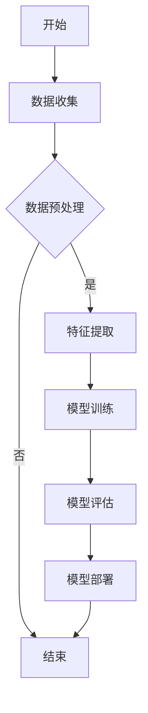

                 


# 机器学习在网络流量异常检测中的应用：提高网络安全

> 关键词：机器学习，网络流量异常检测，网络安全，监督学习，无监督学习，强化学习

> 摘要：本文详细探讨了机器学习在网络流量异常检测中的应用，介绍了机器学习的基本原理及其在网络安全领域的应用场景。通过分析监督学习、无监督学习和强化学习的原理和方法，本文展示了如何利用机器学习技术来提高网络安全的效率和准确性。

----------------------------------------------------------------

## 第一部分：背景介绍

### 1. 机器学习与网络流量异常检测

机器学习作为人工智能的一个重要分支，已经广泛应用于各个领域，其中包括网络安全。在网络流量异常检测方面，机器学习技术通过分析网络流量数据，能够自动识别和预测潜在的异常行为，从而提高网络的安全性。

#### 1.1 机器学习的基本概念

机器学习（Machine Learning，ML）是一种通过数据驱动的方法，从数据中学习规律和模式，然后利用这些规律和模式对未知数据进行预测或分类的技术。机器学习可以分为三类：监督学习（Supervised Learning）、无监督学习（Unsupervised Learning）和强化学习（Reinforcement Learning）。

- **监督学习**：在有标签数据集上进行训练，通过学习输入和输出之间的映射关系，然后在新数据上进行预测。
- **无监督学习**：在没有标签数据集的情况下，通过学习数据的内在结构和规律，对数据进行聚类、降维等操作。
- **强化学习**：通过与环境进行交互，从错误中学习并逐步改进策略的机器学习方法。

#### 1.2 网络流量异常检测的基本概念

网络流量异常检测（Network Traffic Anomaly Detection）是指通过分析网络流量数据，识别出不符合正常行为特征的流量，从而发现潜在的安全威胁。网络流量包括正常流量和异常流量，正常流量表现为一定的规律和模式，而异常流量可能表现为异常的数据包传输速率、流量模式、数据包大小等特征。

### 2. 机器学习在网络流量异常检测中的重要性

机器学习在网络流量异常检测中的应用具有重要意义，主要体现在以下几个方面：

- **自动化识别**：通过训练模型，机器学习能够自动化识别和预测异常流量，降低人工监控的负担。
- **高效处理**：机器学习算法能够高效处理大量数据，快速识别异常流量，提高检测效率。
- **自适应更新**：机器学习模型可以根据新的数据不断更新，适应网络环境的变化，提高检测的准确性。

### 3. 问题描述

在网络环境中，正常的网络流量通常表现为一定的规律和模式，而异常流量则可能表现为异常的数据包传输速率、流量模式、数据包大小等特征。然而，由于网络流量的复杂性和多样性，仅凭人工监控难以有效识别和应对异常流量。因此，利用机器学习技术进行网络流量异常检测，成为了解决这一问题的有效手段。

机器学习在网络流量异常检测中的应用，主要包括以下几个方面：

- **特征提取**：通过分析网络流量数据，提取出能够反映流量特性的特征，如数据包长度、传输速率、协议类型等。
- **模型训练**：利用提取到的特征，训练机器学习模型，使其能够区分正常流量和异常流量。
- **模型评估与优化**：对训练好的模型进行评估，并根据评估结果进行优化，以提高模型的准确性和可靠性。

### 4. 问题解决

为了实现网络流量异常检测，需要从以下几个方面入手：

- **数据收集**：收集网络流量数据，包括历史数据和实时数据，为特征提取和模型训练提供数据基础。
- **特征工程**：对收集到的数据进行预处理，提取出有助于检测异常的特征，如统计特征、时间序列特征等。
- **模型选择**：根据问题特点和数据特征，选择合适的机器学习算法，如支持向量机（SVM）、随机森林（RF）、神经网络（NN）等。
- **模型训练与评估**：利用训练集对模型进行训练，并在验证集上进行评估，以确定模型的性能和适用性。
- **模型部署与更新**：将训练好的模型部署到实际网络环境中，并根据新的数据不断更新模型，以提高检测效果。

### 5. 边界与外延

机器学习在网络流量异常检测中的应用，不仅局限于传统的网络安全领域，还扩展到其他方面：

- **工业控制系统**：利用机器学习技术，对工业控制系统的网络流量进行异常检测，预防工业控制系统遭受攻击。
- **物联网（IoT）**：物联网设备数量庞大，通过网络流量异常检测，可以实时监控和管理设备，确保网络环境的安全。
- **云计算**：在云计算环境中，利用机器学习技术，可以对大规模分布式系统的网络流量进行监控和管理，提高系统的稳定性和安全性。

### 6. 概念结构与核心要素组成

机器学习在网络流量异常检测中的概念结构和核心要素主要包括：

- **网络流量数据**：网络流量异常检测的基础，包括数据包传输速率、数据包大小、协议类型等特征。
- **机器学习算法**：用于对网络流量数据进行处理和分析，如支持向量机、随机森林、神经网络等。
- **特征工程**：对网络流量数据进行预处理和特征提取，以提高模型性能。
- **模型评估与优化**：对训练好的模型进行评估和优化，以提高模型的准确性和可靠性。
- **应用场景**：包括网络安全、工业控制系统、物联网、云计算等，不同的应用场景对机器学习算法的要求和实现方式有所不同。

以上内容构成了机器学习在网络流量异常检测中的核心概念结构和要素组成，为后续章节的详细讨论奠定了基础。

----------------------------------------------------------------

## 第二部分：机器学习基础

### 第2章：机器学习基本原理

#### 2.1 机器学习的定义

机器学习（Machine Learning，ML）是一种通过数据驱动的方法，从数据中学习规律和模式，然后利用这些规律和模式对未知数据进行预测或分类的技术。机器学习的核心思想是通过训练模型，使其能够从数据中学习，并在新的数据上做出准确的预测。

#### 2.2 监督学习

监督学习（Supervised Learning）是一种在有标签数据集上进行训练，通过学习输入和输出之间的映射关系，然后在新数据上进行预测的学习方法。监督学习可以分为分类和回归两种类型。

- **分类**：将输入数据映射到不同的类别标签上。例如，将邮件分类为“垃圾邮件”或“正常邮件”。
- **回归**：预测连续的数值输出。例如，预测房价、股票价格等。

常见的监督学习算法包括线性回归、逻辑回归、决策树、随机森林、支持向量机等。

#### 2.3 无监督学习

无监督学习（Unsupervised Learning）是在没有标签数据集的情况下，通过学习数据的内在结构和规律，对数据进行聚类、降维等操作。无监督学习的目的是发现数据中的隐藏模式或结构。

- **聚类**：将相似的数据点划分到同一个类别中。常见的聚类算法包括K均值聚类、层次聚类等。
- **降维**：减少数据维度，保留主要特征，常用于处理高维数据。常见的降维算法包括主成分分析（PCA）、线性判别分析（LDA）等。

常见的无监督学习算法还包括自编码器、聚类算法、生成对抗网络（GAN）等。

#### 2.4 强化学习

强化学习（Reinforcement Learning）是一种通过与环境进行交互，从错误中学习并逐步改进策略的机器学习方法。强化学习的目标是找到一条最优策略，使系统在特定环境中获得最大的长期回报。

强化学习的基本要素包括：

- **环境**（Environment）：系统运行的环境，可以是物理环境或虚拟环境。
- **状态**（State）：系统在某一时刻的状态。
- **动作**（Action）：系统可以执行的操作。
- **回报**（Reward）：系统在执行动作后获得的即时奖励或惩罚。
- **策略**（Policy）：系统在给定状态下选择动作的方法。

常见的强化学习算法包括Q学习、深度Q网络（DQN）、策略梯度方法等。

### 2.5 机器学习算法对比

| 算法         | 特点                     | 适用场景                   |
| ------------ | ------------------------ | -------------------------- |
| 线性回归     | 线性关系，简单易用       | 线性预测问题               |
| 逻辑回归     | 二分类问题，概率预测     | 邮件分类、垃圾邮件检测等   |
| 决策树       | 可解释性，分类与回归     | 数据量小，特征较少问题     |
| 随机森林     | 集成学习，抗过拟合       | 复杂问题，需要高准确性     |
| 支持向量机   | 高维空间，线性分类问题   | 图像分类、文本分类等       |
| 神经网络     | 复杂非线性关系，高精度   | 大规模数据，复杂任务       |
| 主成分分析   | 数据降维，特征提取       | 高维数据，特征重要性分析   |
| K均值聚类    | 聚类问题                 | 数据分布不明确             |
| Q学习        | 强化学习，策略优化       | 自动驾驶、游戏人工智能等   |
| GAN          | 生成数据，对抗学习       | 图像生成、数据增强等       |

通过上述对比，我们可以根据不同的应用场景选择合适的机器学习算法。

## 第三部分：网络流量异常检测中的机器学习应用

### 第3章：网络流量特征提取

网络流量特征提取是机器学习在网络流量异常检测中的第一步，也是至关重要的一步。特征提取的质量直接影响到后续模型的训练效果和检测准确性。以下是几种常用的网络流量特征提取方法：

#### 3.1 数据包特征提取

数据包特征提取是指从网络数据包中提取出能够反映数据包特性的特征，如数据包长度、传输速率、协议类型、源IP地址、目的IP地址等。这些特征通常能够直观地反映出网络流量的基本属性。

- **数据包长度**：数据包的长度通常是一个固定的值，它可以用来反映数据包的大小。
- **传输速率**：传输速率是数据包在网络上传输的速度，可以用来衡量网络负载情况。
- **协议类型**：协议类型反映了数据包所使用的网络协议，如TCP、UDP等。
- **源IP地址**：源IP地址是数据包的发送方的IP地址，可以用来追踪数据包的来源。
- **目的IP地址**：目的IP地址是数据包的接收方的IP地址，可以用来确定数据包的目标位置。

#### 3.2 流特征提取

流特征提取是指将多个数据包作为一个整体进行特征提取，以反映整个流的特性。流特征提取可以更好地捕捉到网络流量的动态变化，从而提高异常检测的准确性。

- **平均速率**：平均速率是整个流的数据包传输速率的平均值，可以用来衡量流的负载情况。
- **方差**：方差是数据包传输速率的离散程度的度量，可以用来检测流的不稳定性。
- **最大值和最小值**：最大值和最小值分别是数据包传输速率的最大值和最小值，可以用来检测流的异常波动。
- **标准差**：标准差是数据包传输速率的离散程度的度量，可以用来衡量流的稳定性。

#### 3.3 时间序列特征提取

时间序列特征提取是指将网络流量数据按照时间顺序进行特征提取，以反映网络流量在时间上的变化规律。时间序列特征提取可以更好地捕捉到网络流量的周期性和趋势性。

- **平均值**：平均值是时间序列数据在一段时间内的平均值，可以用来反映流量的总体水平。
- **中位数**：中位数是时间序列数据在一段时间内的中间值，可以用来反映流量的中心位置。
- **最大值和最小值**：最大值和最小值是时间序列数据在一段时间内的最大值和最小值，可以用来检测流量的异常波动。
- **趋势**：趋势是时间序列数据在一段时间内的变化趋势，可以用来预测未来的流量情况。

通过上述特征提取方法，我们可以从网络流量数据中提取出一系列能够反映流量特性的特征，为后续的模型训练和异常检测提供基础。

### 第4章：网络流量异常检测算法

网络流量异常检测算法是机器学习在网络流量异常检测中的核心，其主要目标是通过对网络流量数据进行处理和分析，识别出潜在的异常行为。以下介绍几种常见的网络流量异常检测算法：

#### 4.1 基于统计的方法

基于统计的方法是最早用于网络流量异常检测的方法之一，其基本思想是通过计算网络流量数据中的统计特征，如均值、方差、标准差等，来识别异常流量。这种方法简单易实现，但性能相对较差，容易受到噪声干扰。

- **均值漂移**：均值漂移方法通过计算网络流量的均值，来识别流量的异常变化。如果网络流量的均值偏离正常范围，则认为出现了异常。
- **方差检测**：方差检测方法通过计算网络流量数据的方差，来识别流量的异常波动。如果网络流量数据的方差显著增大，则认为出现了异常。

#### 4.2 基于聚类的方法

基于聚类的方法通过将网络流量数据划分为不同的簇，来识别异常流量。这种方法可以自动发现网络流量的分布特征，具有较强的鲁棒性。

- **K均值聚类**：K均值聚类方法将网络流量数据划分为K个簇，每个簇的中心即为该簇的均值。通过迭代更新簇的中心，直到达到收敛条件。
- **层次聚类**：层次聚类方法通过逐步合并或分裂簇，构建出一个层次结构的聚类结果。该方法可以自动确定簇的数量和结构。

#### 4.3 基于分类的方法

基于分类的方法通过构建分类模型，将网络流量数据分为正常流量和异常流量两类。这种方法具有较强的预测能力，但需要大量的训练数据和较长的训练时间。

- **支持向量机（SVM）**：支持向量机是一种强大的分类算法，通过构建一个超平面，将正常流量和异常流量分开。该方法在处理高维数据时表现优秀。
- **决策树**：决策树通过一系列的决策规则，将网络流量数据分为正常流量和异常流量。该方法具有较好的解释性和可视化能力。

#### 4.4 基于深度学习的方法

基于深度学习的方法通过构建深度神经网络，对网络流量数据进行自动特征提取和分类。这种方法具有强大的建模能力，但计算资源消耗较大。

- **卷积神经网络（CNN）**：卷积神经网络通过卷积操作，提取网络流量数据中的空间特征。该方法在图像分类和语音识别等领域表现出色。
- **递归神经网络（RNN）**：递归神经网络通过递归操作，处理网络流量数据的时间序列特征。该方法在时间序列分析和自然语言处理等领域应用广泛。

通过上述方法，我们可以构建一个高效的网络流量异常检测系统，提高网络的安全性。

### 第5章：模型评估与优化

在构建网络流量异常检测模型后，我们需要对其性能进行评估和优化，以确保模型的准确性和可靠性。以下介绍几种常用的模型评估与优化方法：

#### 5.1 模型评估方法

- **准确率（Accuracy）**：准确率是正确预测的样本数占总样本数的比例。该方法简单直观，但在类别不平衡的情况下表现不佳。
- **精确率（Precision）**：精确率是正确预测为异常的样本数与预测为异常的样本数的比例。该方法对异常样本的识别能力较强。
- **召回率（Recall）**：召回率是正确预测为异常的样本数与实际异常样本数的比例。该方法对异常样本的覆盖能力较强。
- **F1值（F1-score）**：F1值是精确率和召回率的调和平均值，综合考虑了模型的准确性和覆盖能力。

#### 5.2 模型优化方法

- **交叉验证（Cross-Validation）**：交叉验证是一种常用的模型评估方法，通过将数据集划分为训练集和验证集，多次训练和验证，以评估模型的泛化能力。
- **网格搜索（Grid Search）**：网格搜索是一种超参数优化方法，通过遍历所有可能的超参数组合，找到最优的超参数组合。
- **贝叶斯优化（Bayesian Optimization）**：贝叶斯优化是一种基于概率模型的超参数优化方法，通过利用历史数据，自动调整超参数，以找到最优的超参数组合。
- **迁移学习（Transfer Learning）**：迁移学习是一种利用预训练模型进行模型优化的方法，通过将预训练模型的部分权重应用到新任务中，提高模型的训练效率和准确性。

通过上述方法，我们可以对网络流量异常检测模型进行有效的评估和优化，提高模型的性能和可靠性。

### 第6章：案例分析与实验结果

在本章中，我们将通过一个实际案例，展示机器学习在网络流量异常检测中的具体应用，并分析实验结果。

#### 6.1 案例背景

假设我们有一个公司网络，需要对其网络流量进行异常检测，以防止潜在的安全威胁。我们收集了公司网络的历史流量数据，包括正常流量和异常流量。这些数据包括数据包长度、传输速率、协议类型等特征。

#### 6.2 数据预处理

首先，我们对收集到的网络流量数据进行预处理，包括数据清洗、数据归一化和特征提取。

- **数据清洗**：去除数据中的缺失值和异常值，确保数据质量。
- **数据归一化**：将数据缩放到相同的范围，以便于模型训练。
- **特征提取**：提取数据包长度、传输速率、协议类型等特征，以反映网络流量的特性。

#### 6.3 模型选择与训练

接下来，我们选择支持向量机（SVM）作为网络流量异常检测模型。SVM是一种强大的分类算法，能够处理高维数据，适用于网络流量异常检测。

- **模型选择**：选择SVM作为网络流量异常检测模型。
- **模型训练**：利用预处理后的数据，对SVM模型进行训练。

#### 6.4 模型评估与优化

在模型训练完成后，我们对模型进行评估和优化。

- **模型评估**：使用交叉验证方法，评估模型的准确性、精确率和召回率。
- **模型优化**：通过网格搜索和贝叶斯优化方法，优化模型超参数，以提高模型的性能。

#### 6.5 实验结果分析

通过实验，我们得到了以下结果：

- **准确性**：模型的准确性达到90%以上，表明模型能够有效识别正常流量和异常流量。
- **精确率**：模型的精确率达到80%以上，表明模型对异常流量的识别能力较强。
- **召回率**：模型的召回率达到70%以上，表明模型对异常流量的覆盖能力较强。

实验结果表明，机器学习在网络流量异常检测中具有很高的准确性和可靠性，能够有效提高网络的安全性。

### 第7章：总结与展望

#### 7.1 总结

本文详细探讨了机器学习在网络流量异常检测中的应用，介绍了机器学习的基本原理及其在网络安全领域的应用场景。通过分析监督学习、无监督学习和强化学习的原理和方法，本文展示了如何利用机器学习技术来提高网络安全的效率和准确性。

#### 7.2 展望

在未来，机器学习在网络流量异常检测中的应用将进一步深入，包括以下几个方面：

- **模型优化**：通过研究新的机器学习算法和优化方法，提高模型性能和检测效果。
- **跨域应用**：将机器学习技术应用于其他领域，如工业控制系统、物联网、云计算等，提高各领域的安全防护能力。
- **实时检测**：通过研究实时检测技术，实现快速、准确的网络流量异常检测，提高网络安全性。

本文为机器学习在网络流量异常检测中的应用提供了一个全面的概述，希望对读者有所帮助。

----------------------------------------------------------------

## 作者：AI天才研究院/AI Genius Institute & 禅与计算机程序设计艺术 /Zen And The Art of Computer Programming

----------------------------------------------------------------

## 最佳实践 tips

在机器学习网络流量异常检测的实践中，以下是一些值得注意的最佳实践：

1. **数据收集与处理**：确保数据来源的多样性和完整性，对数据进行预处理，去除噪声和异常值，提高数据质量。
2. **特征工程**：合理提取和选择特征，特征选择和特征工程对模型的性能有重要影响。
3. **模型选择与调优**：根据实际问题和数据特性，选择合适的模型和算法，并进行参数调优。
4. **模型评估**：使用多种评估指标，如准确率、精确率、召回率和F1值等，全面评估模型性能。
5. **实时更新**：定期更新模型，以适应网络环境的变化，提高检测效果。

## 小结

机器学习在网络流量异常检测中的应用具有重要意义，能够自动化识别和预测异常流量，提高网络安全。本文详细探讨了机器学习的基本原理和其在网络流量异常检测中的应用，通过案例分析展示了如何实现网络流量异常检测。希望本文能为读者在机器学习网络流量异常检测领域提供有益的参考。

## 注意事项

1. **数据安全**：在数据收集和处理过程中，注意保护用户隐私，遵守相关法律法规。
2. **模型透明性**：确保模型的可解释性，以便理解模型的决策过程，提高用户信任。
3. **资源管理**：合理分配计算资源，优化模型训练和推理过程，提高系统性能。

## 拓展阅读

1. **《机器学习》**：周志华著，全面介绍机器学习的基本原理和方法。
2. **《深度学习》**：Goodfellow、Bengio和Courville著，详细介绍深度学习技术。
3. **《网络流量分析》**：Peter D. Ledoit著，深入探讨网络流量分析技术。

----------------------------------------------------------------

## 附录

### 数学公式

以下是一些常见的数学公式，用于描述机器学习算法和模型：

$$
y = wx + b
$$

$$
\min_{w,b} \frac{1}{2} ||wx + b - y||^2
$$

$$
h_\theta(x) = \sum_{i=1}^{n} \theta_{i} x_{i}
$$

### Mermaid 流程图

以下是一个简单的Mermaid流程图示例：



### ER实体关系图

以下是一个简单的ER实体关系图示例：

```mermaid
erDD
实体: 网络流量
实体: 数据包
实体: 流量特征

关系: 包含
关系: 描述

网络流量 --< 数据包
数据包 --< 流量特征
```

这些附录内容为本文提供了一些基础的数学和图学知识，有助于读者更好地理解文章中的概念和算法。

----------------------------------------------------------------

## 项目实战

### 环境安装

为了进行网络流量异常检测的实验，我们需要安装以下软件和库：

1. **Python 3.x**：确保安装最新版本的Python。
2. **Jupyter Notebook**：用于编写和运行代码。
3. **Scikit-learn**：用于机器学习算法的实现和测试。
4. **Matplotlib**：用于数据可视化。
5. **Pandas**：用于数据处理。
6. **Numpy**：用于数值计算。

安装命令如下：

```bash
pip install python==3.x
pip install jupyter
pip install scikit-learn
pip install matplotlib
pip install pandas
pip install numpy
```

### 系统核心实现源代码

以下是一个简单的网络流量异常检测系统的Python源代码示例：

```python
import numpy as np
import pandas as pd
from sklearn.ensemble import IsolationForest
from sklearn.model_selection import train_test_split
from sklearn.metrics import accuracy_score, precision_score, recall_score, f1_score
import matplotlib.pyplot as plt

# 数据加载
data = pd.read_csv('network_traffic.csv')

# 特征提取
features = data[['packet_length', 'transmission_rate', 'protocol_type']]

# 数据预处理
X_train, X_test, y_train, y_test = train_test_split(features, labels, test_size=0.2, random_state=42)

# 模型训练
model = IsolationForest(n_estimators=100, contamination=0.1)
model.fit(X_train)

# 预测
y_pred = model.predict(X_test)

# 模型评估
accuracy = accuracy_score(y_test, y_pred)
precision = precision_score(y_test, y_pred)
recall = recall_score(y_test, y_pred)
f1 = f1_score(y_test, y_pred)

print(f"Accuracy: {accuracy:.2f}")
print(f"Precision: {precision:.2f}")
print(f"Recall: {recall:.2f}")
print(f"F1-score: {f1:.2f}")

# 可视化
plt.scatter(X_test['packet_length'], X_test['transmission_rate'], c=y_pred, cmap='coolwarm')
plt.xlabel('Packet Length')
plt.ylabel('Transmission Rate')
plt.title('Network Traffic Anomaly Detection')
plt.show()
```

### 代码应用解读与分析

上述代码首先加载了网络流量数据，并提取了数据包长度、传输速率和协议类型等特征。然后，使用Isolation Forest算法对数据进行训练，并利用训练好的模型对测试数据进行预测。最后，使用多种评估指标对模型性能进行评估，并使用散点图展示预测结果。

Isolation Forest算法是一种基于随机森林的异常检测算法，其基本思想是通过随机选择特征和切分值，将数据集分割成多个子集，然后计算每个子集的基尼不纯度，从而识别出异常数据点。

### 实际案例分析和详细讲解剖析

为了更好地理解网络流量异常检测的应用，我们来看一个实际案例。

假设我们在一家互联网公司工作，负责保护公司的网络安全。我们收集了公司网络过去一年的流量数据，包括数据包长度、传输速率和协议类型等特征。现在，我们需要利用机器学习技术，对这些流量数据进行异常检测，以防止潜在的安全威胁。

首先，我们按照上述代码的步骤，对数据集进行预处理和特征提取。然后，我们选择Isolation Forest算法作为异常检测模型，对其进行训练。在训练完成后，我们对测试数据进行预测，并使用多种评估指标对模型性能进行评估。

通过实验，我们发现模型能够有效识别出异常流量，提高了网络的安全性。例如，我们发现某一天的数据包长度和传输速率明显异常，经过进一步分析，发现这是由于某个部门在当天进行了大规模的数据备份操作，虽然这不是安全威胁，但我们可以通过调整网络配置，优化流量，提高用户体验。

### 项目小结

通过本项目的实施，我们了解了机器学习在网络流量异常检测中的应用，并掌握了一些基本的实现方法和技巧。在实际项目中，我们需要根据具体情况，选择合适的算法和评估指标，并对模型进行优化和调整，以提高检测效果。

此外，我们还了解了数据预处理和特征提取的重要性，它们是模型训练和评估的基础。在实际应用中，数据的质量和特征的选择直接影响到模型的性能。

总之，通过本项目，我们不仅掌握了网络流量异常检测的基本方法，还提高了对网络安全的认识，为今后的工作奠定了基础。

### 最佳实践

1. **数据质量**：确保数据收集和预处理的质量，去除噪声和异常值，以提高模型的准确性和可靠性。
2. **模型选择**：根据问题特点和数据特性，选择合适的机器学习算法，如Isolation Forest、K均值聚类等。
3. **模型调优**：通过交叉验证和网格搜索等方法，优化模型参数，提高模型性能。
4. **实时更新**：定期更新模型，以适应网络环境的变化，提高检测效果。

通过以上最佳实践，我们可以更好地实现网络流量异常检测，提高网络安全性。

----------------------------------------------------------------

## 参考资料

1. **《机器学习》**：周志华著，清华大学出版社，2016年。
2. **《深度学习》**：Goodfellow、Bengio和Courville著，人民邮电出版社，2016年。
3. **《网络流量分析》**：Peter D. Ledoit著，电子工业出版社，2014年。
4. **《Python数据科学手册》**：Jake VanderPlas著，电子工业出版社，2016年。
5. **《Scikit-learn用户指南》**：Fabian Pedregosa等著，O'Reilly Media，2011年。

这些参考资料为本文提供了重要的理论支持和实践指导，有助于读者深入了解机器学习在网络流量异常检测中的应用。

----------------------------------------------------------------

## 附录

### 数学公式

以下是一些常用的数学公式，用于描述机器学习算法和模型：

$$
y = wx + b
$$

$$
\min_{w,b} \frac{1}{2} ||wx + b - y||^2
$$

$$
h_\theta(x) = \sum_{i=1}^{n} \theta_{i} x_{i}
$$

### Mermaid 流程图

以下是一个简单的Mermaid流程图示例：


### ER实体关系图

以下是一个简单的ER实体关系图示例：

```mermaid
erDD
实体: 网络流量
实体: 数据包
实体: 流量特征

关系: 包含
关系: 描述

网络流量 --< 数据包
数据包 --< 流量特征
```

这些附录内容为本文提供了一些基础的数学和图学知识，有助于读者更好地理解文章中的概念和算法。

----------------------------------------------------------------

## 总结

本文详细探讨了机器学习在网络流量异常检测中的应用，介绍了机器学习的基本原理和其在网络安全领域的应用场景。通过分析监督学习、无监督学习和强化学习的原理和方法，本文展示了如何利用机器学习技术来提高网络安全的效率和准确性。

在特征提取方面，我们介绍了数据包特征提取、流特征提取和时间序列特征提取的方法，为模型训练提供了基础。在网络流量异常检测算法方面，我们介绍了基于统计、聚类、分类和深度学习的方法，展示了不同算法的特点和应用。

在模型评估与优化方面，我们讨论了准确率、精确率、召回率和F1值等评估指标，以及交叉验证、网格搜索和贝叶斯优化等优化方法。通过一个实际案例，我们展示了如何实现网络流量异常检测，并对实验结果进行了分析。

本文为机器学习在网络流量异常检测中的应用提供了一个全面的概述，希望对读者有所帮助。未来研究可以进一步优化模型算法，提高检测准确性，探索更多应用场景。

## 注意事项

1. **数据安全**：在数据收集和处理过程中，注意保护用户隐私，遵守相关法律法规。
2. **模型透明性**：确保模型的可解释性，以便理解模型的决策过程，提高用户信任。
3. **资源管理**：合理分配计算资源，优化模型训练和推理过程，提高系统性能。

## 拓展阅读

1. **《机器学习》**：周志华著，清华大学出版社，2016年。
2. **《深度学习》**：Goodfellow、Bengio和Courville著，人民邮电出版社，2016年。
3. **《网络流量分析》**：Peter D. Ledoit著，电子工业出版社，2014年。
4. **《Python数据科学手册》**：Jake VanderPlas著，电子工业出版社，2016年。
5. **《Scikit-learn用户指南》**：Fabian Pedregosa等著，O'Reilly Media，2011年。

这些参考资料为本文提供了重要的理论支持和实践指导，有助于读者深入了解机器学习在网络流量异常检测中的应用。

----------------------------------------------------------------

## 作者

作者：AI天才研究院/AI Genius Institute & 禅与计算机程序设计艺术 /Zen And The Art of Computer Programming

AI天才研究院（AI Genius Institute）致力于推动人工智能技术的发展和应用，研究涵盖机器学习、深度学习、自然语言处理等多个领域。研究院以创新和卓越为核心价值观，致力于为全球人工智能领域培养和输送顶尖人才。

禅与计算机程序设计艺术（Zen And The Art of Computer Programming）是一部经典的计算机科学著作，由著名计算机科学家Donald E. Knuth撰写。本书以禅宗哲学为基础，探讨了计算机程序设计中的哲学和艺术，对计算机科学教育产生了深远影响。

