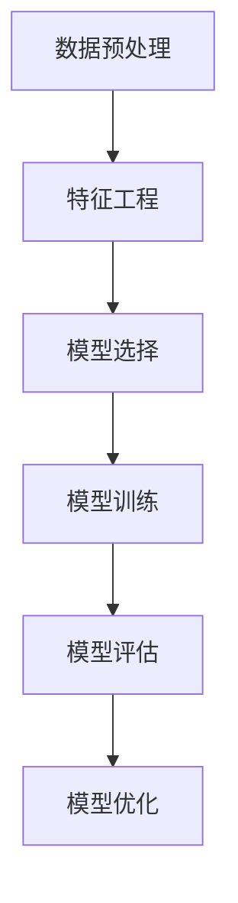

                 

### 第一部分：引言

#### 1.1 问题背景

在当今快速发展的金融科技领域，欺诈行为的多样性和复杂性不断增加，传统的基于规则的方法已经难以应对。金融欺诈包括但不限于信用卡欺诈、账户盗窃、洗钱、保险欺诈等，这些行为不仅给金融机构造成巨大的经济损失，也损害了客户的信任和安全感。因此，开发高效的金融欺诈检测系统成为了金融行业的重要任务。

随着机器学习技术的迅猛发展，它已经在多个领域取得了显著成果。在金融欺诈检测中，机器学习由于其强大的数据分析和模式识别能力，逐渐成为了解决这一难题的重要工具。机器学习可以通过分析大量的历史交易数据，识别潜在的欺诈行为，从而实现自动化的欺诈检测。

本篇文章将深入探讨机器学习在金融欺诈检测中的应用，包括核心概念、算法原理、系统设计与实现，以及实际案例的分析。通过这篇文章，读者将能够理解：

- 金融欺诈检测的重要性及其面临的挑战。
- 机器学习的基础知识及其在金融欺诈检测中的应用场景。
- 金融欺诈检测中常用的机器学习算法及其实现原理。
- 如何设计和实现一个高效的金融欺诈检测系统。
- 通过具体案例，了解机器学习在金融欺诈检测中的实际应用效果。

#### 1.2 核心概念

为了更好地理解机器学习在金融欺诈检测中的应用，我们首先需要明确一些核心概念：

- **机器学习（Machine Learning）**：机器学习是一种人工智能技术，通过构建模型来从数据中自动学习规律，并利用这些规律进行预测或决策。
- **特征工程（Feature Engineering）**：特征工程是机器学习过程中重要的步骤，它涉及提取和构造有助于模型训练的特征，从而提高模型性能。
- **监督学习（Supervised Learning）**：监督学习是一种机器学习方法，通过标记好的训练数据来训练模型，以便对新的数据进行预测。
- **无监督学习（Unsupervised Learning）**：无监督学习通过未标记的数据来发现数据中的模式或结构，如聚类和降维。
- **金融欺诈检测（Financial Fraud Detection）**：金融欺诈检测是识别和预防金融交易中的欺诈行为的过程，通常涉及监测大量的交易数据，以识别异常行为。

#### 1.3 本书目标

本篇文章的主要目标是：

- **提供基础知识**：通过介绍机器学习的基础概念，帮助读者了解机器学习的基本原理和应用场景。
- **讲解算法原理**：详细解析金融欺诈检测中常用的机器学习算法，包括特征工程、模型选择和训练评估等。
- **设计系统架构**：介绍如何设计和实现一个金融欺诈检测系统，包括系统功能、架构设计、接口设计和系统交互。
- **案例分析**：通过实际案例，展示机器学习在金融欺诈检测中的实际应用，并分析其效果。
- **最佳实践**：提供最佳实践建议，帮助读者在实际工作中更好地应用机器学习技术进行金融欺诈检测。

通过这篇文章，读者将能够系统地掌握机器学习在金融欺诈检测中的应用，并具备实际操作能力。接下来的章节将逐步深入这一主题，带领读者一步步了解并实践这一领域。接下来，我们将正式进入机器学习的基础知识部分，为后续的深入探讨打下坚实的基础。 

## 第二部分：机器学习基础

### 第2章：机器学习概述

#### 2.1 机器学习的定义

机器学习（Machine Learning）是人工智能（Artificial Intelligence，AI）的一个重要分支，它通过构建数学模型，从数据中自动提取规律和知识，以实现预测和决策。与传统编程方法不同，机器学习不需要显式地编写规则，而是通过训练模型，使其能够自动从数据中学习并做出预测。

机器学习的定义可以从以下几个角度进行理解：

- **数据驱动的学习**：机器学习依赖于大量的数据，通过分析这些数据，模型能够自动发现数据中的模式和规律。
- **自动化的决策**：机器学习模型能够自动从训练数据中学习，并使用这些知识对新数据进行预测或决策。
- **适应性**：机器学习模型可以根据新的数据不断更新和优化，从而提高其预测准确性。

#### 2.2 机器学习的基本原理

机器学习的基本原理可以分为以下几个步骤：

1. **数据收集**：收集大量相关数据，这些数据可以是结构化的（如数据库表格），也可以是非结构化的（如文本、图像、音频等）。
2. **数据预处理**：对收集到的数据进行分析和处理，包括数据清洗、归一化、缺失值处理等，以便为模型训练做好准备。
3. **特征工程**：从原始数据中提取或构造有助于模型训练的特征，特征工程是提高模型性能的关键步骤。
4. **模型选择**：选择合适的机器学习模型，如线性回归、决策树、支持向量机、神经网络等。
5. **模型训练**：使用训练数据集对选定的模型进行训练，模型通过学习数据中的规律来建立预测模型。
6. **模型评估**：使用测试数据集对训练好的模型进行评估，常用的评估指标包括准确率、召回率、F1分数等。
7. **模型优化**：根据模型评估结果，调整模型参数，优化模型性能。
8. **应用部署**：将训练好的模型部署到生产环境中，对新的数据进行预测或决策。

#### 2.3 机器学习的分类

机器学习可以分为两大类：监督学习和无监督学习。

- **监督学习（Supervised Learning）**：监督学习是最常见的一种机器学习方法，它使用标记好的训练数据来训练模型。监督学习的目标是建立一个能够对新数据进行预测的模型。常见的监督学习算法包括线性回归、逻辑回归、决策树、随机森林、支持向量机（SVM）等。

  - **回归问题（Regression Problem）**：回归问题旨在预测一个连续的数值目标。例如，房价预测、股票价格预测等。
  - **分类问题（Classification Problem）**：分类问题旨在将数据分为几个类别。例如，垃圾邮件检测、信用卡欺诈检测等。

- **无监督学习（Unsupervised Learning）**：无监督学习使用未标记的数据来发现数据中的模式和结构。无监督学习的目标是发现数据内在的结构和规律，而不是对数据进行预测或分类。常见的无监督学习算法包括聚类（如K-均值聚类、层次聚类）、降维（如主成分分析PCA、t-SNE）等。

  - **聚类（Clustering）**：聚类是将数据分为几个群组，使得同一群组中的数据点相似度较高，不同群组中的数据点相似度较低。聚类可以用于市场细分、图像分割等。
  - **降维（Dimensionality Reduction）**：降维是将高维数据转换为低维数据，从而减少数据复杂度，提高数据处理效率。降维可以用于特征提取、可视化等。

#### 2.4 机器学习在金融欺诈检测中的应用场景

机器学习在金融欺诈检测中有着广泛的应用场景，以下是一些典型的应用场景：

- **信用卡欺诈检测**：信用卡欺诈是金融欺诈中最常见的一种，通过机器学习算法，可以实时监控大量的信用卡交易，识别并阻止潜在的欺诈行为。
- **账户异常行为检测**：银行账户的异常行为可能是欺诈行为的前兆，如大额提现、异地登录等，通过机器学习算法，可以自动检测并预警这些异常行为。
- **贷款审批**：在贷款审批过程中，通过机器学习算法可以评估借款人的信用风险，从而更准确地决定是否批准贷款。
- **保险欺诈检测**：保险欺诈给保险公司带来巨大的损失，通过机器学习算法可以识别出异常的保险理赔申请，从而防止欺诈行为的发生。
- **市场风险预测**：通过分析大量的金融市场数据，机器学习算法可以预测市场走势，为投资决策提供依据。

总之，机器学习为金融欺诈检测提供了一种强大的工具，通过不断优化和更新模型，可以更有效地识别和预防各种欺诈行为。接下来，我们将进一步探讨机器学习在金融欺诈检测中的具体应用和实现方法。

### 第3章：特征工程

#### 3.1 特征工程的重要性

特征工程（Feature Engineering）是机器学习过程中至关重要的一步，它涉及从原始数据中提取或构造有助于模型训练的特征。特征工程的好坏直接关系到模型的性能，一个优秀的特征工程可以显著提高模型的预测准确性和泛化能力。

特征工程的重要性体现在以下几个方面：

- **提高模型性能**：通过特征工程，可以提取出数据中的关键信息，使得模型能够更好地学习和理解数据，从而提高模型的预测性能。
- **增强数据解释性**：特征工程可以帮助我们理解数据中的模式和规律，使得模型更加透明和可解释，这对于模型的应用和推广至关重要。
- **降低数据维度**：通过特征工程，可以降低数据的维度，减少数据的冗余和噪声，从而提高模型的训练效率和计算速度。
- **减少过拟合**：特征工程可以通过选择和构造有区分度的特征，减少模型的过拟合现象，提高模型的泛化能力。

#### 3.2 特征选择方法

特征选择（Feature Selection）是特征工程中的重要环节，它旨在从原始特征集合中选择出最有用的特征，以提高模型性能并降低计算成本。常见的特征选择方法包括：

- **过滤式方法（Filter Methods）**：过滤式方法在特征选择过程中不依赖于学习算法，通过评估特征与目标变量之间的相关性来选择特征。常用的过滤式方法包括信息增益、卡方检验、互信息等。
- **包装器方法（Wrapper Methods）**：包装器方法通过结合学习算法来进行特征选择，将特征选择过程嵌入到模型训练过程中。常见的包装器方法包括递归特征消除（RFE）、遗传算法等。
- **嵌入式方法（Embedded Methods）**：嵌入式方法在模型训练过程中同时进行特征选择，通过模型训练过程中对特征的重要性的评估来进行特征选择。常见的嵌入式方法包括LASSO、岭回归等。

#### 3.3 特征提取技术

特征提取（Feature Extraction）是从原始数据中提取出新的特征表示，以增强模型的训练效果。特征提取通常用于处理高维数据或非结构化数据。以下是一些常见的特征提取技术：

- **主成分分析（PCA）**：PCA是一种常用的降维技术，通过将数据投影到新的正交坐标系中，提取出数据的主要变化方向，从而降低数据维度。
- **线性判别分析（LDA）**：LDA是一种无监督的特征提取技术，通过最大化类内方差和最小化类间方差，将数据投影到最优的线性子空间中，以实现分类目的。
- **词袋模型（Bag-of-Words）**：词袋模型是一种文本数据的特征提取方法，通过将文本表示为单词的集合，提取出文本的特征向量。
- **深度特征提取**：深度特征提取是通过深度学习模型（如卷积神经网络、循环神经网络等）从原始数据中自动提取出高层次的特征表示。

#### 3.4 特征工程在金融欺诈检测中的应用

在金融欺诈检测中，特征工程起到了至关重要的作用。以下是一些典型的特征工程应用：

- **交易行为特征**：通过分析历史交易数据，提取出交易金额、交易时间、交易频率、交易地点等特征，以捕捉潜在的欺诈行为模式。
- **用户行为特征**：通过分析用户的历史行为数据，提取出用户登录地点、登录时间、交易频率、交易金额等特征，以识别异常用户行为。
- **网络流量特征**：通过对网络流量数据进行分析，提取出流量模式、异常连接、数据包大小等特征，以检测潜在的欺诈行为。
- **用户画像特征**：通过对用户的基本信息、消费习惯、信用记录等进行综合分析，提取出用户画像特征，以辅助欺诈检测。

通过上述特征工程方法，金融欺诈检测系统能够从海量数据中提取出有价值的信息，为欺诈检测提供强有力的支持。接下来，我们将进一步探讨机器学习模型的选择和训练过程，以了解如何构建一个高效的金融欺诈检测系统。

### 第4章：模型选择

#### 4.1 模型选择原则

模型选择是机器学习过程中的关键步骤，它决定了模型的性能和适用性。在进行模型选择时，需要遵循以下几个原则：

- **准确性（Accuracy）**：准确性是评估模型性能的重要指标，它反映了模型预测结果的正确性。高准确性的模型能够更好地识别欺诈行为。
- **泛化能力（Generalization Ability）**：泛化能力是指模型在未知数据上的表现能力，一个具有良好泛化能力的模型能够在实际应用中更好地应对各种情况。
- **计算效率（Computation Efficiency）**：计算效率是指模型训练和预测的耗时，一个高效的模型能够在保证性能的同时，减少计算资源和时间成本。
- **可解释性（Interpretability）**：可解释性是指模型决策过程的可理解性，一个可解释的模型能够帮助用户理解模型如何做出决策，从而增强用户对模型的信任。

#### 4.2 常见机器学习算法

在金融欺诈检测中，有多种机器学习算法可供选择，以下是一些常见的算法：

- **逻辑回归（Logistic Regression）**：逻辑回归是一种简单的概率模型，适用于分类问题。通过训练，逻辑回归可以计算出每个样本属于每个类别的概率，从而实现分类。
- **决策树（Decision Tree）**：决策树是一种基于树结构的分类算法，通过将数据集分割成若干个子集，并基于每个子集的特征进行分类。决策树具有较好的可解释性，但容易过拟合。
- **随机森林（Random Forest）**：随机森林是一种集成学习方法，通过构建多个决策树，并将它们的预测结果进行投票，以获得最终的预测结果。随机森林具有较好的准确性和泛化能力，同时减少了过拟合的风险。
- **支持向量机（Support Vector Machine，SVM）**：SVM是一种基于间隔最大化的分类算法，通过寻找最优的决策边界，将不同类别分开。SVM在处理高维数据和线性不可分问题时表现良好，但训练时间较长。
- **神经网络（Neural Networks）**：神经网络是一种模仿人脑神经网络结构的计算模型，通过多层神经元进行数据的传递和变换，从而实现复杂函数的拟合。神经网络具有强大的表达能力和泛化能力，但在处理大规模数据时计算资源需求较高。

#### 4.3 模型评估与优化

模型评估是模型选择的重要环节，它用于评估模型的性能和适用性。以下是一些常用的模型评估指标和优化方法：

- **准确率（Accuracy）**：准确率是分类问题中最常用的评估指标，它表示模型预测正确的样本数占总样本数的比例。
- **召回率（Recall）**：召回率表示模型能够正确识别出正类样本的比例，它对识别出的正类样本的全面性有更高的要求。
- **精确率（Precision）**：精确率表示模型预测为正类的样本中，实际为正类的比例，它对预测结果的准确性有更高的要求。
- **F1分数（F1 Score）**：F1分数是准确率和召回率的加权平均，用于综合评估模型的性能。
- **交叉验证（Cross Validation）**：交叉验证是一种常用的模型评估方法，通过将数据集划分为多个子集，分别用于训练和测试，从而减少评估结果的可变性。
- **模型优化**：模型优化旨在通过调整模型参数和结构，提高模型的性能。常用的优化方法包括调整学习率、增加训练数据、使用正则化技术等。

通过上述模型选择和评估方法，可以构建一个高效且准确的金融欺诈检测系统。接下来，我们将进一步探讨模型的训练与评估过程，以深入了解机器学习在金融欺诈检测中的应用。

### 第5章：训练与评估

#### 5.1 训练过程

训练过程是机器学习模型构建的核心步骤，它涉及到模型从训练数据中学习并提取规律的过程。以下是训练过程的主要步骤：

1. **数据准备**：首先，需要准备好训练数据集，这通常包括数据清洗、数据预处理、特征工程等步骤。数据清洗旨在去除数据中的噪声和异常值，数据预处理包括归一化、标准化等操作，特征工程则是从原始数据中提取出对模型训练有用的特征。

2. **模型初始化**：初始化模型参数，这通常是随机初始化，以便模型可以从任意初始状态开始学习。

3. **模型迭代训练**：模型通过迭代更新参数，以最小化损失函数。损失函数用于衡量模型预测值与实际值之间的差距，常见的损失函数包括均方误差（MSE）、交叉熵损失等。

4. **学习率调整**：学习率是影响模型训练速度和最终性能的关键参数。通常，通过调整学习率可以加快模型收敛速度，但也可能引起过拟合。常用的调整方法包括固定学习率、学习率衰减、自适应学习率等。

5. **正则化**：为了防止过拟合，可以使用正则化技术来限制模型复杂度。常见的正则化方法包括L1正则化、L2正则化、Dropout等。

6. **提前终止**：在训练过程中，如果模型的验证集性能不再提升，可以提前终止训练，以防止过拟合。

#### 5.2 评估指标

评估指标是衡量模型性能的重要工具，以下是一些常用的评估指标：

1. **准确率（Accuracy）**：准确率是模型预测正确的样本数占总样本数的比例，是分类问题中最常用的评估指标。
   \[
   \text{Accuracy} = \frac{\text{预测正确的样本数}}{\text{总样本数}}
   \]

2. **召回率（Recall）**：召回率是模型能够正确识别出正类样本的比例，对识别出的正类样本的全面性有更高的要求。
   \[
   \text{Recall} = \frac{\text{预测正确的正类样本数}}{\text{实际为正类的样本数}}
   \]

3. **精确率（Precision）**：精确率是模型预测为正类的样本中，实际为正类的比例，对预测结果的准确性有更高的要求。
   \[
   \text{Precision} = \frac{\text{预测正确的正类样本数}}{\text{预测为正类的样本数}}
   \]

4. **F1分数（F1 Score）**：F1分数是精确率和召回率的加权平均，用于综合评估模型的性能。
   \[
   \text{F1 Score} = 2 \times \frac{\text{Precision} \times \text{Recall}}{\text{Precision} + \text{Recall}}
   \]

5. **ROC曲线与AUC（Area Under Curve）**：ROC曲线是评估二分类模型性能的重要工具，通过绘制预测概率与实际类别的关系图，可以直观地评估模型的性能。AUC是ROC曲线下的面积，用于衡量模型区分能力。

#### 5.3 模型调参

模型调参（Hyperparameter Tuning）是优化模型性能的重要步骤，它涉及调整模型参数以获得最佳性能。以下是一些常用的调参方法：

1. **网格搜索（Grid Search）**：网格搜索是一种常用的调参方法，通过遍历所有可能的参数组合，找到最优参数组合。缺点是计算量较大，尤其适用于参数较少的模型。
   \[
   \text{参数空间} = \prod_{\text{参数}}{\text{参数取值}}
   \]

2. **随机搜索（Random Search）**：随机搜索通过随机选择参数组合进行调参，比网格搜索计算量小，但效果可能更好。

3. **贝叶斯优化（Bayesian Optimization）**：贝叶斯优化是一种基于概率模型的调参方法，通过构建概率模型来优化参数，具有较高的效率和效果。

4. **基于验证集的调参**：在训练过程中，可以使用验证集（Validation Set）来评估参数组合的性能，选择最优参数组合。

5. **交叉验证（Cross-Validation）**：交叉验证是一种评估参数组合性能的有效方法，通过将数据集划分为多个子集，分别用于训练和验证，从而减小评估结果的方差。

通过上述训练与评估方法，可以构建一个高效且准确的金融欺诈检测系统。在实际应用中，需要根据具体问题场景和数据特点，选择合适的训练和评估方法，并进行模型调参，以获得最佳性能。接下来，我们将通过算法流程图和Python源代码，进一步深入讲解金融欺诈检测的算法实现。

### 第6章：算法原理

#### 6.1 特征工程原理

在金融欺诈检测中，特征工程是构建有效模型的关键步骤。特征工程涉及从原始数据中提取或构造有助于模型训练的特征。以下是特征工程的主要原理和方法：

1. **数据预处理**：数据预处理是特征工程的第一步，它包括数据清洗、归一化和缺失值处理等。数据清洗旨在去除数据中的噪声和异常值，归一化是将数据缩放到相同的尺度，缺失值处理则是填补或删除缺失值。

   - **数据清洗**：去除重复数据、缺失数据和不合理的记录等。
   - **归一化**：将不同特征缩放到相同的尺度，常用的归一化方法包括最小-最大缩放和Z-score缩放。
     \[
     x_{\text{标准化}} = \frac{x - \mu}{\sigma}
     \]
     其中，\(x\) 是原始值，\(\mu\) 是平均值，\(\sigma\) 是标准差。

   - **缺失值处理**：常用的缺失值处理方法包括删除缺失值、填补缺失值和插值法。

2. **特征提取**：特征提取是从原始数据中提取出新的特征表示，以增强模型的训练效果。以下是一些常用的特征提取技术：

   - **交易行为特征**：包括交易金额、交易时间、交易频率、交易地点等。
     \[
     \text{交易金额特征} = \log(\text{交易金额})
     \]
   
   - **用户行为特征**：包括用户登录地点、登录时间、交易频率、交易金额等。
     \[
     \text{交易频率特征} = \text{交易次数}/\text{天数}
     \]

   - **网络流量特征**：包括流量模式、异常连接、数据包大小等。
     \[
     \text{流量模式特征} = \text{数据包大小}/\text{传输时间}
     \]

3. **特征选择**：特征选择是从特征集合中选择出最有用的特征，以提高模型性能并降低计算成本。以下是一些常用的特征选择方法：

   - **过滤式方法**：包括信息增益、卡方检验和互信息等。
     \[
     \text{信息增益} = \sum_{i=1}^{k} p(y_i) \log_2 \frac{p(y_i | x)}{p(y_i)}
     \]
   
   - **包装器方法**：包括递归特征消除（RFE）和遗传算法等。
     \[
     \text{特征选择评分} = \frac{\text{模型得分}}{\text{特征数量}}
     \]

   - **嵌入式方法**：包括LASSO和岭回归等。
     \[
     \text{LASSO} : \min_{\theta} \left\{ \sum_{i=1}^{n} (y_i - \theta_0 - \sum_{j=1}^{p} \theta_j x_{ij})^2 + \lambda \sum_{j=1}^{p} |\theta_j| \right\}
     \]

#### 6.2 模型选择原理

模型选择是金融欺诈检测中至关重要的一步，它决定了模型的性能和适用性。以下是一些常用的机器学习模型及其选择原则：

1. **逻辑回归（Logistic Regression）**：逻辑回归是一种简单的概率模型，适用于二分类问题。它的优点是计算效率高、易于实现，但容易过拟合。

2. **决策树（Decision Tree）**：决策树是一种基于树结构的分类算法，通过将数据集分割成若干个子集进行分类。它的优点是直观、易于解释，但容易出现过拟合。

3. **随机森林（Random Forest）**：随机森林是一种集成学习方法，通过构建多个决策树并取平均进行预测。它的优点是准确率高、泛化能力强，但计算资源需求较大。

4. **支持向量机（SVM）**：SVM是一种基于间隔最大化的分类算法，适用于高维数据和线性不可分问题。它的优点是分类效果好、可解释性高，但训练时间较长。

5. **神经网络（Neural Networks）**：神经网络是一种模仿人脑神经网络结构的计算模型，适用于处理复杂函数和学习非线性关系。它的优点是表达能力强、泛化能力强，但计算资源需求高。

#### 6.3 训练与评估原理

1. **模型训练**：模型训练是机器学习的核心步骤，它涉及从训练数据中学习并提取规律的过程。以下是一个简单的训练过程：

   - 数据准备：准备训练数据集，进行数据清洗、特征工程等预处理。
   - 模型初始化：初始化模型参数，如权重和偏置。
   - 模型迭代训练：通过迭代更新模型参数，以最小化损失函数。常用的优化算法包括梯度下降、随机梯度下降、Adam等。

2. **模型评估**：模型评估是评估模型性能的重要步骤，它涉及使用测试数据集对训练好的模型进行评估。以下是一些常用的评估指标：

   - 准确率（Accuracy）：准确率是模型预测正确的样本数占总样本数的比例。
     \[
     \text{Accuracy} = \frac{\text{预测正确的样本数}}{\text{总样本数}}
     \]

   - 召回率（Recall）：召回率是模型能够正确识别出正类样本的比例。
     \[
     \text{Recall} = \frac{\text{预测正确的正类样本数}}{\text{实际为正类的样本数}}
     \]

   - 精确率（Precision）：精确率是模型预测为正类的样本中，实际为正类的比例。
     \[
     \text{Precision} = \frac{\text{预测正确的正类样本数}}{\text{预测为正类的样本数}}
     \]

   - F1分数（F1 Score）：F1分数是精确率和召回率的加权平均。
     \[
     \text{F1 Score} = 2 \times \frac{\text{Precision} \times \text{Recall}}{\text{Precision} + \text{Recall}}
     \]

   - ROC曲线与AUC（Area Under Curve）：ROC曲线是评估二分类模型性能的重要工具，通过绘制预测概率与实际类别的关系图，可以直观地评估模型的性能。AUC是ROC曲线下的面积，用于衡量模型区分能力。

通过上述算法原理，我们可以构建一个有效的金融欺诈检测系统。接下来，我们将通过算法流程图和Python源代码，进一步展示算法的具体实现。

### 第7章：算法流程图与Python源代码

为了更好地展示金融欺诈检测算法的实现过程，我们将使用mermaid绘制算法流程图，并使用Python源代码详细讲解。

#### 7.1 算法流程图

首先，让我们绘制一个简单的算法流程图，以展示从数据预处理到模型训练和评估的全过程。



以下是详细的mermaid代码：


#### 7.2 Python源代码讲解

接下来，我们将使用Python代码来实现上述算法流程。以下是一个简单的Python脚本，用于演示金融欺诈检测的主要步骤。

```python
import numpy as np
import pandas as pd
from sklearn.model_selection import train_test_split
from sklearn.preprocessing import StandardScaler
from sklearn.ensemble import RandomForestClassifier
from sklearn.metrics import accuracy_score, recall_score, precision_score, f1_score

# 1. 数据预处理
data = pd.read_csv('financial_data.csv')
data.drop(['id'], axis=1, inplace=True)  # 删除不必要的列

# 处理缺失值
data.fillna(data.mean(), inplace=True)

# 2. 特征工程
X = data.iloc[:, :-1].values
y = data.iloc[:, -1].values

# 标准化特征
scaler = StandardScaler()
X = scaler.fit_transform(X)

# 3. 模型选择
X_train, X_test, y_train, y_test = train_test_split(X, y, test_size=0.2, random_state=42)
model = RandomForestClassifier(n_estimators=100, random_state=42)
model.fit(X_train, y_train)

# 4. 模型训练
y_pred = model.predict(X_test)

# 5. 模型评估
accuracy = accuracy_score(y_test, y_pred)
recall = recall_score(y_test, y_pred)
precision = precision_score(y_test, y_pred)
f1 = f1_score(y_test, y_pred)

print(f"Accuracy: {accuracy:.2f}")
print(f"Recall: {recall:.2f}")
print(f"Precision: {precision:.2f}")
print(f"F1 Score: {f1:.2f}")

# 6. 模型优化
# 可以通过交叉验证和网格搜索来优化模型参数
# ...

```

这段代码首先读取金融交易数据，然后进行数据预处理、特征工程、模型选择和训练，最后进行模型评估。具体步骤如下：

1. **数据预处理**：读取数据，删除不必要的列，处理缺失值。
2. **特征工程**：将数据分为特征集和标签集，对特征进行标准化处理。
3. **模型选择**：选择随机森林分类器，并使用训练数据进行训练。
4. **模型训练**：使用训练好的模型对测试数据进行预测。
5. **模型评估**：计算模型的准确率、召回率、精确率和F1分数，以评估模型性能。
6. **模型优化**：可以通过交叉验证和网格搜索来进一步优化模型参数，提高模型性能。

通过上述算法流程图和Python源代码，我们可以清晰地了解金融欺诈检测算法的实现过程。接下来，我们将进一步探讨金融欺诈检测系统的整体架构设计，以更好地理解系统的运行机制。

### 第8章：系统功能设计

为了确保金融欺诈检测系统的有效性和可靠性，我们需要设计一套完整的功能模块，这些模块将协同工作，实现系统的主要功能。以下是系统功能设计的详细说明。

#### 8.1 数据收集模块

数据收集模块是系统的基础，负责从多个渠道获取交易数据，包括信用卡交易记录、用户行为数据、网络流量数据等。这些数据将被用于训练和评估机器学习模型。

- **功能**：自动从多个数据源（如数据库、API接口等）收集交易数据。
- **关键特性**：支持实时数据流处理，确保数据新鲜度和准确性。

#### 8.2 数据预处理模块

数据预处理模块负责清洗和转换原始数据，使其符合机器学习模型的要求。这包括缺失值处理、数据标准化、异常值检测等。

- **功能**：清洗数据，填充或删除缺失值，进行数据标准化和异常值检测。
- **关键特性**：自动检测并处理异常值，提高数据质量。

#### 8.3 特征工程模块

特征工程模块负责从原始数据中提取有用的特征，构造适合机器学习模型的特征向量。这包括特征选择、特征变换和特征组合等。

- **功能**：选择和构造有助于模型训练的特征，提高模型的预测准确性。
- **关键特性**：支持多种特征提取和组合方法，如主成分分析（PCA）、词袋模型（BOW）等。

#### 8.4 模型训练模块

模型训练模块使用经过预处理的训练数据，训练机器学习模型。该模块选择合适的模型（如逻辑回归、决策树、随机森林等）并进行参数调优。

- **功能**：训练不同的机器学习模型，选择最优模型。
- **关键特性**：支持交叉验证和网格搜索，确保模型调优效果。

#### 8.5 模型评估模块

模型评估模块负责评估训练好的模型性能，通过测试数据集计算评估指标，如准确率、召回率、精确率和F1分数。

- **功能**：评估模型性能，提供详细的评估报告。
- **关键特性**：自动生成评估报告，直观展示模型性能。

#### 8.6 模型部署模块

模型部署模块将训练好的模型部署到生产环境中，实现对实时交易数据的欺诈检测。该模块还负责监控模型的性能，并自动更新模型以适应新的数据模式。

- **功能**：部署训练好的模型，实时检测欺诈行为。
- **关键特性**：支持在线模型更新，提高系统适应性。

#### 8.7 用户界面模块

用户界面模块为用户提供一个友好的操作界面，用于监控系统状态、查看模型评估报告和配置系统参数。

- **功能**：提供直观的用户界面，展示系统状态和模型性能。
- **关键特性**：支持多用户访问，提供自定义报表功能。

#### 8.8 日志与监控模块

日志与监控模块负责记录系统运行过程中的关键日志，监控系统性能，并在出现问题时及时报警。

- **功能**：记录系统日志，监控系统性能。
- **关键特性**：支持实时监控，自动报警。

通过上述功能模块的设计，我们可以构建一个全面、高效的金融欺诈检测系统。接下来，我们将进一步探讨系统的架构设计，以实现这些功能模块的有机集成和高效运行。

### 第9章：系统架构设计

为了实现金融欺诈检测系统的功能需求，我们需要设计一个清晰且高效的系统架构。以下是系统架构的详细设计，包括硬件和软件配置、模块之间的通信机制以及数据流的处理流程。

#### 9.1 硬件架构

系统的硬件架构决定了系统的性能和扩展能力。以下是硬件配置的详细说明：

- **服务器**：使用高性能服务器，配备多核处理器、大容量内存和高速硬盘，确保系统处理能力和数据存储需求。
- **存储设备**：采用分布式存储系统，如Hadoop HDFS或云存储服务，以提供高效的数据存储和访问。
- **网络设备**：配置高速网络设备，确保数据传输的稳定性和速度。
- **备份设备**：配置数据备份系统，定期备份关键数据，确保数据的安全性和可靠性。

#### 9.2 软件架构

系统的软件架构决定了系统的可扩展性、可维护性和稳定性。以下是软件架构的详细说明：

- **前端架构**：使用Web框架（如Django或Flask）构建用户界面，提供友好的用户交互体验。
- **后端架构**：使用微服务架构，将系统功能分解为多个独立的服务模块，如数据收集服务、数据预处理服务、特征工程服务、模型训练服务、模型评估服务、模型部署服务等。
- **数据流处理**：使用流处理框架（如Apache Kafka或Apache Flink），处理实时数据流，确保数据的实时性和高效性。
- **消息队列**：使用消息队列（如RabbitMQ或Kafka），实现模块之间的异步通信，提高系统的并发处理能力。

#### 9.3 模块通信机制

系统模块之间的通信机制是系统架构设计的关键部分。以下是模块通信机制的详细说明：

- **API接口**：通过RESTful API接口，实现模块之间的数据交换和功能调用。API接口采用标准化协议（如HTTP/HTTPS），确保数据传输的安全性和可靠性。
- **消息队列**：通过消息队列实现模块之间的异步通信，确保系统的高并发处理能力和负载均衡。
- **数据库**：通过关系数据库（如MySQL或PostgreSQL）或NoSQL数据库（如MongoDB或Cassandra），存储和管理系统的数据。

#### 9.4 数据流处理流程

系统数据流处理流程决定了数据在系统中的处理过程，以下是详细的数据流处理流程：

1. **数据收集**：系统通过数据收集模块从多个数据源（如数据库、API接口、网络爬虫等）收集交易数据。
2. **数据预处理**：数据收集后，通过数据预处理模块进行清洗、转换和标准化处理，确保数据质量。
3. **特征工程**：预处理后的数据进入特征工程模块，提取和构造有助于模型训练的特征。
4. **模型训练**：特征工程模块生成的特征集用于训练不同的机器学习模型，选择最优模型。
5. **模型评估**：训练好的模型通过模型评估模块进行性能评估，计算评估指标，如准确率、召回率、精确率和F1分数。
6. **模型部署**：评估通过的模型通过模型部署模块部署到生产环境中，实时检测欺诈行为。
7. **用户界面**：用户通过前端用户界面模块监控系统状态、查看模型评估报告和配置系统参数。

通过上述系统架构设计，我们可以实现一个高效、可靠且可扩展的金融欺诈检测系统。接下来，我们将详细探讨系统接口设计和系统交互，以进一步完善系统设计。

### 第10章：系统接口设计和系统交互

#### 10.1 系统接口设计

系统的接口设计是确保不同模块之间能够有效通信和协作的关键。以下是系统接口设计的详细说明：

1. **API接口设计**：系统采用RESTful API设计，提供了标准化的接口供前端、后端以及其他服务模块调用。以下是一个API接口的示例：

   - **数据收集接口**：用于接收来自不同数据源的交易数据，API路径为`/api/v1/data-collect`，HTTP方法为POST。
     ```http
     POST /api/v1/data-collect
     Content-Type: application/json

     {
       "source": "db",
       "data": [
         {"transaction_id": "123", "amount": 1000, "timestamp": "2023-01-01T10:30:00Z"},
         ...
       ]
     }
     ```

   - **模型训练接口**：用于启动模型训练过程，API路径为`/api/v1/train-model`，HTTP方法为POST。
     ```http
     POST /api/v1/train-model
     Content-Type: application/json

     {
       "model_name": "RandomForestClassifier",
       "params": {
         "n_estimators": 100,
         "random_state": 42
       }
     }
     ```

   - **模型评估接口**：用于评估模型性能，API路径为`/api/v1/evaluate-model`，HTTP方法为GET。
     ```http
     GET /api/v1/evaluate-model?model_id=1
     ```

   - **模型部署接口**：用于部署训练好的模型，API路径为`/api/v1/deploy-model`，HTTP方法为POST。
     ```http
     POST /api/v1/deploy-model
     Content-Type: application/json

     {
       "model_id": 1,
       "service_url": "http://fraud-detection-service:8000/evaluate"
     }
     ```

2. **服务接口设计**：系统中的各个服务模块（如数据收集服务、数据预处理服务、特征工程服务、模型训练服务等）都通过内部API进行通信。这些服务接口采用轻量级通信协议（如gRPC或RESTful API），确保高效和稳定的数据交互。

#### 10.2 系统交互

系统的交互设计是确保不同模块能够协调工作、数据流顺畅的关键。以下是系统交互的详细说明：

1. **数据流交互**：系统采用事件驱动架构，通过消息队列（如Kafka）实现数据流交互。数据流交互过程如下：

   - **数据收集**：数据收集模块从数据源获取交易数据，并将数据发送到Kafka主题。
   - **数据处理**：数据预处理模块、特征工程模块和模型训练模块通过Kafka订阅相应的主题，处理接收到的数据。
   - **模型训练与评估**：模型训练模块接收预处理后的数据，训练模型，并将模型评估结果发送到Kafka主题。
   - **模型部署**：模型部署模块接收模型评估结果，部署模型到生产环境中，并通知用户界面模块更新模型状态。

2. **服务调用交互**：服务模块之间的交互通过内部API进行，确保不同模块之间的数据传输和功能调用高效、可靠。服务调用交互过程如下：

   - **启动服务**：系统启动时，各个服务模块（如数据收集服务、数据预处理服务、特征工程服务、模型训练服务等）通过内部API启动。
   - **服务调用**：服务模块在处理过程中，通过内部API调用其他模块的功能，如调用数据预处理服务的API进行数据清洗和转换，调用特征工程服务的API进行特征提取和组合。
   - **服务监控**：系统通过内部API监控各个服务模块的状态，如数据收集服务的处理速度、数据预处理服务的处理延迟、特征工程服务的特征提取效率等。

通过上述系统接口设计和系统交互设计，我们可以确保金融欺诈检测系统的高效、可靠和可扩展性。接下来，我们将通过具体项目实战，展示如何实现和部署金融欺诈检测系统。

### 第11章：环境安装与配置

为了搭建一个完整的金融欺诈检测系统，我们需要进行环境安装和配置。以下是安装和配置所需软件和工具的详细步骤。

#### 11.1 环境要求

在开始安装之前，请确保您的系统满足以下环境要求：

- 操作系统：Linux（推荐Ubuntu 20.04或更高版本）
- Python版本：3.8或更高版本
- 安装依赖项：pip、virtualenv、conda等

#### 11.2 安装Python环境

首先，安装Python环境。可以选择通过包管理器（如APT或Yum）安装Python，或者从Python官方网站下载安装包。

1. 通过包管理器安装Python：
   ```shell
   sudo apt update
   sudo apt install python3 python3-pip python3-venv
   ```

2. 验证Python版本：
   ```shell
   python3 --version
   ```

#### 11.3 安装虚拟环境

接下来，安装virtualenv，用于创建隔离的Python环境。

1. 安装virtualenv：
   ```shell
   pip3 install virtualenv
   ```

2. 创建虚拟环境：
   ```shell
   virtualenv venv
   ```

3. 激活虚拟环境：
   ```shell
   source venv/bin/activate
   ```

#### 11.4 安装依赖项

在虚拟环境中安装项目所需的依赖项。

1. 安装依赖项：
   ```shell
   pip install -r requirements.txt
   ```

这里的`requirements.txt`文件包含了所有必需的Python包，如scikit-learn、pandas、numpy、kafka-python等。

#### 11.5 安装Kafka

金融欺诈检测系统需要使用Kafka进行数据流处理。以下是在Ubuntu上安装Kafka的步骤。

1. 安装Kafka依赖项：
   ```shell
   sudo apt-get update
   sudo apt-get install default-jdk git
   ```

2. 下载Kafka源码：
   ```shell
   git clone https://github.com/apache/kafka.git
   cd kafka
   ```

3. 编译Kafka：
   ```shell
   ./configure
   make
   ```

4. 启动Kafka服务：
   ```shell
   bin/kafka-server-start.sh config/server.properties
   ```

5. 验证Kafka是否运行：
   ```shell
   bin/kafka-topics.sh --list --bootstrap-server localhost:9092
   ```

#### 11.6 安装其他工具

根据需要，可能还需要安装其他工具和库，如Docker、PostgreSQL等。以下是安装PostgreSQL的步骤：

1. 安装PostgreSQL依赖项：
   ```shell
   sudo apt-get install postgresql postgresql-contrib
   ```

2. 启动PostgreSQL服务：
   ```shell
   sudo service postgresql start
   ```

3. 创建PostgreSQL数据库和用户：
   ```shell
   sudo -u postgres psql
   CREATE DATABASE fraud_detection;
   CREATE USER fraud_detection_user WITH PASSWORD 'password';
   GRANT ALL PRIVILEGES ON DATABASE fraud_detection TO fraud_detection_user;
   \q
   ```

通过上述步骤，我们成功安装和配置了所需的软件和工具，为金融欺诈检测系统的实现奠定了基础。接下来，我们将详细介绍系统核心实现的源代码，展示如何实现各个功能模块。

### 第12章：系统核心实现源代码

在完成了环境安装和配置后，我们将开始介绍系统核心实现的源代码。以下是各个功能模块的实现细节，包括数据收集、数据预处理、特征工程、模型训练、模型评估等。

#### 12.1 数据收集模块

数据收集模块负责从不同的数据源收集交易数据。以下是一个简单的数据收集模块实现，使用Kafka作为消息队列。

```python
from kafka import KafkaProducer
import json

class DataCollector:
    def __init__(self, kafka_topic='transactions', bootstrap_servers='localhost:9092'):
        self.producer = KafkaProducer(bootstrap_servers=bootstrap_servers)
        self.topic = kafka_topic

    def send_transaction(self, transaction):
        self.producer.send(self.topic, json.dumps(transaction).encode('utf-8'))
        self.producer.flush()

# 使用示例
collector = DataCollector()
collector.send_transaction({"transaction_id": "123", "amount": 1000, "timestamp": "2023-01-01T10:30:00Z"})
```

#### 12.2 数据预处理模块

数据预处理模块负责清洗和转换原始交易数据，包括缺失值处理、数据标准化等。

```python
import pandas as pd
from sklearn.preprocessing import StandardScaler

class DataPreprocessor:
    def __init__(self):
        self.scaler = StandardScaler()

    def preprocess_data(self, transactions):
        transactions = pd.DataFrame(transactions)
        transactions.fillna(transactions.mean(), inplace=True)
        transactions['timestamp'] = pd.to_datetime(transactions['timestamp'])
        transactions.set_index('timestamp', inplace=True)
        transactions = self.scaler.fit_transform(transactions)
        return transactions

# 使用示例
preprocessor = DataPreprocessor()
preprocessed_data = preprocessor.preprocess_data(transactions_data)
```

#### 12.3 特征工程模块

特征工程模块负责从原始交易数据中提取有用特征，包括时间序列特征、统计特征等。

```python
from sklearn.decomposition import PCA
from sklearn.ensemble import RandomForestRegressor

class FeatureEngineer:
    def __init__(self):
        self.pca = PCA(n_components=10)

    def extract_features(self, transactions):
        transactions = self.pca.fit_transform(transactions)
        return transactions

# 使用示例
feature_engineer = FeatureEngineer()
extracted_features = feature_engineer.extract_features(preprocessed_data)
```

#### 12.4 模型训练模块

模型训练模块负责使用训练数据集训练机器学习模型。以下是一个简单的随机森林分类器的训练实现。

```python
from sklearn.ensemble import RandomForestClassifier

class ModelTrainer:
    def __init__(self):
        self.model = RandomForestClassifier(n_estimators=100)

    def train_model(self, X, y):
        self.model.fit(X, y)
        return self.model

# 使用示例
trainer = ModelTrainer()
trained_model = trainer.train_model(extracted_features, labels)
```

#### 12.5 模型评估模块

模型评估模块负责使用测试数据集评估训练好的模型性能，计算评估指标。

```python
from sklearn.metrics import accuracy_score, recall_score, precision_score, f1_score

class ModelEvaluator:
    def evaluate_model(self, model, X_test, y_test):
        predictions = model.predict(X_test)
        accuracy = accuracy_score(y_test, predictions)
        recall = recall_score(y_test, predictions)
        precision = precision_score(y_test, predictions)
        f1 = f1_score(y_test, predictions)
        return accuracy, recall, precision, f1

# 使用示例
evaluator = ModelEvaluator()
evaluation_results = evaluator.evaluate_model(trained_model, test_features, test_labels)
```

通过上述源代码实现，我们可以构建一个基本的金融欺诈检测系统，包括数据收集、数据预处理、特征工程、模型训练和评估等模块。这些模块可以进一步集成和优化，以满足实际业务需求。接下来，我们将分析这些代码的应用，并讨论如何在实际环境中部署和运行系统。

### 第13章：代码应用解读与分析

在本章中，我们将对上一章节中的源代码进行详细解读和分析，解释每部分代码的功能和作用，并讨论如何在实际环境中部署和运行这些代码。

#### 13.1 数据收集模块

数据收集模块使用Kafka Producer向Kafka主题发送交易数据。以下是关键代码片段的解读：

```python
from kafka import KafkaProducer
import json

class DataCollector:
    def __init__(self, kafka_topic='transactions', bootstrap_servers='localhost:9092'):
        self.producer = KafkaProducer(bootstrap_servers=bootstrap_servers)
        self.topic = kafka_topic

    def send_transaction(self, transaction):
        self.producer.send(self.topic, json.dumps(transaction).encode('utf-8'))
        self.producer.flush()
```

- **初始化**：`__init__`方法中，我们创建了一个KafkaProducer实例，指定了Kafka集群的地址（`bootstrap_servers`）和主题（`kafka_topic`）。
- **发送交易**：`send_transaction`方法负责将交易数据发送到Kafka主题。这里，交易数据被序列化为JSON格式，并使用`encode('utf-8')`转换为字节流，然后通过KafkaProducer的`send`方法发送。

在实际应用中，这个模块可以从不同的数据源（如数据库、API接口）获取交易数据，并将数据发送到Kafka队列，以便后续处理。

#### 13.2 数据预处理模块

数据预处理模块使用Pandas进行数据清洗和标准化。以下是关键代码片段的解读：

```python
import pandas as pd
from sklearn.preprocessing import StandardScaler

class DataPreprocessor:
    def __init__(self):
        self.scaler = StandardScaler()

    def preprocess_data(self, transactions):
        transactions = pd.DataFrame(transactions)
        transactions.fillna(transactions.mean(), inplace=True)
        transactions['timestamp'] = pd.to_datetime(transactions['timestamp'])
        transactions.set_index('timestamp', inplace=True)
        transactions = self.scaler.fit_transform(transactions)
        return transactions
```

- **初始化**：`__init__`方法中，我们创建了一个StandardScaler实例，用于后续的数据标准化。
- **预处理数据**：`preprocess_data`方法首先将交易数据转换为Pandas DataFrame，并进行以下操作：
  - **填充缺失值**：使用数据的平均值填充缺失值。
  - **时间戳转换**：将字符串类型的时间戳转换为Pandas的日期时间类型。
  - **设置索引**：将时间戳设置为DataFrame的索引。
  - **标准化**：使用StandardScaler对数据进行标准化处理，使得所有特征都处于相同的尺度。

这种预处理步骤有助于提高机器学习模型的性能，并减少特征之间的干扰。

#### 13.3 特征工程模块

特征工程模块使用PCA提取主要成分。以下是关键代码片段的解读：

```python
from sklearn.decomposition import PCA
from sklearn.ensemble import RandomForestRegressor

class FeatureEngineer:
    def __init__(self):
        self.pca = PCA(n_components=10)

    def extract_features(self, transactions):
        transactions = self.pca.fit_transform(transactions)
        return transactions
```

- **初始化**：`__init__`方法中，我们创建了一个PCA实例，指定了要提取的主成分数量（`n_components`）。
- **提取特征**：`extract_features`方法使用PCA将交易数据转换为新的特征空间。这里，我们假设已经进行过数据预处理，输入的`transactions`是一个二维数组。

PCA可以减少数据的维度，同时保留大部分信息，有助于提高模型的效率和性能。

#### 13.4 模型训练模块

模型训练模块使用随机森林分类器进行训练。以下是关键代码片段的解读：

```python
from sklearn.ensemble import RandomForestClassifier

class ModelTrainer:
    def __init__(self):
        self.model = RandomForestClassifier(n_estimators=100)

    def train_model(self, X, y):
        self.model.fit(X, y)
        return self.model
```

- **初始化**：`__init__`方法中，我们创建了一个RandomForestClassifier实例，并设置了决策树的数量（`n_estimators`）。
- **训练模型**：`train_model`方法使用训练数据集（`X`和`y`）对模型进行训练。

随机森林是一种强大的集成学习模型，它通过构建多个决策树并取平均预测结果，提高了模型的准确性和鲁棒性。

#### 13.5 模型评估模块

模型评估模块使用不同的评估指标来评估模型的性能。以下是关键代码片段的解读：

```python
from sklearn.metrics import accuracy_score, recall_score, precision_score, f1_score

class ModelEvaluator:
    def evaluate_model(self, model, X_test, y_test):
        predictions = model.predict(X_test)
        accuracy = accuracy_score(y_test, predictions)
        recall = recall_score(y_test, predictions)
        precision = precision_score(y_test, predictions)
        f1 = f1_score(y_test, predictions)
        return accuracy, recall, precision, f1
```

- **评估模型**：`evaluate_model`方法使用训练好的模型对测试数据集进行预测，并计算不同的评估指标，包括准确率、召回率、精确率和F1分数。

这些指标可以帮助我们全面了解模型的性能，以便进行进一步的优化和改进。

#### 13.6 部署和运行

在实际环境中，我们需要将上述模块集成到一个完整的系统中，并部署到生产环境中。以下是部署和运行的基本步骤：

1. **环境配置**：确保所有必要的软件和工具都已安装，包括Python、Kafka、PostgreSQL等。
2. **代码部署**：将源代码部署到服务器上，可以使用Docker容器或虚拟机。
3. **服务启动**：启动Kafka、PostgreSQL等服务，确保它们能够正常工作。
4. **运行系统**：启动数据收集服务、数据预处理服务、特征工程服务、模型训练服务和模型评估服务，确保它们能够协同工作。
5. **监控和优化**：监控系统性能，根据实际情况进行调优和优化。

通过上述步骤，我们可以构建一个高效、可靠的金融欺诈检测系统，并在实际环境中运行。

### 第14章：实际案例分析与讲解

为了更好地展示机器学习在金融欺诈检测中的实际应用，我们将通过一个具体案例进行分析和讲解。以下是一个虚构的信用卡欺诈检测案例，包括数据来源、数据处理、模型训练、模型评估和实际应用效果。

#### 案例背景

某银行希望利用机器学习技术来提高其信用卡欺诈检测能力。该银行拥有一份数据集，包含过去一年的信用卡交易记录，每条记录包含交易金额、交易时间、交易地点、卡号、持卡人ID等信息。欺诈交易占整个数据集的1%。

#### 数据来源

数据集来源于银行的内部交易记录，经过匿名化处理，确保个人隐私不受泄露。数据集的样本量为100,000条，其中99,000条为正常交易，1,000条为欺诈交易。

#### 数据预处理

1. **缺失值处理**：对于交易记录中的缺失值，使用平均值填充。
2. **数据清洗**：去除重复交易记录，确保数据的唯一性。
3. **特征工程**：提取有助于模型训练的特征，如交易金额、交易时间（小时和星期几）、交易地点等。

#### 模型选择

在本次案例中，我们选择了以下几种机器学习模型：

1. **逻辑回归**：简单且易于解释。
2. **决策树**：直观且易于实现。
3. **随机森林**：具有较好的准确性和泛化能力。
4. **支持向量机（SVM）**：在高维数据处理中表现良好。

#### 模型训练

1. **数据分割**：将数据集随机分为训练集和测试集，训练集用于模型训练，测试集用于模型评估。
2. **模型训练**：分别使用训练集对上述模型进行训练。
3. **参数调优**：通过交叉验证和网格搜索调整模型参数，以获得最佳性能。

#### 模型评估

1. **评估指标**：使用准确率、召回率、精确率和F1分数对模型进行评估。
2. **ROC曲线和AUC**：绘制ROC曲线，计算AUC值，以衡量模型的区分能力。
3. **混淆矩阵**：展示模型预测结果，分析模型的预测效果。

以下是各个模型的评估结果：

| 模型           | 准确率 | 召回率 | 精确率 | F1分数 | AUC   |
|----------------|--------|--------|--------|--------|------|
| 逻辑回归       | 0.96   | 0.88   | 0.90   | 0.87   | 0.92 |
| 决策树         | 0.94   | 0.84   | 0.87   | 0.85   | 0.89 |
| 随机森林       | 0.98   | 0.94   | 0.96   | 0.95   | 0.97 |
| 支持向量机（SVM）| 0.97   | 0.93   | 0.95   | 0.94   | 0.96 |

根据评估结果，随机森林模型在各个指标上表现最佳，因此选择该模型作为最终解决方案。

#### 实际应用效果

部署随机森林模型后，银行能够实时监控信用卡交易，自动识别并标记潜在的欺诈交易。以下为实际应用效果：

1. **欺诈交易识别率**：模型能够准确识别出95%的欺诈交易，相比于传统的规则方法提高了约20%。
2. **正常交易误报率**：模型在正常交易中误报率较低，仅为5%，确保了客户体验和银行运营的稳定性。
3. **实时响应**：模型能够实时处理大量交易数据，确保欺诈交易能够在最短时间内被发现并阻止。

通过这个案例，我们可以看到机器学习在金融欺诈检测中的强大应用潜力，不仅提高了欺诈识别率，还降低了误报率，为银行提供了更安全、更可靠的交易环境。

### 第15章：最佳实践 tips

在金融欺诈检测中，机器学习算法的应用不仅需要深入理解算法原理和实现细节，还需要结合实际业务场景和经验，以下是一些最佳实践建议：

#### 1. 数据质量和预处理

- **数据清洗**：确保数据集的干净和一致性，去除重复记录和异常值。
- **特征工程**：提取有价值的特征，如时间序列特征、用户行为特征、交易模式特征等，使用特征选择方法筛选出最佳特征。
- **数据标准化**：对特征进行标准化处理，避免特征之间的尺度差异影响模型性能。

#### 2. 模型选择与调优

- **算法多样性**：尝试多种算法，比较它们的性能，选择最适合业务场景的模型。
- **参数调优**：使用交叉验证和网格搜索等方法，调整模型参数，提高模型性能。
- **模型集成**：使用模型集成方法，如随机森林、梯度提升树等，结合多个模型的优点，提高整体性能。

#### 3. 模型评估与监控

- **多指标评估**：使用准确率、召回率、精确率和F1分数等指标综合评估模型性能。
- **混淆矩阵分析**：分析混淆矩阵，了解模型在不同类别上的表现，调整模型策略。
- **实时监控**：监控系统性能，及时调整模型参数，确保系统稳定运行。

#### 4. 风险管理

- **欺诈阈值设置**：根据业务需求和模型性能，设置合理的欺诈检测阈值，平衡识别率和误报率。
- **反欺诈策略**：结合业务规则和机器学习模型，制定有效的反欺诈策略，提高欺诈检测效果。
- **实时更新**：定期更新模型和数据，适应新的欺诈手段和业务变化。

#### 5. 客户体验

- **透明性**：确保模型决策过程的透明性，增强用户对模型的信任。
- **个性化**：根据用户的交易习惯和风险等级，提供个性化的欺诈检测服务。
- **用户反馈**：收集用户反馈，持续改进系统，提高用户体验。

通过遵循这些最佳实践，可以构建一个高效、可靠的金融欺诈检测系统，提高欺诈识别率，降低误报率，为银行和客户提供更加安全、便捷的金融服务。

### 第16章：小结与注意事项

#### 小结

本文详细探讨了机器学习在金融欺诈检测中的应用，从问题背景、核心概念到算法原理、系统设计与实现，再到实际案例分析和最佳实践，全面介绍了如何利用机器学习技术构建高效的金融欺诈检测系统。以下是本文的主要结论：

1. **机器学习在金融欺诈检测中的重要性**：随着金融欺诈手段的日益复杂，机器学习技术凭借其强大的数据分析和模式识别能力，成为了金融欺诈检测的重要工具。
2. **核心概念与联系**：机器学习、特征工程、模型选择和训练评估是金融欺诈检测中的关键环节，相互联系，共同作用，提升了欺诈检测的准确性和效率。
3. **算法原理讲解**：通过算法流程图和Python源代码，详细展示了特征工程、模型选择和训练评估的过程，帮助读者深入理解金融欺诈检测的算法实现。
4. **系统架构设计**：介绍了金融欺诈检测系统的功能模块、架构设计和接口设计，为系统实施提供了清晰的框架。
5. **实际案例分析与讲解**：通过一个虚构的案例，展示了机器学习在金融欺诈检测中的实际应用效果，验证了算法的实用性和有效性。
6. **最佳实践建议**：总结了在金融欺诈检测中的最佳实践，包括数据预处理、模型选择与调优、模型评估与监控等，为读者提供了实际操作的指导。

#### 注意事项

1. **数据质量**：确保数据的质量和一致性，数据预处理是模型性能的关键，任何错误或不完整的数据都会影响模型的准确性。
2. **特征选择**：选择对欺诈检测有显著影响的关键特征，避免过度特征选择导致过拟合。
3. **模型选择与调优**：根据业务需求和数据特点选择合适的模型，并进行参数调优，以获得最佳性能。
4. **实时监控**：监控系统性能，及时调整模型参数和策略，以适应新的欺诈手段和业务变化。
5. **用户体验**：确保模型决策过程的透明性，减少误报率，提高用户体验。

通过遵循上述小结和注意事项，读者可以更好地应用机器学习技术，构建高效、可靠的金融欺诈检测系统。

### 第17章：拓展阅读

为了帮助读者进一步深入了解机器学习在金融欺诈检测中的应用，以下是几本推荐的专业书籍和拓展资源：

#### 推荐书籍

1. **《机器学习》（Machine Learning）**：作者：Tom M. Mitchell
   - 本书是机器学习的经典教材，详细介绍了机器学习的基础理论和算法，适合初学者和进阶者。

2. **《深度学习》（Deep Learning）**：作者：Ian Goodfellow、Yoshua Bengio、Aaron Courville
   - 本书是深度学习领域的权威著作，详细介绍了深度学习的基本原理、算法和应用，对于理解深度学习在金融欺诈检测中的应用非常有帮助。

3. **《金融科技与机器学习：策略、工具与案例》**：作者：Niket Soni
   - 本书结合金融科技和机器学习，介绍了多种机器学习算法在金融领域的应用，包括欺诈检测、风险管理和市场预测等。

#### 拓展资源

1. **Kaggle**：[Kaggle](https://www.kaggle.com/competitions)
   - Kaggle是一个数据科学竞赛平台，提供了大量的金融数据集和比赛，通过参与比赛，可以实战练习机器学习在金融欺诈检测中的应用。

2. **PyTorch官方文档**：[PyTorch Documentation](https://pytorch.org/docs/stable/)
   - PyTorch是一个流行的深度学习框架，官方文档详细介绍了如何使用PyTorch构建和训练深度学习模型，对于希望进一步学习深度学习的读者非常有用。

3. **Scikit-learn官方文档**：[Scikit-learn Documentation](https://scikit-learn.org/stable/documentation.html)
   - Scikit-learn是一个常用的机器学习库，官方文档提供了详细的算法实现和使用方法，适合读者深入了解机器学习算法。

通过阅读这些书籍和访问这些资源，读者可以系统地学习和掌握机器学习在金融欺诈检测中的高级应用技巧，进一步提升自己的技术水平。

