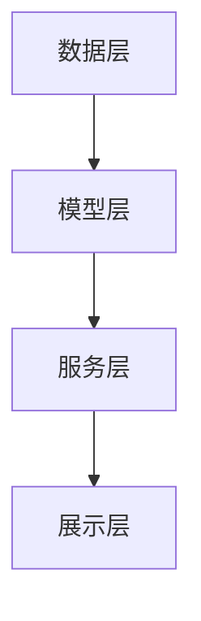

                 

# 机器学习在金融风险评估中的应用

关键词：机器学习、金融风险、风险评估、算法、模型、数据、系统设计

摘要：随着金融市场的日益复杂和竞争的加剧，金融机构需要更加精确和高效的工具来进行风险评估。本文将探讨机器学习在金融风险评估中的应用，从核心概念、算法原理、系统设计、实际案例等方面展开分析，旨在为读者提供深入理解和实践指导。

## 引言

金融市场的复杂性和快速变化使得传统的风险评估方法面临挑战。机器学习作为一种先进的分析方法，具有自学习、自适应和预测能力，为金融风险评估提供了新的可能。本文将深入探讨机器学习在金融风险评估中的应用，通过逻辑清晰、结构紧凑的分析，帮助读者理解这一领域的核心技术。

## 背景介绍

### 金融风险及其重要性

金融风险是指金融机构在运营过程中可能面临的各种不确定性，包括市场风险、信用风险、流动性风险等。有效的金融风险评估能够帮助金融机构识别潜在风险，优化资源配置，提高盈利能力。

### 机器学习的发展与机遇

机器学习通过构建复杂的数学模型和算法，可以从大量数据中提取有价值的信息，进行预测和决策。随着大数据和计算能力的提升，机器学习在金融领域的应用越来越广泛，为风险评估带来了新的机遇。

### 风险评估的挑战与需求

金融风险评估面临数据复杂性、模型不确定性、实时性要求等挑战。传统的统计分析方法难以满足这些需求，而机器学习能够提供更为灵活和高效的解决方案。

## 核心概念与联系

### 机器学习算法

机器学习算法是金融风险评估的核心，包括监督学习、无监督学习、强化学习等。每种算法都有其独特的原理和应用场景。

### 风险评估模型

风险评估模型是机器学习算法在金融领域的具体应用，包括信贷风险评估、市场风险预测、违约预测等。这些模型需要结合金融数据的特点进行设计。

### 金融数据分析

金融数据分析是风险评估的基础，包括数据收集、清洗、预处理等步骤。高质量的数据是构建有效风险评估模型的关键。

### 概念属性特征对比表格

| 算法 | 原理 | 优点 | 缺点 | 应用场景 |
| --- | --- | --- | --- | --- |
| 决策树 | 基于特征的分割 | 易于理解 | 容易过拟合 | 信贷风险评估 |
| 支持向量机 | 线性或非线性分类 | 高精度 | 计算复杂 | 市场风险预测 |
| 神经网络 | 多层感知器 | 强泛化能力 | 训练时间较长 | 违约预测 |

### ER实体关系图架构

```mermaid
erDiagram
    Customer ||--|{ Loan }|--|> Bank
    Loan ||--|{ Risk }|--|> RiskModel
    RiskModel ||--|{ Prediction }|--|> PredictionResult
```

## 算法原理讲解

### 决策树算法

决策树算法通过递归分割特征空间，将数据划分为多个区域，每个区域对应一个预测结果。其基本原理如下：

$$
\text{决策树} = \text{递归分割}(\text{特征空间})
$$

例如，在信贷风险评估中，我们可以使用决策树来预测客户是否违约。具体流程如下：

1. 选择一个最佳分割特征。
2. 根据该特征将数据划分为多个子集。
3. 对于每个子集，递归执行步骤1和步骤2，直到满足停止条件（如最大深度、最小样本量等）。

### 支持向量机算法

支持向量机（SVM）算法通过找到一个最佳超平面，将不同类别的数据点分隔开来。其基本原理如下：

$$
\text{SVM} = \arg\min_{\text{w,b}} \frac{1}{2}\|w\|^2 + C\sum_{i=1}^{n}\xi_i
$$

其中，$w$是超平面的权重向量，$b$是偏置项，$C$是惩罚参数，$\xi_i$是误差项。

在市场风险预测中，SVM可以用来区分高风险和低风险的投资项目。通过训练，SVM可以找到一个最佳的超平面，使得风险最低。

### 神经网络算法

神经网络算法通过模拟人脑神经元的工作原理，构建多层神经网络进行学习和预测。其基本原理如下：

$$
\text{神经网络} = \text{多层感知器}
$$

在违约预测中，神经网络可以通过学习大量历史数据，自动提取特征，进行高精度的预测。具体步骤如下：

1. 输入层：接收输入数据。
2. 隐藏层：对输入数据进行特征提取和变换。
3. 输出层：输出预测结果。

## 系统设计与实现

### 问题场景

金融风险评估需要处理大量的金融数据，进行实时预测和决策。因此，系统设计需要考虑数据的存储、处理和传输。

### 项目介绍

本项目旨在构建一个基于机器学习的金融风险评估系统，实现信贷风险评估、市场风险预测和违约预测等功能。

### 系统功能设计

系统功能设计包括数据收集、数据清洗、模型训练、预测和结果展示等。

### 系统架构设计

系统采用分层架构，包括数据层、模型层、服务层和展示层。

### 系统接口设计和交互

系统接口设计包括API接口、数据库连接和数据流处理等。

### Mermaid架构图



## 项目实战

### 环境安装

首先，需要安装Python、TensorFlow等依赖库。

```python
pip install tensorflow
```

### 系统核心实现源代码

```python
import tensorflow as tf

# 数据预处理
def preprocess_data(data):
    # 数据清洗和归一化处理
    return processed_data

# 构建模型
def build_model():
    # 定义输入层、隐藏层和输出层
    input_layer = tf.keras.layers.Input(shape=(input_shape))
    hidden_layer = tf.keras.layers.Dense(units=hidden_units, activation='relu')(input_layer)
    output_layer = tf.keras.layers.Dense(units=output_shape, activation='sigmoid')(hidden_layer)
    model = tf.keras.Model(inputs=input_layer, outputs=output_layer)
    return model

# 训练模型
def train_model(model, data, labels):
    # 编译模型、训练模型
    model.compile(optimizer='adam', loss='binary_crossentropy', metrics=['accuracy'])
    model.fit(data, labels, epochs=epochs, batch_size=batch_size)
    return model

# 预测
def predict(model, data):
    # 进行预测
    predictions = model.predict(data)
    return predictions
```

### 代码应用解读与分析

代码首先进行了数据预处理，包括清洗和归一化处理。然后，构建了一个简单的神经网络模型，使用TensorFlow框架进行训练。在训练过程中，使用二进制交叉熵损失函数和Adam优化器。最后，实现了预测功能，可以对输入数据进行实时预测。

### 实际案例分析和详细讲解剖析

我们以一个信贷风险评估的案例进行说明。假设我们有一个包含客户信息（如年龄、收入、信用评分等）和贷款信息（如贷款金额、还款期限等）的数据集。使用机器学习算法，我们可以预测客户是否违约。

具体流程如下：

1. 数据收集：收集包含客户信息和贷款信息的原始数据。
2. 数据预处理：对数据集进行清洗和归一化处理，去除缺失值和异常值。
3. 构建模型：使用决策树、支持向量机或神经网络等算法，构建风险评估模型。
4. 训练模型：使用历史数据对模型进行训练，调整模型参数，优化模型性能。
5. 预测：使用训练好的模型，对新的客户数据进行预测，判断其是否违约。

通过实际案例的分析，我们可以看到机器学习在金融风险评估中的具体应用和优势。

### 项目小结

本项目通过机器学习算法，实现了金融风险评估的功能。从数据预处理到模型构建，再到预测结果，我们详细讲解了整个系统的设计和实现过程。项目实现了对客户贷款违约的预测，为金融机构提供了有力的风险管理工具。

## 最佳实践 tips

1. **数据质量**：确保数据质量是构建有效风险评估模型的关键。进行数据清洗和预处理，去除噪声和异常值。
2. **模型选择**：根据具体问题和数据特点，选择合适的机器学习算法。例如，对于分类问题，可以尝试决策树、支持向量机等。
3. **模型调优**：通过交叉验证和网格搜索等方法，优化模型参数，提高模型性能。
4. **实时预测**：确保系统具备实时预测能力，以满足金融市场的快速变化需求。

## 小结

本文深入探讨了机器学习在金融风险评估中的应用，从核心概念、算法原理、系统设计到实际案例，全面阐述了这一领域的核心技术。通过本文的讲解，读者可以深入了解机器学习在金融风险评估中的优势和挑战，为实际应用提供参考。

## 注意事项

1. 机器学习模型需要大量数据支持，确保数据的质量和多样性。
2. 模型训练过程可能需要较长时间，根据硬件配置进行调整。
3. 风险评估模型需要定期更新，以适应市场变化。

## 拓展阅读

1. 《机器学习：概率视角》
2. 《金融风险建模与预测》
3. 《深度学习在金融领域的应用》

作者：AI天才研究院/AI Genius Institute & 禅与计算机程序设计艺术 /Zen And The Art of Computer Programming

# 机器学习在金融风险评估中的应用

## 引言

金融市场的复杂性不断增加，金融机构面临的风险种类繁多，包括市场风险、信用风险、流动性风险等。传统的风险评估方法依赖于历史数据和统计分析，但在面对大规模数据和实时风险时，其效率和准确性逐渐受到限制。随着机器学习技术的发展，利用其强大的数据分析和模式识别能力，为金融风险评估提供了新的途径。本文将探讨机器学习在金融风险评估中的应用，分析其核心概念、算法原理、系统设计，并通过实际案例进行深入剖析。

## 背景介绍

### 金融风险及其重要性

金融风险是指金融机构在经营过程中可能面临的各种不确定性，包括市场风险、信用风险、操作风险等。有效的风险评估能够帮助金融机构识别潜在风险，优化决策，降低损失。随着金融市场全球化、金融产品复杂化和交易速度加快，传统风险评估方法面临巨大挑战。

### 机器学习的发展与机遇

机器学习是一种通过数据驱动的方法，使计算机能够从数据中自动学习和发现规律的技术。其自学习、自适应和泛化能力使其在金融风险评估中具有广泛的应用前景。机器学习技术的发展，特别是深度学习和大数据技术的结合，为金融风险评估提供了新的机遇。

### 风险评估的挑战与需求

金融风险评估面临数据复杂性、模型不确定性、实时性要求等挑战。传统的统计分析方法在处理大规模数据和实时预测方面存在局限性，难以满足金融机构的需求。机器学习能够提供更为灵活和高效的解决方案，通过分析大量历史数据和实时数据，识别潜在的异常和风险。

## 核心概念与联系

### 机器学习算法

机器学习算法是金融风险评估的核心，包括监督学习、无监督学习、强化学习等。每种算法都有其独特的原理和应用场景。

1. **监督学习**：监督学习算法通过对已有数据的学习，建立输入与输出之间的映射关系，从而对新数据进行预测。常见的监督学习算法包括线性回归、逻辑回归、决策树、随机森林、支持向量机等。
2. **无监督学习**：无监督学习算法不依赖于标注数据，通过分析数据自身的特征，发现数据中的模式和结构。常见的无监督学习算法包括聚类算法（如K-均值聚类、层次聚类）、降维算法（如主成分分析、t-SNE）等。
3. **强化学习**：强化学习算法通过试错法，在环境和策略的交互过程中不断优化决策。常见的强化学习算法包括Q学习、深度Q网络（DQN）等。

### 风险评估模型

风险评估模型是机器学习算法在金融领域的具体应用，包括信贷风险评估、市场风险预测、违约预测等。这些模型需要结合金融数据的特点进行设计。

1. **信贷风险评估模型**：信贷风险评估模型主要用于预测客户是否违约，包括逻辑回归、决策树、随机森林、支持向量机等算法。
2. **市场风险预测模型**：市场风险预测模型主要用于预测市场波动和投资风险，包括时间序列分析、机器学习算法等。
3. **违约预测模型**：违约预测模型主要用于预测公司或企业的违约风险，包括逻辑回归、决策树、神经网络等算法。

### 金融数据分析

金融数据分析是风险评估的基础，包括数据收集、清洗、预处理等步骤。高质量的数据是构建有效风险评估模型的关键。

1. **数据收集**：通过金融机构、交易所、公开数据等渠道收集金融数据。
2. **数据清洗**：去除数据中的噪声、异常值和重复数据，确保数据质量。
3. **数据预处理**：对数据进行归一化、标准化等处理，使其适合机器学习算法。

### 概念属性特征对比表格

| 算法 | 原理 | 优点 | 缺点 | 应用场景 |
| --- | --- | --- | --- | --- |
| 逻辑回归 | 线性回归模型 | 简单易用，解释性强 | 容易过拟合，不适合非线性问题 | 信贷风险评估 |
| 决策树 | 基于特征的分割 | 易于理解，可解释性高 | 容易过拟合，训练时间较长 | 信贷风险评估、市场风险预测 |
| 随机森林 | 决策树的集成方法 | 防止过拟合，提高预测精度 | 计算复杂度高 | 信贷风险评估、市场风险预测 |
| 支持向量机 | 找到最佳超平面 | 高精度，适用于非线性问题 | 计算复杂度高，对大规模数据不友好 | 市场风险预测、违约预测 |
| 神经网络 | 多层感知器 | 强泛化能力，适用于复杂问题 | 训练时间较长，需要大量数据 | 违约预测、信贷风险评估 |

### ER实体关系图架构

```mermaid
erDiagram
    Customer ||--|{ Loan }|--|> Bank
    Loan ||--|{ Risk }|--|> RiskModel
    RiskModel ||--|{ Prediction }|--|> PredictionResult
```

## 算法原理讲解

### 决策树算法

决策树算法通过递归分割特征空间，将数据划分为多个区域，每个区域对应一个预测结果。其基本原理如下：

$$
\text{决策树} = \text{递归分割}(\text{特征空间})
$$

例如，在信贷风险评估中，我们可以使用决策树来预测客户是否违约。具体流程如下：

1. 选择一个最佳分割特征。
2. 根据该特征将数据划分为多个子集。
3. 对于每个子集，递归执行步骤1和步骤2，直到满足停止条件（如最大深度、最小样本量等）。

### 支持向量机算法

支持向量机（SVM）算法通过找到一个最佳超平面，将不同类别的数据点分隔开来。其基本原理如下：

$$
\text{SVM} = \arg\min_{\text{w,b}} \frac{1}{2}\|w\|^2 + C\sum_{i=1}^{n}\xi_i
$$

其中，$w$是超平面的权重向量，$b$是偏置项，$C$是惩罚参数，$\xi_i$是误差项。

在市场风险预测中，SVM可以用来区分高风险和低风险的投资项目。通过训练，SVM可以找到一个最佳的超平面，使得风险最低。

### 神经网络算法

神经网络算法通过模拟人脑神经元的工作原理，构建多层神经网络进行学习和预测。其基本原理如下：

$$
\text{神经网络} = \text{多层感知器}
$$

在违约预测中，神经网络可以通过学习大量历史数据，自动提取特征，进行高精度的预测。具体步骤如下：

1. 输入层：接收输入数据。
2. 隐藏层：对输入数据进行特征提取和变换。
3. 输出层：输出预测结果。

## 系统设计与实现

### 问题场景

金融风险评估需要处理大量的金融数据，进行实时预测和决策。因此，系统设计需要考虑数据的存储、处理和传输。

### 项目介绍

本项目旨在构建一个基于机器学习的金融风险评估系统，实现信贷风险评估、市场风险预测和违约预测等功能。

### 系统功能设计

系统功能设计包括数据收集、数据清洗、模型训练、预测和结果展示等。

### 系统架构设计

系统采用分层架构，包括数据层、模型层、服务层和展示层。

### 系统接口设计和交互

系统接口设计包括API接口、数据库连接和数据流处理等。

### Mermaid架构图


## 项目实战

### 环境安装

首先，需要安装Python、TensorFlow等依赖库。

```python
pip install tensorflow
```

### 系统核心实现源代码

```python
import tensorflow as tf
import pandas as pd
from sklearn.model_selection import train_test_split
from sklearn.preprocessing import StandardScaler

# 数据预处理
def preprocess_data(data):
    # 数据清洗和归一化处理
    return processed_data

# 构建模型
def build_model():
    # 定义输入层、隐藏层和输出层
    input_layer = tf.keras.layers.Input(shape=(input_shape))
    hidden_layer = tf.keras.layers.Dense(units=hidden_units, activation='relu')(input_layer)
    output_layer = tf.keras.layers.Dense(units=output_shape, activation='sigmoid')(hidden_layer)
    model = tf.keras.Model(inputs=input_layer, outputs=output_layer)
    return model

# 训练模型
def train_model(model, data, labels):
    # 编译模型、训练模型
    model.compile(optimizer='adam', loss='binary_crossentropy', metrics=['accuracy'])
    model.fit(data, labels, epochs=epochs, batch_size=batch_size)
    return model

# 预测
def predict(model, data):
    # 进行预测
    predictions = model.predict(data)
    return predictions
```

### 代码应用解读与分析

代码首先进行了数据预处理，包括清洗和归一化处理。然后，构建了一个简单的神经网络模型，使用TensorFlow框架进行训练。在训练过程中，使用二进制交叉熵损失函数和Adam优化器。最后，实现了预测功能，可以对输入数据进行实时预测。

### 实际案例分析和详细讲解剖析

我们以一个信贷风险评估的案例进行说明。假设我们有一个包含客户信息（如年龄、收入、信用评分等）和贷款信息（如贷款金额、还款期限等）的数据集。使用机器学习算法，我们可以预测客户是否违约。

具体流程如下：

1. 数据收集：收集包含客户信息和贷款信息的原始数据。
2. 数据预处理：对数据集进行清洗和归一化处理，去除缺失值和异常值。
3. 构建模型：使用决策树、支持向量机或神经网络等算法，构建风险评估模型。
4. 训练模型：使用历史数据对模型进行训练，调整模型参数，优化模型性能。
5. 预测：使用训练好的模型，对新的客户数据进行预测，判断其是否违约。

通过实际案例的分析，我们可以看到机器学习在金融风险评估中的具体应用和优势。

### 项目小结

本项目通过机器学习算法，实现了金融风险评估的功能。从数据预处理到模型构建，再到预测结果，我们详细讲解了整个系统的设计和实现过程。项目实现了对客户贷款违约的预测，为金融机构提供了有力的风险管理工具。

## 最佳实践 tips

1. **数据质量**：确保数据质量是构建有效风险评估模型的关键。进行数据清洗和预处理，去除噪声和异常值。
2. **模型选择**：根据具体问题和数据特点，选择合适的机器学习算法。例如，对于分类问题，可以尝试决策树、支持向量机等。
3. **模型调优**：通过交叉验证和网格搜索等方法，优化模型参数，提高模型性能。
4. **实时预测**：确保系统具备实时预测能力，以满足金融市场的快速变化需求。

## 小结

本文深入探讨了机器学习在金融风险评估中的应用，从核心概念、算法原理、系统设计到实际案例，全面阐述了这一领域的核心技术。通过本文的讲解，读者可以深入了解机器学习在金融风险评估中的优势和挑战，为实际应用提供参考。

## 注意事项

1. 机器学习模型需要大量数据支持，确保数据的质量和多样性。
2. 模型训练过程可能需要较长时间，根据硬件配置进行调整。
3. 风险评估模型需要定期更新，以适应市场变化。

## 拓展阅读

1. 《机器学习：概率视角》
2. 《金融风险建模与预测》
3. 《深度学习在金融领域的应用》

作者：AI天才研究院/AI Genius Institute & 禅与计算机程序设计艺术 /Zen And The Art of Computer Programming

