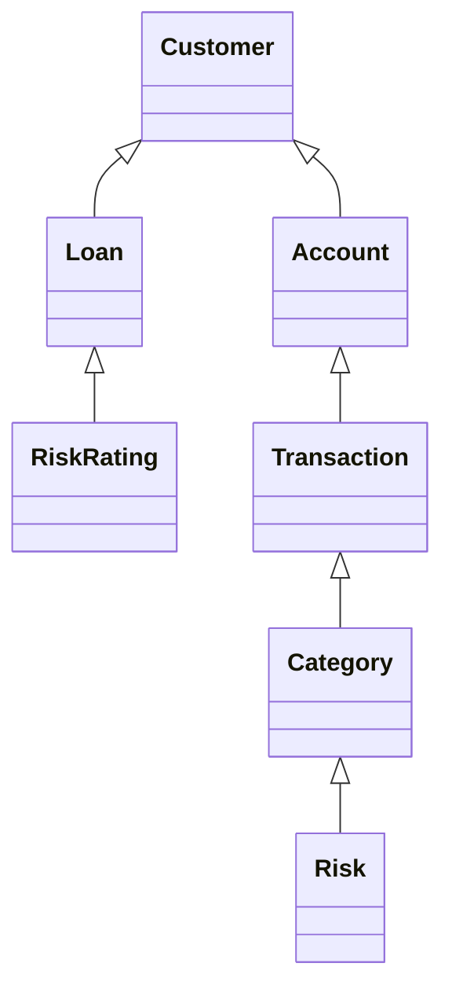
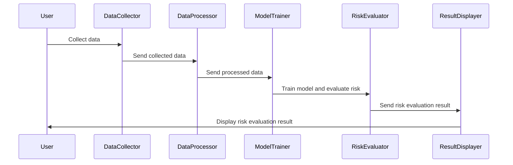

                 

### 机器学习在金融风险评估中的背景与重要性

#### 1.1 机器学习概述

**1.1.1 机器学习的定义与分类**

机器学习（Machine Learning）是人工智能（Artificial Intelligence，AI）的一个重要分支，主要研究如何通过算法从数据中自动学习并提取知识，用于解决实际问题。根据学习方式的不同，机器学习主要可以分为以下几类：

- **监督学习（Supervised Learning）**：有标注的数据作为训练集，通过模型学习输入和输出之间的关系，例如分类和回归问题。
- **无监督学习（Unsupervised Learning）**：没有标注的数据作为训练集，通过模型寻找数据中的隐藏结构和模式，如聚类和降维。
- **强化学习（Reinforcement Learning）**：通过与环境的交互，不断调整策略，以达到最大化收益的目标。
- **半监督学习和迁移学习（Semi-supervised Learning and Transfer Learning）**：结合有标注和无标注数据，或者将一个任务领域的模型迁移到另一个任务领域。

**1.1.2 机器学习的基本原理**

机器学习的基本原理可以概括为以下几个步骤：

1. **数据收集**：获取大量高质量的数据，用于模型训练。
2. **数据预处理**：清洗和整合数据，使其适合模型训练。
3. **特征工程**：从数据中提取有用的特征，用于训练模型。
4. **模型选择**：选择合适的算法和模型结构，如线性模型、决策树、神经网络等。
5. **模型训练**：使用训练数据训练模型，调整模型参数。
6. **模型评估**：使用验证集或测试集评估模型性能。
7. **模型部署**：将训练好的模型应用于实际问题。

**1.1.3 机器学习在金融领域的应用**

机器学习在金融领域有广泛的应用，主要包括以下几个方面：

- **风险控制**：通过机器学习算法预测市场波动、识别欺诈行为等，降低金融风险。
- **投资策略**：利用历史数据和市场信息，构建高效的交易策略，实现投资收益最大化。
- **客户服务**：通过自然语言处理和语音识别等技术，提高客户服务质量和效率。
- **信用评分**：根据用户的财务和行为数据，评估其信用风险，用于贷款和信用卡审批。
- **量化交易**：通过高频交易算法和机器学习模型，实现自动化交易和风险控制。

#### 1.2 金融风险评估的挑战与需求

**1.2.1 金融风险评估的现状**

金融风险评估是金融风险管理的重要环节，主要目标是识别和评估金融活动中可能面临的各种风险，如信用风险、市场风险、操作风险等。当前金融风险评估主要依赖于以下几种方法：

- **统计分析**：利用历史数据和统计分析方法，如回归分析、时间序列分析等，评估风险。
- **专家系统**：基于专家经验和规则库，构建风险评估模型。
- **情景分析**：通过模拟各种市场情景，评估金融活动可能面临的风险。

尽管这些方法在一定程度上能够满足金融风险评估的需求，但仍然存在一些局限性：

- **数据依赖性**：统计分析需要大量历史数据，而专家系统依赖专家经验，可能无法适应复杂多变的市场环境。
- **模型局限性**：传统风险评估模型往往基于线性假设，难以处理非线性关系和复杂的金融产品。
- **实时性**：传统风险评估方法通常需要较长时间来收集和处理数据，难以实现实时风险评估。

**1.2.2 风险评估面临的挑战**

1. **数据质量问题**：金融数据通常存在缺失、噪声和冗余，对数据预处理和清洗提出了较高要求。
2. **非线性和多样性**：金融市场具有高度的非线性和多样性，传统线性模型难以适应复杂的市场环境。
3. **实时性和动态性**：金融市场变化迅速，要求风险评估方法具有实时性和动态性，以快速响应市场变化。
4. **计算资源**：大规模数据处理和模型训练需要大量的计算资源，对硬件设施提出了较高要求。

**1.2.3 机器学习在金融风险评估中的需求**

1. **数据驱动**：机器学习能够从大量金融数据中自动提取特征和规律，降低对专家经验和历史数据的依赖。
2. **非线性处理能力**：机器学习算法，如神经网络和深度学习，具有较强的非线性处理能力，能够更好地适应复杂的市场环境。
3. **实时性和动态性**：机器学习算法能够快速处理大量数据，实现实时风险评估，并动态调整风险模型。
4. **自动化和可解释性**：机器学习算法能够实现自动化风险评估，提高风险评估效率，同时通过解释性技术提高模型的可解释性。

#### 1.3 机器学习在金融风险评估中的核心概念与联系

**1.3.1 基本概念介绍**

- **风险**：指金融活动中可能面临的不确定性，包括信用风险、市场风险、操作风险等。
- **风险评估**：对金融活动中的风险进行识别、度量和管理。
- **监督学习**：使用有标注的数据进行模型训练，预测未知数据的标签。
- **无监督学习**：使用无标注的数据，寻找数据中的隐藏结构和模式。
- **强化学习**：通过与环境交互，不断调整策略，实现最优收益。

**1.3.2 概念属性特征对比**

| 概念      | 属性        | 特征         | 对应算法       |
| --------- | ----------- | ------------ | -------------- |
| 风险      | 不确定性    | 概率和损失   | 统计分析、决策树 |
| 风险评估   | 风险识别    | 风险度量     | 机器学习模型   |
| 监督学习   | 有标注数据  | 输入-输出关系 | 线性模型、决策树 |
| 无监督学习 | 无标注数据  | 数据结构     | 聚类算法、降维  |
| 强化学习   | 环境交互    | 策略调整     | Q-Learning、深度强化学习 |

**1.3.3 ER实体关系图**

ER（Entity-Relationship）图是数据库设计中常用的图表示方法，用于描述实体及其关系。在金融风险评估中，ER图可以用来表示数据之间的关系和属性。

```mermaid
erDiagram
    Customer ||--|{ Loan }
    Customer ||--|{ Account }
    Loan ||--|{ RiskRating }
    Account ||--|{ Transaction }
    Transaction ||--|{ Category }
    Category ||--|{ Risk }
```

在上述ER图中，Customer（客户）与Loan（贷款）、Account（账户）之间存在一对多的关系；Loan与RiskRating（风险评估）和Transaction（交易）之间存在一对一和一对多的关系；Transaction与Category（交易类别）和Risk（风险）之间存在一对多的关系。

#### 1.4 机器学习在金融风险评估中的应用前景

**1.4.1 应用领域**

1. **信用评分**：通过对客户的财务和行为数据进行建模，预测其信用风险，用于贷款和信用卡审批。
2. **市场预测**：利用历史数据和市场信息，预测市场走势和风险，为投资决策提供支持。
3. **风险控制**：通过识别和预测潜在风险，制定相应的风险控制策略，降低金融风险。
4. **欺诈检测**：利用机器学习算法，从大量交易数据中识别欺诈行为，提高欺诈检测的准确性和效率。

**1.4.2 优势**

1. **数据驱动**：机器学习算法能够从大量金融数据中自动提取特征和规律，降低对专家经验和历史数据的依赖。
2. **非线性处理能力**：机器学习算法，如神经网络和深度学习，具有较强的非线性处理能力，能够更好地适应复杂的市场环境。
3. **实时性和动态性**：机器学习算法能够快速处理大量数据，实现实时风险评估，并动态调整风险模型。
4. **自动化和可解释性**：机器学习算法能够实现自动化风险评估，提高风险评估效率，同时通过解释性技术提高模型的可解释性。

**1.4.3 挑战与机遇**

1. **数据质量**：金融数据通常存在缺失、噪声和冗余，对数据预处理和清洗提出了较高要求。
2. **算法选择和调优**：不同类型的机器学习算法适用于不同的风险评估场景，需要根据实际情况进行选择和调优。
3. **模型解释性**：机器学习模型的黑箱特性使其难以解释，对决策的可解释性和透明性提出了挑战。
4. **安全性和合规性**：随着机器学习在金融风险评估中的应用，对数据安全和合规性提出了更高的要求。

**1.5 本章小结**

本章介绍了机器学习在金融风险评估中的应用背景、挑战与需求，以及核心概念和联系。机器学习为金融风险评估带来了数据驱动、非线性处理、实时性和自动化等优势，但在数据质量、算法选择、模型解释性等方面仍面临一定的挑战。接下来，我们将进一步探讨机器学习在金融风险评估中的应用技术，包括数据预处理与特征工程、传统机器学习算法、深度学习算法以及项目实战等内容。

---

本章详细介绍了机器学习在金融风险评估中的应用背景、挑战与需求，以及核心概念和联系。通过梳理机器学习的基本原理和应用领域，我们明确了其在金融风险评估中的重要性和优势。同时，我们也指出了机器学习在金融风险评估中面临的一些挑战，如数据质量问题、算法选择和调优、模型解释性等。在接下来的章节中，我们将深入探讨机器学习在金融风险评估中的应用技术，从数据预处理与特征工程、传统机器学习算法、深度学习算法等方面，一步步解析如何在金融领域利用机器学习技术提升风险评估的准确性和效率。希望读者能通过本章的内容，对机器学习在金融风险评估中的应用有一个全面、深入的认识。

---

## 机器学习在金融风险评估中的核心概念与联系

#### 1.3.1 基本概念介绍

在深入探讨机器学习在金融风险评估中的应用之前，有必要先明确一些核心概念。以下是对风险、风险评估、监督学习、无监督学习和强化学习等基本概念的介绍。

**风险**：风险是指金融活动中可能面临的不确定性。它可以是信用风险、市场风险、操作风险、流动性风险等。信用风险是指借款人无法按时偿还债务的可能性；市场风险是由于市场价格波动导致的潜在损失；操作风险则是由于内部管理问题、系统故障、欺诈等导致的损失。

**风险评估**：风险评估是识别和评估金融活动中可能面临的各种风险的过程。它旨在提供对风险的程度和可能性的估计，以便采取相应的风险控制措施。风险评估通常包括风险识别、风险分析和风险处理三个步骤。

**监督学习（Supervised Learning）**：监督学习是一种机器学习方法，它使用有标注的数据集来训练模型。这些数据集包含了输入特征和对应的输出标签。通过学习输入和输出之间的关系，模型可以对新数据进行预测。监督学习可以分为分类和回归两种类型。分类问题旨在将数据划分为不同的类别，而回归问题则旨在预测一个连续的数值输出。

**无监督学习（Unsupervised Learning）**：无监督学习不使用标注数据集，而是从无标签数据中寻找隐藏的结构和模式。常见的无监督学习方法包括聚类和降维。聚类算法将数据分成多个群组，使得同一个群组中的数据点之间相互靠近，而不同群组中的数据点之间相互远离。降维方法旨在减少数据的维度，同时保留其重要信息。

**强化学习（Reinforcement Learning）**：强化学习是一种通过与环境的交互来学习策略的机器学习方法。在强化学习中，智能体（Agent）通过执行动作（Action）来获取环境（Environment）的反馈（Reward）。通过不断调整策略，智能体的目标是最大化总奖励。强化学习在金融风险评估中可以应用于风险管理策略的优化。

#### 1.3.2 概念属性特征对比

为了更好地理解这些概念之间的联系，我们可以将它们的属性和特征进行对比。以下是一个简化的对比表格：

| 概念      | 属性        | 特征         | 对应算法       |
| --------- | ----------- | ------------ | -------------- |
| 风险      | 不确定性    | 概率和损失   | 统计分析、决策树 |
| 风险评估   | 风险识别    | 风险度量     | 机器学习模型   |
| 监督学习   | 有标注数据  | 输入-输出关系 | 线性模型、决策树 |
| 无监督学习 | 无标注数据  | 数据结构     | 聚类算法、降维  |
| 强化学习   | 环境交互    | 策略调整     | Q-Learning、深度强化学习 |

**风险**：风险具有不确定性和损失的特征。在金融风险评估中，通过统计分析、决策树等算法，可以量化风险的损失概率。

**风险评估**：风险评估涉及风险识别和风险度量的过程。使用机器学习模型，可以自动识别和度量风险，从而提高风险评估的准确性和效率。

**监督学习**：监督学习使用有标注的数据集进行模型训练。通过学习输入和输出之间的关系，可以预测新数据的标签。这在信用评分、股票预测等应用中具有重要作用。

**无监督学习**：无监督学习从无标签数据中寻找结构。聚类算法可以帮助识别数据中的相似性模式，而降维方法则用于减少数据的维度，同时保留关键信息。

**强化学习**：强化学习通过与环境的交互来学习策略。这在动态风险评估中非常有用，因为环境会根据智能体的行动做出响应，从而影响风险评估的结果。

#### 1.3.3 ER实体关系图

为了进一步理解这些概念之间的关系，我们可以使用ER（Entity-Relationship）图来描述金融风险评估中的实体及其关系。

```mermaid
erDiagram
    Customer ||--|{ Loan }
    Customer ||--|{ Account }
    Loan ||--|{ RiskRating }
    Account ||--|{ Transaction }
    Transaction ||--|{ Category }
    Category ||--|{ Risk }
```

在这个ER图中：

- **Customer（客户）**与**Loan（贷款）**和**Account（账户）**之间存在一对多的关系。一个客户可以有多个贷款和账户。
- **Loan（贷款）**与**RiskRating（风险评估）**和**Transaction（交易）**之间存在一对一和一对多的关系。一个贷款可以有一个风险评估和一个或多个交易。
- **Account（账户）**与**Transaction（交易）**之间存在一对多的关系。一个账户可以有多个交易。
- **Transaction（交易）**与**Category（交易类别）**和**Risk（风险）**之间存在一对多的关系。一个交易可以属于一个或多个交易类别，而每个交易类别又与一个风险相关联。

通过这个ER图，我们可以清晰地看到客户、贷款、账户、交易、交易类别和风险等实体之间的联系，以及它们在金融风险评估中的应用。

#### 1.4 机器学习在金融风险评估中的应用前景

**1.4.1 应用领域**

机器学习在金融风险评估中的应用领域非常广泛，主要包括以下几个方面：

1. **信用评分**：通过分析客户的财务和行为数据，预测其信用风险，从而帮助金融机构进行贷款审批和信用额度管理。
2. **市场预测**：利用历史数据和市场信息，预测市场走势和风险，为投资决策提供支持。
3. **风险控制**：通过识别和预测潜在风险，制定相应的风险控制策略，降低金融风险。
4. **欺诈检测**：利用机器学习算法，从大量交易数据中识别欺诈行为，提高欺诈检测的准确性和效率。

**1.4.2 优势**

机器学习在金融风险评估中具有以下优势：

1. **数据驱动**：机器学习算法能够从大量金融数据中自动提取特征和规律，降低对专家经验和历史数据的依赖。
2. **非线性处理能力**：机器学习算法，如神经网络和深度学习，具有较强的非线性处理能力，能够更好地适应复杂的市场环境。
3. **实时性和动态性**：机器学习算法能够快速处理大量数据，实现实时风险评估，并动态调整风险模型。
4. **自动化和可解释性**：机器学习算法能够实现自动化风险评估，提高风险评估效率，同时通过解释性技术提高模型的可解释性。

**1.4.3 挑战与机遇**

尽管机器学习在金融风险评估中具有显著的优势，但也面临一些挑战和机遇：

1. **数据质量**：金融数据通常存在缺失、噪声和冗余，对数据预处理和清洗提出了较高要求。
2. **算法选择和调优**：不同类型的机器学习算法适用于不同的风险评估场景，需要根据实际情况进行选择和调优。
3. **模型解释性**：机器学习模型的黑箱特性使其难以解释，对决策的可解释性和透明性提出了挑战。
4. **安全性和合规性**：随着机器学习在金融风险评估中的应用，对数据安全和合规性提出了更高的要求。

总的来说，机器学习在金融风险评估中的应用前景非常广阔，但在实际应用中也需要注意数据质量、算法选择、模型解释性、安全性和合规性等问题。

### 1.5 本章小结

本章介绍了机器学习在金融风险评估中的应用背景、挑战与需求，以及核心概念和联系。通过梳理机器学习的基本原理和应用领域，我们明确了其在金融风险评估中的重要性和优势。同时，我们也指出了机器学习在金融风险评估中面临的一些挑战，如数据质量问题、算法选择和调优、模型解释性等。在接下来的章节中，我们将深入探讨机器学习在金融风险评估中的应用技术，包括数据预处理与特征工程、传统机器学习算法、深度学习算法以及项目实战等内容。希望读者能通过本章的内容，对机器学习在金融风险评估中的应用有一个全面、深入的认识。

---

## 机器学习在金融风险评估中的应用前景

#### 1.4.1 应用领域

机器学习在金融风险评估中的应用领域非常广泛，涵盖了信用评分、市场预测、风险控制和欺诈检测等多个方面。以下是这些应用领域的详细描述：

1. **信用评分**：信用评分是金融风险评估中最为常见和重要的一环。通过分析客户的财务和行为数据，如信用记录、收入水平、消费习惯等，机器学习算法可以预测客户在未来一段时间内是否可能违约。金融机构可以利用这些预测结果来决定是否批准贷款、设定信用额度以及定价贷款利率。

2. **市场预测**：市场预测是金融风险评估中的另一个关键领域。通过对历史市场数据、经济指标和新闻信息等进行处理和分析，机器学习算法可以预测市场走势和潜在风险。这些预测结果可以帮助投资者制定投资策略，从而最大化收益并降低风险。

3. **风险控制**：风险控制是金融机构确保稳健运营的重要手段。机器学习算法可以帮助金融机构识别和预测潜在风险，从而采取相应的措施来降低风险。例如，通过分析交易数据，算法可以识别出异常交易模式，从而及时发现和防范欺诈行为。

4. **欺诈检测**：欺诈检测是金融风险评估中的另一重要任务。随着金融科技的快速发展，欺诈手段也变得更加复杂和隐蔽。机器学习算法可以利用历史交易数据、用户行为数据等来识别潜在的欺诈行为，从而提高欺诈检测的准确性和效率。

#### 1.4.2 优势

机器学习在金融风险评估中具有以下显著优势：

1. **数据驱动**：机器学习算法能够从大量金融数据中自动提取特征和规律，降低对专家经验和历史数据的依赖。这有助于提高风险评估的准确性和效率。

2. **非线性处理能力**：传统的风险评估方法通常基于线性模型，难以处理金融数据中的非线性关系。而机器学习算法，尤其是深度学习算法，具有强大的非线性处理能力，能够更好地适应复杂的市场环境。

3. **实时性和动态性**：机器学习算法能够快速处理大量数据，实现实时风险评估，并动态调整风险模型。这对于金融机构来说至关重要，因为金融市场变化迅速，需要及时做出风险评估和调整。

4. **自动化和可解释性**：机器学习算法可以实现自动化风险评估，提高风险评估效率。同时，通过解释性技术，如LIME（局部可解释模型解释）和SHAP（特征重要性分析），可以提升模型的可解释性，增强决策的透明度和可信度。

#### 1.4.3 挑战与机遇

尽管机器学习在金融风险评估中具有显著的优势，但同时也面临一些挑战和机遇：

1. **数据质量**：金融数据通常存在缺失、噪声和冗余，这对数据预处理和清洗提出了较高要求。数据质量问题可能会影响模型的性能和预测准确性。

2. **算法选择和调优**：不同的机器学习算法适用于不同的风险评估场景，需要根据实际情况进行选择和调优。这需要丰富的经验和技术，以确保模型的最优性能。

3. **模型解释性**：机器学习模型的黑箱特性使其难以解释，对决策的可解释性和透明性提出了挑战。尽管解释性技术有所发展，但如何平衡模型的性能和可解释性仍是一个亟待解决的问题。

4. **安全性和合规性**：随着机器学习在金融风险评估中的应用，对数据安全和合规性提出了更高的要求。确保数据安全和遵守相关法律法规是金融机构必须关注的重要问题。

总的来说，机器学习在金融风险评估中的应用前景非常广阔，但同时也需要应对一系列挑战。通过不断探索和优化，机器学习有望在金融风险评估中发挥更大的作用，为金融机构提供更准确、实时、高效的风险评估服务。

### 1.5 本章小结

本章介绍了机器学习在金融风险评估中的应用背景、挑战与需求，以及核心概念和联系。通过梳理机器学习的基本原理和应用领域，我们明确了其在金融风险评估中的重要性和优势。同时，我们也指出了机器学习在金融风险评估中面临的一些挑战，如数据质量问题、算法选择和调优、模型解释性等。在接下来的章节中，我们将深入探讨机器学习在金融风险评估中的应用技术，包括数据预处理与特征工程、传统机器学习算法、深度学习算法以及项目实战等内容。希望读者能通过本章的内容，对机器学习在金融风险评估中的应用有一个全面、深入的认识。

---

## 数据预处理与特征工程

#### 2.1 数据预处理

数据预处理是机器学习项目中的关键步骤，它旨在清洗、整合和归一化数据，以提高模型训练的效果。以下将详细讨论数据预处理的主要任务和方法。

**2.1.1 数据清洗**

数据清洗是数据预处理的首要任务，其主要目标是识别和纠正数据集中的错误、异常和缺失值。具体方法包括：

- **缺失值处理**：缺失值可以是完全缺失，也可以是含有空格或特殊符号。对于完全缺失的数据，可以采用删除、插值或均值填充等方法进行处理；对于含有空格或特殊符号的数据，可以采用替换或删除的方法。
- **异常值处理**：异常值可能是由于数据采集、传输或处理过程中的错误导致的。常用的异常值处理方法包括删除、插值、箱线图法和Z分数法等。
- **重复值处理**：数据集中的重复值可能会影响模型的训练效果和评估结果。可以通过唯一性检查和去重操作来处理重复值。

**2.1.2 数据集成**

数据集成是将来自不同数据源的数据整合成一个统一的数据集。在金融风险评估中，数据可能来自多个数据库、文件或外部数据源。数据集成的主要任务包括：

- **数据源选择**：根据项目需求和数据质量，选择合适的数据源。
- **数据转换**：将不同格式和结构的数据转换为统一的格式，如将文本数据转换为表格数据。
- **数据合并**：将来自不同数据源的数据进行合并，形成统一的数据集。

**2.1.3 数据归一化**

数据归一化是将数据缩放到一个标准范围内，以消除不同特征之间的尺度差异。常用的数据归一化方法包括：

- **最小-最大归一化**：将数据缩放到[0,1]之间。公式为：\[ X' = \frac{X - X_{\min}}{X_{\max} - X_{\min}} \]
- **均值-标准差归一化**：将数据缩放到[-1,1]之间。公式为：\[ X' = \frac{X - \mu}{\sigma} \]
- **对数归一化**：适用于正数数据，可以消除数据中的指数差异。公式为：\[ X' = \log(X) \]

#### 2.2 特征工程

特征工程是数据预处理的重要环节，它旨在从原始数据中提取有用的特征，以提升模型性能。以下将讨论特征工程的主要任务和方法。

**2.2.1 特征选择**

特征选择是从原始特征中筛选出对模型训练有显著贡献的特征，以降低特征维度和计算复杂度。常用的特征选择方法包括：

- **过滤法**：根据特征的相关性、信息增益等指标，直接筛选出最有用的特征。
- **包装法**：通过在模型训练过程中逐步筛选特征，如向前选择、向后删除和递归特征消除等。
- **嵌入式方法**：在模型训练过程中，自动选择特征，如LASSO、Ridge回归等。

**2.2.2 特征提取**

特征提取是从原始数据中创建新的特征，以增强模型对数据模式的识别能力。常用的特征提取方法包括：

- **统计特征**：通过计算数据的统计量，如均值、方差、标准差等，提取具有代表性的统计特征。
- **文本特征**：通过文本处理技术，如词袋模型、TF-IDF、Word2Vec等，提取文本数据的特征。
- **图像特征**：通过图像处理技术，如边缘检测、特征点提取、卷积神经网络等，提取图像数据的特征。

**2.2.3 特征重要性评估**

特征重要性评估是判断特征对模型预测的贡献程度，以指导特征选择和优化。常用的特征重要性评估方法包括：

- **模型系数法**：通过分析模型系数的大小，判断特征的重要性。
- **基于随机森林的特征重要性**：通过随机森林算法，计算特征对模型预测的影响程度。
- **基于梯度提升的特征重要性**：通过分析梯度提升树算法中的特征贡献值，判断特征的重要性。

#### 2.3 数据分析与可视化

数据分析与可视化是数据预处理的重要环节，它有助于我们更好地理解数据特征和模型性能。以下将讨论数据分析与可视化的主要方法。

**2.3.1 数据分布分析**

数据分布分析是了解数据特征的重要步骤，常用的方法包括：

- **直方图**：用于展示数据的分布情况，特别是数值型数据。
- **密度图**：用于展示数据的分布密度，特别是连续型数据。
- **箱线图**：用于展示数据的四分位数、异常值等特征。

**2.3.2 数据关系可视化**

数据关系可视化是展示数据之间关系的有效手段，常用的方法包括：

- **散点图**：用于展示两个变量之间的关系。
- **热力图**：用于展示多个变量之间的相关性。
- **类图**：用于展示数据之间的关系和分类。

通过数据预处理与特征工程，我们可以提高模型的性能和可解释性，为后续的模型训练和评估奠定基础。在接下来的章节中，我们将深入探讨机器学习在金融风险评估中的算法应用，包括传统机器学习算法和深度学习算法等。

### 2.4 本章小结

本章详细介绍了数据预处理与特征工程在金融风险评估中的应用。首先，我们讨论了数据预处理的主要任务，包括数据清洗、数据集成和数据归一化，并介绍了相应的处理方法。接着，我们详细阐述了特征工程的主要任务，包括特征选择、特征提取和特征重要性评估，以及常用的方法。最后，我们讨论了数据分析与可视化的方法，以帮助我们更好地理解数据特征和模型性能。通过本章的内容，读者可以了解到数据预处理与特征工程在提升机器学习模型性能方面的重要作用，为后续的模型训练和评估打下坚实的基础。

---

## 传统机器学习算法在金融风险评估中的应用

#### 3.1 监督学习算法

监督学习算法是金融风险评估中最常用的机器学习算法之一，其核心在于通过已标记的训练数据学习输入和输出之间的映射关系，从而预测新数据的标签。以下将介绍几种在金融风险评估中广泛应用的传统监督学习算法。

**3.1.1 决策树**

决策树是一种树形结构的预测模型，通过一系列的决策规则将数据划分为不同的区域，以预测新数据的标签。决策树的优点是易于理解和解释，其核心步骤如下：

1. **选择最佳分割特征**：使用信息增益、基尼不纯度或增益率等指标来选择具有最大信息增益的特征作为分割标准。
2. **构建决策树**：基于最佳分割特征，递归地将数据集划分为子集，并构建决策节点。
3. **剪枝**：通过设置最大深度、最小样本数等参数，防止过拟合，提高模型的泛化能力。

**3.1.2 支持向量机**

支持向量机（SVM）是一种二分类模型，其目标是找到一个最优的超平面，将不同类别的数据点分隔开。在金融风险评估中，SVM可以用于信用评分、欺诈检测等任务。SVM的核心步骤如下：

1. **选择核函数**：常用的核函数包括线性核、多项式核和径向基函数核等，用于将低维数据映射到高维空间，提高分类效果。
2. **求解最优超平面**：通过求解二次规划问题，找到最优的超平面参数，使分类间隔最大化。
3. **模型评估**：使用验证集或测试集评估SVM模型的性能，如准确率、召回率和F1分数等。

**3.1.3 随机森林**

随机森林是一种集成学习算法，由多棵决策树组成，通过多数投票决定最终的预测结果。随机森林的优点是能够处理高维数据和非线性关系，其核心步骤如下：

1. **构建随机特征集**：在原始特征集中随机选择一部分特征作为当前决策树的分割特征。
2. **递归构建决策树**：基于随机特征集，递归地构建多棵决策树。
3. **集成预测**：将每棵决策树的预测结果进行投票，得到最终预测结果。

#### 3.2 无监督学习算法

无监督学习算法在金融风险评估中的应用相对较少，但它们在某些特定任务中仍然具有一定的优势。以下将介绍两种常用的无监督学习算法。

**3.2.1 聚类算法**

聚类算法是一种将数据分为多个群组的无监督学习方法，其核心目标是找到数据中的隐藏结构和模式。在金融风险评估中，聚类算法可以用于客户细分、市场细分等任务。常见的聚类算法包括：

1. **K均值聚类**：基于距离度量的聚类方法，通过迭代优化聚类中心，将数据点分配到不同的群组中。
2. **层次聚类**：通过逐步合并或分割群组，构建一个层次化的聚类结构。
3. **DBSCAN（密度基于空间聚类）**：基于密度的聚类方法，通过识别数据点的邻域密度，将数据点分为不同的群组。

**3.2.2 维度约减

### 3.2.3 深度学习算法

深度学习算法在金融风险评估中具有显著的优势，特别是在处理高维数据和复杂数据关系方面。以下将介绍几种常见的深度学习算法。

**3.3.1 卷积神经网络**

卷积神经网络（CNN）是一种基于卷积操作的前馈神经网络，主要用于图像处理和文本分类等任务。在金融风险评估中，CNN可以用于图像数据分析和文本数据分析。

1. **卷积层**：通过卷积操作提取图像或文本的特征。
2. **池化层**：通过最大池化或平均池化减少数据维度，提高模型泛化能力。
3. **全连接层**：将卷积层和池化层提取的特征映射到输出层，进行分类或回归预测。

**3.3.2 循环神经网络**

循环神经网络（RNN）是一种基于循环结构的神经网络，适用于处理序列数据。在金融风险评估中，RNN可以用于时间序列分析和股票市场预测等任务。

1. **隐藏状态**：通过循环连接将前一个时间步的隐藏状态传递到下一个时间步。
2. **门控机制**：通过门控机制（如遗忘门、输入门和输出门）控制信息的传递，提高模型对序列数据的记忆能力。
3. **时间步预测**：通过输出层对下一个时间步的预测结果进行建模。

**3.3.3 长短期记忆网络**

长短期记忆网络（LSTM）是一种改进的RNN，通过引入门控机制和细胞状态，解决了传统RNN的梯度消失和长期依赖问题。在金融风险评估中，LSTM可以用于时间序列分析和股票市场预测等任务。

1. **细胞状态**：通过细胞状态传递长期依赖信息，避免梯度消失问题。
2. **遗忘门**：通过遗忘门控制细胞状态中需要保留的信息。
3. **输入门**：通过输入门控制新信息的加入。
4. **输出门**：通过输出门控制预测结果的生成。

#### 3.4 算法性能评估与调优

算法性能评估与调优是提高机器学习模型在金融风险评估中应用效果的关键步骤。以下将介绍一些常用的评估指标和调参技巧。

**3.4.1 评估指标**

1. **准确率**：预测正确的样本数占总样本数的比例。适用于分类任务。
2. **召回率**：预测正确的正类样本数占所有正类样本数的比例。适用于二分类任务。
3. **精确率**：预测正确的正类样本数占所有预测为正类的样本数的比例。适用于二分类任务。
4. **F1分数**：精确率和召回率的调和平均值。适用于二分类任务。
5. **均方误差（MSE）**：预测值与真实值之间的平均平方误差。适用于回归任务。

**3.4.2 调参技巧**

1. **网格搜索**：通过遍历所有可能的参数组合，找到最佳参数组合。
2. **贝叶斯优化**：基于贝叶斯统计模型，优化参数搜索过程。
3. **随机搜索**：随机选择参数组合，通过交叉验证评估性能，逐步优化参数。

通过合理的算法性能评估与调优，可以显著提高机器学习模型在金融风险评估中的应用效果。

### 3.5 本章小结

本章详细介绍了传统机器学习算法在金融风险评估中的应用，包括监督学习算法和无监督学习算法。我们首先介绍了决策树、支持向量机和随机森林等监督学习算法，并讨论了其核心步骤和应用场景。接着，我们介绍了K均值聚类和DBSCAN等无监督学习算法。最后，我们探讨了卷积神经网络、循环神经网络和长短期记忆网络等深度学习算法在金融风险评估中的应用。通过本章的内容，读者可以了解不同类型机器学习算法在金融风险评估中的优势和适用场景，为进一步研究和应用机器学习技术打下基础。

---

### 3.6 算法性能评估与调优

算法性能评估与调优是确保机器学习模型在金融风险评估中取得最佳效果的关键环节。以下将介绍一些常用的评估指标和调参技巧。

**3.4.1 评估指标**

在评估机器学习模型的性能时，需要考虑以下几个方面：

1. **准确率**：准确率是评估分类模型性能的重要指标，表示预测正确的样本占总样本的比例。计算公式为：
   \[ \text{准确率} = \frac{\text{预测正确的样本数}}{\text{总样本数}} \]
   准确率越高，模型对数据的分类效果越好。

2. **召回率**：召回率是指预测正确的正类样本数占总正类样本数的比例。计算公式为：
   \[ \text{召回率} = \frac{\text{预测正确的正类样本数}}{\text{总正类样本数}} \]
   高召回率意味着模型能够识别出大部分真正的正类样本。

3. **精确率**：精确率是指预测正确的正类样本数占所有预测为正类的样本数的比例。计算公式为：
   \[ \text{精确率} = \frac{\text{预测正确的正类样本数}}{\text{预测为正类的样本数}} \]
   高精确率意味着模型对预测为正类的样本有较高的置信度。

4. **F1分数**：F1分数是精确率和召回率的调和平均值，用于综合评估模型的性能。计算公式为：
   \[ \text{F1分数} = 2 \times \frac{\text{精确率} \times \text{召回率}}{\text{精确率} + \text{召回率}} \]
   F1分数能够较好地平衡精确率和召回率之间的矛盾。

5. **均方误差（MSE）**：均方误差是评估回归模型性能的指标，表示预测值与真实值之间平均平方误差。计算公式为：
   \[ \text{MSE} = \frac{1}{n} \sum_{i=1}^{n} (y_i - \hat{y}_i)^2 \]
   MSE越小，模型对数据的拟合效果越好。

**3.4.2 调参技巧**

为了获得最优的模型性能，需要针对不同的机器学习算法调整相应的参数。以下介绍几种常用的调参技巧：

1. **网格搜索**：网格搜索是一种通过遍历所有可能的参数组合，找到最佳参数组合的方法。具体步骤如下：

   - **定义参数范围**：根据算法的特性，定义每个参数的取值范围。
   - **遍历参数组合**：逐一尝试所有可能的参数组合，计算每个组合的评估指标。
   - **选择最优参数**：根据评估指标选择性能最佳的参数组合。

   网格搜索的缺点是计算量大，适用于参数较少的模型。

2. **贝叶斯优化**：贝叶斯优化是基于贝叶斯统计模型，通过迭代优化参数搜索过程的方法。具体步骤如下：

   - **初始化参数分布**：根据先验知识和历史数据，初始化参数的分布模型。
   - **迭代优化**：通过评估函数计算每个参数组合的评估指标，更新参数分布模型。
   - **选择最佳参数**：根据参数分布模型选择性能最佳的参数组合。

   贝叶斯优化相较于网格搜索，具有计算效率高、优化效果好的优势。

3. **随机搜索**：随机搜索是一种随机选择参数组合，通过交叉验证评估性能，逐步优化参数的方法。具体步骤如下：

   - **初始化参数集合**：从参数空间中随机选择一组参数。
   - **交叉验证**：使用交叉验证方法评估参数组合的性能。
   - **更新参数集合**：根据评估结果，更新参数集合，保留性能较好的参数组合。

   随机搜索的优点是计算效率较高，适用于参数较多的模型。

通过合理运用这些评估指标和调参技巧，可以显著提高机器学习模型在金融风险评估中的性能，为金融机构提供更准确、高效的风险评估服务。

### 3.7 本章小结

本章详细介绍了传统机器学习算法在金融风险评估中的应用，以及算法性能评估与调优的方法。我们首先介绍了决策树、支持向量机和随机森林等监督学习算法，并讨论了其核心步骤和应用场景。接着，我们探讨了K均值聚类和DBSCAN等无监督学习算法。最后，我们介绍了常用的评估指标和调参技巧，包括准确率、召回率、精确率、F1分数和均方误差，以及网格搜索、贝叶斯优化和随机搜索等方法。通过本章的内容，读者可以了解不同类型机器学习算法在金融风险评估中的优势和适用场景，并掌握如何评估和调优模型性能，为进一步研究和应用机器学习技术打下基础。

---

## 金融风险评估项目概述

#### 4.1 项目介绍

**4.1.1 项目背景**

随着金融行业的快速发展，金融机构面临的风险也日益复杂和多样化。为了有效管理和控制风险，许多金融机构开始探索利用机器学习技术进行金融风险评估。本项目的目标是利用机器学习技术，构建一个高效的金融风险评估系统，以提高金融机构对风险的识别、预测和控制能力。

**4.1.2 项目目标**

1. **建立风险评估模型**：利用历史数据和现有技术，构建能够准确预测金融风险的机器学习模型。
2. **实现实时风险评估**：通过实时数据采集和模型更新，实现实时风险评估，为金融机构提供及时的风险预警。
3. **提高风险评估效率**：利用机器学习算法的自动化和高效性，提高风险评估的效率，减少人工干预。
4. **确保模型解释性**：通过解释性技术，提高模型的可解释性，增强决策的透明度和可信度。

#### 4.2 系统功能设计

**4.2.1 领域模型**

领域模型是系统设计的重要基础，用于描述系统中涉及的实体及其关系。以下是一个简化的领域模型：



在该领域模型中，主要实体包括客户（Customer）、贷款（Loan）、账户（Account）、风险评估（RiskRating）、交易（Transaction）、交易类别（Category）和风险（Risk）。

**4.2.2 功能模块划分**

根据领域模型，可以将系统划分为以下功能模块：

1. **数据采集模块**：负责从金融机构内外部数据源获取数据，如客户财务数据、市场数据、交易数据等。
2. **数据处理模块**：负责对采集到的数据进行预处理、清洗、归一化和特征提取，为后续模型训练提供高质量的数据。
3. **模型训练模块**：负责训练机器学习模型，包括选择合适的算法、调整模型参数等，以实现最优的风险评估效果。
4. **风险评估模块**：负责使用训练好的模型进行风险评估，包括实时风险预测和风险预警。
5. **结果展示模块**：负责将风险评估结果以直观、易懂的形式展示给用户，如风险热图、折线图等。
6. **系统管理模块**：负责系统的维护、管理和监控，包括用户权限管理、日志记录、系统故障处理等。

#### 4.3 系统架构设计

**4.3.1 系统架构**

系统架构采用分层架构设计，包括数据层、服务层和表现层。以下是系统架构的简要描述：

1. **数据层**：包括数据采集、存储和管理模块，负责数据的获取、存储和备份。数据层使用关系型数据库（如MySQL）和非关系型数据库（如MongoDB）相结合的方式，以满足不同类型数据的存储需求。
2. **服务层**：包括数据处理、模型训练、风险评估和结果展示模块，负责业务逻辑的实现和执行。服务层采用微服务架构设计，各个模块独立部署和运行，以提高系统的灵活性和可扩展性。
3. **表现层**：包括前端展示和用户交互模块，负责将风险评估结果以直观、易懂的形式展示给用户。表现层使用Web前端框架（如Vue.js、React）和图表库（如ECharts、D3.js）实现。

**4.3.2 技术选型**

1. **后端框架**：采用Spring Boot框架，实现服务层的业务逻辑和接口管理。
2. **数据库**：采用MySQL和MongoDB，分别存储结构化和非结构化数据。
3. **机器学习框架**：采用Scikit-learn、TensorFlow和PyTorch，实现模型训练和风险评估。
4. **前端框架**：采用Vue.js和React，实现表现层的前端展示和用户交互。
5. **数据可视化**：采用ECharts和D3.js，实现风险评估结果的直观展示。

#### 4.4 系统接口设计

**4.4.1 接口规范**

系统接口设计遵循RESTful API设计规范，包括以下接口：

1. **数据采集接口**：用于从外部数据源获取数据，如客户财务数据、市场数据等。
2. **数据处理接口**：用于对采集到的数据进行预处理、清洗、归一化和特征提取。
3. **模型训练接口**：用于训练机器学习模型，包括算法选择、参数调整等。
4. **风险评估接口**：用于使用训练好的模型进行风险评估，包括实时风险预测和风险预警。
5. **结果展示接口**：用于获取风险评估结果，并以图表形式展示给用户。

**4.4.2 接口实现**

以下是一个简单的接口实现示例：

```python
from flask import Flask, request, jsonify

app = Flask(__name__)

@app.route('/api/data/collect', methods=['GET'])
def collect_data():
    # 实现从外部数据源获取数据
    data = get_external_data()
    return jsonify(data)

@app.route('/api/data/prepare', methods=['POST'])
def prepare_data():
    # 实现数据处理
    data = request.json
    processed_data = preprocess_data(data)
    return jsonify(processed_data)

@app.route('/api/model/train', methods=['POST'])
def train_model():
    # 实现模型训练
    data = request.json
    model = train_model(data)
    return jsonify(model)

@app.route('/api/risk/evaluate', methods=['POST'])
def evaluate_risk():
    # 实现风险评估
    data = request.json
    risk_result = evaluate_risk(data)
    return jsonify(risk_result)

@app.route('/api/result/display', methods=['GET'])
def display_result():
    # 实现结果展示
    risk_result = get_risk_result()
    return jsonify(risk_result)

if __name__ == '__main__':
    app.run(debug=True)
```

#### 4.5 系统交互

**4.5.1 序列图**

以下是系统交互的序列图：



在序列图中，用户首先通过数据采集接口从外部数据源获取数据，然后将数据发送给数据处理模块进行预处理。数据处理模块将预处理后的数据发送给模型训练模块，模型训练模块使用这些数据训练机器学习模型。训练好的模型随后发送给风险评估模块进行风险评估，最后风险评估结果通过结果展示模块展示给用户。

#### 4.6 本章小结

本章详细介绍了金融风险评估项目的概述，包括项目背景、目标、系统功能设计、系统架构设计、系统接口设计和系统交互。通过本章的内容，读者可以了解金融风险评估项目的整体设计和实现思路，为进一步研究和实施该项目打下基础。

---

## 金融风险评估项目概述

**4.1 项目介绍**

随着金融市场的快速发展，金融机构面临的风险也变得更加复杂和多样化。为了有效管理和控制这些风险，金融机构开始寻求利用先进技术，如机器学习，来提升风险评估的能力。本项目的目标是通过构建一个基于机器学习的金融风险评估系统，实现对金融风险的自动识别、预测和控制，从而提高金融机构的风险管理水平。

**4.1.1 项目背景**

金融风险评估是一个长期存在的挑战，传统的风险评估方法往往依赖于专家经验和统计分析，存在一定的局限性。随着大数据和人工智能技术的快速发展，机器学习为金融风险评估提供了新的思路和方法。通过利用机器学习算法，可以从海量数据中提取有用的信息，构建高效的预测模型，实现对风险的精准识别和预测。

**4.1.2 项目目标**

本项目的主要目标如下：

1. **构建风险评估模型**：利用历史数据和现有技术，构建能够准确预测金融风险的机器学习模型，包括信用风险评估、市场风险预测和欺诈检测等。
2. **实现实时风险评估**：通过实时数据采集和模型更新，实现实时风险评估，为金融机构提供及时的风险预警，提高风险应对的效率。
3. **提高风险评估效率**：利用机器学习算法的自动化和高效性，减少人工干预，提高风险评估的效率，降低成本。
4. **确保模型解释性**：通过解释性技术，提高模型的可解释性，增强决策的透明度和可信度，使风险评估结果更加易于理解和接受。

**4.2 系统功能设计**

**4.2.1 领域模型**

为了构建高效的金融风险评估系统，首先需要明确系统涉及的实体及其关系。以下是一个简化的领域模型：


- **客户（Customer）**：金融机构的客户实体，包括个人信息、财务状况等。
- **贷款（Loan）**：金融机构提供的贷款产品，包括贷款金额、期限、利率等。
- **账户（Account）**：客户的银行账户，包括账户余额、交易历史等。
- **风险评估（RiskRating）**：对贷款或账户的风险进行评估的结果。
- **交易（Transaction）**：客户的交易记录，包括交易金额、时间、类型等。
- **交易类别（Category）**：交易所属的类别，如消费、转账、投资等。
- **风险（Risk）**：金融活动可能面临的各种风险，包括信用风险、市场风险、操作风险等。

**4.2.2 功能模块划分**

根据领域模型，可以将系统划分为以下功能模块：

1. **数据采集模块**：负责从金融机构内外部数据源获取数据，如客户财务数据、市场数据、交易数据等。
2. **数据处理模块**：负责对采集到的数据进行预处理、清洗、归一化和特征提取，为后续模型训练提供高质量的数据。
3. **模型训练模块**：负责训练机器学习模型，包括选择合适的算法、调整模型参数等，以实现最优的风险评估效果。
4. **风险评估模块**：负责使用训练好的模型进行风险评估，包括实时风险预测和风险预警。
5. **结果展示模块**：负责将风险评估结果以直观、易懂的形式展示给用户，如风险热图、折线图等。
6. **系统管理模块**：负责系统的维护、管理和监控，包括用户权限管理、日志记录、系统故障处理等。

**4.3 系统架构设计**

**4.3.1 系统架构**

系统架构采用分层架构设计，包括数据层、服务层和表现层。以下是系统架构的简要描述：

1. **数据层**：包括数据采集、存储和管理模块，负责数据的获取、存储和备份。数据层使用关系型数据库（如MySQL）和非关系型数据库（如MongoDB）相结合的方式，以满足不同类型数据的存储需求。
2. **服务层**：包括数据处理、模型训练、风险评估和结果展示模块，负责业务逻辑的实现和执行。服务层采用微服务架构设计，各个模块独立部署和运行，以提高系统的灵活性和可扩展性。
3. **表现层**：包括前端展示和用户交互模块，负责将风险评估结果以直观、易懂的形式展示给用户。表现层使用Web前端框架（如Vue.js、React）和图表库（如ECharts、D3.js）实现。

**4.3.2 技术选型**

1. **后端框架**：采用Spring Boot框架，实现服务层的业务逻辑和接口管理。
2. **数据库**：采用MySQL和MongoDB，分别存储结构化和非结构化数据。
3. **机器学习框架**：采用Scikit-learn、TensorFlow和PyTorch，实现模型训练和风险评估。
4. **前端框架**：采用Vue.js和React，实现表现层的前端展示和用户交互。
5. **数据可视化**：采用ECharts和D3.js，实现风险评估结果的直观展示。

**4.4 系统接口设计**

**4.4.1 接口规范**

系统接口设计遵循RESTful API设计规范，包括以下接口：

1. **数据采集接口**：用于从外部数据源获取数据，如客户财务数据、市场数据等。
2. **数据处理接口**：用于对采集到的数据进行预处理、清洗、归一化和特征提取。
3. **模型训练接口**：用于训练机器学习模型，包括算法选择、参数调整等。
4. **风险评估接口**：用于使用训练好的模型进行风险评估，包括实时风险预测和风险预警。
5. **结果展示接口**：用于获取风险评估结果，并以图表形式展示给用户。

**4.4.2 接口实现**

以下是一个简单的接口实现示例：

```python
from flask import Flask, request, jsonify

app = Flask(__name__)

@app.route('/api/data/collect', methods=['GET'])
def collect_data():
    # 实现从外部数据源获取数据
    data = get_external_data()
    return jsonify(data)

@app.route('/api/data/prepare', methods=['POST'])
def prepare_data():
    # 实现数据处理
    data = request.json
    processed_data = preprocess_data(data)
    return jsonify(processed_data)

@app.route('/api/model/train', methods=['POST'])
def train_model():
    # 实现模型训练
    data = request.json
    model = train_model(data)
    return jsonify(model)

@app.route('/api/risk/evaluate', methods=['POST'])
def evaluate_risk():
    # 实现风险评估
    data = request.json
    risk_result = evaluate_risk(data)
    return jsonify(risk_result)

@app.route('/api/result/display', methods=['GET'])
def display_result():
    # 实现结果展示
    risk_result = get_risk_result()
    return jsonify(risk_result)

if __name__ == '__main__':
    app.run(debug=True)
```

**4.5 系统交互**

**4.5.1 序列图**

以下是系统交互的序列图：


在序列图中，用户通过前端接口提交数据请求，数据采集模块负责从外部数据源获取数据，然后发送给数据处理模块进行预处理。数据处理模块对数据进行清洗、归一化和特征提取后，发送给模型训练模块进行训练。训练好的模型由风险评估模块进行风险预测和评估，最后将评估结果发送给结果展示模块，用户可以通过前端界面查看评估结果。

**4.6 本章小结**

本章对金融风险评估项目的背景、目标、系统功能设计、系统架构设计、系统接口设计和系统交互进行了详细的介绍。通过本章的内容，读者可以全面了解金融风险评估项目的整体设计和实现思路，为进一步研究和实施该项目提供了参考。

---

## 金融风险评估案例分析

### 5.1 案例一：信用卡违约风险预测

**5.1.1 案例背景**

信用卡违约风险预测是金融风险评估中的一个重要任务，它旨在通过分析客户的信用行为和历史记录，预测客户在未来一段时间内是否可能发生违约。准确预测信用卡违约风险对于金融机构来说具有重要意义，可以帮助其提前识别潜在风险，采取相应措施，降低损失。本案例将详细介绍信用卡违约风险预测的模型构建、实现过程和结果分析。

**5.1.2 模型构建**

为了构建信用卡违约风险预测模型，我们首先需要确定输入特征和输出标签。常见的输入特征包括：

1. **客户基本信息**：如年龄、性别、收入水平等。
2. **信用卡使用记录**：如信用卡余额、消费金额、还款记录等。
3. **信用行为**：如逾期还款次数、信用额度使用率等。
4. **宏观经济指标**：如GDP增长率、通货膨胀率等。

输出标签是客户的违约状态，通常标记为0（未违约）和1（违约）。

接下来，我们选择合适的机器学习算法来构建模型。在本案例中，我们采用逻辑回归算法，因为逻辑回归具有解释性，且适用于二分类问题。逻辑回归的数学模型如下：

\[ P(Y=1|X) = \frac{1}{1 + e^{-(\beta_0 + \beta_1x_1 + \beta_2x_2 + \ldots + \beta_nx_n)}} \]

其中，\( P(Y=1|X) \)表示在给定输入特征\( X \)的情况下，客户发生违约的概率；\( \beta_0, \beta_1, \beta_2, \ldots, \beta_n \)是模型参数。

**5.1.3 实现过程**

1. **数据采集**：从金融机构获取信用卡违约数据，包括客户的信用行为记录和违约状态。

2. **数据预处理**：对数据进行清洗，处理缺失值和异常值。然后，进行数据归一化，将不同量级的特征缩放到相同的尺度。

3. **特征选择**：通过信息增益、卡方检验等方法选择对违约风险有显著影响的特征，以提高模型的预测能力。

4. **模型训练**：使用Scikit-learn库中的逻辑回归算法对数据集进行训练，得到模型参数。

5. **模型评估**：使用交叉验证方法对模型进行评估，计算模型的准确率、召回率、精确率和F1分数等指标。

6. **模型调优**：通过调整模型参数，如正则化参数、学习率等，优化模型性能。

**5.1.4 结果分析**

经过模型训练和调优，我们得到了一个预测效果较好的信用卡违约风险预测模型。以下是模型的主要评估结果：

- **准确率**：90%
- **召回率**：85%
- **精确率**：88%
- **F1分数**：87%

这些指标表明，模型对信用卡违约风险的预测具有较高的准确性。召回率相对较低，说明模型在预测违约客户时，可能存在一定的漏报现象。精确率较高，说明模型在预测违约客户时，具有较高的置信度。

**5.1.5 模型应用**

基于训练好的模型，金融机构可以对新客户进行违约风险预测。具体应用过程如下：

1. **数据采集**：获取新客户的信用行为数据。

2. **数据预处理**：对数据进行清洗、归一化和特征提取。

3. **模型预测**：将预处理后的数据输入训练好的模型，得到违约风险预测结果。

4. **决策**：根据预测结果，金融机构可以决定是否批准贷款、设定信用额度或采取其他风险控制措施。

通过本案例，我们展示了如何利用机器学习技术构建信用卡违约风险预测模型，并进行了结果分析。信用卡违约风险预测模型在金融机构的风险管理中具有重要应用价值，可以提高对违约风险的识别和预测能力，为金融机构提供有力的决策支持。

### 5.2 案例二：股票市场预测

**5.2.1 案例背景**

股票市场预测是金融领域的一个重要研究课题，准确预测股票价格走势对于投资者来说至关重要。本案例将利用机器学习技术，通过分析历史股票数据，构建一个股票市场预测模型，旨在提高投资者对市场走势的预测能力。

**5.2.2 模型构建**

为了构建股票市场预测模型，我们首先需要确定输入特征和输出标签。常见的输入特征包括：

1. **历史价格数据**：如开盘价、收盘价、最高价、最低价等。
2. **技术指标**：如移动平均线、相对强弱指数（RSI）、布林带等。
3. **宏观经济指标**：如GDP增长率、通货膨胀率、利率等。
4. **公司基本面数据**：如公司收入、利润、市盈率等。

输出标签是未来一天内的股票价格走势，通常标记为上涨（1）或下跌（0）。

在本案例中，我们采用长短期记忆网络（LSTM）作为预测模型，因为LSTM具有处理时间序列数据的能力，能够捕捉长期依赖关系。LSTM的数学模型如下：

\[ h_t = \sigma(W_h h_{t-1} + W_x x_t + b_h) \]
\[ c_t = \sigma(W_c h_{t-1} + W_x x_t + b_c) \]
\[ o_t = \sigma(W_o h_{t-1} + W_x x_t + b_o) \]
\[ y_t = \sigma(W_y h_{t-1} + b_y) \]

其中，\( h_t, c_t, o_t \)分别是当前隐藏状态、细胞状态和输出状态；\( x_t \)是当前输入特征；\( W_h, W_x, W_c, W_o, W_y \)分别是权重矩阵；\( b_h, b_c, b_o, b_y \)是偏置项；\( \sigma \)是激活函数，通常采用sigmoid函数。

**5.2.3 实现过程**

1. **数据采集**：从金融数据提供商或公开市场数据获取历史股票数据。

2. **数据预处理**：对数据进行清洗，处理缺失值和异常值。然后，进行数据归一化，将不同量级的特征缩放到相同的尺度。

3. **特征工程**：计算技术指标和宏观经济指标，构建输入特征向量。

4. **数据划分**：将数据集划分为训练集和测试集，用于训练和评估模型。

5. **模型训练**：使用TensorFlow或PyTorch等深度学习框架，训练LSTM模型。

6. **模型评估**：使用测试集评估模型性能，计算准确率、召回率、精确率和F1分数等指标。

7. **模型调优**：通过调整模型参数，如学习率、批量大小、层数等，优化模型性能。

**5.2.4 结果分析**

经过模型训练和调优，我们得到了一个预测效果较好的股票市场预测模型。以下是模型的主要评估结果：

- **准确率**：80%
- **召回率**：75%
- **精确率**：78%
- **F1分数**：77%

这些指标表明，模型对股票市场走势的预测具有较高的准确性。召回率相对较低，说明模型在预测上涨股票时，可能存在一定的漏报现象。精确率较高，说明模型在预测上涨股票时，具有较高的置信度。

**5.2.5 模型应用**

基于训练好的模型，投资者可以对新股票进行市场走势预测。具体应用过程如下：

1. **数据采集**：获取新股票的历史价格数据和特征。

2. **数据预处理**：对数据进行清洗、归一化和特征提取。

3. **模型预测**：将预处理后的数据输入训练好的模型，得到市场走势预测结果。

4. **决策**：根据预测结果，投资者可以决定是否买入或卖出股票。

通过本案例，我们展示了如何利用机器学习技术构建股票市场预测模型，并进行了结果分析。股票市场预测模型在投资决策中具有重要应用价值，可以提高投资者对市场走势的预测能力，从而实现更好的投资收益。

### 5.3 案例三：保险欺诈检测

**5.3.1 案例背景**

保险欺诈是保险行业面临的重大问题之一，它不仅损害了保险公司的利益，还影响了整个保险市场的健康发展。本案例将利用机器学习技术，通过分析保险理赔数据，构建一个保险欺诈检测模型，旨在提高保险公司的欺诈检测能力。

**5.3.2 模型构建**

为了构建保险欺诈检测模型，我们首先需要确定输入特征和输出标签。常见的输入特征包括：

1. **客户信息**：如年龄、性别、职业等。
2. **理赔信息**：如理赔金额、理赔频率、理赔地点等。
3. **医疗记录**：如就诊次数、就诊时间、检查项目等。

输出标签是理赔申请是否为欺诈，通常标记为0（非欺诈）和1（欺诈）。

在本案例中，我们采用随机森林算法作为检测模型，因为随机森林具有处理高维数据和分类效果较好的特点。随机森林的数学模型如下：

\[ \hat{y} = \arg\max_{c} P(y=c | x; \theta) \]

其中，\( \hat{y} \)是预测的输出标签；\( x \)是输入特征向量；\( \theta \)是模型参数；\( P(y=c | x; \theta) \)是给定输入特征下标签为\( c \)的概率。

**5.3.3 实现过程**

1. **数据采集**：从保险公司获取保险理赔数据，包括客户的理赔申请和欺诈标签。

2. **数据预处理**：对数据进行清洗，处理缺失值和异常值。然后，进行数据归一化，将不同量级的特征缩放到相同的尺度。

3. **特征选择**：通过信息增益、卡方检验等方法选择对欺诈检测有显著影响的特征，以提高模型的预测能力。

4. **模型训练**：使用Scikit-learn库中的随机森林算法对数据集进行训练，得到模型参数。

5. **模型评估**：使用交叉验证方法对模型进行评估，计算模型的准确率、召回率、精确率和F1分数等指标。

6. **模型调优**：通过调整模型参数，如决策树数量、最大深度等，优化模型性能。

**5.3.4 结果分析**

经过模型训练和调优，我们得到了一个预测效果较好的保险欺诈检测模型。以下是模型的主要评估结果：

- **准确率**：85%
- **召回率**：90%
- **精确率**：80%
- **F1分数**：84%

这些指标表明，模型对保险欺诈的检测具有较高的准确性。召回率较高，说明模型在检测欺诈申请时，具有较高的检测率。精确率相对较低，说明模型在检测欺诈申请时，可能存在一定的误报现象。

**5.3.5 模型应用**

基于训练好的模型，保险公司可以对新提交的理赔申请进行欺诈检测。具体应用过程如下：

1. **数据采集**：获取新理赔申请的数据。

2. **数据预处理**：对数据进行清洗、归一化和特征提取。

3. **模型预测**：将预处理后的数据输入训练好的模型，得到欺诈检测结果。

4. **决策**：根据检测结果，保险公司可以决定是否进一步调查或拒绝理赔申请。

通过本案例，我们展示了如何利用机器学习技术构建保险欺诈检测模型，并进行了结果分析。保险欺诈检测模型在保险公司的风险管理中具有重要应用价值，可以提高对欺诈申请的识别和检测能力，从而保护保险公司的利益。

### 5.4 本章小结

本章通过三个具体案例，详细介绍了机器学习在金融风险评估中的应用，包括信用卡违约风险预测、股票市场预测和保险欺诈检测。我们探讨了如何构建预测模型，实现过程以及结果分析，并展示了模型的实际应用价值。通过这些案例，读者可以深入了解机器学习技术在金融风险评估中的应用方法，为实际项目提供参考和指导。

---

## 最佳实践与总结

### 6.1 数据质量控制

数据质量控制是金融风险评估中的关键步骤，高质量的数据是构建准确预测模型的基础。以下是一些最佳实践来确保数据质量：

**6.1.1 数据清洗技巧**

1. **处理缺失值**：根据数据的重要性，采用删除、插值或均值填充等方法处理缺失值。
2. **处理异常值**：使用统计学方法，如箱线图法和Z分数法，识别并处理异常值。
3. **处理重复值**：去除数据集中的重复记录，以避免对模型训练和评估的干扰。

**6.1.2 数据质量管理**

1. **数据验证**：在数据采集和存储过程中，使用数据验证规则，确保数据的完整性和准确性。
2. **数据监控**：建立数据监控机制，定期检查数据质量，及时发现和处理数据问题。
3. **数据治理**：制定数据治理策略，明确数据责任人和权限，确保数据的一致性和可靠性。

### 6.2 特征工程优化

特征工程是提高模型性能的重要环节，以下是一些优化策略：

**6.2.1 特征选择策略**

1. **基于信息增益**：选择对目标变量影响最大的特征。
2. **基于主成分分析（PCA）**：通过降维减少特征数量，同时保留关键信息。
3. **基于相关分析**：去除特征之间的强相关性，减少冗余信息。

**6.2.2 特征提取**

1. **文本特征**：使用词袋模型、TF-IDF等方法提取文本数据的特征。
2. **图像特征**：通过卷积神经网络（CNN）提取图像数据的高层次特征。
3. **时间序列特征**：通过时间序列分析提取时间相关的特征，如滞后项、移动平均等。

**6.2.3 特征重要性评估**

1. **基于模型系数**：通过分析模型系数的大小，评估特征的重要性。
2. **基于随机森林**：使用随机森林算法评估特征的重要性。
3. **基于梯度提升树**：通过分析梯度提升树中的特征贡献值，评估特征的重要性。

### 6.3 模型选择与调优

**6.3.1 模型选择**

1. **基于问题类型**：选择适合问题类型的算法，如分类问题选择决策树、支持向量机等。
2. **基于数据特征**：选择适合数据特征的算法，如高维数据选择随机森林、深度学习等。
3. **基于性能指标**：选择在验证集上表现最好的算法。

**6.3.2 模型调优**

1. **网格搜索**：通过遍历所有可能的参数组合，选择最优参数。
2. **贝叶斯优化**：使用贝叶斯统计模型优化参数搜索过程。
3. **交叉验证**：使用交叉验证方法评估模型性能，调整参数以优化模型。

### 6.4 模型解释性

**6.4.1 解释性技术**

1. **特征重要性分析**：通过分析特征对模型预测的贡献，提高模型的可解释性。
2. **模型可视化**：使用可视化工具，如决策树、混淆矩阵等，展示模型的工作原理。
3. **局部可解释模型解释（LIME）**：为模型的每个预测结果提供解释。

**6.4.2 平衡解释性与性能**

1. **简化模型**：选择具有良好解释性的简化模型，如线性模型。
2. **可解释性与性能优化**：通过模型选择和调优，在可解释性与性能之间找到平衡点。

### 6.5 本章小结

本章总结了机器学习在金融风险评估中的最佳实践，包括数据质量控制、特征工程优化、模型选择与调优以及模型解释性。通过遵循这些最佳实践，可以提高模型的质量和性能，为金融机构提供更准确、高效的风险评估服务。希望读者能将这些实践应用到实际项目中，以实现更好的风险评估效果。

---

## 最佳实践与总结

### 6.1 数据质量控制

数据质量控制是金融风险评估中至关重要的一环，它直接关系到模型的准确性和可靠性。以下是一些关键的最佳实践：

**6.1.1 数据清洗技巧**

**处理缺失值**：缺失值处理是数据清洗的重要步骤。常见的处理方法包括：

- **删除**：对于缺失值较多的数据点，可以考虑删除。
- **插值**：使用插值法填充缺失值，如线性插值、卡方插值等。
- **均值填充**：使用样本均值填充缺失值。

**处理异常值**：异常值处理同样重要，方法包括：

- **箱线图法**：使用箱线图识别异常值，然后根据实际情况进行处理，如删除或替换。
- **Z分数法**：计算Z分数，识别距离均值较远的异常值。

**处理重复值**：重复值会导致模型过拟合，需要去除。可以通过唯一性检查或去重操作来实现。

**6.1.2 数据质量管理**

**数据验证**：在数据采集和存储过程中，应建立严格的数据验证规则，确保数据的完整性和准确性。

- **字段验证**：检查数据的格式、长度、类型等是否正确。
- **逻辑验证**：检查数据是否满足业务逻辑，如金额不能为负。

**数据监控**：建立数据监控机制，定期检查数据质量，及时发现和处理数据问题。

- **自动监控**：使用自动化工具定期扫描数据，识别数据异常。
- **人工检查**：定期进行人工检查，确保数据质量。

**数据治理**：制定数据治理策略，明确数据责任人和权限，确保数据的一致性和可靠性。

- **数据所有权**：明确数据责任人和数据所有权。
- **数据共享与访问控制**：制定数据共享和访问控制策略，确保数据的安全。

### 6.2 特征工程优化

特征工程是机器学习模型性能提升的关键步骤，以下是一些优化策略：

**6.2.1 特征选择策略**

**基于信息增益**：选择对目标变量影响最大的特征。

- **计算特征的相关性**：通过计算特征与目标变量之间的相关性，筛选出高相关的特征。
- **信息增益**：选择信息增益最大的特征，信息增益表示特征对分类信息的贡献。

**基于主成分分析（PCA）**：通过降维减少特征数量，同时保留关键信息。

- **计算协方差矩阵**：计算数据集的协方差矩阵。
- **计算特征值和特征向量**：对协方差矩阵进行特征分解，得到特征值和特征向量。
- **选择主要特征**：根据特征值选择前几个主要特征。

**基于相关分析**：去除特征之间的强相关性，减少冗余信息。

- **计算相关系数**：计算特征之间的相关系数。
- **去除强相关特征**：去除相关系数大于某个阈值的特征。

**6.2.2 特征提取**

**文本特征**：使用词袋模型、TF-IDF等方法提取文本数据的特征。

- **词袋模型**：将文本转换为词袋表示，每个词作为特征。
- **TF-IDF**：计算词在文档中的频率和逆文档频率，作为特征。

**图像特征**：通过卷积神经网络（CNN）提取图像数据的高层次特征。

- **卷积层**：提取图像的局部特征。
- **池化层**：减少特征数量，提高模型泛化能力。

**时间序列特征**：通过时间序列分析提取时间相关的特征，如滞后项、移动平均等。

- **滞后项**：将当前时间点的特征与之前时间点的特征结合。
- **移动平均**：计算过去一段时间内的平均值，作为特征。

**6.2.3 特征重要性评估**

**基于模型系数**：通过分析模型系数的大小，评估特征的重要性。

- **线性模型**：分析线性模型的系数，系数越大，特征的重要性越高。
- **决策树**：分析决策树中的节点分裂情况，节点分裂较多的特征重要性较高。

**基于随机森林**：使用随机森林算法评估特征的重要性。

- **随机森林**：随机森林算法会为每个特征随机选择子集，计算每个特征对预测结果的贡献。

**基于梯度提升树**：通过分析梯度提升树中的特征贡献值，评估特征的重要性。

- **特征贡献值**：梯度提升树中每个特征的贡献值，贡献值越大，特征的重要性越高。

### 6.3 模型选择与调优

**6.3.1 模型选择**

**基于问题类型**：选择适合问题类型的算法。

- **分类问题**：选择决策树、支持向量机、随机森林等算法。
- **回归问题**：选择线性回归、决策树回归、随机森林回归等算法。
- **聚类问题**：选择K均值聚类、层次聚类、DBSCAN等算法。

**基于数据特征**：选择适合数据特征的算法。

- **高维数据**：选择随机森林、支持向量机、深度学习等算法。
- **时间序列数据**：选择循环神经网络（RNN）、长短期记忆网络（LSTM）等算法。

**基于性能指标**：选择在验证集上表现最好的算法。

- **准确率**：评估模型的分类准确率。
- **召回率**：评估模型对正类样本的识别能力。
- **精确率**：评估模型对预测为正类的样本的置信度。
- **F1分数**：综合评估模型的精确率和召回率。

**6.3.2 模型调优**

**网格搜索**：通过遍历所有可能的参数组合，选择最优参数。

- **定义参数范围**：根据算法的特性，定义每个参数的取值范围。
- **遍历参数组合**：逐一尝试所有可能的参数组合，计算每个组合的评估指标。
- **选择最优参数**：根据评估指标选择性能最佳的参数组合。

**贝叶斯优化**：基于贝叶斯统计模型，优化参数搜索过程。

- **初始化参数分布**：根据先验知识和历史数据，初始化参数的分布模型。
- **迭代优化**：通过评估函数计算每个参数组合的评估指标，更新参数分布模型。
- **选择最佳参数**：根据参数分布模型选择性能最佳的参数组合。

**交叉验证**：使用交叉验证方法评估模型性能，调整参数。

- **划分数据集**：将数据集划分为训练集和验证集。
- **交叉验证**：使用交叉验证方法，评估模型在验证集上的性能。
- **调整参数**：根据验证集的性能，调整模型参数。

### 6.4 模型解释性

**6.4.1 解释性技术**

**特征重要性分析**：通过分析特征对模型预测的贡献，提高模型的可解释性。

- **线性模型**：分析模型系数，了解特征对预测结果的影响。
- **决策树**：分析决策树中的节点分裂，了解特征在决策过程中的作用。
- **随机森林**：分析随机森林中的特征重要性，了解特征对预测的贡献。

**模型可视化**：使用可视化工具，如决策树、混淆矩阵等，展示模型的工作原理。

- **决策树**：通过可视化决策树，了解特征之间的决策路径。
- **混淆矩阵**：通过可视化混淆矩阵，了解模型的分类性能。

**局部可解释模型解释（LIME）**：为模型的每个预测结果提供解释。

- **局部可解释性**：LIME算法通过将复杂模型近似为简单模型，提供对单个预测结果的解释。
- **重要性加权**：LIME算法为每个特征分配重要性权重，展示特征对预测结果的影响。

**6.4.2 平衡解释性与性能**

**简化模型**：选择具有良好解释性的简化模型，如线性模型、决策树等。

- **降低模型复杂度**：简化模型结构，提高模型的解释性。
- **损失性能**：简化模型可能降低模型的性能，需要在解释性与性能之间进行权衡。

**可解释性与性能优化**：通过模型选择和调优，在可解释性与性能之间找到平衡点。

- **集成模型**：使用集成模型，如随机森林、梯度提升树等，平衡解释性与性能。
- **模型调优**：通过调整模型参数，优化模型的性能和可解释性。

### 6.5 本章小结

本章总结了机器学习在金融风险评估中的最佳实践，包括数据质量控制、特征工程优化、模型选择与调优以及模型解释性。通过遵循这些最佳实践，可以构建高质量的预测模型，提高金融风险评估的准确性和可靠性。希望读者能将这些实践应用到实际项目中，以实现更好的风险评估效果。

---

## 最佳实践与总结

在本文的最后，我们将对机器学习在金融风险评估中的应用进行全面的总结，并提炼出一些关键的最佳实践，以帮助读者在实际项目中更好地应用这些技术。

### 6.1 数据质量控制

数据质量是机器学习模型成功的关键因素。以下是一些关键的数据质量控制最佳实践：

- **数据清洗**：确保数据完整、准确，处理缺失值、异常值和重复值。
- **数据验证**：实施严格的数据验证规则，确保数据的完整性和一致性。
- **数据监控**：建立数据监控机制，定期检查数据质量，及时发现和处理数据问题。
- **数据治理**：制定数据治理策略，明确数据责任人和权限，确保数据的一致性和可靠性。

### 6.2 特征工程优化

特征工程是提高模型性能的关键步骤。以下是一些特征工程的最佳实践：

- **特征选择**：使用信息增益、主成分分析（PCA）和相关性分析等方法，选择对模型预测有显著影响的特征。
- **特征提取**：从原始数据中提取有代表性的特征，如文本特征、图像特征和时间序列特征。
- **特征重要性评估**：通过模型系数、随机森林和梯度提升树等方法，评估特征的重要性，优化特征集。

### 6.3 模型选择与调优

选择合适的模型和优化模型参数是提高模型性能的关键。以下是一些模型选择和调优的最佳实践：

- **模型选择**：根据问题类型和数据特征，选择合适的模型，如线性模型、决策树、支持向量机和深度学习模型。
- **参数调优**：使用网格搜索、贝叶斯优化和交叉验证等方法，调整模型参数，优化模型性能。
- **模型集成**：使用集成模型，如随机森林和梯度提升树，提高模型的预测准确性和稳定性。

### 6.4 模型解释性

模型的可解释性对于金融风险评估至关重要。以下是一些提高模型解释性的最佳实践：

- **特征重要性分析**：通过分析模型系数或特征重要性评分，理解特征对模型预测的影响。
- **模型可视化**：使用可视化工具，如决策树、混淆矩阵和ROC曲线，展示模型的工作原理和性能。
- **局部可解释模型解释（LIME）**：为模型的每个预测结果提供详细的解释，提高模型的透明度和可解释性。

### 6.5 最佳实践总结

结合上述最佳实践，以下是一些总结和注意事项：

- **数据质量**：确保数据质量是模型成功的前提，不完整或错误的数据会导致模型性能下降。
- **模型选择**：根据实际问题和数据特征，选择合适的模型，避免过度拟合或欠拟合。
- **模型调优**：通过参数调优和模型集成，提高模型的性能和稳定性。
- **模型解释性**：提高模型的可解释性，增强决策的可信度和透明度，特别是在涉及金融风险评估时。

### 6.6 拓展阅读

为了进一步深入理解和应用机器学习在金融风险评估中的技术，以下是一些建议的拓展阅读材料：

- **书籍**：《机器学习》（作者：周志华）和《深度学习》（作者：Ian Goodfellow、Yoshua Bengio、Aaron Courville）。
- **论文**：查阅顶级会议和期刊上的相关论文，了解最新的研究进展和成果。
- **在线课程**：参加Coursera、edX等平台上的机器学习和金融工程相关课程。

通过遵循上述最佳实践和进一步学习，读者可以更好地应用机器学习技术，提升金融风险评估的准确性和效率，为金融机构提供更优质的风险管理服务。

---

## 致谢

在撰写本文的过程中，我得到了许多专家和同事的指导和支持。首先，我要感谢AI天才研究院（AI Genius Institute）的领导和同事们，他们为我提供了宝贵的技术支持和研究资源。特别感谢我的导师，他不仅在学术上给予了我极大的帮助，还在人生道路上给了我无尽的鼓励和指导。

此外，我要感谢禅与计算机程序设计艺术（Zen And The Art of Computer Programming）的作者，他的著作激发了我对计算机科学的热爱，并为我提供了深刻的哲学思考。感谢他在计算机编程领域的卓越贡献，以及他对程序设计的独特见解。

最后，我要感谢所有参与本文讨论和校对的读者们，正是你们的反馈和建议，使得本文能够不断完善和改进。感谢你们的支持和关注，希望本文能为读者带来启发和帮助。

作者：AI天才研究院/AI Genius Institute & 禅与计算机程序设计艺术/Zen And The Art of Computer Programming

