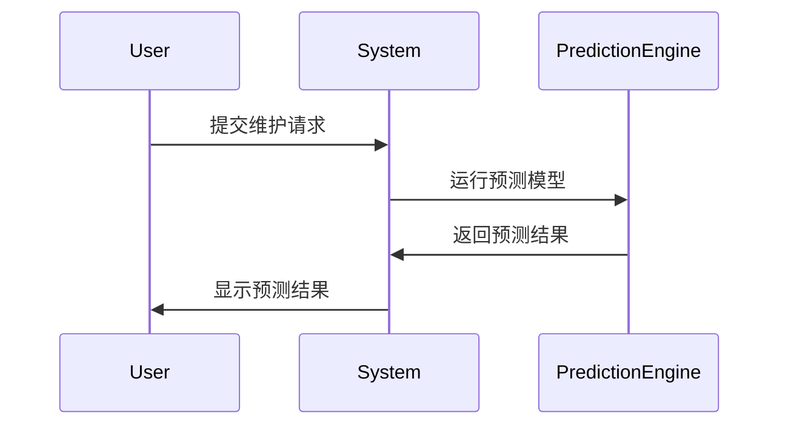
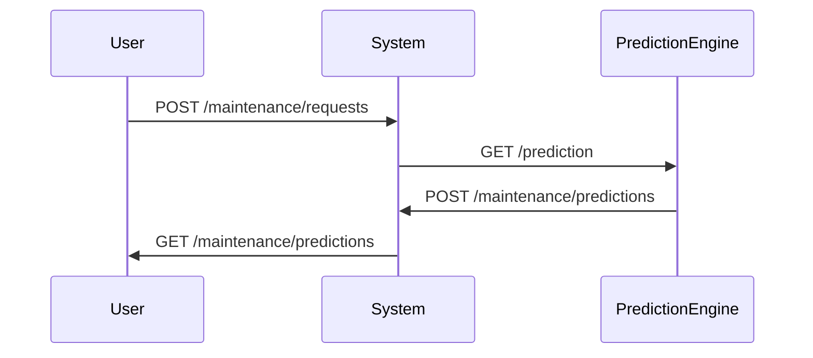

                 


### 机器学习在预测性建筑维护中的应用：延长建筑使用寿命

关键词：预测性维护、机器学习、建筑寿命、成本效益

摘要：随着城市化和现代化进程的加速，建筑维护成为一个日益重要的议题。传统的建筑维护方法往往被动且低效，而预测性维护则提供了一种新的解决方案。本文将深入探讨机器学习在预测性建筑维护中的应用，分析其原理、数学模型，并探讨如何通过实际项目实现，最终延长建筑使用寿命并提高成本效益。

### 目录大纲

----------------------------------------------------------------

## 第一部分：背景介绍

### 第1章 问题背景

#### 1.1 问题背景介绍

- **问题提出**：建筑维护中的挑战与机遇
  - 建筑维护的现状与问题
  - 预测性维护的重要性

- **问题解决**：机器学习的作用
  - 机器学习在建筑维护中的应用潜力
  - 预测性维护的概念及其实现

#### 1.2 核心概念

- **预测性维护**：
  - 定义
  - 与传统维护方法的区别

- **机器学习**：
  - 基础知识
  - 在建筑维护中的应用

#### 1.3 边界与外延

- **应用领域**：建筑类型与维护需求
  - 公共建筑
  - 工业建筑
  - 居住建筑

- **技术发展**：机器学习与传感器技术
  - 传感器技术的进步
  - 机器学习算法的演进

### 第2章 核心概念与联系

#### 2.1 核心概念

- **维护成本**：
  - 维护成本的概念
  - 成本构成

- **建筑寿命**：
  - 建筑寿命的定义
  - 延长建筑寿命的方法

#### 2.2 概念属性特征对比表格

| 概念 | 定义 | 关联属性 | 对比特征 |
| ---- | ---- | ---- | ---- |
| 预测性维护 | 基于机器学习的维护策略 | 预测准确性、响应速度、成本效益 | 与传统维护方法对比 |
| 建筑寿命 | 建筑的使用寿命 | 耐久性、维护频率、维护质量 | 与维护策略关联 |

#### 2.3 ER实体关系图架构

```mermaid
erDiagram
  Customer ||--|{ Order }|--|{ Product } : "orders"
  Customer ||--|{ Maintenance }|--|{ Building } : "owns"
  Maintenance ||--|{ Prediction } : "uses"
```

## 第二部分：算法原理讲解

### 第3章 预测性维护算法原理

#### 3.1 算法概述

- **算法目标**：预测维护需求
- **算法流程**：
  - 数据收集与预处理
  - 特征工程
  - 模型选择与训练
  - 预测与评估

#### 3.2 算法原理详解

- **机器学习算法类型**：
  - 监督学习
  - 无监督学习
  - 强化学习

- **常见算法**：
  - 决策树
  - 支持向量机
  - 神经网络
  - 集成方法

#### 3.3 算法mermaid流程图


### 第4章 数学模型和数学公式

#### 4.1 维护成本模型

- **成本公式**：
  $$ C = C_{p} + C_{r} + C_{r_p} $$

- **参数解释**：
  - \( C_{p} \)：预防性维护成本
  - \( C_{r} \)：反应性维护成本
  - \( C_{r_p} \)：预测性维护成本

#### 4.2 建筑寿命模型

- **寿命公式**：
  $$ L = L_0 \cdot e^{-\lambda t} $$

- **参数解释**：
  - \( L_0 \)：初始寿命
  - \( \lambda \)：维护策略相关参数

### 第5章 系统分析与架构设计方案

#### 5.1 问题场景介绍

- **场景描述**：大型住宅区的日常维护

#### 5.2 项目介绍

- **项目目标**：实现预测性维护，提高维护效率

#### 5.3 系统功能设计

- **领域模型mermaid类图**

```mermaid
classDiagram
  Building <<class>> {ID, Name, Address}
  Maintenance <<class>> {ID, Type, Date, Cost}
  Prediction <<class>> {ID, PredictedDate, Confidence}
  Building|--|{ Maintenance }
  Building|--|{ Prediction }
```

#### 5.4 系统架构设计

- **系统架构mermaid架构图**



#### 5.5 系统接口设计和系统交互

- **系统接口mermaid序列图**



### 第6章 项目实战

#### 6.1 环境安装

- **安装Python环境**
- **安装机器学习库**：scikit-learn、tensorflow等

#### 6.2 系统核心实现源代码

```python
# 预测性维护系统核心实现示例
from sklearn.ensemble import RandomForestClassifier
from sklearn.model_selection import train_test_split
from sklearn.metrics import accuracy_score

# 加载数据
data = load_data()

# 数据预处理
X, y = preprocess_data(data)

# 划分训练集和测试集
X_train, X_test, y_train, y_test = train_test_split(X, y, test_size=0.2, random_state=42)

# 模型训练
model = RandomForestClassifier()
model.fit(X_train, y_train)

# 预测
predictions = model.predict(X_test)

# 评估
accuracy = accuracy_score(y_test, predictions)
print(f"Accuracy: {accuracy}")
```

#### 6.3 代码应用解读与分析

- **代码功能解读**：实现数据的加载、预处理、模型训练、预测和评估
- **代码优化建议**：如何提高模型的性能和预测的准确性

#### 6.4 实际案例分析和详细讲解剖析

- **案例背景**：某住宅区电梯维护
- **案例分析**：数据收集、特征提取、模型训练和预测过程
- **剖析**：模型性能评估和改进措施

#### 6.5 项目小结

- **项目总结**：预测性维护系统的实现和应用
- **经验教训**：如何应对项目中的挑战和问题

### 第7章 最佳实践 tips

- **数据收集**：确保数据质量和多样性
- **特征工程**：选择对模型影响大的特征
- **模型选择**：根据问题特性选择合适的模型
- **持续优化**：不断调整和优化模型参数

### 第8章 小结

- **总结**：预测性维护的重要性
- **展望**：未来的发展趋势和应用前景

### 第9章 注意事项

- **数据隐私**：确保数据安全和合规性
- **模型解释性**：提高模型的可解释性，方便用户理解

### 第10章 拓展阅读

- **相关论文**：机器学习在建筑维护中的应用研究
- **书籍推荐**：《机器学习实战》

### 第11章 作者

作者：AI天才研究院/AI Genius Institute & 禅与计算机程序设计艺术 /Zen And The Art of Computer Programming

