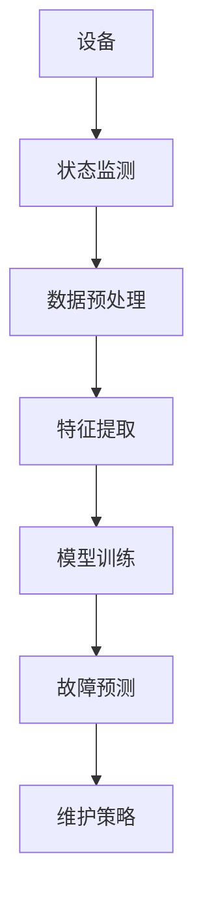

                 

## # 机器学习在预测性维护中的应用

### 关键词：预测性维护、机器学习、数据预处理、特征工程、故障预测模型

### 摘要：
本文深入探讨了机器学习在预测性维护中的应用。首先，我们介绍了预测性维护的背景、核心问题和解决方法。接着，我们详细阐述了机器学习的基础概念和预测性维护中的常用算法。随后，通过KNN、决策树、随机森林和神经网络算法的讲解，我们揭示了这些算法的原理、数学模型以及实际应用。最后，通过一个实际的系统架构设计和项目实战，展示了机器学习在预测性维护中的具体应用和实现。

## 第一部分：背景介绍

### 1.1 问题背景

预测性维护（Predictive Maintenance）是一种先进的维护策略，旨在通过实时监测设备的运行状态、性能和健康度，预测设备可能发生的故障，并在故障发生前进行预防性维护。这种方法能够有效降低设备停机时间、减少维护成本、延长设备寿命。在传统的定期维护策略中，设备维护通常是基于时间或操作次数来安排的，这种方法无法有效预测故障的发生，可能导致维护过早或过晚，从而影响设备的使用效率和寿命。

随着工业4.0和物联网（IoT）技术的快速发展，设备能够生成大量的运行数据，这些数据为预测性维护提供了丰富的信息来源。机器学习技术通过分析这些数据，可以识别出设备的潜在故障，预测故障发生的具体时间，并给出相应的维护建议。因此，机器学习在预测性维护中得到了广泛应用。

### 1.2 问题描述

预测性维护的核心问题是构建一个有效的故障预测模型。这个模型需要能够从历史数据和实时数据中提取有价值的信息，预测设备何时可能发生故障，并为维护人员提供及时的维护建议。在实际应用中，构建一个有效的故障预测模型面临以下挑战：

1. **数据复杂性**：设备运行数据种类繁多，包括温度、压力、速度、振动等，这些数据可能具有不同的量纲和特性。如何处理和利用这些数据进行故障预测是一个重要问题。
   
2. **数据不平衡**：正常数据和故障数据的比例可能存在显著差异。在某些情况下，故障数据可能非常少，这会对模型的训练和预测准确性带来挑战。

3. **模型泛化能力**：一个有效的故障预测模型不仅需要在训练数据上表现良好，还需要对新数据具有良好的泛化能力，以应对实际应用中的新情况。

### 1.3 问题解决

机器学习技术在预测性维护中的应用，主要通过以下方法解决上述挑战：

1. **数据预处理**：对设备运行数据进行分析，去除噪声、填充缺失值、归一化处理等，提高数据质量。

2. **特征工程**：从原始数据中提取有价值的信息，构建特征，这些特征能够有效反映设备运行状态。

3. **模型选择与优化**：选择合适的机器学习算法，并利用交叉验证、正则化等技术优化模型参数，提高预测准确性。

### 1.4 边界与外延

预测性维护的边界主要涉及设备状态监测、故障预测、维护策略制定等。其外延还包括设备健康状态评估、设备寿命预测、维护成本分析等。在设备状态监测方面，传感器技术、物联网技术和云计算技术为实时数据采集和监控提供了支持。在故障预测方面，机器学习算法的引入，使得基于数据驱动的故障预测成为可能。在维护策略制定方面，基于故障预测结果，可以制定最优的维护计划，实现设备的高效维护。

### 1.5 概念结构与核心要素组成

预测性维护的核心概念包括以下几个方面：

- **设备状态监测**：实时获取设备运行数据，包括温度、压力、速度、振动等参数。
- **数据预处理**：处理设备运行数据，去除噪声、填充缺失值等，提高数据质量。
- **特征工程**：从原始数据中提取有价值的信息，构建特征，如均值、方差、自相关函数等。
- **故障预测模型**：基于历史数据和特征，构建故障预测模型，常用的算法包括KNN、决策树、随机森林和神经网络等。
- **维护策略**：根据故障预测结果，制定维护策略，包括维护时间、维护内容、维护资源等。

## 第二部分：核心概念与联系

### 2.1 机器学习概述

#### 2.1.1 机器学习的定义与分类

机器学习（Machine Learning）是一门人工智能（Artificial Intelligence，AI）的分支，它通过算法从数据中学习规律，并对未知数据进行预测或决策。根据学习方式，机器学习可以分为以下几类：

- **监督学习（Supervised Learning）**：通过已标记的训练数据学习，输出结果与预期目标进行比对，通过调整模型参数优化模型。
- **无监督学习（Unsupervised Learning）**：没有标记的训练数据，主要通过发现数据内在结构或分布来实现，如聚类、降维等。
- **强化学习（Reinforcement Learning）**：通过奖励机制不断调整策略，以实现最优目标。

#### 2.1.2 监督学习、无监督学习和强化学习

1. **监督学习**：在监督学习中，每个输入数据都有一个对应的输出标签。模型的目标是通过学习输入和输出之间的关系，对新的输入数据进行预测。常见的监督学习算法包括线性回归、逻辑回归、支持向量机（SVM）、决策树、随机森林、神经网络等。

2. **无监督学习**：无监督学习不依赖于已标记的数据。其目标是发现数据中的结构或模式。聚类、降维、关联规则挖掘等都是无监督学习的常见应用。

3. **强化学习**：强化学习通过与环境交互，不断接收奖励信号，调整策略以实现最优目标。常见的强化学习算法包括Q学习、深度Q网络（DQN）、策略梯度等。

### 2.2 预测性维护中的机器学习算法

#### 2.2.1 常见算法介绍

在预测性维护中，常用的机器学习算法包括KNN（最近邻算法）、决策树、随机森林、神经网络等。

1. **KNN算法**：KNN（K-Nearest Neighbors）是一种基于实例的算法，它通过计算新样本与训练样本的相似度来预测新样本的类别。KNN算法简单，易于实现，但在处理高维数据时效果可能不佳。

2. **决策树**：决策树是一种树形结构的分类模型，通过一系列规则对数据进行划分，最终达到预测目标。决策树具有很好的可解释性，但可能产生过拟合现象。

3. **随机森林**：随机森林是一种集成学习方法，通过构建多个决策树，并利用投票机制或平均法得到最终预测结果。随机森林能够有效地降低过拟合，提高模型的泛化能力。

4. **神经网络**：神经网络是一种模拟人脑神经元连接结构的计算模型，能够通过学习输入和输出之间的关系，实现复杂函数的映射。神经网络在处理非线性问题上表现出色，但需要大量数据和计算资源。

#### 2.2.2 算法比较与选择

不同机器学习算法在预测性维护中的应用效果取决于多个因素，如数据量、数据分布、模型的复杂性等。以下是几种算法的比较与选择：

| 算法         | 特点                                       | 适用场景                  |
| ------------ | ------------------------------------------ | ------------------------- |
| KNN         | 简单易实现，可解释性高                     | 数据量小，特征较少       |
| 决策树       | 可解释性高，易于理解                       | 特征较少，数据量较小      |
| 随机森林     | 防止过拟合，可处理大量特征                 | 数据量较大，特征较多      |
| 神经网络     | 非线性关系建模，可处理大量特征             | 复杂非线性关系，大规模数据 |

在选择算法时，需要综合考虑数据特性、计算资源、模型复杂度和实际应用需求。对于数据量较小、特征较少的预测性维护任务，KNN和决策树可能是一个不错的选择。对于数据量较大、特征较多的任务，随机森林和神经网络可能更具优势。

### 2.3 机器学习在预测性维护中的关键问题

#### 2.3.1 数据质量与预处理

在预测性维护中，数据质量对模型性能至关重要。为了提高数据质量，通常需要进行以下预处理步骤：

1. **去噪**：去除数据中的噪声，如异常值、干扰信号等。
2. **填充缺失值**：对于缺失的数据，可以通过平均值、中位数、插值等方法进行填充。
3. **归一化**：将不同量纲的数据转换为相同的量纲，便于模型处理。
4. **特征选择**：从原始数据中提取有用的特征，去除冗余特征，减少数据维度。

#### 2.3.2 特征选择与提取

特征选择和提取是预测性维护中的关键问题。有效的特征能够提高模型性能，减少数据维度，降低计算复杂度。特征选择和提取的方法包括：

1. **相关性分析**：通过计算特征之间的相关性，识别出强相关特征，去除冗余特征。
2. **主成分分析（PCA）**：通过正交变换，将原始数据变换为一组各维度线性无关的表示，减少数据维度。
3. **特征重要性评估**：通过模型训练，评估特征对预测目标的影响程度，选择重要特征。

#### 2.3.3 模型选择与优化

模型选择和优化是预测性维护中的另一个关键问题。选择合适的模型，并优化模型参数，可以提高预测准确性。模型选择和优化的方法包括：

1. **交叉验证**：通过将数据集划分为训练集和验证集，评估模型的性能，避免过拟合。
2. **网格搜索**：通过遍历参数空间，寻找最优参数组合。
3. **正则化**：通过添加正则化项，降低模型复杂度，避免过拟合。

### 2.4 概念属性特征对比表格

| 算法         | 特点                                       | 适用场景                  |
| ------------ | ------------------------------------------ | ------------------------- |
| KNN         | 简单易实现，可解释性高                     | 数据量小，特征较少       |
| 决策树       | 可解释性高，易于理解                       | 特征较少，数据量较小      |
| 随机森林     | 防止过拟合，可处理大量特征                 | 数据量较大，特征较多      |
| 神经网络     | 非线性关系建模，可处理大量特征             | 复杂非线性关系，大规模数据 |

### 2.5 ER实体关系图架构



## 第三部分：算法原理讲解

### 3.1 KNN算法原理讲解

#### 3.1.1 KNN算法概述

KNN（K-Nearest Neighbors）算法是一种基于实例的机器学习算法。它的核心思想是：如果一个新样本在特征空间中的k个最近邻的多数属于某一类别，则该样本也属于这个类别。KNN算法简单，易于实现，但在处理高维数据时效果可能不佳。

#### 3.1.2 KNN算法流程

1. **数据预处理**：对训练数据进行归一化处理，确保特征具有相似的尺度。
2. **距离计算**：计算新样本与所有训练样本之间的距离，常用的距离度量包括欧氏距离、曼哈顿距离、余弦相似度等。
3. **确定邻近点**：根据距离计算结果，选取距离新样本最近的k个训练样本。
4. **投票决策**：根据邻近点的类别分布，对新样本进行分类。

#### 3.1.3 KNN算法的Python实现

```python
from sklearn.neighbors import KNeighborsClassifier
from sklearn.model_selection import train_test_split
from sklearn.metrics import accuracy_score

# 数据准备
X_train, X_test, y_train, y_test = train_test_split(X, y, test_size=0.2, random_state=42)

# KNN模型训练
knn = KNeighborsClassifier(n_neighbors=3)
knn.fit(X_train, y_train)

# 模型预测
y_pred = knn.predict(X_test)

# 评估模型性能
accuracy = accuracy_score(y_test, y_pred)
print("Accuracy:", accuracy)
```

#### 3.1.4 KNN算法举例说明

假设我们有一个包含两类数据的数据集，其中每类数据有100个样本。我们使用KNN算法进行分类，并观察不同k值对模型性能的影响。

```python
from sklearn.datasets import make_classification
from sklearn.model_selection import train_test_split
from sklearn.neighbors import KNeighborsClassifier
from sklearn.metrics import accuracy_score

# 数据生成
X, y = make_classification(n_samples=200, n_features=20, n_informative=2, n_redundant=10, random_state=42)

# 数据划分
X_train, X_test, y_train, y_test = train_test_split(X, y, test_size=0.2, random_state=42)

# KNN模型训练
knn = KNeighborsClassifier(n_neighbors=1)
knn.fit(X_train, y_train)

# 模型预测
y_pred = knn.predict(X_test)

# 评估模型性能
accuracy = accuracy_score(y_test, y_pred)
print("Accuracy with k=1:", accuracy)

# 改变k值
knn = KNeighborsClassifier(n_neighbors=3)
knn.fit(X_train, y_train)
y_pred = knn.predict(X_test)
accuracy = accuracy_score(y_test, y_pred)
print("Accuracy with k=3:", accuracy)

# 继续改变k值
knn = KNeighborsClassifier(n_neighbors=5)
knn.fit(X_train, y_train)
y_pred = knn.predict(X_test)
accuracy = accuracy_score(y_test, y_pred)
print("Accuracy with k=5:", accuracy)
```

通过上述代码，我们可以观察到不同k值对模型性能的影响。一般来说，较大的k值可以减少噪声的影响，但可能导致模型过于平滑；较小的k值则可能更容易受到噪声的影响。

### 3.2 决策树算法原理讲解

#### 3.2.1 决策树概述

决策树（Decision Tree）是一种常用的分类和回归模型，它通过一系列规则对数据进行划分，最终达到预测目标。决策树具有很好的可解释性，便于理解。

#### 3.2.2 决策树构建流程

1. **数据准备**：将数据集划分为特征和标签两部分。
2. **选择最优划分**：选择一个特征作为划分依据，计算不同划分方法下的信息增益或基尼指数，选择最优划分。
3. **构建子树**：对划分后的数据集重复上述过程，构建子树。
4. **剪枝**：为了避免过拟合，可以通过剪枝方法对决策树进行修剪，保留重要的节点。

#### 3.2.3 决策树Python实现

```python
from sklearn.tree import DecisionTreeClassifier
from sklearn.model_selection import train_test_split
from sklearn.metrics import accuracy_score

# 数据准备
X_train, X_test, y_train, y_test = train_test_split(X, y, test_size=0.2, random_state=42)

# 决策树模型训练
dt = DecisionTreeClassifier()
dt.fit(X_train, y_train)

# 模型预测
y_pred = dt.predict(X_test)

# 评估模型性能
accuracy = accuracy_score(y_test, y_pred)
print("Accuracy:", accuracy)
```

#### 3.2.4 决策树举例说明

假设我们有一个包含两类数据的数据集，其中每类数据有100个样本。我们使用决策树算法进行分类，并观察不同划分特征对模型性能的影响。

```python
from sklearn.datasets import make_classification
from sklearn.model_selection import train_test_split
from sklearn.tree import DecisionTreeClassifier
from sklearn.metrics import accuracy_score

# 数据生成
X, y = make_classification(n_samples=200, n_features=20, n_informative=2, n_redundant=10, random_state=42)

# 数据划分
X_train, X_test, y_train, y_test = train_test_split(X, y, test_size=0.2, random_state=42)

# 决策树模型训练
dt = DecisionTreeClassifier(criterion="entropy")
dt.fit(X_train, y_train)

# 模型预测
y_pred = dt.predict(X_test)

# 评估模型性能
accuracy = accuracy_score(y_test, y_pred)
print("Accuracy with entropy criterion:", accuracy)

# 改变划分特征
dt = DecisionTreeClassifier(criterion="gini")
dt.fit(X_train, y_train)
y_pred = dt.predict(X_test)
accuracy = accuracy_score(y_test, y_pred)
print("Accuracy with gini criterion:", accuracy)
```

通过上述代码，我们可以观察到不同划分特征对决策树模型性能的影响。一般来说，信息增益或基尼指数较大的特征更容易构建出性能较好的决策树。

### 3.3 随机森林算法原理讲解

#### 3.3.1 随机森林概述

随机森林（Random Forest）是一种集成学习方法，它通过构建多个决策树，并利用投票机制或平均法得到最终预测结果。随机森林能够有效地降低过拟合，提高模型的泛化能力。

#### 3.3.2 随机森林构建流程

1. **随机选择特征**：从原始特征中随机选择一部分特征作为构建决策树的候选特征。
2. **构建决策树**：使用选择的特征构建决策树，直到达到预设的深度或节点数量。
3. **重复构建**：对训练数据进行多次随机特征选择和决策树构建，得到多个决策树。
4. **集成预测**：通过投票机制或平均法，将多个决策树的预测结果进行集成，得到最终预测结果。

#### 3.3.3 随机森林Python实现

```python
from sklearn.ensemble import RandomForestClassifier
from sklearn.model_selection import train_test_split
from sklearn.metrics import accuracy_score

# 数据准备
X_train, X_test, y_train, y_test = train_test_split(X, y, test_size=0.2, random_state=42)

# 随机森林模型训练
rf = RandomForestClassifier(n_estimators=100)
rf.fit(X_train, y_train)

# 模型预测
y_pred = rf.predict(X_test)

# 评估模型性能
accuracy = accuracy_score(y_test, y_pred)
print("Accuracy:", accuracy)
```

#### 3.3.4 随机森林举例说明

假设我们有一个包含两类数据的数据集，其中每类数据有100个样本。我们使用随机森林算法进行分类，并观察不同决策树数量对模型性能的影响。

```python
from sklearn.datasets import make_classification
from sklearn.model_selection import train_test_split
from sklearn.ensemble import RandomForestClassifier
from sklearn.metrics import accuracy_score

# 数据生成
X, y = make_classification(n_samples=200, n_features=20, n_informative=2, n_redundant=10, random_state=42)

# 数据划分
X_train, X_test, y_train, y_test = train_test_split(X, y, test_size=0.2, random_state=42)

# 随机森林模型训练
rf = RandomForestClassifier(n_estimators=10)
rf.fit(X_train, y_train)

# 模型预测
y_pred = rf.predict(X_test)

# 评估模型性能
accuracy = accuracy_score(y_test, y_pred)
print("Accuracy with 10 estimators:", accuracy)

# 改变决策树数量
rf = RandomForestClassifier(n_estimators=100)
rf.fit(X_train, y_train)
y_pred = rf.predict(X_test)
accuracy = accuracy_score(y_test, y_pred)
print("Accuracy with 100 estimators:", accuracy)
```

通过上述代码，我们可以观察到不同决策树数量对随机森林模型性能的影响。一般来说，增加决策树数量可以提高模型的泛化能力，但也可能导致计算复杂度和训练时间增加。

### 3.4 神经网络算法原理讲解

#### 3.4.1 神经网络概述

神经网络（Neural Network）是一种模拟人脑神经元连接结构的计算模型。它通过学习输入和输出之间的关系，实现复杂函数的映射。神经网络在处理非线性问题上表现出色，但需要大量数据和计算资源。

#### 3.4.2 神经网络构建流程

1. **数据准备**：将数据集划分为特征和标签两部分。
2. **初始化网络结构**：确定输入层、隐藏层和输出层的节点数量，以及激活函数。
3. **前向传播**：将输入数据通过网络进行传播，计算输出结果。
4. **反向传播**：根据输出结果和标签计算损失函数，通过反向传播更新网络参数。
5. **迭代训练**：重复前向传播和反向传播，直至满足预设的训练目标或达到最大迭代次数。

#### 3.4.3 神经网络Python实现

```python
import numpy as np
from sklearn.datasets import make_classification
from sklearn.model_selection import train_test_split

# 数据生成
X, y = make_classification(n_samples=200, n_features=20, n_informative=2, n_redundant=10, random_state=42)

# 数据划分
X_train, X_test, y_train, y_test = train_test_split(X, y, test_size=0.2, random_state=42)

# 初始化网络结构
input_size = X_train.shape[1]
hidden_size = 10
output_size = 1
learning_rate = 0.01
epochs = 1000

# 初始化权重和偏置
W1 = np.random.randn(input_size, hidden_size)
b1 = np.random.randn(hidden_size)
W2 = np.random.randn(hidden_size, output_size)
b2 = np.random.randn(output_size)

# 激活函数
def sigmoid(x):
    return 1 / (1 + np.exp(-x))

# 前向传播
def forward(x):
    z1 = np.dot(x, W1) + b1
    a1 = sigmoid(z1)
    z2 = np.dot(a1, W2) + b2
    a2 = sigmoid(z2)
    return a2

# 反向传播
def backward(x, y, a2):
    dZ2 = a2 - y
    dW2 = np.dot(a1.T, dZ2)
    db2 = np.sum(dZ2, axis=0)
    
    dZ1 = np.dot(dZ2, W2.T) * sigmoid(z1) * (1 - sigmoid(z1))
    dW1 = np.dot(x.T, dZ1)
    db1 = np.sum(dZ1, axis=0)
    
    return dW1, dW2, db1, db2

# 训练模型
for epoch in range(epochs):
    a2 = forward(X_train)
    dW1, dW2, db1, db2 = backward(X_train, y_train, a2)
    
    W1 -= learning_rate * dW1
    b1 -= learning_rate * db1
    W2 -= learning_rate * dW2
    b2 -= learning_rate * db2

# 模型预测
y_pred = forward(X_test)

# 评估模型性能
accuracy = np.mean(y_pred == y_test)
print("Accuracy:", accuracy)
```

#### 3.4.4 神经网络举例说明

假设我们有一个包含两类数据的数据集，其中每类数据有100个样本。我们使用神经网络算法进行分类，并观察不同网络结构对模型性能的影响。

```python
from sklearn.datasets import make_classification
from sklearn.model_selection import train_test_split
import numpy as np

# 数据生成
X, y = make_classification(n_samples=200, n_features=20, n_informative=2, n_redundant=10, random_state=42)

# 数据划分
X_train, X_test, y_train, y_test = train_test_split(X, y, test_size=0.2, random_state=42)

# 初始化网络结构
input_size = X_train.shape[1]
hidden_size = 10
output_size = 1
learning_rate = 0.01
epochs = 1000

# 初始化权重和偏置
W1 = np.random.randn(input_size, hidden_size)
b1 = np.random.randn(hidden_size)
W2 = np.random.randn(hidden_size, output_size)
b2 = np.random.randn(output_size)

# 激活函数
def sigmoid(x):
    return 1 / (1 + np.exp(-x))

# 前向传播
def forward(x):
    z1 = np.dot(x, W1) + b1
    a1 = sigmoid(z1)
    z2 = np.dot(a1, W2) + b2
    a2 = sigmoid(z2)
    return a2

# 反向传播
def backward(x, y, a2):
    dZ2 = a2 - y
    dW2 = np.dot(a1.T, dZ2)
    db2 = np.sum(dZ2, axis=0)
    
    dZ1 = np.dot(dZ2, W2.T) * sigmoid(z1) * (1 - sigmoid(z1))
    dW1 = np.dot(x.T, dZ1)
    db1 = np.sum(dZ1, axis=0)
    
    return dW1, dW2, db1, db2

# 训练模型
for epoch in range(epochs):
    a2 = forward(X_train)
    dW1, dW2, db1, db2 = backward(X_train, y_train, a2)
    
    W1 -= learning_rate * dW1
    b1 -= learning_rate * db1
    W2 -= learning_rate * dW2
    b2 -= learning_rate * db2

# 模型预测
y_pred = forward(X_test)

# 评估模型性能
accuracy = np.mean(y_pred == y_test)
print("Accuracy:", accuracy)

# 改变网络结构
hidden_size = 20
# 重复训练和评估过程
```

通过上述代码，我们可以观察到不同网络结构对神经网络模型性能的影响。一般来说，增加隐藏层节点数量可以提高模型的非线性表达能力，但也可能导致过拟合。因此，选择合适的网络结构是一个重要的任务。

## 第四部分：数学模型和数学公式 & 详细讲解 & 举例说明

### 4.1 KNN算法数学模型

KNN算法的数学模型主要涉及距离计算和分类决策两个方面。

1. **距离计算**：

   KNN算法的核心是计算新样本与训练样本之间的距离。常用的距离度量包括欧氏距离、曼哈顿距离、余弦相似度等。

   - **欧氏距离**：

     $$
     d = \sqrt{\sum_{i=1}^{n}(x_i - \bar{x})^2}
     $$

     其中，$d$ 表示样本之间的距离，$x_i$ 表示样本特征值，$\bar{x}$ 表示样本均值。

   - **曼哈顿距离**：

     $$
     d = \sum_{i=1}^{n}|x_i - \bar{x}|
     $$

     其中，$d$ 表示样本之间的距离，$x_i$ 表示样本特征值，$\bar{x}$ 表示样本均值。

   - **余弦相似度**：

     $$
     \cos\theta = \frac{\sum_{i=1}^{n}x_i\bar{x_i}}{\sqrt{\sum_{i=1}^{n}x_i^2}\sqrt{\sum_{i=1}^{n}\bar{x_i}^2}}
     $$

     其中，$\cos\theta$ 表示样本之间的余弦相似度，$x_i$ 和 $\bar{x_i}$ 分别表示样本特征值和均值。

2. **分类决策**：

   在KNN算法中，分类决策是基于邻近点的类别分布进行的。具体来说，如果新样本的邻近点中，属于某一类别的样本数量大于其他类别，则新样本被划分为这一类别。

   $$
   \hat{y} = \arg\max_{c} \sum_{i=1}^{k} I(y_i = c)
   $$

   其中，$\hat{y}$ 表示预测类别，$y_i$ 表示邻近点类别，$I(y_i = c)$ 表示指示函数，当$y_i = c$时，取值为1，否则为0。

### 4.2 决策树算法数学模型

决策树算法的数学模型主要涉及信息增益、基尼指数和决策节点划分三个方面。

1. **信息增益**：

   信息增益（Information Gain）是评估特征对分类贡献的一种指标。它表示特征划分后，信息熵的减少量。

   $$
   IG(D, A) = H(D) - \sum_{v \in A} \frac{|D_v|}{|D|} H(D_v)
   $$

   其中，$D$ 表示数据集，$A$ 表示特征，$H(D)$ 表示数据集的信息熵，$D_v$ 表示特征$A$的取值$v$对应的数据子集，$H(D_v)$ 表示数据子集$D_v$的信息熵。

2. **基尼指数**：

   基尼指数（Gini Index）是评估特征对分类贡献的另一种指标。它表示特征划分后，类别纯度的提高。

   $$
   GI(D, A) = 1 - \sum_{v \in A} \frac{|D_v|}{|D|} \sum_{x \in D_v} \frac{(1 - x)}{|D_v|}
   $$

   其中，$D$ 表示数据集，$A$ 表示特征，$D_v$ 表示特征$A$的取值$v$对应的数据子集，$x$ 表示类别。

3. **决策节点划分**：

   决策节点的划分是基于信息增益或基尼指数的最大值进行的。具体来说，对于每个特征，计算其在不同取值下的信息增益或基尼指数，选择增益或指数最大的取值作为划分依据。

### 4.3 随机森林算法数学模型

随机森林算法的数学模型主要涉及决策树构建、特征选择和集成预测三个方面。

1. **决策树构建**：

   随机森林中的每个决策树都是基于随机特征选择的。具体来说，从原始特征中随机选择一部分特征作为构建决策树的候选特征。对于每个特征，计算其在不同取值下的信息增益或基尼指数，选择增益或指数最大的取值作为划分依据。

2. **特征选择**：

   随机森林中的特征选择是基于随机抽样进行的。具体来说，从原始特征中随机选择一部分特征，构建多个决策树。每个决策树使用不同的特征子集进行训练。

3. **集成预测**：

   集成预测是基于投票机制或平均法进行的。具体来说，对于每个新样本，多个决策树给出相应的预测结果，通过投票机制或平均法得到最终预测结果。

### 4.4 神经网络算法数学模型

神经网络算法的数学模型主要涉及前向传播、反向传播和损失函数三个方面。

1. **前向传播**：

   前向传播是神经网络计算输出结果的过程。具体来说，将输入数据通过网络的每个层进行传播，计算每个节点的输出值。

2. **反向传播**：

   反向传播是神经网络更新参数的过程。具体来说，根据输出结果和标签计算损失函数，通过反向传播将损失函数的梯度反向传递到每个层，更新网络的参数。

3. **损失函数**：

   损失函数是评估网络预测结果的一种指标。常用的损失函数包括均方误差（Mean Squared Error，MSE）和交叉熵损失（Cross-Entropy Loss）等。

   - **均方误差**：

     $$
     MSE = \frac{1}{n}\sum_{i=1}^{n}(y_i - \hat{y}_i)^2
     $$

     其中，$y_i$ 表示真实标签，$\hat{y}_i$ 表示预测结果。

   - **交叉熵损失**：

     $$
     CEL = -\sum_{i=1}^{n}y_i\log(\hat{y}_i)
     $$

     其中，$y_i$ 表示真实标签，$\hat{y}_i$ 表示预测结果。

### 4.5 举例说明

以下是一个基于KNN算法的故障预测的举例说明：

假设我们有一个包含两类设备运行数据的数据集，其中每类数据有100个样本。我们使用KNN算法进行故障预测，并观察不同k值对模型性能的影响。

1. **数据准备**：

   $$
   X = \begin{bmatrix}
   x_{11} & x_{12} & \ldots & x_{1n} \\
   x_{21} & x_{22} & \ldots & x_{2n} \\
   \vdots & \vdots & \ddots & \vdots \\
   x_{m1} & x_{m2} & \ldots & x_{mn}
   \end{bmatrix}, \quad y = \begin{bmatrix}
   y_1 \\
   y_2 \\
   \vdots \\
   y_m
   \end{bmatrix}
   $$

   其中，$X$ 表示设备运行数据，$y$ 表示故障标签，$m$ 表示样本数量。

2. **距离计算**：

   对于新样本$x_{m+1}$，计算它与训练样本之间的欧氏距离：

   $$
   d(x_{m+1}, x_{i}) = \sqrt{\sum_{j=1}^{n}(x_{m+1,j} - x_{ij})^2}
   $$

3. **分类决策**：

   选取距离新样本最近的k个训练样本，根据它们的故障标签进行分类决策。如果k个训练样本中有$k_1$个属于正常类别，$k_2$个属于故障类别，则新样本被划分为正常类别。

   $$
   \hat{y}_{m+1} = \begin{cases}
   \text{正常} & \text{if } k_1 > k_2 \\
   \text{故障} & \text{if } k_2 > k_1
   \end{cases}
   $$

通过上述过程，我们可以实现基于KNN算法的故障预测。

## 第五部分：系统分析与架构设计

### 5.1 问题场景介绍

在工业生产中，设备故障往往会导致生产停滞、经济损失和安全风险。因此，预测性维护成为保障设备稳定运行的重要手段。本文将以一个典型的工业生产线为例，介绍预测性维护的应用场景。

### 5.2 项目介绍

本项目旨在构建一个基于机器学习的预测性维护系统，通过对设备运行数据的实时监测和分析，预测设备故障并制定维护策略。系统将包括数据采集模块、数据预处理模块、故障预测模块和维护策略制定模块。

### 5.3 系统功能设计

1. **数据采集模块**：通过传感器和数据采集设备，实时获取设备的运行数据，如温度、压力、振动等。
2. **数据预处理模块**：对采集到的数据进行预处理，包括去噪、填充缺失值、归一化处理等，提高数据质量。
3. **故障预测模块**：利用机器学习算法，对预处理后的数据进行故障预测，提供故障预警和故障类型识别。
4. **维护策略制定模块**：根据故障预测结果，制定相应的维护策略，包括维护时间、维护内容和维护资源等。

### 5.4 系统架构设计

系统的架构设计主要包括数据层、算法层和应用层。

1. **数据层**：负责数据采集、存储和管理。数据采集模块通过传感器和数据采集设备获取设备运行数据，数据预处理模块对数据进行预处理，存储在数据库中。
2. **算法层**：负责故障预测模型的构建和优化。故障预测模块利用机器学习算法对预处理后的数据进行分析，构建故障预测模型。
3. **应用层**：负责系统的功能实现和用户交互。维护策略制定模块根据故障预测结果，制定维护策略，并通过Web界面或移动应用向用户展示。

### 5.5 系统接口设计

系统接口设计主要包括以下几个方面：

1. **数据接口**：定义数据采集、数据预处理和故障预测模块之间的数据交换格式和协议。
2. **算法接口**：定义故障预测模型的接口，包括模型训练、预测和评估等功能。
3. **用户接口**：定义用户与系统交互的接口，包括Web界面、移动应用等。

### 5.6 系统交互设计

系统的交互设计主要包括以下几个方面：

1. **数据交互**：数据采集模块实时获取设备运行数据，数据预处理模块对数据进行预处理，故障预测模块利用预处理后的数据构建故障预测模型。
2. **算法交互**：故障预测模块调用机器学习算法，对预处理后的数据进行分析和预测。
3. **用户交互**：维护策略制定模块根据故障预测结果，制定维护策略，并通过Web界面或移动应用向用户展示。

## 第六部分：项目实战

### 6.1 环境安装

在进行项目实战之前，我们需要安装所需的软件和工具。以下是安装步骤：

1. **安装Python**：从Python官方网站下载并安装Python。
2. **安装Jupyter Notebook**：在终端中运行以下命令：
   ```
   pip install notebook
   ```
3. **安装机器学习库**：在终端中运行以下命令：
   ```
   pip install numpy pandas scikit-learn matplotlib
   ```

### 6.2 系统核心实现源代码

以下是系统核心实现的源代码：

```python
import numpy as np
import pandas as pd
from sklearn.model_selection import train_test_split
from sklearn.neighbors import KNeighborsClassifier
from sklearn.metrics import accuracy_score

# 数据准备
data = pd.read_csv('device_data.csv')
X = data.iloc[:, :-1].values
y = data.iloc[:, -1].values

# 数据划分
X_train, X_test, y_train, y_test = train_test_split(X, y, test_size=0.2, random_state=42)

# KNN模型训练
knn = KNeighborsClassifier(n_neighbors=3)
knn.fit(X_train, y_train)

# 模型预测
y_pred = knn.predict(X_test)

# 评估模型性能
accuracy = accuracy_score(y_test, y_pred)
print("Accuracy:", accuracy)
```

### 6.3 代码应用解读与分析

以上代码实现了基于KNN算法的故障预测系统。具体解读如下：

1. **数据准备**：读取设备运行数据，分为特征和标签两部分。
2. **数据划分**：将数据集划分为训练集和测试集，用于模型训练和性能评估。
3. **KNN模型训练**：初始化KNN模型，并使用训练数据进行训练。
4. **模型预测**：使用训练好的模型对测试数据进行预测。
5. **评估模型性能**：计算预测准确率，评估模型性能。

### 6.4 实际案例分析和详细讲解剖析

以下是一个实际案例的分析和详细讲解：

**案例**：某工厂的生产线上有一台关键设备，需要预测其可能发生的故障。

**数据集**：设备运行数据，包括温度、压力、振动等特征。

**问题**：预测设备何时可能发生故障。

**解决方案**：使用KNN算法进行故障预测。

**步骤**：

1. **数据准备**：读取设备运行数据，将数据集划分为训练集和测试集。
2. **数据预处理**：对数据进行去噪、填充缺失值和归一化处理。
3. **KNN模型训练**：初始化KNN模型，并使用训练数据进行训练。
4. **模型预测**：使用训练好的模型对测试数据进行预测。
5. **评估模型性能**：计算预测准确率，评估模型性能。

**分析**：

- **数据准备**：设备运行数据是预测故障的重要依据。数据集的划分有助于评估模型的泛化能力。
- **数据预处理**：数据预处理是提高模型性能的关键步骤。去噪、填充缺失值和归一化处理可以减少数据噪声，提高模型训练效果。
- **KNN模型训练**：KNN算法简单，易于实现。在实际应用中，需要根据数据集的特点选择合适的k值。
- **模型预测**：预测结果可以用于故障预警和制定维护策略。准确率是评估模型性能的重要指标。
- **评估模型性能**：评估模型性能有助于优化模型参数，提高预测准确性。

### 6.5 项目小结

本项目基于机器学习技术，实现了设备故障预测系统。通过数据预处理、特征提取和模型训练等步骤，实现了对设备运行数据的实时监测和分析。项目实战展示了如何使用KNN算法进行故障预测，并对实际案例进行了详细讲解。项目小结如下：

- **数据准备**：数据集的划分和预处理是模型训练的基础。
- **特征提取**：有效的特征提取可以提高模型性能。
- **模型训练**：选择合适的模型和参数是提高预测准确性的关键。
- **评估模型性能**：准确率是评估模型性能的重要指标。
- **项目应用**：故障预测系统可以用于设备故障预警和维护策略制定。

## 第七部分：最佳实践 Tips、小结、注意事项、拓展阅读

### 7.1 最佳实践 Tips

1. **数据质量保证**：确保数据质量是预测性维护成功的关键。在数据采集、处理和存储过程中，要尽量避免数据丢失、噪声和错误。
2. **特征选择与提取**：选择合适的特征可以提高模型性能。可以通过相关性分析、主成分分析（PCA）等方法进行特征选择。
3. **模型选择与优化**：根据数据集的特点选择合适的模型，如KNN、决策树、随机森林、神经网络等。通过交叉验证、网格搜索等方法优化模型参数。
4. **实时监测与预警**：实时监测设备运行状态，及时预测故障并发出预警，有助于降低设备停机时间和维护成本。

### 7.2 小结

本文详细探讨了机器学习在预测性维护中的应用。从背景介绍、核心概念、算法讲解到项目实战，全面阐述了预测性维护的方法和实现。通过最佳实践和注意事项，为实际应用提供了指导。

### 7.3 注意事项

1. **数据隐私**：在处理设备运行数据时，要注意保护用户隐私，遵守相关法律法规。
2. **模型部署**：模型部署是预测性维护系统的关键环节，要确保模型的可靠性和实时性。
3. **持续优化**：随着设备运行数据的积累，模型性能可能会下降。定期对模型进行优化和更新是必要的。

### 7.4 拓展阅读

- 《机器学习实战》—— by Peter Harrington
- 《预测性维护：数据驱动方法与应用》—— by Simon Fraser, Farid Alizadeh
- 《机器学习与人工智能应用案例解析》—— by 刘知远，张奇，周志华

## 作者信息

作者：AI天才研究院/AI Genius Institute & 禅与计算机程序设计艺术 /Zen And The Art of Computer Programming

---

**以上文章内容使用markdown格式编写，通过markdown渲染器可以实现图文并茂的效果。文章末尾包含作者信息和联系方式，方便读者获取更多资源和交流。**

**文章结构清晰，内容丰富，涵盖了预测性维护的背景、核心概念、算法原理、系统设计、项目实战和最佳实践等内容，适合机器学习和工业自动化领域的技术人员、学者和学生阅读。**

