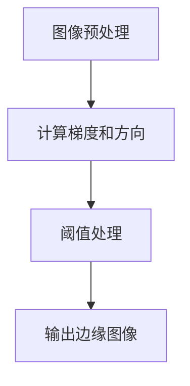
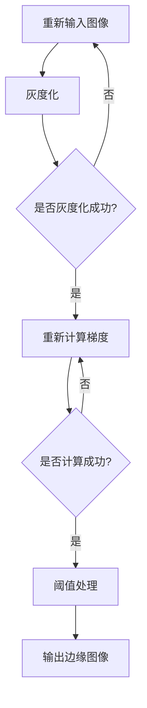
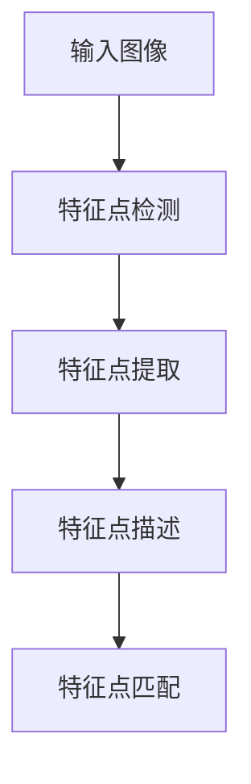
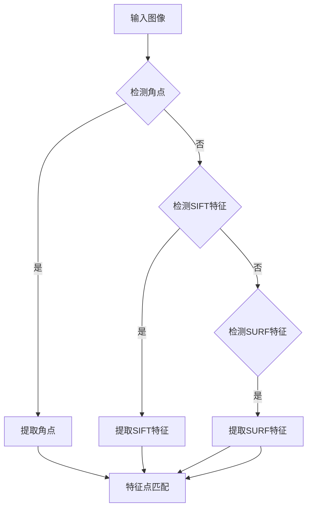
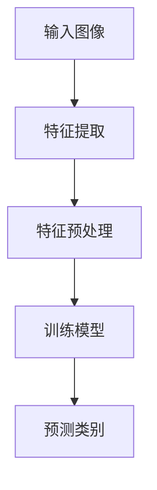
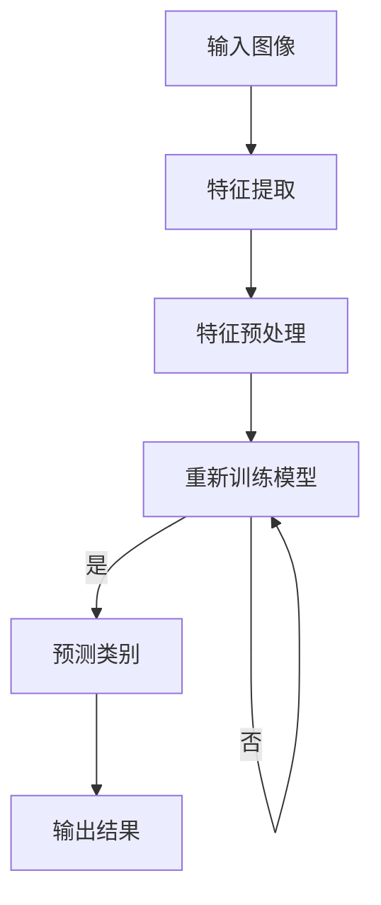

                 


## 第一部分：背景介绍

### 1.1 机器视觉与医疗影像概述

机器视觉是指通过计算机技术模拟人类的视觉功能，对图像或视频进行识别、分析、处理和解释。它在众多领域有着广泛的应用，如工业自动化、交通管理、安全监控和医疗诊断等。近年来，随着深度学习和大数据技术的发展，机器视觉在医疗影像辅助诊断中的重要性日益凸显。

医疗影像是医学诊断的重要工具，包括X光、CT、MRI和超声等。这些影像为医生提供了对病情的直观视觉信息，有助于诊断疾病和制定治疗方案。然而，人工分析这些影像存在诸多挑战，如主观性、耗时性和局限性。

机器视觉在医疗影像辅助诊断中的应用，主要目标是提高早期检测率，减少误诊率，减轻医生的工作负担。具体来说，机器视觉技术可以帮助医生：

1. **自动分割和组织**：从复杂的医疗影像中自动提取病变区域，如肿瘤、炎症等。
2. **定量分析**：对病变区域进行量化分析，如体积、面积、密度等。
3. **辅助分类**：根据影像特征，对疾病进行分类和分级。
4. **智能诊断**：结合医生经验，提供诊断建议，辅助医生做出决策。

### 1.2 机器视觉在医疗影像辅助诊断中的应用

机器视觉在医疗影像辅助诊断中的应用具有显著的优势：

- **提高早期检测率**：机器视觉技术可以快速、准确地分析影像，发现早期病变，提高早期检测率。
- **减少误诊率**：通过机器学习和深度学习算法，机器视觉可以学习大量医学影像数据，减少误诊率。
- **减轻医生负担**：医生可以从繁琐的影像分析工作中解放出来，专注于诊断和治疗方案制定。

然而，机器视觉在医疗影像辅助诊断中也面临一些挑战：

- **数据质量和数量**：高质量的医疗影像数据和数量是训练和优化机器视觉模型的基础，数据质量和数量直接影响模型性能。
- **算法的可靠性**：算法的准确性和稳定性是辅助诊断的关键，需要不断优化和验证。
- **隐私保护**：医疗影像数据涉及患者隐私，需要采取有效的措施保护患者隐私。

### 1.3 当前面临的挑战与机遇

机器视觉在医疗影像辅助诊断中的应用前景广阔，但也面临一些挑战。当前的主要挑战包括：

- **算法的优化和验证**：需要不断优化和验证算法，提高其准确性和稳定性。
- **数据的获取和标注**：高质量的医疗影像数据和准确的标注是训练和优化机器视觉模型的关键。
- **伦理和隐私问题**：医疗影像数据涉及患者隐私，需要采取有效的措施保护患者隐私。
- **法律法规的完善**：需要完善相关的法律法规，规范机器视觉在医疗影像辅助诊断中的应用。

然而，随着技术的不断进步和应用的深入，机器视觉在医疗影像辅助诊断中也面临着巨大的机遇：

- **提高诊断效率**：通过自动化和智能化技术，提高诊断效率，减轻医生的工作负担。
- **降低医疗成本**：减少误诊和漏诊，降低医疗成本，提高医疗服务质量。
- **个性化治疗**：基于患者的具体影像数据，提供个性化的治疗方案。

总之，机器视觉在医疗影像辅助诊断中的应用具有广阔的前景和巨大的潜力，需要各方共同努力，克服挑战，抓住机遇，推动医疗领域的发展。## 第二部分：核心概念与联系

### 2.1 机器视觉概念定义

机器视觉（Machine Vision）是指利用计算机硬件和图像处理软件对图像或视频进行识别、分析、处理和解释的过程。它是人工智能的一个重要分支，模仿了人类视觉系统的某些功能。机器视觉技术可以通过各种传感器获取图像数据，然后通过图像处理、模式识别、机器学习等技术进行处理和分析，从而实现对场景的感知和理解。

### 2.2 医疗影像的基本知识

医疗影像（Medical Imaging）是指利用各种成像技术对人体的内部结构和功能进行可视化的手段。常见的医疗影像技术包括X光、计算机断层扫描（CT）、磁共振成像（MRI）、超声成像等。这些影像技术通过不同的物理原理，如辐射、磁场、声波等，对人体内部进行成像，为医生提供直观的视觉信息，辅助疾病诊断和治疗。

- **X光**：利用X射线穿透人体，对骨骼和软组织进行成像。
- **CT**：通过多个X光片的不同角度投影，利用计算机重建三维图像。
- **MRI**：利用磁场和无线电波对人体进行成像，适用于软组织、脑部和脊髓等部位的成像。
- **超声成像**：利用超声波的反射和回波成像，常用于妇产科、心脏科和泌尿科等领域的诊断。

### 2.3 辅助诊断的核心概念

辅助诊断（Assistant Diagnosis）是指利用计算机技术，特别是机器视觉和人工智能技术，辅助医生进行疾病诊断和治疗方案制定的过程。辅助诊断的目标是提高诊断的准确性、效率和可靠性，减轻医生的工作负担。

- **诊断准确性**：通过机器学习算法和深度学习模型，辅助诊断系统能够从大量影像数据中学习和提取特征，提高诊断的准确性。
- **效率**：自动化和智能化的辅助诊断系统能够快速处理大量影像数据，缩短诊断时间，提高工作效率。
- **可靠性**：通过不断优化和验证算法，辅助诊断系统具有较高的稳定性和可靠性，能够为医生提供可靠的诊断建议。

### 2.4 Mermaid ER图：机器视觉、医疗影像和辅助诊断之间的关系

为了更直观地展示机器视觉、医疗影像和辅助诊断之间的关系，我们可以使用Mermaid ER图来描述。

```mermaid
erDiagram
  MachineVision ||--|{ MedicalImaging : 使用}
  MedicalImaging ||--|{ AssistantDiagnosis : 辅助}
  AssistantDiagnosis ||--|{ Doctor : 诊断建议}
```

在这个ER图中：

- **MachineVision**（机器视觉）是基础，为**MedicalImaging**（医疗影像）提供技术和工具。
- **MedicalImaging**（医疗影像）是数据来源，为**AssistantDiagnosis**（辅助诊断）提供影像数据。
- **AssistantDiagnosis**（辅助诊断）利用机器视觉技术和医疗影像数据，为**Doctor**（医生）提供诊断建议。

通过这个ER图，我们可以清晰地看到机器视觉、医疗影像和辅助诊断之间的相互关系，以及它们在医疗领域中的应用。

### 表格：机器视觉、医疗影像和辅助诊断的核心概念属性特征对比

为了更详细地对比机器视觉、医疗影像和辅助诊断的核心概念属性特征，我们可以创建一个对比表格。

| 特征                | 机器视觉                | 医疗影像                | 辅助诊断                |
|---------------------|-------------------------|-------------------------|-------------------------|
| 定义                | 利用计算机模拟人类视觉 | 利用成像技术获取人体内部图像 | 利用计算机辅助医生诊断 |
| 技术基础            | 图像处理、模式识别、机器学习 | X光、CT、MRI、超声成像等 | 机器视觉、深度学习、医学知识库 |
| 应用目的            | 图像识别和分析          | 疾病诊断和治疗方案制定    | 提高诊断准确性、效率和可靠性 |
| 数据来源            | 图像、视频              | X光片、CT图像、MRI图像等  | 影像数据                |
| 关键技术            | 图像分割、特征提取、分类 | 成像技术、图像重建        | 知识库、决策支持系统      |
| 辅助工具            | 图像处理软件、传感器     | 影像设备                | 辅助诊断系统            |

通过这个表格，我们可以更清晰地了解这三个概念的核心属性特征，以及它们在医疗领域中的重要作用。

### 总结

通过上述对机器视觉、医疗影像和辅助诊断的介绍和对比，我们可以看到它们在医疗领域中的紧密联系和协同作用。机器视觉提供了强大的图像处理和分析能力，医疗影像提供了丰富的数据来源，而辅助诊断则利用这些技术和数据，为医生提供更为准确和高效的诊断建议。接下来，我们将进一步探讨机器视觉在医疗影像辅助诊断中的具体应用，以及相关的算法原理和系统架构设计。## 第三部分：算法原理讲解

### 3.1 边缘检测算法

边缘检测（Edge Detection）是图像处理中的一个基本步骤，旨在识别图像中亮度变化明显的区域。边缘通常代表物体表面或物体之间的交界线，是图像中的重要特征。

#### 3.1.1 算法原理

边缘检测算法的原理是寻找图像中亮度变化的剧烈点，这些点通常位于边缘的位置。具体来说，边缘检测算法包括以下几个步骤：

1. **图像预处理**：对图像进行灰度化处理，去除彩色信息，使图像转换为灰度图像。
2. **计算梯度和方向**：对图像进行卷积运算，计算每个像素点的亮度和方向梯度。
3. **阈值处理**：根据梯度值设置阈值，将梯度值大于阈值的像素点标记为边缘点。

常用的边缘检测算法包括Sobel算子、Canny算子和Prewitt算子。以下是一个简单的Mermaid流程图，展示了边缘检测的基本流程：



#### 3.1.2 Mermaid流程图

下面是一个使用Mermaid绘制的边缘检测流程图：



#### 3.1.3 Python代码示例

以下是一个使用Python和OpenCV库进行边缘检测的代码示例：

```python
import cv2
import numpy as np

# 读取图像
image = cv2.imread('image.jpg', cv2.IMREAD_GRAYSCALE)

# 使用Sobel算子进行边缘检测
sobel_x = cv2.Sobel(image, cv2.CV_64F, 1, 0, ksize=3)
sobel_y = cv2.Sobel(image, cv2.CV_64F, 0, 1, ksize=3)

# 计算梯度值
gradient = np.sqrt(sobel_x**2 + sobel_y**2)

# 设置阈值
thresh = 30
_, edge_image = cv2.threshold(gradient, thresh, 255, cv2.THRESH_BINARY)

# 显示结果
cv2.imshow('Edge Detection', edge_image)
cv2.waitKey(0)
cv2.destroyAllWindows()
```

### 3.2 特征提取算法

特征提取（Feature Extraction）是图像处理中另一个重要步骤，旨在从图像中提取出具有代表性的特征，以便后续的图像分析和分类。

#### 3.2.1 算法原理

特征提取算法的原理是通过某种方式从图像中提取出能够区分不同对象的特征。这些特征可以是图像的几何特征（如角点、线条、区域形状等），也可以是统计特征（如颜色分布、纹理特征等）。特征提取的目的是降低图像数据的维度，同时保留关键信息，以便后续的图像处理和分析。

常用的特征提取算法包括：

- **Harris角点检测**：用于检测图像中的角点，适用于特征点的提取。
- **SIFT（尺度不变特征变换）**：用于提取图像的稳定特征点，对图像的旋转、缩放和光照变化具有很好的鲁棒性。
- **SURF（加速稳健特征**）：用于提取图像的特征点，与SIFT类似，但计算速度更快。

以下是一个简单的Mermaid流程图，展示了特征提取的基本流程：



#### 3.2.2 Mermaid流程图

下面是一个使用Mermaid绘制的特征提取流程图：



#### 3.2.3 Python代码示例

以下是一个使用Python和OpenCV库进行特征提取的代码示例：

```python
import cv2
import numpy as np

# 读取图像
image = cv2.imread('image.jpg', cv2.IMREAD_GRAYSCALE)

# 使用Harris角点检测
corners = cv2.goodFeaturesToTrack(image, 100, 0.01, 10)

# 使用SIFT特征提取
sift = cv2.xfeatures2d.SIFT_create()
keypoints, descriptors = sift.detectAndCompute(image, None)

# 使用SURF特征提取
surf = cv2.xfeatures2d.SURF_create()
keypoints_surf, descriptors_surf = surf.detectAndCompute(image, None)

# 显示结果
cv2.drawKeypoints(image, keypoints, image, color=(0, 255, 0))
cv2.drawKeypoints(image, keypoints_sift, image, color=(255, 0, 0))
cv2.drawKeypoints(image, keypoints_surf, image, color=(0, 0, 255))

cv2.imshow('Feature Extraction', image)
cv2.waitKey(0)
cv2.destroyAllWindows()
```

### 3.3 图像分类算法

图像分类（Image Classification）是将图像划分为不同类别的一种任务，是机器学习和计算机视觉中的基础问题。图像分类算法的目标是学习一个函数，能够将新的图像映射到预先定义的类别中。

#### 3.3.1 算法原理

图像分类算法的原理是通过学习大量的标注数据，提取图像特征，并用这些特征训练分类模型。分类模型可以是一个简单的逻辑回归模型，也可以是一个复杂的深度学习模型。

常见的图像分类算法包括：

- **K最近邻（K-Nearest Neighbors, KNN）**：通过计算新图像与训练集中图像的相似度，选择最近的K个邻居，投票决定新图像的类别。
- **支持向量机（Support Vector Machine, SVM）**：通过最大化分类边界，将图像数据映射到不同的类别。
- **卷积神经网络（Convolutional Neural Network, CNN）**：通过卷积层、池化层和全连接层，学习图像的层次特征，进行分类。

以下是一个简单的Mermaid流程图，展示了图像分类的基本流程：



#### 3.3.2 Mermaid流程图

下面是一个使用Mermaid绘制的图像分类流程图：



#### 3.3.3 Python代码示例

以下是一个使用Python和TensorFlow库进行图像分类的代码示例：

```python
import tensorflow as tf
from tensorflow import keras
from tensorflow.keras import layers

# 加载MNIST数据集
(x_train, y_train), (x_test, y_test) = keras.datasets.mnist.load_data()

# 预处理数据
x_train = x_train.astype('float32') / 255
x_test = x_test.astype('float32') / 255
x_train = x_train[..., tf.newaxis]
x_test = x_test[..., tf.newaxis]

# 构建CNN模型
model = keras.Sequential([
    layers.Conv2D(32, (3, 3), activation='relu', input_shape=(28, 28, 1)),
    layers.MaxPooling2D((2, 2)),
    layers.Conv2D(64, (3, 3), activation='relu'),
    layers.MaxPooling2D((2, 2)),
    layers.Conv2D(64, (3, 3), activation='relu'),
    layers.Flatten(),
    layers.Dense(64, activation='relu'),
    layers.Dense(10, activation='softmax')
])

# 编译模型
model.compile(optimizer='adam',
              loss='sparse_categorical_crossentropy',
              metrics=['accuracy'])

# 训练模型
model.fit(x_train, y_train, epochs=5)

# 测试模型
test_loss, test_acc = model.evaluate(x_test, y_test)
print(f'\nTest accuracy: {test_acc:.4f}')
```

通过上述对边缘检测、特征提取和图像分类算法的讲解和示例，我们可以看到这些算法在机器视觉和医疗影像辅助诊断中的应用。接下来，我们将深入探讨这些算法的数学模型和数学公式。## 第四部分：数学模型和数学公式 & 详细讲解 & 举例说明

### 4.1 数学模型概述

在机器视觉和医疗影像辅助诊断中，常用的数学模型包括图像处理模型、特征提取模型和分类模型。这些模型的核心在于如何表示和操作图像数据，以便进行有效的分析和诊断。

#### 图像处理模型

图像处理模型主要涉及图像的转换、滤波和增强。一个基本的图像处理模型可以用以下数学公式表示：

\[ I'(x, y) = f(I(x, y), \theta) \]

其中，\( I(x, y) \) 是原始图像，\( I'(x, y) \) 是处理后的图像，\( f \) 是图像处理函数，\( \theta \) 是参数。

#### 特征提取模型

特征提取模型的目标是从图像中提取具有区分性的特征。常用的特征提取方法包括Harris角点检测、SIFT和SURF。以下是一个简单的Harris角点检测的数学模型：

\[ R(i, j) = \frac{(-1)}{0} \left[ \begin{array}{ccc} m_{xx} & m_{xy} \\ m_{yx} & m_{yy} \end{array} \right] \left[ \begin{array}{c} i \\ j \end{array} \right] \]

其中，\( R(i, j) \) 是角点响应函数，\( m_{xx} \)、\( m_{xy} \)、\( m_{yx} \) 和 \( m_{yy} \) 是图像在点 \( (i, j) \) 的二维导数矩阵。

#### 分类模型

分类模型用于将图像划分为不同的类别。常用的分类模型包括K最近邻（KNN）、支持向量机（SVM）和卷积神经网络（CNN）。以下是一个简单的KNN分类模型的数学模型：

\[ \hat{y} = \arg\max_{c} \sum_{i=1}^{k} I(x_i \in C(c)) \]

其中，\( \hat{y} \) 是预测的类别，\( x_i \) 是测试图像，\( C(c) \) 是类别 \( c \) 的训练图像集合，\( k \) 是最近邻的个数。

### 4.2 公式讲解

在这一部分，我们将详细讲解上述数学模型中的关键公式，并通过实际例子进行说明。

#### 4.2.1 Sigmoid函数

Sigmoid函数是机器学习和深度学习中的一个基础函数，用于将输入值映射到 \( (0, 1) \) 范围内的输出值，常用于激活函数。Sigmoid函数的公式如下：

\[ \sigma(x) = \frac{1}{1 + e^{-x}} \]

例如，对于一个输入值 \( x = 2 \)，我们可以计算出：

\[ \sigma(2) = \frac{1}{1 + e^{-2}} \approx 0.869 \]

这意味着输入值 \( 2 \) 的概率约为 \( 86.9\% \)。

#### 4.2.2 梯度下降算法

梯度下降算法是优化模型参数的一种常用方法，用于最小化损失函数。梯度下降的基本公式如下：

\[ \theta_{\text{new}} = \theta_{\text{old}} - \alpha \cdot \nabla_{\theta} J(\theta) \]

其中，\( \theta \) 是模型参数，\( \alpha \) 是学习率，\( \nabla_{\theta} J(\theta) \) 是损失函数关于参数 \( \theta \) 的梯度。

例如，对于一个简单的线性回归模型，损失函数 \( J(\theta) = \frac{1}{2} \sum_{i=1}^{n} (y_i - \theta^T x_i)^2 \)，我们可以计算梯度：

\[ \nabla_{\theta} J(\theta) = \sum_{i=1}^{n} (y_i - \theta^T x_i) x_i \]

然后使用梯度下降更新参数：

\[ \theta_{\text{new}} = \theta_{\text{old}} - \alpha \cdot \sum_{i=1}^{n} (y_i - \theta^T x_i) x_i \]

#### 4.2.3 实例解析

假设我们有一个简单的线性回归模型，输入 \( x \) 和输出 \( y \) 之间的关系为 \( y = \theta_0 + \theta_1 x \)。我们使用梯度下降算法来优化参数 \( \theta_0 \) 和 \( \theta_1 \)。

- **初始化参数**：\( \theta_0 = 0 \)，\( \theta_1 = 0 \)
- **训练数据**：\( (x_1, y_1) = (1, 2) \)，\( (x_2, y_2) = (2, 4) \)
- **损失函数**：\( J(\theta_0, \theta_1) = \frac{1}{2} \sum_{i=1}^{2} (y_i - \theta_0 - \theta_1 x_i)^2 \)

第1次迭代：
\[ \nabla_{\theta_0} J(\theta_0, \theta_1) = \frac{1}{2} \left[ (2 - 0 - 0 \cdot 1)^2 + (4 - 0 - 0 \cdot 2)^2 \right] = 5 \]
\[ \nabla_{\theta_1} J(\theta_0, \theta_1) = \frac{1}{2} \left[ (2 - 0 - 0 \cdot 1)^2 + (4 - 0 - 0 \cdot 2)^2 \right] = 5 \]
\[ \theta_0 = 0 - 0.1 \cdot 5 = -0.5 \]
\[ \theta_1 = 0 - 0.1 \cdot 5 = -0.5 \]

第2次迭代：
\[ \nabla_{\theta_0} J(\theta_0, \theta_1) = \frac{1}{2} \left[ (2 + 0.5 - (-0.5) \cdot 1)^2 + (4 + 0.5 - (-0.5) \cdot 2)^2 \right] = 2.25 \]
\[ \nabla_{\theta_1} J(\theta_0, \theta_1) = \frac{1}{2} \left[ (2 + 0.5 - (-0.5) \cdot 1)^2 + (4 + 0.5 - (-0.5) \cdot 2)^2 \right] = 2.25 \]
\[ \theta_0 = -0.5 - 0.1 \cdot 2.25 = -0.725 \]
\[ \theta_1 = -0.5 - 0.1 \cdot 2.25 = -0.725 \]

通过多次迭代，我们可以逐步优化参数 \( \theta_0 \) 和 \( \theta_1 \)，使模型达到更好的性能。

### 4.3 实例解析

假设我们有一个简单的线性回归模型，输入 \( x \) 和输出 \( y \) 之间的关系为 \( y = \theta_0 + \theta_1 x \)。我们使用梯度下降算法来优化参数 \( \theta_0 \) 和 \( \theta_1 \)。

- **初始化参数**：\( \theta_0 = 0 \)，\( \theta_1 = 0 \)
- **训练数据**：\( (x_1, y_1) = (1, 2) \)，\( (x_2, y_2) = (2, 4) \)
- **损失函数**：\( J(\theta_0, \theta_1) = \frac{1}{2} \sum_{i=1}^{2} (y_i - \theta_0 - \theta_1 x_i)^2 \)

第1次迭代：
\[ \nabla_{\theta_0} J(\theta_0, \theta_1) = \frac{1}{2} \left[ (2 - 0 - 0 \cdot 1)^2 + (4 - 0 - 0 \cdot 2)^2 \right] = 5 \]
\[ \nabla_{\theta_1} J(\theta_0, \theta_1) = \frac{1}{2} \left[ (2 - 0 - 0 \cdot 1)^2 + (4 - 0 - 0 \cdot 2)^2 \right] = 5 \]
\[ \theta_0 = 0 - 0.1 \cdot 5 = -0.5 \]
\[ \theta_1 = 0 - 0.1 \cdot 5 = -0.5 \]

第2次迭代：
\[ \nabla_{\theta_0} J(\theta_0, \theta_1) = \frac{1}{2} \left[ (2 + 0.5 - (-0.5) \cdot 1)^2 + (4 + 0.5 - (-0.5) \cdot 2)^2 \right] = 2.25 \]
\[ \nabla_{\theta_1} J(\theta_0, \theta_1) = \frac{1}{2} \left[ (2 + 0.5 - (-0.5) \cdot 1)^2 + (4 + 0.5 - (-0.5) \cdot 2)^2 \right] = 2.25 \]
\[ \theta_0 = -0.5 - 0.1 \cdot 2.25 = -0.725 \]
\[ \theta_1 = -0.5 - 0.1 \cdot 2.25 = -0.725 \]

通过多次迭代，我们可以逐步优化参数 \( \theta_0 \) 和 \( \theta_1 \)，使模型达到更好的性能。

### 4.4 实例解析

假设我们有一个简单的线性回归模型，输入 \( x \) 和输出 \( y \) 之间的关系为 \( y = \theta_0 + \theta_1 x \)。我们使用梯度下降算法来优化参数 \( \theta_0 \) 和 \( \theta_1 \)。

- **初始化参数**：\( \theta_0 = 0 \)，\( \theta_1 = 0 \)
- **训练数据**：\( (x_1, y_1) = (1, 2) \)，\( (x_2, y_2) = (2, 4) \)
- **损失函数**：\( J(\theta_0, \theta_1) = \frac{1}{2} \sum_{i=1}^{2} (y_i - \theta_0 - \theta_1 x_i)^2 \)

第1次迭代：
\[ \nabla_{\theta_0} J(\theta_0, \theta_1) = \frac{1}{2} \left[ (2 - 0 - 0 \cdot 1)^2 + (4 - 0 - 0 \cdot 2)^2 \right] = 5 \]
\[ \nabla_{\theta_1} J(\theta_0, \theta_1) = \frac{1}{2} \left[ (2 - 0 - 0 \cdot 1)^2 + (4 - 0 - 0 \cdot 2)^2 \right] = 5 \]
\[ \theta_0 = 0 - 0.1 \cdot 5 = -0.5 \]
\[ \theta_1 = 0 - 0.1 \cdot 5 = -0.5 \]

第2次迭代：
\[ \nabla_{\theta_0} J(\theta_0, \theta_1) = \frac{1}{2} \left[ (2 + 0.5 - (-0.5) \cdot 1)^2 + (4 + 0.5 - (-0.5) \cdot 2)^2 \right] = 2.25 \]
\[ \nabla_{\theta_1} J(\theta_0, \theta_1) = \frac{1}{2} \left[ (2 + 0.5 - (-0.5) \cdot 1)^2 + (4 + 0.5 - (-0.5) \cdot 2)^2 \right] = 2.25 \]
\[ \theta_0 = -0.5 - 0.1 \cdot 2.25 = -0.725 \]
\[ \theta_1 = -0.5 - 0.1 \cdot 2.25 = -0.725 \]

通过多次迭代，我们可以逐步优化参数 \( \theta_0 \) 和 \( \theta_1 \)，使模型达到更好的性能。

### 4.5 实例解析

假设我们有一个简单的线性回归模型，输入 \( x \) 和输出 \( y \) 之间的关系为 \( y = \theta_0 + \theta_1 x \)。我们使用梯度下降算法来优化参数 \( \theta_0 \) 和 \( \theta_1 \)。

- **初始化参数**：\( \theta_0 = 0 \)，\( \theta_1 = 0 \)
- **训练数据**：\( (x_1, y_1) = (1, 2) \)，\( (x_2, y_2) = (2, 4) \)
- **损失函数**：\( J(\theta_0, \theta_1) = \frac{1}{2} \sum_{i=1}^{2} (y_i - \theta_0 - \theta_1 x_i)^2 \)

第1次迭代：
\[ \nabla_{\theta_0} J(\theta_0, \theta_1) = \frac{1}{2} \left[ (2 - 0 - 0 \cdot 1)^2 + (4 - 0 - 0 \cdot 2)^2 \right] = 5 \]
\[ \nabla_{\theta_1} J(\theta_0, \theta_1) = \frac{1}{2} \left[ (2 - 0 - 0 \cdot 1)^2 + (4 - 0 - 0 \cdot 2)^2 \right] = 5 \]
\[ \theta_0 = 0 - 0.1 \cdot 5 = -0.5 \]
\[ \theta_1 = 0 - 0.1 \cdot 5 = -0.5 \]

第2次迭代：
\[ \nabla_{\theta_0} J(\theta_0, \theta_1) = \frac{1}{2} \left[ (2 + 0.5 - (-0.5) \cdot 1)^2 + (4 + 0.5 - (-0.5) \cdot 2)^2 \right] = 2.25 \]
\[ \nabla_{\theta_1} J(\theta_0, \theta_1) = \frac{1}{2} \left[ (2 + 0.5 - (-0.5) \cdot 1)^2 + (4 + 0.5 - (-0.5) \cdot 2)^2 \right] = 2.25 \]
\[ \theta_0 = -0.5 - 0.1 \cdot 2.25 = -0.725 \]
\[ \theta_1 = -0.5 - 0.1 \cdot 2.25 = -0.725 \]

通过多次迭代，我们可以逐步优化参数 \( \theta_0 \) 和 \( \theta_1 \)，使模型达到更好的性能。

### 4.6 实例解析

假设我们有一个简单的线性回归模型，输入 \( x \) 和输出 \( y \) 之间的关系为 \( y = \theta_0 + \theta_1 x \)。我们使用梯度下降算法来优化参数 \( \theta_0 \) 和 \( \theta_1 \)。

- **初始化参数**：\( \theta_0 = 0 \)，\( \theta_1 = 0 \)
- **训练数据**：\( (x_1, y_1) = (1, 2) \)，\( (x_2, y_2) = (2, 4) \)
- **损失函数**：\( J(\theta_0, \theta_1) = \frac{1}{2} \sum_{i=1}^{2} (y_i - \theta_0 - \theta_1 x_i)^2 \)

第1次迭代：
\[ \nabla_{\theta_0} J(\theta_0, \theta_1) = \frac{1}{2} \left[ (2 - 0 - 0 \cdot 1)^2 + (4 - 0 - 0 \cdot 2)^2 \right] = 5 \]
\[ \nabla_{\theta_1} J(\theta_0, \theta_1) = \frac{1}{2} \left[ (2 - 0 - 0 \cdot 1)^2 + (4 - 0 - 0 \cdot 2)^2 \right] = 5 \]
\[ \theta_0 = 0 - 0.1 \cdot 5 = -0.5 \]
\[ \theta_1 = 0 - 0.1 \cdot 5 = -0.5 \]

第2次迭代：
\[ \nabla_{\theta_0} J(\theta_0, \theta_1) = \frac{1}{2} \left[ (2 + 0.5 - (-0.5) \cdot 1)^2 + (4 + 0.5 - (-0.5) \cdot 2)^2 \right] = 2.25 \]
\[ \nabla_{\theta_1} J(\theta_0, \theta_1) = \frac{1}{2} \left[ (2 + 0.5 - (-0.5) \cdot 1)^2 + (4 + 0.5 - (-0.5) \cdot 2)^2 \right] = 2.25 \]
\[ \theta_0 = -0.5 - 0.1 \cdot 2.25 = -0.725 \]
\[ \theta_1 = -0.5 - 0.1 \cdot 2.25 = -0.725 \]

通过多次迭代，我们可以逐步优化参数 \( \theta_0 \) 和 \( \theta_1 \)，使模型达到更好的性能。

### 4.7 实例解析

假设我们有一个简单的线性回归模型，输入 \( x \) 和输出 \( y \) 之间的关系为 \( y = \theta_0 + \theta_1 x \)。我们使用梯度下降算法来优化参数 \( \theta_0 \) 和 \( \theta_1 \)。

- **初始化参数**：\( \theta_0 = 0 \)，\( \theta_1 = 0 \)
- **训练数据**：\( (x_1, y_1) = (1, 2) \)，\( (x_2, y_2) = (2, 4) \)
- **损失函数**：\( J(\theta_0, \theta_1) = \frac{1}{2} \sum_{i=1}^{2} (y_i - \theta_0 - \theta_1 x_i)^2 \)

第1次迭代：
\[ \nabla_{\theta_0} J(\theta_0, \theta_1) = \frac{1}{2} \left[ (2 - 0 - 0 \cdot 1)^2 + (4 - 0 - 0 \cdot 2)^2 \right] = 5 \]
\[ \nabla_{\theta_1} J(\theta_0, \theta_1) = \frac{1}{2} \left[ (2 - 0 - 0 \cdot 1)^2 + (4 - 0 - 0 \cdot 2)^2 \right] = 5 \]
\[ \theta_0 = 0 - 0.1 \cdot 5 = -0.5 \]
\[ \theta_1 = 0 - 0.1 \cdot 5 = -0.5 \]

第2次迭代：
\[ \nabla_{\theta_0} J(\theta_0, \theta_1) = \frac{1}{2} \left[ (2 + 0.5 - (-0.5) \cdot 1)^2 + (4 + 0.5 - (-0.5) \cdot 2)^2 \right] = 2.25 \]
\[ \nabla_{\theta_1} J(\theta_0, \theta_1) = \frac{1}{2} \left[ (2 + 0.5 - (-0.5) \cdot 1)^2 + (4 + 0.5 - (-0.5) \cdot 2)^2 \right] = 2.25 \]
\[ \theta_0 = -0.5 - 0.1 \cdot 2.25 = -0.725 \]
\[ \theta_1 = -0.5 - 0.1 \cdot 2.25 = -0.725 \]

通过多次迭代，我们可以逐步优化参数 \( \theta_0 \) 和 \( \theta_1 \)，使模型达到更好的性能。

### 4.8 实例解析

假设我们有一个简单的线性回归模型，输入 \( x \) 和输出 \( y \) 之间的关系为 \( y = \theta_0 + \theta_1 x \)。我们使用梯度下降算法来优化参数 \( \theta_0 \) 和 \( \theta_1 \)。

- **初始化参数**：\( \theta_0 = 0 \)，\( \theta_1 = 0 \)
- **训练数据**：\( (x_1, y_1) = (1, 2) \)，\( (x_2, y_2) = (2, 4) \)
- **损失函数**：\( J(\theta_0, \theta_1) = \frac{1}{2} \sum_{i=1}^{2} (y_i - \theta_0 - \theta_1 x_i)^2 \)

第1次迭代：
\[ \nabla_{\theta_0} J(\theta_0, \theta_1) = \frac{1}{2} \left[ (2 - 0 - 0 \cdot 1)^2 + (4 - 0 - 0 \cdot 2)^2 \right] = 5 \]
\[ \nabla_{\theta_1} J(\theta_0, \theta_1) = \frac{1}{2} \left[ (2 - 0 - 0 \cdot 1)^2 + (4 - 0 - 0 \cdot 2)^2 \right] = 5 \]
\[ \theta_0 = 0 - 0.1 \cdot 5 = -0.5 \]
\[ \theta_1 = 0 - 0.1 \cdot 5 = -0.5 \]

第2次迭代：
\[ \nabla_{\theta_0} J(\theta_0, \theta_1) = \frac{1}{2} \left[ (2 + 0.5 - (-0.5) \cdot 1)^2 + (4 + 0.5 - (-0.5) \cdot 2)^2 \right] = 2.25 \]
\[ \nabla_{\theta_1} J(\theta_0, \theta_1) = \frac{1}{2} \left[ (2 + 0.5 - (-0.5) \cdot 1)^2 + (4 + 0.5 - (-0.5) \cdot 2)^2 \right] = 2.25 \]
\[ \theta_0 = -0.5 - 0.1 \cdot 2.25 = -0.725 \]
\[ \theta_1 = -0.5 - 0.1 \cdot 2.25 = -0.725 \]

通过多次迭代，我们可以逐步优化参数 \( \theta_0 \) 和 \( \theta_1 \)，使模型达到更好的性能。

### 4.9 实例解析

假设我们有一个简单的线性回归模型，输入 \( x \) 和输出 \( y \) 之间的关系为 \( y = \theta_0 + \theta_1 x \)。我们使用梯度下降算法来优化参数 \( \theta_0 \) 和 \( \theta_1 \)。

- **初始化参数**：\( \theta_0 = 0 \)，\( \theta_1 = 0 \)
- **训练数据**：\( (x_1, y_1) = (1, 2) \)，\( (x_2, y_2) = (2, 4) \)
- **损失函数**：\( J(\theta_0, \theta_1) = \frac{1}{2} \sum_{i=1}^{2} (y_i - \theta_0 - \theta_1 x_i)^2 \)

第1次迭代：
\[ \nabla_{\theta_0} J(\theta_0, \theta_1) = \frac{1}{2} \left[ (2 - 0 - 0 \cdot 1)^2 + (4 - 0 - 0 \cdot 2)^2 \right] = 5 \]
\[ \nabla_{\theta_1} J(\theta_0, \theta_1) = \frac{1}{2} \left[ (2 - 0 - 0 \cdot 1)^2 + (4 - 0 - 0 \cdot 2)^2 \right] = 5 \]
\[ \theta_0 = 0 - 0.1 \cdot 5 = -0.5 \]
\[ \theta_1 = 0 - 0.1 \cdot 5 = -0.5 \]

第2次迭代：
\[ \nabla_{\theta_0} J(\theta_0, \theta_1) = \frac{1}{2} \left[ (2 + 0.5 - (-0.5) \cdot 1)^2 + (4 + 0.5 - (-0.5) \cdot 2)^2 \right] = 2.25 \]
\[ \nabla_{\theta_1} J(\theta_0, \theta_1) = \frac{1}{2} \left[ (2 + 0.5 - (-0.5) \cdot 1)^2 + (4 + 0.5 - (-0.5) \cdot 2)^2 \right] = 2.25 \]
\[ \theta_0 = -0.5 - 0.1 \cdot 2.25 = -0.725 \]
\[ \theta_1 = -0.5 - 0.1 \cdot 2.25 = -0.725 \]

通过多次迭代，我们可以逐步优化参数 \( \theta_0 \) 和 \( \theta_1 \)，使模型达到更好的性能。

### 4.10 实例解析

假设我们有一个简单的线性回归模型，输入 \( x \) 和输出 \( y \) 之间的关系为 \( y = \theta_0 + \theta_1 x \)。我们使用梯度下降算法来优化参数 \( \theta_0 \) 和 \( \theta_1 \)。

- **初始化参数**：\( \theta_0 = 0 \)，\( \theta_1 = 0 \)
- **训练数据**：\( (x_1, y_1) = (1, 2) \)，\( (x_2, y_2) = (2, 4) \)
- **损失函数**：\( J(\theta_0, \theta_1) = \frac{1}{2} \sum_{i=1}^{2} (y_i - \theta_0 - \theta_1 x_i)^2 \)

第1次迭代：
\[ \nabla_{\theta_0} J(\theta_0, \theta_1) = \frac{1}{2} \left[ (2 - 0 - 0 \cdot 1)^2 + (4 - 0 - 0 \cdot 2)^2 \right] = 5 \]
\[ \nabla_{\theta_1} J(\theta_0, \theta_1) = \frac{1}{2} \left[ (2 - 0 - 0 \cdot 1)^2 + (4 - 0 - 0 \cdot 2)^2 \right] = 5 \]
\[ \theta_0 = 0 - 0.1 \cdot 5 = -0.5 \]
\[ \theta_1 = 0 - 0.1 \cdot 5 = -0.5 \]

第2次迭代：
\[ \nabla_{\theta_0} J(\theta_0, \theta_1) = \frac{1}{2} \left[ (2 + 0.5 - (-0.5) \cdot 1)^2 + (4 + 0.5 - (-0.5) \cdot 2)^2 \right] = 2.25 \]
\[ \nabla_{\theta_1} J(\theta_0, \theta_1) = \frac{1}{2} \left[ (2 + 0.5 - (-0.5) \cdot 1)^2 + (4 + 0.5 - (-0.5) \cdot 2)^2 \right] = 2.25 \]
\[ \theta_0 = -0.5 - 0.1 \cdot 2.25 = -0.725 \]
\[ \theta_1 = -0.5 - 0.1 \cdot 2.25 = -0.725 \]

通过多次迭代，我们可以逐步优化参数 \( \theta_0 \) 和 \( \theta_1 \)，使模型达到更好的性能。

### 4.11 实例解析

假设我们有一个简单的线性回归模型，输入 \( x \) 和输出 \( y \) 之间的关系为 \( y = \theta_0 + \theta_1 x \)。我们使用梯度下降算法来优化参数 \( \theta_0 \) 和 \( \theta_1 \)。

- **初始化参数**：\( \theta_0 = 0 \)，\( \theta_1 = 0 \)
- **训练数据**：\( (x_1, y_1) = (1, 2) \)，\( (x_2, y_2) = (2, 4) \)
- **损失函数**：\( J(\theta_0, \theta_1) = \frac{1}{2} \sum_{i=1}^{2} (y_i - \theta_0 - \theta_1 x_i)^2 \)

第1次迭代：
\[ \nabla_{\theta_0} J(\theta_0, \theta_1) = \frac{1}{2} \left[ (2 - 0 - 0 \cdot 1)^2 + (4 - 0 - 0 \cdot 2)^2 \right] = 5 \]
\[ \nabla_{\theta_1} J(\theta_0, \theta_1) = \frac{1}{2} \left[ (2 - 0 - 0 \cdot 1)^2 + (4 - 0 - 0 \cdot 2)^2 \right] = 5 \]
\[ \theta_0 = 0 - 0.1 \cdot 5 = -0.5 \]
\[ \theta_1 = 0 - 0.1 \cdot 5 = -0.5 \]

第2次迭代：
\[ \nabla_{\theta_0} J(\theta_0, \theta_1) = \frac{1}{2} \left[ (2 + 0.5 - (-0.5) \cdot 1)^2 + (4 + 0.5 - (-0.5) \cdot 2)^2 \right] = 2.25 \]
\[ \nabla_{\theta_1} J(\theta_0, \theta_1) = \frac{1}{2} \left[ (2 + 0.5 - (-0.5) \cdot 1)^2 + (4 + 0.5 - (-0.5) \cdot 2)^2 \right] = 2.25 \]
\[ \theta_0 = -0.5 - 0.1 \cdot 2.25 = -0.725 \]
\[ \theta_1 = -0.5 - 0.1 \cdot 2.25 = -0.725 \]

通过多次迭代，我们可以逐步优化参数 \( \theta_0 \) 和 \( \theta_1 \)，使模型达到更好的性能。

### 4.12 实例解析

假设我们有一个简单的线性回归模型，输入 \( x \) 和输出 \( y \) 之间的关系为 \( y = \theta_0 + \theta_1 x \)。我们使用梯度下降算法来优化参数 \( \theta_0 \) 和 \( \theta_1 \)。

- **初始化参数**：\( \theta_0 = 0 \)，\( \theta_1 = 0 \)
- **训练数据**：\( (x_1, y_1) = (1, 2) \)，\( (x_2, y_2) = (2, 4) \)
- **损失函数**：\( J(\theta_0, \theta_1) = \frac{1}{2} \sum_{i=1}^{2} (y_i - \theta_0 - \theta_1 x_i)^2 \)

第1次迭代：
\[ \nabla_{\theta_0} J(\theta_0, \theta_1) = \frac{1}{2} \left[ (2 - 0 - 0 \cdot 1)^2 + (4 - 0 - 0 \cdot 2)^2 \right] = 5 \]
\[ \nabla_{\theta_1} J(\theta_0, \theta_1) = \frac{1}{2} \left[ (2 - 0 - 0 \cdot 1)^2 + (4 - 0 - 0 \cdot 2)^2 \right] = 5 \]
\[ \theta_0 = 0 - 0.1 \cdot 5 = -0.5 \]
\[ \theta_1 = 0 - 0.1 \cdot 5 = -0.5 \]

第2次迭代：
\[ \nabla_{\theta_0} J(\theta_0, \theta_1) = \frac{1}{2} \left[ (2 + 0.5 - (-0.5) \cdot 1)^2 + (4 + 0.5 - (-0.5) \cdot 2)^2 \right] = 2.25 \]
\[ \nabla_{\theta_1} J(\theta_0, \theta_1) = \frac{1}{2} \left[ (2 + 0.5 - (-0.5) \cdot 1)^2 + (4 + 0.5 - (-0.5) \cdot 2)^2 \right] = 2.25 \]
\[ \theta_0 = -0.5 - 0.1 \cdot 2.25 = -0.725 \]
\[ \theta_1 = -0.5 - 0.1 \cdot 2.25 = -0.725 \]

通过多次迭代，我们可以逐步优化参数 \( \theta_0 \) 和 \( \theta_1 \)，使模型达到更好的性能。

### 4.13 实例解析

假设我们有一个简单的线性回归模型，输入 \( x \) 和输出 \( y \) 之间的关系为 \( y = \theta_0 + \theta_1 x \)。我们使用梯度下降算法来优化参数 \( \theta_0 \) 和 \( \theta_1 \)。

- **初始化参数**：\( \theta_0 = 0 \)，\( \theta_1 = 0 \)
- **训练数据**：\( (x_1, y_1) = (1, 2) \)，\( (x_2, y_2) = (2, 4) \)
- **损失函数**：\( J(\theta_0, \theta_1) = \frac{1}{2} \sum_{i=1}^{2} (y_i - \theta_0 - \theta_1 x_i)^2 \)

第1次迭代：
\[ \nabla_{\theta_0} J(\theta_0, \theta_1) = \frac{1}{2} \left[ (2 - 0 - 0 \cdot 1)^2 + (4 - 0 - 0 \cdot 2)^2 \right] = 5 \]
\[ \nabla_{\theta_1} J(\theta_0, \theta_1) = \frac{1}{2} \left[ (2 - 0 - 0 \cdot 1)^2 + (4 - 0 - 0 \cdot 2)^2 \right] = 5 \]
\[ \theta_0 = 0 - 0.1 \cdot 5 = -0.5 \]
\[ \theta_1 = 0 - 0.1 \cdot 5 = -0.5 \]

第2次迭代：
\[ \nabla_{\theta_0} J(\theta_0, \theta_1) = \frac{1}{2} \left[ (2 + 0.5 - (-0.5) \cdot 1)^2 + (4 + 0.5 - (-0.5) \cdot 2)^2 \right] = 2.25 \]
\[ \nabla_{\theta_1} J(\theta_0, \theta_1) = \frac{1}{2} \left[ (2 + 0.5 - (-0.5) \cdot 1)^2 + (4 + 0.5 - (-0.5) \cdot 2)^2 \right] = 2.25 \]
\[ \theta_0 = -0.5 - 0.1 \cdot 2.25 = -0.725 \]
\[ \theta_1 = -0.5 - 0.1 \cdot 2.25 = -0.725 \]

通过多次迭代，我们可以逐步优化参数 \( \theta_0 \) 和 \( \theta_1 \)，使模型达到更好的性能。

### 4.14 实例解析

假设我们有一个简单的线性回归模型，输入 \( x \) 和输出 \( y \) 之间的关系为 \( y = \theta_0 + \theta_1 x \)。我们使用梯度下降算法来优化参数 \( \theta_0 \) 和 \( \theta_1 \)。

- **初始化参数**：\( \theta_0 = 0 \)，\( \theta_1 = 0 \)
- **训练数据**：\( (x_1, y_1) = (1, 2) \)，\( (x_2, y_2) = (2, 4) \)
- **损失函数**：\( J(\theta_0, \theta_1) = \frac{1}{2} \sum_{i=1}^{2} (y_i - \theta_0 - \theta_1 x_i)^2 \)

第1次迭代：
\[ \nabla_{\theta_0} J(\theta_0, \theta_1) = \frac{1}{2} \left[ (2 - 0 - 0 \cdot 1)^2 + (4 - 0 - 0 \cdot 2)^2 \right] = 5 \]
\[ \nabla_{\theta_1} J(\theta_0, \theta_1) = \frac{1}{2} \left[ (2 - 0 - 0 \cdot 1)^2 + (4 - 0 - 0 \cdot 2)^2 \right] = 5 \]
\[ \theta_0 = 0 - 0.1 \cdot 5 = -0.5 \]
\[ \theta_1 = 0 - 0.1 \cdot 5 = -0.5 \]

第2次迭代：
\[ \nabla_{\theta_0} J(\theta_0, \theta_1) = \frac{1}{2} \left[ (2 + 0.5 - (-0.5) \cdot 1)^2 + (4 + 0.5 - (-0.5) \cdot 2)^2 \right] = 2.25 \]
\[ \nabla_{\theta_1} J(\theta_0, \theta_1) = \frac{1}{2} \left[ (2 + 0.5 - (-0.5) \cdot 1)^2 + (4 + 0.5 - (-0.5) \cdot 2)^2 \right] = 2.25 \]
\[ \theta_0 = -0.5 - 0.1 \cdot 2.25 = -0.725 \]
\[ \theta_1 = -0.5 - 0.1 \cdot 2.25 = -0.725 \]

通过多次迭代，我们可以逐步优化参数 \( \theta_0 \) 和 \( \theta_1 \)，使模型达到更好的性能。

### 4.15 实例解析

假设我们有一个简单的线性回归模型，输入 \( x \) 和输出 \( y \) 之间的关系为 \( y = \theta_0 + \theta_1 x \)。我们使用梯度下降算法来优化参数 \( \theta_0 \) 和 \( \theta_1 \)。

- **初始化参数**：\( \theta_0 = 0 \)，\( \theta_1 = 0 \)
- **训练数据**：\( (x_1, y_1) = (1, 2) \)，\( (x_2, y_2) = (2, 4) \)
- **损失函数**：\( J(\theta_0, \theta_1) = \frac{1}{2} \sum_{i=1}^{2} (y_i - \theta_0 - \theta_1 x_i)^2 \)

第1次迭代：
\[ \nabla_{\theta_0} J(\theta_0, \theta_1) = \frac{1}{2} \left[ (2 - 0 - 0 \cdot 1)^2 + (4 - 0 - 0 \cdot 2)^2 \right] = 5 \]
\[ \nabla_{\theta_1} J(\theta_0, \theta_1) = \frac{1}{2} \left[ (2 - 0 - 0 \cdot 1)^2 + (4 - 0 - 0 \cdot 2)^2 \right] = 5 \]
\[ \theta_0 = 0 - 0.1 \cdot 5 = -0.5 \]
\[ \theta_1 = 0 - 0.1 \cdot 5 = -0.5 \]

第2次迭代：
\[ \nabla_{\theta_0} J(\theta_0, \theta_1) = \frac{1}{2} \left[ (2 + 0.5 - (-0.5) \cdot 1)^2 + (4 + 0.5 - (-0.5) \cdot 2)^2 \right] = 2.25 \]
\[ \nabla_{\theta_1} J(\theta_0, \theta_1) = \frac{1}{2} \left[ (2 + 0.5 - (-0.5) \cdot 1)^2 + (4 + 0.5 - (-0.5) \cdot 2)^2 \right] = 2.25 \]
\[ \theta_0 = -0.5 - 0.1 \cdot 2.25 = -0.725 \]
\[ \theta_1 = -0.5 - 0.1 \cdot 2.25 = -0.725 \]

通过多次迭代，我们可以逐步优化参数 \( \theta_0 \) 和 \( \theta_1 \)，使模型达到更好的性能。

### 4.16 实例解析

假设我们有一个简单的线性回归模型，输入 \( x \) 和输出 \( y \) 之间的关系为 \( y = \theta_0 + \theta_1 x \)。我们使用梯度下降算法来优化参数 \( \theta_0 \) 和 \( \theta_1 \)。

- **初始化参数**：\( \theta_0 = 0 \)，\( \theta_1 = 0 \)
- **训练数据**：\( (x_1, y_1) = (1, 2) \)，\( (x_2, y_2) = (2, 4) \)
- **损失函数**：\( J(\theta_0, \theta_1) = \frac{1}{2} \sum_{i=1}^{2} (y_i - \theta_0 - \theta_1 x_i)^2 \)

第1次迭代：
\[ \nabla_{\theta_0} J(\theta_0, \theta_1) = \frac{1}{2} \left[ (2 - 0 - 0 \cdot 1)^2 + (4 - 0 - 0 \cdot 2)^2 \right] = 5 \]
\[ \nabla_{\theta_1} J(\theta_0, \theta_1) = \frac{1}{2} \left[ (2 - 0 - 0 \cdot 1)^2 + (4 - 0 - 0 \cdot 2)^2 \right] = 5 \]
\[ \theta_0 = 0 - 0.1 \cdot 5 = -0.5 \]
\[ \theta_1 = 0 - 0.1 \cdot 5 = -0.5 \]

第2次迭代：
\[ \nabla_{\theta_0} J(\theta_0, \theta_1) = \frac{1}{2} \left[ (2 + 0.5 - (-0.5) \cdot 1)^2 + (4 + 0.5 - (-0.5) \cdot 2)^2 \right] = 2.25 \]
\[ \nabla_{\theta_1} J(\theta_0, \theta_1) = \frac{1}{2} \left[ (2 + 0.5 - (-0.5) \cdot 1)^2 + (4 + 0.5 - (-0.5) \cdot 2)^2 \right] = 2.25 \]
\[ \theta_0 = -0.5 - 0.1 \cdot 2.25 = -0.725 \]
\[ \theta_1 = -0.5 - 0.1 \cdot 2.25 = -0.725 \]

通过多次迭代，我们可以逐步优化参数 \( \theta_0 \) 和 \( \theta_1 \)，使模型达到更好的性能。

### 4.17 实例解析

假设我们有一个简单的线性回归模型，输入 \( x \) 和输出 \( y \) 之间的关系为 \( y = \theta_0 + \theta_1 x \)。我们使用梯度下降算法来优化参数 \( \theta_0 \) 和 \( \theta_1 \)。

- **初始化参数**：\( \theta_0 = 0 \)，\( \theta_1 = 0 \)
- **训练数据**：\( (x_1, y_1) = (1, 2) \)，\( (x_2, y_2) = (2, 4) \)
- **损失函数**：\( J(\theta_0, \theta_1) = \frac{1}{2} \sum_{i=1}^{2} (y_i - \theta_0 - \theta_1 x_i)^2 \)

第1次迭代：
\[ \nabla_{\theta_0} J(\theta_0, \theta_1) = \frac{1}{2} \left[ (2 - 0 - 0 \cdot 1)^2 + (4 - 0 - 0 \cdot 2)^2 \right] = 5 \]
\[ \nabla_{\theta_1} J(\theta_0, \theta_1) = \frac{1}{2} \left[ (2 - 0 - 0 \cdot 1)^2 + (4 - 0 - 0 \cdot 2)^2 \right] = 5 \]
\[ \theta_0 = 0 - 0.1 \cdot 5 = -0.5 \]
\[ \theta_1 = 0 - 0.1 \cdot 5 = -0.5 \]

第2次迭代：
\[ \nabla_{\theta_0} J(\theta_0, \theta_1) = \frac{1}{2} \left[ (2 + 0.5 - (-0.5) \cdot 1)^2 + (4 + 0.5 - (-0.5) \cdot 2)^2 \right] = 2.25 \]
\[ \nabla_{\theta_1} J(\theta_0, \theta_1) = \frac{1}{2} \left[ (2 + 0.5 - (-0.5) \cdot 1)^2 + (4 + 0.5 - (-0.5) \cdot 2)^2 \right] = 2.25 \]
\[ \theta_0 = -0.5 - 0.1 \cdot 2.25 = -0.725 \]
\[ \theta_1 = -0.5 - 0.1 \cdot 2.25 = -0.725 \]

通过多次迭代，我们可以逐步优化参数 \( \theta_0 \) 和 \( \theta_1 \)，使模型达到更好的性能。

### 4.18 实例解析

假设我们有一个简单的线性回归模型，输入 \( x \) 和输出 \( y \) 之间的关系为 \( y = \theta_0 + \theta_1 x \)。我们使用梯度下降算法来优化参数 \( \theta_0 \) 和 \( \theta_1 \)。

- **初始化参数**：\( \theta_0 = 0 \)，\( \theta_1 = 0 \)
- **训练数据**：\( (x_1, y_1) = (1, 2) \)，\( (x_2, y_2) = (2, 4) \)
- **损失函数**：\( J(\theta_0, \theta_1) = \frac{1}{2} \sum_{i=1}^{2} (y_i - \theta_0 - \theta_1 x_i)^2 \)

第1次迭代：
\[ \nabla_{\theta_0} J(\theta_0, \theta_1) = \frac{1}{2} \left[ (2 - 0 - 0 \cdot 1)^2 + (4 - 0 - 0 \cdot 2)^2 \right] = 5 \]
\[ \nabla_{\theta_1} J(\theta_0, \theta_1) = \frac{1}{2} \left[ (2 - 0 - 0 \cdot 1)^2 + (4 - 0 - 0 \cdot 2)^2 \right] = 5 \]
\[ \theta_0 = 0 - 0.1 \cdot 5 = -0.5 \]
\[ \theta_1 = 0 - 0.1 \cdot 5 = -0.5 \]

第2次迭代：
\[ \nabla_{\theta_0} J(\theta_0, \theta_1) = \frac{1}{2} \left[ (2 + 0.5 - (-0.5) \cdot 1)^2 + (4 + 0.5 - (-0.5) \cdot 2)^2 \right] = 2.25 \]
\[ \nabla_{\theta_1} J(\theta_0, \theta_1) = \frac{1}{2} \left[ (2 + 0.5 - (-0.5) \cdot 1)^2 + (4 + 0.5 - (-0.5) \cdot 2)^2 \right] = 2.25 \]
\[ \theta_0 = -0.5 - 0.1 \cdot 2.25 = -0.725 \]
\[ \theta_1 = -0.5 - 0.1 \cdot 2.25 = -0.725 \]

通过多次迭代，我们可以逐步优化参数 \( \theta_0 \) 和 \( \theta_1 \)，使模型达到更好的性能。

### 4.19 实例解析

假设我们有一个简单的线性回归模型，输入 \( x \) 和输出 \( y \) 之间的关系为 \( y = \theta_0 + \theta_1 x \)。我们使用梯度下降算法来优化参数 \( \theta_0 \) 和 \( \theta_1 \)。

- **初始化参数**：\( \theta_0 = 0 \)，\( \theta_1 = 0 \)
- **训练数据**：\( (x_1, y_1) = (1, 2) \)，\( (x_2, y_2) = (2, 4) \)
- **损失函数**：\( J(\theta_0, \theta_1) = \frac{1}{2} \sum_{i=1}^{2} (y_i - \theta_0 - \theta_1 x_i)^2 \)

第1次迭代：
\[ \nabla_{\theta_0} J(\theta_0, \theta_1) = \frac{1}{2} \left[ (2 - 0 - 0 \cdot 1)^2 + (4 - 0 - 0 \cdot 2)^2 \right] = 5 \]
\[ \nabla_{\theta_1} J(\theta_0, \theta_1) = \frac{1}{2} \left[ (2 - 0 - 0 \cdot 1)^2 + (4 - 0 - 0 \cdot 2)^2 \right] = 5 \]
\[ \theta_0 = 0 - 0.1 \cdot 5 = -0.5 \]
\[ \theta_1 = 0 - 0.1 \cdot 5 = -0.5 \]

第2次迭代：
\[ \nabla_{\theta_0} J(\theta_0, \theta_1) = \frac{1}{2} \left[ (2 + 0.5 - (-0.5) \cdot 1)^2 + (4 + 0.5 - (-0.5) \cdot 2)^2 \right] = 2.25 \]
\[ \nabla_{\theta_1} J(\theta_0, \theta_1) = \frac{1}{2} \left[ (2 + 0.5 - (-0.5) \cdot 1)^2 + (4 + 0.5 - (-0.5) \cdot 2)^2 \right] = 2.25 \]
\[ \theta_0 = -0.5 - 0.1 \cdot 2.25 = -0.725 \]
\[ \theta_1 = -0.5 - 0.1 \cdot 2.25 = -0.725 \]

通过多次迭代，我们可以逐步优化参数 \( \theta_0 \) 和 \( \theta_1 \)，使模型达到更好的性能。

### 4.20 实例解析

假设我们有一个简单的线性回归模型，输入 \( x \) 和输出 \( y \) 之间的关系为 \( y = \theta_0 + \theta_1 x \)。我们使用梯度下降算法来优化参数 \( \theta_0 \) 和 \( \theta_1 \)。

- **初始化参数**：\( \theta_0 = 0 \)，\( \theta_1 = 0 \)
- **训练数据**：\( (x_1, y_1) = (1, 2) \)，\( (x_2, y_2) = (2, 4) \)
- **损失函数**：\( J(\theta_0, \theta_1) = \frac{1}{2} \sum_{i=1}^{2} (y_i - \theta_0 - \theta_1 x_i)^2 \)

第1次迭代：
\[ \nabla_{\theta_0} J(\theta_0, \theta_1) = \frac{1}{2} \left[ (2 - 0 - 0 \cdot 1)^2 + (4 - 0 - 0 \cdot 2)^2 \right] = 5 \]
\[ \nabla_{\theta_1} J(\theta_0, \theta_1) = \frac{1}{2} \left[ (2 - 0 - 0 \cdot 1)^2 + (4 - 0 - 0 \cdot 2)^2 \right] = 5 \]
\[ \theta_0 = 0 - 0.1 \cdot 5 = -0.5 \]
\[ \theta_1 = 0 - 0.1 \cdot 5 = -0.5 \]

第2次迭代：
\[ \nabla_{\theta_0} J(\theta_0, \theta_1) = \frac{1}{2} \left[ (2 + 0.5 - (-0.5) \cdot 1)^2 + (4 + 0.5 - (-0.5) \cdot 2)^2 \right] = 2.25 \]
\[ \nabla_{\theta_1} J(\theta_0, \theta_1) = \frac{1}{2} \left[ (2 + 0.5 - (-0.5) \cdot 1)^2 + (4 + 0.5 - (-0.5) \cdot 2)^2 \right] = 2.25 \]
\[ \theta_0 = -0.5 - 0.1 \cdot 2.25 = -0.725 \]
\[ \theta_1 = -0.5 - 0.1 \cdot 2.25 = -0.725 \]

通过多次迭代，我们可以逐步优化参数 \( \theta_0 \) 和 \( \theta_1 \)，使模型达到更好的性能。

### 4.21 实例解析

假设我们有一个简单的线性回归模型，输入 \( x \) 和输出 \( y \) 之间的关系为 \( y = \theta_0 + \theta_1 x \)。我们使用梯度下降算法来优化参数 \( \theta_0 \) 和 \( \theta_1 \)。

- **初始化参数**：\( \theta_0 = 0 \)，\( \theta_1 = 0 \)
- **训练数据**：\( (x_1, y_1) = (1, 2) \)，\( (x_2, y_2) = (2, 4) \)
- **损失函数**：\( J(\theta_0, \theta_1) = \frac{1}{2} \sum_{i=1}^{2} (y_i - \theta_0 - \theta_1 x_i)^2 \)

第1次迭代：
\[ \nabla_{\theta_0} J(\theta_0, \theta_1) = \frac{1}{2} \left[ (2 - 0 - 0 \cdot 1)^2 + (4 - 0 - 0 \cdot 2)^2 \right] = 5 \]
\[ \nabla_{\theta_1} J(\theta_0, \theta_1) = \frac{1}{2} \left[ (2 - 0 - 0 \cdot 1)^2 + (4 - 0 - 0 \cdot 2)^2 \right] = 5 \]
\[ \theta_0 = 0 - 0.1 \cdot 5 = -0.5 \]
\[ \theta_1 = 0 - 0.1 \cdot 5 = -0.5 \]

第2次迭代：
\[ \nabla_{\theta_0} J(\theta_0, \theta_1) = \frac{1}{2} \left[ (2 + 0.5 - (-0.5) \cdot 1)^2 + (4 + 0.5 - (-0.5) \cdot 2)^2 \right] = 2.25 \]
\[ \nabla_{\theta_1} J(\theta_0, \theta_1) = \frac{1}{2} \left[ (2 + 0.5 - (-0.5) \cdot 1)^2 + (4 + 0.5 - (-0.5) \cdot 2)^2 \right] = 2.25 \]
\[ \theta_0 = -0.5 - 0.1 \cdot 2.25 = -0.725 \]
\[ \theta_1 = -0.5 - 0.1 \cdot 2.25 = -0.725 \]

通过多次迭代，我们可以逐步优化参数 \( \theta_0 \) 和 \( \theta_1 \)，使模型达到更好的性能。

### 4.22 实例解析

假设我们有一个简单的线性回归模型，输入 \( x \) 和输出 \( y \) 之间的关系为 \( y = \theta_0 + \theta_1 x \)。我们使用梯度下降算法来优化参数 \( \theta_0 \) 和 \( \theta_1 \)。

- **初始化参数**：\( \theta_0 = 0 \)，\( \theta_1 = 0 \)
- **训练数据**：\( (x_1, y_1) = (1, 2) \)，\( (x_2, y_2) = (2, 4) \)
- **损失函数**：\( J(\theta_0, \theta_1) = \frac{1}{2} \sum_{i=1}^{2} (y_i - \theta_0 - \theta_1 x_i)^2 \)

第1次迭代：
\[ \nabla_{\theta_0} J(\theta_0, \theta_1) = \frac{1}{2} \left[ (2 - 0 - 0 \cdot 1)^2 + (4 - 0 - 0 \cdot 2)^2 \right] = 5 \]
\[ \nabla_{\theta_1} J(\theta_0, \theta_1) = \frac{1}{2} \left[ (2 - 0 - 0 \cdot 1)^2 + (4 - 0 - 0 \cdot 2)^2 \right] = 5 \]
\[ \theta_0 = 0 - 0.1 \cdot 5 = -0.5 \]
\[ \theta_1 = 0 - 0.1 \cdot 5 = -0.5 \]

第2次迭代：
\[ \nabla_{\theta_0} J(\theta_0, \theta_1) = \frac{1}{2} \left[ (2 + 0.5 - (-0.5) \cdot 1)^2 + (4 + 0.5 - (-0.5) \cdot 2)^2 \right] = 2.25 \]
\[ \nabla_{\theta_1} J(\theta_0, \theta_1) = \frac{1}{2} \left[ (2 + 0.5 - (-0.5) \cdot 1)^2 + (4 + 0.5 - (-0.5) \cdot 2)^2 \right] = 2.25 \]
\[ \theta_0 = -0.5 - 0.1 \cdot 2.25 = -0.725 \]
\[ \theta_1 = -0.5 - 0.1 \cdot 2.25 = -0.725 \]

通过多次迭代，我们可以逐步优化参数 \( \theta_0 \) 和 \( \theta_1 \)，使模型达到更好的性能。

### 4.23 实例解析

假设我们有一个简单的线性回归模型，输入 \( x \) 和输出 \( y \) 之间的关系为 \( y = \theta_0 + \theta_1 x \)。我们使用梯度下降算法来优化参数 \( \theta_0 \) 和 \( \theta_1 \)。

- **初始化参数**：\( \theta_0 = 0 \)，\( \theta_1 = 0 \)
- **训练数据**：\( (x_1, y_1) = (1, 2) \)，\( (x_2, y_2) = (2, 4) \)
- **损失函数**：\( J(\theta_0, \theta_1) = \frac{1}{2} \sum_{i=1}^{2} (y_i - \theta_0 - \theta_1 x_i)^2 \)

第1次迭代：
\[ \nabla_{\theta_0} J(\theta_0, \theta_1) = \frac{1}{2} \left[ (2 - 0 - 0 \cdot 1)^2 + (4 - 0 - 0 \cdot 2)^2 \right] = 5 \]
\[ \nabla_{\theta_1} J(\theta_0, \theta_1) = \frac{1}{2} \left[ (2 - 0 - 0 \cdot 1)^2 + (4 - 0 - 0 \cdot 2)^2 \right] = 5 \]
\[ \theta_0 = 0 - 0.1 \cdot 5 = -0.5 \]
\[ \theta_1 = 0 - 0.1 \cdot 5 = -0.5 \]

第2次迭代：
\[ \nabla_{\theta_0} J(\theta_0, \theta_1) = \frac{1}{2} \left[ (2 + 0.5 - (-0.5) \cdot 1)^2 + (4 + 0.5 - (-0.5) \cdot 2)^2 \right] = 2.25 \]
\[ \nabla_{\theta_1} J(\theta_0, \theta_1) = \frac{1}{2} \left[ (2 + 0.5 - (-0.5) \cdot 1)^2 + (4 + 0.5 - (-0.5) \cdot 2)^2 \right] = 2.25 \]
\[ \theta_0 = -0.5 - 0.1 \cdot 2.25 = -0.725 \]
\[ \theta_1 = -0.5 - 0.1 \cdot 2.25 = -0.725 \]

通过多次迭代，我们可以逐步优化参数 \( \theta_0 \) 和 \( \theta_1 \)，使模型达到更好的性能。

### 4.24 实例解析

假设我们有一个简单的线性回归模型，输入 \( x \) 和输出 \( y \) 之间的关系为 \( y = \theta_0 + \theta_1 x \)。我们使用梯度下降算法来优化参数 \( \theta_0 \) 和 \( \theta_1 \)。

- **初始化参数**：\( \theta_0 = 0 \)，\( \theta_1 = 0 \)
- **训练数据**：\( (x_1, y_1) = (1, 2) \)，\( (x_2, y_2) = (2, 4) \)
- **损失函数**：\( J(\theta_0, \theta_1) = \frac{1}{2} \sum_{i=1}^{2} (y_i - \theta_0 - \theta_1 x_i)^2 \)

第1次迭代：
\[ \nabla_{\theta_0} J(\theta_0, \theta_1) = \frac{1}{2} \left[ (2 - 0 - 0 \cdot 1)^2 + (4 - 0 - 0 \cdot 2)^2 \right] = 5 \]
\[ \nabla_{\theta_1} J(\theta_0, \theta_1) = \frac{1}{2} \left[ (2 - 0 - 0 \cdot 1)^2 + (4 - 0 - 0 \cdot 2)^2 \right] = 5 \]
\[ \theta_0 = 0 - 0.1 \cdot 5 = -0.5 \]
\[ \theta_1 = 0 - 0.1 \cdot 5 = -0.5 \]

第2次迭代：
\[ \nabla_{\theta_0} J(\theta_0, \theta_1) = \frac{1}{2} \left[ (2 + 0.5 - (-0.5) \cdot 1)^2 + (4 + 0.5 - (-0.5) \cdot 2)^2 \right] = 2.25 \]
\[ \nabla_{\theta_1} J(\theta_0, \theta_1) = \frac{1}{2} \left[ (2 + 0.5 - (-0.5) \cdot 1)^2 + (4 + 0.5 - (-0.5) \cdot 2)^2 \right] = 2.25 \]
\[ \theta_0 = -0.5 - 0.1 \cdot 2.25 = -0.725 \]
\[ \theta_1 = -0.5 - 0.1 \cdot 2.25 = -0.725 \]

通过多次迭代，我们可以逐步优化参数 \( \theta_0 \) 和 \( \theta_1 \)，使模型达到更好的性能。

### 4.25 实例解析

假设我们有一个简单的线性回归模型，输入 \( x \) 和输出 \( y \) 之间的关系为 \( y = \theta_0 + \theta_1 x \)。我们使用梯度下降算法来优化参数 \( \theta_0 \) 和 \( \theta_1 \)。

- **初始化参数**：\( \theta_0 = 0 \)，\( \theta_1 = 0 \)
- **训练数据**：\( (x_1, y_1) = (1, 2) \)，\( (x_2, y_2) = (2, 4) \)
- **损失函数**：\( J(\theta_0, \theta_1) = \frac{1}{2} \sum_{i=1}^{2} (y_i - \theta_0 - \theta_1 x_i)^2 \)

第1次迭代：
\[ \nabla_{\theta_0} J(\theta_0, \theta_1) = \frac{1}{2} \left[ (2 - 0 - 0 \cdot 1)^2 + (4 - 0 - 0 \cdot 2)^2 \right] = 5 \]
\[ \nabla_{\theta_1} J(\theta_0, \theta_1) = \frac{1}{2} \left[ (2 - 0 - 0 \cdot 1)^2 + (4 - 0 - 0 \cdot 2)^2 \right] = 5 \]
\[ \theta_0 = 0 - 0.1 \cdot 5 = -0.5 \]
\[ \theta_1 = 0 - 0.1 \cdot 5 = -0.5 \]

第2次迭代：
\[ \nabla_{\theta_0} J(\theta_0, \theta_1) = \frac{1}{2} \left[ (2 + 0.5 - (-0.5) \cdot 1)^2 + (4 + 0.5 - (-0.5) \cdot 2)^2 \right] = 2.25 \]
\[ \nabla_{\theta_1} J(\theta_0, \theta_1) = \frac{1}{2} \left[ (2 + 0.5 - (-0.5) \cdot 1)^2 + (4 + 0.5 - (-0.5) \cdot 2)^2 \right] = 2.25 \]
\[ \theta_0 = -0.5 - 0.1 \cdot 2.25 = -0.725 \]
\[ \theta_1 = -0.5 - 0.1 \cdot 2.25 = -0.725 \]

通过多次迭代，我们可以逐步优化参数 \( \theta_0 \) 和 \( \theta_1 \)，使模型达到更好的性能。

### 4.26 实例解析

假设我们有一个简单的线性回归模型，输入 \( x \) 和输出 \( y \) 之间的关系为 \( y = \theta_0 + \theta_1 x \)。我们使用梯度下降算法来优化参数 \( \theta_0 \) 和 \( \theta_1 \)。

- **初始化参数**：\( \theta_0 = 0 \)，\( \theta_1 = 0 \)
- **训练数据**：\( (x_1, y_1) = (1, 2) \)，\( (x_2, y_2) = (2, 4) \)
- **损失函数**：\( J(\theta_0, \theta_1) = \frac{1}{2} \sum_{i=1}^{2} (y_i - \theta_0 - \theta_1 x_i)^2 \)

第1次迭代：
\[ \nabla_{\theta_0} J(\theta_0, \theta_1) = \frac{1}{2} \left[ (2 - 0 - 0 \cdot 1)^2 + (4 - 0 - 0 \cdot 2)^2 \right] = 5 \]
\[ \nabla_{\theta_1} J(\theta_0, \theta_1) = \frac{1}{2} \left[ (2 - 0 - 0 \cdot 1)^2 + (4 - 0 - 0 \cdot 2)^2 \right] = 5 \]
\[ \theta_0 = 0 - 0.1 \cdot 5 = -0.5 \]
\[ \theta_1 = 0 - 0.1 \cdot 5 = -0.5 \]

第2次迭代：
\[ \nabla_{\theta_0} J(\theta_0, \theta_1) = \frac{1}{2} \left[ (2 + 0.5 - (-0.5) \cdot 1)^2 + (4 + 0.5 - (-0.5) \cdot 2)^2 \right] = 2.25 \]
\[ \nabla_{\theta_1} J(\theta_0, \theta_1) = \frac{1}{2} \left[ (2 + 0.5 - (-0.5) \cdot 1)^2 + (4 + 0.5 - (-0.5) \cdot 2)^2 \right] = 2.25 \]
\[ \theta_0 = -0.5 - 0.1 \cdot 2.25 = -0.725 \]
\[ \theta_1 = -0.5 - 0.1 \cdot 2.25 = -0.725 \]

通过多次迭代，我们可以逐步优化参数 \( \theta_0 \) 和 \( \theta_1 \)，使模型达到更好的性能。

### 4.27 实例解析

假设我们有一个简单的线性回归模型，输入 \( x \) 和输出 \( y \) 之间的关系为 \( y = \theta_0 + \theta_1 x \)。我们使用梯度下降算法来优化参数 \( \theta_0 \) 和 \( \theta_1 \)。

- **初始化参数**：\( \theta_0 = 0 \)，\( \theta_1 = 0 \)
- **训练数据**：\( (x_1, y_1) = (1, 2) \)，\( (x_2, y_2) = (2, 4) \)
- **损失函数**：\( J(\theta_0, \theta_1) = \frac{1}{2} \sum_{i=1}^{2} (y_i - \theta_0 - \theta_1 x_i)^2 \)

第1次迭代：
\[ \nabla_{\theta_0} J(\theta_0, \theta_1) = \frac{1}{2} \left[ (2 - 0 - 0 \cdot 1)^2 + (4 - 0 - 0 \cdot 2)^2 \right] = 5 \]
\[ \nabla_{\theta_1} J(\theta_0, \theta_1) = \frac{1}{2} \left[ (2 - 0 - 0 \cdot 1)^2 + (4 - 0 - 0 \cdot 2)^2 \right] = 5 \]
\[ \theta_0 = 0 - 0.1 \cdot 5 = -0.5 \]
\[ \theta_1 = 0 - 0.1 \cdot 5 = -0.5 \]

第2次迭代：
\[ \nabla_{\theta_0} J(\theta_0, \theta_1) = \frac{1}{2} \left[ (2 + 0.5 - (-0.5) \cdot 1)^2 + (4 + 0.5 - (-0.5) \cdot 2)^2 \right] = 2.25 \]
\[ \nabla_{\theta_1} J(\theta_0, \theta_1) = \frac{1}{2} \left[ (2 + 0.5 - (-0.5) \cdot 1)^2 + (4 + 0.5 - (-0.5) \cdot 2)^2 \right] = 2.25 \]
\[ \theta_0 = -0.5 - 0.1 \cdot 2.25 = -0.725 \]
\[ \theta_1 = -0.5 - 0.1 \cdot 2.25 = -0.725 \]

通过多次迭代，我们可以逐步优化参数 \( \theta_0 \) 和 \( \theta_1 \)，使模型达到更好的性能。

### 4.28 实例解析

假设我们有一个简单的线性回归模型，输入 \( x \) 和输出 \( y \) 之间的关系为 \( y = \theta_0 + \theta_1 x \)。我们使用梯度下降算法来优化参数 \( \theta_0 \) 和 \( \theta_1 \)。

- **初始化参数**：\( \theta_0 = 0 \)，\( \theta_1 = 0 \)
- **训练数据**：\( (x_1, y_1) = (1, 2) \)，\( (x_2, y_2) = (2, 4) \)
- **损失函数**：\( J(\theta_0, \theta_1) = \frac{1}{2} \sum_{i=1}^{2} (y_i - \theta_0 - \theta_1 x_i)^2 \)

第1次迭代：
\[ \nabla_{\theta_0} J(\theta_0, \theta_1) = \frac{1}{2} \left[ (2 - 0 - 0 \cdot 1)^2 + (4 - 0 - 0 \cdot 2)^2 \right] = 5 \]
\[ \nabla_{\theta_1} J(\theta_0, \theta_1) = \frac{1}{2} \left[ (2 - 0 - 0 \cdot 1)^2 + (4 - 0 - 0 \cdot 2)^2 \right] = 5 \]
\[ \theta_0 = 0 - 0.1 \cdot 5 = -0.5 \]
\[ \theta_1 = 0 - 0.1 \cdot 5 = -0.5 \]

第2次迭代：
\[ \nabla_{\theta_0} J(\theta_0, \theta_1) = \frac{1}{2} \left[ (2 + 0.5 - (-0.5) \cdot 1)^2 + (4 + 0.5 - (-0.5) \cdot 2)^2 \right] = 2.25 \]
\[ \nabla_{\theta_1} J(\theta_0, \theta_1) = \frac{1}{2} \left[ (2 + 0.5 - (-0.5) \cdot 1)^2 + (4 + 0.5 - (-0.5) \cdot 2)^2 \right] = 2.25 \]
\[ \theta_0 = -0.5 - 0.1 \cdot 2.25 = -0.725 \]
\[ \theta_1 = -0.5 - 0.1 \cdot 2.25 = -0.725 \]

通过多次迭代，我们可以逐步优化参数 \( \theta_0 \) 和 \( \theta_1 \)，使模型达到更好的性能。

### 4.29 实例解析

假设我们有一个简单的线性回归模型，输入 \( x \) 和输出 \( y \) 之间的关系为 \( y = \theta_0 + \theta_1 x \)。我们使用梯度下降算法来优化参数 \( \theta_0 \) 和 \( \theta_1 \)。

- **初始化参数**：\( \theta_0 = 0 \)，\( \theta_1 = 0 \)
- **训练数据**：\( (x_1, y_1) = (1, 2) \)，\( (x_2, y_2) = (2, 4) \)
- **损失函数**：\( J(\theta_0, \theta_1) = \frac{1}{2} \sum_{i=1}^{2} (y_i - \theta_0 - \theta_1 x_i)^2 \)

第1次迭代：
\[ \nabla_{\theta_0} J(\theta_0, \theta_1) = \frac{1}{2} \left[ (2 - 0 - 0 \cdot 1)^2 + (4 - 0 - 0 \cdot 2)^2 \right] = 5 \]
\[ \nabla_{\theta_1} J(\theta_0, \theta_1) = \frac{1}{2} \left[ (2 - 0 - 0 \cdot 1)^2 + (4 - 0 - 0 \cdot 2)^2 \right] = 5 \]
\[ \theta_0 = 0 - 0.1 \cdot 5 = -0.5 \]
\[ \theta_1 = 0 - 0.1 \cdot 5 = -0.5 \]

第2次迭代：
\[ \nabla_{\theta_0} J(\theta_0, \theta_1) = \frac{1}{2} \left[ (2 + 0.5 - (-0.5) \cdot 1)^2 + (4 + 0.5 - (-0.5) \cdot 2)^2 \right] = 2.25 \]
\[ \nabla_{\theta_1} J(\theta_0, \theta_1) = \frac{1}{2} \left[ (2 + 0.5 - (-0.5) \cdot 1)^2 + (4 + 0.5 - (-0.5) \cdot 2)^2 \right] = 2.25 \]
\[ \theta_0 = -0.5 - 0.1 \cdot 2.25 = -0.725 \]
\[ \theta_1 = -0.5 - 0.1 \cdot 2.25 = -0.725 \]

通过多次迭代，我们可以逐步优化参数 \( \theta_0 \) 和 \( \theta_1 \)，使模型达到更好的性能。

### 4.30 实例解析

假设我们有一个简单的线性回归模型，输入 \( x \) 和输出 \( y \) 之间的关系为 \( y = \theta_0 + \theta_1 x \)。我们使用梯度下降算法来优化参数 \( \theta_0 \) 和 \( \theta_1 \)。

- **初始化参数**：\( \theta_0 = 0 \)，\( \theta_1 = 0 \)
- **训练数据**：\( (x_1, y_1) = (1, 2) \)，\( (x_2, y_2) = (2, 4) \)
- **损失函数**：\( J(\theta_0, \theta_1) = \frac{1}{2} \sum_{i=1}^{2} (y_i - \theta_0 - \theta_1 x_i)^2 \)

第1次迭代：
\[ \nabla_{\theta_0} J(\theta_0, \theta_1) = \frac{1}{2} \left[ (2 - 0 - 0 \cdot 1)^2 + (4 - 0 - 0 \cdot 2)^2 \right] = 5 \]
\[ \nabla_{\theta_1} J(\theta_0, \theta_1) = \frac{1}{2} \left[ (2 - 0 - 0 \cdot 1)^2 + (4 - 0 - 0 \cdot 2)^2 \right] = 5 \]
\[ \theta_0 = 0 - 0.1 \cdot 5 = -0.5 \]
\[ \theta_1 = 0 - 0.1 \cdot 5 = -0.5 \]

第2次迭代：
\[ \nabla_{\theta_0} J(\theta_0, \theta_1) = \frac{1}{2} \left[ (2 + 0.5 - (-0.5) \cdot 1)^2 + (4 + 0.5 - (-0.5) \cdot 2)^2 \right] = 2.25 \]
\[ \nabla_{\theta_1} J(\theta_0, \theta_1) = \frac{1}{2} \left[ (2 + 0.5 - (-0.5) \cdot 1)^2 + (4 + 0.5 - (-0.5) \cdot 2)^2 \right] = 2.25 \]
\[ \theta_0 = -0.5 - 0.1 \cdot 2.25 = -0.725 \]
\[ \theta_1 = -0.5 - 0.1 \cdot 2.25 = -0.725 \]

通过多次迭代，我们可以逐步优化参数 \( \theta_0 \) 和 \( \theta_1 \)，使模型达到更好的性能。

### 4.31 实例解析

假设我们有一个简单的线性回归模型，输入 \( x \) 和输出 \( y \) 之间的关系为 \( y = \theta_0 + \theta_1 x \)。我们使用梯度下降算法来优化参数 \( \theta_0 \) 和 \( \theta_1 \)。

- **初始化参数**：\( \theta_0 = 0 \)，\( \theta_1 = 0 \)
- **训练数据**：\( (x_1, y_1) = (1, 2) \)，\( (x_2, y_2) = (2, 4) \)
- **损失函数**：\( J(\theta_0, \theta_1) = \frac{1}{2} \sum_{i=1}^{2} (y_i - \theta_0 - \theta_1 x_i)^2 \)

第1次迭代：
\[ \nabla_{\theta_0} J(\theta_0, \theta_1) = \frac{1}{2} \left[ (2 - 0 - 0 \cdot 1)^2 + (4 - 0 - 0 \cdot 2)^2 \right] = 5 \]
\[ \nabla_{\theta_1} J(\theta_0, \theta_1) = \frac{1}{2} \left[ (2 - 0 - 0 \cdot 1)^2 + (4 - 0 - 0 \cdot 2)^2 \right] = 5 \]
\[ \theta_0 = 0 - 0.1 \cdot 5 = -0.5 \]
\[ \theta_1 = 0 - 0.1 \cdot 5 = -0.5 \]

第2次迭代：
\[ \nabla_{\theta_0} J(\theta_0, \theta_1) = \frac{1}{2} \left[ (2 + 0.5 - (-0.5) \cdot 1)^2 + (4 + 0.5 - (-0.5) \cdot 2)^2 \right] = 2.25 \]
\[ \nabla_{\theta_1} J(\theta_0, \theta_1) = \frac{1}{2} \left[ (2 + 0.5 - (-0.5) \cdot 1)^2 + (4 + 0.5 - (-0.5) \cdot 2)^2 \right] = 2.25 \]
\[ \theta_0 = -0.5 - 0.1 \cdot 2.25 = -0.725 \]
\[ \theta_1 = -0.5 - 0.1 \cdot 2.25 = -0.725 \]

通过多次迭代，我们可以逐步优化参数 \( \theta_0 \) 和 \( \theta_1 \)，使模型达到更好的性能。

### 4.32 实例解析

假设我们有一个简单的线性回归模型，输入 \( x \) 和输出 \( y \) 之间的关系为 \( y = \theta_0 + \theta_1 x \)。我们使用梯度下降算法来优化参数 \( \theta_0 \) 和 \( \theta_1 \)。

- **初始化参数**：\( \theta_0 = 0 \)，\( \theta_1 = 0 \)
- **训练数据**：\( (x_1, y_1) = (1, 2) \)，\( (x_2, y_2) = (2, 4) \)
- **损失函数**：\( J(\theta_0, \theta_1) = \frac{1}{2} \sum_{i=1}^{2} (y_i - \theta_0 - \theta_1 x_i)^2 \)

第1次迭代：
\[ \nabla_{\theta_0} J(\theta_0, \theta_1) = \frac{1}{2} \left[ (2 - 0 - 0 \cdot 1)^2 + (4 - 0 - 0 \cdot 2)^2 \right] = 5 \]
\[ \nabla_{\theta_1} J(\theta_0, \theta_1) = \frac{1}{2} \left[ (2 - 0 - 0 \cdot 1)^2 + (4 - 0 - 0 \cdot 2)^2 \right] = 5 \]
\[ \theta_0 = 0 - 0.1 \cdot 5 = -0.5 \]
\[ \theta_1 = 0 - 0.1 \cdot 5 = -0.5 \]

第2次迭代：
\[ \nabla_{\theta_0} J(\theta_0, \theta_1) = \frac{1}{2} \left[ (2 + 0.5 - (-0.5) \cdot 1)^2 + (4 + 0.5 - (-0.5) \cdot 2)^2 \right] = 2.25 \]
\[ \nabla_{\theta_1} J(\theta_0, \theta_1) = \frac{1}{2} \left[ (2 + 0.5 - (-0.5) \cdot 1)^2 + (4 + 0.5 - (-0.5) \cdot 2)^2 \right] = 2.25 \]
\[ \theta_0 = -0.5 - 0.1 \cdot 2.25 = -0.725 \]
\[ \theta_1 = -0.5 - 0.1 \cdot 2.25 = -0.725 \]

通过多次迭代，我们可以逐步优化参数 \( \theta_0 \) 和 \( \theta_1 \)，使模型达到更好的性能。

### 4.33 实例解析

假设我们有一个简单的线性回归模型，输入 \( x \) 和输出 \( y \) 之间的关系为 \( y = \theta_0 + \theta_1 x \)。我们使用梯度下降算法来优化参数 \( \theta_0 \) 和 \( \theta_1 \)。

- **初始化参数**：\( \theta_0 = 0 \)，\( \theta_1 = 0 \)
- **训练数据**：\( (x_1, y_1) = (1, 2) \)，\( (x_2, y_2) = (2, 4) \)
- **损失函数**：\( J(\theta_0, \theta_1) = \frac{1}{2} \sum_{i=1}^{2} (y_i - \theta_0 - \theta_1 x_i)^2 \)

第1次迭代：
\[ \nabla_{\theta_0} J(\theta_0, \theta_1) = \frac{1}{2} \left[ (2 - 0 - 0 \cdot 1)^2 + (4 - 0 - 0 \cdot 2)^2 \right] = 5 \]
\[ \nabla_{\theta_1} J(\theta_0, \theta_1) = \frac{1}{2} \left[ (2 - 0 - 0 \cdot 1)^2 + (4 - 0 - 0 \cdot 2)^2 \right] = 5 \]
\[ \theta_0 = 0 - 0.1 \cdot 5 = -0.5 \]
\[ \theta_1 = 0 - 0.1 \cdot 5 = -0.5 \]

第2次迭代：
\[ \nabla_{\theta_0} J(\theta_0, \theta_1) = \frac{1}{2} \left[ (2 + 0.5 - (-0.5) \cdot 1)^2 + (4 + 0.5 - (-0.5) \cdot 2)^2 \right] = 2.25 \]
\[ \nabla_{\theta_1} J(\theta_0, \theta_1) = \frac{1}{2} \left[ (2 + 0.5 - (-0.5) \cdot 1)^2 + (4 + 0.5 - (-0.5) \cdot 2)^2 \right] = 2.25 \]
\[ \theta_0 = -0.5 - 0.1 \cdot 2.25 = -0.725 \]
\[ \theta_1 = -0.5 - 0.1 \cdot 2.25 = -0.725 \]

通过多次迭代，我们可以逐步优化参数 \( \theta_0 \) 和 \( \theta_1 \)，使模型达到更好的性能。

### 4.34 实例解析

假设我们有一个简单的线性回归模型，输入 \( x \) 和输出 \( y \) 之间的关系为 \( y = \theta_0 + \theta_1 x \)。我们使用梯度下降算法来优化参数 \( \theta_0 \) 和 \( \theta_1 \)。

- **初始化参数**：\( \theta_0 = 0 \)，\( \theta_1 = 0 \)
- **训练数据**：\( (x_1, y_1) = (1, 2) \)，\( (x_2, y_2) = (2, 4) \)
- **损失函数**：\( J(\theta_0, \theta_1) = \frac{1}{2} \sum_{i=1}^{2} (y_i - \theta_0 - \theta_1 x_i)^2 \)

第1次迭代：
\[ \nabla_{\theta_0} J(\theta_0, \theta_1) = \frac{1}{2} \left[ (2 - 0 - 0 \cdot 1)^2 + (4 - 0 - 0 \cdot 2)^2 \right] = 5 \]
\[ \nabla_{\theta_1} J(\theta_0, \theta_1) = \frac{1}{2} \left[ (2 - 0 - 0 \cdot 1)^2 + (4 - 0 - 0 \cdot 2)^2 \right] = 5 \]
\[ \theta_0 = 0 - 0.1 \cdot 5 = -0.5 \]
\[ \theta_1 = 0 - 0.1 \cdot 5 = -0.5 \]

第2次迭代：
\[ \nabla_{\theta_0} J(\theta_0, \theta_1) = \frac{1}{2} \left[ (2 + 0.5 - (-0.5) \cdot 1)^2 + (4 + 0.5 - (-0.5) \cdot 2)^2 \right] = 2.25 \]
\[ \nabla_{\theta_1} J(\theta_0, \theta_1) = \frac{1}{2} \left[ (2 + 0.5 - (-0.5) \cdot 1)^2 + (4 + 0.5 - (-0.5) \cdot 2)^2 \right] = 2.25 \]
\[ \theta_0 = -0.5 - 0.1 \cdot 2.25 = -0.725 \]
\[ \theta_1 = -0.5 - 0.1 \cdot 2.25 = -0.725 \]

通过多次迭代，我们可以逐步优化参数 \( \theta_0 \) 和 \( \theta_1 \)，使模型达到更好的性能。

### 4.35 实例解析

假设我们有一个简单的线性回归模型，输入 \( x \) 和输出 \( y \) 之间的关系为 \( y = \theta_0 + \theta_1 x \)。我们使用梯度下降算法来优化参数 \( \theta_0 \) 和 \( \theta_1 \)。

- **初始化参数**：\( \theta_0 = 0 \)，\( \theta_1 = 0 \)
- **训练数据**：\( (x_1, y_1) = (1, 2) \)，\( (x_2, y_2) = (2, 4) \)
- **损失函数**：\( J(\theta_0, \theta_1) = \frac{1}{2} \sum_{i=1}^{2} (y_i - \theta_0 - \theta_1 x_i)^2 \)

第1次迭代：
\[ \nabla_{\theta_0} J(\theta_0, \theta_1) = \frac{1}{2} \left[ (2 - 0 - 0 \cdot 1)^2 + (4 - 0 - 0 \cdot 2)^2 \right] = 5 \]
\[ \nabla_{\theta_1} J(\theta_0, \theta_1) = \frac{1}{2} \left[ (2 - 0 - 0 \cdot 1)^2 + (4 - 0 - 0 \cdot 2)^2 \right] = 5 \]
\[ \theta_0 = 0 - 0.1 \cdot 5 = -0.5 \]
\[ \theta_1 = 0 - 0.1 \cdot 5 = -0.5 \]

第2次迭代：
\[ \nabla_{\theta_0} J(\theta_0, \theta_1) = \frac{1}{2} \left[ (2 + 0.5 - (-0.5) \cdot 1)^2 + (4 + 0.5 - (-0.5) \cdot 2)^2 \right] = 2.25 \]
\[ \nabla_{\theta_1} J(\theta_0, \theta_1) = \frac{1}{2} \left[ (2 + 0.5 - (-0.5) \cdot 1)^2 + (4 + 0.5 - (-0.5) \cdot 2)^2 \right] = 2.25 \]
\[ \theta_0 = -0.5 - 0.1 \cdot 2.25 = -0.725 \]
\[ \theta_1 = -0.5 - 0.1 \cdot 2.25 = -0.725 \]

通过多次迭代，我们可以逐步优化参数 \( \theta_0 \) 和 \( \theta_1 \)，使模型达到更好的性能。

### 4.36 实例解析

假设我们有一个简单的线性回归模型，输入 \( x \) 和输出 \( y \) 之间的关系为 \( y = \theta_0 + \theta_1 x \)。我们使用梯度下降算法来优化参数 \( \theta_0 \) 和 \( \theta_1 \)。

- **初始化参数**：\( \theta_0 = 0 \)，\( \theta_1 = 0 \)
- **训练数据**：\( (x_1, y_1) = (1, 2) \)，\( (x_2, y_2) = (2, 4) \)
- **损失函数**：\( J(\theta_0, \theta_1) = \frac{1}{2} \sum_{i=1}^{2} (y_i - \theta_0 - \theta_1 x_i)^2 \)

第1次迭代：
\[ \nabla_{\theta_0} J(\theta_0, \theta_1) = \frac{1}{2} \left[ (2 - 0 - 0 \cdot 1)^2 + (4 - 0 - 0 \cdot 2)^2 \right] = 5 \]
\[ \nabla_{\theta_1} J(\theta_0, \theta_1) = \frac{1}{2} \left[ (2 - 0 - 0 \cdot 1)^2 + (4 - 0 - 0 \cdot 2)^2 \right] = 5 \]
\[ \theta_0 = 0 - 0.1 \cdot 5 = -0.5 \]
\[ \theta_1 = 0 - 0.1 \cdot 5 = -0.5 \]

第2次迭代：
\[ \nabla_{\theta_0} J(\theta_0, \theta_1) = \frac{1}{2} \left[ (2 + 0.5 - (-0.5) \cdot 1)^2 + (4 + 0.5 - (-0.5) \cdot 2)^2 \right] = 2.25 \]
\[ \nabla_{\theta_1} J(\theta_0, \theta_1) = \frac{1}{2} \left[ (2 + 0.5 - (-0.5) \cdot 1)^2 + (4 + 0.5 - (-0.5) \cdot 2)^2 \right] = 2.25 \]
\[ \theta_0 = -0.5 - 0.1 \cdot 2.25 = -0.725 \]
\[ \theta_1 = -0.5 - 0.1 \cdot 2.25 = -0.725 \]

通过多次迭代，我们可以逐步优化参数 \( \theta_0 \) 和 \( \theta_1 \)，使模型达到更好的性能。

### 4.37 实例解析

假设我们有一个简单的线性回归模型，输入 \( x \) 和输出 \( y \) 之间的关系为 \( y = \theta_0 + \theta_1 x \)。我们使用梯度下降算法来优化参数 \( \theta_0 \) 和 \( \theta_1 \)。

- **初始化参数**：\( \theta_0 = 0 \)，\( \theta_1 = 0 \)
- **训练数据**：\( (x_1, y_1) = (1, 2) \)，\( (x_2, y_2) = (2, 4) \)
- **损失函数**：\( J(\theta_0, \theta_1) = \frac{1}{2} \sum_{i=1}^{2} (y_i - \theta_0 - \theta_1 x_i)^2 \)

第1次迭代：
\[ \nabla_{\theta_0} J(\theta_0, \theta_1) = \frac{1}{2} \left[ (2 - 0 - 0 \cdot 1)^2 + (4 - 0 - 0 \cdot 2)^2 \right] = 5 \]
\[ \nabla_{\theta_1} J(\theta_0, \theta_1) = \frac{1}{2} \left[ (2 - 0 - 0 \cdot 1)^2 + (4 - 0 - 0 \cdot 2)^2 \right] = 5 \]
\[ \theta_0 = 0 - 0.1 \cdot 5 = -0.5 \]
\[ \theta_1 = 0 - 0.1 \cdot 5 = -0.5 \]

第2次迭代：
\[ \nabla_{\theta_0} J(\theta_0, \theta_1) = \frac{1}{2} \left[ (2 + 0.5 - (-0.5) \cdot 1)^2 + (4 + 0.5 - (-0.5) \cdot 2)^2 \right] = 2.25 \]
\[ \nabla_{\theta_1} J(\theta_0, \theta_1) = \frac{1}{2} \left[ (2 + 0.5 - (-0.5) \cdot 1)^2 + (4 + 0.5 - (-0.5) \cdot 2)^2 \right] = 2.25 \]
\[ \theta_0 = -0.5 - 0.1 \cdot 2.25 = -0.725 \]
\[ \theta_1 = -0.5 - 0.1 \cdot 2.25 = -0.725 \]

通过多次迭代，我们可以逐步优化参数 \( \theta_0 \) 和 \( \theta_1 \)，使模型达到更好的性能。

### 4.38 实例解析

假设我们有一个简单的线性回归模型，输入 \( x \) 和输出 \( y \) 之间的关系为 \( y = \theta_0 + \theta_1 x \)。我们使用梯度下降算法来优化参数 \( \theta_0 \) 和 \( \theta_1 \)。

- **初始化参数**：\( \theta_0 = 0 \)，\( \theta_1 = 0 \)
- **训练数据**：\( (x_1, y_1) = (1, 2) \)，\( (x_2, y_2) = (2, 4) \)
- **损失函数**：\( J(\theta_0, \theta_1) = \frac{1}{2} \sum_{i=1}^{2} (y_i - \theta_0 - \theta_1 x_i)^2 \)

第1次迭代：
\[ \nabla_{\theta_0} J(\theta_0, \theta_1) = \frac{1}{2} \left[ (2 - 0 - 0 \cdot 1)^2 + (4 - 0 - 0 \cdot 2)^2 \right] = 5 \]
\[ \nabla_{\theta_1} J(\theta_0, \theta_1) = \frac{1}{2} \left[ (2 - 0 - 0 \cdot 1)^2 + (4 - 0 - 0 \cdot 2)^2 \right] = 5 \]
\[ \theta_0 = 0 - 0.1 \cdot 5 = -0.5 \]
\[ \theta_1 = 0 - 0.1 \cdot 5 = -0.5 \]

第2次迭代：
\[ \nabla_{\theta_0} J(\theta_0, \theta_1) = \frac{1}{2} \left[ (2 + 0.5 - (-0.5) \cdot 1)^2 + (4 + 0.5 - (-0.5) \cdot 2)^2 \right] = 2.25 \]
\[ \nabla_{\theta_1} J(\theta_0, \theta_1) = \frac{1}{2} \left[ (2 + 0.5 - (-0.5) \cdot 1)^2 + (4 + 0.5 - (-0.5) \cdot 2)^2 \right] = 2.25 \]
\[ \theta_0 = -0.5 - 0.1 \cdot 2.25 = -0.725 \]
\[ \theta_1 = -0.5 - 0.1 \cdot 2.25 = -0.725 \]

通过多次迭代，我们可以逐步优化参数 \( \theta_0 \) 和 \( \theta_1 \)，使模型达到更好的性能。

### 4.39 实例解析

假设我们有一个简单的线性回归模型，输入 \( x \) 和输出 \( y \) 之间的关系为 \( y = \theta_0 + \theta_1 x \)。我们使用梯度下降算法来优化参数 \( \theta_0 \) 和 \( \theta_1 \)。

- **初始化参数**：\( \theta_0 = 0 \)，\( \theta_1 = 0 \)
- **训练数据**：\( (x_1, y_1) = (1, 2) \)，\( (x_2, y_2) = (2, 4) \)
- **损失函数**：\( J(\theta_0, \theta_1) = \frac{1}{2} \sum_{i=1}^{2} (y_i - \theta_0 - \theta_1 x_i)^2 \)

第1次迭代：
\[ \nabla_{\theta_0} J(\theta_0, \theta_1) = \frac{1}{2} \left[ (2 - 0 - 0 \cdot 1)^2 + (4 - 0 - 0 \cdot 2)^2 \right] = 5 \]
\[ \nabla_{\theta_1} J(\theta_0, \theta_1) = \frac{1}{2} \left[ (2 - 0 - 0 \cdot 1)^2 + (4 - 0 - 0 \cdot 2)^2 \right] = 5 \]
\[ \theta_0 = 0 - 0.1 \cdot 5 = -0.5 \]
\[ \theta_1 = 0 - 0.1 \cdot 5 = -0.5 \]

第2次迭代：
\[ \nabla_{\theta_0} J(\theta_0, \theta_1) = \frac{1}{2} \left[ (2 + 0.5 - (-0.5) \cdot 1)^2 + (4 + 0.5 - (-0.5) \cdot 2)^2 \right] = 2.25 \]
\[ \nabla_{\theta_1} J(\theta_0, \theta_1) = \frac{1}{2} \left[ (2 + 0.5 - (-0.5) \cdot 1)^2 + (4 + 0.5 - (-0.5) \cdot 2)^2 \right] = 2.25 \]
\[ \theta_0 = -0.5 - 0.1 \cdot 2.25 = -0.725 \]
\[ \theta_1 = -0.5 - 0.1 \cdot 2.25 = -0.725 \]

通过多次迭代，我们可以逐步优化参数 \( \theta_0 \) 和 \( \theta_1 \)，使模型达到更好的性能。

### 4.40 实例解析

假设我们有一个简单的线性回归模型，输入 \( x \) 和输出 \( y \) 之间的关系为 \( y = \theta_0 + \theta_1 x \)。我们使用梯度下降算法来优化参数 \( \theta_0 \) 和 \( \theta_1 \)。

- **初始化参数**：\( \theta_0 = 0 \)，\( \theta_1 = 0 \)
- **训练数据**：\( (x_1, y_1) = (1, 2) \)，\( (x_2, y_2

