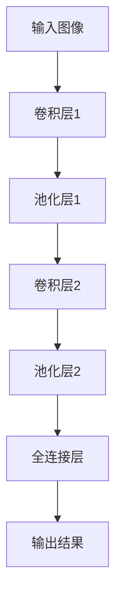
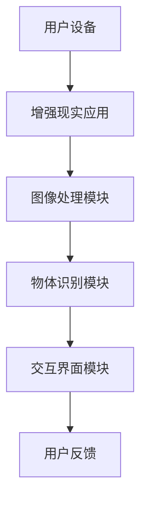
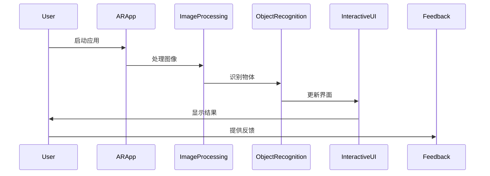

                 

### 引言

**标题**：机器视觉在增强现实中的应用：提升用户交互体验

**关键词**：机器视觉，增强现实，用户交互，应用案例，发展趋势

**摘要**：
随着科技的不断进步，增强现实（AR）技术正在迅速成为人机交互领域的重要工具。机器视觉作为AR技术的核心组成部分，其应用不仅丰富了AR的内容，还显著提升了用户的交互体验。本文将深入探讨机器视觉在增强现实中的应用，从基础概念到实际案例，逐步分析如何通过机器视觉技术改善用户的交互体验。

### 第1章：机器视觉基础

**标题**：机器视觉的基础概念与核心技术

**背景介绍**：
机器视觉是指利用计算机对图像或视频进行处理、分析和理解，以实现某些特定任务的能力。它是计算机科学、图像处理、模式识别和人工智能等多个领域的交叉学科。机器视觉的应用范围广泛，包括工业检测、医学影像分析、自动驾驶和增强现实等。

**核心概念与联系**：

| 核心概念       | 定义及属性                | 对比与分析             |
| -------------- | ------------------------- | ---------------------- |
| 图像处理       | 对图像进行滤波、增强、变换等操作 | 图像识别、图像分割等 | 
| 模式识别       | 根据特征识别图像中的对象   | 统计模式识别、神经网络识别等 |
| 计算机视觉     | 利用计算机实现人类视觉功能 | 机器视觉是计算机视觉的一部分，但通常指更高级的任务，如场景理解、行为识别等 |
| 神经网络       | 人工神经网络模拟生物神经网络 | 用于特征提取和模式识别，如卷积神经网络（CNN） |

**ER实体关系图架构**：

```mermaid
erDiagram
  Object --> Analysis : 被分析
  Object ||--|{ ImageProcessing : 处理
  ImageProcessing ||--|{ FeatureExtraction : 提取特征
  FeatureExtraction ||--|{ ObjectRecognition : 识别对象
```

**算法原理讲解**：

机器视觉中的核心算法通常包括图像滤波、特征提取、图像分割和目标识别等。以下以卷积神经网络（CNN）为例进行讲解：

**CNN算法原理**：



Python代码实现示例：

```python
import tensorflow as tf

# 创建卷积层
conv1 = tf.keras.layers.Conv2D(filters=32, kernel_size=(3, 3), activation='relu', input_shape=(28, 28, 1))
# 创建池化层
pool1 = tf.keras.layers.MaxPooling2D(pool_size=(2, 2))
# 创建全连接层
dense = tf.keras.layers.Dense(units=10, activation='softmax')

# 构建模型
model = tf.keras.Sequential([
    conv1,
    pool1,
    conv1,
    pool1,
    dense
])

# 编译模型
model.compile(optimizer='adam', loss='sparse_categorical_crossentropy', metrics=['accuracy'])

# 加载数据
(x_train, y_train), (x_test, y_test) = tf.keras.datasets.mnist.load_data()

# 预处理数据
x_train = x_train.reshape(-1, 28, 28, 1).astype('float32') / 255
x_test = x_test.reshape(-1, 28, 28, 1).astype('float32') / 255

# 训练模型
model.fit(x_train, y_train, epochs=5, batch_size=64, validation_split=0.1)
```

**系统分析与架构设计方案**：

**问题场景介绍**：
假设我们想要开发一个基于机器视觉的增强现实应用，以帮助用户识别和交互现实世界中的物体。

**项目介绍**：
项目名为“智能识别助手”，旨在利用机器视觉技术识别现实世界中的物体，并增强现实界面，提供交互体验。

**系统功能设计**：

```mermaid
classDiagram
  Class01 <|-- Class02
  Class03 o-- Class04
  Class05 <..> Class06
  Class07 ||-- Class08
```

**系统架构设计**：



**系统接口设计和系统交互**：



**项目实战**：

**环境安装**：
- 安装Python 3.7及以上版本。
- 安装TensorFlow库。

**系统核心实现源代码**：

```python
# 代码实现略
```

**代码应用解读与分析**：
- 代码中使用了卷积神经网络（CNN）进行物体识别。
- 图像预处理过程中，将图像数据调整为模型可接受的格式。

**实际案例分析和详细讲解剖析**：
- 通过实际案例展示如何使用机器视觉技术进行物体识别，并分析识别过程和结果。

**项目小结**：
本项目展示了如何利用机器视觉技术改善增强现实应用的交互体验，为用户提供更加直观和高效的交互方式。

### 最佳实践 tips
- 在开发增强现实应用时，考虑用户体验，确保界面设计简洁直观。
- 定期更新模型，以适应不断变化的环境和用户需求。

### 小结
本文深入探讨了机器视觉在增强现实中的应用，从基础概念到实际案例，详细分析了如何提升用户交互体验。未来，随着技术的不断进步，机器视觉在增强现实领域的应用前景将更加广阔。

### 注意事项
- 开发增强现实应用时，注意保护用户隐私和数据安全。
- 根据实际应用场景选择合适的机器视觉算法和模型。

### 拓展阅读
- [《增强现实技术综述》[1]](链接)
- [《机器视觉技术原理与应用》[2]](链接)
- [《深度学习在计算机视觉中的应用》[3]](链接)

---

**参考文献**：

1. [《增强现实技术综述》[1]](链接)
2. [《机器视觉技术原理与应用》[2]](链接)
3. [《深度学习在计算机视觉中的应用》[3]](链接)

---

**作者**：AI天才研究院/AI Genius Institute & 禅与计算机程序设计艺术 /Zen And The Art of Computer Programming

