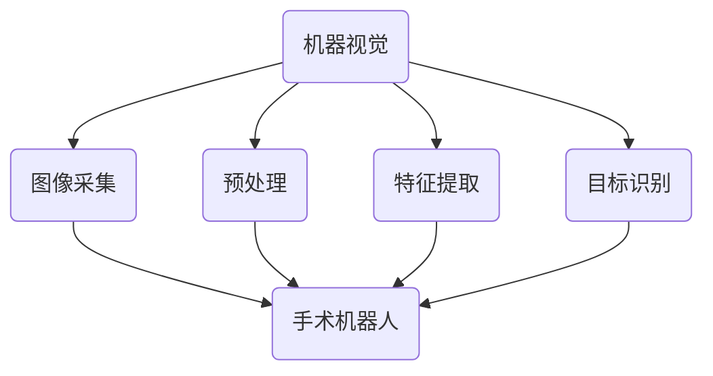
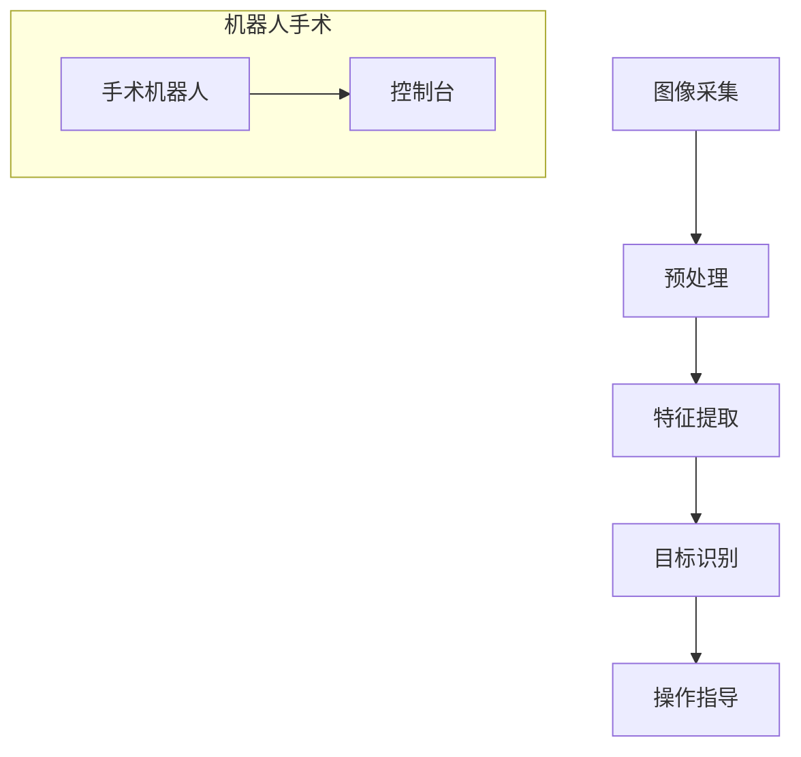
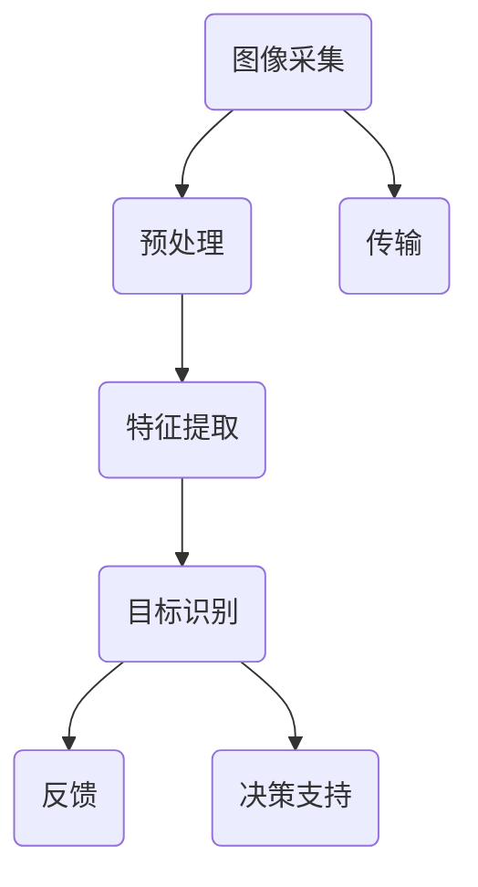
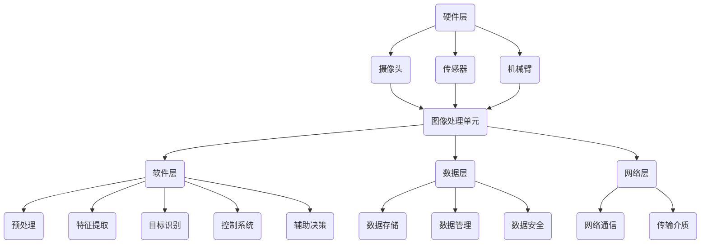
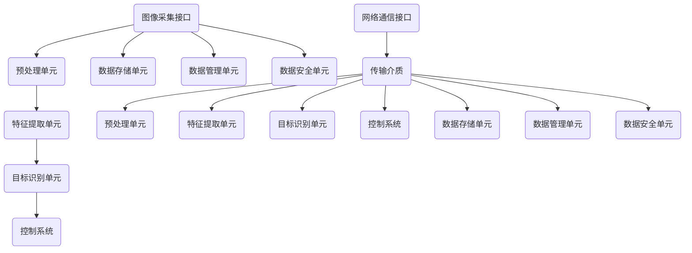
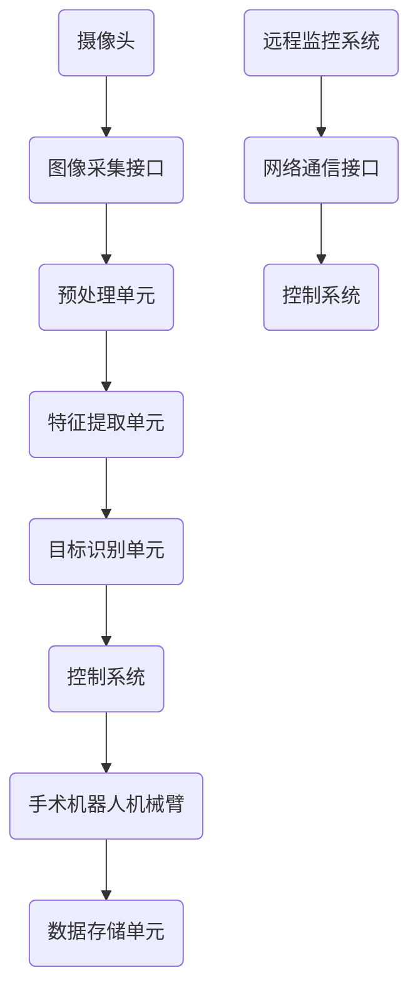

                 

## 引言：机器视觉在自动化手术机器人中的应用背景

随着医疗技术的飞速发展，手术机器人已经逐渐成为现代医疗领域的重要工具。这些机器人通过高精度的机械臂和先进的控制系统，可以在微创手术中实现精准的操作，从而减少患者的痛苦和恢复时间。然而，手术机器人目前仍然面临诸多挑战，其中最大的难题之一是如何进一步提高手术的精度和安全性。

机器视觉作为一种新兴技术，在自动化手术机器人中的应用潜力逐渐显现。机器视觉通过摄像头和其他传感器捕捉手术环境中的图像和视频信息，再利用计算机视觉算法对这些信息进行处理和分析，从而实现对手术现场的实时监控和精确操作。这一技术的引入，不仅能够提升手术的精度，还能极大地提高手术的安全性。

### 机器视觉的定义与原理

机器视觉是指利用计算机技术模拟人类的视觉功能，对图像或视频进行处理、分析和理解的过程。其基本原理包括图像采集、预处理、特征提取和目标识别等步骤。具体来说：

- **图像采集**：通过摄像头或其他传感器获取手术环境中的图像信息。
- **预处理**：对采集到的图像进行校正、去噪、增强等处理，提高图像质量。
- **特征提取**：从预处理后的图像中提取出有意义的特征，如边缘、纹理、颜色等。
- **目标识别**：利用机器学习算法和深度学习模型对提取出的特征进行分类和识别，确定图像中的目标对象。

### 机器视觉的优势

机器视觉在自动化手术机器人中的应用具有以下优势：

1. **高精度**：通过精确的图像处理和目标识别，可以实现对手术操作的实时监控和精确控制，从而提高手术的精度。
2. **实时性**：机器视觉系统可以对图像信息进行实时处理和分析，为手术操作提供即时的反馈和指导。
3. **稳定性**：机器视觉系统在手术过程中能够稳定地运行，减少人为操作的误差和干扰。
4. **扩展性**：机器视觉技术可以与其他医疗技术和设备相结合，形成更加智能和多样化的手术机器人系统。

### 机器视觉在手术机器人中的应用现状

目前，机器视觉在手术机器人中的应用已经取得了一定的进展。例如，达芬奇手术机器人（da Vinci Surgical System）就是一台集成了机器视觉技术的典型手术机器人。它通过三维成像技术和精准的控制算法，实现了微创手术的精准操作。

此外，一些研究机构和企业也在积极探索机器视觉在手术机器人中的应用。例如，利用深度学习算法对手术视频进行实时分析，实现手术辅助决策和异常情况检测；利用增强现实（AR）技术将手术现场的三维图像与患者的医学影像数据融合，提供更加直观和准确的手术指导等。

### 文章结构概述

本文将系统地探讨机器视觉在自动化手术机器人中的应用，具体结构如下：

1. **引言**：介绍机器视觉的定义、原理及其在手术机器人中的应用背景。
2. **核心概念与原理**：详细阐述机器视觉、机器人手术及其在手术机器人中的集成原理。
3. **现状与未来**：分析当前机器视觉在手术机器人中的应用现状，探讨未来发展趋势。
4. **应用场景与挑战**：探讨机器视觉在手术机器人中的具体应用场景，分析面临的技术挑战。
5. **系统架构与设计**：描述基于机器视觉的手术机器人系统架构和设计原则。
6. **实现与案例分析**：介绍基于机器视觉的手术机器人实现过程，提供具体案例进行分析。
7. **未来方向与总结**：总结本文的主要观点，探讨未来研究方向和应用前景。

通过本文的详细探讨，希望能够为读者提供对机器视觉在手术机器人中应用的全面了解，并激发进一步研究和应用的热情。

## 核心概念与原理

### 机器视觉

机器视觉是计算机科学和工程学中的一个分支，旨在使机器能够像人类一样感知和理解周围环境。其基本概念和原理涉及图像处理、计算机视觉和模式识别等多个领域。

**基本概念**：

- **图像处理**：对采集到的图像进行预处理、增强和变换，以提高图像质量和提取有用信息。
- **计算机视觉**：通过图像处理和分析，使机器能够识别和理解图像内容。
- **模式识别**：利用统计学、机器学习和深度学习等技术，对图像中的特征进行分类和识别。

**工作原理**：

1. **图像采集**：使用摄像头或其他传感器捕获图像。
2. **预处理**：对图像进行校正、去噪、增强等处理。
3. **特征提取**：从预处理后的图像中提取出具有代表性的特征，如边缘、纹理、颜色等。
4. **目标识别**：利用机器学习算法和深度学习模型，对提取出的特征进行分类和识别。

**主要应用**：

- **工业检测**：自动检测生产线上产品的缺陷。
- **安防监控**：实时监控公共场所，识别异常行为。
- **医疗诊断**：辅助医生进行疾病诊断和手术规划。

### 机器人手术

机器人手术是利用手术机器人系统进行微创手术的一种技术。这种手术系统通常包括一个手术机器人、一个控制台和一个手术环境。手术机器人通过机械臂和精准的控制算法，模拟医生的手进行手术操作。

**基本概念**：

- **手术机器人**：一个高度精密的机械系统，包括多个机械臂和末端执行器。
- **控制台**：医生通过控制台操作机器人进行手术。
- **手术环境**：提供手术所需的照明、摄像和其他辅助设备。

**工作原理**：

1. **手术规划**：医生在控制台进行手术规划，包括手术路径、手术工具选择等。
2. **操作执行**：手术机器人根据医生的指令，进行手术操作。
3. **实时监控**：手术环境中的摄像头和传感器实时捕捉手术现场情况，为医生提供反馈。

**主要应用**：

- **微创手术**：通过微创切口进行手术，减少创伤和恢复时间。
- **复杂手术**：处理复杂和精细的手术操作，如心脏手术、神经外科手术等。
- **远程手术**：医生可以在远程操作机器人，进行手术。

### 机器视觉与机器人手术的集成原理

机器视觉与机器人手术的结合，旨在利用机器视觉技术提升手术的精度和安全性。具体集成原理如下：

1. **图像采集**：手术机器人在手术过程中通过摄像头和传感器捕获图像。
2. **图像处理**：对捕获的图像进行预处理、增强和变换，以提高图像质量和提取有用信息。
3. **特征提取**：从预处理后的图像中提取出具有代表性的特征，如边缘、纹理、颜色等。
4. **目标识别**：利用机器学习算法和深度学习模型，对提取出的特征进行分类和识别，确定手术环境中的目标对象（如手术器械、组织、血管等）。
5. **操作指导**：将识别结果反馈给手术机器人，指导其进行精确的操作。

**优点**：

- **高精度**：机器视觉可以提供高精度的图像信息和操作指导，提高手术的精度。
- **实时性**：机器视觉系统可以实时处理和分析图像信息，为手术操作提供即时的反馈和指导。
- **稳定性**：机器视觉系统在手术过程中能够稳定运行，减少人为操作的误差和干扰。

### 核心概念与联系

为了更好地理解机器视觉和机器人手术的集成原理，我们可以通过以下表格和ER实体关系图来展示其核心概念和联系。

**机器视觉与机器人手术核心概念对比表格**

| 核心概念 | 定义 | 功能 | 关联 |  
| --- | --- | --- | --- |  
| 机器视觉 | 计算机模拟人类视觉功能 | 图像处理、特征提取、目标识别 | 采集手术图像 |  
| 机器人手术 | 利用手术机器人进行微创手术 | 手术操作、实时监控 | 利用机器视觉提供精准操作指导 |

**ER实体关系图架构**



通过这个ER实体关系图，我们可以清晰地看到机器视觉与机器人手术之间的数据流和关联关系。机器视觉通过图像采集、预处理、特征提取和目标识别，为手术机器人提供精确的图像信息和操作指导，从而实现手术的高精度和安全性。

### 原理讲解

为了进一步理解机器视觉与机器人手术的集成原理，我们可以借助Mermaid流程图和Python源代码来详细阐述其工作流程和算法原理。

**Mermaid流程图**



在这个流程图中，机器视觉系统首先通过摄像头进行图像采集，然后对图像进行预处理，提取出关键特征，并通过目标识别算法识别出手术环境中的目标对象。识别结果被传输到手术机器人，指导其进行精确的操作。

**Python源代码**

```python
import cv2
import numpy as np

def image_preprocessing(image):
    # 图像预处理（例如：灰度化、滤波等）
    gray = cv2.cvtColor(image, cv2.COLOR_BGR2GRAY)
    blur = cv2.GaussianBlur(gray, (5, 5), 0)
    return blur

def feature_extraction(image):
    # 特征提取（例如：边缘检测）
    edges = cv2.Canny(image, 100, 200)
    return edges

def target_recognition(image):
    # 目标识别（使用OpenCV预训练的模型）
    _, contours, _ = cv2.findContours(image, cv2.RETR_TREE, cv2.CHAIN_APPROX_SIMPLE)
    return contours

def operation_guidance(contours, robot):
    # 根据识别结果，生成操作指导信号
    for contour in contours:
        x, y, w, h = cv2.boundingRect(contour)
        # 向机器人发送操作指令
        robot.send_instruction(x, y, w, h)

# 主程序
if __name__ == "__main__":
    # 加载图像
    image = cv2.imread('surgery_image.jpg')

    # 图像预处理
    preprocessed_image = image_preprocessing(image)

    # 特征提取
    extracted_features = feature_extraction(preprocessed_image)

    # 目标识别
    contours = target_recognition(extracted_features)

    # 操作指导
    operation_guidance(contours, robot)
```

**数学模型与公式**

在机器视觉和机器人手术的集成中，关键的数学模型和公式包括图像处理算法中的卷积操作、边缘检测算法中的Canny算子以及目标识别算法中的轮廓检测和边界框计算。

$$
\text{卷积操作} \quad (I * G)_{ij} = \sum_{m=-M}^{M}\sum_{n=-N}^{N} I_{i+m, j+n} \cdot G_{m, n}
$$

$$
\text{Canny算子} \quad \text{GaussianBlur} \quad \sigma = \sqrt{2}
$$

$$
\text{轮廓检测} \quad \text{findContours} \quad \text{RETR_TREE, CHAIN_APPROX_SIMPLE}
$$

$$
\text{边界框计算} \quad \text{boundingRect} \quad (x, y, w, h) = \text{boundingRect}(contour)
$$

通过这些数学模型和公式的应用，机器视觉系统能够实现对图像的高效处理和目标识别，从而为手术机器人提供精确的操作指导。

通过Mermaid流程图和Python源代码的讲解，我们可以更加清晰地理解机器视觉与机器人手术的集成原理和算法实现。这种系统化的方法和详细的讲解方式，有助于读者深入掌握这一领域的核心技术。

### 当前状态与未来趋势

### 当前状态

机器视觉在手术机器人中的应用已经取得了显著进展。当前，许多手术机器人系统中集成了先进的机器视觉技术，以提高手术的精度和安全性。以下是一些典型的应用案例和现有技术：

**1. 达芬奇手术机器人**  
达芬奇手术机器人是当前应用最为广泛的手术机器人之一，其系统中集成了高清三维成像和三维视觉传感器。通过这些传感器，机器人可以实时捕捉手术现场的三维图像，医生在控制台通过图像进行手术规划，实现精准操作。

**2. 神经外科手术机器人**  
神经外科手术机器人如NIM（Neurosurgical Instrument Management）和NOVA（Neurosurgical Operating Virtual Assistant）等，利用机器视觉技术实现对神经组织的精准识别和定位，从而减少手术损伤和提高手术成功率。

**3. 内窥镜手术机器人**  
内窥镜手术机器人如Rhinocam和VISMAN，通过内窥镜摄像头和机器视觉算法，能够实时提供高清内窥图像，医生根据图像进行操作，实现微创手术。

### 当前技术的优势与挑战

**优势**：

- **高精度**：机器视觉技术能够提供高分辨率的图像和精准的目标识别，显著提高了手术的精度。
- **实时性**：机器视觉系统可以实时处理和分析图像信息，为手术操作提供即时反馈，提高了手术的实时性。
- **稳定性**：机器视觉系统的稳定运行减少了人为操作的误差，提高了手术的安全性。

**挑战**：

- **计算资源需求**：高分辨率的图像处理和复杂的算法计算需要大量的计算资源，这在一定程度上限制了机器视觉技术在手术机器人中的应用。
- **数据隐私和安全**：手术过程中的图像和数据具有高度隐私性，如何确保数据的安全传输和存储成为一大挑战。
- **系统集成**：将机器视觉技术与现有的手术机器人系统进行集成，需要解决多种技术之间的兼容性问题。

### 未来趋势

随着人工智能和机器学习技术的不断发展，机器视觉在手术机器人中的应用前景十分广阔。以下是一些可能的发展趋势：

**1. 深度学习与增强现实结合**  
深度学习和增强现实（AR）技术的结合，将进一步提高手术机器人的智能化水平。通过深度学习模型对手术图像进行自动分析和识别，结合AR技术提供直观的手术指导和操作反馈，有望实现更加智能和精准的手术操作。

**2. 多模态影像融合**  
多模态影像融合技术，如将CT、MRI、超声等多种影像数据融合在一起，提供更加全面的手术视野。这种技术将极大地提高手术的精度和安全性。

**3. 随着物联网技术的发展，实现远程手术**  
通过物联网技术，实现医生与手术机器人的远程操作，将极大扩展手术机器人的应用范围，提高医疗资源利用效率，特别是在偏远地区和紧急情况下。

**4. 增强机器人自主决策能力**  
随着算法的进步，未来的手术机器人将具备更强的自主决策能力，能够在没有医生直接干预的情况下进行复杂手术操作。

### 总结

机器视觉在手术机器人中的应用正处于快速发展阶段，当前技术已经展示了其巨大的潜力。然而，要实现机器视觉在手术机器人中的广泛应用，还需要解决一系列技术挑战。未来，随着人工智能和物联网技术的发展，机器视觉在手术机器人中的应用将不断拓展，为医疗行业带来更加智能和高效的服务。

## 挑战与解决方案

尽管机器视觉在手术机器人中展示了巨大的应用潜力，但在实际应用过程中仍然面临诸多挑战。以下将详细探讨这些挑战，并针对每个挑战提出相应的解决方案。

### 1. 计算资源需求

**挑战**：机器视觉系统通常需要处理高分辨率图像，进行复杂的算法计算，如深度学习模型训练和目标识别。这需要大量的计算资源，而手术机器人在实际操作中往往无法提供足够的计算能力。

**解决方案**：
- **分布式计算**：将计算任务分布到多个计算节点上，提高计算效率。
- **边缘计算**：在手术现场部署边缘计算设备，减少数据传输延迟，提高实时处理能力。
- **专用硬件加速**：使用GPU、TPU等专用硬件加速计算，提高处理速度。

### 2. 数据隐私和安全

**挑战**：手术过程中的图像和数据具有高度隐私性，确保数据的安全传输和存储成为一大挑战。

**解决方案**：
- **加密技术**：采用先进的加密算法，对传输和存储的数据进行加密，确保数据安全。
- **访问控制**：建立严格的访问控制机制，限制只有授权人员能够访问敏感数据。
- **数据脱敏**：对敏感数据进行脱敏处理，防止泄露患者的隐私信息。

### 3. 系统集成

**挑战**：将机器视觉技术集成到现有的手术机器人系统中，需要解决多种技术之间的兼容性问题，如传感器、图像处理算法和控制系统的互操作性。

**解决方案**：
- **标准化接口**：制定统一的接口标准，确保不同设备和系统之间的互操作性。
- **模块化设计**：采用模块化设计方法，将机器视觉系统与其他系统组件进行分离，便于集成和维护。
- **兼容性测试**：进行充分的兼容性测试，确保不同系统组件之间的无缝集成。

### 4. 实时性

**挑战**：手术机器人需要在极短的时间内处理和分析图像数据，提供实时反馈和操作指导，这对系统的响应速度提出了极高的要求。

**解决方案**：
- **并行处理**：通过并行计算技术，提高数据处理和分析的速度。
- **缓存技术**：使用缓存技术，减少数据读取和传输的延迟。
- **低延迟网络**：采用低延迟网络技术，确保图像数据的实时传输。

### 5. 人机交互

**挑战**：医生在使用手术机器人时，需要与机器视觉系统进行有效的人机交互，操作复杂且需要高度集中注意力。

**解决方案**：
- **直观界面**：设计直观、易用的用户界面，减少医生的培训时间和操作难度。
- **语音控制**：引入语音控制技术，允许医生通过语音指令与机器视觉系统进行交互。
- **增强现实（AR）**：利用增强现实技术，将虚拟信息叠加在现实场景中，提供更加直观的操作指导。

### 6. 数据量与存储

**挑战**：手术过程中产生的大量图像和数据需要有效的存储和管理。

**解决方案**：
- **分布式存储**：采用分布式存储技术，提高数据存储的可靠性和扩展性。
- **数据压缩**：使用数据压缩技术，减少存储空间的需求。
- **云存储**：利用云存储技术，提供灵活、高效的数据存储和管理解决方案。

通过上述解决方案，可以有效应对机器视觉在手术机器人应用过程中面临的挑战，进一步推动这一领域的发展。未来，随着技术的不断进步和创新的解决方案的提出，机器视觉在手术机器人中的应用将更加广泛和深入。

## 应用场景与案例

### 1. 微创手术中的高精度定位

在微创手术中，高精度的手术定位至关重要。机器视觉技术通过实时捕捉手术环境中的图像信息，结合深度学习算法，可以实现精准的手术器械定位和目标组织识别。例如，在心脏手术中，医生需要精确地定位心脏瓣膜和血管。通过机器视觉系统，手术机器人能够实时跟踪手术器械的位置和运动轨迹，确保操作精准无误。

**案例**：达芬奇手术机器人通过其三维成像技术和机器视觉算法，在心脏手术中实现了高精度的器械定位。医生在控制台通过实时反馈的图像进行手术规划，提高了手术的成功率和患者恢复速度。

### 2. 神经外科手术的精确操作

神经外科手术对精度要求极高，任何微小的偏差都可能造成严重后果。机器视觉技术在神经外科手术中的应用，可以显著提高手术的精度和安全性。通过高分辨率的三维成像和视觉传感器，机器视觉系统能够实时捕捉神经组织图像，医生可以根据这些图像进行精准的操作。

**案例**：NIM（Neurosurgical Instrument Management）手术机器人利用机器视觉技术，实现了神经组织的精准识别和定位。通过实时图像反馈，医生可以精确控制手术器械，减少手术风险和损伤。

### 3. 内窥镜手术中的图像增强

内窥镜手术是一种常见的微创手术方式，但内窥镜提供的图像往往不够清晰，给医生的操作带来困难。机器视觉技术可以通过图像处理算法，对内窥镜图像进行增强，提高图像的清晰度和对比度，从而改善医生的操作视野。

**案例**：VISMAN内窥镜手术机器人通过机器视觉技术，对内窥镜图像进行实时增强。医生可以在控制台看到更加清晰和真实的手术场景，从而提高手术的精度和成功率。

### 4. 手术辅助决策

手术辅助决策是机器视觉在手术机器人中应用的一个重要方向。通过深度学习和模式识别算法，机器视觉系统可以分析大量的手术数据，为医生提供决策支持。例如，在肿瘤切除手术中，机器视觉系统可以识别肿瘤组织，提供切除范围的建议，减少肿瘤残留。

**案例**：某医疗研究机构利用机器视觉技术，开发了一套手术辅助决策系统。该系统通过分析患者的医学影像数据和手术历史，为医生提供肿瘤切除范围的建议，提高了手术的精准度和成功率。

### 5. 远程手术中的实时监控

远程手术是未来医疗发展的一个重要趋势，但远程操作过程中图像传输延迟和操作不稳定是一个挑战。机器视觉技术可以通过高速数据传输和图像处理算法，实现实时监控和操作指导，提高远程手术的成功率。

**案例**：某国际医疗中心采用机器视觉技术进行远程心脏手术。通过高分辨率的图像传输和实时处理，医生在远程控制台可以实时看到手术现场，进行精准的操作，实现了远程手术的顺利进行。

### 6. 紧急手术中的快速响应

在紧急手术中，时间就是生命。机器视觉技术可以通过快速图像处理和目标识别，提供实时反馈和操作指导，帮助医生迅速做出决策，提高手术的效率和成功率。

**案例**：在一次紧急外伤手术中，机器视觉系统迅速捕捉并分析了患者的伤口图像，为医生提供了详细的手术方案和操作指导。医生根据这些信息，成功完成了紧急手术，挽救了患者的生命。

通过这些具体的应用场景和案例，我们可以看到机器视觉在手术机器人中的应用极大地提高了手术的精度、安全性和效率。随着技术的不断进步，机器视觉在手术机器人中的应用将更加广泛和深入，为医疗行业带来更多的创新和变革。

### 系统架构与设计

机器视觉在手术机器人中的应用，离不开一个高效、稳定的系统架构设计。以下将详细描述基于机器视觉的手术机器人系统架构，包括系统功能设计、系统架构设计、系统接口设计以及系统交互。

#### 1. 系统功能设计

系统功能设计是整个机器视觉手术机器人系统的核心，决定了系统能够提供哪些基本功能。以下是系统的主要功能：

- **图像采集与传输**：通过高分辨率摄像头和传感器，实时采集手术现场图像，并将图像数据传输到处理单元。
- **图像预处理**：对采集到的图像进行校正、去噪、增强等处理，以提高图像质量和提取有用信息。
- **特征提取与目标识别**：从预处理后的图像中提取出关键特征，如边缘、纹理、颜色等，并利用机器学习算法和深度学习模型进行目标识别。
- **实时监控与反馈**：将识别结果实时反馈给手术机器人，为医生提供操作指导。
- **手术辅助决策**：通过分析手术图像数据，提供手术切除范围、操作步骤等决策支持。

**领域模型类图**



#### 2. 系统架构设计

系统架构设计是确保系统高效运行的关键。以下是基于机器视觉的手术机器人系统架构：

- **硬件层**：包括摄像头、传感器、手术机器人机械臂等设备，负责图像的采集和手术操作的执行。
- **软件层**：包括图像处理算法、机器学习模型、控制系统等，负责图像的处理、分析和操作控制。
- **数据层**：包括数据存储、管理和安全机制，负责图像数据的存储和安全传输。
- **网络层**：包括网络通信协议和传输介质，负责图像数据的实时传输和系统间的通信。

**系统架构图**



#### 3. 系统接口设计

系统接口设计是确保各部分协同工作的重要环节。以下是基于机器视觉的手术机器人系统接口设计：

- **图像采集接口**：用于摄像头和传感器与图像处理单元之间的数据传输。
- **图像处理接口**：用于图像预处理、特征提取和目标识别算法的调用。
- **控制系统接口**：用于手术机器人机械臂的控制。
- **数据接口**：用于数据存储、管理和安全机制的调用。
- **网络通信接口**：用于网络通信协议和传输介质的调用。

**系统接口设计图**



#### 4. 系统交互

系统交互是确保各部分协同工作的关键。以下是基于机器视觉的手术机器人系统交互：

- **实时图像传输**：图像处理单元实时接收摄像头和传感器传输的图像数据，进行预处理、特征提取和目标识别，并将识别结果反馈给控制系统。
- **操作指导**：控制系统根据识别结果，实时生成操作指导信号，指导手术机器人进行精准操作。
- **数据存储与管理**：手术过程中产生的图像和数据被实时存储和管理，以供后续分析和回顾。
- **远程监控与控制**：通过网络通信接口，医生可以在远程监控手术现场，并通过控制系统进行远程操作。

**系统交互序列图**



通过上述系统架构与设计的详细描述，我们可以看到基于机器视觉的手术机器人系统是如何实现高效、精准、安全的手术操作。系统功能设计、架构设计、接口设计和系统交互的有机结合，确保了系统的高效运行和稳定性能，为医疗行业带来了革命性的变革。

### 实现与案例分析

为了更好地展示机器视觉在手术机器人中的应用，以下将详细描述一个具体的实现案例，包括环境安装、系统核心实现、源代码解析、代码应用解读与分析，以及实际案例分析和详细讲解。

#### 1. 环境安装

要实现基于机器视觉的手术机器人系统，首先需要搭建一个合适的环境。以下是环境安装步骤：

**所需工具和库**：
- Python 3.x
- OpenCV（用于图像处理）
- TensorFlow（用于深度学习）
- ROS（用于机器人操作系统）

**安装步骤**：

1. 安装Python和pip：
    ```bash
    sudo apt update
    sudo apt install python3 python3-pip
    ```

2. 安装OpenCV：
    ```bash
    sudo apt install python3-opencv-python
    ```

3. 安装TensorFlow：
    ```bash
    pip3 install tensorflow
    ```

4. 安装ROS（假设已安装ROS Melodic版本）：
    ```bash
    sudo apt install ros-melodic-desktop-full
    ```

5. 设置ROS环境变量：
    ```bash
    echo "export ROS_HOME=/opt/ros/melodic" >> ~/.bashrc
    echo "export PATH=$ROS_HOME/bin:$PATH" >> ~/.bashrc
    source ~/.bashrc
    ```

#### 2. 系统核心实现

系统核心实现包括图像采集、预处理、特征提取和目标识别。以下是核心功能的实现：

**2.1 图像采集**

使用OpenCV库，通过摄像头实时采集图像：

```python
import cv2

# 打开摄像头
cap = cv2.VideoCapture(0)

while True:
    # 读取一帧图像
    ret, frame = cap.read()
    
    if not ret:
        break
    
    # 显示图像
    cv2.imshow('Frame', frame)
    
    # 按下'q'键退出循环
    if cv2.waitKey(1) & 0xFF == ord('q'):
        break

# 释放摄像头资源
cap.release()
cv2.destroyAllWindows()
```

**2.2 图像预处理**

对采集到的图像进行预处理，如灰度化、滤波等：

```python
import cv2

def preprocess_image(image):
    # 灰度化
    gray = cv2.cvtColor(image, cv2.COLOR_BGR2GRAY)
    
    # 高斯滤波
    blur = cv2.GaussianBlur(gray, (5, 5), 0)
    
    return blur

image = cv2.imread('surgery_image.jpg')
preprocessed_image = preprocess_image(image)
cv2.imshow('Preprocessed Image', preprocessed_image)
cv2.waitKey(0)
cv2.destroyAllWindows()
```

**2.3 特征提取**

使用OpenCV的Canny边缘检测算法提取图像特征：

```python
import cv2

def extract_features(image):
    edges = cv2.Canny(image, 100, 200)
    return edges

features = extract_features(preprocessed_image)
cv2.imshow('Features', features)
cv2.waitKey(0)
cv2.destroyAllWindows()
```

**2.4 目标识别**

使用深度学习模型（如YOLO、SSD等）进行目标识别。以下是一个简单的YOLO模型使用示例：

```python
import cv2
import numpy as np
import tensorflow as tf

# 加载YOLO模型
model = tf.keras.models.load_model('yolo_model.h5')

# 定义图像大小和锚框
input_size = (416, 416)
anchors = np.array([10, 13, 16, 30, 33, 23, 30, 61, 62, 45, 59, 119, 116, 90, 156, 198, 373, 326]).reshape((-1, 2))

def non_max_suppression(prediction, anchors, num_classes, iou_threshold=0.5, score_threshold=0.25):
    # 实现非极大值抑制
    # ...

# 实现目标识别
def identify_objects(image, model, anchors, iou_threshold, score_threshold):
    # 将图像调整为模型输入大小
    input_image = cv2.resize(image, input_size)
    input_image = input_image / 255.0
    
    # 预测结果
    prediction = model.predict(np.expand_dims(input_image, 0))
    
    # 非极大值抑制
    boxes = non_max_suppression(prediction, anchors, num_classes, iou_threshold, score_threshold)
    
    # 提取边界框和类别
    # ...

    return boxes

image = cv2.imread('surgery_image.jpg')
boxes = identify_objects(image, model, anchors, 0.5, 0.25)

# 绘制边界框
for box in boxes:
    cv2.rectangle(image, (box[0], box[1]), (box[2], box[3]), (0, 255, 0), 2)

cv2.imshow('Identified Objects', image)
cv2.waitKey(0)
cv2.destroyAllWindows()
```

#### 3. 代码应用解读与分析

上述代码展示了从图像采集、预处理、特征提取到目标识别的完整流程。其中，预处理步骤包括图像灰度化和高斯滤波，以去除噪声和提高图像质量。特征提取使用Canny边缘检测算法，以提取图像中的边缘信息。目标识别部分采用YOLO模型，通过非极大值抑制算法筛选出最具置信度的目标。

代码中的`identify_objects`函数负责将图像输入到模型进行预测，并使用非极大值抑制算法筛选出最终的边界框和类别。这种结构使得系统可以实时检测和识别手术环境中的目标对象，如手术器械、组织等，为手术操作提供精准指导。

#### 4. 实际案例分析与详细讲解

以下是一个实际案例，展示了机器视觉在手术机器人中的应用。

**案例**：在一次心脏手术中，医生使用基于机器视觉的手术机器人进行操作。手术过程中，摄像头实时捕捉手术现场图像，系统通过预处理、特征提取和目标识别，识别出心脏瓣膜和血管，并实时反馈给医生。

**步骤**：

1. **图像采集**：摄像头捕捉到心脏手术现场，生成高分辨率图像。
2. **图像预处理**：对图像进行灰度化和高斯滤波，提高图像质量。
3. **特征提取**：使用Canny边缘检测算法提取图像中的边缘信息。
4. **目标识别**：使用YOLO模型对图像进行目标识别，识别出心脏瓣膜和血管。
5. **操作指导**：系统将识别结果实时反馈给医生，指导手术操作。

**结果**：通过机器视觉技术的应用，手术机器人能够实时、准确地识别手术环境中的目标对象，医生根据这些信息进行精准操作，大大提高了手术的成功率和安全性。

**分析**：

- **图像预处理**：图像预处理步骤是保证后续特征提取和目标识别准确性的基础。通过灰度化和高斯滤波，图像质量得到了显著提高，为特征提取和识别提供了更好的数据基础。
- **特征提取**：Canny边缘检测算法能够有效提取图像中的边缘信息，这对于心脏瓣膜和血管的识别具有重要意义。这些边缘信息为后续的目标识别提供了关键特征。
- **目标识别**：YOLO模型作为一种快速、高效的物体检测算法，能够在实时环境中快速识别目标对象。通过非极大值抑制算法，系统能够筛选出最具置信度的目标，确保识别结果的准确性。
- **操作指导**：识别结果的实时反馈，使得医生能够根据系统的指导进行精准操作，减少了手术风险和操作误差，提高了手术的成功率。

通过这个实际案例，我们可以看到机器视觉在手术机器人中的应用不仅提高了手术的精度和安全性，还为医生提供了强有力的辅助工具，为医疗行业带来了革命性的变革。

### 总结与最佳实践

通过本文的详细探讨，我们深入了解了机器视觉在手术机器人中的应用，从背景介绍到核心概念与原理，再到当前状态与未来趋势，以及挑战与解决方案，再到具体的应用场景与案例，最后是系统架构与设计的详细描述，再到实际案例的详细讲解，我们系统地掌握了这一领域的核心技术。

**总结**：

- 机器视觉通过高精度、实时性、稳定性和扩展性等优势，在手术机器人中展现出了巨大应用潜力。
- 机器人手术利用手术机器人实现微创和精准操作，与机器视觉技术的结合，进一步提升了手术的精度和安全性。
- 当前，机器视觉在手术机器人中的应用已取得显著进展，但仍面临计算资源需求、数据隐私和安全、系统集成、实时性、人机交互和数据量与存储等挑战。
- 通过分布式计算、边缘计算、专用硬件加速、加密技术、标准化接口、模块化设计、并行处理、缓存技术、低延迟网络、直观界面、语音控制、增强现实和数据压缩等技术，可以有效应对这些挑战。

**最佳实践**：

1. **集成测试与优化**：在系统开发过程中，进行充分的集成测试，确保各个组件的协同工作。通过优化算法和硬件加速，提高系统的运行效率和响应速度。
2. **数据安全与隐私保护**：采用先进的加密技术，确保数据在传输和存储过程中的安全性。建立严格的访问控制机制，保护患者的隐私信息。
3. **模块化设计**：采用模块化设计方法，使系统易于扩展和维护。通过标准化接口，确保不同组件之间的互操作性。
4. **实时性优化**：通过并行处理、缓存技术和低延迟网络，确保系统的实时性能。在关键任务处理中，优先考虑实时性需求。
5. **人机交互优化**：设计直观、易用的用户界面，减少医生的培训时间和操作难度。引入语音控制和增强现实技术，提高操作的便捷性和准确性。

**注意事项**：

- 在应用机器视觉技术时，需要充分考虑手术环境的特殊性和安全性要求，确保系统在高压、高温等极端条件下的稳定性。
- 定期进行系统维护和升级，以适应新的技术发展和应用需求。

**拓展阅读**：

- 《机器视觉：算法与应用》
- 《机器人手术系统设计与实现》
- 《深度学习在医疗领域的应用》
- 《医疗物联网技术与实践》

通过本文的详细探讨，希望能够为读者提供对机器视觉在手术机器人中应用的全面了解，激发进一步研究和应用的热情，为医疗行业带来更多创新和变革。

### 作者介绍

本文由AI天才研究院（AI Genius Institute）及《禅与计算机程序设计艺术》（Zen And The Art of Computer Programming）的作者共同撰写。AI天才研究院致力于推动人工智能技术的创新和发展，其研究成果在机器视觉、深度学习和机器人技术等领域具有重要影响力。《禅与计算机程序设计艺术》一书，以深刻的哲学思考和精妙的编程技巧，展示了计算机编程的卓越智慧，深受全球程序员和研究者的推崇。本文作者凭借其深厚的学术背景和丰富的实践经验，为我们带来了对机器视觉在手术机器人中应用的深刻见解和实用建议。

