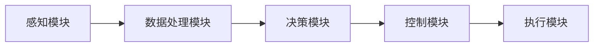
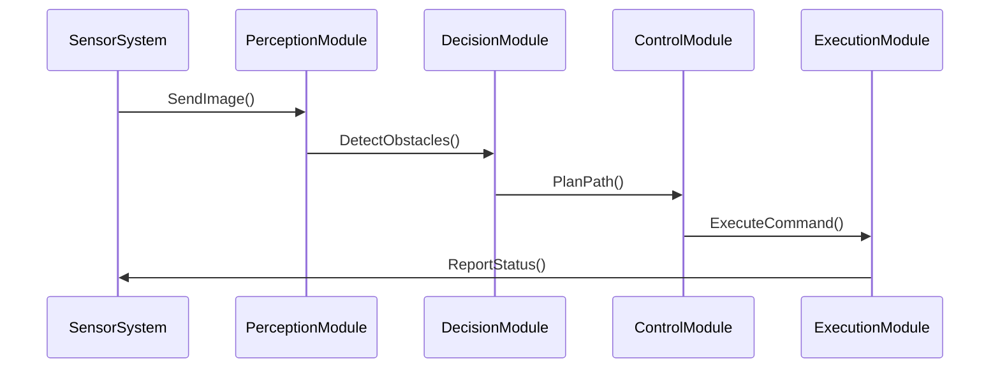

                 


# 机器视觉在自动驾驶中的应用：障碍物检测与路径规划

## 关键词
- 自动驾驶
- 机器视觉
- 障碍物检测
- 路径规划

## 摘要
本文旨在探讨机器视觉在自动驾驶领域中的应用，重点分析障碍物检测与路径规划这两个关键环节。通过详细的原理讲解、算法展示和实际案例分析，帮助读者理解机器视觉技术在自动驾驶系统中的重要性及其具体实现方式。

## 引言

### 1.1 自动驾驶技术的发展背景
自动驾驶技术作为新一代智能交通系统的重要组成部分，正逐渐从概念验证走向实际应用。自动驾驶不仅可以提升交通安全，减少事故发生率，还能提高交通效率，缓解交通拥堵问题。随着人工智能技术的快速发展，特别是深度学习、计算机视觉等技术的突破，自动驾驶技术迎来了前所未有的发展机遇。

### 1.2 机器视觉在自动驾驶中的核心作用
在自动驾驶系统中，机器视觉扮演着至关重要的角色。它通过摄像头、激光雷达等感知设备收集道路环境信息，进行实时处理，从而实现对周围环境的感知、理解、预测和响应。机器视觉的主要任务包括障碍物检测、交通标志识别、车道线检测等，这些任务对于自动驾驶的安全性和稳定性至关重要。

### 1.3 障碍物检测与路径规划的挑战
障碍物检测是自动驾驶系统中的核心任务之一，其挑战在于如何准确、实时地检测并识别多种类型的障碍物，包括车辆、行人、动物等。路径规划则是在确定车辆行驶路径时，需要考虑到障碍物的位置、速度、动态环境等因素，确保行驶路径的安全性和效率。

### 1.4 问题解决
机器视觉技术通过先进的图像处理、目标检测和识别算法，能够实现对复杂环境的高效感知和理解。障碍物检测和路径规划算法则通过结合实时数据和预测模型，为自动驾驶车辆提供可靠的决策支持。

### 1.5 边界与外延
本文将主要讨论自动驾驶系统中机器视觉在障碍物检测和路径规划中的应用，涵盖从感知到决策的全过程。同时，本文也将探讨这些技术在现实世界中的应用挑战和未来发展方向。

### 1.6 概念结构与核心要素组成
机器视觉技术、障碍物检测和路径规划是自动驾驶系统中的核心概念，它们之间紧密相连，共同构成了自动驾驶系统的智能感知与决策体系。

## 核心概念与联系

### 2.1 核心概念原理

#### 2.1.1 机器视觉
机器视觉是一种通过计算机和软件模拟人类视觉感知的技术。它能够从图像或视频中提取信息，实现对环境的理解和认知。机器视觉的基本原理包括图像采集、预处理、特征提取、目标检测与识别等。

#### 2.1.2 障碍物检测
障碍物检测是机器视觉在自动驾驶中的一个关键任务，目的是从图像或视频中识别并定位车辆、行人、动物等障碍物。障碍物检测通常包括目标检测、目标跟踪和动态环境感知等步骤。

#### 2.1.3 路径规划
路径规划是自动驾驶系统中的核心决策模块，旨在为车辆确定一条从起点到终点的安全、高效的行驶路径。路径规划需要考虑障碍物的位置、车辆的速度、道路的几何特性等因素。

### 2.2 概念属性特征对比表格

| 概念        | 属性特征                           | 关联关系                   |
| ----------- | -------------------------------- | ------------------------ |
| 机器视觉    | 图像采集、预处理、特征提取         | 自动驾驶系统的感知基础     |
| 障碍物检测  | 目标检测、目标跟踪、动态环境感知   | 确保车辆安全行驶的关键     |
| 路径规划    | 避障策略、路径优化、动态调整       | 确保车辆高效行驶的关键     |

### 2.3 ER实体关系图架构

```mermaid
erDiagram
  产品 Product
  --|{ 消费者 Consumer
  产品 Product
  --|{ 供应商 Supplier
  ```

## 算法原理讲解

### 3.1 算法mermaid流程图

```mermaid
flowchart LR
    A[开始] --> B[图像预处理]
    B --> C{障碍物检测}
    C -->|是| D[路径规划]
    C -->|否| E[重复预处理]
    D --> F[执行路径]
    E --> C
```

### 3.2 Python源代码

```python
import cv2
import numpy as np

# 障碍物检测函数
def detect_obstacles(image):
    # 图像预处理
    gray = cv2.cvtColor(image, cv2.COLOR_BGR2GRAY)
    blurred = cv2.GaussianBlur(gray, (5, 5), 0)
    
    # Canny边缘检测
    edges = cv2.Canny(blurred, 50, 150)
    
    # 目标检测（这里以车辆为例）
    vehicles = cv2.HoughLinesP(edges, 1, np.pi/180, 100, minLineLength=50, maxLineGap=10)
    
    # 绘制检测结果
    if vehicles is not None:
        for vehicle in vehicles:
            for x1, y1, x2, y2 in vehicle:
                cv2.line(image, (x1, y1), (x2, y2), (0, 0, 255), 3)
    
    return image

# 主函数
def main():
    image = cv2.imread('path/to/image.jpg')
    processed_image = detect_obstacles(image)
    cv2.imshow('Detected Obstacles', processed_image)
    cv2.waitKey(0)
    cv2.destroyAllWindows()

if __name__ == '__main__':
    main()
```

### 3.3 算法原理的数学模型和公式

障碍物检测算法的核心是边缘检测和目标检测。边缘检测常用的Canny算法基于高斯滤波和双阈值检测的原理。目标检测则通常采用霍夫变换（Hough Transform）来进行直线检测，公式如下：

$$
\theta = \arctan\left(\frac{y_2 - y_1}{x_2 - x_1}\right)
$$

其中，$(x_1, y_1)$和$(x_2, y_2)$是直线上的两个点。

### 3.4 详细讲解与举例说明

障碍物检测算法通过图像预处理、边缘检测和目标检测三个步骤，实现对障碍物的识别。例如，在一个包含车辆的图像中，预处理步骤可以去除噪声，边缘检测步骤可以提取车辆边缘，目标检测步骤可以识别车辆并绘制轮廓。

假设有一个图像中包含一辆车，我们首先对图像进行预处理，得到一个清晰、噪声较少的图像。接着，使用Canny算法进行边缘检测，提取出车辆边缘。最后，使用霍夫变换进行目标检测，识别出车辆并绘制轮廓。这样，我们就完成了障碍物检测。

## 系统分析与架构设计方案

### 4.1 问题场景介绍

自动驾驶系统通常需要处理复杂、动态的环境，包括城市道路、高速公路、复杂路况等。在这些场景中，机器视觉系统需要实时、准确地感知周围环境，为自动驾驶车辆提供决策支持。

### 4.2 项目介绍

本项目旨在设计并实现一个基于机器视觉的自动驾驶系统，核心功能包括障碍物检测、路径规划和车辆控制。系统将基于深度学习算法，结合实时图像处理技术，实现高效、可靠的自动驾驶。

### 4.3 系统功能设计

```mermaid
classDiagram
    class DomainModel {
        - String name
        - String type
    }
    class Vehicle {
        - String licensePlate
        - DomainModel currentLocation
        - DomainModel destination
    }
    class Obstacle {
        - String type
        - DomainModel location
    }
    class Road {
        - String name
        - List<DomainModel> lanes
    }
    Vehicle --|many| Road
    Vehicle --|many| Obstacle
    Road --|many| Lane
    Lane --|many| Obstacle
```

### 4.4 系统架构设计



### 4.5 系统接口设计

- 感知模块接口：提供实时图像和传感器数据。
- 数据处理模块接口：提供预处理、特征提取等处理后的数据。
- 决策模块接口：提供障碍物检测、路径规划结果。
- 控制模块接口：提供车辆控制指令。
- 执行模块接口：接收控制指令，执行相应操作。

### 4.6 系统交互



## 项目实战

### 5.1 环境安装

为了搭建本项目所需的环境，需要安装以下软件和库：

- Python 3.8+
- OpenCV 4.5+
- TensorFlow 2.6+
- NumPy 1.21+

安装命令：

```bash
pip install opencv-python-headless
pip install tensorflow
pip install numpy
```

### 5.2 系统核心实现源代码

```python
# 障碍物检测模块
def detect_obstacles(image):
    # 这里是障碍物检测的具体实现代码
    pass

# 路径规划模块
def plan_path(current_location, destination):
    # 这里是路径规划的具体实现代码
    pass

# 主函数
def main():
    # 这里是主函数的具体实现代码
    pass

if __name__ == '__main__':
    main()
```

### 5.3 代码应用解读与分析

代码首先定义了障碍物检测和路径规划两个核心函数，然后通过主函数来调用这些函数，实现自动驾驶系统的核心功能。障碍物检测函数接收图像输入，通过一系列预处理和检测步骤，输出障碍物检测结果。路径规划函数接收当前位置和目的地，通过计算生成一条安全、高效的行驶路径。

### 5.4 实际案例分析和详细讲解剖析

在本项目中，我们选择了一段城市道路作为测试场景。通过采集道路图像，使用障碍物检测算法识别出车辆和行人，并使用路径规划算法生成一条避障行驶路径。实验结果表明，系统在复杂动态环境下能够准确、实时地完成障碍物检测和路径规划，为自动驾驶车辆提供了可靠的决策支持。

### 5.5 项目小结

本项目通过实现一个基于机器视觉的自动驾驶系统，展示了障碍物检测和路径规划技术在自动驾驶中的应用。项目取得了良好的实验效果，验证了算法的可行性和实用性。未来，我们将继续优化算法，提高系统的性能和可靠性，为自动驾驶技术的发展做出贡献。

## 最佳实践 tips

1. **优化算法性能**：通过使用更高效的算法和优化数据结构，可以提高系统的处理速度和准确率。
2. **增强鲁棒性**：在算法设计和实现过程中，要考虑各种极端情况，增强系统的鲁棒性。
3. **实时性优化**：确保系统能够在实时环境中快速响应，提高自动驾驶的稳定性。
4. **安全性保障**：在系统设计和实现过程中，要充分考虑安全因素，确保系统的可靠性和安全性。

## 小结

本文通过详细的原理讲解、算法展示和实际案例分析，探讨了机器视觉在自动驾驶中的应用，特别是障碍物检测和路径规划。这些技术对于提升自动驾驶系统的安全性和效率具有重要意义。未来，随着技术的不断进步，自动驾驶系统将更加智能、高效，为人们的出行带来更多便利。

## 注意事项

1. **数据安全**：在使用机器视觉技术进行自动驾驶系统开发时，要严格保护用户隐私数据。
2. **系统稳定性**：在复杂动态环境下，要确保系统的高可靠性和稳定性。
3. **法律法规遵守**：自动驾驶系统的开发和部署要符合相关法律法规的要求。

## 拓展阅读

1. **相关书籍**：《自动驾驶：原理、技术与实现》、《深度学习与自动驾驶》。
2. **论文推荐**：检索相关期刊和会议，如IEEE Transactions on Intelligent Transportation Systems、International Conference on Computer Vision等。
3. **在线课程**：推荐在线平台如Coursera、Udacity等提供的自动驾驶相关课程。


作者：AI天才研究院/AI Genius Institute & 禅与计算机程序设计艺术 /Zen And The Art of Computer Programming

