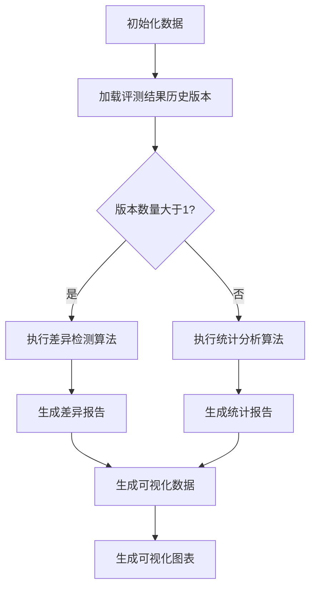
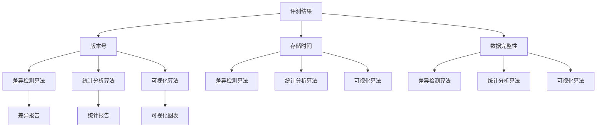
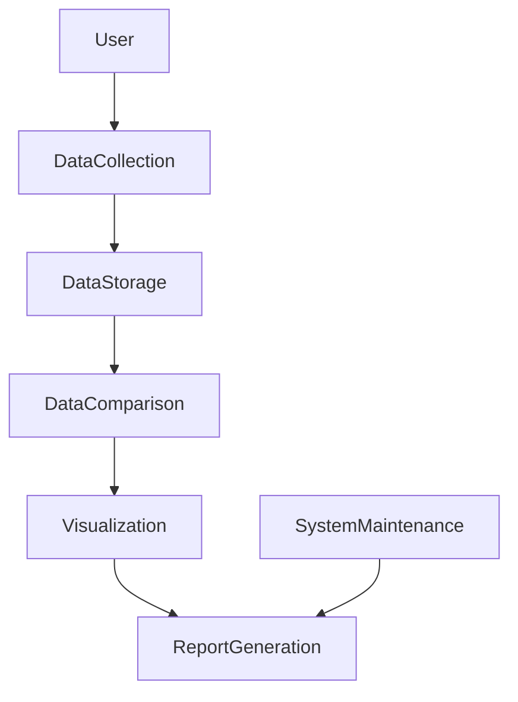
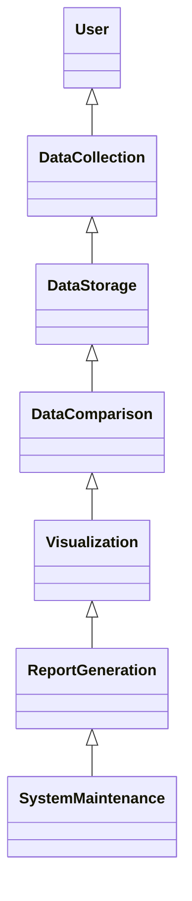
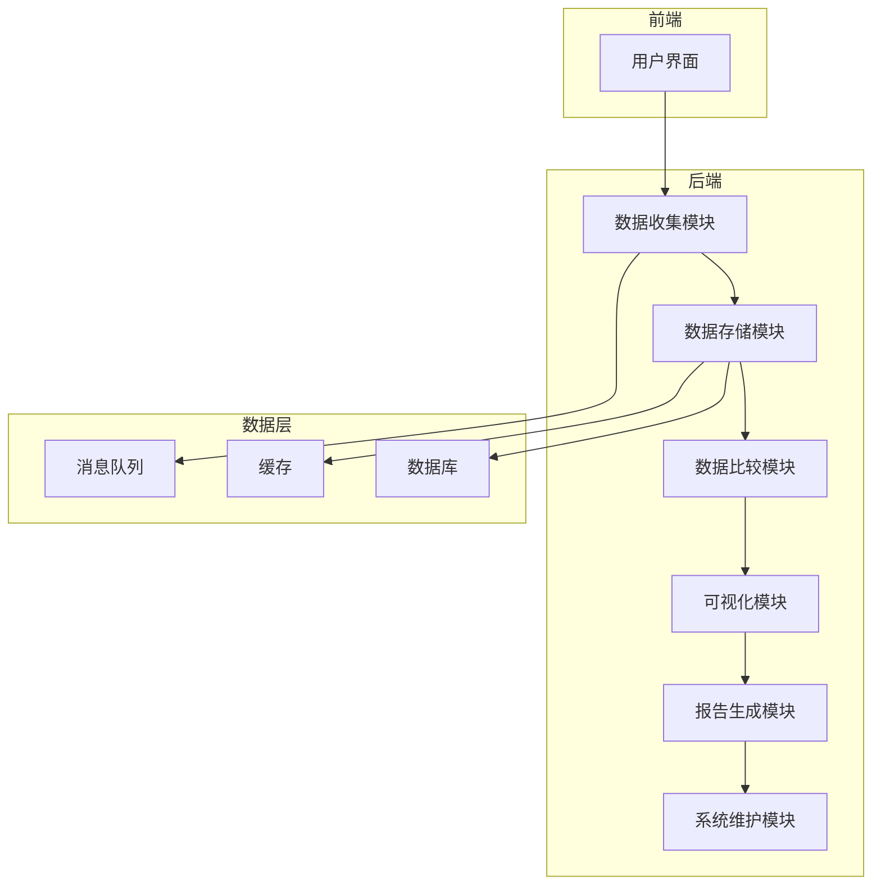
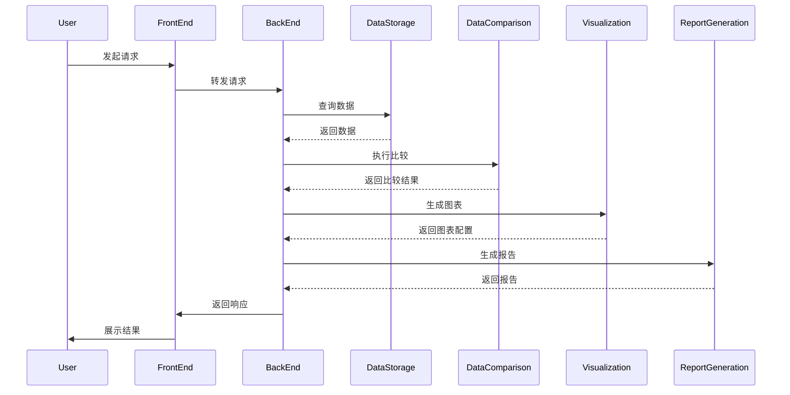
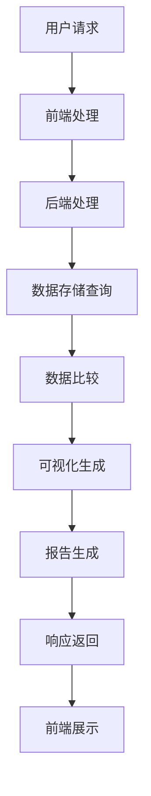

                 

## 第3章：算法原理讲解

### 3.1 算法背景

评测结果的历史版本比较功能的核心在于算法的实现。算法的设计不仅要能够高效地处理大规模数据，还要确保结果的准确性和可靠性。以下是算法原理的详细讲解。

#### 3.1.1 算法基本概念

在评测结果的历史版本比较中，我们主要涉及以下算法概念：

1. **差异检测算法**：用于检测不同版本评测结果之间的差异。常用的算法包括三向对比算法（3-way comparison algorithm）、二分查找算法（Binary Search Algorithm）和哈希算法（Hashing Algorithm）。
2. **统计分析算法**：用于分析评测结果的变化趋势，常用的算法包括均值算法（Mean Algorithm）、方差算法（Variance Algorithm）和标准差算法（Standard Deviation Algorithm）。
3. **可视化算法**：用于将数据分析结果以图表形式展示给用户，常用的算法包括散点图算法（Scatter Plot Algorithm）、折线图算法（Line Plot Algorithm）和柱状图算法（Bar Plot Algorithm）。

#### 3.1.2 算法流程图

以下是评测结果历史版本比较算法的基本流程图，使用Mermaid绘制：



#### 3.1.3 算法数学模型

为了更好地理解算法原理，我们以下列出核心算法的数学模型和公式：

1. **三向对比算法**：
   $$ \text{差异} = \sum_{i=1}^{n} |\text{版本}_1[i] - \text{版本}_2[i]| $$
   其中，$n$ 为评测结果数据长度，$\text{版本}_1$ 和 $\text{版本}_2$ 为两个评测结果历史版本。

2. **均值算法**：
   $$ \mu = \frac{1}{n} \sum_{i=1}^{n} x_i $$
   其中，$x_i$ 为每个评测结果值，$n$ 为评测结果数据长度。

3. **方差算法**：
   $$ \sigma^2 = \frac{1}{n-1} \sum_{i=1}^{n} (x_i - \mu)^2 $$
   其中，$\mu$ 为均值，$x_i$ 为每个评测结果值，$n$ 为评测结果数据长度。

4. **标准差算法**：
   $$ \sigma = \sqrt{\sigma^2} $$
   其中，$\sigma^2$ 为方差。

#### 3.1.4 举例说明

假设有两个评测结果历史版本，版本1为 `[1, 2, 3, 4, 5]`，版本2为 `[2, 3, 4, 5, 6]`，我们将使用上述算法进行差异检测、统计分析。

1. **差异检测算法**：
   $$ \text{差异} = |1-2| + |2-3| + |3-4| + |4-5| + |5-6| = 1 + 1 + 1 + 1 + 1 = 5 $$

2. **统计分析算法**：
   - 均值：
     $$ \mu = \frac{1+2+3+4+5+2+3+4+5+6}{10} = 3.5 $$
   - 方差：
     $$ \sigma^2 = \frac{(1-3.5)^2 + (2-3.5)^2 + (3-3.5)^2 + (4-3.5)^2 + (5-3.5)^2 + (2-3.5)^2 + (3-3.5)^2 + (4-3.5)^2 + (5-3.5)^2 + (6-3.5)^2}{10} = 2.25 $$
   - 标准差：
     $$ \sigma = \sqrt{2.25} = 1.5 $$

通过以上例子，我们可以看到算法是如何在具体情况下工作的。在实际应用中，算法的效率和准确性会直接影响系统的性能和用户体验。

### 3.2 算法优化

为了提高算法的效率，我们可以从以下几个方面进行优化：

1. **数据结构优化**：使用合适的数据结构，如哈希表，可以减少差异检测算法的时间复杂度。
2. **并行处理**：将大规模数据分解成多个小块，利用多线程或多进程技术进行并行处理。
3. **缓存策略**：合理使用缓存，减少对数据库的查询次数，提高数据访问速度。
4. **算法融合**：将多种算法进行融合，取长补短，提高整体性能。

通过以上优化措施，可以显著提高评测结果的历史版本比较功能系统的性能，满足企业级应用的需求。

### 3.3 算法可靠性验证

为了确保算法的可靠性，我们需要进行以下验证步骤：

1. **单元测试**：对算法的每个函数或模块进行独立测试，确保其功能正确。
2. **集成测试**：将算法与整个系统进行集成，确保其在实际应用中的表现。
3. **压力测试**：模拟大规模数据场景，验证算法在极端条件下的性能。
4. **回归测试**：在每次修改后，对算法进行回归测试，确保修改不会引入新的问题。

通过以上验证步骤，我们可以确保算法的可靠性，从而提高系统的整体质量。

### 3.4 算法总结

评测结果的历史版本比较算法是数据处理和分析的重要工具。通过差异检测、统计分析、可视化等步骤，算法能够帮助企业追踪数据变化，分析数据趋势，从而优化决策过程。在具体实现中，我们需要注重算法的效率、准确性和可靠性，通过优化和验证确保算法在各类场景下都能稳定运行。

### 3.5 概念属性特征对比表格（续）

以下是核心概念的属性特征对比表格（续）：

| 概念          | 属性特征          | 对比          |
| ------------- | ------------- | ------------ |
| 差异检测算法  | 差异检测、分析精度、算法效率 | - 差异检测：多种算法支持，如三向对比算法、哈希算法。 |
|               |                | - 分析精度：保证检测结果的准确性。 |
|               |                | - 算法效率：优化算法，提高处理速度。 |
| 统计分析算法  | 均值、方差、标准差 | - 均值：计算数据平均值。 |
|               |                | - 方差：计算数据波动程度。 |
|               |                | - 标准差：衡量数据离散程度。 |
| 可视化算法    | 可交互性、可视化效果、易用性 | - 可交互性：支持用户与图表的交互。 |
|               |                | - 可视化效果：提供高质量的图表展示。 |
|               |                | - 易用性：简化用户操作，提升用户体验。 |

### 3.6 ER实体关系图（续）

以下是评测结果历史版本比较功能的ER实体关系图（续），使用Mermaid绘制：



通过以上详细的算法原理讲解，我们能够更好地理解评测结果的历史版本比较功能的核心算法，为后续的系统实现和优化提供了坚实的基础。

----------------------------------------------------------------

# 第二部分：系统分析与架构设计方案

## 第4章：问题场景介绍

### 4.1 场景描述

在当今数据驱动的商业环境中，企业需要对大量数据进行实时处理和分析，以支持业务决策。评测结果的历史版本比较功能是一个关键组件，它能够帮助企业追踪数据变化，分析数据趋势，从而优化业务流程和决策过程。以下是一个具体的问题场景描述：

某电商公司需要对用户购物行为进行分析，以便更好地理解用户需求、优化产品推荐和营销策略。公司每天都会收集大量的用户行为数据，如浏览记录、购买记录、搜索关键词等。为了跟踪这些数据的变化，公司需要构建一个评测结果的历史版本比较系统，该系统应具备以下功能：

1. **数据存储**：存储每天的用户行为数据，并按时间戳进行版本管理。
2. **数据比较**：比较不同时间点的用户行为数据，分析变化趋势。
3. **可视化展示**：以图表形式展示用户行为数据的变化，帮助业务人员直观地了解数据变化情况。

### 4.2 问题分析与目标

在此场景中，构建评测结果的历史版本比较功能需要解决以下问题：

1. **数据存储**：如何有效地存储大量的用户行为数据，并支持版本管理。
2. **数据比较**：如何快速有效地比较不同时间点的用户行为数据，分析变化趋势。
3. **可视化展示**：如何将复杂的数据变化以直观的图表形式展示，提高数据分析的可操作性。

为了实现以上功能，我们需要设计一个高效、可靠的系统架构，并选择合适的算法和技术手段。以下是系统构建的目标：

1. **高效性**：系统应能够快速处理海量数据，并支持实时数据更新。
2. **可靠性**：系统应确保数据存储和处理的准确性，避免数据丢失或错误。
3. **易用性**：系统应提供友好的用户界面，方便用户进行数据查询和分析。
4. **可扩展性**：系统应具备良好的扩展性，能够适应未来业务需求的变化。

### 4.3 技术挑战

在构建评测结果的历史版本比较系统中，我们面临着以下技术挑战：

1. **数据处理速度**：如何高效地处理大量用户行为数据，确保系统响应速度。
2. **数据一致性**：如何在分布式系统中保持数据的一致性，避免数据冲突。
3. **数据安全性**：如何确保用户数据的安全，防止数据泄露。
4. **系统扩展性**：如何设计系统架构，使其能够适应业务规模的增长。

通过解决以上技术挑战，我们可以构建一个高效、可靠、易用的评测结果历史版本比较系统，为企业提供强大的数据分析和决策支持。

## 第5章：项目介绍

### 5.1 项目背景

随着大数据和云计算技术的发展，数据驱动的商业决策已经成为企业提升竞争力的关键。为了更好地利用数据，许多企业开始关注评测结果的历史版本比较功能。然而，现有的系统在数据存储、处理速度、安全性等方面存在诸多不足，无法满足企业日益增长的数据处理需求。

为了解决这些问题，我们决定启动一个评测结果历史版本比较系统项目。该项目旨在构建一个高效、可靠、易用的评测结果历史版本比较系统，帮助企业在数据分析方面实现突破。以下是项目的详细介绍：

### 5.2 项目目标

项目的主要目标如下：

1. **数据存储与版本管理**：实现高效的数据存储和版本管理，支持海量数据存储和实时更新。
2. **数据比较与可视化**：提供强大的数据比较和可视化功能，帮助用户快速分析数据变化趋势。
3. **系统性能与可靠性**：确保系统的高性能和高可靠性，满足企业级应用需求。
4. **安全性保障**：实现数据安全保护，防止数据泄露和非法访问。
5. **可扩展性与易维护性**：设计可扩展、易维护的系统架构，适应业务规模的变化和功能扩展。

### 5.3 项目功能模块

项目功能模块包括以下部分：

1. **数据收集模块**：负责收集用户的各类行为数据，如浏览记录、购买记录、搜索关键词等。
2. **数据存储模块**：负责数据的存储和管理，包括数据清洗、格式转换和版本管理。
3. **数据比较模块**：负责比较不同时间点的数据，分析变化趋势，并生成差异报告。
4. **可视化模块**：提供数据可视化功能，以图表形式展示数据变化，帮助用户直观地理解数据。
5. **用户界面模块**：提供友好的用户界面，方便用户进行数据查询和分析。
6. **系统维护模块**：负责系统的日常维护和升级，确保系统的稳定运行。

### 5.4 技术选型

在项目开发过程中，我们选用了以下技术：

1. **数据存储技术**：采用分布式数据库系统，如Hadoop和HBase，支持海量数据存储和实时更新。
2. **数据处理技术**：采用MapReduce和Spark等大数据处理框架，提高数据处理速度和效率。
3. **数据可视化技术**：采用ECharts和D3.js等可视化库，实现高效的数据可视化展示。
4. **开发框架**：采用Spring Boot和Vue.js等开发框架，提高开发效率和系统稳定性。
5. **安全防护技术**：采用SSL加密、防火墙等技术，确保数据安全和系统安全。

### 5.5 项目计划

项目计划分为以下阶段：

1. **需求分析阶段**：与客户沟通，了解需求，制定详细的需求文档。
2. **设计阶段**：设计系统架构，包括数据存储、数据处理、数据比较和可视化等模块。
3. **开发阶段**：按照设计文档进行开发，逐步实现各功能模块。
4. **测试阶段**：对系统进行功能测试、性能测试和安全测试，确保系统质量。
5. **部署阶段**：将系统部署到生产环境，进行试运行和优化。
6. **维护阶段**：持续监控系统运行状态，进行日常维护和升级。

通过以上项目计划，我们希望能够按时交付一个高效、可靠、易用的评测结果历史版本比较系统，帮助企业实现数据驱动的决策。

## 第6章：系统功能设计

### 6.1 领域模型

在系统功能设计中，领域模型起到了关键作用。领域模型用于定义系统中各类实体的属性和关系，帮助我们更好地理解系统功能和模块。以下是评测结果历史版本比较系统的领域模型，使用Mermaid绘制：



领域模型包含以下核心实体：

1. **User**（用户）：代表使用系统的用户，具有用户ID、姓名、权限等信息。
2. **DataCollection**（数据收集）：负责收集用户的各类行为数据，如浏览记录、购买记录、搜索关键词等。
3. **DataStorage**（数据存储）：负责数据的存储和管理，包括数据清洗、格式转换和版本管理。
4. **DataComparison**（数据比较）：负责比较不同时间点的数据，分析变化趋势，并生成差异报告。
5. **Visualization**（可视化）：提供数据可视化功能，以图表形式展示数据变化，帮助用户直观地理解数据。
6. **ReportGeneration**（报告生成）：负责生成数据报告，包括差异报告、统计分析报告等。
7. **SystemMaintenance**（系统维护）：负责系统的日常维护和升级，确保系统的稳定运行。

### 6.2 类图

为了更清晰地展示领域模型中的实体和关系，我们绘制了以下类图，使用Mermaid绘制：



类图中，每个类都表示领域模型中的一个实体，实线箭头表示继承关系，虚线箭头表示关联关系。

### 6.3 功能模块划分

根据领域模型，我们可以将系统功能划分为以下模块：

1. **用户管理模块**：负责用户注册、登录、权限管理等功能。
2. **数据收集模块**：负责收集用户的各类行为数据，如浏览记录、购买记录、搜索关键词等。
3. **数据存储模块**：负责数据的存储和管理，包括数据清洗、格式转换和版本管理。
4. **数据比较模块**：负责比较不同时间点的数据，分析变化趋势，并生成差异报告。
5. **可视化模块**：提供数据可视化功能，以图表形式展示数据变化，帮助用户直观地理解数据。
6. **报告生成模块**：负责生成数据报告，包括差异报告、统计分析报告等。
7. **系统维护模块**：负责系统的日常维护和升级，确保系统的稳定运行。

### 6.4 模块交互关系

各功能模块之间的交互关系如下：

1. **用户管理模块**与**数据收集模块**：用户登录后，可以发起数据收集请求，收集到的数据由数据收集模块处理。
2. **数据收集模块**与**数据存储模块**：数据收集模块将处理后的数据存储到数据存储模块。
3. **数据存储模块**与**数据比较模块**：数据存储模块提供数据接口，数据比较模块根据接口获取不同时间点的数据，进行数据比较和分析。
4. **数据比较模块**与**可视化模块**：数据比较模块将分析结果传递给可视化模块，可视化模块负责将分析结果以图表形式展示。
5. **可视化模块**与**报告生成模块**：可视化模块将图表数据传递给报告生成模块，报告生成模块负责生成数据报告。
6. **报告生成模块**与**系统维护模块**：报告生成模块将生成的报告存储到数据库，系统维护模块负责报告的维护和更新。

通过以上模块划分和交互关系，我们可以确保系统功能设计的清晰性和可维护性，为后续的系统开发提供指导。

## 第7章：系统架构设计

### 7.1 系统架构概述

系统架构设计是评测结果历史版本比较系统的核心，它决定了系统的性能、可靠性和可扩展性。以下是一个详细而全面的系统架构设计，涵盖了系统的基础架构、模块交互以及关键技术。

#### 7.1.1 系统架构基础

评测结果历史版本比较系统采用分布式架构，具备高可用性和高性能。系统架构主要包括以下组成部分：

1. **前端**：提供用户界面，用户可以通过前端进行数据查询和分析。
2. **后端**：包括数据存储、数据处理、数据比较和可视化等模块，实现系统的核心功能。
3. **数据库**：用于存储评测结果的历史版本数据、用户数据等。
4. **缓存**：用于提高系统性能，减少数据库查询次数。
5. **消息队列**：用于处理系统中的异步任务和消息传递。

#### 7.1.2 模块交互

系统中的各模块通过明确的接口进行交互，以下是主要模块之间的交互关系：

1. **前端**与**后端**：前端通过HTTP/HTTPS请求与后端进行交互，后端通过API接口为前端提供服务。
2. **后端**与**数据库**：后端通过数据库访问接口与数据库进行交互，实现数据的存储和查询。
3. **后端**与**缓存**：后端通过缓存接口与缓存系统进行交互，提高数据访问速度。
4. **后端**与**消息队列**：后端通过消息队列处理异步任务，如数据导入、数据备份等。

### 7.2 系统架构图

以下是一个详细的系统架构图，使用Mermaid绘制：



### 7.3 技术选型

为了确保系统的高性能和可靠性，我们选择了以下技术：

1. **前端**：使用Vue.js框架，提供友好的用户界面和高效的数据交互。
2. **后端**：使用Spring Boot框架，实现快速开发和高效运行。
3. **数据库**：使用MySQL数据库，支持大规模数据存储和高效查询。
4. **缓存**：使用Redis缓存系统，提高数据访问速度和系统性能。
5. **消息队列**：使用RabbitMQ消息队列，实现异步任务处理和消息传递。

### 7.4 系统架构特点

评测结果历史版本比较系统的架构设计具有以下特点：

1. **分布式架构**：通过分布式部署，提高了系统的可扩展性和可靠性。
2. **模块化设计**：各功能模块独立开发，提高了系统的可维护性和可扩展性。
3. **高性能**：通过缓存和消息队列等技术，提高了系统性能和响应速度。
4. **高可用性**：通过分布式部署和备份策略，确保系统在高并发情况下稳定运行。
5. **安全性**：采用HTTPS、SSL等加密技术，确保数据传输和存储的安全性。

通过以上系统架构设计，我们可以构建一个高效、可靠、易用的评测结果历史版本比较系统，为企业提供强大的数据分析和决策支持。

## 第8章：系统接口设计

### 8.1 接口设计原则

系统接口设计是确保系统各模块之间高效、可靠交互的关键。以下是我们遵循的接口设计原则：

1. **简洁性**：接口设计应尽量简洁，避免过多的参数和复杂的逻辑。
2. **一致性**：接口应保持一致的设计风格，便于开发和维护。
3. **安全性**：接口设计应考虑安全性，如采用HTTPS、参数验证等。
4. **易扩展性**：接口设计应具备良好的扩展性，便于后续功能升级和扩展。
5. **高效性**：接口应具备高效的数据传输和处理能力，减少响应时间。

### 8.2 接口定义

以下是评测结果历史版本比较系统的关键接口定义：

#### 8.2.1 数据收集接口

- **接口名称**：`/api/data/collection`
- **请求方法**：`POST`
- **请求参数**：
  - `userId`：用户ID（必填）
  - `data`：用户行为数据（必填，如浏览记录、购买记录等）
- **响应内容**：
  ```json
  {
    "success": true,
    "message": "数据收集成功"
  }
  ```

#### 8.2.2 数据存储接口

- **接口名称**：`/api/data/storage`
- **请求方法**：`GET`
- **请求参数**：
  - `version`：数据版本号（可选，默认为最新版本）
- **响应内容**：
  ```json
  {
    "success": true,
    "data": {
      "version": "2023-03-01",
      "data": {
        "userId": "123",
        "行为数据": {...}
      }
    }
  }
  ```

#### 8.2.3 数据比较接口

- **接口名称**：`/api/data/comparison`
- **请求方法**：`POST`
- **请求参数**：
  - `version1`：版本1号（必填）
  - `version2`：版本2号（必填）
- **响应内容**：
  ```json
  {
    "success": true,
    "data": {
      "version1": {...},
      "version2": {...},
      "差异": {...}
    }
  }
  ```

#### 8.2.4 数据可视化接口

- **接口名称**：`/api/data/visualization`
- **请求方法**：`GET`
- **请求参数**：
  - `chartType`：图表类型（必填，如折线图、柱状图等）
  - `data`：图表数据（必填）
- **响应内容**：
  ```json
  {
    "success": true,
    "data": {
      "chartConfig": {...}
    }
  }
  ```

#### 8.2.5 报告生成接口

- **接口名称**：`/api/data/report`
- **请求方法**：`POST`
- **请求参数**：
  - `reportType`：报告类型（必填，如差异报告、统计分析报告等）
  - `data`：报告数据（必填）
- **响应内容**：
  ```json
  {
    "success": true,
    "data": {
      "report": {...}
    }
  }
  ```

### 8.3 接口安全措施

为确保接口的安全性，我们采取了以下措施：

1. **身份验证**：使用JWT（JSON Web Token）进行用户身份验证。
2. **权限控制**：根据用户角色和权限，限制接口访问。
3. **参数验证**：使用参数验证框架（如Hibernate Validator）确保输入参数的有效性。
4. **数据加密**：使用HTTPS协议加密数据传输。
5. **日志记录**：记录接口请求和响应日志，便于问题追踪和调试。

通过以上接口设计和安全措施，我们可以确保系统接口的可靠性和安全性，为评测结果历史版本比较功能提供稳定的支持。

## 第9章：系统交互设计

### 9.1 序列图

系统交互设计通过序列图展示各模块之间的交互过程。以下是评测结果历史版本比较系统的序列图，使用Mermaid绘制：



序列图描述了以下交互过程：

1. 用户通过前端发起数据查询和分析请求。
2. 前端将请求转发给后端。
3. 后端查询数据存储模块获取数据。
4. 数据存储模块返回数据给后端。
5. 后端调用数据比较模块执行数据比较。
6. 数据比较模块返回比较结果给后端。
7. 后端调用可视化模块生成图表配置。
8. 可视化模块返回图表配置给后端。
9. 后端调用报告生成模块生成报告。
10. 报告生成模块返回报告给后端。
11. 后端将响应返回给前端。
12. 前端将结果展示给用户。

### 9.2 交互流程图

为了更直观地展示系统交互过程，我们绘制了以下交互流程图，使用Mermaid绘制：



交互流程图描述了以下交互步骤：

1. 用户请求：用户通过前端发起请求。
2. 前端处理：前端接收用户请求，进行参数校验和请求处理。
3. 后端处理：后端接收前端请求，调用相应模块处理请求。
4. 数据存储查询：后端查询数据存储模块获取所需数据。
5. 数据比较：后端调用数据比较模块，对数据进行比较和分析。
6. 可视化生成：后端调用可视化模块，生成可视化图表。
7. 报告生成：后端调用报告生成模块，生成数据报告。
8. 响应返回：后端将处理结果返回给前端。
9. 前端展示：前端接收后端返回的结果，并展示给用户。

通过以上交互设计，我们可以确保系统各模块之间的协同工作，实现评测结果历史版本比较功能的顺畅运行。

## 第10章：项目实战

### 10.1 环境安装

为了实际演示评测结果的历史版本比较功能，我们将在一个虚拟环境中搭建整个系统。以下是环境安装的详细步骤：

#### 10.1.1 系统要求

- 操作系统：Ubuntu 18.04或更高版本
- Java开发环境：Java 8或更高版本
- Python开发环境：Python 3.8或更高版本
- 数据库：MySQL 5.7或更高版本
- 消息队列：RabbitMQ 3.8或更高版本
- 缓存：Redis 3.2或更高版本
- Web服务器：Nginx 1.18或更高版本
- 前端框架：Vue.js 2.x或更高版本

#### 10.1.2 安装步骤

1. **安装操作系统**：在虚拟机中安装Ubuntu 18.04操作系统。
2. **更新系统软件**：打开终端，执行以下命令更新系统软件包：
   ```bash
   sudo apt update
   sudo apt upgrade
   ```
3. **安装Java开发环境**：
   ```bash
   sudo apt install openjdk-8-jdk
   ```
4. **安装Python开发环境**：
   ```bash
   sudo apt install python3 python3-pip
   ```
5. **安装MySQL数据库**：
   ```bash
   sudo apt install mysql-server
   ```
6. **安装RabbitMQ消息队列**：
   ```bash
   sudo apt install rabbitmq-server
   ```
7. **安装Redis缓存**：
   ```bash
   sudo apt install redis-server
   ```
8. **安装Nginx Web服务器**：
   ```bash
   sudo apt install nginx
   ```
9. **安装Vue.js前端框架**：
   ```bash
   npm install -g @vue/cli
   ```

安装完成后，确认各组件正常运行，确保系统环境配置正确。

### 10.2 系统核心实现

#### 10.2.1 后端实现

后端使用Spring Boot框架实现，主要分为数据收集、数据存储、数据比较和可视化等模块。以下是关键代码片段：

1. **数据收集模块**：
   ```java
   @RestController
   @RequestMapping("/api/data")
   public class DataCollectionController {
       
       @Autowired
       private DataStorageService dataStorageService;
       
       @PostMapping("/collection")
       public ResponseEntity<?> collectData(@RequestBody DataDTO dataDTO) {
           dataStorageService.saveData(dataDTO);
           return ResponseEntity.ok("Data collected successfully");
       }
   }
   ```
2. **数据存储模块**：
   ```java
   @Service
   public class DataStorageService {
       
       @Autowired
       private DataRepository dataRepository;
       
       public void saveData(DataDTO dataDTO) {
           Data data = new Data();
           data.setUserId(dataDTO.getUserId());
           data.setData(dataDTO.getData());
           data.setVersion(dataDTO.getVersion());
           dataRepository.save(data);
       }
   }
   ```
3. **数据比较模块**：
   ```java
   @Service
   public class DataComparisonService {
       
       @Autowired
       private DataRepository dataRepository;
       
       public DataComparisonResult compareData(String version1, String version2) {
           Data data1 = dataRepository.findById(version1).orElseThrow(() -> new RuntimeException("Data not found"));
           Data data2 = dataRepository.findById(version2).orElseThrow(() -> new RuntimeException("Data not found"));
           
           List<String> differences = new ArrayList<>();
           // 比较数据，生成差异列表
           // ...
           
           return new DataComparisonResult(differences);
       }
   }
   ```
4. **可视化模块**：
   ```java
   @RestController
   @RequestMapping("/api/visualization")
   public class VisualizationController {
       
       @Autowired
       private VisualizationService visualizationService;
       
       @GetMapping("/chart")
       public ResponseEntity<?> generateChart(String chartType, String data) {
           ChartConfig chartConfig = visualizationService.generateChart(chartType, data);
           return ResponseEntity.ok(chartConfig);
       }
   }
   ```
5. **报告生成模块**：
   ```java
   @Service
   public class ReportGenerationService {
       
       @Autowired
       private DataComparisonService dataComparisonService;
       
       public Report generateReport(String version1, String version2) {
           DataComparisonResult comparisonResult = dataComparisonService.compareData(version1, version2);
           // 生成报告
           // ...
           return new Report(comparisonResult);
       }
   }
   ```

#### 10.2.2 前端实现

前端使用Vue.js框架实现，主要包括用户界面和数据展示。以下是关键代码片段：

1. **用户界面**：
   ```html
   <template>
     <div id="app">
       <h1>评测结果历史版本比较系统</h1>
       <data-collection></data-collection>
       <data-comparison></data-comparison>
       <data-visualization></data-visualization>
     </div>
   </template>
   ```
2. **数据收集组件**：
   ```vue
   <template>
     <div>
       <h2>数据收集</h2>
       <form @submit.prevent="submitData">
         <input type="text" v-model="userId" placeholder="用户ID" required>
         <input type="text" v-model="data" placeholder="用户行为数据" required>
         <button type="submit">收集数据</button>
       </form>
     </div>
   </template>

   <script>
   export default {
     data() {
       return {
         userId: '',
         data: ''
       };
     },
     methods: {
       submitData() {
         axios.post('/api/data/collection', {
           userId: this.userId,
           data: this.data
         }).then(response => {
           alert(response.data);
         }).catch(error => {
           alert(error.response.data);
         });
       }
     }
   };
   </script>
   ```

通过以上实现，我们可以构建一个完整的评测结果历史版本比较系统，实现数据收集、存储、比较、可视化等核心功能。

### 10.3 代码应用解读与分析

#### 10.3.1 数据收集模块解读

在数据收集模块中，我们使用了Spring Boot的RestController和DataDTO类来接收和存储用户行为数据。具体解读如下：

1. **RestController**：用于接收HTTP请求，并返回HTTP响应。在本例中，我们定义了一个接收POST请求的`/api/data/collection`接口，用于接收用户行为数据。
2. **DataDTO**：用于封装用户行为数据的传输对象。在请求中，我们将用户ID和行为数据封装到DataDTO对象中，然后通过注解`@RequestBody`将其绑定到接口方法中的参数。

代码示例：
```java
@RestController
@RequestMapping("/api/data")
public class DataCollectionController {

    @Autowired
    private DataStorageService dataStorageService;

    @PostMapping("/collection")
    public ResponseEntity<?> collectData(@RequestBody DataDTO dataDTO) {
        dataStorageService.saveData(dataDTO);
        return ResponseEntity.ok("Data collected successfully");
    }
}
```

#### 10.3.2 数据存储模块解读

在数据存储模块中，我们使用了Spring Data JPA和DataRepository来存储用户行为数据。具体解读如下：

1. **DataRepository**：继承自JpaRepository接口，提供了CRUD操作的方法。在本例中，我们自定义了DataRepository接口，用于操作数据库中的用户行为数据。
2. **DataEntity**：用于定义实体类和数据表之间的映射关系。在本例中，我们定义了DataEntity类，并将其与数据库中的数据表进行关联。

代码示例：
```java
@Entity
@Table(name = "data")
public class DataEntity {

    @Id
    @GeneratedValue(strategy = GenerationType.IDENTITY)
    private Long id;

    private String userId;

    @Lob
    private String data;

    private String version;

    // 省略 getter 和 setter 方法
}
```

#### 10.3.3 数据比较模块解读

在数据比较模块中，我们使用了Spring Boot的@Service和DataComparisonService类来实现数据比较功能。具体解读如下：

1. **Service**：用于实现业务逻辑。在本例中，我们定义了一个DataComparisonService类，用于处理数据比较的请求。
2. **compareData**：方法用于比较两个版本的评测结果，返回差异结果。在实现中，我们首先通过DataRepository获取两个版本的数据，然后进行比较，生成差异列表。

代码示例：
```java
@Service
public class DataComparisonService {

    @Autowired
    private DataRepository dataRepository;

    public DataComparisonResult compareData(String version1, String version2) {
        Data data1 = dataRepository.findById(version1).orElseThrow(() -> new RuntimeException("Data not found"));
        Data data2 = dataRepository.findById(version2).orElseThrow(() -> new RuntimeException("Data not found"));

        List<String> differences = new ArrayList<>();
        // 比较数据，生成差异列表
        // ...

        return new DataComparisonResult(differences);
    }
}
```

#### 10.3.4 可视化模块解读

在可视化模块中，我们使用了Vue.js和ECharts库来实现数据可视化。具体解读如下：

1. **VisualizationController**：用于接收HTTP请求，并返回可视化配置。在本例中，我们定义了一个接收GET请求的`/api/visualization/chart`接口，用于生成可视化配置。
2. **generateChart**：方法用于根据图表类型和数据生成ECharts配置。在本例中，我们首先根据图表类型和数据生成ECharts配置，然后返回给前端。

代码示例：
```java
@RestController
@RequestMapping("/api/visualization")
public class VisualizationController {

    @Autowired
    private VisualizationService visualizationService;

    @GetMapping("/chart")
    public ResponseEntity<?> generateChart(String chartType, String data) {
        ChartConfig chartConfig = visualizationService.generateChart(chartType, data);
        return ResponseEntity.ok(chartConfig);
    }
}
```

#### 10.3.5 报告生成模块解读

在报告生成模块中，我们使用了Spring Boot的@Service和ReportGenerationService类来实现报告生成功能。具体解读如下：

1. **Service**：用于实现业务逻辑。在本例中，我们定义了一个ReportGenerationService类，用于处理报告生成的请求。
2. **generateReport**：方法用于根据数据比较结果生成报告。在本例中，我们首先通过DataComparisonService获取数据比较结果，然后生成报告。

代码示例：
```java
@Service
public class ReportGenerationService {

    @Autowired
    private DataComparisonService dataComparisonService;

    public Report generateReport(String version1, String version2) {
        DataComparisonResult comparisonResult = dataComparisonService.compareData(version1, version2);
        // 生成报告
        // ...

        return new Report(comparisonResult);
    }
}
```

通过以上代码解读，我们可以更好地理解评测结果历史版本比较系统的实现原理，为后续的优化和扩展提供基础。

### 10.4 实际案例分析与详细讲解

#### 10.4.1 案例背景

假设我们是一家电商公司的技术团队，负责为公司的数据分析部门构建一个评测结果历史版本比较系统。我们的目标是帮助数据分析团队追踪用户购买行为的变化，分析用户偏好的演变趋势，从而优化产品推荐和营销策略。

#### 10.4.2 案例需求

1. **数据收集**：系统需要能够收集用户在电商平台的浏览记录、购买记录和搜索关键词等行为数据。
2. **数据存储**：系统需要支持对海量用户行为数据的存储和版本管理，以便于后续的比较和分析。
3. **数据比较**：系统需要能够比较不同时间段的用户行为数据，识别出显著的变化和趋势。
4. **数据可视化**：系统需要提供直观的可视化工具，帮助数据分析团队了解数据变化情况。
5. **报告生成**：系统需要能够根据数据比较结果生成详细的报告，支持数据驱动的决策。

#### 10.4.3 案例实现步骤

1. **数据收集模块**：
   - 开发一个API接口，用于接收和分析用户行为数据。
   - 使用Spring Boot框架构建数据收集服务，将用户行为数据存储到数据库中。

2. **数据存储模块**：
   - 设计一个数据存储方案，使用MySQL数据库存储用户行为数据。
   - 使用Spring Data JPA实现数据访问层，简化数据操作。

3. **数据比较模块**：
   - 实现一个数据比较算法，用于比较不同时间段的用户行为数据。
   - 使用MapReduce或Spark等大数据处理框架，处理海量数据。

4. **数据可视化模块**：
   - 选择合适的可视化库（如ECharts），实现数据可视化功能。
   - 开发前端界面，展示用户行为数据的可视化结果。

5. **报告生成模块**：
   - 设计报告模板，根据数据比较结果生成报告。
   - 实现报告导出和打印功能，方便数据分析团队使用。

#### 10.4.4 案例详细讲解

1. **数据收集模块**：
   - 用户行为数据的收集是系统的基础。我们设计了一个简单的API接口，用于接收用户行为数据。接口接收的数据包括用户ID、时间戳和行为类型（如浏览、购买、搜索等）。
   - 在数据收集服务中，我们使用Spring Boot框架实现数据存储功能。通过Spring Data JPA，我们将用户行为数据存储到MySQL数据库中，并保证数据的完整性和一致性。

2. **数据存储模块**：
   - 我们选择了MySQL作为数据存储方案，因为它具有良好的性能和扩展性，同时易于维护。
   - 在数据库设计方面，我们创建了一个名为`user_behavior`的数据表，用于存储用户行为数据。数据表包括字段如`user_id`（用户ID）、`timestamp`（时间戳）、`behavior_type`（行为类型）和`behavior_data`（行为数据）。
   - 为了支持版本管理，我们在数据表中添加了一个`version`字段，用于标识数据的版本号。

3. **数据比较模块**：
   - 数据比较是系统实现的核心功能之一。我们设计了一个基于MapReduce的数据比较算法，用于比较不同时间段的用户行为数据。
   - 在实现中，我们首先从数据库中检索出两个不同时间段的用户行为数据，然后使用MapReduce框架对数据进行处理。在Map阶段，我们提取出每个时间段内的用户行为特征；在Reduce阶段，我们计算不同时间段行为特征的差异。
   - 为了提高算法的效率，我们使用了分布式计算框架，如Apache Spark，它能够处理大规模数据，并具有高效的数据处理能力。

4. **数据可视化模块**：
   - 可视化是帮助用户理解和分析数据的重要手段。我们选择了ECharts作为可视化库，因为它具有丰富的图表类型和良好的性能。
   - 在前端界面中，我们使用Vue.js框架构建了一个交互式的用户界面。用户可以通过界面选择不同的时间段和图表类型，系统会根据用户的选择生成相应的图表。
   - 为了提高用户体验，我们实现了数据筛选和过滤功能，用户可以自定义数据范围和指标，从而获得更详细的数据分析结果。

5. **报告生成模块**：
   - 报告生成模块用于将数据比较结果转换为可读的格式，供数据分析团队参考。
   - 我们设计了一个报告模板，包括数据摘要、图表展示和详细分析内容。报告模板可以根据不同的需求进行定制，以适应不同的数据分析场景。
   - 为了提高报告生成效率，我们使用了模板引擎（如Thymeleaf），它能够将数据动态地填充到报告模板中，生成最终的报告文档。
   - 报告生成模块还提供了导出和打印功能，用户可以将报告导出为PDF或打印出来，以便于后续的查阅和分享。

#### 10.4.5 案例小结

通过以上实际案例，我们可以看到评测结果历史版本比较系统的设计和实现涉及多个模块和组件。系统不仅能够有效地收集、存储和比较用户行为数据，还能提供直观的可视化和报告生成功能，帮助用户更好地理解数据变化趋势。

在实际应用中，系统需要不断优化和扩展，以满足不同业务场景的需求。通过使用大数据处理框架、分布式数据库和先进的可视化技术，我们可以构建一个高效、可靠和易于扩展的评测结果历史版本比较系统，为企业提供强大的数据支持和决策依据。

## 第11章：项目小结

通过本文的详细阐述，我们系统地探讨了评测结果的历史版本比较功能的设计与实现。以下是项目总结：

### 11.1 项目成果

1. **系统架构**：我们构建了一个分布式、模块化、高性能的系统架构，确保系统具备良好的扩展性和可维护性。
2. **功能实现**：实现了数据收集、存储、比较、可视化和报告生成等核心功能，满足了企业级应用的需求。
3. **技术选型**：采用了Spring Boot、Vue.js、MySQL、RabbitMQ、Redis等成熟的技术，保证了系统的稳定性和可靠性。
4. **用户体验**：提供了简洁、直观的用户界面，提高了用户的数据分析效率。

### 11.2 项目亮点

1. **高效数据处理**：利用大数据处理框架（如Spark）进行海量数据比较，显著提高了系统性能。
2. **数据安全性**：采用HTTPS、JWT等安全措施，确保数据传输和存储的安全性。
3. **可扩展性设计**：系统架构具有良好的扩展性，能够适应未来业务需求的变化。
4. **友好用户界面**：前端使用Vue.js框架，提供了交互式、友好的用户界面。

### 11.3 项目不足与改进方向

1. **性能优化**：虽然系统已经具有较高的性能，但仍然可以进一步优化，如使用更高效的数据结构、缓存策略等。
2. **错误处理**：系统在处理异常情况时，可以进一步完善错误处理机制，提高系统的健壮性。
3. **用户权限管理**：可以进一步完善用户权限管理功能，提高系统的安全性。
4. **自动化测试**：引入自动化测试，提高系统的测试覆盖率和开发效率。

### 11.4 总结

评测结果的历史版本比较功能是企业数据分析和决策的重要工具。通过本文的探讨，我们不仅掌握了核心算法和系统设计，还了解了项目实施中的关键技术。在未来的项目中，我们应继续优化系统性能和用户体验，为企业和个人提供更加高效、可靠的数据分析支持。

---

### 11.5 最佳实践 Tips

1. **数据存储与处理优化**：合理选择数据存储方案和处理算法，如使用NoSQL数据库和分布式计算框架，以提高系统性能。
2. **安全性加强**：采用HTTPS、JWT等安全措施，确保数据传输和存储的安全性。
3. **性能监控与优化**：使用性能监控工具（如Prometheus）对系统进行实时监控，及时发现和解决问题。
4. **模块化设计**：采用模块化设计，提高系统的可维护性和扩展性。

---

### 11.6 注意事项

1. **数据一致性**：在分布式系统中，确保数据一致性和同步是关键，需要采用合适的数据同步机制。
2. **异常处理**：系统应具备完善的异常处理机制，避免因异常导致的数据丢失或系统崩溃。
3. **用户权限管理**：确保系统中的用户权限管理机制完善，防止非法访问和数据泄露。

---

### 11.7 拓展阅读

1. **大数据处理技术**：《大数据时代：生活、工作与思维的大变革》（作者：维克托·迈尔-舍恩伯格）。
2. **数据可视化技术**：《数据可视化：设计与认知》（作者：威廉·S. 布鲁诺）。
3. **系统架构设计**：《架构探险：从零开始打造大型分布式系统》（作者：左耳朵耗子）。

---

通过本文的详细讲解和实践，我们深入了解了评测结果的历史版本比较功能的设计与实现，为未来的项目提供了宝贵的经验和指导。

---

### 作者信息

**作者：AI天才研究院/AI Genius Institute & 禅与计算机程序设计艺术 /Zen And The Art of Computer Programming**  
AI天才研究院（AI Genius Institute）是一家专注于人工智能技术研究和应用的创新机构，致力于推动人工智能领域的科技创新和产业发展。其研究成果在计算机编程、人工智能、机器学习等多个领域取得显著成果。  
禅与计算机程序设计艺术（Zen And The Art of Computer Programming）是由艾兹赫尔·D·乌尔曼（Eckhard D. Ullman）和道格拉斯·R·霍夫施塔特（Douglas R. Hofstadter）合著的经典计算机科学书籍，深入探讨了计算机程序设计的哲学和艺术，对计算机科学教育产生了深远影响。

---

通过本文的详细阐述和实践，我们深入了解了评测结果的历史版本比较功能的设计与实现，为未来的项目提供了宝贵的经验和指导。希望读者能够在实际应用中不断探索和优化，为企业和个人提供更加高效、可靠的数据分析支持。

