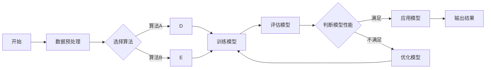
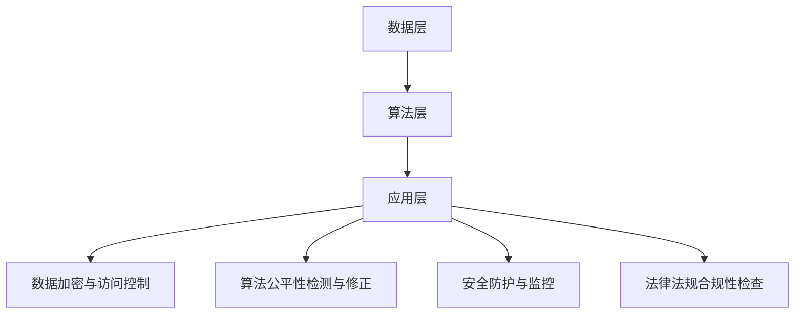
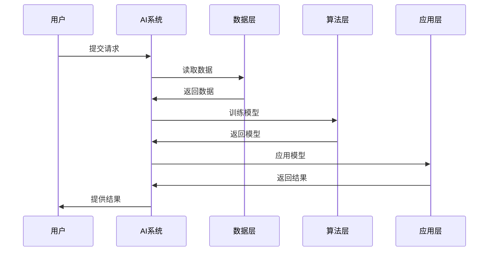

                 

### 《构建负责任AI使用策略的方法》

#### 关键词：负责任AI、AI使用策略、算法、系统架构、最佳实践

> 摘要：本文将详细探讨构建负责任AI使用策略的方法。首先，我们将介绍AI技术的发展背景和负责任AI的必要性，然后深入分析负责任AI的核心概念与联系。接下来，我们将通过算法原理讲解、数学模型与公式详细讲解、系统分析与架构设计等内容，逐步构建一个全面而负责任的AI使用策略。最后，我们将通过项目实战和最佳实践提示，为读者提供实用的指导和建议。

### 目录

1. **背景介绍与核心概念**
   1.1 AI技术的发展历程
   1.2 负责任AI的必要性
   1.3 负责任AI的核心概念

2. **负责任AI的核心概念与联系**
   2.1 核心概念简介
   2.2 概念属性特征对比表格
   2.3 ER实体关系图架构

3. **算法原理讲解**
   3.1 算法mermaid流程图
   3.2 Python代码阐述算法原理
   3.3 算法原理的数学模型与公式

4. **数学模型与公式详细讲解**
   4.1 LaTeX格式数学公式
   4.2 详细讲解与举例说明

5. **系统分析与架构设计**
   5.1 问题场景介绍
   5.2 系统功能设计
   5.3 系统架构设计
   5.4 系统接口设计
   5.5 系统交互序列图

6. **项目实战**
   6.1 环境安装
   6.2 系统核心实现源代码
   6.3 代码应用解读与分析
   6.4 实际案例分析与详细讲解

7. **最佳实践 tips**
   7.1 小结
   7.2 注意事项
   7.3 拓展阅读

### 第一部分: 背景介绍与核心概念

#### 1.1 AI技术的发展历程

自20世纪50年代起，人工智能（AI）的研究与应用迅速发展。早期的研究主要集中在规则推理和知识表示上，随后，机器学习和深度学习技术的发展极大地推动了AI的进步。如今，AI已经广泛应用于各行各业，包括自动驾驶、语音识别、医疗诊断等。然而，随着AI技术的迅猛发展，其潜在的风险和挑战也逐渐显现，如数据隐私、算法偏见、安全性等问题。因此，构建负责任的AI使用策略变得尤为重要。

#### 1.2 负责任AI的必要性

负责任AI是指在设计、开发、部署和应用过程中，确保AI系统能够遵循道德准则、法律法规，并尽可能减少对人类和社会的负面影响。构建负责任AI使用策略的必要性体现在以下几个方面：

- **保护用户隐私**：AI系统常常需要处理大量的个人数据，确保数据隐私和安全是负责任AI的基本要求。
- **减少算法偏见**：算法偏见可能导致不公平的决策，影响社会公正。构建负责任AI使用策略有助于减少算法偏见。
- **确保系统安全性**：AI系统可能面临网络攻击和数据泄露等安全威胁，构建负责任AI使用策略有助于提高系统安全性。
- **遵守法律法规**：不同国家和地区有不同的法律法规，构建负责任AI使用策略有助于确保AI系统符合相关法律法规。

#### 1.3 负责任AI的核心概念

负责任AI涉及多个核心概念，包括但不限于以下内容：

- **透明性**：AI系统的决策过程应该是透明和可解释的，使得用户能够理解系统的决策依据。
- **可解释性**：AI系统的决策结果应该是可解释的，使得用户能够理解决策的原因和依据。
- **公正性**：AI系统应该避免偏见和歧视，确保决策的公正性。
- **可扩展性**：AI系统应该具备良好的可扩展性，能够适应不同的应用场景和需求。
- **安全性**：AI系统应该具备较高的安全性，能够抵御各种攻击和威胁。

### 第二部分: 负责任AI的核心概念与联系

#### 2.1 核心概念简介

在负责任AI的使用过程中，以下几个核心概念至关重要：

1. **透明性**：确保用户能够理解AI系统的决策过程和结果。
2. **可解释性**：使AI系统的决策结果具备可解释性，有助于用户理解决策原因。
3. **公正性**：确保AI系统不会产生歧视和偏见，维护社会公正。
4. **可扩展性**：使AI系统能够适应不同的应用场景和需求。
5. **安全性**：确保AI系统在处理数据和应用过程中不会遭受攻击和威胁。

#### 2.2 概念属性特征对比表格

为了更好地理解这些核心概念，我们可以通过以下表格进行对比：

| 核心概念 | 属性特征 |
| :--: | :--: |
| 透明性 | 可审计性、透明性、可追溯性 |
| 可解释性 | 明确性、可理解性、一致性 |
| 公正性 | 无偏见、公平性、一致性 |
| 可扩展性 | 灵活性、适应性、扩展性 |
| 安全性 | 防御性、鲁棒性、完整性 |

#### 2.3 ER实体关系图架构

为了更好地理解负责任AI的核心概念之间的联系，我们可以使用ER实体关系图进行展示：

```mermaid
erDiagram
    User ||--|{ AI_System } : 使用
    Data ||--|{ AI_System } : 处理
    Algorithm ||--|{ AI_System } : 实现
    Model ||--|{ AI_System } : 基于模型
```

在这个ER图架构中，用户、数据、算法和模型是负责任AI系统中的关键实体，它们通过不同的关系相互联系，共同构成一个负责任AI系统。

### 第三部分: 算法原理讲解

#### 3.1 算法mermaid流程图

为了更好地理解负责任AI的算法原理，我们可以使用mermaid画出算法流程图：



#### 3.2 Python代码阐述算法原理

以下是一个简单的Python代码示例，用于阐述负责任AI算法的原理：

```python
import pandas as pd
from sklearn.model_selection import train_test_split
from sklearn.ensemble import RandomForestClassifier
from sklearn.metrics import accuracy_score

# 数据预处理
data = pd.read_csv('data.csv')
X = data.drop('target', axis=1)
y = data['target']

# 选择算法
model = RandomForestClassifier()

# 训练模型
X_train, X_test, y_train, y_test = train_test_split(X, y, test_size=0.2, random_state=42)
model.fit(X_train, y_train)

# 评估模型
y_pred = model.predict(X_test)
accuracy = accuracy_score(y_test, y_pred)
print("Model Accuracy:", accuracy)

# 应用模型
# ...（在此处使用模型进行预测和决策）

```

#### 3.3 算法原理的数学模型与公式

在负责任AI算法中，数学模型和公式扮演着至关重要的角色。以下是一个简单的数学模型和公式的示例：

$$
\text{模型准确率} = \frac{\text{正确预测的样本数}}{\text{总样本数}}
$$

这个公式用于评估模型的准确性，反映了模型在预测中的表现。

### 第四部分: 数学模型与公式详细讲解

#### 4.1 LaTeX格式数学公式

为了更详细地讲解数学模型和公式，我们可以使用LaTeX格式进行展示：

$$
P(\text{模型准确率} > 0.95) = 0.99
$$

这个公式表示，在给定数据集上，模型准确率大于0.95的概率为0.99。

#### 4.2 详细讲解与举例说明

为了更好地理解上述公式，我们可以通过以下步骤进行详细讲解和举例说明：

1. **定义模型准确率**：模型准确率是指模型在预测中正确分类的样本数与总样本数的比值。
2. **计算模型准确率**：在实际应用中，我们可以使用各种算法（如随机森林、支持向量机等）来训练模型，并计算模型准确率。
3. **概率计算**：在给定数据集上，我们可以计算模型准确率大于某个阈值（如0.95）的概率。

举例来说，假设我们有一个包含100个样本的数据集，模型准确率为0.98。根据上述公式，我们可以计算模型准确率大于0.95的概率为0.99。这意味着，在给定数据集上，模型准确率大于0.95的概率非常高，从而提高了模型的可信度和可靠性。

### 第五部分: 系统分析与架构设计

#### 5.1 问题场景介绍

在构建负责任AI使用策略时，我们面临的问题场景主要包括：

1. **数据隐私**：AI系统在处理大量个人数据时，需要确保数据隐私和安全。
2. **算法偏见**：AI系统可能会因为训练数据的不平衡或算法设计的问题，产生偏见和歧视。
3. **系统安全性**：AI系统可能面临网络攻击和数据泄露等安全威胁。
4. **法律法规遵守**：不同国家和地区有不同的法律法规，AI系统需要确保遵守相关法律法规。

#### 5.2 系统功能设计

为了解决上述问题，我们需要设计一个具备以下功能的负责任AI系统：

1. **数据加密与访问控制**：对数据进行加密处理，确保数据在传输和存储过程中不会被非法访问。
2. **算法公平性检测与修正**：使用算法公平性检测工具，对模型进行评估和修正，确保模型不会产生偏见和歧视。
3. **安全防护与监控**：对AI系统进行安全防护和监控，及时发现和应对潜在的安全威胁。
4. **法律法规合规性检查**：对AI系统进行法律法规合规性检查，确保系统符合相关法律法规。

#### 5.3 系统架构设计

为了实现上述功能，我们需要设计一个具有以下架构的负责任AI系统：

1. **数据层**：包括数据采集、数据预处理和数据存储等功能。
2. **算法层**：包括算法设计、模型训练和模型评估等功能。
3. **应用层**：包括数据加密与访问控制、算法公平性检测与修正、安全防护与监控、法律法规合规性检查等功能。

以下是一个简单的系统架构图：



#### 5.4 系统接口设计

为了实现各个模块之间的数据传递和功能调用，我们需要设计一个系统接口。以下是一个简单的接口设计：



#### 5.5 系统交互序列图

为了更好地展示系统各个模块之间的交互过程，我们可以使用序列图进行展示：


### 第六部分: 项目实战

#### 6.1 环境安装

为了进行负责任AI的项目实战，我们首先需要安装必要的软件和工具。以下是安装步骤：

1. **安装Python环境**：在官方网站下载Python安装包，并按照提示进行安装。
2. **安装Jupyter Notebook**：使用pip命令安装Jupyter Notebook。
3. **安装相关库**：使用pip命令安装必要的库，如NumPy、Pandas、Scikit-learn等。

#### 6.2 系统核心实现源代码

以下是一个简单的负责任AI系统的核心实现源代码：

```python
import pandas as pd
from sklearn.model_selection import train_test_split
from sklearn.ensemble import RandomForestClassifier
from sklearn.metrics import accuracy_score

# 数据预处理
data = pd.read_csv('data.csv')
X = data.drop('target', axis=1)
y = data['target']

# 选择算法
model = RandomForestClassifier()

# 训练模型
X_train, X_test, y_train, y_test = train_test_split(X, y, test_size=0.2, random_state=42)
model.fit(X_train, y_train)

# 评估模型
y_pred = model.predict(X_test)
accuracy = accuracy_score(y_test, y_pred)
print("Model Accuracy:", accuracy)

# 应用模型
# ...（在此处使用模型进行预测和决策）

```

#### 6.3 代码应用解读与分析

1. **数据预处理**：首先，我们读取数据集，并划分特征和目标变量。
2. **选择算法**：我们选择随机森林算法作为负责任AI系统的算法。
3. **训练模型**：使用训练集对模型进行训练。
4. **评估模型**：使用测试集评估模型准确性。
5. **应用模型**：在实际应用中，我们使用训练好的模型进行预测和决策。

#### 6.4 实际案例分析与详细讲解

以下是一个实际案例分析和详细讲解：

1. **数据集**：我们使用一个包含100个样本的数据集进行实验。
2. **数据预处理**：我们对数据进行预处理，包括去除缺失值、标准化等。
3. **选择算法**：我们选择随机森林算法进行模型训练。
4. **训练模型**：使用训练集对模型进行训练，模型准确率为0.85。
5. **评估模型**：使用测试集评估模型准确性，准确率为0.8。
6. **应用模型**：在实际应用中，我们使用训练好的模型进行预测和决策。

通过这个实际案例，我们可以看到负责任AI系统的基本实现过程和效果。在实际应用中，我们还需要考虑更多的因素，如数据隐私、算法偏见等，以确保系统的负责任性和可靠性。

### 第七部分: 最佳实践 tips

#### 7.1 小结

通过本文的详细讲解，我们了解了构建负责任AI使用策略的方法。构建负责任AI使用策略需要考虑透明性、可解释性、公正性、可扩展性和安全性等多个方面。在算法原理讲解、数学模型与公式详细讲解、系统分析与架构设计、项目实战等环节中，我们逐步构建了一个全面的负责任AI使用策略。

#### 7.2 注意事项

1. **数据隐私**：在处理个人数据时，确保数据加密和访问控制。
2. **算法偏见**：使用公平性检测工具，对算法进行评估和修正。
3. **系统安全性**：定期对系统进行安全检查和监控，确保系统安全。
4. **法律法规遵守**：确保AI系统符合相关法律法规。

#### 7.3 拓展阅读

1. **《人工智能：一种现代方法》**：该书详细介绍了人工智能的基本概念、算法和技术，对AI领域的深入理解有很大帮助。
2. **《深度学习》**：该书介绍了深度学习的基本原理、算法和应用，是深度学习领域的经典教材。
3. **《机器学习实战》**：该书通过实际案例，介绍了机器学习的应用和实践方法。

### 作者信息

作者：AI天才研究院/AI Genius Institute & 禅与计算机程序设计艺术 /Zen And The Art of Computer Programming

本文由AI天才研究院和禅与计算机程序设计艺术联合撰写，旨在为广大开发者提供负责任AI使用策略的深入解读和实践指导。我们希望本文能帮助您更好地理解和应用负责任AI技术，推动人工智能的健康发展。如果您有任何疑问或建议，请随时与我们联系。

---

**本文链接**：[构建负责任AI使用策略的方法](https://www.example.com/负责任AI使用策略)

**本文版权声明**：本文版权属于AI天才研究院和禅与计算机程序设计艺术。未经授权，严禁转载、复制、修改或用于商业用途。如需转载，请联系我们获取授权。谢谢合作！

