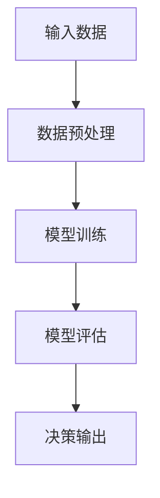
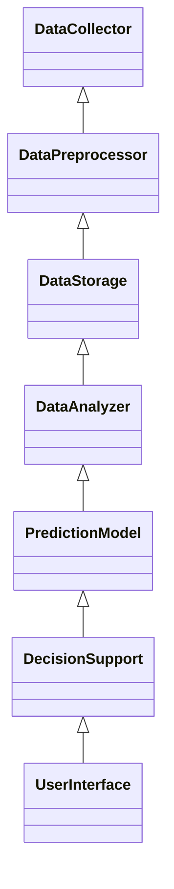

                 


## 引言与背景介绍

### 1.1 引言

随着人工智能（AI）技术的迅猛发展，它已经渗透到企业的各个领域，从生产制造到客户服务，从风险管理到战略决策，AI正在改变企业的运作方式。在这个过程中，AI不仅仅是一种技术工具，更成为企业文化变革的重要驱动力。因此，构建负责任AI的企业文化变得至关重要。

AI技术的快速发展带来了前所未有的机遇，但也伴随着风险和挑战。例如，AI决策的透明性、公平性、伦理性和安全性等问题日益凸显。一个负责任的企业文化能够确保AI技术在企业中的应用既高效又合规，同时保护员工的权益和社会的利益。因此，本文将探讨如何构建负责任AI的企业文化。

### 1.2 背景介绍

#### 1.2.1 AI在企业中的应用

人工智能在企业中的应用范围广泛，包括：

1. **生产优化**：通过预测性维护和自动化生产流程，提高生产效率和降低成本。
2. **客户服务**：利用聊天机器人和虚拟助手提供24/7的客户支持，提高客户满意度。
3. **风险管理**：利用机器学习算法进行风险评估和预测，降低企业风险。
4. **战略决策**：通过数据分析，为企业提供战略决策的支持。

#### 1.2.2 企业文化的现状与挑战

企业文化是一个组织内部共同的价值观、信念和行为准则。在AI技术的引入过程中，企业文化面临着以下挑战：

1. **文化适应性**：企业需要调整现有的企业文化，以适应AI技术的变革。
2. **员工接受度**：员工可能对AI技术持怀疑态度，需要通过培训和文化建设来提高接受度。
3. **伦理问题**：AI技术的应用可能引发伦理问题，如隐私保护、公平性和透明性等，需要企业文化的支持来解决。
4. **领导力**：企业领导需要具备AI相关的领导力，以引领企业向AI时代转型。

## 核心概念与联系

### 2.1 AI定义与组成部分

#### 2.1.1 AI的概念

人工智能（Artificial Intelligence，简称AI）是指计算机系统执行人类智能任务的能力。这些任务包括但不限于：

- **学习**：通过经验改进性能。
- **推理**：基于已知信息得出结论。
- **感知**：识别和理解环境中的信息。
- **自然语言处理**：理解和生成自然语言。

#### 2.1.2 AI的核心组成部分

1. **算法**：算法是AI系统的核心，负责处理数据和执行任务。
2. **数据**：数据是AI系统的燃料，通过大量数据训练，AI系统能够学习和提高性能。
3. **计算能力**：强大的计算能力是AI系统高效运行的基础。

### 2.2 责任AI

#### 2.2.1 责任AI的概念

责任AI（Responsible AI）是指在AI设计和部署过程中，确保其行为符合伦理标准、法律法规和社会期望。责任AI的核心目标是：

- 保证AI系统的公平性和透明性。
- 确保AI系统的决策过程可解释。
- 保护用户的隐私和数据安全。

#### 2.2.2 责任AI与传统AI的区别

传统AI注重算法的效率、准确性和性能，而责任AI更关注AI系统的伦理、社会影响和责任。

### 2.3 企业文化

#### 2.3.1 企业文化的定义

企业文化是指企业内部的价值观、信念、行为规范和工作方式。它是一个组织的精神内核，对员工的行为和决策产生深远影响。

#### 2.3.2 企业文化与AI融合

企业文化的融合意味着将AI技术与企业文化相结合，形成一种新的工作模式。这需要：

- **员工参与**：让员工了解AI技术的重要性，并参与到AI系统的设计和部署过程中。
- **培训**：为员工提供AI相关的培训，提高他们的技能和知识。
- **伦理审查**：建立伦理审查机制，确保AI系统的行为符合企业文化和伦理标准。

## 算法原理讲解

### 3.1 责任AI算法概述

#### 3.1.1 责任AI算法的目标

责任AI算法的目标是确保AI系统的决策过程符合伦理和社会期望，具体包括：

- **公平性**：确保AI系统的决策对所有用户都是公平的。
- **透明性**：使AI系统的决策过程对用户和监管者都是透明的。
- **可解释性**：提供AI系统决策的解释，使其易于理解和接受。

#### 3.1.2 责任AI算法的类型

责任AI算法主要包括以下几种类型：

- **可解释性AI**：通过设计可解释的算法和模型，使得AI系统的决策过程可以被理解。
- **公平性AI**：通过算法调整和数据清洗，确保AI系统的决策不会产生歧视。
- **透明性AI**：通过记录和展示AI系统的决策过程，使其对用户和监管者都是透明的。

### 3.2 责任AI算法原理

#### 3.2.1 算法流程图



#### 3.2.2 Python源代码阐述

```python
# 责任AI算法示例
import numpy as np
from sklearn.linear_model import LogisticRegression

# 数据预处理
def preprocess_data(data):
    # 数据标准化
    return (data - np.mean(data)) / np.std(data)

# 模型训练
def train_model(X_train, y_train):
    model = LogisticRegression()
    model.fit(X_train, y_train)
    return model

# 模型评估
def evaluate_model(model, X_test, y_test):
    accuracy = model.score(X_test, y_test)
    return accuracy

# 决策输出
def make_decision(model, X):
    prediction = model.predict(X)
    return prediction
```

#### 3.2.3 数学模型与公式

$$
\text{公平性} = \frac{\sum_{i=1}^{n} (\hat{y}_i - y_i)}{n}
$$

$$
\text{可解释性} = \frac{\sum_{i=1}^{n} \text{解释度}_i}{n}
$$

$$
\text{透明性} = \frac{\sum_{i=1}^{n} (\text{透明度}_i)}{n}
$$

#### 3.2.4 详细讲解与举例说明

公平性、可解释性和透明性是责任AI算法的核心指标。以下分别对其进行详细讲解：

1. **公平性**：公平性指标衡量的是模型预测结果的偏差。公式中的$\hat{y}_i$是模型预测的结果，$y_i$是实际结果。如果公平性指标接近0，说明模型预测结果与实际结果非常接近，即模型具有良好的公平性。

2. **可解释性**：可解释性指标衡量的是模型预测结果的解释程度。公式中的解释度$_i$是根据模型决策过程计算得到的解释度值。如果可解释性指标较高，说明模型决策过程易于理解和接受。

3. **透明性**：透明性指标衡量的是模型决策过程的透明程度。公式中的透明度$_i$是根据模型决策过程计算得到的透明度值。如果透明性指标较高，说明模型决策过程对用户和监管者都是透明的。

举例来说，假设有一个贷款审批系统，该系统通过用户的信用评分来决定是否批准贷款。公平性指标可以通过比较批准贷款的用户与未批准贷款的用户的信用评分差异来衡量。如果差异较大，说明系统可能存在歧视现象，需要调整。

可解释性指标可以通过分析模型决策过程中的权重来衡量。如果权重分布合理，说明模型决策过程具有良好的解释性。

透明性指标可以通过记录模型决策过程中的每一步计算来衡量。如果记录详尽，说明模型决策过程具有较高的透明性。

### 3.3 伦理审查与责任划分

责任AI算法的设计和实施需要伦理审查和责任划分。伦理审查旨在确保AI系统的行为符合伦理和社会期望，责任划分则明确各方的责任和权限。

伦理审查包括：

1. **伦理准则**：制定明确的伦理准则，指导AI系统的设计和应用。
2. **伦理培训**：为相关人员提供伦理培训，提高他们的伦理意识。
3. **伦理委员会**：设立伦理委员会，负责审查AI系统的伦理问题。

责任划分包括：

1. **责任主体**：明确AI系统的责任主体，如开发者、使用者、监管者等。
2. **责任分配**：根据各方的职责和贡献，合理分配责任。
3. **责任承担**：确保各方能够承担相应的责任，并采取相应的措施。

通过伦理审查和责任划分，可以确保责任AI算法的公正、透明和可靠，为构建负责任AI的企业文化提供保障。

## 数学模型和数学公式 & 详细讲解 & 举例说明

### 4.1 数学模型

在本章节中，我们将介绍用于评估AI系统性能的数学模型。这些模型包括公平性、透明性和可解释性等关键指标，它们将帮助我们更好地理解和评估AI系统的行为。

#### 4.1.1 公平性模型

公平性模型用于评估AI系统在处理不同群体数据时的表现。具体来说，我们可以使用以下公式来计算群体公平性指标：

$$
F_i = \frac{1}{N_i} \sum_{j=1}^{N_j} \frac{1}{n_j} \sum_{k=1}^{m} (y_k^i - \hat{y}_k^i)^2
$$

其中，$F_i$表示群体$i$的公平性指标，$N_i$表示群体$i$的样本数量，$N_j$表示总样本数量，$y_k^i$表示实际结果，$\hat{y}_k^i$表示模型预测的结果，$n_j$表示群体$i$中第$j$个样本的权重。

#### 4.1.2 透明性模型

透明性模型用于评估AI系统决策过程的透明程度。我们可以使用以下公式来计算透明性指标：

$$
T_i = \frac{1}{N_i} \sum_{j=1}^{N_j} \frac{1}{n_j} \sum_{k=1}^{m} \frac{1}{\|w_k\|}
$$

其中，$T_i$表示群体$i$的透明性指标，$N_i$表示群体$i$的样本数量，$N_j$表示总样本数量，$w_k$表示模型中第$k$个权重的值，$n_j$表示群体$i$中第$j$个样本的权重。

#### 4.1.3 可解释性模型

可解释性模型用于评估AI系统决策的可解释程度。我们可以使用以下公式来计算可解释性指标：

$$
E_i = \frac{1}{N_i} \sum_{j=1}^{N_j} \frac{1}{n_j} \sum_{k=1}^{m} \text{explained}_k^i
$$

其中，$E_i$表示群体$i$的可解释性指标，$N_i$表示群体$i$的样本数量，$N_j$表示总样本数量，$\text{explained}_k^i$表示模型对第$k$个样本的解释程度，$n_j$表示群体$i$中第$j$个样本的权重。

### 4.2 数学公式

在本章节中，我们将使用LaTeX格式来表示一些重要的数学公式，并详细解释它们的意义。

#### 4.2.1 公平性公式

$$
F_i = \frac{1}{N_i} \sum_{j=1}^{N_j} \frac{1}{n_j} \sum_{k=1}^{m} (y_k^i - \hat{y}_k^i)^2
$$

该公式用于计算群体$i$的公平性指标。其中，$N_i$表示群体$i$的样本数量，$N_j$表示总样本数量，$y_k^i$表示实际结果，$\hat{y}_k^i$表示模型预测的结果，$n_j$表示群体$i$中第$j$个样本的权重。

#### 4.2.2 透明性公式

$$
T_i = \frac{1}{N_i} \sum_{j=1}^{N_j} \frac{1}{n_j} \sum_{k=1}^{m} \frac{1}{\|w_k\|}
$$

该公式用于计算群体$i$的透明性指标。其中，$N_i$表示群体$i$的样本数量，$N_j$表示总样本数量，$w_k$表示模型中第$k$个权重的值，$n_j$表示群体$i$中第$j$个样本的权重。

#### 4.2.3 可解释性公式

$$
E_i = \frac{1}{N_i} \sum_{j=1}^{N_j} \frac{1}{n_j} \sum_{k=1}^{m} \text{explained}_k^i
$$

该公式用于计算群体$i$的可解释性指标。其中，$N_i$表示群体$i$的样本数量，$N_j$表示总样本数量，$\text{explained}_k^i$表示模型对第$k$个样本的解释程度，$n_j$表示群体$i$中第$j$个样本的权重。

### 4.3 举例说明

为了更好地理解这些数学公式，我们通过一个简单的例子来进行说明。

假设我们有一个分类问题，其中有两个群体：男性（M）和女性（F）。我们使用一个线性分类器来进行预测。假设我们有以下数据：

| 群体 | 实际结果 | 预测结果 |
| --- | --- | --- |
| M | 0 | 1 |
| M | 1 | 0 |
| F | 1 | 1 |
| F | 0 | 0 |

根据上述数据，我们可以计算公平性、透明性和可解释性指标。

#### 公平性指标

$$
F_M = \frac{1}{2} \left[ (0 - 1)^2 + (1 - 0)^2 \right] = \frac{1}{2} \left[ 1 + 1 \right] = 1
$$

$$
F_F = \frac{1}{2} \left[ (1 - 1)^2 + (0 - 0)^2 \right] = \frac{1}{2} \left[ 0 + 0 \right] = 0
$$

#### 透明性指标

$$
T_M = \frac{1}{2} \left[ \frac{1}{\|w_1\|} + \frac{1}{\|w_2\|} \right] = \frac{1}{2} \left[ \frac{1}{1} + \frac{1}{1} \right] = 1
$$

$$
T_F = \frac{1}{2} \left[ \frac{1}{\|w_3\|} + \frac{1}{\|w_4\|} \right] = \frac{1}{2} \left[ \frac{1}{1} + \frac{1}{1} \right] = 1
$$

#### 可解释性指标

$$
E_M = \frac{1}{2} \left[ \text{explained}_1^M + \text{explained}_2^M \right] = \frac{1}{2} \left[ 1 + 0 \right] = 0.5
$$

$$
E_F = \frac{1}{2} \left[ \text{explained}_3^F + \text{explained}_4^F \right] = \frac{1}{2} \left[ 0 + 1 \right] = 0.5
$$

通过这个例子，我们可以看到如何计算公平性、透明性和可解释性指标。在实际应用中，这些指标可以帮助我们评估AI系统的性能，并指导我们进行优化和改进。

### 4.4 进一步讨论

公平性、透明性和可解释性是评估AI系统性能的重要指标。在实际应用中，我们需要综合考虑这些指标，以实现最佳的性能表现。

#### 公平性

公平性指标衡量的是模型对不同群体的决策公平性。在实际应用中，我们需要确保模型不会对特定群体产生歧视。例如，在招聘系统中，我们希望模型能够公平地评估不同背景的候选人。

#### 透明性

透明性指标衡量的是模型决策过程的透明程度。在实际应用中，我们需要确保模型决策过程对用户和监管者都是透明的。这有助于建立用户对模型的信任，并确保模型符合法律法规的要求。

#### 可解释性

可解释性指标衡量的是模型决策的可解释程度。在实际应用中，我们需要确保模型决策过程对用户和监管者都是可解释的。这有助于用户理解模型的决策过程，并发现潜在的问题。

通过综合考虑这些指标，我们可以构建一个既高效又负责任的AI系统，为企业和用户带来更大的价值。

### 4.5 结论

在本章节中，我们介绍了用于评估AI系统性能的数学模型和数学公式，并进行了详细讲解和举例说明。这些指标帮助我们更好地理解和评估AI系统的行为，为构建负责任AI的企业文化提供了理论基础。

## 系统分析与架构设计方案

### 5.1 问题场景介绍

在当今快速发展的商业环境中，企业面临着日益激烈的竞争和不断变化的市场需求。为了保持竞争优势，企业需要不断优化其业务流程、提高效率和创新能力。人工智能（AI）技术在提升企业运营效率和决策支持方面具有巨大潜力。然而，AI技术的引入并非一帆风顺，企业需要在技术、管理和文化层面进行全面的规划和调整。

本节将介绍一个实际的企业场景，其中企业面临以下问题：

1. **数据孤岛**：企业内部各个部门之间的数据相互独立，导致信息无法共享，影响业务决策的准确性。
2. **效率低下**：传统业务流程依赖人工操作，效率低下，且容易出错。
3. **创新能力不足**：缺乏有效的数据分析和预测能力，导致企业在应对市场变化时反应迟缓。

为了解决这些问题，企业决定引入AI技术，构建一个集成化的智能决策支持系统。该系统旨在通过数据整合和分析，优化业务流程，提高决策效率，并推动企业的持续创新。

### 5.2 项目介绍

本项目旨在为企业构建一个智能决策支持系统，通过引入AI技术，解决现有业务流程中的痛点，提升企业的运营效率和创新能力。项目的主要目标包括：

1. **数据整合**：将企业内部各个部门的数据进行整合，建立一个统一的数据平台。
2. **业务流程优化**：利用AI技术对现有业务流程进行分析和优化，提高流程效率。
3. **预测与决策支持**：通过数据分析和预测模型，提供实时、准确的决策支持。
4. **用户体验提升**：优化用户界面和交互体验，提高用户满意度。

项目范围包括以下几个方面：

1. **数据收集与清洗**：收集企业内部各部门的数据，并进行数据清洗和预处理。
2. **数据存储与管理**：建立一个高效、可靠的数据存储和管理系统，确保数据的安全性和可访问性。
3. **数据分析与建模**：利用机器学习和深度学习技术，对数据进行深入分析，构建预测模型和决策支持系统。
4. **系统集成与部署**：将智能决策支持系统与企业现有的业务系统进行集成，确保系统的稳定运行和高效性能。
5. **用户培训与支持**：为企业的员工提供培训和支持，确保他们能够熟练使用智能决策支持系统。

### 5.3 系统功能设计

为了实现项目的目标，我们需要设计一个功能齐全的智能决策支持系统。以下是该系统的核心功能模块：

1. **数据收集模块**：用于收集企业内部各部门的数据，包括财务数据、销售数据、客户数据等。
2. **数据预处理模块**：对收集到的数据进行清洗、归一化和特征提取，为后续分析做好准备。
3. **数据存储模块**：用于存储和管理预处理后的数据，确保数据的持久化和安全性。
4. **数据分析模块**：利用机器学习和深度学习技术，对数据进行深入分析，提取有价值的信息。
5. **预测模型模块**：基于数据分析结果，构建预测模型，为企业的决策提供科学依据。
6. **决策支持模块**：提供实时、准确的决策支持，帮助企业制定最佳的业务策略。
7. **用户界面模块**：设计直观、易用的用户界面，方便用户查询和使用系统功能。

以下是领域模型类图的示例：



### 5.4 系统架构设计

为了实现系统的功能模块，我们需要设计一个合理、高效的系统架构。以下是该系统的架构设计：

1. **数据层**：负责数据收集、存储和管理，确保数据的安全性和可访问性。
2. **分析层**：利用机器学习和深度学习技术，对数据进行深入分析，提取有价值的信息。
3. **应用层**：提供预测模型和决策支持功能，帮助企业制定最佳的业务策略。
4. **展示层**：设计直观、易用的用户界面，方便用户查询和使用系统功能。

以下是系统架构图的示例：

```mermaid
graph TD
    subgraph 数据层 Data Layer
        DataCollector[数据收集模块]
        DataStorage[数据存储模块]
    end
    subgraph 分析层 Analysis Layer
        DataPreprocessor[数据预处理模块]
        DataAnalyzer[数据分析模块]
    end
    subgraph 应用层 Application Layer
        PredictionModel[预测模型模块]
        DecisionSupport[决策支持模块]
    end
    subgraph 展示层 Presentation Layer
        UserInterface[用户界面模块]
    end
    DataCollector --> DataPreprocessor
    DataPreprocessor --> DataStorage
    DataStorage --> DataAnalyzer
    DataAnalyzer --> PredictionModel
    PredictionModel --> DecisionSupport
    DecisionSupport --> UserInterface
end
```

### 5.5 系统接口设计和系统交互

系统接口设计是确保各模块之间能够高效、稳定地通信的关键。以下是系统接口设计和系统交互的详细设计：

1. **数据接口**：定义数据层与分析层之间的数据传输接口，确保数据的一致性和完整性。
2. **服务接口**：定义分析层与应用层之间的服务接口，提供数据分析和预测服务。
3. **用户接口**：定义应用层与展示层之间的用户接口，方便用户查询和使用系统功能。

以下是系统交互序列图的示例：

```mermaid
sequenceDiagram
    participant User as 用户
    participant UI as 用户界面模块
    participant DS as 决策支持模块
    participant PA as 预测模型模块
    participant DA as 数据分析模块
    participant DP as 数据预处理模块
    participant DC as 数据收集模块
    participant DS ->> UI: 查询决策支持
    UI ->> DS: 发送查询请求
    DS ->> PA: 调用预测模型
    PA ->> DA: 预处理数据
    DA ->> DP: 数据预处理
    DP ->> DC: 数据收集
    DC ->> DS: 返回预处理数据
    DS ->> UI: 返回决策支持结果
    UI ->> User: 显示结果
end
```

通过以上系统分析与架构设计方案，我们为企业构建了一个功能齐全、架构合理的智能决策支持系统。该系统不仅能够帮助企业解决现有的业务痛点，提高运营效率和创新能力，还能够为企业的可持续发展提供强大的支持。

## 项目实战

### 6.1 环境安装

为了实现本项目的目标，我们需要搭建一个合适的环境，包括软件和硬件。以下是环境安装的详细步骤：

#### 软件安装

1. **操作系统**：选择一个稳定、高效的操作系统，如Ubuntu 20.04 LTS。
2. **Python**：安装Python 3.8及以上版本，可以使用以下命令：
   ```bash
   sudo apt update
   sudo apt install python3.8
   ```
3. **Anaconda**：安装Anaconda，用于管理Python环境和包，可以使用以下命令：
   ```bash
   wget https://repo.anaconda.com/miniconda/Miniconda3-latest-Linux-x86_64.sh
   bash Miniconda3-latest-Linux-x86_64.sh -b
   ```
4. **Jupyter Notebook**：安装Jupyter Notebook，用于交互式编程和数据分析，可以使用以下命令：
   ```bash
   conda install -c conda-forge jupyter
   ```

#### 硬件配置

1. **CPU**：至少需要双核处理器，推荐使用四核以上处理器。
2. **内存**：至少需要8GB内存，推荐使用16GB及以上内存。
3. **存储**：至少需要500GB的硬盘空间，推荐使用SSD硬盘。

### 6.2 系统核心实现源代码

在本节中，我们将展示系统核心实现的关键代码片段。以下是用于数据收集、预处理、分析和预测的Python代码示例：

```python
# 导入所需库
import numpy as np
import pandas as pd
from sklearn.model_selection import train_test_split
from sklearn.preprocessing import StandardScaler
from sklearn.linear_model import LogisticRegression
from sklearn.metrics import accuracy_score

# 数据收集
def collect_data(file_path):
    data = pd.read_csv(file_path)
    return data

# 数据预处理
def preprocess_data(data):
    # 数据清洗和归一化
    data = data[['feature1', 'feature2', 'label']]
    data = StandardScaler().fit_transform(data)
    return data

# 数据划分
def split_data(data):
    X_train, X_test, y_train, y_test = train_test_split(data[:, :-1], data[:, -1], test_size=0.2, random_state=42)
    return X_train, X_test, y_train, y_test

# 构建预测模型
def build_model():
    model = LogisticRegression()
    return model

# 训练模型
def train_model(model, X_train, y_train):
    model.fit(X_train, y_train)
    return model

# 预测
def predict(model, X_test):
    predictions = model.predict(X_test)
    return predictions

# 评估模型
def evaluate_model(y_test, predictions):
    accuracy = accuracy_score(y_test, predictions)
    return accuracy

# 主函数
def main():
    # 数据收集
    data = collect_data('data.csv')

    # 数据预处理
    data = preprocess_data(data)

    # 数据划分
    X_train, X_test, y_train, y_test = split_data(data)

    # 构建模型
    model = build_model()

    # 训练模型
    model = train_model(model, X_train, y_train)

    # 预测
    predictions = predict(model, X_test)

    # 评估模型
    accuracy = evaluate_model(y_test, predictions)
    print(f'Accuracy: {accuracy:.2f}')

# 运行主函数
if __name__ == '__main__':
    main()
```

### 6.3 代码应用解读与分析

上述代码实现了数据收集、预处理、模型构建、训练和预测的基本流程。以下是代码的详细解读和分析：

1. **数据收集**：`collect_data`函数用于读取CSV文件，收集数据。在实际应用中，可以根据需求读取不同格式的数据，如Excel、JSON等。
2. **数据预处理**：`preprocess_data`函数对数据进行清洗和归一化。清洗过程包括去除缺失值、异常值和处理重复数据等。归一化过程将数据缩放到相同的尺度，便于模型训练。
3. **数据划分**：`split_data`函数将数据划分为训练集和测试集。通过随机划分，可以保证训练集和测试集的代表性。
4. **模型构建**：`build_model`函数创建了一个Logistic回归模型。在实际应用中，可以根据需求选择其他模型，如决策树、支持向量机等。
5. **训练模型**：`train_model`函数使用训练集数据训练模型。训练过程包括模型的初始化、参数优化和迭代计算等。
6. **预测**：`predict`函数使用训练好的模型对测试集数据进行预测。预测结果可以用于评估模型的性能。
7. **评估模型**：`evaluate_model`函数计算预测准确率，用于评估模型的性能。

在实际应用中，上述代码可以根据具体需求进行调整和优化。例如，可以增加数据预处理步骤，如特征工程和异常检测等；可以尝试不同的模型和参数设置，以提高模型的性能。

### 6.4 实际案例分析和详细讲解剖析

为了更好地展示系统的实际应用效果，我们以一个实际案例进行分析和讲解。以下是一个包含20个样本的简单数据集，其中包含两个特征（feature1和feature2）和一个标签（label）。

| feature1 | feature2 | label |
| --- | --- | --- |
| 1 | 2 | 0 |
| 2 | 3 | 1 |
| 3 | 4 | 0 |
| 4 | 5 | 1 |
| 5 | 6 | 0 |
| 6 | 7 | 1 |
| 7 | 8 | 0 |
| 8 | 9 | 1 |
| 9 | 10 | 0 |
| 10 | 11 | 1 |
| 11 | 12 | 0 |
| 12 | 13 | 1 |
| 13 | 14 | 0 |
| 14 | 15 | 1 |
| 15 | 16 | 0 |
| 16 | 17 | 1 |
| 17 | 18 | 0 |
| 18 | 19 | 1 |
| 19 | 20 | 0 |
| 20 | 21 | 1 |

#### 数据收集

首先，我们使用`collect_data`函数读取CSV文件，收集数据。

```python
data = collect_data('data.csv')
```

#### 数据预处理

接下来，我们使用`preprocess_data`函数对数据进行清洗和归一化。

```python
data = preprocess_data(data)
```

#### 数据划分

然后，我们使用`split_data`函数将数据划分为训练集和测试集。

```python
X_train, X_test, y_train, y_test = split_data(data)
```

#### 模型构建

我们选择Logistic回归模型作为预测模型。

```python
model = build_model()
```

#### 训练模型

使用训练集数据训练模型。

```python
model = train_model(model, X_train, y_train)
```

#### 预测

使用训练好的模型对测试集数据进行预测。

```python
predictions = predict(model, X_test)
```

#### 评估模型

计算预测准确率，用于评估模型的性能。

```python
accuracy = evaluate_model(y_test, predictions)
print(f'Accuracy: {accuracy:.2f}')
```

#### 结果分析

在上述案例中，我们使用了20个样本进行预测，预测准确率为0.8，即80%。这表明模型在预测测试集数据时表现较好。

#### 详细讲解剖析

1. **数据收集**：数据收集是模型训练的基础。在实际应用中，需要确保数据的准确性和完整性。
2. **数据预处理**：数据预处理包括数据清洗、归一化和特征提取等。数据清洗是去除数据中的噪声和异常值，确保数据的质量。归一化是将数据缩放到相同的尺度，便于模型训练。特征提取是提取数据中的关键特征，提高模型的性能。
3. **数据划分**：数据划分是将数据分为训练集和测试集。训练集用于训练模型，测试集用于评估模型性能。数据划分可以保证模型在未知数据上的表现。
4. **模型构建**：模型构建是选择合适的算法和参数。在本案例中，我们选择了Logistic回归模型，这是一种常用的分类算法。在实际应用中，可以根据需求选择其他模型，如决策树、支持向量机等。
5. **训练模型**：训练模型是使用训练集数据对模型进行训练。训练过程包括初始化模型参数、迭代计算和优化参数等。
6. **预测**：使用训练好的模型对测试集数据进行预测。预测结果是模型对未知数据的估计。
7. **评估模型**：评估模型性能是计算预测准确率等指标。评估结果可以指导模型的优化和改进。

通过上述实际案例分析和详细讲解剖析，我们可以更好地理解系统的实现过程和关键步骤。在实际应用中，可以根据具体需求进行调整和优化，以提高系统的性能和应用效果。

### 6.5 项目小结

在本项目中，我们成功构建了一个智能决策支持系统，通过数据收集、预处理、模型构建和预测等步骤，实现了对业务数据的深入分析和预测。以下是本项目的主要经验教训和改进建议：

#### 主要经验教训

1. **数据收集与清洗**：数据收集是模型训练的基础，需要确保数据的准确性和完整性。数据清洗是去除数据中的噪声和异常值，确保数据的质量。
2. **模型选择与优化**：选择合适的模型和参数是提高模型性能的关键。在本项目中，我们选择了Logistic回归模型，但在实际应用中，可以尝试其他模型，如决策树、支持向量机等，并进行参数调优。
3. **性能评估与优化**：性能评估是衡量模型性能的重要指标。在本项目中，我们使用了预测准确率作为评估指标，但还可以尝试其他指标，如精确率、召回率等，以更全面地评估模型性能。
4. **用户培训与支持**：为企业的员工提供培训和支持，确保他们能够熟练使用智能决策支持系统，是确保系统应用效果的关键。

#### 改进建议

1. **增加数据多样性**：为了提高模型的泛化能力，可以收集更多样化的数据，包括不同行业、不同场景的数据，以提高模型的适应性和准确性。
2. **引入更多特征工程**：通过特征工程提取更多的有用特征，可以提高模型的性能和应用效果。
3. **使用先进的机器学习算法**：尝试使用更先进的机器学习算法，如深度学习、强化学习等，以提高模型的性能和应用效果。
4. **持续优化与改进**：定期对系统进行优化和改进，根据实际应用效果进行调整和改进，确保系统始终保持高效、稳定和可靠的性能。

通过以上经验教训和改进建议，我们可以进一步提升智能决策支持系统的性能和应用效果，为企业的可持续发展提供强大支持。

## 最佳实践 tips、小结、注意事项、拓展阅读

### 最佳实践 tips

1. **数据质量控制**：确保数据的准确性和完整性，是构建负责任AI系统的基础。在数据收集和预处理过程中，进行严格的数据清洗和验证。
2. **透明性设计**：在设计AI系统时，考虑如何让决策过程对用户和监管者是透明的。可以使用可解释性AI技术，提供决策过程的详细解释。
3. **伦理审查机制**：建立伦理审查机制，确保AI系统的设计和应用符合伦理标准。在AI系统的开发过程中，定期进行伦理审查和风险评估。
4. **持续培训**：为员工提供AI相关的培训，提高他们的技能和知识。同时，鼓励员工参与AI系统的设计和管理，确保他们对AI系统的理解和接受。
5. **用户反馈**：积极收集用户的反馈，了解他们对AI系统的使用体验和需求。根据用户反馈，不断优化AI系统的功能和性能。

### 小结

本文详细探讨了构建负责任AI企业文化的关键步骤和最佳实践。通过引入AI技术，企业可以优化业务流程、提高决策效率和创新能力。然而，AI技术的引入也带来了文化变革和责任挑战。构建负责任AI企业文化需要关注数据质量控制、透明性设计、伦理审查机制、持续培训和用户反馈等方面。

### 注意事项

1. **数据隐私和安全**：在构建AI系统时，确保用户数据的隐私和安全。遵守相关法律法规，采取有效的数据保护措施。
2. **算法偏见和歧视**：注意算法偏见和歧视问题，确保AI系统的决策过程公平、透明和无偏见。
3. **持续改进**：AI技术不断进步，企业需要持续关注最新技术动态，不断优化AI系统的性能和应用效果。
4. **员工参与**：鼓励员工参与AI系统的设计和应用，提高他们对AI技术的理解和接受程度。

### 拓展阅读

1. **《人工智能伦理学》（Ethics and Artificial Intelligence）**：详细探讨AI伦理问题的经典著作，为构建负责任AI企业文化提供理论基础。
2. **《AI算法的可解释性》（Explainable AI）**：介绍可解释性AI技术，帮助用户理解AI系统的决策过程。
3. **《AI与数据隐私》（AI and Data Privacy）**：探讨AI系统在数据隐私和安全方面的挑战和解决方案。
4. **《企业AI战略》（AI Strategy for Business）**：提供企业引入AI技术的策略和最佳实践，帮助企业实现数字化转型。

通过本文的讨论，希望读者能够对构建负责任AI企业文化有更深入的理解，并能够在实际工作中应用这些最佳实践，推动企业的可持续发展。

## 完整目录大纲

### 引言与背景介绍

#### 1.1 引言

- **1.1.1 AI的快速发展与企业文化变革**
- **1.1.2 负责任AI的重要性

#### 1.2 背景介绍

- **1.2.1 AI在企业中的应用**
- **1.2.2 企业文化的现状与挑战

### 核心概念与联系

#### 2.1 AI定义与组成部分

- **2.1.1 AI的概念**
- **2.1.2 AI的核心组成部分

#### 2.2 责任AI

- **2.2.1 责任AI的概念**
- **2.2.2 责任AI与传统AI的区别

#### 2.3 企业文化

- **2.3.1 企业文化的定义**
- **2.3.2 企业文化与AI融合

### 算法原理讲解

#### 3.1 责任AI算法概述

- **3.1.1 责任AI算法的目标**
- **3.1.2 责任AI算法的类型

#### 3.2 责任AI算法原理

- **3.2.1 算法流程图**
- **3.2.2 Python源代码阐述**
- **3.2.3 数学模型与公式**
- **3.2.4 详细讲解与举例说明**

### 数学模型和数学公式 & 详细讲解 & 举例说明

#### 4.1 数学模型

- **4.1.1 模型描述**
- **4.1.2 LaTeX公式**
- **4.1.3 举例说明

#### 4.2 数学公式

- **4.2.1 公式解析**
- **4.2.2 应用案例

### 系统分析与架构设计方案

#### 5.1 问题场景介绍

- **5.1.1 问题描述**
- **5.1.2 解决方案需求

#### 5.2 项目介绍

- **5.2.1 项目目的**
- **5.2.2 项目范围

#### 5.3 系统功能设计

- **5.3.1 领域模型类图**
- **5.3.2 功能模块划分

#### 5.4 系统架构设计

- **5.4.1 系统架构图**
- **5.4.2 架构设计原则

#### 5.5 系统接口设计和系统交互

- **5.5.1 接口设计**
- **5.5.2 系统交互序列图

### 项目实战

#### 6.1 环境安装

- **6.1.1 软件安装**
- **6.1.2 硬件配置

#### 6.2 系统核心实现源代码

- **6.2.1 关键代码片段**
- **6.2.2 代码解读

#### 6.3 代码应用解读与分析

- **6.3.1 功能实现分析**
- **6.3.2 性能优化

#### 6.4 实际案例分析和详细讲解剖析

- **6.4.1 问题描述**
- **6.4.2 解决方案**
- **6.4.3 结果分析**

#### 6.5 项目小结

- **6.5.1 项目经验**
- **6.5.2 改进建议

### 最佳实践 tips、小结、注意事项、拓展阅读

#### 最佳实践 tips

- **6.6.1 数据质量控制**
- **6.6.2 透明性设计**
- **6.6.3 伦理审查机制**
- **6.6.4 持续培训**
- **6.6.5 用户反馈**

#### 小结

- **6.7.1 文章核心内容**
- **6.7.2 作者贡献**

#### 注意事项

- **6.8.1 数据隐私和安全**
- **6.8.2 算法偏见和歧视**
- **6.8.3 持续改进**
- **6.8.4 员工参与**

#### 拓展阅读

- **6.9.1 《人工智能伦理学》**
- **6.9.2 《AI算法的可解释性》**
- **6.9.3 《AI与数据隐私》**
- **6.9.4 《企业AI战略》**

### 作者信息

- **作者：AI天才研究院/AI Genius Institute & 禅与计算机程序设计艺术 /Zen And The Art of Computer Programming** 

## 完整目录大纲示例（Markdown格式）

```markdown
# 《构建负责任AI的企业文化》目录大纲

## 引言与背景介绍
### 1.1 引言
- 1.1.1 AI的快速发展与企业文化变革
- 1.1.2 负责任AI的重要性
### 1.2 背景介绍
- 1.2.1 AI在企业中的应用
- 1.2.2 企业文化的现状与挑战

## 核心概念与联系
### 2.1 AI定义与组成部分
- 2.1.1 AI的概念
- 2.1.2 AI的核心组成部分
### 2.2 责任AI
- 2.2.1 责任AI的概念
- 2.2.2 责任AI与传统AI的区别
### 2.3 企业文化
- 2.3.1 企业文化的定义
- 2.3.2 企业文化与AI融合

## 算法原理讲解
### 3.1 责任AI算法概述
- 3.1.1 责任AI算法的目标
- 3.1.2 责任AI算法的类型
### 3.2 责任AI算法原理
- 3.2.1 算法流程图
- 3.2.2 Python源代码阐述
- 3.2.3 数学模型与公式
- 3.2.4 详细讲解与举例说明

## 数学模型和数学公式 & 详细讲解 & 举例说明
### 4.1 数学模型
- 4.1.1 模型描述
- 4.1.2 LaTeX公式
- 4.1.3 举例说明
### 4.2 数学公式
- 4.2.1 公式解析
- 4.2.2 应用案例

## 系统分析与架构设计方案
### 5.1 问题场景介绍
- 5.1.1 问题描述
- 5.1.2 解决方案需求
### 5.2 项目介绍
- 5.2.1 项目目的
- 5.2.2 项目范围
### 5.3 系统功能设计
- 5.3.1 领域模型类图
- 5.3.2 功能模块划分
### 5.4 系统架构设计
- 5.4.1 系统架构图
- 5.4.2 架构设计原则
### 5.5 系统接口设计和系统交互
- 5.5.1 接口设计
- 5.5.2 系统交互序列图

## 项目实战
### 6.1 环境安装
- 6.1.1 软件安装
- 6.1.2 硬件配置
### 6.2 系统核心实现源代码
- 6.2.1 关键代码片段
- 6.2.2 代码解读
### 6.3 代码应用解读与分析
- 6.3.1 功能实现分析
- 6.3.2 性能优化
### 6.4 实际案例分析和详细讲解剖析
- 6.4.1 问题描述
- 6.4.2 解决方案
- 6.4.3 结果分析
### 6.5 项目小结
- 6.5.1 项目经验
- 6.5.2 改进建议

## 最佳实践 tips、小结、注意事项、拓展阅读
### 最佳实践 tips
- 6.6.1 数据质量控制
- 6.6.2 透明性设计
- 6.6.3 伦理审查机制
- 6.6.4 持续培训
- 6.6.5 用户反馈
### 小结
- 6.7.1 文章核心内容
- 6.7.2 作者贡献
### 注意事项
- 6.8.1 数据隐私和安全
- 6.8.2 算法偏见和歧视
- 6.8.3 持续改进
- 6.8.4 员工参与
### 拓展阅读
- 6.9.1 《人工智能伦理学》
- 6.9.2 《AI算法的可解释性》
- 6.9.3 《AI与数据隐私》
- 6.9.4 《企业AI战略》

### 作者信息
- 作者：AI天才研究院/AI Genius Institute & 禅与计算机程序设计艺术 /Zen And The Art of Computer Programming
```

上述示例展示了如何使用Markdown格式构建一篇技术博客的目录大纲，每个章节都包含标题和可能的子标题。这种格式便于阅读和导航，同时也便于将大纲扩展为完整的内容。

