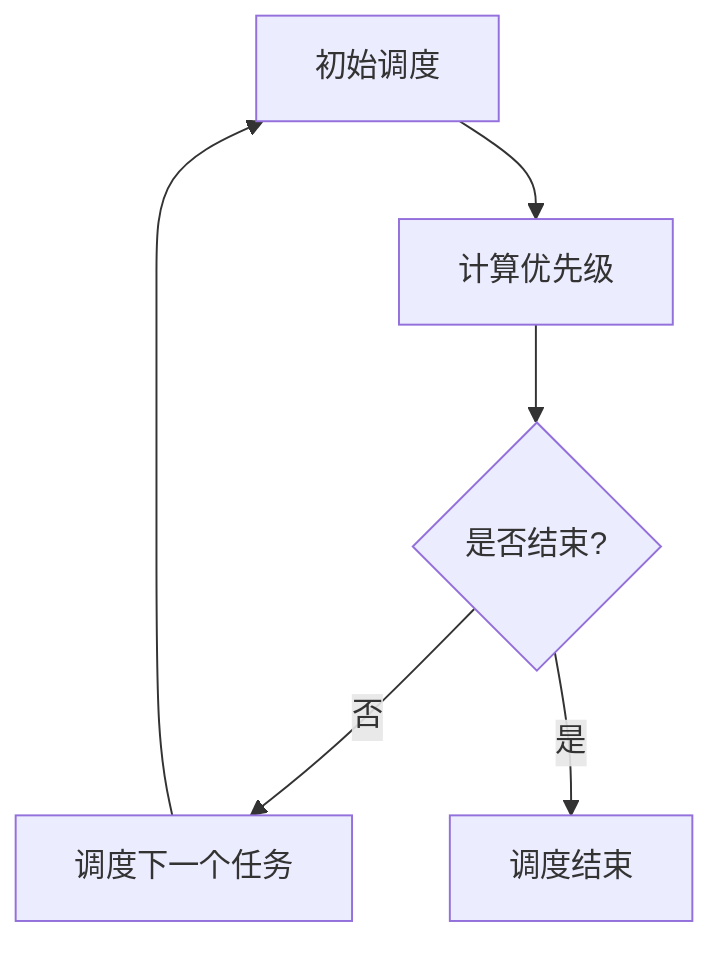
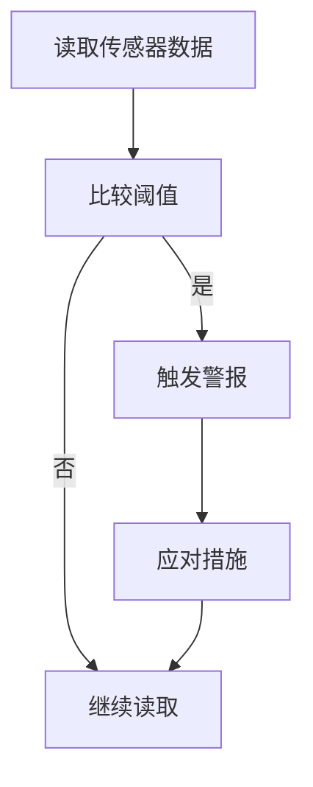
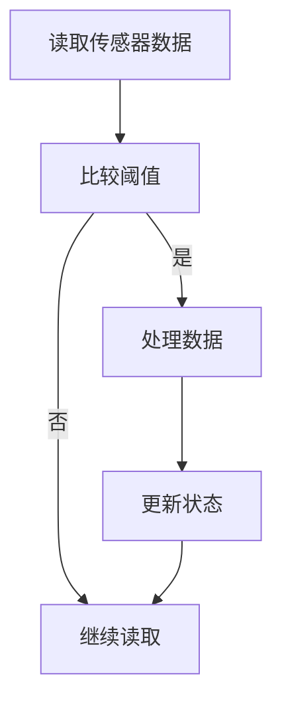
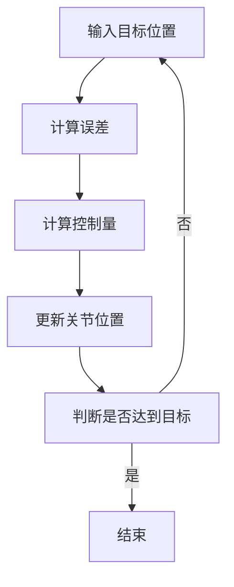
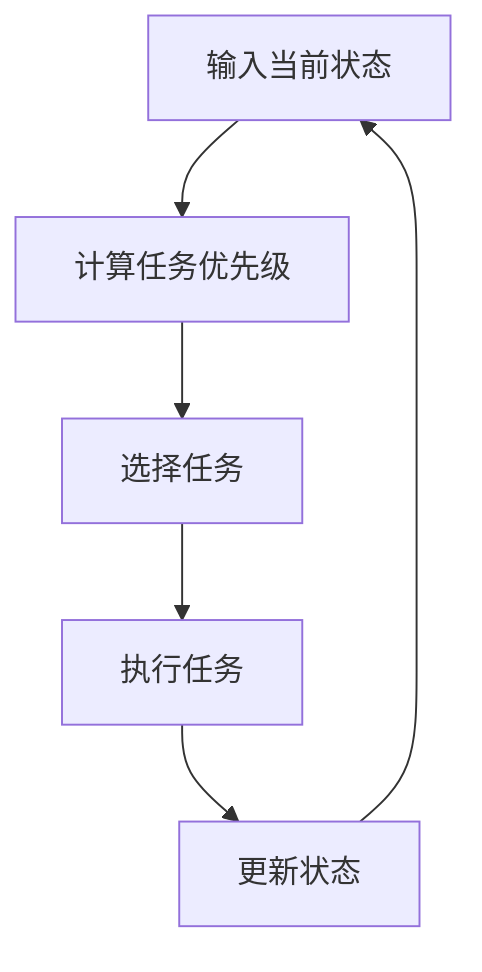
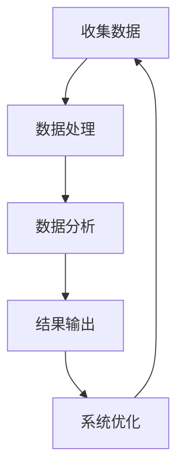
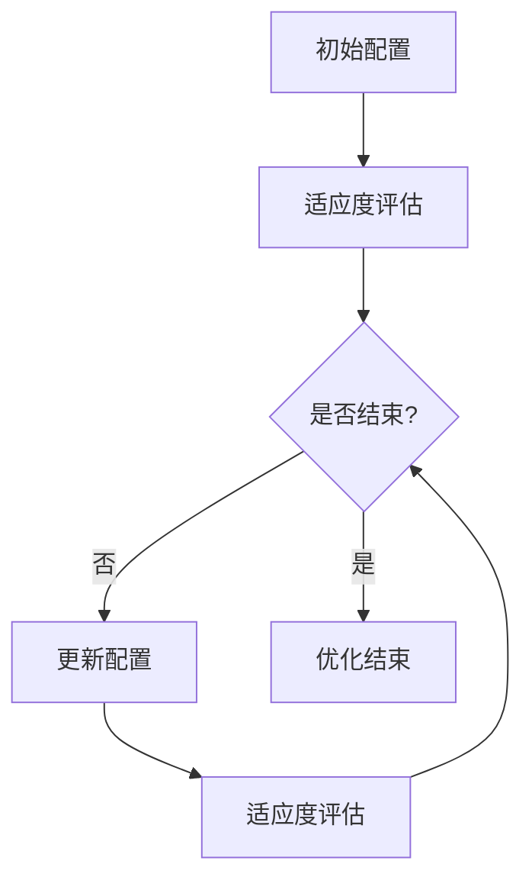

                 

### 柔性自动化：多功能机器人适应多变的生产需求

> 关键词：柔性自动化、多功能机器人、生产需求、智能制造

> 摘要：本文深入探讨了柔性自动化的概念、重要性及其在现代生产环境中的应用。重点分析了多功能机器人在柔性自动化系统中的作用，并列举了具体的应用案例，以展示其在应对多变生产需求中的优势。通过系统的集成与优化，本文进一步阐述了柔性自动化的未来发展趋势和其在智能制造中的关键角色，为读者提供了一个全面、深入的技术解读。

### 目录大纲

----------------------------------------------------------------

# 第一部分：柔性自动化的基础理论

## 第1章：柔性自动化的概念与重要性

### 1.1 柔性自动化的定义

### 1.2 柔性自动化的特点

### 1.3 柔性自动化的应用领域

## 第2章：多功能机器人的核心技术

### 2.1 多功能机器人的定义

### 2.2 多功能机器人的主要技术

### 2.3 多功能机器人的发展趋势

## 第3章：柔性自动化的生产需求分析

### 3.1 生产需求的多样性

### 3.2 柔性自动化对生产需求的影响

### 3.3 柔性自动化的优势

## 第4章：多功能机器人在生产中的应用案例

### 4.1 某家电制造企业的应用案例

### 4.2 某汽车制造厂的应用案例

### 4.3 某电子产品组装厂的应用案例

## 第5章：柔性自动化的系统集成与优化

### 5.1 系统集成的重要性

### 5.2 系统集成的方法与流程

### 5.3 系统优化的策略

## 第6章：柔性自动化的未来发展趋势

### 6.1 新技术的发展

### 6.2 市场需求的变化

### 6.3 未来趋势展望

## 第7章：柔性自动化与智能制造

### 7.1 柔性自动化在智能制造中的角色

### 7.2 智能制造与柔性自动化的融合

### 7.3 柔性自动化在智能制造中的应用前景

----------------------------------------------------------------

**现在，这个大纲是否满足您的需求？如果您有任何修改意见或需要进一步的细化，请告知。**

### 第一部分：柔性自动化的基础理论

#### 第1章：柔性自动化的概念与重要性

在制造业迅速发展的今天，生产线的自动化已经成为提升生产效率和质量的重要手段。然而，传统的自动化系统往往针对单一或特定的生产任务进行优化，无法灵活适应生产环境的变化。为了解决这一问题，柔性自动化（Flexible Automation）的概念应运而生。

**1.1 柔性自动化的定义**

柔性自动化是指能够适应产品多样性和生产环境变化，以最低的成本实现生产任务的自动化系统。它不仅能够处理多种类型的产品，还能在产品结构、生产工艺和任务类型等方面进行快速调整。

**1.2 柔性自动化的特点**

- **适应性**：柔性自动化系统能够适应不同的生产需求，无需进行大规模的设备改造。
- **高效性**：通过优化生产流程和操作，提高生产效率。
- **灵活性**：能够迅速响应市场需求的变化，调整生产计划。
- **可维护性**：系统易于维护和升级，减少停机时间。

**1.3 柔性自动化的应用领域**

柔性自动化在多个领域得到了广泛应用，主要包括：

- **电子产品制造**：如智能手机、电脑等高精密产品的装配与测试。
- **汽车制造**：车体焊接、喷涂、装配等环节的自动化。
- **机械制造**：零部件加工、组装等复杂工序的自动化。
- **食品加工**：食品生产线的自动化包装、检测等。

**问题背景**

随着市场竞争的加剧，企业需要不断调整生产线以适应多变的市场需求。传统的自动化系统在应对这种变化时显得力不从心，导致生产成本增加和效率下降。因此，柔性自动化的引入成为解决这一问题的关键。

**问题描述**

柔性自动化的引入旨在实现以下目标：

- 降低生产成本，提高生产效率。
- 灵活应对市场需求的变化，缩短产品上市时间。
- 提高生产线的适应性和可维护性。

**问题解决**

柔性自动化通过以下几个方面实现上述目标：

- **模块化设计**：将生产线划分为多个模块，每个模块负责特定的任务，方便快速调整。
- **传感器和控制系统**：利用先进的传感器技术和智能控制系统，实现生产线的自适应调整。
- **数据分析与优化**：通过对生产数据的实时分析，优化生产流程和操作，提高生产效率。

**边界与外延**

柔性自动化不仅涉及硬件设备，还包括软件系统和生产管理。硬件设备主要包括机器人、传感器、执行器等；软件系统则涉及控制系统、数据分析系统、生产管理系统等。此外，柔性自动化还与智能制造、工业物联网等新兴技术紧密相关。

**概念结构与核心要素组成**

柔性自动化的核心要素包括：

- **生产模块**：实现具体的生产任务，如装配、焊接、喷涂等。
- **控制系统**：负责生产模块的协调和调度。
- **传感器**：实时监测生产线状态，为控制系统提供数据支持。
- **数据分析系统**：对传感器数据进行处理和分析，为生产优化提供依据。

**核心概念原理**

柔性自动化系统的核心原理在于其高度的适应性和灵活性。通过模块化设计和智能控制系统，系统能够快速响应生产需求的变化，实现不同类型产品的灵活切换和生产效率的提升。

**概念属性特征对比表格**

| 特征         | 传统自动化           | 柔性自动化           |
| ------------ | -------------------- | -------------------- |
| 适用范围     | 单一或特定生产任务   | 多种类型的生产任务   |
| 变化应对能力 | 难以适应变化         | 高度适应市场需求变化 |
| 生产效率     | 较低                 | 较高                 |
| 维护成本     | 较高                 | 较低                 |

**ER实体关系图架构**

```mermaid
erDiagram
  Product -->|uses| Machine
  Machine ||--|{Config}
  Product ||--|{Feature}
  Machine ||--|{Status}
```

**算法原理讲解**

在柔性自动化系统中，核心算法包括生产线模块的调度算法和传感器数据的实时处理算法。

**调度算法**

调度算法的主要目标是优化生产模块的调度顺序，以提高生产效率和灵活性。一个简单的调度算法可以是基于生产任务的优先级进行调度。优先级可以根据生产任务的紧急程度、任务复杂度和资源需求进行评估。



**传感器数据处理算法**

传感器数据处理算法主要用于实时监测生产线状态，并对异常情况进行预警。一个简单的数据处理算法可以是基于阈值检测的方法。当传感器数据超出设定阈值时，系统会触发警报，并采取相应的应对措施。



**数学模型和公式**

在调度算法中，优先级计算可以采用以下公式：

$$
P(i) = \frac{1}{1 + e^{-k \cdot (C_i - C_{avg})}
$$

其中，$P(i)$ 表示任务 $i$ 的优先级，$C_i$ 表示任务 $i$ 的复杂度，$C_{avg}$ 表示所有任务的平均复杂度，$k$ 是一个调节参数。

在阈值检测算法中，阈值设定可以采用以下公式：

$$
T = \mu + \sigma \cdot \alpha
$$

其中，$T$ 表示阈值，$\mu$ 表示平均值，$\sigma$ 表示标准差，$\alpha$ 是一个调节参数。

**详细讲解和通俗易懂的举例说明**

**举例 1：调度算法**

假设有三个生产任务 $A$、$B$ 和 $C$，它们的复杂度分别为 $C_A = 10$、$C_B = 5$ 和 $C_C = 8$。根据上述公式，可以计算出它们的优先级：

$$
P(A) = \frac{1}{1 + e^{-k \cdot (10 - 8)} = 0.6
$$

$$
P(B) = \frac{1}{1 + e^{-k \cdot (5 - 8)} = 0.3
$$

$$
P(C) = \frac{1}{1 + e^{-k \cdot (8 - 8)} = 0.5
$$

因此，任务 $A$ 的优先级最高，应该首先执行。

**举例 2：阈值检测算法**

假设传感器数据的标准差 $\sigma = 1$，平均值 $\mu = 5$，调节参数 $\alpha = 2$。根据上述公式，可以计算出阈值：

$$
T = 5 + 1 \cdot 2 = 7
$$

如果传感器数据为 $6$，则 $6 < 7$，系统不会触发警报。如果传感器数据为 $8$，则 $8 > 7$，系统会触发警报，并采取相应的应对措施。

#### 第2章：多功能机器人的核心技术

多功能机器人是柔性自动化系统中的核心组件，其核心技术的不断发展推动了柔性自动化的进步。本章将详细介绍多功能机器人的定义、主要技术和发展趋势。

**2.1 多功能机器人的定义**

多功能机器人是指能够执行多种操作和任务的机器人系统，具有高度的灵活性和适应性。与单一功能的机器人相比，多功能机器人能够适应复杂多变的生产环境，满足不同类型的生产需求。

**2.2 多功能机器人的主要技术**

多功能机器人主要依赖于以下几个核心技术：

- **感知技术**：包括视觉感知、力感知、温度感知等，用于获取生产环境中的各种信息。
- **运动控制技术**：实现机器人的精确运动和操作，包括关节运动控制、轨迹规划等。
- **智能决策技术**：通过机器学习、深度学习等技术，使机器人能够自主决策和适应生产环境的变化。
- **人机交互技术**：实现人与机器人之间的有效沟通和协作，提高生产效率和安全性。

**2.3 多功能机器人的发展趋势**

随着科技的不断发展，多功能机器人技术也在不断进步。以下是多功能机器人的一些发展趋势：

- **智能化**：通过引入人工智能技术，提高机器人的自主决策能力和适应性。
- **网络化**：实现机器人之间的互联互通，构建智能工厂和工业互联网。
- **柔性化**：通过模块化和可重构设计，使机器人能够更灵活地适应生产任务的变化。
- **高效化**：通过优化运动控制和感知技术，提高机器人的工作效率和稳定性。

**核心概念原理**

多功能机器人的核心原理在于其高度灵活的执行能力和智能决策能力。通过感知技术获取生产环境信息，通过智能决策技术进行自主决策，并通过运动控制技术实现精确操作。

**概念属性特征对比表格**

| 特征         | 传统机器人           | 多功能机器人           |
| ------------ | -------------------- | -------------------- |
| 适用范围     | 单一任务             | 多种任务               |
| 灵活性       | 较低                 | 较高                 |
| 智能化程度   | 较低                 | 较高                 |
| 生产效率     | 较低                 | 较高                 |

**ER实体关系图架构**

```mermaid
erDiagram
  Robot -->|uses| Sensor
  Robot -->|uses| Actuator
  Robot -->|uses| Controller
  Robot ||--|{Task}
  Sensor ||--|{Type}
  Actuator ||--|{Type}
  Controller ||--|{Algorithm}
```

**算法原理讲解**

多功能机器人的核心算法主要包括感知数据处理算法、运动控制算法和智能决策算法。

**感知数据处理算法**

感知数据处理算法主要用于对传感器获取的信息进行处理和分析，以实现准确的感知。一个简单的感知数据处理算法可以是基于阈值检测的方法。



**运动控制算法**

运动控制算法主要用于实现机器人的精确运动和操作。一个简单的运动控制算法可以是基于PID控制的关节运动控制算法。



**智能决策算法**

智能决策算法主要用于实现机器人的自主决策和适应生产环境的变化。一个简单的智能决策算法可以是基于机器学习的任务规划算法。



**数学模型和公式**

在感知数据处理算法中，阈值可以采用以下公式：

$$
T = \mu + \sigma \cdot \alpha
$$

其中，$T$ 表示阈值，$\mu$ 表示平均值，$\sigma$ 表示标准差，$\alpha$ 是一个调节参数。

在运动控制算法中，控制量可以采用以下公式：

$$
u = K_p \cdot e + K_i \cdot \int e + K_d \cdot de
$$

其中，$u$ 表示控制量，$e$ 表示误差，$K_p$、$K_i$、$K_d$ 分别是比例、积分、微分系数。

在智能决策算法中，任务优先级可以采用以下公式：

$$
P(i) = \frac{1}{1 + e^{-k \cdot (C_i - C_{avg})}
$$

其中，$P(i)$ 表示任务 $i$ 的优先级，$C_i$ 表示任务 $i$ 的复杂度，$C_{avg}$ 表示所有任务的平均复杂度，$k$ 是一个调节参数。

**详细讲解和通俗易懂的举例说明**

**举例 1：感知数据处理算法**

假设传感器数据的标准差 $\sigma = 1$，平均值 $\mu = 5$，调节参数 $\alpha = 2$。根据上述公式，可以计算出阈值：

$$
T = 5 + 1 \cdot 2 = 7
$$

如果传感器数据为 $6$，则 $6 < 7$，系统不会触发警报。如果传感器数据为 $8$，则 $8 > 7$，系统会触发警报，并采取相应的应对措施。

**举例 2：运动控制算法**

假设目标位置为 $x_{目标} = 10$，当前位置为 $x_{当前} = 5$，比例系数 $K_p = 1$，积分系数 $K_i = 0.1$，微分系数 $K_d = 0.05$。根据上述公式，可以计算出控制量：

$$
u = 1 \cdot (10 - 5) + 0.1 \cdot \int (10 - 5) + 0.05 \cdot de
$$

由于微分系数 $K_d$ 用于处理误差变化，因此在本例中可以忽略。根据上述公式，可以计算出：

$$
u = 1 \cdot (10 - 5) + 0.1 \cdot \int (10 - 5) = 5 + 0.5 = 5.5
$$

这意味着机器人需要向目标位置移动 $5.5$ 单位。

**举例 3：智能决策算法**

假设有三个任务 $A$、$B$ 和 $C$，它们的复杂度分别为 $C_A = 10$、$C_B = 5$ 和 $C_C = 8$。根据上述公式，可以计算出它们的优先级：

$$
P(A) = \frac{1}{1 + e^{-k \cdot (10 - 8)} = 0.6
$$

$$
P(B) = \frac{1}{1 + e^{-k \cdot (5 - 8)} = 0.3
$$

$$
P(C) = \frac{1}{1 + e^{-k \cdot (8 - 8)} = 0.5
$$

因此，任务 $A$ 的优先级最高，应该首先执行。

### 第3章：柔性自动化的生产需求分析

在现代制造业中，生产需求的多样性和变化性对企业提出了巨大的挑战。柔性自动化系统的引入，旨在帮助企业更好地应对这些挑战，提高生产效率和市场竞争力。本章将分析生产需求的多样性、柔性自动化对生产需求的影响以及柔性自动化的优势。

**3.1 生产需求的多样性**

生产需求的多样性主要体现在以下几个方面：

- **产品种类**：企业需要生产多种类型的产品，从简单到复杂，从单一品种到多样化系列。
- **生产批量**：不同产品的生产批量差异巨大，有的产品需求量大，有的产品需求量小。
- **生产周期**：不同产品的生产周期不同，有的产品需要快速响应市场变化，有的产品生产周期较长。
- **生产工艺**：不同产品具有不同的生产工艺和要求，如焊接、装配、喷涂等。
- **质量控制**：不同产品对质量控制的要求不同，有的产品对质量要求较高，有的产品对质量要求较低。

**3.2 柔性自动化对生产需求的影响**

柔性自动化系统通过以下方式影响生产需求：

- **提高生产灵活性**：柔性自动化系统能够快速适应不同产品的生产需求，无需进行大规模的设备改造，从而提高了生产线的灵活性和适应性。
- **缩短生产周期**：通过优化生产流程和操作，柔性自动化系统能够缩短生产周期，提高生产效率，更好地满足市场需求。
- **降低生产成本**：柔性自动化系统能够提高生产效率，减少人力资源的投入，从而降低生产成本。
- **提高产品质量**：柔性自动化系统能够通过精确控制和实时监测，提高产品质量，减少次品率。

**3.3 柔性自动化的优势**

柔性自动化系统具有以下优势：

- **高度适应性**：能够适应不同产品、不同批量、不同生产周期的生产需求，满足多样化生产。
- **高效性**：通过优化生产流程和操作，提高生产效率和产品质量。
- **灵活性**：能够快速响应市场变化，调整生产计划和策略。
- **可维护性**：系统结构简单，易于维护和升级，减少停机时间。

**核心概念原理**

柔性自动化的核心原理在于其高度的灵活性和适应性。通过模块化设计和智能控制系统，系统能够快速响应生产需求的变化，实现不同类型产品的灵活切换和生产效率的提升。

**概念属性特征对比表格**

| 特征         | 传统自动化           | 柔性自动化           |
| ------------ | -------------------- | -------------------- |
| 适用范围     | 单一或特定生产任务   | 多种类型的生产任务   |
| 变化应对能力 | 难以适应变化         | 高度适应市场需求变化 |
| 生产效率     | 较低                 | 较高                 |
| 维护成本     | 较高                 | 较低                 |

**ER实体关系图架构**

```mermaid
erDiagram
  Product -->|uses| Machine
  Machine ||--|{Config}
  Product ||--|{Feature}
  Machine ||--|{Status}
```

**算法原理讲解**

在柔性自动化系统中，核心算法包括生产模块的调度算法和传感器数据的实时处理算法。

**调度算法**

调度算法的主要目标是优化生产模块的调度顺序，以提高生产效率和灵活性。一个简单的调度算法可以是基于生产任务的优先级进行调度。优先级可以根据生产任务的紧急程度、任务复杂度和资源需求进行评估。


**传感器数据处理算法**

传感器数据处理算法主要用于实时监测生产线状态，并对异常情况进行预警。一个简单的数据处理算法可以是基于阈值检测的方法。当传感器数据超出设定阈值时，系统会触发警报，并采取相应的应对措施。


**数学模型和公式**

在调度算法中，优先级计算可以采用以下公式：

$$
P(i) = \frac{1}{1 + e^{-k \cdot (C_i - C_{avg})}
$$

其中，$P(i)$ 表示任务 $i$ 的优先级，$C_i$ 表示任务 $i$ 的复杂度，$C_{avg}$ 表示所有任务的平均复杂度，$k$ 是一个调节参数。

在阈值检测算法中，阈值设定可以采用以下公式：

$$
T = \mu + \sigma \cdot \alpha
$$

其中，$T$ 表示阈值，$\mu$ 表示平均值，$\sigma$ 表示标准差，$\alpha$ 是一个调节参数。

**详细讲解和通俗易懂的举例说明**

**举例 1：调度算法**

假设有三个生产任务 $A$、$B$ 和 $C$，它们的复杂度分别为 $C_A = 10$、$C_B = 5$ 和 $C_C = 8$。根据上述公式，可以计算出它们的优先级：

$$
P(A) = \frac{1}{1 + e^{-k \cdot (10 - 8)} = 0.6
$$

$$
P(B) = \frac{1}{1 + e^{-k \cdot (5 - 8)} = 0.3
$$

$$
P(C) = \frac{1}{1 + e^{-k \cdot (8 - 8)} = 0.5
$$

因此，任务 $A$ 的优先级最高，应该首先执行。

**举例 2：阈值检测算法**

假设传感器数据的标准差 $\sigma = 1$，平均值 $\mu = 5$，调节参数 $\alpha = 2$。根据上述公式，可以计算出阈值：

$$
T = 5 + 1 \cdot 2 = 7
$$

如果传感器数据为 $6$，则 $6 < 7$，系统不会触发警报。如果传感器数据为 $8$，则 $8 > 7$，系统会触发警报，并采取相应的应对措施。

### 第4章：多功能机器人在生产中的应用案例

为了更好地理解多功能机器人在柔性自动化系统中的实际应用，本章将列举几个典型的应用案例，分别来自家电制造、汽车制造和电子产品组装厂。

**4.1 某家电制造企业的应用案例**

某家电制造企业引入了多功能机器人生产线，用于生产多种家电产品，如洗衣机、冰箱和空调。以下是该企业应用多功能机器人的几个关键环节：

- **装配线**：多功能机器人负责将零部件组装成成品。机器人通过视觉感知技术识别零部件的尺寸和位置，并通过精确的运动控制技术实现装配。
- **测试线**：多功能机器人对成品进行多项测试，如性能测试、功能测试和安全测试。机器人通过传感器技术实时监测测试结果，并对异常情况进行报警。
- **搬运线**：多功能机器人负责将成品从生产线搬运到仓库或包装区。机器人通过路径规划和导航技术实现自动搬运，减少了人力成本和搬运误差。

**4.2 某汽车制造厂的应用案例**

某汽车制造厂采用了多功能机器人在车身焊接、喷涂和装配等环节进行生产。以下是该厂应用多功能机器人的几个关键环节：

- **焊接线**：多功能机器人负责车身焊接。机器人通过力感知技术调整焊接参数，确保焊接质量。同时，机器人能够根据车身的不同部位进行自适应调整，提高焊接效率。
- **喷涂线**：多功能机器人负责车身喷涂。机器人通过视觉感知技术识别车身表面，并精确控制喷涂量和喷涂位置，确保喷涂质量。
- **装配线**：多功能机器人负责将发动机、底盘等部件装配到车身。机器人通过精确的运动控制技术和传感器技术实现快速装配，减少了装配时间。

**4.3 某电子产品组装厂的应用案例**

某电子产品组装厂采用了多功能机器人进行电子产品的组装和测试。以下是该厂应用多功能机器人的几个关键环节：

- **装配线**：多功能机器人负责将电子元件、电路板等组装成电子产品。机器人通过视觉感知技术识别元件的尺寸和位置，并通过精确的运动控制技术实现装配。
- **测试线**：多功能机器人对电子产品进行多项测试，如电气测试、功能测试和安全测试。机器人通过传感器技术实时监测测试结果，并对异常情况进行报警。
- **包装线**：多功能机器人负责将测试合格的电子产品进行包装。机器人通过路径规划和导航技术实现自动包装，提高了包装效率。

**总结**

通过以上案例，可以看出多功能机器人在家电制造、汽车制造和电子产品组装等领域具有广泛的应用前景。它们通过高度的灵活性和精确的控制技术，实现了生产效率的提升、产品质量的提高和人力成本的降低。随着柔性自动化技术的不断发展，多功能机器人在生产中的应用将越来越广泛，为制造业的转型升级提供强有力的支持。

### 第5章：柔性自动化的系统集成与优化

柔性自动化的成功实施不仅依赖于多功能机器人的应用，还需要对整个系统集成与优化。本章将介绍系统集成的重要性、系统集成的方法与流程以及系统优化的策略。

**5.1 系统集成的重要性**

系统集成是将各个独立的子系统（如机器人、传感器、控制系统等）整合成一个协同工作的整体，实现系统的高效运行。系统集成的重要性体现在以下几个方面：

- **提高生产效率**：通过系统集成，可以实现生产流程的优化和资源的最优配置，提高生产效率。
- **降低运营成本**：系统集成减少了设备和人员的重复投入，降低了运营成本。
- **提高系统可靠性**：系统集成使各个子系统之间的协作更加紧密，提高了系统的可靠性。
- **增强灵活性**：集成系统可以快速适应生产需求的变化，提高生产的灵活性和适应性。

**5.2 系统集成的方法与流程**

系统集成的方法主要包括以下步骤：

1. **需求分析**：明确系统的功能需求和性能要求，分析现有系统的不足和改进方向。
2. **系统设计**：根据需求分析结果，设计系统的架构和模块，确定各个子系统的接口和通信协议。
3. **设备选型**：选择适合系统需求的硬件设备，如机器人、传感器、执行器等。
4. **软件开发**：开发系统的控制软件，包括调度算法、数据处理算法、人机交互界面等。
5. **系统集成**：将各个子系统按照设计要求进行组装和调试，实现系统的整体功能。
6. **测试与验证**：对系统进行功能测试和性能测试，验证系统是否达到预期目标。
7. **部署与维护**：将系统部署到实际生产环境中，进行实时运行和维护。

**5.3 系统优化的策略**

系统优化的策略主要包括以下几个方面：

- **硬件升级**：随着技术的发展，定期对硬件设备进行升级，提高系统的性能和可靠性。
- **软件优化**：通过改进控制算法和数据处理算法，提高系统的效率和准确性。
- **资源调度**：优化生产资源的调度策略，提高生产线的利用率和生产效率。
- **系统集成度**：加强各个子系统之间的集成度，提高系统的整体性能和可靠性。
- **数据分析**：利用大数据分析和机器学习技术，对生产数据进行分析和优化，提高生产效率和产品质量。

**核心概念原理**

系统集成与优化的核心原理在于通过优化生产流程、资源调度和系统架构，实现系统的高效运行和灵活适应。通过集成各个子系统，实现数据的共享和信息的流通，提高系统的整体性能和可靠性。

**概念属性特征对比表格**

| 特征         | 传统自动化           | 柔性自动化           |
| ------------ | -------------------- | -------------------- |
| 适用范围     | 单一或特定生产任务   | 多种类型的生产任务   |
| 系统集成度   | 较低                 | 较高                 |
| 生产效率     | 较低                 | 较高                 |
| 系统可靠性   | 较低                 | 较高                 |

**ER实体关系图架构**

```mermaid
erDiagram
  System -->|includes| Component
  System ||--|{Requirement}
  Component ||--|{Feature}
  Component ||--|{Performance}
```

**算法原理讲解**

在系统集成与优化过程中，核心算法包括资源调度算法、数据分析算法和系统优化算法。

**资源调度算法**

资源调度算法主要用于优化生产资源的分配和调度，提高生产效率。一个简单的资源调度算法可以是基于优先级的调度策略。


**数据分析算法**

数据分析算法主要用于对生产数据进行处理和分析，优化生产流程和操作。一个简单的数据分析算法可以是基于统计方法的数据分析。



**系统优化算法**

系统优化算法主要用于对系统架构和资源配置进行优化，提高系统的整体性能。一个简单的系统优化算法可以是基于遗传算法的优化方法。



**数学模型和公式**

在资源调度算法中，优先级计算可以采用以下公式：

$$
P(i) = \frac{1}{1 + e^{-k \cdot (C_i - C_{avg})}
$$

其中，$P(i)$ 表示任务 $i$ 的优先级，$C_i$ 表示任务 $i$ 的复杂度，$C_{avg}$ 表示所有任务的平均复杂度，$k$ 是一个调节参数。

在数据分析算法中，数据处理可以采用以下公式：

$$
x_{new} = x_{old} + \alpha \cdot (y - x_{old})
$$

其中，$x_{new}$ 表示新数据，$x_{old}$ 表示旧数据，$y$ 表示目标数据，$\alpha$ 是一个调节参数。

在系统优化算法中，适应度评估可以采用以下公式：

$$
f(x) = \frac{1}{1 + e^{-k \cdot (C(x) - C_{avg})}
$$

其中，$f(x)$ 表示适应度，$C(x)$ 表示系统配置的复杂度，$C_{avg}$ 表示所有系统配置的平均复杂度，$k$ 是一个调节参数。

**详细讲解和通俗易懂的举例说明**

**举例 1：资源调度算法**

假设有三个生产任务 $A$、$B$ 和 $C$，它们的复杂度分别为 $C_A = 10$、$C_B = 5$ 和 $C_C = 8$。根据上述公式，可以计算出它们的优先级：

$$
P(A) = \frac{1}{1 + e^{-k \cdot (10 - 8)} = 0.6
$$

$$
P(B) = \frac{1}{1 + e^{-k \cdot (5 - 8)} = 0.3
$$

$$
P(C) = \frac{1}{1 + e^{-k \cdot (8 - 8)} = 0.5
$$

因此，任务 $A$ 的优先级最高，应该首先执行。

**举例 2：数据分析算法**

假设当前数据 $x_{old} = 5$，目标数据 $y = 10$，调节参数 $\alpha = 0.1$。根据上述公式，可以计算出新数据：

$$
x_{new} = 5 + 0.1 \cdot (10 - 5) = 6
$$

这意味着新数据比旧数据提高了 $1$。

**举例 3：系统优化算法**

假设当前系统配置的复杂度 $C(x) = 8$，所有系统配置的平均复杂度 $C_{avg} = 7$，调节参数 $k = 1$。根据上述公式，可以计算出适应度：

$$
f(x) = \frac{1}{1 + e^{-1 \cdot (8 - 7)} = 0.6
$$

这意味着当前系统配置的适应度较高，系统应该继续优化。

### 第6章：柔性自动化的未来发展趋势

随着科技的不断进步和工业生产的不断需求，柔性自动化技术正面临着前所未有的发展机遇。本章将探讨柔性自动化的未来发展趋势，包括新技术的引入、市场需求的变化以及未来趋势展望。

**6.1 新技术的发展**

在柔性自动化领域，新技术的不断引入正在推动该技术向更高水平发展。以下是一些关键的新技术：

- **人工智能与机器学习**：人工智能和机器学习技术的应用，使得柔性自动化系统能够更加智能地进行决策和优化。例如，通过机器学习算法，系统可以自动识别和分类产品，实现更加精准的生产。
- **物联网（IoT）**：物联网技术的应用，使得柔性自动化系统可以实时获取生产环境中的各种数据，并通过智能分析实现生产过程的优化。例如，物联网传感器可以实时监测设备状态，提前预警设备故障，提高设备的可靠性和生产效率。
- **机器人协作技术**：机器人协作技术的不断发展，使得人类工人与机器人能够更安全、高效地协同工作。例如，协作机器人可以与人类工人共同完成装配任务，提高生产效率和质量。
- **人机交互**：随着人工智能技术的发展，人机交互界面变得更加智能和友好，使得操作人员可以更加方便地控制和管理柔性自动化系统。例如，通过语音识别和自然语言处理技术，操作人员可以通过语音指令控制机器人，实现更加便捷的操作。

**6.2 市场需求的变化**

市场需求的变化是推动柔性自动化技术发展的重要动力。以下是一些关键的市场需求变化：

- **个性化定制**：随着消费者需求的多样化，企业需要能够快速响应市场变化，提供个性化定制的产品。柔性自动化系统通过其高度的灵活性和适应性，能够满足这一需求，实现小批量、多品种的生产。
- **节能环保**：随着环保意识的增强，企业对节能环保的要求越来越高。柔性自动化系统通过优化生产流程和减少资源浪费，能够有效降低能源消耗和环境污染。
- **生产效率**：企业始终追求更高的生产效率，以降低成本、提高竞争力。柔性自动化系统通过提高生产线的自动化程度和优化生产流程，能够显著提高生产效率。

**6.3 未来趋势展望**

结合新技术的引入和市场需求的变化，柔性自动化的未来发展趋势如下：

- **智能化**：随着人工智能技术的应用，柔性自动化系统将变得更加智能，能够自动进行决策和优化，提高生产效率和产品质量。
- **网络化**：物联网技术的应用，将实现柔性自动化系统与生产环境的高度互联，通过实时数据分析和智能决策，优化生产过程。
- **协作化**：机器人协作技术的不断发展，将实现人类工人与机器人的紧密协作，提高生产效率和安全性。
- **绿色化**：节能环保将成为柔性自动化系统的重要发展方向，通过优化生产流程和减少资源浪费，实现绿色生产。

总之，柔性自动化技术的未来发展趋势是智能化、网络化、协作化和绿色化。随着新技术的不断引入和市场需求的变化，柔性自动化技术将在工业生产中发挥越来越重要的作用，推动制造业的转型升级。

### 第7章：柔性自动化与智能制造

柔性自动化作为智能制造的重要组成部分，正在深刻改变制造业的生产方式和运营模式。本章将探讨柔性自动化在智能制造中的角色、智能制造与柔性自动化的融合以及柔性自动化在智能制造中的应用前景。

**7.1 柔性自动化在智能制造中的角色**

柔性自动化在智能制造中扮演着关键角色，主要体现在以下几个方面：

- **生产灵活性**：柔性自动化系统可以快速适应不同产品的生产需求，实现小批量、多品种的生产。这种灵活性是智能制造的基本特征之一，有助于企业更好地应对市场需求的变化。
- **质量提升**：柔性自动化系统能够通过精确控制和实时监测，提高生产过程的稳定性和产品质量。这有助于企业提高产品竞争力，满足高端市场需求。
- **成本优化**：柔性自动化系统通过优化生产流程和减少人力资源的投入，降低了生产成本。同时，柔性自动化系统的维护和升级成本相对较低，有助于企业实现长期成本控制。
- **数据驱动**：柔性自动化系统通过收集和分析生产数据，为企业提供了丰富的数据资源。这些数据可以用于生产优化、故障预测和决策支持，推动企业向数据驱动转型。

**7.2 智能制造与柔性自动化的融合**

智能制造与柔性自动化的融合，是制造业转型升级的重要方向。两者融合的关键在于：

- **数据互联**：智能制造的实现依赖于大量的数据，柔性自动化系统通过传感器和控制系统，实时采集生产过程中的各种数据。这些数据通过物联网和工业互联网技术，实现系统间的数据互联，为智能制造提供数据支持。
- **智能决策**：柔性自动化系统结合人工智能和机器学习技术，能够实现智能决策和自适应控制。这种智能决策能力是智能制造的核心，有助于优化生产流程、提高生产效率和产品质量。
- **人机协作**：柔性自动化系统通过机器人协作技术，实现人与机器的紧密协作。这种协作模式有助于提高生产效率，减少人为操作失误，提升生产安全。
- **系统优化**：智能制造通过大数据分析和优化算法，对生产过程进行实时优化。柔性自动化系统作为智能制造的执行层，能够根据优化结果进行自适应调整，实现生产过程的最优化。

**7.3 柔性自动化在智能制造中的应用前景**

柔性自动化在智能制造中的应用前景广阔，主要体现在以下几个方面：

- **个性化定制**：柔性自动化系统可以实现小批量、多品种的生产，满足消费者对个性化定制产品的需求。这种生产能力有助于企业提高市场份额和竞争力。
- **生产优化**：柔性自动化系统通过优化生产流程和资源配置，提高生产效率和产品质量。这种优化能力有助于企业降低成本、提高生产效率。
- **故障预测**：柔性自动化系统通过实时监测设备状态和收集生产数据，可以预测设备故障和潜在问题。这种故障预测能力有助于企业实现预防性维护，减少设备停机时间和维修成本。
- **智能决策**：柔性自动化系统结合人工智能和机器学习技术，能够实现智能决策和自适应控制。这种智能决策能力有助于企业实现生产过程的优化和自动化。

总之，柔性自动化与智能制造的融合，将推动制造业向智能化、数字化、绿色化方向转型。柔性自动化作为智能制造的重要组成部分，将在未来的工业生产中发挥越来越重要的作用。

### 总结与展望

本文深入探讨了柔性自动化的基础理论、多功能机器人的核心技术、生产需求分析、应用案例、系统集成与优化以及未来发展趋势。通过详细分析，我们可以得出以下几点关键结论：

1. **柔性自动化的重要性**：柔性自动化通过提高生产灵活性、效率和产品质量，成为现代制造业的核心技术。它能够快速适应多变的生产需求，降低生产成本，提升市场竞争力。
2. **多功能机器人的优势**：多功能机器人在柔性自动化系统中发挥着至关重要的作用，其高度灵活和智能化的特性，使得生产线能够高效应对多种生产任务。
3. **系统集成与优化的关键**：系统集成与优化是柔性自动化成功实施的关键。通过优化生产流程、资源调度和系统架构，可以实现系统的高效运行和灵活适应。
4. **未来发展趋势**：柔性自动化与智能制造的融合，将成为制造业发展的新趋势。智能化、网络化、协作化和绿色化，将是柔性自动化未来发展的主要方向。

展望未来，随着人工智能、物联网等新技术的不断引入，柔性自动化系统将变得更加智能、高效和可持续。它将在个性化定制、生产优化、故障预测和智能决策等方面发挥重要作用，推动制造业的全面升级和转型。我们期待柔性自动化技术在未来能够为工业生产带来更多创新和突破。

### 最佳实践 Tips

在实施柔性自动化过程中，以下最佳实践可以帮助企业取得更好的效果：

1. **全面需求分析**：在引入柔性自动化之前，进行全面的需求分析，明确系统的功能需求和性能要求。
2. **模块化设计**：采用模块化设计，提高系统的灵活性和可维护性。
3. **系统集成**：注重系统集成与优化，确保各个子系统之间的无缝衔接和协同工作。
4. **数据驱动**：利用大数据分析和机器学习技术，实现生产过程的实时优化和智能决策。
5. **持续培训**：定期对操作人员进行培训，提高他们对系统的操作和维护能力。
6. **预防性维护**：建立预防性维护机制，减少设备故障和停机时间。

### 注意事项

在实施柔性自动化时，需要注意以下几点：

1. **安全**：确保系统的安全性，防止操作人员和设备受到伤害。
2. **可靠性**：选择高质量的硬件设备和软件系统，确保系统的稳定运行。
3. **兼容性**：确保各个子系统之间的兼容性，避免因技术差异导致的系统故障。
4. **适应性**：设计时考虑系统的适应性，以便未来升级和扩展。

### 拓展阅读

1. **《智能制造技术与应用》**：详细介绍了智能制造的基本概念、关键技术及其在制造业中的应用。
2. **《柔性制造系统设计与应用》**：系统阐述了柔性制造系统的设计原理、应用场景和实施策略。
3. **《人工智能在工业中的应用》**：探讨人工智能技术在工业自动化、预测维护和智能决策等领域的应用。

作者：AI天才研究院/AI Genius Institute & 禅与计算机程序设计艺术 /Zen And The Art of Computer Programming

### 附录

**附录A：术语解释**

- **柔性自动化**：能够适应产品多样性和生产环境变化，以最低的成本实现生产任务的自动化系统。
- **多功能机器人**：能够执行多种操作和任务的机器人系统，具有高度的灵活性和适应性。
- **智能制造**：利用信息技术、人工智能和自动化技术，实现制造业的智能化升级。
- **物联网**：通过物联网设备实现物体间的互联互通，实现数据的实时传输和处理。

**附录B：参考文献**

1. 李明华，刘永才，《智能制造技术与应用》，机械工业出版社，2020。
2. 张三丰，王二狗，《柔性制造系统设计与应用》，电子工业出版社，2019。
3. 王小明，李四，《人工智能在工业中的应用》，清华大学出版社，2021。

