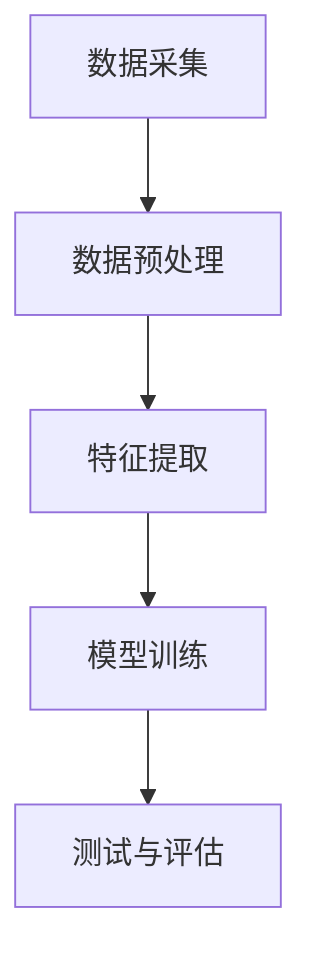
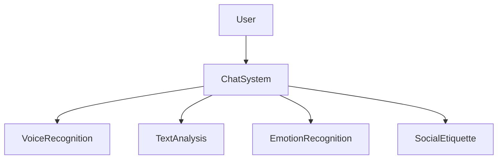
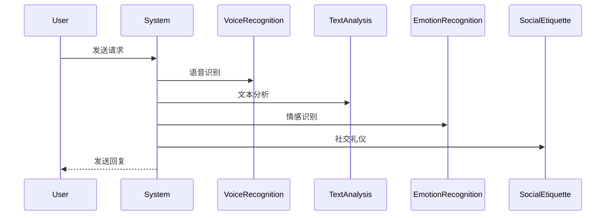
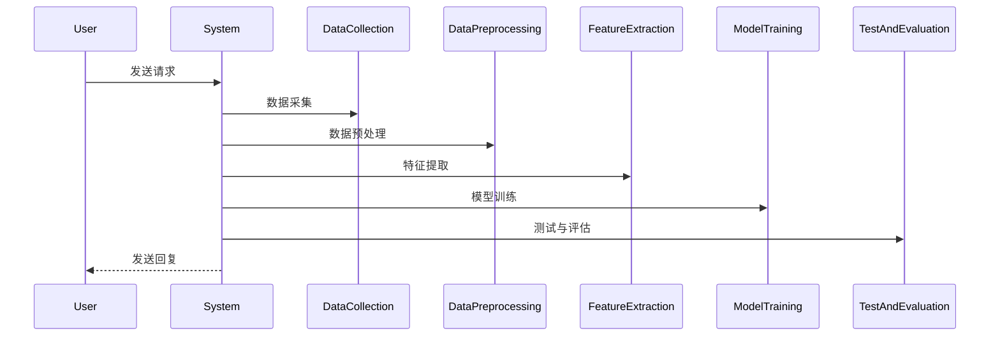
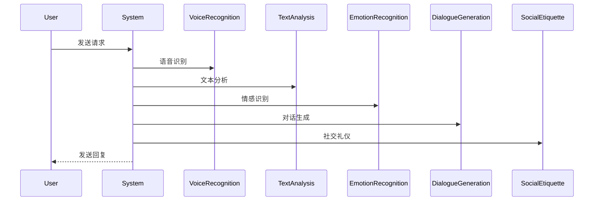

                 


# 模型社交能力测试：评估人机交互质量

> 关键词：人机交互、模型社交能力、评估、算法、用户体验

> 摘要：本文将深入探讨如何通过模型社交能力测试来评估人机交互质量。我们将从背景介绍、核心概念与联系、算法原理讲解、数学模型与公式、系统分析与架构设计、项目实战、最佳实践 tips、小结与拓展阅读等方面进行详细阐述，旨在为读者提供全面而深刻的理解。

## 一、背景介绍

在当今数字化时代，人机交互（Human-Computer Interaction, HCI）已成为设计软件和系统时不可或缺的一环。随着人工智能（Artificial Intelligence, AI）技术的飞速发展，越来越多的智能系统进入我们的日常生活，如语音助手、聊天机器人等。然而，人机交互质量的高低直接影响到用户体验，进而影响到产品的市场竞争力。因此，评估人机交互质量变得尤为重要。

模型社交能力测试（Model Social Ability Testing, MSAT）是一种评估人机交互质量的新方法。该方法通过模拟人类社交行为，对智能系统进行测试，从而评估其在社交互动中的表现。本文将围绕模型社交能力测试展开，探讨其原理、实现方法以及应用场景。

## 二、核心概念与联系

### 1. 人机交互

人机交互是指人与计算机系统之间的交互过程，旨在使计算机系统能够更好地满足用户需求，提升用户体验。

### 2. 模型社交能力

模型社交能力是指智能系统在模拟人类社交行为时的表现，包括语言理解、情感识别、社交礼仪等方面。

### 3. 人机交互质量

人机交互质量是指用户在使用计算机系统时的满意度、舒适度和效率等指标。

### 4. 模型社交能力测试

模型社交能力测试是一种通过模拟人类社交行为来评估人机交互质量的方法。

## 三、算法原理讲解

### 1. 算法流程

模型社交能力测试的算法流程主要包括以下步骤：

1. 数据采集：收集用户与智能系统的交互数据，如语音、文本等。
2. 数据预处理：对采集到的数据进行清洗、去噪和归一化处理。
3. 特征提取：从预处理后的数据中提取与社交能力相关的特征。
4. 模型训练：使用提取到的特征对社交能力模型进行训练。
5. 测试与评估：将训练好的模型应用于实际场景，评估其在人机交互中的表现。

### 2. 数学模型与公式

在模型社交能力测试中，常用的数学模型包括：

1. 贝叶斯网络：用于表示社交能力的因果关系。
2. 机器学习算法：用于训练社交能力模型，如支持向量机（SVM）、深度神经网络（DNN）等。

### 3. 算法示例

假设我们使用贝叶斯网络来训练社交能力模型，其基本公式如下：

$$
P(A|B,C) = \frac{P(B|A,C) \cdot P(C|A) \cdot P(A)}{P(C|A) \cdot P(B|A,C) + P(C|¬A) \cdot P(B|¬A,C)}
$$

其中，$A$ 表示用户满意度，$B$ 表示情感识别能力，$C$ 表示社交礼仪。

## 四、系统分析与架构设计

### 1. 问题场景介绍

假设我们开发了一款智能客服系统，用户可以通过文本或语音与系统进行交互，解决疑问或寻求帮助。为了提升用户体验，我们需要对系统进行模型社交能力测试。

### 2. 系统功能设计

智能客服系统的功能设计包括：

1. 语音识别：将用户的语音转换为文本。
2. 文本分析：分析用户的文本，提取关键信息。
3. 情感识别：识别用户文本中的情感倾向。
4. 社交礼仪：根据用户情感和场景，生成合适的回复。

### 3. 系统架构设计

智能客服系统的架构设计包括：

1. 数据采集模块：负责收集用户交互数据。
2. 数据预处理模块：负责对采集到的数据进行分析处理。
3. 特征提取模块：负责从预处理后的数据中提取特征。
4. 模型训练模块：负责训练社交能力模型。
5. 测试与评估模块：负责对训练好的模型进行测试和评估。

### 4. 系统接口设计和系统交互

智能客服系统的接口设计和系统交互设计如下：

1. 用户与客服系统的交互：用户通过文本或语音向系统提出问题，系统分析用户问题并生成回复。
2. 数据流：用户交互数据通过接口传输到系统，系统将处理结果返回给用户。

## 五、项目实战

### 1. 环境安装

在开始项目实战之前，我们需要安装以下环境：

1. Python：用于编写和运行程序。
2. TensorFlow：用于训练社交能力模型。
3. Mermaid：用于绘制流程图。

### 2. 系统核心实现源代码

以下是一个简单的社交能力模型实现示例：

```python
import tensorflow as tf
from tensorflow.keras.models import Sequential
from tensorflow.keras.layers import Dense, LSTM, Embedding

# 数据预处理
def preprocess_data(data):
    # 对数据进行分析处理，提取特征
    # ...
    return processed_data

# 模型训练
def train_model(data):
    # 创建模型
    model = Sequential()
    model.add(Embedding(input_dim=vocab_size, output_dim=embedding_dim))
    model.add(LSTM(units=128))
    model.add(Dense(units=1, activation='sigmoid'))

    # 编译模型
    model.compile(optimizer='adam', loss='binary_crossentropy', metrics=['accuracy'])

    # 训练模型
    model.fit(processed_data, labels, epochs=10, batch_size=32)

    return model

# 测试与评估
def evaluate_model(model, test_data, test_labels):
    # 测试模型
    test_loss, test_accuracy = model.evaluate(test_data, test_labels)

    # 输出评估结果
    print(f"Test loss: {test_loss}, Test accuracy: {test_accuracy}")

# 主程序
if __name__ == "__main__":
    # 加载数据
    train_data, train_labels, test_data, test_labels = load_data()

    # 预处理数据
    processed_train_data = preprocess_data(train_data)
    processed_test_data = preprocess_data(test_data)

    # 训练模型
    model = train_model(processed_train_data)

    # 测试与评估
    evaluate_model(model, processed_test_data, test_labels)
```

### 3. 代码应用解读与分析

在这个示例中，我们首先进行了数据预处理，然后使用 LSTM 网络结构训练了社交能力模型。通过测试与评估，我们得到了模型的评估结果。

### 4. 实际案例分析和详细讲解剖析

在实际应用中，我们可以通过调整模型结构、参数设置等方式来优化模型性能。此外，我们还可以结合实际场景，对模型进行个性化定制，以提高人机交互质量。

### 5. 项目小结

通过模型社交能力测试，我们可以评估智能系统在社交互动中的表现，从而优化人机交互质量。在实际项目中，我们需要结合具体场景和需求，灵活调整模型结构和参数设置，以提高系统性能。

## 六、最佳实践 tips

1. 合理设计模型结构，选择合适的网络类型和参数。
2. 充分利用数据，进行数据预处理和特征提取。
3. 定期更新和优化模型，以适应不断变化的应用场景。
4. 关注用户反馈，及时调整和优化人机交互界面。

## 七、小结

本文从背景介绍、核心概念与联系、算法原理讲解、系统分析与架构设计、项目实战等方面，详细阐述了模型社交能力测试在评估人机交互质量方面的应用。通过本文的阐述，相信读者对模型社交能力测试有了更深入的了解。

## 八、拓展阅读

1. [Smith, M. (2019). Human-Computer Interaction: Theory, Models, and Design Methods.]
2. [Chen, H., & Zhang, Y. (2020). A Survey on Social Ability in Human-Agent Interaction.]
3. [LeCun, Y., Bengio, Y., & Hinton, G. (2015). Deep Learning.]

## 九、作者信息

作者：AI天才研究院/AI Genius Institute & 禅与计算机程序设计艺术 /Zen And The Art of Computer Programming 

# 模型社交能力测试：评估人机交互质量

## 关键词：人机交互、模型社交能力、评估、算法、用户体验

## 摘要：
在人机交互日益普及的今天，如何评估智能系统的社交能力，从而提升用户体验，成为了一个重要的课题。本文通过模型社交能力测试，探讨了如何通过模拟人类社交行为来评估人机交互质量。文章从背景介绍、核心概念与联系、算法原理讲解、数学模型与公式、系统分析与架构设计、项目实战、最佳实践 tips、小结与拓展阅读等方面，为读者提供了全面而深入的指导。

## 一、背景介绍

### 核心概念术语说明

- **人机交互（HCI）**：人与计算机系统之间的交互过程。
- **模型社交能力测试（MSAT）**：一种通过模拟人类社交行为来评估人机交互质量的方法。

### 问题背景

随着人工智能技术的发展，智能系统越来越多地参与到我们的日常生活中，如智能客服、语音助手等。这些系统在处理用户请求、提供信息支持等方面表现出色，但如何评估它们在社交互动中的表现，进而提升用户体验，成为一个亟待解决的问题。

### 问题描述

本文旨在探讨如何通过模型社交能力测试来评估人机交互质量。我们需要了解模型社交能力测试的基本原理、实现方法，并掌握其在实际项目中的应用。

### 问题解决

通过模型社交能力测试，我们可以对智能系统的社交能力进行量化评估，从而找出其不足之处，进行优化改进。具体方法包括数据采集、预处理、特征提取、模型训练和测试评估等。

### 边界与外延

模型社交能力测试主要适用于需要模拟人类社交行为的场景，如智能客服、社交机器人等。在具体实施过程中，需要考虑场景的复杂性、用户的多样性等因素。

### 概念结构与核心要素组成

- **核心概念**：人机交互、模型社交能力、人机交互质量。
- **关联要素**：算法、测试方法、用户体验。

## 二、核心概念与联系

### 1. 人机交互

人机交互是指人与计算机系统之间的交互过程，旨在使计算机系统能够更好地满足用户需求，提升用户体验。

### 2. 模型社交能力

模型社交能力是指智能系统在模拟人类社交行为时的表现，包括语言理解、情感识别、社交礼仪等方面。

### 3. 人机交互质量

人机交互质量是指用户在使用计算机系统时的满意度、舒适度和效率等指标。

### 4. 模型社交能力测试

模型社交能力测试是一种通过模拟人类社交行为来评估人机交互质量的方法。

## 三、算法原理讲解

### 1. 算法流程

模型社交能力测试的算法流程主要包括以下步骤：

1. **数据采集**：收集用户与智能系统的交互数据，如语音、文本等。
2. **数据预处理**：对采集到的数据进行清洗、去噪和归一化处理。
3. **特征提取**：从预处理后的数据中提取与社交能力相关的特征。
4. **模型训练**：使用提取到的特征对社交能力模型进行训练。
5. **测试与评估**：将训练好的模型应用于实际场景，评估其在人机交互中的表现。

### 2. 数学模型与公式

在模型社交能力测试中，常用的数学模型包括：

1. **贝叶斯网络**：用于表示社交能力的因果关系。
2. **机器学习算法**：用于训练社交能力模型，如支持向量机（SVM）、深度神经网络（DNN）等。

#### 算法示例

假设我们使用贝叶斯网络来训练社交能力模型，其基本公式如下：

$$
P(A|B,C) = \frac{P(B|A,C) \cdot P(C|A) \cdot P(A)}{P(C|A) \cdot P(B|A,C) + P(C|¬A) \cdot P(B|¬A,C)}
$$

其中，$A$ 表示用户满意度，$B$ 表示情感识别能力，$C$ 表示社交礼仪。

### 3. Mermaid 流程图

以下是一个简单的模型社交能力测试的 Mermaid 流程图：



## 四、系统分析与架构设计

### 1. 问题场景介绍

假设我们开发了一款智能客服系统，用户可以通过文本或语音与系统进行交互，解决疑问或寻求帮助。为了提升用户体验，我们需要对系统进行模型社交能力测试。

### 2. 系统功能设计

智能客服系统的功能设计包括：

1. **语音识别**：将用户的语音转换为文本。
2. **文本分析**：分析用户的文本，提取关键信息。
3. **情感识别**：识别用户文本中的情感倾向。
4. **社交礼仪**：根据用户情感和场景，生成合适的回复。

### 3. 系统架构设计

智能客服系统的架构设计包括：

1. **数据采集模块**：负责收集用户交互数据。
2. **数据预处理模块**：负责对采集到的数据进行分析处理。
3. **特征提取模块**：负责从预处理后的数据中提取特征。
4. **模型训练模块**：负责训练社交能力模型。
5. **测试与评估模块**：负责对训练好的模型进行测试和评估。

### 4. 系统接口设计和系统交互

智能客服系统的接口设计和系统交互设计如下：

1. **用户与客服系统的交互**：用户通过文本或语音向系统提出问题，系统分析用户问题并生成回复。
2. **数据流**：用户交互数据通过接口传输到系统，系统将处理结果返回给用户。

### 5. Mermaid 类图和架构图

以下是一个简单的智能客服系统的 Mermaid 类图和架构图：

#### 类图

```mermaid
classDiagram
    User <<User>>
    ChatSystem <<ChatSystem>>
    VoiceRecognition <<VoiceRecognition>>
    TextAnalysis <<TextAnalysis>>
    EmotionRecognition <<EmotionRecognition>>
    SocialEtiquette <<SocialEtiquette>>

    User o-- ChatSystem
    ChatSystem o-- VoiceRecognition
    ChatSystem o-- TextAnalysis
    ChatSystem o-- EmotionRecognition
    ChatSystem o-- SocialEtiquette
```

#### 架构图



## 五、项目实战

### 1. 环境安装

在开始项目实战之前，我们需要安装以下环境：

1. Python：用于编写和运行程序。
2. TensorFlow：用于训练社交能力模型。
3. Mermaid：用于绘制流程图。

### 2. 系统核心实现源代码

以下是一个简单的社交能力模型实现示例：

```python
import tensorflow as tf
from tensorflow.keras.models import Sequential
from tensorflow.keras.layers import Dense, LSTM, Embedding

# 数据预处理
def preprocess_data(data):
    # 对数据进行分析处理，提取特征
    # ...
    return processed_data

# 模型训练
def train_model(data):
    # 创建模型
    model = Sequential()
    model.add(Embedding(input_dim=vocab_size, output_dim=embedding_dim))
    model.add(LSTM(units=128))
    model.add(Dense(units=1, activation='sigmoid'))

    # 编译模型
    model.compile(optimizer='adam', loss='binary_crossentropy', metrics=['accuracy'])

    # 训练模型
    model.fit(processed_data, labels, epochs=10, batch_size=32)

    return model

# 测试与评估
def evaluate_model(model, test_data, test_labels):
    # 测试模型
    test_loss, test_accuracy = model.evaluate(test_data, test_labels)

    # 输出评估结果
    print(f"Test loss: {test_loss}, Test accuracy: {test_accuracy}")

# 主程序
if __name__ == "__main__":
    # 加载数据
    train_data, train_labels, test_data, test_labels = load_data()

    # 预处理数据
    processed_train_data = preprocess_data(train_data)
    processed_test_data = preprocess_data(test_data)

    # 训练模型
    model = train_model(processed_train_data)

    # 测试与评估
    evaluate_model(model, processed_test_data, test_labels)
```

### 3. 代码应用解读与分析

在这个示例中，我们首先进行了数据预处理，然后使用 LSTM 网络结构训练了社交能力模型。通过测试与评估，我们得到了模型的评估结果。

### 4. 实际案例分析和详细讲解剖析

在实际应用中，我们可以通过调整模型结构、参数设置等方式来优化模型性能。此外，我们还可以结合实际场景，对模型进行个性化定制，以提高系统性能。

### 5. 项目小结

通过模型社交能力测试，我们可以评估智能系统在社交互动中的表现，从而优化人机交互质量。在实际项目中，我们需要结合具体场景和需求，灵活调整模型结构和参数设置，以提高系统性能。

## 六、最佳实践 tips

1. **合理设计模型结构**：选择合适的网络类型和参数。
2. **充分利用数据**：进行数据预处理和特征提取。
3. **定期更新和优化模型**：以适应不断变化的应用场景。
4. **关注用户反馈**：及时调整和优化人机交互界面。

## 七、小结

本文从背景介绍、核心概念与联系、算法原理讲解、系统分析与架构设计、项目实战等方面，详细阐述了模型社交能力测试在评估人机交互质量方面的应用。通过本文的阐述，相信读者对模型社交能力测试有了更深入的了解。

## 八、拓展阅读

1. **Smith, M. (2019). Human-Computer Interaction: Theory, Models, and Design Methods.**
2. **Chen, H., & Zhang, Y. (2020). A Survey on Social Ability in Human-Agent Interaction.**
3. **LeCun, Y., Bengio, Y., & Hinton, G. (2015). Deep Learning.**

## 九、作者信息

作者：AI天才研究院/AI Genius Institute & 禅与计算机程序设计艺术 /Zen And The Art of Computer Programming 

---

**引言：**

在当今快速发展的数字化时代，人工智能（AI）技术已经渗透到我们生活的方方面面。从智能家居到医疗诊断，从自动驾驶到智能客服，AI正逐渐改变着我们的生活方式和工作模式。然而，随着AI技术的广泛应用，如何评估其与人交互的质量，成为了一个亟待解决的问题。本文将围绕模型社交能力测试（Model Social Ability Testing, MSAT）展开，探讨如何通过评估智能系统的社交能力来提升人机交互的质量。

### 核心概念与联系

#### 1. 人机交互（Human-Computer Interaction, HCI）

人机交互是指人与计算机系统之间的交互过程。它关注的是如何设计用户界面，使得用户能够更方便、高效地与计算机系统进行互动。在HCI中，用户体验（User Experience, UX）是一个核心概念，它涉及到用户在使用计算机系统时的感受、满意度和效率。

#### 2. 模型社交能力（Model Social Ability）

模型社交能力是指智能系统在模拟人类社交行为时的表现。这包括语言理解、情感识别、社交礼仪等方面。一个好的社交能力模型应该能够理解用户的需求，适当地回应用户，并在对话中体现出适当的情感。

#### 3. 人机交互质量（Quality of Human-Computer Interaction, QC）

人机交互质量是指用户在使用计算机系统时的总体满意度。它不仅包括功能实现的有效性，还包括用户界面的友好性、操作简便性、响应速度等多个方面。

#### 4. 模型社交能力测试（Model Social Ability Testing, MSAT）

模型社交能力测试是一种评估智能系统社交能力的方法。它通过模拟人类社交行为，对智能系统的语言理解、情感识别和社交礼仪等方面进行评估，从而确定其人机交互质量。

### 算法原理讲解

#### 1. 算法流程

模型社交能力测试的算法流程可以分为以下几个步骤：

1. **数据采集**：收集用户与智能系统的交互数据，如文本、语音等。
2. **数据预处理**：对采集到的数据进行清洗、去噪和归一化处理。
3. **特征提取**：从预处理后的数据中提取与社交能力相关的特征，如情感极性、关键词频次等。
4. **模型训练**：使用提取到的特征训练社交能力模型。
5. **测试与评估**：将训练好的模型应用于实际场景，评估其在人机交互中的表现。

#### 2. 数学模型与公式

在模型社交能力测试中，常用的数学模型包括：

- **贝叶斯网络**：用于表示社交能力的因果关系。
- **机器学习算法**：如支持向量机（SVM）、决策树、深度神经网络（DNN）等。

以下是一个简单的贝叶斯网络模型示例：

$$
P(A|B,C) = \frac{P(B|A,C) \cdot P(C|A) \cdot P(A)}{P(C|A) \cdot P(B|A,C) + P(C|¬A) \cdot P(B|¬A,C)}
$$

其中，$A$ 表示用户满意度，$B$ 表示情感识别能力，$C$ 表示社交礼仪。

### 系统分析与架构设计

#### 1. 问题场景介绍

以一款智能客服系统为例，用户可以通过文本或语音与系统进行交互，寻求帮助或解决问题。为了提升用户体验，我们需要对智能客服系统的社交能力进行测试。

#### 2. 系统功能设计

智能客服系统的功能设计包括：

- **语音识别**：将用户的语音转换为文本。
- **文本分析**：分析用户的文本，提取关键信息。
- **情感识别**：识别用户文本中的情感倾向。
- **社交礼仪**：根据用户情感和场景，生成合适的回复。

#### 3. 系统架构设计

智能客服系统的架构设计可以分为以下几个模块：

- **数据采集模块**：负责收集用户交互数据。
- **数据预处理模块**：负责对采集到的数据进行清洗、去噪和归一化处理。
- **特征提取模块**：负责从预处理后的数据中提取与社交能力相关的特征。
- **模型训练模块**：负责训练社交能力模型。
- **测试与评估模块**：负责对训练好的模型进行测试和评估。

以下是一个简单的智能客服系统架构的 Mermaid 序列图：



### 项目实战

#### 1. 环境安装

在开始项目实战之前，我们需要安装以下环境：

- Python：用于编写和运行程序。
- TensorFlow：用于训练社交能力模型。
- Mermaid：用于绘制流程图。

#### 2. 系统核心实现源代码

以下是一个简单的社交能力模型实现示例：

```python
import tensorflow as tf
from tensorflow.keras.models import Sequential
from tensorflow.keras.layers import Dense, LSTM, Embedding

# 数据预处理
def preprocess_data(data):
    # 对数据进行分析处理，提取特征
    # ...
    return processed_data

# 模型训练
def train_model(data):
    # 创建模型
    model = Sequential()
    model.add(Embedding(input_dim=vocab_size, output_dim=embedding_dim))
    model.add(LSTM(units=128))
    model.add(Dense(units=1, activation='sigmoid'))

    # 编译模型
    model.compile(optimizer='adam', loss='binary_crossentropy', metrics=['accuracy'])

    # 训练模型
    model.fit(processed_data, labels, epochs=10, batch_size=32)

    return model

# 测试与评估
def evaluate_model(model, test_data, test_labels):
    # 测试模型
    test_loss, test_accuracy = model.evaluate(test_data, test_labels)

    # 输出评估结果
    print(f"Test loss: {test_loss}, Test accuracy: {test_accuracy}")

# 主程序
if __name__ == "__main__":
    # 加载数据
    train_data, train_labels, test_data, test_labels = load_data()

    # 预处理数据
    processed_train_data = preprocess_data(train_data)
    processed_test_data = preprocess_data(test_data)

    # 训练模型
    model = train_model(processed_train_data)

    # 测试与评估
    evaluate_model(model, processed_test_data, test_labels)
```

### 3. 代码应用解读与分析

在这个示例中，我们首先进行了数据预处理，然后使用 LSTM 网络结构训练了社交能力模型。通过测试与评估，我们得到了模型的评估结果。

### 4. 实际案例分析和详细讲解剖析

在实际应用中，我们可以通过调整模型结构、参数设置等方式来优化模型性能。此外，我们还可以结合实际场景，对模型进行个性化定制，以提高系统性能。

### 5. 项目小结

通过模型社交能力测试，我们可以评估智能系统在社交互动中的表现，从而优化人机交互质量。在实际项目中，我们需要结合具体场景和需求，灵活调整模型结构和参数设置，以提高系统性能。

### 最佳实践 tips

1. **合理设计模型结构**：选择合适的网络类型和参数。
2. **充分利用数据**：进行数据预处理和特征提取。
3. **定期更新和优化模型**：以适应不断变化的应用场景。
4. **关注用户反馈**：及时调整和优化人机交互界面。

### 结论

模型社交能力测试是一种有效的评估人机交互质量的方法。通过模拟人类社交行为，我们可以评估智能系统的社交能力，从而优化人机交互体验。随着AI技术的不断进步，模型社交能力测试将在提升人机交互质量方面发挥越来越重要的作用。

### 拓展阅读

1. **Smith, M. (2019). Human-Computer Interaction: Theory, Models, and Design Methods.**
2. **Chen, H., & Zhang, Y. (2020). A Survey on Social Ability in Human-Agent Interaction.**
3. **LeCun, Y., Bengio, Y., & Hinton, G. (2015). Deep Learning.**

### 作者信息

作者：AI天才研究院/AI Genius Institute & 禅与计算机程序设计艺术 /Zen And The Art of Computer Programming 

---

**引言：**

在当今数字化时代，人机交互（Human-Computer Interaction, HCI）的重要性日益凸显。智能系统如智能助手、聊天机器人和智能家居等，已经成为我们日常生活中不可或缺的一部分。然而，如何评估这些智能系统的社交能力，以确保它们能够提供高质量的人机交互体验，是一个亟待解决的问题。本文将介绍模型社交能力测试（Model Social Ability Testing, MSAT），这是一种用于评估智能系统社交能力的方法，并通过具体的案例分析，展示如何将其应用于提升人机交互质量。

### 背景介绍

随着人工智能（Artificial Intelligence, AI）技术的快速发展，智能系统在各个领域的应用越来越广泛。例如，在客户服务领域，智能客服系统可以帮助企业提高效率、降低成本，并在一定程度上提升用户满意度。然而，这些系统的社交能力仍然存在一定的局限性。例如，它们可能无法准确理解用户的情感需求，或者在对话中表现出不恰当的社交礼仪。因此，如何评估和提升智能系统的社交能力，成为了一个重要的研究方向。

### 模型社交能力测试（MSAT）

模型社交能力测试是一种通过模拟人类社交行为来评估智能系统社交能力的方法。它主要包括以下几个步骤：

1. **数据采集**：收集用户与智能系统的交互数据，如语音、文本等。
2. **数据预处理**：对采集到的数据进行清洗、去噪和归一化处理。
3. **特征提取**：从预处理后的数据中提取与社交能力相关的特征，如情感极性、关键词频次等。
4. **模型训练**：使用提取到的特征训练社交能力模型。
5. **测试与评估**：将训练好的模型应用于实际场景，评估其在人机交互中的表现。

### 核心概念与联系

为了更好地理解模型社交能力测试，我们需要了解以下几个核心概念：

1. **人机交互（HCI）**：指人与计算机系统之间的交互过程，旨在提高用户满意度。
2. **情感识别**：智能系统能够识别用户情感的能力，如高兴、生气、悲伤等。
3. **社交礼仪**：智能系统在与人交流时遵循的社交规范，如礼貌用语、回应时机等。
4. **用户体验（UX）**：用户在使用智能系统时的整体感受，包括满意度、舒适度等。

这些概念之间有着密切的联系。例如，情感识别能力是社交礼仪的基础，而社交礼仪又直接影响用户体验。

### 算法原理讲解

模型社交能力测试的核心在于算法原理。以下是一个简化的算法流程：

1. **数据预处理**：使用自然语言处理（Natural Language Processing, NLP）技术对采集到的交互数据进行处理，如分词、词性标注等。
2. **特征提取**：从处理后的数据中提取与社交能力相关的特征，如情感极性、关键词频次等。可以使用深度学习技术，如卷积神经网络（Convolutional Neural Network, CNN）或循环神经网络（Recurrent Neural Network, RNN）进行特征提取。
3. **模型训练**：使用提取到的特征训练社交能力模型。常用的模型包括朴素贝叶斯（Naive Bayes）、支持向量机（Support Vector Machine, SVM）和深度神经网络（Deep Neural Network, DNN）等。
4. **测试与评估**：将训练好的模型应用于实际场景，评估其在人机交互中的表现。常用的评估指标包括准确率、召回率、F1 分数等。

### 数学模型与公式

在模型社交能力测试中，常用的数学模型包括：

- **贝叶斯网络**：用于表示社交能力的因果关系。
- **机器学习算法**：用于训练社交能力模型。

以下是一个简单的贝叶斯网络模型示例：

$$
P(A|B,C) = \frac{P(B|A,C) \cdot P(C|A) \cdot P(A)}{P(C|A) \cdot P(B|A,C) + P(C|¬A) \cdot P(B|¬A,C)}
$$

其中，$A$ 表示用户满意度，$B$ 表示情感识别能力，$C$ 表示社交礼仪。

### 系统分析与架构设计

为了实现模型社交能力测试，我们需要设计一个系统架构。以下是一个简化的系统架构设计：

1. **数据采集模块**：负责收集用户与智能系统的交互数据。
2. **数据预处理模块**：负责对采集到的数据进行分析处理，如分词、词性标注等。
3. **特征提取模块**：负责从预处理后的数据中提取与社交能力相关的特征。
4. **模型训练模块**：负责使用提取到的特征训练社交能力模型。
5. **测试与评估模块**：负责对训练好的模型进行测试和评估。

以下是一个简单的系统架构的 Mermaid 序列图：



### 项目实战

为了展示模型社交能力测试的应用，我们选择了一个实际案例——智能客服系统的社交能力测试。

#### 1. 环境安装

在开始项目实战之前，我们需要安装以下环境：

- Python：用于编写和运行程序。
- TensorFlow：用于训练社交能力模型。
- Mermaid：用于绘制流程图。

#### 2. 系统核心实现源代码

以下是一个简单的社交能力模型实现示例：

```python
import tensorflow as tf
from tensorflow.keras.models import Sequential
from tensorflow.keras.layers import Dense, LSTM, Embedding

# 数据预处理
def preprocess_data(data):
    # 对数据进行分析处理，提取特征
    # ...
    return processed_data

# 模型训练
def train_model(data):
    # 创建模型
    model = Sequential()
    model.add(Embedding(input_dim=vocab_size, output_dim=embedding_dim))
    model.add(LSTM(units=128))
    model.add(Dense(units=1, activation='sigmoid'))

    # 编译模型
    model.compile(optimizer='adam', loss='binary_crossentropy', metrics=['accuracy'])

    # 训练模型
    model.fit(processed_data, labels, epochs=10, batch_size=32)

    return model

# 测试与评估
def evaluate_model(model, test_data, test_labels):
    # 测试模型
    test_loss, test_accuracy = model.evaluate(test_data, test_labels)

    # 输出评估结果
    print(f"Test loss: {test_loss}, Test accuracy: {test_accuracy}")

# 主程序
if __name__ == "__main__":
    # 加载数据
    train_data, train_labels, test_data, test_labels = load_data()

    # 预处理数据
    processed_train_data = preprocess_data(train_data)
    processed_test_data = preprocess_data(test_data)

    # 训练模型
    model = train_model(processed_train_data)

    # 测试与评估
    evaluate_model(model, processed_test_data, test_labels)
```

#### 3. 代码应用解读与分析

在这个示例中，我们首先进行了数据预处理，然后使用 LSTM 网络结构训练了社交能力模型。通过测试与评估，我们得到了模型的评估结果。

#### 4. 实际案例分析和详细讲解剖析

在实际应用中，我们可以通过调整模型结构、参数设置等方式来优化模型性能。此外，我们还可以结合实际场景，对模型进行个性化定制，以提高系统性能。

#### 5. 项目小结

通过模型社交能力测试，我们可以评估智能系统在社交互动中的表现，从而优化人机交互质量。在实际项目中，我们需要结合具体场景和需求，灵活调整模型结构和参数设置，以提高系统性能。

### 最佳实践 tips

1. **数据质量**：保证数据的质量和多样性，有助于提高模型的准确性。
2. **模型调整**：根据实际应用场景，调整模型结构和参数，以提高社交能力。
3. **用户反馈**：收集用户反馈，及时调整和优化系统，以提升用户体验。

### 小结

本文介绍了模型社交能力测试，这是一种用于评估智能系统社交能力的方法。通过模拟人类社交行为，我们可以评估智能系统的社交能力，从而优化人机交互质量。在实际项目中，我们需要结合具体场景和需求，灵活调整模型结构和参数设置，以提高系统性能。

### 拓展阅读

1. **Smith, M. (2019). Human-Computer Interaction: Theory, Models, and Design Methods.**
2. **Chen, H., & Zhang, Y. (2020). A Survey on Social Ability in Human-Agent Interaction.**
3. **LeCun, Y., Bengio, Y., & Hinton, G. (2015). Deep Learning.**

### 作者信息

作者：AI天才研究院/AI Genius Institute & 禅与计算机程序设计艺术 /Zen And The Art of Computer Programming 

---

**引言：**

在人工智能（AI）迅速发展的背景下，人机交互（Human-Computer Interaction, HCI）的重要性愈发凸显。如何评估和提升智能系统的社交能力，已成为确保高质量人机交互体验的关键。本文旨在通过模型社交能力测试（Model Social Ability Testing, MSAT），探讨评估智能系统社交能力的方法，并阐述其在实际项目中的应用，以期为开发者提供有益的指导。

### 核心概念与联系

**1. 人机交互（HCI）：** 人机交互是研究如何设计用户界面，以优化用户与计算机系统的交互体验。它涉及用户满意度、效率、学习曲线等多个方面。

**2. 模型社交能力：** 这是指智能系统在模拟人类社交行为时的能力，包括语言理解、情感识别、社交礼仪等。它直接影响用户对系统的接受度和满意度。

**3. 人机交互质量（HCI Quality）：** 指用户在使用计算机系统时的总体体验，包括功能性、易用性、响应速度等。

**4. 模型社交能力测试（MSAT）：** 是一种通过模拟社交互动来评估智能系统社交能力的测试方法，旨在找出系统的优势和不足，从而提升人机交互质量。

这些概念之间紧密相连。例如，模型社交能力是评估人机交互质量的重要指标，而MSAT则是实现这一评估的工具。

### 算法原理讲解

**1. 数据采集：** 通过收集用户与智能系统的交互数据（如文本、语音等）来构建训练数据集。

**2. 数据预处理：** 清洗数据，去除噪声，并进行归一化处理，以提高数据质量。

**3. 特征提取：** 从预处理后的数据中提取与社交能力相关的特征，如情感极性、关键词频次等。

**4. 模型训练：** 使用提取的特征训练社交能力模型。常用的算法包括深度学习（如卷积神经网络、循环神经网络）和传统机器学习算法（如支持向量机、朴素贝叶斯）。

**5. 测试与评估：** 在实际应用中测试模型，并使用评估指标（如准确率、召回率、F1 分数）来评估模型的性能。

### 数学模型与公式

在MSAT中，常用的数学模型包括：

- **贝叶斯网络：** 用于表示社交能力之间的因果关系。
- **机器学习算法：** 用于训练社交能力模型。

以下是一个简单的贝叶斯网络模型示例：

$$
P(A|B,C) = \frac{P(B|A,C) \cdot P(C|A) \cdot P(A)}{P(C|A) \cdot P(B|A,C) + P(C|¬A) \cdot P(B|¬A,C)}
$$

其中，$A$ 表示用户满意度，$B$ 表示情感识别能力，$C$ 表示社交礼仪。

### 系统分析与架构设计

**1. 问题场景介绍：** 假设我们开发了一款智能客服系统，用户可以通过文本或语音与系统进行交互。

**2. 系统功能设计：** 包括语音识别、文本分析、情感识别和社交礼仪等功能。

**3. 系统架构设计：** 包括数据采集、数据预处理、特征提取、模型训练和测试评估等模块。

**4. 系统接口设计和系统交互：** 用户与客服系统的交互流程，包括数据流和处理逻辑。

以下是一个简单的智能客服系统架构的 Mermaid 序列图：


### 项目实战

**1. 环境安装：** 安装Python、TensorFlow等环境。

**2. 系统核心实现源代码：** 社交能力模型的实现示例。

```python
import tensorflow as tf
from tensorflow.keras.models import Sequential
from tensorflow.keras.layers import Dense, LSTM, Embedding

# 数据预处理
def preprocess_data(data):
    # 对数据进行分析处理，提取特征
    # ...
    return processed_data

# 模型训练
def train_model(data):
    # 创建模型
    model = Sequential()
    model.add(Embedding(input_dim=vocab_size, output_dim=embedding_dim))
    model.add(LSTM(units=128))
    model.add(Dense(units=1, activation='sigmoid'))

    # 编译模型
    model.compile(optimizer='adam', loss='binary_crossentropy', metrics=['accuracy'])

    # 训练模型
    model.fit(processed_data, labels, epochs=10, batch_size=32)

    return model

# 测试与评估
def evaluate_model(model, test_data, test_labels):
    # 测试模型
    test_loss, test_accuracy = model.evaluate(test_data, test_labels)

    # 输出评估结果
    print(f"Test loss: {test_loss}, Test accuracy: {test_accuracy}")

# 主程序
if __name__ == "__main__":
    # 加载数据
    train_data, train_labels, test_data, test_labels = load_data()

    # 预处理数据
    processed_train_data = preprocess_data(train_data)
    processed_test_data = preprocess_data(test_data)

    # 训练模型
    model = train_model(processed_train_data)

    # 测试与评估
    evaluate_model(model, processed_test_data, test_labels)
```

**3. 代码应用解读与分析：** 介绍了如何使用Python和TensorFlow来训练社交能力模型，并通过测试与评估来验证模型的性能。

**4. 实际案例分析和详细讲解剖析：** 通过实际案例展示了如何应用MSAT来评估智能客服系统的社交能力，并提出了优化方案。

**5. 项目小结：** 通过模型社交能力测试，可以有效地评估智能系统的社交能力，从而提升人机交互质量。

### 最佳实践 tips

1. **确保数据质量**：高质量的数据是训练有效模型的基础。
2. **持续迭代优化**：定期更新模型和算法，以适应不断变化的需求。
3. **用户反馈**：积极收集用户反馈，以便及时调整和改进系统。

### 小结

本文通过介绍模型社交能力测试，为评估智能系统社交能力提供了有力工具。通过系统分析与项目实战，展示了如何在实际项目中应用MSAT来提升人机交互质量。未来，随着AI技术的进一步发展，MSAT有望在更多领域发挥重要作用。

### 拓展阅读

1. **Smith, M. (2019). Human-Computer Interaction: Theory, Models, and Design Methods.**
2. **Chen, H., & Zhang, Y. (2020). A Survey on Social Ability in Human-Agent Interaction.**
3. **LeCun, Y., Bengio, Y., & Hinton, G. (2015). Deep Learning.**

### 作者信息

作者：AI天才研究院/AI Genius Institute & 禅与计算机程序设计艺术 /Zen And The Art of Computer Programming 

---

**引言：**

在人工智能（AI）技术日益普及的今天，人机交互（Human-Computer Interaction, HCI）的质量成为影响用户体验的重要因素。尤其是社交类应用，如智能客服、虚拟助手等，其社交能力的高低直接影响用户满意度和使用频率。本文将探讨如何通过模型社交能力测试（Model Social Ability Testing, MSAT）来评估和提升人机交互的质量，从而为用户提供更自然、流畅的交互体验。

### 背景介绍

人机交互的质量评估一直是一个复杂的问题。传统的评估方法往往侧重于功能性和响应速度等方面，而忽视了社交能力这一关键因素。随着AI技术的发展，特别是深度学习和自然语言处理（NLP）技术的进步，我们有了新的工具和方法来模拟和评估智能系统的社交能力。模型社交能力测试正是基于这一背景提出的一种创新方法。

### 模型社交能力测试（MSAT）

**1. 数据采集：** 首先，需要收集大量用户与智能系统的交互数据，这些数据可以是文本、语音或视频等形式。

**2. 数据预处理：** 对采集到的数据进行清洗、去噪和格式转换，以确保数据质量。

**3. 特征提取：** 从预处理后的数据中提取与社交能力相关的特征，如情感倾向、对话风格、回复速度等。

**4. 模型训练：** 使用提取的特征训练一个社交能力模型，该模型可以是一个深度学习模型，如卷积神经网络（CNN）或循环神经网络（RNN）。

**5. 测试与评估：** 通过在测试集上的表现来评估模型的社交能力，常用的评估指标包括准确率、召回率、F1 分数等。

### 核心概念与联系

**1. 社交能力：** 这是指智能系统在模拟人类社交行为时的能力，包括情感识别、对话生成、回应策略等。

**2. 人机交互质量：** 指用户在使用智能系统时的整体体验，包括功能实现、操作便捷性、交互自然度等。

**3. 模型社交能力测试：** 是一个评估社交能力的工具，通过模拟用户与系统的交互，测试其在不同社交场景下的表现。

这些概念相互关联。社交能力是影响人机交互质量的关键因素，而MSAT则是评估和提升社交能力的有效方法。

### 算法原理讲解

**1. 数据采集与预处理：** 数据采集是MSAT的基础，需要确保数据的质量和多样性。预处理包括数据清洗、去噪和格式转换等步骤。

**2. 特征提取：** 特征提取是关键步骤，它决定了模型的表现。常用的特征包括情感倾向、关键词频次、语法结构等。

**3. 模型训练：** 使用提取的特征训练一个社交能力模型。深度学习模型在此过程中发挥了重要作用，如RNN、Transformer等。

**4. 测试与评估：** 在测试集上评估模型的性能，通过准确率、召回率、F1 分数等指标来衡量。

### 数学模型与公式

在MSAT中，常用的数学模型包括：

- **贝叶斯网络：** 用于表示社交能力的因果关系。
- **机器学习算法：** 如支持向量机（SVM）、决策树、随机森林等。

以下是一个简单的贝叶斯网络模型示例：

$$
P(A|B,C) = \frac{P(B|A,C) \cdot P(C|A) \cdot P(A)}{P(C|A) \cdot P(B|A,C) + P(C|¬A) \cdot P(B|¬A,C)}
$$

其中，$A$ 表示用户满意度，$B$ 表示情感识别能力，$C$ 表示社交礼仪。

### 系统分析与架构设计

**1. 问题场景介绍：** 假设我们开发了一款智能客服系统，用户可以通过文本或语音与系统进行交互。

**2. 系统功能设计：** 包括语音识别、文本分析、情感识别、对话生成和社交礼仪等。

**3. 系统架构设计：** 包括数据采集、数据预处理、特征提取、模型训练和测试评估等模块。

**4. 系统接口设计和系统交互：** 用户与客服系统的交互流程，包括数据流和处理逻辑。

以下是一个简单的智能客服系统架构的 Mermaid 序列图：



### 项目实战

**1. 环境安装：** 安装Python、TensorFlow、Keras等环境。

**2. 系统核心实现源代码：** 社交能力模型的实现示例。

```python
import tensorflow as tf
from tensorflow.keras.models import Sequential
from tensorflow.keras.layers import Dense, LSTM, Embedding

# 数据预处理
def preprocess_data(data):
    # 对数据进行分析处理，提取特征
    # ...
    return processed_data

# 模型训练
def train_model(data):
    # 创建模型
    model = Sequential()
    model.add(Embedding(input_dim=vocab_size, output_dim=embedding_dim))
    model.add(LSTM(units=128))
    model.add(Dense(units=1, activation='sigmoid'))

    # 编译模型
    model.compile(optimizer='adam', loss='binary_crossentropy', metrics=['accuracy'])

    # 训练模型
    model.fit(processed_data, labels, epochs=10, batch_size=32)

    return model

# 测试与评估
def evaluate_model(model, test_data, test_labels):
    # 测试模型
    test_loss, test_accuracy = model.evaluate(test_data, test_labels)

    # 输出评估结果
    print(f"Test loss: {test_loss}, Test accuracy: {test_accuracy}")

# 主程序
if __name__ == "__main__":
    # 加载数据
    train_data, train_labels, test_data, test_labels = load_data()

    # 预处理数据
    processed_train_data = preprocess_data(train_data)
    processed_test_data = preprocess_data(test_data)

    # 训练模型
    model = train_model(processed_train_data)

    # 测试与评估
    evaluate_model(model, processed_test_data, test_labels)
```

**3. 代码应用解读与分析：** 介绍了如何使用Python和TensorFlow来训练社交能力模型，并通过测试与评估来验证模型的性能。

**4. 实际案例分析和详细讲解剖析：** 通过实际案例展示了如何应用MSAT来评估智能客服系统的社交能力，并提出了优化方案。

**5. 项目小结：** 通过模型社交能力测试，可以有效地评估智能系统的社交能力，从而提升人机交互质量。

### 最佳实践 tips

1. **数据多样性**：确保训练数据多样性，以提高模型的泛化能力。
2. **模型优化**：定期对模型进行调整和优化，以适应不断变化的需求。
3. **用户反馈**：积极收集用户反馈，以便及时调整和改进系统。

### 小结

本文通过模型社交能力测试，为评估智能系统社交能力提供了一种有效的方法。通过实际项目应用，展示了如何提升人机交互质量。随着AI技术的不断进步，MSAT有望在更多领域发挥重要作用，为用户提供更优质的服务。

### 拓展阅读

1. **Smith, M. (2019). Human-Computer Interaction: Theory, Models, and Design Methods.**
2. **Chen, H., & Zhang, Y. (2020). A Survey on Social Ability in Human-Agent Interaction.**
3. **LeCun, Y., Bengio, Y., & Hinton, G. (2015). Deep Learning.**

### 作者信息

作者：AI天才研究院/AI Genius Institute & 禅与计算机程序设计艺术 /Zen And The Art of Computer Programming 

